# JEDEC STANDARD

# DDR5 SDRAM

# JESD79-5

JULY 2020

JEDEC SOLID STATE TECHNOLOGY ASSOCIATION

# NOTICE

JEDEC standards and publications contain material that has been prepared, reviewed, and approved through the JEDEC Board of Directors level and subsequently reviewed and approved by the JEDEC legal counsel.

JEDEC standards and publications are designed to serve the public interest through eliminating misunderstandings between manufacturers and purchasers, facilitating interchangeability and improvement of products, and assisting the purchaser in selecting and obtaining with minimum delay the proper product for use by those other than JEDEC members, whether the standard is to be used either domestically or internationally.

JEDEC standards and publications are adopted without regard to whether or not their adoption may involve patents or articles, materials, or processes. By such action JEDEC does not assume any liability to any patent owner, nor does it assume any obligation whatever to parties adopting the JEDEC standards or publications.

The information included in JEDEC standards and publications represents a sound approach to product specification and application, principally from the solid state device manufacturer viewpoint. Within the JEDEC organization there are procedures whereby a JEDEC standard or publication may be further processed and ultimately become an ANSI standard.

No claims to be in conformance with this standard may be made unless all requirements stated in the standard are met.

Inquiries, comments, and suggestions relative to the content of this JEDEC standard or publication should be addressed to JEDEC at the address below, or refer to www.jedec.org under Standards and Documents for alternative contact information.

Published by

$\odot$ JEDEC Solid State Technology Association 2020

3103 North 10th Street

Suite 240 South

Arlington, VA 22201-2108

JEDEC retains the copyright on this material. By downloading this file the individual agrees not to charge for or resell the resulting material.

PRICE: Contact JEDEC

Printed in the U.S.A.

All rights reserved

PLEASE!

DON'T VIOLATE

THE

LAW!

This document is copyrighted by JEDEC and may not be

reproduced without permission.

For information, contact:

JEDEC Solid State Technology Association

3103 North 10th Street

Suite 240 South

Arlington, VA 22201-2107

or refer to www.jedec.org under Standards-Documents/Copyright Information.

# Contents

1 Scope 1

1.1 JM7 Verbal Forms and Terms 1  
1.2 Significance of Light Grey Text in this Document 1

2 DDR5 SDRAM Package, Pinout Description and Addressing 2

2.1 DDR5 SDRAM Row for X4, X8 2  
2.2 DDR5 SDRAM Ball Pitch 2  
2.3 DDR5 SDRAM Columns for X4, X8 2  
2.4 DDR5 SDRAM X4/8 Bailout using MO-210 3  
2.5 DDR5 SDRAM X16 Ballout uSing MO-210 4  
2.6 Pinout Description 5  
2.7 DDR5 SDRAM Addressing 6

3 Functional Description 8

3.1 Simplified State Diagram 8  
3.2 Basic Functionality 9

3.3 Reset and Initialization Procedure 9

3.3.1 Power-up Initialization Sequence 10  
3.3.2 Reset Initialization with Stable Power 12  
3.3.3 Input Voltage Power-up and Power-Down Sequence 13

3.4 Mode Register Definition 14

3.4.1 Mode Register Read (MRR) 14  
3.4.2 Mode Register WRITE (MRW) 17  
3.4.3 DFE Mode Register Write Update Timing 17  
3.4.4 Mode Register Truth Tables and Timing Constraints 18

3.5 Mode Registers 21

3.5.1 Mode Register Assignment and Definition in DDR5 SDRAM 21  
3.5.2 MR0 (MA[7:0]=00H) Burst Length and CAS Latency 29  
3.5.3 MR1 (MA [7:0] = 01H) - PDA Mode Details 30  
3.5.4 MR2 (MA [7:0] = 02H) - Functional Modes MR2 Register Information 31  
3.5.5 MR3 (MA[7:0]=03H) - DQS Training 32  
3.5.6 MR4 (MA[7:0]=04H) - Refresh Settings 33  
3.5.7 MR5 (MA[7:0]=05H) - IO Settings. 34  
3.5.8 MR6 (MA[7:0]=06H) - Write Recovery Time & tRTP 35  
3.5.9 MR7 (MA[7:0]=07H) - RFU 35

3.5.10 MR8 (MA[7:0]=08H) - Preamble / Postamble 36

3.5.11 MR9 (MA[7:0]=09H) - VREF Configuration 36  
3.5.12 MR10 (MA[7:0]=0A_H) - VrefDQ Calibration Value 37  
3.5.13 MR11 (MA[7:0]=0B_H) - Vref CA Calibration Value 38  
3.5.14 MR12 (MA[7:0]=0CH)- Vref CS Calibration Value 39  
3.5.15 MR13 (MA [7:0] = 0DH) - tCCDL 40  
3.5.16 MR14 (MA[7:0]=0EH) - Transparency ECC Configuration 41  
3.5.17 MR15 (MA[7:0]=0F $_H$ ) - Transparency ECC Threshold per Gb of Memory Cells and Automatic ECS in Self Refresh 42

3.5.18 MR16 (MA [7:0] = 10H) - Row Address with Max Errors 1 43  
3.5.19 MR17 (MA [7:0] = 11H) - Row Address with Max Errors 2 43  
3.5.20 MR18 (MA [7:0] = 12H) - Row Address with Max Errors 3 43  
3.5.21 MR19 (MA [7:0] = 13H) - Max Row Error Count 44  
3.5.22 MR20 (MA [7:0] = 14H) - Error Count (EC) 44  
3.5.23 MR21 (MA [7:0] = 15H) - RFU 44  
3.5.24 MR22 (MA [7:0] = 16H) - RFU 44  
3.5.25 MR23 (MA [7:0] = 17H) - PPR Settings 45  
3.5.26 MR24 (MA [7:0] = 18H) - PPR Guard Key 45  
3.5.27 MR25 (MA[7:0]=19H) - Read Training Mode Settings 46  
3.5.28 MR26 (MA[7:0]=1A_H) - Read Pattern Data0 / LFSR0  
3.5.29 MR27 (MA[7:0]=1B_H) - Read Pattern Data1 / LFSR1 47  
3.5.30 MR28 (MA[7:0]=1CH) - Read Pattern Invert DQL7:0 (DQ7:0) 48

# Contents (Cont'd)

3.5.31 MR29 (MA[7:0] = D_H) - Read Pattern Invert DQU7:0 (DQ15:8) 49  
3.5.32 MR30 (MA[7:0]=1EH) - Read LFSR Assignments. 50  
3.5.33 MR31 (MA[7:0] = 1F_H) - Read Training Pattern Address. 50  
3.5.34 MR32 (MA[7:0]=20H) - CK & CS ODT 51  
3.5.35 MR33 (MA[7:0]=21H) - CA & DQS PARK ODT 52  
3.5.36 MR34 (MA[7:0]=22H) - RTT PARK & RTT WR 53  
3.5.37 MR35 (MA[7:0]=23H) - RTT_NOM_WR & RTT_NOM_RD  
3.5.38 MR36 (MA[7:0]=24H) - RTT Loopback 54  
3.5.39 MR37 (MA[7:0] = 25H) - ODTL Write Control Offset 55  
3.5.40 MR38 (MA[7:0]=26H) - ODTL NT Write Control Offset 56  
3.5.41 MR39 (MA[7:0]=27H) - ODTL NT Read Control Offset 57  
3.5.42 MR40 (MA[7:0]=28H) - Read DQS Offset Timing 58  
3.5.43 MR41 (MA[7:0]=29H)-RFU 58  
3.5.44 MR42 (MA[7:0]=2A $_H$ ) - DCA Types Supported 59  
3.5.45 MR43 (MA[7:0]=2BH) - DCA Settings 1 60  
3.5.46 MR44 (MA[7:0]=2CH)-DCA Settings 2 61  
3.5.47 MR45 (MA[7:0]=2DH) - DQS Interval Control 62  
3.5.48 MR46 (MA[7:0]=2EH) - DQS Osc Count - LSB 63  
3.5.49 MR47 (MA[7:0]=2F_H) - DQS Osc Count - MSB 63  
3.5.50 MR48 (MA[7:0]=30H) - Write Pattern Mode 64  
3.5.51 MR50 (MA[7:0]=32H) - Write CRC Settings 64  
3.5.52 MR51 (MA[7:0]=33H) - Write CRC Auto-Disable Threshold 65  
3.5.53 MR52 (MA[7:0]=34H) - Write CRC Auto-Disable Window 65  
3.5.54 MR53 (MA[7:0]=35H) - Loopback 66  
3.5.55 MR54 (MA[7:0]=36H) - hPPR Resources 67  
3.5.56 MR55 (MA[7:0]=37H) - hPPR Resources 68  
3.5.57 MR56 (MA[7:0]=38H) - hPPR Resources 69  
3.5.58 MR57 (MA[7:0]=39H) - hPPR Resources 70  
3.5.59 MR58 (MA[7:0]=3A_H) - Refresh Management 71  
3.5.60 MR59 (MA[7:0]=3B_H) - RFM RAA Counter 71  
3.5.61 MR60 (MA[7:0]=3CH)-RFU 71  
3.5.62 MR61 (MA[7:0]=3DH) - Package Output Driver Test Mode 72  
3.5.63 MR62 (MA[7:0]=3EH) - Vendor Specified. 72  
3.5.64 MR63 (MA[7:0]=3F $_H$ ) - DRAM Scratch Pad 73  
3.5.65 Mode Register Definitions for DFE 73  
3.5.66 MR103 (MA[7:0]=67H) - DQSL_t DCA for IBCLK and QCLK. 75  
3.5.67 MR104 (MA[7:0]=68H) - DQSL_t DCA for QBCLK. 75  
3.5.68 MR105 (MA[7:0]=69H) - DQSL_c DCA for IBCLK and QCLK. 76  
3.5.69 MR106 (MA[7:0]=6A_H) - DQSL_c DCA for QBCLK 76  
3.5.70 MR107 (MA[7:0]=6B_H) - DQSU_t DCA for IBCLK and QCLK. 77  
3.5.71 MR108 (MA[7:0]=6CH)-DQSU_t DCA for QBCLK 77  
3.5.72 MR109 (MA[7:0]=6DH) - DQSU_c DCA for IBCLK and QCLK. 78  
3.5.73 MR110 (MA[7:0]=6EH) - DQSU_c DCA for QBCLK 78  
3.5.74 MR111 (MA[7:0]=69H) - DFE Global Settings 79  
3.5.75 MR112 (MA[7:0]=70H) through MR248 (MA[7:0]=F8H) - DFE Gain Bias 80  
3.5.76 MR113 (MA[7:0]=71H) through MR249 (MA[7:0]=F9H) - DFE Tap-1 81  
3.5.77 MR114 (MA[7:0]=72H) through MR250 (MA[7:0]=FAH) - DFE Tap-2 82  
3.5.78 MR115 (MA[7:0]=73H) through MR251 (MA[7:0]=FBH) - DFE Tap-3 83  
3.5.79 MR116 (MA[7:0]=74H) through MR252 (MA[7:0]=FCH) - DFE Tap-4 84  
3.5.80 MR117 (MA[7:0]=75H) - RFU 84  
3.5.81 MR118 (MA[7:0]=76H) - DML VrefDQ Offset 85  
3.5.82 MR126 (MA[7:0]=7EH) - DMU VrefDQ Offset 85  
3.5.83 MR133 (MA[7:0]=85H) - DQL0 DCA for IBCLK and QCLK 86  
3.5.84 MR134 (MA[7:0]=86H) - DQL0 DCA for QBCLK and DQL0 VrefDQ Offset 86  
3.5.85 MR141 (MA[7:0]=8DH)-DQL1 DCA for IBCLK and QCLK 87

# Contents (Cont'd)

3.5.86 MR142 (MA[7:0]=8EH)-DQL1 DCA for QBCLK and DQL1 VrefDQ Offset. 87  
3.5.87 MR149 (MA[7:0]=95H) - DQL2 DCA for IBCLK and QCLK 88  
3.5.88 MR150 (MA[7:0]=96H) - DQL2 DCA for QBCLK and DQL2 VrefDQ Offset 88  
3.5.89 MR157 (MA[7:0]=9DH) - DQL3 DCA for IBCLK and QCLK 89  
3.5.90 MR158 (MA[7:0]=9EH) - DQL3 DCA for QBCLK and DQL3 VrefDQ Offset. 89  
3.5.91 MR165 (MA[7:0]=A5H) - DQL4 DCA for IBCLK and QCLK 90  
3.5.92 MR166 (MA[7:0]=A6H) - DQL4 DCA for QBCLK and DQL4 VrefDQ Offset. 90  
3.5.93 MR173 (MA[7:0]=ADH)-DQL5 DCA for IBCLK and QCLK 91  
3.5.94 MR174 (MA[7:0]=AEH) - DQL5 DCA for QBCLK and DQL5 VrefDQ Offset 91  
3.5.95 MR181 (MA[7:0]=B5H) - DQL6 DCA for IBCLK and QCLK 92  
3.5.96 MR182 (MA[7:0]=B6H) - DQL6 DCA for QBCLK and DQL6 VrefDQ Offset. 92  
3.5.97 MR189 (MA[7:0]=BDH) - DQL7 DCA for IBCLK and QCLK 93  
3.5.98 MR190 (MA[7:0]=BEH) - DQL7 DCA for QBCLK and DQL7 VrefDQ Offset 93  
3.5.99 MR197 (MA[7:0]=C5H) - DQUO DCA for IBCLK and QCLK 94  
3.5.100 MR198 (MA[7:0]=C6H) - DQUO DCA for QBCLK and DQUO VrefDQ Offset 94  
3.5.101 MR205 (MA[7:0]=CDH) - DQU1 DCA for IBCLK and QCLK 95  
3.5.102 MR206 (MA[7:0]=CEH) - DQU1 DCA for QBCLK and DQU1 VrefDQ Offset 95  
3.5.103 MR213 (MA[7:0]=D5H) - DQU2 DCA for IBCLK and QCLK 96  
3.5.104 MR214 (MA[7:0]=D6H) - DQU2 DCA for QBCLK and DQU2 VrefDQ Offset 96  
3.5.105 MR221 (MA[7:0]=DDH) - DQU3 DCA for IBCLK and QCLK 97  
3.5.106 MR222 (MA[7:0]=DEH) - DQU3 DCA for QBCLK and DQU3 VrefDQ Offset 97  
3.5.107 MR229 (MA[7:0]=E5H) - DQU4 DCA for IBCLK and QCLK 98  
3.5.108 MR230 (MA[7:0]=E6H) - DQU4 DCA for QBCLK and DQU4 VrefDQ Offset 98  
3.5.109 MR237 (MA[7:0]=EDH) - DQU5 DCA for IBCLK and QCLK 99  
3.5.110 MR238 (MA[7:0]=EEH) - DQU5 DCA for QBCLK and DQU5 VrefDQ Offset 99  
3.5.111 MR245 (MA[7:0]=F5H) - DQU6 DCA for IBCLK and QCLK 100  
3.5.112 MR246 (MA[7:0]=F6H) - DQU6 DCA for QBCLK and DQU6 VrefDQ Offset. 100  
3.5.113 MR253 (MA[7:0]=FDH) - DQU7 DCA for IBCLK and QCLK. 101  
3.5.114 MR254 (MA[7:0] = FEH) - DQU7 DCA for QBCLK and DQU7 VrefDQ Offset 101  
3.5.115 Undefined Mode Registers Spaced in DFE, per bit DCA, and per bit VrefDQ Sections 102

4 DDR5 SDRAM Command Description and Operation 103

4.1 Command Truth Table 103  
4.2 Burst Length, Type and Order 105

4.2.1 Burst Type and Burst Order for Optional BL32 Mode 105

4.3 Precharge Command 106  
4.3.1 Precharge Command Modes 106

4.4 Programmable Preamble & Postamble 107

4.4.1 Read Preamble & Postamble 107  
4.4.2 Write Preamble & Postamble 108  
4.4.3 Write Preamble Timings 109

4.5 Interamble 110

4.5.1 Read Interamble Timing Diagrams 110  
4.5.2 Write Interamble Timing Diagrams 112

4.6 Activate Command 113  
4.7 Read Operation 114

4.7.1 Read Burst Operation 114  
4.7.2 Burst Read Operation Followed by a Precharge 115  
4.7.3 Read Burst Operation for Optional BL32 Mode 119  
4.7.4 Read and Write Command Interval 121  
4.7.5 Read and Write Command Interval for Optional BL32 Modes 123  
4.7.6 Read and Write Command Interval for 3DS 124

4.8 Write Operation 127

4.8.1 Write Data Mask 127  
4.8.2 Write Burst Operation 128

# Contents (Cont'd)

4.8.3 Write Timing Parameters 130  
4.8.4 Write Burst Operation for Optional BL32 Mode 131  
4.8.5 Same Bank Group Write to Write Timings 133  
4.8.6 Different Bank-Group Write to Write Timings 133  
4.8.7 Write Timing Violations 134  
4.8.8 Write Enable Timings 135

4.9 Self Refresh Operation 138

4.9.1 Self Refresh in 2N Mode 141

4.10 Power Down Mode 142

4.10.1 Power-Down Entry and Exit. 142

4.11 Input Clock Frequency Change 145

4.11.1 Frequency Change Steps 145

4.12 Maximum Power Saving Mode (MPSM) 147

4.12.1 MPSM Idle State 148  
4.12.2 MPSM Power Down State 148  
4.12.3 MPSM Deep Power Down State 148  
4.12.4 MPSM Command Timings 148

4.13 Refresh Operation 149

4.13.1 Refresh Modes 150  
4.13.2 Changing Refresh Mode 150  
4.13.3 Same Bank Refresh 153  
4.13.4 tREFI and tRFC Parameters 155  
4.13.5 tREFI and tRFC Parameters for 3DS Devices 155  
4.13.6 Refresh Operation Scheduling Flexibility 157  
4.13.7 Self Refresh Entry and Exit 158

4.14 Temperature Sensor 160

4.14.1 Temperature Sensor Usage for 3D Stacked (3DS) Devices 162  
4.14.2 Temperature Encoding 162  
4.14.3 MR4 Definition - for Reference Only 162

4.15 Multi-Purpose Command (MPC) 164

4.15.1 Introduction 164  
4.15.2 MPC Opcodes 165  
4.15.3 MPC Command Timings 167

4.16 Per DRAM Addressability (PDA) 169

4.16.1 PDA Enumerate ID Programming 170  
4.16.2 PDA Select ID Operation 173

4.17 Read Training Pattern 175

4.17.1 Introduction 175  
4.17.2 LFSR Pattern Generation 177  
4.17.3 Read Training Pattern Examples 179  
4.17.4 Read Training Pattern Timing Diagrams 182

4.18 ReadPreambleTrainingMode 183

4.18.1 Introduction 183  
4.18.2 Entry and Exit for Preamble Training Mode 183  
4.18.3Preamble Training Mode Operation 183

4.19 CA Training Mode (CATM) 184

4.19.1 Introduction 184  
4.19.2 Entry and Exit for CA Training Mode 184  
4.19.3 CA Training Mode (CATM) Operation 185

4.20 CS Training Mode (CSTM) 187

4.20.1 Introduction 187  
4.20.2 Entry and Exit for CS Training Mode 187  
4.20.3 CS Training Mode (CSTM) Operation 187

4.21 Write Leveling Training Mode 191

4.21.1 Introduction 191

# Contents (Cont'd)

4.21.2 Write Leveling Mode Registers 192  
4.21.3 External Write Leveling Training Operation 193  
4.21.4 Write Leveling Internal Cycle Alignment Operation 194  
4.21.5 Write Leveling Internal Phase Alignment and Final Host DQS Timing Operation 196  
4.21.6 DRAM Termination During Write Leveling 197

4.22 Connectivity Test (CT) Mode 198

4.22.1 Introduction 198  
4.22.2 Pin Mapping. 198  
4.22.3 Logic Equations 199

4.23 ZQ Calibration Commands 201

4.23.1 ZQ Calibration Description 201  
4.23.2 ZQ External Resistor, Tolerance, and Capacitive Loading. 201

4.24 VrefCA Command 202

4.24.1 Introduction 202  
4.24.2 VrefCA Command Timing 202

4.25 VrefCS Command 203

4.25.1 Introduction 203  
4.25.2 VrefCS Command Timing 203

4.26 VrefCA Training Specification 205  
4.27 VrefCS Training Specification 211  
4.28 VrefDQ Calibration Specification 217  
4.29 Post Package Repair (PPR). 223

4.29.1 Hard PPR (hPPR) 224  
4.29.2 Soft Post Package Repair (sPPR) 226  
4.29.3 MBIST PPR 227

4.30 Decision Feedback Equalization 228

4.30.1 Introduction 228  
4.30.2 Pulse Response of a Reflective Memory Channel 228  
4.30.3 Components of the DFE 229

4.31 DQS Interval Oscillator 234

4.32 tDQS2DQ Offset Due to Temperature and Voltage Variation 237  
4.33 2N Mode 239

4.33.1 1N/2N Mode Clarifications 240

4.34 Write Pattern Command 241  
4.35 On-Die ECC 243  
4.35.1 SEC Overview 243

4.36 DDR5 ECC Transparency and Error Scrub 244

4.36.1 Mode Register and DRAM Initialization Prior to ECS Mode Operation 245  
4.36.2 ECS Operation 245  
4.36.3 ECS Error Tracking 248  
4.36.4 3DS Operation 249

4.37 CRC 250

4.37.1 CRC Polynomial and Logic Equation 250  
4.37.2 CRC Data Bit Mapping for x4 Devices 251  
4.37.3 CRC Data Bit Mapping for x8 Devices 252  
4.37.4 CRC Data Bit Mapping for x16 Devices 252  
4.37.5 Write CRC for x4, x8 and x16 Devices 253  
4.37.6 Write CRC Auto-Disable 254

4.37.7 Read CRC for x4, x8 and x16 Devices 255  
4.37.8 CRC Burst Order 255  
4.37.9 Write CRC Error Handling 255  
4.37.10 CRC Bit Mapping in BC8 Mode 256  
4.37.11 CRC Bit Mapping in BL32 Mode 257

4.38 Loopback 258

4.38.1 Loopback Output Definition 258

# Contents (Cont'd)

4.38.2 Loopback Phase 259  
4.38.3 Loopback Output Mode 259  
4.38.4 Loopback Timing and Levels 262

4.39 CAODT Strap Operation 263  
4.39.1 CA/CS/CK ODT Settings 264

4.40 Duty Cycle Adjuster (DCA) 265

4.40.1 Duty Cycle Adjuster Range 265  
4.40.2 The Relationship between DCA Code Change and Single/Two-Phase Internal Clock(s)/DQS Timing 265  
4.40.3 The Relationship between DCA Code Change and 4-Phase Internal Clock(s)/DQS Timing 267

4.40.4 The Relationship between DCA Code Change and DQs Output/DQS Timing 268

4.41 Refresh Management (RFM) 269  
4.42 Package Output Driver Test Mode (Optional) 271  
4.43 IO Features and Modes 272

4.43.1 Data Output Disable 272  
4.43.2 TDQS/DM 272

5 On-Die Termination 273

5.1 On-Die Termination for DQ 273  
5.2 ODT Modes, Timing Diagrams and State Table 274  
5.3 Dynamic ODT 277

5.3.1 ODT Functional Description 277  
5.3.2 ODT tADC Clarifications 280  
5.3.3 ODT Timing Diagrams 281

5.4 On-Die Termination for CA, CS, CK_t, CK_c. 288  
5.4.1 Supported On-Die Termination Values 289

5.5 On-Die Termination for Loopback Signals 290

6 AC & DC Operating Conditions 291

6.1 Absolute Maximum Ratings 291  
6.2 Recommended DC Operating Conditions 291  
6.3 DRAM Component Operating Temperature Range 292

7 AC & DC Global Definitions 293

7.1 Transmitter (Tx), Receiver (Rx) and Channel Definitions 293  
7.2 Bit Error Rate 293

7.2.1 Introduction 293  
7.2.2 General Equation 293  
7.2.3 Minimum Bit Error Rate (BER) Requirements 294

7.3 Unit Interval and Jitter Definitions 295

7.3.1 Unit Interval (UI) 295  
7.3.2 UI Jitter Definition 295  
7.3.3 UI-UI Jitter Definition 296  
7.3.4 Accumulated Jitter (Over "N" UI) 296

8 AC & DC Input Measurement Levels 297

8.1 Overshoot and Undershoot Specifications for CAC 297  
8.2 CA Rx Voltage and Timings 297  
8.3 Input Clock Jitter Specification 300

8.3.1 Overview 300  
8.3.2 Specification for DRAM Input Clock Jitter 300

8.4 Differential Input Clock (CK_t, CK_c) Cross Point Voltage (VIX) 304

8.5 Differential Input Clock Voltage Sensitivity 305

8.5.1 Differential Input Clock Voltage Sensitivity Parameter 305  
8.5.2 Differential Input Voltage Levels for Clock 306  
8.5.3 Differential Input Slew Rate Definition for Clock (CK t, CK c) 307

8.6 Rx DQS Jitter Sensitivity 308  
8.6.1 Rx DQS Jitter Sensitivity Specification 308

# Contents (Cont'd)

8.6.2 Test Conditions for Rx DQS Jitter Sensitivity Tests 311

8.7 Rx DQS Voltage Sensitivity 315

8.7.1 Overview 315  
8.7.2 Receiver DQS Voltage Sensitivity Parameter 315

8.8 Differential Strobe (DQS_t, DQS_c) Input Cross Point Voltage (VIX). 316

8.8.1 Differential Input Levels for DQS 317  
8.8.2 Differential Input Slew Rate for DQS t, DQS c 317

8.9 Rx DQ Voltage Sensitivity 319

8.9.1 Overview 319  
8.9.2 Receiver DQ Input Voltage Sensitivity Parameters 319

8.10 Rx Stressed Eye 321  
8.10.1 Parameters for DDR5 Rx Stressed Eye Tests 321

8.11 Connectivity Test Mode - Input level and Timing Requirement 324

8.11.1 Connectivity Test (CT) Mode Input Levels 325  
8.11.2 CMOS Rail to Rail Input Levels for RESET_n 326

9 AC & DC Output Measurement Levels and Timing 327

9.1 Output Driver DC Electrical Characteristics for DQS and DQ 327  
9.2 Output Driver DC Electrical Characteristics for Loopback Signals LBDQS, LBDQ. 328

9.3 Loopback Output Timing 330

9.3.1 Alert n Output Drive Characteristic 332  
9.3.2 Output Driver Characteristic of Connectivity Test (CT) Mode 333

9.4 Single-Ended Output Levels - VOL/VOH 334  
9.5 Single-Ended Output Levels - VOL/VOH for Loopback Signals 334  
9.6 Single-Ended Output Slew Rate 335  
9.7 Differential Output Levels 336  
9.8 Differential Output Slew Rate 336  
9.9 Tx DQS Jitter 337  
9.10 Tx DQ Jitter 341

9.10.1 Overview 341  
9.10.2 Tx DQ Jitter Parameters 342

9.11 Tx DQ Stressed Eye 345

9.11.1 Tx DQ Stressed Eye Parameters 346

10 Speed Bins 350

10.1 DDR5-3200 Speed Bins and Operations 350  
10.2 DDR5-3600 Speed Bins and Operations 351  
10.3 DDR5-4000 Speed Bins and Operations 352  
10.4 DDR5-4400 Speed Bins and Operations 353  
10.5 DDR5-4800 Speed Bins and Operations 354  
10.6 DDR5-5200 Speed Bins and Operations 355  
10.7 DDR5-5600 Speed Bins and Operations 357  
10.8 DDR5-6000 Speed Bins and Operations 359  
10.9 DDR5-6400 Speed Bins and Operations 361

10.10 DDR5 Speed Bin Table Notes for Tables 467 through 475 363  
10.11 DDR5-6800 Speed Bins and Operations - (Future Bin Holder) 364  
10.12 DDR5-7200 Speed Bins and Operations - (Future Bin Holder) 364  
10.13 DDR5-7600 Speed Bins and Operations - (Future Bin Holder) 365  
10.14 DDR5-8000 Speed Bins and Operations - (Future Bin Holder) 365  
10.15 DDR5-8400 Speed Bins and Operations - (Future Bin Holder) 366  
10.16 3DS DDR5-3200 Speed Bins and Operations 366  
10.17 3DS DDR5-3600 Speed Bins and Operations 367  
10.18 3DS DDR5-4000 Speed Bins and Operations 368  
10.19 3DS DDR5-4400 Speed Bins and Operations 369  
10.20 3DS DDR5-4800 Speed Bins and Operations 370  
10.21 3DS DDR5-5200 Speed Bins and Operations 371  
10.22 3DS DDR5-5600 Speed Bins and Operations 373

# Contents (Cont'd)

10.23 3DS DDR5-6000 Speed Bins and Operations 375  
10.24 3DS DDR5-6400 Speed Bins and Operations 377  
10.25 DDR5 Speed Bin Table Notes for Tables 481 through 490 379

11 IDD, IDDQ, IPP Specification Parameters and Test Conditions 380

11.1 IDD, IPP and IDDQ Measurement Conditions 380  
11.2 IDD0, IDDQ0, IPP0 Pattern 387  
11.3 IDD0F, IDDQ0F, IPP0F Pattern 398  
11.4 IDD2N, IDD2P, IDD3N, IDD3P Pattern 409  
11.5 IDD2NT, IDDQ2NT, IPP2NT, IDD3NT, IDDQ3NT, IPP3NT Pattern 410  
11.6 IDD4R, IDDQ4R, IPP4R Pattern 411  
11.7 IDD4W, IDDQ4W, IPP4W Pattern 419  
11.8 IDD5 Pattern 431  
11.9 IDD5B, IDDQ5B and IPP5B Patterns 431  
11.10 IDD5C, IDDQ5C and IPP5C Patterns 432  
11.11 IDD6 Pattern 433  
11.12 IDD7, IDDQ7 and IPP7 Patterns 434

12 Input/Output Capacitance 444

12.1 Electrostatic Discharge Sensitivity Characteristics 448  
Electrical Characteristics & AC Timing 449  
13.1 Reference Load for AC Timing and Output Slew Rate 449  
13.2 Rounding Definitions and Algorithms 450

13.2.1 Example 1, Using Integer Math to Convert tAA(min) from ns to nCK. 451  
13.2.2 Example 2, Using Integer Math to Convert tWR(min) from ns to nCK 452

13.3 Timing Parameters by Speed Grade 453

13.3.1 Timing Parameters for DDR5-3200 to DDR5-4000 453  
13.3.2 Timing Parameters for DDR-4400 to DDR5-5200 454  
13.3.3 Timing Parameters for DDR-5600 to DDR5-6400 455  
13.3.4 Timing Parameters for DDR-6800 to DDR5-7600 456  
13.3.5 Timing Parameters for DDR-8000 to DDR5-8400 457  
13.3.6 Timing Parameters for 3DS-DDR5-3200 to 3DS-DDR5-4000 x4 2H & 4H 458  
13.3.7 Timing Parameters for 3DS-DDR5-4400 to 3DS-DDR5-5200 x4 2H & 4H 460  
13.3.8 Timing Parameters for 3DS-DDR5-5600 to 3DS-DDR5-6400 x4 2H & 4H 462

14 DDR5 Module Rank and Channel Timings 464

14.1 Module Rank and Channel Limitations for DDR5 DIMMs 464

Annex A Clock, DQS, and DQ Validation Methodology 465

# Tables

Table 1 — DDR5 SDRAM X4/8 Ballout Using MO-210. 3  
Table 2 — DDR5 SDRAM X16 Ballout Using MO-210. 4  
Table 3 — Pinout Description 5  
Table 4 - 8 Gb Addressing Table 6  
Table 5 — 16 Gb Addressing Table 6  
Table 6 — 24 Gb Addressing Table 6  
Table 7 — 32 Gb Addressing Table  
Table 8 — 64 Gb Addressing Table  
Table 9 — MR Default Settings 9  
Table 10 — Voltage Ramp Conditions 10  
Table 11 — Initialization Timing Parameters. 12  
Table 12 — Reset Timing Parameters 13  
Table 13 — Input Voltage Slew Rates. 13  
Table 14 — DQ Output Mapping for x4 Device 14  
Table 15 — DQ Output Mapping for x8 Device 15  
Table 16 — DQ Output Mapping for x16 Device (OSC Count - MR46 & MR47 Only) 15  
Table 17 — DQ Output Mapping for x16 Device (DFE Registers Excluded) 15  
Table 18 — DQ Output Mapping for x16 Device (DFE Lower Byte - DQ[0:7], DML) 16  
Table 19 — DQ Output Mapping for x16 Device (DFE Upper Byte - DQ[15:8], DMU) 16  
Table 20 — Mode Register Read/Write AC timing 18  
Table 21 — Truth Table for Mode Register Read (MRR) and Mode Register Write (MRW) 18  
Table 22 — MRR/MRW Timing Constraints: DQ ODT is Disable 19  
Table 23 — MRR/MRW Timing Constraints: DQ ODT is Enable 20  
Table 24 — Mode Register Assignment in DDR5 SDRAM 21  
Table 25 — MR0 Register Information 29  
Table 26 — MR0 Register Definition 29  
Table 27 — MR1 Register Information 30  
Table 28 — MR1 Register Definition 30  
Table 29 — MR2 Register Information 31  
Table 30 — MR2 Register Definition 31  
Table 31 — MR3 Register Information 32  
Table 32 - MR3 Register Definition 32  
Table 33 — MR4 Register Information 33  
Table 34 — MR4 Register Definition 33  
Table 35 — MR5 Register Information 34  
Table 36 — MR5 Register Definition 34  
Table 37 — MR6 Register Information 35  
Table 38 — MR6 Register Definition 35  
Table 39 — MR8 Register Information 36  
Table 40 — MR8 Register Definition 36  
Table 41 — MR9 Register Information 36  
Table 42 — MR9 Register Definition 36  
Table 43 — MR10 Register Information 37  
Table 44 — MR10 Register Definition 37  
Table 45 — VrefDQ Setting Range 37  
Table 46 — MR11 Register Information 38  
Table 47 — MR11 Register Definition 38  
Table 48 — VrefCA Setting Range 38  
Table 49 — MR12 Register Information 39  
Table 50 — VrefCS Setting Range 39  
Table 51 — MR13 Register Information 40  
Table 52 — MR13 Register Definition 40  
Table 53 — tCCD_L/tCCD_L_WR/tDLLK Encoding Details 40  
Table 54 — MR14 Register Information 41  
Table 55 — MR14 Register Definition 41

# Tables (Cont'd)

Table 56 — MR15 Register Information 42  
Table 57 — MR15 Register Definition 42  
Table 58 — MR16 Register Information 43  
Table 59 — MR16 Register Definition 43  
Table 60 — MR17 Register Information 43  
Table 61 — MR17 Register Definition 43  
Table 62 — MR18 Register Information 43  
Table 63 — MR18 Register Definition 43  
Table 64 — MR19 Register Information 44  
Table 65 — MR19 Register Definition 44  
Table 66 — MR20 Register Information 44  
Table 67 — MR20 Register Definition 44  
Table 68 — MR23 Register Information 45  
Table 69 — MR23 Register Definition 45  
Table 70 — MR24 Register Information 45  
Table 71 — MR24 Register Definition 45  
Table 72 — MR25 Register Information 46  
Table 73 — MR25 Register Definition 46  
Table 74 — MR26 Register Information 46  
Table 75 — MR26 Register Information 46  
Table 76 — MR27 Register Information 47  
Table 77 — MR27 Register Definition 47  
Table 78 — MR28 Register Information 48  
Table 79 — MR28 Register Definition 48  
Table 80 — MR29 Register Information 49  
Table 81 — MR29 Register Definition 49  
Table 82 — MR30 Register Information 50  
Table 83 — MR30 Register Definition 50  
Table 84 — MR31 Register Information 50  
Table 85 — MR31 Register Definition 50  
Table 86 — MR32 Register Information 51  
Table 87 — MR32 Register Definition 51  
Table 88 — MR33 Register Information 52  
Table 89 — MR33 Register Definition 52  
Table 90 — MR34 Register Information 53  
Table 91 — MR34 Register Definition 53  
Table 92 — MR35 Register Information 54  
Table 93 — MR35 Register Definition 54  
Table 94 — MR36 Register Information 54  
Table 95 — MR36 Register Definition 54  
Table 96 — MR37 Register Information 55  
Table 97 — MR37 Register Definition 55  
Table 98 — MR38 Register Information 56  
Table 99 — MR38 Register Definition 56  
Table 100 — MR39 Register Information 57  
Table 101 — MR39 Register Definition 57  
Table 102 — MR40 Register Information 58  
Table 103 — MR40 Register Definition 58  
Table 104 - Operation at Low Speed 58  
Table 105 — MR42 Register Information 59  
Table 106 — MR42 Register Definition 59  
Table 107 — MR43 Register Information 60  
Table 108 — MR43 Register Definition 60  
Table 109 — MR44 Register Information 61  
Table 110 — MR44 Register Definition 61

# Tables (Cont'd)

Table 111 — MR45 Register Information 62  
Table 112 — MR45 Register Definition 62  
Table 113 — MR46 Register Information 63  
Table 114 — MR46 Register Definition 63  
Table 115 — MR47 Register Information 63  
Table 116 — MR47 Register Definition 63  
Table 117 — MR48 Register Information 64  
Table 118 — MR48 Register Definition 64  
Table 119 — MR50 Register Information 64  
Table 120 — MR50 Register Definition 64  
Table 121 — MR51 Register Information 65  
Table 122 — MR51 Register Definition 65  
Table 123 — MR52 Register Information 65  
Table 124 — MR52 Register Definition 65  
Table 125 — MR53 Register Information 66  
Table 126 — MR53 Register Definition 66  
Table 127 — MR54 Register Information 67  
Table 128 — MR54 Register Definition 67  
Table 129 — MR55 Register Information 68  
Table 130 — MR55 Register Definition 68  
Table 131 — MR56 Register Information 69  
Table 132 — MR56 Register Definition 69  
Table 133 - MR57 Register Information 70  
Table 134 — MR57 Register Definition 70  
Table 135 — MR58 Register Information 71  
Table 136 — MR58 Register Definition 71  
Table 137 — MR59 Register Information 71  
Table 138 — MR59 Register Definition 71  
Table 139 — MR61 Register Information 72  
Table 140 — MR61 Register Definition 72  
Table 141 — MR62 Register Information 72  
Table 142 — MR63 Register Information 73  
Table 143 — MR63 Register Definition 73  
Table 144 — Visual Representation of DFE, per bit DCA & per bit VrefDQ Mode Register Mapping ....74  
Table 145 — MR103 Register Information 75  
Table 146 — MR103 Register Definition 75  
Table 147 — MR104 Register Information 75  
Table 148 — MR104 Register Definition 75  
Table 149 — MR105 Register Information 76  
Table 150 — MR105 Register Definition 76  
Table 151 — MR106 Register Information 76  
Table 152 — MR106 Register Definition 76  
Table 153 — MR107 Register Information 77  
Table 154 — MR107 Register Definition 77  
Table 155 — MR108 Register Information 77  
Table 156 — MR108 Register Definition 77  
Table 157 — MR109 Register Information 78  
Table 158 — MR109 Register Definition 78  
Table 159 — MR110 Register Information 78  
Table 160 — MR110 Register Definition 78  
Table 161 — MR111 Register Information 79  
Table 162 — MR111 Register Definition 79  
Table 163 — MR112 Register Information 80  
Table 164 — MR112 Register Definition 80  
Table 165 — MR113 Register Information 81

# Tables (Cont'd)

Table 166 — MR113 Register Definition 81  
Table 167 — MR114 Register Information 82  
Table 168 — MR114 Register Definition 82  
Table 169 — MR115 Register Information 83  
Table 170 — MR115 Register Definition 83  
Table 171 — MR116 Register Information 84  
Table 172 — MR116 Register Information 84  
Table 173 — MR118 Register Information 85  
Table 174 — MR118 Register Definition 85  
Table 175 — MR126 Register Information 85  
Table 176 — MR126 Register Definition 85  
Table 177 — MR133 Register Information 86  
Table 178 — MR133 Register Definition 86  
Table 179 — MR134 Register Information 86  
Table 180 — MR134 Register Definition 86  
Table 181 — MR141 Register Information 87  
Table 182 — MR141 Register Definition 87  
Table 183 — MR142 Register Information 87  
Table 184 — MR142 Register Definition 87  
Table 185 — MR149 Register Information 88  
Table 186 — MR149 Register Definition 88  
Table 187 — MR150 Register Information 88  
Table 188 — MR150 Register Definition 88  
Table 189 — MR157 Register Information 89  
Table 190 — MR157 Register Definition 89  
Table 191 — MR158 Register Information 89  
Table 192 — MR158 Register Definition 89  
Table 193 — MR165 Register Information 90  
Table 194 — MR165 Register Definition 90  
Table 195 — MR166 Register Information 90  
Table 196 — MR166 Register Definition 90  
Table 197 — MR173 Register Information 91  
Table 198 — MR173 Register Definition 91  
Table 199 — MR174 Register Information 91  
Table 200 — MR174 Register Definition 91  
Table 201 — MR181 Register Information 92  
Table 202 — MR181 Register Definition 92  
Table 203 — MR182 Register Information 92  
Table 204 — MR182 Register Definition 92  
Table 205 — MR189 Register Information 93  
Table 206 — MR189 Register Definition 93  
Table 207 — MR190 Register Information 93  
Table 208 — MR190 Register Definition 93  
Table 209 — MR197 Register Information 94  
Table 210 — MR197 Register Definition 94  
Table 211 — MR198 Register Information 94  
Table 212 — MR198 Register Definition 94  
Table 213 — MR205 Register Information 95  
Table 214 — MR205 Register Definition 95  
Table 215 — MR206 Register Information 95  
Table 216 — MR206 Register Definition 95  
Table 217 — MR213 Register Information 96  
Table 218 — MR213 Register Definition 96  
Table 219 — MR214 Register Information 96  
Table 220 — MR214 Register Definition 96

Tables (Cont'd)

Table 221 — MR221 Register Information 97  
Table 222 — MR221 Register Definition 97  
Table 223 — MR222 Register Information 97  
Table 224 — MR222 Register Definition 97  
Table 225 — MR229 Register Information 98  
Table 226 — MR229 Register Definition 98  
Table 227 — MR230 Register Information 98  
Table 228 — MR230 Register Definition 98  
Table 229 — MR237 Register Information 99  
Table 230 — MR237 Register Definition 99  
Table 231 — MR238 Register Information 99  
Table 232 — MR238 Register Definition 99  
Table 233 — MR245 Register Information 100  
Table 234 — MR245 Register Definition 100  
Table 235 — MR246 Register Information 100  
Table 236 — MR246 Register Definition 100  
Table 237 — MR253 Register Information 101  
Table 238 — MR253 Register Definition 101  
Table 239 — MR254 Register Information 101  
Table 240 — MR254 Register Definition 101  
Table 241 — Command Truth Table 103  
Table 242 — Burst Type and Burst Order for Read 105  
Table 243 — Burst Type and Burst Order for Write 105  
Table 244 — Burst Type and Burst Order for Read BL32 105  
Table 245 — Burst Type and Burst Order for Write BL32 106  
Table 246 - Precharge Encodings 107  
Table 247 - Read Preamble & Postamble 107  
Table 248 — Strobe Preamble Timing Parameters for DDR5 3200 to 8400 109  
Table 249 — Activate Command (for Reference) 113  
Table 250 — CLK to Read DQS Timing Parameters DDR5-3200 to DDR5-4800 117  
Table 251 — CLK to Read DQS Timing Parameters DDR5-5200 to DDR5-6400 117  
Table 252 — Minimum Read and Write Command Timings 121  
Table 253 — Minimum Read to Read Timings – Same Bank Group 123  
Table 254 — Minimum Read to Read Timings – Different Bank Group 123  
Table 255 — Minimum Write to Write Timings – Same Bank Group 123  
Table 256 — Minimum Write to Write Same Bank Group Timings, x8/x16 Devices 123  
Table 257 — Minimum Write to Write Timings - Different Bank Group 123  
Table 258 — Minimum Read and Write Command Timings for x4 2H and 4H 3DS - 3200 thru 4800....124  
Table 259 — Minimum Read and Write Command Timings for x4 2H and 4H 3DS - 5200 thru 6400....125  
Table 260 — Minimum Read and Write Command Timings for x4 8H and 16H 3DS - 3200 thru 4800...126  
Table 261 — Minimum Read and Write Command Timings for x4 8H and 16H 3DS - 5200 thru 6400...127  
Table 262 — JW (Just-Write) Access and RMW (Read-Modify-Write) Access Definition 133  
Table 263 — Same Bank-Group Write Access to RMW Access Timings 133  
Table 264 — Same Bank-Group Write Access to JW Access Timings 133  
Table 265 — Different Bank-Group Write to Write Timings 133  
Table 266 - Write Enable Timing Parameters DDR5 3200 to 4800 136  
Table 267 - Write Leveling Setup/Hold Time 136  
Table 268 — Write Enable Timing Parameters DDR5 5200 to 6400 136  
Table 269 — Write Enable Timing Parameters DDR5 6800 to 8400 137  
Table 270 — Self-Refresh Timing Parameters 140  
Table 271 — Power-Down Entry Definitions 143  
Table 272 — Power Down Timing Parameters 144  
Table 273 — Valid Command During Power Down with ODT Enabled 144  
Table 274 — Self Refresh w/Freq Change (for Reference) 146  
Table 275 — Self-Refresh Frequency Change Timing Parameters 146

# Tables (Cont'd)

Table 276 - MPSM Configuration Options 147  
Table 277 — Maximum Power Saving Mode Timing Parameters 148  
Table 278 — Mode Register Definition for Refresh Mode 150  
Table 279 — 16Gb and Higher Density DRAM Bank and Refresh Counter Increment Behavior 154  
Table 280 — Refresh Command Scheduling Separation Requirements 155  
Table 281 - tREFI Parameters for REFab and REFsb Commands (including 3DS) 156  
Table 282 - tRFC Parameters by Device Density 156  
Table 283 — 3DS tRFC Parameters by Logical Rank Density 156  
Table 284 — Same Bank Refresh Parameters 156  
Table 285 — Same Bank Refresh Parameters for 3DS 2H, 4H. 156  
Table 286 — Temperature Sensor Parameters 161  
Table 287 — R4 Register Information 162  
Table 288 — MR4 Register Encoding 163  
Table 289 - MPC Command Definition 164  
Table 290 - MPC Command Definition for OP[7:0] 165  
Table 291 — PDA Enumerate and Select ID Encoding 166  
Table 292 — MPC, VrefCA and VrefCS CS Assertion Duration 167  
Table 293 — AC Parameters for MPC Command 168  
Table 294 - MPC Truth Table 168  
Table 295 — Commands that Support or Don't Support PDA Select ID Usage 169  
Table 296 — PDA Mode Register Fields. 170  
Table 297 — PDA Enumerate Results 171  
Table 298 — PDA Parametric Timings 174  
Table 299 - Read Training Pattern Address. 175  
Table 300 - Read Training Mode Settings 176  
Table 301 - Read Pattern Data0 / LFSR0 176  
Table 302 - Read Pattern Data1 / LFSR1 176  
Table 303 - Read Pattern Invert - Lower DQ Bits. 177  
Table 304 - Read Pattern Invert - Upper DQ Bits. 177  
Table 305 - Read LFSR Assignments 178  
Table 306 — Serial Bit Sequence Example 179  
Table 307 — LFSR Bit Sequence Example 1 180  
Table 308 — LFSR Bit Sequence Example 2 181  
Table 309 — Timing Parameters for Read Training Patterns 183  
Table 310 — MR2 Register Information – for Reference Only 183  
Table 311 — Timing Parameters for Preamble Training Mode 184  
Table 312 — AC Parameters for CA Training Mode 185  
Table 313 — CA Training Mode Output 186  
Table 314 — Output Equations per Interface Width 186  
Table 315 - Sample Evaluation for Intermediate Output[0] 187  
Table 316 - Sample Evaluation for Intermediate Output[1] 187  
Table 317 - Sample Evaluation for Final LSTM Output 188  
Table 318 — AC Parameters for CS Training Mode 189  
Table 319 — CS Sampled Output per Interface Width 190  
Table 320 — MR2 Register – for Reference Only 192  
Table 321 — MR3 Register – for Reference Only 192  
Table 322 — WL_ADJ_start and WL_ADJ_end Values per tWPRE Setting 195  
Table 323 — Timing Parameter Ranges Associated with Write Leveling Training Mode 197  
Table 324 — DRAM Termination During Write Leveling 197  
Table 325 — Pin Classification of DDR5 Memory Device in Connectivity Test (CT) Mode 199  
Table 326 — Signal Description 199  
Table 327 — Min Term Equations 199  
Table 328 — Output Equations per Interface Width 200  
Table 329 — ZQ Calibration Timing Parameters 201  
Table 330 — VrefCA/CS Command Definition 202

# Tables (Cont'd)

Table 331 — AC Parameters for VrefCA Command 203  
Table 332 — VrefCA/CS Command Definition 203  
Table 333 — AC Parameters for VrefCS Command 204  
Table 334 — VREF CA Mode Register 207  
Table 335 — CA Internal VREF Specifications 210  
Table 336 — VREF CS Mode Register 213  
Table 337 — CS Internal VREF Specifications 216  
Table 338 — VrefDQ Mode Register 219  
Table 339 — VrefDQ Internal Specifications 222  
Table 340 — Guard Key Encoding for MR24 223  
Table 341 — MR Register Bits for PPR 225  
Table 342 - hPPR Timings 225  
Table 343 - sPPR vs hPPR 226  
Table 344 - sPPR Timings 227  
Table 345 — Min/Max Ranges for the DFE Gain Adjustment 230  
Table 346 — Min/Max Ranges for the DFE Tap Coefficients 230  
Table 347 — DQS Oscillator Matching Error Specification 237  
Table 348 — DQS Interval Oscillator Read Out AC Timing 237  
Table 349 — tDQS2DQ Offset Due to Temperature and Voltage Variation for DDR5-3200 to 4800 ....238  
Table 350 — tDQS2DQ Offset Due to Temperature and Voltage Variation for DDR5-5200 to 6400 ....238  
Table 351 — MR2 Functional Modes – for Reference Only. 239  
Table 352 — 2N Mode Register Configuration 239  
Table 353 — CS_n and CA Bus Required Behaviors 240  
Table 354 - Write Pattern Mode Register 241  
Table 355 - Write Pattern DQ output Mapping 242  
Table 356 — MR14 ECC Transparency and Error Scrub Mode Register Information 244  
Table 357 - ECS Operation Timing Parameter 245  
Table 358 — Number of Code Words Per DRAM 246  
Table 359 — Average Periodic ECS Interval (tECSint) 246  
Table 360 — MR15 Transparency ECC Error Threshold Count per Gb of Memory Cells and Automatic ECS in Self-Refresh 247  
Table 361 — MR20 Number of Rows or Code Word Errors per DRAM Die 248  
Table 362 — MR16-MR19 Address of Row with Max Errors and Error Count 249  
Table 363 — Row Error Threshold Count (RETC) 249  
Table 364 — Error Detection Details 250  
Table 365 - Read CRC Latency Adder 255  
Table 366 — CRC Error Handling Timing Parameters 256  
Table 367 — Loopback Output Definition 258  
Table 368 — Loopback Output Phase 261  
Table 369 — Loopback LBDQS Output Timing 262  
Table 370 — CA ODT Pin Defined 263  
Table 371 — MR32 Defined 263  
Table 372 - MPC Opcodes. 264  
Table 373 — DCA Range 265  
Table 374 — DCA Range Examples (Not All Possible Combinations) 266  
Table 375 — Mode Register Definition for Refresh Management 269  
Table 376 — Mode Register Definition for the RAA Initial Management Threshold (RAAIMT). 269  
Table 377 — RAA Initial Management Threshold (RAAIMT) Command Definition 270  
Table 378 - tRFM Parameters. 270  
Table 379 — Mode Register Definition for RAA Maximum Management Threshold (RAAMMT) 270  
Table 380 — Mode Register Definition for RAA Counter Decrement per REF Command 271  
Table 381 — MR5 Register – for Reference Only 271  
Table 382 — MR61 Register – for Reference Only. 271  
Table 383 - x8 TDQS Function Matrix. 272  
Table 384 — Termination State Table 275

# Tables (Cont'd)

Table 385 — ODT Electrical Characteristics RZQ=240Ω +/-1% Entire Temperature Operation Range; after Proper ZQ Calibration 276  
Table 386 - Allowable ODTL Offset Combinations 278  
Table 387 — Latencies and Timing Parameters Relevant for Dynamic ODT and CRC Disabled 279  
Table 388 — ODT Electrical Characteristics RZQ=240Ω +/-1% Entire Temperature Operation Range; after Proper ZQ Calibration; VDD=VDDQ 289  
Table 389 — ODT Electrical Characteristics RZQ=240Ω +/-1% Entire Temperature Operation Range; after Proper ZQ Calibration; VDD=VDDQ – Loopback ODT................................290  
Table 390 — Absolute Maximum DC Ratings 291  
Table 391 — Recommended DC Operating Conditions 291  
Table 392 — Recommended DC Operating Temperature Range 292  
Table 393 — Estimated Number of Transmitted Bits (n) for the Confidence Level of 70% to 99.5% .......294  
Table 394 — Minimum BER Requirements for Rx/Tx Timing and Voltage Tests for DDR5-3200 to 6400 294  
Table 395 — DRAM CA, CS Parametric Values for DDR5-3200 to 4800 299  
Table 396 — DRAM CA, CS Parametric Values for DDR5-5200 to 6400 299  
Table 397 — DRAM Input Clock Jitter Specifications for DDR5-3200 to 4400 300  
Table 398 — DRAM Input Clock Jitter Specifications for DDR5-5200 to 6400 301  
Table 399 — DRAM Input Clock Jitter Specifications for DDR5-6800 to 8400 303  
Table 400 — Crosspoint Voltage (VIX) for Differential Input Clock 304  
Table 401 — Crosspoint Voltage (VIX) for Differential Input Clock for DDR5-5200 to 6400 304  
Table 402 — Crosspoint Voltage (VIX) for Differential Input Clock for DDR5-6800 to 8400 304  
Table 403 — Differential Input Clock Voltage Sensitivity Parameter for DDR5-3200 to 4800 305  
Table 404 — Differential Input Clock Voltage Sensitivity Parameter for DDR5-5200 to 6400 305  
Table 405 — Differential Input Clock Voltage Sensitivity Parameter for DDR5-6800 to 8400 306  
Table 406 — Differential Clock (CK_t, CK_c) Input Levels for DDR5-3200 to DDR5-6400 306  
Table 407 — Differential Clock (CK_t, CK_c) Input Levels for DDR5-6800 to DDR5-6800 306  
Table 408 — Differential Input Slew Rate Definition for CK_t, CK_c 307  
Table 409 — Differential Input Slew Rate for CK_t, CK_c for DDR5-3200 to DDR5-4800 307  
Table 410 — Differential Input Slew Rate for CK_t, CK_c for DDR5-5200 to DDR5-6400 307  
Table 411 — Differential Input Slew Rate for CK_t, CK_c for DDR5-6800 to DDR5-8400 307  
Table 412 — Rx DQS Jitter Sensitivity Specification for DDR5-3200 to 4800 308  
Table 413 — Rx DQS Jitter Sensitivity Specification for DDR5-5200 to 6400 309  
Table 414 — Rx DQS Jitter Sensitivity Specification for DDR5-6800 to 8400 311  
Table 415 — Test Conditions for Rx DQS Jitter Sensitivity Testing for DDR5-3200 to 4800 312  
Table 416 — Test Conditions for Rx DQS Jitter Sensitivity Testing for DDR5-5200 to 6400 313  
Table 417 — Test Conditions for Rx DQS Jitter Sensitivity Testing for DDR5-6800 to 8400 314  
Table 418 — Rx DQS Input Voltage Sensitivity Parameter for DDR5-3200 to 4800 315  
Table 419 — Rx DQS Input Voltage Sensitivity Parameter for DDR5-5200 to 6400 315  
Table 420 — Rx DQS Input Voltage Sensitivity Parameter for DDR5-6800 to 8400 316  
Table 421 — Crosspoint Voltage (VIX) for DQS Differential Input Signals 316  
Table 422 — Differential Input Levels for DQS (DQS_t, DQS_c) for DDR5-3200 to DDR5-6400 317  
Table 423 — Differential Input Levels for DQS (DQS_t, DQS_c) for DDR5-6800 to DDR5-8400 317  
Table 424 — Differential Input Slew Rate Definition for DQS_t, DQS_c 317  
Table 425 — Differential Input Slew Rate for DQS_t, DQS_c for DDR5-3200 to 4800. 318  
Table 426 — Differential Input Slew Rate for DQS_t, DQS_c for DDR5-5200 to 6400. 318  
Table 427 — Differential Input Slew Rate for DQS t, DQS c for DDR5-6800 to 8400. 318  
Table 428 — Rx DQ Input Voltage Sensitivity Parameters for DDR5-3200 to 4800 319  
Table 429 — Rx DQ Input Voltage Sensitivity Parameters for DDR5-5200 to 6400 319  
Table 430 — Rx DQ Input Voltage Sensitivity Parameters for DDR5-6800 to 8400 320  
Table 431 — Test Conditions for Rx Stressed Eye Tests for DDR5-3200 to 4800 321  
Table 432 — Test Conditions for Rx Stressed Eye Tests for DDR5-5200 to 6400 322  
Table 433 — Test Conditions for Rx Stressed Eye Tests for DDR5-6800 to 8400 323  
Table 434 — AC Parameters for Connectivity Test (CT) Mode 324  
Table 435 — CMOS Rail to Rail Input Levels for TEN, CS_n and Test Inputs 325

# Tables (Cont'd)

Table 436 — CMOS Rail to Rail Input Levels for RESET_n 326  
Table 437 — Output Driver DC Electrical Characteristics, Assuming  $\mathrm{{RZQ}} = {240}\mathrm{{ohm}}$  ; Entire Operating Temperature Range; after Proper ZQ Calibration. 327  
Table 438 — Output Driver DC Electrical Characteristics, Assuming RZQ = 240ohm Entire Operating Temperature Range; after Proper ZQ Calibration 329  
Table 439 — Loopback Output Timing Parameters for DDR5-3200 to 4800 330  
Table 440 — Loopback Output Timing Parameters for DDR5-5200 to 6400 330  
Table 441 — Loopback Output Timing Parameters for DDR5-6800 to 8400 331  
Table 442 - RONPd Vout Values 332  
Table 443 — RONNOM CT Vout Values 333  
Table 444 — Single-Ended Output Levels for DDR5-3200 to DDR5-6400 334  
Table 445 — Single-Ended Output Levels for DDR5-6800 to DDR5-8400 334  
Table 446 — Single-Ended Output Levels for Loopback Signals DDR5-3200 to DDR5-6400 334  
Table 447 — Single-Ended Output Levels for Loopback Signals DDR5-6800 to DDR5-6800 334  
Table 448 — Single-Ended Output Slew Rate Definition 335  
Table 449 — Single-Ended Output Slew Rate for DDR5-3200 to DDR5-4800 335  
Table 450 — Single-Ended Output Slew Rate for DDR5-5200 to DDR5-6400 335  
Table 451 — Single-Ended Output Slew Rate for DDR5-6800 to DDR5-8400 335  
Table 452 — Differential Output Levels for DDR5-3200 to DDR5-6400 336  
Table 453 — Differential AC & DC Output Levels for DDR5-6800 to DDR5-8400 336  
Table 454 — Differential Output Slew Rate Definition 336  
Table 455 — Differential Output Slew Rate for DDR5-3200 to DDR5-4800 337  
Table 456 — Differential Output Slew Rate for DDR5-5200 to DDR5-6400 337  
Table 457 — Differential Output Slew Rate for DDR5-6800 to DDR5-8400 337  
Table 458 — Tx DQS Jitter Parameters for DDR5-3200 to 4800 338  
Table 459 — Tx DQS Jitter Parameters for DDR5-5200 to 6400 339  
Table 460 — Tx DQS Jitter Parameters for DDR5-6800 to 8400 340  
Table 461 — Tx DQ Jitter Parameters for DDR5-3200 to 4800 342  
Table 462 — Tx DQ Jitter Parameters for DDR5-5200 to 6400 343  
Table 463 — Tx DQ Jitter Parameters for DDR5-6800 to 8400 344  
Table 464 — Tx DQ Stressed Eye Parameters for DDR5-3200 to 4800 346  
Table 465 — Tx DQ Stressed Eye Parameters for DDR5-5200 to 6400 348  
Table 466 — Tx DQ Stressed Eye Parameters for DDR5-6800 to 8400 349  
Table 467 — DDR5-3200 Speed Bins and Operations 350  
Table 468 — DDR5-3600 Speed Bins and Operations 351  
Table 469 — DDR5-4000 Speed Bins and Operations 352  
Table 470 — DDR5-4400 Speed Bins and Operations 353  
Table 471 — DDR5-4800 Speed Bins and Operations 354  
Table 472 — DDR5-5200 Speed Bins and Operations 355  
Table 473 — DDR5-5600 Speed Bins and Operations 357  
Table 474 — DDR5-6000 Speed Bins and Operations 359  
Table 475 — DDR5-6400 Speed Bins and Operations 361  
Table 476 — DDR5-6800 Speed Bins and Operations 364  
Table 477 — DDR5-7200 Speed Bins and Operations 364  
Table 478 — DDR5-7600 Speed Bins and Operations 365  
Table 479 — DDR5-8000 Speed Bins and Operations 365  
Table 480 — DDR5-8400 Speed Bins and Operations 366  
Table 481 — 3DS DDR5-3200 Speed Bins and Operations 366  
Table 482 — 3DS DDR5-3600 Speed Bins and Operations 367  
Table 483 — 3DS DDR5-4000 Speed Bins and Operations 368  
Table 484 — 3DS DDR5-4400 Speed Bins and Operations 369  
Table 485 — 3DS DDR5-4800 Speed Bins and Operations 370  
Table 486 — 3DS DDR5-5200 Speed Bins and Operations 371  
Table 487 — 3DS DDR5-5600 Speed Bins and Operations 373  
Table 488 — 3DS DDR5-6000 Speed Bins and Operations 375

# Tables (Cont'd)

Table 489 — 3DS DDR5-6400 Speed Bins and Operations 377  
Table 490 — Basic IDD, IDDQ and IPP Measurement Conditions 381  
Table 491 — IDD0, IDD0Q, and IPP0 385  
Table 492 — Four Bank Active-Precharge IDD0F, IDDQ0F and IPP0F 385  
Table 493 — IDD2N, IDD3N, IDD3P, IDD3P, IDDQ2N, IDDQ3N, IDDQ2P, IDDQ3P, IPP2N, IPP3N, IPP2P, IPP3P 385  
Table 494 — IDD2NT, IDDQ2NT, IPP2NT, IDD3NT, IDDQ3NT, IPP3NT 385  
Table 495 — IDD4R, IDDQ4R, and IPP4R 385  
Table 496 — IDD4W, IDDQ4W, and IPP4W 386  
Table 497 — IDD5, IDDQ5, and IPP5 386  
Table 498 — IDD5B, IDDQ5B, and IPP5B 386  
Table 499 — IDD5SB, IDDQSB and IPPSB 386  
Table 500 - IDD7, IDDQ7, and IPP7 386  
Table 501 - IDD0, IDDQ0, IPP0 387  
Table 502 - IDD0F, IDDQ0F, IPP0F 398  
Table 503 — IDD2N, IDD2P, IDDQ2N, IDDQ2P, IPP2N, IPP2P, IDD3N, IDD3P, IDDQ3N, IDDQ3P, IPP3N, IPP3P 409  
Table 504 — IDD2NT, IDDQ2NT, IPP2NT, IDD3NT, IDDQ3NT, IPP3NT 410  
Table 505 — IDD4R, IDDQ4R, IPP4R 411  
Table 506 — IDD4W, IDDQ4W, IPP4W 419  
Table 507 - IDD5 431  
Table 508 — IDD5B, IDDQ5B, IPP5B 431  
Table 519 — IDD5C, IDDQ5C, IPP5C 432  
Table 510 — IDD6, IDDQ6, IPP6, IDD6E, IDDQ6E, IPP6E, IDD6R, IDDQ6R, IPP6R 433  
Table 511 — IDD7, IDD7Q, IPP7 434  
Table 512 — Silicon Pad I/O Capacitance DDR5-3200 to DDR5-6400 444  
Table 513 — Silicon Pad I/O Capacitance DDR5-6800 to DDR5-8400 445  
Table 514 — DRAM Package Electrical Specifications (X4/X8) 446  
Table 515 — DRAM Package Electrical Specifications (X16) 447  
Table 516 — Electrostatic Discharge Sensitivity Characteristics 448  
Table 517 — Example 1, Using Integer Math 451  
Table 518 — Example 2, Using Integer Math 452  
Table 519 — Timing Parameters for DDR5-3200 to DDR5-4000 453  
Table 520 — Timing Parameters for DDR5-4400 to DDR5-5200 454  
Table 521 — Timing Parameters for DDR5-5600 to DDR5-6400 455  
Table 522 — Timing Parameters for DDR5-6800 to DDR5-7600 456  
Table 523 — Timing Parameters for DDR5-8000 to DDR5-8400 457  
Table 524 — Timing Parameters for x4 2H & 4H 3DS-DDR5-3200 to 3DS-DDR5-4000. 458  
Table 525 — Timing Parameters for x4 2H & 4H 3DS-DDR5-4400 to 3DS-DDR5-5200. 460  
Table 526 — Timing Parameters for x4 2H & 4H 3DS-DDR5-5600 to 3DS-DDR5-6400 462  
Table 527 — DDR5 Module Rank and Channel Timings for DDR5 DIMMs. 464

# Figures

Figure 1 — DDR5 Ball Assignments for the x4/8 Component 3  
Figure 2 — DDR5 Ball Assignments for the x16 Component 4  
Figure 3 — RESET_n and Initialization Sequence at Power-on Ramping 11  
Figure 4 — Reset Procedure at Power Stable 12  
Figure 5 — Requirement for Voltage Ramp Control. 13  
Figure 6 - Mode Register Read Timing 14  
Figure 7 - Mode Register Write Timing 17  
Figure 8 — DFE Update Setting. 18  
Figure 9 — Example of Read Preamble Modes (Default) w/0.5 tCK Postamble. 107  
Figure 10 — Example of Read Preamble Modes (Default) & w/1.5 tCK Postamble 108  
Figure 11 — Example of Read Preamble Modes w/ 3tCK DQS offset & w/1.5 tCK Postamble 108  
Figure 12 — Example of Write Preamble Modes (Default) w/0.5tCK Postamble 108  
Figure 13 — Example of Write Preamble Modes (Default) w/1.5tCK Postamble 109  
Figure 14 — DQS Timing While Write Preamble 109  
Figure 15 — Example of Seamless Reads Operation: tCCD=Min 110  
Figure 16 — Example of Consecutive Reads Operation: tCCD=Min+1 110  
Figure 17 — Example of Consecutive Reads Operation: tCCD=Min+2 110  
Figure 18 — Example of Consecutive Reads Operation: tCCD=Min+3 111  
Figure 19 — Example of Consecutive Reads Operation: tCCD=Min+4 111  
Figure 20 — Example of Consecutive Reads Operation: tCCD=Min+5 111  
Figure 21 — Example of Seamless Writes Operation: tCCD=Min 112  
Figure 22 — Example of Consecutive Writes Operation: tCCD=Min+1 112  
Figure 23 — Example of Consecutive Writes Operation: tCCD=Min+2 112  
Figure 24 — Example of Consecutive Writes Operation: tCCD=Min+3 112  
Figure 25 — Example of Consecutive Writes Operation: tCCD=Min+4 113  
Figure 26 — Example of Consecutive Writes Operation: tCCD=Min+5 113  
Figure 27 - Read Burst Operation (BL16) 114  
Figure 28 - Read Burst Operation (BC8) 114  
Figure 29 — Read to Read, Different Ranks Operation with Read DQS Offset Usage (BL16) 115  
Figure 30 - Read to Precharge with 1tCK Preamble 116  
Figure 31 - Read to Precharge with 2tCK Preamble 116  
Figure 32 — TDQSCK Timing Definition 118  
Figure 33 - Read Timing for Fixed BL32 and BL32 in BL32 OTF Mode 119  
Figure 34 - Read Timings for BL16 in BL32 OTF Mode 119  
Figure 35 - Read to Read to Different Bank Group for BL16 in BL32 OTF. 120  
Figure 36 — Read to Read to Same Bank Group for BL16 in BL32 OTF 120  
Figure 37 — Read with Auto-Precharge for Fixed BL32 and BL32 in BL32 OTF Mode 120  
Figure 38 — Read with Auto-Precharge for BL16 in BL32 OTF Mode 121  
Figure 39 — Timing Diagram for Write to Read 122  
Figure 40 — Timing Diagram for Write to Read AutoPrecharge in Same Bank 122  
Figure 41 - Write Burst Operation (BL16) 128  
Figure 42 - Write Burst Operation (BC8) 128  
Figure 43 — Write (BL16) to Precharge Operation with 2tCK Preamble 129  
Figure 44 — Write (BL16) with Auto Precharge Operation and 2tCK Preamble 129  
Figure 45 — DDR5 Write Timing Parameters 130  
Figure 46 - Write Timing for Fixed BL32 and BL32 in BL32 OTF Mode 131  
Figure 47 - Write Timings for BL16 in BL32 OTF Mode 131  
Figure 48 — Write to Write to Different Bank Group for BL16 in BL32 OTF 132  
Figure 49 — Write to Write to Same Bank Group for BL16 in BL32 OTF 132  
Figure 50 — Write with Auto-Precharge for Fixed BL32 and BL32 in BL32 OTF Mode. 132  
Figure 51 — Write with Auto-Precharge for BL16 in BL32 OTF Mode 132  
Figure 52 - tDQSS: DRAM External CLK-to-DQS Variation 135  
Figure 53 - tDQSD: DRAM Internal CLK-to-DQS Variation 135  
Figure 54 — Self-Refresh Entry/Exit Timing w/ 2-Cycle Exit Command 139  
Figure 55 — Self-Refresh Entry/Exit Timing w/ 1-Cycle Exit Command 140

# Figures (Cont'd)

Figure 56 — Self-Refresh Entry/Exit Timing in 2N Mode w/ 1-Cycle Exit Command. 141  
Figure 57 — Power-Down Entry and Exit Mode 143  
Figure 58 — Frequency Change during Self Refresh 146  
Figure 59 — State Diagram for Maximum Power Saving Mode 147  
Figure 60 — Maximum Power Saving Mode exit timings 148  
Figure 61 — Refresh Command Timing (Example of Normal Refresh Mode) 149  
Figure 62 — Refresh Command Timing (Example of Fine Granularity Refresh Mode) 150  
Figure 63 — Refresh Mode Change Command Timing 151  
Figure 64 — Refresh Mode Change from FGR 2x to Normal 1x Command Timing 151  
Figure 65 — 16Gb and Higher Density DRAM Refresh Mode Change from FGR 2x REFsb to Normal 1x Command Timing 152  
Figure 66 — Postponing Refresh Commands (Example of Normal Refresh Mode - tREF1, tRFC1) ..... 157  
Figure 67 — Postponing Refresh Commands (Example of Fine Granularity Refresh Mode - tRFC2)....157  
Figure 68 — FGR 2x to SREF Command Timing 158  
Figure 69 — 16Gb and Higher Density DRAM FGR 2x REFsb to SREF Command Timing 159  
Figure 70 — Temp Sensor Timing Diagram 162  
Figure 71 - MPC Command Timing to 1-Cycle Command 167  
Figure 72 - MPC Command Timing to 2-Cycle Command 167  
Figure 73 — Timing Diagram showing PDA Enumerate Programming Mode Entry, Programming of PDA Enumerate ID, and PDA Enumerate Programming Mode Exit. 172  
Figure 74 — PDA Enumerate Programming Mode w/Continuous DQS Toggle Timing Diagram 172  
Figure 75 — Timing Diagram Showing “Don’t Enumerate” Case. 173  
Figure 76 — Timing Diagram Showing Multi-Cycle MPC Command Sequencing with PDA Enumerate & PDA Select ID 174  
Figure 77 - Read Training Pattern LFSR 177  
Figure 78 — Timing Diagram for Read Training Pattern 182  
Figure 79 — Timing Diagram for Back to Back Read Training Patterns 182  
Figure 80 — Timing Diagram for Continuous Burst Mode Read Training Patterns 182  
Figure 81 — Timing Diagram for Read Preamble Training Mode Entry, Read Training Pattern Access and Read Preamble Training Mode Exit 184  
Figure 82 — Timing Diagram for CA Training Mode 185  
Figure 83 — Timing Diagram for CS Training Mode with Consecutive Output Samples = 0 188  
Figure 84 — Timing Diagram for CS Training Mode with Output Sample Toggle 188  
Figure 85 — Timing Diagram for CS Training Mode with Multiple DRAMs Output Sample Toggle 189  
Figure 86 — Timing Diagram for Write Leveling Training Mode (External Training, 0 Sample) 193  
Figure 87 — Timing Diagram for Write Leveling Training Mode (External Training, 1 Sample) 194  
Figure 88 — Timing Diagram for Write Leveling Training Mode (Internal Cycle Alignment, 0 Sample)... 195  
Figure 89 — Timing Diagram for Write Leveling Training Mode (Internal Cycle Alignment, 1 Sample)... 196  
Figure 90 — Timing Diagram for Final Timings after Write Leveling Training is Complete 196  
Figure 91 — Timing Diagram for VrefCA Command 202  
Figure 92 — Timing Diagram for VrefCS Command 204  
Figure 93 — VrefCA Operating Range (Vrefmin, Vrefmax). 205  
Figure 94 — Example of Vref Set Tolerance (Max Case Only Shown) and Stepsize 206  
Figure 95 — Vref_time Timing Diagram 207  
Figure 96 — Vref Step Single Stepsize Increment Case 208  
Figure 97 — Vref Step Single Stepsize Decrement Case 208  
Figure 98 — Vref Full Step from Vrefmin to Vrefmax Case 209  
Figure 99 — Vref Full Step from Vrefmax to Vrefmin Case. 209  
Figure 100 — VrefCS Operating Range (Vrefmin, Vrefmax) 211  
Figure 101 — Example of Vref Set Tolerance (Max Case Only Shown) and Stepsize 212  
Figure 102 — Vref_time Timing Diagram 213  
Figure 103 — Vref Step Single Stepsize Increment Case. 214  
Figure 104 — Vref Step Single Stepsize Decrement Case 214  
Figure 105 — Vref Full Step from Vrefmin to Vrefmax Case 215  
Figure 106 — Vref Full Step from Vrefmax to Vrefmin Case 215

# Figures (Cont'd)

Figure 107 — VrefDQ Operating Range (VrefDQmin, VrefDQmax) 217  
Figure 108 — Example of Vref Set Tolerance (Max Case Only Shown) and Stepsize 218  
Figure 109 — VrefDQ_time Timing Diagram 219  
Figure 110 — VrefDQ Step Single Stepsize Increment Case. 220  
Figure 111 — VrefDQ Step Single Stepsize Decrement Case 220  
Figure 112 — VrefDQ Full Step from VrefDQmin to VrefDQmax Case 221  
Figure 113 — VrefDQ Full Step from VrefDQmax to VrefDQmin Case. 221  
Figure 114 — Guard Key Timing Diagram 223  
Figure 115 — hPPR Fail Row Repair 225  
Figure 116 — sPPR Fail Row Repair 227  
Figure 117 — Example of Memory Subsystem with DFE Circuit on the DRAM 228  
Figure 118 — Example of Pulse Response of a Reflective Channel 229  
Figure 119 — 4-Tap DFE Example 229  
Figure 120 — Example of to be TBD Measurement Method for INL/DNL 231  
Figure 121 — 1-Way Interleave 4-Tap DFE Example 232  
Figure 122 — 2-Way Interleave 4-Tap DFE Example 232  
Figure 123 — 4-Way Interleave 4-Tap DFE Example 233  
Figure 124 — Interval Oscillator Offset (OSCoffset) 236  
Figure 125 — Example of 1N vs 2N Mode – For Reference Only. 240  
Figure 126 — Example of Write Pattern Command 242  
Figure 127 - On Die ECC Block Diagram 243  
Figure 128 — Example of an ECC Transparency and Error Scrub Functional Block Diagram 244  
Figure 129 - ECS Operation Timing Diagram 245  
Figure 130 — CRC Bit Mapping for x4 Device 251  
Figure 131 — CRC Bit Mapping for x8 Device 252  
Figure 132 — CRC Bit Mapping for x16 Device 252  
Figure 133 — CRC Error Reporting Timing diagram 256  
Figure 134 — CRC Bit Mapping in BC8 Modes for x4 Device 256  
Figure 135 — CRC Bit Mapping in BC8 Modes for x8 Device 257  
Figure 136 — CRC Bit Mapping in BC8 Modes for x16 Device 257  
Figure 137 — Example of 4-Way Interleave Loopback Circuit on a x4 SDRAM 259  
Figure 138 — Loopback Normal Output Mode Entry 260  
Figure 139 — Loopback Normal Output 4-Way Mode PhaseB Example 260  
Figure 140 — Loopback Normal Output Mode 4-Way PhaseB 1CK Mid Gap Example 260  
Figure 141 — Loopback Normal Output Mode 4-Way PhaseB 2CK Gap Example 261  
Figure 142 — Loopback Normal Output Mode 4-Way PhaseC 2CK Gap Example 261  
Figure 143 — Loopback Write Burst Output Mode 4-Way PhaseB WPRE=2CK Example 262  
Figure 144 — Loopback Write Burst Output Mode 4-Way PhaseC WPRE=2CK Example 262  
Figure 145 — Loopback Write Burst Output Mode 4-Way PhaseB Data Burst Bit and PhaseD Strobe Alignment WPRE=4CK Optional Example 262  
Figure 146 — Loopback Write Burst Output Mode 4-Way PhaseC Data Burst Bit and PhaseA Strobe Alignment WPRE=4CK Optional Example 262  
Figure 147 - Duty Cycle Adjuster Range 265  
Figure 148 — Relationship between DCA Code Change and the Single/Two-Phase Internal Clock(s)/DQS Waveform (Example) 266  
Figure 149 — Relationship between DCA Code Change for QCLK and the 4-Phase Internal Clocks/DQS Waveform (Example) 267  
Figure 150 — Relationship between DCA Code Change for IBCLK and the 4-Phase Internal Clocks/DQS Waveform (Example) 267  
Figure 151 — Relationship between DCA Code Change for QBCLK and the 4-Phase Internal Clocks/DQS Waveform (Example) 268  
Figure 152 — Functional Representation of ODT 273  
Figure 153 - On Die Termination 275  
Figure 154 - tADC Clarification - Example 1 - DQ RTT Park to Read 280  
Figure 155 - tADC Clarification - Example 2 - DQS RTT Park to Read 280

# Figures (Cont'd)

Figure 156 — Example 1 of Burst Write Operation ODT Latencies and Control Diagrams 281  
Figure 157 — Example 2 of Burst Write Operation ODT Latencies and Control Diagrams 282  
Figure 158 — Example 3 of Burst Write Operation ODT Latencies and Control Diagrams 282  
Figure 159 — Example 4 of Burst Write Operation ODT Latencies and Control Diagrams 283  
Figure 160 — Example of Write to Write Turn Around, Different Ranks 283  
Figure 161 — Write (BL16) to Write (BL16), Different Bank, Seamless Bursts 284  
Figure 162 — Write (BL16) to Write (BL16), Different Bank, 1 tCK Gap 284  
Figure 163 — Write (BL16) to Write (BL16), Different Bank, 2 tCK Gap 285  
Figure 164 — Write (BL16) to Write (BL16), Different Bank, 3 tCK Gap 285  
Figure 165 — Example of Read to Write Turn Around, Different Ranks 286  
Figure 166 — Example of Burst Read Operation ODT Latencies and Control Diagrams 286  
Figure 167 — Example of Burst Read Operation with ODTLon_RD_NT_offset Set Incorrectly 287  
Figure 168 — A Simple Functional Representation of the DRAM CA ODT Feature 288  
Figure 169 — A Functional Representation of the On-Die Termination 288  
Figure 170 — Functional Representation of Loopback ODT 290  
Figure 171 — Zprofile/Z(f) of the System at the DRAM Package Solder Ball (without DRAM Component). 291  
Figure 172 — Simplified Z(f) Electrical Model And Frequency Response of PDN at the DRAM Pin without the DRAM Component 292  
Figure 173 — UI Definition in Terms of Adjacent Edge Timings 295  
Figure 174 — UI Definition Using Clock Waveforms 295  
Figure 175 — UI Jitter for "nth" UI Definition (in Terms of Ideal UI) 295  
Figure 176 — UI-UI Jitter Definitions 296  
Figure 177 — Definition of Accumulated Jitter (over “N” UI) 296  
Figure 178 — Definition of UI 296  
Figure 179 — CA Receiver (Rx) Mask 297  
Figure 180 — Across Pin VREFCA Voltage Variation 297  
Figure 181 — CA Timings at the DRAM Pins 298  
Figure 182 — CA TcIPW and SRIN_clVW Definition (for Each Input Pulse) 298  
Figure 183 — CA VIHL_AC Definition (for Each Input Pulse) 298  
Figure 184 — HOST Driving Clock Signals to the DRAM 300  
Figure 185 — VIX Definition (CK) 304  
Figure 186 — Example of DDR5 Memory Interconnect 305  
Figure 187 - VRx CK 306  
Figure 188 — Differential Input Slew Rate Definition for CK_t, CK_c 307  
Figure 189 — SDRAM's Rx Forwarded Strobes for Jitter Sensitivity Testing 308  
Figure 190 — Example of DDR5 Memory Interconnect 315  
Figure 191 - VRx DQS 316  
Figure 192 — VIX Definition (DQS) 316  
Figure 193 — Differential Input Slew Rate Definition for DQS_t, DQS_c. 317  
Figure 194 — Example of DDR5 Memory Interconnect 319  
Figure 195 - VRx_DQ. 320  
Figure 196 — Example of Rx Stressed Test Setup in the Presence of ISI, Jitter and Crosstalk 321  
Figure 197 — Example of Rx Stressed Eye Height and Eye Width 321  
Figure 198 — Timing Diagram for Connectivity Test (CT) Mode 324  
Figure 199 - TEN Input Slew Rate Definition 325  
Figure 200 — RESET n Input Slew Rate Definition 326  
Figure 201 - Output Drive, Chip In Drive Mode 327  
Figure 202 — Output Driver for Loopback Signals 328  
Figure 203 — Loopback Strobe to Data Relationship 331  
Figure 204 — Output Buffer Function 332  
Figure 205 - Output Driver 333  
Figure 206 — Single-Ended Output Slew Rate Definition 335  
Figure 207 — Differential Output Slew Rate Definition 336  
Figure 208 — Example of DDR5 Memory Interconnect – Tx DQS Jitter 337

# Figures (Cont'd)

Figure 209 — Example of DDR5 Memory Interconnect – Tx DQ Jitter 341

Figure 210 — Example of DDR5 Memory Interconnect – Tx DQ Stressed Eye 345

Figure 211 — Read Burst Example for Pin DQx Depicting Bit 0 and 5 Relative to the DQS Edge or 0 UI Skew 345

Figure 212 — Read Burst Example for Pin DQx Depicting Bit 0 and 5 Relative to the DQS Edge for 2 UI Skew with Read DQS Offset Timing set to 1 Clock (2UI) 345

Figure 213 — Measurement Setup and Test Load for IDD, IPP and IDDQ Measurements 381

Figure 214 — Correlation from Simulated Channel IO Power to Actual Channel IO Power Supported by IDDQ Measurement. 381

Figure 215 — Reference Load for AC Timing and Output Slew Rate 449

This page blank.

# DDR5 SDRAM STANDARD

(From JEDEC Board Ballot JCB-20-21, formulated under the cognizance of the JC-42.3 Subcommittee on DRAM Memories.)

# 1 Scope

This document defines the DDR5 SDRAM specification, including features, functionalities, AC and DC characteristics, packages, and ball/signal assignments. The purpose of this Standard is to define the minimum set of requirements for JEDEC compliant 8Gb through 32Gb for x4, x8, and x16 DDR5 SDRAM devices. This standard was created based on the DDR4 standards (JESD79-4) and some aspects of the DDR, DDR2, DDR3 & LPDDR4 standards (JESD79, JESD79-2, JESD79-3 & JESD209-4).

# 1.1 JM7 Verbal Forms and Terms

JEDEC publication JM7 provides examples and directives for the use of verbal forms (e.g., 'shall' compared with 'should' and 'may' compared with 'can').

This specification adheres to the verbal forms defined in JM7.01 July 2010 revision.

# 1.2 Significance of light grey Text in this Document

All light grey text is defined as something that should be considered TBD. The content may be accurate or the same as previous technologies but has not yet been reviewed or determined to be the working assumption.

# 2 DDR5 SDRAM Package, Pinout Description and Addressing

# 2.1 DDR5 SDRAM Row for X4, X8

The DDR5 SDRAM x4/x8 component shall have 13 electrical rows of balls. Electrical is defined as rows that contain signal ball or power/ground balls. There may be additional rows of inactive balls for mechanical support.

# 2.2 DDR5 SDRAM Ball Pitch

The DDR5 SDRAM component shall use a ball pitch of  $0.8\mathrm{mm}$  by  $0.8\mathrm{mm}$ .

The number of depopulated columns is 3.

# 2.3 DDR5 SDRAM Columns for X4, X8

The DDR5 SDRAM x4/x8 component shall have 6 electrical columns of balls in 2 sets of 3 columns.

There shall be columns between the electrical columns where there are no balls populated. The number of these is 3.

Electrical is defined as columns that contain signal ball or power/ground balls. There may be additional columns of inactive balls for mechanical support.

# 2.4 DDR5 SDRAM X4/8 Ballout using MO-210

Table 1 provides the bailout for DDR5 SDRAM X4/8 using MO-210.

Table 1 — DDR5 SDRAM X4/8 Ballout Using MO-210  

<table><tr><td></td><td>1</td><td>2</td><td>3</td><td>4</td><td>5</td><td>6</td><td>7</td><td>8</td><td>9</td></tr><tr><td>A</td><td>LBDQ</td><td>VSS</td><td>VPP</td><td></td><td></td><td></td><td>ZQ</td><td>VSS</td><td>LBDQS</td></tr><tr><td>B</td><td>VDD</td><td>VDDQ</td><td>DQ2</td><td></td><td></td><td></td><td>DQ3</td><td>VDDQ</td><td>VDD</td></tr><tr><td>C</td><td>VSS</td><td>DQ0</td><td>DQS_t</td><td></td><td></td><td></td><td>DM_n, TDQS_t</td><td>DQ1</td><td>VSS</td></tr><tr><td>D</td><td>VDDQ</td><td>VSS</td><td>DQS_c</td><td></td><td></td><td></td><td>TDQS_c</td><td>VSS</td><td>VDDQ</td></tr><tr><td>E</td><td>VDD</td><td>DQ4</td><td>DQ6</td><td></td><td></td><td></td><td>DQ7</td><td>DQ5</td><td>VDD</td></tr><tr><td>F</td><td>VSS</td><td>VDDQ</td><td>VSS</td><td></td><td></td><td></td><td>VSS</td><td>VDDQ</td><td>VSS</td></tr><tr><td>G</td><td>CAODT</td><td>MIR</td><td>VDD</td><td></td><td></td><td></td><td>CK_t</td><td>VDDQ</td><td>TEN</td></tr><tr><td>H</td><td>ALERT_n</td><td>VSS</td><td>CS_n</td><td></td><td></td><td></td><td>CK_c</td><td>VSS</td><td>VDD</td></tr><tr><td>J</td><td>VDDQ</td><td>CA4</td><td>CA0</td><td></td><td></td><td></td><td>CA1</td><td>CA5</td><td>VDDQ</td></tr><tr><td>K</td><td>VDD</td><td>CA6</td><td>CA2</td><td></td><td></td><td></td><td>CA3</td><td>CA7</td><td>VDD</td></tr><tr><td>L</td><td>VDDQ</td><td>VSS</td><td>CA8</td><td></td><td></td><td></td><td>CA9</td><td>VSS</td><td>VDDQ</td></tr><tr><td>M</td><td>CAI</td><td>CA10</td><td>CA12</td><td></td><td></td><td></td><td>CA13</td><td>CA11</td><td>RESET_n</td></tr><tr><td>N</td><td>VDD</td><td>VSS</td><td>VDD</td><td></td><td></td><td></td><td>VPP</td><td>VSS</td><td>VDD</td></tr><tr><td>NOTE 1</td><td colspan="9">DQ4-DQ7 are higher order DQ pins and are not connected for the x4 configuration.</td></tr><tr><td>NOTE 2</td><td colspan="9">TDQS_t is not valid for the x4 configuration</td></tr><tr><td>NOTE 3</td><td colspan="9">TDQS_c is not available for the x4 configuration</td></tr><tr><td>NOTE 4</td><td colspan="9">DM_n not valid for the x4 configuration</td></tr></table>

Figure 1 — DDR5 Ball Assignments for the x4/8 component  
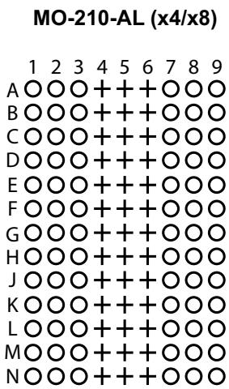  
- Populated ball
- Ball not populated

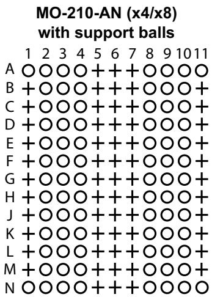  
Figure 1 provides the DDR5 Ball Assignments for the x4/8 component.

NOTE 1 Additional columns and rows of inactive balls in MO-210 Terminal Pattern TBD(x4/x8) with support balls are for mechanical support only, and should not be tied to either electrically high or low.  
NOTE 2 Some of the additional support balls can be selectively populated under the supplier's discretion. Refer to supplier's datasheet.

# 2.5 DDR5 SDRAM X16 Ballout uSing MO-210

Table 2 provides the DDR5 SDRAM X16 Ballout using MO-210.

Table 2 — DDR5 SDRAM X16 Ballout Using MO-210  

<table><tr><td></td><td>1</td><td>2</td><td>3</td><td>4</td><td>5</td><td>6</td><td>7</td><td>8</td><td>9</td></tr><tr><td>A</td><td>LBDQ</td><td>VSS</td><td>VPP</td><td></td><td></td><td></td><td>ZQ</td><td>VSS</td><td>LBDQS</td></tr><tr><td>B</td><td>VDD</td><td>VDDQ</td><td>DQU2</td><td></td><td></td><td></td><td>DQU3</td><td>VDDQ</td><td>VDD</td></tr><tr><td>C</td><td>VSS</td><td>DQU0</td><td>DQSU_t</td><td></td><td></td><td></td><td>DMU_n</td><td>DQU1</td><td>VSS</td></tr><tr><td>D</td><td>VDDQ</td><td>VSS</td><td>DQSU_c</td><td></td><td></td><td></td><td>RFU</td><td>VSS</td><td>VDDQ</td></tr><tr><td>E</td><td>VDD</td><td>DQU4</td><td>DQU6</td><td></td><td></td><td></td><td>DQU7</td><td>DQU5</td><td>VDD</td></tr><tr><td>F</td><td>VDD</td><td>VDDQ</td><td>DQL2</td><td></td><td></td><td></td><td>DQL3</td><td>VDDQ</td><td>VDD</td></tr><tr><td>G</td><td>VSS</td><td>DQL0</td><td>DQSL_t</td><td></td><td></td><td></td><td>DML_n</td><td>DQL1</td><td>VSS</td></tr><tr><td>H</td><td>VDDQ</td><td>VSS</td><td>DQSL_c</td><td></td><td></td><td></td><td>RFU</td><td>VSS</td><td>VDDQ</td></tr><tr><td>J</td><td>VDD</td><td>DQL4</td><td>DQL6</td><td></td><td></td><td></td><td>DQL7</td><td>DQL5</td><td>VDD</td></tr><tr><td>K</td><td>VSS</td><td>VDDQ</td><td>VSS</td><td></td><td></td><td></td><td>VSS</td><td>VDDQ</td><td>VSS</td></tr><tr><td>L</td><td>CAODT</td><td>MIR</td><td>VDD</td><td></td><td></td><td></td><td>CK_t</td><td>VDDQ</td><td>TEN</td></tr><tr><td>M</td><td>ALERT_n</td><td>VSS</td><td>CS_n</td><td></td><td></td><td></td><td>CK_c</td><td>VSS</td><td>VDD</td></tr><tr><td>N</td><td>VDDQ</td><td>CA4</td><td>CA0</td><td></td><td></td><td></td><td>CA1</td><td>CA5</td><td>VDDQ</td></tr><tr><td>P</td><td>VDD</td><td>CA6</td><td>CA2</td><td></td><td></td><td></td><td>CA3</td><td>CA7</td><td>VDD</td></tr><tr><td>R</td><td>VDDQ</td><td>VSS</td><td>CA8</td><td></td><td></td><td></td><td>CA9</td><td>VSS</td><td>VDDQ</td></tr><tr><td>T</td><td>CAI</td><td>CA10</td><td>CA12</td><td></td><td></td><td></td><td>CA13</td><td>CA11</td><td>RESET_n</td></tr><tr><td>U</td><td>VDD</td><td>VSS</td><td>VDD</td><td></td><td></td><td></td><td>VPP</td><td>VSS</td><td>VDD</td></tr></table>

Figure 2 provides the DDR5 Ball Assignments for the x16 component.

# MO-210-TBD (x16)

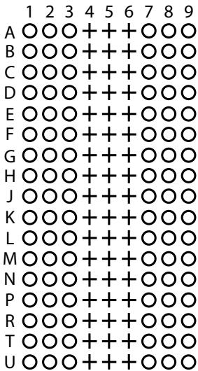  
$\bigcirc$  Populated ball

# MO-210-TBD (x16) with support balls

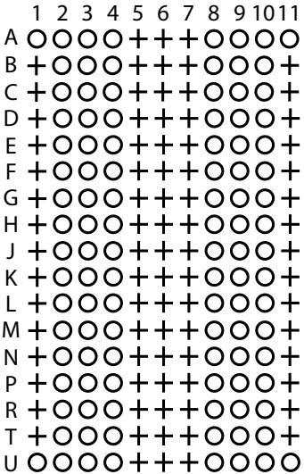  
+ Ball not populated

NOTE 1 Additional columns and rows of inactive balls in MO-210 Terminal Pattern TBD (x16) with support balls are for mechanical support only, and should not be tied to either electrically high or low.  
NOTE 2 Some of the additional support balls can be selectively populated under the supplier's discretion. Refer to supplier's datasheet.

# Figure 2 — DDR5 Ball Assignments for the x16 Component

# 2.6 Pinout Description

Table 3 provides the pinout descriptions.

Table 3 — Pinout Description  

<table><tr><td>Symbol</td><td>Type</td><td>Function</td></tr><tr><td>CK_t, CK_c</td><td>Input</td><td>Clock: CK_t and CK_c are differential clock inputs. All address and control input signals are sampled on the crossing of the positive edge of CK_t and negative edge of CK_c.</td></tr><tr><td>CS_n</td><td>Input</td><td>Chip Select: All commands are masked when CS_n is registered HIGH. CS_n provides for external Rank selection on systems with multiple Ranks. CS_n is considered part of the command code. CS_n is also used to enter and exit the parts from power down modes.</td></tr><tr><td>DM_n, DMU_n, DML_n</td><td>Input</td><td>Input Data Mask: DM_n is an input mask signal for write data. Input data is masked when DM_n is sampled LOW coincident with that input data during a Write access. DM_n is sampled on both edges of DQS. For x8 device, the function of DM_n is enabled by MR5:OP[5]=1. DM is not supported for x4 device.</td></tr><tr><td>CA [13:0]</td><td>Input</td><td>Command/Address Inputs: CA signals provide the command and address inputs according to the Command Truth Table. Note: Since some commands are multi-cycle, the pins may not be interchanged between devices on the same bus.</td></tr><tr><td>RESET_n</td><td>Input</td><td>Active Low Asynchronous Reset: Reset is active when RESET_n is LOW, and inactive when RESET_n is HIGH. RESET_n must be HIGH during normal operation. RESET_n is a CMOS rail to rail signal with DC high and low at 80% and 20% of VDDQ,</td></tr><tr><td>DQ</td><td>Input / Output</td><td>Data Input/Output: Bi-directional data bus. If CRC is enabled via Mode register then CRC code is added at the end of Data Burst.</td></tr><tr><td>DQS_t, DQS_c, DQSU_t, DQSU_c, DQSL_t, DQSL_c</td><td>Input / Output</td><td>Data Strobe: output with read data, input with write data. Edge-aligned with read data, centered in write data. For the x16, DQSL corresponds to the data on DQL0-DQL7; DQSU corresponds to the data on DQU0-DQU7. The data strobe DQS_t, DQSL_t and DQSU_t are paired with differential signals DQS_c, DQSL_c, and DQSU_c, respectively, to provide differential pair signaling to the system during reads and writes. DDR5 SDRAM supports differential data strobe only and does not support single-ended.</td></tr><tr><td>TDQS_t, TDQS_c</td><td>Output</td><td>Termination Data Strobe: TDQS_t/TDQS_c is applicable for x8 DRAMs only. When enabled via MR5:OP[4]=1, the DRAM shall enable the same termination resistance function on TDQS_t/TDQS_c that is applied to DQS_t/DOQ_c. When disabled via MR5:OP[4]=0, DM_n/DOQ_t shall provide the data mask function depending on MR5:OP[5]; TDQS_c is not used. x4/x16 DRAMs must disable the TDQS function via MR5:OP[4]=0.</td></tr><tr><td>ALERT_n</td><td>Input/Output</td><td>Alert: If there is error in CRC, then Alert_n goes LOW for the period time interval and goes back HIGH. During Connectivity Test mode, this pin works as input. Using this signal or not is dependent on system. In case of not connected as Signal, ALERT_n Pin must be bounded to VDDQ on board.</td></tr><tr><td>TEN</td><td>Input</td><td>Connectivity Test Mode Enable: Required on x4, x8 &amp; x16 devices. HIGH in this pin shall enable Connectivity Test Mode operation along with other pins. It is a CMOS rail to rail signal with AC high and low at 80% and 20% of VDDQ. Using this signal or not is dependent on System. This pin may be DRAM internally pulled low through a weak pull-down resistor to VSS.</td></tr><tr><td>MIR</td><td>Input</td><td>Mirror: Used to inform SDRAM device that it is being configured for Mirrored mode vs. Standard mode. With the MIR pin connected to VDDQ, the SDRAM internally swaps even numbered CA with the next higher odd number CA. Normally the MIR pin must be tied to VSSQ if no CA mirror is required. Mirror pair examples: CA2 with CA3 (not CA1) CA4 with CA5 (not CA3). Note that the CA[13] function is only relevant for certain densities (including stacking) of DRAM component. In the case that CA[13] is not used, its ball location, considering whether MIR is used or not, should be connected to VDDQ</td></tr><tr><td>CAI</td><td>Input</td><td>Command &amp; Address Inversion: With the CAI pin connected to VDDQ, DRAM internally inverts the logic level present on all the CA signals. Normally the CAI pin must be connected to VSSQ if no CA inversion is required.</td></tr><tr><td>CA_ODT</td><td>Input</td><td>ODT for Command and Address. Apply Group A settings if the pin is connected to VSS and apply Group B settings if the pin is connected to VDDQ.</td></tr><tr><td>LBDQ</td><td>Output</td><td>Loopback Data Output: The output of this device on the Loopback Output Select defined in MR53:OP[4:0]. When Loopback is enabled, it is in driver mode using the default RON described in the Loopback Function section. When Loopback is disabled, the pin is either terminated or HiZ based on MR36:OP[2:0].</td></tr></table>

Table 3 — Pinout Description (Cont'd)  

<table><tr><td>Symbol</td><td>Type</td><td>Function</td></tr><tr><td>LBDQS</td><td>Output</td><td>Loopback Data Strobe: This is a single ended strobe with the Rising edge-aligned with Loopback data edge, falling edge aligned with data center. When Loopback is enabled, it is in driver mode using the default RON described in the Loopback Function section. When Loopback is disabled, the pin is either terminated or HiZ based on MR36:OP[2:0].</td></tr><tr><td>RFU</td><td>Input/Output</td><td>Reserved for future use</td></tr><tr><td>NC</td><td></td><td>No Connect: No internal electrical connection is present.</td></tr><tr><td>VDDQ</td><td>Supply</td><td>DQ Power Supply: 1.1 V</td></tr><tr><td>VSSQ</td><td>Supply</td><td>DQ Ground</td></tr><tr><td>VDD</td><td>Supply</td><td>Power Supply: 1.1 V</td></tr><tr><td>VSS</td><td>Supply</td><td>Ground</td></tr><tr><td>VPP</td><td>Supply</td><td>DRAM Activating Power Supply: 1.8V</td></tr><tr><td>ZQ</td><td>Supply</td><td>Reference Pin for ZQ calibration</td></tr></table>

# 2.7 DDR5 SDRAM Addressing

Tables 4-8 provide the addressing for 8, 16, 24, 32, and 65 Gb.

Table 4 - 8 Gb Addressing Table  

<table><tr><td colspan="2">Configuration</td><td>2 Gb x4</td><td>1 Gb x8</td><td>512 Mb x16</td></tr><tr><td rowspan="3">Bank Address</td><td>BG Address</td><td>BG0~BG2</td><td>BG0~BG2</td><td>BG0~BG1</td></tr><tr><td>Bank Address in a BG</td><td>BA0</td><td>BA0</td><td>BA0</td></tr><tr><td># BG / # Banks per BG / # Banks</td><td>8 / 2 / 16</td><td>8 / 2 / 16</td><td>4 / 2 / 8</td></tr><tr><td colspan="2">Row Address</td><td>R0~R15</td><td>R0~R15</td><td>R0~R15</td></tr><tr><td colspan="2">Column Address</td><td>C0~C10</td><td>C0~C9</td><td>C0~C9</td></tr><tr><td colspan="2">Page size</td><td>1KB</td><td>1KB</td><td>2KB</td></tr><tr><td colspan="2">Chip IDs / Maximum Stack Height</td><td>CID0~3 / 16H</td><td>CID0~3 / 16H</td><td>CID0~3 / 16H</td></tr></table>

Table 5 — 16 Gb Addressing Table  

<table><tr><td colspan="2">Configuration</td><td>4 Gb x4</td><td>2 Gb x8</td><td>1 Gb x16</td></tr><tr><td rowspan="3">Bank Address</td><td>BG Address</td><td>BG0~BG2</td><td>BG0~BG2</td><td>BG0~BG1</td></tr><tr><td>Bank Address in a BG</td><td>BA0~BA1</td><td>BA0~BA1</td><td>BA0~BA1</td></tr><tr><td># BG / # Banks per BG / # Banks</td><td>8 / 4 / 32</td><td>8 / 4 / 32</td><td>4 / 4 / 16</td></tr><tr><td colspan="2">Row Address</td><td>R0~R15</td><td>R0~R15</td><td>R0~R15</td></tr><tr><td colspan="2">Column Address</td><td>C0~C10</td><td>C0~C9</td><td>C0~C9</td></tr><tr><td colspan="2">Page size</td><td>1KB</td><td>1KB</td><td>2KB</td></tr><tr><td colspan="2">Chip IDs / Maximum Stack Height</td><td>CID0~3 / 16H</td><td>CID0~3 / 16H</td><td>CID0~3 / 16H</td></tr></table>

Table 6 — 24 Gb Addressing Table  

<table><tr><td colspan="2">Configuration</td><td>6 Gb x4</td><td>3 Gb x8</td><td>1.5 Gb x16</td></tr><tr><td rowspan="3">Bank Address</td><td>BG Address</td><td>BG0~BG2</td><td>BG0~BG2</td><td>BG0~BG1</td></tr><tr><td>Bank Address in a BG</td><td>BA0~BA1</td><td>BA0~BA1</td><td>BA0~BA1</td></tr><tr><td># BG / # Banks per BG / # Banks</td><td>8 / 4 / 32</td><td>8 / 4 / 32</td><td>4 / 4 / 16</td></tr><tr><td colspan="2">Row Address</td><td>R0~R16</td><td>R0~R16</td><td>R0~R16</td></tr><tr><td colspan="2">Column Address</td><td>C0~C10</td><td>C0~C9</td><td>C0~C9</td></tr><tr><td colspan="2">Page size</td><td>1KB</td><td>1KB</td><td>2KB</td></tr><tr><td colspan="2">Chip IDs / Maximum Stack Height</td><td>CID0~3 / 16H</td><td>CID0~3 / 16H</td><td>CID0~3 / 16H</td></tr><tr><td colspan="5">NOTE Row address R[16:15] of 00b, 01b, and 10b are valid. Row address R[16:15] of 11b is invalid.</td></tr></table>

# 2.7 DDR5 SDRAM Addressing (Cont'd)

Table 7-32 Gb Addressing Table  

<table><tr><td colspan="2">Configuration</td><td>8 Gb x4</td><td>4 Gb x8</td><td>2 Gb x16</td></tr><tr><td rowspan="3">Bank Address</td><td>BG Address</td><td>BG0~BG2</td><td>BG0~BG2</td><td>BG0~BG1</td></tr><tr><td>Bank Address in a BG</td><td>BA0~BA1</td><td>BA0~BA1</td><td>BA0~BA1</td></tr><tr><td># BG / # Banks per BG / # Banks</td><td>8 / 4 / 32</td><td>8 / 4 / 32</td><td>4 / 4 / 16</td></tr><tr><td colspan="2">Row Address</td><td>R0~R16</td><td>R0~R16</td><td>R0~R16</td></tr><tr><td colspan="2">Column Address</td><td>C0~C10</td><td>C0~C9</td><td>C0~C9</td></tr><tr><td colspan="2">Page size</td><td>1KB</td><td>1KB</td><td>2KB</td></tr><tr><td colspan="2">Chip IDs / Maximum Stack Height</td><td>CID0~3 / 16H</td><td>CID0~3 / 16H</td><td>CID0~3 / 16H</td></tr></table>

Table 8-64 Gb Addressing Table  

<table><tr><td colspan="2">Configuration</td><td>16 Gb x4</td><td>8 Gb x8</td><td>4 Gb x16</td></tr><tr><td rowspan="3">Bank Address</td><td>BG Address</td><td>BG0~BG2</td><td>BG0~BG2</td><td>BG0~BG1</td></tr><tr><td>Bank Address in a BG</td><td>BA0~BA1</td><td>BA0~BA1</td><td>BA0~BA1</td></tr><tr><td># BG / # Banks per BG / # Banks</td><td>8 / 4 / 32</td><td>8 / 4 / 32</td><td>4 / 4 / 16</td></tr><tr><td colspan="2">Row Address</td><td>R0~R17</td><td>R0~R17</td><td>R0~R17</td></tr><tr><td colspan="2">Column Address</td><td>C0~C10</td><td>C0~C9</td><td>C0~C9</td></tr><tr><td colspan="2">Page size</td><td>1KB</td><td>1KB</td><td>2KB</td></tr><tr><td colspan="2">Chip IDs / Maximum Stack Height</td><td>CID0~2 / 8H</td><td>CID0~2 / 8H</td><td>CID0~2 / 8H</td></tr></table>

# 3 Functional Description

# 3.1 Simplified State Diagram

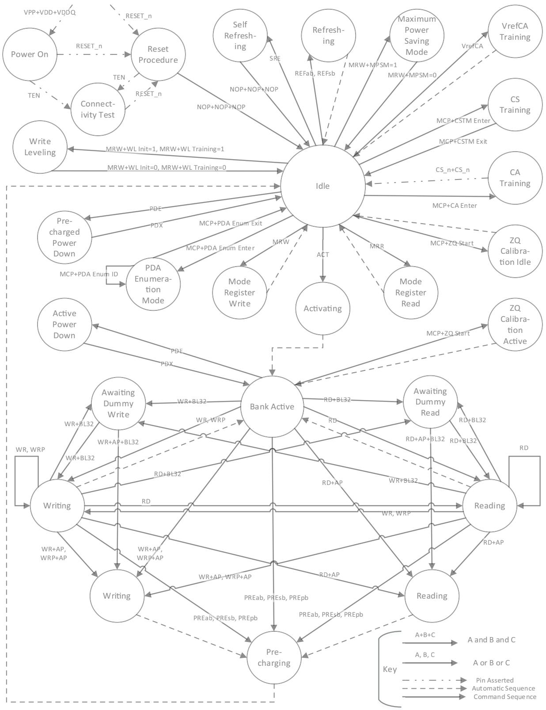

# 3.2 Basic Functionality

The DDR5 SDRAM is a high-speed dynamic random-access memory. To ease transition from DDR4 to DDR5, the introductory density (8Gb) shall be internally configured as 16-bank, 8 bank group with 2 banks for each bank group for x4/x8 and 8-bank, 4 bank group with 2 banks for each bankgroup for x16 DRAM. When the industry transitions to higher densities  $(= >16\mathrm{Gb})$  , it doubles the bank resources and internally be configured as 32-bank, 8 bank group with 4 banks for each bank group for x4/x8 and 16-bank, 4 bank group with 4 banks for each bankgroup for x16 DRAM.

The DDR5 SDRAM uses a 16n prefetch architecture to achieve high-speed operation. The 16n prefetch architecture is combined with an interface designed to transfer two data words per clock cycle at the I/O pins. A single read or write operation for the DDR5 SDRAM consists of a single 16n-bit wide, eight clock data transfer at the internal DRAM core and sixteen corresponding n-bit wide, one-half clock cycle data transfers at the I/O pins.

Read and write operation to the DDR5 SDRAM are burst oriented, start at a selected location, and continue for a burst length of sixteen or a 'chopped' burst of eight in a programmed sequence. Operation begins with the registration of an ACTIVATE Command, which is then followed by a Read or Write command. The address bits registered with the ACTIVATE Command are used to select the bank and row to be activated (i.e., in a 16Gb part, BG0-BG2 in a x4/8 and BG0-BG1 in x16 select the bankgroup; BA0-BA1 select the bank; R0-R17 select the row; refer to Section 2.7 for specific requirements). The address bits registered with the Read or Write command are used to select the starting column location for the burst operation, determine if the auto precharge command is to be issued (CA10=L), and select BC8 on-the-fly (OTF), fixed BL16, fixed BL32 (optional), or BL32 OTF (optional) mode if enabled in the mode register.

Prior to normal operation, the DDR5 SDRAM must be powered up and initialized in a predefined manner.

The following sections provide detailed information covering device reset and initialization, register definition, command descriptions, and device operation.

# 3.3 RESET and Initialization Procedure

For power-up and reset initialization, in order to prevent DRAM from functioning improperly, default values for the following MR settings need to be defined. See Table 9.

Table 9 - MR Default Settings  

<table><tr><td>Item</td><td>Mode Register</td><td>Default Setting</td><td>Description</td></tr><tr><td>Burst Length</td><td>MR0 OP[1:0]</td><td>00B</td><td>BL16</td></tr><tr><td>Read Latency</td><td>MR0 OP[6:2]</td><td>00010B</td><td>RL(CL) = 26 @3200</td></tr><tr><td>Write Latency</td><td>n/a</td><td>WL=RL-2 (CWL=CL-2)</td><td>Fixed based on RL (CL)</td></tr><tr><td>Write Recovery (tWR)</td><td>MR6 OP[3:0]</td><td>0000B</td><td>WR = 48nCK @3200 or 30ns</td></tr><tr><td>Read to Precharge Delay (tRTP)</td><td>MR6 OP[7:4]</td><td>0000B</td><td>tRTP=12nCK @3200 or 7.5ns</td></tr><tr><td>VrefDQ Value</td><td>MR10</td><td>0010 1101B</td><td>VREF(DQ) Range: 75% of VDDQ</td></tr><tr><td>VrefCA Value</td><td>MR11</td><td>0010 1101B</td><td>VREF(CA) Range: 75% of VDDQ</td></tr><tr><td>VrefCS Value</td><td>MR12</td><td>0010 1101B</td><td>VREF(CS) Range: 75% of VDDQ</td></tr><tr><td>ECS Error Threshold Count (ETC)</td><td>MR15</td><td>011B</td><td>256</td></tr><tr><td>Post Package Repair</td><td>MR23 OP[1:0]</td><td>00B</td><td>hPPR &amp; sPPR Disabled</td></tr><tr><td>CK ODT</td><td>MR32 OP[2:0]</td><td>CK ODT is based on strap value</td><td>Group A= RTT_OFF=000B
Group B= 40 Ohms=111B</td></tr><tr><td>CS ODT</td><td>MR32 OP[5:3]</td><td>CS ODT is based on strap value</td><td>Group A= RTT_OFF=000B
Group B= 40 Ohms=111B</td></tr><tr><td>CA ODT</td><td>MR33 OP[2:0]</td><td>CA ODT is based on strap value</td><td>Group A= RTT_OFF=000B
Group B= 80 Ohms=100B</td></tr></table>

Table 9 - MR Default Settings (Cont'd)  

<table><tr><td>Item</td><td>Mode Register</td><td>Default Setting</td><td>Description</td></tr><tr><td>DQS_RTT_PARK</td><td>MR33 OP[5:3]</td><td>000B</td><td>RTT OFF</td></tr><tr><td>RTT_PARK</td><td>MR34 OP[2:0]</td><td>000B</td><td>RTT OFF</td></tr><tr><td>RTT_WR</td><td>MR34 OP[5:3]</td><td>001B</td><td>240 Ohm</td></tr><tr><td>RTT_NOM_WR</td><td>MR35 OP[2:0]</td><td>011B</td><td>80 Ohm</td></tr><tr><td>RTT_NOM_RD</td><td>MR35 OP[5:3]</td><td>011B</td><td>80 Ohm</td></tr><tr><td>RTT Loopback</td><td>MR36 OP[2:0]</td><td>000B</td><td>RTT OFF</td></tr></table>

# 3.3.1 Power-up Initialization Sequence

The following sequence shall be used to power up the DDR5 device. Unless specified otherwise, these steps are mandatory. Power supply voltage ramp requirements are provided in Table 10. Figure 3 provides the RESET_n and Initialization Sequence at Power-on Ramping. Table 11 provides the initialization timing parameters.

1 While applying power (after  $\mathrm{T_a}$ ), RESET_n is recommended to be LOW ( $\leq 0.2$  x VDDQ) and all other inputs may be undefined. The device outputs remain disabled while RESET_n is held LOW. VPP must ramp at the same time or earlier than VDD.

Table 10 — Voltage Ramp Conditions  

<table><tr><td>After</td><td>Application Conditions</td></tr><tr><td>Ta is reached</td><td>VPP must be greater than VDD - TBD mV</td></tr><tr><td colspan="2">NOTE 1 Ta is the point when any power supply first reaches 300mV
NOTE 2 Voltage ramp conditions in Table 9 apply between (Ta) and Power-off (controlled or uncontrolled).
NOTE 3 Tb is the point at which all supply and reference voltages are within their defined ranges.
NOTE 4 Power ramp duration (Tb-Ta) must not exceed tINIT0.</td></tr></table>

2 Following the completion of the voltage ramp  $(\mathrm{T_b})$ , RESET_n must be maintained LOW. DQ, DQS_t, DQS_c, voltage levels must be between VSSQ and VDDQ to avoid latch-up. CS_n, CK_t, CK_c and CA input levels must be between VSS and VDDQ to avoid latch-up.  
3 Beginning at  $T_{b}$ , RESET_n must be maintained LOW for a minimum of tINIT1 ( $T_{b}$  to  $T_{c}$ ), after which RESET_n may be deasserted to HIGH ( $T_{c}$ ). At least tINIT2 before RESET_n de-assertion, CS_n is required to be set LOW. All other input signals are "Don't Care". The DRAM shall support the ability for RESET_n to be held indefinitely.

# 3.3.1 Power-up Initialization Sequence (Cont'd)

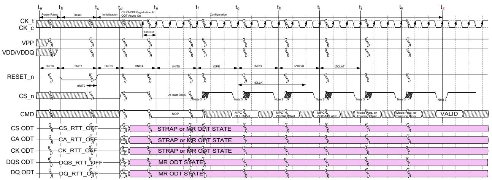

NOTE 1 From time point  $(\mathrm{T_d})$  until  $(\mathrm{T_e})$ , the command bus must be held high.  
NOTE 2 From time point  $(\mathrm{T_e})$  until  $(\mathrm{T_f})$ , NOP commands must be applied on the command bus.  
NOTE 3 From time point  $(\mathrm{T_f})$  until  $(\mathrm{T_z})$ , DES commands must be applied between legal commands (MRR/MRW/MPC & VREFCA).  
NOTE 4 MRW Commands must be issued to all Mode Registers that require defined settings.  
NOTE 5 Default ODT tolerances are wider prior to ZQ calibration.  
NOTE 6 Prior to ZQcal completion  $(\mathrm{T_j})$ , MPC commands shall be multi-cycle as described in the MPC command Timings section.

# Figure 3 — RESET_n and Initialization Sequence at Power-on Ramping

4 After RESET_n is de-asserted  $(\mathrm{T_c})$ , wait at least tINIT3 before driving CS_n high.  
After setting CS_n high  $(\mathrm{T_d})$ , wait a minimum of tINIT4 to allow the DRAM CMOS based receiver to register the exit and allow the CS_n, CK, CA, DQ and DQS ODT to go to the defined strap or MRS state  $(\mathrm{T_e})$ . Clock (CK_t, CK_c) is required to be started and stabilized for tCKSRX before exit of tINIT4  $(\mathrm{T_e})$ . Upon the completion of  $\mathrm{T_e}$ , all ODT states (CA, CS_n, CK, DQ and DQS ODT) should be valid and the DRAM's CS_n receiver should no longer be in its CMOS based mode. ODT termination states will be uncalibrated until completion of ZQcal at  $(\mathrm{T_j})$  
6 Upon  $\mathrm{T_e}$ , NOP commands must be issued for a minimum of tINIT5 to conclude exit of initialization process and start tXPR timer at  $(\mathrm{T_f})$ . The system must wait at least tXPR before issuing any legal configuration commands  $(\mathrm{T_g})$ . During configuration, only MRR, MRW, MPC and VREFCA commands are legal.  
7 Between  $(\mathrm{T_g}$  to  $\mathrm{T_j})$  , the following initial configuration modes must be completed prior to other training modes:

- MPC for setting MR13 (tCCD/tDLLK) must be issued before the MPC command to reset the DLL.  
- MPC to execute DLL RESET must be issued before ZQCal Start  
- MPC to execute ZQCal Start and ZQCal Latch must be issued before any other training modes such as CS Training

8 Between  $(\mathrm{T_j}$  to  $\mathrm{T_z})$ , any number of legal configuration commands are allowed. Training based commands are optional and may be done at the system architect's discretion and may vary depending on the systems, though proper setting of certain registers, such as those related to Write Leveling Training, is required.

9 After  $(\mathrm{T_z})$ , and the completion of any training or calibration timing parameters (i.e., tZQLAT is satisfied), the DDR5 device is ready for normal operation and is able to accept any valid command. Any additional mode registers that have not previously been set up for normal operation should be written at this time.

# 3.3.1 Power-up Initialization Sequence (Cont'd)

Table 11 — Initialization Timing Parameters  

<table><tr><td rowspan="2">Parameter</td><td rowspan="2">Symbol</td><td colspan="2">Value</td><td rowspan="2">Units</td><td rowspan="2">Notes</td></tr><tr><td>MIN</td><td>MAX</td></tr><tr><td>Maximum voltage-ramp time</td><td>tINIT0</td><td>-</td><td>20</td><td>ms</td><td></td></tr><tr><td>Minimum RESET_n LOW time after completion of voltage ramp</td><td>tINIT1</td><td>200</td><td></td><td>μs</td><td></td></tr><tr><td>Minimum CS_n LOW time before RESET_n HIGH</td><td>tINIT2</td><td>10</td><td>-</td><td>ns</td><td></td></tr><tr><td>Minimum CS_n LOW time after RESET_n HIGH</td><td>tINIT3</td><td>4</td><td>-</td><td>ms</td><td></td></tr><tr><td>Minimum time for DRAM to register EXIT on CS_n with CMOS.</td><td>tINIT4</td><td>2</td><td>-</td><td>μs</td><td></td></tr><tr><td>Minimum cycles required after CS_n HIGH</td><td>tINIT5</td><td>3</td><td>-</td><td>nCK</td><td>1</td></tr><tr><td>Minimum time from Exit Reset to first valid Configuration Command</td><td>tXPR</td><td>tXS</td><td>-</td><td>ns</td><td></td></tr><tr><td>Minimum stable clock time</td><td>tCKSRX</td><td colspan="2">See Self Refresh Timing Table</td><td></td><td></td></tr><tr><td colspan="6">NOTE 1 Min number of NOP commands issued after CS_n High (tINIT4)</td></tr></table>

# 3.3.2 Reset Initialization with Stable Power

The following sequence is required for RESET at no power interruption initialization as shown in Figure 4 and Table 12.

1 Assert RESET_n below 0.2 x VDDQ anytime when reset is needed. RESET_n needs to be maintained for a minimum of tPW_RESET. CS_n must be pulled LOW at least tINIT2 before de-asserting RESET_n.  
2 Repeat steps 4 to 9 in Section 3.3.1

Figure 4 — Reset Procedure at Power Stable  
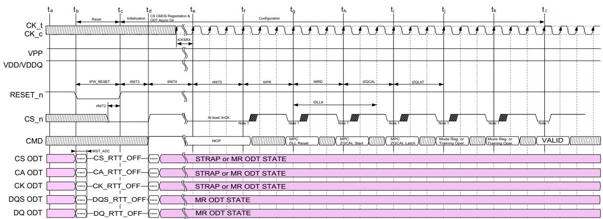  
NOTE 1 From time point  $(\mathrm{T_d})$  until  $(\mathrm{T_e})$ , the command bus must be held high.  
NOTE 2 From time point  $(\mathrm{T_e})$  until  $(\mathrm{T_f})$ , NOP commands must be applied on the command bus.  
NOTE 3 From time point  $(\mathrm{T_f})$  until  $(\mathrm{T_z})$ , DES commands must be applied between legal commands (MRR/MRW/MPC & VREFCA).  
NOTE 4 MRW Commands must be issued to all Mode Registers that require defined settings.

# 3.3.2 Reset Initialization with Stable Power (Cont'd)

Table 12 — Reset Timing Parameters  

<table><tr><td rowspan="2">Parameter</td><td rowspan="2">Symbol</td><td colspan="2">Value</td><td rowspan="2">Units</td><td rowspan="2">Notes</td></tr><tr><td>MIN</td><td>MAX</td></tr><tr><td>Minimum RESET_n low time for Reset Initialization with stable power</td><td>tPW_RESET</td><td>1</td><td>-</td><td>μS</td><td></td></tr><tr><td>Maximum time after RESET_n assertion to ODT off</td><td>tRST_ADC</td><td>-</td><td>50</td><td>nS</td><td></td></tr></table>

# 3.3.3 Input Voltage Power-up and Power-Down Sequence

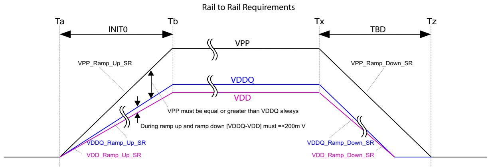  
Figure 5 provides the requirements for the voltage ramp control. Table 13 provides the input voltage slew rates.  
Figure 5 — Requirement for Voltage Ramp Control

Table 13 — Input Voltage Slew Rates  

<table><tr><td>Description</td><td>Symbol</td><td>Min</td><td>Max</td><td>Units</td><td>Notes</td></tr><tr><td rowspan="2">VPP Rail</td><td>VPP_Ramp_Up_SR</td><td>0.2</td><td>5</td><td>V/ms</td><td rowspan="6">1,2,3,4,5</td></tr><tr><td>VPP_Ramp_Down_SR</td><td>0.1</td><td>4.5</td><td>V/ms</td></tr><tr><td rowspan="2">VDD Rail</td><td>VDD_Ramp_Up_SR</td><td>0.1</td><td>4.5</td><td>V/ms</td></tr><tr><td>VDD_Ramp_Down_SR</td><td>0.1</td><td>4.5</td><td>V/ms</td></tr><tr><td rowspan="2">VDDQ Rail</td><td>VDDQ_Ramp_Up_SR</td><td>0.1</td><td>4.5</td><td>V/ms</td></tr><tr><td>VDDQ_Ramp_Down_SR</td><td>0.1</td><td>4.5</td><td>V/ms</td></tr><tr><td colspan="6">NOTE 1 Both VDD and VPP supply measurements made between 10% &amp; 90% nominal voltage
NOTE 2 MHz bandwidth limited measurement
NOTE 3 VPP must be equal to or greater than VDD/VDDQ at all times.
NOTE 4 During ramp up and ramp down [VDDQ-VDD] must be equal or less than 200mV.
NOTE 5 After tINIT0, all supplies must be within their specified tolerance, as defined in the DC Operating Tables.</td></tr></table>

# 3.4 Mode Register Definition

# 3.4.1 Mode Register Read (MRR)

The Mode Register Read (MRR) command is used to read configuration and status data from the DDR5-SDRAM registers. The MRR command is initiated with CS_n and CA[13:0] in the proper state as defined by the Command Truth Table. The mode register address operands (MA[7:0]) allow the user to select one of 256 registers. The mode register contents are available on the second 8 UI's of the burst and are repeated across all DQ's after the RL following the MRR command. To avoid a potentially worst-case pattern, every odd DQ bit (represented with!) shall have its contents inverted. Data in the burst (BL0-7) shall be either "0" or "1", with "1" indicating that the content of the later UI's (BL8-15) are inverted.

DQS is toggled for the duration of the MRR burst. The MRR has a command burst length 16. MRR termination control and ODT timings are the same as for the READ command. The MRR operation must not be interrupted. Non-Target ODT encoding is available for MRR, just like a normal READ. NT ODT MRR termination control and ODT timings are the same as for the READ NT command.

In the case that CRC is enabled, MRR's output will come with BL18 (BL16 plus 2 CRC-bit), but the host has the option to consider the 17th and 18th bits "don't care" for MRR handling. Regardless on if the host uses the 17th and 18th bits, while CRC is enabled, the strobe needs to toggle for BL18.

Figure 6 provides mode register read timing. Tables 14 through 19 provide through DQ output mapping for various devices.

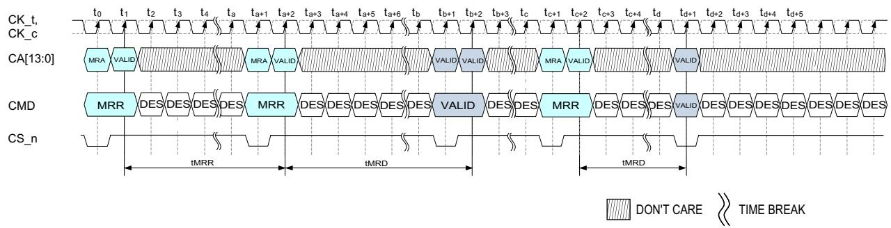  
Figure 6 - Mode Register Read Timing

Table 14 — DQ Output Mapping for x4 Device  

<table><tr><td>BL</td><td>0-7</td><td>8</td><td>9</td><td>10</td><td>11</td><td>12</td><td>13</td><td>14</td><td>15</td></tr><tr><td>DQ0</td><td>0</td><td>OP0</td><td>OP1</td><td>OP2</td><td>OP3</td><td>OP4</td><td>OP5</td><td>OP6</td><td>OP7</td></tr><tr><td>DQ1</td><td>1</td><td>!OP0</td><td>!OP1</td><td>!OP2</td><td>!OP3</td><td>!OP4</td><td>!OP5</td><td>!OP6</td><td>!OP7</td></tr><tr><td>DQ2</td><td>0</td><td>OP0</td><td>OP1</td><td>OP2</td><td>OP3</td><td>OP4</td><td>OP5</td><td>OP6</td><td>OP7</td></tr><tr><td>DQ3</td><td>1</td><td>!OP0</td><td>!OP1</td><td>!OP2</td><td>!OP3</td><td>!OP4</td><td>!OP5</td><td>!OP6</td><td>!OP7</td></tr><tr><td colspan="10">NOTE The read pre-amble and post-amble of MRR are same as normal read.</td></tr></table>

# 3.4.1 Mode Register Read (MRR) (Cont'd)

Table 15—DQ Output Mapping for x8 Device  

<table><tr><td>BL</td><td>0-7</td><td>8</td><td>9</td><td>10</td><td>11</td><td>12</td><td>13</td><td>14</td><td>15</td></tr><tr><td>DQ0</td><td>0</td><td>OP0</td><td>OP1</td><td>OP2</td><td>OP3</td><td>OP4</td><td>OP5</td><td>OP6</td><td>OP7</td></tr><tr><td>DQ1</td><td>1</td><td>!OP0</td><td>!OP1</td><td>!OP2</td><td>!OP3</td><td>!OP4</td><td>!OP5</td><td>!OP6</td><td>!OP7</td></tr><tr><td>DQ2</td><td>0</td><td>OP0</td><td>OP1</td><td>OP2</td><td>OP3</td><td>OP4</td><td>OP5</td><td>OP6</td><td>OP7</td></tr><tr><td>DQ3</td><td>1</td><td>!OP0</td><td>!OP1</td><td>!OP2</td><td>!OP3</td><td>!OP4</td><td>!OP5</td><td>!OP6</td><td>!OP7</td></tr><tr><td>DQ4</td><td>0</td><td>OP0</td><td>OP1</td><td>OP2</td><td>OP3</td><td>OP4</td><td>OP5</td><td>OP6</td><td>OP7</td></tr><tr><td>DQ5</td><td>1</td><td>!OP0</td><td>!OP1</td><td>!OP2</td><td>!OP3</td><td>!OP4</td><td>!OP5</td><td>!OP6</td><td>!OP7</td></tr><tr><td>DQ6</td><td>0</td><td>OP0</td><td>OP1</td><td>OP2</td><td>OP3</td><td>OP4</td><td>OP5</td><td>OP6</td><td>OP7</td></tr><tr><td>DQ7</td><td>1</td><td>!OP0</td><td>!OP1</td><td>!OP2</td><td>!OP3</td><td>!OP4</td><td>!OP5</td><td>!OP6</td><td>!OP7</td></tr><tr><td colspan="10">NOTE The read pre-amble and post-amble of MRR are same as normal read.</td></tr></table>

Table 16 — DQ Output Mapping for x16 Device (OSC Count - MR46 & MR47 Only)  

<table><tr><td>BL</td><td>0-7</td><td>8</td><td>9</td><td>10</td><td>11</td><td>12</td><td>13</td><td>14</td><td>15</td></tr><tr><td>DQ0</td><td>0</td><td>OP0</td><td>OP1</td><td>OP2</td><td>OP3</td><td>OP4</td><td>OP5</td><td>OP6</td><td>OP7</td></tr><tr><td>DQ1</td><td>1</td><td>!OP0</td><td>!OP1</td><td>!OP2</td><td>!OP3</td><td>!OP4</td><td>!OP5</td><td>!OP6</td><td>!OP7</td></tr><tr><td>DQ2</td><td>0</td><td>OP0</td><td>OP1</td><td>OP2</td><td>OP3</td><td>OP4</td><td>OP5</td><td>OP6</td><td>OP7</td></tr><tr><td>DQ3</td><td>1</td><td>!OP0</td><td>!OP1</td><td>!OP2</td><td>!OP3</td><td>!OP4</td><td>!OP5</td><td>!OP6</td><td>!OP7</td></tr><tr><td>DQ4</td><td>0</td><td>OP0</td><td>OP1</td><td>OP2</td><td>OP3</td><td>OP4</td><td>OP5</td><td>OP6</td><td>OP7</td></tr><tr><td>DQ5</td><td>1</td><td>!OP0</td><td>!OP1</td><td>!OP2</td><td>!OP3</td><td>!OP4</td><td>!OP5</td><td>!OP6</td><td>!OP7</td></tr><tr><td>DQ6</td><td>0</td><td>OP0</td><td>OP1</td><td>OP2</td><td>OP3</td><td>OP4</td><td>OP5</td><td>OP6</td><td>OP7</td></tr><tr><td>DQ7</td><td>1</td><td>!OP0</td><td>!OP1</td><td>!OP2</td><td>!OP3</td><td>!OP4</td><td>!OP5</td><td>!OP6</td><td>!OP7</td></tr><tr><td>DQ8</td><td>0</td><td>OP0</td><td>OP1</td><td>OP2</td><td>OP3</td><td>OP4</td><td>OP5</td><td>OP6</td><td>OP7</td></tr><tr><td>DQ9</td><td>1</td><td>!OP0</td><td>!OP1</td><td>!OP2</td><td>!OP3</td><td>!OP4</td><td>!OP5</td><td>!OP6</td><td>!OP7</td></tr><tr><td>DQ10</td><td>0</td><td>OP0</td><td>OP1</td><td>OP2</td><td>OP3</td><td>OP4</td><td>OP5</td><td>OP6</td><td>OP7</td></tr><tr><td>DQ11</td><td>1</td><td>!OP0</td><td>!OP1</td><td>!OP2</td><td>!OP3</td><td>!OP4</td><td>!OP5</td><td>!OP6</td><td>!OP7</td></tr><tr><td>DQ12</td><td>0</td><td>OP0</td><td>OP1</td><td>OP2</td><td>OP3</td><td>OP4</td><td>OP5</td><td>OP6</td><td>OP7</td></tr><tr><td>DQ13</td><td>1</td><td>!OP0</td><td>!OP1</td><td>!OP2</td><td>!OP3</td><td>!OP4</td><td>!OP5</td><td>!OP6</td><td>!OP7</td></tr><tr><td>DQ14</td><td>0</td><td>OP0</td><td>OP1</td><td>OP2</td><td>OP3</td><td>OP4</td><td>OP5</td><td>OP6</td><td>OP7</td></tr><tr><td>DQ15</td><td>1</td><td>!OP0</td><td>!OP1</td><td>!OP2</td><td>!OP3</td><td>!OP4</td><td>!OP5</td><td>!OP6</td><td>!OP7</td></tr><tr><td colspan="10">NOTE 1 The read pre-amble and post-amble of MRR are same as normal read. 
NOTE 2 Output map excludes per bit DFE, DCA and VrefDQ mode registers (MR103 through MR255)</td></tr></table>

Table 17 — DQ Output Mapping for x16 Device (DFE Registers Excluded)  

<table><tr><td>BL</td><td>0-7</td><td>8</td><td>9</td><td>10</td><td>11</td><td>12</td><td>13</td><td>14</td><td>15</td></tr><tr><td>DQ0</td><td>0</td><td>OP0</td><td>OP1</td><td>OP2</td><td>OP3</td><td>OP4</td><td>OP5</td><td>OP6</td><td>OP7</td></tr><tr><td>DQ1</td><td>1</td><td>!OP0</td><td>!OP1</td><td>!OP2</td><td>!OP3</td><td>!OP4</td><td>!OP5</td><td>!OP6</td><td>!OP7</td></tr><tr><td>DQ2</td><td>0</td><td>OP0</td><td>OP1</td><td>OP2</td><td>OP3</td><td>OP4</td><td>OP5</td><td>OP6</td><td>OP7</td></tr><tr><td>DQ3</td><td>1</td><td>!OP0</td><td>!OP1</td><td>!OP2</td><td>!OP3</td><td>!OP4</td><td>!OP5</td><td>!OP6</td><td>!OP7</td></tr><tr><td>DQ4</td><td>0</td><td>OP0</td><td>OP1</td><td>OP2</td><td>OP3</td><td>OP4</td><td>OP5</td><td>OP6</td><td>OP7</td></tr><tr><td>DQ5</td><td>1</td><td>!OP0</td><td>!OP1</td><td>!OP2</td><td>!OP3</td><td>!OP4</td><td>!OP5</td><td>!OP6</td><td>!OP7</td></tr><tr><td>DQ6</td><td>0</td><td>OP0</td><td>OP1</td><td>OP2</td><td>OP3</td><td>OP4</td><td>OP5</td><td>OP6</td><td>OP7</td></tr><tr><td>DQ7</td><td>1</td><td>!OP0</td><td>!OP1</td><td>!OP2</td><td>!OP3</td><td>!OP4</td><td>!OP5</td><td>!OP6</td><td>!OP7</td></tr></table>

Table 17 — DQ Output Mapping for x16 Device (DFE Registers Excluded) (Cont'd)  

<table><tr><td>BL</td><td>0-7</td><td>8</td><td>9</td><td>10</td><td>11</td><td>12</td><td>13</td><td>14</td><td>15</td></tr><tr><td>DQ8</td><td rowspan="8" colspan="9">Don&#x27;t Care</td></tr><tr><td>DQ9</td></tr><tr><td>DQ10</td></tr><tr><td>DQ11</td></tr><tr><td>DQ12</td></tr><tr><td>DQ13</td></tr><tr><td>DQ14</td></tr><tr><td>DQ15</td></tr><tr><td colspan="10">NOTE 1 The read pre-amble and post-amble of MRR are same as normal read. 
NOTE 2 Output of mode register data is only duplicated and inverted across the first 8 bits of a x16 device. 
NOTE 3 Output map excludes per bit DFE, DCA and VrefDQ mode registers (MR103 through MR255)</td></tr></table>

Table 18 — DQ Output Mapping for x16 Device (DFE Lower Byte - DQ[0:7], DML)  

<table><tr><td>BL</td><td>0-7</td><td>8</td><td>9</td><td>10</td><td>11</td><td>12</td><td>13</td><td>14</td><td>15</td></tr><tr><td>DQ0</td><td>0</td><td>OP0</td><td>OP1</td><td>OP2</td><td>OP3</td><td>OP4</td><td>OP5</td><td>OP6</td><td>OP7</td></tr><tr><td>DQ1</td><td>1</td><td>!OP0</td><td>!OP1</td><td>!OP2</td><td>!OP3</td><td>!OP4</td><td>!OP5</td><td>!OP6</td><td>!OP7</td></tr><tr><td>DQ2</td><td>0</td><td>OP0</td><td>OP1</td><td>OP2</td><td>OP3</td><td>OP4</td><td>OP5</td><td>OP6</td><td>OP7</td></tr><tr><td>DQ3</td><td>1</td><td>!OP0</td><td>!OP1</td><td>!OP2</td><td>!OP3</td><td>!OP4</td><td>!OP5</td><td>!OP6</td><td>!OP7</td></tr><tr><td>DQ4</td><td>0</td><td>OP0</td><td>OP1</td><td>OP2</td><td>OP3</td><td>OP4</td><td>OP5</td><td>OP6</td><td>OP7</td></tr><tr><td>DQ5</td><td>1</td><td>!OP0</td><td>!OP1</td><td>!OP2</td><td>!OP3</td><td>!OP4</td><td>!OP5</td><td>!OP6</td><td>!OP7</td></tr><tr><td>DQ6</td><td>0</td><td>OP0</td><td>OP1</td><td>OP2</td><td>OP3</td><td>OP4</td><td>OP5</td><td>OP6</td><td>OP7</td></tr><tr><td>DQ7</td><td>1</td><td>!OP0</td><td>!OP1</td><td>!OP2</td><td>!OP3</td><td>!OP4</td><td>!OP5</td><td>!OP6</td><td>!OP7</td></tr><tr><td>DQ8</td><td rowspan="8" colspan="9">Don&#x27;t Care</td></tr><tr><td>DQ9</td></tr><tr><td>DQ10</td></tr><tr><td>DQ11</td></tr><tr><td>DQ12</td></tr><tr><td>DQ13</td></tr><tr><td>DQ14</td></tr><tr><td>DQ15</td></tr><tr><td colspan="10">NOTE 1 The read pre-amble and post-amble of MRR are same as normal read. 
NOTE 2 Output of mode register data is only duplicated and inverted across the first 8 bits of a x16 device when reading from a DFE register associated with a lower byte DQ or DML. 
NOTE 3 Output map is ONLY for per bit DFE, DCA and VrefDQ mode registers (MR103 through MR255)</td></tr></table>

Table 19 — DQ Output Mapping for x16 Device (DFE Upper Byte - DQ[15:8], DMU)  

<table><tr><td>BL</td><td>0-7</td><td>8</td><td>9</td><td>10</td><td>11</td><td>12</td><td>13</td><td>14</td><td>15</td></tr><tr><td>DQ0</td><td rowspan="8" colspan="9">Don&#x27;t Care</td></tr><tr><td>DQ1</td></tr><tr><td>DQ2</td></tr><tr><td>DQ3</td></tr><tr><td>DQ4</td></tr><tr><td>DQ5</td></tr><tr><td>DQ6</td></tr><tr><td>DQ7</td></tr><tr><td>DQ8</td><td>0</td><td>OP0</td><td>OP1</td><td>OP2</td><td>OP3</td><td>OP4</td><td>OP5</td><td>OP6</td><td>OP7</td></tr><tr><td>DQ9</td><td>1</td><td>!OP0</td><td>!OP1</td><td>!OP2</td><td>!OP3</td><td>!OP4</td><td>!OP5</td><td>!OP6</td><td>!OP7</td></tr><tr><td>DQ10</td><td>0</td><td>OP0</td><td>OP1</td><td>OP2</td><td>OP3</td><td>OP4</td><td>OP5</td><td>OP6</td><td>OP7</td></tr><tr><td>DQ11</td><td>1</td><td>!OP0</td><td>!OP1</td><td>!OP2</td><td>!OP3</td><td>!OP4</td><td>!OP5</td><td>!OP6</td><td>!OP7</td></tr></table>

Table 19 — DQ Output Mapping for x16 Device (DFE Upper Byte - DQ[15:8], DMU) (Cont'd)  

<table><tr><td>BL</td><td>0-7</td><td>8</td><td>9</td><td>10</td><td>11</td><td>12</td><td>13</td><td>14</td><td>15</td></tr><tr><td>DQ12</td><td>0</td><td>OP0</td><td>OP1</td><td>OP2</td><td>OP3</td><td>OP4</td><td>OP5</td><td>OP6</td><td>OP7</td></tr><tr><td>DQ13</td><td>1</td><td>!OP0</td><td>!OP1</td><td>!OP2</td><td>!OP3</td><td>!OP4</td><td>!OP5</td><td>!OP6</td><td>!OP7</td></tr><tr><td>DQ14</td><td>0</td><td>OP0</td><td>OP1</td><td>OP2</td><td>OP3</td><td>OP4</td><td>OP5</td><td>OP6</td><td>OP7</td></tr><tr><td>DQ15</td><td>1</td><td>!OP0</td><td>!OP1</td><td>!OP2</td><td>!OP3</td><td>!OP4</td><td>!OP5</td><td>!OP6</td><td>!OP7</td></tr><tr><td colspan="10">NOTE 1 The read pre-amble and post-amble of MRR are same as normal read. 
NOTE 2 Output of mode register data is only duplicated and inverted across the last 8 bits of a x16 device when reading from a DFE register associated with an upper byte DQ or DMU. 
NOTE 3 Output map is ONLY for per bit DFE, DCA and VrefDQ mode registers (MR103 through MR255)</td></tr></table>

# 3.4.2 Mode Register WRITE (MRW)

The Mode Register Write (MRW) command is used to write configuration data to the mode registers. Figure 7 provides mode register write timing.

The MRW command is initiated with CS_n and CA[13:0] in the proper state as defined by the Command Truth Table. The mode register address and the data written to the mode registers is contained in CA[13:0] according to the Command Truth Table. The MRW command period is defined by tMRW. Mode register Writes to read-only registers have no impact on the functionality of the device.

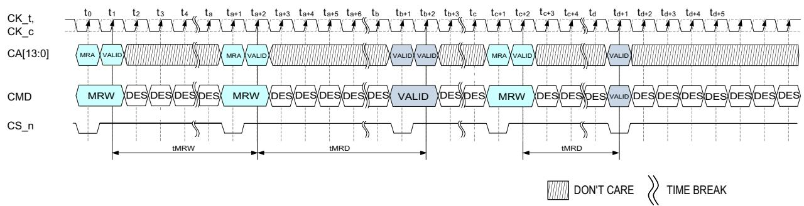  
Figure 7 — Mode Register Write Timing

# 3.4.3 DFE Mode Register Write Update Timing

This Mode Register update timing parameter applies for MR112 (MA[7:0]=70H) through MR248 (MA[7:0]=F8H) - Mode Registers for DFE including DFE Gain Bias, DFE Tap-1, DFE Tap-2, DFE Tap-3, DFE Tap-4 mode registers. Figure 8 provides DFE update setting.

# 3.4.3 DFE Mode Register Write Update Timing (Cont'd)

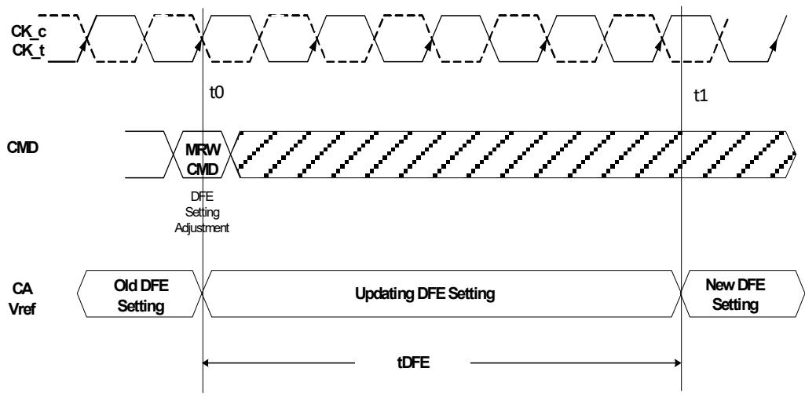  
Figure 8—DFE Update Setting

# 3.4.4 Mode Register Truth Tables and Timing Constraints

Table 20 provides mode register read/write AC timings.

Table 20 — Mode Register Read/Write AC timing  

<table><tr><td>Parameter</td><td>Symbol</td><td>Min/Max</td><td>Value</td><td>Unit</td><td>Note</td></tr><tr><td>Mode Register Read command period</td><td>tMRR</td><td>Min</td><td>max(14ns, 16nCK)</td><td>nCK</td><td>1</td></tr><tr><td>Mode Register Read Pattern to Mode Register Read Pattern Command spacing</td><td>tMRR_p</td><td>Min</td><td>8</td><td>nCK</td><td></td></tr><tr><td>Mode Register Write command period</td><td>tMRW</td><td>Min</td><td>max(5ns, 8nCK)</td><td>nCK</td><td>1</td></tr><tr><td>Mode Register Set command delay</td><td>tMRD</td><td>Min</td><td>max(14ns, 16nCK)</td><td>nCK</td><td></td></tr><tr><td>DFE Mode Register Write Update Delay Time</td><td>tDFE</td><td>Min</td><td>80</td><td>ns</td><td>2</td></tr><tr><td colspan="6">NOTE 1 MRR and MRW commands are not allowed with pages open. 
NOTE 2 This parameter applies only to MRW&#x27;s to DFE registers and is defined as the settling time before a new DFE setting is active.</td></tr></table>

Table 21 provides the Truth Table for Mode Register Read (MRR) and Mode Register Write (MRW).  
Table 21 — Truth Table for Mode Register Read (MRR) and Mode Register Write (MRW)  

<table><tr><td>Current State</td><td rowspan="2">Command</td><td>Intermediate State</td><td>Next State</td></tr><tr><td>SDRAM</td><td>SDRAM</td><td>SDRAM</td></tr><tr><td rowspan="2">All Banks Idle</td><td>MRR</td><td>Mode Register Reading
(All Banks Idle)</td><td>All Banks Idle</td></tr><tr><td>MRW</td><td>Mode Register Writing
(All Banks Idle)</td><td>All Banks Idle</td></tr></table>

# 3.4.4 Mode Register Truth Tables and Timing Constraints (Cont'd)

Table 22 provides MRR/MRW Timing Constraints: DQ ODT is Disable.

Table 22 — MRR/MRW Timing Constraints: DQ ODT is Disable  

<table><tr><td>From Command</td><td>To Command</td><td>Minimum Delay between “From Command” and “To Command”</td><td>Unit</td><td>Note</td></tr><tr><td rowspan="5">MRR</td><td>MRR</td><td>tMRR</td><td>-</td><td>2</td></tr><tr><td>MRW</td><td>CL+BL/2+1</td><td>tCK</td><td>2</td></tr><tr><td>MPC</td><td>CL+BL/2+1</td><td>tCK</td><td>2</td></tr><tr><td>VrefCA</td><td>CL+BL/2+1</td><td>tCK</td><td>2</td></tr><tr><td>Any other valid command</td><td>tMRD</td><td>-</td><td>1,2</td></tr><tr><td rowspan="4">MRW</td><td>MRW</td><td>tMRW</td><td>-</td><td></td></tr><tr><td rowspan="3">Any other valid command</td><td rowspan="3">tMRD</td><td>-</td><td></td></tr><tr><td>-</td><td></td></tr><tr><td>-</td><td></td></tr><tr><td rowspan="2">PRE</td><td>MRR</td><td>tRP</td><td>-</td><td></td></tr><tr><td>MRW</td><td>tRP</td><td>-</td><td></td></tr><tr><td rowspan="2">REF</td><td>MRR</td><td>tRFC</td><td>-</td><td></td></tr><tr><td>MRW</td><td>tRFC</td><td>-</td><td></td></tr><tr><td colspan="5">NOTE 1 All data should be completed before entry into self refresh or power down. 
NOTE 2 MRR can refer to both Target ODT MRR and Non-Target ODT MRR</td></tr></table>

# 3.4.4 Mode Register Truth Tables and Timing Constraints (Cont'd)

Table 23 provides MRR/MRW Timing Constraints: DQ ODT is Enable.

Table 23 — MRR/MRW Timing Constraints: DQ ODT is Enable  

<table><tr><td>From Command</td><td>To Command</td><td>Minimum Delay between “From Command” and “To Command”</td><td>Unit</td><td>Note</td></tr><tr><td rowspan="6">MRR</td><td>MRR</td><td rowspan="13">Same as ODT Disable Case</td><td>-</td><td></td></tr><tr><td>MRW</td><td>-</td><td></td></tr><tr><td>MPC</td><td>-</td><td></td></tr><tr><td>VrefCA</td><td>-</td><td></td></tr><tr><td rowspan="2">Any other valid command</td><td>-</td><td></td></tr><tr><td>-</td><td></td></tr><tr><td rowspan="3">MRW</td><td>MRW</td><td>-</td><td></td></tr><tr><td rowspan="2">Any other valid command</td><td>-</td><td></td></tr><tr><td>-</td><td></td></tr><tr><td rowspan="2">PRE</td><td>MRR</td><td>-</td><td></td></tr><tr><td>MRW</td><td>-</td><td></td></tr><tr><td rowspan="2">REF</td><td>MRR</td><td>-</td><td></td></tr><tr><td>MRW</td><td>-</td><td></td></tr></table>

# 3.5 Mode Registers

With DDR5, the utilization and programming method shall change from the traditional addressing scheme found in DDR3 and DDR4, and shall move to the method used by LPDDR, where the Mode Register Addresses (MRA) and Payload placed in Op Codes (OP) are all packeted in the command bus encoding method. Refer to Table 241 for Mode Register Read (MRR) and Mode Register Write (MRW) command protocol.

For DDR5, the SDRAM shall support up to 8 MRA's, each with a byte-wide payload. Allowing for up to 256 byte-wide registers.

# 3.5.1 Mode Register Assignment and Definition in DDR5 SDRAM

Table 24 shows the mode registers for DDR5 SDRAM. Each bit in a register byte (MR#) is denoted as "R" if it can be read but not written, "W" if it can be written but reads shall always produce a ZERO for those specific bits, and "R/W" if it can be read and written. Additionally, a DRAM read-only bit combined with a Host write-only bit is denoted as a "SR/W" bit. This bit allows the DRAM to return a defined status during a read of that bit (SR = Status Read), independent of what the Host may have written to the bit.

A defined register byte (MR#), is any MR# that has at least one of the bits defined.

When the entire MR# is marked RFU, then it is considered undefined and all the bits from the DRAM shall be don't care for reads or writes. These undefined mode registers (completely empty bytes, not individual bits of an MR) may not be supported in the DRAM. When a defined register byte (MR#) contains an "RFU" bit, the host must write a ZERO for those specific bits and the DRAM does not guarantee any operation of those specific RFU bits. When the host issues an MRR to a defined register (MR#) that contains RFU bits in it, those specific bits shall always produce a ZERO.

For cases in which a mode register is specific to a particular device configuration (x16, x8, x4) and/or density (32Gb, 16Gb, 8Gb), the following rules shall be applied:

- When the DRAM is configured as a x4/x8, an entire MR# used only for a x16 shall be considered RFU. These bits are don't care for reads and writes, and they may be unsupported.  
- When a bit field within a register is used by a different configuration or density than a given DRAM, the host may write/read programmed values to these fields, but DRAM operation will not be affected.

A Mode Register Read command is used to read a mode register. A Mode Register Write command is used to write a mode register

Table 24 — Mode Register Assignment in DDR5 SDRAM  

<table><tr><td>MR#</td><td>OP[7]</td><td>OP[6]</td><td>OP[5]</td><td>OP[4]</td><td>OP[3]</td><td>OP[2]</td><td>OP[1]</td><td>OP[0]</td></tr><tr><td>0</td><td>RFU</td><td colspan="5">CAS Latency (RL)</td><td colspan="2">Burst Length</td></tr><tr><td>1</td><td colspan="4">PDA Select ID</td><td colspan="4">PDA Enumerate ID</td></tr><tr><td>2</td><td>Internal Write Timing</td><td>Reserved</td><td>Device 15 MPSM</td><td>CS Assertion Duration (MPC)</td><td>Max Power Saving Mode (MPSM)</td><td>2N Mode</td><td>Write Leveling Training</td><td>Read Preamble Training</td></tr><tr><td>3</td><td colspan="4">Write Leveling
Internal Cycle
Alignment - Upper Byte</td><td colspan="4">Write Leveling
Internal Cycle
Alignment - Lower Byte</td></tr><tr><td>4</td><td>TUF</td><td colspan="2">RFU</td><td>Refresh tRFC Mode</td><td>Refresh Interval Rate Indi-cator</td><td colspan="3">Refresh Rate</td></tr><tr><td>5</td><td colspan="2">Pull-Down
Output Driver Impedance</td><td>DM Enable</td><td>TDQS Enable</td><td>PODTM Support</td><td colspan="2">Pull-up
Output Driver Impedance</td><td>Data Output Disable</td></tr><tr><td>6</td><td colspan="4">tRTP</td><td colspan="4">Write Recovery Time</td></tr></table>

Table 24 — Mode Register Assignment in DDR5 SDRAM (Cont'd)  

<table><tr><td>MR#</td><td>OP[7]</td><td>OP[6]</td><td>OP[5]</td><td>OP[4]</td><td>OP[3]</td><td>OP[2]</td><td>OP[1]</td><td>OP[0]</td></tr><tr><td>7</td><td colspan="8">RFU</td></tr><tr><td>8</td><td>Write Postamble Settings</td><td>Read Postamble Settings</td><td>RFU</td><td colspan="2">Write Preamble Settings</td><td colspan="3">Read Preamble Settings</td></tr><tr><td>9</td><td>TM</td><td colspan="5">RFU</td><td></td><td></td></tr><tr><td>10</td><td colspan="8">VrefDQ Calibration Value</td></tr><tr><td>11</td><td colspan="8">VrefCA Calibration Value</td></tr><tr><td>12</td><td colspan="8">VrefCS Calibration Value</td></tr><tr><td>13</td><td colspan="4">RFU</td><td colspan="4">tCCD_L / tDLLK</td></tr><tr><td>14</td><td>ECS Mode</td><td>Reset ECS Counter</td><td>Row Mode/ Code Word Mode</td><td>RFU</td><td>CID3</td><td>CID2</td><td>CID1</td><td>CID0</td></tr><tr><td>15</td><td colspan="4">RFU</td><td>Automatic ECS in Self Refresh</td><td colspan="3">ECS Error Threshold Count (ETC)</td></tr><tr><td>16</td><td colspan="8">Transparency - Row Address with Max Errors 1 - See Section 3.5.18 for encoding details</td></tr><tr><td>17</td><td colspan="8">Transparency - Row Address with Max Errors 2 - See Section 3.5.19 for encoding details</td></tr><tr><td>18</td><td colspan="8">Transparency - Row Address with Max Errors 3 - See Section 3.5.20 for encoding details</td></tr><tr><td>19</td><td colspan="8">Transparency - Max Row Error Count - See Section 3.5.21 for encoding details</td></tr><tr><td>20</td><td colspan="8">Transparency - Error Count (EC) - See Section 3.5.22 for encoding details</td></tr><tr><td>21</td><td colspan="8">RFU</td></tr><tr><td>22</td><td colspan="8">RFU</td></tr><tr><td>23</td><td colspan="6">RFU</td><td>sPPR</td><td>hPPR</td></tr><tr><td>24</td><td colspan="8">PPR Guard Key</td></tr><tr><td>25</td><td colspan="4">RFU</td><td>Continuous Burst Mode</td><td>LFSR1 Pattern Option</td><td>LFSR0 Pattern Option</td><td>Read Training Pattern Format</td></tr><tr><td>26</td><td colspan="8">Read Training Pattern Data0 / LFSR0 Seed</td></tr><tr><td>27</td><td colspan="8">Read Training Pattern Data1 / LFSR1 Seed</td></tr><tr><td>28</td><td colspan="8">Read Training Pattern Invert DQL7:0 (DQ7:0)</td></tr><tr><td>29</td><td colspan="8">Read Training Pattern Invert DQU7:0 (DQ15:8)</td></tr><tr><td>30</td><td>LFSR Assignment DQL7/ DQU7</td><td>LFSR Assignment DQL6/ DQU6</td><td>LFSR Assignment DQL5/ DQU5</td><td>LFSR Assignment DQL4/ DQU4</td><td>LFSR Assignment DQL3/ DQU3</td><td>LFSR Assignment DQL2/ DQU2</td><td>LFSR Assignment DQL1/ DQU1</td><td>LFSR Assignment DQL0/ DQU0</td></tr><tr><td>31</td><td colspan="8">Read Training Pattern Address</td></tr><tr><td>32</td><td>RFU</td><td>CAODT Strip Value</td><td colspan="3">CS ODT</td><td colspan="3">CK ODT</td></tr><tr><td>33</td><td colspan="2">RFU</td><td colspan="3">DQS_RTT PARK</td><td colspan="3">CA ODT</td></tr><tr><td>34</td><td colspan="2">RFU</td><td colspan="3">RTT_WR</td><td colspan="3">RTT PARK</td></tr></table>

Table 24 — Mode Register Assignment in DDR5 SDRAM (Cont'd)  

<table><tr><td>MR#</td><td>OP[7]</td><td>OP[6]</td><td>OP[5]</td><td>OP[4]</td><td>OP[3]</td><td>OP[2]</td><td>OP[1]</td><td>OP[0]</td></tr><tr><td>35</td><td colspan="2">RFU</td><td colspan="3">RTT_NOM_RD</td><td colspan="3">RTT_NOM_WR</td></tr><tr><td>36</td><td colspan="5">RFU</td><td colspan="3">RTT_Loopback</td></tr><tr><td>37</td><td colspan="2">RFU</td><td colspan="3">ODTLoff_WR_offset</td><td colspan="3">ODTLon_WR_offset</td></tr><tr><td>38</td><td colspan="2">RFU</td><td colspan="3">ODTLoff_WR_NT_offset</td><td colspan="3">ODTLon_WR_NT_offset</td></tr><tr><td>39</td><td colspan="2">RFU</td><td colspan="3">ODTLoff_RD_NT_offset</td><td colspan="3">ODTLon_RD_NT_offset</td></tr><tr><td>40</td><td colspan="5">RFU</td><td colspan="3">Read DQS offset timing</td></tr><tr><td>41</td><td colspan="8">RFU</td></tr><tr><td>42</td><td colspan="4">RFU</td><td colspan="2">DCA Training Assist Mode</td><td colspan="2">DCA Types Supported</td></tr><tr><td>43</td><td>Sign Bit for OP[6:4]</td><td colspan="3">DCA for IBCLK in 4-phase clocks</td><td>Sign Bit for OP[2:0]</td><td colspan="3">DCA for single/two-phase clock(s) or QCLK in 4-phase clocks</td></tr><tr><td>44</td><td colspan="4">RFU</td><td>Sign Bit for QBCLK in 4-phase clocks</td><td colspan="3">DCA for QBCLK in 4-phase clocks</td></tr><tr><td>45</td><td colspan="8">DQS Interval Timer Run Time</td></tr><tr><td>46</td><td colspan="8">DQS Oscillator Count - LSB</td></tr><tr><td>47</td><td colspan="8">DQS Oscillator Count - MSB</td></tr><tr><td>48</td><td colspan="8">Write Pattern Mode</td></tr><tr><td>49</td><td colspan="8">RFU</td></tr><tr><td>50</td><td>RFU</td><td>RFU</td><td>Write CRC auto-dis-able status</td><td>Write CRC auto-dis-able enable</td><td>Write CRC error status</td><td>Write CRC enable upper nibble</td><td>Write CRC enable lower nibble</td><td>Read CRC enable</td></tr><tr><td>51</td><td>RFU</td><td colspan="7">Write CRC Auto-Disable Threshold - See MR for encoding details</td></tr><tr><td>52</td><td>RFU</td><td colspan="7">Write CRC Auto-Disable Window - See MR for encoding details</td></tr><tr><td>53</td><td>Loopback Output Mode</td><td colspan="2">Loopback Select Phase</td><td colspan="5">Loopback Output Select</td></tr><tr><td>54</td><td>hPPR Resource BG1 Bank 3</td><td>hPPR Resource BG1 Bank 2</td><td>hPPR Resource BG1 Bank 1</td><td>hPPR Resource BG1 Bank 0</td><td>hPPR Resource BG0 Bank 3</td><td>hPPR Resource BG0 Bank 2</td><td>hPPR Resource BG0 Bank 1</td><td>hPPR Resource BG0 Bank 0</td></tr><tr><td>55</td><td>hPPR Resource BG3 Bank 3</td><td>hPPR Resource BG3 Bank 2</td><td>hPPR Resource BG3 Bank 1</td><td>hPPR Resource BG3 Bank 0</td><td>hPPR Resource BG2 Bank 3</td><td>hPPR Resource BG2 Bank 2</td><td>hPPR Resource BG2 Bank 1</td><td>hPPR Resource BG2 Bank 0</td></tr><tr><td>56</td><td>hPPR Resource BG5 Bank 3</td><td>hPPR Resource BG5 Bank 2</td><td>hPPR Resource BG5 Bank 1</td><td>hPPR Resource BG5 Bank 0</td><td>hPPR Resource BG4 Bank 3</td><td>hPPR Resource BG4 Bank 2</td><td>hPPR Resource BG4 Bank 1</td><td>hPPR Resource BG4 Bank 0</td></tr><tr><td>57</td><td>hPPR Resource BG7 Bank 3</td><td>hPPR Resource BG7 Bank 2</td><td>hPPR Resource BG7 Bank 1</td><td>hPPR Resource BG7 Bank 0</td><td>hPPR Resource BG6 Bank 3</td><td>hPPR Resource BG6 Bank 2</td><td>hPPR Resource BG6 Bank 1</td><td>hPPR Resource BG6 Bank 0</td></tr><tr><td>58</td><td colspan="3">RAAMMT[2:0]</td><td colspan="4">RAAIMT[3:0]</td><td>RFM Required</td></tr><tr><td>59</td><td colspan="2">RFM RAA Counter</td><td colspan="6">RFU</td></tr><tr><td>60</td><td colspan="8">RFU</td></tr><tr><td>61</td><td colspan="3">RSVD</td><td colspan="5">Package Output Driver Test Mode</td></tr></table>

Table 24 — Mode Register Assignment in DDR5 SDRAM (Cont'd)  

<table><tr><td>MR#</td><td>OP[7]</td><td>OP[6]</td><td>OP[5]</td><td>OP[4]</td><td>OP[3]</td><td>OP[2]</td><td>OP[1]</td><td>OP[0]</td></tr><tr><td>62</td><td colspan="8">Vendor Specified</td></tr><tr><td>63</td><td colspan="8">DRAM Scratch Pad</td></tr><tr><td>64-102</td><td colspan="8">RFU</td></tr><tr><td>103</td><td>DQSL_tIBCLK Sign</td><td>RFU</td><td colspan="2">DQSL_t DCA for IBCLK</td><td>DQSL_tQCLK Sign</td><td>RFU</td><td colspan="2">DQSL_t DCA for QCLK</td></tr><tr><td>104</td><td colspan="4">RFU</td><td>DQSL_tQBCLKSign</td><td>RFU</td><td colspan="2">DQSL_t DCA for QBCLK</td></tr><tr><td>105</td><td>DQSL_cIBCLK Sign</td><td>RFU</td><td colspan="2">DQSL_c DCA for IBCLK</td><td>DQSL_cQCLK Sign</td><td>RFU</td><td colspan="2">DQSL_c DCA for QCLK</td></tr><tr><td>106</td><td colspan="4">RFU</td><td>DQSL_cQBCLKSign</td><td>RFU</td><td colspan="2">DQSL_c DCA for QBCLK</td></tr><tr><td>107</td><td>DQSU_tIBCLK Sign</td><td>RFU</td><td colspan="2">DQSU_t DCA for IBCLK</td><td>DQSU_tQCLK Sign</td><td>RFU</td><td colspan="2">DQSU_t DCA for QCLK</td></tr><tr><td>108</td><td colspan="4">RFU</td><td>DQSU_tQBCLKSign</td><td>RFU</td><td colspan="2">DQSU_t DCA for QBCLK</td></tr><tr><td>109</td><td>DQSU_cIBCLK Sign</td><td>RFU</td><td colspan="2">DQSU_c DCA for IBCLK</td><td>DQSU_cQCLK Sign</td><td>RFU</td><td colspan="2">DQSU_c DCA for QCLK</td></tr><tr><td>110</td><td colspan="4">RFU</td><td>DQSU_cQBCLKSign</td><td>RFU</td><td colspan="2">DQSU_c DCA for QBCLK</td></tr><tr><td>111</td><td colspan="3">RFU</td><td>GlobalDFE Tap-4 Enable</td><td>GlobalDFE Tap-3Enable</td><td>GlobalDFE Tap-2 Enable</td><td>Global DFE Tap-1 Enable</td><td>Global DFE gain Enable</td></tr><tr><td>112</td><td colspan="4">RFU</td><td colspan="4">DML DFE Gain Bias - See MR for encoding details</td></tr><tr><td>113</td><td colspan="8">DML DFE Tap-1 Bias - See Section 3.5.76 for encoding details</td></tr><tr><td>114</td><td colspan="8">DML DFE Tap-2 Bias - See Section 3.5.77 for encoding details</td></tr><tr><td>115</td><td colspan="8">DML DFE Tap-3 Bias - See Section 3.5.78 for encoding details</td></tr><tr><td>116</td><td colspan="8">DML DFE Tap-4 Bias - See Section 3.5.79 for encoding details</td></tr><tr><td>117</td><td colspan="8">RFU</td></tr><tr><td>118</td><td>DMLVREFDQsign</td><td colspan="3">DMLVREFDQ Offset</td><td colspan="4">RFU</td></tr><tr><td>119</td><td colspan="8">RFU</td></tr><tr><td>120</td><td colspan="4">RFU</td><td colspan="4">DMU DFE Gain Bias - See MR for encoding details</td></tr><tr><td>121</td><td colspan="8">DMU DFE Tap-1 Bias - See Section 3.5.76 for encoding details</td></tr><tr><td>122</td><td colspan="8">DMU DFE Tap-2 Bias - See Section 3.5.77 for encoding details</td></tr><tr><td>123</td><td colspan="8">DMU DFE Tap-3 Bias - See Section 3.5.78 for encoding details</td></tr><tr><td>124</td><td colspan="8">DMU DFE Tap-4 Bias - See Section 3.5.79 for encoding details</td></tr><tr><td>125</td><td colspan="8">RFU</td></tr><tr><td>126</td><td>DMUVREFDQsign</td><td colspan="3">DMUVREFDQ Offset</td><td colspan="4">RFU</td></tr><tr><td>127</td><td colspan="8">RFU</td></tr><tr><td>128</td><td colspan="4">RFU</td><td colspan="4">DQL0 DFE Gain Bias - See MR for encoding details</td></tr><tr><td>129</td><td colspan="8">DQL0 DFE Tap-1 Bias - See Section 3.5.76 for encoding details</td></tr><tr><td>130</td><td colspan="8">DQL0 DFE Tap-2 Bias - See Section 3.5.77 for encoding details</td></tr></table>

Table 24 — Mode Register Assignment in DDR5 SDRAM (Cont'd)  

<table><tr><td>MR#</td><td>OP[7]</td><td>OP[6]</td><td>OP[5]</td><td>OP[4]</td><td>OP[3]</td><td>OP[2]</td><td>OP[1]</td><td>OP[0]</td></tr><tr><td>131</td><td colspan="8">DQL0 DFE Tap-3 Bias - See Section 3.5.78 for encoding details</td></tr><tr><td>132</td><td colspan="8">DQL0 DFE Tap-4 Bias - See Section 3.5.79 for encoding details</td></tr><tr><td>133</td><td>DQL0 IBCLK Sign</td><td>RFU</td><td colspan="2">DQL0 DCA for IBCLK</td><td>DQL0 QCLK Sign</td><td>RFU</td><td colspan="2">DQL0 DCA for QCLK</td></tr><tr><td>134</td><td>DQL0 VREFDQ Sign</td><td colspan="3">DQL0 VREFDQ Offset</td><td>DQL0 QBCLK Sign</td><td>RFU</td><td colspan="2">DQL0 DCA for QBCLK</td></tr><tr><td>135</td><td colspan="8">RFU</td></tr><tr><td>136</td><td colspan="4">RFU</td><td colspan="4">DQL1 DFE Gain Bias - See MR for encoding details</td></tr><tr><td>137</td><td colspan="8">DQL1 DFE Tap-1 Bias - See Section 3.5.76 for encoding details</td></tr><tr><td>138</td><td colspan="8">DQL1 DFE Tap-2 Bias - See Section 3.5.77 for encoding details</td></tr><tr><td>139</td><td colspan="8">DQL1 DFE Tap-3 Bias - See Section 3.5.78 for encoding details</td></tr><tr><td>140</td><td colspan="8">DQL1 DFE Tap-4 Bias - See Section 3.5.79 for encoding details</td></tr><tr><td>141</td><td>DQL1 IBCLK Sign</td><td>RFU</td><td colspan="2">DQL1 DCA for IBCLK</td><td>DQL1 QCLK Sign</td><td>RFU</td><td colspan="2">DQL1 DCA for QCLK</td></tr><tr><td>142</td><td>DQL1 VREFDQ Sign</td><td colspan="3">DQL1 VREFDQ Offset</td><td>DQL1 QBCLK Sign</td><td>RFU</td><td colspan="2">DQL1 DCA for QBCLK</td></tr><tr><td>143</td><td colspan="8">RFU</td></tr><tr><td>144</td><td colspan="4">RFU</td><td colspan="4">DQL2 DFE Gain Bias - See MR for encoding details</td></tr><tr><td>145</td><td colspan="8">DQL2 DFE Tap-1 Bias - See Section 3.5.76 for encoding details</td></tr><tr><td>146</td><td colspan="8">DQL2 DFE Tap-2 Bias - See Section 3.5.77 for encoding details</td></tr><tr><td>147</td><td colspan="8">DQL2 DFE Tap-3 Bias - See Section 3.5.78 for encoding details</td></tr><tr><td>148</td><td colspan="8">DQL2 DFE Tap-4 Bias - See Section 3.5.79 for encoding details</td></tr><tr><td>149</td><td>DQL2 IBCLK Sign</td><td>RFU</td><td colspan="2">DQL2 DCA for IBCLK</td><td>DQL2 QCLK Sign</td><td>RFU</td><td colspan="2">DQL2 DCA for QCLK</td></tr><tr><td>150</td><td>DQL2 VREFDQ Sign</td><td colspan="3">DQL2 VREFDQ Offset</td><td>DQL2 QBCLK Sign</td><td>RFU</td><td colspan="2">DQL2 DCA for QBCLK</td></tr><tr><td>155</td><td colspan="8">RFU</td></tr><tr><td>152</td><td colspan="4">RFU</td><td colspan="4">DQL3 DFE Gain Bias - See MR for encoding details</td></tr><tr><td>153</td><td colspan="8">DQL3 DFE Tap-1 Bias - See Section 3.5.76 for encoding details</td></tr><tr><td>154</td><td colspan="8">DQL3 DFE Tap-2 Bias - See Section 3.5.77 for encoding details</td></tr><tr><td>155</td><td colspan="8">DQL3 DFE Tap-3 Bias - See Section 3.5.78 for encoding details</td></tr><tr><td>156</td><td colspan="8">DQL3 DFE Tap-4 Bias - See Section 3.5.79 for encoding details</td></tr><tr><td>157</td><td>DQL3 IBCLK Sign</td><td>RFU</td><td colspan="2">DQL3 DCA for IBCLK</td><td>DQL3 QCLK Sign</td><td>RFU</td><td colspan="2">DQL3 DCA for QCLK</td></tr><tr><td>158</td><td>DQL3 VREFDQ Sign</td><td colspan="3">DQL3 VREFDQ Offset</td><td>DQL3 QBCLK Sign</td><td>RFU</td><td colspan="2">DQL3 DCA for QBCLK</td></tr><tr><td>159</td><td colspan="8">RFU</td></tr><tr><td>160</td><td colspan="4">RFU</td><td colspan="4">DQL4 DFE Gain Bias - See MR for encoding details</td></tr><tr><td>161</td><td colspan="8">DQL4 DFE Tap-1 Bias - See Section 3.5.76 for encoding details</td></tr><tr><td>162</td><td colspan="8">DQL4 DFE Tap-2 Bias - See Section 3.5.77 for encoding details</td></tr><tr><td>163</td><td colspan="8">DQL4 DFE Tap-3 Bias - See Section 3.5.78 for encoding details</td></tr></table>

Table 24 — Mode Register Assignment in DDR5 SDRAM (Cont'd)  

<table><tr><td>MR#</td><td>OP[7]</td><td>OP[6]</td><td>OP[5]</td><td>OP[4]</td><td>OP[3]</td><td>OP[2]</td><td>OP[1]</td><td>OP[0]</td></tr><tr><td>164</td><td colspan="8">DQL4 DFE Tap-4 Bias - See Section 3.5.79 for encoding details</td></tr><tr><td>165</td><td>DQL4 IBCLK Sign</td><td>RFU</td><td colspan="2">DQL4 DCA for IBCLK</td><td>DQL4 QCLK Sign</td><td>RFU</td><td colspan="2">DQL4 DCA for QCLK</td></tr><tr><td>166</td><td>DQL4 VREFDQ Sign</td><td colspan="3">DQL4 VREFDQ Offset</td><td>DQL4 QBCLK Sign</td><td>RFU</td><td colspan="2">DQL4 DCA for QBCLK</td></tr><tr><td>167</td><td colspan="8">RFU</td></tr><tr><td>168</td><td colspan="4">RFU</td><td colspan="4">DQL5 DFE Gain Bias - See MR for encoding details</td></tr><tr><td>169</td><td colspan="8">DQL5 DFE Tap-1 Bias - See Section 3.5.76 for encoding details</td></tr><tr><td>170</td><td colspan="8">DQL5 DFE Tap-2 Bias - See Section 3.5.77 for encoding details</td></tr><tr><td>171</td><td colspan="8">DQL5 DFE Tap-3 Bias - See Section 3.5.78 for encoding details</td></tr><tr><td>172</td><td colspan="8">DQL5 DFE Tap-4 Bias - See Section 3.5.79 for encoding details</td></tr><tr><td>173</td><td>DQL5 IBCLK Sign</td><td>RFU</td><td colspan="2">DQL5 DCA for IBCLK</td><td>DQL5 QCLK Sign</td><td>RFU</td><td colspan="2">DQL5 DCA for QCLK</td></tr><tr><td>174</td><td>DQL5 VREFDQ Sign</td><td colspan="3">DQL5 VREFDQ Offset</td><td>DQL5 QBCLK Sign</td><td>RFU</td><td colspan="2">DQL5 DCA for QBCLK</td></tr><tr><td>175</td><td colspan="8">RFU</td></tr><tr><td>176</td><td colspan="4">RFU</td><td colspan="4">DQL6 DFE Gain Bias - See MR for encoding details</td></tr><tr><td>177</td><td colspan="8">DQL6 DFE Tap-1 Bias - See Section 3.5.76 for encoding details</td></tr><tr><td>178</td><td colspan="8">DQL6 DFE Tap-2 Bias - See Section 3.5.77 for encoding details</td></tr><tr><td>179</td><td colspan="8">DQL6 DFE Tap-3 Bias - See Section 3.5.78 for encoding details</td></tr><tr><td>180</td><td colspan="8">DQL6 DFE Tap-4 Bias - See Section 3.5.79 for encoding details</td></tr><tr><td>181</td><td>DQL6 IBCLK Sign</td><td>RFU</td><td colspan="2">DQL6 DCA for IBCLK</td><td>DQL6 QCLK Sign</td><td>RFU</td><td colspan="2">DQL6 DCA for QCLK</td></tr><tr><td>182</td><td>DQL6 VREFDQ Sign</td><td colspan="3">DQL6 VREFDQ Offset</td><td>DQL6 QBCLK Sign</td><td>RFU</td><td colspan="2">DQL6 DCA for QBCLK</td></tr><tr><td>183</td><td colspan="8">RFU</td></tr><tr><td>184</td><td colspan="4">RFU</td><td colspan="4">DQL7 DFE Gain Bias - See MR for encoding details</td></tr><tr><td>185</td><td colspan="8">DQL7 DFE Tap-1 Bias - See Section 3.5.76 for encoding details</td></tr><tr><td>186</td><td colspan="8">DQL7 DFE Tap-2 Bias - See Section 3.5.77 for encoding details</td></tr><tr><td>187</td><td colspan="8">DQL7 DFE Tap-3 Bias - See Section 3.5.78 for encoding details</td></tr><tr><td>188</td><td colspan="8">DQL7 DFE Tap-4 Bias - See Section 3.5.79 for encoding details</td></tr><tr><td>189</td><td>DQL7 IBCLK Sign</td><td>RFU</td><td colspan="2">DQL6 DCA for IBCLK</td><td>DQL7 QCLK Sign</td><td>RFU</td><td colspan="2">DQL7 DCA for QCLK</td></tr><tr><td>190</td><td>DQL7 VREFDQ Sign</td><td colspan="3">DQL7 VREFDQ Offset</td><td>DQL7 QBCLK Sign</td><td>RFU</td><td colspan="2">DQL7 DCA for QBCLK</td></tr><tr><td>191</td><td colspan="8">RFU</td></tr><tr><td>192</td><td colspan="4">RFU</td><td colspan="4">DQU0 DFE Gain Bias - See MR for encoding details</td></tr><tr><td>193</td><td colspan="8">DQU0 DFE Tap-1 Bias - See Section 3.5.76 for encoding details</td></tr><tr><td>194</td><td colspan="8">DQU0 DFE Tap-2 Bias - See Section 3.5.77 for encoding details</td></tr><tr><td>195</td><td colspan="8">DQU0 DFE Tap-3 Bias - See Section 3.5.78 for encoding details</td></tr><tr><td>196</td><td colspan="8">DQU0 DFE Tap-4 Bias - See Section 3.5.79 for encoding details</td></tr></table>

Table 24 — Mode Register Assignment in DDR5 SDRAM (Cont'd)  

<table><tr><td>MR#</td><td>OP[7]</td><td>OP[6]</td><td>OP[5]</td><td>OP[4]</td><td>OP[3]</td><td>OP[2]</td><td>OP[1]</td><td>OP[0]</td></tr><tr><td>197</td><td>DQU0IBCLK Sign</td><td>RFU</td><td colspan="2">DQU0 DCA for IBCLK</td><td>DQU0QCLK Sign</td><td>RFU</td><td colspan="2">DQU0 DCA for QCLK</td></tr><tr><td>198</td><td>DQU0VREFDQSign</td><td colspan="3">DQU0 VREFDQ Offset</td><td>DQU0QBCLKSign</td><td>RFU</td><td colspan="2">DQU0 DCA for QBCLK</td></tr><tr><td>199</td><td colspan="8">RFU</td></tr><tr><td>200</td><td colspan="4">RFU</td><td colspan="4">DQU1 DFE Gain Bias - See MR for encoding details</td></tr><tr><td>201</td><td colspan="8">DQU1 DFE Tap-1 Bias - See Section 3.5.76 for encoding details</td></tr><tr><td>202</td><td colspan="8">DQU1 DFE Tap-2 Bias - See Section 3.5.77 for encoding details</td></tr><tr><td>203</td><td colspan="8">DQU1 DFE Tap-3 Bias - See Section 3.5.78 for encoding details</td></tr><tr><td>204</td><td colspan="8">DQU1 DFE Tap-4 Bias - See Section 3.5.79 for encoding details</td></tr><tr><td>205</td><td>DQU1IBCLK Sign</td><td>RFU</td><td colspan="2">DQU1 DCA for IBCLK</td><td>DQU1QCLK Sign</td><td>RFU</td><td colspan="2">DQU1 DCA for QCLK</td></tr><tr><td>206</td><td>DQU1VREFDQSign</td><td colspan="3">DQU1 VREFDQ Offset</td><td>DQU1QBCLKSign</td><td>RFU</td><td colspan="2">DQU1 DCA for QBCLK</td></tr><tr><td>207</td><td colspan="8">RFU</td></tr><tr><td>208</td><td colspan="4">RFU</td><td colspan="4">DQU2 DFE Gain Bias - See MR for encoding details</td></tr><tr><td>209</td><td colspan="8">DQU2 DFE Tap-1 Bias - See Section 3.5.76 for encoding details</td></tr><tr><td>210</td><td colspan="8">DQU2 DFE Tap-2 Bias - See Section 3.5.77 for encoding details</td></tr><tr><td>211</td><td colspan="8">DQU2 DFE Tap-3 Bias - See Section 3.5.78 for encoding details</td></tr><tr><td>212</td><td colspan="8">DQU2 DFE Tap-4 Bias - See Section 3.5.79 for encoding details</td></tr><tr><td>213</td><td>DQU2IBCLK Sign</td><td>RFU</td><td colspan="2">DQU2 DCA for IBCLK</td><td>DQU2QCLK Sign</td><td>RFU</td><td colspan="2">DQU2 DCA for QCLK</td></tr><tr><td>214</td><td>DQU2VREFDQSign</td><td colspan="3">DQU2 VREFDQ Offset</td><td>DQU2QBCLKSign</td><td>RFU</td><td colspan="2">DQU2 DCA for QBCLK</td></tr><tr><td>215</td><td colspan="8">RFU</td></tr><tr><td>216</td><td colspan="4">RFU</td><td colspan="4">DQU3 DFE Gain Bias - See MR for encoding details</td></tr><tr><td>217</td><td colspan="8">DQU3 DFE Tap-1 Bias - See Section 3.5.76 for encoding details</td></tr><tr><td>218</td><td colspan="8">DQU3 DFE Tap-2 Bias - See Section 3.5.77 for encoding details</td></tr><tr><td>219</td><td colspan="8">DQU3 DFE Tap-3 Bias - See Section 3.5.78 for encoding details</td></tr><tr><td>220</td><td colspan="8">DQU3 DFE Tap-4 Bias - See Section 3.5.79 for encoding details</td></tr><tr><td>221</td><td>DQU3IBCLK Sign</td><td>RFU</td><td colspan="2">DQU3 DCA for IBCLK</td><td>DQU3QCLK Sign</td><td>RFU</td><td colspan="2">DQU3 DCA for QCLK</td></tr><tr><td>222</td><td>DQU3VREFDQSign</td><td colspan="3">DQU3 VREFDQ Offset</td><td>DQU3QBCLKSign</td><td>RFU</td><td colspan="2">DQU3 DCA for QBCLK</td></tr><tr><td>223</td><td colspan="8">RFU</td></tr><tr><td>224</td><td colspan="4">RFU</td><td colspan="4">DQU4 DFE Gain Bias - See MR for encoding details</td></tr><tr><td>225</td><td colspan="8">DQU4 DFE Tap-1 Bias - See Section 3.5.76 for encoding details</td></tr><tr><td>226</td><td colspan="8">DQU4 DFE Tap-2 Bias - See Section 3.5.77 for encoding details</td></tr><tr><td>227</td><td colspan="8">DQU4 DFE Tap-3 Bias - See Section 3.5.78 for encoding details</td></tr><tr><td>228</td><td colspan="8">DQU4 DFE Tap-4 Bias - See Section 3.5.79 for encoding details</td></tr><tr><td>229</td><td>DQU4IBCLK Sign</td><td>RFU</td><td colspan="2">DQU4 DCA for IBCLK</td><td>DQU4QCLK Sign</td><td>RFU</td><td colspan="2">DQU4 DCA for QCLK</td></tr></table>

Table 24 — Mode Register Assignment in DDR5 SDRAM (Cont'd)  

<table><tr><td>MR#</td><td>OP[7]</td><td>OP[6]</td><td>OP[5]</td><td>OP[4]</td><td>OP[3]</td><td>OP[2]</td><td>OP[1]</td><td>OP[0]</td></tr><tr><td>230</td><td>DQU4VREFDQSign</td><td colspan="3">DQU4 VREFDQ Offset</td><td>DQU4QBCLKSign</td><td>RFU</td><td colspan="2">DQU4 DCA for QBCLK</td></tr><tr><td>231</td><td colspan="8">RFU</td></tr><tr><td>232</td><td colspan="4">RFU</td><td colspan="4">DQU5 DFE Gain Bias - See MR for encoding details</td></tr><tr><td>233</td><td colspan="8">DQU5 DFE Tap-1 Bias - See Section 3.5.76 for encoding details</td></tr><tr><td>234</td><td colspan="8">DQU5 DFE Tap-2 Bias - See Section 3.5.77 for encoding details</td></tr><tr><td>235</td><td colspan="8">DQU5 DFE Tap-3 Bias - See Section 3.5.78 for encoding details</td></tr><tr><td>236</td><td colspan="8">DQU5 DFE Tap-4 Bias - See Section 3.5.79 for encoding details</td></tr><tr><td>237</td><td>DQU5IBCLK Sign</td><td>RFU</td><td colspan="2">DQU5 DCA for IBCLK</td><td>DQU5QCLK Sign</td><td>RFU</td><td colspan="2">DQU5 DCA for QCLK</td></tr><tr><td>238</td><td>DQU5VREFDQSign</td><td colspan="3">DQU5 VREFDQ Offset</td><td>DQU5QBCLKSign</td><td>RFU</td><td colspan="2">DQU5 DCA for QBCLK</td></tr><tr><td>239</td><td colspan="8">RFU</td></tr><tr><td>240</td><td colspan="4">RFU</td><td colspan="4">DQU6 DFE Gain Bias - See MR for encoding details</td></tr><tr><td>241</td><td colspan="8">DQU6 DFE Tap-1 Bias - See Section 3.5.76 for encoding details</td></tr><tr><td>242</td><td colspan="8">DQU6 DFE Tap-2 Bias - See Section 3.5.77 for encoding details</td></tr><tr><td>243</td><td colspan="8">DQU6 DFE Tap-3 Bias - See Section 3.5.78 for encoding details</td></tr><tr><td>244</td><td colspan="8">DQU6 DFE Tap-4 Bias - See Section 3.5.79 for encoding details</td></tr><tr><td>245</td><td>DQU6IBCLK Sign</td><td>RFU</td><td colspan="2">DQU6 DCA for IBCLK</td><td>DQU6QCLK Sign</td><td>RFU</td><td colspan="2">DQU6 DCA for QCLK</td></tr><tr><td>246</td><td>DQU6VREFDQSign</td><td colspan="3">DQU6 VREFDQ Offset</td><td>DQU6QBCLKSign</td><td>RFU</td><td colspan="2">DQU6 DCA for QBCLK</td></tr><tr><td>247</td><td colspan="8">RFU</td></tr><tr><td>248</td><td colspan="4">RFU</td><td colspan="4">DQU7 DFE Gain Bias - See MR for encoding details</td></tr><tr><td>249</td><td colspan="8">DQU7 DFE Tap-1 Bias - See Section 3.5.76 for encoding details</td></tr><tr><td>250</td><td colspan="8">DQU7 DFE Tap-2 Bias - See Section 3.5.77 for encoding details</td></tr><tr><td>251</td><td colspan="8">DQU7 DFE Tap-3 Bias - See Section 3.5.78 for encoding details</td></tr><tr><td>252</td><td colspan="8">DQU7 DFE Tap-4 Bias - See Section 3.5.79 for encoding details</td></tr><tr><td>253</td><td>DQU7IBCLK Sign</td><td>RFU</td><td colspan="2">DQU7 DCA for IBCLK</td><td>DQU7QCLK Sign</td><td>RFU</td><td colspan="2">DQU7 DCA for QCLK</td></tr><tr><td>254</td><td>DQU7VREFDQSign</td><td colspan="3">DQU7 VREFDQ Offset</td><td>DQU7QBCLKSign</td><td>RFU</td><td colspan="2">DQU7 DCA for QBCLK</td></tr><tr><td>255</td><td colspan="8">RFU</td></tr></table>

# 3.5.2 MR0 (MA[7:0]=00 $_{H}$ ) Burst Length and CAS Latency

Table 25 - MR0 Register Information  

<table><tr><td>OP[7]</td><td>OP[6]</td><td>OP[5]</td><td>OP[4]</td><td>OP[3]</td><td>OP[2]</td><td>OP[1]</td><td>OP[0]</td></tr><tr><td>RFU</td><td colspan="5">CAS Latency (RL)</td><td colspan="2">Burst Length</td></tr></table>

Table 26 — MR0 Register Definition  

<table><tr><td>Function</td><td>Register Type</td><td>Operand</td><td>Data</td><td>Notes</td></tr><tr><td>Burst Length</td><td>R/W</td><td>OP[1:0]</td><td>00B: BL1601B: BC8 OTF10B: BL32 (Optional)11B: BL32 OTF (Optional)</td><td></td></tr><tr><td>CAS Latency (RL)</td><td>R/W</td><td>OP[6:2]</td><td>00000B: 220001B: 2400010B: 2600011B: 28...10011B: 6010100B: 6210101B: 6410110B: 66All other encodings reserved.</td><td>1, 2</td></tr><tr><td>RFU</td><td>RFU</td><td>OP[7]</td><td>RFU</td><td></td></tr><tr><td colspan="5">NOTE 1 Range covers both Monolithic DDR5 and 3DS-DDR5 devices up to 6400NOTE 2 WL=RL-2, also known as CWL=CL-2</td></tr></table>

# 3.5.3 MR1 (MA [7:0] = 01H) - PDA Mode Details

Table 27 - MR1 Register Information  

<table><tr><td>OP[7]</td><td>OP[6]</td><td>OP[5]</td><td>OP[4]</td><td>OP[3]</td><td>OP[2]</td><td>OP[1]</td><td>OP[0]</td></tr><tr><td colspan="4">PDA Select ID</td><td colspan="4">PDA Enumerate ID</td></tr></table>

Table 28 — MR1 Register Definition  

<table><tr><td>Function</td><td>Register Type</td><td>Operand</td><td>Data</td><td>Notes</td></tr><tr><td>PDA Enumerate ID</td><td>R</td><td>OP[3:0]</td><td>This is a Read Only MR field, which is only programmed through an MPC command with the PDA Enumerate ID opcode.xxxxBEncoding is set with MPC command with the PDA Enumerate ID opcode. This can only be set when PDA Enumerate Programming Mode is enabled and the associated DRAM&#x27;s DQ0 is asserted LOW. The PDA Enumerate ID opcode includes 4 bits for this encoding.Default setting is 1111B</td><td></td></tr><tr><td>PDA Select ID</td><td>R</td><td>OP[7:4]</td><td>This is a Read Only MR field, which is only programmed through an MPC command with the PDA Select ID opcode.xxxxBEncoding is set with MPC command with the PDA Select ID opcode. The PDA Select ID opcode includes 4 bits for this encoding.1111B = all DRAMs execute MRW, MPC, and VrefCA commandsFor all other encodings, DRAMs execute MRW, MPC, and VrefCA commands only if PDA Select ID[3:0] = PDA Enumerate ID[3:0], with some exceptions for specific MPC commands that execute regardless of PDA Select ID.Default setting is 1111B</td><td></td></tr></table>

# 3.5.4 MR2 (MA [7:0] = 02 $_\text{H}$ ) - Functional Modes MR2 Register Information

Table 29 — MR2 Register Information  

<table><tr><td>OP[7]</td><td>OP[6]</td><td>OP[5]</td><td>OP[4]</td><td>OP[3]</td><td>OP[2]</td><td>OP[1]</td><td>OP[0]</td></tr><tr><td>Internal Write Timing</td><td>Reserved</td><td>Device 15 MPSM</td><td>CS Assertion Duration (MPC)</td><td>Max Power Saving Mode (MPSM)</td><td>2N Mode</td><td>Write Leveling Training</td><td>Read Preamble Training</td></tr></table>

Table 30 — MR2 Register Definition  

<table><tr><td>Function</td><td>Register Type</td><td>Operand</td><td>Data</td><td>Notes</td></tr><tr><td>ReadPreamble Training</td><td>R/W</td><td>OP[0]</td><td>0B: Normal Mode (Default)1B: Read Preamble Training</td><td></td></tr><tr><td>WriteLeveling</td><td>R/W</td><td>OP[1]</td><td>0B: Normal Mode (Default)1B: Write Leveling</td><td>1,2,3</td></tr><tr><td>2N Mode</td><td>R</td><td>OP[2]</td><td>0B: 2N Mode (Default)1B: 1N Mode</td><td>4</td></tr><tr><td>Max Power Saving Mode</td><td>R/W</td><td>OP[3]</td><td>0B: Disable (Default)1B: Enable</td><td></td></tr><tr><td>CS Assertion Duration(MPC)</td><td>R/W</td><td>OP[4]</td><td>0B: Only Multiple cycles of CS assertionsupported for MPC, VrefCA and VrefCS commands (Default)1B: Only a single cycle of CS assertion supportedfor MPC, VrefCA and VrefCS commands</td><td></td></tr><tr><td>Device 15 Maximum PowerSavings Mode</td><td>R/W</td><td>OP[5]</td><td>0B: Disable (Default)1B: Enable</td><td></td></tr><tr><td>Reserved</td><td>Reserved</td><td>OP[6]</td><td>Reserved</td><td></td></tr><tr><td>Internal Write Timing</td><td>R/W</td><td>OP[7]</td><td>0B: Disable1B: Enable</td><td>5</td></tr><tr><td colspan="5">NOTE 1 To enter WL Training Mode the MR field must be programmed to 1. WL Training Mode is used when Internal Write Timing = 0External WL Training) and when Internal Write Timing = 1 (Internal WL Training).NOTE 2 To exit WL Training Mode the MR field must be programmed to 0.NOTE 3 MRR&#x27;s are not supported during Write Leveling.NOTE 4 This mode register is programmed via an explicit MPC command only.NOTE 5 This is set during WL Training, after the host DQS has been aligned to the ideal External WL timings. The Internal Write Timing isenabled and the WL Internal Timing Alignment is set to ensure the internal Write Enable aligns within tDQS2CK of the external WLTrained location. When Internal Write Timing is Disabled, the WL Internal Cycle Alignment setting does not change the behavior ofthe write timings</td></tr></table>

# 3.5.5 MR3 (MA[7:0]=03 $_H$ ) - DQS Training

Table 31 — MR3 Register Information  

<table><tr><td>OP[7]</td><td>OP[6]</td><td>OP[5]</td><td>OP[4]</td><td>OP[3]</td><td>OP[2]</td><td>OP[1]</td><td>OP[0]</td></tr><tr><td colspan="4">Write Leveling</td><td colspan="4">Write Leveling</td></tr><tr><td colspan="4">Internal Cycle</td><td colspan="4">Internal Cycle</td></tr><tr><td colspan="4">Alignment - Upper Byte</td><td colspan="4">Alignment - Lower Byte</td></tr></table>

Table 32 — MR3 Register Definition  

<table><tr><td>Function</td><td>Register Type</td><td>Operand</td><td>Data</td><td>Notes</td></tr><tr><td>Write Leveling
Internal Cycle
Alignment - Lower Byte</td><td>R/W</td><td>OP[3:0]</td><td>0000B: 0 tCK (Default)
0001B: -1 tCK
0010B: -2 tCK
0011B: -3 tCK
0100B: -4 tCK
0101B: -5 tCK
0110B: -6 tCK
(Optional OPcode: 0111B through 1111B)
0111B: -7 tCK
1000B: -8 tCK
...
1110B: -14 tCK
1111B: -15 tCK</td><td>1,2,3,5</td></tr><tr><td>Write Leveling
Internal Cycle
Alignment - Upper Byte</td><td>R/W</td><td>OP[7:4]</td><td>0000B: 0 tCK (Default)
0001B: -1 tCK
0010B: -2 tCK
0011B: -3 tCK
0100B: -4 tCK
0101B: -5 tCK
0110B: -6 tCK
(Optional OPcode: 0111B through 1111B)</td><td>1,2,4,5</td></tr><tr><td colspan="5">NOTE 1 This is set during WL Training, after the host DQS has been aligned to the ideal External WL timings. The Internal Write Timing is enabled and the WL Internal Timing Alignment is set to ensure the internal Write Enable aligns within tDQS2CK of the external WL Trained location. When Internal Write Timing is Disabled, the WL Internal Cycle Alignment setting does not change the behavior of the write timings.
NOTE 2 The DRAM implementation may optionally have the same behavior when the Internal Write Timing is enabled vs disabled. This would mean that the CK and DQS timing paths remain matched internally. The WL Internal Cycle Alignment setting must still support pulling the Internal WL Pulse earlier so that the same WL Training Flow will produce the correct result.
NOTE 3 Lower Byte WL Internal Cycle Alignment is intended for x4, x8, and x16 configurations.
NOTE 4 Upper Byte WL Internal Cycle Alignment is intended for x16 configuration only.
NOTE 5 Optional OPcode may be needed for certain speed bins.</td></tr></table>

# 3.5.6 MR4 (MA[7:0]=04H) - Refresh Settings

Table 33 - MR4 Register Information  

<table><tr><td>OP[7]</td><td>OP[6]</td><td>OP[5]</td><td>OP[4]</td><td>OP[3]</td><td>OP[2]</td><td>OP[1]</td><td>OP[0]</td></tr><tr><td>TUF</td><td colspan="2">RFU</td><td>Refresh tRFC Mode</td><td>Refresh Interval Rate Indicator</td><td colspan="3">Refresh Rate</td></tr></table>

Table 34 - MR4 Register Definition  

<table><tr><td>Function</td><td>Register Type</td><td>Operand</td><td>Data</td><td>Notes</td></tr><tr><td>Refresh Rate</td><td>R</td><td>OP[2:0]</td><td>000B: RFU001B: tREFI x1 (1x Refresh Rate), &lt;80°C nominal010B: tREFI x1 (1x Refresh Rate), 80-85°C nominal011B: tREFI /2 (2x Refresh Rate), 85-90°C nominal100B: tREFI /2 (2x Refresh Rate), 90-95°C nominal101B: tREFI /2 (2x Refresh Rate), &gt;95°C nominal110B: RFU111B: RFU</td><td>1,2,3,4,5,6,7</td></tr><tr><td>Refresh Interval Rate Indicator</td><td>SR/W</td><td>OP[3]</td><td>DRAM Status Read (SR):0B: Not implemented (Default)1B: ImplementedHost Write (W):0B: Disabled (Default)1B: Enabled</td><td></td></tr><tr><td>Refresh tRFC Mode</td><td>R/W</td><td>OP[4]</td><td>0B: Normal Refresh Mode (tRFC1)1B: Fine Granularity Refresh Mode (tRFC2)</td><td></td></tr><tr><td>RFU</td><td>RFU</td><td>OP[6:5]</td><td>RFU</td><td></td></tr><tr><td>TUF(Temperature Update Flag)</td><td>R</td><td>OP[7]</td><td>0B: No change in OP[3:1] since last MR4 read (default)1B: Change in OP[3:1] since last MR4 read</td><td></td></tr><tr><td colspan="5">NOTE 1 The refresh rate for each OP[2:0] setting applies to tREFI1 and tREFI2. Each OP[2:0] setting specifies a nominal temperature range. The five ranges defined by OP[2:0] are determined by four temperature thresholds.</td></tr><tr><td colspan="5">NOTE 2 The four temperature thresholds are nominally at 80°C, 85°C, 90°C and 95°C. The 85°C and 95°C thresholds have a specified minimum temperature value, but the maximum temperature value is not specified.</td></tr><tr><td colspan="5">NOTE 3 DRAM vendors must report all of the possible settings over the operating temperature range of the device. Each vendor guarantees that their device will work at any temperature within the range using the refresh interval requested by their device.</td></tr><tr><td colspan="5">NOTE 4 The 2x Refresh Rate must be provided by the system before the DRAM Tj has gone up by more than 2°C (Temperature Margin) since the first report out of OP[2:0]=011B. This condition is reset when OP[2:0] is equal to 010B.</td></tr><tr><td colspan="5">NOTE 5 The device may not operate properly when OP[2:0]=101B, if the DRAM Tj has gone up by more than 2°C (Temperature Margin) since the first report out of OP[2:0]=101B. This condition is reset when OP[2:0] is equal to 100B. OP[2:0]=101B must be a temporary condition of the DRAM, to be addressed by immediately reducing the Tj of the DRAM by throttling its power, and/or the power of nearby devices.</td></tr><tr><td colspan="5">NOTE 6 OP[7] = 0 at power-up. OP[2:0] bits are valid after initialization sequence (Te).</td></tr><tr><td colspan="5">NOTE 7 See Section 4.14 for information on the recommended frequency of reading MR4</td></tr></table>

# 3.5.7 MR5 (MA[7:0]=05 $_H$ ) - IO Settings

Table 35 - MR5 Register Information  

<table><tr><td>OP[7]</td><td>OP[6]</td><td>OP[5]</td><td>OP[4]</td><td>OP[3]</td><td>OP[2]</td><td>OP[1]</td><td>OP[0]</td></tr><tr><td colspan="2">Pull-Down
Output Driver Impedance</td><td>DM Enable</td><td>TDQS
Enable</td><td>PODTM
Support</td><td colspan="2">Pull-up
Output Driver Impedance</td><td>Data
Output
Disable</td></tr></table>

Table 36 — MR5 Register Definition  

<table><tr><td>Function</td><td>Register Type</td><td>Operand</td><td>Data</td><td>Notes</td></tr><tr><td>Data</td><td></td><td></td><td></td><td></td></tr><tr><td>Output</td><td>W</td><td>OP[0]</td><td>0B: Normal Operation (Default)</td><td></td></tr><tr><td>Disable</td><td></td><td></td><td>1B: Outputs Disabled</td><td></td></tr><tr><td>Pull-up</td><td></td><td></td><td></td><td></td></tr><tr><td>Output Driver</td><td>R/W</td><td>OP[2:1]</td><td>00B: RZQ/7 (34)</td><td></td></tr><tr><td>Impedance</td><td></td><td></td><td>01B: RZQ/6 (40)</td><td></td></tr><tr><td></td><td></td><td></td><td>10B: RZQ/5 (48)</td><td></td></tr><tr><td></td><td></td><td></td><td>11B: RFU</td><td></td></tr><tr><td>Package Output Driver</td><td>R</td><td>OP[3]</td><td>0B: Function Not Supported</td><td></td></tr><tr><td>Test Mode Supported</td><td></td><td></td><td>1B: Function Supported</td><td></td></tr><tr><td>TDQS Enable</td><td>R/W</td><td>OP[4]</td><td>0B: Disable (Default)</td><td></td></tr><tr><td></td><td></td><td></td><td>1B: Enable</td><td></td></tr><tr><td>DM Enable</td><td>R/W</td><td>OP[5]</td><td>0B: Disable (Default)</td><td></td></tr><tr><td></td><td></td><td></td><td>1B: Enable</td><td></td></tr><tr><td>Pull-Down</td><td></td><td></td><td></td><td></td></tr><tr><td>Output Driver</td><td>R/W</td><td>OP[7:6]</td><td>00B: RZQ/7 (34)</td><td></td></tr><tr><td>Impedance</td><td></td><td></td><td>01B: RZQ/6 (40)</td><td></td></tr><tr><td></td><td></td><td></td><td>10B: RZQ/5 (48)</td><td></td></tr><tr><td></td><td></td><td></td><td>11B: RFU</td><td></td></tr></table>

# 3.5.8 MR6 (MA[7:0]=06 $_{H}$ ) - Write Recovery Time & tRTP

Table 37 — MR6 Register Information  

<table><tr><td>OP[7]</td><td>OP[6]</td><td>OP[5]</td><td>OP[4]</td><td>OP[3]</td><td>OP[2]</td><td>OP[1]</td><td>OP[0]</td></tr><tr><td colspan="4">tRTP</td><td colspan="4">Write Recovery Time</td></tr></table>

Table 38 — MR6 Register Definition  

<table><tr><td>Function</td><td>Register Type</td><td>Operand</td><td>Data</td><td>Notes</td></tr><tr><td>Write Recovery Time</td><td>R/W</td><td>OP[3:0]</td><td>0000B: 48nCK0001B: 54nCK0010B: 60nCK0011B: 66nCK0100B: 72nCK0101B: 78nCK0110B: 84nCK0111B: 90nCK1000B: 96nCK1001B: RFU1010B: RFU1011B: RFUAll other encodings reserved</td><td>1</td></tr><tr><td>tRTP</td><td>R/W</td><td>OP[7:4]</td><td>0000B: 12nCK0001B: 14nCK0010B: 15nCK0011B: 17nCK0100B: 18nCK0101B: 20nCK0110B: 21nCK0111B: 23nCK1000B: 24nCKAll other encodings reserved</td><td>2</td></tr><tr><td colspan="5">NOTE 1 tWR is currently defined as 30ns across all bins, this table will convert that value into nCK configuration optionsNOTE 2 tRTP is currently defined as 7.5ns across all bins, this table will convert that value into nCK configuration optionsNOTE 3 Defined tWR/tRTP is not supported with data rates of 2000-2100Mbps</td></tr></table>

# 3.5.9 MR7 (MA[7:0]=07 $_H$ ) - RFU

# MR7 Register Information

<table><tr><td>OP[7]</td><td>OP[6]</td><td>OP[5]</td><td>OP[4]</td><td>OP[3]</td><td>OP[2]</td><td>OP[1]</td><td>OP[0]</td></tr><tr><td></td><td></td><td></td><td></td><td></td><td></td><td></td><td></td></tr></table>

<table><tr><td>Function</td><td>Register Type</td><td>Operand</td><td>Data</td><td>Notes</td></tr><tr><td></td><td></td><td></td><td></td><td></td></tr></table>

# 3.5.10 MR8 (MA[7:0]=08 $_{H}$ ) - Preamble / Postamble

Table 39 — MR8 Register Information  

<table><tr><td>OP[7]</td><td>OP[6]</td><td>OP[5]</td><td>OP[4]</td><td>OP[3]</td><td>OP[2]</td><td>OP[1]</td><td>OP[0]</td></tr><tr><td>Write Postamble Settings</td><td>Read Postamble Settings</td><td>RFU</td><td colspan="2">Write Preamble Settings</td><td colspan="3">Read Preamble Settings</td></tr></table>

Table 40 — MR8 Register Definition  

<table><tr><td>Function</td><td>Register Type</td><td>Operand</td><td>Data</td><td>Notes</td></tr><tr><td>Read Preamble Settings</td><td>R/W</td><td>OP[2:0]</td><td>000B: 1 tCK - 10 Pattern001B: 2 tCK - 0010 Pattern010B: 2 tCK - 1110 Pattern (DDR4 Style)011B: 3 tCK - 000010 Pattern100B: 4 tCK - 00001010 Pattern101B: Reserved110B: Reserved111B: Reserved</td><td>1</td></tr><tr><td>Write Preamble Settings</td><td>R/W</td><td>OP[4:3]</td><td>00B: Reserved01B: 2 tCK - 0010 Pattern (Default)10B: 3 tCK - 000010 Pattern11B: 4 tCK - 00001010 Pattern</td><td></td></tr><tr><td>RFU</td><td>RFU</td><td>OP[5]</td><td>RFU</td><td></td></tr><tr><td>Read Postamble Settings</td><td>R/W</td><td>OP[6]</td><td>0B: 0.5 tCK - 0 Pattern1B: 1.5 tCK - 010 Pattern</td><td></td></tr><tr><td>Write Postamble Settings</td><td>R/W</td><td>OP[7]</td><td>0B: 0.5 tCK - 0 Pattern1B: 1.5 tCK - 000 Pattern</td><td></td></tr><tr><td colspan="5">NOTE 1 Please refer to Section 4.4.1 for details on the Read Preamble modes and patterns.</td></tr></table>

# 3.5.11 MR9 (MA[7:0]=09 $_{H}$ ) - VREF Configuration

Table 41 — MR9 Register Information  

<table><tr><td>OP[7]</td><td>OP[6]</td><td>OP[5]</td><td>OP[4]</td><td>OP[3]</td><td>OP[2]</td><td>OP[1]</td><td>OP[0]</td></tr><tr><td>TM</td><td colspan="5">RFU</td><td>RFU</td><td>RFU</td></tr></table>

Table 42 — MR9 Register Definition  

<table><tr><td>Function</td><td>Register Type</td><td>Operand</td><td>Data</td><td>Notes</td></tr><tr><td>RFU</td><td>RFU</td><td>OP[0]</td><td>RFU</td><td></td></tr><tr><td>RFU</td><td>RFU</td><td>OP[1]</td><td>RFU</td><td></td></tr><tr><td>RFU</td><td>RFU</td><td>OP[6:2]</td><td>RFU</td><td></td></tr><tr><td>TM</td><td>W</td><td>OP[7]</td><td>0B: Normal (Default)
1B: Test Mode</td><td></td></tr></table>

# 3.5.12 MR10 (MA[7:0]=0A $_{H}$ ) - VrefDQ Calibration Value

Table 43 — MR10 Register Information  

<table><tr><td>OP[7]</td><td>OP[6]</td><td>OP[5]</td><td>OP[4]</td><td>OP[3]</td><td>OP[2]</td><td>OP[1]</td><td>OP[0]</td></tr><tr><td colspan="8">VrefDQ Calibration Value</td></tr></table>

Table 44 — MR10 Register Definition  

<table><tr><td>Function</td><td>Register Type</td><td>Operand</td><td>Data</td><td>Notes</td></tr><tr><td>VrefDQ Cal Value</td><td>R/W</td><td>OP[7:0]</td><td>0000:0000B: 
--Thru-- 
1111:1111B: See Table 45</td><td></td></tr></table>

Table 45 — VrefDQ Setting Range  

<table><tr><td>Function</td><td>Operand</td><td></td><td></td><td></td><td></td><td></td><td>Notes</td></tr><tr><td rowspan="27">VrefDQ Cal Value for MR10</td><td rowspan="27">OP</td><td>0000 0000B: 97.5%</td><td>0001 1011B: 84.0%</td><td>0011 0110B: 70.5%</td><td>0101 0001B: 57.0%</td><td>0110 1100B: 43.5%</td><td></td></tr><tr><td>0000 0001B: 97.0%</td><td>0001 1100B: 83.5%</td><td>0011 0111B: 70.0%</td><td>0101 0010B: 56.5%</td><td>0110 1101B: 43.0%</td><td></td></tr><tr><td>0000 0010B: 96.5%</td><td>0001 1101B: 83.0%</td><td>0011 1000B: 69.5%</td><td>0101 0011B: 56.0%</td><td>0110 1110B: 42.5%</td><td></td></tr><tr><td>0000 0011B: 96.0%</td><td>0001 1110B: 82.5%</td><td>0011 1001B: 69.0%</td><td>0101 0100B: 55.5%</td><td>0110 1111B: 42.0%</td><td></td></tr><tr><td>0000 0100B: 95.5%</td><td>0001 1111B: 82.0%</td><td>0011 1010B: 68.5%</td><td>0101 0101B: 55.0%</td><td>0111 0000B: 41.5%</td><td></td></tr><tr><td>0000 0101B: 95.0%</td><td>0010 0000B: 81.5%</td><td>0011 1011B: 68.0%</td><td>0101 0110B: 54.5%</td><td>0111 0001B: 41.0%</td><td></td></tr><tr><td>0000 0110B: 94.5%</td><td>0010 0001B: 81.0%</td><td>0011 1100B: 67.5%</td><td>0101 0111B: 54.0%</td><td>0111 0010B: 40.5%</td><td></td></tr><tr><td>0000 0111B: 94.0%</td><td>0010 0010B: 80.5%</td><td>0011 1101B: 67.0%</td><td>0101 1000B: 53.5%</td><td>0111 0011B: 40.0%</td><td></td></tr><tr><td>0000 1000B: 93.5%</td><td>0010 0011B: 80.0%</td><td>0011 1110B: 66.5%</td><td>0101 1001B: 53.0%</td><td>0111 0100B: 39.5%</td><td></td></tr><tr><td>0000 1001B: 93.0%</td><td>0010 0100B: 79.5%</td><td>0011 1111B: 66.0%</td><td>0101 1010B: 52.5%</td><td>0111 0101B: 39.0%</td><td></td></tr><tr><td>0000 1010B: 92.5%</td><td>0010 0101B: 79.0%</td><td>0100 0000B: 65.5%</td><td>0101 1011B: 52.0%</td><td>0111 0110B: 38.5%</td><td></td></tr><tr><td>0000 1011B: 92.0%</td><td>0010 0110B: 78.5%</td><td>0100 0001B: 65.0%</td><td>0101 1100B: 51.5%</td><td>0111 0111B: 38.0%</td><td></td></tr><tr><td>0000 1100B: 91.5%</td><td>0010 0111B: 78.0%</td><td>0100 0010B: 64.5%</td><td>0101 1101B: 51.0%</td><td>0111 1000B: 37.5%</td><td></td></tr><tr><td>0000 1101B: 91.0%</td><td>0010 1000B: 77.5%</td><td>0100 0011B: 64.0%</td><td>0101 1110B: 50.5%</td><td>0111 1001B: 37.0%</td><td></td></tr><tr><td>0000 1110B: 90.5%</td><td>0010 1001B: 77.0%</td><td>0100 0100B: 63.5%</td><td>0101 1111B: 50.0%</td><td>0111 1010B: 36.5%</td><td></td></tr><tr><td>0000 1111B: 90.0%</td><td>0010 1010B: 76.5%</td><td>0100 0101B: 63.0%</td><td>0110 0000B: 49.5%</td><td>0111 1011B: 36.0%</td><td></td></tr><tr><td>0001 0000B: 89.5%</td><td>0010 1011B: 76.0%</td><td>0100 0110B: 62.5%</td><td>0110 0001B: 49.0%</td><td>0111 1100B: 35.5%</td><td></td></tr><tr><td>0001 0001B: 89.0%</td><td>0010 1100B: 75.5%</td><td>0100 0111B: 62.0%</td><td>0110 0010B: 48.5%</td><td>0111 1101B: 35.0%</td><td></td></tr><tr><td>0001 0010B: 88.5%</td><td>0010 1101B: 75.0%</td><td>0100 1000B: 61.5%</td><td>0110 0011B: 48.0%</td><td rowspan="9">All Others: Reserved</td><td></td></tr><tr><td>0001 0011B: 88.0%</td><td>0010 1110B: 74.5%</td><td>0100 1001B: 61.0%</td><td>0110 0100B: 47.5%</td><td></td></tr><tr><td>0001 0100B: 87.5%</td><td>0010 1111B: 74.0%</td><td>0100 1010B: 60.5%</td><td>0110 0101B: 47.0%</td><td></td></tr><tr><td>0001 0101B: 87.0%</td><td>0011 0000B: 73.5%</td><td>0100 1011B: 60.0%</td><td>0110 0110B: 46.5%</td><td></td></tr><tr><td>0001 0110B: 86.5%</td><td>0011 0001B: 73.0%</td><td>0100 1100B: 59.5%</td><td>0110 0111B: 46.0%</td><td></td></tr><tr><td>0001 0111B: 86.0%</td><td>0011 0010B: 72.5%</td><td>0100 1101B: 59.0%</td><td>0110 1000B: 45.5%</td><td></td></tr><tr><td>0001 1000B: 85.5%</td><td>0011 0011B: 72.0%</td><td>0100 1110B: 58.5%</td><td>0110 1001B: 45.0%</td><td></td></tr><tr><td>0001 1001B: 85.0%</td><td>0011 0100B: 71.5%</td><td>0100 1111B: 58.0%</td><td>0110 1010B: 44.5%</td><td></td></tr><tr><td>0001 1010B: 84.5%</td><td>0011 0101B: 71.0%</td><td>0101 0000B: 57.5%</td><td>0110 1011B: 44.0%</td><td></td></tr></table>

# 3.5.13 MR11 (MA[7:0]=0B $_{H}$ ) - Vref CA Calibration Value

Table 46 — MR11 Register Information  

<table><tr><td>OP[7]</td><td>OP[6]</td><td>OP[5]</td><td>OP[4]</td><td>OP[3]</td><td>OP[2]</td><td>OP[1]</td><td>OP[0]</td></tr><tr><td colspan="8">VrefCA Calibration Value</td></tr></table>

Table 47 - MR11 Register Definition  

<table><tr><td>Function</td><td>Register Type</td><td>Operand</td><td>Data</td><td>Notes</td></tr><tr><td>VrefCA Cal Value</td><td>R</td><td>OP[7:0]</td><td>0000:0000B: 
--Thru-- 
0111:1111B: See Table 48</td><td>1,2</td></tr><tr><td colspan="5">NOTE 1 Since VREF CA Calibration setting has an explicit command (VrefCA COMMAND), it can only be programmed via that command and its mode register is therefore read only. 
NOTE 2 Since CA12 is used to differentiate the VrefCA vs VrefCS command, for VrefCA OP[7] should always be equal to 0.</td></tr></table>

Table 48 — VrefCA Setting Range  

<table><tr><td>Function</td><td>Operand</td><td></td><td></td><td></td><td></td><td></td><td>Notes</td></tr><tr><td rowspan="27">VrefCA Cal Value for MR11</td><td rowspan="27">OP</td><td>0000 0000B: 97.5%</td><td>0001 1011B: 84.0%</td><td>0011 0110B: 70.5%</td><td>0101 0001B: 57.0%</td><td>0110 1100B: 43.5%</td><td></td></tr><tr><td>0000 0001B: 97.0%</td><td>0001 1100B: 83.5%</td><td>0011 0111B: 70.0%</td><td>0101 0010B: 56.5%</td><td>0110 1101B: 43.0%</td><td></td></tr><tr><td>0000 0010B: 96.5%</td><td>0001 1101B: 83.0%</td><td>0011 1000B: 69.5%</td><td>0101 0011B: 56.0%</td><td>0110 1110B: 42.5%</td><td></td></tr><tr><td>0000 0011B: 96.0%</td><td>0001 1110B: 82.5%</td><td>0011 1001B: 69.0%</td><td>0101 0100B: 55.5%</td><td>0110 1111B: 42.0%</td><td></td></tr><tr><td>0000 0100B: 95.5%</td><td>0001 1111B: 82.0%</td><td>0011 1010B: 68.5%</td><td>0101 0101B: 55.0%</td><td>0111 0000B: 41.5%</td><td></td></tr><tr><td>0000 0101B: 95.0%</td><td>0010 0000B: 81.5%</td><td>0011 1011B: 68.0%</td><td>0101 0110B: 54.5%</td><td>0111 0001B: 41.0%</td><td></td></tr><tr><td>0000 0110B: 94.5%</td><td>0010 0001B: 81.0%</td><td>0011 1100B: 67.5%</td><td>0101 0111B: 54.0%</td><td>0111 0010B: 40.5%</td><td></td></tr><tr><td>0000 0111B: 94.0%</td><td>0010 0010B: 80.5%</td><td>0011 1101B: 67.0%</td><td>0101 1000B: 53.5%</td><td>0111 0011B: 40.0%</td><td></td></tr><tr><td>0000 1000B: 93.5%</td><td>0010 0011B: 80.0%</td><td>0011 1110B: 66.5%</td><td>0101 1001B: 53.0%</td><td>0111 0100B: 39.5%</td><td></td></tr><tr><td>0000 1001B: 93.0%</td><td>0010 0100B: 79.5%</td><td>0011 1111B: 66.0%</td><td>0101 1010B: 52.5%</td><td>0111 0101B: 39.0%</td><td></td></tr><tr><td>0000 1010B: 92.5%</td><td>0010 0101B: 79.0%</td><td>0100 0000B: 65.5%</td><td>0101 1011B: 52.0%</td><td>0111 0110B: 38.5%</td><td></td></tr><tr><td>0000 1011B: 92.0%</td><td>0010 0110B: 78.5%</td><td>0100 0001B: 65.0%</td><td>0101 1100B: 51.5%</td><td>0111 0111B: 38.0%</td><td></td></tr><tr><td>0000 1100B: 91.5%</td><td>0010 0111B: 78.0%</td><td>0100 0010B: 64.5%</td><td>0101 1101B: 51.0%</td><td>0111 1000B: 37.5%</td><td></td></tr><tr><td>0000 1101B: 91.0%</td><td>0010 1000B: 77.5%</td><td>0100 0011B: 64.0%</td><td>0101 1110B: 50.5%</td><td>0111 1001B: 37.0%</td><td></td></tr><tr><td>0000 1110B: 90.5%</td><td>0010 1001B: 77.0%</td><td>0100 0100B: 63.5%</td><td>0101 1111B: 50.0%</td><td>0111 1010B: 36.5%</td><td></td></tr><tr><td>0000 1111B: 90.0%</td><td>0010 1010B: 76.5%</td><td>0100 0101B: 63.0%</td><td>0110 0000B: 49.5%</td><td>0111 1011B: 36.0%</td><td></td></tr><tr><td>0001 0000B: 89.5%</td><td>0010 1011B: 76.0%</td><td>0100 0110B: 62.5%</td><td>0110 0001B: 49.0%</td><td>0111 1100B: 35.5%</td><td></td></tr><tr><td>0001 0001B: 89.0%</td><td>0010 1100B: 75.5%</td><td>0100 0111B: 62.0%</td><td>0110 0010B: 48.5%</td><td>0111 1101B: 35.0%</td><td></td></tr><tr><td>0001 0010B: 88.5%</td><td>0010 1101B: 75.0%</td><td>0100 1000B: 61.5%</td><td>0110 0011B: 48.0%</td><td rowspan="9">All Others: Reserved</td><td></td></tr><tr><td>0001 0011B: 88.0%</td><td>0010 1110B: 74.5%</td><td>0100 1001B: 61.0%</td><td>0110 0100B: 47.5%</td><td></td></tr><tr><td>0001 0100B: 87.5%</td><td>0010 1111B: 74.0%</td><td>0100 1010B: 60.5%</td><td>0110 0101B: 47.0%</td><td></td></tr><tr><td>0001 0101B: 87.0%</td><td>0011 0000B: 73.5%</td><td>0100 1011B: 60.0%</td><td>0110 0110B: 46.5%</td><td></td></tr><tr><td>0001 0110B: 86.5%</td><td>0011 0001B: 73.0%</td><td>0100 1100B: 59.5%</td><td>0110 0111B: 46.0%</td><td></td></tr><tr><td>0001 0111B: 86.0%</td><td>0011 0010B: 72.5%</td><td>0100 1101B: 59.0%</td><td>0110 1000B: 45.5%</td><td></td></tr><tr><td>0001 1000B: 85.5%</td><td>0011 0011B: 72.0%</td><td>0100 1110B: 58.5%</td><td>0110 1001B: 45.0%</td><td></td></tr><tr><td>0001 1001B: 85.0%</td><td>0011 0100B: 71.5%</td><td>0100 1111B: 58.0%</td><td>0110 1010B: 44.5%</td><td></td></tr><tr><td>0001 1010B: 84.5%</td><td>0011 0101B: 71.0%</td><td>0101 0000B: 57.5%</td><td>0110 1011B: 44.0%</td><td></td></tr></table>

# 3.5.14 MR12 (MA[7:0]=0C $_H$ ) - Vref CS Calibration Value

Table 49 — MR12 Register Information  

<table><tr><td>Function</td><td>Register Type</td><td>Operand</td><td>Data</td><td>Notes</td></tr><tr><td>VrefCS Cal Value</td><td>R</td><td>OP[7:0]</td><td>1000:0000B: 
--Thru-- 
1111:1111B: See Table 50</td><td>1,2</td></tr><tr><td colspan="5">NOTE 1 Since VREF CS Calibration setting has an explicit command (VrefCS COMMAND), it can only be programmed via that command and its mode register is therefore read only. 
NOTE 2 Since CA12 is used to differentiate the VrefCA vs VrefCS command, for VrefCS OP[7] should always be equal to 1.</td></tr></table>

Table 50 — VrefCS Setting Range  

<table><tr><td>Function</td><td>Operand</td><td></td><td></td><td></td><td></td><td></td><td>Notes</td></tr><tr><td rowspan="27">VrefCS Cal Value for MR12</td><td rowspan="27">OP</td><td>1000 0000B: 97.5%</td><td>1001 1011B: 84.0%</td><td>1011 0110B: 70.5%</td><td>1101 0001B: 57.0%</td><td>1110 1100B: 43.5%</td><td></td></tr><tr><td>1000 0001B: 97.0%</td><td>1001 1100B: 83.5%</td><td>1011 0111B: 70.0%</td><td>1101 0010B: 56.5%</td><td>1110 1101B: 43.0%</td><td></td></tr><tr><td>1000 0010B: 96.5%</td><td>1001 1101B: 83.0%</td><td>1011 1000B: 69.5%</td><td>1101 0011B: 56.0%</td><td>1110 1110B: 42.5%</td><td></td></tr><tr><td>1000 0011B: 96.0%</td><td>1001 1110B: 82.5%</td><td>1011 1001B: 69.0%</td><td>1101 0100B: 55.5%</td><td>1110 1111B: 42.0%</td><td></td></tr><tr><td>1000 0100B: 95.5%</td><td>1001 1111B: 82.0%</td><td>1011 1010B: 68.5%</td><td>1101 0101B: 55.0%</td><td>1111 0000B: 41.5%</td><td></td></tr><tr><td>1000 0101B: 95.0%</td><td>1010 0000B: 81.5%</td><td>1011 1011B: 68.0%</td><td>1101 0110B: 54.5%</td><td>1111 0001B: 41.0%</td><td></td></tr><tr><td>1000 0110B: 94.5%</td><td>1010 0001B: 81.0%</td><td>1011 1100B: 67.5%</td><td>1101 0111B: 54.0%</td><td>1111 0010B: 40.5%</td><td></td></tr><tr><td>1000 0111B: 94.0%</td><td>1010 0010B: 80.5%</td><td>1011 1101B: 67.0%</td><td>1101 1000B: 53.5%</td><td>1111 0011B: 40.0%</td><td></td></tr><tr><td>1000 1000B: 93.5%</td><td>1010 0011B: 80.0%</td><td>1011 1110B: 66.5%</td><td>1101 1001B: 53.0%</td><td>1111 0100B: 39.5%</td><td></td></tr><tr><td>1000 1001B: 93.0%</td><td>1010 0100B: 79.5%</td><td>1011 1111B: 66.0%</td><td>1101 1010B: 52.5%</td><td>1111 0101B: 39.0%</td><td></td></tr><tr><td>1000 1010B: 92.5%</td><td>1010 0101B: 79.0%</td><td>1100 0000B: 65.5%</td><td>1101 1011B: 52.0%</td><td>1111 0110B: 38.5%</td><td></td></tr><tr><td>1000 1011B: 92.0%</td><td>1010 0110B: 78.5%</td><td>1100 0001B: 65.0%</td><td>1101 1100B: 51.5%</td><td>1111 0111B: 38.0%</td><td></td></tr><tr><td>1000 1100B: 91.5%</td><td>1010 0111B: 78.0%</td><td>1100 0010B: 64.5%</td><td>1101 1101B: 51.0%</td><td>1111 1000B: 37.5%</td><td></td></tr><tr><td>1000 1101B: 91.0%</td><td>1010 1000B: 77.5%</td><td>1100 0011B: 64.0%</td><td>1101 1110B: 50.5%</td><td>1111 1001B: 37.0%</td><td></td></tr><tr><td>1000 1110B: 90.5%</td><td>1010 1001B: 77.0%</td><td>1100 0100B: 63.5%</td><td>1101 1111B: 50.0%</td><td>1111 1010B: 36.5%</td><td></td></tr><tr><td>1000 1111B: 90.0%</td><td>1010 1010B: 76.5%</td><td>1100 0101B: 63.0%</td><td>1110 0000B: 49.5%</td><td>1111 1011B: 36.0%</td><td></td></tr><tr><td>1001 0000B: 89.5%</td><td>1010 1011B: 76.0%</td><td>1100 0110B: 62.5%</td><td>1110 0001B: 49.0%</td><td>1111 1100B: 35.5%</td><td></td></tr><tr><td>1001 0001B: 89.0%</td><td>1010 1100B: 75.5%</td><td>1100 0111B: 62.0%</td><td>1110 0010B: 48.5%</td><td>1111 1101B: 35.0%</td><td></td></tr><tr><td>1001 0010B: 88.5%</td><td>1010 1101B: 75.0%</td><td>1100 1000B: 61.5%</td><td>1110 0011B: 48.0%</td><td rowspan="9">All Others: Reserved</td><td></td></tr><tr><td>1001 0011B: 88.0%</td><td>1010 1110B: 74.5%</td><td>1100 1001B: 61.0%</td><td>1110 0100B: 47.5%</td><td></td></tr><tr><td>1001 0100B: 87.5%</td><td>1010 1111B: 74.0%</td><td>1100 1010B: 60.5%</td><td>1110 0101B: 47.0%</td><td></td></tr><tr><td>1001 0101B: 87.0%</td><td>1011 0000B: 73.5%</td><td>1100 1011B: 60.0%</td><td>1110 0110B: 46.5%</td><td></td></tr><tr><td>1001 0110B: 86.5%</td><td>1011 0001B: 73.0%</td><td>1100 1100B: 59.5%</td><td>1110 0111B: 46.0%</td><td></td></tr><tr><td>1001 0111B: 86.0%</td><td>1011 0010B: 72.5%</td><td>1100 1101B: 59.0%</td><td>1110 1000B: 45.5%</td><td></td></tr><tr><td>1001 1000B: 85.5%</td><td>1011 0011B: 72.0%</td><td>1100 1110B: 58.5%</td><td>1110 1001B: 45.0%</td><td></td></tr><tr><td>1001 1001B: 85.0%</td><td>1011 0100B: 71.5%</td><td>1100 1111B: 58.0%</td><td>1110 1010B: 44.5%</td><td></td></tr><tr><td>1001 1010B: 84.5%</td><td>1011 0101B: 71.0%</td><td>1101 0000B: 57.5%</td><td>1110 1011B: 44.0%</td><td></td></tr></table>

3.5.15 MR13 (MA [7:0] = 0D_H) - tCCD_L

Table 51 - MR13 Register Information  

<table><tr><td>OP[7]</td><td>OP[6]</td><td>OP[5]</td><td>OP[4]</td><td>OP[3]</td><td>OP[2]</td><td>OP[1]</td><td>OP[0]</td></tr><tr><td colspan="4">RFU</td><td colspan="4">tCCD_L / tCCD_L_WR / tDLLK</td></tr></table>

Table 52 — MR13 Register Definition  

<table><tr><td>Function</td><td>Register Type</td><td>Operand</td><td>Data</td><td>Notes</td></tr><tr><td>tCCD_L / tCCD_L_WR / tDLLK</td><td>R</td><td>OP[3:0]</td><td>0000B: 
--Thru-- 
1111B: See Table 53</td><td></td></tr><tr><td>RFU</td><td>RFU</td><td>OP[7:4]</td><td>RFU</td><td></td></tr></table>

Table 53 - tCCD_L/tCCD_L_WR/tDLLK Encoding Details  

<table><tr><td>Function</td><td>OP[3:0]</td><td>tCCD_L.min(nCK)</td><td>tCCD_L_WR.min(nCK)</td><td>tDLLK.min(nCK)</td><td>Details</td><td>Notes</td></tr><tr><td rowspan="12">tCCD_L/tDLLK</td><td>0000</td><td>8</td><td>32</td><td>1024</td><td>2000Mbps&lt; Data Rate ≤ 2100Mbps &amp; Data Rate = 3200Mbps</td><td rowspan="12">1</td></tr><tr><td>0001</td><td>9</td><td>36</td><td>1024</td><td>3200Mbps&lt; Data Rate ≤ 3600Mbps</td></tr><tr><td>0010</td><td>10</td><td>40</td><td>1280</td><td>3600Mbps&lt; Data Rate ≤ 4000Mbps</td></tr><tr><td>0011</td><td>11</td><td>44</td><td>1280</td><td>4000Mbps&lt; Data Rate ≤ 4400Mbps</td></tr><tr><td>0100</td><td>12</td><td>48</td><td>1536</td><td>4400Mbps&lt; Data Rate ≤ 4800Mbps</td></tr><tr><td>0101</td><td>13</td><td>52</td><td>1536</td><td>4800Mbps&lt; Data Rate ≤ 5200Mbps</td></tr><tr><td>0110</td><td>14</td><td>56</td><td>1792</td><td>5200Mbps&lt; Data Rate ≤ 5600Mbps</td></tr><tr><td>0111</td><td>15</td><td>60</td><td>1792</td><td>5600Mbps&lt; Data Rate ≤ 6000Mbps</td></tr><tr><td>1000</td><td>16</td><td>64</td><td>2048</td><td>6000Mbps&lt; Data Rate ≤ 6400Mbps</td></tr><tr><td>1001</td><td rowspan="3" colspan="4">All other encodings Reserved</td></tr><tr><td>...</td></tr><tr><td>1111</td></tr><tr><td colspan="7">NOTE 1 tCCD_L/tCCD_L_WR/tDLLK should be programmed according to the value defined in the AC parametric tables, 520 through 522, per operating frequency.</td></tr></table>

# 3.5.16 MR14 (MA[7:0]=0E $_H$ ) - Transparency ECC Configuration

Table 54 - MR14 Register Information  

<table><tr><td>OP[7]</td><td>OP[6]</td><td>OP[5]</td><td>OP[4]</td><td>OP[3]</td><td>OP[2]</td><td>OP[1]</td><td>OP[0]</td></tr><tr><td>ECS Mode</td><td>Reset ECS Counter</td><td>Row Mode/Code Word Mode</td><td>RFU</td><td>CID3</td><td>CID2</td><td>CID1</td><td>CID0</td></tr></table>

Table 55 — MR14 Register Definition  

<table><tr><td>Function</td><td>Register Type</td><td>Operand</td><td>Data</td><td>Notes</td></tr><tr><td>ECS Error Register Index</td><td>R/W</td><td>OP[3:0]</td><td>CID[3:0]</td><td>1,2,3,4</td></tr><tr><td>RFU</td><td>RFU</td><td>OP[4]</td><td>RFU</td><td></td></tr><tr><td>Code Word/Row Count</td><td>R/W</td><td>OP[5]</td><td>0B: ECS counts Rows with errors
1B: ECS counts Code words with errors</td><td>1</td></tr><tr><td>ECS Reset Counter</td><td>W</td><td>OP[6]</td><td>0B: Normal (Default)
1B: Reset ECC Counter</td><td>1,4</td></tr><tr><td>ECS Mode</td><td>R/W</td><td>OP[7]</td><td>0B: Manual ECS Mode Disabled (Default)
1B: Manual ECS Mode Enabled</td><td>1</td></tr><tr><td colspan="5">NOTE 1 MR14:OP[3:0] applies to CID[3:0] for 3DS-DDR5 and must be setup to indicate which slice in the 3DS-DDR5 stack is referenced in the MR14 through MR20 transparency data.
NOTE 2 CID[3:0] encoding is based on the stack height of the device and varies depending on the number of dies in the stack.
NOTE 3 For Monolithic DDR5, CID[3:0] should be set to 0.
NOTE 4 ECS stands for Error Check Scrub operation.</td></tr></table>

# 3.5.17 MR15 (MA[7:0]=0F $_{H}$ ) - Transparency ECC Threshold per Gb of Memory Cells and Automatic ECS in Self Refresh

Table 56 — MR15 Register Information  

<table><tr><td>OP[7]</td><td>OP[6]</td><td>OP[5]</td><td>OP[4]</td><td>OP[3]</td><td>OP[2]</td><td>OP[1]</td><td>OP[0]</td></tr><tr><td colspan="4">RFU</td><td>Automatic ECS in Self Refresh</td><td colspan="3">ECS Error Threshold Count (ETC)</td></tr></table>

Table 57 — MR15 Register Definition  

<table><tr><td>Function</td><td>Register Type</td><td>Operand</td><td>Data</td><td>Notes</td></tr><tr><td>ECS Error Threshold Count (ETC)</td><td>R/W</td><td>OP[2:0]</td><td>000B: 4001B: 16010B: 64011B: 256 (Default)100B: 1024101B: 4096110B: RFU111B: RFU</td><td></td></tr><tr><td>Automatic ECS in Self Refresh</td><td>W</td><td>OP[3]</td><td>0B: Automatic ECS disabled in Self-Refresh in Manual ECS mode (default)1B: Automatic ECS enabled in Self-Refresh in Manual ECS mode</td><td></td></tr><tr><td>RFU</td><td>R/W</td><td>OP[7:4]</td><td>RFU</td><td></td></tr><tr><td colspan="5">NOTE 1 MR14:OP[3:0] applies to CID[3:0] for 3DS-DDR5 and must be setup to indicate which slice in the 3DS-DDR5 stack is referenced in the MR14 through MR20 transparency data.</td></tr><tr><td colspan="5">NOTE 2 DDR5 performs Automatic ECS operation while in Self-Refresh mode either by enabling MR15:OP[3]=1B (Automatic ECS in Self-Refresh enable) or disabling MR14:OP[7]=0B (Automatic ECS mode enable).</td></tr><tr><td colspan="5">NOTE 3 If the Automatic ECS in Self-Refresh is enabled, transparency mode-registers updated cannot be controlled by the number of Manual ECS operation MPC command since the ECS counter is increased by both manual ECS command and the Automatic ECS Operation in Self-Refresh mode.</td></tr></table>

# 3.5.18 MR16 (MA [7:0] = 10 $_{H}$ ) - Row Address with Max Errors 1

Table 58 — MR16 Register Information  

<table><tr><td>OP[7]</td><td>OP[6]</td><td>OP[5]</td><td>OP[4]</td><td>OP[3]</td><td>OP[2]</td><td>OP[1]</td><td>OP[0]</td></tr><tr><td>R7</td><td>R6</td><td>R5</td><td>R4</td><td>R3</td><td>R2</td><td>R1</td><td>R0</td></tr></table>

Table 59 — MR16 Register Definition  

<table><tr><td>Function</td><td>Register Type</td><td>Operand</td><td>Data</td><td>Notes</td></tr><tr><td>Max Row Error Address R[7:0]</td><td>R</td><td>OP[7:0]</td><td>Contains 8 bits of the row address with the highest error count</td><td>1</td></tr><tr><td colspan="5">NOTE 1 MR14:OP[3:0] applies to CID[3:0] for 3DS-DDR5 and must be setup to indicate which slice in the 3DS-DDR5 stack is referenced in the MR14 through MR20 transparency data</td></tr></table>

# 3.5.19 MR17 (MA [7:0] = 11 $_{H}$ ) - Row Address with Max Errors 2

Table 60 - MR17 Register Information  

<table><tr><td>OP[7]</td><td>OP[6]</td><td>OP[5]</td><td>OP[4]</td><td>OP[3]</td><td>OP[2]</td><td>OP[1]</td><td>OP[0]</td></tr><tr><td>R15</td><td>R14</td><td>R13</td><td>R12</td><td>R11</td><td>R10</td><td>R9</td><td>R8</td></tr></table>

Table 61 — MR17 Register Definition  

<table><tr><td>Function</td><td>Register Type</td><td>Operand</td><td>Data</td><td>Notes</td></tr><tr><td>Max Row Error Address R[15:8]</td><td>R</td><td>OP[7:0]</td><td>Contains 8 bits of the row address with the highest error count</td><td>1</td></tr><tr><td colspan="5">NOTE 1 MR14:OP[3:0] applies to CID[3:0] for 3DS-DDR5 and must be setup to indicate which slice in the 3DS-DDR5 stack is referenced in the MR14 through MR20 transparency data</td></tr></table>

# 3.5.20 MR18 (MA [7:0] = 12H) - Row Address with Max Errors 3

Table 62 - MR18 Register Information  

<table><tr><td>OP[7]</td><td>OP[6]</td><td>OP[5]</td><td>OP[4]</td><td>OP[3]</td><td>OP[2]</td><td>OP[1]</td><td>OP[0]</td></tr><tr><td>RFU</td><td>BG2</td><td>BG1</td><td>BG0</td><td>BA1</td><td>BA0</td><td>R17</td><td>R16</td></tr></table>

Table 63 - MR18 Register Definition  

<table><tr><td>Function</td><td>Register Type</td><td>Operand</td><td>Data</td><td>Notes</td></tr><tr><td>Max Row Error Address BG[2:0],BA[1,0], R[17,16]</td><td>R</td><td>OP[7:0]</td><td>Contains 8 bits of the row address with the highest error count</td><td>1</td></tr><tr><td>RFU</td><td>RFU</td><td>OP[7]</td><td>RFU</td><td></td></tr><tr><td colspan="5">NOTE 1 MR14:OP[3:0] applies to CID[3:0] for 3DS-DDR5 and must be setup to indicate which slice in the 3DS-DDR5 stack is referenced in the MR14 through MR20 transparency data</td></tr></table>

# 3.5.21 MR19 (MA [7:0] = 13H) - Max Row Error Count

Table 64 — MR19 Register Information  

<table><tr><td>OP[7]</td><td>OP[6]</td><td>OP[5]</td><td>OP[4]</td><td>OP[3]</td><td>OP[2]</td><td>OP[1]</td><td>OP[0]</td></tr><tr><td>RFU</td><td>RFU</td><td>REC5</td><td>REC4</td><td>REC3</td><td>REC2</td><td>REC1</td><td>REC0</td></tr></table>

Table 65 - MR19 Register Definition  

<table><tr><td>Function</td><td>Register Type</td><td>Operand</td><td>Data</td><td>Notes</td></tr><tr><td>Max Row Error Count REC[5:0]</td><td>R</td><td>OP[5:0]</td><td>Contains number of errors within the row with the most errors</td><td>1</td></tr><tr><td>RFU</td><td>RFU</td><td>OP[7:6]</td><td>RFU</td><td></td></tr><tr><td colspan="5">NOTE 1 MR14:OP[3:0] applies to CID[3:0] for 3DS-DDR5 and must be setup to indicate which slice in the 3DS-DDR5 stack is referenced in the MR14 through MR20 transparency data.</td></tr></table>

# 3.5.22 MR20 (MA [7:0] = 14 $_\text{H}$ ) - Error Count (EC)

Table 66 — MR20 Register Information  

<table><tr><td>OP[7]</td><td>OP[6]</td><td>OP[5]</td><td>OP[4]</td><td>OP[3]</td><td>OP[2]</td><td>OP[1]</td><td>OP[0]</td></tr><tr><td>EC7</td><td>EC6</td><td>EC5</td><td>EC4</td><td>EC3</td><td>EC2</td><td>EC1</td><td>EC0</td></tr></table>

Table 67 — MR20 Register Definition  

<table><tr><td>Function</td><td>Register Type</td><td>Operand</td><td>Data</td><td>Notes</td></tr><tr><td>Error Count EC[7:0]</td><td>R</td><td>OP[7:0]</td><td>Contains the error count range data</td><td>1</td></tr><tr><td colspan="5">NOTE 1 MR14:OP[3:0] applies to CID[3:0] for 3DS-DDR5 and must be setup to indicate which slice in the 3DS-DDR5 stack is referenced in the MR14 through MR20 transparency data.</td></tr></table>

3.5.23 MR21 (MA [7:0] = 15H) - RFU  
3.5.24 MR22 (MA [7:0] = 16H) - RFU

# 3.5.25 MR23 (MA [7:0] = 17_H) - PPR Settings

Table 68 — MR23 Register Information  

<table><tr><td>OP[7]</td><td>OP[6]</td><td>OP[5]</td><td>OP[4]</td><td>OP[3]</td><td>OP[2]</td><td>OP[1]</td><td>OP[0]</td></tr><tr><td colspan="6">RFU</td><td>sPPR</td><td>hPPR</td></tr></table>

Table 69 — MR23 Register Definition  

<table><tr><td>Function</td><td>Register Type</td><td>Operand</td><td>Data</td><td>Notes</td></tr><tr><td>hPPR</td><td>R/W</td><td>OP[0]</td><td>0B: Disable1B: Enable</td><td></td></tr><tr><td>sPPR</td><td>R/W</td><td>OP[1]</td><td>0B: Disable1B: Enable</td><td></td></tr><tr><td>RFU</td><td>RFU</td><td>OP[7:2]</td><td>RFU</td><td></td></tr></table>

# 3.5.26 MR24 (MA [7:0] = 18H) - PPR Guard Key

Table 70 — MR24 Register Information  

<table><tr><td>OP[7]</td><td>OP[6]</td><td>OP[5]</td><td>OP[4]</td><td>OP[3]</td><td>OP[2]</td><td>OP[1]</td><td>OP[0]</td></tr><tr><td colspan="8">PPR Guard Key</td></tr></table>

Table 71 — MR24 Register Definition  

<table><tr><td>Function</td><td>Register Type</td><td>Operand</td><td>Data</td><td>Notes</td></tr><tr><td>PPR Guard Key</td><td>W</td><td>OP[7:0]</td><td>See Section 4.29 for Sequence</td><td></td></tr></table>

# 3.5.27 MR25 (MA[7:0]=19H) - Read Training Mode Settings

Table 72 - MR25 Register Information  

<table><tr><td>OP[7]</td><td>OP[6]</td><td>OP[5]</td><td>OP[4]</td><td>OP[3]</td><td>OP[2]</td><td>OP[1]</td><td>OP[0]</td></tr><tr><td colspan="4">RFU</td><td>Continuous 
Burst Mode</td><td>LFSR1 
Pattern 
Option</td><td>LFSR0 
Pattern 
Option</td><td>Read 
Training 
Pattern 
Format</td></tr></table>

Table 73 — MR25 Register Definition  

<table><tr><td>Function</td><td>Register Type</td><td>Operand</td><td>Data</td><td>Notes</td></tr><tr><td>Read Training Pattern Format</td><td>R/W</td><td>OP[0]</td><td>0B: Serial
1B: LFSR</td><td></td></tr><tr><td>LFSR0 Pattern Option</td><td>R/W</td><td>OP[1]</td><td>0B: LFSR
1B: Clock</td><td></td></tr><tr><td>LFSR1 Pattern Option</td><td>R/W</td><td>OP[2]</td><td>0B: LFSR
1B: Clock</td><td></td></tr><tr><td>Continuous Burst Mode</td><td>R/W</td><td>OP[3]</td><td>0B: MRR command based (Default)
1B: Continuous Burst Output</td><td></td></tr><tr><td>RFU</td><td>RFU</td><td>OP[7:4]</td><td>RFU</td><td></td></tr></table>

# 3.5.28 MR26 (MA[7:0] = 1A $_{H}$ ) - Read Pattern Data0 / LFSR0

Table 74 — MR26 Register Information  

<table><tr><td>OP[7]</td><td>OP[6]</td><td>OP[5]</td><td>OP[4]</td><td>OP[3]</td><td>OP[2]</td><td>OP[1]</td><td>OP[0]</td></tr><tr><td colspan="8">Read Training Pattern Data0 / LFSR0 Seed</td></tr></table>

Table 75 — MR26 Register Information  

<table><tr><td>Function</td><td>Register Type</td><td>Operand</td><td>Data</td><td>Notes</td></tr><tr><td>Read Pattern / LFSR Seed UI 0</td><td>R/W</td><td>OP[0]</td><td rowspan="8">UI&lt;7:0&gt; data for serial mode, LFSR0 seed for LFSR mode</td><td rowspan="8">1</td></tr><tr><td>Read Pattern / LFSR Seed UI 1</td><td>R/W</td><td>OP[1]</td></tr><tr><td>Read Pattern / LFSR Seed UI 2</td><td>R/W</td><td>OP[2]</td></tr><tr><td>Read Pattern / LFSR Seed UI 3</td><td>R/W</td><td>OP[3]</td></tr><tr><td>Read Pattern / LFSR Seed UI 4</td><td>R/W</td><td>OP[4]</td></tr><tr><td>Read Pattern / LFSR Seed UI 5</td><td>R/W</td><td>OP[5]</td></tr><tr><td>Read Pattern / LFSR Seed UI 6</td><td>R/W</td><td>OP[6]</td></tr><tr><td>Read Pattern / LFSR Seed UI 7</td><td>R/W</td><td>OP[7]</td></tr><tr><td colspan="5">NOTE 1 The default value for the Read Training Pattern Data0/LFSR0 register setting is: 0x5A.</td></tr></table>

# 3.5.29 MR27 (MA[7:0]=1B $_{H}$ ) - Read Pattern Data1 / LFSR1

Table 76 — MR27 Register Information  

<table><tr><td>OP[7]</td><td>OP[6]</td><td>OP[5]</td><td>OP[4]</td><td>OP[3]</td><td>OP[2]</td><td>OP[1]</td><td>OP[0]</td></tr><tr><td colspan="8">Read Training Pattern Data1 / LFSR1 Seed</td></tr></table>

Table 77 - MR27 Register Definition  

<table><tr><td>Function</td><td>Register Type</td><td>Operand</td><td>Data</td><td>Notes</td></tr><tr><td>Read Pattern / LFSR Seed UI 8</td><td>R/W</td><td>OP[0]</td><td rowspan="8">UI&lt;15:8&gt; data for serial mode, LFSR1 seed for LFSR mode</td><td rowspan="8">1</td></tr><tr><td>Read Pattern / LFSR Seed UI 9</td><td>R/W</td><td>OP[1]</td></tr><tr><td>Read Pattern / LFSR Seed UI 10</td><td>R/W</td><td>OP[2]</td></tr><tr><td>Read Pattern / LFSR Seed UI 11</td><td>R/W</td><td>OP[3]</td></tr><tr><td>Read Pattern / LFSR Seed UI 12</td><td>R/W</td><td>OP[4]</td></tr><tr><td>Read Pattern / LFSR Seed UI 13</td><td>R/W</td><td>OP[5]</td></tr><tr><td>Read Pattern / LFSR Seed UI 14</td><td>R/W</td><td>OP[6]</td></tr><tr><td>Read Pattern / LFSR Seed UI 15</td><td>R/W</td><td>OP[7]</td></tr><tr><td colspan="5">NOTE 1 The default value for the Read Training Pattern Data1/LFSR1 register setting is: 0x3C.</td></tr></table>

3.5.30 MR28 (MA[7:0]=1C $_{H}$ ) - Read Pattern Invert DQL7:0 (DQ7:0)

Table 78 — MR28 Register Information  

<table><tr><td>OP[7]</td><td>OP[6]</td><td>OP[5]</td><td>OP[4]</td><td>OP[3]</td><td>OP[2]</td><td>OP[1]</td><td>OP[0]</td></tr><tr><td colspan="8">Read Training Pattern Invert DQL7:0 (DQ7:0)</td></tr></table>

Table 79 — MR28 Register Definition  

<table><tr><td>Function</td><td>Register Type</td><td>Operand</td><td>Data</td><td>Notes</td></tr><tr><td rowspan="8">DQ Invert (Lower DQ Bits)</td><td>R/W</td><td>OP[0]</td><td>DQL0 (DQ0)0B: Normal1B: Invert</td><td rowspan="8">1</td></tr><tr><td>R/W</td><td>OP[1]</td><td>DQL1 (DQ1)0B: Normal1B: Invert</td></tr><tr><td>R/W</td><td>OP[2]</td><td>DQL2 (DQ2)0B: Normal1B: Invert</td></tr><tr><td>R/W</td><td>OP[3]</td><td>DQL3 (DQ3)0B: Normal1B: Invert</td></tr><tr><td>R/W</td><td>OP[4]</td><td>DQL4 (DQ4)0B: Normal1B: Invert</td></tr><tr><td>R/W</td><td>OP[5]</td><td>DQL5 (DQ5)0B: Normal1B: Invert</td></tr><tr><td>R/W</td><td>OP[6]</td><td>DQL6 (DQ6)0B: Normal1B: Invert</td></tr><tr><td>R/W</td><td>OP[7]</td><td>DQL7 (DQ7)0B: Normal1B: Invert</td></tr><tr><td colspan="5">NOTE 1 The default value for the Read Training Pattern Invert DQL7:0 (DQ7:0) register setting is: 0x00.</td></tr></table>

# 3.5.31 MR29 (MA[7:0] = D_H) - Read Pattern Invert DQU7:0 (DQ15:8)

Table 80 — MR29 Register Information  

<table><tr><td>OP[7]</td><td>OP[6]</td><td>OP[5]</td><td>OP[4]</td><td>OP[3]</td><td>OP[2]</td><td>OP[1]</td><td>OP[0]</td></tr><tr><td colspan="8">Read Training Pattern Invert DQU7:0 (DQ15:8)</td></tr></table>

Table 81 — MR29 Register Definition  

<table><tr><td>Function</td><td>Register Type</td><td>Operand</td><td>Data</td><td>Notes</td></tr><tr><td rowspan="8">DQ Invert (Upper DQ Bits)</td><td>R/W</td><td>OP[0]</td><td>DQU0 (DQ8)0B: Normal1B: Invert</td><td rowspan="8">1</td></tr><tr><td>R/W</td><td>OP[1]</td><td>DQU1 (DQ9)0B: Normal1B: Invert</td></tr><tr><td>R/W</td><td>OP[2]</td><td>DQU2 (DQ10)0B: Normal1B: Invert</td></tr><tr><td>R/W</td><td>OP[3]</td><td>DQU3 (DQ110B: Normal1B: Invert</td></tr><tr><td>R/W</td><td>OP[4]</td><td>DQU4 (DQ12)0B: Normal1B: Invert</td></tr><tr><td>R/W</td><td>OP[5]</td><td>DQLU5 (DQ13)0B: Normal1B: Invert</td></tr><tr><td>R/W</td><td>OP[6]</td><td>DQU6 (DQ14)0B: Normal1B: Invert</td></tr><tr><td>R/W</td><td>OP[7]</td><td>DQU7 (DQ15)0B: Normal1B: Invert</td></tr><tr><td colspan="5">NOTE 1 The default value for the Read Training Pattern Invert DQU7:0 (DQ15:8) register setting is: 0x00.</td></tr></table>

# 3.5.32 MR30 (MA[7:0]=1EH) - Read LFSR Assignments

Table 82 - MR30 Register Information  

<table><tr><td>OP[7]</td><td>OP[6]</td><td>OP[5]</td><td>OP[4]</td><td>OP[3]</td><td>OP[2]</td><td>OP[1]</td><td>OP[0]</td></tr><tr><td>LFSR</td><td>LFSR</td><td>LFSR</td><td>LFSR</td><td>LFSR</td><td>LFSR</td><td>LFSR</td><td>LFSR</td></tr><tr><td>Assignment</td><td>Assignment</td><td>Assignment</td><td>Assignment</td><td>Assignment</td><td>Assignment</td><td>Assignment</td><td>Assignment</td></tr><tr><td>DQL7/</td><td>DQL6/</td><td>DQL5/</td><td>DQL4/</td><td>DQL3/</td><td>DQL2/</td><td>DQL1/</td><td>DQL0/</td></tr><tr><td>DQU7</td><td>DQU6</td><td>DQU5</td><td>DQU4</td><td>DQU3</td><td>DQU2</td><td>DQU1</td><td>DQU0</td></tr></table>

Table 83 — MR30 Register Definition  

<table><tr><td>Function</td><td>Register Type</td><td>Operand</td><td>Data</td><td>Notes</td></tr><tr><td>LFSR Assignment DQL0/DQU0</td><td>R/W</td><td>OP[0]</td><td>0B: Read Pattern Data0/LFSR01B: Read Pattern Data1/LFSR1</td><td rowspan="8">1</td></tr><tr><td>LFSR Assignment DQL1/DQU1</td><td>R/W</td><td>OP[1]</td><td>0B: Read Pattern Data0/LFSR01B: Read Pattern Data1/LFSR1</td></tr><tr><td>LFSR Assignment DQL2/DQU2</td><td>R/W</td><td>OP[2]</td><td>0B: Read Pattern Data0/LFSR01B: Read Pattern Data1/LFSR1</td></tr><tr><td>LFSR Assignment DQL3/DQU3</td><td>R/W</td><td>OP[3]</td><td>0B: Read Pattern Data0/LFSR01B: Read Pattern Data1/LFSR1</td></tr><tr><td>LFSR Assignment DQL4/DQU4</td><td>R/W</td><td>OP[4]</td><td>0B: Read Pattern Data0/LFSR01B: Read Pattern Data1/LFSR1</td></tr><tr><td>LFSR Assignment DQL5/DQU5</td><td>R/W</td><td>OP[5]</td><td>0B: Read Pattern Data0/LFSR01B: Read Pattern Data1/LFSR1</td></tr><tr><td>LFSR Assignment DQL6/DQU6</td><td>R/W</td><td>OP[6]</td><td>0B: Read Pattern Data0/LFSR01B: Read Pattern Data1/LFSR1</td></tr><tr><td>LFSR Assignment DQL7/DQU7</td><td>R/W</td><td>OP[7]</td><td>0B: Read Pattern Data0/LFSR01B: Read Pattern Data1/LFSR1</td></tr><tr><td colspan="5">NOTE 1 The default value for the Read LFSR Assignments register setting is: 0xFE.</td></tr></table>

# 3.5.33 MR31 (MA[7:0]=1F $_{H}$ ) - Read Training Pattern Address

Table 84 - MR31 Register Information  

<table><tr><td>OP[7]</td><td>OP[6]</td><td>OP[5]</td><td>OP[4]</td><td>OP[3]</td><td>OP[2]</td><td>OP[1]</td><td>OP[0]</td></tr><tr><td colspan="8">Read Training Pattern Address</td></tr></table>

Table 85 - MR31 Register Definition  

<table><tr><td>Function</td><td>Register Type</td><td>Operand</td><td>Data</td><td>Notes</td></tr><tr><td>Read Training Pattern Address</td><td>R</td><td>OP[7:0]</td><td>This MR address is reserved. There are no specific register fields associated with this address. In response to the MRR to this address the DRAM shall send the BL16 read training pattern. All 8 bits associated with this MR address are reserved.</td><td></td></tr></table>

# 3.5.34 MR32 (MA[7:0]=20H) - CK & CS ODT

Table 86 - MR32 Register Information  

<table><tr><td>OP[7]</td><td>OP[6]</td><td>OP[5]</td><td>OP[4]</td><td>OP[3]</td><td>OP[2]</td><td>OP[1]</td><td>OP[0]</td></tr><tr><td>RFU</td><td>CA_ODT
Strap Value</td><td colspan="3">CS ODT</td><td colspan="3">CK ODT</td></tr></table>

Table 87 - MR32 Register Definition  

<table><tr><td>Function</td><td>Register Type</td><td>Operand</td><td>Data</td><td>Notes</td></tr><tr><td>CK ODT</td><td>R</td><td>OP[2:0]</td><td>000B: RTT_OFF (Disable) Group A default001B: RZQ/0.5 (480)010B: RZQ/1 (240)011B: RZQ/2 (120)100B: RZQ/3 (80)101B: RZQ/4 (60)110B: RFU111B: RZQ/6 (40) Group B default</td><td>1</td></tr><tr><td>CS ODT</td><td>R</td><td>OP[5:3]</td><td>000B: RTT_OFF (Disable) Group A default001B: RZQ/0.5 (480)010B: RZQ/1 (240)011B: RZQ/2 (120)100B: RZQ/3 (80)101B: RZQ/4 (60)110B: RFU101B: RZQ/6 (40) Group B default</td><td>1</td></tr><tr><td>CA ODTStrap Value</td><td>R</td><td>OP[6]</td><td>0B: Strip Configured to Group A1B: Strip Configured to Group B</td><td>2</td></tr><tr><td>RFU</td><td>RFU</td><td>OP[7]</td><td>RFU</td><td></td></tr><tr><td colspan="5">NOTE 1 This mode register is programmed via an explicit MPC command only.NOTE 2 Strapping for ODT on Command and Address. The DRAM applies to Group A settings if the CA ODT pin is connected to VSS and applies Group B settings if the pin is connected to VDD. This MR is used to confirm the DRAM&#x27;s setting for that configuration.</td></tr></table>

# 3.5.35 MR33 (MA[7:0]=21_H) - CA & DQS PARK ODT

Table 88 — MR33 Register Information  

<table><tr><td>OP[7]</td><td>OP[6]</td><td>OP[5]</td><td>OP[4]</td><td>OP[3]</td><td>OP[2]</td><td>OP[1]</td><td>OP[0]</td></tr><tr><td colspan="2">RFU</td><td colspan="3">DQS_RTT_PARK</td><td colspan="3">CA ODT</td></tr></table>

Table 89 — MR33 Register Definition  

<table><tr><td>Function</td><td>Register Type</td><td>Operand</td><td>Data</td><td>Notes</td></tr><tr><td>CA ODT</td><td>R</td><td>OP[2:0]</td><td>000B: RTT_OFF (Disable) Group A default001B: RZQ/0.5 (480)010B: RZQ/1 (240)011B: RZQ/2 (120)100B: RZQ/3 (80) Group B default101B: RZQ/4 (60)110B: RFU111B: RZQ/6 (40)</td><td>1</td></tr><tr><td>DQS_RTT_PARK</td><td>R</td><td>OP[5:3]</td><td>000B: RTT_OFF default001B: RZQ (240)010B: RZQ/2 (120)011B: RZQ/3 (80)100B: RZQ/4 (60)101B: RZQ/5 (48)110B: RZQ/6 (40)111B: RZQ/7 (34)</td><td>1</td></tr><tr><td>RFU</td><td>RFU</td><td>OP[7:6]</td><td>RFU</td><td></td></tr><tr><td colspan="5">NOTE 1 This mode register is programmed via an explicit MPC command only.</td></tr></table>

# 3.5.36 MR34 (MA[7:0]=22_H) - RTT PARK & RTT_WR

Table 90 - MR34 Register Information  

<table><tr><td>OP[7]</td><td>OP[6]</td><td>OP[5]</td><td>OP[4]</td><td>OP[3]</td><td>OP[2]</td><td>OP[1]</td><td>OP[0]</td></tr><tr><td colspan="2">RFU</td><td colspan="3">RTT_WR</td><td colspan="3">RTT_PARK</td></tr></table>

Table 91 — MR34 Register Definition  

<table><tr><td>Function</td><td>Register Type</td><td>Operand</td><td>Data</td><td>Notes</td></tr><tr><td>RTT PARK</td><td>R</td><td>OP[2:0]</td><td>000B: RTT_OFF default001B: RZQ (240)010B: RZQ/2 (120)011B: RZQ/3 (80)100B: RZQ/4 (60)101B: RZQ/5 (48)110B: RZQ/6 (40)111B: RZQ/7 (34)</td><td>1</td></tr><tr><td>RTT_WR</td><td>R/W</td><td>OP[5:3]</td><td>000B: RTT_OFF001B: RZQ (240) default010B: RZQ/2 (120)011B: RZQ/3 (80)100B: RZQ/4 (60)101B: RZQ/5 (48)110B: RZQ/6 (40)111B: RZQ/7 (34)</td><td></td></tr><tr><td>RFU</td><td>RFU</td><td>OP[7:6]</td><td>RFU</td><td></td></tr><tr><td colspan="5">NOTE 1 This mode register is programmed via an explicit MPC command only.</td></tr></table>

# 3.5.37 MR35 (MA[7:0]=23H) - RTT_NOM_WR & RTT_NOM_RD

Table 92 - MR35 Register Information  

<table><tr><td>OP[7]</td><td>OP[6]</td><td>OP[5]</td><td>OP[4]</td><td>OP[3]</td><td>OP[2]</td><td>OP[1]</td><td>OP[0]</td></tr><tr><td colspan="2">RFU</td><td colspan="3">RTT_NOM_RD</td><td colspan="3">RTT_NOM_WR</td></tr></table>

Table 93 - MR35 Register Definition  

<table><tr><td>Function</td><td>Register Type</td><td>Operand</td><td>Data</td><td>Notes</td></tr><tr><td>RTT_NOM_WR</td><td>R/W</td><td>OP[2:0]</td><td>000B: RTT_OFF001B: RZQ (240)010B: RZQ/2 (120)011B: RZQ/3 (80) default100B: RZQ/4 (60)101B: RZQ/5 (48)110B: RZQ/6 (40)111B: RZQ/7 (34)</td><td></td></tr><tr><td>RTT_NOM_RD</td><td>R/W</td><td>OP[5:3]</td><td>000B: RTT_OFF001B: RZQ (240)010B: RZQ/2 (120)011B: RZQ/3 (80) default100B: RZQ/4 (60)101B: RZQ/5 (48)110B: RZQ/6 (40)111B : RZQ/7 (34)</td><td></td></tr><tr><td>RFU</td><td>RFU</td><td>OP[7:6]</td><td>RFU</td><td></td></tr></table>

# 3.5.38 MR36 (MA[7:0]=24 $_{H}$ ) - RTT Loopback

Table 94 — MR36 Register Information  

<table><tr><td>OP[7]</td><td>OP[6]</td><td>OP[5]</td><td>OP[4]</td><td>OP[3]</td><td>OP[2]</td><td>OP[1]</td><td>OP[0]</td></tr><tr><td colspan="5">RFU</td><td colspan="3">RTT Loopback</td></tr></table>

Table 95 - MR36 Register Definition  

<table><tr><td>Function</td><td>Register Type</td><td>Operand</td><td>Data</td><td>Notes</td></tr><tr><td>RTT Loopback</td><td>R/W</td><td>OP[2:0]</td><td>000B: RTT_OFF Default001B: RFU010B: RFU011B: RFU100B: RFU101B: RZQ/5 (48)110B: RFU111B: RFU</td><td>1</td></tr><tr><td>RFU</td><td>RFU</td><td>OP[7:3]</td><td>RFU</td><td></td></tr><tr><td colspan="5">NOTE 1 When Loopback is disabled, both LBDQS and LBDQ pins are either at HiZ or Termination Mode this configuration. When Loopback is enabled, it is in driver mode.</td></tr></table>

# 3.5.39 MR37 (MA[7:0]= 25 $_H$ ) - ODTL Write Control Offset

This byte is setup to allow the host controller to push out or pull in the Write RTT enable time (tODTLon_WR) or the Write RTT disable time (tODTLoff_WR) outside of the default setting. The default state is based on internal DRAM design and is defined in Table 386 in the ODT Configuration section. The DRAM is not responsible for inappropriate states set by the host controller using this register.

Table 96 - MR37 Register Information  

<table><tr><td>OP[7]</td><td>OP[6]</td><td>OP[5]</td><td>OP[4]</td><td>OP[3]</td><td>OP[2]</td><td>OP[1]</td><td>OP[0]</td></tr><tr><td colspan="2">RFU</td><td colspan="3">ODTLoff_WR Offset</td><td colspan="3">ODTLon_WR Offset</td></tr></table>

Table 97 - MR37 Register Definition  

<table><tr><td>Function</td><td>Register Type</td><td>Operand</td><td>Data</td><td>Notes</td></tr><tr><td>ODTLon_WR Offset</td><td>R/W</td><td>OP[2:0]</td><td>000B: RFU001B: -4 Clocks010B: -3 Clocks011B: -2 Clocks100B: -1 Clock - Default101B: 0 Clock110B: +1 Clock111B: +2 Clocks</td><td></td></tr><tr><td>ODTLoff_WR Offset</td><td>R/W</td><td>OP[5:3]</td><td>000B: RFU001B: +4 Clocks010B: +3 Clocks011B: +2 Clocks100B: +1 Clock101B: 0 Clock - Default110B: -1 Clock111B: -2 Clocks</td><td></td></tr><tr><td>RFU</td><td>RFU</td><td>OP[7:6]</td><td>RFU</td><td></td></tr></table>

# 3.5.40 MR38 (MA[7:0]=26H) - ODTL NT Write Control Offset

This byte is setup to allow the host controller to push out or pull in the Non-Target Write RTT enable time (tODTLon_WR_NT) or the Non-Target Write RTT disable time (tODTLoff_WR_NT) outside of the default setting. The default state is based on internal DRAM design and is defined in Table 386in the ODT Configuration section. The DRAM is not responsible for inappropriate states set by the host controller using this register.

Table 98 - MR38 Register Information  

<table><tr><td>OP[7]</td><td>OP[6]</td><td>OP[5]</td><td>OP[4]</td><td>OP[3]</td><td>OP[2]</td><td>OP[1]</td><td>OP[0]</td></tr><tr><td colspan="2">RFU</td><td colspan="3">ODTLoff_WR_NT Offset</td><td colspan="3">ODTLon_WR_NT Offset</td></tr></table>

Table 99 - MR38 Register Definition  

<table><tr><td>Function</td><td>Register Type</td><td>Operand</td><td>Data</td><td>Notes</td></tr><tr><td>ODTLon_WR_NT Offset</td><td>R/W</td><td>OP[2:0]</td><td>000B: RFU001B: -4 Clocks010B: -3 Clocks011B: -2 Clocks100B: -1 Clock - Default101B: 0 Clock110B: +1 Clock111B: +2 Clocks</td><td></td></tr><tr><td>ODTLoff_WR_NT Offset</td><td>R/W</td><td>OP[5:3]</td><td>000B: RFU001B: +4 Clocks010B: +3 Clocks011B: +2 Clocks100B: +1 Clock101B: 0 Clock - Default110B: -1 Clock111B: -2 Clocks</td><td></td></tr><tr><td>RFU</td><td>RFU</td><td>OP[7:6]</td><td>RFU</td><td></td></tr></table>

# 3.5.41 MR39 (MA[7:0]=27 $_{H}$ ) - ODTL NT Read Control Offset

This byte is setup to allow the host controller to push out or pull in the Non-Target Read RTT enable time (tODTLon_RD_NT) or the Non-Target Read RTT disable time (tODTLoff_RD_NT) outside of the default setting. The default state is based on internal DRAM design and is defined in Table 386 in the ODT Configuration section. The DRAM is not responsible for inappropriate states set by the host controller using this register.

Table 100 — MR39 Register Information  

<table><tr><td>OP[7]</td><td>OP[6]</td><td>OP[5]</td><td>OP[4]</td><td>OP[3]</td><td>OP[2]</td><td>OP[1]</td><td>OP[0]</td></tr><tr><td colspan="2">RFU</td><td colspan="3">ODTLoff_RD_NT Offset</td><td colspan="3">ODTLon_RD_NT Offset</td></tr></table>

Table 101 — MR39 Register Definition  

<table><tr><td>Function</td><td>Register Type</td><td>Operand</td><td>Data</td><td>Notes</td></tr><tr><td>ODTLon_RD_NT Offset</td><td>R/W</td><td>OP[2:0]</td><td>000B: RFU001B: RFU010B: -3 Clocks011B: -2 Clocks100B: -1 Clock - Default101B: 0 Clock110B: +1 Clock111B: RFU</td><td></td></tr><tr><td>ODTLoff_RD_NT Offset</td><td>R/W</td><td>OP[5:3]</td><td>000B: RFU001B: RFU010B: +3 Clocks011B: +2 Clocks100B: +1 Clock101B: 0 Clock - Default110B: -1 Clock111B: RFU</td><td></td></tr><tr><td>RFU</td><td>RFU</td><td>OP[7:6]</td><td>RFU</td><td></td></tr></table>

# 3.5.42 MR40 (MA[7:0]=28H) - Read DQS Offset Timing

This byte is used for configuring the DRAM to support different HOST receiver designs.

Table 102 — MR40 Register Information  

<table><tr><td>OP[7]</td><td>OP[6]</td><td>OP[5]</td><td>OP[4]</td><td>OP[3]</td><td>OP[2]</td><td>OP[1]</td><td>OP[0]</td></tr><tr><td colspan="5">RFU</td><td colspan="3">Read DQS offset timing</td></tr></table>

Table 103 — MR40 Register Definition  

<table><tr><td>Function</td><td>Register Type</td><td>Operand</td><td>Data</td><td>Notes</td></tr><tr><td>Read DQS offset timing</td><td>R/W</td><td>OP[2:0]</td><td>000B: 0 Clock (DEFAULT)
001B: 1 Clock
010B: 2 Clocks
011B: 3 Clocks
100B: RFU
101B: RFU
110B: RFU
111B: RFU</td><td></td></tr><tr><td>RFU</td><td>RFU</td><td>OP[7:3]</td><td>RFU</td><td></td></tr></table>

When operating at low speed (CL <= 30), tRPRE + Read DQS Offset >= 5 Clocks cannot be supported.

Table 104 - Operation at Low Speed  

<table><tr><td rowspan="5">When 
CL &lt;= 30</td><td>tRPRE DQS Offset</td><td>0</td><td>1</td><td>2</td><td>3</td></tr><tr><td>1</td><td>O</td><td>O</td><td>O</td><td>O</td></tr><tr><td>2</td><td>O</td><td>O</td><td>O</td><td>X</td></tr><tr><td>3</td><td>O</td><td>O</td><td>X</td><td>X</td></tr><tr><td>4</td><td>O</td><td>X</td><td>X</td><td>X</td></tr></table>

3.5.43 MR41 (MA[7:0]=29 $_{H}$ ) - RFU

# 3.5.44 MR42 (MA[7:0]=2A $_{H}$ ) - DCA Types Supported

This byte is used for configuring DCA.

Table 105 — MR42 Register Information  

<table><tr><td>OP[7]</td><td>OP[6]</td><td>OP[5]</td><td>OP[4]</td><td>OP[3]</td><td>OP[2]</td><td>OP[1]</td><td>OP[0]</td></tr><tr><td colspan="4">RFU</td><td colspan="2">DCA Training Assist Mode</td><td colspan="2">DCA Types Supported</td></tr></table>

Table 106 — MR42 Register Definition  

<table><tr><td>Function</td><td>Register Type</td><td>Operand</td><td>Data</td><td>Notes</td></tr><tr><td>DCA Types Supported</td><td>R</td><td>OP[1:0]</td><td>00B: Device does not support DCA01B: Device supports DCA for single/two-phase internal clock(s)10B: Device supports DCA for 4-phase internal clocks11B: RFU</td><td></td></tr><tr><td>DCA Training Assist Mode</td><td>R/W</td><td>OP[3:2]</td><td>00B: Disable (default)01B: MRR (or Read) synchronized with IBCLK is blocked10B: MRR (or Read) synchronized with ICLK is blocked11B: RFU</td><td>1,2,3,4</td></tr><tr><td>RFU</td><td>RFU</td><td>OP[7:4]</td><td>RFU</td><td></td></tr><tr><td colspan="5">NOTE 1 When “MRR (or Read) synchronized with IBCLK is blocked” is set by MR42 OP[3:2]=01b, DQs caused by MRR (or Read) synchronized with IBCLK are driven HIGH.</td></tr><tr><td colspan="5">NOTE 2 When “MRR (or Read) synchronized with ICLK is blocked” is set by MR42 OP[3:2]=10b, DQs caused by MRR (or Read) synchronized with ICLK are driven HIGH.</td></tr><tr><td colspan="5">NOTE 3 DQS_t/DQS_c output normal tooggling waveforms meaning that DQS_t/DQS_c are not affected by the settings of DCA Assist Mode MR42 OP[3:2].</td></tr><tr><td colspan="5">NOTE 4 The CRC function is not supported during DCA Training Assist Mode.</td></tr><tr><td colspan="5">NOTE 5 DCA Training Assist Mode is only supported by DRAMs with DCAs that have 4-phase internal clocks</td></tr></table>

# 3.5.45 MR43 (MA[7:0]=2B $_H$ ) - DCA Settings 1

This byte is used for configuring TRR

Table 107 — MR43 Register Information  

<table><tr><td>OP[7]</td><td>OP[6]</td><td>OP[5]</td><td>OP[4]</td><td>OP[3]</td><td>OP[2]</td><td>OP[1]</td><td>OP[0]</td></tr><tr><td>Sign Bit for OP[6:4]</td><td colspan="3">DCA for IBCLK in 4-phase clocks</td><td>Sign Bit for OP[2:0]</td><td colspan="3">DCA for single/two-phase clock(s) or QCLK in 4-phase clocks</td></tr></table>

Table 108 — MR43 Register Definition  

<table><tr><td>Function</td><td>Register Type</td><td>Operand</td><td>Data</td><td>Notes</td></tr><tr><td>DCA for single/two-phase clock(s) or QCLK in 4-phase clocks</td><td>W</td><td>OP[2:0]</td><td>000B: DCA step +0 (default)001B: DCA step +1010B: DCA step +2011B: DCA step +3100B: DCA step +4101B: DCA step +5110B: DCA step +6111B: DCA step +7</td><td>1</td></tr><tr><td>Sign Bit for OP[2:0]</td><td>W</td><td>OP[3]</td><td>0B: Positive Offset (default)1B: Negative Offset</td><td>1</td></tr><tr><td>DCA for IBCLK in 4-phase clocks</td><td>W</td><td>OP[6:4]</td><td>000B: DCA step +0 (default)001B: DCA step +1010B: DCA step +2011B: DCA step +3100B: DCA step +4101B: DCA step +5110B: DCA step +6111B: DCA step +7</td><td>2</td></tr><tr><td>Sign Bit for OP[6:4]</td><td>W</td><td>OP[7]</td><td>0B: Positive Offset (default)1B: Negative Offset</td><td>2</td></tr><tr><td colspan="5">NOTE 1 These settings can only be applied if MR42:OP[1:0] =01B or 10B.NOTE 2 These settings can only be applied if MR42:OP[1:0] =10B.</td></tr></table>

# 3.5.46 MR44 (MA[7:0]=2C $_{H}$ ) - DCA Settings 2

This byte is used for configuring TRR.

Table 109 — MR44 Register Information  

<table><tr><td>OP[7]</td><td>OP[6]</td><td>OP[5]</td><td>OP[4]</td><td>OP[3]</td><td>OP[2]</td><td>OP[1]</td><td>OP[0]</td></tr><tr><td colspan="4">RFU</td><td>Sign Bit for QBCLK in 4-phase clocks</td><td colspan="3">DCA for QBCLK in 4-phase clocks</td></tr></table>

Table 110 — MR44 Register Definition  

<table><tr><td>Function</td><td>Register Type</td><td>Operand</td><td>Data</td><td>Notes</td></tr><tr><td>DCA for QBCLK in 4-phase clocks</td><td>W</td><td>OP[2:0]</td><td>000B: DCA step +0 (default)001B: DCA step +1010B: DCA step +2011B: DCA step +3100B: DCA step +4101B: DCA step +5110B: DCA step +6111B: DCA step +7</td><td>1</td></tr><tr><td>Sign Bit for QBCLK in 4-phase clocks</td><td>W</td><td>OP[3]</td><td>0B: Positive Offset (default)1B: Negative Offset</td><td>1</td></tr><tr><td>RFU</td><td>RFU</td><td>OP[7:4]</td><td>RFU</td><td></td></tr><tr><td colspan="5">NOTE 1 These settings can only be applied if MR42 OP[1:0]=10B.</td></tr></table>

# 3.5.47 MR45 (MA[7:0]=2D $_{H}$ ) - DQS Interval Control

Table 111 — MR45 Register Information  

<table><tr><td>OP[7]</td><td>OP[6]</td><td>OP[5]</td><td>OP[4]</td><td>OP[3]</td><td>OP[2]</td><td>OP[1]</td><td>OP[0]</td></tr><tr><td colspan="8">DQS Interval Timer Run Time</td></tr></table>

Table 112 - MR45 Register Definition  

<table><tr><td>Function</td><td>Register Type</td><td>Operand</td><td>Data</td><td>Notes</td></tr><tr><td rowspan="3">DQS Interval Timer Run Time</td><td rowspan="3">W</td><td rowspan="3">OP[7:0]</td><td>0000 0000B: DQS interval timer stop via MPC Command (Default)0000 0001B: DQS timer stops automatically at 16th clocks after timer start0000 0010B: DQS timer stops automatically at 32nd clocks after timer start0000 0011B: DQS timer stops automatically at 48th clocks after timer start0000 0100B: DQS timer stops automatically at 64th clocks after timer start</td><td rowspan="3">1,2</td></tr><tr><td>Thru</td></tr><tr><td>0011 1111B: DQS timer stops automatically at (63X16)th clocks after timer start01XX XXXXB: DQS timer stops automatically at 2048th clocks after timer start10XX XXXXB: DQS timer stops automatically at 4096th clocks after timer start11XX XXXXB: DQS timer stops automatically at 8192nd clocks after timer start</td></tr><tr><td colspan="5">NOTE 1 MPC command with OP[7:0]=0000 0110B (Stop DQS Interval Oscillator) stops DQS interval timer in case of MR45:OP[7:0]=00000000B.</td></tr><tr><td colspan="5">NOTE 2 MPC command with OP[7:0]=0000 0110B (Stop DQS Interval Oscillator) is illegal with non-zero values in MR45:OP[7:0].</td></tr></table>

# 3.5.48 MR46 (MA[7:0]=2E $_{H}$ ) - DQS Osc Count - LSB

Table 113 — MR46 Register Information  

<table><tr><td>OP[7]</td><td>OP[6]</td><td>OP[5]</td><td>OP[4]</td><td>OP[3]</td><td>OP[2]</td><td>OP[1]</td><td>OP[0]</td></tr><tr><td colspan="8">DQS Oscillator Count - LSB</td></tr></table>

Table 114 - MR46 Register Definition  

<table><tr><td>Function</td><td>Register Type</td><td>Operand</td><td>Data</td><td>Notes</td></tr><tr><td>DQS Oscillator Count - LSB</td><td>R</td><td>OP[7:0]</td><td>0 - 255 LSB DRAM DQS Oscillator Count</td><td>1,2,3</td></tr><tr><td colspan="5">NOTE 1 MR46 reports the LSB bits of the DRAM DQS Oscillator count. The DRAM DQS Oscillator count value is used to train DQS to the DQ data valid window. The value reported by the DRAM in this mode register can be used by the memory controller to periodically adjust the phase of DQS relative to DQ. 
NOTE 2 Both MR46 and MR47 must be read (MRR) and combined to get the value of the DQS Oscillator count. 
NOTE 3 A new MPC [Start DQS Oscillator] should be issued to reset the contents of MR46/MR47.</td></tr></table>

# 3.5.49 MR47 (MA[7:0] = 2F $_{H}$ ) - DQS Osc Count - MSB

Table 115 — MR47 Register Information  

<table><tr><td>OP[7]</td><td>OP[6]</td><td>OP[5]</td><td>OP[4]</td><td>OP[3]</td><td>OP[2]</td><td>OP[1]</td><td>OP[0]</td></tr><tr><td colspan="8">DQS Oscillator Count - MSB</td></tr></table>

Table 116 - MR47 Register Definition  

<table><tr><td>Function</td><td>Register Type</td><td>Operand</td><td>Data</td><td>Notes</td></tr><tr><td>DQS Oscillator Count - MSB</td><td>R</td><td>OP[7:0]</td><td>0 - 255 MSB DRAM DQS Oscillator Count</td><td>1,2,3</td></tr><tr><td colspan="5">NOTE 1 MR47 reports the MSB bits of the DRAM DQS Oscillator count. The DRAM DQS Oscillator count value is used to train DQS to the DQ data valid window. The value reported by the DRAM in this mode register can be used by the memory controller to periodically adjust the phase of DQS relative to DQ.</td></tr><tr><td colspan="5">NOTE 2 Both MR46 and MR47 must be read (MRR) and combined to get the value of the DQS Oscillator count.</td></tr><tr><td colspan="5">NOTE 3 A new MPC [Start DQS Oscillator] should be issued to reset the contents of MR46/MR47.</td></tr></table>

# 3.5.50 MR48 (MA[7:0]=30 $_{H}$ ) - Write Pattern Mode

Table 117 — MR48 Register Information  

<table><tr><td>OP[7]</td><td>OP[6]</td><td>OP[5]</td><td>OP[4]</td><td>OP[3]</td><td>OP[2]</td><td>OP[1]</td><td>OP[0]</td></tr><tr><td colspan="8">Write Pattern Mode</td></tr></table>

Table 118 — MR48 Register Definition  

<table><tr><td>Function</td><td>Register Type</td><td>Operand</td><td>Data</td><td>Notes</td></tr><tr><td>DQL0/DQU0</td><td>R/W</td><td>OP[0]</td><td rowspan="8">Valid</td><td rowspan="8">1,2</td></tr><tr><td>DQL1/DQU1</td><td>R/W</td><td>OP[1]</td></tr><tr><td>DQL2/DQU2</td><td>R/W</td><td>OP[2]</td></tr><tr><td>DQL3/DQU3</td><td>R/W</td><td>OP[3]</td></tr><tr><td>DQL4/DQU4</td><td>R/W</td><td>OP[4]</td></tr><tr><td>DQL5/DQU5</td><td>R/W</td><td>OP[5]</td></tr><tr><td>DQL6/DQU6</td><td>R/W</td><td>OP[6]</td></tr><tr><td>DQL7/DQU7</td><td>R/W</td><td>OP[7]</td></tr><tr><td colspan="5">NOTE 1 OP[7:0] can be independently programmed with either “0” or “1”. 
NOTE 2 Default is all zeros for OP[7:0]</td></tr></table>

# 3.5.51 MR50 (MA[7:0]=32H) - Write CRC Settings

Table 119 — MR50 Register Information  

<table><tr><td>OP[7]</td><td>OP[6]</td><td>OP[5]</td><td>OP[4]</td><td>OP[3]</td><td>OP[2]</td><td>OP[1]</td><td>OP[0]</td></tr><tr><td>RFU</td><td>RFU</td><td>Write CRC auto-enable status</td><td>Write CRC auto-enable</td><td>Write CRC error status</td><td>Write CRC enable upper nibble</td><td>Write CRC enable lower nibble</td><td>Read CRC enable</td></tr></table>

Table 120 — MR50 Register Definition  

<table><tr><td>Function</td><td>Register Type</td><td>Operand</td><td>Data</td><td>Notes</td></tr><tr><td>Read CRC enable</td><td>R/W</td><td>OP[0]</td><td>0B: Disable (Default)
1B: Enable</td><td></td></tr><tr><td>Write CRC enable lower nibble</td><td>R/W</td><td>OP[1]</td><td>0B: Disable (Default)
1B: Enable</td><td>1</td></tr><tr><td>Write CRC enable upper nibble</td><td>R/W</td><td>OP[2]</td><td>0B: Disable (Default)
1B: Enable</td><td>1</td></tr><tr><td>Write CRC error status</td><td>R/W</td><td>OP[3]</td><td>0B: Clear
1B: Error</td><td></td></tr><tr><td>Write CRC auto-enable</td><td>R/W</td><td>OP[4]</td><td>0B: Disable (Default)
1B: Enable</td><td></td></tr><tr><td>Write CRC auto-enable status</td><td>R/W</td><td>OP[5]</td><td>0B: Not triggered
1B: Triggered</td><td></td></tr><tr><td>RFU</td><td>RFU</td><td>OP[6]</td><td>RFU</td><td></td></tr><tr><td>RFU</td><td>RFU</td><td>OP[7]</td><td>RFU</td><td></td></tr><tr><td colspan="5">NOTE 1 When at least one of the two write CRC enable bits is set to ‘1’ in x8, the timing of write CRC enable mode is applied to the entire device (i.e., both nibbles). When write CRC is enabled in one nibble and disabled in the other nibble in x8, then the DRAM does not check CRC errors on the disabled nibble, and hence the ALERT_n signal and any internal status bit related to CRC error is not impacted by the disable nibble.</td></tr></table>

# 3.5.52 MR51 (MA[7:0]=33 $_H$ ) - Write CRC Auto-Disable Threshold

Table 121 — MR51 Register Information  

<table><tr><td>OP[7]</td><td>OP[6]</td><td>OP[5]</td><td>OP[4]</td><td>OP[3]</td><td>OP[2]</td><td>OP[1]</td><td>OP[0]</td></tr><tr><td>RFU</td><td>bit[6]</td><td>bit[5]</td><td>bit[4]</td><td>bit[3]</td><td>bit[2]</td><td>bit[1]</td><td>bit[0]</td></tr></table>

Table 122 — MR51 Register Definition  

<table><tr><td>Function</td><td>Register Type</td><td>Operand</td><td>Data</td><td>Notes</td></tr><tr><td>Write CRC auto disable threshold</td><td>R/W</td><td>OP[6:0]</td><td>0000000B:0
...
1111111B:127</td><td></td></tr><tr><td>RFU</td><td>RFU</td><td>OP[7]</td><td>RFU</td><td></td></tr></table>

# 3.5.53 MR52 (MA[7:0]=34H) - Write CRC Auto-Disable Window

Table 123 - MR52 Register Information  

<table><tr><td>OP[7]</td><td>OP[6]</td><td>OP[5]</td><td>OP[4]</td><td>OP[3]</td><td>OP[2]</td><td>OP[1]</td><td>OP[0]</td></tr><tr><td>RFU</td><td>bit[6]</td><td>bit[5]</td><td>bit[4]</td><td>bit[3]</td><td>bit[2]</td><td>bit[1]</td><td>bit[0]</td></tr></table>

Table 124 — MR52 Register Definition  

<table><tr><td>Function</td><td>Register Type</td><td>Operand</td><td>Data</td><td>Notes</td></tr><tr><td>Write CRC auto-enable window</td><td>R/W</td><td>OP[6:0]</td><td>0000000B:0
...
1111111B:127</td><td></td></tr><tr><td>RFU</td><td>RFU</td><td>OP[7]</td><td>RFU</td><td></td></tr></table>

# 3.5.54 MR53 (MA[7:0]=35 $_H$ ) - Loopback

Table 125 — MR53 Register Information  

<table><tr><td>OP[7]</td><td>OP[6]</td><td>OP[5]</td><td>OP[4]</td><td>OP[3]</td><td>OP[2]</td><td>OP[1]</td><td>OP[0]</td></tr><tr><td>Loopback Out-put Mode</td><td colspan="2">Loopback
Select Phase</td><td colspan="5">Loopback Output Select</td></tr></table>

Table 126 — MR53 Register Definition  

<table><tr><td>Function</td><td>Register Type</td><td>Operand</td><td>Data</td><td>Notes</td></tr><tr><td>Loopback Output Select</td><td>R/W</td><td>OP[4:0]</td><td>00000B: Loopback Disabled (Default)00001B: Loopback DML (X8 and X16 only)00010B: Loopback DMU (X16 only)00011B: Vendor Specific00100B: Vendor Specific00101B: RFU...thru01111B: RFU10000B: Loopback DQL01001B: Loopback DQL110010B: Loopback DQL210011B: Loopback DQL310100B: Loopback DQL4 (X8 and X16 only)10101B: Loopback DQL5 (X8 and X16 only)10110B: Loopback DQL6 (X8 and X16 only)10111B: Loopback DQL7 (X8 and X16 only)11000B: Loopback DQU0 (X16 only)11001B: Loopback DQU1 (X16 only)11010B: Loopback DQU2 (X16 only)11011B: Loopback DQU3 (X16 only)11100B: Loopback DQU4 (X16 only)11101B: Loopback DQU5 (X16 only)11110B: Loopback DQU6 (X16 only)11111B: Loopback DQU7 (X16 only)</td><td>1,2</td></tr><tr><td>Loopback Select Phase</td><td>R/W</td><td>OP[6:5]</td><td>00B: Loopback Select Phase A01B: Loopback Select Phase B (4-way and 2-wayinterleave only)10B: Loopback Select Phase C (4-way interleave only)11B: Loopback Select Phase D (4-way interleave only)</td><td>3</td></tr><tr><td>Loopback Output Mode</td><td>R/W</td><td>OP[7]</td><td>0B: Normal Output (Default)1B: Write Burst Output</td><td>4</td></tr><tr><td colspan="5">NOTE 1 When Loopback is disabled, both LBDQS and LBDQ pins are either at HiZ or Termination Mode per MR36:OP[2:0]. LoopbackTermination default value is 48-ohmsNOTE 2 When Loopback is enabled, both LBDQS and LBDQ pins are in driver mode using default RON of 34-ohmssNOTE 3 Phase A through D selects which bit in the multiplexer is being selected for Loopback outputNOTE 4 This configures the DRAM Loopback output to either send data out every time the DQS toggles in Normal Output Mode, or to only send data out when enabled by the Write command, so that only write burst data is send out via Loopback.</td></tr></table>

# 3.5.55 MR54 (MA[7:0]=36H) - hPPR Resources

With hPPR, DDR5 can correct one Row address per Bank Group and the Electrical-fuse cannot be switched back to un-fused states once it is programmed. The controller should prevent unintended hPPR mode entry and repair (i.e., During the Command/Address training period). Entry into hPPR is through a register enable, ACT command is used to transmit the bank and row address of the row to be replaced in DRAM. After tRCD time, a WR command is used to select the individual DRAM through the DQ bits and to transfer the repair address to the DRAM. After program time, and PRE, the hPPR mode can be exited and normal operation can resume.

Table 127 — MR54 Register Information  

<table><tr><td>OP[7]</td><td>OP[6]</td><td>OP[5]</td><td>OP[4]</td><td>OP[3]</td><td>OP[2]</td><td>OP[1]</td><td>OP[0]</td></tr><tr><td>hPPR Resource BG1 Bank 3</td><td>hPPR Resource BG1 Bank 2</td><td>hPPR Resource BG1 Bank 1</td><td>hPPR Resource BG1 Bank 0</td><td>hPPR Resource BG0 Bank 3</td><td>hPPR Resource BG0 Bank 2</td><td>hPPR Resource BG0 Bank 1</td><td>hPPR Resource BG0 Bank 0</td></tr></table>

Table 128 — MR54 Register Definition  

<table><tr><td>Function</td><td>Register Type</td><td>Operand</td><td>Data</td><td>Notes</td></tr><tr><td>hPPR Resource BG0 Bank 0</td><td rowspan="8">R</td><td>OP[0]</td><td>0B:hPPR Resource is not available1B:hPPR Resource is available</td><td>3</td></tr><tr><td>hPPR Resource BG0 Bank 1</td><td>OP[1]</td><td>0B:hPPR Resource is not available1B:hPPR Resource is available</td><td>3</td></tr><tr><td>hPPR Resource BG0 Bank 2</td><td>OP[2]</td><td>0B:hPPR Resource is not available1B:hPPR Resource is available</td><td>1,3</td></tr><tr><td>hPPR Resource BG0 Bank 3</td><td>OP[3]</td><td>0B:hPPR Resource is not available1B:hPPR Resource is available</td><td>1,3</td></tr><tr><td>hPPR Resource BG1 Bank 0</td><td>OP[4]</td><td>0B:hPPR Resource is not available1B:hPPR Resource is available</td><td>3</td></tr><tr><td>hPPR Resource BG1 Bank 1</td><td>OP[5]</td><td>0B:hPPR Resource is not available1B:hPPR Resource is available</td><td>3</td></tr><tr><td>hPPR Resource BG1 Bank 2</td><td>OP[6]</td><td>0B:hPPR Resource is not available1B:hPPR Resource is available</td><td>1,3</td></tr><tr><td>hPPR Resource BG1 Bank 3</td><td>OP[7]</td><td>0B:hPPR Resource is not available1B:hPPR Resource is available</td><td>1,3</td></tr><tr><td colspan="5">NOTE 1 Not valid for 8GbNOTE 2 Not valid for x16NOTE 3 MR14:OP[3:0] applies to CID[3:0] for 3DS-DDR5 and must be setup to indicate which slice in the 3DS DDR5 Stack is referenced in the MR54 through MR57 hPPR resource information.</td></tr></table>

# 3.5.56 MR55 (MA[7:0]=37 $_{H}$ ) - hPPR Resources

Table 129 — MR55 Register Information  

<table><tr><td>OP[7]</td><td>OP[6]</td><td>OP[5]</td><td>OP[4]</td><td>OP[3]</td><td>OP[2]</td><td>OP[1]</td><td>OP[0]</td></tr><tr><td>hPPR Resource BG3 Bank 3</td><td>hPPR Resource BG3 Bank 2</td><td>hPPR Resource BG3 Bank 1</td><td>hPPR Resource BG3 Bank 0</td><td>hPPR Resource BG2 Bank 3</td><td>hPPR Resource BG2 Bank 2</td><td>hPPR Resource BG2 Bank 1</td><td>hPPR Resource BG2 Bank 0</td></tr></table>

Table 130 - MR55 Register Definition  

<table><tr><td>Function</td><td>Register Type</td><td>Operand</td><td>Data</td><td>Notes</td></tr><tr><td>hPPR Resource BG2 Bank 0</td><td rowspan="8">R</td><td>OP[0]</td><td>0B:hPPR Resource is not available1B:hPPR Resource is available</td><td>3</td></tr><tr><td>hPPR Resource BG2 Bank 1</td><td>OP[1]</td><td>0B:hPPR Resource is not available1B:hPPR Resource is available</td><td>3</td></tr><tr><td>hPPR Resource BG2 Bank 2</td><td>OP[2]</td><td>0B:hPPR Resource is not available1B:hPPR Resource is available</td><td>1,3</td></tr><tr><td>hPPR Resource BG2 Bank 3</td><td>OP[3]</td><td>0B:hPPR Resource is not available1B:hPPR Resource is available</td><td>1,3</td></tr><tr><td>hPPR Resource BG3 Bank 0</td><td>OP[4]</td><td>0B:hPPR Resource is not available1B:hPPR Resource is available</td><td>3</td></tr><tr><td>hPPR Resource BG3 Bank 1</td><td>OP[5]</td><td>0B:hPPR Resource is not available1B:hPPR Resource is available</td><td>3</td></tr><tr><td>hPPR Resource BG3 Bank 2</td><td>OP[6]</td><td>0B:hPPR Resource is not available1B:hPPR Resource is available</td><td>1,3</td></tr><tr><td>hPPR Resource BG3 Bank 3</td><td>OP[7]</td><td>0B:hPPR Resource is not available1B:hPPR Resource is available</td><td>1,3</td></tr><tr><td colspan="5">NOTE 1 Not valid for 8GbNOTE 2 Not valid for x16NOTE 3 MR14:OP[3:0] applies to CID[3:0] for 3DS-DDR5 and must be setup to indicate which slice in the 3DS DDR5 Stack is referenced in the MR54 through MR57 hPPR resource information.</td></tr></table>

# 3.5.57 MR56 (MA[7:0]=38 $_{H}$ ) - hPPR Resources

Table 131 — MR56 Register Information  

<table><tr><td>OP[7]</td><td>OP[6]</td><td>OP[5]</td><td>OP[4]</td><td>OP[3]</td><td>OP[2]</td><td>OP[1]</td><td>OP[0]</td></tr><tr><td>hPPR Resource BG5 Bank 3</td><td>hPPR Resource BG5 Bank 2</td><td>hPPR Resource BG5 Bank 1</td><td>hPPR Resource BG5 Bank 0</td><td>hPPR Resource BG4 Bank 3</td><td>hPPR Resource BG4 Bank 2</td><td>hPPR Resource BG4 Bank 1</td><td>hPPR Resource BG4 Bank 0</td></tr></table>

Table 132 — MR56 Register Definition  

<table><tr><td>Function</td><td>Register Type</td><td>Operand</td><td>Data</td><td>Notes</td></tr><tr><td>hPPR Resource BG4 Bank 0</td><td rowspan="8">R</td><td>OP[0]</td><td>0B:hPPR Resource is not available1B:hPPR Resource is available</td><td>2,3</td></tr><tr><td>hPPR Resource BG4 Bank 1</td><td>OP[1]</td><td>0B:hPPR Resource is not available1B:hPPR Resource is available</td><td>2,3</td></tr><tr><td>hPPR Resource BG4 Bank 2</td><td>OP[2]</td><td>0B:hPPR Resource is not available1B:hPPR Resource is available</td><td>1,2,3</td></tr><tr><td>hPPR Resource BG4 Bank 3</td><td>OP[3]</td><td>0B:hPPR Resource is not available1B:hPPR Resource is available</td><td>1,2,3</td></tr><tr><td>hPPR Resource BG5 Bank 0</td><td>OP[4]</td><td>0B:hPPR Resource is not available1B:hPPR Resource is available</td><td>2,3</td></tr><tr><td>hPPR Resource BG5 Bank 1</td><td>OP[5]</td><td>0B:hPPR Resource is not available1B:hPPR Resource is available</td><td>2,3</td></tr><tr><td>hPPR Resource BG5 Bank 2</td><td>OP[6]</td><td>0B:hPPR Resource is not available1B:hPPR Resource is available</td><td>1,2,3</td></tr><tr><td>hPPR Resource BG5 Bank 3</td><td>OP[7]</td><td>0B:hPPR Resource is not available1B:hPPR Resource is available</td><td>1,2,3</td></tr><tr><td colspan="5">NOTE 1 Not valid for 8GbNOTE 2 Not valid for x16NOTE 3 MR14:OP[3:0] applies to CID[3:0] for 3DS-DDR5 and must be setup to indicate which slice in the 3DS DDR5 Stack is referenced in the MR54 through MR57 hPPR resource information.</td></tr></table>

# 3.5.58 MR57 (MA[7:0]=39 $_{H}$ ) - hPPR Resources

Table 133 - MR57 Register Information  

<table><tr><td>OP[7]</td><td>OP[6]</td><td>OP[5]</td><td>OP[4]</td><td>OP[3]</td><td>OP[2]</td><td>OP[1]</td><td>OP[0]</td></tr><tr><td>hPPR Resource BG7 Bank 3</td><td>hPPR Resource BG7 Bank 2</td><td>hPPR Resource BG7 Bank 1</td><td>hPPR Resource BG7 Bank 0</td><td>hPPR Resource BG6 Bank 3</td><td>hPPR Resource BG6 Bank 2</td><td>hPPR Resource BG6 Bank 1</td><td>hPPR Resource BG6 Bank 0</td></tr></table>

Table 134 — MR57 Register Definition  

<table><tr><td>Function</td><td>Register Type</td><td>Operand</td><td>Data</td><td>Notes</td></tr><tr><td>hPPR Resource BG6 Bank 0</td><td rowspan="8">R</td><td>OP[0]</td><td>0B:hPPR Resource is not available1B:hPPR Resource is available</td><td>2,3</td></tr><tr><td>hPPR Resource BG6 Bank 1</td><td>OP[1]</td><td>0B:hPPR Resource is not available1B:hPPR Resource is available</td><td>2,3</td></tr><tr><td>hPPR Resource BG6 Bank 2</td><td>OP[2]</td><td>0B:hPPR Resource is not available1B:hPPR Resource is available</td><td>1,2,3</td></tr><tr><td>hPPR Resource BG6 Bank 3</td><td>OP[3]</td><td>0B:hPPR Resource is not available1B:hPPR Resource is available</td><td>1,2,3</td></tr><tr><td>hPPR Resource BG7 Bank 0</td><td>OP[4]</td><td>0B:hPPR Resource is not available1B:hPPR Resource is available</td><td>2,3</td></tr><tr><td>hPPR Resource BG7 Bank 1</td><td>OP[5]</td><td>0B:hPPR Resource is not available1B:hPPR Resource is available</td><td>2,3</td></tr><tr><td>hPPR Resource BG7 Bank 2</td><td>OP[6]</td><td>0B:hPPR Resource is not available1B:hPPR Resource is available</td><td>1,2,3</td></tr><tr><td>hPPR Resource BG7 Bank 3</td><td>OP[7]</td><td>0B:hPPR Resource is not available1B:hPPR Resource is available</td><td>1,2,3</td></tr><tr><td colspan="5">NOTE 1 Not valid for 8GbNOTE 2 Not valid for x16NOTE 3 MR14:OP[3:0] applies to CID[3:0] for 3DS-DDR5 and must be setup to indicate which slice in the 3DS DDR5 Stack is referenced in the MR54 through MR57 hPPR resource information.</td></tr></table>

# 3.5.59 MR58 (MA[7:0]=3A $_H$ ) - Refresh Management

Table 135 — MR58 Register Information  

<table><tr><td>OP[7]</td><td>OP[6]</td><td>OP[5]</td><td>OP[4]</td><td>OP[3]</td><td>OP[2]</td><td>OP[1]</td><td>OP[0]</td></tr><tr><td colspan="3">RAAMMT[2:0]</td><td colspan="4">RAAIMT[3:0]</td><td>RFM Required</td></tr></table>

Table 136 — MR58 Register Definition  

<table><tr><td>Function</td><td>Register Type</td><td>Operand</td><td>Data</td><td>Notes</td></tr><tr><td>RFM Required</td><td>R</td><td>OP[0]</td><td>0B: Refresh Management not required1B: Refresh Management required</td><td>1</td></tr><tr><td>Rolling Accumulated ACT Initial Management Threshold (RAAIMT)</td><td>R</td><td>OP[4:1]</td><td>0000B- 0011B: RFU0100B: 32 (Normal), 16 (FGR)0101B: 40 (Normal), 20 (FGR) ...1001B: 72 (Normal), 36 (FGR)1010B: 80 (Normal), 40 (FGR)1011B-1111B: RFU</td><td>1</td></tr><tr><td>Rolling Accumulated ACT Maximum Management Threshold (RAAMMT)</td><td>R</td><td>OP[7:5]</td><td>000B-010B: RFU011B: 3x (Normal), 6x (FGR)100B: 4x (Normal), 8x (FGR)101B: 5x (Normal), 10x (FGR)110B: 6x (Normal), 12x (FGR)111B: RFU</td><td>1</td></tr><tr><td colspan="5">NOTE 1 Refresh Management settings are vendor specific by the MR settings.</td></tr></table>

# 3.5.60 MR59 (MA[7:0]=3B $_{H}$ ) - RFM RAA Counter

Table 137 — MR59 Register Information  

<table><tr><td>OP[7]</td><td>OP[6]</td><td>OP[5]</td><td>OP[4]</td><td>OP[3]</td><td>OP[2]</td><td>OP[1]</td><td>OP[0]</td></tr><tr><td colspan="2">RFM RAA Counter</td><td colspan="6">RFU</td></tr></table>

Table 138 — MR59 Register Definition  

<table><tr><td>Function</td><td>Register Type</td><td>Operand</td><td>Data</td><td>Notes</td></tr><tr><td>RFU</td><td>RFU</td><td>OP[5:0]</td><td>RFU</td><td></td></tr><tr><td>RAA Counter Decrement per REF Command</td><td>R</td><td>OP[7:6]</td><td>00B: RAAIMT01B: RAAIMT * 0.510B: RFU11B: RFU</td><td></td></tr></table>

# 3.5.61 MR60 (MA[7:0]=3C $_{H}$ ) - RFU

# 3.5.62 MR61 (MA[7:0]=3D $_{H}$ ) - Package Output Driver Test Mode

This MR is used for the characterization of the DRAM package. Refer to Section 4.42 for more details.

Table 139 - MR61 Register Information  

<table><tr><td>OP[7]</td><td>OP[6]</td><td>OP[5]</td><td>OP[4]</td><td>OP[3]</td><td>OP[2]</td><td>OP[1]</td><td>OP[0]</td></tr><tr><td colspan="3">RSVD</td><td colspan="5">Package Output Driver Test Mode</td></tr></table>

Table 140 — MR61 Register Definition  

<table><tr><td>Function</td><td>Register Type</td><td>Operand</td><td>Data</td><td>Notes</td></tr><tr><td>Package Output Driver Test Mode</td><td>W</td><td>OP[4:0]</td><td>00000B: Package Test Disabled (Default)00001B: Package Test DML00010B: Package Test DMU (X16 only)00011B: RFU00100B: RFU00101B: RFU...thru01111B: RFU10000B: Package Test DQL010001B: Package Test DQL110010B: Package Test DQL210011B: Package Test DQL310100B: Package Test DQL4 (X8 and X16 only)10101B: Package Test DQL5 (X8 and X16 only)10110B: Package Test DQL6 (X8 and X16 only)10111B: Package Test DQL7 (X8 and X16 only)11000B: Package Test DQU0 (X16 only)11001B: Package Test DQU1 (X16 only)11010B: Package Test DQU2 (X16 only)11011B: Package Test DQU3 (X16 only)11100B: Package Test DQU4 (X16 only)11101B: Package Test DQU5 (X16 only)11110B: Package Test DQU6 (X16 only)11111B: Package Test DQU7 (X16 only)</td><td>1</td></tr><tr><td>RSVD</td><td>W</td><td>OP[7:5]</td><td>Must be programmed to 000</td><td></td></tr><tr><td colspan="5">NOTE 1 TBD</td></tr></table>

# 3.5.63 MR62 (MA[7:0]=3E $_{H}$ ) - Vendor Specified

Table 141 — MR62 Register Information  

<table><tr><td>OP[7]</td><td>OP[6]</td><td>OP[5]</td><td>OP[4]</td><td>OP[3]</td><td>OP[2]</td><td>OP[1]</td><td>OP[0]</td></tr><tr><td colspan="8">Vendor Specified</td></tr></table>

# 3.5.64 MR63 (MA[7:0]=3F $_{H}$ ) - DRAM Scratch Pad

This MR is used by the host controller to read back Control Words from the RCD. Control Words are the RCD equivalent of the DRAM MR registers. The DRAM implements MR63 as a simple read/write register, writable via an MRW to address 3Fh, and readable via an MRR to address 3Fh.

Table 142 — MR63 Register Information  

<table><tr><td>OP[7]</td><td>OP[6]</td><td>OP[5]</td><td>OP[4]</td><td>OP[3]</td><td>OP[2]</td><td>OP[1]</td><td>OP[0]</td></tr><tr><td colspan="8">DRAM Scratch Pad</td></tr></table>

Table 143 — MR63 Register Definition  

<table><tr><td>Function</td><td>Register Type</td><td>Operand</td><td>Data</td><td>Notes</td></tr><tr><td>DRAM Scratch Pad</td><td>R/W</td><td>OP[7:0]</td><td>Any value is valid</td><td>1</td></tr><tr><td colspan="5">NOTE 1 The contents of this register have no function in the DRAM. Details for this function can be found in the DDR5 RCD01 Specification.</td></tr></table>

# 3.5.64.1 RCD Control Word Usage Example

The following data is for reference only and is not part of the DRAM specification.

The method to read an RCD Control Word is as follows:

- The host controller writes to the RCD's CW Read Pointer, which selects the RCD control word to be read.  
- The host controller then does an MRW to DRAM MR63. This MRW passes through the RCD to the DRAMs, but is modified by the RCD. The RCD will detect this write to MR63 and replace the data from the host controller with the contents of the RCD register pointed to by the CW Read Pointer.  
- The host controller will then read the DRAM's MR63, which now contains the value from the desired RCD control word. All DRAMs in the rank will return this same value to the host controller

# 3.5.65 Mode Register Definitions for DFE

The following mode registers are used to configure the Decision Feedback Equalization (DFE), Per Bit Duty Cycle Adjuster and Per Bit VrefDQ features of the DRAM. The Mode Registers MA[7:0]=70-FFH are organized in a way such that mode registers for programming of DFE, DCA & VrefDQ configuration per DQ or DM are grouped together. For example:

DQL0 starts at MA[7:0]=80H, MR128

DQL1 starts at MA[7:0] = 88H, MR136

：

DQU6 starts at MA[7:0]=F0H, MR240

DQU7 starts at MA[7:0]=F8H, MR248

Looking further into the 8-bit binary encoding, MA[6:3] is defined as a direct mapping for DQL0 to DQU7, i.e.,

MA[7:0]=1000:0XXXb for DQ0,

MA[7:0]=1000:1XXXb for DQ1,

：

MA[7:0]=1111:0XXXb for DQU6

MA[7:0]=1111:1XXXb for DQU7.

Table 144 — Visual Representation of DFE, per bit DCA & per bit VrefDQ Mode Register Mapping  

<table><tr><td rowspan="2">MRW Address, Binary</td><td rowspan="2">Function</td><td colspan="8">MRW address bits [2:0]</td></tr><tr><td>000b</td><td>001b</td><td>010b</td><td>011b</td><td>100b</td><td>101b</td><td>110b</td><td>111b</td></tr><tr><td>0111-0XXX</td><td>DML</td><td rowspan="18">Gain</td><td rowspan="18">Tap1</td><td rowspan="18">Tap2</td><td rowspan="18">Tap3</td><td rowspan="18">Tap4</td><td rowspan="18" colspan="3">MR Address Space not currently used</td></tr><tr><td>0111-1XXX</td><td>DMU</td></tr><tr><td>1000-0XXX</td><td>DQL0</td></tr><tr><td>1000-1XXX</td><td>DQL1</td></tr><tr><td>1001-0XXX</td><td>DQL2</td></tr><tr><td>1001-1XXX</td><td>DQL3</td></tr><tr><td>1010-0XXX</td><td>DQL4</td></tr><tr><td>1010-1XXX</td><td>DQL5</td></tr><tr><td>1011-0XXX</td><td>DQL6</td></tr><tr><td>1011-1XXX</td><td>DQL7</td></tr><tr><td>1100-0XXX</td><td>DQU0</td></tr><tr><td>1100-1XXX</td><td>DQU1</td></tr><tr><td>1101-0XXX</td><td>DQU2</td></tr><tr><td>1101-1XXX</td><td>DQU3</td></tr><tr><td>1110-0XXX</td><td>DQU4</td></tr><tr><td>1110-1XXX</td><td>DQU5</td></tr><tr><td>1111-0XXX</td><td>DQU6</td></tr><tr><td>1111-1XXX</td><td>DQU7</td></tr></table>

# 3.5.66 MR103 (MA[7:0]=67H) - DQSL_t DCA for IBCLK and QCLK

Table 145 — MR103 Register Information  

<table><tr><td>OP[7]</td><td>OP[6]</td><td>OP[5]</td><td>OP[4]</td><td>OP[3]</td><td>OP[2]</td><td>OP[1]</td><td>OP[0]</td></tr><tr><td>DQSL_tIBCLKSign</td><td>RFU</td><td colspan="2">DQSL_t DCA for IBCLK</td><td>DQSL_t QCLKsign</td><td>RFU</td><td colspan="2">DQSL_t DCA for QCLK</td></tr></table>

Table 146 — MR103 Register Definition  

<table><tr><td>Function</td><td>Register Type</td><td>Operand</td><td>Data</td><td>Notes</td></tr><tr><td>DQSL_t DCA for QCLK</td><td>W</td><td>OP[1:0]</td><td>00B: disable (Default)
01B: step +1
10B: step +2
11B: step +3</td><td>Range: -3 ~ +3 LSB Codes
Step Size: 1LSB</td></tr><tr><td>RFU</td><td></td><td>OP[2]</td><td></td><td></td></tr><tr><td>DQSL_t QCLK sign</td><td>W</td><td>OP[3]</td><td>0B: positive (Default)
1B: negative</td><td></td></tr><tr><td>DQSL_t DCA for IBCLK</td><td>W</td><td>OP[5:4]</td><td>00B: disable (Default)
01B: step +1
10B: step +2
11B: step +3</td><td>Range: -3 ~ +3 LSB Codes
Step Size: 1LSB</td></tr><tr><td>RFU</td><td></td><td>OP[6]</td><td></td><td></td></tr><tr><td>DQSL_t IBCLK sign</td><td>W</td><td>OP[7]</td><td>0B: positive (Default)
1B: negative</td><td></td></tr></table>

# 3.5.67 MR104 (MA[7:0]=68H) - DQSL_t DCA for QBCLK

Table 147 - MR104 Register Information  

<table><tr><td>OP[7]</td><td>OP[6]</td><td>OP[5]</td><td>OP[4]</td><td>OP[3]</td><td>OP[2]</td><td>OP[1]</td><td>OP[0]</td></tr><tr><td colspan="4">RFU</td><td>DQSL_t
QBCLK_Sgn</td><td>RFU</td><td colspan="2">DQSL_t DCA for QBCLK</td></tr></table>

Table 148 — MR104 Register Definition  

<table><tr><td>Function</td><td>Register Type</td><td>Operand</td><td>Data</td><td>Notes</td></tr><tr><td>DQSL_t DCA for QBCLK</td><td>W</td><td>OP[1:0]</td><td>00B: disable (Default)
01B: step +1
10B: step +2
11B: step +3</td><td>Range: -3 ~ +3 LSB Codes
Step Size: 1LSB</td></tr><tr><td>RFU</td><td></td><td>OP[2]</td><td></td><td></td></tr><tr><td>DQSL_t QBCLK sign</td><td>W</td><td>OP[3]</td><td>0B: positive (Default)
1B: negative</td><td></td></tr><tr><td>RFU</td><td></td><td>OP[7:4]</td><td></td><td></td></tr></table>

3.5.68 MR105 (MA[7:0]=69 $_{H}$ ) - DQSL_c DCA for IBCLK and QCLK

Table 149 - MR105 Register Information  

<table><tr><td>OP[7]</td><td>OP[6]</td><td>OP[5]</td><td>OP[4]</td><td>OP[3]</td><td>OP[2]</td><td>OP[1]</td><td>OP[0]</td></tr><tr><td>DQSL_c
IBCLK_Sign</td><td>RFU</td><td colspan="2">DQSL_c DCA for IBCLK</td><td>DQSL_c QCLK
sign</td><td>RFU</td><td colspan="2">DQSL_c DCA for QCLK</td></tr></table>

Table 150 — MR105 Register Definition  

<table><tr><td>Function</td><td>Register Type</td><td>Operand</td><td>Data</td><td>Notes</td></tr><tr><td>DQSL_c DCA for QCLK</td><td>W</td><td>OP[1:0]</td><td>00B: disable (Default)
01B: step +1
10B: step +2
11B: step +3</td><td>Range: -3 ~ +3 LSB Codes
Step Size: 1LSB</td></tr><tr><td>RFU</td><td></td><td>OP[2]</td><td></td><td></td></tr><tr><td>DQSL_c QCLK sign</td><td>W</td><td>OP[3]</td><td>0B: positive (Default)
1B: negative</td><td></td></tr><tr><td>DQSL_c DCA for IBCLK</td><td>W</td><td>OP[5:4]</td><td>00B: disable (Default)
01B: step +1
10B: step +2
11B: step +3</td><td>Range: -3 ~ +3 LSB Codes
Step Size: 1LSB</td></tr><tr><td>RFU</td><td></td><td>OP[6]</td><td></td><td></td></tr><tr><td>DQSL_c IBCLK sign</td><td>W</td><td>OP[7]</td><td>0B: positive (Default)
1B: negative</td><td></td></tr></table>

3.5.69 MR106 (MA[7:0]=6A $_{H}$ ) - DQSL_c DCA for QBCLK

Table 151 - MR106 Register Information  

<table><tr><td>OP[7]</td><td>OP[6]</td><td>OP[5]</td><td>OP[4]</td><td>OP[3]</td><td>OP[2]</td><td>OP[1]</td><td>OP[0]</td></tr><tr><td colspan="4">RFU</td><td>DQSL_c
QBCLK Sign</td><td>RFU</td><td colspan="2">DQSL_c DCA for QBCLK</td></tr></table>

Table 152 - MR106 Register Definition  

<table><tr><td>Function</td><td>Register Type</td><td>Operand</td><td>Data</td><td>Notes</td></tr><tr><td>DQSL_c DCA for QBCLK</td><td>W</td><td>OP[1:0]</td><td>00B: disable (Default)
01B: step +1
10B: step +2
11B: step +3</td><td>Range: -3 ~ +3 LSB Codes
Step Size: 1LSB</td></tr><tr><td>RFU</td><td></td><td>OP[2]</td><td></td><td></td></tr><tr><td>DQSL_c QBCLK sign</td><td>W</td><td>OP[3]</td><td>0B: positive (Default)
1B: negative</td><td></td></tr><tr><td>RFU</td><td></td><td>OP[7:4]</td><td></td><td></td></tr></table>

# 3.5.70 MR107 (MA[7:0]=6B_H) - DQSU_t DCA for IBCLK and QCLK

Table 153 - MR107 Register Information  

<table><tr><td>OP[7]</td><td>OP[6]</td><td>OP[5]</td><td>OP[4]</td><td>OP[3]</td><td>OP[2]</td><td>OP[1]</td><td>OP[0]</td></tr><tr><td>DQSU_t
IBCLK Sign</td><td>RFU</td><td colspan="2">DQSU_t DCA for IBCLK</td><td>DQSU_t QCLK
sign</td><td>RFU</td><td colspan="2">DQSU_t DCA for QCLK</td></tr></table>

Table 154 — MR107 Register Definition  

<table><tr><td>Function</td><td>Register Type</td><td>Operand</td><td>Data</td><td>Notes</td></tr><tr><td>DQSU_t DCA for QCLK</td><td>W</td><td>OP[1:0]</td><td>00B: disable (Default)
01B: step +1
10B: step +2
11B: step +3</td><td>Range: -3 ~ +3 LSB Codes
Step Size: 1LSB</td></tr><tr><td>RFU</td><td></td><td>OP[2]</td><td></td><td></td></tr><tr><td>DQSU_t QCLK sign</td><td>W</td><td>OP[3]</td><td>0B: positive (Default)
1B: negative</td><td></td></tr><tr><td>DQSU_t DCA for IBCLK</td><td>W</td><td>OP[5:4]</td><td>00B: disable (Default)
01B: step +1
10B: step +2
11B: step +3</td><td>Range: -3 ~ +3 LSB Codes
Step Size: 1LSB</td></tr><tr><td>RFU</td><td></td><td>OP[6]</td><td></td><td></td></tr><tr><td>DQSU_t IBCLK sign</td><td>W</td><td>OP[7]</td><td>0B: positive (Default)
1B: negative</td><td></td></tr></table>

# 3.5.71 MR108 (MA[7:0]=6C $_H$ ) - DQSU_t DCA for QBCLK

Table 155 - MR108 Register Information  

<table><tr><td>OP[7]</td><td>OP[6]</td><td>OP[5]</td><td>OP[4]</td><td>OP[3]</td><td>OP[2]</td><td>OP[1]</td><td>OP[0]</td></tr><tr><td colspan="4">RFU</td><td>DQSU_tQBCLK Sign</td><td>RFU</td><td colspan="2">DQSU_t DCA for QBCLK</td></tr></table>

Table 156 — MR108 Register Definition  

<table><tr><td>Function</td><td>Register Type</td><td>Operand</td><td>Data</td><td>Notes</td></tr><tr><td>DQSU_t DCA for QBCLK</td><td>W</td><td>OP[1:0]</td><td>00B: disable (Default)
01B: step +1
10B: step +2
11B: step +3</td><td>Range: -3 ~ +3 LSB Codes
Step Size: 1LSB</td></tr><tr><td>RFU</td><td></td><td>OP[2]</td><td></td><td></td></tr><tr><td>DQSU_t QBCLK sign</td><td>W</td><td>OP[3]</td><td>0B: positive (Default)
1B: negative</td><td></td></tr><tr><td>RFU</td><td></td><td>OP[7:4]</td><td></td><td></td></tr></table>

# 3.5.72 MR109 (MA[7:0]=6D $_{H}$ ) - DQSU_c DCA for IBCLK and QCLK

Table 157 - MR109 Register Information  

<table><tr><td>OP[7]</td><td>OP[6]</td><td>OP[5]</td><td>OP[4]</td><td>OP[3]</td><td>OP[2]</td><td>OP[1]</td><td>OP[0]</td></tr><tr><td>DQSU_c
IBCLK Sign</td><td>RFU</td><td colspan="2">DQSU_c DCA for IBCLK</td><td>DQSU_c
QCLK sign</td><td>RFU</td><td colspan="2">DQSU_c DCA for QCLK</td></tr></table>

Table 158 - MR109 Register Definition  

<table><tr><td>Function</td><td>Register Type</td><td>Operand</td><td>Data</td><td>Notes</td></tr><tr><td>DQSU_c DCA for QCLK</td><td>W</td><td>OP[1:0]</td><td>00B: disable (Default)01B: step +110B: step +211B: step +3</td><td>Range: -3 ~ +3 LSB CodesStep Size: 1LSB</td></tr><tr><td>RFU</td><td></td><td>OP[2]</td><td></td><td></td></tr><tr><td>DQSU_c QCLK sign</td><td>W</td><td>OP[3]</td><td>0B: positive (Default)1B: negative</td><td></td></tr><tr><td>DQSU_c DCA for IBCLK</td><td>W</td><td>OP[5:4]</td><td>00B: disable (Default)01B: step +110B: step +211B: step +3</td><td>Range: -3 ~ +3 LSB CodesStep Size: 1LSB</td></tr><tr><td>RFU</td><td></td><td>OP[6]</td><td></td><td></td></tr><tr><td>DQSU_c IBCLK sign</td><td>W</td><td>OP[7]</td><td>0B: positive (Default)1B: negative</td><td></td></tr></table>

# 3.5.73 MR110 (MA[7:0]=6E_H) - DQSU_c DCA for QBCLK

Table 159 - MR110 Register Information  

<table><tr><td>OP[7]</td><td>OP[6]</td><td>OP[5]</td><td>OP[4]</td><td>OP[3]</td><td>OP[2]</td><td>OP[1]</td><td>OP[0]</td></tr><tr><td colspan="4">RFU</td><td>DQSU_c
QBCLK Sign</td><td>RFU</td><td colspan="2">DQSU_c DCA for QBCLK</td></tr></table>

Table 160 - MR110 Register Definition  

<table><tr><td>Function</td><td>Register Type</td><td>Operand</td><td>Data</td><td>Notes</td></tr><tr><td>DQSU_c DCA for QBCLK</td><td>W</td><td>OP[1:0]</td><td>00B: disable (Default)
01B: step +1
10B: step +2
11B: step +3</td><td>Range: -3 ~ +3 LSB Codes
Step Size: 1LSB</td></tr><tr><td>RFU</td><td></td><td>OP[2]</td><td></td><td></td></tr><tr><td>DQSU_c QBCLK sign</td><td>W</td><td>OP[3]</td><td>0B: positive (Default)
1B: negative</td><td></td></tr><tr><td>RFU</td><td></td><td>OP[7:4]</td><td></td><td></td></tr></table>

# 3.5.74 MR111 (MA[7:0]=69H) - DFE Global Settings

Table 161 - MR111 Register Information  

<table><tr><td>OP[7]</td><td>OP[6]</td><td>OP[5]</td><td>OP[4]</td><td>OP[3]</td><td>OP[2]</td><td>OP[1]</td><td>OP[0]</td></tr><tr><td colspan="3">RFU</td><td>Global DFE Tap-4 Enable</td><td>Global DFE Tap-3 Enable</td><td>Global DFE Tap-2 Enable</td><td>Global DFE Tap-1 Enable</td><td>Global DFE Gain Enable</td></tr></table>

Table 162 - MR111 Register Definition  

<table><tr><td>Function</td><td>Register Type</td><td>Operand</td><td>Data</td><td>Notes</td></tr><tr><td>Global DFE Gain Enable</td><td>R/W</td><td>OP[0]</td><td>0B: DFE Gain Enabled (DEFAULT)1B: DFE Gain Disabled</td><td>1</td></tr><tr><td>Global DFE Tap-1 Enable</td><td>R/W</td><td>OP[1]</td><td>0B: DFE Tap-1 Enabled (DEFAULT)1B: DFE Tap-1 Disabled</td><td>1</td></tr><tr><td>Global DFE Tap-2 Enable</td><td>R/W</td><td>OP[2]</td><td>0B: DFE Tap-2 Enabled (DEFAULT)1B: DFE Tap-2 Disabled</td><td>1</td></tr><tr><td>Global DFE Tap-3 Enable</td><td>R/W</td><td>OP[3]</td><td>0B: DFE Tap-3 Enabled (DEFAULT)1B: DFE Tap-3 Disabled</td><td>1</td></tr><tr><td>Global DFE Tap-4 Enable</td><td>R/W</td><td>OP[4]</td><td>0B: DFE Tap-4 Enabled (DEFAULT)1B: DFE Tap-4 Disabled</td><td>1</td></tr><tr><td>RFU</td><td>RFU</td><td>OP[7:5]</td><td>RFU</td><td></td></tr><tr><td colspan="5">NOTE 1 This bit applies to all DM and DQ pins.</td></tr></table>

# 3.5.75 MR112 (MA[7:0]=70 $_{H}$ ) through MR248 (MA[7:0]=F8 $_{H}$ ) - DFE Gain Bias

This definition covers registers for DML, DMU, DQL[7:0], and DQU[7:0] for DFE Gain Bias. The MRs are positioned every 8 MRs (MR112, MR120, MR128, etc.) until all pins are covered. Refer to Table 24 for details.

Table 163 - MR112 Register Information  

<table><tr><td>OP[7]</td><td>OP[6]</td><td>OP[5]</td><td>OP[4]</td><td>OP[3]</td><td>OP[2]</td><td>OP[1]</td><td>OP[0]</td></tr><tr><td colspan="4">RFU</td><td>Sign Bit Gain Bias</td><td colspan="3">DFE Gain Bias</td></tr></table>

Table 164 - MR112 Register Definition  

<table><tr><td>Function</td><td>Register Type</td><td>Operand</td><td>Data</td><td>Notes</td></tr><tr><td>DFE Gain Bias</td><td>R/W</td><td>OP[2:0]</td><td>000B: DFE Gain Bias Step 0 (Default)001B: DFE Gain Bias Step 1010B: DFE Gain Bias Step 2011B: DFE Gain Bias Step 3100B: RFU101B: RFU111B: RFU</td><td>1,2,3</td></tr><tr><td>Sign Bit Gain Bias</td><td>R/W</td><td>OP[3]</td><td>0B: Positive DFE Gain Bias (Default)1B: Negative DFE Gain Bias</td><td></td></tr><tr><td>RFU</td><td>RFU</td><td>OP[7:4]</td><td>RFU</td><td></td></tr><tr><td colspan="5">NOTE 1 Refer to Section 3.5.65 for information on Step Size, Step Size Tolerance and Range valuesNOTE 2 The step size and step values are related to the min/max ranges specified in the DFE Gain Adjustment and Tap Coefficient tables (345 and 346)NOTE 3 The number of step size, step values and range are speed dependent</td></tr></table>

# 3.5.76 MR113 (MA[7:0]=71 $_{H}$ ) through MR249 (MA[7:0]=F9 $_{H}$ ) - DFE Tap-1

This definition covers registers for DML, DMU, DQL[7:0], and DQU[7:0] for DFE Tap-1. The MRs are positioned every 8 MRs (MR113, MR121, MR129, etc.) until all pins are covered. Refer to Table 24 for details.

Table 165 — MR113 Register Information  

<table><tr><td>OP[7]</td><td>OP[6]</td><td>OP[5]</td><td>OP[4]</td><td>OP[3]</td><td>OP[2]</td><td>OP[1]</td><td>OP[0]</td></tr><tr><td>Enable/Disable DFE Tap-1</td><td>Sign Bit DFE Tap-1 Bias</td><td colspan="6">DFE Tap-1 Bias Programming</td></tr></table>

Table 166 - MR113 Register Definition  

<table><tr><td>Function</td><td>Register Type</td><td>Operand</td><td>Data</td><td>Notes</td></tr><tr><td>DFE Tap-1 Bias</td><td>R/W</td><td>OP[5:0]</td><td>000000B: DFE Tap-1 Bias Step 0 (Default)000001B: DFE Tap-1 Bias Step 1000010B: DFE Tap-1 Bias Step 2000011B: DFE Tap-1 Bias Step 3000100B: DFE Tap-1 Bias Step 4000101B: DFE Tap-1 Bias Step 5:100110B: DFE Tap-1 Bias Step 38100111B: DFE Tap-1 Bias Step 39101000B: DFE Tap-1 Bias Step 40101001B: RFU:111111B: RFU</td><td>1,2,3</td></tr><tr><td>Sign BitDFE Tap-1 Bias</td><td>R/W</td><td>OP[6]</td><td>0B: Positive DFE Tap-1 Bias (Default)1B: Negative DFE Tap-1 Bias</td><td></td></tr><tr><td>Enable/DisableDFE Tap-1</td><td>R/W</td><td>OP[7]</td><td>0B: DFE Tap-1 Disable (Default)1B: DFE Tap-1 Enable</td><td></td></tr><tr><td colspan="5">NOTE 1 Refer to Section 3.5.65 for information on Step Size, Step Size Tolerance and Range valuesNOTE 2 The step size and step values are related to the min/max ranges specified in the DFE Gain Adjustment and Tap Coefficient tables (345 and 346)NOTE 3 The number of step size, step values and range are speed dependent</td></tr></table>

# 3.5.77 MR114 (MA[7:0]=72 $_{H}$ ) through MR250 (MA[7:0]=FA $_{H}$ ) - DFE Tap-2

This definition covers registers for DML, DMU, DQL[7:0], and DQU[7:0] for DFE Tap-2. The MRs are positioned every 8 MRs (MR114, MR122, MR130, etc.) until all pins are covered. Refer to Table 24 for details.

Table 167 - MR114 Register Information  

<table><tr><td>OP[7]</td><td>OP[6]</td><td>OP[5]</td><td>OP[4]</td><td>OP[3]</td><td>OP[2]</td><td>OP[1]</td><td>OP[0]</td></tr><tr><td>Enable/Disable DFE Tap-2</td><td>Sign Bit DFE Tap-2 Bias</td><td colspan="6">DFE Tap-2 Bias Programming</td></tr></table>

Table 168 - MR114 Register Definition  

<table><tr><td>Function</td><td>Register Type</td><td>Operand</td><td>Data</td><td>Notes</td></tr><tr><td>DFE Tap-2 Bias</td><td>R/W</td><td>OP[5:0]</td><td>000000B: DFE Tap-2 Bias Step 0 (Default)000001B: DFE Tap-2 Bias Step 1000010B: DFE Tap-2 Bias Step 2000011B: DFE Tap-2 Bias Step 3000100B: DFE Tap-2 Bias Step 4000101B: DFE Tap-2 Bias Step 5001101B: DFE Tap-2 Bias Step 13001110B: DFE Tap-2 Bias Step 14001111B: DFE Tap-2 Bias Step 15010000B: RFU011111B: RFU</td><td>1,2,3</td></tr><tr><td>Sign BitDFE Tap-2 Bias</td><td>R/W</td><td>OP[6]</td><td>0B: Positive DFE Tap-2 Bias (Default)1B: Negative DFE Tap-2 Bias</td><td></td></tr><tr><td>Enable/DisableDFE Tap-2</td><td>R/W</td><td>OP[7]</td><td>0B: DFE Tap-2 Disable (Default)1B: DFE Tap-2 Enable</td><td></td></tr><tr><td colspan="5">NOTE 1 Refer to Section 3.5.65 for information on Step Size, Step Size Tolerance and Range valuesNOTE 2 The step size and step values are related to the min/max ranges specified in the DFE Gain Adjustment and Tap Coefficient tables (345 and 346)NOTE 3 The number of step size, step values and range are speed dependent</td></tr></table>

# 3.5.78 MR115 (MA[7:0]=73 $_H$ ) through MR251 (MA[7:0]=FB $_H$ ) - DFE Tap-3

This definition covers registers for DML, DMU, DQL[7:0], and DQU[7:0] for DFE Gain Bias. The MRs are positioned every 8 MRs (MR115, MR123, MR131, etc.) until all pins are covered. Refer to Table 24 for details.

Table 169 - MR115 Register Information  

<table><tr><td>OP[7]</td><td>OP[6]</td><td>OP[5]</td><td>OP[4]</td><td>OP[3]</td><td>OP[2]</td><td>OP[1]</td><td>OP[0]</td></tr><tr><td>Enable/Disable DFE Tap-3</td><td>Sign Bit DFE Tap-3 Bias</td><td colspan="6">DFE Tap-3 Bias Programming</td></tr></table>

Table 170 — MR115 Register Definition  

<table><tr><td>Function</td><td>Register Type</td><td>Operand</td><td>Data</td><td>Notes</td></tr><tr><td>DFE Tap-3 Bias</td><td>R/W</td><td>OP[5:0]</td><td>000000B: DFE Tap-3 Bias Step 0 (Default)000001B: DFE Tap-3 Bias Step 1000010B: DFE Tap-3 Bias Step 2000011B: DFE Tap-3 Bias Step 3000100B: DFE Tap-3 Bias Step 4000101B: DFE Tap-3 Bias Step 5:001010B: DFE Tap-3 Bias Step 10001011B: DFE Tap-3 Bias Step 11001100B: DFE Tap-3 Bias Step 12001101B: RFU:111111B: RFU</td><td>1,2,3</td></tr><tr><td>Sign BitDFE Tap-3 Bias</td><td>R/W</td><td>OP[6]</td><td>0B: Positive DFE Tap-3 Bias (Default)1B: Negative DFE Tap-3 Bias</td><td></td></tr><tr><td>Enable/DisableDFE Tap-3</td><td>R/W</td><td>OP[7]</td><td>0B: DFE Tap-3 Disable (Default)1B: DFE Tap-3 Enable</td><td></td></tr><tr><td colspan="5">NOTE 1 Refer to Section 3.5.65 for information on Step Size, Step Size Tolerance and Range valuesNOTE 2 The step size and step values are related to the min/max ranges specified in the DFE Gain Adjustment and Tap Coefficient tables (345 and 346)NOTE 3 The number of step size, step values and range are speed dependent</td></tr></table>

# 3.5.79 MR116 (MA[7:0]=74 $_H$ ) through MR252 (MA[7:0]=FC $_H$ ) - DFE Tap-4

This definition covers registers for DML, DMU, DQL[7:0], and DQU[7:0] for DFE Tap-4. The MRs are positioned every 8 MRs (MR116, MR124, MR132, etc.) until all pins are covered. Refer to Table 24 for details.

Table 171 - MR116 Register Information  

<table><tr><td>OP[7]</td><td>OP[6]</td><td>OP[5]</td><td>OP[4]</td><td>OP[3]</td><td>OP[2]</td><td>OP[1]</td><td>OP[0]</td></tr><tr><td>Enable/Disable DFE Tap-4</td><td>Sign Bit DFE Tap-4 Bias</td><td colspan="6">DFE Tap-4 Bias Programming</td></tr></table>

Table 172 - MR116 Register Information  

<table><tr><td>Function</td><td>Register Type</td><td>Operand</td><td>Data</td><td>Notes</td></tr><tr><td>DFE Tap-4 Bias</td><td>R/W</td><td>OP[5:0]</td><td>000000B: DFE Tap-4 Bias Step 0 (Default)000001B: DFE Tap-4 Bias Step 1000010B: DFE Tap-4 Bias Step 2000011B: DFE Tap-4 Bias Step 3000100B: DFE Tap-4 Bias Step 4000101B: DFE Tap-4 Bias Step 5000110B: DFE Tap-4 Bias Step 6000111B: DFE Tap-4 Bias Step 7001000B: DFE Tap-4 Bias Step 8001001B: DFE Tap-4 Bias Step 9001010B: RFU111111B: RFU</td><td>1,2,3</td></tr><tr><td>Sign BitDFE Tap-4 Bias</td><td>R/W</td><td>OP[6]</td><td>0B: Positive DFE Tap-4 Bias (Default)1B: Negative DFE Tap-4 Bias</td><td></td></tr><tr><td>Enable/DisableDFE Tap-4</td><td>R/W</td><td>OP[7]</td><td>0B: DFE Tap-4 Disable (Default)1B: DFE Tap-4 Enable</td><td></td></tr><tr><td colspan="5">NOTE 1 Refer to Section 3.5.65 for information on Step Size, Step Size Tolerance and Range valuesNOTE 2 The step size and step values are related to the min/max ranges specified in the DFE Gain Adjustment and Tap Coefficient tables (345 and 346)NOTE 3 The number of step size, step values and range are speed dependent</td></tr></table>

# 3.5.80 MR117 (MA[7:0]=75H)-RFU

# 3.5.81 MR118 (MA[7:0]=76 $_{H}$ ) - DML VrefDQ Offset

Table 173 - MR118 Register Information  

<table><tr><td>OP[7]</td><td>OP[6]</td><td>OP[5]</td><td>OP[4]</td><td>OP[3]</td><td>OP[2]</td><td>OP[1]</td><td>OP[0]</td></tr><tr><td>DML VREFDQ 
sign</td><td colspan="3">DML VREFDQ Offset</td><td colspan="4">RFU</td></tr></table>

Table 174 — MR118 Register Definition  

<table><tr><td>Function</td><td>Register Type</td><td>Operand</td><td>Data</td><td>Notes</td></tr><tr><td>RFU</td><td></td><td>OP[3:0]</td><td></td><td></td></tr><tr><td>DML VREFDQ Offset</td><td>W</td><td>OP[6:4]</td><td>000B: disable (Default)001B: step +1010B: step +2011B: step +3100B ~ 111B: RFU</td><td>Range: -3 ~ +3 LSB CodesStep Size: 1LSB</td></tr><tr><td>DML VREFDQ sign</td><td>W</td><td>OP[7]</td><td>0B: positive (Default)1B: negative</td><td></td></tr></table>

# 3.5.82 MR126 (MA[7:0]=7E_H) - DMU VrefDQ Offset

Table 175 — MR126 Register Information  

<table><tr><td>OP[7]</td><td>OP[6]</td><td>OP[5]</td><td>OP[4]</td><td>OP[3]</td><td>OP[2]</td><td>OP[1]</td><td>OP[0]</td></tr><tr><td>DMU VREFDQ 
sign</td><td colspan="3">DMU VREFDQ Offset</td><td colspan="4">RFU</td></tr></table>

Table 176 — MR126 Register Definition  

<table><tr><td>Function</td><td>Register Type</td><td>Operand</td><td>Data</td><td>Notes</td></tr><tr><td>RFU</td><td></td><td>OP[3:0]</td><td></td><td></td></tr><tr><td>DMU VREFDQ Offset</td><td>W</td><td>OP[6:4]</td><td>000B: disable (Default)
001B: step +1
010B: step +2
011B: step +3
100B ~ 111B: RFU</td><td>Range: -3 ~ +3 LSB Codes
Step Size: 1LSB</td></tr><tr><td>DMU VREFDQ sign</td><td>W</td><td>OP[7]</td><td>0B: positive (Default)
1B: negative</td><td></td></tr></table>

# 3.5.83 MR133 (MA[7:0]=85 $_{H}$ ) - DQL0 DCA for IBCLK and QCLK

Table 177 - MR133 Register Information  

<table><tr><td>OP[7]</td><td>OP[6]</td><td>OP[5]</td><td>OP[4]</td><td>OP[3]</td><td>OP[2]</td><td>OP[1]</td><td>OP[0]</td></tr><tr><td>DQL0 IBCLK Sign</td><td>RFU</td><td colspan="2">DQL0 DCA for IBCLK</td><td>DQL0 QCLK sign</td><td>RFU</td><td colspan="2">DQL0 DCA for QCLK</td></tr></table>

Table 178 — MR133 Register Definition  

<table><tr><td>Function</td><td>Register Type</td><td>Operand</td><td>Data</td><td>Notes</td></tr><tr><td>DQL0 DCA for QCLK</td><td>W</td><td>OP[1:0]</td><td>00B: disable (Default)01B: step +110B: step +211B: step +3</td><td>Range: -3 ~ +3 LSB CodesStep Size: 1LSB</td></tr><tr><td>RFU</td><td></td><td>OP[2]</td><td></td><td></td></tr><tr><td>DQL0 QCLK sign</td><td>W</td><td>OP[3]</td><td>0B: positive (Default)1B: negative</td><td></td></tr><tr><td>DQL0 DCA for IBCLK</td><td>W</td><td>OP[5:4]</td><td>00B: disable (Default)01B: step +110B: step +211B: step +3</td><td>Range: -3 ~ +3 LSB CodesStep Size: 1LSB</td></tr><tr><td>RFU</td><td></td><td>OP[6]</td><td></td><td></td></tr><tr><td>DQL0 IBCLK sign</td><td>W</td><td>OP[7]</td><td>0B: positive (Default)1B: negative</td><td></td></tr></table>

# 3.5.84 MR134 (MA[7:0]=86H) - DQL0 DCA for QBCLK and DQL0 VrefDQ Offset

Table 179 — MR134 Register Information  

<table><tr><td>OP[7]</td><td>OP[6]</td><td>OP[5]</td><td>OP[4]</td><td>OP[3]</td><td>OP[2]</td><td>OP[1]</td><td>OP[0]</td></tr><tr><td>DQL0
VREFDQ sign</td><td colspan="3">DQL0 VREFDQ Offset</td><td>DQL0 QBCLK
Sign</td><td>RFU</td><td colspan="2">DQL0 DCA for QBCLK</td></tr></table>

Table 180 - MR134 Register Definition  

<table><tr><td>Function</td><td>Register Type</td><td>Operand</td><td>Data</td><td>Notes</td></tr><tr><td>DQL0 DCA for QBCLK</td><td>W</td><td>OP[1:0]</td><td>00B: disable (Default)01B: step +110B: step +211B: step +3</td><td>Range: -3 ~ +3 LSB CodesStep Size: 1LSB</td></tr><tr><td>RFU</td><td></td><td>OP[2]</td><td></td><td></td></tr><tr><td>DQL0 QBCLK sign</td><td>W</td><td>OP[3]</td><td>0B: positive (Default)1B: negative</td><td></td></tr><tr><td>DQL0 VREFDQ Offset</td><td>W</td><td>OP[6:4]</td><td>000B: disable (Default)001B: step +1010B: step +2011B: step +3100B ~ 111B: RFU</td><td>Range: -3 ~ +3 LSB CodesStep Size: 1LSB</td></tr><tr><td>DQL0 VREFDQ sign</td><td>W</td><td>OP[7]</td><td>0B: positive (Default)1B: negative</td><td></td></tr></table>

# 3.5.85 MR141 (MA[7:0]=8D $_H$ ) - DQL1 DCA for IBCLK and QCLK

Table 181 - MR141 Register Information  

<table><tr><td>OP[7]</td><td>OP[6]</td><td>OP[5]</td><td>OP[4]</td><td>OP[3]</td><td>OP[2]</td><td>OP[1]</td><td>OP[0]</td></tr><tr><td>DQL1 IBCLK Sign</td><td>RFU</td><td colspan="2">DQL1 DCA for IBCLK</td><td>DQL1 QCLK sign</td><td>RFU</td><td colspan="2">DQL1 DCA for QCLK</td></tr></table>

Table 182 - MR141 Register Definition  

<table><tr><td>Function</td><td>Register Type</td><td>Operand</td><td>Data</td><td>Notes</td></tr><tr><td>DQL1 DCA for QCLK</td><td>W</td><td>OP[1:0]</td><td>00B: disable (Default)
01B: step +1
10B: step +2
11B: step +3</td><td>Range: -3 ~ +3 LSB Codes
Step Size: 1LSB</td></tr><tr><td>RFU</td><td></td><td>OP[2]</td><td></td><td></td></tr><tr><td>DQL1 QCLK sign</td><td>W</td><td>OP[3]</td><td>0B: positive (Default)
1B: negative</td><td></td></tr><tr><td>DQL1 DCA for IBCLK</td><td>W</td><td>OP[5:4]</td><td>00B: disable (Default)
01B: step +1
10B: step +2
11B: step +3</td><td>Range: -3 ~ +3 LSB Codes
Step Size: 1LSB</td></tr><tr><td>RFU</td><td></td><td>OP[6]</td><td></td><td></td></tr><tr><td>DQL1 IBCLK sign</td><td>W</td><td>OP[7]</td><td>0B: positive (Default)
1B: negative</td><td></td></tr></table>

# 3.5.86 MR142 (MA[7:0]=8E $_H$ ) - DQL1 DCA for QBCLK and DQL1 VrefDQ Offset

Table 183 - MR142 Register Information  

<table><tr><td>OP[7]</td><td>OP[6]</td><td>OP[5]</td><td>OP[4]</td><td>OP[3]</td><td>OP[2]</td><td>OP[1]</td><td>OP[0]</td></tr><tr><td>DQL1
VREFDQ sign</td><td colspan="3">DQL1 VREFDQ Offset</td><td>DQL1 QBCLK
Sign</td><td>RFU</td><td colspan="2">DQL1 DCA for QBCLK</td></tr></table>

Table 184 — MR142 Register Definition  

<table><tr><td>Function</td><td>Register Type</td><td>Operand</td><td>Data</td><td>Notes</td></tr><tr><td>DQL1 DCA for QBCLK</td><td>W</td><td>OP[1:0]</td><td>00B: disable (Default)
01B: step +1
10B: step +2
11B: step +3</td><td>Range: -3 ~ +3 LSB Codes
Step Size: 1LSB</td></tr><tr><td>RFU</td><td></td><td>OP[2]</td><td></td><td></td></tr><tr><td>DQL1 QBCLK sign</td><td>W</td><td>OP[3]</td><td>0B: positive (Default)
1B: negative</td><td></td></tr><tr><td>DQL1 VREFDQ Offset</td><td>W</td><td>OP[6:4]</td><td>000B: disable (Default)
001B: step +1
010B: step +2
011B: step +3
100B ~ 111B: RFU</td><td>Range: -3 ~ +3 LSB Codes
Step Size: 1LSB</td></tr><tr><td>DQL1 VREFDQ sign</td><td>W</td><td>OP[7]</td><td>0B: positive (Default)
1B: negative</td><td></td></tr></table>

# 3.5.87 MR149 (MA[7:0]=95 $_{H}$ ) - DQL2 DCA for IBCLK and QCLK

Table 185 - MR149 Register Information  

<table><tr><td>OP[7]</td><td>OP[6]</td><td>OP[5]</td><td>OP[4]</td><td>OP[3]</td><td>OP[2]</td><td>OP[1]</td><td>OP[0]</td></tr><tr><td>DQL2 IBCLK Sign</td><td>RFU</td><td colspan="2">DQL2 DCA for IBCLK</td><td>DQL2 QCLK sign</td><td>RFU</td><td colspan="2">DQL2 DCA for QCLK</td></tr></table>

Table 186 - MR149 Register Definition  

<table><tr><td>Function</td><td>Register Type</td><td>Operand</td><td>Data</td><td>Notes</td></tr><tr><td>DQL2 DCA for QCLK</td><td>W</td><td>OP[1:0]</td><td>00B: disable (Default)01B: step +110B: step +211B: step +3</td><td>Range: -3 ~ +3 LSB CodesStep Size: 1LSB</td></tr><tr><td>RFU</td><td></td><td>OP[2]</td><td></td><td></td></tr><tr><td>DQL2 QCLK sign</td><td>W</td><td>OP[3]</td><td>0B: positive (Default)1B: negative</td><td></td></tr><tr><td>DQL2 DCA for IBCLK</td><td>W</td><td>OP[5:4]</td><td>00B: disable (Default)01B: step +110B: step +211B: step +3</td><td>Range: -3 ~ +3 LSB CodesStep Size: 1LSB</td></tr><tr><td>RFU</td><td></td><td>OP[6]</td><td></td><td></td></tr><tr><td>DQL2 IBCLK sign</td><td>W</td><td>OP[7]</td><td>0B: positive (Default)1B: negative</td><td></td></tr></table>

# 3.5.88 MR150 (MA[7:0]=96 $_H$ ) - DQL2 DCA for QBCLK and DQL2 VrefDQ Offset

Table 187 - MR150 Register Information  

<table><tr><td>OP[7]</td><td>OP[6]</td><td>OP[5]</td><td>OP[4]</td><td>OP[3]</td><td>OP[2]</td><td>OP[1]</td><td>OP[0]</td></tr><tr><td>DQL2
VREFDQ sign</td><td colspan="3">DQL2 VREFDQ Offset</td><td>DQL2 QBCLK
Sign</td><td>RFU</td><td colspan="2">DQL2 DCA for QBCLK</td></tr></table>

Table 188 - MR150 Register Definition  

<table><tr><td>Function</td><td>Register Type</td><td>Operand</td><td>Data</td><td>Notes</td></tr><tr><td>DQL2 DCA for QBCLK</td><td>W</td><td>OP[1:0]</td><td>00B: disable (Default)01B: step +110B: step +211B: step +3</td><td>Range: -3 ~ +3 LSB CodesStep Size: 1LSB</td></tr><tr><td>RFU</td><td></td><td>OP[2]</td><td></td><td></td></tr><tr><td>DQL2 QBCLK sign</td><td>W</td><td>OP[3]</td><td>0B: positive (Default)1B: negative</td><td></td></tr><tr><td>DQL2 VREFDQ Offset</td><td>W</td><td>OP[6:4]</td><td>000B: disable (Default)001B: step +1010B: step +2011B: step +3100B ~ 111B: RFU</td><td>Range: -3 ~ +3 LSB CodesStep Size: 1LSB</td></tr><tr><td>DQL2 VREFDQ sign</td><td>W</td><td>OP[7]</td><td>0B: positive (Default)1B: negative</td><td></td></tr></table>

# 3.5.89 MR157 (MA[7:0]=9D $_H$ ) - DQL3 DCA for IBCLK and QCLK

Table 189 - MR157 Register Information  

<table><tr><td>OP[7]</td><td>OP[6]</td><td>OP[5]</td><td>OP[4]</td><td>OP[3]</td><td>OP[2]</td><td>OP[1]</td><td>OP[0]</td></tr><tr><td>DQL3 IBCLK Sign</td><td>RFU</td><td colspan="2">DQL3 DCA for IBCLK</td><td>DQL3 QCLK sign</td><td>RFU</td><td colspan="2">DQL3 DCA for QCLK</td></tr></table>

Table 190 — MR157 Register Definition  

<table><tr><td>Function</td><td>Register Type</td><td>Operand</td><td>Data</td><td>Notes</td></tr><tr><td>DQL3 DCA for QCLK</td><td>W</td><td>OP[1:0]</td><td>00B: disable (Default)
01B: step +1
10B: step +2
11B: step +3</td><td>Range: -3 ~ +3 LSB Codes
Step Size: 1LSB</td></tr><tr><td>RFU</td><td></td><td>OP[2]</td><td></td><td></td></tr><tr><td>DQL3 QCLK sign</td><td>W</td><td>OP[3]</td><td>0B: positive (Default)
1B: negative</td><td></td></tr><tr><td>DQL3 DCA for IBCLK</td><td>W</td><td>OP[5:4]</td><td>00B: disable (Default)
01B: step +1
10B: step +2
11B: step +3</td><td>Range: -3 ~ +3 LSB Codes
Step Size: 1LSB</td></tr><tr><td>RFU</td><td></td><td>OP[6]</td><td></td><td></td></tr><tr><td>DQL3 IBCLK sign</td><td>W</td><td>OP[7]</td><td>0B: positive (Default)
1B: negative</td><td></td></tr></table>

# 3.5.90 MR158 (MA[7:0]=9E $_H$ ) - DQL3 DCA for QBCLK and DQL3 VrefDQ Offset

Table 191 — MR158 Register Information  

<table><tr><td>OP[7]</td><td>OP[6]</td><td>OP[5]</td><td>OP[4]</td><td>OP[3]</td><td>OP[2]</td><td>OP[1]</td><td>OP[0]</td></tr><tr><td>DQL3
VREFDQ sign</td><td colspan="3">DQL3 VREFDQ Offset</td><td>DQL3 QBCLK
Sign</td><td>RFU</td><td colspan="2">DQL3 DCA for QBCLK</td></tr></table>

Table 192 - MR158 Register Definition  

<table><tr><td>Function</td><td>Register Type</td><td>Operand</td><td>Data</td><td>Notes</td></tr><tr><td>DQL3 DCA for QBCLK</td><td>W</td><td>OP[1:0]</td><td>00B: disable (Default)01B: step +110B: step +211B: step +3</td><td>Range: -3 ~ +3 LSB CodesStep Size: 1LSB</td></tr><tr><td>RFU</td><td></td><td>OP[2]</td><td></td><td></td></tr><tr><td>DQL3 QBCLK sign</td><td>W</td><td>OP[3]</td><td>0B: positive (Default)1B: negative</td><td></td></tr><tr><td>DQL3 VREFDQ Offset</td><td>W</td><td>OP[6:4]</td><td>000B: disable (Default)001B: step +1010B: step +2011B: step +3100B ~ 111B: RFU</td><td>Range: -3 ~ +3 LSB CodesStep Size: 1LSB</td></tr><tr><td>DQL3 VREFDQ sign</td><td>W</td><td>OP[7]</td><td>0B: positive (Default)1B: negative</td><td></td></tr></table>

# 3.5.91 MR165 (MA[7:0]=A5 $_{H}$ ) - DQL4 DCA for IBCLK and QCLK

Table 193 - MR165 Register Information  

<table><tr><td>OP[7]</td><td>OP[6]</td><td>OP[5]</td><td>OP[4]</td><td>OP[3]</td><td>OP[2]</td><td>OP[1]</td><td>OP[0]</td></tr><tr><td>DQL4 IBCLK Sign</td><td>RFU</td><td colspan="2">DQL4 DCA for IBCLK</td><td>DQL4 QCLK sign</td><td>RFU</td><td colspan="2">DQL4 DCA for QCLK</td></tr></table>

Table 194 — MR165 Register Definition  

<table><tr><td>Function</td><td>Register Type</td><td>Operand</td><td>Data</td><td>Notes</td></tr><tr><td>DQL4 DCA for QCLK</td><td>W</td><td>OP[1:0]</td><td>00B: disable (Default)
01B: step +1
10B: step +2
11B: step +3</td><td>Range: -3 ~ +3 LSB Codes
Step Size: 1LSB</td></tr><tr><td>RFU</td><td></td><td>OP[2]</td><td></td><td></td></tr><tr><td>DQL4 QCLK sign</td><td>W</td><td>OP[3]</td><td>0B: positive (Default)
1B: negative</td><td></td></tr><tr><td>DQL4 DCA for IBCLK</td><td>W</td><td>OP[5:4]</td><td>00B: disable (Default)
01B: step +1
10B: step +2
11B: step +3</td><td>Range: -3 ~ +3 LSB Codes
Step Size: 1LSB</td></tr><tr><td>RFU</td><td></td><td>OP[6]</td><td></td><td></td></tr><tr><td>DQL4 IBCLK sign</td><td>W</td><td>OP[7]</td><td>0B: positive (Default)
1B: negative</td><td></td></tr></table>

# 3.5.92 MR166 (MA[7:0]=A6H) - DQL4 DCA for QBCLK and DQL4 VrefDQ Offset

Table 195 - MR166 Register Information  

<table><tr><td>OP[7]</td><td>OP[6]</td><td>OP[5]</td><td>OP[4]</td><td>OP[3]</td><td>OP[2]</td><td>OP[1]</td><td>OP[0]</td></tr><tr><td>DQL4
VREFDQ sign</td><td colspan="3">DQL3 VREFDQ Offset</td><td>DQL3 QBCLK
Sign</td><td>RFU</td><td colspan="2">DQL3 DCA for QBCLK</td></tr></table>

Table 196 - MR166 Register Definition  

<table><tr><td>Function</td><td>Register Type</td><td>Operand</td><td>Data</td><td>Notes</td></tr><tr><td>DQL4 DCA for QBCLK</td><td>W</td><td>OP[1:0]</td><td>00B: disable (Default)01B: step +110B: step +211B: step +3</td><td>Range: -3 ~ +3 LSB CodesStep Size: 1LSB</td></tr><tr><td>RFU</td><td></td><td>OP[2]</td><td></td><td></td></tr><tr><td>DQL4 QBCLK sign</td><td>W</td><td>OP[3]</td><td>0B: positive (Default)1B: negative</td><td></td></tr><tr><td>DQL4 VREFDQ Offset</td><td>W</td><td>OP[6:4]</td><td>000B: disable (Default)001B: step +1010B: step +2011B: step +3100B ~ 111B: RFU</td><td>Range: -3 ~ +3 LSB CodesStep Size: 1LSB</td></tr><tr><td>DQL4 VREFDQ sign</td><td>W</td><td>OP[7]</td><td>0B: positive (Default)1B: negative</td><td></td></tr></table>

# 3.5.93 MR173 (MA[7:0]=ADH) - DQL5 DCA for IBCLK and QCLK

Table 197 - MR173 Register Information  

<table><tr><td>OP[7]</td><td>OP[6]</td><td>OP[5]</td><td>OP[4]</td><td>OP[3]</td><td>OP[2]</td><td>OP[1]</td><td>OP[0]</td></tr><tr><td>DQL5 IBCLK Sign</td><td>RFU</td><td colspan="2">DQL5 DCA for IBCLK</td><td>DQL5 QCLK sign</td><td>RFU</td><td colspan="2">DQL5 DCA for QCLK</td></tr></table>

Table 198 - MR173 Register Definition  

<table><tr><td>Function</td><td>Register Type</td><td>Operand</td><td>Data</td><td>Notes</td></tr><tr><td>DQL5 DCA for QCLK</td><td>W</td><td>OP[1:0]</td><td>00B: disable (Default)
01B: step +1
10B: step +2
11B: step +3</td><td>Range: -3 ~ +3 LSB Codes
Step Size: 1LSB</td></tr><tr><td>RFU</td><td></td><td>OP[2]</td><td></td><td></td></tr><tr><td>DQL5 QCLK sign</td><td>W</td><td>OP[3]</td><td>0B: positive (Default)
1B: negative</td><td></td></tr><tr><td>DQL5 DCA for IBCLK</td><td>W</td><td>OP[5:4]</td><td>00B: disable (Default)
01B: step +1
10B: step +2
11B: step +3</td><td>Range: -3 ~ +3 LSB Codes
Step Size: 1LSB</td></tr><tr><td>RFU</td><td></td><td>OP[6]</td><td></td><td></td></tr><tr><td>DQL5 IBCLK sign</td><td>W</td><td>OP[7]</td><td>0B: positive (Default)
1B: negative</td><td></td></tr></table>

# 3.5.94 MR174 (MA[7:0]=AE $_H$ ) - DQL5 DCA for QBCLK and DQL5 VrefDQ Offset

Table 199 - MR174 Register Information  

<table><tr><td>OP[7]</td><td>OP[6]</td><td>OP[5]</td><td>OP[4]</td><td>OP[3]</td><td>OP[2]</td><td>OP[1]</td><td>OP[0]</td></tr><tr><td>DQL5
VREFDQ sign</td><td colspan="3">DQL5 VREFDQ Offset</td><td>DQL5 QBCLK
Sign</td><td>RFU</td><td colspan="2">DQL5 DCA for QBCLK</td></tr></table>

Table 200 - MR174 Register Definition  

<table><tr><td>Function</td><td>Register Type</td><td>Operand</td><td>Data</td><td>Notes</td></tr><tr><td>DQL5 DCA for QBCLK</td><td>W</td><td>OP[1:0]</td><td>00B: disable (Default)01B: step +110B: step +211B: step +3</td><td>Range: -3 ~ +3 LSB CodesStep Size: 1LSB</td></tr><tr><td>RFU</td><td></td><td>OP[2]</td><td></td><td></td></tr><tr><td>DQL5 QBCLK sign</td><td>W</td><td>OP[3]</td><td>0B: positive (Default)1B: negative</td><td></td></tr><tr><td>DQL5 VREFDQ Offset</td><td>W</td><td>OP[6:4]</td><td>000B: disable (Default)001B: step +1010B: step +2011B: step +3100B ~ 111B: RFU</td><td>Range: -3 ~ +3 LSB CodesStep Size: 1LSB</td></tr><tr><td>DQL5 VREFDQ sign</td><td>W</td><td>OP[7]</td><td>0B: positive (Default)1B: negative</td><td></td></tr></table>

# 3.5.95 MR181 (MA[7:0]=B5H) - DQL6 DCA for IBCLK and QCLK

Table 201 — MR181 Register Information  

<table><tr><td>OP[7]</td><td>OP[6]</td><td>OP[5]</td><td>OP[4]</td><td>OP[3]</td><td>OP[2]</td><td>OP[1]</td><td>OP[0]</td></tr><tr><td>DQL6 IBCLK Sign</td><td>RFU</td><td colspan="2">DQL6 DCA for IBCLK</td><td>DQL6 QCLK sign</td><td>RFU</td><td colspan="2">DQL6 DCA for QCLK</td></tr></table>

Table 202 - MR181 Register Definition  

<table><tr><td>Function</td><td>Register Type</td><td>Operand</td><td>Data</td><td>Notes</td></tr><tr><td>DQL6 DCA for QCLK</td><td>W</td><td>OP[1:0]</td><td>00B: disable (Default)01B: step +110B: step +211B: step +3</td><td>Range: -3 ~ +3 LSB CodesStep Size: 1LSB</td></tr><tr><td>RFU</td><td></td><td>OP[2]</td><td></td><td></td></tr><tr><td>DQL6 QCLK sign</td><td>W</td><td>OP[3]</td><td>0B: positive (Default)1B: negative</td><td></td></tr><tr><td>DQL6 DCA for IBCLK</td><td>W</td><td>OP[5:4]</td><td>00B: disable (Default)01B: step +110B: step +211B: step +3</td><td>Range: -3 ~ +3 LSB CodesStep Size: 1LSB</td></tr><tr><td>RFU</td><td></td><td>OP[6]</td><td></td><td></td></tr><tr><td>DQL6 IBCLK sign</td><td>W</td><td>OP[7]</td><td>0B: positive (Default)1B: negative</td><td></td></tr></table>

# 3.5.96 MR182 (MA[7:0]=B6H) - DQL6 DCA for QBCLK and DQL6 VrefDQ Offset

Table 203 - MR182 Register Information  

<table><tr><td>OP[7]</td><td>OP[6]</td><td>OP[5]</td><td>OP[4]</td><td>OP[3]</td><td>OP[2]</td><td>OP[1]</td><td>OP[0]</td></tr><tr><td>DQL6
VREFDQ sign</td><td colspan="3">DQL6 VREFDQ Offset</td><td>DQL6 QBCLK
Sign</td><td>RFU</td><td colspan="2">DQL6 DCA for QBCLK</td></tr></table>

Table 204 — MR182 Register Definition  

<table><tr><td>Function</td><td>Register Type</td><td>Operand</td><td>Data</td><td>Notes</td></tr><tr><td>DQL6 DCA for QBCLK</td><td>W</td><td>OP[1:0]</td><td>00B: disable (Default)01B: step +110B: step +211B: step +3</td><td>Range: -3 ~ +3 LSB CodesStep Size: 1LSB</td></tr><tr><td>RFU</td><td></td><td>OP[2]</td><td></td><td></td></tr><tr><td>DQL6 QBCLK sign</td><td>W</td><td>OP[3]</td><td>0B: positive (Default)1B: negative</td><td></td></tr><tr><td>DQL6 VREFDQ Offset</td><td>W</td><td>OP[6:4]</td><td>000B: disable (Default)001B: step +1010B: step +2011B: step +3100B ~ 111B: RFU</td><td>Range: -3 ~ +3 LSB CodesStep Size: 1LSB</td></tr><tr><td>DQL6 VREFDQ sign</td><td>W</td><td>OP[7]</td><td>0B: positive (Default)1B: negative</td><td></td></tr></table>

# 3.5.97 MR189 (MA[7:0]=BDH) - DQL7 DCA for IBCLK and QCLK

Table 205 - MR189 Register Information  

<table><tr><td>OP[7]</td><td>OP[6]</td><td>OP[5]</td><td>OP[4]</td><td>OP[3]</td><td>OP[2]</td><td>OP[1]</td><td>OP[0]</td></tr><tr><td>DQL7 IBCLK Sign</td><td>RFU</td><td colspan="2">DQL7 DCA for IBCLK</td><td>DQL7 QCLK sign</td><td>RFU</td><td colspan="2">DQL7 DCA for QCLK</td></tr></table>

Table 206 - MR189 Register Definition  

<table><tr><td>Function</td><td>Register Type</td><td>Operand</td><td>Data</td><td>Notes</td></tr><tr><td>DQL7 DCA for QCLK</td><td>W</td><td>OP[1:0]</td><td>00B: disable (Default)
01B: step +1
10B: step +2
11B: step +3</td><td>Range: -3 ~ +3 LSB Codes
Step Size: 1LSB</td></tr><tr><td>RFU</td><td></td><td>OP[2]</td><td></td><td></td></tr><tr><td>DQL7 QCLK sign</td><td>W</td><td>OP[3]</td><td>0B: positive (Default)
1B: negative</td><td></td></tr><tr><td>DQL7 DCA for IBCLK</td><td>W</td><td>OP[5:4]</td><td>00B: disable (Default)
01B: step +1
10B: step +2
11B: step +3</td><td>Range: -3 ~ +3 LSB Codes
Step Size: 1LSB</td></tr><tr><td>RFU</td><td></td><td>OP[6]</td><td></td><td></td></tr><tr><td>DQL7 IBCLK sign</td><td>W</td><td>OP[7]</td><td>0B: positive (Default)
1B: negative</td><td></td></tr></table>

# 3.5.98 MR190 (MA[7:0]=BE $_H$ ) - DQL7 DCA for QBCLK and DQL7 VrefDQ Offset

Table 207 - MR190 Register Information  

<table><tr><td>OP[7]</td><td>OP[6]</td><td>OP[5]</td><td>OP[4]</td><td>OP[3]</td><td>OP[2]</td><td>OP[1]</td><td>OP[0]</td></tr><tr><td>DQL7
VREFDQ sign</td><td colspan="3">DQL7 VREFDQ Offset</td><td>DQL7 QBCLK
Sign</td><td>RFU</td><td colspan="2">DQL7 DCA for QBCLK</td></tr></table>

Table 208 — MR190 Register Definition  

<table><tr><td>Function</td><td>Register Type</td><td>Operand</td><td>Data</td><td>Notes</td></tr><tr><td>DQL7 DCA for QBCLK</td><td>W</td><td>OP[1:0]</td><td>00B: disable (Default)01B: step +110B: step +211B: step +3</td><td>Range: -3 ~ +3 LSB CodesStep Size: 1LSB</td></tr><tr><td>RFU</td><td></td><td>OP[2]</td><td></td><td></td></tr><tr><td>DQL7 QBCLK sign</td><td>W</td><td>OP[3]</td><td>0B: positive (Default)1B: negative</td><td></td></tr><tr><td>DQL7 VREFDQ Offset</td><td>W</td><td>OP[6:4]</td><td>000B: disable (Default)001B: step +1010B: step +2011B: step +3100B ~ 111B: RFU</td><td>Range: -3 ~ +3 LSB CodesStep Size: 1LSB</td></tr><tr><td>DQL7 VREFDQ sign</td><td>W</td><td>OP[7]</td><td>0B: positive (Default)1B: negative</td><td></td></tr></table>

# 3.5.99 MR197 (MA[7:0]=C5H) - DQUO DCA for IBCLK and QCLK

Table 209 — MR197 Register Information  

<table><tr><td>OP[7]</td><td>OP[6]</td><td>OP[5]</td><td>OP[4]</td><td>OP[3]</td><td>OP[2]</td><td>OP[1]</td><td>OP[0]</td></tr><tr><td>DQU0 IBCLK Sign</td><td>RFU</td><td colspan="2">DQU0 DCA for IBCLK</td><td>DQU0 QCLK sign</td><td>RFU</td><td colspan="2">DQU0 DCA for QCLK</td></tr></table>

Table 210 - MR197 Register Definition  

<table><tr><td>Function</td><td>Register Type</td><td>Operand</td><td>Data</td><td>Notes</td></tr><tr><td>DQU0 DCA for QCLK</td><td>W</td><td>OP[1:0]</td><td>00B: disable (Default)
01B: step +1
10B: step +2
11B: step +3</td><td>Range: -3 ~ +3 LSB Codes
Step Size: 1LSB</td></tr><tr><td>RFU</td><td></td><td>OP[2]</td><td></td><td></td></tr><tr><td>DQU0 QCLK sign</td><td>W</td><td>OP[3]</td><td>0B: positive (Default)
1B: negative</td><td></td></tr><tr><td>DQU0 DCA for IBCLK</td><td>W</td><td>OP[5:4]</td><td>00B: disable (Default)
01B: step +1
10B: step +2
11B: step +3</td><td>Range: -3 ~ +3 LSB Codes
Step Size: 1LSB</td></tr><tr><td>RFU</td><td></td><td>OP[6]</td><td></td><td></td></tr><tr><td>DQU0 IBCLK sign</td><td>W</td><td>OP[7]</td><td>0B: positive (Default)
1B: negative</td><td></td></tr></table>

# 3.5.100 MR198 (MA[7:0]=C6H) - DQU0 DCA for QBCLK and DQU0 VrefDQ Offset

Table 211 - MR198 Register Information  

<table><tr><td>OP[7]</td><td>OP[6]</td><td>OP[5]</td><td>OP[4]</td><td>OP[3]</td><td>OP[2]</td><td>OP[1]</td><td>OP[0]</td></tr><tr><td>DQU0
VREFDQ sign</td><td colspan="3">DQU0 VREFDQ Offset</td><td>DQU0 QBCLK
Sign</td><td>RFU</td><td colspan="2">DQU0 DCA for QBCLK</td></tr></table>

Table 212 - MR198 Register Definition  

<table><tr><td>Function</td><td>Register Type</td><td>Operand</td><td>Data</td><td>Notes</td></tr><tr><td>DQU0 DCA for QBCLK</td><td>W</td><td>OP[1:0]</td><td>00B: disable (Default)01B: step +110B: step +211B: step +3</td><td>Range: -3 ~ +3 LSB CodesStep Size: 1LSB</td></tr><tr><td>RFU</td><td></td><td>OP[2]</td><td></td><td></td></tr><tr><td>DQU0 QBCLK sign</td><td>W</td><td>OP[3]</td><td>0B: positive (Default)1B: negative</td><td></td></tr><tr><td>DQU0 VREFDQ Offset</td><td>W</td><td>OP[6:4]</td><td>000B: disable (Default)001B: step +1010B: step +2011B: step +3100B ~ 111B: RFU</td><td>Range: -3 ~ +3 LSB CodesStep Size: 1LSB</td></tr><tr><td>DQU0 VREFDQ sign</td><td>W</td><td>OP[7]</td><td>0B: positive (Default)1B: negative</td><td></td></tr></table>

# 3.5.101 MR205 (MA[7:0]=CD $_H$ ) - DQU1 DCA for IBCLK and QCLK

Table 213 - MR205 Register Information  

<table><tr><td>OP[7]</td><td>OP[6]</td><td>OP[5]</td><td>OP[4]</td><td>OP[3]</td><td>OP[2]</td><td>OP[1]</td><td>OP[0]</td></tr><tr><td>DQU1 IBCLK Sign</td><td>RFU</td><td colspan="2">DQU1 DCA for IBCLK</td><td>DQU1 QCLK sign</td><td>RFU</td><td colspan="2">DQU1 DCA for QCLK</td></tr></table>

Table 214 — MR205 Register Definition  

<table><tr><td>Function</td><td>Register Type</td><td>Operand</td><td>Data</td><td>Notes</td></tr><tr><td>DQU1 DCA for QCLK</td><td>W</td><td>OP[1:0]</td><td>00B: disable (Default)
01B: step +1
10B: step +2
11B: step +3</td><td>Range: -3 ~ +3 LSB Codes
Step Size: 1LSB</td></tr><tr><td>RFU</td><td></td><td>OP[2]</td><td></td><td></td></tr><tr><td>DQU1 QCLK sign</td><td>W</td><td>OP[3]</td><td>0B: positive (Default)
1B: negative</td><td></td></tr><tr><td>DQU1 DCA for IBCLK</td><td>W</td><td>OP[5:4]</td><td>00B: disable (Default)
01B: step +1
10B: step +2
11B: step +3</td><td>Range: -3 ~ +3 LSB Codes
Step Size: 1LSB</td></tr><tr><td>RFU</td><td></td><td>OP[6]</td><td></td><td></td></tr><tr><td>DQU1 IBCLK sign</td><td>W</td><td>OP[7]</td><td>0B: positive (Default)
1B: negative</td><td></td></tr></table>

# 3.5.102 MR206 (MA[7:0]=CE $_H$ ) - DQU1 DCA for QBCLK and DQU1 VrefDQ Offset

Table 215 - MR206 Register Information  

<table><tr><td>OP[7]</td><td>OP[6]</td><td>OP[5]</td><td>OP[4]</td><td>OP[3]</td><td>OP[2]</td><td>OP[1]</td><td>OP[0]</td></tr><tr><td>DQU1
VREFDQ sign</td><td colspan="3">DQU1 VREFDQ Offset</td><td>DQU1 QBCLK
Sign</td><td>RFU</td><td colspan="2">DQU1 DCA for QBCLK</td></tr></table>

Table 216 — MR206 Register Definition  

<table><tr><td>Function</td><td>Register Type</td><td>Operand</td><td>Data</td><td>Notes</td></tr><tr><td>DQU1 DCA for QBCLK</td><td>W</td><td>OP[1:0]</td><td>00B: disable (Default)01B: step +110B: step +211B: step +3</td><td>Range: -3 ~ +3 LSB CodesStep Size: 1LSB</td></tr><tr><td>RFU</td><td></td><td>OP[2]</td><td></td><td></td></tr><tr><td>DQU1 QBCLK sign</td><td>W</td><td>OP[3]</td><td>0B: positive (Default)1B: negative</td><td></td></tr><tr><td>DQU1 VREFDQ Offset</td><td>W</td><td>OP[6:4]</td><td>000B: disable (Default)001B: step +1010B: step +2011B: step +3100B ~ 111B: RFU</td><td>Range: -3 ~ +3 LSB CodesStep Size: 1LSB</td></tr><tr><td>DQU1 VREFDQ sign</td><td>W</td><td>OP[7]</td><td>0B: positive (Default)1B: negative</td><td></td></tr></table>

# 3.5.103 MR213 (MA[7:0]=D5 $_{H}$ ) - DQU2 DCA for IBCLK and QCLK

Table 217 - MR213 Register Information  

<table><tr><td>OP[7]</td><td>OP[6]</td><td>OP[5]</td><td>OP[4]</td><td>OP[3]</td><td>OP[2]</td><td>OP[1]</td><td>OP[0]</td></tr><tr><td>DQU2 IBCLK Sign</td><td>RFU</td><td colspan="2">DQU2 DCA for IBCLK</td><td>DQU2 QCLK sign</td><td>RFU</td><td colspan="2">DQU2 DCA for QCLK</td></tr></table>

Table 218 — MR213 Register Definition  

<table><tr><td>Function</td><td>Register Type</td><td>Operand</td><td>Data</td><td>Notes</td></tr><tr><td>DQU2 DCA for QCLK</td><td>W</td><td>OP[1:0]</td><td>00B: disable (Default)01B: step +110B: step +211B: step +3</td><td>Range: -3 ~ +3 LSB CodesStep Size: 1LSB</td></tr><tr><td>RFU</td><td></td><td>OP[2]</td><td></td><td></td></tr><tr><td>DQU2 QCLK sign</td><td>W</td><td>OP[3]</td><td>0B: positive (Default)1B: negative</td><td></td></tr><tr><td>DQU2 DCA for IBCLK</td><td>W</td><td>OP[5:4]</td><td>00B: disable (Default)01B: step +110B: step +211B: step +3</td><td>Range: -3 ~ +3 LSB CodesStep Size: 1LSB</td></tr><tr><td>RFU</td><td></td><td>OP[6]</td><td></td><td></td></tr><tr><td>DQU2 IBCLK sign</td><td>W</td><td>OP[7]</td><td>0B: positive (Default)1B: negative</td><td></td></tr></table>

# 3.5.104 MR214 (MA[7:0]=D6H) - DQU2 DCA for QBCLK and DQU2 VrefDQ Offset

Table 219 — MR214 Register Information  

<table><tr><td>OP[7]</td><td>OP[6]</td><td>OP[5]</td><td>OP[4]</td><td>OP[3]</td><td>OP[2]</td><td>OP[1]</td><td>OP[0]</td></tr><tr><td>DQU2
VREFDQ sign</td><td colspan="3">DQU2 VREFDQ Offset</td><td>DQU2 QBCLK
Sign</td><td>RFU</td><td colspan="2">DQU2 DCA for QBCLK</td></tr></table>

Table 220 - MR214 Register Definition  

<table><tr><td>Function</td><td>Register Type</td><td>Operand</td><td>Data</td><td>Notes</td></tr><tr><td>DQU2 DCA for QBCLK</td><td>W</td><td>OP[1:0]</td><td>00B: disable (Default)01B: step +110B: step +211B: step +3</td><td>Range: -3 ~ +3 LSB CodesStep Size: 1LSB</td></tr><tr><td>RFU</td><td></td><td>OP[2]</td><td></td><td></td></tr><tr><td>DQU2 QBCLK sign</td><td>W</td><td>OP[3]</td><td>0B: positive (Default)1B: negative</td><td></td></tr><tr><td>DQU2 VREFDQ Offset</td><td>W</td><td>OP[6:4]</td><td>000B: disable (Default)001B: step +1010B: step +2011B: step +3100B ~ 111B: RFU</td><td>Range: -3 ~ +3 LSB CodesStep Size: 1LSB</td></tr><tr><td>DQU2 VREFDQ sign</td><td>W</td><td>OP[7]</td><td>0B: positive (Default)1B: negative</td><td></td></tr></table>

# 3.5.105 MR221 (MA[7:0]= $\mathsf{DD}_{\mathsf{H}}$ ) - DQU3 DCA for IBCLK and QCLK

Table 221 - MR221 Register Information  

<table><tr><td>OP[7]</td><td>OP[6]</td><td>OP[5]</td><td>OP[4]</td><td>OP[3]</td><td>OP[2]</td><td>OP[1]</td><td>OP[0]</td></tr><tr><td>DQU3 IBCLK Sign</td><td>RFU</td><td colspan="2">DQU3 DCA for IBCLK</td><td>DQU3 QCLK sign</td><td>RFU</td><td colspan="2">DQU3 DCA for QCLK</td></tr></table>

Table 222 - MR221 Register Definition  

<table><tr><td>Function</td><td>Register Type</td><td>Operand</td><td>Data</td><td>Notes</td></tr><tr><td>DQU3 DCA for QCLK</td><td>W</td><td>OP[1:0]</td><td>00B: disable (Default)
01B: step +1
10B: step +2
11B: step +3</td><td>Range: -3 ~ +3 LSB Codes
Step Size: 1LSB</td></tr><tr><td>RFU</td><td></td><td>OP[2]</td><td></td><td></td></tr><tr><td>DQU3 QCLK sign</td><td>W</td><td>OP[3]</td><td>0B: positive (Default)
1B: negative</td><td></td></tr><tr><td>DQU3 DCA for IBCLK</td><td>W</td><td>OP[5:4]</td><td>00B: disable (Default)
01B: step +1
10B: step +2
11B: step +3</td><td>Range: -3 ~ +3 LSB Codes
Step Size: 1LSB</td></tr><tr><td>RFU</td><td></td><td>OP[6]</td><td></td><td></td></tr><tr><td>DQU3 IBCLK sign</td><td>W</td><td>OP[7]</td><td>0B: positive (Default)
1B: negative</td><td></td></tr></table>

# 3.5.106 MR222 (MA[7:0]=DE $_H$ ) - DQU3 DCA for QBCLK and DQU3 VrefDQ Offset

Table 223 - MR222 Register Information  

<table><tr><td>OP[7]</td><td>OP[6]</td><td>OP[5]</td><td>OP[4]</td><td>OP[3]</td><td>OP[2]</td><td>OP[1]</td><td>OP[0]</td></tr><tr><td>DQU3
VREFDQ sign</td><td colspan="3">DQU3 VREFDQ Offset</td><td>DQU3 QBCLK
Sign</td><td>RFU</td><td colspan="2">DQU3 DCA for QBCLK</td></tr></table>

Table 224 - MR222 Register Definition  

<table><tr><td>Function</td><td>Register Type</td><td>Operand</td><td>Data</td><td>Notes</td></tr><tr><td>DQU3 DCA for QBCLK</td><td>W</td><td>OP[1:0]</td><td>00B: disable (Default)
01B: step +1
10B: step +2
11B: step +3</td><td>Range: -3 ~ +3 LSB Codes
Step Size: 1LSB</td></tr><tr><td>RFU</td><td></td><td>OP[2]</td><td></td><td></td></tr><tr><td>DQU3 QBCLK sign</td><td>W</td><td>OP[3]</td><td>0B: positive (Default)
1B: negative</td><td></td></tr><tr><td>DQU3 VREFDQ Offset</td><td>W</td><td>OP[6:4]</td><td>000B: disable (Default)
001B: step +1
010B: step +2
011B: step +3
100B ~ 111B: RFU</td><td>Range: -3 ~ +3 LSB Codes
Step Size: 1LSB</td></tr><tr><td>DQU3 VREFDQ sign</td><td>W</td><td>OP[7]</td><td>0B: positive (Default)
1B: negative</td><td></td></tr></table>

# 3.5.107 MR229 (MA[7:0]=E5 $_{H}$ ) - DQU4 DCA for IBCLK and QCLK

Table 225 - MR229 Register Information  

<table><tr><td>OP[7]</td><td>OP[6]</td><td>OP[5]</td><td>OP[4]</td><td>OP[3]</td><td>OP[2]</td><td>OP[1]</td><td>OP[0]</td></tr><tr><td>DQU4 IBCLK Sign</td><td>RFU</td><td colspan="2">DQU4 DCA for IBCLK</td><td>DQU4 QCLK sign</td><td>RFU</td><td colspan="2">DQU4 DCA for QCLK</td></tr></table>

Table 226 - MR229 Register Definition  

<table><tr><td>Function</td><td>Register Type</td><td>Operand</td><td>Data</td><td>Notes</td></tr><tr><td>DQU4 DCA for QCLK</td><td>W</td><td>OP[1:0]</td><td>00B: disable (Default)01B: step +110B: step +211B: step +3</td><td>Range: -3 ~ +3 LSB CodesStep Size: 1LSB</td></tr><tr><td>RFU</td><td></td><td>OP[2]</td><td></td><td></td></tr><tr><td>DQU4 QCLK sign</td><td>W</td><td>OP[3]</td><td>0B: positive (Default)1B: negative</td><td></td></tr><tr><td>DQU4 DCA for IBCLK</td><td>W</td><td>OP[5:4]</td><td>00B: disable (Default)01B: step +110B: step +211B: step +3</td><td>Range: -3 ~ +3 LSB CodesStep Size: 1LSB</td></tr><tr><td>RFU</td><td></td><td>OP[6]</td><td></td><td></td></tr><tr><td>DQU4 IBCLK sign</td><td>W</td><td>OP[7]</td><td>0B: positive (Default)1B: negative</td><td></td></tr></table>

# 3.5.108 MR230 (MA[7:0]=E6H) - DQU4 DCA for QBCLK and DQU4 VrefDQ Offset

Table 227 - MR230 Register Information  

<table><tr><td>OP[7]</td><td>OP[6]</td><td>OP[5]</td><td>OP[4]</td><td>OP[3]</td><td>OP[2]</td><td>OP[1]</td><td>OP[0]</td></tr><tr><td>DQU4
VREFDQ sign</td><td colspan="3">DQU4 VREFDQ Offset</td><td>DQU4 QBCLK
Sign</td><td>RFU</td><td colspan="2">DQU4 DCA for QBCLK</td></tr></table>

Table 228 - MR230 Register Definition  

<table><tr><td>Function</td><td>Register Type</td><td>Operand</td><td>Data</td><td>Notes</td></tr><tr><td>DQU4 DCA for QBCLK</td><td>W</td><td>OP[1:0]</td><td>00B: disable (Default)01B: step +110B: step +211B: step +3</td><td>Range: -3 ~ +3 LSB CodesStep Size: 1LSB</td></tr><tr><td>RFU</td><td></td><td>OP[2]</td><td></td><td></td></tr><tr><td>DQU4 QBCLK sign</td><td>W</td><td>OP[3]</td><td>0B: positive (Default)1B: negative</td><td></td></tr><tr><td>DQU4 VREFDQ Offset</td><td>W</td><td>OP[6:4]</td><td>000B: disable (Default)001B: step +1010B: step +2011B: step +3100B ~ 111B: RFU</td><td>Range: -3 ~ +3 LSB CodesStep Size: 1LSB</td></tr><tr><td>DQU4 VREFDQ sign</td><td>W</td><td>OP[7]</td><td>0B: positive (Default)1B: negative</td><td></td></tr></table>

# 3.5.109 MR237 (MA[7:0]=ED $_{H}$ ) - DQU5 DCA for IBCLK and QCLK

Table 229 - MR237 Register Information  

<table><tr><td>OP[7]</td><td>OP[6]</td><td>OP[5]</td><td>OP[4]</td><td>OP[3]</td><td>OP[2]</td><td>OP[1]</td><td>OP[0]</td></tr><tr><td>DQU5 IBCLK Sign</td><td>RFU</td><td colspan="2">DQU5 DCA for IBCLK</td><td>DQU5 QCLK sign</td><td>RFU</td><td colspan="2">DQU5 DCA for QCLK</td></tr></table>

Table 230 - MR237 Register Definition  

<table><tr><td>Function</td><td>Register Type</td><td>Operand</td><td>Data</td><td>Notes</td></tr><tr><td>DQU5 DCA for QCLK</td><td>W</td><td>OP[1:0]</td><td>00B: disable (Default)
01B: step +1
10B: step +2
11B: step +3</td><td>Range: -3 ~ +3 LSB Codes
Step Size: 1LSB</td></tr><tr><td>RFU</td><td></td><td>OP[2]</td><td></td><td></td></tr><tr><td>DQU5 QCLK sign</td><td>W</td><td>OP[3]</td><td>0B: positive (Default)
1B: negative</td><td></td></tr><tr><td>DQU5 DCA for IBCLK</td><td>W</td><td>OP[5:4]</td><td>00B: disable (Default)
01B: step +1
10B: step +2
11B: step +3</td><td>Range: -3 ~ +3 LSB Codes
Step Size: 1LSB</td></tr><tr><td>RFU</td><td></td><td>OP[6]</td><td></td><td></td></tr><tr><td>DQU5 IBCLK sign</td><td>W</td><td>OP[7]</td><td>0B: positive (Default)
1B: negative</td><td></td></tr></table>

# 3.5.110 MR238 (MA[7:0]=EEH) - DQU5 DCA for QBCLK and DQU5 VrefDQ Offset

Table 231 - MR238 Register Information  

<table><tr><td>OP[7]</td><td>OP[6]</td><td>OP[5]</td><td>OP[4]</td><td>OP[3]</td><td>OP[2]</td><td>OP[1]</td><td>OP[0]</td></tr><tr><td>DQU5
VREFDQ sign</td><td colspan="3">DQU5 VREFDQ Offset</td><td>DQU5 QBCLK
Sign</td><td>RFU</td><td colspan="2">DQU5 DCA for QBCLK</td></tr></table>

Table 232 - MR238 Register Definition  

<table><tr><td>Function</td><td>Register Type</td><td>Operand</td><td>Data</td><td>Notes</td></tr><tr><td>DQU5 DCA for QBCLK</td><td>W</td><td>OP[1:0]</td><td>00B: disable (Default)
01B: step +1
10B: step +2
11B: step +3</td><td>Range: -3 ~ +3 LSB Codes
Step Size: 1LSB</td></tr><tr><td>RFU</td><td></td><td>OP[2]</td><td></td><td></td></tr><tr><td>DQU5 QBCLK sign</td><td>W</td><td>OP[3]</td><td>0B: positive (Default)
1B: negative</td><td></td></tr><tr><td>DQU5 VREFDQ Offset</td><td>W</td><td>OP[6:4]</td><td>000B: disable (Default)
001B: step +1
010B: step +2
011B: step +3
100B ~ 111B: RFU</td><td>Range: -3 ~ +3 LSB Codes
Step Size: 1LSB</td></tr><tr><td>DQU5 VREFDQ sign</td><td>W</td><td>OP[7]</td><td>0B: positive (Default)
1B: negative</td><td></td></tr></table>

# 3.5.111 MR245 (MA[7:0]=F5H) - DQU6 DCA for IBCLK and QCLK

Table 233 - MR245 Register Information  

<table><tr><td>OP[7]</td><td>OP[6]</td><td>OP[5]</td><td>OP[4]</td><td>OP[3]</td><td>OP[2]</td><td>OP[1]</td><td>OP[0]</td></tr><tr><td>DQU6 IBCLK Sign</td><td>RFU</td><td colspan="2">DQU6 DCA for IBCLK</td><td>DQU6 QCLK sign</td><td>RFU</td><td colspan="2">DQU6 DCA for QCLK</td></tr></table>

Table 234 - MR245 Register Definition  

<table><tr><td>Function</td><td>Register Type</td><td>Operand</td><td>Data</td><td>Notes</td></tr><tr><td>DQU6 DCA for QCLK</td><td>W</td><td>OP[1:0]</td><td>00B: disable (Default)01B: step +110B: step +211B: step +3</td><td>Range: -3 ~ +3 LSB CodesStep Size: 1LSB</td></tr><tr><td>RFU</td><td></td><td>OP[2]</td><td></td><td></td></tr><tr><td>DQU6 QCLK sign</td><td>W</td><td>OP[3]</td><td>0B: positive (Default)1B: negative</td><td></td></tr><tr><td>DQU6 DCA for IBCLK</td><td>W</td><td>OP[5:4]</td><td>00B: disable (Default)01B: step +110B: step +211B: step +3</td><td>Range: -3 ~ +3 LSB CodesStep Size: 1LSB</td></tr><tr><td>RFU</td><td></td><td>OP[6]</td><td></td><td></td></tr><tr><td>DQU6 IBCLK sign</td><td>W</td><td>OP[7]</td><td>0B: positive (Default)1B: negative</td><td></td></tr></table>

# 3.5.112 MR246 (MA[7:0]=F6H) - DQU6 DCA for QBCLK and DQU6 VrefDQ Offset

Table 235 - MR246 Register Information  

<table><tr><td>OP[7]</td><td>OP[6]</td><td>OP[5]</td><td>OP[4]</td><td>OP[3]</td><td>OP[2]</td><td>OP[1]</td><td>OP[0]</td></tr><tr><td>DQU6
VREFDQ sign</td><td colspan="3">DQU6 VREFDQ Offset</td><td>DQU6 QBCLK
Sign</td><td>RFU</td><td colspan="2">DQU6 DCA for QBCLK</td></tr></table>

Table 236 - MR246 Register Definition  

<table><tr><td>Function</td><td>Register Type</td><td>Operand</td><td>Data</td><td>Notes</td></tr><tr><td>DQU6 DCA for QBCLK</td><td>W</td><td>OP[1:0]</td><td>00B: disable (Default)01B: step +110B: step +211B: step +3</td><td>Range: -3 ~ +3 LSB CodesStep Size: 1LSB</td></tr><tr><td>RFU</td><td></td><td>OP[2]</td><td></td><td></td></tr><tr><td>DQU6 QBCLK sign</td><td>W</td><td>OP[3]</td><td>0B: positive (Default)1B: negative</td><td></td></tr><tr><td>DQU6 VREFDQ Offset</td><td>W</td><td>OP[6:4]</td><td>000B: disable (Default)001B: step +1010B: step +2011B: step +3100B ~ 111B: RFU</td><td>Range: -3 ~ +3 LSB CodesStep Size: 1LSB</td></tr><tr><td>DQU6 VREFDQ sign</td><td>W</td><td>OP[7]</td><td>0B: positive (Default)1B: negative</td><td></td></tr></table>

# 3.5.113 MR253 (MA[7:0]=FDH) - DQU7 DCA for IBCLK and QCLK

Table 237 - MR253 Register Information  

<table><tr><td>OP[7]</td><td>OP[6]</td><td>OP[5]</td><td>OP[4]</td><td>OP[3]</td><td>OP[2]</td><td>OP[1]</td><td>OP[0]</td></tr><tr><td>DQU7 IBCLK Sign</td><td>RFU</td><td colspan="2">DQU7 DCA for IBCLK</td><td>DQU7 QCLK sign</td><td>RFU</td><td colspan="2">DQU7 DCA for QCLK</td></tr></table>

Table 238 — MR253 Register Definition  

<table><tr><td>Function</td><td>Register Type</td><td>Operand</td><td>Data</td><td>Notes</td></tr><tr><td>DQU7 DCA for QCLK</td><td>W</td><td>OP[1:0]</td><td>00B: disable (Default)01B: step +110B: step +211B: step +3</td><td>Range: -3 ~ +3 LSB CodesStep Size: 1LSB</td></tr><tr><td>RFU</td><td></td><td>OP[2]</td><td></td><td></td></tr><tr><td>DQU7 QCLK sign</td><td>W</td><td>OP[3]</td><td>0B: positive (Default)1B: negative</td><td></td></tr><tr><td>DQU7 DCA for IBCLK</td><td>W</td><td>OP[5:4]</td><td>00B: disable (Default)01B: step +110B: step +211B: step +3</td><td>Range: -3 ~ +3 LSB CodesStep Size: 1LSB</td></tr><tr><td>RFU</td><td></td><td>OP[6]</td><td></td><td></td></tr><tr><td>DQU7 IBCLK sign</td><td>W</td><td>OP[7]</td><td>0B: positive (Default)1B: negative</td><td></td></tr></table>

# 3.5.114 MR254 (MA[7:0]=FE $_H$ ) - DQU7 DCA for QBCLK and DQU7 VrefDQ Offset

Table 239 - MR254 Register Information  

<table><tr><td>OP[7]</td><td>OP[6]</td><td>OP[5]</td><td>OP[4]</td><td>OP[3]</td><td>OP[2]</td><td>OP[1]</td><td>OP[0]</td></tr><tr><td>DQU7
VREFDQ sign</td><td colspan="3">DQU7 VREFDQ Offset</td><td>DQU7 QBCLK
Sign</td><td>RFU</td><td colspan="2">DQU7 DCA for QBCLK</td></tr></table>

Table 240 - MR254 Register Definition  

<table><tr><td>Function</td><td>Register Type</td><td>Operand</td><td>Data</td><td>Notes</td></tr><tr><td>DQU7 DCA for QBCLK</td><td>W</td><td>OP[1:0]</td><td>00B: disable (Default)
01B: step +1
10B: step +2
11B: step +3</td><td>Range: -3 ~ +3 LSB Codes
Step Size: 1LSB</td></tr><tr><td>RFU</td><td></td><td>OP[2]</td><td></td><td></td></tr><tr><td>DQU7 QBCLK sign</td><td>W</td><td>OP[3]</td><td>0B: positive (Default)
1B: negative</td><td></td></tr><tr><td>DQU7 VREFDQ Offset</td><td>W</td><td>OP[6:4]</td><td>000B: disable (Default)
001B: step +1
010B: step +2
011B: step +3
100B ~ 111B: RFU</td><td>Range: -3 ~ +3 LSB Codes
Step Size: 1LSB</td></tr><tr><td>DQU7 VREFDQ sign</td><td>W</td><td>OP[7]</td><td>0B: positive (Default)
1B: negative</td><td></td></tr></table>

# 3.5.115 Undefined Mode Registers Spaced in DFE, per bit DCA, and per bit VrefDQ Sections

MR117  
MR119  
MR125  
MR127  
MR135  
MR143  
MR155  
MR159  
MR167  
MR175  
MR183  
MR191  
MR199  
MR207  
MR215  
MR223  
MR231  
MR239  
MR247  
MR255

There are currently no plans to utilize these MR addresses.

# 4 DDR5 SDRAM Command Description and Operation

# 4.1 Command Truth Table

Notes 1, 2 & 14 apply to the entire Command truth table  
- To improve command decode time, the table has been optimized to orient all 1-cycle commands together and all 2-cycle commands together; allowing CA1 to be used to identify the difference between a 1-cycle and a 2-cycle command.

[BG=Bank Group Address, BA=Bank Address, R=Row Address, C=Column Address, MRA=Mode Register Address, OP=Op Code, CID=Chip ID, DDPID=Dual Die Package ID, CW=Control Word, X=Don't Care, V=Valid].

Table 241 — Command Truth Table  

<table><tr><td rowspan="2">Function</td><td rowspan="2">Abbreviation</td><td rowspan="2">CS_n</td><td colspan="15">CA Pins</td><td>NOTES</td></tr><tr><td>CA0</td><td>CA1</td><td>CA2</td><td>CA3</td><td>CA4</td><td>CA5</td><td>CA6</td><td>CA7</td><td>CA8</td><td>CA9</td><td>CA10</td><td>CA11</td><td>CA12</td><td>CA13</td><td></td><td></td></tr><tr><td rowspan="2">Activate</td><td rowspan="2">ACT</td><td>L</td><td>L</td><td>L</td><td>R0</td><td>R1</td><td>R2</td><td>R3</td><td>BA0</td><td>BA1</td><td>BG0</td><td>BG1</td><td>BG2</td><td>CID0</td><td>CID1</td><td>CID2/DDPID</td><td rowspan="2">11,17,20,21,23,24</td><td></td></tr><tr><td>H</td><td>R4</td><td>R5</td><td>R6</td><td>R7</td><td>R8</td><td>R9</td><td>R10</td><td>R11</td><td>R12</td><td>R13</td><td>R14</td><td>R15</td><td>R16</td><td>CID3/R17</td><td></td></tr><tr><td rowspan="2">RFU</td><td rowspan="2">RFU</td><td>L</td><td>H</td><td>L</td><td>L</td><td>L</td><td>L</td><td>V</td><td>V</td><td>V</td><td>V</td><td>V</td><td>V</td><td>V</td><td>V</td><td>V</td><td rowspan="2"></td><td></td></tr><tr><td>H</td><td>V</td><td>V</td><td>V</td><td>V</td><td>V</td><td>V</td><td>V</td><td>V</td><td>V</td><td>V</td><td>V</td><td>V</td><td>V</td><td>V</td><td></td></tr><tr><td rowspan="2">RFU</td><td rowspan="2">RFU</td><td>L</td><td>H</td><td>L</td><td>L</td><td>L</td><td>H</td><td>V</td><td>V</td><td>V</td><td>V</td><td>V</td><td>V</td><td>V</td><td>V</td><td>V</td><td rowspan="2"></td><td></td></tr><tr><td>H</td><td>V</td><td>V</td><td>V</td><td>V</td><td>V</td><td>V</td><td>V</td><td>V</td><td>V</td><td>V</td><td>V</td><td>V</td><td>V</td><td>V</td><td></td></tr><tr><td rowspan="2">Write Pattern</td><td rowspan="2">WRP</td><td>L</td><td>H</td><td>L</td><td>L</td><td>H</td><td>L</td><td>H</td><td>BA0</td><td>BA1</td><td>BG0</td><td>BG1</td><td>BG2</td><td>CID0</td><td>CID1</td><td>CID2/DDPID</td><td rowspan="2">11,15,18,19,20,21,23,24</td><td></td></tr><tr><td>H</td><td>V</td><td>C3</td><td>C4</td><td>C5</td><td>C6</td><td>C7</td><td>C8</td><td>C9</td><td>C10</td><td>V</td><td>H</td><td>H</td><td>V</td><td>CID3</td><td></td></tr><tr><td rowspan="2">Write Pattern w/ Auto Precharge</td><td rowspan="2">WRPA</td><td>L</td><td>H</td><td>L</td><td>L</td><td>H</td><td>L</td><td>H</td><td>BA0</td><td>BA1</td><td>BG0</td><td>BG1</td><td>BG2</td><td>CID0</td><td>CID1</td><td>CID2/DDPID</td><td rowspan="2">11,15,18,19,20,21,23,24</td><td></td></tr><tr><td>H</td><td>V</td><td>C3</td><td>C4</td><td>C5</td><td>C6</td><td>C7</td><td>C8</td><td>C9</td><td>C10</td><td>v</td><td>AP=L</td><td>H</td><td>V</td><td>CID3</td><td></td></tr><tr><td rowspan="2">RFU</td><td rowspan="2">RFU</td><td>L</td><td>H</td><td>L</td><td>L</td><td>H</td><td>H</td><td>V</td><td>V</td><td>V</td><td>V</td><td>V</td><td>V</td><td>V</td><td>V</td><td>V</td><td></td><td></td></tr><tr><td>H</td><td>V</td><td>V</td><td>V</td><td>V</td><td>V</td><td>V</td><td>V</td><td>V</td><td>V</td><td>V</td><td>V</td><td>V</td><td>V</td><td>V</td><td></td><td></td></tr><tr><td rowspan="2">Mode Register Write</td><td rowspan="2">MRW</td><td>L</td><td>H</td><td>L</td><td>H</td><td>L</td><td>L</td><td>MRA0</td><td>MRA1</td><td>MRA2</td><td>MRA3</td><td>MRA4</td><td>MRA5</td><td>MRA6</td><td>MRA7</td><td>V/DDPID</td><td rowspan="2">8,11,13,20,22,23,24</td><td></td></tr><tr><td>H</td><td>OP0</td><td>OP1</td><td>OP2</td><td>OP3</td><td>OP4</td><td>OP5</td><td>OP6</td><td>OP7</td><td>V</td><td>V</td><td>CW</td><td>V</td><td>V</td><td>V</td><td></td></tr><tr><td rowspan="2">Mode Register Read</td><td rowspan="2">MRR</td><td>L</td><td>H</td><td>L</td><td>H</td><td>L</td><td>H</td><td>MRA0</td><td>MRA1</td><td>MRA2</td><td>MRA3</td><td>MRA4</td><td>MRA5</td><td>MRA6</td><td>MRA7</td><td>V/DDPID</td><td rowspan="2">8,13,20,22,23,24,25,26</td><td></td></tr><tr><td>H</td><td>L</td><td>L</td><td>V</td><td>V</td><td>V</td><td>V</td><td>V</td><td>V</td><td>V</td><td>V</td><td>CW</td><td>V</td><td>V</td><td>V</td><td></td></tr><tr><td rowspan="2">Write</td><td rowspan="2">WR</td><td>L</td><td>H</td><td>L</td><td>H</td><td>H</td><td>L</td><td>BL*=L</td><td>BA0</td><td>BA1</td><td>BG0</td><td>BG1</td><td>BG2</td><td>CID0</td><td>CID1</td><td>CID2/DDPID</td><td rowspan="2">8,12,15,19,20,21,23,24</td><td></td></tr><tr><td>H</td><td>V</td><td>C3</td><td>C4</td><td>C5</td><td>C6</td><td>C7</td><td>C8</td><td>C9</td><td>C10</td><td>V</td><td>H</td><td>WR/Partial=L</td><td>V</td><td>CID3</td><td></td></tr><tr><td rowspan="2">Write w/Auto Precharge</td><td rowspan="2">WRA</td><td>L</td><td>H</td><td>L</td><td>H</td><td>H</td><td>L</td><td>BL*=L</td><td>BA0</td><td>BA1</td><td>BG0</td><td>BG1</td><td>BG2</td><td>CID0</td><td>CID1</td><td>CID2/DDPID</td><td rowspan="2">8,12,15,19,20,21,23,24</td><td></td></tr><tr><td>H</td><td>V</td><td>C3</td><td>C4</td><td>C5</td><td>C6</td><td>C7</td><td>C8</td><td>C9</td><td>C10V</td><td>V</td><td>AP=L</td><td>WR/Partial=L</td><td>V</td><td>CID3</td><td></td></tr><tr><td rowspan="2">Read</td><td rowspan="2">RD</td><td>L</td><td>H</td><td>L</td><td>H</td><td>H</td><td>H</td><td>BL*=L</td><td>BA0</td><td>BA1</td><td>BG0</td><td>BG1</td><td>BG2</td><td>CID0</td><td>CID1</td><td>CID2/DDPID</td><td rowspan="2">8,15,19,20,21,23,24</td><td></td></tr><tr><td>H</td><td>C2</td><td>C3</td><td>C4</td><td>C5</td><td>C6</td><td>C7</td><td>C8</td><td>C9</td><td>C10V</td><td>H</td><td>V</td><td>V</td><td>V</td><td>CID3</td><td></td></tr><tr><td rowspan="2">Read w/Auto Precharge</td><td rowspan="2">RDA</td><td>L</td><td>H</td><td>L</td><td>H</td><td>H</td><td>H</td><td>BL*=L</td><td>BA0</td><td>BA1</td><td>BG0</td><td>BG1</td><td>BG2</td><td>CID0</td><td>CID1</td><td>CID2/DDPID</td><td rowspan="2">8,15,19,20,21,23,24</td><td></td></tr><tr><td>H</td><td>C2</td><td>C3</td><td>C4</td><td>C5</td><td>C6</td><td>C7</td><td>C8</td><td>C9</td><td>C10V</td><td>V</td><td>AP=L</td><td>V</td><td>V</td><td>CID3</td><td></td></tr><tr><td>VrefCA Command</td><td>VrefCA</td><td>L</td><td>H</td><td>H</td><td>L</td><td>L</td><td>L</td><td>OP0</td><td>OP1</td><td>OP2</td><td>OP3</td><td>OP4</td><td>OP5</td><td>OP6</td><td>L</td><td>V/DDPID</td><td>22,23,24</td><td></td></tr><tr><td>VrefCS Command</td><td>VrefCS</td><td>L</td><td>H</td><td>H</td><td>L</td><td>L</td><td>L</td><td>OP0</td><td>OP1</td><td>OP2</td><td>OP3</td><td>OP4</td><td>OP5</td><td>OP6</td><td>H</td><td>V/DDPID</td><td>22,23,24</td><td></td></tr><tr><td>Refresh All</td><td>REFab</td><td>L</td><td>H</td><td>H</td><td>L</td><td>L</td><td>H</td><td>CID3</td><td>V</td><td>V</td><td>V or RIR</td><td>H</td><td>L</td><td>CID0</td><td>CID1</td><td>CID2/DDPID</td><td>3,21,23,24,27,28</td><td></td></tr><tr><td>Refresh Management All</td><td>RFMab</td><td>L</td><td>H</td><td>H</td><td>L</td><td>L</td><td>H</td><td>CID3</td><td>V</td><td>V</td><td>V</td><td>L</td><td>L</td><td>CID0</td><td>CID1</td><td>CID2/DDPID</td><td>3,20,21,23,24</td><td></td></tr><tr><td>Refresh Same Bank</td><td>REFsb</td><td>L</td><td>H</td><td>H</td><td>L</td><td>L</td><td>H</td><td>CID3</td><td>BA0</td><td>BA1</td><td>V or RIR</td><td>H</td><td>H</td><td>CID0</td><td>CID1</td><td>CID2/DDPID</td><td>4,20,21,23,24,27,28</td><td></td></tr><tr><td>Refresh Management Same Bank</td><td>RFMsb</td><td>L</td><td>H</td><td>H</td><td>L</td><td>L</td><td>H</td><td>CID3</td><td>BA0</td><td>BA1</td><td>V</td><td>L</td><td>H</td><td>CID0</td><td>CID1</td><td>CID2/DDPID</td><td>4,20,21,23,24</td><td></td></tr><tr><td>Precharge All</td><td>PREab</td><td>L</td><td>H</td><td>H</td><td>L</td><td>H</td><td>L</td><td>CID3</td><td>V</td><td>V</td><td>V</td><td>V</td><td>L</td><td>CID0</td><td>CID1</td><td>CID2/DDPID</td><td>5,20,21,23,24</td><td></td></tr><tr><td>Precharge Same Bank</td><td>PREsb</td><td>L</td><td>H</td><td>H</td><td>L</td><td>H</td><td>L</td><td>CID3</td><td>BA0</td><td>BA1</td><td>V</td><td>V</td><td>H</td><td>CID0</td><td>CID1</td><td>CID2/DDPID</td><td>6,20,21,23,24</td><td></td></tr></table>

Table 241 — Command Truth Table (Cont'd)  

<table><tr><td rowspan="2">Function</td><td rowspan="2">Abbreviation</td><td rowspan="2">CS_n</td><td colspan="15">CA Pins</td><td>NOTES</td></tr><tr><td>CA0</td><td>CA1</td><td>CA2</td><td>CA3</td><td>CA4</td><td>CA5</td><td>CA6</td><td>CA7</td><td>CA8</td><td>CA9</td><td>CA10</td><td>CA11</td><td>CA12</td><td>CA13</td><td></td><td></td></tr><tr><td>Precharge</td><td>PREpb</td><td>L</td><td>H</td><td>H</td><td>L</td><td>H</td><td>H</td><td>CID3</td><td>BA0</td><td>BA1</td><td>BG0</td><td>BG1</td><td>BG2</td><td>CID0</td><td>CID1</td><td>CID2/DDPID</td><td>7,20,21,23,24</td><td></td></tr><tr><td>RFU</td><td>RFU</td><td>L</td><td>H</td><td>H</td><td>H</td><td>L</td><td>L</td><td>V</td><td>V</td><td>V</td><td>V</td><td>V</td><td>V</td><td>V</td><td>V</td><td>V</td><td></td><td></td></tr><tr><td>Self Refresh Entry</td><td>SRE</td><td>L</td><td>H</td><td>H</td><td>H</td><td>L</td><td>H</td><td>V</td><td>V</td><td>V</td><td>V</td><td>H</td><td>L</td><td>V</td><td>V</td><td>V</td><td>9</td><td></td></tr><tr><td>Self Refresh Entry w/ Frequency Change</td><td>SREF</td><td>L</td><td>H</td><td>H</td><td>H</td><td>L</td><td>H</td><td>V</td><td>V</td><td>V</td><td>V</td><td>L</td><td>L</td><td>V</td><td>V</td><td>V</td><td>9</td><td></td></tr><tr><td>Power Down Entry</td><td>PDE</td><td>L</td><td>H</td><td>H</td><td>H</td><td>L</td><td>H</td><td>V</td><td>V</td><td>V</td><td>V</td><td>V</td><td>H</td><td>ODT=L</td><td>V</td><td>V</td><td>10,16</td><td></td></tr><tr><td>MPC</td><td>MPC</td><td>L</td><td>H</td><td>H</td><td>H</td><td>H</td><td>L</td><td>OP0</td><td>OP1</td><td>OP2</td><td>OP3</td><td>OP4</td><td>OP5</td><td>OP6</td><td>OP7</td><td>V/DDPID</td><td>20,22,23,24</td><td></td></tr><tr><td>NOP</td><td>NOP</td><td>L</td><td>H</td><td>H</td><td>H</td><td>H</td><td>H</td><td>V</td><td>V</td><td>V</td><td>V</td><td>V</td><td>V</td><td>V</td><td>V</td><td>V</td><td></td><td></td></tr><tr><td>Power Down Exit</td><td>PDX</td><td>L</td><td>H</td><td>H</td><td>H</td><td>H</td><td>H</td><td>V</td><td>V</td><td>V</td><td>V</td><td>V</td><td>V</td><td>V</td><td>V</td><td>V</td><td></td><td></td></tr><tr><td>Deselect</td><td>DES</td><td>H</td><td>X</td><td>X</td><td>X</td><td>X</td><td>X</td><td>X</td><td>X</td><td>X</td><td>X</td><td>X</td><td>X</td><td>X</td><td>X</td><td>X</td><td></td><td></td></tr><tr><td colspan="18">NOTE 1 V means H or L (a defined logic level). X means don&#x27;t care in which case the signal may be floated.</td><td></td></tr><tr><td colspan="18">NOTE 2 Bank group addresses BG[2:0] and Bank addresses BA[1:0] determine which bank is to be operated upon in a specific bank group.</td><td></td></tr><tr><td colspan="18">NOTE 3 The Refresh All and Refresh Management All commands are applied to all banks in all bank groups. CA6 and CA7 are required to be valid (“V”)</td><td></td></tr><tr><td colspan="18">NOTE 4 The Refresh Same Bank and Refresh Management Same Bank commands refresh the same bank in all bank group bits. The bank bits, BA0 and BA1 on CA6 and CA7, respectively, specify the bank within each bank group.</td><td></td></tr><tr><td colspan="18">NOTE 5 The Precharge All command applies to all open banks in all bank groups.</td><td></td></tr><tr><td colspan="18">NOTE 6 The Precharge Same Bank command applies to the same bank in all bank groups. The bank bits specify the bank within each bank group.</td><td></td></tr><tr><td colspan="18">NOTE 7 The Precharge command applies to a single bank as specified by bank address and bank group bits.</td><td></td></tr><tr><td colspan="18">NOTE 8 CS_n=LOW during the 2nd cycle of a two cycle command controls ODT in non-target ranks for WR, RD and MRR commands.</td><td></td></tr><tr><td colspan="18">NOTE 9 The SRE command places the DRAM in self refresh state</td><td></td></tr><tr><td colspan="18">NOTE 10 The PDE command places the DRAM in power down state</td><td></td></tr><tr><td colspan="18">NOTE 11 Two cycle commands with no ODT control (ACT, MRW, WRP). DRAM does not execute the command if it receives CS as LOW on 2nd cycle.</td><td></td></tr><tr><td colspan="18">NOTE 12 WR command with WR_partial = Low indicates a partial write command. This is to help DRAM start an internal read for &#x27;read modify write&#x27;.</td><td></td></tr><tr><td colspan="18">NOTE 13 If CW=Low during the MRW command then DRAM should execute the command, Mode Register will be written. If CW=HIGH then DRAM ignores the MRW command, and the Mode Register is not changed. During MRR commands the DRAM ignores the value of the CW bit, MRR will be executed if CW=Low or CW=High.</td><td></td></tr><tr><td colspan="18">NOTE 14 CID[3:0] bits are used for 3DS stacking support.</td><td></td></tr><tr><td colspan="18">NOTE 15 If CA5:BL*=L, the command places the DRAM into the alternate Burst mode described by MR0[1:0] instead of the default Burst Length 16 mode.</td><td></td></tr><tr><td colspan="18">NOTE 16 ODT=L is defined to allow On Die Termination (ODT) to persist when the device is in Power Down Mode.</td><td></td></tr><tr><td colspan="18">NOTE 17 CID3/R17 is a multi-mode pin allowing for either 16H 3DS stacking with the CID3 bit usage or R17 for high bit density monolithic usage. These usages are mutually exclusive.</td><td></td></tr><tr><td colspan="18">NOTE 18 Write Pattern only supports BL16 and BL32.</td><td></td></tr><tr><td colspan="18">NOTE 19 When CID3 is not used, its CA decode is VALID.</td><td></td></tr><tr><td colspan="18">NOTE 20 In the case of a DRAM where the density or stacking doesn&#x27;t require CA[13] the ball location for that function (considering the state of MIR) shall be connected to VDDQ, and the DRAM shall decode CA[13]=L so that the proper selection of die and RA is provided.</td><td></td></tr><tr><td colspan="18">NOTE 21 CID2/DDPID is a multi-mode pin allowing for either 3DS stacking with CID2 or DDP packaging with DDPID. Use of 3DS and DDP are mutually exclusive.</td><td></td></tr><tr><td colspan="18">NOTE 22 V/DDPID is a multi-mode pin where the DDPID is used for DDP packages only.</td><td></td></tr><tr><td colspan="18">NOTE 23 Any command using DDPID shall issue a NOP to non-selected device.</td><td></td></tr><tr><td colspan="18">NOTE 24 NT-ODT behavior is not influenced by DDPIP value</td><td></td></tr><tr><td colspan="18">NOTE 25 CA[0:1]=[L:L] on the second cycle for burst ordering.</td><td></td></tr><tr><td colspan="18">NOTE 26 When host issue MRR with CRC enabled, data comes out with CRC bit.</td><td></td></tr><tr><td colspan="18">NOTE 27 If the Refresh Management Required bit is “0” (MR58 OP[0]=0), CA9 is only required to be valid (“V”).</td><td></td></tr><tr><td colspan="18">NOTE 28 If the Refresh Interval Rate indicator bit is disabled (MR4:OP[3]=0), CA8 is only required to be valid (“V”). If the Refresh Interval Rate indicator bit is enabled (MR4:OP[3]=1), the host will set CA8=H for REF commands issued at the 1x refresh interval rate and CA8=L for REF commands issued at the 2x refresh interval rate.</td><td></td></tr></table>

# 4.2 Burst Length, Type and Order

Accesses within a given burst is currently limited to only sequential, interleaved is not supported. The ordering of accesses within a burst is determined by the burst length and the starting column address as shown in Table 242. The burst length is defined by bits OP[1:0] of Mode Register MR0. Burst length options include BC8 OTF, BL16, BL32 (optional) and BL32 OTF.

Table 242 — Burst Type and Burst Order for Read  

<table><tr><td rowspan="2">Burst Length</td><td rowspan="2">Burst Type</td><td rowspan="2">C3</td><td rowspan="2">C2</td><td rowspan="2">C1</td><td rowspan="2">C0</td><td colspan="16">Read Burst Cycle and Burst Address Sequence</td></tr><tr><td>1</td><td>2</td><td>3</td><td>4</td><td>5</td><td>6</td><td>7</td><td>8</td><td>9</td><td>10</td><td>11</td><td>12</td><td>13</td><td>14</td><td>15</td><td>16</td></tr><tr><td rowspan="4">BC8</td><td rowspan="4">SEQ</td><td>0</td><td>0</td><td>V</td><td>V</td><td>0</td><td>1</td><td>2</td><td>3</td><td>4</td><td>5</td><td>6</td><td>7</td><td>T</td><td>T</td><td>T</td><td>T</td><td>T</td><td>T</td><td>T</td><td>T</td></tr><tr><td>0</td><td>1</td><td>V</td><td>V</td><td>4</td><td>5</td><td>6</td><td>7</td><td>0</td><td>1</td><td>2</td><td>3</td><td>T</td><td>T</td><td>T</td><td>T</td><td>T</td><td>T</td><td>T</td><td>T</td></tr><tr><td>1</td><td>0</td><td>V</td><td>V</td><td>8</td><td>9</td><td>A</td><td>B</td><td>C</td><td>D</td><td>E</td><td>F</td><td>T</td><td>T</td><td>T</td><td>T</td><td>T</td><td>T</td><td>T</td><td>T</td></tr><tr><td>1</td><td>1</td><td>V</td><td>V</td><td>C</td><td>D</td><td>E</td><td>F</td><td>8</td><td>9</td><td>A</td><td>B</td><td>T</td><td>T</td><td>T</td><td>T</td><td>T</td><td>T</td><td>T</td><td>T</td></tr><tr><td rowspan="4">BL16</td><td rowspan="4">SEQ</td><td>0</td><td>0</td><td>V</td><td>V</td><td>0</td><td>1</td><td>2</td><td>3</td><td>4</td><td>5</td><td>6</td><td>7</td><td>8</td><td>9</td><td>A</td><td>B</td><td>C</td><td>D</td><td>E</td><td>F</td></tr><tr><td>0</td><td>1</td><td>V</td><td>V</td><td>4</td><td>5</td><td>6</td><td>7</td><td>0</td><td>1</td><td>2</td><td>3</td><td>C</td><td>D</td><td>E</td><td>F</td><td>8</td><td>9</td><td>A</td><td>B</td></tr><tr><td>1</td><td>0</td><td>V</td><td>V</td><td>8</td><td>9</td><td>A</td><td>B</td><td>C</td><td>D</td><td>E</td><td>F</td><td>0</td><td>1</td><td>2</td><td>3</td><td>4</td><td>5</td><td>6</td><td>7</td></tr><tr><td>1</td><td>1</td><td>V</td><td>V</td><td>C</td><td>D</td><td>E</td><td>F</td><td>8</td><td>9</td><td>A</td><td>B</td><td>4</td><td>5</td><td>6</td><td>7</td><td>0</td><td>1</td><td>2</td><td>3</td></tr></table>

Table 243 — Burst Type and Burst Order for Write  

<table><tr><td rowspan="2">Burst Length</td><td rowspan="2">Burst Type</td><td rowspan="2">C3</td><td rowspan="2">C2</td><td rowspan="2">C1</td><td rowspan="2">C0</td><td colspan="15">Write Burst Cycle and Burst Address Sequence</td><td></td></tr><tr><td>1</td><td>2</td><td>3</td><td>4</td><td>5</td><td>6</td><td>7</td><td>8</td><td>9</td><td>10</td><td>11</td><td>12</td><td>13</td><td>14</td><td>15</td><td>16</td></tr><tr><td rowspan="2">BC8</td><td rowspan="2">SEQ</td><td>0</td><td>V</td><td>V</td><td>V</td><td>0</td><td>1</td><td>2</td><td>3</td><td>4</td><td>5</td><td>6</td><td>7</td><td>X</td><td>X</td><td>X</td><td>X</td><td>X</td><td>X</td><td>X</td><td>X</td></tr><tr><td>1</td><td>V</td><td>V</td><td>V</td><td>8</td><td>9</td><td>A</td><td>B</td><td>C</td><td>D</td><td>E</td><td>F</td><td>X</td><td>X</td><td>X</td><td>X</td><td>X</td><td>X</td><td>X</td><td>X</td></tr><tr><td>BL16</td><td>SEQ</td><td>V</td><td>V</td><td>V</td><td>V</td><td>0</td><td>1</td><td>2</td><td>3</td><td>4</td><td>5</td><td>6</td><td>7</td><td>8</td><td>9</td><td>A</td><td>B</td><td>C</td><td>D</td><td>E</td><td>F</td></tr><tr><td>NOTE 1</td><td colspan="21">T: Output driver for data and strobes are in high impedance.</td></tr><tr><td>NOTE 2</td><td colspan="21">V: A valid logic level (0 or 1), but respective buffer input ignores level on input pins.</td></tr><tr><td>NOTE 3</td><td colspan="21">X: Don&#x27;t Care.</td></tr></table>

# 4.2.1 Burst Type and Burst Order for Optional BL32 Mode

DDR5 DRAM supports an optional fixed BL32 mode and optional BL32 OTF (On the fly) mode for x4 devices only.

Table 244 — Burst Type and Burst Order for Read BL32  

<table><tr><td rowspan="2">Burst Length</td><td rowspan="2">Burst Type</td><td rowspan="2">C10</td><td rowspan="2">C3</td><td rowspan="2">C2</td><td rowspan="2">C1</td><td rowspan="2">C0</td><td colspan="8">Read Burst Cycle and Burst Address Sequence</td></tr><tr><td>1-4</td><td>5-8</td><td>9-12</td><td>13-16</td><td>17-20</td><td>21-24</td><td>25-28</td><td>29-32</td></tr><tr><td rowspan="8">BL32</td><td rowspan="16">SEQ</td><td>0</td><td>0</td><td>0</td><td>V</td><td>V</td><td>0-3</td><td>4-7</td><td>8-B</td><td>C-F</td><td>10-13</td><td>14-17</td><td>18-1B</td><td>1C-1F</td></tr><tr><td>0</td><td>0</td><td>1</td><td>V</td><td>V</td><td>4-7</td><td>0-3</td><td>C-F</td><td>8-B</td><td>14-17</td><td>10-13</td><td>1C-1F</td><td>18-1B</td></tr><tr><td>0</td><td>1</td><td>0</td><td>V</td><td>V</td><td>8-B</td><td>C-F</td><td>0-3</td><td>4-7</td><td>18-1B</td><td>1C-1F</td><td>10-13</td><td>14-17</td></tr><tr><td>0</td><td>1</td><td>1</td><td>V</td><td>V</td><td>C-F</td><td>8-B</td><td>4-7</td><td>0-3</td><td>1C-1F</td><td>18-1B</td><td>14-17</td><td>10-13</td></tr><tr><td>1</td><td>0</td><td>0</td><td>V</td><td>V</td><td>10-13</td><td>14-17</td><td>18-1B</td><td>1C-1F</td><td>0-3</td><td>4-7</td><td>8-B</td><td>C-F</td></tr><tr><td>1</td><td>0</td><td>1</td><td>V</td><td>V</td><td>14-17</td><td>10-13</td><td>1C-1F</td><td>18-1B</td><td>4-7</td><td>0-3</td><td>C-F</td><td>8-B</td></tr><tr><td>1</td><td>1</td><td>0</td><td>V</td><td>V</td><td>18-1B</td><td>1C-1F</td><td>10-13</td><td>14-17</td><td>8-B</td><td>C-F</td><td>0-3</td><td>4-7</td></tr><tr><td>1</td><td>1</td><td>1</td><td>V</td><td>V</td><td>1C-1F</td><td>18-1B</td><td>14-17</td><td>10-13</td><td>C-F</td><td>8-B</td><td>4-7</td><td>0-3</td></tr><tr><td rowspan="8">BL16 in BL32OTF</td><td>0</td><td>0</td><td>0</td><td>V</td><td>V</td><td>0-3</td><td>4-7</td><td>8-B</td><td>C-F</td><td>X</td><td>X</td><td>X</td><td>X</td></tr><tr><td>0</td><td>0</td><td>1</td><td>V</td><td>V</td><td>4-7</td><td>0-3</td><td>C-F</td><td>8-B</td><td>X</td><td>X</td><td>X</td><td>X</td></tr><tr><td>0</td><td>1</td><td>0</td><td>V</td><td>V</td><td>8-B</td><td>C-F</td><td>0-3</td><td>4-7</td><td>X</td><td>X</td><td>X</td><td>X</td></tr><tr><td>0</td><td>1</td><td>1</td><td>V</td><td>V</td><td>C-F</td><td>8-B</td><td>4-7</td><td>0-3</td><td>X</td><td>X</td><td>X</td><td>X</td></tr><tr><td>1</td><td>0</td><td>0</td><td>V</td><td>V</td><td>10-13</td><td>14-17</td><td>18-1B</td><td>1C-1F</td><td>X</td><td>X</td><td>X</td><td>X</td></tr><tr><td>1</td><td>0</td><td>1</td><td>V</td><td>V</td><td>14-17</td><td>10-13</td><td>1C-1F</td><td>18-1B</td><td>X</td><td>X</td><td>X</td><td>X</td></tr><tr><td>1</td><td>1</td><td>0</td><td>V</td><td>V</td><td>18-1B</td><td>1C-1F</td><td>10-13</td><td>14-17</td><td>X</td><td>X</td><td>X</td><td>X</td></tr><tr><td>1</td><td>1</td><td>1</td><td>V</td><td>V</td><td>1C-1F</td><td>18-1B</td><td>14-17</td><td>10-13</td><td>X</td><td>X</td><td>X</td><td>X</td></tr></table>

# 4.2.1 Burst Type and Burst Order for Optional BL32 Mode (Cont'd)

Table 245 — Burst Type and Burst Order for Write BL32  

<table><tr><td rowspan="2">Burst Length</td><td rowspan="2">Burst Type</td><td rowspan="2">C10</td><td rowspan="2">C3</td><td rowspan="2">C2</td><td rowspan="2">C1</td><td rowspan="2">C0</td><td colspan="4">Write Burst Cycle and Burst Address Sequence</td></tr><tr><td>1-8</td><td>9-16</td><td>17-24</td><td>25-32</td></tr><tr><td>BL32</td><td rowspan="3">SEQ</td><td>0</td><td>V</td><td>V</td><td>V</td><td>V</td><td>0-7</td><td>8-F</td><td>17-24</td><td>25-32</td></tr><tr><td rowspan="2">BL16 in BL32 OTF</td><td>0</td><td>V</td><td>V</td><td>V</td><td>V</td><td>0-7</td><td>8-F</td><td>X</td><td>X</td></tr><tr><td>1</td><td>V</td><td>V</td><td>V</td><td>V</td><td>10-17</td><td>18-1F</td><td>X</td><td>X</td></tr><tr><td colspan="11">NOTE 1 In case of BL16 in BL32 OTF mode by setting MR0[OP1:0=11], the internal write operation starts eight cycles earlier than for BL32 mode. This means that the starting point for tWR and tWTR shall be pulled in by eight clocks. 
NOTE 2 T: Output driver for data and strobes are in high impedance. 
NOTE 3 V: A valid logic level (0 or 1), but respective buffer input ignores level on input pins. 
NOTE 4 X: Don&#x27;t Care.</td></tr></table>

# 4.3 Precharge Command

The PRECHARGE command is used to deactivate the open row in a particular bank or the open row in all banks. The bank(s) shall be available for a subsequent row activation a specified time (tRP) after the PRECHARGE command is issued. Once a bank has been precharged, it is in the idle state and must be activated prior to any READ or WRITE commands being issued to that bank. A PRECHARGE command is allowed if there is no open row in that bank (idle state) or if the previously open row is already in the process of precharging. However, the precharge period shall be determined by the last PRECHARGE command issued to the bank.

If CA10 on the 2nd pulse of a Read or Write command is LOW, (shown as AP=L in Table 241) then the auto-precharge function is engaged. This feature allows the precharge operation to be partially or completely hidden during burst read cycles (dependent upon CAS latency) thus improving system performance for random data access. The RAS lockout circuit internally delays the precharge operation until the array restore operation has been completed (tRAS satisfied) so that the auto precharge command may be issued with any read. Auto-precharge is also implemented during Write commands. The precharge operation engaged by the Auto precharge command shall not begin until the last data of the burst write sequence is properly stored in the memory array. The bank shall be available for a subsequent row activation a specified time (tRP) after hidden PRECHARGE command (AutoPrecharge) is issued to that bank.

The precharge to precharge delay is defined by tPPD in the core timing tables. tPPD applies to any combination of precharge commands (PREab, PREsb, PREpb). tPPD also applies to any combination of precharge commands to a different die in a 3DS DDR5 SDRAM.

# 4.3.1 Precharge Command Modes

DDR5 supports three different types of precharge commands: Precharge, Precharge All and Precharge Same Bank

The Precharge Command (PREpb) applies precharge to a specific bank defined by BA[1:0] {if applicable} in a specific bank group defined by BG[2:0], while a Precharge All (PREab) applies precharge to all banks in all bank groups and a Precharge Same Bank (PREsb) applies precharge to a specific bank defined by BA[1:0] in all bank groups. In the case of a 3DS DDR5 SDRAM device, CID[3:0] shall also be selected to identify the target die.

Table 246 shows the different encodes for PREpb, PREab and PREsb.

# 4.3.1 Precharge Command Modes (Cont'd)

Table 246 — Precharge Encodings  

<table><tr><td rowspan="2">Function</td><td rowspan="2">Abbreviation</td><td rowspan="2">CS_n</td><td colspan="15">CA Pins</td><td>NOTES</td></tr><tr><td>CA0</td><td>CA1</td><td>CA2</td><td>CA3</td><td>CA4</td><td>CA5</td><td>CA6</td><td>CA7</td><td>CA8</td><td>CA9</td><td>CA10</td><td>CA11</td><td>CA12</td><td>CA13</td><td></td><td></td></tr><tr><td>Precharge All</td><td>PREab</td><td>L</td><td>H</td><td>H</td><td>L</td><td>H</td><td>L</td><td>CID3</td><td>V</td><td>V</td><td>V</td><td>V</td><td>L</td><td>CID0</td><td>CID1</td><td>CID2/DDPI D</td><td></td><td></td></tr><tr><td>Precharge Same Bank</td><td>PREsb</td><td>L</td><td>H</td><td>H</td><td>L</td><td>H</td><td>L</td><td>CID3</td><td>BA0</td><td>BA1</td><td>V</td><td>V</td><td>H</td><td>CID0</td><td>CID1</td><td>CID2/DDPI D</td><td></td><td></td></tr><tr><td>Precharge</td><td>PREpb</td><td>L</td><td>H</td><td>H</td><td>L</td><td>H</td><td>H</td><td>CID3</td><td>BA0</td><td>BA1</td><td>BG0</td><td>BG1</td><td>BG2</td><td>CID0</td><td>CID1</td><td>CID2/DDPI D</td><td></td><td></td></tr><tr><td colspan="18">NOTE See Table 241 for details</td><td></td></tr></table>

# 4.4 Programmable Preamble & Postamble

DDR5 shall support programmable preambles and postambles.

# 4.4.1 Read Preamble & Postamble

DDR5 supports a programmable read preamble & postamble.

Read Preamble is configured as 1tCK, 2tCK (two unique modes), 3tCK and 4tCK via MR8:OP[2:0].

Table 247 - Read Preamble & Postamble  

<table><tr><td>Function</td><td>Register Type</td><td>Operand</td><td>Data</td></tr><tr><td>Read Preamble Settings</td><td>R/W</td><td>OP[2:0]</td><td>000B: 1 tCK - 10 Pattern
001B: 2 tCK - 0010 Pattern
010B: 2 tCK - 1110 Pattern (DDR4 Style)
011B: 3 tCK - 000010 Pattern
100B: 4 tCK - 00001010 Pattern
101B: Reserved
110B: Reserved
111B: Reserved</td></tr></table>

Read Postamble is configured as 0.5tCK or 1.5tCK via MR8:OP[6]

Note that DQS shall have an option to drive early by x-tCK to accommodate different HOST receiver designs as controlled by the Read DQS Offset in MR40:OP[2:0].

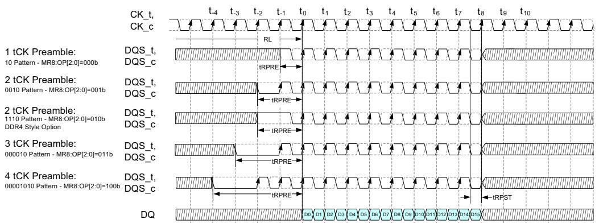  
Figure 9 — Example of Read Preamble Modes (Default) w/0.5 tCK Postamble

# 4.4.1 Read Preamble & Postamble (Cont'd)

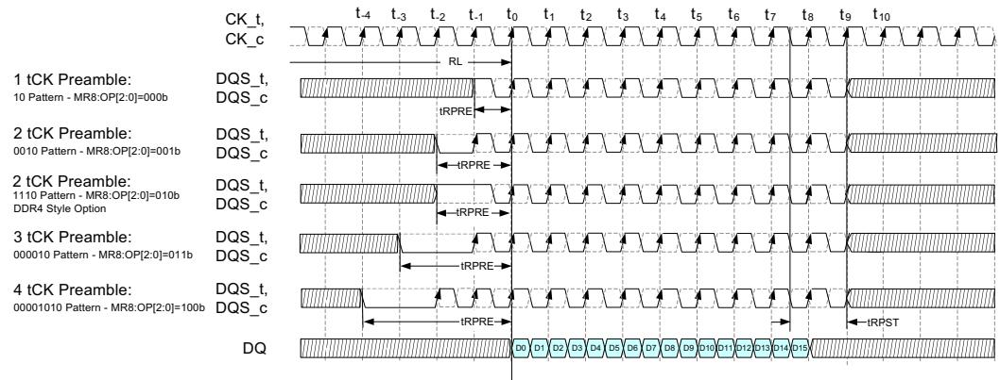  
Figure 10 — Example of Read Preamble Modes (Default) & w/1.5 tCK Postamble

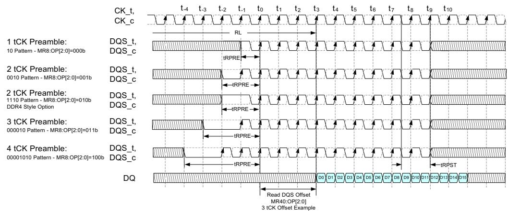  
Figure 11 — Example of Read Preamble Modes w/ 3tCK DQS offset & w/1.5 tCK Postamble

# 4.4.2 Write Preamble & Postamble

DDR5 supports a programmable write preamble & postamble.

Write Preamble is configured as 2tCK, 3tCK and 4tCK via MR8:OP[4:3]

Write Postamble is configured as 0.5tCK or 1.5tCK via MR8:OP[7]

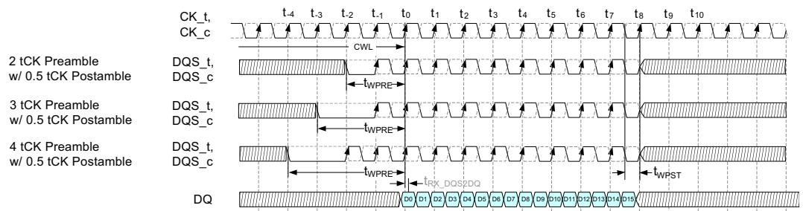  
Figure 12 — Example of Write Preamble Modes (Default) w/0.5tCK Postamble

# 4.4.2 Write Preamble & Postamble (Cont'd)

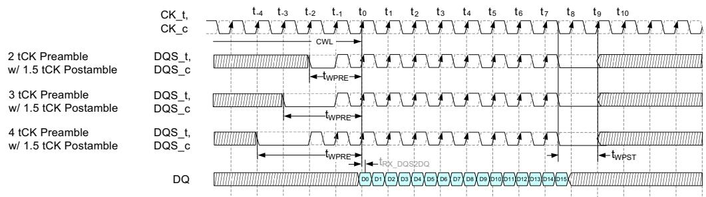  
Figure 13 — Example of Write Preamble Modes (Default) w/1.5tCK Postamble

# 4.4.3 Write Preamble Timings

During Write operations, input receiver aligns the strobe with DQ according to the preamble settings, and strobe should meet timing requirements (tDQSH_pre, tDQSL_pre) to guarantee enough timing margin by setting the window for strobe during Write preamble time frame. This timing requirement is applied to all configurations of Write preamble set by MR8 OP[4:3], which is 2tCK, 3tCK, and 4tCK Write preamble, for Write to Write operations as well as normal Write operations.

Figure 14 — DQS Timing While Write Preamble  
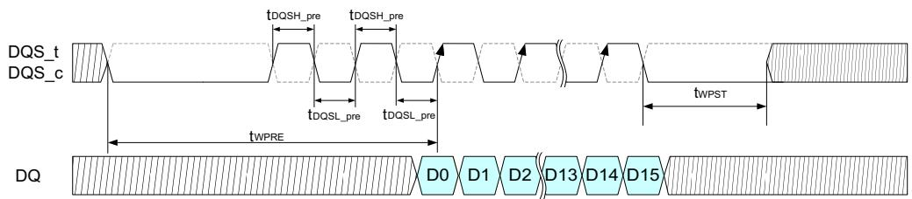  
NOTE 1 BL=16, 4tCK Preamble  
NOTE 2 tDQSH_pre and tDQSL_pre are shown, and it applies to all toggles during preamble.  
NOTE 3 2nd preamble during Write to Write operation will follow same requirement.

Table 248 — Strobe Preamble Timing Parameters for DDR5 3200 to 8400  

<table><tr><td rowspan="2">Parameter</td><td rowspan="2">Symbol</td><td colspan="2">DDR5 3200 ~ 4800</td><td colspan="2">DDR5 5200 ~ 6400</td><td colspan="2">DDR5 6800 ~ 8400</td><td rowspan="2">Unit</td></tr><tr><td>min</td><td>max</td><td>min</td><td>max</td><td>min</td><td>max</td></tr><tr><td>Strobe&#x27;s window of differentially high during Write preamble</td><td>tDQSH_pre</td><td>0.45</td><td>0.55</td><td>TBD</td><td>TBD</td><td>TBD</td><td>TBD</td><td>nCK</td></tr><tr><td>Strobe&#x27;s window of differentially low during Write preamble</td><td>tDQSL_pre</td><td>0.45</td><td>0.55</td><td>TBD</td><td>TBD</td><td>TBD</td><td>TBD</td><td>nCK</td></tr></table>

# 4.5 Interamble

The DQS strobe for the device requires a preamble prior to the first latching edge (the rising edge of DQS_t with data valid), and it requires a postamble after the last latching edge. The preamble and postamble options are set via Mode Register Write commands. Additionally, the postamble and preamble configured size shall NOT force the HOST to add command gaps in the command interval just to satisfy postamble or preamble settings. (i.e., Preamble  $= 4\mathrm{tCK} + \mathrm{Postamble} = 1.5\mathrm{tCK}$  shall not force tCCD+5).

# 4.5.1 Read Interamble Timing Diagrams

In Read to Read operations with tCCD=BL/2, postamble for 1st command and preamble for 2nd command shall disappear to create consecutive DQS latching edge for seamless burst operations.

In the case of Read to Read operations with command interval of tCCD+1, tCCD+2, etc., if the postamble and preambles overlap, the toggles take precedence over static preambles.

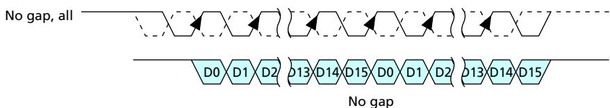  
Figure 15 — Example of Seamless Reads Operation: tCCD=Min

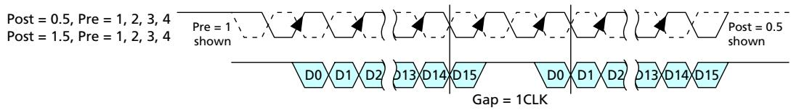  
Figure 16 — Example of Consecutive Reads Operation: tCCD=Min+1

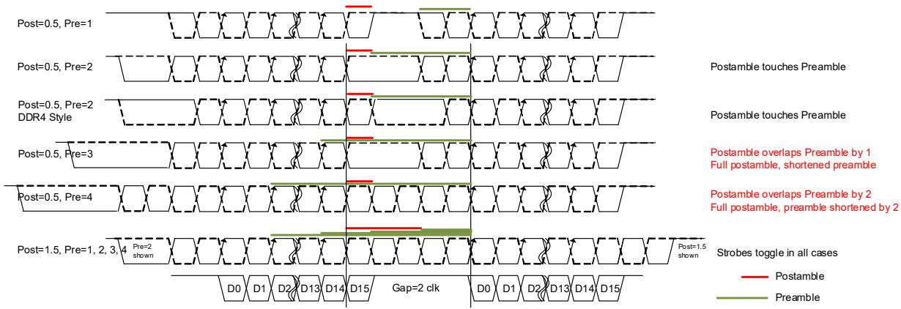  
Figure 17 — Example of Consecutive Reads Operation: tCCD=Min+2

# 4.5.1 Read Interamble Timing Diagrams (Cont'd)

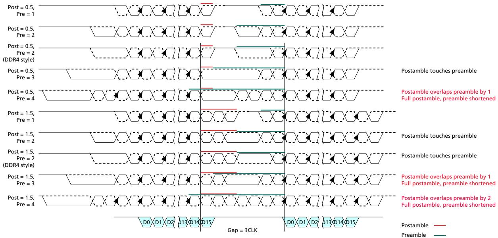  
Figure 18 — Example of Consecutive Reads Operation: tCCD=Min+3

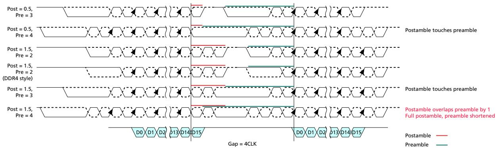  
Figure 19 — Example of Consecutive Reads Operation: tCCD=Min+4

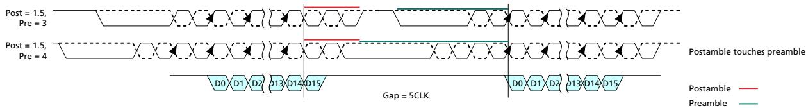  
Figure 20 — Example of Consecutive Reads Operation: tCCD=Min+5

# 4.5.2 Write Interamble Timing Diagrams

In Write to Write operations with tCCD=BL/2, postamble for 1st command and preamble for 2nd command shall disappear to create consecutive DQS latching edge for seamless burst operations. In the case of Write to Write operations with command interval of tCCD+1, tCCD+2, etc., if the postamble and preambles overlap, the toggles take precedence over static preambles.

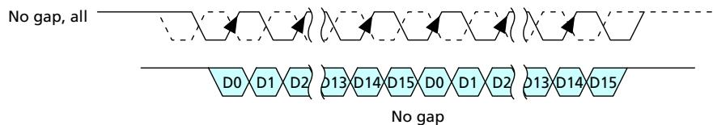  
Figure 21 — Example of Seamless Writes Operation: tCCD=Min

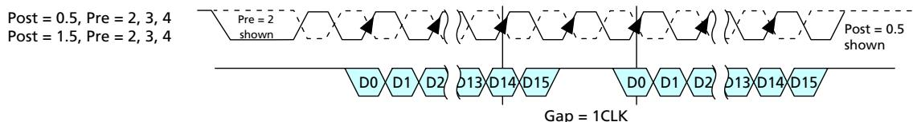  
Figure 22 — Example of Consecutive Writes Operation: tCCD=Min+1

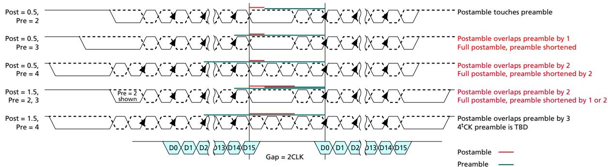  
Figure 23 — Example of Consecutive Writes Operation: tCCD=Min+2

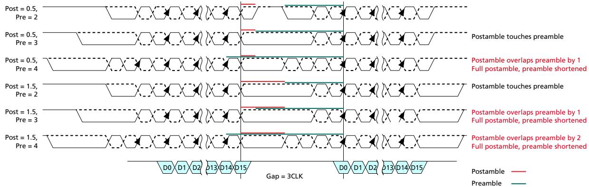  
Figure 24 — Example of Consecutive Writes Operation: tCCD=Min+3

# 4.5.2 Write Interamble Timing Diagrams (Cont'd)

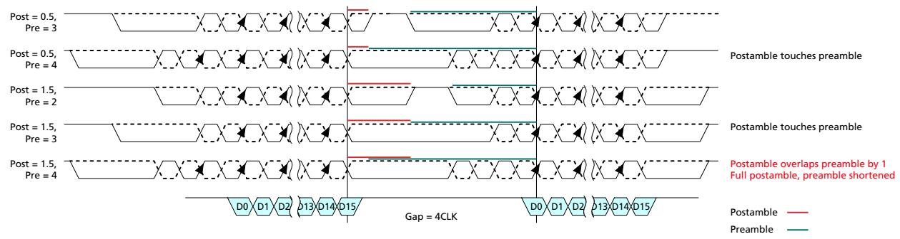  
Figure 25 — Example of Consecutive Writes Operation: tCCD=Min+4

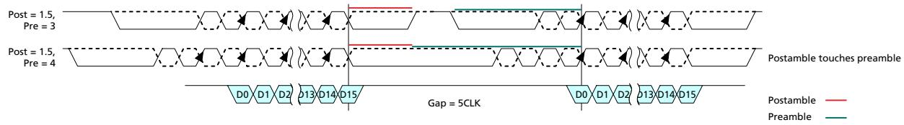  
Figure 26 — Example of Consecutive Writes Operation: tCCD=Min+5

# 4.6 Activate Command

The ACTIVATE command is used to open (or activate) a row in a particular bank for a subsequent access. The value on the BG[2:0] in X4/8 and BG[1:0] in X16 select the bankgroup; BA[1:0] inputs selects the bank within the bankgroup, and the address provided on the appropriate CA pins for R[17:0] to select the row (see Table 249). In the case of a 3DS DDR5 SDRAM device, the CID[3:0] shall also be selected to identify the correct die in the stack. This row remains active (or open) for accesses until a precharge command is issued to that bank or a precharge all command is issued. A bank must be precharged before opening a different row in the same bank.

Bank-to-bank command timing for ACTIVATE commands uses two different timing parameters, depending on whether the banks are in the same or different bank group. tRRD_S (short) is used for timing between banks located in different bank groups. tRRD_L (long) is used for timing between banks located in the same bank group. Consecutive ACTIVATE commands, allowed to be issued at tRRDmin, are restricted to a maximum of four within the time period tFAW (four activate window).

Table 249 - Activate Command (for Reference)  

<table><tr><td rowspan="2">Function</td><td rowspan="2">Abbreviation</td><td rowspan="2">CS_n</td><td colspan="15">CA Pins</td><td>NOTES</td></tr><tr><td>CA0</td><td>CA1</td><td>CA2</td><td>CA3</td><td>CA4</td><td>CA5</td><td>CA6</td><td>CA7</td><td>CA8</td><td>CA9</td><td>CA10</td><td>CA11</td><td>CA12</td><td>CA13</td><td></td><td></td></tr><tr><td rowspan="2">Activate</td><td rowspan="2">ACT</td><td>L</td><td>L</td><td>L</td><td>R0</td><td>R1</td><td>R2</td><td>R3</td><td>BA0</td><td>BA1</td><td>BG0</td><td>BG1</td><td>BG2</td><td>CID0</td><td>CID1</td><td>CID2/DDPI D</td><td rowspan="2"></td><td></td></tr><tr><td>H</td><td>R4</td><td>R5</td><td>R6</td><td>R7</td><td>R8</td><td>R9</td><td>R10</td><td>R11</td><td>R12</td><td>R13</td><td>R14</td><td>R15</td><td>R16</td><td>CID3/R17</td><td></td></tr><tr><td colspan="18">NOTE See Table 241 for details</td><td></td></tr></table>

# 4.7 Read Operation

The Read Operation causes the DRAM to retrieve and output data stored in its array. The Read Operation is initiated by the Read Command during which the beginning column address and bank/group address for the data to be retrieved from the array is provided. The data is driven by the DRAM on its DQ pins RL (CL) cycles after the Read Command along with the proper waveform on the DQS inputs. Read Latency (RL or CL) is defined from the Read command to data and is not affected by the Read DQS offset timing (MR40 OP[2:0]).

# 4.7.1 Read Burst Operation

During a READ or WRITE command, DDR5 shall support BC8, BL16, BL32 (optional) and BL32 OTF (optional) during the READ or WRITE. MR0[1:0] is used to select burst operation mode.

Figure 27 - Read Burst Operation (BL16)  
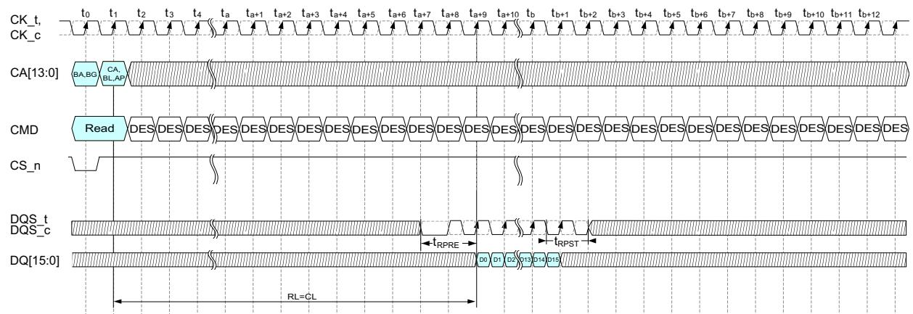  
NOTE 1  $\mathrm{BL} = 16$  , Preamble  $= 2\mathrm{tCK}$  - 0010 Pattern Preamble, 1.5tCK Postamble  
NOTE 2 DES commands are shown for ease of illustration; other commands may be valid at these times.  
NOTE 3 In this example, Read DQS Offset Timing is set to 0 Clocks.

Figure 28—Read Burst Operation (BC8)  
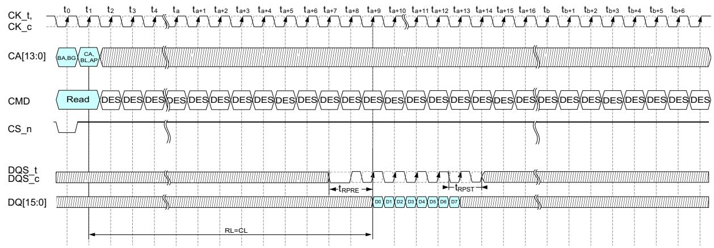  
NOTE 1 BC=8, Preamble = 2tCK - 0010 Pattern Preamble, 1.5tCK Postamble  
NOTE 2 DES commands are shown for ease of illustration; other commands may be valid at these times.  
NOTE 3 In this example, Read DQS Offset Timing is set to 0 Clocks  
NOTE 4 In non-CRC mode, DQS_t and DQS_c stop toggling at the completion of the BC8 data bursts, plus the postamble.

# 4.7.1 Read Burst Operation (Cont'd)

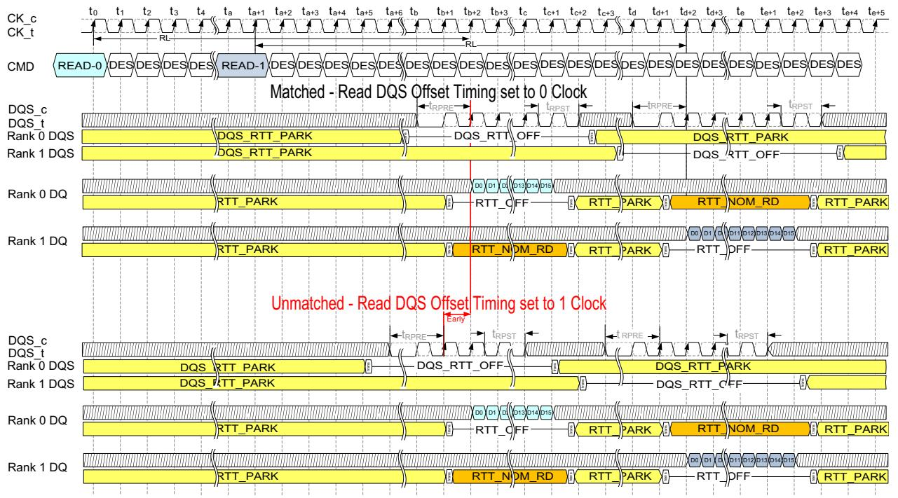  
NOTE 1  $\mathrm{BL} = 16$  , Preamble  $= 2\mathrm{tCK}$  - 0010 Pattern Preamble, 1.5tCK Postamble  
NOTE 2 DES commands are shown for ease of illustration; other commands may be valid at these times.  
NOTE 3 Two different examples are shown side by side, the top with the default setting for Read DQS Offset = 0 Clock, the lower with a 1 Clock setting. In the lower case, the DQS is started 1 clock earlier than normal with respect to RL (CL).  
NOTE 4 In both cases, the Data does not move

# Figure 29 - Read to Read, Different Ranks Operation with Read DQS Offset Usage (BL16)

# 4.7.2 Burst Read Operation Followed by a Precharge

The minimum external Read command to Precharge command spacing to the same bank is equal to tRTP with tRTP being the Internal Read Command to Precharge Command Delay. Note that the minimum ACT to PRE timing, tRAS, must be satisfied as well. The minimum value for the Internal Read Command to Precharge Command Delay is given by tRTP.min. A new bank active command may be issued to the same bank if the following two conditions are satisfied simultaneously:

1 The minimum RAS precharge time (tRP.MIN) has been satisfied from the clock at which the precharge begins.  
2 The minimum RAS cycle time (tRC.MIN) from the previous bank activation has been satisfied.

Examples of Read commands followed by Precharge are shown in Figure 30 and Figure 31.

# 4.7.2 Burst Read Operation Followed by a Precharge (Con'td)

Figure 30 - Read to Precharge with 1tCK Preamble  
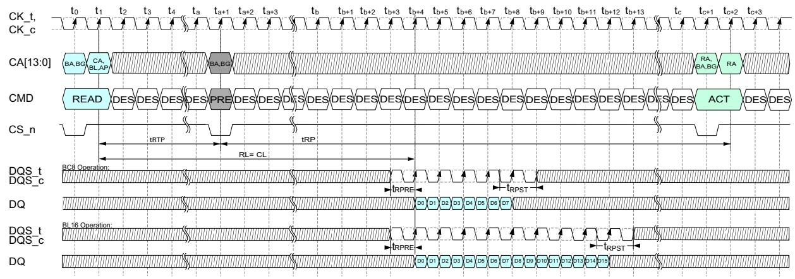  
NOTE 1  $\mathrm{BL} = 16$  1tCK Preamble, 1.5tCK Postamble  
NOTE 2 DES commands are shown for ease of illustration; other commands may be valid at these times.  
NOTE 3 The example assumes tRAS. MIN is satisfied at Precharge command time  $(\mathrm{ta} + 1)$  and that tRC. MIN is satisfied at the next Active command time  $(\mathrm{tc} + 2)$ .

Figure 31 - Read to Precharge with 2tCK Preamble  
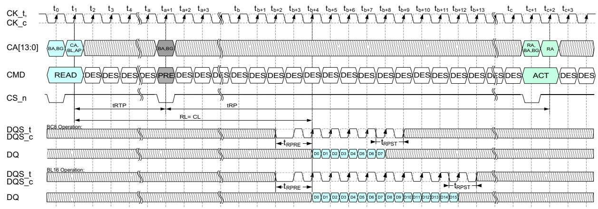  
NOTE 1  $\mathrm{BL} = 16$  2tCK-0010 Pattern Preamble, 1.5tCK Postamble,  
NOTE 2 DES commands are shown for ease of illustration; other commands may be valid at these times.  
NOTE 3 The example assumes tRAS. MIN is satisfied at Precharge command time  $(\mathrm{ta} + 1)$  and that tRC. MIN is satisfied at the next Active command time  $(\mathrm{tc} + 2)$ .

# 4.7.2.1 CLK to Read DQS Timing Parameters

The following parameters shall be defined for CK to read DQS timings.

Table 250 — CLK to Read DQS Timing Parameters DDR5-3200 to DDR5-4800  

<table><tr><td colspan="2">Speed</td><td colspan="2">DDR5-3200</td><td colspan="2">DDR5-3600</td><td colspan="2">DDR5-4000</td><td colspan="2">DDR5-4400</td><td colspan="2">DDR5-4800</td><td rowspan="2">Units</td><td rowspan="2">Note</td></tr><tr><td>Parameter</td><td>Symbol</td><td>Min</td><td>Max</td><td>Min</td><td>Max</td><td>Min</td><td>Max</td><td>Min</td><td>Max</td><td>Min</td><td>Max</td></tr><tr><td>DQS_t, DQS_c rising edge output timing location from rising CK_t, CK_c</td><td>tDQSCK</td><td>-0.240</td><td>0.240</td><td>-0.252</td><td>0.252</td><td>-0.270</td><td>0.270</td><td>-0.286</td><td>0.286</td><td>-0.300</td><td>0.300</td><td>tCK</td><td>1,4,5</td></tr><tr><td>DQS_t, DQS_c rising edge output variance window</td><td>tDQSCKi</td><td>-</td><td>0.410</td><td>-</td><td>0.430</td><td>-</td><td>0.460</td><td>-</td><td>0.475</td><td>-</td><td>0.490</td><td>tCK</td><td>2,3,4,5</td></tr><tr><td colspan="14">NOTE 1 Measured over full VDD and Temperature spec ranges.</td></tr><tr><td colspan="14">NOTE 2 Measured for a given DRAM part, and for each DQS_t/DQS_c pair in case of x16 (part variation is excluded).</td></tr><tr><td colspan="14">NOTE 3 These parameters are verified by design and characterization, and may not be subject to production test.</td></tr><tr><td colspan="14">NOTE 4 Assume no jitter on input clock signals to the DRAM.</td></tr><tr><td colspan="14">NOTE 5 Refer to Section 4.7.1 READ Burst Operation.</td></tr></table>

Table 251 — CLK to Read DQS Timing Parameters DDR5-5200 to DDR5-6400  

<table><tr><td colspan="2">Speed</td><td colspan="2">DDR5-5200</td><td colspan="2">DDR5-5600</td><td colspan="2">DDR5-6000</td><td colspan="2">DDR5-6400</td><td rowspan="2">Units</td><td rowspan="2">Note</td></tr><tr><td>Parameter</td><td>Symbol</td><td>Min</td><td>Max</td><td>Min</td><td>Max</td><td>Min</td><td>Max</td><td>Min</td><td>Max</td></tr><tr><td>DQS_t, DQS_c rising edge output timing location from rising CK_t, CK_c</td><td>tDQSCK</td><td>TBD</td><td>TBD</td><td>TBD</td><td>TBD</td><td>TBD</td><td>TBD</td><td>TBD</td><td>TBD</td><td>tCK</td><td>1,4,5</td></tr><tr><td>DQS_t, DQS_c rising edge output variance window</td><td>tDQSCKi</td><td>-</td><td>TBD</td><td>-</td><td>TBD</td><td>-</td><td>TBD</td><td>-</td><td>TBD</td><td>tCK</td><td>2,3,4,5</td></tr><tr><td colspan="12">NOTE 1 Measured over full VDD and Temperature spec ranges. 
NOTE 2 Measured for a given DRAM part, and for each DQS_t/DQS_c pair in case of x16 (part variation is excluded). 
NOTE 3 These parameters are verified by design and characterization, and may not be subject to production test. 
NOTE 4 Assume no jitter on input clock signals to the DRAM. 
NOTE 5 Refer to Section 4.7.1 READ Burst Operation.</td></tr></table>

# 4.7.2.1 CLK to Read DQS Timing Parameters (Cont'd)

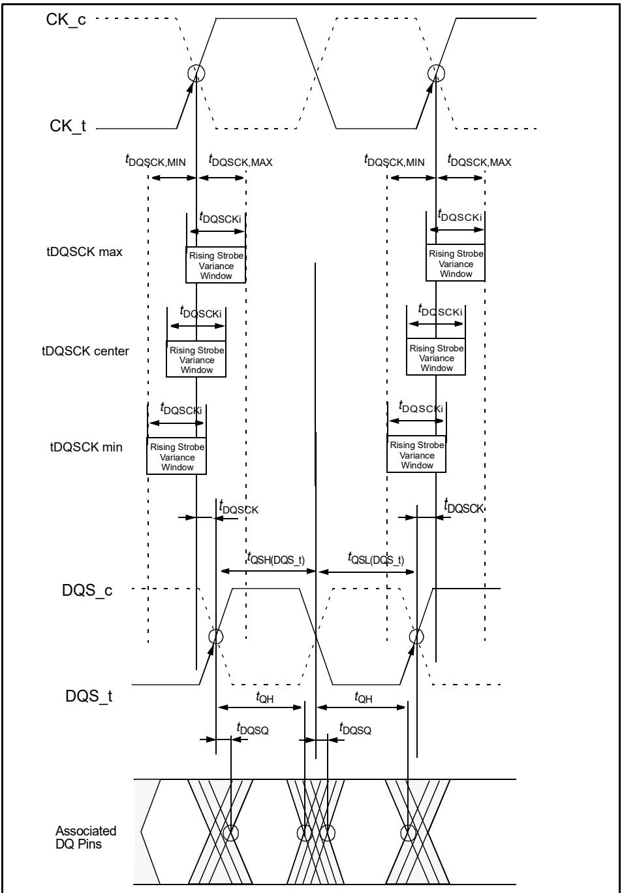  
Figure 32 — TDQSCK Timing Definition

# 4.7.3 Read Burst Operation for Optional BL32 Mode

The following read timing diagrams cover write timings for fixed BL32 BL32 in BL32 OTF mode and BL16 in BL32 OTF mode for x4 devices only.

In these read timing diagrams, for clarity of illustration, CK and DQS are shown aligned. As well, DQS and DQ are shown center-aligned. Offset between CK and DQS, and between DQS and DQ may be appropriate.

A dummy CAS command is required for second half of the transfer of BL32. If non-target ODT is needed in the system then a dummy ODT command must be issued to the non-target rank for second half of the transfer of BL32

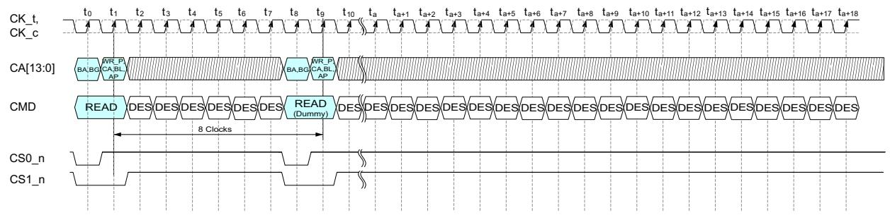

NOTE 1 DES commands are shown for ease of illustration; other commands may be valid at these times.  
NOTE 2 A dummy RD command is required for the second half of the transfer with a delay of 8 clocks from the first RD command.  
NOTE 3 The figure also shows a dummy ODT command being issued to non-target rank 1 for the second half of the transfer.  
NOTE 4 C10 is used for burst ordering and can be LOW or HIGH for the first RD command. C10 for the dummy RD command must be the opposite value from the first RD command.  
NOTE 5 DDR5 DRAM supports an optional fixed BL32 mode and optional BL32 OTF (On the fly) mode for x4 devices only.

Figure 33 - Read Timing for Fixed BL32 and BL32 in BL32 OTF mode  
Figure 34—Read Timings for BL16 in BL32 OTF mode  
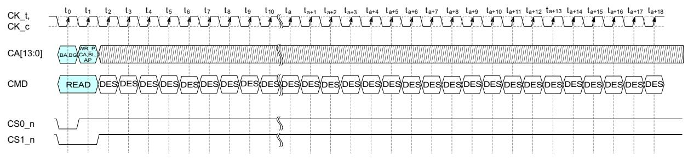  
NOTE 1 Figure shows BL16 read operation when MR0 is programmed to use BL32 OTF mode. In this case, no dummy RD command is required as transfer size is BL16.  
NOTE 2 DES commands are shown for ease of illustration; other commands may be valid at these times including commands to allow data transfer from the same die after transfer of BL16.  
NOTE 3 DDR5 DRAM supports an optional fixed BL32 mode and optional BL32 OTF (On the fly) mode for x4 devices only.

# 4.7.3 Read Burst Operation for Optional BL32 Mode (Cont'd)

Figure 35 - Read to Read to Different Bank Group for BL16 in BL32 OTF  
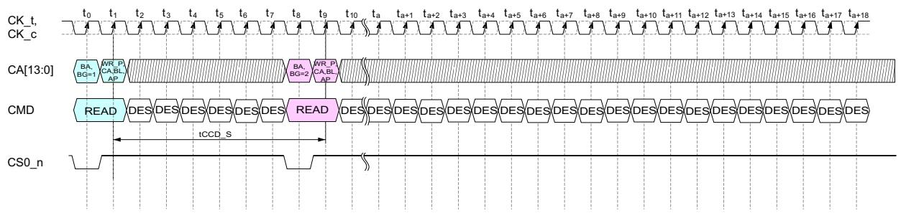  
NOTE 1 Figure shows back to back BL16 writes to different bank groups.

Figure 36 - Read to Read to Same Bank Group for BL16 in BL32 OTF  
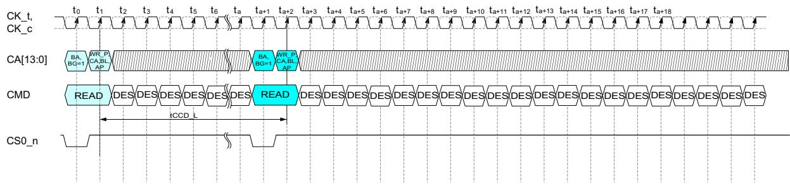  
NOTE 2 DDR5 DRAM supports an optional fixed BL32 mode and optional BL32 OTF (On the fly) mode for x4 devices only.  
NOTE 1 Figure shows back to back BL16 reads to same bank group using a timing of tCCDL_WR.  
NOTE 2 DDR5 DRAM supports an optional fixed BL32 mode and optional BL32 OTF (On the fly) mode for x4 devices only.

Figure 37 - Read with Auto-Precharge for Fixed BL32 and BL32 in BL32 OTF Mode  
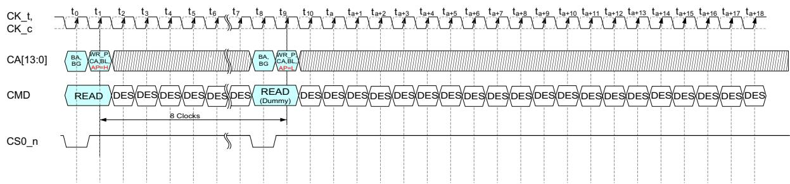  
NOTE 1 AP bit must be set HIGH for first CAS and LOW for dummy CAS command.  
NOTE 2 DDR5 DRAM supports an optional fixed BL32 mode and optional BL32 OTF (On the fly) mode for x4 devices only.

# 4.7.3 Read Burst Operation for Optional BL32 Mode (Cont'd)

Figure 38 - Read with Auto-Precharge for BL16 in BL32 OTF Mode  
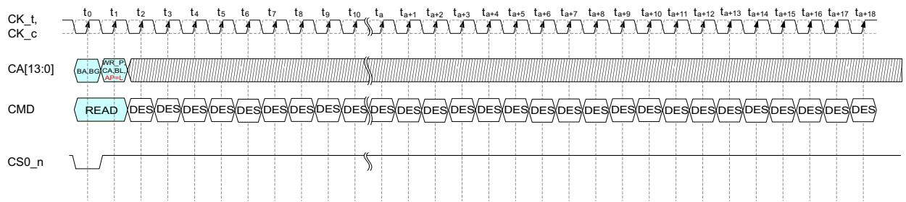  
NOTE 1 AP bit must be set to LOW with the CAS command.  
NOTE 2 DDR5 DRAM supports an optional fixed BL32 mode and optional BL32 OTF (On the fly) mode for x4 devices only.

# 4.7.4 Read and Write Command Interval

Table 252 provides the minimum read and write command timings.

Table 252 — Minimum Read and Write Command Timings  

<table><tr><td>Bank Group</td><td>Timing Parameter</td><td>DDR5-3200/3600/4000/4400/4800/5200/5600/6000/6400</td><td>Units</td><td>Notes</td></tr><tr><td rowspan="3">same</td><td>Minimum Read to Write</td><td>CL - CWL + RBL/2 + 2tCK - (Read DQS offset) + (tRPST - 0.5tCK) + tWPRE</td><td></td><td>1,3,4</td></tr><tr><td>Minimum Write to Read</td><td>CWL + WBL/2 + tWTR_L</td><td></td><td>2,4,5</td></tr><tr><td>Minimum Write to Read AP, same bank</td><td>CWL + WBL/2 + tWTRA</td><td></td><td>2,4,6</td></tr><tr><td rowspan="2">different</td><td>Minimum Read to Write</td><td>CL - CWL + RBL/2 + 2tCK - (Read DQS offset) + (tRPST - 0.5tCK) + tWPRE</td><td></td><td>1,3,4</td></tr><tr><td>Minimum Write to Read</td><td>CWL + WBL/2 + tWTR_S</td><td></td><td>2,4</td></tr><tr><td>NOTE 1</td><td colspan="4">RBL: Read burst length associated with Read command RBL = 32 for fixed BL32 and BL32 in BL32 OTF mode RBL = 16 for fixed BL16 and BL16 in BL32 OTF mode RBL = 16 for BL16 in BC8 OTF mode and BC8 in BC8 OTF mode</td></tr><tr><td>NOTE 2</td><td colspan="4">WBL: Write burst length associated with Write command WBL = 32 for fixed BL32 and BL32 in BL32 OTF mode WBL = 16 for fixed BL16 and BL16 in BL32 OTF mode WBL = 16 for BL16 in BC8 OTF mode and BC8 in BC8 OTF mode</td></tr><tr><td>NOTE 3</td><td colspan="4">The following is considered for tRTW equation 1tCK needs to be added due to tDQS2CK Read DQS offset timing can pull in the tRTW timing 1tCK needs to be added when 1.5tCK postamble</td></tr><tr><td>NOTE 4</td><td colspan="4">CWL=CL-2</td></tr><tr><td>NOTE 5</td><td colspan="4">tWTRA must be satisfied instead of tWTR_L for same bank access when Read w/AutoPrecharge</td></tr><tr><td>NOTE 6</td><td colspan="4">tWTRA = tWR - tRTP, allows the precharge generated by the Read AutoPrecharge to meet tWR from the preceding Write when it occurs within the same bank.</td></tr></table>

# 4.7.4 Read and Write Command Interval (Cont'd)

Figure 39 — Timing Diagram for Write to Read  
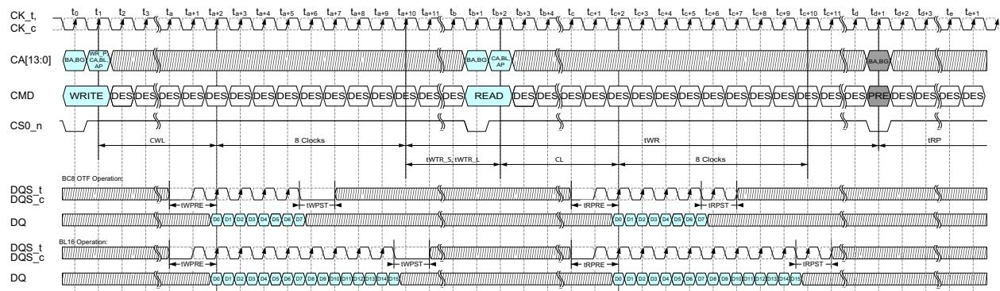  
NOTE 1 BC OTF=8 or BL=16, Preamble = 2tCK - 0010 pattern, Postamble = 1.5tCK  
NOTE 2 DES commands are shown for ease of illustration; other commands may be valid at these times.  
NOTE 3 The write recovery time (tWR) is referenced from the first rising clock edge after the last write data shown at Ta+10. tWR specifies the last burst write cycle until the precharge command can be issued to the same bank.

Figure 40 — Timing Diagram for Write to Read AutoPrecharge in Same Bank  
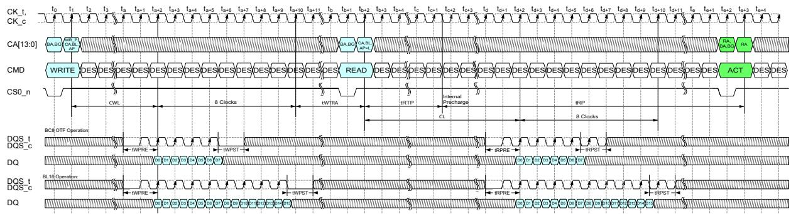  
NOTE 1 BC OTF=8 or BL=16, Preamble = 2tCK - 0010 pattern, Postamble = 1.5tCK  
NOTE 2 DES commands are shown for ease of illustration; other commands may be valid at these times.  
NOTE 3 The write recovery time (tWR) is referenced from the first rising clock edge after the last write data shown at Ta+10. The internal precharge after the Read AutoPrecharge command cannot begin before tWR is satisfied, which is equivalent to tWTRA + tRTP

# 4.7.5 Read and Write Command Interval for Optional BL32 Modes

Table 253 — Minimum Read to Read Timings – Same Bank Group  

<table><tr><td rowspan="2">From</td><td colspan="2">To</td><td rowspan="2">Units</td><td rowspan="2">Notes</td></tr><tr><td>BL16 in BL32 OTF Mode</td><td>BL32 in BL32 OTF Mode</td></tr><tr><td>BL16 in BL32 OTF Mode</td><td>tCCD_L</td><td>tCCD_L</td><td></td><td>1</td></tr><tr><td>BL32 in BL32 OTF Mode</td><td>16 Clocks</td><td>16 Clocks</td><td></td><td>1</td></tr><tr><td colspan="5">NOTE 1 DDR5 DRAM supports an optional fixed BL32 mode and optional BL32 OTF (On the fly) mode for x4 devices only.</td></tr></table>

Table 254 — Minimum Read to Read Timings – Different Bank Group  

<table><tr><td rowspan="2">From</td><td colspan="2">To</td><td rowspan="2">Units</td><td rowspan="2">Notes</td></tr><tr><td>BL16 in BL32 OTF Mode</td><td>BL32 in BL32 OTF Mode</td></tr><tr><td>BL16 in BL32 OTF Mode</td><td>tCCD_S</td><td>tCCD_S</td><td></td><td>1</td></tr><tr><td>BL32 in BL32 OTF Mode</td><td>16 Clocks</td><td>16 Clocks</td><td></td><td>1</td></tr><tr><td colspan="5">NOTE 1 DDR5 DRAM supports an optional fixed BL32 mode and optional BL32 OTF (On the fly) mode for x4 devices only.</td></tr></table>

Table 255 — Minimum Write to Write Timings – Same Bank Group  

<table><tr><td rowspan="2">From</td><td colspan="2">To</td><td rowspan="2">Units</td><td rowspan="2">Notes</td></tr><tr><td>BL16 in BL32 OTF Mode</td><td>BL32 in BL32 OTF Mode</td></tr><tr><td>BL16 in BL32 OTF Mode</td><td>tCCD_L_WR</td><td>tCCD_L_WR</td><td></td><td>1</td></tr><tr><td>BL32 in BL32 OTF Mode</td><td>TBD</td><td>TBD</td><td></td><td>1</td></tr><tr><td colspan="5">NOTE 1 DDR5 DRAM supports an optional fixed BL32 mode and optional BL32 OTF (On the fly) mode for x4 devices only.</td></tr></table>

DDR5 x8 and x16 devices will have different write to write same bank group timings, based on whether the second write requires a read-modify-write (RMW), the Burst Length mode of the device set by MR0: OP[1:0], and whether data masking is enabled by MR5:OP[5]. BL16 Partial Writes and BC8 Writes require a RMW on x8/x16 devices. BL16 non-partial writes do not require RMW. See Section 13.3 for details on parametric timings.

Table 256 — Minimum Write to Write Same Bank Group Timings, x8/x16 Devices  

<table><tr><td rowspan="2">From</td><td colspan="3">To</td><td rowspan="2">Units</td><td rowspan="2">Notes</td></tr><tr><td>BC8</td><td>BL16 Partial Write</td><td>BL16 not Partial Write</td></tr><tr><td>BC8 or BL16</td><td>tCCD_L_WR</td><td>tCCD_L_WR</td><td>tCCD_L_WR2</td><td></td><td></td></tr></table>

Table 257 — Minimum Write to Write Timings – Different Bank Group  

<table><tr><td rowspan="2">From</td><td colspan="2">To</td><td rowspan="2">Units</td><td rowspan="2">Notes</td></tr><tr><td>BL16 in BL32 OTF Mode</td><td>BL32 in BL32 OTF Mode</td></tr><tr><td>BL16 in BL32 OTF Mode</td><td>tCCD_S</td><td>tCCD_S</td><td></td><td>1</td></tr><tr><td>BL32 in BL32 OTF Mode</td><td>16 Clocks</td><td>16 Clocks</td><td></td><td>1</td></tr><tr><td colspan="5">NOTE 1 DDR5 DRAM supports an optional fixed BL32 mode and optional BL32 OTF (On the fly) mode for x4 devices only.</td></tr></table>

# 4.7.6 Read and Write Command Interval for 3DS

Table 258 — Minimum Read and Write Command Timings for x4 2H and 4H 3DS - 3200 thru 4800  

<table><tr><td>Logical Rank</td><td>Bank Group</td><td>Parameter Name</td><td>Timing Parameter</td><td>DDR5 3200 3DS</td><td>DDR5 3600 3DS</td><td>DDR5 4000 3DS</td><td>DDR5 4400 3DS</td><td>DDR5 4800 3DS</td><td>Units</td><td>Note</td></tr><tr><td rowspan="8">same</td><td rowspan="4">same</td><td>tCCD_L_slr</td><td>Minimum Read to Read</td><td rowspan="12" colspan="5">See Section 13.3 for timing parameters by speed grade for 3DS</td><td>nCK</td><td></td></tr><tr><td>tCCD_L_WR_slr</td><td>Minimum Write to Write</td><td>nCK</td><td></td></tr><tr><td>tCCD_L_RTW_slr</td><td>Minimum Read to Write</td><td>nCK</td><td></td></tr><tr><td>tCCD_L_WTR_slr</td><td>Minimum Write to Read</td><td>nCK</td><td></td></tr><tr><td rowspan="4">different</td><td>tCCD_S_slr</td><td>Minimum Read to Read</td><td>nCK</td><td></td></tr><tr><td>tCCD_S_slr</td><td>Minimum Write to Write</td><td>nCK</td><td></td></tr><tr><td>tCCD_S_RTW_slr</td><td>Minimum Read to Write</td><td>nCK</td><td></td></tr><tr><td>tCCD_S_WTR_slr</td><td>Minimum Write to Read</td><td>nCK</td><td></td></tr><tr><td rowspan="4">different</td><td rowspan="4">same or different</td><td>tCCD_S_dlr</td><td>Minimum Read to Read</td><td>nCK</td><td></td></tr><tr><td>tCCD_S_dlr</td><td>Minimum Write to Write</td><td>nCK</td><td></td></tr><tr><td>tCCD_S_RTW_dlr</td><td>Minimum Read to Write</td><td>nCK</td><td></td></tr><tr><td>tCCD_S_WTR_dlr</td><td>Minimum Write to Read</td><td>nCK</td><td></td></tr></table>

# 4.7.6 Read and Write Command Interval for 3DS (Cont'd)

Table 259 — Minimum Read and Write Command Timings for x4 2H and 4H 3DS - 5200 thru 6400  

<table><tr><td>Logical Rank</td><td>Bank Group</td><td>Parameter Name</td><td>Timing Parameter</td><td>DDR5 5200 3DS</td><td>DDR5 5600 3DS</td><td>DDR5 6000 3DS</td><td>DDR5 6400 3DS</td><td>Units</td><td>Note</td></tr><tr><td rowspan="8">same</td><td rowspan="4">same</td><td>tCCD_L_slr</td><td>Minimum Read to Read</td><td rowspan="12" colspan="4">See Section 13.3 for timing parameters by speed grade for 3DS</td><td>nCK</td><td></td></tr><tr><td>tCCD_L_WR_slr</td><td>Minimum Write to Write</td><td>nCK</td><td></td></tr><tr><td>tCCD_L_RTW_slr</td><td>Minimum Read to Write</td><td>nCK</td><td></td></tr><tr><td>tCCD_L_WTR_slr</td><td>Minimum Write to Read</td><td>nCK</td><td></td></tr><tr><td rowspan="4">different</td><td>tCCD_S_slr</td><td>Minimum Read to Read</td><td>nCK</td><td></td></tr><tr><td>tCCD_S_slr</td><td>Minimum Write to Write</td><td>nCK</td><td></td></tr><tr><td>tCCD_S_RTW_slr</td><td>Minimum Read to Write</td><td>nCK</td><td></td></tr><tr><td>tCCD_S_WTR_slr</td><td>Minimum Write to Read</td><td>nCK</td><td></td></tr><tr><td rowspan="4">different</td><td rowspan="4">same or different</td><td>tCCD_S_dlr</td><td>Minimum Read to Read</td><td>nCK</td><td></td></tr><tr><td>tCCD_S_dlr</td><td>Minimum Write to Write</td><td>nCK</td><td></td></tr><tr><td>tCCD_S_RTW_dlr</td><td>Minimum Read to Write</td><td>nCK</td><td></td></tr><tr><td>tCCD_S_WTR_dlr</td><td>Minimum Write to Read</td><td>nCK</td><td></td></tr></table>

# 4.7.6 Read and Write Command Interval for 3DS (Cont'd)

Table 260 — Minimum Read and Write Command Timings for x4 8H and 16H 3DS - 3200 thru 4800  

<table><tr><td>Logical Rank</td><td>Bank Group</td><td>Parameter Name</td><td>Timing Parameter</td><td>DDR5 3200 3DS</td><td>DDR5 3600 3DS</td><td>DDR5 4000 3DS</td><td>DDR5 4400 3DS</td><td>DDR5 4800 3DS</td><td>Units</td><td>Note</td></tr><tr><td rowspan="8">same</td><td rowspan="4">same</td><td>tCCD_L_slr</td><td>Minimum Read to Read</td><td rowspan="12" colspan="5">See Section 13.3 for timing parameters by speed grade for 3DS</td><td>nCK</td><td></td></tr><tr><td>tCCD_L_WR_slr</td><td>Minimum Write to Write</td><td>nCK</td><td></td></tr><tr><td>tCCD_L_RTW_slr</td><td>Minimum Read to Write</td><td>nCK</td><td></td></tr><tr><td>tCCD_L_WTR_slr</td><td>Minimum Write to Read</td><td>nCK</td><td></td></tr><tr><td rowspan="4">different</td><td>tCCD_S_slr</td><td>Minimum Read to Read</td><td>nCK</td><td></td></tr><tr><td>tCCD_S_slr</td><td>Minimum Write to Write</td><td>nCK</td><td></td></tr><tr><td>tCCD_S_RTW_slr</td><td>Minimum Read to Write</td><td>nCK</td><td></td></tr><tr><td>tCCD_S_WTR_slr</td><td>Minimum Write to Read</td><td>nCK</td><td></td></tr><tr><td rowspan="4">different</td><td rowspan="4">same or different</td><td>tCCD_S_dlr</td><td>Minimum Read to Read</td><td>nCK</td><td></td></tr><tr><td>tCCD_S_dlr</td><td>Minimum Write to Write</td><td>nCK</td><td></td></tr><tr><td>tCCD_S_RTW_dlr</td><td>Minimum Read to Write</td><td>nCK</td><td></td></tr><tr><td>tCCD_S_WTR_dlr</td><td>Minimum Write to Read</td><td>nCK</td><td></td></tr></table>

# 4.7.6 Read and Write Command Interval for 3DS (Cont'd)

Table 261 — Minimum Read and Write Command Timings for x4 8H and 16H 3DS - 5200 thru 6400  

<table><tr><td>Logical Rank</td><td>Bank Group</td><td>Parameter Name</td><td>Timing Parameter</td><td>DDR5 5200 3DS</td><td>DDR5 5600 3DS</td><td>DDR5 6000 3DS</td><td>DDR5 6400 3DS</td><td>Units</td><td>Note</td></tr><tr><td rowspan="8">same</td><td rowspan="4">same</td><td>tCCD_L_slr</td><td>Minimum Read to Read</td><td rowspan="12" colspan="4">See Section 13.3 for timing parameters by speed grade for 3DS</td><td>nCK</td><td></td></tr><tr><td>tCCD_L_WR_slr</td><td>Minimum Write to Write</td><td>nCK</td><td></td></tr><tr><td>tCCD_L_RTW_slr</td><td>Minimum Read to Write</td><td>nCK</td><td></td></tr><tr><td>tCCD_L_WTR_slr</td><td>Minimum Write to Read</td><td>nCK</td><td></td></tr><tr><td rowspan="4">different</td><td>tCCD_S_slr</td><td>Minimum Read to Read</td><td>nCK</td><td></td></tr><tr><td>tCCD_S_slr</td><td>Minimum Write to Write</td><td>nCK</td><td></td></tr><tr><td>tCCD_S_RTW_slr</td><td>Minimum Read to Write</td><td>nCK</td><td></td></tr><tr><td>tCCD_S_WTR_slr</td><td>Minimum Write to Read</td><td>nCK</td><td></td></tr><tr><td rowspan="4">different</td><td rowspan="4">same or different</td><td>tCCD_S_dlr</td><td>Minimum Read to Read</td><td>nCK</td><td></td></tr><tr><td>tCCD_S_dlr</td><td>Minimum Write to Write</td><td>nCK</td><td></td></tr><tr><td>tCCD_S_RTW_dlr</td><td>Minimum Read to Write</td><td>nCK</td><td></td></tr><tr><td>tCCD_S_WTR_dlr</td><td>Minimum Write to Read</td><td>nCK</td><td></td></tr></table>

# 4.8 Write Operation

The Write Operation stores data to the DRAM. It is initiated by the Write command during which the beginning column address and bank/group address for the data to be written to the array is provided. The data is provided to the DRAM on the DQ inputs CAS Write Latency (CWL) cycles after the Write command along with the proper waveform on the DQS inputs. CAS Write Latency is defined and measured from final cycle of the Write command to the first effective rising DQS (excluding write preamble).

# 4.8.1 Write Data Mask

One write data mask (DM_n) pin for each byte data group is supported on x8 and x16 DDR5 SDRAMs. The DM_n pin/function is enabled via mode register. For the x4 configuration SDRAM, the DM mode register setting must be disabled. The DM_n pin has identical timings and termination functionality on write operations as the DQ pins, as shown in Figure 41. The DM_n pin is not used for read cycles and the pin should behave like a DQ pin driving high or be terminated to RTT_PARK. When the DM function is disabled by MR, the DRAM disables the DM input and output receiver and does not expect nor drive any valid logic level.

Each data mask burst bit position corresponds to the same bit position in the DQ data burst across the corresponding byte group.

# 4.8.1 Write Data Mask (Cont'd)

The WR_partial = Low as part of the write command must be used in conjunction with the DM_n data. The WR_partial = Low is to help DRAM start an internal read for 'read modify write' during masked writes. If WR_partial = High during write, then the mask data on DM_n must be high. If DM is disabled, MR5 OP[5] = 0, WR_partial must be "H". DM_n may be high or low.

# 4.8.2 Write Burst Operation

The following write timing diagrams are to help understand the meaning of each write parameter; the diagrams are just examples. The details of each parameter are defined separately.

In these write timing diagrams, for clarity of illustration, CK and DQS are shown aligned. As well, DQS and DQ are shown center-aligned. Offset between CK and DQS, and between DQS and DQ may be appropriate.

Figure 41 - Write Burst Operation (BL16)  
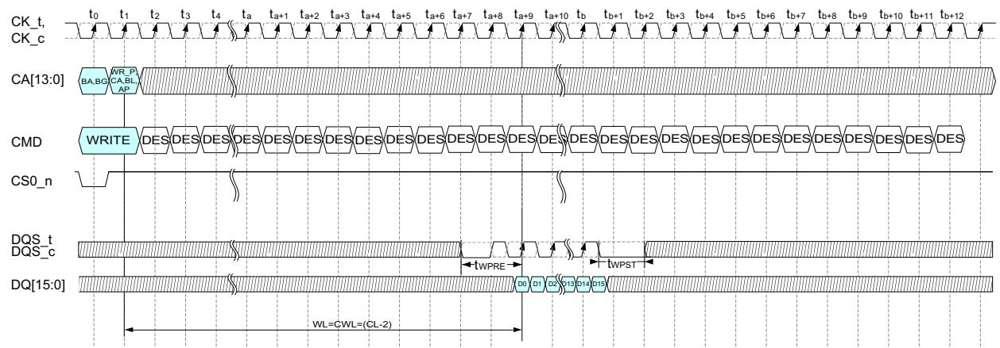  
NOTE 1 BL=16, 2tCK Preamble, 1.5tCK Postamble  
NOTE 2 DES commands are shown for ease of illustration; other commands may be valid at these times.

Figure 42 - Write Burst Operation (BC8)  
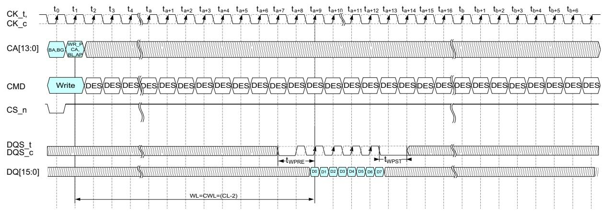  
NOTE 1 BC=8, 2tCK Preamble, 1.5tCK Postamble  
NOTE 2 DES commands are shown for ease of illustration; other commands may be valid at these times.  
NOTE 3 In non-CRC mode, DQS_t and DQS_c stop toggling at the completion of the BC8 data bursts, plus the postamble.

# 4.8.2 Write Burst Operation (Cont'd)

Figure 43 — Write (BL16) to Precharge Operation with 2tCK Preamble  
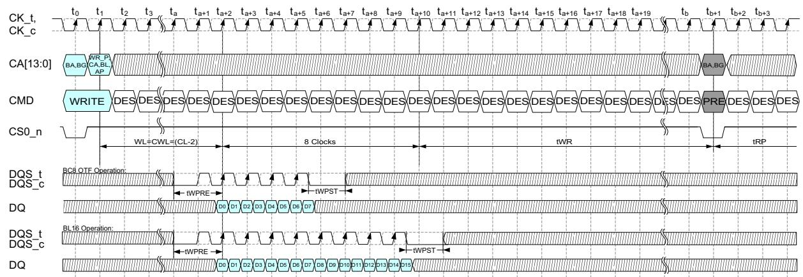  
NOTE 1 BC=8 or BL=16, Preamble = 2tCK - 0010 pattern, Postamble = 1.5tCK  
NOTE 2 DES commands are shown for ease of illustration; other commands may be valid at these times.  
NOTE 3 The write recovery time (tWR) is referenced from the first rising clock edge after the last write data shown at Ta+10  
tWR specifies the last burst write cycle until the precharge command can be issued to the same bank.

Figure 44 - Write (BL16) with Auto Precharge Operation and 2tCK Preamble  
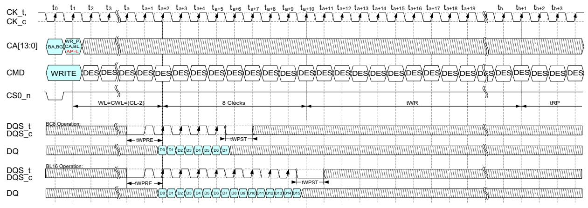  
NOTE 1 BC OTF=8 or BL=16, Preamble = 2tCK - 0010 pattern, Postamble = 1.5tCK  
NOTE 2 DES commands are shown for ease of illustration; other commands may be valid at these times.  
NOTE 3 The write recovery time (WR) is referenced from the first rising clock edge after the last write data shown at Ta+10.  
WR specifies the last burst write cycle until the precharge command can be issued to the same bank.

# 4.8.3 Write Timing Parameters

Figure 45 is for example only to enumerate the strobe edges for a particular write burst. For a valid burst, all timing parameters for each edge of a burst must be satisfied.  
Figure 45 — DDR5 Write Timing Parameters  
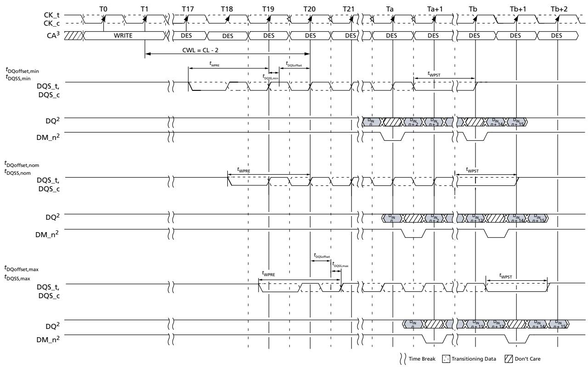  
NOTE 1 BL=16, Preamble=2CK - 0010 pattern, Postamble=1.5CK,  
NOTE 2 DES commands are shown for ease of illustration, other commands may be valid at these times.  
NOTE 3  $t_{\mathrm{DOSS}}$  must be met at each rising clock edge.  
NOTE 4 Figure assumes DRAM internal WL training complete.  
NOTE 5 DQ/DM_n pulse timing and DQS to DQ skew defined by Rx Strobe Jitter Sensitivity Specifications for the respective speed bin.

# 4.8.4 Write Burst Operation for Optional BL32 Mode

The following write timing diagrams cover write timings for fixed BL32, BL32 in BL32 OTF mode and BL16 in BL32 OTF mode for x4 devices only.

In these write timing diagrams, for clarity of illustration, CK and DQS are shown aligned. As well, DQS and DQ are shown center-aligned. Offset between CK and DQS, and between DQS and DQ may be appropriate.

A dummy CAS command is required for second half of the transfer of BL32. If non-target ODT is needed in the system then a dummy ODT command must be issued to the non-target rank for second half of the transfer of BL32

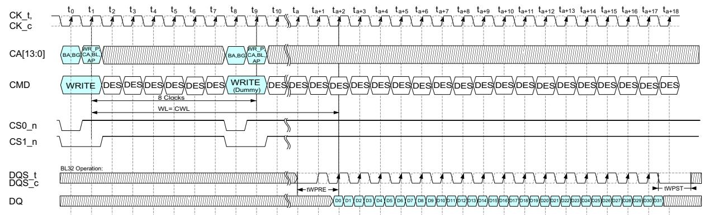

NOTE 1 BL=32, 2tCK Preamble, 1.5tCK Postamble  
NOTE 2 DES commands are shown for ease of illustration; other commands may be valid at these times.  
NOTE 3 A dummy WR command is required for the second half of the transfer with a delay of 8 clocks from the first WR command.  
NOTE 4 The figure also shows a dummy ODT command being issued to non-target rank 1 for the second half of the transfer.  
NOTE 5 C10 is used for burst ordering and must be LOW for the first WR command.  
NOTE 6 DDR5 DRAM supports an optional fixed BL32 mode and optional BL32 OTF (On the fly) mode for x4 devices only.

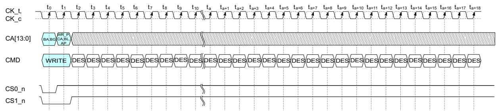  
Figure 46 - Write Timing for Fixed BL32 and BL32 in BL32 OTF Mode  
Figure 47 - Write Timings for BL16 in BL32 OTF Mode

NOTE 1 Figure shows BL16 write operation when MR0 is programmed to use BL32 OTF mode. In this case, no dummy WR command is required as transfer size is BL16.  
NOTE 2 DES commands are shown for ease of illustration; other commands may be valid at these times including commands to allow data transfer from the same die after transfer of BL16.  
NOTE 3 DDR5 DRAM supports an optional fixed BL32 mode and optional BL32 OTF (On the fly) mode for x4 devices only.

# 4.8.4 Write Burst Operation for Optional BL32 Mode (Cont'd)

Figure 48 - Write to Write to Different Bank Group for BL16 in BL32 OTF  
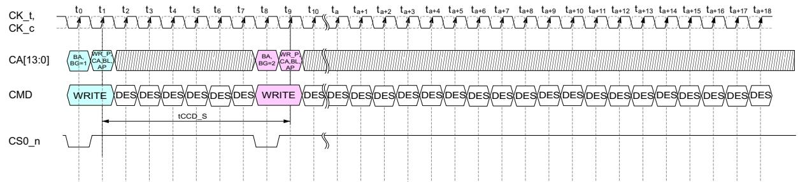  
NOTE 1 Figure shows back to back BL16 writes to different bank groups.  
NOTE 2 DDR5 DRAM supports an optional fixed BL32 mode and optional BL32 OTF (On the fly) mode for x4 devices only.

Figure 49 - Write to Write to Same Bank Group for BL16 in BL32 OTF  
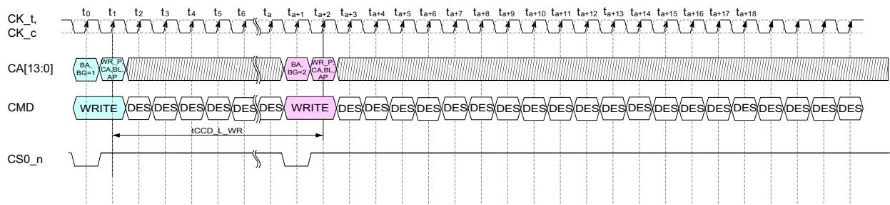  
NOTE 1 Figure shows back to back BL16 writes to same bank group using a timing of tCCDL_WR.  
NOTE 2 Back to Back BL32 writes to same bank group shall have a minimum separation of 16 clocks.  
NOTE 3 DDR5 DRAM supports an optional fixed BL32 mode and optional BL32 OTF (On the fly) mode for x4 devices only.

Figure 50 - Write with Auto-Precharge for Fixed BL32 and BL32 in BL32 OTF Mode  
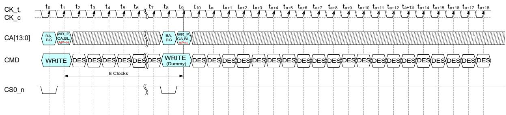  
NOTE 1 AP bit must be set HIGH for first CAS and LOW for dummy CAS command.  
NOTE 2 DDR5 DRAM supports an optional fixed BL32 mode and optional BL32 OTF (On the fly) mode for x4 devices only.

Figure 51 - Write with Auto-Precharge for BL16 in BL32 OTF Mode  
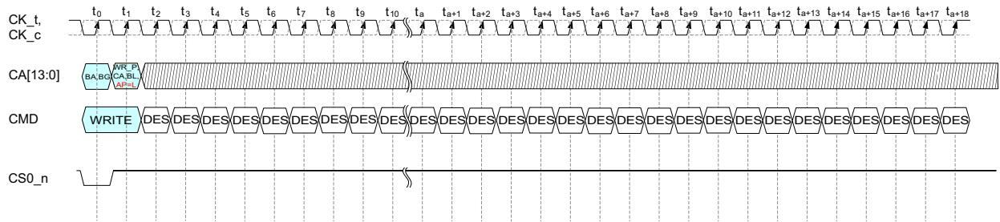  
NOTE 1 AP bit must be set to LOW with the CAS command.  
NOTE 2 DDR5 DRAM supports an optional fixed BL32 mode and optional BL32 OTF (On the fly) mode for x4 devices only.

# 4.8.5 Same Bank Group Write to Write Timings

DDR5 devices will have separate same bank group write timings, based on whether the second write requires an RMW (Read-Modify-Write) access or JW (Just-Write) access. In JW access, DDR5 updates all 128 bits of data on the addressed codeword, while in RMW access, a part of 128 bits is updated.

Table 262 — JW (Just-Write) Access and RMW (Read-Modify-Write) Access Definition  

<table><tr><td rowspan="2">Configuration</td><td colspan="2">BL16</td><td colspan="2">BC8</td><td rowspan="2">Optional BL32</td><td rowspan="2">Notes</td></tr><tr><td>Normal</td><td>Data Mask</td><td>Normal</td><td>Data Mask</td></tr><tr><td>x4</td><td>RMW</td><td>—</td><td>RMW</td><td>—</td><td>JW</td><td>1,2,3</td></tr><tr><td>x8 / x16</td><td>JW</td><td colspan="3">RMW</td><td>—</td><td>1,2,3</td></tr><tr><td colspan="7">NOTE 1 BC8 refers to BC8 OTF mode enabled by MR0 OP[1:0]=01B, where Write command is issued with BL=L in CA5.</td></tr><tr><td colspan="7">NOTE 2 Optional BL32 refers to BL32 fixed mode enabled by MR0 OP[1:0]=10B or BL32 OTF mode enabled by MR0 OP[1:]=11B, where Write command is issued with BL=L in CA5.</td></tr><tr><td colspan="7">NOTE 3 Data Mask refers to Data Mask mode enabled by MR5 OP[5]=1B, where Write command is issued with WP=L in CA11.</td></tr></table>

Table 263 — Same Bank-Group Write Access to RMW Access Timings  

<table><tr><td rowspan="2">From</td><td colspan="2">To</td><td rowspan="2">Notes</td></tr><tr><td>BL16</td><td>BC8</td></tr><tr><td>BL16</td><td>tCCD_L_WR</td><td>tCCD_L_WR</td><td>1,2,3</td></tr><tr><td>BC8</td><td>tCCD_L_WR</td><td>tCCD_L_WR</td><td>1,2,3</td></tr><tr><td>Optional BL32</td><td>8nCK+tCCD_L_WR</td><td>—</td><td>1,2,3,4</td></tr><tr><td colspan="4">NOTE 1 BC8 refers to BC8 OTF mode enabled by MR0 OP[1:0]=01B, where Write command is issued with BL=L in CA5.</td></tr><tr><td colspan="4">NOTE 2 Optional BL32 refers to BL32 fixed mode enabled by MR0 OP[1:0]=10B or BL32 OTF mode enabled by MR0 OP[1:]=11B, where Write command is issued with BL=L in CA5.</td></tr><tr><td colspan="4">NOTE 3 In Optional BL32 case, this timing table affects to the 1st Write command only, not the dummy Write command.</td></tr><tr><td colspan="4">NOTE 4 There is no BL32 to BC8 case.</td></tr></table>

Table 264 — Same Bank-Group Write Access to JW Access Timings  

<table><tr><td rowspan="2">From</td><td colspan="2">To</td><td rowspan="2">Notes</td></tr><tr><td>BL16</td><td>Optional BL32</td></tr><tr><td>BL16</td><td>tCCD_L_WR2</td><td>tCCD_L_WR2</td><td>1,2,3</td></tr><tr><td>BC8</td><td>tCCD_L_WR2</td><td>—</td><td>1,2,3,4</td></tr><tr><td>Optional BL32</td><td>—</td><td>8nCK+tCCD_L_WR2</td><td>1,2,3</td></tr><tr><td colspan="4">NOTE 1 BC8 refers to BC8 OTF mode enabled by MR0 OP[1:0]=01B, where Write command is issued with BL=L in CA5.</td></tr><tr><td colspan="4">NOTE 2 Optional BL32 refers to BL32 fixed mode enabled by MR0 OP[1:0]=10B or BL32 OTF mode enabled by MR0 OP[1:]=11B, where Write command is issued with BL=L in CA5.</td></tr><tr><td colspan="4">NOTE 3 In Optional BL32 case, this timing table affects to the 1st Write command only, not the dummy Write command.</td></tr><tr><td colspan="4">NOTE 4 There is no BC8 to BL32 case.</td></tr></table>

# 4.8.6 Different Bank-Group Write to Write Timings

Table 265 — Different Bank-Group Write to Write Timings  

<table><tr><td rowspan="2">From</td><td colspan="3">To</td><td rowspan="2">Notes</td></tr><tr><td>BL16</td><td>BC8</td><td>Optional BL32</td></tr><tr><td>BL16</td><td>8nCK</td><td>8nCK</td><td>8nCK</td><td>1,2,3</td></tr><tr><td>BC8</td><td>8nCK</td><td>8nCK</td><td>—</td><td>1,2,3,4</td></tr><tr><td>Optional BL32</td><td>16nCK</td><td>—</td><td>16nCK</td><td>1,2,3,4</td></tr><tr><td colspan="5">NOTE 1 BC8 refers to BC8 OTF mode enabled by MR0 OP[1:0]=01B, where Write command is issued with BL=L in CA5.</td></tr><tr><td colspan="5">NOTE 2 Optional BL32 refers to BL32 fixed mode enabled by MR0 OP[1:0]=10B or BL32 OTF mode enabled by MR0 OP[1:]=11B, where Write command is issued with BL=L in CA5.</td></tr><tr><td colspan="5">NOTE 3 In Optional BL32 case, this timing table affects to the 1st Write command only, not the dummy Write command.</td></tr><tr><td colspan="5">NOTE 4 There is no BC8 to BL32 case.</td></tr></table>

# 4.8.7 Write Timing Violations

# 4.8.7.1 Motivation

Generally, if Write timing parameters are violated, a complete reset/initialization procedure has to be initiated to make sure that the DRAM works properly. However, it is desirable, for certain violations as specified in this section, the DRAM is guaranteed to not "hang up," and that errors are limited to that particular operation.

For the following cases, it will be assumed that there are no timing violations with regards to the Write command itself (including ODT, etc.) and that it does satisfy all timing requirements not mentioned in the following sections.

# 4.8.7.2 Data to Strobe Eye Height or Width Violations

Should the required data to strobe timing or voltage parameters be violated (Such as: tRx_RDQ_tMargin, tRx_DQS2DQ_Skew, VRx_DQS, VRx_DQ, etc.), for any of the data/strobe timing edges or data/strobe voltage limits associated with a write burst data eye, then incorrect data might be written to the memory locations addressed with this WRITE command.

In the example, Figure TBD, the relevant strobe edges for a write burst are associated with the clock edges:  $\mathrm{Tn,Tn + 0.5,Tn + 1,\dots,Tn + 8.5}$

Subsequent reads from that location might results in unpredictable read data, however the DRAM will work properly otherwise.

# 4.8.7.3 Strobe and Strobe to Clock Timing Violations

Should the strobe timing requirements (tWPRE, tWPST) or the strobe to clock timing requirements (tDQSS, tDQOffset) be violated for any of the strobe edges associated with a Write burst, then wrong data might be written to the memory location addressed with the offending WRITE command. Subsequent reads from that location might result in unpredictable read data, however the DRAM will work properly otherwise with the following constraints:

1 Both Write CRC and data burst OTF are disabled; timing specifications other than tWPRE, tWPST, tDQSS, tDQOffset are not violated.  
2 The offending write strobe (and preamble) arrive no earlier or later than six DQS transition edges from the Write-Latency position.  
3 A Read command following an offending Write command from any open bank is allowed.  
4 One or more subsequent WR or a subsequent WRA {to same bank as offending WR} may be issued tCCD_L later but incorrect data could be written; subsequent WR and WRA can be either offending or non-offending Writes. Reads from these Writes may provide incorrect data.  
One or more subsequent WR or a subsequent WRA {to a different bank group} may be issued tCCD_S later but incorrect data could be written; subsequent WR and WRA can be either offending or non-offending Writes. Reads from these Writes may provide incorrect data.  
6 Once one or more precharge commands (PREpb, PREsb, or PREab) are issued to DDR5 after offending WRITE command and all banks become precharged state (idle state), a subsequent, non-offending WR or WRA to any open bank shall be able to write correct data.  
7 DQS strobes including preamble must align to each Write commands data burst length configuration. If the DRAM fails to capture or incorrectly de-serializes the incoming data stream because of misalignment or missing strobe edges, errors may occur. These errors will propagate indefinitely until the DRAM is put into an idle state, i.e., all banks are in the precharged state with tRP satisfied.

# 4.8.8 Write Enable Timings

The following specifies the relationship between the write enable timing window tWPRE_EN_ntck and the DRAM related DQS to CK drift window tDQSD as well as the system related DQS to CK drift window tDQSS around the final DQS to CK offset trained pass/fail point tDQSoffset based on write leveling feedback in order to support n-tck pre-amble mode. Functional operation requires that the following condition is met:

- tWPRE_EN_ntck >= |tDQSSmin|+tDQSSmax+|tDQSDmin|+tDQSDmax

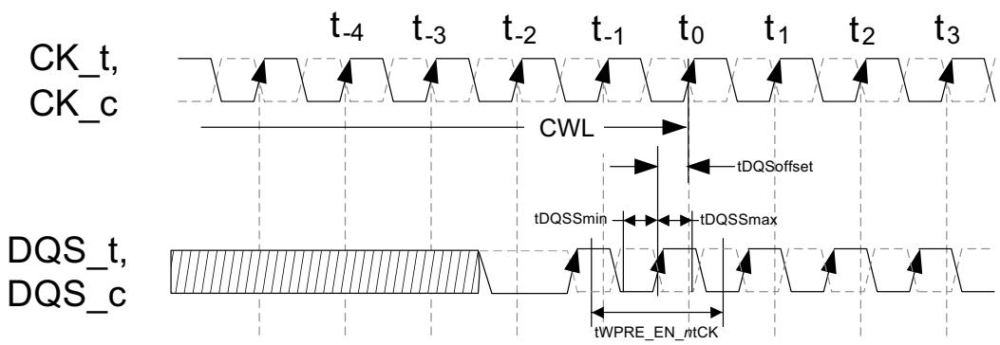  
Figure 52 — tDQSS: DRAM External CLK-to-DQS Variation

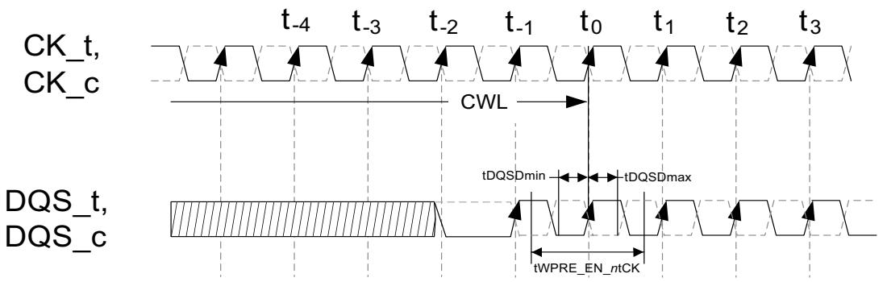  
Figure 53 — tDQSD: DRAM Internal CLK-to-DQS Variation

# 4.8.8 Write Enable Timings (Cont'd)

Table 266 - Write Enable Timing Parameters DDR5 3200 to 4800  

<table><tr><td rowspan="2">Parameter</td><td rowspan="2">Symbol</td><td colspan="2">Speed Bins x4 &amp; x8 DDR5 3200-4800</td><td colspan="2">Speed Bins x16 DDR5 3200-4800</td><td rowspan="2">Unit</td><td rowspan="2">Notes</td></tr><tr><td>Min</td><td>Max</td><td>Min</td><td>Max</td></tr><tr><td>2-tck Write pre-amble enable window</td><td>tWPRE_EN_2tck</td><td>1.5</td><td>-</td><td>1.5</td><td>-</td><td>tCK</td><td>2</td></tr><tr><td>3-tck Write pre-amble enable window</td><td>tWPRE_EN_3tck</td><td>2.5</td><td>-</td><td>2.5</td><td>-</td><td>tCK</td><td>2</td></tr><tr><td>4-tck Write pre-amble enable window</td><td>tWPRE_EN_4tck</td><td>2.5</td><td>-</td><td>2.5</td><td>-</td><td>tCK</td><td>2</td></tr><tr><td>Final trained value of host DQS_t-DQS_c timing relative to CWL CK_t-CK_c edge</td><td>tDQOffset</td><td>-0.5</td><td>0.5</td><td>-0.5</td><td>0.5</td><td>tCK</td><td>3</td></tr><tr><td>DRAM voltage/temperature drift window of first rising DQS_t pre-amble edge relative to CWL CK_t-CK_c edge</td><td>tDQSD</td><td>-0.25*tWPRE_EN_ntCK</td><td>0.25*tWPRE_EN_ntCK</td><td>-0.25*tWPRE_EN_ntCK</td><td>0.25*tWPRE_EN_ntCK</td><td>tCK</td><td>1</td></tr><tr><td>Host and system voltage/temperature drift window of first rising DQS_t pre-amble edge relative to CWL CK_t-CK_c edge</td><td>tDQSS</td><td>-0.25*tWPRE_EN_ntCK</td><td>0.25*tWPRE_EN_ntCK</td><td>-0.25*tWPRE_EN_ntCK</td><td>0.25*tWPRE_EN_ntCK</td><td>tCK</td><td>1</td></tr><tr><td colspan="8">NOTE 1 Measured relative to the write leveling feedback, after write leveling training has been completed.NOTE 2 Includes min DQS and CK timing terms TBD.NOTE 3 When measuring the tDQOffset, tWLS/H are reflected in the tDQOffset result.</td></tr></table>

Table 267 - Write Leveling Setup/Hold Time  

<table><tr><td>Symbol</td><td>Description</td><td>Min</td><td>Max</td><td>Unit</td></tr><tr><td>tWLS/H</td><td>Write Leveling Setup/Hold Time</td><td>-80</td><td>+80</td><td>ps</td></tr></table>

Table 268 - Write Enable Timing Parameters DDR5 5200 to 6400  

<table><tr><td rowspan="2">Parameter</td><td rowspan="2">Symbol</td><td colspan="2">Speed Bins x4 &amp; x8 DDR5 5200-6400</td><td colspan="2">Speed Bins x16 DDR5 5200-6400</td><td rowspan="2">Unit</td><td rowspan="2">Notes</td></tr><tr><td>Min</td><td>Max</td><td>Min</td><td>Max</td></tr><tr><td>2-tck Write pre-amble enable window</td><td>tWPRE_EN_2tck</td><td>1.5</td><td>-</td><td>1.5</td><td>-</td><td>tCK</td><td>2</td></tr><tr><td>3-tck Write pre-amble enable window</td><td>tWPRE_EN_3tck</td><td>2.5</td><td>-</td><td>2.5</td><td>-</td><td>tCK</td><td>2</td></tr><tr><td>4-tck Write pre-amble enable window</td><td>tWPRE_EN_4tck</td><td>2.5</td><td>-</td><td>2.5</td><td>-</td><td>tCK</td><td>2</td></tr><tr><td>Final trained value of host DQS_t-DQS_c timing relative to CWL CK_t-CK_c edge</td><td>tDQOffset</td><td>-0.5</td><td>0.5</td><td>-0.5</td><td>0.5</td><td>tCK</td><td>3</td></tr><tr><td>DRAM voltage/temperature drift window of first rising DQS_t pre-amble edge relative to CWL CK_t-CK_c edge</td><td>tDQSD</td><td>-0.25*tWPRE_EN_ntCK</td><td>0.25*tWPRE_EN_ntCK</td><td>-0.25*tWPRE_EN_ntCK</td><td>0.25*tWPRE_EN_ntCK</td><td>tCK</td><td>1</td></tr><tr><td>Host and system voltage/temperature drift window of first rising DQS_t pre-amble edge relative to CWL CK_t-CK_c edge</td><td>tDQSS</td><td>-0.25*tWPRE_EN_ntCK</td><td>0.25*tWPRE_EN_ntCK</td><td>-0.25*tWPRE_EN_ntCK</td><td>0.25*tWPRE_EN_ntCK</td><td>tCK</td><td>1</td></tr><tr><td colspan="8">NOTE 1 Measured relative to the write leveling feedback, after write leveling training has been completed.NOTE 2 Includes min DQS and CK timing terms TBD.NOTE 3 When measuring the tDQOffset, tWLS/H are reflected in the tDQOffset result.</td></tr></table>

# 4.8.8 Write Enable Timings (Cont'd)

Table 269 - Write Enable Timing Parameters DDR5 6800 to 8400  

<table><tr><td rowspan="2">Parameter</td><td rowspan="2">Symbol</td><td colspan="2">Speed Bins x4 &amp; x8 DDR5 5200-6400</td><td colspan="2">Speed Bins x16 DDR5 5200-6400</td><td rowspan="2">Unit</td><td rowspan="2">Notes</td></tr><tr><td>Min</td><td>Max</td><td>Min</td><td>Max</td></tr><tr><td>2-tck Write pre-amble enable window</td><td>tWPRE_EN_2tck</td><td>1.5</td><td>-</td><td>1.5</td><td>-</td><td>tCK</td><td>2</td></tr><tr><td>3-tck Write pre-amble enable window</td><td>tWPRE_EN_3tck</td><td>2.5</td><td>-</td><td>2.5</td><td>-</td><td>tCK</td><td>2</td></tr><tr><td>4-tck Write pre-amble enable window</td><td>tWPRE_EN_4tck</td><td>2.5</td><td>-</td><td>2.5</td><td>-</td><td>tCK</td><td>2</td></tr><tr><td>Final trained value of host DQS_t-DQS_c timing relative to CWL_CK_t-CK_c edge</td><td>tDQOffset</td><td>TBD</td><td>0.5</td><td>TBD</td><td>0.5</td><td>tCK</td><td></td></tr><tr><td>DRAM voltage/temperature drift window of first rising DQS_t pre-amble edge relative to CWL_CK_t-CK_c edge</td><td>tDQSD</td><td>-0.25*tWPRE_EN_ntCK</td><td>0.25*tWPRE_EN_ntCK</td><td>-0.TBD*tWPRE_EN_ntCK</td><td>0.TBD*tWPRE_EN_ntCK</td><td>tCK</td><td>1</td></tr><tr><td>Host and system voltage/temperature drift window of first rising DQS_t pre-amble edge relative to CWL_CK_t-CK_c edge</td><td>tDQSS</td><td>-0.25*tWPRE_EN_ntCK</td><td>0.25*tWPRE_EN_ntCK</td><td>-0.TBD*tWPRE_EN_ntCK</td><td>0.TBD*tWPRE_EN_ntCK</td><td>tCK</td><td>1</td></tr><tr><td colspan="8">NOTE 1 Measured relative to the write leveling feedback, after write leveling training has been completed. 
NOTE 2 Includes min DQS and CK timing terms TBD.</td></tr></table>

# 4.9 Self Refresh Operation

The Self-Refresh command can be used to retain data in the DDR5 SDRAM, even if the rest of the system is powered down. When in the Self-Refresh mode, the DDR5 SDRAM retains data without external clocking. The DDR5 SDRAM device has a built-in timer to accommodate Self-Refresh operation. While in Self Refresh, the DDR5 SDRAM adjusts and updates its internal average periodic refresh interval, as needed, based on its own temperature sensor. The internal average periodic refresh interval adjustment (increasing, decreasing or staying constant) does not require any external control.

Self Refresh entry is command based (SRE), while the Self-Refresh Exit Command is defined by the transition of CS_n LOW to HIGH with a defined pulse width tCSH_SRexit, followed by three or more NOP commands (tCSL_SRexit) to ensure DRAM stability in recognizing the exit. This is described in the following sections in more detail.

Before issuing the Self-Refresh-Entry command, the DDR5 SDRAM must be idle with all bank precharge state with tRP satisfied. 'Idle state' is defined as all banks are closed (tRP, etc. satisfied), no data bursts are in progress, and all timings from previous operations are satisfied (tMRD, tRFC, etc.). A Deselect command must be registered on the last positive clock edge before issuing Self Refresh Entry command. Once the Self Refresh Entry command is registered, Deselect commands must also be registered at the next positive clock edges until tCPDED is satisfied. After tCPDED has been satisfied, CS_n must transition low. After CS_n transitions low at the end of tCPDED, the CS_n shall stay low until exit. The DDR5 SDRAM may switch to a CMOS based receiver to save more power and that transition should coincide with CS_n going low.

When the CS_n is held low, the DRAM automatically disables ODT termination and sets Hi-Z as termination state regardless of RTT configuration for the duration of Self-Refresh mode. Upon exiting Self-Refresh, DRAM automatically enables ODT termination and set RTT PARK (for DQs) asynchronously during tXSDLL when RTT PARK is enabled. CA/CS/CK ODT shall revert to its strapped or its MR ODT Setting state if previously applied. During normal operation (DLL on) the DLL is automatically disabled upon entering Self-Refresh and is automatically enabled (including a DLL-Reset) upon exiting Self-Refresh.

When the DDR5 SDRAM has entered Self-Refresh mode, all of the external control signals, except CS_n and RESET_n, are "don't care." For proper Self-Refresh operation, all power supply and reference pins (VDD, VDDQ, VSS, VSSQ and VPP) must be at valid levels. DRAM internal VrefDQ and/or VrefCA generator circuitry may remain ON or turned OFF depending on DRAM design. If DRAM internal VrefDQ and/or VrefCA circuitry is turned OFF in self refresh, when DRAM exits from self refresh state, it ensures that VrefDQ and/or VrefCA and generator circuitry is powered up and stable within tXS period. First Write operation or first Write Leveling Activity may not occur earlier than tXS after exit from Self Refresh. The DRAM initiates a minimum of one Refresh command internally within tSR period once it enters Self-Refresh mode.

The clocks must stay on until tCKLCS but can be DON'T CARE after tCKLCS expires but it should be noted that shortly after tCPDED, the termination for the clocks will be off. The clock is internally disabled (in the DRAM) during Self-Refresh Operation to save power. The minimum time that the DDR5 SDRAM must remain in Self-Refresh mode is tCSL. The user may change the external clock frequency or halt the external clock tCKLCS after Self-Refresh entry is registered, however, the clock must be restarted and stable tCKSRX before the device can exit Self-Refresh operation.

The procedure for exiting Self-Refresh requires a sequence of events. Since the DRAM will switch to a CMOS based driver to save power, the DRAM will trigger Self-Refresh exit upon seeing the CS_n transition from low to high and stay high for tCSH_SRExit. tCASRX prior to CS_n transitioning high, the CA bus must be driven high. Once tCSH_SRExit is satisfied, three NOP commands must be issued, otherwise the DRAM could be put into an unknown state.

# 4.9 Self Refresh Operation (Cont'd)

The clocks must be valid for tCKSRX prior to issuing the NOP commands that completes the Self Refresh exit sequence. Once a Self-Refresh Exit is registered, the following timing delay must be satisfied:

1 Commands that do not require locked DLL:

tXS - ACT, MPC, MRW, PDE, PDX, PRE(ab,sb,pb), REF(ab,sb), RFM(ab,sb), SRE, VREFCA & WRP

2 Commands that require locked DLL:

tXSDLL-RD,MRR&WR

Depending on the system environment and the amount of time spent in Self-Refresh, ZQ calibration commands may be required to compensate for the voltage and temperature drift as described in "ZQ Calibration Commands." To issue ZQ calibration commands, applicable timing requirements must be satisfied.

Upon exiting Self Refresh, one additional refresh shall be issued in addition to refreshes normally scheduled. This refresh counts toward the maximum number of refreshes which may be postponed. The extra refresh consists of a single REFab command or n * REFsb, where n is the number of banks in a bank group. If Self Refresh is to be re-entered and no regularly scheduled periodic refresh commands have been issued, a minimum of one REFab or n*REFsb commands shall be issued prior to Self Refresh re-entry.

The exit timing from self refresh exit to first valid command not requiring a locked DLL is tXS.

The value of tXS is (tRFC). This delay is to allow for any refreshes started by the DRAM to complete. tRFC continues to grow with higher density devices so tXS will grow as well.

Figure 54 — Self-Refresh Entry/Exit Timing w/ 2-Cycle Exit Command  
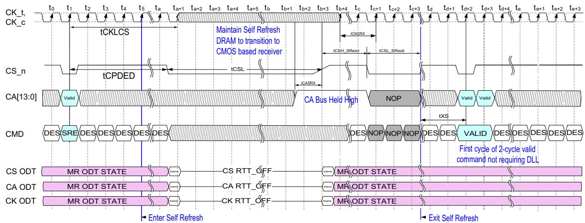  
NOTE 1 While in 2N mode, tCSL_SRexit will not be statically held low (as shown in the figure), as it will pulse for each 2 cycle period. Refer to Section 4.9.1 for more details.  
NOTE 2 Both tCSH_SExit and tCSL_SExit timings must be satisfied to guarantee DRAM operation.  
NOTE 3 When tCSH_SRexit,min expires, the CA bus is allowed to transition from all bits High to any valid (V) level. Prior to CS_n being registered Low at tc+1, the CA bus must transition to NOP conforming to the CAI state of the DRAM and complying with applicable DRAM input timing parameters.

# 4.9 Self Refresh Operation (Cont'd)

Figure 55 — Self-Refresh Entry/Exit Timing w/ 1-Cycle Exit Command  
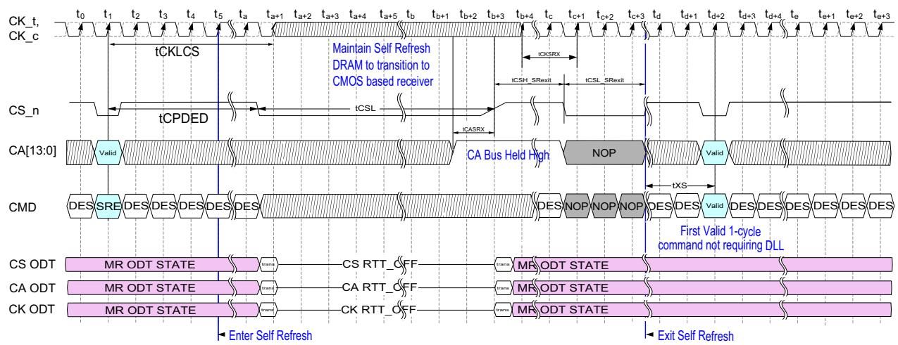  
NOTE 1 While in 2N mode, tCSL_SRexit will not be statically held low (as shown in the figure), as it will pulse for each 2 cycle period. Refer to Section 4.9.1 for more details.  
NOTE 2 Both tCSH_SExit and tCSL_SExit timings must be satisfied to guarantee DRAM operation.  
NOTE 3 When tCSH_SExit,min expires, the CA bus is allowed to transition from all bits High to any valid (V) level. Prior to CS_n being registered Low at tc+1, the CA bus must transition to NOP conforming to the CAI state of the DRAM and complying with applicable DRAM input timing parameters.

Table 270 — Self-Refresh Timing Parameters  

<table><tr><td>Parameter</td><td>Symbol</td><td>Min</td><td>Max</td><td>Unit</td><td>Note</td></tr><tr><td>Command pass disable delay</td><td>tCPDED</td><td>max(5ns, 8nCK)</td><td>-</td><td>ns</td><td></td></tr><tr><td>Self-Refresh CS_n low Pulse width</td><td>tCSL</td><td>10</td><td>-</td><td>ns</td><td></td></tr><tr><td>Self-Refresh exit CS_n High Pulse width</td><td>tCSH_SRexit</td><td>13</td><td>30</td><td>ns</td><td></td></tr><tr><td>Self-Refresh exit CS_n Low Pulse width</td><td>tCSL_SRexit</td><td>3nCK</td><td>30ns</td><td></td><td>1</td></tr><tr><td>Valid Clock Requirement before SRX</td><td>tCKSRX</td><td>max(3.5ns, 8tCK)</td><td>-</td><td>ns</td><td></td></tr><tr><td>Valid Clock Requirement after SRE</td><td>tCKLCS</td><td>tCPDED + 1nCK</td><td>-</td><td>nCK</td><td></td></tr><tr><td>Self-Refresh exit CS_n high</td><td>tCASRX</td><td>0</td><td></td><td>ns</td><td></td></tr><tr><td>Exit Self-Refresh to next valid command NOT requiring a DLL</td><td>tXS</td><td>tRFC1</td><td></td><td>ns</td><td></td></tr><tr><td>Exit Self-Refresh to next valid command requiring a DLL</td><td>tXS DLL</td><td>tDLLK</td><td></td><td>ns</td><td></td></tr><tr><td colspan="6">NOTE 1 While in 2N mode, tCSL_SRexit will not be statically held low, as it will pulse for each 2-cycle period for a min of 6nCK. Refer to Section 4.9.1 for more details.</td></tr></table>

# 4.9.1 Self Refresh in 2N Mode

Figure 56 shows details for Self Refresh entry/exit in 2N Mode. Only SRX, with a pulsing CS_n (NOP-DES-NOP-DES-NOP) during tCSL_SRexit, to a 1-cycle command is shown, but behavior is similar for SRX to a 2-cycle command. Behavior is similar for Frequency Change during Self Refresh, with or without VREF and/or ODT changes. Pulsing CS_n during tCSL_SRexit is not required for Self Refresh exit (e.g., CS_n may optionally be held low for the full tCSL_SRexit duration).

Figure 56 — Self-Refresh Entry/Exit Timing in 2N Mode w/ 1-Cycle Exit Command  
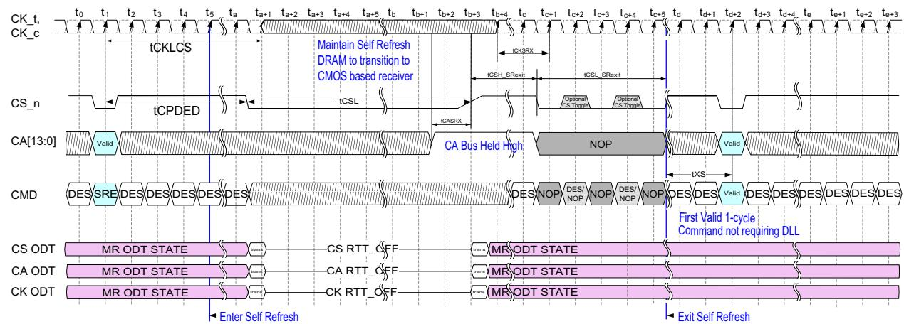  
NOTE 1 Both tCSH_SExit and tCSL_SExit timings must be satisfied to guarantee DRAM operation.  
NOTE 2 When tCSH_SExit,min expires, the CA bus is allowed to transition from all bits High to any valid (V) level. Prior to CS_n being registered Low at tc+1, the CA bus must transition to NOP conforming to the CAI state of the DRAM and complying with applicable DRAM input timing parameters.

# 4.10 Power Down Mode

DDR5's power down mode is new to the DDR family, as it no longer has a CKE pin to control entry and exit. Instead, the PDE/PDX move to command based, triggered by the CS_n. Once in PD mode, the CS_n acts effectively like the historic CKE pin, waiting for it to transition from HIGH to LOW (with its command). In PDE mode, it should be sampled on every edge.

# 4.10.1 Power-Down Entry and Exit

Power-down is entered when the command is registered. Unlike Self Refresh Mode, CS_n will NOT be held low constantly while in Power-Down. Timing diagrams are shown in Figure 57 with details for entry and exit of Power-Down.

The DLL should be in a locked state when power-down is entered for fastest power-down exit timing. SDRAM design provides all AC and DC timing and voltage specification as well as proper DLL operation as long as DRAM controller complies with SDRAM specifications.

During Power-Down, if all banks are closed after any in-progress commands are completed, the device will be in precharge Power-Down mode; if any bank is open after in-progress commands are completed, the device will be in active Power-Down mode.

Entering power-down deactivates the input and output buffers, excluding CK_t, CK_c, CS_n, RESET_n. If CA11=L during the PDE command, CA1 and CA4 will also be excluded, allowing the appropriate NT ODT command to be passed through and decoded by the non-target SDRAM while the target SDRAM remains in power down (i.e., the SDRAM will monitor commands that utilize NT ODT via CA1 and CA4 and will not exit Power Down if a valid NT ODT command is registered). If CA11=H during the PDE command, only the PDX command, qualified by CS_n, is legal during power down. If CA11=L during the PDE command, only NT ODT commands and PDX commands, qualified by CS_n, are legal during power down. Refer to Table 241 for more information.

MRR NT ODT commands during Power Down are not support with Burst on the fly (OTF) modes in MR0:OP[1:0].

When power-down is entered with ODT control enabled (CA11=L) the DRAM will continue to accept NT termination commands throughout the power-down process, including entry and exit. Upon entry, during the tCPDED period, the DRAM will be switching from decoding all CA bus command bits to only decoding CA1 and CA4. During this time all CA command bits must be valid when CS_n is asserted with the full RD or WR command, as the DRAM may still be decoding the full command. Following tCPDED, only CA1 and CA4 need be valid as the DRAM will be ignoring the others. Following the PDX command, all CA command bits must be valid for NT termination commands also, as the DRAM will be transitioning to decoding all bits. It is only the time between tCPDED completion and tXP that CA13:5, 3:2, & 0 need not be valid.

# 4.10.1 Power-Down Entry and Exit (Cont'd)

Figure 57 — Power-Down Entry and Exit Mode  
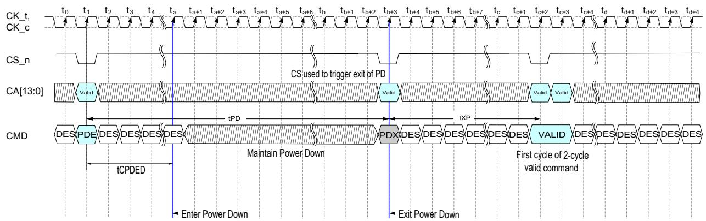  
NOTE 1 There is no specific PDX command. In the case of systems with register using CAI, the encoding out of the register may be inverted from a NOP type command.  
NOTE 2 Diagram is shown with a valid 2-cycle command after tXP for simplicity. 1-cycle valid commands are also legal.  
NOTE 3 CS_n shall be held HIGH, not toggled, during Power-Down, except Non-Target ODT command when PDE with CA11=L is asserted.

Table 271 — Power-Down Entry Definitions  

<table><tr><td>Status of DRAM</td><td>DLL</td><td>PD Exit</td><td>Relevant Parameters</td></tr><tr><td>Active
(A bank or more Open)</td><td>On</td><td>Fast</td><td>tXP to any valid command</td></tr><tr><td>Precharged
(All banks Precharged)</td><td>On</td><td>Fast</td><td>tXP to any valid command.</td></tr></table>

The DLL is kept enabled during precharge power-down or active power-down. (If RESET_n goes low during Power-Down, the DRAM will be out of PD mode and into reset state). Power-down duration is limited by 5 x tREFI1 of the device.

# 4.10.1 Power-Down Entry and Exit (Cont'd)

Table 272 — Power Down Timing Parameters  

<table><tr><td>Parameter</td><td>Symbol</td><td>Min</td><td>Max</td><td>Unit</td><td>Note</td></tr><tr><td>Command pass disable delay</td><td>tCPDED</td><td>max(5ns, 8nCK)</td><td>-</td><td>ns</td><td></td></tr><tr><td>Minimum Power Down Time</td><td>tPD</td><td>max(7.5ns, 8nCK)</td><td>-</td><td>ns</td><td></td></tr><tr><td>Exit Power Down to next valid command</td><td>tXP</td><td>max(7.5ns, 8nCK)</td><td></td><td>ns</td><td></td></tr><tr><td>Timing of ACT command to Power Down Entry command</td><td>tACTPDEN</td><td>2</td><td></td><td>nCK</td><td>1</td></tr><tr><td>Timing of PREab, PREsb or PREpb to Power Down Entry command</td><td>tPRPDEN</td><td>2</td><td></td><td>nCK</td><td>1</td></tr><tr><td>Timing of RD or RD w/AP to Power Down Entry command</td><td>tRDPDEN</td><td>RL+RBL/2+1</td><td></td><td>nCK</td><td>4</td></tr><tr><td>Timing of WR to Power Down Entry command</td><td>tWRPDEN</td><td>WL+WBL/2+(tWR/tCK(avg))+1</td><td></td><td>nCK</td><td>2, 4</td></tr><tr><td>Timing of WR w/AP to Power Down Entry command</td><td>tWRAPDEN</td><td>WL+WBL/2+WR+1</td><td></td><td>nCK</td><td>3, 4</td></tr><tr><td>Timing of REFab or REFsb command to Power Down Entry command</td><td>tREFPDEN</td><td>2</td><td></td><td>nCK</td><td></td></tr><tr><td>Timing of MRR to command to Power Down Entry command</td><td>tMRRPDEN</td><td>RL+8+1</td><td></td><td>nCK</td><td>4</td></tr><tr><td>Timing of MRW command to Power Down Entry command</td><td>tMRWPDEN</td><td>tMRD(min)</td><td></td><td>nCK</td><td></td></tr><tr><td>Timing of MPC command to Power Down Entry command</td><td>tMPCPDEN</td><td>tMPC_delay</td><td></td><td>nCK</td><td>5</td></tr><tr><td colspan="6">NOTE 1 Powerdown command can be sent while operations such as row activation, precharge, auto-precharge or refresh are in progress but IDD spec will not be applied until the operations are finished.</td></tr><tr><td colspan="6">NOTE 2 tWR is defined in ns, for calculation of tWRPDEN it is necessary to round up tWR/tCK.</td></tr><tr><td colspan="6">NOTE 3 WR in clock cycles as programmed in MR6.</td></tr><tr><td colspan="6">NOTE 4 RD/WR/MRR can refer to both Target command and Non-Target command when CA11=H during PDE command.</td></tr><tr><td colspan="6">NOTE 5 tMPD_delay is a valid timing parameter for all MPC commands except: 
a) Enter CS training Mode, Enter CA Training Mode, PDA Enumerate ID Program Mode because Power Down Entry is not supported for these MPC commands. 
b) Apply VrefCA, VrefCS and RTT_CA/CS/CK because this MPC command requires waiting for VrefCA_time/VREFCS_time.</td></tr></table>

Table 273 — Valid Command During Power Down with ODT Enabled  

<table><tr><td>CA1</td><td>CA4</td><td>Command</td><td>Operation of DRAM in Power Down</td></tr><tr><td>L</td><td>L</td><td>Write</td><td>DRAM will enable ODT_WR_NOM</td></tr><tr><td>L</td><td>H</td><td>Read</td><td>DRAM will enable ODT_RD_NOM</td></tr><tr><td>H</td><td>L</td><td>Illegal</td><td>Illegal. CS_n will NOT be asserted to a powered down DRAM with this combination</td></tr><tr><td>H</td><td>H</td><td>PDX(NOP)</td><td>Exit Power Down</td></tr><tr><td colspan="4">NOTE MRR NT ODT commands during Power Down are not supported with Burst on the fly (OTF) modes in MR0:OP[1:0].</td></tr></table>

# 4.11 Input Clock Frequency Change

Once the DDR5 SDRAM is initialized, the DDR5 SDRAM requires the clock to be "stable" during almost all states of normal operation. This means that, once the clock frequency has been set and is to be in the "stable state", the clock period is not allowed to deviate except for what is allowed for by the clock jitter and SSC (spread spectrum clocking) specifications.

The input clock frequency can be changed from one stable clock rate to another stable clock rate under Self-Refresh w/Frequency Change mode. Outside Self-Refresh w/Frequency Change mode, it is illegal to change the clock frequency.

Prior to entering Self-Refresh w/ Frequency Change mode, the host must program tCCD_L/tDLLK via MR13:OP[3:0] to the desired target frequency and configure VREFCA, RTT_CK, RTT_CS and RTT_CA if needed.

Once the DDR5 SDRAM has been successfully placed into Self-Refresh w/Frequency Change mode and tCKLCS has been satisfied, the state of the clock becomes a don't care. Once a don't care, changing the clock frequency is permissible, provided the new clock frequency is stable prior to tCKSRX. During tCSL_FreqChg and prior to exiting Self-Refresh, the DRAM will automatically apply the changes to tCCD_L/tDLLK, VREFCA, RTT_CK, RTT_CS and RTT_CA. When entering and exiting Self-Refresh mode for the sole purpose of changing the clock frequency, the Self-Refresh entry and exit specifications must still be met as outlined in Section 4.9. For the new clock frequency, Mode Registers may need to be configured (to program the appropriate CL, Preambles, Write Leveling Internal Cycle Alignment, etc.) prior to normal operation.

The DDR5 SDRAM input clock frequency is allowed to change only within the minimum and maximum operating frequency specified for the particular speed grade.

# 4.11.1 Frequency Change Steps

The following steps must be taken:

1 Prior to SRE command, there are several modes that must or can be configured:

a The host MUST program tCCD_L/tDLLK via MR13:OP[3:0] to the desired target frequency. During this stage, the values are set but not enabled.  
b The host can configure the appropriate CS/CA/CK ODT settings via Mode Register (MR32 & MR33) if new values are needed for the new target frequency. During this stage, the values are set but not enabled.  
c The host can configure the VREFCA & VREF CS via the VREFCA or VREFCS command(s). During this stage, the values are set but not enabled.

2 Enter SREF (Self Refresh Entry w/ Frequency Change) by sending the appropriate command (Similar to SRE with CA9='L').  
3 After tCPDED, the CS_n will transition low, indicating to the DRAM that the terminations are safe to turn off.  
4 After tCKLCS, the clocks can be turned off.  
5 Device enters Self Refresh.  
6 At this time, changing the clock frequency is permissible, provided the new clock frequency is stable prior to tCKSRX  
7 Exiting Self-Refresh w/Frequency Change follows the same process as normal Self-Refresh exit.  
8 After tXS, any additional mode registers that are needed for the new frequency can be configured or other commands not requiring a DLL may be issued. (ACT, MPC, MRW, PDE, PDX, PRE(ab, sb, pb), REF(ab, sb), RFM(ab, sb), SRE, VREFCA & WRP)  
9 After tXS_DLL, normal operations resume and all commands are legal.

# 4.11.1 Frequency Change Steps (Cont'd)

Table 274 — Self Refresh w/Freq Change (for Reference)  

<table><tr><td rowspan="2">Function</td><td rowspan="2">Abbreviation</td><td rowspan="2">CS</td><td colspan="15">CA Pins</td><td>NOTES</td></tr><tr><td>CA0</td><td>CA1</td><td>CA2</td><td>CA3</td><td>CA4</td><td>CA5</td><td>CA6</td><td>CA7</td><td>CA8</td><td>CA9</td><td>CA10</td><td>CA11</td><td>CA12</td><td>CA13</td><td></td><td></td></tr><tr><td>Self Refresh Entry w/ Frequency Change</td><td>SREF</td><td>L</td><td>H</td><td>H</td><td>H</td><td>L</td><td>H</td><td>V</td><td>V</td><td>V</td><td>V</td><td>L</td><td>L</td><td>V</td><td>V</td><td>V</td><td>1</td><td></td></tr><tr><td colspan="18">NOTE 1 See Table 241 for details</td><td></td></tr></table>

Figure 58 — Frequency Change during Self Refresh  
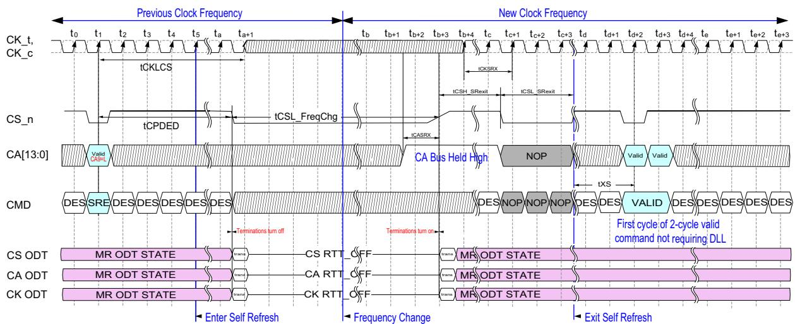  
NOTE 1 While in 2N mode, tCSL_SRexit will not be statically held low (as shown in the figure), as it will pulse for each 2 cycle period. Refer to Section 4.9.1 for more details.  
NOTE 2 Both tCSH_SExit and tCSL_SExit timings must be satisfied to guarantee DRAM operation.  
NOTE 3 Diagram is shown with a valid 2-cycle command after tXS for simplicity. 1-cycle valid commands are also legal.  
NOTE 4 When tCSH_SExit,min expires, the CA bus is allowed to transition from all bits High to any valid (V) level. Prior to CS_n being registered Low at tc+1, the CA bus must transition to NOP conforming to the CAI state of the DRAM and complying with applicable DRAM input timing parameters.

Table 275 — Self-Refresh Frequency Change Timing Parameters  

<table><tr><td>Parameter</td><td>Symbol</td><td>Min</td><td>Max</td><td>Unit</td><td>Note</td></tr><tr><td>Self-Refresh CS_n low Pulse width with Freq Change</td><td>tCSL_FreqChg</td><td>VrefCA_time</td><td>-</td><td>ns</td><td>1</td></tr><tr><td colspan="6">NOTE 1 Since frequency can require VREFCA and CA/CK/CS ODT Changes, the min time is longer than the traditional tCSL when the SRE command with CA9=L is used.</td></tr></table>

# 4.12 Maximum Power Saving Mode (MPSM)

When Maximum Power Saving Mode is enabled by setting the MPSM enable (MR2:OP[3]) bit to '1' using MRW command, the device enters Maximum Power Saving Mode Idle (MPSM Idle) state. When Maximum

Power Saving Mode for Device 15 is enabled by setting the Device 15 MPSM enable bit (MR2:OP[5]) to '1' using MRW command, and the device's PDA Enumerate ID (MR1 bits OP[3:0]) are equal to 15, the device enters Maximum Power Saving Mode Idle (MPSM Idle) state. Setting the Device 15 MSPM enable bit to '1' must be done after PDA device enumeration is complete. Once the DRAM is placed into the MPSM Idle state, it can stay in that state indefinitely, or it can further enter either Maximum Power Saving Mode Power Down (MPSM Power Down) state or Maximum Power Saving Mode Self Refresh (MPSM Self Refresh) state.

Data retention is not guaranteed when DRAM is in any of MPSM states. Mode register status and Soft PPR information is preserved.

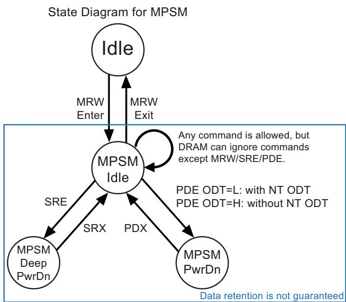  
Figure 59 — State Diagram for Maximum Power Saving Mode

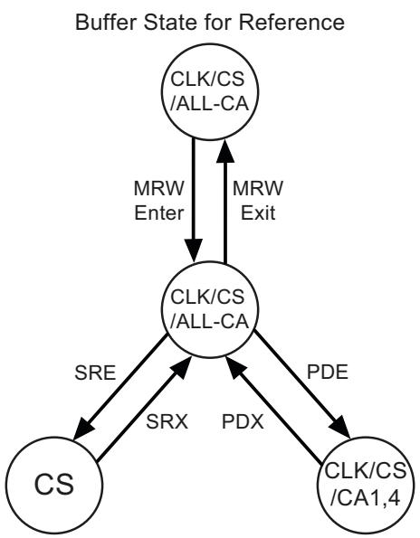

Table 276 - MPSM Configuration Options  

<table><tr><td>MPSM MR2:OP[3]</td><td>Device 15 MPSM MR2:OP[5]</td><td>PDA Enumeration ID MR1:OP[3:0]</td><td>Action</td></tr><tr><td>1</td><td>X</td><td>X</td><td>Enter MPSM on MRW</td></tr><tr><td>X</td><td>1</td><td>1111</td><td>Enter MPSM on MRW</td></tr><tr><td>0</td><td>0</td><td>X</td><td>Exit MPSM on MRW</td></tr><tr><td>0</td><td>X</td><td>Not equal to 1111</td><td>Exit MPSM on MRW</td></tr></table>

# 4.12.1 MPSM Idle State

When DDR5 SDRAM is in this state, it ignores all types of commands except MRW, ODT, Power Down Entry (PDE) and Self Refresh Entry (SRE) commands. MRW, ODT, PDE and SRE commands are executed normally. DRAM shall not respond to any other command except these four command types. DLL status is same as in normal idle state. DRAM continues to drive CA ODT as programmed.

Normal command timing parameters are applied in this state, except that tREFI doesn't need to be satisfied as Refresh command doesn't need to be issued in this state.

# 4.12.2 MPSM Power Down State

MPSM Power Down state is entered by Power Down Entry command from MPSM Idle state. When DDR5 SDRAM is in this state, it responds to ODT command normally as it does in precharged power down state. DLL status is same as in normal precharged power down state.

When the Power Down Exit command is issued, the DRAM goes back to the MPSM Idle state after tXP.

Normal Power Down command timings are applied in this state, except the tREFI requirement.

# 4.12.3 MPSM Deep Power Down State

MPSM Deep Power Down (DPD) state is entered and exited by Self Refresh Entry and Exit commands from/to MPSM Idle state. Input signal requirements to the DRAM in this state are same to those in the Self Refresh mode. DRAM shall not execute any internal Refresh operation in this state.

When the Power Down Exit command is issued, the DRAM goes back to the MPSM Idle state after tXS. tXSDLL must be met prior to issuing any commands that require a locked DLL.

Normal Self Refresh command timings are applied in this state.

# 4.12.4 MPSM Command Timings

The device can exit from the MPSM Idle state by programming the MPSM enable (MR2:OP[1]) bit to '0' using the MRW command.

MPSM exit to the first valid command delay is tMPSMX.

Table 277 — Maximum Power Saving Mode Timing Parameters  

<table><tr><td>Symbol</td><td>Description</td><td>min</td><td>max</td><td>unit</td></tr><tr><td>tMPSMX</td><td>MPSM exit to first valid command delay</td><td>tMRD</td><td>-</td><td>ns</td></tr></table>

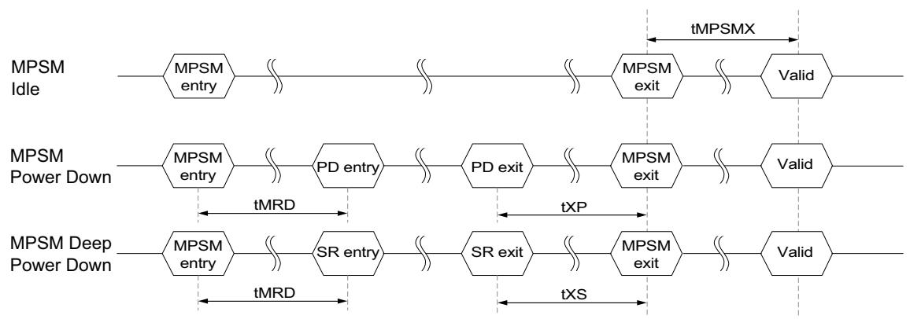  
Figure 60 — Maximum Power Saving Mode exit timings

# 4.13 Refresh Operation

The Refresh command (REF) is used during normal operation of the DDR5 SDRAMs. This command is non persistent, so it must be issued each time a refresh is required. The DDR5 SDRAM requires Refresh cycles at an average periodic interval of tREFI.

There are three types of refresh operations supported by DDR5 SDRAMs.

- Normal Refresh: By issuing All Bank Refresh (REFab) command in Normal Refresh mode  
- Fine Granularity Refresh: By issuing All Bank Refresh (REFab) command in Fine Granularity Refresh mode  
- Same Bank Refresh: By issuing Same Bank Refresh (REFsb) command in Fine Granularity Refresh mode

This section describes the details of the refresh operations and requirements for each of the refresh operation types as well as the transitions between the refresh operation types.

For Normal Refresh and Fine Granularity Refresh operations, all banks of the SDRAM must be precharged and idle for a minimum of the precharge time tRP(min) before the All Bank Refresh command (REFab) can be issued. The refresh addressing is generated by the internal refresh controller during the refresh cycle. The external address bus is only required to be in a valid state once this cycle has started. When the refresh cycle has completed, all banks of the SDRAM will be in the precharged (idle) state. A delay between the Refresh command and the next valid command, except DES, PDE and non-Target ODT commands, must be greater than or equal to the minimum Refresh cycle time tRFC(min) as shown in Figure 61 and Figure 62. Note that the tRFC timing parameter depends on memory density and the refresh mode setting, which can be set to Normal Refresh mode or Fine Granularity Refresh (FGR) mode.

Figure 61 — Refresh Command Timing (Example of Normal Refresh Mode)  
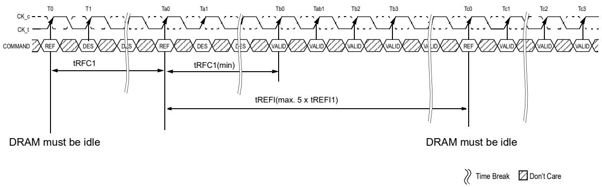  
NOTE 1 Only DES or non-Target ODT commands are allowed after Refresh command is issued until tRFC1(min) expires. NOTE 2 Time interval between two Refresh commands may be extended to a maximum of  $5\mathrm{x}$  tREFI1.

# 4.13 Refresh Operation (Cont'd)

  
NOTE 1 Only DES or non-Target ODT commands are allowed after Refresh command is issued until tRFC2(min) expires.  
NOTE 2 Time interval between two Refresh commands may be extended to a maximum of  $9 \times$  tREFI2.

# Figure 62 — Refresh Command Timing (Example of Fine Granularity Refresh Mode)

# 4.13.1 Refresh Modes

The DDR5 SDRAM has two different Refresh modes with two different refresh cycle time (tRFC) settings. There is a Normal Refresh mode setting and a Fine Granularity Refresh (FGR) mode setting. The FGR mode provides a shorter refresh cycle time (tRFC2) but also requires All Bank Refresh commands (REFab) to be provided twice as often (tREFI is divided by two, i.e., tREFI2 = tREFI1/2). The Refresh mode setting is programmed by MRW command as shown in Table 278. The Refresh Modes are fixed until changed by MRW command to MR4 OP[4]. No on-the-fly Refresh mode change is supported.

Table 278 — Mode Register Definition for Refresh Mode  

<table><tr><td>MR4 OP[4]</td><td>Refresh Mode (tRFC setting)</td></tr><tr><td>0</td><td>Normal Refresh Mode (tRFC1)</td></tr><tr><td>1</td><td>Fine Granularity Refresh Mode (tRFC2)</td></tr></table>

# 4.13.2 Changing Refresh Mode

If Refresh Mode is changed by MRW, the new tREFI and tRFC parameters would be applied from the moment of the rate change. As shown in Figure 63, when an All Bank Refresh command is issued to the DRAM in Normal Refresh mode, then tRFC1 and tREFI1 are applied from the time that the command (REFab) was issued. And when an All Bank Refresh command is issued in Fine Granularity Refresh (FGR) mode, then tRFC2 and tREFI2 should be satisfied.

# 4.13.2 Changing Refresh Mode (Cont'd)

Figure 63 — Refresh Mode Change Command Timing  
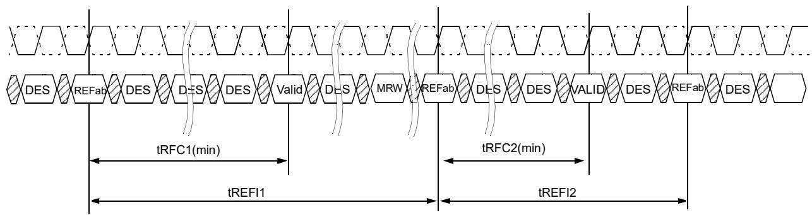  
NOTE 1 Refresh mode is Normal Refresh mode before the MRW and FGR mode after the MRW

The following conditions must be satisfied before the Refresh mode can be changed. Otherwise, data retention of DDR5 SDRAM cannot be guaranteed.

1 In the Normal Refresh mode, the REFab command must complete and tRFC1 must be satisfied before issuing the MRW command to change the Refresh Mode.  
2 If performing REFab commands in the Fine Granularity Refresh mode, it is recommended that an even number of REFab commands are issued to the DDR5 SDRAM since the last change of the Refresh mode with an MRW command before the Refresh mode is changed again by another MRW command. If this condition is met, no additional Refresh commands are required upon the Refresh mode change. If this condition is not met, one extra REFab command is required to be issued to the DDR5 SDRAM upon Refresh mode change. This extra Refresh command is not counted toward the computation of the average refresh interval (tREFI). See Figure 64.  
3 If performing REFsb commands in the Fine Granularity Refresh mode, it is recommended that all banks have received an even number of REFsb command since the last change of the Refresh mode with an MRW command before the Refresh mode is changed again by another MRW command, since a REFab command will reset the internal bank counter. If this condition is met, no additional refresh commands are required upon the Refresh mode change. If this condition is not met, one extra REFab command is required to be issued to the DDR5 SDRAM upon Refresh mode change. This extra Refresh commands is not counted toward the computation of the average refresh interval (tREFI). See Figure 65 for 16Gb and higher density DRAM with 4 banks in a bank group example.

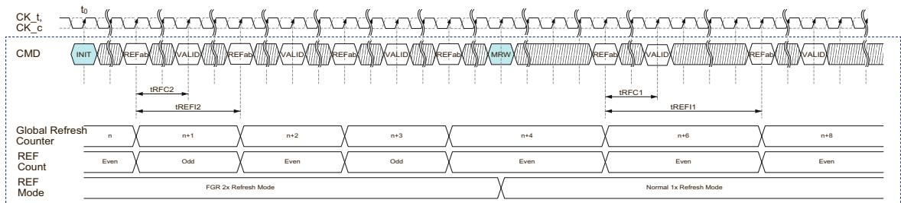  
FGR 2x, even REFab count, to Normal 1x Refresh Mode (recommended)

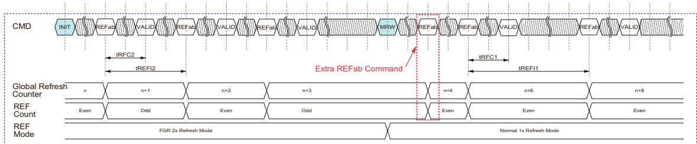  
FGR 2x, odd REFab count, to Normal 1x Refresh Mode

  
Figure 64 — Refresh Mode Change from FGR 2x to Normal 1x Command Timing

# 4.13.2 Changing Refresh Mode (Cont'd)

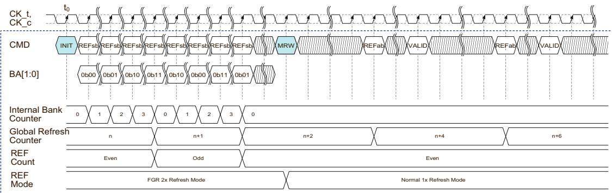  
FGR 2x, all banks received REFsb and even REF count, to Normal 1x Refresh Mode (recommended)

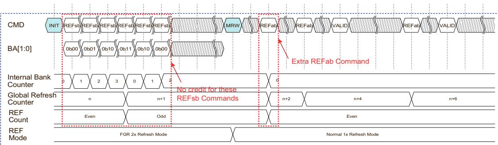  
FGR 2x, not all banks received REFsb and odd REF count, to Normal 1x Refresh Mode

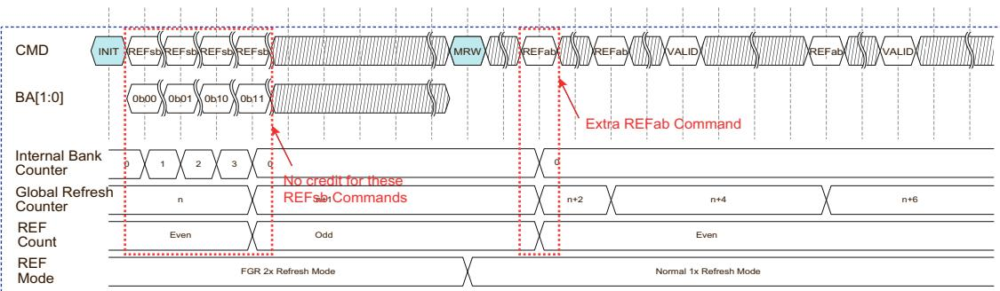

FGR 2x, all banks received REFsb but odd REF count, to Normal 1x Refresh Mode  
FGR 2x, not all banks received REFsb but even REF count, to Normal 1x Refresh Mode  
Figure 65 — 16Gb and Higher Density DRAM Refresh Mode Change from FGR 2x REFsb to Normal 1x Command Timing  
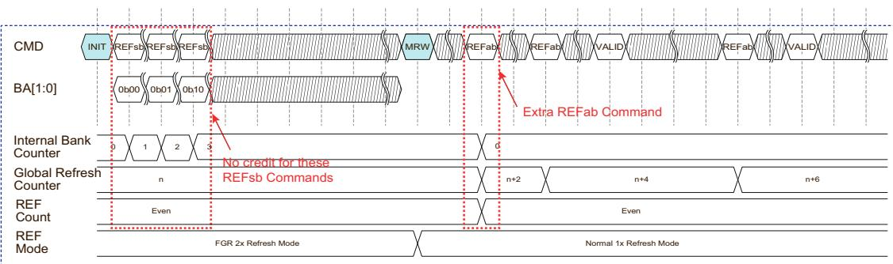  
DONT CARE TIME BREAK

# 4.13.3 Same Bank Refresh

Same Bank Refresh command (REFsb) allows the DDR5 DRAM to apply the refresh process to a specific bank in each bank group unlike the All Bank Refresh command (REFab) which applies the refresh process to all banks in every bank group. The determination whether a Same Bank Refresh or an All Bank Refresh is executed by the DRAM depends on whether REFsb or REFab command is issued, as shown in Table 241. The REFsb command is only allowed in FGR mode (MR4[OP4]=1).

Each Same Bank Refresh command (REFsb) increments an internal bank counter and once the bank counter equals the number of available banks in a bank group, it will reset and start over on the next subsequent REFsb. Each time the internal bank counter resets and starts over on the next subsequent REFsb, the global refresh counter will also increment. A REFsb command can be issued to any bank and in any bank order. However, every bank must have one REFsb command issued to it before any bank may be issued a subsequent REFsb command; thus, a subsequent REFsb command issued to the same bank prior to every bank receiving a REFsb command is illegal. The first REFsb command issued is the "Synchronization" REFsb command and the "Synchronization" count resets the internal bank counter to zero when either:

a) every bank has received one REFsb command,  
b) RESET is applied,  
c) entering/exitingself refresh mode, or  
d) REFab is issued.

The DRAM's global refresh counter increments when either a REFab is issued or when all banks have received their one REFsb command and the "Synchronization" count reset to zero. If a REFab command is issued when the bank counter is not zero, i.e., in the middle of same-bank refreshing, the SDRAM's global refresh counter will not increment until the completion of REFab, effectively losing the credits for any REFsb commands issued prior to the REFab. See Table 279 for details.

# 4.13.3 Same Bank Refresh (Cont'd)

Table 279 — 16Gb and Higher Density DRAM Bank and Refresh Counter Increment Behavior  

<table><tr><td>Count#</td><td>Command</td><td>BA0</td><td>BA1</td><td>Refresh Bank #</td><td>Internal Bank Counter #</td><td>Global Refresh Counter # (Row Address #)</td></tr><tr><td>0</td><td colspan="4">RESET, REFab or SRE/SRX command and FGR mode on (MR4[OP4]=1)</td><td>To 0</td><td>-</td></tr><tr><td>1</td><td>REFsb</td><td>0</td><td>0</td><td>0</td><td>0 to 1</td><td rowspan="4">n</td></tr><tr><td>2</td><td>REFsb</td><td>0</td><td>1</td><td>1</td><td>1 to 2</td></tr><tr><td>3</td><td>REFsb</td><td>1</td><td>0</td><td>2</td><td>2 to 3</td></tr><tr><td>4</td><td>REFsb</td><td>1</td><td>1</td><td>3</td><td>3 to 0</td></tr><tr><td>5</td><td>REFsb</td><td>1</td><td>0</td><td>2</td><td>0 to 1</td><td rowspan="4">n+1</td></tr><tr><td>6</td><td>REFsb</td><td>0</td><td>0</td><td>0</td><td>1 to 2</td></tr><tr><td>7</td><td>REFsb</td><td>1</td><td>1</td><td>3</td><td>2 to 3</td></tr><tr><td>8</td><td>REFsb</td><td>0</td><td>1</td><td>1</td><td>3 to 0</td></tr><tr><td>9</td><td>REFsb</td><td>0</td><td>0</td><td>0</td><td>0 to 1</td><td rowspan="3">n+2</td></tr><tr><td>10</td><td>REFsb</td><td>0</td><td>1</td><td>1</td><td>1 to 2</td></tr><tr><td>11</td><td>REFab</td><td>V</td><td>V</td><td>0-3</td><td>To 0</td></tr><tr><td>12</td><td>REFsb</td><td>1</td><td>1</td><td>3</td><td>0 to 1</td><td rowspan="4">n+3</td></tr><tr><td>13</td><td>REFsb</td><td>0</td><td>1</td><td>1</td><td>1 to 2</td></tr><tr><td>14</td><td>REFsb</td><td>0</td><td>0</td><td>0</td><td>2 to 3</td></tr><tr><td>15</td><td>REFsb</td><td>1</td><td>0</td><td>2</td><td>3 to 0</td></tr><tr><td>16</td><td>REFab</td><td>V</td><td>V</td><td>0-3</td><td>To 0</td><td>n+4</td></tr><tr><td>17</td><td>REFab</td><td>V</td><td>V</td><td>0-3</td><td>To 0</td><td>n+5</td></tr><tr><td>18</td><td>REFab</td><td>V</td><td>V</td><td>0-3</td><td>To 0</td><td>n+6</td></tr><tr><td>19</td><td>REFsb</td><td>1</td><td>1</td><td>3</td><td>0 to 1</td><td rowspan="2">n+7</td></tr><tr><td>20</td><td>REFab</td><td>V</td><td>V</td><td>0-3</td><td>To 0</td></tr><tr><td>21</td><td>REFsb</td><td>1</td><td>0</td><td>2</td><td>0 to 1</td><td rowspan="4">n+8</td></tr><tr><td>22</td><td>REFsb</td><td>0</td><td>1</td><td>1</td><td>1 to 2</td></tr><tr><td>23</td><td>REFsb</td><td>0</td><td>0</td><td>0</td><td>2 to 3</td></tr><tr><td>24</td><td>REFsb</td><td>1</td><td>1</td><td>3</td><td>3 to 0</td></tr></table>

The REFsb command must not be issued to the device until the following conditions are met:

- tRFC1 or tRFC2 has been satisfied after the prior 1x or 2x REFab command(s), respectively  
- tRFCsb has been satisfied after the prior REFsb command  
- tRP has been satisfied after the prior PRECHARGE command to that bank  
- tRRD_L has been satisfied after the prior ACTIVATE command (e.g., tRRD_L has to be met from ACTIVATE of a different bank in the same bank group to the REFsb targeted at the same bank group)

Additional restrictions for issuing the REFsb command:

- tFAW has not been met (each REFsb counts as an ACTIVATE command for the four activate window timing restriction)

Once a REFsb is issued, the target banks (one in each Bank Group) are inaccessible during the same-bank refresh cycle time (tRFCsb); however, the other banks in each bank group are accessible and can be addressed during this same-bank refresh cycle. When the same-bank refresh cycle has completed, the banks refreshed via the REFsb will be in idle state.

After issuing REFsb command, the following conditions must be met:

- tRFCsb must be satisfied before issuing a REFab command  
- tRFCsb must be satisfied before issuing an ACTIVATE command to the same bank  
- tREFSBRD must be satisfied before issuing an ACTIVATE command to a different bank.

# 4.13.3 Same Bank Refresh (Cont'd)

Table 280 — Refresh Command Scheduling Separation Requirements  

<table><tr><td>Symbol</td><td>Min Delay From</td><td>To</td><td>NOTE</td></tr><tr><td rowspan="2">tRFC1</td><td rowspan="2">REFab</td><td>REFab</td><td rowspan="2">1</td></tr><tr><td>ACTIVATE command to any bank</td></tr><tr><td rowspan="3">tRFC2</td><td rowspan="3">REFab</td><td>REFab</td><td rowspan="3">2</td></tr><tr><td>ACTIVATE command to any bank</td></tr><tr><td>REFsb</td></tr><tr><td rowspan="3">tRFCsb</td><td rowspan="3">REFsb</td><td>REFab</td><td rowspan="3">2</td></tr><tr><td>ACTIVATE command to same bank as REFsb</td></tr><tr><td>REFsb</td></tr><tr><td>tREFSBRD</td><td>REFsb</td><td>ACTIVATE command to different bank from REFsb</td><td>2</td></tr><tr><td>tRRD_L</td><td>ACTIVATE</td><td>REFsb to different bank from ACTIVATE</td><td>2</td></tr><tr><td colspan="4">NOTE 1 MR4(OP[4]) set to Normal Refresh mode. 
NOTE 2 MR4(OP[4]) set to FGR mode. REFsb command is valid only in FGR mode.</td></tr></table>

Where  $n$  is the number of banks in a bank group, a single REFab command can be replaced with  $n$  REFsb commands for the purpose of scheduling postponed refresh commands.

# 4.13.4 tREFI and tRFC Parameters

The maximum average refresh interval (tREFI) requirement for the DDR5 SDRAM depends on the refresh mode setting (Normal or FGR), and the device's case temperature (Tcase). When the refresh mode is set to Normal Refresh mode, REFab commands are issued (tRFC1), and Tcase  $<=85^{\circ}\mathrm{C}$ , the maximum average refresh interval (tREFI1) is tREFI. When the refresh mode is set to FGR mode, REFab commands are issued (tRFC2) and Tcase  $<=85^{\circ}\mathrm{C}$ , the maximum average refresh interval (tREFI2) is tREFI/2. This same tREFI/2 interval value is also appropriate if the refresh mode is set to Normal Refresh mode and REFab commands are issued (tRFC1) but  $85^{\circ}\mathrm{C} < \mathrm{Tcase} <= 95^{\circ}\mathrm{C}$ . Finally, if the refresh mode is set to FGR mode, REFab commands are issued (tRFC2), and  $85^{\circ}\mathrm{C} < \mathrm{Tcase} <= 95^{\circ}\mathrm{C}$ , the maximum average refresh interval (tREFI2) is tREFI/4.

The DDR5 SDRAM includes an optional method for the host to indicate when Refresh commands are being issued at the 2x (tREFI2) refresh interval rate. The 2x Refresh Interval Rate indicator (MR4:OP[3]) alerts the DRAM if the host supports the refresh interval rate indication as part of the REF command using CA8. If enabled (MR4:OP[3]=1), the host will issue 1x REF commands with CA8=H (Tcase<=85°C), and the host will issue 2x REF commands with CA8=L (Tcase any allowable temperature). MR4:OP[3] is a Status Read/Write “SR/W” MR bit which shows DDR5 SDRAM support of this optional feature. Reading MR4:OP[3] will return a “1” if the 2x Refresh Interval Rate indicator is supported. A “0” will be returned if not supported.

tREFI is based on the 8,192 refresh commands that need to be issued within the baseline tREF=32ms refresh period on the DDR5 SDRAM.

# 4.13.5 tREFI and tRFC Parameters for 3DS Devices

Typical platforms are designed with the assumption that no more than one physical rank is refreshed at the same time. In order to limit the maximum refresh current  $(\mathrm{I_{DD5B1}})$  for a 3D stacked SDRAM, it will be required to stagger the refresh commands to each logical rank in a stack.

The tRFC time for a single logical rank is defined as tRFC_slr and is specified as the same value as for a monolithic DDR5 SDRAM of equivalent density. The minimum amount of stagger between refresh commands sent to different logical ranks (tRFC_dlr) or physical ranks (tRFC_dpr) is specified to be approximately tRFC_slr/3 (see Table 283).

Table 281 - tREFI Parameters for REFab and REFsb Commands (including 3DS)  

<table><tr><td>Command</td><td>Refresh Mode</td><td colspan="2">Symbol &amp; Range</td><td>Expression</td><td>Value</td><td>Unit</td><td>Notes</td></tr><tr><td rowspan="2">REFab</td><td rowspan="2">Normal</td><td rowspan="2">tREF11</td><td>0°C &lt;= TCASE &lt;= 85°C</td><td>tREF1</td><td>3.9</td><td>us</td><td>1,2</td></tr><tr><td>85°C &lt; TCASE &lt;= 95°C</td><td>tREF1/2</td><td>1.95</td><td>us</td><td>1,2</td></tr><tr><td rowspan="2">REFab</td><td rowspan="2">Fine Granularity</td><td rowspan="2">tREF12</td><td>0°C &lt;= TCASE &lt;= 85°C</td><td>tREF1/2</td><td>1.95</td><td>us</td><td>1,2</td></tr><tr><td>85°C &lt; TCASE &lt;= 95°C</td><td>tREF1/4</td><td>0.975</td><td>us</td><td>1,2</td></tr><tr><td rowspan="2">REFsb</td><td rowspan="2">Fine Granularity</td><td rowspan="2">tREF1sb</td><td>0°C &lt;= TCASE &lt;= 85°C</td><td>tREF1/(2*n)</td><td>1.95/n</td><td>us</td><td>1,2,3</td></tr><tr><td>85°C &lt; TCASE &lt;= 95°C</td><td>tREF1/(4*n)</td><td>0.975/n</td><td>us</td><td>1,2,3</td></tr><tr><td colspan="8">NOTE 1 All 3D Stacked (3DS) devices follow the same requirements as the monolith die regardless of logical rank. 
NOTE 2 3DS specification covers up to 16Gb density. Future densities such as 24Gb or 32Gb could require different tREF1 requirements. 
NOTE 3 n is the number of banks in a bank group (e.g., 8G: n=2; 16G: n=4).</td></tr></table>

Table 282 - tRFC Parameters by Device Density  

<table><tr><td>Refresh Operation</td><td>Symbol</td><td>8Gb</td><td>16Gb</td><td>24Gb</td><td>32Gb</td><td>Units</td><td>Notes</td></tr><tr><td>Normal Refresh (REFab)</td><td>tRFC1(min)</td><td>195</td><td>295</td><td>TBD</td><td>TBD</td><td>ns</td><td></td></tr><tr><td>Fine Granularity Refresh (REFab)</td><td>tRFC2(min)</td><td>130</td><td>160</td><td>TBD</td><td>TBD</td><td>ns</td><td></td></tr><tr><td>Same Bank Refresh (REFsb)</td><td>tRFCsb(min)</td><td>115</td><td>130</td><td>TBD</td><td>TBD</td><td>ns</td><td></td></tr></table>

Table 283 — 3DS tRFC Parameters by Logical Rank Density  

<table><tr><td>Refresh Operation</td><td>Symbol</td><td>8Gb</td><td>16Gb</td><td>24Gb</td><td>32Gb</td><td>Units</td><td>Notes</td></tr><tr><td>Normal Refresh with 3DS same logical rank</td><td>tRFC1_slr(min)</td><td colspan="4">tRFC1(min)</td><td>ns</td><td>1</td></tr><tr><td>Fine Granularity Refresh with 3DS same logical rank</td><td>tRFC2_slr(min)</td><td colspan="4">tRFC2(min)</td><td>ns</td><td>1</td></tr><tr><td>Same Bank Refresh with 3DS same logical rank</td><td>tRFCsb_slr(min)</td><td colspan="4">tRFCsb(min)</td><td>ns</td><td>1</td></tr><tr><td>Normal Refresh with 3DS different logical rank</td><td>tRFC1_dlr(min)</td><td colspan="4">tRFC1(min)/3</td><td>ns</td><td>3</td></tr><tr><td>Normal Refresh with 3DS different physical rank</td><td>tRFC1_dpr(min)</td><td colspan="4">tRFC1min/3</td><td>ns</td><td>2,3</td></tr><tr><td>Fine Granularity Refresh with 3DS different logical rank</td><td>tRFC2_dlr(min)</td><td colspan="4">tRFC2(min)/3</td><td>ns</td><td>3</td></tr><tr><td>Fine Granularity Refresh with 3DS different physical rank</td><td>tRFC2_dpr(min)</td><td colspan="4">tRFC2min/3</td><td>ns</td><td>2,3</td></tr><tr><td>Same Bank Refresh with 3DS different logical rank</td><td>tRFCsb_dlr(min)</td><td colspan="4">tRFCsb(min)/3</td><td>ns</td><td>3</td></tr><tr><td colspan="8">NOTE 1 All 3D Stacked (3DS) devices follow the same requirements as the monolith die for same logical ranks
NOTE 2 Parameter applies to dual-physical-rank (36 and 40 placement) 3DS-based DIMMs built with JEDEC PMICXXXX, but may not apply to DIMMs built with higher current capacity PMICs.
NOTE 3 3DS tRFC parameters are to be rounded up to the nearest 1ns after the “tRFC*min”/3 calculation.</td></tr></table>

Table 284 — Same Bank Refresh Parameters  

<table><tr><td>Refresh Mode</td><td>Symbol</td><td>8Gb</td><td>16Gb</td><td>24Gb</td><td>32Gb</td><td>Units</td></tr><tr><td>Same Bank Refresh to ACT delay</td><td>tREFSBRD(min)</td><td>30</td><td>30</td><td>TBD</td><td>TBD</td><td>ns</td></tr></table>

Table 285 — Same Bank Refresh Parameters for 3DS 2H, 4H  

<table><tr><td>Refresh Mode</td><td>Symbol</td><td>8Gb</td><td>16Gb</td><td>24Gb</td><td>32Gb</td><td>Units</td></tr><tr><td>Same Bank Refresh to ACT delay SLR</td><td>tREFSBRD_slr(min)</td><td>30</td><td>30</td><td>TBD</td><td>TBD</td><td>ns</td></tr><tr><td>Same Bank Refresh to ACT delay DLR</td><td>tREFSBRD_dlr(min)</td><td>15</td><td>15</td><td>TBD</td><td>TBD</td><td>ns</td></tr></table>

# 4.13.6 Refresh Operation Scheduling Flexibility

In general, a Refresh command needs to be issued to the DDR5 SDRAM regularly every tREFI interval. To allow for improved efficiency in scheduling and switching between tasks, some flexibility in the absolute refresh interval is provided.

In Normal Refresh mode, a maximum of 4 REFab commands can be postponed, meaning that at no point in time more than a total of 4 Refresh commands are allowed to be postponed. In case that 4 REFab commands are postponed in a row, the resulting maximum interval between the surrounding REFab commands is limited to  $5 \times$  tREFI1 (see Figure 66). At any given time, a maximum of 5 REFab commands can be issued within 1 x tREFI1 window. Self-refresh mode may be entered with a maximum of 4 REFab commands being postponed. After exiting Self-Refresh mode with one or more REFab commands postponed, additional REFab commands may be postponed to the extent that the total number of postponed REFab commands (before and after the Self-Refresh) will never exceed 4. During Self-Refresh Mode, the number of postponed REFab commands does not change.

In FGR Mode, the maximum REFab commands that may be postponed is 8, with the resulting maximum interval between the surrounding REFab commands limited to  $9 \times t\text{REFI2}$  (see Figure 67). At any given time, a maximum of 9 REFab commands can be issued within  $1 \times t\text{REFI2}$  window. The same maximum count of 8 applies to postponed REFab commands around self-refresh entry and exit.

Figure 66 - Postponing Refresh Commands (Example of Normal Refresh Mode - tREF1, tRFC1)  
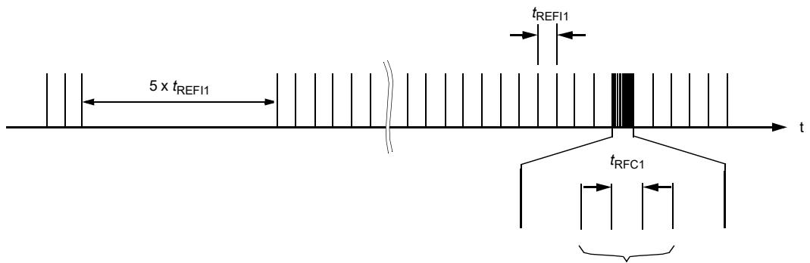  
4 REFab Commands postponed

Figure 67 — Postponing Refresh Commands (Example of Fine Granularity Refresh Mode - tRFC2)  
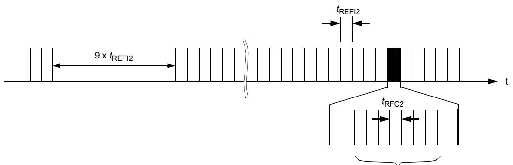  
8 REFab Commands postponed

# 4.13.7 Self Refresh Entry and Exit

DDR5 SDRAM can enter Self Refresh mode anytime in Normal Refresh and FGR mode without any restriction on the number of Refresh commands that have been issued during the mode before the Self Refresh entry. However, upon Self Refresh exit, extra Refresh command(s) may be required depending on the condition of the Self Refresh entry. The conditions and requirements for the extra Refresh command(s) are defined as follows:

1 There are no special restrictions for the Normal Refresh mode.  
2 If performing REFab commands in FGR mode, it is recommended that there should be an even number of REFab commands before entry into Self Refresh since the last Self Refresh exit or MRW command that set the FGR mode. If this condition is met, no additional refresh commands are required upon Self Refresh exit. If this condition is not met, one extra REFab command is required to be issued to the DDR5 SDRAM upon Self Refresh exit. These extra Refresh commands are not counted toward the computation of the average refresh interval (tREFI2). See Figure 68.  
3 If performing REFsb commands, it is recommended that all banks have received a REFsb command prior to entering Self Refresh, since entering and exiting Self Refresh will reset the internal bank counter. If this condition is met, no additional refresh commands are required upon Self Refresh exit, and REFsb commands again can be issued to any bank in any bank order. If this condition is not met, one extra REFab command or an extra REFsb command to each bank is required to be issued to the DDR5 SDRAM upon Self Refresh exit. These extra Refresh commands are not counted toward the computation of the average refresh interval (16Gb and higher density DRAM with 4 banks per bank group example: tREFI2. See Figure 69).

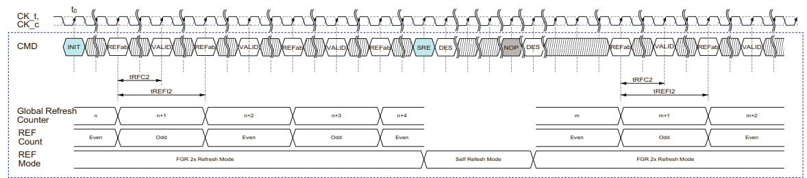  
FGR 2x, even REF count, to Self Refresh (recommended)

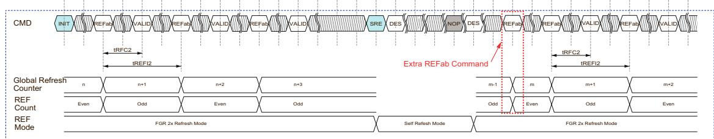  
FGR 2x, odd REF count, to Self Refresh

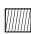  
Figure 68 — FGR 2x to SREF Command Timing

DONT CARE

TIME BREAK

# 4.13.7 Self Refresh Entry and Exit (Cont'd)

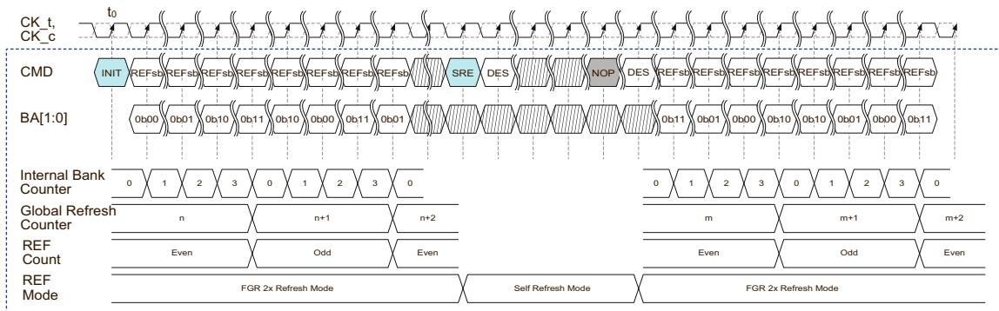

FGR 2x all banks received REFsb and even REF count, to Self Refresh (recommended)

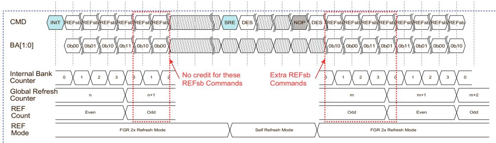

FGR 2x not all banks received REFsb and odd REF count, to Self Refresh

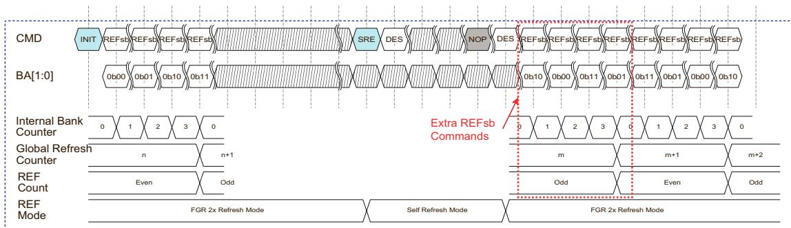

FGR 2x all banks received REFsb but odd REF count, to Self Refresh

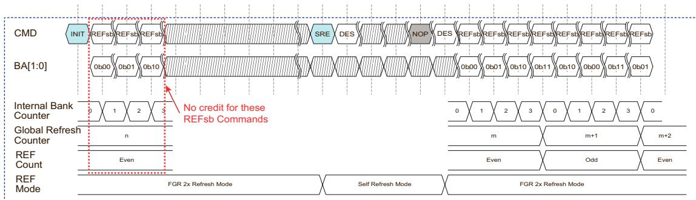  
Figure 69 — 16Gb and Higher Density DRAM FGR 2x REFsb to SREF Command Timing

FGR 2x not all banks received REFsb but even REF count, to Self Refresh

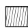

DON'T CARE

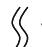

TIME BREAK

# 4.14 Temperature Sensor

DDR5 devices feature a temperature sensor whose status can be read. This sensor can be used to determine an appropriate refresh rate (MR4). Either the temperature sensor readout or the device TOPER may be used by the system to determine whether the refresh rate and operating temperature requirements are being met.

DDR5 devices shall monitor device temperature and update MR4 according to tTSI. Upon completion of device initialization, the device temperature status bits shall be no older than tTSI. MR4 will be updated even when device is in Self Refresh state.

When using the temperature sensor, the actual device case temperature may be higher than the TOPER specification that applies for the standard or elevated temperature ranges. For example, TCASE may be above  $85^{\circ}\mathrm{C}$  when MR4:OP[2:0] = 010B. DDR5 devices shall allow for  $2^{\circ}\mathrm{C}$  temperature margin between the point at which the device updates the MR4 value and the point at which the controller reconfigures the system accordingly.

The four thresholds of the temperature sensor will be nominally  $80^{\circ}\mathrm{C}$ ,  $85^{\circ}\mathrm{C}$ ,  $90^{\circ}\mathrm{C}$  and  $95^{\circ}\mathrm{C}$ . The 2nd threshold (nominally  $85^{\circ}\mathrm{C}$ ) is used by the system to switch to 2x refresh. The 4th threshold (nominally  $95^{\circ}\mathrm{C}$ ) is used by the system to throttle activity to keep the DRAM at a safe operating temperature. The 1st threshold (nominally  $80^{\circ}\mathrm{C}$ ) allows the system to take actions which delay reaching the 2nd threshold. The 3rd threshold (nominally  $90^{\circ}\mathrm{C}$ ) allows the system to take actions which delay reaching the 4th threshold.

To ensure proper operation using the temperature sensor, applications should consider the following factors:

- TempGradient is the maximum temperature gradient experienced by the memory device at the temperature of interest over a range of  $2^{\circ}\mathrm{C}$ , measured in the range of interest  $80 - 100^{\circ}\mathrm{C}$ .  
- ReadInterval is the time period between MR4 reads from the system.  
- TempSensorInterval (tTSI) is the maximum delay between internal updates of MR4.  
SysRespDelay is the maximum time between a read of MR4 and the response by the system.

In order to determine the required frequency of polling MR4, the system shall use the maximum TempGradient and the maximum response time of the system using the following equation:

TempGradient x (ReadInterval + tTSI + SysRespDelay) ≤ TempMargin

# 4.14 Temperature Sensor (Cont'd)

Table 286 — Temperature Sensor Parameters  

<table><tr><td>Parameter</td><td>Symbol</td><td>Min/Max</td><td>Value</td><td>Unit</td><td>Notes</td></tr><tr><td>System Temperature Gradient</td><td>TempGradient</td><td>Max</td><td>System Dependent</td><td>°C/s</td><td></td></tr><tr><td>MR4 Read Interval</td><td>ReadInterval</td><td>Max</td><td>System Dependent</td><td>ms</td><td></td></tr><tr><td>Temperature Sensor Interval</td><td>tTSI</td><td>Max</td><td>32</td><td>ms</td><td></td></tr><tr><td>System Response Delay</td><td>SysRespDelay</td><td>Max</td><td>System Dependent</td><td>ms</td><td></td></tr><tr><td>Device Temperature Margin</td><td>TempMargin</td><td>Max</td><td>2</td><td>°C</td><td>1</td></tr><tr><td>Temp Sensor Accuracy, 2nd threshold trip point</td><td>TempSensorAcc2</td><td>Min</td><td>78</td><td>°C</td><td>1,2</td></tr><tr><td>Temp Sensor Accuracy, 4th threshold trip point</td><td>TempSensorAcc4</td><td>Min</td><td>88</td><td>°C</td><td>1,2</td></tr><tr><td>Relative Trip Point, 2nd threshold minus 1st threshold</td><td>RelativeTrip2m1</td><td>Min/Max</td><td>Min 3 / Max 7</td><td>°C</td><td>1,3</td></tr><tr><td>Relative Trip Point, 3rd threshold minus 2nd threshold</td><td>RelativeTrip3m2</td><td>Min/Max</td><td>Min 3 / Max 7</td><td>°C</td><td>1,4</td></tr><tr><td>Relative Trip Point, 4th threshold minus 3rd threshold</td><td>RelativeTrip4m3</td><td>Min/Max</td><td>Min 3 / Max 7</td><td>°C</td><td>1,4</td></tr><tr><td colspan="6">NOTE 1 Verified by design and characterization, and may not be subject to production test. 
NOTE 2 Only the minimum (negative side) is specified for the second and fourth thresholds. The DRAM vendor is responsible for guaranteeing correct operation of 1x refresh for MR4 &lt;= 010b, and correct operation of 2x refresh for MR4 &lt;= 100b. This puts a vendor-specific constraint on the Temperature Sensor Accuracy on the positive side. 
NOTE 3 The 1st threshold is defined relative to the 2nd threshold. 
NOTE 4 The 3rd threshold is defined relative to the 2nd and 4th thresholds.</td></tr></table>

For example, if TempGradient is  $10^{\circ}\mathrm{C / s}$  and the SysRespDelay is  $100\mathrm{ms}$

$$
(1 0 ^ {\circ} \mathrm {C} / \mathrm {s}) \mathrm {x} (\text {R e a d I n t e r a l} + 3 2 \mathrm {m s} + 1 0 0 \mathrm {m s}) \leq 2 ^ {\circ} \mathrm {C}
$$

In this case, ReadInterval shall be no greater than  $68~\mathrm{ms}$

# 4.14 Temperature Sensor (Cont'd)

Figure 70 — Temp Sensor Timing Diagram  
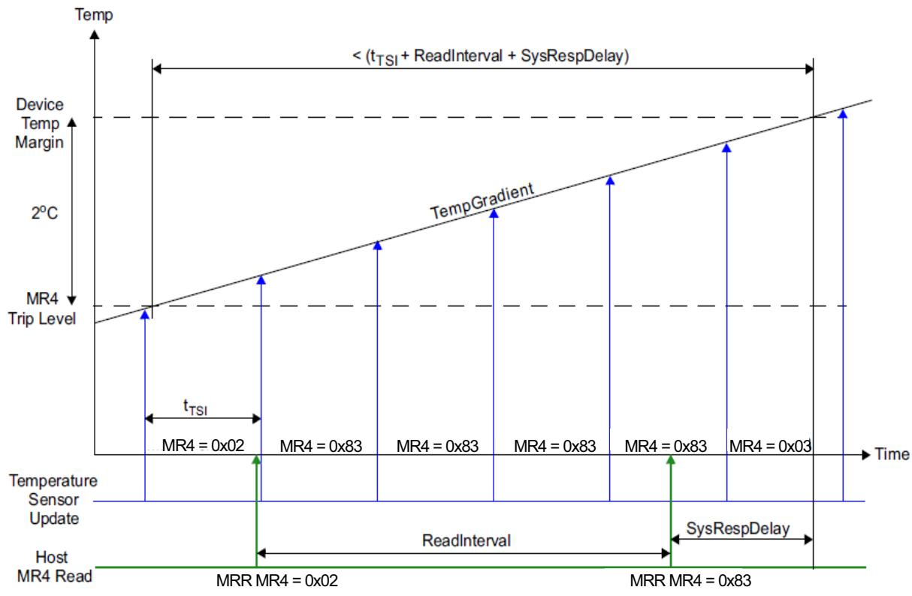  
NOTE MR4 encodings in the figure are examples only and assume that MR4:OP[4]=0

# 4.14.1 Temperature Sensor Usage for 3D Stacked (3DS) Devices

In the case of 3D Stacked devices, the Refresh Rate (MR4) is related to the hottest die in the stack only.

# 4.14.2 Temperature Encoding

The DDR5 DRAM provides temperature related information to the controller via an encoding on MR4:OP[2:0]. The encodings define the proper refresh rate expected by the DRAM to maintain data integrity.

# 4.14.3 MR4 Definition – for Reference Only

See Section 3.5.6 for details

Table 287 - MR4 Register Information  

<table><tr><td>OP[7]</td><td>OP[6]</td><td>OP[5]</td><td>OP[4]</td><td>OP[3]</td><td>OP[2]</td><td>OP[1]</td><td>OP[0]</td></tr><tr><td>TUF</td><td colspan="2">RFU</td><td>Refresh tRFC Mode</td><td>Refresh Inter-val Rate Indi-cator</td><td colspan="3">Refresh Rate</td></tr></table>

# 4.14.3 MR4 Definition - for Reference Only (Cont'd)

Table 288 - MR4 Register Encoding  

<table><tr><td>Function</td><td>Register Type</td><td>Operand</td><td>Data</td><td>Notes</td></tr><tr><td>Refresh Rate</td><td>R</td><td>OP[2:0]</td><td>000B: RFU001B: tREFI x1 (1x Refresh Rate), &lt;80°C nominal010B: tREFI x1 (1x Refresh Rate), 80-85°C nominal011B: tREFI /2 (2x Refresh Rate), 85-90°C nominal100B: tREFI /2 (2x Refresh Rate), 90-95°C nominal101B: tREFI /2 (2x Refresh Rate), &gt;95°C nominal110B: RFU111B: RFU</td><td>1,2,3,4,5,6,7</td></tr><tr><td>Refresh Interval Rate Indicator</td><td>SR/W</td><td>OP[3]</td><td>DRAM Status Read (SR):0B: Not implemented (Default)1B: ImplementedHost Write (W):0B: Disabled (Default)1B: Enabled</td><td></td></tr><tr><td>Refresh tRFC Mode</td><td>R/W</td><td>OP[4]</td><td>0B: Normal Refresh Mode (tRFC1)1B: Fine Granularity Refresh Mode (tRFC2)</td><td></td></tr><tr><td>RFU</td><td>R/W</td><td>OP[6:5]</td><td>RFU</td><td></td></tr><tr><td>TUF(Temperature Update Flag)</td><td>R</td><td>OP[7]</td><td>0B: No change in OP[2:0] since last MR4 read (default)1B: Change in OP[2:0] since last MR4 read</td><td></td></tr><tr><td colspan="5">NOTE 1 The refresh rate for each OP[2:0] setting applies to tREFI1 and tREFI2. Each OP[2:0] setting specifies a nominal temperature range. The five ranges defined by OP[2:0] are determined by four temperature thresholds.</td></tr><tr><td colspan="5">NOTE 2 The four temperature thresholds are nominally at 80°C, 85°C, 90°C and 95°C. The 85°C and 95°C thresholds have a specified minimum temperature value, but the maximum temperature value is not specified.</td></tr><tr><td colspan="5">NOTE 3 DRAM vendors must report all of the possible settings over the operating temperature range of the device. Each vendor guarantees that their device will work at any temperature within the range using the refresh interval requested by their device.</td></tr><tr><td colspan="5">NOTE 4 The 2x Refresh Rate must be provided by the system before the DRAM Tj has gone up by more than 2°C (Temperature Margin) since the first report out of OP[2:0]=011B. This condition is reset when OP[2:0] is equal to 010B.</td></tr><tr><td colspan="5">NOTE 5 The device may not operate properly when OP[2:0]=101B, if the DRAM Tj has gone up by more than 2°C (Temperature Margin) since the first report out of OP[2:0]=101B. This condition is reset when OP[2:0] is equal to 100B. OP[2:0]=101B must be a temporary condition of the DRAM, to be addressed by immediately reducing the Tj of the DRAM by throttling its power, and/or the power of nearby devices.</td></tr><tr><td colspan="5">NOTE 6 OP[7] = 0 at power-up. OP[2:0] bits are valid after initialization sequence (Te).</td></tr><tr><td colspan="5">NOTE 7 See Section 4.14 for information on the recommended frequency of reading MR4</td></tr></table>

# 4.15 Multi-Purpose Command (MPC)

# 4.15.1 Introduction

DDR5-SDRAMs use the Multi-Purpose Command (MPC) to issue commands associated with interface initialization, training, and periodic calibration. The MPC command is initiated with CS_n, and CA[4:0] asserted to the proper state at the rising edge of CK, as defined in Table 241. The MPC command has eight operands (OP[7:0]) that are decoded to execute specific commands in the SDRAM.

The MPC command uses an encoding that includes the command encoding and the opcode payload in a single clock cycle. This enables the host to extend the setup and hold for the CA signals beyond the single cycle when the chip select asserts. In addition, the MPC command will support multiple cycles of CS_n assertion. The multiple cycles of CS_n assertion ensures the DRAM will capture the MPC command during at least one rising CK_t/CK_c edge.

Table 289 - MPC Command Definition  

<table><tr><td rowspan="2">Function</td><td rowspan="2">Abbrev i-ation</td><td rowspan="2">CS_n</td><td colspan="14">CA Pins</td><td rowspan="2">NOTES</td></tr><tr><td>CA0</td><td>CA1</td><td>CA2</td><td>CA3</td><td>CA4</td><td>CA5</td><td>CA6</td><td>CA7</td><td>CA8</td><td>CA9</td><td>CA10</td><td>CA11</td><td>CA12</td><td>CA13</td></tr><tr><td>MPC</td><td>MPC</td><td>L</td><td>H</td><td>H</td><td>H</td><td>H</td><td>L</td><td>OP0</td><td>OP1</td><td>OP2</td><td>OP3</td><td>OP4</td><td>OP5</td><td>OP6</td><td>OP7</td><td>V/ DDPI D</td><td></td></tr><tr><td colspan="18">NOTE See Table 241 for details</td></tr></table>

# 4.15.2 MPC Opcodes

Table 290 specifies the opcode assignments for the MPC operations:

Table 290 - MPC Command Definition for OP[7:0]  

<table><tr><td>Function</td><td>Operand</td><td>Data</td><td>Notes</td></tr><tr><td>Initialization and Training Modes</td><td>OP[7:0]</td><td>0000 0000B: Exit CS Training Mode0000 0001B: Enter CS Training Mode0000 0010B: DLL RESET0000 0011B: Enter CA Training Mode0000 0100B: ZQCal Latch0000 0101B: ZQCal Start0000 0110B: Stop DQS Interval Oscillator0000 0111B: Start DQS Interval Oscillator0000 1000B: Set 2N Command Timing0000 1001B: Set 1N Command Timing0000 1010B: Exit PDA Enumerate Programming Mode0000 1011B: Enter PDA Enumerate Programming Mode0000 1100B: Manual ECS Operation0000 1101B: RFU...thru0001 1110B: RFU0001 1111B: Apply VrefCA, VrefCS and RTT_CA/CS/CK0010 0xxxB: Group A RTT_CK = xxx (See Section 3.5.34 for MR32 encoding)0010 1xxxB: Group B RTT_CK = xxx (See Section 3.5.34 for MR32 encoding)0011 0xxxB: Group A RTT_CS = xxx (See Section 3.5.34 for MR32 encoding)0011 1xxxB: Group B RTT_CS = xxx (See Section 3.5.34 for MR32 encoding)0100 0xxxB: Group A RTT_CA = xxx (See Section 3.5.35 for MR33 encoding)0100 1xxxB: Group B RTT_CA = xxx (See Section 3.5.35 for MR33 encoding)0101 0xxxB: Set DQS_RTT PARK = xxx (See Section 3.5.35 for MR33 encoding)0101 1xxxB: Set RTT PARK = xxx (See Section 3.5.36 for MR34 encoding)0110 xxxB: PDA Enumerate ID = xxx (See Table 297)0111 xxxB: PDA Select ID = xxx (See Table 298)1000 xxxB: Configure tDLLK/tCCD_L = xxx (See Section 3.5.15 for MR13 encoding)All Others: Reserved</td><td>1,2,3,4,5,6,7,8,9,10,11</td></tr><tr><td colspan="3">NOTE 1 See Table 241 for more information.NOTE 2 Refer to Section 4.20 for more information regarding CS Training Mode Entry and Exit.NOTE 3 Refer to Section 4.19 for more information regarding CA Training Mode Entry.NOTE 4 Refer to Section 4.23 for more information regarding ZQCal Start and ZQCal Latch.NOTE 5 Refer to Section 4.31 for more information regarding Start DQS Interval Oscillator and Stop DQS Interval OscillatorNOTE 6 Refer to Section 4.16 for more information regarding Enter PDA Mode and Exit PDA Mode.NOTE 7 Refer to Section 4.39 for more information regarding Group A and Group B configurations for RTT_CA, RTT_CS, and RTT_CK.NOTE 8 “Apply VrefCA, VrefCS and RTT_CA/CS/CK” applies the settings previously sent with the VrefCA or VrefCS command and “MPC Set RTT_CA/CS/CK”. Until this “MPC Apply VrefCA, VrefCS and RTT_CA/CS/CK” command is sent, the values are in a shadow register. Any MRR to the VrefCA, VrefCS and RTT_CA/CS/CK settings should return only the applied value. The shadow register shall retain the previously set value, so that any time the “MPC Apply VrefCA, VrefCS and RTT_CA/CS/CK” command is sent, there is no change in the applied value unless a new VrefCA, VrefCS or RTT_CA/CS/CK value was sent to the shadow register since the previous “MPC Apply VrefCA, VrefCS and RTT_CA/CS/CK” command.NOTE 9 The PDA Enumerate ID and PDA Select ID opcodes include a 4-bit value, designated by xxxxB in the table. This is the value that is programmed into the MR for these fields. The PDA Enumerate ID can only be changed while in PDA Enumerate Programming Mode.NOTE 10 For any MPC command that is associated with a Mode Register, the only way to program that Mode Register is via the MPC command. Those Mode Registers will be read only and will not support MRW.NOTE 11 MPC command “tDLLK/tCCD_L” sets the settings to the MR13 shadow registers and applies the settings to MR13 when the DRAM encounters MPC command “DLL RESET” or SRE with CA9=L”.</td><td></td></tr></table>

Table 291 — PDA Enumerate and Select ID Encoding  

<table><tr><td>MPC Function</td><td>OP[7:4]</td><td>OP[3:0]</td><td>Notes</td></tr><tr><td>PDA Enumerate ID</td><td>0110</td><td>0000B: ID 0001B: ID 10010B: ID 20011B: ID 30100B: ID 40101B: ID 50110B: ID 60111B: ID 71000B: ID 81001B: ID 91010B: ID 101011B: ID 11100B: ID 121101B: ID 131110B: ID 141111B: ID 15 - default</td><td></td></tr><tr><td>PDA Select ID</td><td>0111</td><td>0000B: ID 0001B: ID 10010B: ID 20011B: ID 30100B: ID 40101B: ID 50110B: ID 60111B: ID 71000B: ID 81001B: ID 91010B: ID 11011B: ID 121101B: ID 131110B: ID 141111B: ID 15 - This selects all devices regardless of their enumerate ID.</td><td></td></tr></table>

# 4.15.3 MPC Command Timings

As shown in the Figure 71, the MPC CMD timings can be extended to any number of cycles. The CS_n can also be asserted many consecutive cycles, limited by tMCP_CS. All timings will be relative to the final rising CK_t/CK_c within the CS_n assertion window. The min delay from when the MPC command is captured to the next valid command is specified as tMPC_Delay. Prior to CS Training, the CA will be driven with additional setup and hold beyond the CS_n assertion. For the DRAM to latch the MPC command in cases where the alignment between CS_n, CA, and CK may be unknown, the CA inputs must reach the proper command state and provide at least three cycles prior to CS_n transitioning from high to low, CS_n must remain low for tMPC_CS, and CA must remain in the proper command state for and provide at least three cycles after CS_n transitions from low to high. This additional setup and hold is only needed when MR2:OP[2] is set to 0 (Multi-cycle MPC mode).

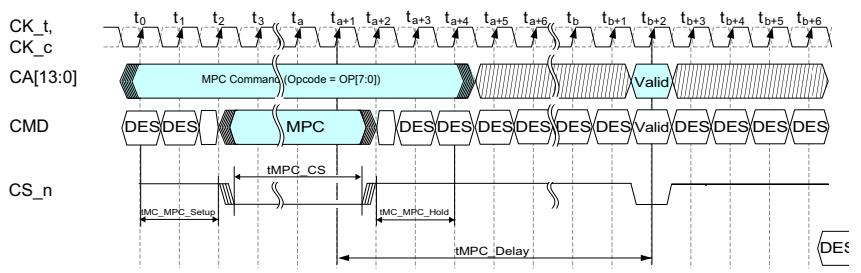  
Figure 71 - MPC Command Timing to 1-Cycle Command

The DDR5 DRAM will support a MR setting to indicate when a multi-cycle CS_n assertion may be used for the MPC, VrefCA and VrefCS commands.

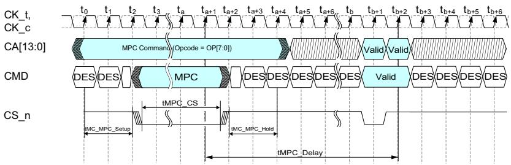  
Figure 72 - MPC Command Timing to 2-Cycle Command

Table 292 - MPC, VrefCA and VrefCS CS Assertion Duration  

<table><tr><td>MR Address</td><td>Operating Mode</td><td>Description</td></tr><tr><td>MR2:OP[4]</td><td>CS Assertion Duration</td><td>0B: Only Multiple cycles of CS assertion supported for MPC, VrefCA and VrefCS commands
1B: Only a single cycle of CS assertion supported for MPC, VrefCA and VrefCS commands</td></tr></table>

Default value for the CS Assertion Duration is 0, which allows for multi-cycle CS assertions during training. The DRAM shall support going in and out of this mode many times during the DRAM initialization and training sequence.

# 4.15.3 MPC Command Timings (Cont'd)

Table 293 — AC Parameters for MPC Command  

<table><tr><td>Symbol</td><td>Description</td><td>Min</td><td>Max</td><td>Unit</td><td>Note</td></tr><tr><td>tMPC_Delay</td><td>MPC to any other valid command delay</td><td>tMRD</td><td>-</td><td>nCK</td><td></td></tr><tr><td>tMC_MPC_Setup</td><td>Min time between stable MPC command and first falling CS edge (SETUP)</td><td>3</td><td>-</td><td>nCK</td><td>2</td></tr><tr><td>tMC_MPC_Hold</td><td>Min time between first rising CS edge and stable MPC command (HOLD)</td><td>3</td><td>-</td><td>nCK</td><td>2</td></tr><tr><td>tMPC_CS</td><td>Time CS_n is held low to register MPC command</td><td>3.5</td><td>8</td><td>nCK</td><td>1</td></tr><tr><td colspan="6">NOTE 1 The minimum tMPC_CS constraint only applies when the CS Assertion Duration setting is 0. The CS Assertion Duration MR setting must be set to enable single cycle MPC commands. The earliest time to set the CS Assertion Duration MR is after CA training is complete, when MRW commands can be sent to the DRAM.</td></tr><tr><td colspan="6">NOTE 2 This applies only to Multi-Cycle MPC commands when MR2:OP[4]=0B</td></tr></table>

Table 294 - MPC Truth Table  

<table><tr><td>Current State</td><td>MPC Command</td><td>Next State</td></tr><tr><td rowspan="14">All Banks Idle</td><td>CSTM (Enter/Exit)</td><td rowspan="14">All Banks Idle</td></tr><tr><td>DLL RESET</td></tr><tr><td>CATM (Enter)</td></tr><tr><td>ZQCAL (Latch/Start)</td></tr><tr><td>DQS Interval Oscillator (Start/Stop)</td></tr><tr><td>Set 1N/2N Command</td></tr><tr><td>PDA Enumerate Programming (Enter/Exit)</td></tr><tr><td>Manual ECS Operation</td></tr><tr><td>Apply VrefCA, VrefCS and RTT_CA/CS/CK</td></tr><tr><td>Configure Group A/B RTT_CA/CS/CK</td></tr><tr><td>Set DQS_RTT_PARK</td></tr><tr><td>Set RTT_PARK</td></tr><tr><td>PDA Enumerate/Select ID</td></tr><tr><td>Configure tDLLK/tCCD_L</td></tr><tr><td rowspan="5">Active</td><td>ZQCAL (Latch/Start)</td><td rowspan="5">Active</td></tr><tr><td>DQS Interval Oscillator (Start/Stop)</td></tr><tr><td>Set 1N/2N Command</td></tr><tr><td>Configure Group A/B RTT_CA/CS/CK</td></tr><tr><td>Configure tDLLK/tCCD_L</td></tr></table>

# 4.16 Per DRAM Addressability (PDA)

DDR5 allows programmability of a given device on a rank. As an example, this feature can be used to program different ODT or Vref values on DRAM devices on a given rank. The Per DRAM Addressability (PDA) applies to MRW, MPC, and VrefCA commands. Some per DRAM settings will be required prior to any training of the CA and CS timings and the DQ write timings. The MPC and VrefCA command timings with extended setup/hold and multi-cycle CS assertion may be used for PDA commands if the CA and CS timings have not yet been trained.

DDR5 introduces a CA interface-only method for Per DRAM Addressability, by having a unique PDA Enumerate ID in each DRAM, and the ability to Group A PDA Select ID in all DRAMs. The unique PDA Enumerate ID requires the use of the DQ signals and a PDA Enumerate Programming Mode in the DRAM to program. Once the PDA Enumerate ID has been programmed, subsequent commands must not use the DQ signals (Legacy PDA mode) to designate which DRAM is selected for the command. The PDA Enumerate ID is a 4-bit field, and the PDA Select ID is also a 4-bit field. When the PDA Select ID is the same as the PDA Enumerate ID or when the PDA Select ID is set to the "All DRAM" code of  $1111_{\mathrm{B}}$ , the DRAM will apply the MPC, MRW, or VrefCA command. There are a few MPC commands that do not use the PDA Select ID to determine if the command will be applied. Among these MPC commands that do not use the PDA Select ID are the MPC opcodes to set the PDA Enumerate ID and the opcode to set the PDA Select ID. During RESET procedure, the receive FIFO must be initialized with all ones in order to ensure that the PDA enumerate flow does not program an enumerate ID when the strobes are not toggling. Table 295 summarizes which MPC commands are dependent on the PDA Select ID values.

Table 295 — Commands that Support or Don't Support PDA Select ID Usage  

<table><tr><td>Command</td><td>Opcode</td><td>Uses PDA Select ID to determine when to execute command</td><td>NOTE</td></tr><tr><td>MRW</td><td>All</td><td>Yes</td><td></td></tr><tr><td>VrefCA</td><td>All</td><td>Yes</td><td></td></tr><tr><td>VrefCS</td><td>All</td><td>Yes</td><td></td></tr><tr><td>MPC</td><td>(Group A and B) RTT_CA</td><td>Yes</td><td></td></tr><tr><td>MPC</td><td>(Group A and B) RTT_CS</td><td>Yes</td><td></td></tr><tr><td>MPC</td><td>(Group A and B) RTT_CK</td><td>Yes</td><td></td></tr><tr><td>MPC</td><td>Set RTT_PARK</td><td>Yes</td><td></td></tr><tr><td>MPC</td><td>Set DQS_RT_PARK</td><td>Yes</td><td></td></tr><tr><td>MPC</td><td>Apply VrefCA and RTT_CA/CS/CK</td><td>No</td><td></td></tr><tr><td>MPC</td><td>Enter PDA Enumerate Programming Mode</td><td>No</td><td></td></tr><tr><td>MPC</td><td>Exit PDA Enumerate Programming Mode</td><td>No</td><td></td></tr><tr><td>MPC</td><td>PDA Enumerate ID</td><td>No</td><td>1</td></tr><tr><td>MPC</td><td>PDA Select ID</td><td>No</td><td></td></tr><tr><td>MPC</td><td>All other MPC opcodes</td><td>No</td><td></td></tr><tr><td colspan="4">NOTE 1 The PDA Enumerate ID is the only command that utilizes the PDA Enumerate ID Programming mode.</td></tr></table>

# 4.16 Per DRAM Addressability (PDA) (Cont'd)

Table 296 shows the mode register fields that are associated with Per DRAM Addressable operation.

Table 296 — PDA Mode Register Fields  

<table><tr><td>MR Address</td><td>Operating Mode</td><td>Description</td></tr><tr><td>MR1:OP[3:0]</td><td>PDA Enumerate ID[3:0]</td><td>This is a Read Only MR field, which is only programmed through an MPC command with the PDA Enumerate ID opcode. xxxxB Encoding is set with MPC command with the PDA Enumerate ID opcode. This can only be set when PDA Enumerate Programming Mode is enabled and the associated DRAM&#x27;s DQ0 is asserted LOW. The PDA Enumerate ID opcode includes 4 bits for this encoding. Default setting is 1111B</td></tr><tr><td>MR1:OP[7:4]</td><td>PDA Select ID[3:0]</td><td>This is a Read Only MR field, which is only programmed through an MPC command with the PDA Select ID opcode. xxxxB Encoding is set with MPC command with the PDA Select ID opcode. The PDA Select ID opcode includes 4 bits for this encoding. 1111B = all DRAMs execute MRW, MPC, and VrefCA commands For all other encodings, DRAMs execute MRW, MPC, and VrefCA commands only if PDA Select ID[3:0] = PDA Enumerate ID[3:0], with some exceptions for specific MPC commands that execute regardless of PDA Select ID. Default setting is 1111B</td></tr></table>

# 4.16.1 PDA Enumerate ID Programming

1 PDA Enumerate Programming Mode is enabled by sending one or more MPC command cycles with OP[7:0]=0000 1011B. Data Mask and PDA Enumerate are not supported for use at the same time. Either data mask shall be disabled or DM_n driven high, while PDA Enumerate Programming Mode is enabled.  
2 In the PDA Enumerate Programming Mode, only the MPC command with PDA Enumerate ID opcode is qualified with DQ0 for x4/x8 and DQL0 for x16. The DRAM captures DQ0 for x4/x8 and DQL0 for x16 by using DQS_c and DQS_t for x4/x8 DQSL_c and DQSL_t for x16 signals as shown in Figure 73, when DQ is driven low after the SET PDA Enumerate ID command, and DQS starts toggling after tPDA_DQS_DELAYmin, and stops toggling prior to tPDA_DQS_DELAYmax, and DQ is held until after DQS stops toggling. An alternate method is shown in Figure 74 where DQ is driven low and DQS toggles continuously starting prior to the SET PDA Enumerate ID command, and remains toggling until tPDA_DQS_Delay(max) is satisfied, and the Exit PDA Enumerate Programming Mode command has finished. If the value on DQ0 for x4/x8 or DQL0 for x16 is 0 then the DRAM executes the MPC command to set the PDA Enumerate ID. The controller may choose to drive all the DQ bits. Only the MPC command with PDA Enumerate ID opcodes will be supported in PDA Enumerate Programming Mode, and the MPC command to exit PDA Enumerate Programming Mode does not require a DQ qualification.  
3 For the "don't enumerate" case where the SDRAM ignores the PDA Enumerate ID MPC command in the PDA Enumerate Programming Mode, the DQS_t/DQS_c and DQ signals (DQSL_t/DQSL_c and DQL/DQU for x16) may be high (driven or due to RTT PARK termination) prior to sending the MPC command to enter PDA Enumerate Programming Mode. After entering PDA Enumerate Programming Mode, the DQS and DQ signals must remain high (driven or due to RTT PARK termination) until exiting PDA Enumerate Programming Mode. Holding the signals high will ensure that this DRAM is never set to a PDA Enumerate ID other than the default setting of 0xFH (15). Timing diagram example is shown in Figure 73.

# 4.16.1 PDA Enumerate ID Programming (Cont'd)

Table 297 — PDA Enumerate Results  

<table><tr><td>DQS_t/DQS_c for x4/x8
DQSL_t/DQSL_c for x16</td><td>DQ0 for x4/x8
DQL0 for x16</td><td>PDA Enumerate Result</td><td>Notes</td></tr><tr><td>Toggling</td><td>Low - &quot;0&quot;</td><td>Enumerate</td><td></td></tr><tr><td>Toggling</td><td>High - &quot;1&quot;</td><td>Don&#x27;t Enumerate</td><td></td></tr><tr><td>High - &quot;1&quot;</td><td>Low - &quot;0&quot;</td><td>Unknown</td><td>1</td></tr><tr><td>High - &quot;1&quot;</td><td>High - &quot;1&quot;</td><td>Don&#x27;t Enumerate</td><td>2</td></tr><tr><td>Differentially Low</td><td>Valid</td><td>Don&#x27;t Enumerate</td><td>3</td></tr><tr><td>NOTE 1</td><td colspan="3">DQS_t/DQS_c are differential signals and small amounts of noise could appear as &quot;toggling,&quot; resulting in &quot;Unknown&quot; PDA Enumerate Results&quot;.</td></tr><tr><td>NOTE 2</td><td colspan="3">The expected usage case where the DQS signals are high is to have the DQs held high as well.</td></tr><tr><td>NOTE 3</td><td colspan="3">&quot;Differentially Low&quot; is defined as DQS_t low and DQS_c high (DQSL_t low and DQSL_c high for x16)</td></tr><tr><td>NOTE 4</td><td colspan="3">A complete BL16 set of strobe edges (8 rising edges and 8 falling edges) must be sent by the host within the tPDA_DQS_DELAY min/max range after the MPC command. The DQ value is captured during any strobe edge during the valid low duration of the target DQ. Valid low time is defined as the time between tPDA_S and tPDA_H. If the DRAM captures a 0 on DQ0 (or DQL0 for x16 devices) at any strobe edge in the strobe sequence, the PDA Enumerate ID command shall be executed by the DRAM. Since the write timings for the DQ bus have not been trained, the host must ensure a minimum of 16 strobe edges occurs after a period of tPDA_DQS_Delay(min) after the associated MPC command. The BC8 mode register setting in the DRAM is ignored while in PDA Enumerate Programming mode. The DQS assumes preamble/postamble requirements.</td></tr><tr><td>NOTE 5</td><td colspan="3">Prior to when the MPC command for PDA Enumerate Programming Mode entry is sent by the host, the host must drive DQS_t and DQS_c differentially low, other than when the burst of 16 strobe edges is sent in association with the PDA Enumerate ID MPC command. The host must send preamble and postamble DQS_t/DQS_c toggles during the qualification of the PDA command. Once PDA Enumerate Programming Mode is enabled in the DRAM, the host memory controller shall wait tMPC_Delay to the time the first PDA Enumerate ID MPC command is issued.</td></tr><tr><td>NOTE 6</td><td colspan="3">In the PDA Enumerate Programming Mode, only PDA Enumerate ID MPC commands and Exit PDA Enumerate Programming Mode MPC command are allowed.</td></tr><tr><td>NOTE 7</td><td colspan="3">In the PDA Enumerate Programming Mode, the default (or previously programmed) RTT PARK value will be applied to the DQ signals.</td></tr><tr><td>NOTE 8</td><td colspan="3">The MPC PDA Enumerate ID command cycle time is defined as tPDA_DELAY. This time is longer than the normal MPC_Delay and must be met in order to provide the DRAM time to latch the asserted DQ and complete the write operation to the PDA Enumerate ID mode register (MR1:OP[3:0]), prior to the next MPC PDA Enumerate ID command shown in Figure 73.</td></tr><tr><td>NOTE 9</td><td colspan="3">To remove the DRAM from PDA Enumerate Programming Mode, send an Exit PDA Enumerate Programming MPC command, OP[7:0]=0000 1010B. The Exit PDA Enumerate Programming Mode MPC command is never qualified by the DQ settings and is applied to all DRAMs in the rank.</td></tr><tr><td>NOTE 10</td><td colspan="3">During the PDA Enumerate ID Programming mode, only one enumerate command is allowed to a device. Once the PDA Enumerate ID is programmed, any change for the PDA Enumerate ID requires DRAM to enter into PDA Enumerate ID Programming mode.</td></tr></table>

As an example, the following sequence to program the PDA Enumerate ID per device is as follows:

1 Send MPC with 'Enter PDA Enumerate Programming Mode' opcode  
2 For  $(\mathrm{i} = 0,\mathrm{i} <   \mathrm{MAX\_DRAMS},\mathrm{i} + + )$

- Send PDA Enumerate ID with i in the opcode (4-bit value), with device i's DQ signals low

3 Send MPC with 'Exit PDA Enumerate Programming Mode' opcode

Figure 73 shows a timing diagram for setting the PDA Enumerate ID value for one device. In this case only one device is programmed prior to exiting PDA Enumerate Programming Mode, but many devices may be programmed prior to exiting PDA Enumerate Programming Mode.

# 4.16.1 PDA Enumerate ID Programming (Cont'd)

Figure 73 — Timing Diagram Showing PDA Enumerate Programming Mode Entry, Programming of PDA Enumerate ID, and PDA Enumerate Programming Mode Exit  
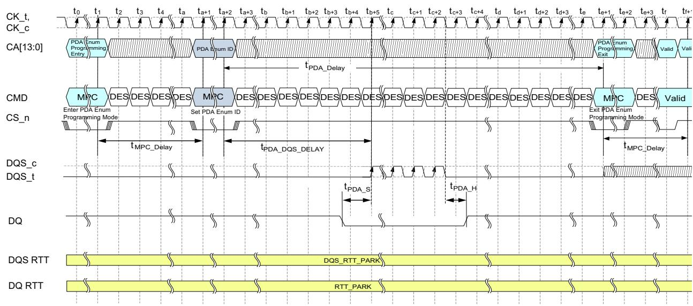  
NOTE 1 The timing diagram assumes preamble/postamble requirements for DQS.  
NOTE 2 The 2nd MPC command at tA+1 is assuming a multi-cycle command and the timings are adjusted to visually show separation between spacing timings such as tMPC_Delay (which start at the end of a command cycle and end at the beginning of the next) and other timings such as tPDA_DELAY.

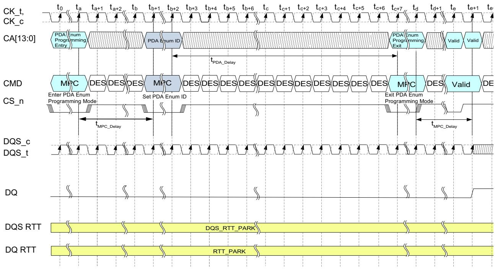  
Figure 74 — PDA Enumerate Programming Mode w/Continuous DQS Toggle Timing Diagram

# 4.16.1 PDA Enumerate ID Programming (Cont'd)

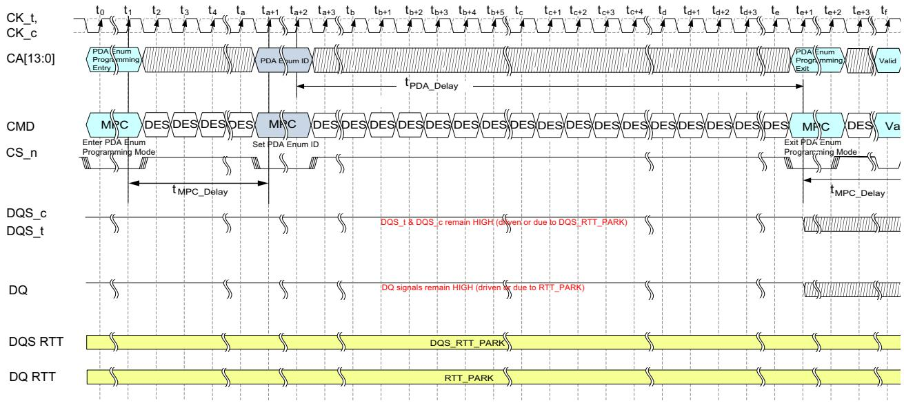  
Figure 75 — Timing Diagram Showing “Don’t Enumerate” Case.

# 4.16.2 PDA Select ID Operation

Once the PDA Enumerate ID's have been programmed in all the DRAMs, the execution of future MPC/ MRW/VrefCA commands depend on the value of the PDA Select ID and the type of MPC command. If the PDA Select ID is set to  $1111_{\mathrm{B}}$ , all DRAMs will execute the command. For all MRW commands and VrefCA commands, and some of the MPC commands (RTT_CA/CS/CK and RTT_PARK opcodes), the PDA Select ID will be compared to the PDA Enumerate ID to determine if the DRAM will execute the commands. For all other MPC commands (i.e., not the RTT_CA/CS/CK and RTT_PARK opcodes), the DRAM will execute the command regardless of the PDA Select ID value.

As an example, the following sequence could be used to program unique MR fields per device:

1 Send MPC with 'PDA Select ID' opcode, with encoding 0000 included in the opcode  
2 Send MRW's for field settings specific to Device 0000. this can be any number of MRW's  
3 Send MPC with 'PDA Select ID' opcode, with encoding 0001 included in the opcode  
4 Send MRW's for field settings specific to Device 0001. this can be any number of MRW's  
5 Repeat for any number of devices  
6 Send MPC with 'PDA Select ID' opcode, with encoding 1111 included in the opcode to enable all DRAMs to execute all MRW, VrefCA, and MPC commands.

Figure 76 shows an example sequencing of the programming of the PDA Select ID and MPC, VrefCA, or MRW commands.

# 4.16.2 PDA Enumerate ID Programming Cont'd)

Figure 76 — Timing Diagram Showing Multi-Cycle MPC Command Sequencing with PDA Enumerate & PDA Select ID  
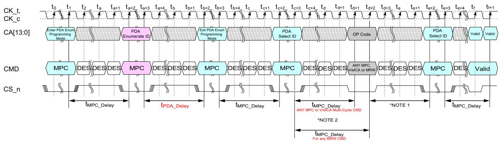  
NOTE 1 Commands used such as VREFCA or MRW have different command spacing requirements. Please refer to those specific sections in the document for details.  
NOTE 2 ANY Multi-cycle MPC or VREFCA command spacing is measured from the last valid command cycle to the first following valid command cycle, while standard command spacing goes from last valid command cycle to last valid command cycle. See Figure 7 for details.

Table 298 summarizes the electrical parameters associated with PDA Enumerate Programming Mode.

Table 298 — PDA Parametric Timings  

<table><tr><td rowspan="2">Parameter</td><td rowspan="2">Symbol</td><td colspan="2">DDR5-3200 to 4800</td><td colspan="2">DDR5-5200 to 6400</td><td rowspan="2">Units</td><td rowspan="2">NOTE</td></tr><tr><td>Min</td><td>Max</td><td>Min</td><td>Max</td></tr><tr><td>PDA Enumerate ID Com-mand to any other com-mand cycle time</td><td>tPDA_DELAY</td><td>tPDA_DQS_Delay_ max+BL/2+19ns</td><td>-</td><td>TBD</td><td>-</td><td>ns</td><td></td></tr><tr><td>Delay to rising strobe edge used for sampling DQ during PDA operation</td><td>tPDA_DQS_DELAY</td><td>5</td><td>18</td><td>TBD</td><td>TBD</td><td>ns</td><td>1</td></tr><tr><td>DQ Setup Time during PDA operation</td><td>tPDA_S</td><td>3</td><td>-</td><td>TBD</td><td>-</td><td>nCK</td><td></td></tr><tr><td>DQ Hold Time during PDA operation</td><td>tPDA_H</td><td>3</td><td>-</td><td>TBD</td><td>-</td><td>nCK</td><td></td></tr></table>

NOTE 1 The range of tPDA_DQS_DELAY specifies the full range of when the minimum of 16 strobe edges can be sent by the host controller.

# 4.17 Read Training Pattern

# 4.17.1 Introduction

Training of the Memory Interface requires the ability to read a known pattern from the DRAM, prior to enabling writes into the DRAM. Due to the increased frequencies supported by DDR5, a simple repeating pattern will not be sufficient for read training. A Linear-Feedback Shift Register (LFSR) for a pattern generator will also be required. The read training pattern is accessed when the host issues an MRR command to the MR31 address, and CRC must be disabled prior to issue this command. In this case, the returned data will be a pattern instead of the contents of a mode register. The timing of the read data return is the same as for an MRR or Read command, including the operation of the strobes (DQSL_t, DQSL_c, DQSU_t, DQSU_c). The DRAM shall also support non-target ODT.

An alternate continuous burst mode is available and is configured with MRW to MR25:OP[3] = 1. Once this mode is configured, any subsequent MRR (it does not need to be an explicit MRR to MR31) to that DRAM will start the pattern output and will automatically continue to output the appropriate pattern until it is stopped by either a system reset or issuing an MRW MR25:OP[3] = 0 command that reverts it to the "MRR command based (Default)" mode as shown in Figure 80. Once the MR25:OP[3] = 0 "MRR command based (Default)" is registered by the DRAM, it will stop all pattern traffic by tCont_Exit. Since there is no min time for tCont_Exit, the DRAM may stop the pattern prior to tCont_Exit, potentially truncating any current burst pattern. To ensure that the DRAM's state-machine doesn't get into some meta-stability while turning off the output pattern, the host must issue a second MR25:OP[3] = 0 "MRR command based (Default)" after waiting tMRR, which will then start tCont_Exit_delay. After tCont_Exit_delay has expired, any other valid command is then legal. All Read Training Patterns (modes) are supported in continuous burst mode. The host shall disable Read CRC, if enabled, prior to using continuous burst mode.

Prior to utilizing either read training pattern mode (Continuous Burst Output mode or MRR Command Based mode), the initial seed value will need to be programmed in MR26-MR30 else the power on default values will be used.

The default value for the Read Pattern Data0/LFSR0 (MR26) register setting is: 0x5A and the default value for the Read Pattern Data1/LFSR1 (MR27) register setting is: 0x3C. The Read Pattern Invert (MR28, MR29) register settings default to 0. The Read LFSR Assignments (MR30) register setting default is 0xFE.

The DRAM will not store the current LFSR state when exiting the Continuous Burst Output Mode and may clear the pattern values stored in MR26-MR30, therefore any subsequent pattern reads will require the host to reprogram the seed, pattern, inversion and LFSR assignments in MR26-MR30.

The Read Training Pattern has 2 primary supported modes of operation. One of the modes is referred to as the serial format. The second mode is LFSR mode. The LFSR mode is required due to the higher frequency bus operation for DDR5. There is a secondary mode associated with the LFSR mode, which enables the generation of a simple high frequency clock pattern instead of the LFSR pattern. The Read Training Pattern is a full BL16 pattern for each MRR command issued to the Read Training Pattern address.

Only BL16 Mode is supported by the Read Training Pattern and it should not be disturbed by an ACT command until the completion of training.

Table 299 - Read Training Pattern Address  

<table><tr><td>MR Address</td><td>Operating Mode</td><td>Description</td></tr><tr><td>MR31</td><td>Read Training Pattern</td><td>This MR address is reserved. There are no specific register fields associated with this address. In response to the MRR to this address the DRAM will send the BL16 read training pattern. All 8 bits associated with this MR address are reserved.</td></tr></table>

# 4.17.1 Introduction (Cont'd)

Table 300 shows the MR field and encodings for the Read Training Pattern format settings.

Table 300 - Read Training Mode Settings  

<table><tr><td>MR Address</td><td>Operating Mode</td><td>Description</td></tr><tr><td>MR25 OP[0]</td><td>Read Training Pattern Format</td><td>0B: Serial
1B: LFSR</td></tr><tr><td>MR25 OP[1]</td><td>LFSR0 Pattern Option</td><td>0B: LFSR
1B: Clock</td></tr><tr><td>MR25 OP[2]</td><td>LFSR1 Pattern Option</td><td>0B: LFSR
1B: Clock</td></tr><tr><td>MR25 OP[3]</td><td>Continuous Burst Mode</td><td>0B: MRR command based (Default)
1B: Continuous Burst Output</td></tr></table>

The default value for the Read Training Pattern Format register setting is: 0x0.

For Serial Read Training Pattern Format mode, the following Mode Registers are programmed with the data pattern. There are two 8-bit registers to provide a 16 UI pattern length and two 8-bit registers to provide up to x16 data width for per-DQ-lane inversion.

The LFSR mode requires an 8-bit Mode Register to program the seed for the 8-bit LFSR. The details of the LFSR polynomial and outputs are explained in the following section. The Read Pattern Data0/LFSR0 and Read Pattern Data1/LFSR1 registers are re-purposed to program the LFSR seed when the Read Training Pattern Format is set to LFSR.

Table 301 - Read Pattern Data0 / LFSR0  

<table><tr><td>MR Address</td><td>MRW OP</td><td>OP7</td><td>OP6</td><td>OP5</td><td>OP4</td><td>OP3</td><td>OP2</td><td>OP1</td><td>OP0</td></tr><tr><td>MR26</td><td>UI</td><td>7</td><td>6</td><td>5</td><td>4</td><td>3</td><td>2</td><td>1</td><td>0</td></tr></table>

The default value for the Read Pattern Data0/LFSR0 register setting is: 0x5A.

Table 302 - Read Pattern Data1 / LFSR1  

<table><tr><td>MR Address</td><td>MRW OP</td><td>OP7</td><td>OP6</td><td>OP5</td><td>OP4</td><td>OP3</td><td>OP2</td><td>OP1</td><td>OP0</td></tr><tr><td>MR27</td><td>UI</td><td>15</td><td>14</td><td>13</td><td>12</td><td>11</td><td>10</td><td>9</td><td>8</td></tr></table>

The default value for the Read Pattern Data1/LFSR1 register setting is: 0x3C.

The values for the Read Pattern Data0/LFSR0 and Read Pattern Data1/LFSR1 registers may be restored to the default values under the following conditions:

Self Refresh  
Power-down entry  
- Exiting Continuous Burst Output Mode

If any of the above conditions occur, the Host will need to reprogram the contents of MR26 and MR27, prior to utilizing either read training pattern mode (Continuous Burst Output mode or MRR Command Based mode).

In both cases, when the Read Training Pattern Format is set to Serial mode or LFSR mode, the Read Pattern Invert - Lower DQ Bits and Read Pattern Invert - Upper DQ Bits settings will additionally invert the pattern, per DQ bit. The Read Pattern Invert - Lower DQ Bits register will apply to x4, x8, and x16 devices. The Read Pattern Invert - Upper DQ Bits register only applies to x16 devices, for the upper byte.

# 4.17.1 Introduction (Cont'd)

Table 303 — Read Pattern Invert – Lower DQ Bits  

<table><tr><td>MR Address</td><td>MRW OP</td><td>OP7</td><td>OP6</td><td>OP5</td><td>OP4</td><td>OP3</td><td>OP2</td><td>OP1</td><td>OP0</td></tr><tr><td>MR28</td><td>DQ Invert</td><td>DQL7</td><td>DQL6</td><td>DQL5</td><td>DQL4</td><td>DQL3</td><td>DQL2</td><td>DQL1</td><td>DQL0</td></tr></table>

The default value for the Read Pattern Invert - Lower DQ Bits register setting is: 0x00.

Table 304 - Read Pattern Invert - Upper DQ Bits  

<table><tr><td>MR Address</td><td>MRW OP</td><td>OP7</td><td>OP6</td><td>OP5</td><td>OP4</td><td>OP3</td><td>OP2</td><td>OP1</td><td>OP0</td></tr><tr><td>MR29</td><td>DQ Invert</td><td>DQU7</td><td>DQU6</td><td>DQU5</td><td>DQU4</td><td>DQU3</td><td>DQU2</td><td>DQU1</td><td>DQU0</td></tr></table>

The default value for the Read Pattern Invert - Upper DQ Bits register setting is: 0x00.

The values for both Read Pattern Invert - Lower and Upper DQ Bit registers may be restored to the default values under the following conditions:

Self Refresh  
Power-down entry  
- Exiting Continuous Burst Output Mode

If any of the above conditions occur, the Host will need to reprogram the contents of MR28 and MR29 if non-default values are desired, prior to utilizing either read training pattern mode (Continuous Burst Output mode or MRR Command Based mode).

A value of 0 in any bit location of the Read Pattern Invert - Lower DQ Bits or Read Pattern Invert - Upper DQ Bits registers will leave the pattern un-inverted for the associated DQ. A value of 1 in any bit location of the Read Pattern Invert - Lower DQ Bits or Read Pattern Invert - Upper DQ Bits registers will invert the pattern for the associated DQ.

# 4.17.2 LFSR Pattern Generation

The LFSR is an 8-bit Galois LFSR. The polynomial for the Galois LFSR is  $\mathrm{x}^{8} + \mathrm{x}^{6} + \mathrm{x}^{5} + \mathrm{x}^{4} + 1$ . Figure 77 shows the logic to implement the LFSR. The numbered locations within the shift register show the mapping of the seed/state positions within the register. There are two instances of the same LFSR polynomial. These two instances will have unique seeds/states and supply patterns to any of the DQ outputs.

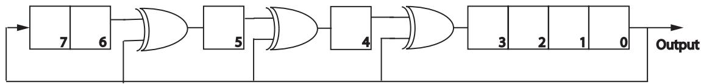  
Figure 77 - Read Training Pattern LFSR

The seed location in the figure clarifies the mapping for the Read Pattern Data0/LFRS0 and Read Pattern Data1/LFSR1 mode registers relative to the LFSR logic. The LFSR output is directed to any number of the DQ outputs, depending on the LFSR assignment programming. These assignments between LFSR0 and LFSR1 to each DQ output will create a unique pattern sequence for better coverage of DQ to DQ crosstalk interactions. The LFSR assignments are programmed according to Figure 77.

Table 305 - Read LFSR Assignments  

<table><tr><td>MR Address</td><td>MRW OP</td><td>LFSR Assignment</td><td>MR Setting</td></tr><tr><td rowspan="8">MR30</td><td>OP0</td><td>DQL0/DQU0</td><td>0B: Read Pattern Data0/LFSR01B: Read Pattern Data1/LFSR1</td></tr><tr><td>OP1</td><td>DQL1/DQU1</td><td>0B: Read Pattern Data0/LFSR01B: Read Pattern Data1/LFSR1</td></tr><tr><td>OP2</td><td>DQL2/DQU2</td><td>0B: Read Pattern Data0/LFSR01B: Read Pattern Data1/LFSR1</td></tr><tr><td>OP3</td><td>DQL3/DQU3</td><td>0B: Read Pattern Data0/LFSR01B: Read Pattern Data1/LFSR1</td></tr><tr><td>OP4</td><td>DQL4/DQU4</td><td>0B: Read Pattern Data0/LFSR01B: Read Pattern Data1/LFSR1</td></tr><tr><td>OP5</td><td>DQL5/DQU5</td><td>0B: Read Pattern Data0/LFSR01B: Read Pattern Data1/LFSR1</td></tr><tr><td>OP6</td><td>DQL6/DQU6</td><td>0B: Read Pattern Data0/LFSR01B: Read Pattern Data1/LFSR1</td></tr><tr><td>OP7</td><td>DQL7/DQU7</td><td>0B: Read Pattern Data0/LFSR01B: Read Pattern Data1/LFSR1</td></tr></table>

The default value for the Read LFSR Assignments register setting is: 0xFE.

The values for the Read LFSR Assignments register may be restored to the default values under the following conditions:

Self Refresh  
Power-down entry  
- Exiting Continuous Burst Output Mode

If any of these conditions occur, the Host will need to reprogram the contents of MR30 if non-default values are desired, prior to utilizing either read training pattern mode (Continuous Burst Output mode or MRR Command Based mode).

The LFSR output will change at the UI frequency, producing a new output value on every UI. The LFSR will only change state to support the read data after the MRR to the specific (MR31) Read Training Pattern address. When there are no MRR accesses to the (MR31) Read Training Pattern address, the LFSR will retain its previous state (from the end of the previous Read Training Pattern MRR access completion). Therefore, the full state space of the LFSR may be traversed through a series of 16 MRR commands, each of which accesses 16 UI's of LFSR output. The BL for the LFSR data will always be BL16. The state of the LFSR can also be changed by sending a new MRW command to reset the LFSR0 and LFSR1 seed mode registers (MR26 and MR27) or through the reset conditions listed for those registers. A setting of 0x00 in either of the LFSR seed registers (MR26 and MR27) will not produce a pattern with any transitions to 1. When set to this value the LFSR will produce a constant 0 pattern.

When the LFSR0 Pattern Option MR25:OP[1] is set to 1, the pattern that is supplied by the DRAM is a high frequency clock pattern, instead of the LFSR. This clock pattern is sent only to the DQ signals that have a setting of 0 in the corresponding DQ Opcode location in the Read LFSR Assignments register. The first UI of the pattern will have a value of 0. The second UI will have a value of 1, and this will continue to toggle for each subsequent UI.

# 4.17.2 LFSR Pattern Generation (Cont'd)

When the LFSR1 Pattern Option MR25:OP[2] is set to 1, the pattern that is supplied by the DRAM is a high frequency clock pattern, instead of the LFSR. This clock pattern is sent only to the DQ signals that have a setting of 1 in the corresponding DQ Opcode location in the Read LFSR Assignments register. The first UI of the pattern will have a value of 0. The second UI will have a value of 1, and this will continue to toggle for each subsequent UI.

The state of the LFSR will not change when an MRR to MR31 occurs if the associated LFSR Pattern Option is set to 1 in MR25[1] for LFSR0 or MR25[2] for LFSR1, designating the clock pattern. The state of both LFSR0 and LFSR1 will also not change when an MRR to MR31 occurs if the serial mode is selected by setting MR25[0] = 0. The Read LFSR Assignments settings have no impact on whether or not the LFSR state progresses with each MRR to MR31. Only the Read Training Pattern Format and LFSR Pattern Option settings determine whether the LFSR is actively computing next states.

# 4.17.3 Read Training Pattern Examples

Table 306 shows the bit sequence of the Read Training Pattern, for the following programming:

Read Training Pattern Format  $= 0$  (Serial)

LFSR0 Pattern Option = 0 (These are don't cares when in Serial Read Training Pattern Format)

LFSR1 Pattern Option  $= 0$  (These are don't cares when in Serial Read Training Pattern Format)

Read Pattern Data0/LFSR0 = 0x1C

Read Pattern Data1/LFSR1 = 0x59

Read Pattern Invert - Lower DQ Bits = 0x55

Read Pattern Invert - Upper DQ Bits = 0x55

Table 306 — Serial Bit Sequence Example  

<table><tr><td rowspan="2">Pin</td><td rowspan="2">Invert</td><td colspan="16">Bit Sequence</td></tr><tr><td>15</td><td>14</td><td>13</td><td>12</td><td>11</td><td>10</td><td>9</td><td>8</td><td>7</td><td>6</td><td>5</td><td>4</td><td>3</td><td>2</td><td>1</td><td>0</td></tr><tr><td>DQL0</td><td>1 (Yes)</td><td>1</td><td>0</td><td>1</td><td>0</td><td>0</td><td>1</td><td>1</td><td>0</td><td>1</td><td>1</td><td>1</td><td>0</td><td>0</td><td>0</td><td>1</td><td>1</td></tr><tr><td>DQL1</td><td>0 (No)</td><td>0</td><td>1</td><td>0</td><td>1</td><td>1</td><td>0</td><td>0</td><td>1</td><td>0</td><td>0</td><td>0</td><td>1</td><td>1</td><td>1</td><td>0</td><td>0</td></tr><tr><td>DQL2</td><td>1 (Yes)</td><td>1</td><td>0</td><td>1</td><td>0</td><td>0</td><td>1</td><td>1</td><td>0</td><td>1</td><td>1</td><td>1</td><td>0</td><td>0</td><td>0</td><td>1</td><td>1</td></tr><tr><td>DQL3</td><td>0 (No)</td><td>0</td><td>1</td><td>0</td><td>1</td><td>1</td><td>0</td><td>0</td><td>1</td><td>0</td><td>0</td><td>0</td><td>1</td><td>1</td><td>1</td><td>0</td><td>0</td></tr><tr><td>DQL4</td><td>1 (Yes)</td><td>1</td><td>0</td><td>1</td><td>0</td><td>0</td><td>1</td><td>1</td><td>0</td><td>1</td><td>1</td><td>1</td><td>0</td><td>0</td><td>0</td><td>1</td><td>1</td></tr><tr><td>DQL5</td><td>0 (No)</td><td>0</td><td>1</td><td>0</td><td>1</td><td>1</td><td>0</td><td>0</td><td>1</td><td>0</td><td>0</td><td>0</td><td>1</td><td>1</td><td>1</td><td>0</td><td>0</td></tr><tr><td>DQL6</td><td>1 (Yes)</td><td>1</td><td>0</td><td>1</td><td>0</td><td>0</td><td>1</td><td>1</td><td>0</td><td>1</td><td>1</td><td>1</td><td>0</td><td>0</td><td>0</td><td>1</td><td>1</td></tr><tr><td>DQL7</td><td>0 (No)</td><td>0</td><td>1</td><td>0</td><td>1</td><td>1</td><td>0</td><td>0</td><td>1</td><td>0</td><td>0</td><td>0</td><td>1</td><td>1</td><td>1</td><td>0</td><td>0</td></tr><tr><td>DQU0</td><td>1 (Yes)</td><td>1</td><td>0</td><td>1</td><td>0</td><td>0</td><td>1</td><td>1</td><td>0</td><td>1</td><td>1</td><td>1</td><td>0</td><td>0</td><td>0</td><td>1</td><td>1</td></tr><tr><td>DQU1</td><td>0 (No)</td><td>0</td><td>1</td><td>0</td><td>1</td><td>1</td><td>0</td><td>0</td><td>1</td><td>0</td><td>0</td><td>0</td><td>1</td><td>1</td><td>1</td><td>0</td><td>0</td></tr><tr><td>DQU2</td><td>1 (Yes)</td><td>1</td><td>0</td><td>1</td><td>0</td><td>0</td><td>1</td><td>1</td><td>0</td><td>1</td><td>1</td><td>1</td><td>0</td><td>0</td><td>0</td><td>1</td><td>1</td></tr><tr><td>DQU3</td><td>0 (No)</td><td>0</td><td>1</td><td>0</td><td>1</td><td>1</td><td>0</td><td>0</td><td>1</td><td>0</td><td>0</td><td>0</td><td>1</td><td>1</td><td>1</td><td>0</td><td>0</td></tr><tr><td>DQU4</td><td>1 (Yes)</td><td>1</td><td>0</td><td>1</td><td>0</td><td>0</td><td>1</td><td>1</td><td>0</td><td>1</td><td>1</td><td>1</td><td>0</td><td>0</td><td>0</td><td>1</td><td>1</td></tr><tr><td>DQU5</td><td>0 (No)</td><td>0</td><td>1</td><td>0</td><td>1</td><td>1</td><td>0</td><td>0</td><td>1</td><td>0</td><td>0</td><td>0</td><td>1</td><td>1</td><td>1</td><td>0</td><td>0</td></tr><tr><td>DQU6</td><td>1 (Yes)</td><td>1</td><td>0</td><td>1</td><td>0</td><td>0</td><td>1</td><td>1</td><td>0</td><td>1</td><td>1</td><td>1</td><td>0</td><td>0</td><td>0</td><td>1</td><td>1</td></tr><tr><td>DQU7</td><td>0 (No)</td><td>0</td><td>1</td><td>0</td><td>1</td><td>1</td><td>0</td><td>0</td><td>1</td><td>0</td><td>0</td><td>0</td><td>1</td><td>1</td><td>1</td><td>0</td><td>0</td></tr></table>

# 4.17.3 Read Training Pattern Examples (Cont'd)

Table 307 shows the bit sequence of the Read Training Pattern, for the following programming:

Read Training Pattern Format  $= 1$  (LFSR)

LFSR0 Pattern Option  $= 0$

LFSR1 Pattern Option  $= 0$

Read Pattern Data0/LFSR0 = 0x5A

Read Pattern Data1/LFSR1 = 0x3C

Read LFSR Assignments  $= 0\mathrm{xFE}$

Read Pattern Invert - Lower DQ Bits = 0x00

Read Pattern Invert - Upper DQ Bits = 0xFF

Table 307 — LFSR Bit Sequence Example 1  

<table><tr><td rowspan="2">Pin</td><td rowspan="2">Invert</td><td rowspan="2">LFSR</td><td colspan="16">Bit Sequence</td></tr><tr><td>15</td><td>14</td><td>13</td><td>12</td><td>11</td><td>10</td><td>9</td><td>8</td><td>7</td><td>6</td><td>5</td><td>4</td><td>3</td><td>2</td><td>1</td><td>0</td></tr><tr><td>DQL0</td><td>0 (No)</td><td>0</td><td>0</td><td>0</td><td>1</td><td>1</td><td>0</td><td>0</td><td>0</td><td>0</td><td>0</td><td>0</td><td>1</td><td>1</td><td>1</td><td>0</td><td>1</td><td>0</td></tr><tr><td>DQL1</td><td>0 (No)</td><td>1</td><td>0</td><td>1</td><td>1</td><td>1</td><td>1</td><td>0</td><td>1</td><td>1</td><td>0</td><td>1</td><td>1</td><td>1</td><td>1</td><td>1</td><td>0</td><td>0</td></tr><tr><td>DQL2</td><td>0 (No)</td><td>1</td><td>0</td><td>1</td><td>1</td><td>1</td><td>1</td><td>0</td><td>1</td><td>1</td><td>0</td><td>1</td><td>1</td><td>1</td><td>1</td><td>1</td><td>0</td><td>0</td></tr><tr><td>DQL3</td><td>0 (No)</td><td>1</td><td>0</td><td>1</td><td>1</td><td>1</td><td>1</td><td>0</td><td>1</td><td>1</td><td>0</td><td>1</td><td>1</td><td>1</td><td>1</td><td>1</td><td>0</td><td>0</td></tr><tr><td>DQL4</td><td>0 (No)</td><td>1</td><td>0</td><td>1</td><td>1</td><td>1</td><td>1</td><td>0</td><td>1</td><td>1</td><td>0</td><td>1</td><td>1</td><td>1</td><td>1</td><td>1</td><td>0</td><td>0</td></tr><tr><td>DQL5</td><td>0 (No)</td><td>1</td><td>0</td><td>1</td><td>1</td><td>1</td><td>1</td><td>0</td><td>1</td><td>1</td><td>0</td><td>1</td><td>1</td><td>1</td><td>1</td><td>1</td><td>0</td><td>0</td></tr><tr><td>DQL6</td><td>0 (No)</td><td>1</td><td>0</td><td>1</td><td>1</td><td>1</td><td>1</td><td>0</td><td>1</td><td>1</td><td>0</td><td>1</td><td>1</td><td>1</td><td>1</td><td>1</td><td>0</td><td>0</td></tr><tr><td>DQL7</td><td>0 (No)</td><td>1</td><td>0</td><td>1</td><td>1</td><td>1</td><td>1</td><td>0</td><td>1</td><td>1</td><td>0</td><td>1</td><td>1</td><td>1</td><td>1</td><td>1</td><td>0</td><td>0</td></tr><tr><td>DQU0</td><td>1 (Yes)</td><td>0</td><td>1</td><td>1</td><td>0</td><td>0</td><td>1</td><td>1</td><td>1</td><td>1</td><td>1</td><td>1</td><td>0</td><td>0</td><td>0</td><td>1</td><td>0</td><td>1</td></tr><tr><td>DQU1</td><td>1 (Yes)</td><td>1</td><td>1</td><td>0</td><td>0</td><td>0</td><td>0</td><td>1</td><td>0</td><td>0</td><td>1</td><td>0</td><td>0</td><td>0</td><td>0</td><td>0</td><td>1</td><td>1</td></tr><tr><td>DQU2</td><td>1 (Yes)</td><td>1</td><td>1</td><td>0</td><td>0</td><td>0</td><td>0</td><td>1</td><td>0</td><td>0</td><td>1</td><td>0</td><td>0</td><td>0</td><td>0</td><td>0</td><td>1</td><td>1</td></tr><tr><td>DQU3</td><td>1 (Yes)</td><td>1</td><td>1</td><td>0</td><td>0</td><td>0</td><td>0</td><td>1</td><td>0</td><td>0</td><td>1</td><td>0</td><td>0</td><td>0</td><td>0</td><td>0</td><td>1</td><td>1</td></tr><tr><td>DQU4</td><td>1 (Yes)</td><td>1</td><td>1</td><td>0</td><td>0</td><td>0</td><td>0</td><td>1</td><td>0</td><td>0</td><td>1</td><td>0</td><td>0</td><td>0</td><td>0</td><td>0</td><td>1</td><td>1</td></tr><tr><td>DQU5</td><td>1 (Yes)</td><td>1</td><td>1</td><td>0</td><td>0</td><td>0</td><td>0</td><td>1</td><td>0</td><td>0</td><td>1</td><td>0</td><td>0</td><td>0</td><td>0</td><td>0</td><td>1</td><td>1</td></tr><tr><td>DQU6</td><td>1 (Yes)</td><td>1</td><td>1</td><td>0</td><td>0</td><td>0</td><td>0</td><td>1</td><td>0</td><td>0</td><td>1</td><td>0</td><td>0</td><td>0</td><td>0</td><td>0</td><td>1</td><td>1</td></tr><tr><td>DQU7</td><td>1 (Yes)</td><td>1</td><td>1</td><td>0</td><td>0</td><td>0</td><td>0</td><td>1</td><td>0</td><td>0</td><td>1</td><td>0</td><td>0</td><td>0</td><td>0</td><td>0</td><td>1</td><td>1</td></tr></table>

# 4.17.3 Read Training Pattern Examples (Cont'd)

Table 308 shows the bit sequence of the Read Training Pattern, for the following programming:

Read Training Pattern Format  $= 1$  (LFSR)

LFSR0 Pattern Option  $= 0$

LFSR1 Pattern Option = 1 (Clock Pattern Option)

Read Pattern Data0/LFSR0 = 0x00 (When the LFSR seed is set to 0, this produces a constant 0 pattern)

Read Pattern Data1/LFSR1 = 0x3C (This value is a don't care when LFSR1 Pattern Option = 1)

Read LFSR Assignments  $= 0\mathrm{x}04$

Read Pattern Invert - Lower DQ Bits = 0xFB

Read Pattern Invert - Upper DQ Bits  $= 0\mathrm{xFB}$

Table 308 — LFSR Bit Sequence Example 2  

<table><tr><td rowspan="2">Pin</td><td rowspan="2">Invert</td><td rowspan="2">LFSR</td><td colspan="16">Bit Sequence</td></tr><tr><td>15</td><td>14</td><td>13</td><td>12</td><td>11</td><td>10</td><td>9</td><td>8</td><td>7</td><td>6</td><td>5</td><td>4</td><td>3</td><td>2</td><td>1</td><td>0</td></tr><tr><td>DQL0</td><td>1 (Yes)</td><td>0</td><td>1</td><td>1</td><td>1</td><td>1</td><td>1</td><td>1</td><td>1</td><td>1</td><td>1</td><td>1</td><td>1</td><td>1</td><td>1</td><td>1</td><td>1</td><td>1</td></tr><tr><td>DQL1</td><td>1 (Yes)</td><td>0</td><td>1</td><td>1</td><td>1</td><td>1</td><td>1</td><td>1</td><td>1</td><td>1</td><td>1</td><td>1</td><td>1</td><td>1</td><td>1</td><td>1</td><td>1</td><td>1</td></tr><tr><td>DQL2</td><td>0 (No)</td><td>1</td><td>1</td><td>0</td><td>1</td><td>0</td><td>1</td><td>0</td><td>1</td><td>0</td><td>1</td><td>0</td><td>1</td><td>0</td><td>1</td><td>0</td><td>1</td><td>0</td></tr><tr><td>DQL3</td><td>1 (Yes)</td><td>0</td><td>1</td><td>1</td><td>1</td><td>1</td><td>1</td><td>1</td><td>1</td><td>1</td><td>1</td><td>1</td><td>1</td><td>1</td><td>1</td><td>1</td><td>1</td><td>1</td></tr><tr><td>DQL4</td><td>1 (Yes)</td><td>0</td><td>1</td><td>1</td><td>1</td><td>1</td><td>1</td><td>1</td><td>1</td><td>1</td><td>1</td><td>1</td><td>1</td><td>1</td><td>1</td><td>1</td><td>1</td><td>1</td></tr><tr><td>DQL5</td><td>1 (Yes)</td><td>0</td><td>1</td><td>1</td><td>1</td><td>1</td><td>1</td><td>1</td><td>1</td><td>1</td><td>1</td><td>1</td><td>1</td><td>1</td><td>1</td><td>1</td><td>1</td><td>1</td></tr><tr><td>DQL6</td><td>1 (Yes)</td><td>0</td><td>1</td><td>1</td><td>1</td><td>1</td><td>1</td><td>1</td><td>1</td><td>1</td><td>1</td><td>1</td><td>1</td><td>1</td><td>1</td><td>1</td><td>1</td><td>1</td></tr><tr><td>DQL7</td><td>1 (Yes)</td><td>0</td><td>1</td><td>1</td><td>1</td><td>1</td><td>1</td><td>1</td><td>1</td><td>1</td><td>1</td><td>1</td><td>1</td><td>1</td><td>1</td><td>1</td><td>1</td><td>1</td></tr><tr><td>DQU0</td><td>1 (Yes)</td><td>0</td><td>1</td><td>1</td><td>1</td><td>1</td><td>1</td><td>1</td><td>1</td><td>1</td><td>1</td><td>1</td><td>1</td><td>1</td><td>1</td><td>1</td><td>1</td><td>1</td></tr><tr><td>DQU1</td><td>1 (Yes)</td><td>0</td><td>1</td><td>1</td><td>1</td><td>1</td><td>1</td><td>1</td><td>1</td><td>1</td><td>1</td><td>1</td><td>1</td><td>1</td><td>1</td><td>1</td><td>1</td><td>1</td></tr><tr><td>DQU2</td><td>0 (No)</td><td>1</td><td>1</td><td>0</td><td>1</td><td>0</td><td>1</td><td>0</td><td>1</td><td>0</td><td>1</td><td>0</td><td>1</td><td>0</td><td>1</td><td>0</td><td>1</td><td>0</td></tr><tr><td>DQU3</td><td>1 (Yes)</td><td>0</td><td>1</td><td>1</td><td>1</td><td>1</td><td>1</td><td>1</td><td>1</td><td>1</td><td>1</td><td>1</td><td>1</td><td>1</td><td>1</td><td>1</td><td>1</td><td>1</td></tr><tr><td>DQU4</td><td>1 (Yes)</td><td>0</td><td>1</td><td>1</td><td>1</td><td>1</td><td>1</td><td>1</td><td>1</td><td>1</td><td>1</td><td>1</td><td>1</td><td>1</td><td>1</td><td>1</td><td>1</td><td>1</td></tr><tr><td>DQU5</td><td>1 (Yes)</td><td>0</td><td>1</td><td>1</td><td>1</td><td>1</td><td>1</td><td>1</td><td>1</td><td>1</td><td>1</td><td>1</td><td>1</td><td>1</td><td>1</td><td>1</td><td>1</td><td>1</td></tr><tr><td>DQU6</td><td>1 (Yes)</td><td>0</td><td>1</td><td>1</td><td>1</td><td>1</td><td>1</td><td>1</td><td>1</td><td>1</td><td>1</td><td>1</td><td>1</td><td>1</td><td>1</td><td>1</td><td>1</td><td>1</td></tr><tr><td>DQU7</td><td>1 (Yes)</td><td>0</td><td>1</td><td>1</td><td>1</td><td>1</td><td>1</td><td>1</td><td>1</td><td>1</td><td>1</td><td>1</td><td>1</td><td>1</td><td>1</td><td>1</td><td>1</td><td>1</td></tr></table>

# 4.17.4 Read Training Pattern Timing Diagrams

The timing of the data return and strobe sequence should match that of a Read operation. The timing of the Read Training Pattern will be similar to the MRR operation, with the exception that the MRR to the address that invokes the Read Training Pattern will be a full BL16 pattern. The timing between MRR commands to access the Read Training Pattern is defined as tMRR_p, which supports back to back data patterns. This is faster than a normal MRR to MRR condition which is defined as tMRR.

Figure 78 shows the general timing sequence for an MRR that accesses the Read Training Pattern:

Figure 78 — Timing Diagram for Read Training Pattern  
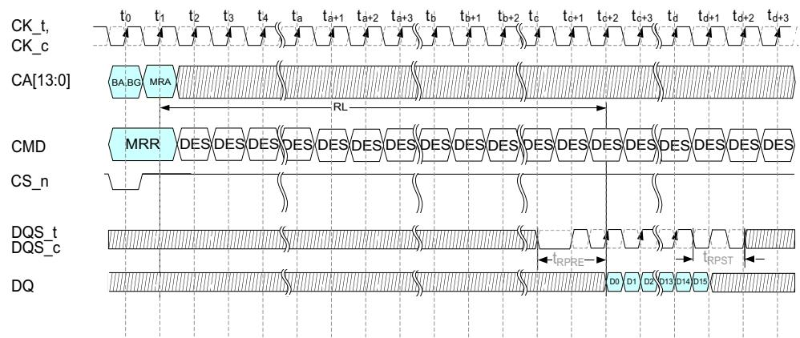  
NOTE The Read Training Pattern shall align to the DDR5 preamble timings.

The Read Training Pattern must also support back to back traffic, for any number of MRR commands sequenced every 8 tCK. Figure 79 shows a back to back pattern example:

Figure 79 — Timing Diagram for Back to Back Read Training Patterns  
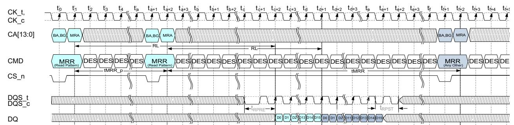  
NOTE The Read Training Pattern shall align to the DDR5 preamble timings.

Figure 80 — Timing Diagram for Continuous Burst Mode Read Training Patterns  
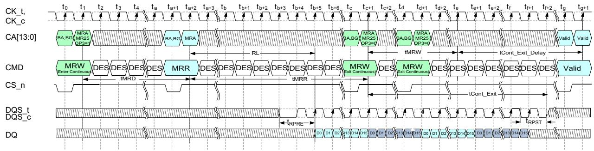  
NOTE The Read Training Pattern shall align to the DDR5 preamble timings and will exit after the MRW (Continuous Exit encoding) has been received but before tCont_Exit has expired. During tCont_Exit, the data output may not follow the read pattern data.

# 4.17.4 Read Training Pattern Timing Diagrams (Cont'd)

Table 309 — Timing Parameters for Read Training Patterns  

<table><tr><td>Parameter</td><td>Symbol</td><td>Min</td><td>Max</td><td>Units</td><td>Notes</td></tr><tr><td>Registration of MRW Continuous Burst Mode Exit to next valid command delay</td><td>tCont_Exit_Delay</td><td>-</td><td>tCont_Exit+ tMRW</td><td>ns</td><td></td></tr><tr><td>Registration of MRW Continuous Burst Mode Exit to end of training mode</td><td>tCont_Exit</td><td>-</td><td>RL+BL/2+10nCK</td><td>ns</td><td></td></tr></table>

# 4.18 Read Preamble Training Mode

# 4.18.1 Introduction

Read preamble training supports read leveling of the host receiver timings. This mode supports MRR transactions that access the Read Training Pattern, and cannot be used during any other data transactions. Just like Read Training Pattern, Read Preamble Training needs to be entered with CRC disabled. Read preamble training changes the read strobe behavior such that the strobes are always driven by the DRAM, and only toggle during a 1tCK preamble plus the actual burst of the read data. There is no toggle during postamble time. This mode enables the host to detect the timing of when the first data and associated strobe is returned after a read command.

# 4.18.2 Entry and Exit for Preamble Training Mode

The DRAM enters Read Preamble Training Mode by setting MR2:OP[0] = 1. Read Preamble Training Mode is exited by setting MR2:OP[0] = 0. Read Preamble Training should not be disturbed by an ACT command until the completion of the training.

Table 310 — MR2 Register Information – for Reference Only  
See Section 3.5.4 for Details  

<table><tr><td>OP[7]</td><td>OP[6]</td><td>OP[5]</td><td>OP[4]</td><td>OP[3]</td><td>OP[2]</td><td>OP[1]</td><td>OP[0]</td></tr><tr><td>Internal Write Timing</td><td>RFU</td><td>Device 15 MPSM</td><td>CS Assertion Duration (MPC)</td><td>Max Power Saving Mode (MPSM)</td><td>2N Mode</td><td>Write Leveling Training</td><td>Read Preamble Training</td></tr></table>

<table><tr><td>Function</td><td>Register Type</td><td>Operand</td><td>Data</td><td>Notes</td></tr><tr><td>Read Preamble Training</td><td>R/W</td><td>OP[0]</td><td>0B: Normal Mode (Default)1B: Read Preamble Training</td><td></td></tr></table>

# 4.18.3 Preamble Training Mode Operation

Once the DRAM is placed in Read Preamble Training Mode, the only data transactions supported are MRR commands. All non-data commands, such as MRW, are still supported in this mode. Once READ Preamble Training is enabled, the device will drive DQS_t LOW and DQS_c HIGH within tSDOn and remain at these levels until an MRR command is issued.

During read preamble training, a 1 tCK preamble will be used instead of the programmed DQS preamble setting. Once the MRR command is issued, the device will drive DQS_t/DQS_c after CL-tRPRE (where tRPRE=1CK), like a normal READ burst with the Read DQS Offset setting programmed in MR40 applied. In response to the MRR to the designated Read Training Pattern Address, the device must also drive the DQ pattern as per the Read Pattern configuration while in this mode. The MRR commands may be sequenced to enable back to back bursts on the DQ bus.

Read preamble training mode is exited within tSDOff after setting MR2:OP[0].

# 4.18.3 Preamble Training Mode Operation (Cont'd)

Figure 81 shows the timing for the strobe driven differential low after Read Preamble Training Mode is enabled, and also shows the strobe timings including a 1tCK Preamble, after an MRR command to access the Read Training Pattern:

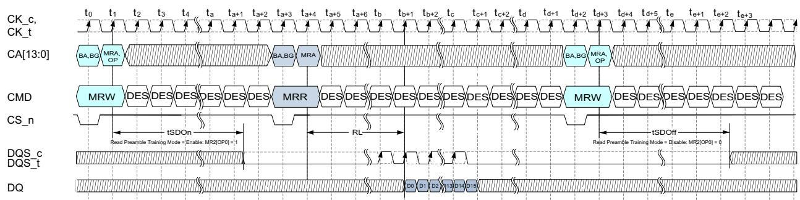  
Figure 81 — Timing Diagram for Read Preamble Training Mode Entry, Read Training Pattern Access and Read Preamble Training Mode Exit

Table 311 — Timing Parameters for Preamble Training Mode  

<table><tr><td>Parameter</td><td>Symbol</td><td>Min</td><td>Max</td></tr><tr><td>Delay from MRW Command to DQS Driven</td><td>tSDOn</td><td>-</td><td>Max(12nCK, 20ns)</td></tr><tr><td>Delay from MRW Command to DQS Disabled</td><td>tSDOff</td><td>-</td><td>Max(12nCK, 20ns)</td></tr></table>

# 4.19 CA Training Mode (CATM)

# 4.19.1 Introduction

The CA Training Mode is a method to facilitate the loopback of a logical combination of the sampled CA[13:0] signals. In this mode, the CK is running, and the CS_n qualifies when the CK samples the CA signals. A loopback equation that includes all the CA signals results in an output value that is sent asynchronously on the DQ signals back to the host memory controller. The host timings between CS_n, CK, and CA[13:0] signals can then be optimized for proper alignment. When the DRAM is in this mode, no functional commands are executed in the DRAM. The functional command interface is restored only after exiting this mode, which requires a CS_n assertion of two or more consecutive tCK. Prior to entering the CA Training Mode, the CS_n signal must be aligned to the CK to meet the CS_n to CK timing specifications. This assumes that CS Training has been completed to determine the correct CS_n timings on the host.

# 4.19.2 Entry and Exit for CA Training Mode

The CA Training Mode is enabled through an MPC command, with the opcode designated for CA Training Mode Entry. Once this MPC command has executed no other commands will be interpreted by the DRAM. Only the sampling of the CA signals, evaluation of the XOR result, and loop back to the DQ's will occur. While in CA Training Mode, the CS_n signal will only assert for a single tCK at a time. The maximum sampling rate on the CA signals will be every 4tCK.

The CA Training Mode is disabled by asserting CS_n for 2 or more cycles in a row, while sending a NOP command on the CA bus.

# 4.19.3 CA Training Mode (CATM) Operation

In CA Training Mode, the CA values are sampled in the same way as for functional operation, where the CS_n qualifies which cycle the sampling occurs in, and the sample is captured by the rising CK edge. Unlike functional operation, there is no concept of multiple cycle commands in CA Training Mode. Sampling of the CA signals ONLY occurs when CS_n is asserted. Once the CA signals are sampled, the values are XOR'd to produce an output value. This output value is driven on all the DQ pins, as a pseudostatic value. These output values will be held until the next sample is captured on the CA bus, according to the CS_n assertion.

During CA Training Mode the CA ODT is enabled as for functional operation. The VrefCA is Group According to the functional setting. The timing requirements for the CA bus, CK_t, CK_c, and CS_n are the same as for functional operation.

The delay from when the CA signals are sampled during the CS_n assertion and when the output of the XOR computation is driven on the DQ pins is specified as  $t_{\text{CATM_Valid}}$ , as shown in the Figure 82. CS_n shall be asserted every 4tCK or with greater than 4tCK separation between assertions, and thus the CA XOR output shall transition every 4tCK or greater. Figure 82 demonstrates an example where two CS_n assertions occur with a separation of 4tCK. The DRAM will exit CA Training Mode when the CS_n is asserted for 2 or more consecutive cycles but limited to 8 cycles.

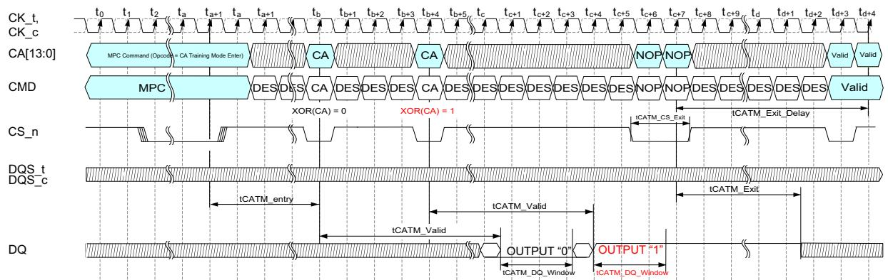  
Figure 82 — Timing Diagram for CA Training Mode

Table 312 — AC Parameters for CA Training Mode  

<table><tr><td>Symbol</td><td>Description</td><td>Min</td><td>Max</td><td>Unit</td><td>Note</td></tr><tr><td>tCATM_Entry</td><td>Registration of CATM entry command to start of training samples time</td><td>20</td><td>-</td><td>ns</td><td></td></tr><tr><td>tCATM_Exit</td><td>Registration of CATM exit CS_n assertion to end of training mode. This is when DQ is no longer driven by the DRAM</td><td>-</td><td>14</td><td>ns</td><td></td></tr><tr><td>tCATM_Exit_Delay</td><td>Registration of CATM exit to next valid command delay</td><td>20</td><td>-</td><td>ns</td><td></td></tr><tr><td>tCATM_Valid</td><td>Time from sample evaluation to output on DQ bus</td><td>-</td><td>20</td><td>ns</td><td></td></tr><tr><td>tCATM_DQ Window</td><td>Time output is available on DQ Bus</td><td>2</td><td>-</td><td>nCK</td><td>1</td></tr><tr><td>tCATM_CS_Exit</td><td>CS_n assertion duration to exit CATM</td><td>2</td><td>8</td><td>nCK</td><td></td></tr><tr><td colspan="6">NOTE 1 This timing parameter is applied to each DQ independently, not all-DQs valid window perspective.</td></tr></table>

# 4.19.3.1 CA Loopback Equations

The CATM Output is computed based on the CS_n assertion and the values of the CA inputs. Table 313 clarifies the output computation.

Table 313 — CA Training Mode Output  

<table><tr><td>CS_n</td><td>CATM Output</td></tr><tr><td>0</td><td>XOR(CA[13:0])^1</td></tr><tr><td>1</td><td>Hold previous value</td></tr><tr><td colspan="2">NOTE 1 The XOR function occurs after mirroring/inversion recovery, and only includes signals supported on the DRAM, i.e., may not include CA[13], depending on density (including stacking). If CA[13] is not needed for the DRAM&#x27;s density, the logical value shall be considered 0 for the XOR computation, though as indicated in Table 3, the ball location associated with CA13&#x27;s logical input (which switches with CA12) shall be connected to VDDQ.</td></tr></table>

# 4.19.3.2 Output equations

Table 314 shows which signals will transmit the output of the CA Training Mode loopback equation. These values are driven asynchronously as pseudo-static values, updating with a new output at a time  $t_{\text{CATM_Valid}}$  after each CS_n assertion.

Table 314 — Output Equations per Interface Width  

<table><tr><td>Output</td><td>X16</td><td>X8</td><td>X4</td></tr><tr><td>DQ0</td><td>CATM Output</td><td>CATM Output</td><td>CATM Output</td></tr><tr><td>DQ1</td><td>CATM Output</td><td>CATM Output</td><td>CATM Output</td></tr><tr><td>DQ2</td><td>CATM Output</td><td>CATM Output</td><td>CATM Output</td></tr><tr><td>DQ3</td><td>CATM Output</td><td>CATM Output</td><td>CATM Output</td></tr><tr><td>DQ4</td><td>CATM Output</td><td>CATM Output</td><td></td></tr><tr><td>DQ5</td><td>CATM Output</td><td>CATM Output</td><td></td></tr><tr><td>DQ6</td><td>CATM Output</td><td>CATM Output</td><td></td></tr><tr><td>DQ7</td><td>CATM Output</td><td>CATM Output</td><td></td></tr><tr><td>DML</td><td></td><td></td><td></td></tr><tr><td>TDQS_c</td><td></td><td></td><td></td></tr><tr><td>DQSL_t</td><td></td><td></td><td></td></tr><tr><td>DQSL_c</td><td></td><td></td><td></td></tr><tr><td>DQ8</td><td>CATM Output</td><td></td><td></td></tr><tr><td>DQ9</td><td>CATM Output</td><td></td><td></td></tr><tr><td>DQ10</td><td>CATM Output</td><td></td><td></td></tr><tr><td>DQ11</td><td>CATM Output</td><td></td><td></td></tr><tr><td>DQ12</td><td>CATM Output</td><td></td><td></td></tr><tr><td>DQ13</td><td>CATM Output</td><td></td><td></td></tr><tr><td>DQ14</td><td>CATM Output</td><td></td><td></td></tr><tr><td>DQ15</td><td>CATM Output</td><td></td><td></td></tr><tr><td>DMU</td><td></td><td></td><td></td></tr><tr><td>DQSU_t</td><td></td><td></td><td></td></tr><tr><td>DQSU_c</td><td></td><td></td><td></td></tr></table>

# 4.20 CS Training Mode (CSTM)

# 4.20.1 Introduction

The CS Training Mode is a method to facilitate the loopback of a sampled sequence of the CS_n signal. In this mode, the CK is running, and the CA signals are held in a NOP command encoding state. Once this mode is enabled and the DRAM devices are selected to actively sample and drive feedback, The DRAM will sample the CS_n signal on the rising edge of CK. Every set of four CK rising edge samples will be included in a logical computation to determine the CSTM Output result that is sent back to the host on the DQ bus. Once sampling begins, the DRAM must maintain the consecutive grouping of the samples every 4 tCK. When the CS_n Sample[0] and Sample[2] results in a logic 0 and the CS_n Sample[1] and Sample[3] results in a logic 1, the DRAM will drive a 0 on all the DQ signals. There is no requirement to drive any strobes, and the output signal could transition as often as every 4 tCK.

# 4.20.2 Entry and Exit for CS Training Mode

The CS Training Mode is enabled when the host sends an MPC command with the opcode for CS Training Mode Entry. Since CS Training must occur prior to establishing alignment between CK and CS_n signals, the MPC command extends beyond multiple tCK cycles, during which the CS_n signal is asserted. When the DRAM is in this mode, commands are still actively processed. The only commands that should be sent by the host memory controller while CS Training Mode is enabled are the NOP command and the MPC to exit CS Training Mode. Any other command may produce unreliable results. Once the DRAM has CS Training Mode enabled, the DRAM begins sampling on every rising CK edge, with the 4-sample groups looping consecutively. Depending on the value of the samples, the DQ signals are driven high or low. Prior to entering CS Training Mode, the DQ signals are not driven by the DRAM and are terminated according to the default RTT_PARK setting. After CS Training Mode is enabled, the DQ signal will begin driving the output values based on the CS Training Mode samples. Once the DQ signals are driven by the DRAM, RTT_PARK termination will no longer be applied, similar to a READ operation.

To exit CS Training Mode, an MPC command must be sent to disable CS Training Mode. Since the timing relationship between CS_n and CK is understood when exiting CS Training Mode, the host can send either a multi-cycle CS_n assertion during the MPC command or a single tCK assertion.

# 4.20.3 CS Training Mode (CSTM) Operation

In CS Training Mode, the CS_n values are sampled on all CK rising edges. Each group of 4 consecutive samples is evaluated in pairs, and then the two pairs are combined with a logical OR prior to sending to the DQ output. The samples evaluation to determine the output is shown in Tables 315 through 317:

Table 315 - Sample Evaluation for Intermediate Output[0]  

<table><tr><td>Output[0]</td><td>CS_n Sample[0]</td><td>CS_n Sample[1]</td></tr><tr><td>1</td><td>0</td><td>0</td></tr><tr><td>0</td><td>0</td><td>1</td></tr><tr><td>1</td><td>1</td><td>0</td></tr><tr><td>1</td><td>1</td><td>1</td></tr></table>

Table 316 — Sample Evaluation for Intermediate Output[1]  

<table><tr><td>Output[1]</td><td>CS_n Sample[2]</td><td>CS_n Sample[3]</td></tr><tr><td>1</td><td>0</td><td>0</td></tr><tr><td>0</td><td>0</td><td>1</td></tr><tr><td>1</td><td>1</td><td>0</td></tr><tr><td>1</td><td>1</td><td>1</td></tr></table>

# 4.20.3 CS Training Mode (CSTM) Operation (Cont'd)

Table 317 - Sample Evaluation for Final CSTM Output  

<table><tr><td>CSTM Output</td><td>Output[0]</td><td>Output[1]</td></tr><tr><td>0</td><td>0</td><td>0</td></tr><tr><td>1</td><td>0</td><td>1</td></tr><tr><td>1</td><td>1</td><td>0</td></tr><tr><td>1</td><td>1</td><td>1</td></tr><tr><td colspan="3">NOTE When there is no change on the LSTM Output from previous evaluation, DQ shall continue to drive same value continuously with no switching on the bus.</td></tr></table>

During CS Training Mode the CA ODT is enabled as for functional operation. The VrefCA is Group According to the functional setting (through the VrefCA Command).

The delay from when the CS_n signals are sampled during the fourth CK rising edge (Sample[3]) to when the output of the sample evaluation is driven to a stable value on the DQ pins is specified as tCSTM_Valid, as shown in Figure 83. The details of the tCSTM_entry, tCSTM_exit, and tCSTM_DQ Window are also illustrated.

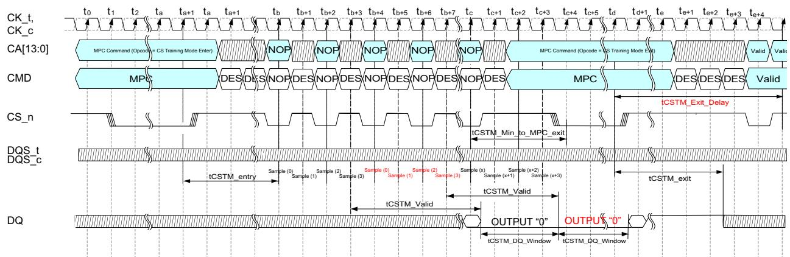  
Figure 83 — Timing Diagram for CS Training Mode with Consecutive Output Samples = 0

Figure 84 illustrates an example where the DQ Output switches from a logic 0 to a logic 1 value, demonstrating the minimum tCSTM_DQ Window:

Figure 84 — Timing Diagram for CS Training Mode with Output Sample Toggle  
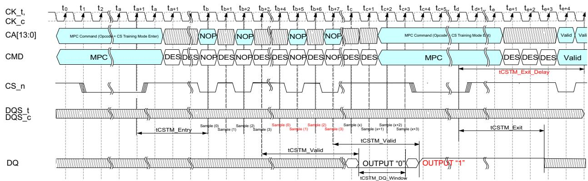  
NOTE See Section 4.15 for details on Setup, Hold and command register time.

# 4.20.3 CS Training Mode (CSTM) Operation (Cont'd)

When host trains CS_n timing for DDR5 by using CSTM, CS_n sampling timing for each DRAM could be different from each other because the variation of internal timing is different for each DRAM. Therefore, even though the CS setup/hold time is appropriate for each DRAM, 4-tCK CS_n sampling window which may have different starting points could appear differently as shown in Figure 85.

Host should train CS_n timing based on asserting every edge of CS_n to cover multiple DRAMs without exiting CSTM.

Figure 85 — Timing Diagram for CS Training Mode with Multiple DRAMs Output Sample Toggle  
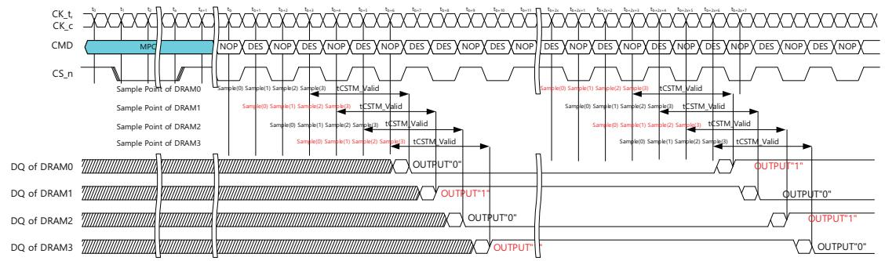  
NOTE See Section 4.15 for details on Setup, Hold and command register time.

Table 318 — AC Parameters for CS Training Mode  

<table><tr><td>Symbol</td><td>Description</td><td>Min</td><td>Max</td><td>Unit</td><td>Note</td></tr><tr><td>tCSTM_Entry</td><td>Registration of LSTM entry command to start of training samples time</td><td>20</td><td>-</td><td>ns</td><td></td></tr><tr><td>tCSTM_Min_to_MPC_exit</td><td>Min time between last CS_n pulse and first pulse of MPC Command to exit LSTM</td><td>4</td><td>-</td><td>nCK</td><td></td></tr><tr><td>tCSTM_Exit</td><td>Registration of LSTM exit command to end of training mode</td><td>-</td><td>20</td><td>ns</td><td></td></tr><tr><td>tCSTM_Valid</td><td>Time from sample evaluation to output on DQ bus</td><td>-</td><td>20</td><td>ns</td><td></td></tr><tr><td>tCSTM_DQ Window</td><td>Time output is available on DQ Bus</td><td>2</td><td>-</td><td>nCK</td><td>1</td></tr><tr><td>tCSTM_Exit_Delay</td><td>Registration of CATM exit to next valid command delay</td><td>20</td><td>-</td><td>ns</td><td></td></tr><tr><td colspan="6">NOTE 1 This timing parameter is applied to each DQ independently, not all-DQs valid window perspective.</td></tr></table>

# 4.20.3.1 Output signals

Table 319 shows which signals will transmit the output of the CS Training Mode loopback sample evaluation. These values are driven asynchronously, but may switch as often as every 4tCK.

Table 319 — CS Sampled Output per Interface Width  

<table><tr><td>Output</td><td>X16</td><td>X8</td><td>X4</td></tr><tr><td>DQ0</td><td>CSTM Output</td><td>CSTM Output</td><td>CSTM Output</td></tr><tr><td>DQ1</td><td>CSTM Output</td><td>CSTM Output</td><td>CSTM Output</td></tr><tr><td>DQ2</td><td>CSTM Output</td><td>CSTM Output</td><td>CSTM Output</td></tr><tr><td>DQ3</td><td>CSTM Output</td><td>CSTM Output</td><td>CSTM Output</td></tr><tr><td>DQ4</td><td>CSTM Output</td><td>CSTM Output</td><td></td></tr><tr><td>DQ5</td><td>CSTM Output</td><td>CSTM Output</td><td></td></tr><tr><td>DQ6</td><td>CSTM Output</td><td>CSTM Output</td><td></td></tr><tr><td>DQ7</td><td>CSTM Output</td><td>CSTM Output</td><td></td></tr><tr><td>DML</td><td></td><td></td><td></td></tr><tr><td>TDQS_c</td><td></td><td></td><td></td></tr><tr><td>DQSL_t</td><td></td><td></td><td></td></tr><tr><td>DQSL_c</td><td></td><td></td><td></td></tr><tr><td>DQ8</td><td>CSTM Output</td><td></td><td></td></tr><tr><td>DQ9</td><td>CSTM Output</td><td></td><td></td></tr><tr><td>DQ10</td><td>CSTM Output</td><td></td><td></td></tr><tr><td>DQ11</td><td>CSTM Output</td><td></td><td></td></tr><tr><td>DQ12</td><td>CSTM Output</td><td></td><td></td></tr><tr><td>DQ13</td><td>CSTM Output</td><td></td><td></td></tr><tr><td>DQ14</td><td>CSTM Output</td><td></td><td></td></tr><tr><td>DQ15</td><td>CSTM Output</td><td></td><td></td></tr><tr><td>DMU</td><td></td><td></td><td></td></tr><tr><td>DQSU_t</td><td></td><td></td><td></td></tr><tr><td>DQSU_c</td><td></td><td></td><td></td></tr></table>

# 4.21 Write Leveling Training Mode

# 4.21.1 Introduction

The DDR5 memory module adopted fly-by topology for the commands, addresses, control signals, and clocks. The fly-by topology has benefits from reducing number of stubs and their length, but it also causes flight time skew between clock and strobe at every DRAM on the DIMM. This makes it difficult for the memory controller to set the timings of the WRITE DQS_t - DQS_c signaling according to the Write Latency timing specification at the DRAM. Therefore, the DDR5 SDRAM supports a 'write leveling' feature to allow the controller to compensate for channel skew. The DDR5 Write Leveling Training also allows for an unmatched path between CK and DQS within the DRAM, and thus supports an internal Write Leveling Training flow to account for the difference in internal delays.

The DDR5 DRAM also provides a programmable timing in its write logic, controlled by the Write Leveling Internal Cycle Alignment mode register, which provides a means for improved performance of the device's receiver. The proper setting of this register shall be determined by the memory controller, either as described in the following sections, or by some other means. This delay setting is specific to each DRAM, its Write Preamble setting, and the operating frequency being used. Once the proper setting has been determined for a given DRAM, Write preamble setting, and operating frequency, that setting may be subsequently restored to the DRAM after reset, power-cycle, or return to a previously used operating frequency.

The memory controller can use the 'write leveling' feature and feedback from the DDR5 DRAM to adjust the DQS_t - DQS_c to align to the phase and cycle that corresponds to the Write Latency delay after the WRITE command. The memory controller involved in the leveling must have adjustable delay setting on DQS_t - DQS_c to align the rising edge of DQS_t - DQS_c with the timing at the receiver that is the pin-level Write Latency (external Write Leveling Training) or the internal DRAM Write Latency (internal Write Leveling Training) timing point. The internal DRAM Write Latency timing point may be skewed from the pin-level Write Latency timing point. The host will minimize this skew (tDQSoffset) through the Write Leveling Training flow.

Since the system and DIMM delays vary, the DRAM will support the ability for the host to align the DQS_t-DQS_c timings with a pin-level Write Latency CK_t-CK_c edge. This alignment is referred to as External Write Leveling. Once the DQS_t-DQS_c host timings are aligned at the DRAM Write Latency timing, the internal DRAM timings are optimized for lowest power and internal delay. This is accomplished when the host enables the Internal Write Timing setting. In order to compensate for the difference in delay, the host will execute an internal Write Leveling Training sequence, which includes sweeping the Write Leveling Internal Cycle Alignment and then finalizing the DQS_t-DQS_c phase and offset. During Write Leveling Training (both External and Internal), the DQS_t-DQS_c pattern should include the full preamble and only the first toggle of the normal data burst sequence.

While in Write Leveling Training Mode (both External and Internal), the DRAM will sample the Internal Write Leveling Pulse with the last rising DQS_t - DQS_c edge sent by the host and feed back the result of this sample on the DQ bus.

While in Write Leveling Mode (both External and Internal), the DRAM asynchronously feeds back the internal Write Leveling pulse, sampled with the last rising edge of DQS_t - DQS_c (first rising edge after the preamble), through the DQ bus. Optionally, the DRAM could sample the Internal Write Leveling Pulse on every rising edge, but the host will only use the final rising edge sample feedback on the DQ bus. The internal Write Leveling pulse is generated in response to a WRITE command, and held statically low otherwise. The controller repeatedly delays DQS_t - DQS_c, sends a WRITE command, and monitors the DQ feedback until a transition from 0 to 1 is detected.

# 4.21.1 Introduction (Cont'd)

During Internal Write Leveling Training flows, the host will apply an offset to the starting point or the final setting of the DQS_t - DQS_c signals. The offsets are referred to as WL_ADJ_start and WL_ADJ_end. This will minimize the tDQOffset variation across different DRAM devices. The WL_ADJ_start and WL_ADJ_end values depend on the tWPRE setting.

When External and Internal Write Leveling Training flows are complete and the final WL_ADJ_end offset has been applied to the DQS_t - DQS_c timings, the DQS_t - DQS_c is phase aligned and cycle aligned for write operations. During the training sequence the DRAM in Write Leveling training mode will apply ODT to the strobes in the same way as for functional operation. All non-target ranks (which will not be in Write Leveling Training Mode) will apply ODT as defined for functional operation. Prior to executing the DDR5 Write Leveling Training Flow, the DRAM tWPRE value must be configured to the functional operation setting.

Note that DQS ODT is based on a DQS PARK Mode and is not enabled and disabled with DQ ODT timings.

# 4.21.2 Write Leveling Mode Registers

The MR fields for Write Leveling Training, Internal Write Timing, and Write Leveling Internal Cycle Alignment are listed Tables 320 and 321. To enter Write Leveling Training Mode, program MR2 OP[1] = 1, to exit the mode program MR2 OP[1] = 0. Write Leveling Internal cycle alignment offers two nibbles to control the upper and lower bytes. The lower byte WL internal Cycle alignment is intended for x4, x8 and x16 configurations while the upper byte is only for x16 configurations. The Internal Write Timing, once enabled, shall remain enabled through the Internal Write Leveling Training flow and for functional operation. The host is responsible for incrementing the Write Leveling Internal Cycle Alignment setting until the Internal Write Leveling Pulse is pulled early enough to align with the DQS_t - DQS_c signals that were previously aligned with the pin-level Write Latency timing. The Write Leveling Internal Cycle Alignment setting only applies when the Internal Write Timing is Enabled.

Table 320 — MR2 Register – for Reference Only  
See Section 3.5.4 for details  

<table><tr><td>OP[7]</td><td>OP[6]</td><td>OP[5]</td><td>OP[4]</td><td>OP[3]</td><td>OP[2]</td><td>OP[1]</td><td>OP[0]</td></tr><tr><td>Internal Write Timing</td><td>RFU</td><td>Device 15 MPSM</td><td>CS Assertion Duration (MPC)</td><td>Max Power Saving Mode (MPSM)</td><td>2N Mode</td><td>Write Leveling Training</td><td>Read Preamble Training</td></tr></table>

Table 321 — MR3 Register – for Reference Only  
See Section 3.5.5 for details  

<table><tr><td>OP[7]</td><td>OP[6]</td><td>OP[5]</td><td>OP[4]</td><td>OP[3]</td><td>OP[2]</td><td>OP[1]</td><td>OP[0]</td></tr><tr><td colspan="4">Write Leveling
Internal Cycle
Alignment - Upper Byte</td><td colspan="4">Write Leveling
Internal Cycle
Alignment - Lower Byte</td></tr></table>

# 4.21.3 External Write Leveling Training Operation

When Write Leveling Mode is enabled and the Internal Write Timings is disabled, the DRAM will have an Internal Write Leveling pulse that indicates how the DQS_t - DQS_c signals shall be aligned to match the pin-level Write Latency timings. The rising edge of the Internal Write Leveling Pulse will align to the rising edge of the CK signal that coincides with Write Latency.

DQS_t - DQS_c driven by the controller during leveling mode must be terminated by the DRAM based on ranks populated. Similarly, the DQ bus driven by the DRAM must also be terminated at the controller.

All data bits shall carry the leveling feedback to the controller across the DRAM configurations X4, X8, and X16. On a X16 device, both byte lanes shall be leveled independently. Therefore, a separate feedback mechanism shall be available for each byte lane. The upper data bits should provide the feedback of the upper diff_DQS(diff_UDQS) to internal Write Leveling pulse relationship whereas the lower data bits would indicate the lower diff_DQS(diff_LDQS) to internal Write Leveling pulse relationship.

Figure 86 shows the timing sequence to enter Write Leveling Training Mode, operation during Write Leveling Training Mode (with Internal Write Timings disabled), and the timing sequence to exit Write Leveling Training mode. An MRW command is sent to enable Write Leveling Training Mode. Prior to sending the MRW command to enable Write Leveling Training Mode, the host memory controller must drive the DQS_t - DQS_c signals differentially low. After tWLPEN time, the controller can send a WRITE command, followed by strobe pulses. The DQS_t - DQS_c signals will always drive differentially low, except during the preamble toggle or the first toggle of the write burst strobe sequence for the WRITE. There is no restriction as to how early the strobe pulses are sent, so long as they are after the WRITE command. The DRAM asynchronously feeds back the internal Write Leveling pulse, sampled with the last rising edge of DQS_t - DQS_c (first rising edge after the preamble), through the DQ bus within tWLO after the sample. Optionally, the DRAM could sample the Internal Write Leveling Pulse on every rising edge, but the host will only use the final rising edge sample feedback on the DQ bus.

While in Write Leveling Training mode, the host controller may send ACT and PRE commands. The DRAM will ignore these commands. The address associated with the ACT and the WRITE commands may be any value. The following timing diagrams demonstrate the timing requirements associated with Write Leveling Training Mode Entry, the Internal Write Leveling Pulse alignment during External Write Leveling Training, and the DQ sample feedback timing.

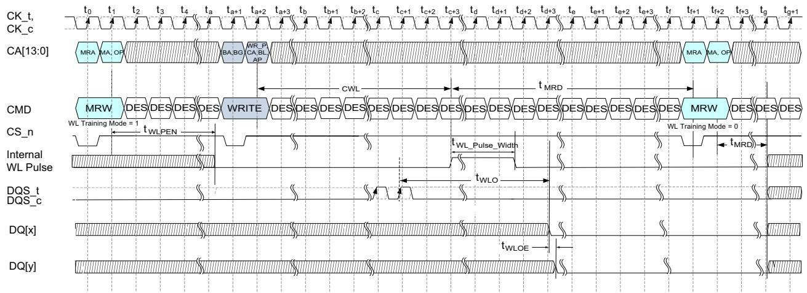  
Figure 86 — Timing Diagram for Write Leveling Training Mode (External Training, 0 Sample)

# 4.21.3 External Write Leveling Training Operation (Cont'd)

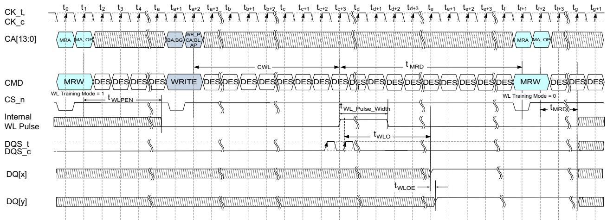  
Figure 87 — Timing Diagram for Write Leveling Training Mode (External Training, 1 Sample)

The Memory controller initiates Write Leveling mode of all DRAMs in a rank by setting MR2:OP[1] = 1. When entering write leveling mode, the DQ pins are in undefined driving mode. Since the controller levels one rank at a time, all non-target ranks will set Write Leveling Mode to disabled. The Controller may assert non-target ODT through the normal WRITE command protocol. The RTT PARK termination will also only apply to the DQS_t and DQS_c signals.

The Controller shall drive DQS_t low and DQS_c high prior to sending the MRW command to enable Write Leveling Training Mode. The WRITE command must occur after a delay of tWLPEN relative to when the MRW enabled Write Leveling Training Mode.

DRAM samples the internal Write Leveling pulse with rising edge of DQS_t - DQS_c and provides feedback on all the DQ bits asynchronously after tWLO timing. There is a DQ output uncertainty of tWLOE defined to allow mismatch on DQ bits. The tWLOE period is defined from the transition of the earliest DQ bit to the corresponding transition of the latest DQ bit. There are no read strobes (DQS_t/DQS_c) needed for these DQs. Controller samples incoming DQ and decides to increment or decrement DQS_t - DQS_c delay setting and launches the next WRITE command with associated DQS_t/DQS_c pulse (or pulse sequence) after some time, which is controller dependent. Once a 0 to 1 transition is detected, the controller locks DQS_t - DQS_c delay setting and external write leveling is achieved for the device.

# 4.21.4 Write Leveling Internal Cycle Alignment Operation

After the external Write Leveling Training step is completed, and the host DQS_t - DQS_c signals have been aligned to the pin-level Write Latency timing, the host will apply a negative offset (WL_ADJ_start) to the DQS_t - DQS_c timing. The WL_ADJ_start offset is dependent on the tWPRE setting. This will be a reference point for the internal Write Leveling Pulse to align to through the use of the Internal Cycle Alignment setting. After the Internal Cycle Alignment setting has been adjusted to determine the sample of the high part of the Internal Write Leveling Pulse, the host will do a fine sweep of the DQS_t - DQS_c timings to determine the location of the rising edge of the Internal Write Leveling Pulse. Once this edge has been aligned, the host will then apply the final WL_ADJ_end setting, which is also dependent on tWPRE. This will result in a tDQSoffset offset that is between -0.5tCK and +0.5tCK.

# 4.21.4 Write Leveling Internal Cycle Alignment Operation (Cont'd)

Table 322 summarizes the WL_ADJ_start and WL_ADJ_end values per tWPRE setting.

Table 322 — WL_ADJ_start and WL_ADJ_end Values per tWPRE Setting  

<table><tr><td>WL_ADJ term</td><td>Description</td><td>tWPRE = 2 tCK</td><td>tWPRE = 3 tCK</td><td>tWPRE = 4 tCK1</td></tr><tr><td>WL_ADJ_start</td><td>Offset that the host applies to the DQS_t/DQS_c timing just after external Write Leveling alignment to Write Latency and prior the internal cycle alignment training.</td><td>-0.75 tCK</td><td>-1.25 tCK</td><td>-2.25 tCK</td></tr><tr><td>WL_ADJ_end</td><td>Offset that the host applies to the DQS_t/DQS_c timing after final phase alignment to the rising edge of the Write Leveling Internal Pulse. This will center the Write Leveling Internal Pulse rising edge within the preamble window.</td><td>1.25 tCK</td><td>1.75 tCK</td><td>2.75 tCK</td></tr><tr><td colspan="5">NOTE 1 For tWPRE = 4 tCK, CL is required to be ≥ 30 during Write Leveling Training Mode operation. This is irrespective of the CL setting for tWPRE = 4 tCK during normal operation.</td></tr></table>

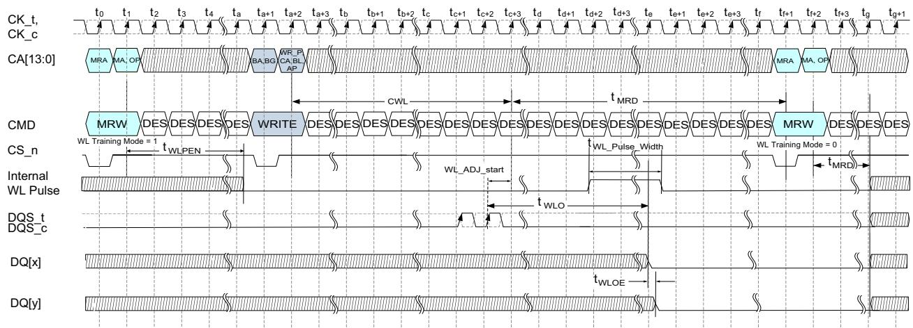  
Figure 88 demonstrates Write Leveling Training operation when Internal Write Timings are enabled and the Internal Cycle Alignment is set such that the Internal Write Leveling Pulse has not yet reached the host DQS_t - DQS_c toggles.  
Figure 88 — Timing Diagram for Write Leveling Training Mode (Internal Cycle Alignment, 0 Sample)  
Figure 89 demonstrates Write Leveling Training operation when Internal Write Timings are enabled and the Internal Cycle Alignment is set such that the Internal Write Leveling Pulse has completed the coarse alignment to the host DQS_t - DQS_c timing.

# 4.21.4 Write Leveling Internal Cycle Alignment Operation (Cont'd)

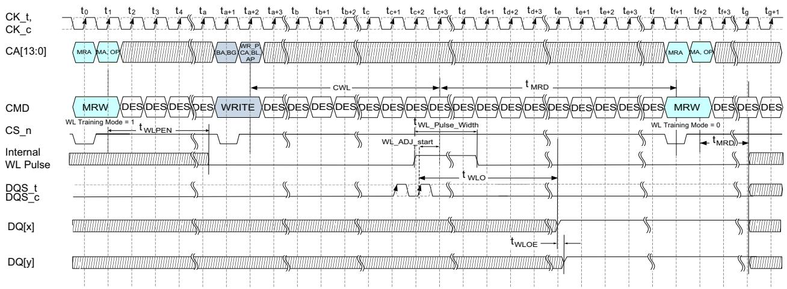  
Figure 89 — Timing Diagram for Write Leveling Training Mode (Internal Cycle Alignment, 1 Sample)

4.21.5 Write Leveling Internal Phase Alignment and Final Host DQS Timing Operation Once the Internal Cycle Alignment has been set such that the Internal Write Leveling Pulse overlaps the DQS_t - DQS_c rising edge that is associated with the first strobe edge for the WRITE burst (after the preamble), the host shall perform a final fine sweep of the DQS_t - DQS_c timings to determine phase alignment to the rising edge of the internal Write Leveling Pulse. Once this is determined, the host will then add a positive offset of WL_ADJ_end to the DQS_t - DQS_c timings. This will place the rising edge of the Internal Write Leveling Pulse within the preamble. The placement within the preamble is centered within the first tWPRE - 0.5tCK of the preamble. After the WL_ADJ_end offset has been applied, the host will disable Write Leveling Training Mode. The Internal Write Timing will remain enabled and the Internal Cycle Alignment setting will retain the coarse setting that was trained. After every reset, the host must either restore these settings or execute the full Write Leveling Training flow.

Figure 90 shows the timing relationships for the final placement of the host DQS_t - DQS_c timings relative to the Internal Write Leveling Pulse. However, it is not necessary to execute this Write Leveling Training Mode Measurement to finalize the setting—Figure 90 is only for illustration.

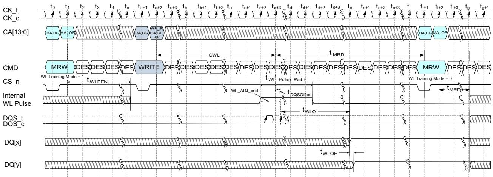  
Figure 90 — Timing Diagram for Final Timings after Write Leveling Training is Complete

# 4.21.5 Write Leveling Internal Phase Alignment and Final Host DQS Timing Operation (Cont'd)

Table 323 summarizes the timing parameter ranges associated with Write Leveling Training Mode:

Table 323 — Timing Parameter Ranges Associated with Write Leveling Training Mode  

<table><tr><td>Parameter</td><td>Symbol</td><td>Min</td><td>Max</td><td>Units</td><td>NOTE</td></tr><tr><td>Write Leveling Pulse Enable - Time from Write Leveling Training Enable MRW to when Internal Write Leveling Pulse logic level is valid</td><td>tWLPEN</td><td>0</td><td>15</td><td>ns</td><td></td></tr><tr><td>Write leveling output</td><td>tWLO</td><td>0</td><td>9.5</td><td>ns</td><td></td></tr><tr><td>Write leveling output error</td><td>tWLOE</td><td>0</td><td>2</td><td>ns</td><td></td></tr><tr><td>Final Trained value of host DQS_t - DQS_c timing relative to Write Latency CK_t - CK_c edge</td><td>tDQSoffset</td><td>-0.5</td><td>0.5</td><td>tCK</td><td>1</td></tr><tr><td>Width of the Write Leveling Internal Pulse</td><td>tWL_Pulse Width</td><td>2</td><td>-</td><td>tCK</td><td>2</td></tr><tr><td colspan="6">NOTE 1 This result is dependent on using the specified WL_ADJ_start and WL_ADJ_end values as specified per tWPRE setting. 
NOTE 2 There is no Max limit for the tWL_Pulse Width, but the Write Leveling Internal Pulse must begin at zero for each WRITE command.</td></tr></table>

# 4.21.6 DRAM Termination During Write Leveling

When the DRAM is in Write Leveling Mode, the DQS_c/DQS_t termination (DQS_RTT_PARK) and the Command and Control termination (RTT_CA, RTT_CK, RTT_CS) will be the same as for functional operation. The DQ signals will not be terminated in the DRAM, but instead will be driving values to the controller. The host controller will apply termination for the DQ signals.

Table 324 — DRAM Termination During Write Leveling  

<table><tr><td>ODT Enabled</td><td>DQS_t/DQS_c Termination</td><td>DQ Termination</td></tr><tr><td>RTT_WR</td><td>DQS_RTT_PARK</td><td>Off</td></tr><tr><td>RTT_PARK, RTT_WR disabled</td><td>DQS_RTT_PARK</td><td>Off</td></tr><tr><td colspan="3">NOTE Termination for TDQS/DM is not included since TDQS and DM are disabled during Write Leveling Training Mode.</td></tr></table>

# 4.22 Connectivity Test (CT) Mode

# 4.22.1 Introduction

The DDR5 memory device supports a connectivity test (CT) mode, which is designed to greatly speed up testing of electrical continuity of pin interconnection on the PC boards between the DDR5 memory devices and the memory controller on the SoC. Designed to work seamlessly with any boundary scan devices, the CT mode is required for all DRAM devices independent of density and interface width. This applies to x4, x8, and x16 interface widths. Contrary to other conventional shift register based test modes, where test patterns are shifted in and out of the memory devices serially in each clock, DDR5's CT mode allows test patterns to be entered in parallel into the test input pins and the test results extracted in parallel from the test output pins of the DDR5 memory device at the same time, significantly enhancing the speed of the connectivity check.

Prior to entering CT Mode, RESET_n is registered to High. The CT Mode is enabled by asserting the Test Enable (TEN) pin.

Once put in the CT mode by asserting the TEN pin, the DDR5 memory device effectively appears as an asynchronous device to the external controlling agent; after the input test pattern is applied, the connectivity test results are available for extraction in parallel at the test output pins after a fixed propagation delay. A reset of the DDR5 memory device is required after exiting the CT mode.

# 4.22.2 Pin Mapping

Only digital pins can be tested via the CT mode. For the purpose of connectivity check, all pins that are used for the digital logic in the DDR5 memory device are classified as one of the following types:

1 Test Enable (TEN) pin: when asserted high, this pin causes the DDR5 memory device to enter the CT mode. In this mode, the normal memory function inside the DDR5 memory device is bypassed and the IO pins appear as a set of test input and output pins to the external controlling agent. The TEN pin is dedicated to the connectivity check function and will not be used during normal memory operation.  
2 Chip Select (CS_n) pin: when asserted low, this pin enables the test output pins in the DDR5 memory device. When de-asserted, the output pins in the DDR5 memory device will be Hi-z. The CS_n pin in the DDR5 memory device serves as the CS_n pin when in CT mode.  
3 Test Input: a group of pins that are used during normal DDR5 DRAM operation are designated as test input pins. These pins are used to enter the test pattern in CT mode. Most Test Input pins are input pins during normal operation. The ALERT_n pin is the only output pin that will be used as a Test Input during CT mode. The CK_t and CK_c pins are single-ended Test Input pins during CT Mode.  
4 Test Output: a group of pins that are used during normal DDR5 DRAM operation are designated test output pins. These pins are used for extraction of the connectivity test results in CT mode.  
5 Reset: Fixed high level for RESET n is required during CT mode, same as normal function.

Table 325 shows the pin classification of the DDR5 memory device.

# 4.22.2 Pin Mapping (Cont'd)

Table 325 — Pin Classification of DDR5 Memory Device in Connectivity Test (CT) Mode  

<table><tr><td colspan="2">Pin Type in CT Mode</td><td>Pin Names during Normal Memory Operation</td></tr><tr><td colspan="2">Test Enable</td><td>TEN</td></tr><tr><td colspan="2">Chip Select</td><td>CS_n</td></tr><tr><td rowspan="3">Test Inputs</td><td>A</td><td>CA[13:0]</td></tr><tr><td>B</td><td>CK_t, CK_c</td></tr><tr><td>C</td><td>ALERT_n</td></tr><tr><td colspan="2">Test Outputs</td><td>DQL[7:0], DQU[7:0], DQSU_t, DQSU_c, DQSL_t, DQSL_c, DML_n, DMU_n, DM_n/TDQS_t, TDQS_c</td></tr><tr><td colspan="2">Reset</td><td>RESET_n</td></tr><tr><td colspan="3">NOTE 1 Test Outputs may contain the Upper and Lower label identification used with x16 devices. In the case of x4/x8 devices, the lower (L) identification may be removed. 
NOTE 2 CAI and MIR input level do not affect the “Test Outputs” values.</td></tr></table>

Table 326 — Signal Description  

<table><tr><td>Symbol</td><td>Type</td><td>Function</td></tr><tr><td>TEN</td><td>Input</td><td>Connectivity Test Mode is active when TEN is HIGH and inactive when TEN is LOW. TEN must be LOW during normal operation TEN is a CMOS rail-to-rail signal with DC high and low at 80% and 20% of VDDQ.</td></tr></table>

# 4.22.3 Logic Equations

# 4.22.3.1 Min Term Equations

MTx is an internal signal to be used to generate the signal to drive the output signals. See Table 327. These internal signals are the same across all interface widths and densities.

Table 327 — Min Term Equations  

<table><tr><td>Min Term</td><td>Intermediate Logic Nodes</td></tr><tr><td>MT0</td><td>XOR(CA[0,1,2,3,8,9,10,11])</td></tr><tr><td>MT1</td><td>XOR(CA[0,4,5,6,8,12,13], ALERT_n)</td></tr><tr><td>MT2</td><td>XOR(CA[1,4,9,12], CK_t, CK_c)</td></tr><tr><td>MT3</td><td>XOR(CA[2,5,7,10,13], CK_t)</td></tr><tr><td>MT4</td><td>XOR(CA[3,6,7,11], CK_c, ALERT_n)</td></tr><tr><td>MT0_B</td><td>!(MT0)</td></tr><tr><td>MT1_B</td><td>!(MT1)</td></tr><tr><td>MT2_B</td><td>!(MT2)</td></tr><tr><td>MT3_B</td><td>!(MT3)</td></tr><tr><td>MT4_B</td><td>!(MT4)</td></tr></table>

# 4.22.3.2 Output Equations

Table 328 — Output Equations per Interface Width  

<table><tr><td>Output</td><td>X16</td><td>X8</td><td>X4</td></tr><tr><td>DQL0</td><td>MT0</td><td>MT0</td><td>MT0</td></tr><tr><td>DQL1</td><td>MT1</td><td>MT1</td><td>MT1</td></tr><tr><td>DQL2</td><td>MT2</td><td>MT2</td><td>MT2</td></tr><tr><td>DQL3</td><td>MT3</td><td>MT3</td><td>MT3</td></tr><tr><td>DQL4</td><td>MT0_B</td><td>MT0_B</td><td></td></tr><tr><td>DQL5</td><td>MT1_B</td><td>MT1_B</td><td></td></tr><tr><td>DQL6</td><td>MT2_B</td><td>MT2_B</td><td></td></tr><tr><td>DQL7</td><td>MT3_B</td><td>MT3_B</td><td></td></tr><tr><td>DML</td><td>MT4</td><td>MT4</td><td></td></tr><tr><td>TDQS_c</td><td></td><td>MT4_B</td><td></td></tr><tr><td>DQSL_t</td><td>MT4</td><td>MT4</td><td>MT4</td></tr><tr><td>DQSL_c</td><td>MT4_B</td><td>MT4_B</td><td>MT4_B</td></tr><tr><td>DQU0</td><td>MT0</td><td></td><td></td></tr><tr><td>DQU1</td><td>MT1</td><td></td><td></td></tr><tr><td>DQU2</td><td>MT2</td><td></td><td></td></tr><tr><td>DQU3</td><td>MT3</td><td></td><td></td></tr><tr><td>DQU4</td><td>MT0_B</td><td></td><td></td></tr><tr><td>DQU5</td><td>MT1_B</td><td></td><td></td></tr><tr><td>DQU6</td><td>MT2_B</td><td></td><td></td></tr><tr><td>DQU7</td><td>MT3_B</td><td></td><td></td></tr><tr><td>DMU</td><td>MT4</td><td></td><td></td></tr><tr><td>DQSU_t</td><td>MT4</td><td></td><td></td></tr><tr><td>DQSU_c</td><td>MT4_B</td><td></td><td></td></tr><tr><td colspan="4">NOTE Test Outputs may contain the Upper and Lower label identification used with x16 devices. In the case of x4/x8 devices, the lower (L) identification may be removed.</td></tr></table>

# 4.23 ZQ Calibration Commands

# 4.23.1 ZQ Calibration Description

The MPC command is used to initiate ZQ Calibration, which calibrates the output driver impedance across process, temperature, and voltage. ZQ Calibration occurs in the background of device operation.

There are two ZQ Calibration modes initiated with the MPC command: ZQCal Start, and ZQCal Latch.

ZQCal Start initiates the SDRAM's calibration procedure, and ZQCal Latch captures the result and loads it into the SDRAM's drivers.

A ZQCal Start command may be issued anytime the DDR5-SDRAM is in a state in which it can receive valid commands. There are two timing parameters associated with ZQ Calibration. tZQCAL is the time from when the ZQCal Start MPC command is sent to when the host can send the ZQCal Latch MPC command. tZQLAT is the time from when the ZQCal Latch MPC command is sent by the host to when the CA bus (and subsequently the DQ bus) can be used for normal operation. A ZQCal Latch Command may be issued anytime outside of power-down after tZQCAL has expired and all DQ bus operations have completed. The CA Bus must maintain a Deselect state during tZQLAT to allow CA ODT calibration settings to be updated.

After a ZQCal Start and until tZQCAL finishes, neither another ZQCal Start nor a ZQCal Latch is allowed.

Table 329 — ZQ Calibration Timing Parameters  

<table><tr><td>Parameter</td><td>Symbol</td><td>Min/Max</td><td>Value</td><td>Unit</td></tr><tr><td>ZQ Calibration Time</td><td>tZQCAL</td><td>MIN</td><td>1</td><td>us</td></tr><tr><td>ZQ Calibration Latch Time</td><td>tZQLAT</td><td>MIN</td><td>max(30ns,8nCK)</td><td>ns</td></tr></table>

# 4.23.2 ZQ External Resistor, Tolerance, and Capacitive Loading

To use the ZQ calibration function, a 240 ohm +/- 1% tolerance external resistor must be connected between the ZQ pin and VSSQ.

If the system configuration has more than one rank, and if the ZQ pins of both ranks are attached to a single resistor, then the SDRAM controller must ensure that the ZQCs don't overlap.

The total capacitive loading on the ZQ pin must be limited to  $25\mathrm{pF}$

# 4.24 VrefCA Command

# 4.24.1 Introduction

The VrefCA setting must be set prior to training the CS_n and CA bus timings relative to CK. In order to accomplish this, DDR5-SDRAMs will support a single UI command specifically for setting the VrefCA setting. This avoids any timing and/or default VrefCA setting issues with sending a 2UI MRW command, by enabling the host to extend the setup and hold time for the CA signals. In addition, the VrefCA command will support multiple cycles of CS_n assertion. The multiple cycles of CS_n assertion ensures the DRAM will capture the VrefCA command during at least one rising CK_t/CK_c edge.

Table 330 — VrefCA/CS Command Definition  

<table><tr><td rowspan="2">Function</td><td rowspan="2">Abbreviation</td><td rowspan="2">CS</td><td colspan="14">CA Pins</td><td rowspan="2">NOTES</td></tr><tr><td>CA0</td><td>CA1</td><td>CA2</td><td>CA3</td><td>CA4</td><td>CA5</td><td>CA6</td><td>CA7</td><td>CA8</td><td>CA9</td><td>CA10</td><td>CA11</td><td>CA12</td><td>CA13</td></tr><tr><td>VrefCA Command</td><td>VrefCA</td><td>L</td><td>H</td><td>H</td><td>L</td><td>L</td><td>L</td><td>OP0</td><td>OP1</td><td>OP2</td><td>OP3</td><td>OP4</td><td>OP5</td><td>OP6</td><td>L</td><td>V/DDPI D</td><td>21,22,23</td></tr><tr><td>VrefCS Command</td><td>VrefCS</td><td>L</td><td>H</td><td>H</td><td>L</td><td>L</td><td>L</td><td>OP0</td><td>OP1</td><td>OP2</td><td>OP3</td><td>OP4</td><td>OP5</td><td>OP6</td><td>H</td><td>V/DDPI D</td><td>21,22,23</td></tr><tr><td colspan="18">NOTE 1 V/DDPID is a multi-mode pin where the DDPID is used for DDP packages only. 
NOTE 2 Any command using DDPID shall issue a NOP to non-selected device. 
NOTE 3 NT-ODT behavior is not influenced by DDPIP value</td></tr></table>

# 4.24.2 VrefCA Command Timing

Figure 91 illustrates a timing sequence example for the VrefCA command that occurs prior to CS and CA training. The command is sampled on every rising edge of CK_t/CK_c. The host must ensure that the CA signals are valid during the entire CS_n assertion time. The timing of the CS_n assertion may not satisfy the setup/hold requirements around all CK_t/CK_c transitions, but it will satisfy the setup/hold requirements relative to at least one CK_t/CK_c rising edge.

There is no separate mode that enables the multi-cycle CS_n assertion. This timing relationship can always be used by the host to send the VrefCA commands even after training has been completed for the interface. For the DRAM to latch the VrefCA command in cases where the alignment between CS_n, CA, and CK may be unknown, the CA inputs must reach the proper command state at least one cycle prior to CS_n transitioning from high to low, CS_n must remain low for tVrefCA_CS, and CA must remain in the proper command state for at least one cycle after CS_n transitions from low to high.

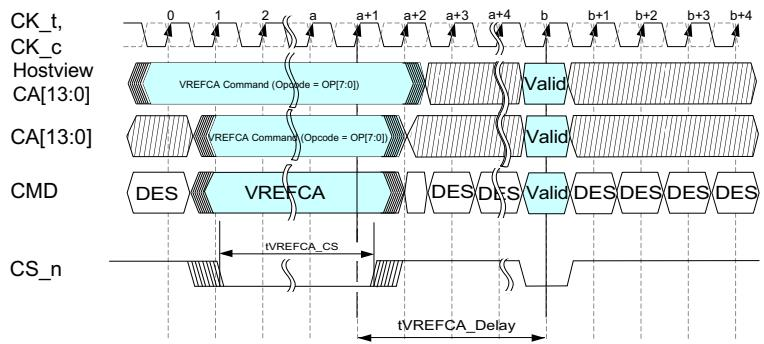  
Figure 91 — Timing Diagram for VrefCA Command

# 4.24.2 VrefCA Command Timing (Cont'd)

Table 331 — AC Parameters for VrefCA Command  

<table><tr><td>Symbol</td><td>Description</td><td>Min</td><td>Max</td><td>Unit</td><td>Note</td></tr><tr><td>tVrefCA_Delay</td><td>VrefCA command to any other valid command delay</td><td>tMRD</td><td>-</td><td>nCK</td><td></td></tr><tr><td>tVrefCA_CS</td><td>Time CS_n is held low to register VrefCA command</td><td>3.5</td><td>8</td><td>nCK</td><td>1,2</td></tr><tr><td colspan="6">NOTE 1 Multiple cycles are used to avoid possible metastability of CS_n. 
NOTE 2 At the end of CSTM, it is assumed that the host should be able to place the CS_n appropriately and the VrefCA command could be issued as a single cycle command</td></tr></table>

# 4.25 VrefCS Command

# 4.25.1 Introduction

The VrefCS setting should be set, if needed, prior to training the CS_n and CA bus timings relative to CK. In order to accomplish this, DDR5-SDRAMs will support a single UI command specifically for setting the VrefCS setting (similar to VrefCA). This avoids any timing and/or default VrefCS setting issues with sending a 2UI MRW command, by enabling the host to extend the setup and hold time for the CA signals. In addition, the VrefCS command will support multiple cycles of CS_n assertion. The multiple cycles of CS_n assertion ensures the DRAM will capture the VrefCS command during at least one rising CK_t/CK_c edge.

Note that the operation, functionality and timings for VrefCS are effectively the same as VrefCA with the exception of a different explicit command noted in Table 332 and the fact that it modifies the VREF of the chip select pin vs the CA pins.

Table 332 — VrefCA/CS Command Definition  

<table><tr><td rowspan="2">Function</td><td rowspan="2">Abbreviation</td><td rowspan="2">CS</td><td colspan="14">CA Pins</td><td rowspan="2">NOTES</td></tr><tr><td>CA0</td><td>CA1</td><td>CA2</td><td>CA3</td><td>CA4</td><td>CA5</td><td>CA6</td><td>CA7</td><td>CA8</td><td>CA9</td><td>CA10</td><td>CA11</td><td>CA12</td><td>CA13</td></tr><tr><td>VrefCA Command</td><td>VrefCA</td><td>L</td><td>H</td><td>H</td><td>L</td><td>L</td><td>L</td><td>OP0</td><td>OP1</td><td>OP2</td><td>OP3</td><td>OP4</td><td>OP5</td><td>OP6</td><td>L</td><td>V/DDPI D</td><td>1,2,3</td></tr><tr><td>VrefCS Command</td><td>VrefCS</td><td>L</td><td>H</td><td>H</td><td>L</td><td>L</td><td>L</td><td>OP0</td><td>OP1</td><td>OP2</td><td>OP3</td><td>OP4</td><td>OP5</td><td>OP6</td><td>H</td><td>V/DDPI D</td><td>1,2,3</td></tr><tr><td colspan="18">NOTE 1 V/DDPID is a multi-mode pin where the DDPID is used for DDP packages only. 
NOTE 2 Any command using DDPID shall issue a NOP to non-selected device. 
NOTE 3 NT-ODT behavior is not influenced by DDPIP value</td></tr></table>

# 4.25.2 VrefCS Command Timing

Figure 92 illustrates a timing sequence example for the VrefCS command that occurs prior to CS and CA training. The command is sampled on every rising edge of CK_t/CK_c. The host must ensure that the CA signals are valid during the entire CS_n assertion time. The timing of the CS_n assertion may not satisfy the setup/hold requirements around all CK_t/CK_c transitions, but it will satisfy the setup/hold requirements relative to at least one CK_t/CK_c rising edge.

There is no separate mode that enables the multi-cycle CS_n assertion. This timing relationship can always be used by the host to send the VrefCS commands even after training has been completed for the interface. For the DRAM to latch the VrefCS command in cases where the alignment between CS_n, CA, and CK may be unknown, the CA inputs must reach the proper command state at least one cycle prior to CS_n transitioning from high to low, CS_n must remain low for tVrefCS_CS, and CA must remain in the proper command state for at least one cycle after CS_n transitions from low to high.

# 4.25.2 VrefCS Command Timing (Cont'd)

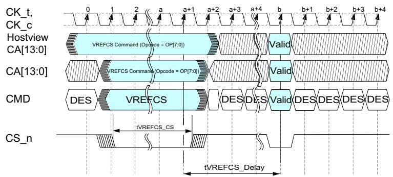  
Figure 92 — Timing Diagram for VrefCS Command

Table 333 — AC Parameters for VrefCS Command  

<table><tr><td>Symbol</td><td>Description</td><td>Min</td><td>Max</td><td>Unit</td><td>Note</td></tr><tr><td>tVrefCS_Delay</td><td>VrefCS command to any other valid command delay</td><td>tMRD</td><td>-</td><td>nCK</td><td></td></tr><tr><td>tVrefCS_CS</td><td>Time CS_n is held low to register VrefCS command</td><td>3.5</td><td>8</td><td>nCK</td><td>1,2</td></tr><tr><td colspan="6">NOTE 1 Multiple cycles are used to avoid possible metastability of CS_n. 
NOTE 2 At the end of CSTM, it is assumed that the host should be able to place the CS_n appropriately and the VrefCS command could be issued as a single cycle command.</td></tr></table>

# 4.26 VrefCA Training Specification

The DRAM internal VrefCA specification parameters are voltage operating range, stepsize, VrefCA set tolerance, VrefCA step time and Vref valid level.

The voltage operating range specifies the minimum required VrefCA setting range for DDR5 DRAM devices. The minimum range is defined by VrefCAmax and VrefCAmin as depicted in Figure 93.

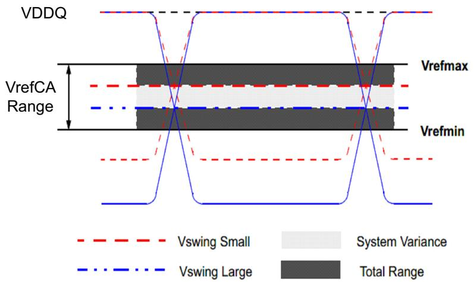  
Figure 93 — VrefCA Operating Range (Vrefmin, Vrefmax)

The VrefCA stepsize is defined as the stepsize between adjacent steps. For a given design the DRAM VrefCA step size must be within the range specified.

The VrefCA set tolerance is the variation in the VrefCA voltage from the ideal setting. This accounts for accumulated error over multiple steps. There are two ranges for VrefCA set tolerance uncertainty. The range of VrefCA set tolerance uncertainty is a function of number of steps n.

The VrefCA set tolerance is measured with respect to the ideal line which is based on the two endpoints, where the endpoints are at the min and max VrefCA values for a specified range. Figure 94 depicts an example of the stepsize and VrefCA set tolerance.

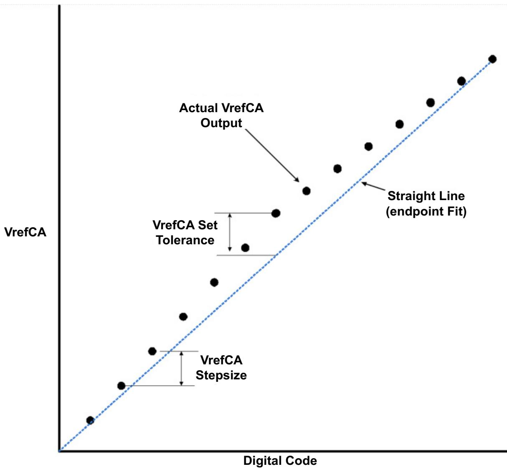  
Figure 94 — Example of Vref Set Tolerance (Max Case Only Shown) and Stepsize

The VrefCA increment/decrement step times are defined by VrefCA_time. The VrefCA_time is defined from t0 to t1 as shown in the Figure 95 where t1 is referenced to when the VrefCA voltage is at the final DC level within the VrefCA valid tolerance (Vref_val_tol).

The VrefCA valid level is defined by VrefCA_val tolerance to qualify the step time t1 as shown in Figure 95. This parameter is used to ensure an adequate RC time constant behavior of the voltage level change after any VrefCA increment/decrement adjustment. This parameter is only applicable for DRAM component level validation/characterization.

t0 - is referenced to MPC Apply VREFCA and RTT_CA/CS/CK

t1 - is referenced to the VrefCA_val_tol

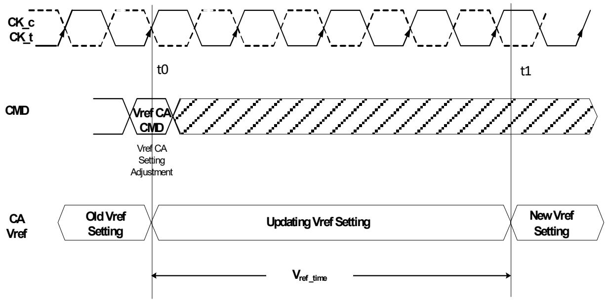  
Figure 95 — Vref_time Timing Diagram

The minimum time required between two Vref commands is VrefCA_time, shown as Vref_time in Figure 95.

Table 334 — VREF CA Mode Register  

<table><tr><td>MR Address</td><td>MRW OP</td><td>OP7</td><td>OP6</td><td>OP5</td><td>OP4</td><td>OP3</td><td>OP2</td><td>OP1</td><td>OP0</td></tr><tr><td>MR11</td><td>UI</td><td colspan="8">VrefCA Calibration Value</td></tr></table>

A VrefCA command is used to store the VREF values into the VREF CA MR11. This mode register is only programmed via the command but is readable via a normal MRR.

  
Figure 96 — Vref Step Single Stepsize Increment Case

  
Figure 97 — Vref Step Single Stepsize Decrement Case

  
Figure 98 — Vref Full Step from Vrefmin to Vrefmax Case

  
Figure 99 — Vref Full Step from Vrefmax to Vrefmin Case.

# 4.26 VrefCA Training Specification (Cont'd)

Table 335 contains the CA internal vref specifications that will be characterized at the component level for compliance. The component level characterization method is TBD.

Table 335 — CA Internal VREF Specifications  

<table><tr><td>Parameter</td><td>Symbol</td><td>Min</td><td>Typ</td><td>Max</td><td>Unit</td><td>Notes</td></tr><tr><td>VrefCA Max operating point</td><td>VrefCA_max</td><td>97.5%</td><td>-</td><td>-</td><td>VDDQ</td><td>1</td></tr><tr><td>VrefCA Min operating point</td><td>VrefCA_min</td><td>-</td><td>-</td><td>45%</td><td>VDDQ</td><td>1</td></tr><tr><td>VrefCA Stepsize</td><td>VrefCA_step</td><td>0.41%</td><td>0.50%</td><td>0.59%</td><td>VDDQ</td><td>2</td></tr><tr><td rowspan="2">VrefCA Set Tolerance</td><td>VrefCA_set_tol</td><td>-1.625%</td><td>0.00%</td><td>1.625%</td><td>VDDQ</td><td>3,4,6</td></tr><tr><td>VrefCA_set_tol</td><td>-0.15%</td><td>0.00%</td><td>0.15%</td><td>VDDQ</td><td>3,5,7</td></tr><tr><td>VrefCA Step Time</td><td>VrefCA_time</td><td>-</td><td>-</td><td>300</td><td>ns</td><td>8</td></tr><tr><td>VrefCA Valid Tolerance</td><td>VrefCA_val_tol</td><td>-0.15%</td><td>0.00%</td><td>0.15%</td><td>VDDQ</td><td>9</td></tr><tr><td colspan="7">NOTE 1 VrefCA DC voltage referenced to VDDQ_DC.</td></tr><tr><td colspan="7">NOTE 2 VrefCA stepsize increment/decrement range. VrefCA at DC level.</td></tr><tr><td colspan="7">NOTE 3 VrefCA_new = VrefCA_old ± n*VrefCA_step; n= number of steps; if increment use &quot;+&quot; If decrement use &quot;-&quot;</td></tr><tr><td colspan="7">NOTE 4 The minimum value of VrefCA setting tolerance = VrefCA_new - 1.625%*VDDQ. The maximum value of VrefCA setting tolerance = VrefCA_new + 1.625%*VDDQ. For n&gt;4</td></tr><tr><td colspan="7">NOTE 5 The minimum value of VrefCA setting tolerance = VrefCA_new - 0.15%*VDDQ. The maximum value of VrefCA setting tolerance = VrefCA_new + 0.15%*VDDQ. For n≤4</td></tr><tr><td colspan="7">NOTE 6 Measured by recording the min and max values of the VrefCA output over the range, drawing a straight line between those points and comparing all other VrefCA output settings to that line</td></tr><tr><td colspan="7">NOTE 7 Measured by recording the min and max values of the VrefCA output across 4 consecutive steps(n=4), drawing a straight line between those points and comparing all other VrefCA output settings to that line</td></tr><tr><td colspan="7">NOTE 8 Time from MPC (Apply VREFCA, VREFCS, RTT_CK/CS/CA) command to increment or decrement</td></tr><tr><td colspan="7">NOTE 9 Only applicable for DRAM component level test/characterization purpose. Not applicable for normal mode of operation. VrefCA valid is to qualify the step times which will be characterized at the component level</td></tr></table>

# 4.27 VrefCS Training Specification

The DRAM internal VrefCS specification parameters are voltage operating range, stepsize, VrefCS set tolerance, VrefCS step time and Vref valid level.

The voltage operating range specifies the minimum required VrefCS setting range for DDR5 DRAM devices. The minimum range is defined by VrefCSmax and VrefCSmin as depicted in Figure 100.

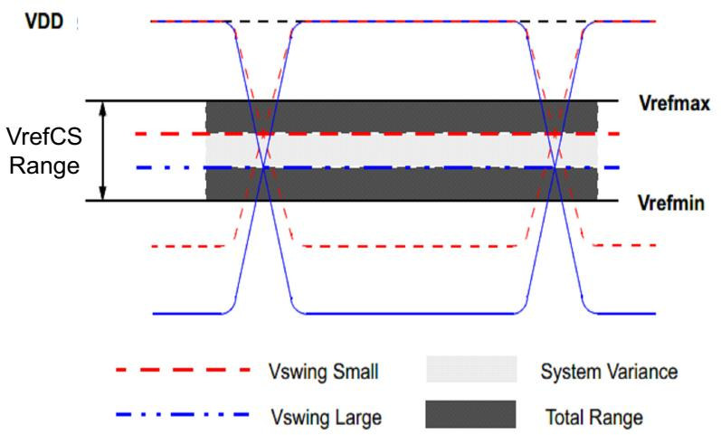  
Figure 100 — VrefCS Operating Range (Vrefmin, Vrefmax)

The VrefCS stepsize is defined as the stepsize between adjacent steps. For a given design the DRAM VrefCS step size must be within the range specified.

The VrefCS set tolerance is the variation in the VrefCS voltage from the ideal setting. This accounts for accumulated error over multiple steps. There are two ranges for VrefCS set tolerance uncertainty. The range of VrefCS set tolerance uncertainty is a function of number of steps n.

The VrefCS set tolerance is measured with respect to the ideal line which is based on the two endpoints, where the endpoints are at the min and max VrefCS values for a specified range. An illustration depicting an example of the stepsize and VrefCS set tolerance is provided in Figure 101.

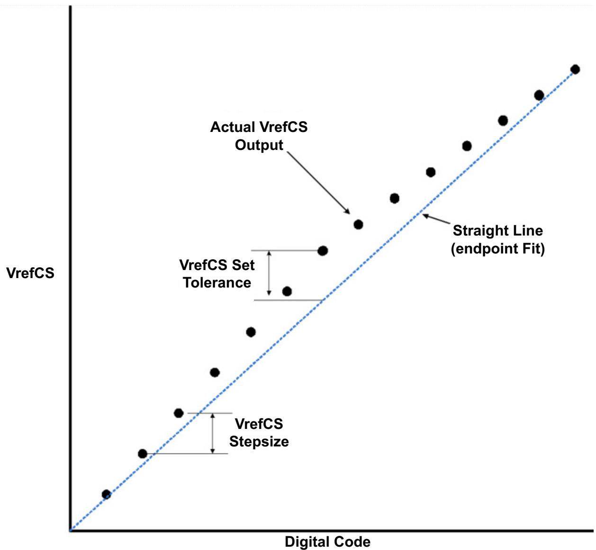  
Figure 101 — Example of Vref Set Tolerance (Max Case Only Shown) and Stepsize

The VrefCS increment/decrement step times are defined by VrefCS_time. The VrefCS_time is defined from t0 to t1 as shown in the Figure 95 where t1 is referenced to when the VrefCS voltage is at the final DC level within the VrefCS valid tolerance (VrefCS_val_tol).

The VrefCS valid level is defined by VrefCS_val tolerance to qualify the step time t1 as shown in Figure 102. This parameter is used to ensure an adequate RC time constant behavior of the voltage level change after any VrefCS increment/decrement adjustment. This parameter is only applicable for DRAM component level validation/characterization.

t0 - is referenced to VrefCS command clock

t1 - is referenced to the VrefCS_val_tol

# 4.27 VrefCS Training Specification (Cont'd)

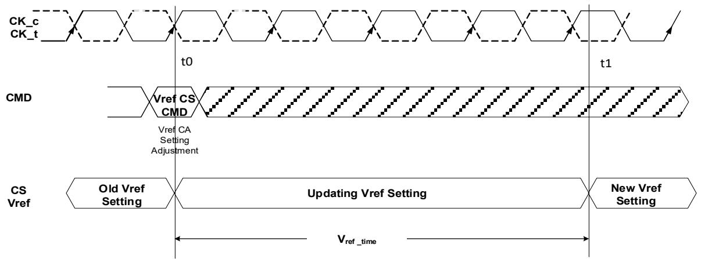  
Figure 102 — Vref_time Timing Diagram

The minimum time required between two Vref commands is VrefCS_time, shown as Vref_time in the timing diagrams.

Table 336 — VREF CS Mode Register  

<table><tr><td>MR Address</td><td>MRW OP</td><td>OP7</td><td>OP6</td><td>OP5</td><td>OP4</td><td>OP3</td><td>OP2</td><td>OP1</td><td>OP0</td></tr><tr><td>MR12</td><td>UI</td><td colspan="8">VrefCS Calibration Value</td></tr></table>

A VrefCS command is used to store the VREF values into the VREF CS MR12. This mode register is only programmed via the command but is readable via a normal MRR.

  
Figure 103 — Vref Step Single Stepsize Increment Case.

  
Figure 104 — Vref Step Single Stepsize Decrement Case

# 4.27 VrefCS Training Specification (Cont'd)

  
Figure 105 — Vref Full Step from Vrefmin to Vrefmax Case

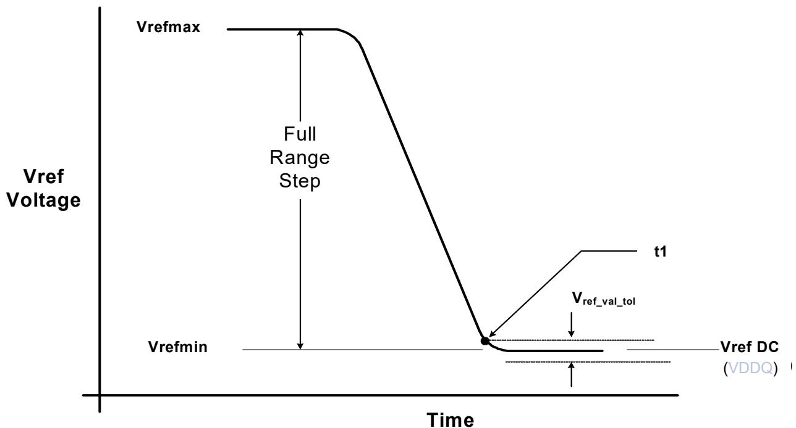  
Figure 106 — Vref Full Step from Vrefmax to Vrefmin Case.

# 4.27 VrefCS Training Specification (Cont'd)

Table 337 contains the CS internal vref specifications that will be characterized at the component level for compliance. The component level characterization method is TBD.

Table 337 — CS Internal VREF Specifications  

<table><tr><td>Parameter</td><td>Symbol</td><td>Min</td><td>Typ</td><td>Max</td><td>Unit</td><td>Notes</td></tr><tr><td>VrefCS Max operating point</td><td>VrefCS_max</td><td>97.5%</td><td>-</td><td>-</td><td>VDDQ</td><td>1</td></tr><tr><td>VrefCS Min operating point</td><td>VrefCS_min</td><td>-</td><td>-</td><td>45%</td><td>VDDQ</td><td>1</td></tr><tr><td>VrefCS Stepsize</td><td>VrefCS_step</td><td>0.41%</td><td>0.50%</td><td>0.59%</td><td>VDDQ</td><td>2</td></tr><tr><td rowspan="2">VrefCS Set Tolerance</td><td>VrefCS_set_tol</td><td>-1.625%</td><td>0.00%</td><td>1.625%</td><td>VDDQ</td><td>3,4,6</td></tr><tr><td>VrefCS_set_tol</td><td>-0.15%</td><td>0.00%</td><td>0.15%</td><td>VDDQ</td><td>3,5,7</td></tr><tr><td>VrefCS Step Time</td><td>VrefCS_time</td><td>-</td><td>-</td><td>300</td><td>ns</td><td>8</td></tr><tr><td>VrefCS Valid Tolerance</td><td>VrefCS_val_tol</td><td>-0.15%</td><td>0.00%</td><td>0.15%</td><td>VDDQ</td><td>9</td></tr><tr><td colspan="7">NOTE 1 VrefCS DC voltage referenced to VDDQ_DC.</td></tr><tr><td colspan="7">NOTE 2 VrefCS stepsize increment/decrement range. VrefCS at DC level.</td></tr><tr><td colspan="7">NOTE 3 VrefCS_new = VrefCS_old + n*VrefCS_step; n= number of steps; if increment use &quot;+&quot; If decrement use &quot;-&quot;</td></tr><tr><td colspan="7">NOTE 4 The minimum value of VrefCA setting tolerance = VrefCS_new - 1.625%*VDDQ. The maximum value of VrefCS setting tolerance = VrefCS_new + 1.625%*VDDQ. For n&gt;4</td></tr><tr><td colspan="7">NOTE 5 The minimum value of VrefCS setting tolerance = VrefCS_new - 0.15%*VDDQ. The maximum value of VrefCS setting tolerance = VrefCSnew + 0.15%*VDDQ. For n&lt;4</td></tr><tr><td colspan="7">NOTE 6 Measured by recording the min and max values of the VrefCS output over the range, drawing a straight line between those points and comparing all other VrefCS output settings to that line</td></tr><tr><td colspan="7">NOTE 7 Measured by recording the min and max values of the VrefCS output across 4 consecutive steps(n=4), drawing a straight line between those points and comparing all other VrefCS output settings to that line</td></tr><tr><td colspan="7">NOTE 8 Time from MPC (Apply VREFCA, VREFCS, RTT_CK/CS/CA) command to increment or decrement</td></tr><tr><td colspan="7">NOTE 9 Only applicable for DRAM component level test/characterization purpose. Not applicable for normal mode of operation. VrefCS valid is to qualify the step times which will be characterized at the component level</td></tr></table>

# 4.28 VrefDQ Calibration Specification

The DRAM internal VrefDQ specification parameters are voltage operating range, stepsize, VrefDQ set tolerance, Vref step time and VrefDQ valid level.

The voltage operating range specifies the minimum required VrefDQ setting range for DDR5 DRAM devices. The minimum range is defined by VrefDQmax and VrefDQmin as depicted in Figure 107.

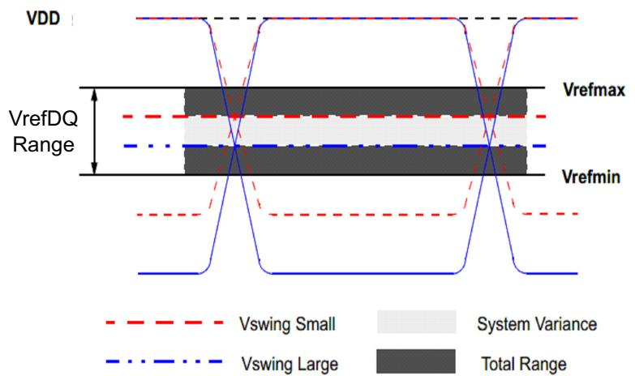  
Figure 107 — VrefDQ Operating Range (VrefDQmin, VrefDQmax)

The VrefDQ stepsize is defined as the stepsize between adjacent steps. For a given design the DRAM VrefDQ step size must be within the range specified.

The VrefDQ set tolerance is the variation in the VrefDQ voltage from the ideal setting. This accounts for accumulated error over multiple steps. There are two ranges for VrefDQ set tolerance uncertainty. The range of VrefDQ set tolerance uncertainty is a function of number of steps n.

The VrefDQ set tolerance is measured with respect to the ideal line which is based on the two endpoints, where the endpoints are at the min and max VrefDQ values for a specified range. Figure 108 depicts an example of the stepsize and VrefDQ set tolerance.

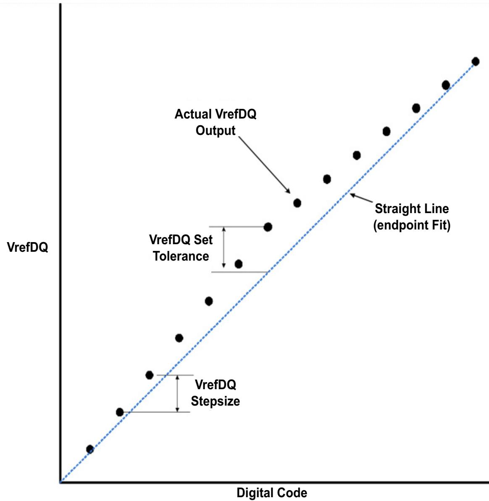  
Figure 108 — Example of Vref Set Tolerance (Max Case Only Shown) and Stepsize

The VrefDQ increment/decrement step times are defined by VrefDQ_time. The VrefDQ_time is defined from t0 to t1 as shown in the Figure 109 where t1 is referenced to when the VrefDQ voltage is at the final DC level within the VrefDQ valid tolerance (VrefDQ_val_tol).

The VrefDQ valid level is defined by VrefDQ_val tolerance to qualify the step time t1 as shown in Figure 109. This parameter is used to ensure an adequate RC time constant behavior of the voltage level change after any VrefDQ increment/decrement adjustment. This parameter is only applicable for DRAM component level validation/characterization.

t0 - is referenced to the MRW command which updates VrefDQ value  
t1 - is referenced to the VrefDQ_val_tol

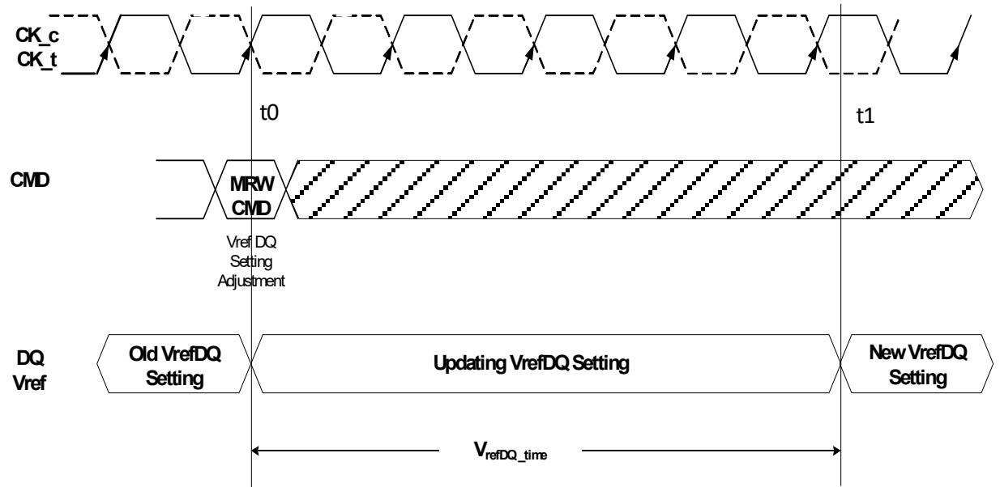  
Figure 109 — VrefDQ_time Timing Diagram

The minimum time required between two MRW commands which update VrefDQ settings is VrefDQ_time.

Table 338 — VrefDQ Mode Register  

<table><tr><td>MR Address</td><td>MRW OP</td><td>OP7</td><td>OP6</td><td>OP5</td><td>OP4</td><td>OP3</td><td>OP2</td><td>OP1</td><td>OP0</td></tr><tr><td>MR10</td><td>UI</td><td colspan="8">VrefDQ Calibration Value</td></tr></table>

An MRW command is used to store the global VrefDQ values into the VrefDQ bits of MR10.

Additional per-pin VrefDQ trims are available for programming in MR118, MR126, MR134, ..., MR254, OP[7:4], up to a maximum of  $+/- 3$  VrefDQ steps. The combined global and per-pin VrefDQ settings shall never exceed the available VrefDQ range from  $35.0\%$  to  $97.5\%$ .

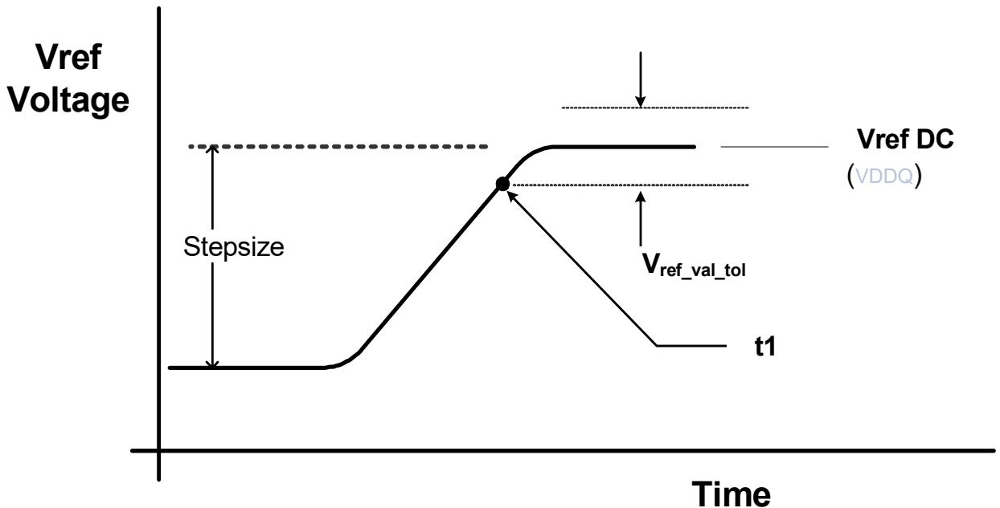  
Figure 110 — VrefDQ Step Single Stepsize Increment Case.

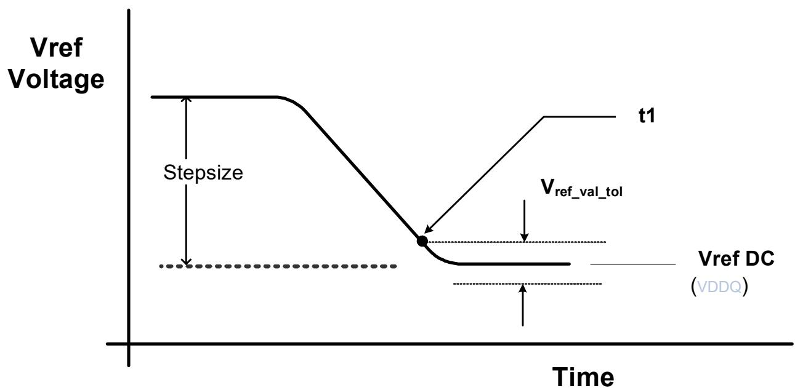  
Figure 111 — VrefDQ Step Single Stepsize Decrement Case

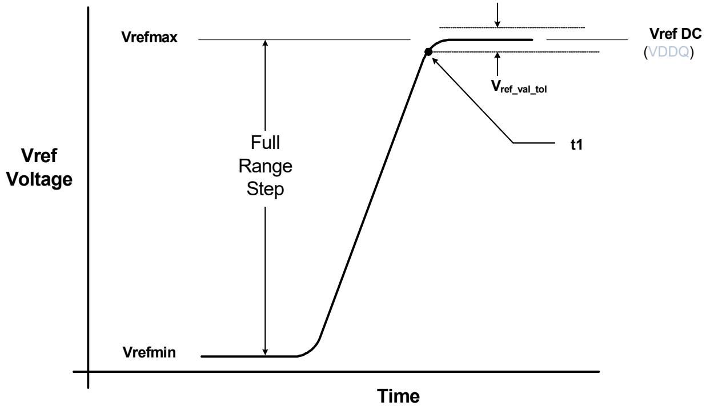  
Figure 112 — VrefDQ Full Step from VrefDQmin to VrefDQmax Case

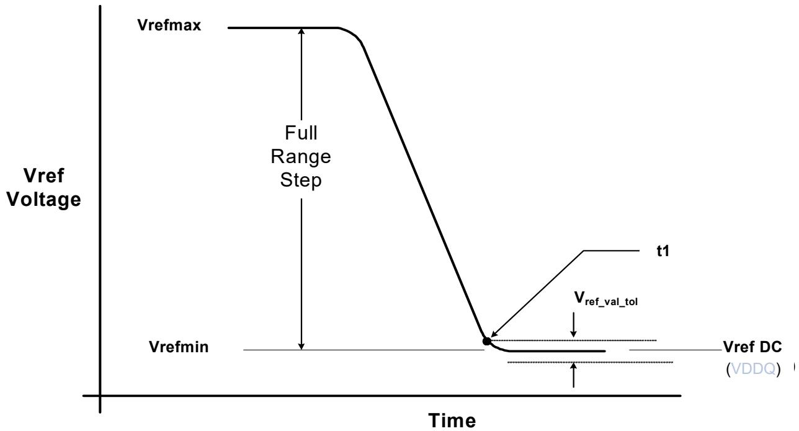  
Figure 113 — VrefDQ Full Step from VrefDQmax to VrefDQmin Case.

# 4.28 VrefDQ Calibration Specification (Cont'd)

Table 339 contains the internal VrefDQ specifications that will be characterized at the component level for compliance. The component level characterization method is TBD.

Table 339 — VrefDQ Internal Specifications  

<table><tr><td>Parameter</td><td>Symbol</td><td>Min</td><td>Typ</td><td>Max</td><td>Unit</td><td>Notes</td></tr><tr><td>VrefDQ Max operating point</td><td>VrefDQ_max</td><td>97.5%</td><td>-</td><td>-</td><td>VDDQ</td><td>1</td></tr><tr><td>VrefDQ Min operating point</td><td>VrefDQ_min</td><td>-</td><td>-</td><td>45%</td><td>VDDQ</td><td>1</td></tr><tr><td>VrefDQ Stepsize</td><td>VrefDQ_step</td><td>0.41%</td><td>0.50%</td><td>0.59%</td><td>VDDQ</td><td>2</td></tr><tr><td rowspan="2">VrefDQ Set Tolerance</td><td>VrefDQ_set_tol</td><td>-1.625%</td><td>0.00%</td><td>1.625%</td><td>VDDQ</td><td>3,4,6</td></tr><tr><td>VrefDQ_set_tol</td><td>-0.15%</td><td>0.00%</td><td>0.15%</td><td>VDDQ</td><td>3,5,7</td></tr><tr><td rowspan="2">VrefDQ Step Time</td><td rowspan="2">VrefDQ_time</td><td>-</td><td>-</td><td>150</td><td>ns</td><td rowspan="2">8,10</td></tr><tr><td>-</td><td>-</td><td>500</td><td>ns</td></tr><tr><td>VrefDQ Valid Tolerance</td><td>VrefDQ_val_tol</td><td>-0.15%</td><td>0.00%</td><td>0.15%</td><td>VDDQ</td><td>9</td></tr><tr><td colspan="7">NOTE 1 VrefDQ DC voltage referenced to VDDQ_DC.</td></tr><tr><td colspan="7">NOTE 2 VrefDQ stepsize increment/decrement range. VrefDQ at DC level.</td></tr><tr><td colspan="7">NOTE 3 VrefDQ_new = VrefDQ_old ± n*VrefDQstep; n= number of steps; if increment use &quot;+&quot; If decrement use &quot;-&quot;</td></tr><tr><td colspan="7">NOTE 4 The minimum value of VrefDQ setting tolerance = VrefDQ_new - 1.625%*VDDQ. The maximum value of VrefDQ setting tolerance = VrefDQ_new + 1.625%*VDDQ. For n&gt;4.</td></tr><tr><td colspan="7">NOTE 5 The minimum value of VrefDQ setting tolerance = VrefDQ_new - 0.15%*VDDQ. The maximum value of VrefDQ setting tolerance = VrefDQ_new + 0.15%*VDDQ. For n≤4.</td></tr><tr><td colspan="7">NOTE 6 Measured by recording the min and max values of the VrefDQ output over the range, drawing a straight line between those points and comparing all other VrefDQ output settings to that line.</td></tr><tr><td colspan="7">NOTE 7 Measured by recording the min and max values of the VrefDQ output across 4 consecutive steps(n=4), drawing a straight line between those points and comparing all other VrefDQ output settings to that line.</td></tr><tr><td colspan="7">NOTE 8 Time from MRW command updating VrefDQ to increment or decrement.</td></tr><tr><td colspan="7">NOTE 9 Only applicable for DRAM component level test/characterization purpose. Not applicable for normal mode of operation. VrefDQ valid is to qualify the step times which will be characterized at the component level.</td></tr><tr><td colspan="7">NOTE 10 The maximum value of VrefDQ step time = 150ns for n&lt;16 and 500ns for n≥16, where n = number of steps.</td></tr></table>

# 4.29 Post Package Repair (PPR)

DDR5 supports Fail Row address repair, PPR which allows a simple and easy repair method in a system. Two methods are provided: Hard Post Package Repair (hPPR) for a permanent Row repair and Soft Post Package Repair (sPPR) for a temporary Row repair.

Entry into hPPR or sPPR is protected through a sequential MRW guard key to prevent unintentional hPPR programming. The sequential MRW guard key is the same for both hPPR and sPPR.

The hPPR/sPPR guard key requires a sequence of four MRW commands to be issued immediately after entering hPPR/sPPR, as shown in Figure 114. The guard key sequence must be entered in the specified order as stated and shown in the spec and in Table 340. Any interruptions of the guard key sequence from other MRW/R commands or non-MR commands such as ACT, WR, RD, are not allowed. Although interruption of the guard key entry is not allowed, if the guard key is not entered in the required order or is interrupted by other commands, the hPPR mode or sPPR mode will not execute and the offending command will be terminated. The hPPR/sPPR entry may or may not execute correctly, however the offending command will not cause the DRAM to lock up. Offending commands which will interrupt hPPR/sPPR include:

- Any interruptions of the guard key sequence from other MRW/R commands or non-MR commands  
- MRW with  $\mathrm{CW} = \mathrm{high}$  
- 2 cycle commands with CS_n low on the 2nd cycle

Additionally, when the hPPR entry sequence is interrupted, subsequent ACT and WR commands will be conducted as normal DRAM commands. If a hPPR operation was prematurely interrupted and/or terminated, the MR23 OP[1] and OP[0] must be reset to "0" prior to performing another hPPR or sPPR operation. The DRAM does not provide an error indication if an incorrect hPPR/sPPR guard key sequence is entered.

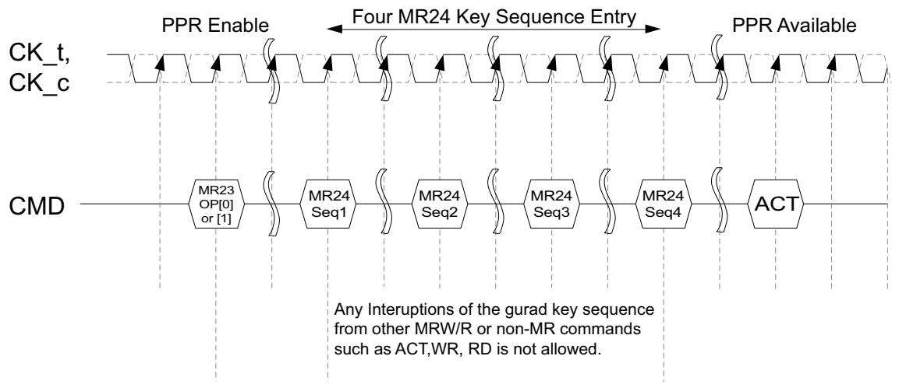  
Figure 114 — Guard Key Timing Diagram

Table 340 — Guard Key Encoding for MR24  

<table><tr><td>Guard Keys</td><td>OP[7]</td><td>OP[6]</td><td>OP[5]</td><td>OP[4]</td><td>OP[3]</td><td>OP[2]</td><td>OP[1]</td><td>OP[0]</td><td>Notes</td></tr><tr><td>MR24 Seq1</td><td>1</td><td>1</td><td>0</td><td>0</td><td>1</td><td>1</td><td>1</td><td>1</td><td></td></tr><tr><td>MR24 Seq2</td><td>0</td><td>1</td><td>1</td><td>1</td><td>0</td><td>0</td><td>1</td><td>1</td><td></td></tr><tr><td>MR24 Seq3</td><td>1</td><td>0</td><td>1</td><td>1</td><td>1</td><td>0</td><td>1</td><td>1</td><td></td></tr><tr><td>MR24 Seq4</td><td>0</td><td>0</td><td>1</td><td>1</td><td>1</td><td>0</td><td>1</td><td>1</td><td></td></tr></table>

# 4.29.1 Hard PPR (hPPR)

With hPPR, DDR5 can correct at least one row address per Bank Group. The hPPR resource designation (MR54,55,56,57) will indicate the hPPR resource availability, and can be read/checked prior to implementing a repair. It is important to note that hPPR repairs are permanent; the Electrical-fuse cannot be switched back to un-fused states once it is programmed. The controller should prevent unintended hPPR mode entry and repair. (i.e., During the Command/Address training period). Entry into hPPR is through a register enable, ACT command that is used to transmit the bank and row address of the row to be replaced in DRAM. After tRCD time, a BL16 WRA command is used to select the individual DRAM through the DQ bits and to transfer the repair address to the DRAM. After program time, and PRE, the hPPR mode can be exited and normal operation can resume.

# 4.29.1.1 hPPR Fail Row Address Repair

1 Since the mode register address operand allows the user to execute hPPR resource, MRR of hPPR resource designation (MR 54, 55, 56, 57) needs to be read. After user's checking the hPPR resource availability of each bank from MRR, hPPR mode can be entered. If the MRR of hPPR resource designation (MR 54, 55, 56, 57) appears to not be available, the host controller should not issue hPPR mode.  
2 Before entering 'hPPR' mode, all banks shall be in a precharged and idle state, and CRC Mode must be disabled.  
3 Enable hPPR using MR23:OP[0]=1 and wait tMRD.  
4 Issue guard key as four consecutive MR24 OP[7:0] MRW commands each with a unique address field OP[7:0]. Each MRW command should be spaced by tMRD.  
5 Issue ACT command with the Bank and Row fail address. Write data is used to select the individual DRAM in the rank for repair.  
6 After tRCD, Issue WRA with a valid address. The DRAM will ignore the address given with the WRA command.  
7 After WL(WL=RL-2), all DQs of target DRAM should be LOW for 8tCK. If HIGH is driven to all DQs of a DRAM for 8tCK, then DRAM does not conduct hPPR and retains data if REF/REFsb command is properly issued. If more than one DRAM shares the same command bus, DRAMs that are not being repaired should have all of their DQ's driven HIGH for 8tCK. If all DQs are neither all LOW nor all HIGH for 8tCK, then hPPR mode execution is unknown.  
8 Wait tPGM_hPPRa or tPGM_hPPRb to allow DRAM repair at the target row address to occur internally, and then issue PRE command.  
9 Wait tPGM_Exit(min) after PRE command to allow DRAM to recognize repaired row address.  
10 Exit hPPR by setting MR23:OP[0]=0.  
11 DDR5 will accept any valid command after tPGMPST(min).  
12 In the case of multiple addresses to be repaired, repeat Steps 3 to 10.

During hPPR mode, REF, REFsb commands are allowed, but array contents are not guaranteed. Upon receiving a REF or REFsb command in hPPR mode, the DRAM may ignore the Refresh operation but will not disrupt the repair operation. Other commands except REF/REFsb during tPGM can cause incomplete repair so no other command except REF is allowed during tPGM.

Once hPPR mode is exited with MR23:OP[0] = 0 and tPGMPST, to confirm if target row is repaired correctly, host can verify by writing data into the target row and reading it back.

# 4.29.1.1 hPPR Fail Row Address Repair (Cont'd)

Figure 115 — hPPR Fail Row Repair  
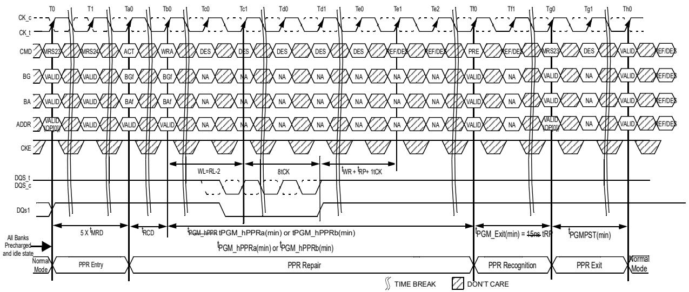  
NOTE 1 Allow REFab/REFsb(1X) from WL+8tCK+tWR+tRP+1tCK after WR, but does not guarantee array contents are refreshed during hPPR  
NOTE 2 Timing diagram shows possible commands but not all shown can be issued at same time; for example if REF is issued at Te1, DES must be issued at Te2 as REF would be illegal at Te2. Likewise, DES must be issued tRFC prior to PRE at Tf0. All regular timings must still be satisfied.

Table 341 - MR Register Bits for PPR  

<table><tr><td>Mode Register</td><td>OP[7]</td><td>OP[6]</td><td>OP[5]</td><td>OP[4]</td><td>OP[3]</td><td>OP[2]</td><td>OP[1]</td><td>OP[0]</td><td>Notes</td></tr><tr><td>MR23</td><td colspan="6">RFU</td><td>sPPR</td><td>hPPR</td><td></td></tr><tr><td>MR24</td><td colspan="8">PPR Guard Key</td><td></td></tr></table>

# 4.29.1.2 Required Timing Parameters

Repair requires additional time period to repair Fail Row Address into Spare Row Address and the timing parameters in Table 342 are required for hPPR.

Table 342 - hPPR Timings  

<table><tr><td colspan="2"></td><td colspan="2">DDR5-3200 to 6400</td><td rowspan="2">Unit</td><td rowspan="2">Note</td></tr><tr><td>Parameter</td><td>Symbol</td><td>min</td><td>max</td></tr><tr><td>hPPR Programming Time: x4/x8</td><td>tPGMa</td><td>1,000</td><td>-</td><td>ms</td><td></td></tr><tr><td>hPPR Programming Time: x16</td><td>tPGMb</td><td>2,000</td><td>-</td><td>ms</td><td></td></tr><tr><td>hPPR Recognition Time</td><td>tPGM_Exit</td><td>tRP</td><td>-</td><td>ns</td><td></td></tr><tr><td>hPPR Program Exit and New Address Setting time</td><td>tPGMPST</td><td>50</td><td>-</td><td>us</td><td></td></tr></table>

# 4.29.2 Soft Post Package Repair (sPPR)

Soft Post Package Repair (sPPR) is a way to quickly, but temporarily, repair one row address per Bank Group on a DDR5 DRAM device, contrasted to hPPR which takes longer but is permanent repair of a row address. There are some limitations and differences between Soft Repair and a Hard Repair. Entry into sPPR is through a register enable, ACT command is used to transmit the bank and row address of the row to be replaced in DRAM. After tRCD time, a BL16 WR command is used to select the individual DRAM through the DQ bits and to transfer the repair address into an internal register in the DRAM. After a write recovery time and PRE, the sPPR mode can be exited and normal operation can resume. Care must be taken that refresh is not violated for the other rows in the array during soft repair time. Also note that the DRAM will retain the soft repair information inside the DRAM as long as VDD remains within the operating region. If DRAM power is removed or the DRAM is RESET, the soft repair will revert to the unrepaired state. hPPR and sPPR may not be enabled at the same time. sPPR must have been disabled and cleared prior to entering hPPR mode.

With sPPR, DDR5 can repair one Row address per BG. If the hPPR resources for a BG are used up, the bank group will have no more available resources for soft PPR. If a repair sequence is issued to a BG with no repair resources available, the DRAM will ignore the programming sequence.

Table 343 — sPPR vs hPPR  

<table><tr><td></td><td>Soft Repair</td><td>Hard Repair</td><td>Note</td></tr><tr><td>Persistence of Repair</td><td>Volatile – Repaired as long as VDD is within Operating Range</td><td>Non-Volatile – repair is permanent after the repair cycle.</td><td>Soft Repair is erased when Vdd removed or device reset.</td></tr><tr><td>Length of time to complete repair cycle</td><td>WL+ 8tCK+tWR</td><td>tPGM_hPPRa or tPG-M_hPPRb</td><td>A subsequent sPPR can be performed without affecting the hPPR previously performed provided a row is available in that BG.</td></tr><tr><td># of Repair elements</td><td>one per BG</td><td>at least one per BG</td><td></td></tr><tr><td>Simultaneous use of soft and hard repair within a BG</td><td>Previous hard repairs are allowed before soft repair</td><td>Any outstanding soft repairs must be cleared before a hard repair</td><td>Clearing sPPR occurs by either: 
(a) powerdown and power-up sequence or (b) Reset and re-initialize.</td></tr><tr><td>Repair Command</td><td>1 method - WR</td><td>1 method - WRA</td><td></td></tr><tr><td>Bank not having row repair retains array data</td><td>Yes</td><td>No</td><td></td></tr><tr><td>Bank having row repair retain array data</td><td>Yes</td><td>No</td><td></td></tr></table>

# 4.29.2.1 sPPR Repair of a Fail Row Address

The following is the procedure of sPPR with WR command. Note that during the soft repair sequence, no refresh is allowed.

1 User should back up the data of the target row address for sPPR in the bank before sPPR execution. The backup data should be one row per bank. After sPPR has been completed, user restores the data in the repaired array.  
2 sPPR resources are shared with hPPR. The hPPR resource designation registers (MR 54, 55, 56, 57) should be checked prior to sPPR. If the MRR of hPPR resource designation (MR 54, 55, 56, 57) shows that hPPR resources in the bank that is targeted for sPPR repair is not available, the host controller should not issue sPPR mode.  
3 Before entering 'sPPR' mode, all banks shall be in a precharged and idle state. and CRC mode must be disabled.  
4 Enable sPPR using MR23 bit "OP1=1" and wait tMRD.  
5 Issue Guard Key as four consecutive MRW commands each with a unique address field OP[7:0] Each MRW command shall be separated by tMRD. The Guard Key sequence is the same as hPPR in Table 341.  
6 Issue ACT command with the Bank and Row Fail address, Write data is used to select the individual DRAM in the Rank for repair.  
7 A WR command is issued after tRCD, with valid column address. The DRAM will ignore the column address given with the WR command.

# 4.29.2.1 sPPR Repair of a Fail Row Address (Cont'd)

8 After WL  $(\mathrm{WL} = \mathrm{WL} = \mathrm{RL} - 2)$ , all of the DQs of the individual Target DRAM should be LOW for 8tCK. If any DQ is high during 8tCK burst, then the sPPR protocol will not be executed. If more than one DRAM shares the same command bus, DRAMs that are not being repaired should have all of their DQ's driven HIGH for 8tCK. If all of the DQ's are neither all LOW nor all HIGH for 8tCK, then sPPR mode will be unknown.  
9 Wait tPGM_sPPR(min) for the internal repair register to be written and then issue PRE to the Bank.  
10 Wait tRP after PRE command to allow the DRAM to recognize repaired Row address.  
11 Exit sPPR with setting MR23 bit "OP1=0" and wait tMRD.  
12 sPPR can be performed without affecting the hPPR previously performed provided a row is available in that BG. When more than one sPPR request is made to the same BG, the most recently issued sPPR address would replace the early issued one. In the case of conducting soft repair address in a different BG, repeat step 4 to 11. During a soft repair, refresh command is not allowed between sPPR MRS entry and exit.

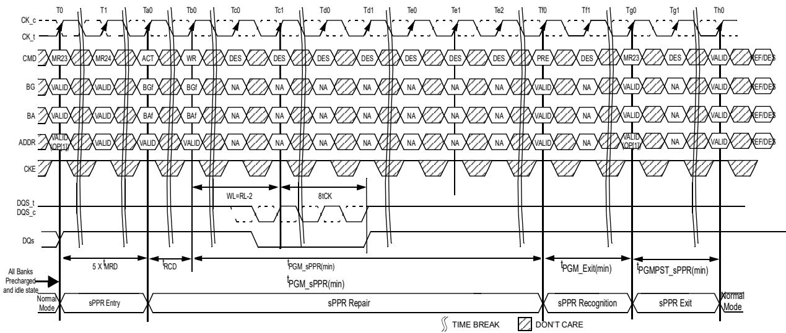  
Figure 116 — sPPR Fail Row Repair

Table 344 - sPPR Timings  

<table><tr><td colspan="2"></td><td colspan="2">DDR5-3200 to 6400</td><td rowspan="2">Unit</td><td rowspan="2">Note</td></tr><tr><td>Parameter</td><td>Symbol</td><td>min</td><td>max</td></tr><tr><td>sPPR Programming Time: x4/x8, x16</td><td>tPGM_sPPR</td><td>WL+8tCK +tWR</td><td>-</td><td>tCK</td><td></td></tr><tr><td>sPPR Exit Recognition Time</td><td>tPGM_Exit</td><td>tRP</td><td>-</td><td>ns</td><td></td></tr><tr><td>sPPR Exit and New New Address Setting time</td><td>tPGMPST _sPPR</td><td>tMRD</td><td>-</td><td>ns</td><td></td></tr></table>

# 4.29.3 MBIST PPR

Memory Built-In Self Test (MBIST) PPR uses only MR22 and MR23, and detailed specification for the operation is TBD.

# 4.30 Decision Feedback Equalization

# 4.30.1 Introduction

At data rates  $\geq 3200\mathrm{MT / s}$ , signal degradation due to Inter Symbol Interference (ISI) is expected to increase and the data eye at the DRAM ball is expected to be closed. Since the memory channel is very reflective due to the many impedance mismatched points that exist along the memory subsystem, ISI due to reflections are expected to increase. Traditional methods of characterizing the Receiver using the input eye mask is no longer sufficient. DDR5 requires equalization to help improve (or open up) the data eyes after the data is latched by the receiver. A 4-tap DFE is chosen to help equalize the DQ signals without amplifying the noise due to insertion loss and reflections, which is a common side effect of other equalization techniques (example CTLE). Figure 117 shows an example of a memory subsystem with DFE circuit included on the DRAM.

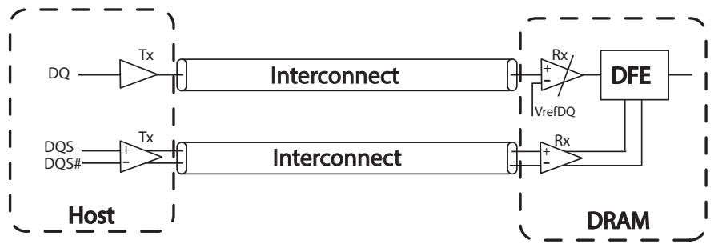  
Figure 117 — Example of Memory Subsystem with DFE Circuit on the DRAM

# 4.30.2 Pulse Response of a Reflective Memory Channel

A reflection dominated channel such as those found in a memory subsystem is anticipated to have substantially reduced data eye at the DRAM ball due to the effects of insertion loss and reflections.

Figure 118 represents how a pulse response of a very reflective channel might look like. The attenuation as well as the ringing of the signal can cause the data eye to close at the DRAM ball. Moreover, the ringing can impact future bits that are being sent into the channel, i.e., if the pulse response is for bit n, then the ringing from bit n can impact the signal integrity of future bits  $n + 1$ ,  $n + 2$ ,  $n + 3$ ,  $n + 4$ , etc. Putting it another way, the signal integrity of any bit, for example bit n, can be impacted by the signals of the previous bits  $n - 1$ ,  $n - 2$ ,  $n - 3$ ,  $n - 4$ , etc.

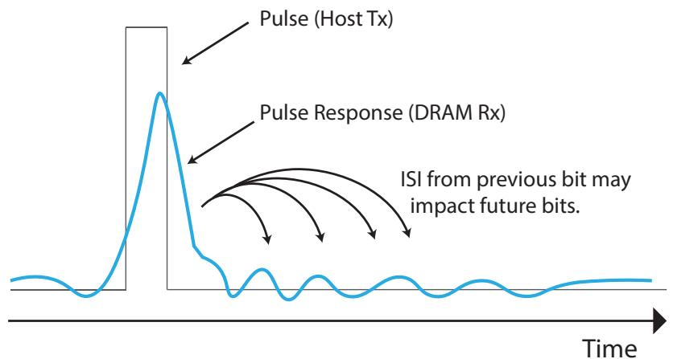  
Figure 118 — Example of Pulse Response of a Reflective Channel

# 4.30.3 Components of the DFE

The 4-tap DFE subsystem consists of a gain amplifier, a DFE summer, 4 DQ slicers (also called Taps) with outputs that loop back to the DFE summer, and a coefficient multiplier for each Tap (Figure 119). The gain control of the front end is used to ensure that the cursor or the current bit is in a congruent relationship with the ISI correction required for the channel. The taps T1, T2, T3, T4 coefficients provide the corrections needed to the current bit by adding or subtracting the effects of ISI of the previous bits.

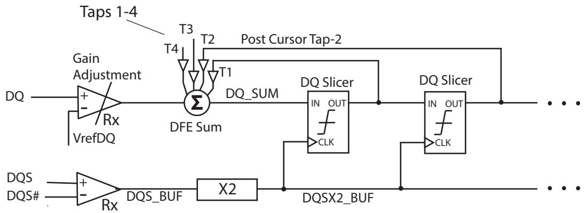  
Figure 119 — 4-Tap DFE Example

# 4.30.3 Components of the DFE (Cont'd)

The Mode Registers shown in Table 345 and Table 346 are used by the memory controller to set the strengths of the gain amplifier and the strengths of the correction of the Taps to adapt the ISI cancellation in accordance with the channel performance. Optimal values used for the strengths of the gain amplifier and of the Taps are system dependent, and are usually obtained through a combination of simulations, platform characterizations, and other methods.

Table 345 — Min/Max Ranges for the DFE Gain Adjustment  

<table><tr><td rowspan="2">Description</td><td colspan="3">DDR5 3200-4800</td><td colspan="3">DDR5 5200-6400</td><td rowspan="2">Unit</td><td rowspan="2">Notes</td></tr><tr><td>Min</td><td>Typ</td><td>Max</td><td>Min</td><td>Typ</td><td>Max</td></tr><tr><td>DFE Gain Bias Max</td><td>6</td><td>-</td><td>-</td><td>6</td><td>-</td><td>-</td><td>dB</td><td>1,2,3,4</td></tr><tr><td>DFE Gain Bias Min</td><td>-</td><td>-</td><td>-6</td><td>-</td><td>-</td><td>-6</td><td>dB</td><td>1,2,3,4</td></tr><tr><td>DFE Gain Bias Average Step Size</td><td></td><td>2</td><td></td><td></td><td>2</td><td></td><td>dB</td><td>1,2,3,4</td></tr><tr><td>DFE Gain Bias DNL</td><td>-1</td><td>-</td><td>1</td><td>-1</td><td>-</td><td>1</td><td>dB</td><td>1,2,3,4</td></tr><tr><td>DFE Gain Bias INL</td><td>-1</td><td>-</td><td>1</td><td>-1</td><td>-</td><td>1</td><td>dB</td><td>1,2,3,4</td></tr><tr><td>DFE Gain Bias Time</td><td>tDFE</td><td>-</td><td>-</td><td>tDFE</td><td>-</td><td>-</td><td>ns</td><td>1,2,3,4</td></tr><tr><td colspan="9">NOTE 1 All parameters are defined over the Vref ranges from 0.5*VDDQ to 0.9*VDDQ
NOTE 2 DFE Gain Bias are for all voltage and temperature range
NOTE 3 These values are defined over the entire voltage and temperature range
NOTE 4 These parameters are suggested to evaluate relative ratio of DFE taps 1~4, and absolute values of all parameters are not subject to silicon validation nor production test.</td></tr></table>

Table 346 — Min/Max Ranges for the DFE Tap Coefficients  

<table><tr><td rowspan="2">Description</td><td colspan="3">DDR5 3200-4800</td><td colspan="3">DDR5 5200-6400</td><td rowspan="2">Unit</td><td rowspan="2">Notes</td></tr><tr><td>Min</td><td>Typ</td><td>Max</td><td>Min</td><td>Typ</td><td>Max</td></tr><tr><td>DFE Tap-1 Bias Max</td><td>50</td><td>-</td><td>-</td><td>50</td><td>-</td><td>-</td><td>mV</td><td>1,2,4</td></tr><tr><td>DFE Tap-1 Bias Min</td><td>-</td><td>-</td><td>-200</td><td>-</td><td>-</td><td>-200</td><td>mV</td><td>1,2,4</td></tr><tr><td>DFE Tap-2 Bias Max</td><td>75</td><td>-</td><td>-</td><td>75</td><td>-</td><td>-</td><td>mV</td><td>2,4</td></tr><tr><td>DFE Tap-2 Bias Min</td><td>-</td><td>-</td><td>-75</td><td>-</td><td>-</td><td>-75</td><td>mV</td><td>2,4</td></tr><tr><td>DFE Tap-3 Bias Max</td><td>60</td><td>-</td><td>-</td><td>60</td><td>-</td><td>-</td><td>mV</td><td>2,4</td></tr><tr><td>DFE Tap-3 Bias Min</td><td>-</td><td>-</td><td>-60</td><td>-</td><td>-</td><td>-60</td><td>mV</td><td>2,4</td></tr><tr><td>DFE Tap-4 Bias Max</td><td>45</td><td>-</td><td>-</td><td>45</td><td>-</td><td>-</td><td>mV</td><td>2,4</td></tr><tr><td>DFE Tap-4 Bias Min</td><td>-</td><td>-</td><td>-45</td><td>-</td><td>-</td><td>-45</td><td>mV</td><td>2,4</td></tr><tr><td>DFE Tap Bias Average Step Size</td><td>TBD</td><td>5</td><td>TBD</td><td>TBD</td><td>5</td><td>TBD</td><td>mV</td><td>2,3,4</td></tr><tr><td>DFE Tap Bias DNL</td><td>-2.5</td><td>-</td><td>+2.5</td><td>-2.5</td><td>-</td><td>+2.5</td><td>mV</td><td>2,3,4</td></tr><tr><td>DFE Tap Bias INL</td><td>-2.5</td><td>-</td><td>+2.5</td><td>-2.5</td><td>-</td><td>+2.5</td><td>mV</td><td>2,3,4</td></tr><tr><td>DFE Tap Bias Step Time</td><td>tDFE</td><td></td><td></td><td>tDFE</td><td></td><td></td><td>ns</td><td>2,3,4</td></tr><tr><td colspan="9">NOTE 1 As speed increases, the impact of loss from the channel makes the bias range of the first cursor asymmetric
NOTE 2 Values are defined for the entire voltage, temperature and the Rx Vref range from 0.5*VDDQ to 0.9*VDDQ.
NOTE 3 Values are identical for Taps 1-4.
NOTE 4 These parameters are suggested to evaluate relative ratio of DFE Taps 1~4, and absolute values of all parameters are not subject to silicon validation nor production test.</td></tr></table>

# 4.30.3 Components of the DFE (Cont'd)

The method to measure INL and DNL for both DFE gain and DFE taps is TBD.

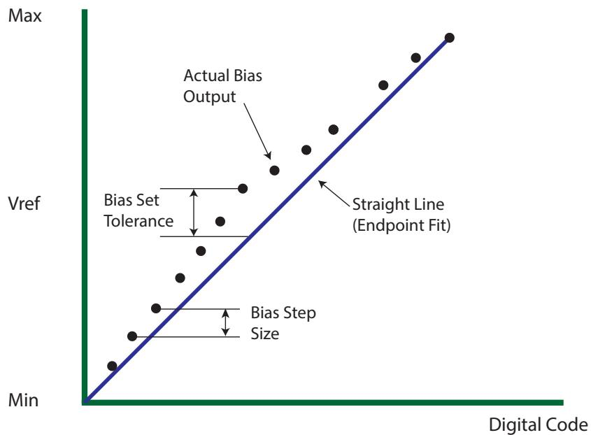  
Figure 120 — Example of TBD Measurement Method for INL/DNL

# 4.30.3 Components of the DFE (Cont'd)

The DRAM may implement 1-way interleave, 2-way interleave, or 4-way interleave 4-tap DFE memory circuitry. The 1-way interleaved 4-tap DFE architecture (Figure 121) requires a strobe multiplier, which is at Nyquist rate, and the output of the DQ slicer runs at same speed as received data.

  
Figure 121 — 1-Way Interleave 4-Tap DFE Example

A 2-way interleaved 4-tap DFE architecture (Figure 122) can use the strobe as is. In this case, the output of the DQ slicer runs at half the speed as received data.

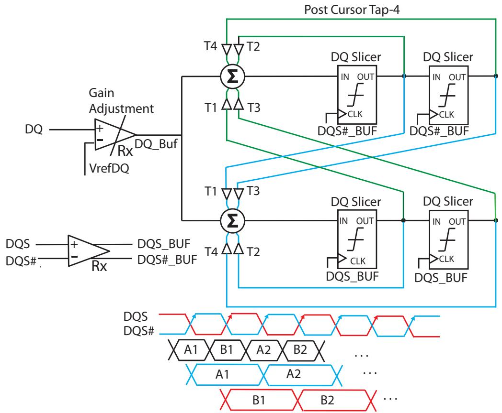  
Figure 122 — 2-Way Interleave 4-Tap DFE Example

# 4.30.3 Components of the DFE (Cont'd)

A 4-way interleaved 4-tap DFE architecture (Figure 123) requires a divided clock. In this case, the output of the DQ slicer runs at 1/4 the speed as received data.

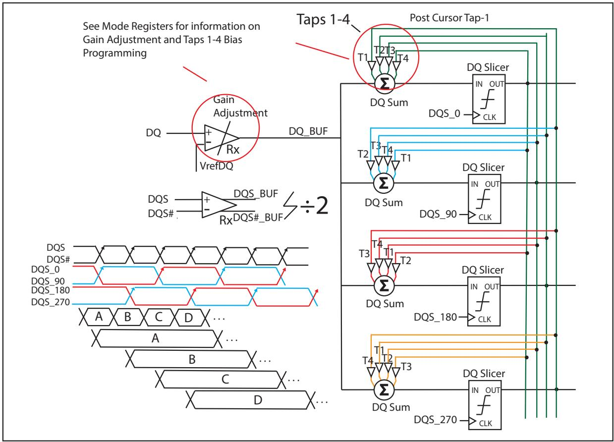  
Figure 123 — 4-Way Interleave 4-Tap DFE Example

# 4.31 DQS Interval Oscillator

As voltage and temperature change on the SDRAM die, the DQS clock tree delay will shift and may require re-training. The DDR5-SDRAM includes an internal DQS clock-tree oscillator to measure the amount of delay over a given time interval (determined by the controller), allowing the controller to compare the trained delay value to the delay value seen at a later time. The DQS Oscillator will provide the controller with important information regarding the need to re-train, and the magnitude of potential error.

The DQS Interval Oscillator is started by issuing an MPC [Start DQS Osc] command with OP[0000 0111B] set as described in Section 4.15, which will start an internal ring oscillator that counts the number of times a signal propagates through a copy of the DQS clock tree.

The DQS Oscillator may be stopped by issuing an MPC [Stop DQS Osc] command with OP[0000 0110 $_\mathrm{B}$ ] set as described in Section 4.15, or the controller may instruct the SDRAM to count for a specific number of clocks and then stop automatically (See MR45,46 & 47 for more information). If MR45 is set to automatically stop the DQS Oscillator, then the MPC [Stop DQS Osc] command should not be used (illegal). When the DQS Oscillator is stopped by either method, the result of the oscillator counter is automatically stored in MR46 and MR47.

The controller may adjust the accuracy of the result by running the DQS Interval Oscillator for shorter (less accurate) or longer (more accurate) duration. The accuracy of the result for a given temperature and voltage is determined by the following equation:

$$
D Q S \text {O s c i l l a t o r G r a n u l a r i t y E r r o r} = \frac {2 * (D Q S \text {d e l a y})}{\text {R u n T i m e}}
$$

Where:

Run Time = total time between start and stop commands

DQS delay = the value of the DQS clock tree delay (tRX_DQS2DQ min/max)

Additional matching error must be included, which is the difference between DQS training circuit and the actual DQS clock tree across voltage and temperature. The matching error is vendor specific.

Therefore, the total accuracy of the DQS Oscillator counter is given by:

DQS Oscillator Accuracy = 1 - Granularity Error - Matching Error

# 4.31 DQS Interval Oscillator (Cont'd)

Example: If the total time between start and stop commands is 100ns, and the maximum DQS clock tree delay is 400ps (tRX_DQS2DQ max), then the DQS Oscillator Granularity Error is:

$$
DQS Oscillator Granularity Error = \frac {2 * (0.4 \mathrm {~ns})}{100 \mathrm {~ns}} = 0.8 \%
$$

This equates to a granularity timing error of 3.2ps.

Assuming a circuit Matching Error of 5.5ps across voltage and temperature, then the accuracy is:

$$
DQS Oscillator Accuracy = 1 - \frac{3.2 + 5.5}{400} = 97.8\%
$$

Example: Running the DQS Oscillator for a longer period improves the accuracy. If the total time between start and stop commands is 250ns, and the maximum DQS clock tree delay is 400ps (tRX_DQS2DQ max), then the DQS Oscillator Granularity Error is:

$$
D Q S O s c i l l a t o r G r a n u l a r i t y E r r o r = \frac {2 * (0.4 n s)}{250 n s} = 0.32 \%
$$

This equates to a granularity timing error of 1.28ps.

Assuming a circuit Matching Error of 5.5ps across voltage and temperature, then the accuracy is:

$$
DQS Oscillator Accuracy = 1 - \frac{1.28 + 5.5}{400} = 98.3\%
$$

The result of the DQS Interval Oscillator is defined as the number of DQS Clock Tree Delays that can be counted within the "run time," determined by the controller. The result is stored in MR46 and MR47. MR46 contains the least significant bits (LSB) of the result, and MR47 contains the most significant bits (MSB) of the result. MR46 and MR47 are overwritten by the SDRAM when an MPC-1 [Stop DQS Osc] command is received. The SDRAM counter will count to its maximum value  $(= 2^{\wedge}16)$  and stop. If the maximum value is read from the mode registers, then the memory controller must assume that the counter overflowed the register and discard the result. The longest "run time" for the oscillator that will not overflow the counter registers can be calculated as follows:

$$
\text {L o n g e s t R u n T i m e I n t e r v a l} = 2 ^ {1 6} * \text {t R X \_ D Q S 2 D Q (m i n)}
$$

The interval oscillator matching error is defined as the difference between the DQS training circuit (interval oscillator) and the actual DQS clock tree across voltage and temperature.

Parameters:

- tRX_DQS2DQ: Actual DQS clock tree delay  
- tDQSOSC: Training circuit (interval oscillator) delay  
- OSCOOffset: Average delay difference over voltage and temp  
- OSCMatch: DQS oscillator matching error

# 4.31 DQS Interval Oscillator (Cont'd)

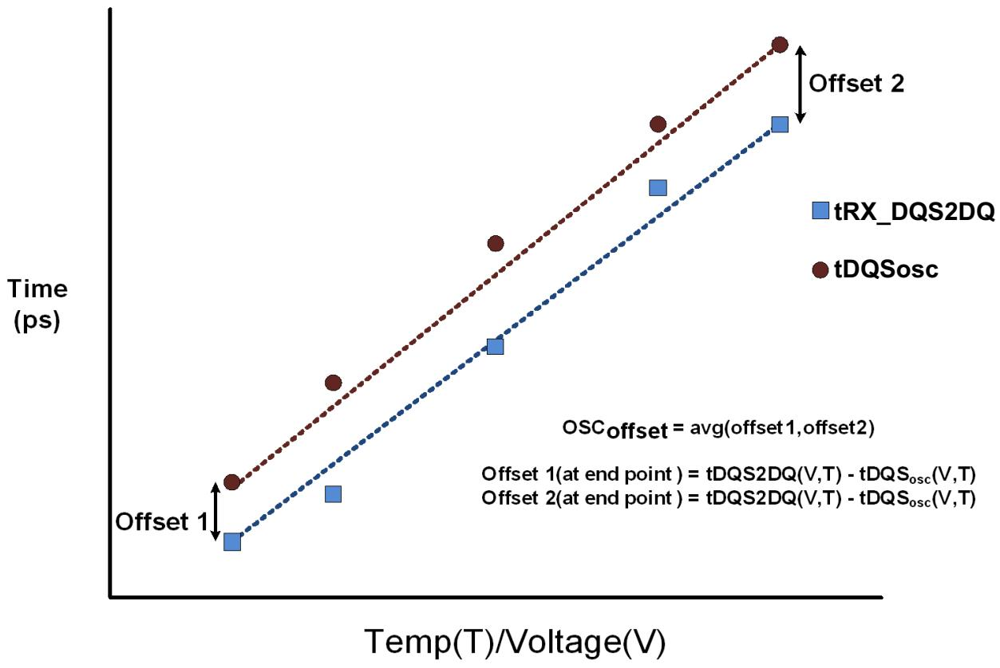  
Figure 124 — Interval Oscillator Offset  $(\mathrm{OSC}_{\mathrm{offset}})$

-  $\mathrm{OSC}_{\mathrm{Match}}$ :

$$
O S C _ {M a t c h} = \left[ t R X \_ D Q S 2 D Q _ {(V, T)} - t D Q S _ {O S C (V, T)} - O S C _ {o f f s e t} \right]
$$

tDQSOsc:

$$
t D Q S _ {O S C (V, T)} = \frac {\text {R u n t i m e}}{2 * \text {C o u n t}}
$$

# 4.31 DQS Interval Oscillator (Cont'd)

Table 347 — DQS Oscillator Matching Error Specification  

<table><tr><td>Parameter</td><td>Symbol</td><td>Min</td><td>Max</td><td>Units</td><td>Notes</td></tr><tr><td>DQS Oscillator Matching Error</td><td>OSCMatch</td><td>-10</td><td>+10</td><td>ps</td><td>1,2,3,4,5,6,7,8</td></tr><tr><td>DQS Oscillator Offset</td><td>OSCoffset</td><td>-150</td><td>150</td><td>ps</td><td>2,4,6,7</td></tr><tr><td colspan="6">NOTE 1 The OSCMatch is the matching error per between the actual DQS and DQS interval oscillator over voltage and temp.</td></tr><tr><td colspan="6">NOTE 2 This parameter will be characterized or guaranteed by design.</td></tr><tr><td colspan="6">NOTE 3 The OSCMatch is defined as the following:</td></tr><tr><td colspan="6">OSCMatch = [tRX_DQS2DQ(V,T) - tDQSOSC(V,T) - OSCoffset]</td></tr><tr><td colspan="6">Where tRX_DQS2DQ(V,T), tDQSOSC(V,T) and OSCoffset(V,T) are determined over the same voltage and temp conditions.</td></tr><tr><td colspan="6">NOTE 4 The runtime of the oscillator must be at least 200ns for determining tDQSOSC(V,T)</td></tr><tr><td colspan="6">tDQSOSC(V,T) = Runtime2*Count</td></tr><tr><td colspan="6">NOTE 5 The input stimulus for tRX_DQS2DQ will be consistent over voltage and temp conditions.</td></tr><tr><td colspan="6">NOTE 6 The OSCoffset is the average difference of the endpoints across voltage and temp.</td></tr><tr><td colspan="6">NOTE 7 These parameters are defined per channel.</td></tr><tr><td colspan="6">NOTE 8 tRX_DQS2DQ(V,T) delay will be the average of DQS to DQ delay over the runtime period.</td></tr><tr><td colspan="6">NOTE 9 The matching error and offset of OSC came from DQS2DQ interval oscillator.</td></tr></table>

The interval oscillator count read out timing is provided in Table 348.

Table 348 — DQS Interval Oscillator Read Out AC Timing  

<table><tr><td rowspan="2">Parameter</td><td rowspan="2">Symbol</td><td colspan="2">DDR5-3200 to 4800</td><td colspan="2">DDR5-5200 to 6400</td><td colspan="2">DDR5-6800 to 8400</td><td rowspan="2">Unit</td><td rowspan="2">Notes</td></tr><tr><td>Min</td><td>Max</td><td>Min</td><td>Max</td><td>Min</td><td>Max</td></tr><tr><td>Delay time from DQS Interval Oscillator stop to Mode Register Readout</td><td>tOSCO</td><td>tMPC_Delay</td><td>-</td><td>tMPC_Delay</td><td>-</td><td>TBD</td><td>-</td><td>nCK</td><td></td></tr><tr><td>DQS Interval Oscillator start gap in automatic stop mode</td><td>tOSCS</td><td colspan="6">tMPC_Delay + DQS Interval Timer Run Time</td><td>nCK</td><td></td></tr><tr><td colspan="10">NOTE In manual stop mode, DQS osc start command should be followed by DQS osc stop command (MPC). Otherwise, DQS osc result value (MR46 &amp; MR47) cannot be guaranteed.</td></tr></table>

# 4.32 tDQS2DQ Offset Due to Temperature and Voltage Variation

As temperature and voltage change on the SDRAM die, the DQS clock tree will shift and may require retraining. The oscillator is usually used to measure the amount of delay over a given time interval (determined by the controller), allowing the controller to compare the trained delay value to the delay value seen at a later time. The tDQS2DQQ offset due to temperature and voltage variation specification can be used for instances when the oscillator cannot be used to control the tDQS2DQ.

# 4.32 tDQS2DQ Offset Due to Temperature and Voltage Variation (Cont'd)

Table 349 — tDQS2DQ Offset Due to Temperature and Voltage Variation for DDR5-3200 to 4800  

<table><tr><td rowspan="2">Parameter</td><td rowspan="2">Symbol</td><td colspan="2">DDR5-3200</td><td colspan="2">DDR5-3600</td><td colspan="2">DDR5-4000</td><td colspan="2">DDR5-4400</td><td colspan="2">DDR5-4800</td><td rowspan="2">Unit</td><td rowspan="2">Notes</td></tr><tr><td>Min</td><td>Max</td><td>Min</td><td>Max</td><td>Min</td><td>Max</td><td>Min</td><td>Max</td><td>Min</td><td>Max</td></tr><tr><td>tDQS2DQ_temp</td><td>DQS to DQ offset temperature variation</td><td>-</td><td>TBD</td><td>-</td><td>TBD</td><td>-</td><td>TBD</td><td>-</td><td>TBD</td><td>-</td><td>TBD</td><td>ps/°C</td><td>1,2</td></tr><tr><td>tDQS2DQ_volt</td><td>DQS to DQ offset voltage variation</td><td>-</td><td>TBD</td><td>-</td><td>TBD</td><td>-</td><td>TBD</td><td>-</td><td>TBD</td><td>-</td><td>TBD</td><td>ps/50mV</td><td>1,2</td></tr><tr><td>NOTE 1</td><td colspan="13">tDQS2DQ max delay variation as a function of temperature</td></tr><tr><td>NOTE 2</td><td colspan="13">tDQS2DQ max delay variation as a function of the DC voltage variation for VDDQ and VDD. It includes the VDDQ and VDD AC noise impact for frequencies &gt;20MHz and max voltage of 45mVpk-pk from DC -20MHz at a fixed temperature on the package. For tester measurement VDDQ=VDD is assumed</td></tr></table>

Table 350 — tDQS2DQ Offset Due to Temperature and Voltage Variation for DDR5-5200 to 6400  

<table><tr><td rowspan="2">Parameter</td><td rowspan="2">Symbol</td><td colspan="2">DDR5-5200</td><td colspan="2">DDR5-5600</td><td colspan="2">DDR5-6000</td><td colspan="2">DDR5-6400</td><td rowspan="2">Unit</td><td rowspan="2">Notes</td></tr><tr><td>Min</td><td>Max</td><td>Min</td><td>Max</td><td>Min</td><td>Max</td><td>Min</td><td>Max</td></tr><tr><td>tDQS2DQ_temp</td><td>DQS to DQ offset temperature variation</td><td>-</td><td>TBD</td><td>-</td><td>TBD</td><td>-</td><td>TBD</td><td>-</td><td>TBD</td><td>ps/°C</td><td>1,2</td></tr><tr><td>tDQS2DQ_volt</td><td>DQS to DQ offset voltage variation</td><td>-</td><td>TBD</td><td>-</td><td>TBD</td><td>-</td><td>TBD</td><td>-</td><td>TBD</td><td>ps/50mV</td><td>1,2</td></tr><tr><td>NOTE 1</td><td colspan="11">tDQS2DQ max delay variation as a function of temperature</td></tr><tr><td>NOTE 2</td><td colspan="11">tDQS2DQ max delay variation as a function of the DC voltage variation for VDDQ and VDD. It includes the VDDQ and VDD AC noise impact for frequencies &gt;20MHz and max voltage of 45mVpk-pk from DC -20MHz at a fixed temperature on the package. For tester measurement VDDQ=VDD is assumed</td></tr></table>

# 4.33 2N Mode

2N mode allows the system to provide more setup and hold time on the CA bus. 2N mode is enabled by default on the DDR5 SDRAM, and an MPC is used to change between 2N and 1N modes. MR2:OP[2] allows the state of the 2N Mode to be read.

DDR5 has defined two cycle commands, which requires the DRAM to capture the command differently between 1N and 2N modes. In both modes, the first half of the command is sampled on the clock that the chip select is active. In 1N mode, the second half of the command is sampled on the next clock edge. In 2N mode, the second half of the command is sampled 2 clocks after the first half. Non-target ODT signaling (on the chip select) is also delayed by a clock in 2N mode.

To the DRAM, one clock commands operate the same in 1N and 2N mode, with the command sampled on the same clock as the chip select active.

A 2-cycle or 1-cycle command can start on any clock (unlike gearend mode). Figure 125 shows the differences between standard 1N mode with a 2-cycle read command, followed by a 1-cycle precharge command, and what it looks like when operated in 2N mode with the same commands. While in 2N mode, the host will never send two consecutive Chip Selects except during explicit cases such as exiting CATM mode.

Table 351 — MR2 Functional Modes – for Reference Only  
See Section 3.5.4 for details  

<table><tr><td>OP[7]</td><td>OP[6]</td><td>OP[5]</td><td>OP[4]</td><td>OP[3]</td><td>OP[2]</td><td>OP[1]</td><td>OP[0]</td></tr><tr><td>Internal Write Timing</td><td>Reserved</td><td>Device 15 MPSM</td><td>CS Assertion Duration (MPC)</td><td>Max Power Savings Mode (MPSM)</td><td>2N Mode</td><td>Write Leveling Training</td><td>Read Preamble Training</td></tr><tr><td colspan="8">NOTE OP(0-7) can be programmed with either “0” or “1”.</td></tr></table>

Table 352 — 2N Mode Register Configuration  

<table><tr><td>Function</td><td>Register Type</td><td>Operand</td><td>Data</td><td>Notes</td></tr><tr><td>2N Mode</td><td>R</td><td>OP[2]</td><td>0B: 2N Mode (Default)
1B: 1N Mode</td><td>1, 2</td></tr><tr><td colspan="5">NOTE 1 To ensure training modes can be enabled and run appropriately, the default (power-on) mode for DDR5 is 2N mode. Post CA Training, the user can configure this bit to put the device into either 1N mode or 2N mode. Both 1N and 2N modes are valid operating conditions for DDR5.
NOTE 2 Since 2N Mode setting is an MPC based command, it can only be programmed via that command and its mode register is therefore read only.</td></tr></table>

# 4.33 2N Mode (Cont'd)

Figure 125 — Example of 1N vs 2N Mode – For Reference Only  
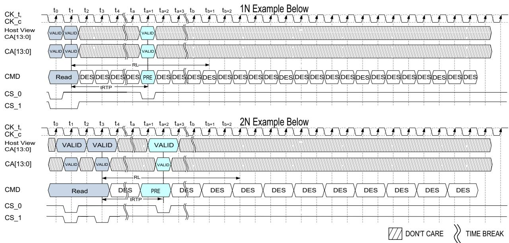  
NOTE 1 The Host View CA[13:0] is shown for clarification, while CA[13:0] is what the DRAM should expect.  
NOTE 2 CS1 is shown for NT ODT clarification  
NOTE 3 tRTP can be launched on odd or even clocks.

# 4.33.1 1N / 2N Mode Clarifications

Several DDR5 SDRAM features require specific CS_n and CA bus behavior to function correctly in 1N and 2N mode. Table 353 describes the various behaviors (additional details in the respective sections of the spec).

Table 353 — CS_n and CA Bus Required Behaviors  

<table><tr><td></td><td>CS Assertion Duration</td><td>CS_n Required Behavior for 1N</td><td>CS_n Required Behavior for 2N</td><td>CA Bus Required Behavior for Multi-Cycle CS Assertion / 2N</td></tr><tr><td>Cold or Warm Reset Exit</td><td>Multi (default)</td><td>NA</td><td>Static low for 3+ nCK</td><td>Static NOP for 3+ nCK</td></tr><tr><td>MPC (includes CSTM Exit)</td><td rowspan="2">Single Multi</td><td>Single low pulse</td><td>Single low pulse</td><td rowspan="2">Single MPC surrounding CS_n low by tMC_MPC_*</td></tr><tr><td>MPC (includes CSTM Exit)</td><td>Static multi-cycle low</td><td>Static multi-cycle low</td></tr><tr><td>CATM exit (NOP Command)</td><td>Don&#x27;t care</td><td>Static low for 2+ nCK</td><td>Static low for 2+ nCK</td><td>Static NOP for the duration of tCAT-M_CS Exiting</td></tr><tr><td>PDX</td><td>Don&#x27;t care</td><td>Single low pulse</td><td>Single low pulse</td><td>Single NOP</td></tr><tr><td>SRX (3 NOPs)</td><td>Don&#x27;t care</td><td>Static low for 3+ nCK or Pulsing low 3+ cycles (...0, 1, 0, 1, 0...)</td><td>Static low for 3+ nCK or Pulsing low 3+ cycles (...0, 1, 0, 1, 0...)</td><td>Static NOP for 3+ nCK if CS_n held static low or Static NOP for 5+ nCK if CS_n is pulsed low</td></tr><tr><td colspan="5">NOTE 1 MR2:OP[4], CS Assertion Duration, setting only applies to the MPC and VREFCA commands.</td></tr></table>

# 4.34 Write Pattern Command

Due to the significant percentage of writes that contain all zeros, this new mode is being proposed for inclusion into the DDR5 specification as a new WRITE Pattern command. When used effectively, the command can save power by not actually sending the data across the bus.

This new mode is operated very similar to a standard write command with the notable exceptions that it has its own encoded WRITE Pattern command, no data is sent on the DQ bus, no toggling of DQS is needed, and the DRAM does not turn on any internal ODT. ECC parity is based on the Write Pattern Mode data in MR48.

Upon receiving the command, the DRAM device will source the input for the memory array from the Write Pattern Mode Registers instead of from the DQ bits themselves. The DQ mapping across the burst is shown in Table 354. The host will not send any data during this time. All timing constraints are still measured from the clocks where the write command data would have been transferred. e.g., tWR is measured from end of write burst to PRE as shown in Figure 126. The pattern used for this mode is provided by the contents of MR48:OP[7:0]. That pattern can be all zeros, all ones, or something else, and can be changed with an MRW command to MR48. The power on default for this mode register is all zeros.

Table 354 - Write Pattern Mode Register  

<table><tr><td>MR Address</td><td>WRITE Pattern</td><td>OP7</td><td>OP6</td><td>OP5</td><td>OP4</td><td>OP3</td><td>OP2</td><td>OP1</td><td>OP0</td></tr><tr><td>MR48</td><td>UI</td><td>Valid</td><td>Valid</td><td>Valid</td><td>Valid</td><td>Valid</td><td>Valid</td><td>Valid</td><td>Valid</td></tr><tr><td colspan="10">NOTE 1 OP[7:0] can be independently programmed with either “0” or “1”. 
NOTE 2 Default is all zeros for OP[7:0] 
NOTE 3 If CRC is enabled, ALERT_n will not be issued from the DRAM during Write Pattern mode, and tCCD_S=9tCK should be satisfied..</td></tr></table>

Table 355 describes how the pattern stored in MR48 will be mapped into the DRAM array across the DQ bits and Burst. The pattern is described as follows:

In the case of a x4 SDRAM device, only OP[3:0] will be used, with each bit of the pattern corresponding to DQ[3:0] respectively. The same OP value will be repeated over the entire burst for that bit (i.e., DQ0 store OP0 on every UI of the burst). Although OP[7:4] are not used for the x4, the original programmed MRW values will still be read during an MRR. OP[7:4] will not revert back to the default of zero.

In the case of a x8 SDRAM device, the whole pattern OP[7:0] will be used, with each bit of the pattern corresponding to DQ[7:0] respectively. The same OP value will be repeated over the entire burst for that bit. (i.e., DQ0 store OP0 on every UI of the burst)

In the case of a x16 SDRAM device, the whole pattern OP[7:0] will be used, with each bit of the pattern corresponding to DQL[7:0] respectively and then that pattern will be repeated for DQU[7:0]. The same OP value will be repeated over the entire burst for that bit. (i.e., DQ0 store OP0 on every UI of the burst)

The Burst Length (BL) supported in Write Pattern Mode is based on MR0 OP[1:0]. The Write Pattern Command (WRP) does not support On-The-Fly (OTF), resulting in the output values being either a fixed BL16 or BL32.

Table 355 - Write Pattern DQ Output Mapping  

<table><tr><td>SDRAM CONFIG</td><td>BL16 x16</td><td>BL16 x8</td><td>BL16 x4</td><td>BL32 x4</td></tr><tr><td>UI</td><td>0-15</td><td>0-15</td><td>0-15</td><td>0-31</td></tr><tr><td>DQL0 / DQ0</td><td>OP0</td><td>OP0</td><td>OP0</td><td>OP0</td></tr><tr><td>DQL1 / DQ1</td><td>OP1</td><td>OP1</td><td>OP1</td><td>OP1</td></tr><tr><td>DQL2 / DQ2</td><td>OP2</td><td>OP2</td><td>OP2</td><td>OP2</td></tr><tr><td>DQL3 / DQ3</td><td>OP3</td><td>OP3</td><td>OP3</td><td>OP3</td></tr><tr><td>DQL4 / DQ4</td><td>OP4</td><td>OP4</td><td>-</td><td></td></tr><tr><td>DQL5 / DQ5</td><td>OP5</td><td>OP5</td><td>-</td><td></td></tr><tr><td>DQL6 / DQ6</td><td>OP6</td><td>OP6</td><td>-</td><td></td></tr><tr><td>DQL7 / DQ7</td><td>OP7</td><td>OP7</td><td>-</td><td></td></tr><tr><td>DQU0</td><td>OP0</td><td>-</td><td>-</td><td></td></tr><tr><td>DQU1</td><td>OP1</td><td>-</td><td>-</td><td></td></tr><tr><td>DQU2</td><td>OP2</td><td>-</td><td>-</td><td></td></tr><tr><td>DQU3</td><td>OP3</td><td>-</td><td>-</td><td></td></tr><tr><td>DQU4</td><td>OP4</td><td>-</td><td>-</td><td></td></tr><tr><td>DQU0</td><td>OP5</td><td>-</td><td>-</td><td></td></tr><tr><td>DQU6</td><td>OP6</td><td>-</td><td>-</td><td></td></tr><tr><td>DQU7</td><td>OP7</td><td>-</td><td>-</td><td></td></tr><tr><td>DML_n / DM_n</td><td>INVALID</td><td>INVALID</td><td>-</td><td></td></tr><tr><td>DMU_n</td><td>INVALID</td><td>-</td><td>-</td><td></td></tr></table>

Figure 126 — Example of Write Pattern Command  
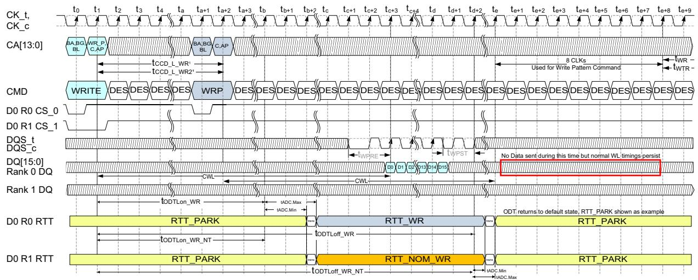  
NOTE 1 Refer to Table 262, Table 263 and Table 264 to determine if the timing parameter definition for WRITE to WRP is tCCD_L_WR or tCCD_L_WR2.

# 4.35 On-Die ECC

DDR5 devices shall implement internal Single Error Correction (SEC) ECC to improve the data integrity within the DRAM. The DRAM shall use 128 data bits to compute the ECC code of 8 ECC Check Bits.

For a x4 DDR5 device, internal prefetch for on-die ECC is 128 bits even though a x4 is a 64-bit prefetch device. For each read or write transaction in a x4 device, an additional section of the DRAM array is accessed internally to provide the required additional 64 bits used in the 128-bit ECC computation. In other words, in a x4 device, each 8-bit ECC Check Bit word is tied to two 64-bit sections of the DRAM. In the case of a x8 device, no extra prefetch is required, as the prefetch is the same as the external transfer size. For a x16 device, two 128-bit data words and their corresponding 8 check bits are fetched from different internal banks (same external bank address). Each 128 Data bits and the corresponding 8 check bits are checked separately and in parallel.

On reads, the DRAM corrects any single-bit errors before returning the data to the memory controller. The DRAM shall not write the corrected data back to the array during a read cycle.

On writes, the DRAM computes ECC and writes data and ECC bits to the array. If the external data transfer size is smaller than the 128 data bits code word (x4 devices), then DRAM will have to perform an internal 'read-modify-write' operation. The DRAM will correct any single-bit errors that result from the internal read before merging the incoming write data and then re-compute 8 ECC Check bits before writing data and ECC bits to the array. In the case of a x8 and x16 DDR5, no internal read is required.

For a x16 device, two 136-bit code words are read from two internal banks (same external bank address), one code word is mapped to DQ[0:7] and the other code word is mapped to DQ[8:15].

# 4.35.1 SEC Overview

The ECC blocks show in Figure 127 are the ECC Check Bit Generator, Syndrome Generator, Syndrome Decode and Correction. The Check Bit Generator and Syndrome Generator blocks are fully specified by the H matrix.

The Syndrome Decode block executes the following functions:

Zero Syndrome  $\Rightarrow$  No Error

Non-Zero Syndrome matches one of the columns of the H matrix  $=>$  Flip Corresponding bit

Non-Zero Syndrome that does not match any of the columns in the H matrix  $\Rightarrow$  DUE

DUE: Detected Uncorrected

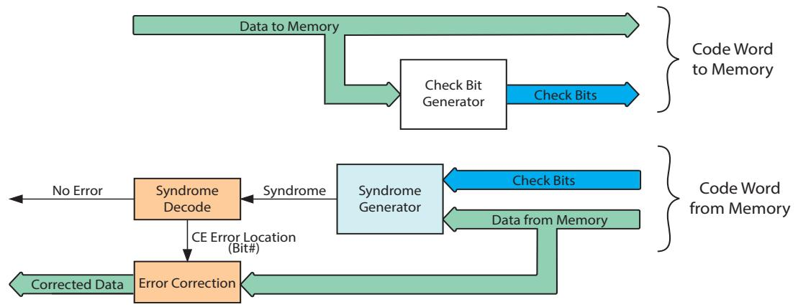  
Figure 127—On Die ECC Block Diagram

# 4.36 DDR5 ECC Transparency and Error Scrub

DDR5 ECC Transparency and Error Scrub incorporates an ECC Error Check and Scrub (ECS) mode with an error counting scheme for transparency. The ECS mode allows the DRAM to internally read, correct single bit errors, and write back corrected data bits to the array (scrub errors) while providing transparency to error counts. It is recommended that a full error scrub of the DRAM is performed a minimum of once every 24 hours.

There are two options for ECS mode, set via Mode Register. The Manual ECS mode (MR14:OP[7] = 1B) allows for ECS operations via the Multi-Purpose Command. The Automatic ECS mode (MR14:OP[7] = 0B, default setting) allows for the ECS to run internal to the DRAM.

The ECS feature is available on all device configurations.

ECS mode implements two counters to track ECC code word errors detected during operation: Error Counter (EC) and Errors per Row Counter (EpRC). The EC defaults to counting rows with errors; however, it may also be configured to count code words with errors. In row mode (default), the EC tracks the number of rows that have at least one code word error detected subject to a threshold filter. In the code word mode, the EC tracks the total number of code word errors, also subject to the threshold filter. The second counter, EpRC, tracks the error count of the row with the largest number of code word errors along with the address of that row. EpRC error reporting is also subject to a separate threshold filter. A general functional block diagram example of the ECS Mode operation is shown in Figure 128 while the ECC Error Checking and Scrub mode, Mode Register (MR14), is shown in Table 356.

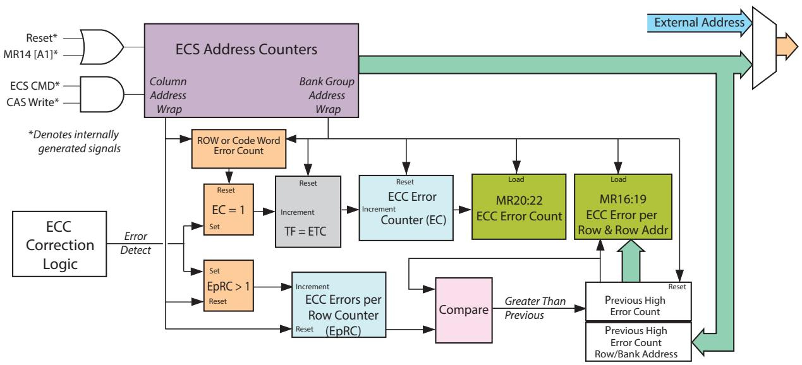  
Figure 128 — Example of an ECC Transparency and Error Scrub Functional Block Diagram

Table 356 - MR14 ECC Transparency and Error Scrub Mode Register Information  

<table><tr><td>OP[7]</td><td>OP[6]</td><td>OP[5]</td><td>OP[4]</td><td>OP[3]</td><td>OP[2]</td><td>OP[1]</td><td>OP[0]</td></tr><tr><td>ECS Mode</td><td>Reset ECS Counter</td><td>Row Mode/Code Word Mode</td><td>RFU</td><td>CID3</td><td>CID2</td><td>CID1</td><td>CID0</td></tr></table>

# 4.36.1 Mode Register and DRAM Initialization Prior to ECS Mode Operation

The ECC Transparency and Error Scrub counters are set to zero and the internal ECS Address Counters are initialized either by a RESET or by manually writing a 1 to MR14 OP[6]. If manual reset via mode register is utilized, mode register bit MR14 OP[6] shall be written back to a 0 before a subsequent reset can be applied.

ECS mode selections, MR15 OP[3], Automatic ECS in Self-Refresh, MR14 OP[7], Manual/Automatic ECS Mode, and MR14 OP[5], row/code word mode shall be programmed during DRAM initialization and shall not be changed once the first ECS operation occurs unless followed by issuing a RESET or setting MR14 OP[6] = 1B, otherwise an unknown operation could result during subsequent ECS operations.

Manual ECS mode is enabled by MR14 OP[7] = 1B. A manual ECS operation requires an MPC command with OP[7:0] = 0000 1100B.

The DRAM must have all array bits written to prior to executing ECS operations to avoid generating false failures.

# 4.36.2 ECS Operation

All banks shall be precharged and in an idle state prior to executing a manual ECS operation.

Executing a manual ECS operation, MPC command with  $\mathrm{OP}[7:0] = 00001100_{\mathrm{B}}$ , generates the following internally self-timed command sequence:  $\mathrm{ACT} \rightarrow \mathrm{RD} \rightarrow \mathrm{WR} \rightarrow \mathrm{PRE}$ . ECS operation timing is shown in Figure 129.

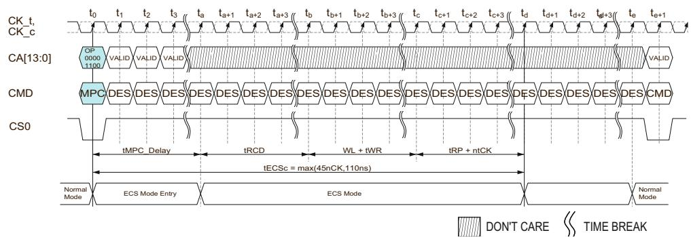  
Figure 129 - ECS Operation Timing Diagram

The minimum time for the ECS operation to execute is  $t_{\mathrm{ECSc}}$  ( $t_{\mathrm{MPC\_Delay}} + t_{\mathrm{RCD}} + \mathrm{WL} + t_{\mathrm{WR}} + t_{\mathrm{RP}} + nt_{\mathrm{CK}}$ ).  $nt_{\mathrm{CK}}$  is required to satisfy  $t_{\mathrm{ECSc}}$ .

Table 357 - ECS Operation Timing Parameter  

<table><tr><td>Parameter</td><td>Symbol</td><td>Min</td><td>Max</td><td>Unit</td><td>NOTE</td></tr><tr><td>ECS Operation time</td><td>tECSc</td><td>Max(176nCK, 110ns)</td><td>-</td><td>ns</td><td></td></tr></table>

Upon executing a manual ECS operation, DQ's will remain in RTT_PARK and DQS in DQS_RTT_PARK. The only commands allowed other than DES during  $t_{\mathrm{ECSc}}$  for a manual ECS operation are ODT NT commands, which may change the DQ and DQS termination state.

Any illegal usage of manual ECS mode (e.g., refresh or temperature violations) will result in operation not being guaranteed.

# 4.36.2 ECS Operation (Cont'd)

Executing a manual ECS operation by an MPC command with  $\mathrm{OP}[7:0] = 00001100_{\mathrm{B}}$  will issue an internally timed ACT command row activation based on the internal ECS Address Counters' row address,  $t_{\mathrm{MPC\_Delay}}$  after the MPC command. The ACT command is to be followed by a WR command  $t_{\mathrm{RCD}}$  later. The WR command will perform an internal Read-Modify-Write cycle on the code word determined by the internal ECS Address Counters' column address.

The internal Read-Modify-Write cycle will:

1 Read the entire code word (128 data bits and 8 check bits) from the array  
2 Correct a single bit error in the code word or check bits, if an error is detected  
3 Write the resultant code word back to the DRAM array

The WR command is followed by a PRE command  $\mathrm{WL} + t_{\mathrm{WR}}$  later. The PRE command will automatically re-enable the DRAM's I/Os and address inputs, and it will return the DRAM to idle mode  $t_{\mathrm{RP}} + nt_{\mathrm{CK}}$  later, after  $t_{\mathrm{ECSc}}$  is satisfied.

For each ECS operation, ECS Address Counters increment the column address after each internal ECS WR command such that the next code word and check bits are selected. Once the column counter wraps (all code words and check bits on the row have been accessed), the row counter will increment until all code words on each of the rows within a bank are accessed. When the row counter wraps (all rows within the bank have been accessed), the bank counter will increment and the next bank within a bank group will repeat the process of accessing each code word. When the bank counter wraps, the bank group counter will increment and the next bank group will repeat the process of accessing each code word, until all bank groups within the DRAM have been accessed.

After all the code words within the DRAM are read, corrected, and written once, the bank group counter will wrap and the process begins again with the next manual ECS operation. The total number of manual ECS operations required to complete one cycle of Error Check and Scrub is density and configuration dependent, as listed in Table 358. The DRAM controller shall track the number of manual ECS operations to complete a full scrub of that device.

Table 358 — Number of Code Words Per DRAM  

<table><tr><td>Configuration</td><td>8Gb</td><td>16Gb</td><td>24Gb</td><td>32Gb</td><td>64Gb</td></tr><tr><td>x4, x8, x16</td><td>2^26</td><td>2^27</td><td>2^27 * 1.5</td><td>2^28</td><td>2^29</td></tr></table>

In order to complete a full Error Check and Scrub within the recommended 24 hours, the average periodic interval per ECS operation ( $t_{\mathrm{ECSint}}$ ) is 86,400 seconds divided by the total number of manual ECS operations to complete one full cycle of ECS.  $t_{\mathrm{ECSint}}$  is included in Table 359.

Table 359 - Average Periodic ECS Interval (tECSint)  

<table><tr><td>Configuration</td><td>8Gb</td><td>16Gb</td><td>24Gb</td><td>32Gb</td><td>64Gb</td></tr><tr><td>x4, x8, x16</td><td>1.287mS</td><td>0.644mS</td><td>0.483mS</td><td>0.322mS</td><td>0.161mS</td></tr></table>

# 4.36.2 ECS Operation (Cont'd)

In order for the DDR5 SDRAM to perform automatic ECS operations when in Automatic ECS Mode, the host needs to issue periodic REFab commands or periodically enter Self Refresh mode. The maximum spacing between REFab commands or Self Refresh entry for the DRAM to complete the automatic scrub within the recommended 24 hours is  $t_{\mathrm{ECSint}}$ . Meeting this REFab/Self-Refresh requirement allows the DRAM to perform the automatic ECS operations without placing additional restrictions on refresh mode usage, i.e., all bank/same bank refresh or normal/FGR mode refresh, while in Automatic ECS mode.

REFab commands issued in excess of required by the DRAM for automatic ECS operations (one per  $t_{\mathrm{ECSint}}$ ) may be used by the DRAM for normal refresh operation. Issuing multiple REF commands shall not exceed the total number allowed within a 1 x  $t_{\mathrm{REFI}}$  window, as described in the Refresh Operation Scheduling Flexibility section of the spec.

When in Automatic ECS mode, the ECS commands and timing are generated and satisfied internal to the DRAM, following the Average Periodic ECS Interval timings to ensure that the Error Check and Scrub is completed and the transparency registers (MR16-20) are updated within the recommended 24-hour period.

The DRAM is required to perform automatic ECS operations while in Self Refresh mode if Automatic ECS is enabled by MR14 OP[7] = 0B or Automatic ECS in Self-Refresh is enabled by MR15 OP[3] = 1B, to meet the Average Periodic ECS Interval timings. However, some variation in the DRAM scrubbing rate may be encountered while in Self Refresh since the DRAM will need to sync the internal operations to an internal oscillator frequency. Entering and exiting Self Refresh will not reset the ECS transparency counters/registers. Interval timing for the maximum spacing between REFab commands or another Self Refresh entry is allowed to restart upon Self Refresh exit.ECS Threshold Filter

The ECC Transparency and Error Scrub scheme incorporates a user programmable ECS Threshold Filter that masks error counts less than the programmed filter value. The value is set using MR15 as listed in Table 360. The default MR15 setting is 256 fails per Gb of memory cells (OP[2:0] = 011B).

Table 360 — MR15 Transparency ECC Error Threshold Count per Gb of Memory Cells and Automatic ECS in Self-Refresh  

<table><tr><td>OP[7]</td><td>OP[6]</td><td>OP[5]</td><td>OP[4]</td><td>OP[3]</td><td>OP[2]</td><td>OP[1]</td><td>OP[0]</td></tr><tr><td colspan="4">RFU</td><td>Automatic ECS in Self-Refresh</td><td colspan="3">OP[2:0]: 000B = 4
OP[2:0]: 001B = 16
OP[2:0]: 010B = 64
OP[2:0]: 011B = 256 (Default)
OP[2:0]: 100B = 1024
OP[2:0]: 101B = 4096
OP[2:0]: 110B = RFU
OP[2:0]: 111B = RFU</td></tr></table>

Once the ECC Error Threshold Count (ETC) has been exceeded, the ECC Error Counter (EC) begins tracking. EC values are transferred to mode registers MR20 as described in Section 4.36.3. ECC Errors per Row Counter (EpRC) error information is transferred to mode registers MR16:19 as described in Section 4.36.3 once the ETC has been exceeded as well.

# 4.36.3 ECS Error Tracking

The type of error tracking provided by the ECC Transparency and Error Scrub is selectable using MR14 OP[5], which can track either the number of rows (default) or code words with errors using the Error Counter. The row or code word error count will be tracked and written to MR20 register. MR14 OP[5] is programmed during DRAM initialization and should not be changed once the first ECS command has been issued, otherwise an unknown operation could result. If MR14 OP[5] is changed without powering down, a MR14 OP[6] reset shall be issued prior to subsequent ECS commands to reinitialize the counters.

When the ECC row count mode is selected, the Error Counter (EC) increments each time a row with check bit errors is detected. After all rows, in all banks, in all bank groups have ECS operations performed, the result of the Error Counter is loaded into MR20, subject to error threshold reporting. The EC is reset after the value has been transferred to the mode register.

MR20 is shown in Table 361. EC[7:0] indicate error counts within a range. EC0 is set to “1” if  $\mathrm{EC0}_{\mathrm{min}}$  (the ETC set by MR15) has been reached, but the fail count is less than or equal to  $\mathrm{EC0}_{\mathrm{max}} = 2 * \mathrm{ETC} *$

Density(Gb) - 1. Likewise, the min values of EC[7:1] are defined as  $\mathrm{EC}[x]_{\mathrm{min}} = \mathrm{ETC} * \mathrm{Density}(\mathrm{Gb}) * 2^x$ , and max values are defined as  $\mathrm{EC}[x]_{\mathrm{max}} = 2 * (\mathrm{ETC} * \mathrm{Density}(\mathrm{Gb}) * 2^x) - 1$ . The exception is  $\mathrm{EC7}_{\mathrm{max}}$ , which is unlimited. The corresponding bit will be set if the error count is within the required range.

Table 361 - MR20 Number of Rows or Code Word Errors per DRAM Die  

<table><tr><td></td><td>OP[7]</td><td>OP[6]</td><td>OP[5]</td><td>OP[4]</td><td>OP[3]</td><td>OP[2]</td><td>OP[1]</td><td>OP[0]</td></tr><tr><td>MR20</td><td>EC7</td><td>EC6</td><td>EC5</td><td>EC4</td><td>EC3</td><td>EC2</td><td>EC1</td><td>EC0</td></tr></table>

When the ECC code word error count mode is selected, the Error Counter (EC) increments each time a code word with check bit errors is detected. After all code words, on all rows, in all banks, in all bank groups had ECS commands performed, the result of the Error Counter is loaded into MR20, subject to error threshold reporting. The EC is reset after the value has been transferred to the mode register.

The ECC Errors per Row Counter increments the number of code words errors on a given row, after more than one error on a given row is detected. The EpRC counter is reset with each column address wrap. Each row's code word error count is compared to the previous code word error count to determine the row address with the highest error count within the DRAM die. After reading all code words on a row, the number of errors counted is compared to the number of errors from the previous row. If the previous row error count is less than the present row error count, the present larger error count is saved to the Previous High Error Count register, its associated address is saved to the Previous High Error Count Row/Bank Address/Bank Group register, and the present row error counter is cleared. If the previous row error count is greater than the present row error count, the previous row error count and register value remains unchanged, however the present row error counter is cleared.

After all rows, in all banks, in all bank groups have executed ECS operations, the result of the Previous High Error Count (address and error count) are latched into MR16:19 when the bank group counter wraps. MR16:18 shown in Table contains the information for the row with the highest number of code word errors and is allocated as A[17:0] Row Address, BA[1:0] Bank Address, BG[2:0] Bank Group Address. MR19 shown in Table 362 contains the information for the Errors per Row Count (EpRC) for the number of code word errors on the highest failing row. REC[5:0] indicates error counts within a range. RECO is set to "1" if RECOmin (the RETC defined in Table 363) has been reached, but the fail count is less than or equal to RECOmax = 2 * RETC - 1. Likewise, the min values of REC[5:1] are defined as REC[x]min = RETC * 2x, and max values are defined as REC[x]max = 2 * (RETC * 2x) - 1. The exception is REC5max, which is unlimited. The corresponding bit will be set if the error count is within the required range.

# 4.36.3 ECS Error Tracking (Cont'd)

Table 362 - MR16-MR19 Address of Row with Max Errors and Error Count  

<table><tr><td></td><td>OP[7]</td><td>OP[6]</td><td>OP[5]</td><td>OP[4]</td><td>OP[3]</td><td>OP[2]</td><td>OP[1]</td><td>OP[0]</td></tr><tr><td>MR16</td><td>R7</td><td>R6</td><td>R5</td><td>R4</td><td>R3</td><td>R2</td><td>R1</td><td>R0</td></tr><tr><td>MR17</td><td>R15</td><td>R14</td><td>R13</td><td>R12</td><td>R11</td><td>R10</td><td>R9</td><td>R8</td></tr><tr><td>MR18</td><td>RFU</td><td>BG2</td><td>BG1</td><td>BG0</td><td>BA1</td><td>BA0</td><td>R17</td><td>R16</td></tr><tr><td>MR19</td><td>RFU</td><td>RFU</td><td>REC5</td><td>REC4</td><td>REC3</td><td>REC2</td><td>REC1</td><td>REC0</td></tr></table>

Table 363 - Row Error Threshold Count (RETC)  

<table><tr><td></td><td>Error Count</td></tr><tr><td>Row Error Threshold Count (RETC)</td><td>4</td></tr></table>

The error counters (ECC Error Counter and ECC Errors per Row Counter) reset each time the bank group counter wraps. This process will occur on the ECS operation following the ECS operation that processed the last row in the last bank in the last bank group. The MR16:20 are not cleared after being read from, they will retain the most recent written data until they are rewritten during a subsequent bank group wrap or reset by either issuing a RESET or setting MR14 OP[6] to a 1.

# 4.36.4 3DS Operation

The ECS feature supports 3DS stacking where the Chip ID, MR14 OP[3:0] (CID3:0 respectively), command bits steer the ECS command to the proper mode registers MR14-MR20 within the die stack. The CID[3:0] bits will be ignored for MRW commands to MR14 or MR15, resulting in identical transparency settings for all die in a 3DS stack. The CID[3:0] bits must be set for MRR commands to MR14-MR20 to read out the data from the target die in the 3DS stack. The CID[3:0] bits will also be used by the Manual ECS MPC command. For single die packages, the CID[3:0] bits should all be set to '0'.

Mode register configuration and readout of mode register data requires per DRAM addressing mode.

Broadcasting the Manual ECS MPC command to all die in the stack is not supported. The Manual ECS MPC command to command spacing requires waiting tECSc, even to different die in the stack. The only commands allowed during  $t_{\mathrm{ECSc}}$  for a manual ECS operation are ODT NT commands.

# 4.37 CRC

# 4.37.1 CRC Polynomial and Logic Equation

DDR5 supports CRC for write and read operations. Write and read CRC can be enabled by separate mode register bits. Write CRC and data mask functions are not supported at the same time and cannot be enabled together.

The CRC polynomial used by DDR5 is the ATM-8 HEC,  $\mathrm{X}^{\wedge}8 + \mathrm{X}^{\wedge}2 + \mathrm{X}^{\wedge}1 + 1$  that is same as used on DDR4.

A combinatorial logic block implementation of this 8-bit CRC for 64-bits of data contains TBD two-input XOR gates contained in eight 6 XOR gate deep trees.

Table 364 shows error detection coverage of DDR5 CRC.

Table 364 — Error Detection Details  

<table><tr><td>Error Type</td><td>Detection Capability</td></tr><tr><td>Random Single Bit Error</td><td>100%</td></tr><tr><td>Random Double Bit Error</td><td>100%</td></tr><tr><td>Random Odd Count Error</td><td>100%</td></tr><tr><td>Random Multi-Bit Error within Two adjacent Transfers</td><td>100%</td></tr></table>

CRC COMBINATORIAL LOGIC EQUATIONS

module CRC8 D64;

// polynomial: (0 1 2 8)

// data width: 64

// convention: the first serial data bit is D[63]

// initial condition all 0 implied

function [7:0]

nextCRC8 D64;

input [63:0] Data;

reg [63:0] D;

reg [7:0] NewCRC;

begin

D = Data

；

NewCRC[0] = D[63] ^ D[60] ^

D[56]  $\wedge$  D[54]  $\wedge$  D[53]  $\wedge$  D[52]  $\wedge$  D[50]  $\wedge$  D[49]  $\wedge$  D[48]  $\wedge$

D[45]  $\wedge$  D[43]  $\wedge$  D[40]  $\wedge$  D[39]  $\wedge$  D[35]  $\wedge$  D[34]  $\wedge$  D[31]  $\wedge$

D[30]  $\wedge$  D[28]  $\wedge$  D[23]  $\wedge$  D[21]  $\wedge$  D[19]  $\wedge$  D[18]  $\wedge$  D[16]  $\wedge$

D[14]  $\wedge$  D[12]  $\wedge$  D[8]  $\wedge$  D[7]  $\wedge$  D[6]  $\wedge$  D[0];

NewCRC[1] = D[63] ^ D[61] ^ D[60] ^ D[57] ^

D[56]  $\wedge$  D[55]  $\wedge$  D[52]  $\wedge$  D[51]  $\wedge$  D[48]  $\wedge$  D[46]  $\wedge$  D[45]  $\wedge$

D[44]  $\wedge$  D[43]  $\wedge$  D[41]  $\wedge$  D[39]  $\wedge$  D[36]  $\wedge$  D[34]  $\wedge$  D[32]  $\wedge$

D[30]  $\wedge$  D[29]  $\wedge$  D[28]  $\wedge$  D[24]  $\wedge$  D[23]  $\wedge$  D[22]  $\wedge$  D[21]  $\wedge$

D[20]  $\wedge$  D[18]  $\wedge$  D[17]  $\wedge$  D[16]  $\wedge$  D[15]  $\wedge$  D[14]  $\wedge$  D[13]  $\wedge$

D[12]  $\wedge$  D[9]  $\wedge$  D[6]  $\wedge$  D[1]  $\wedge$  D[0];

NewCRC[2] = D[63] ^ D[62] ^ D[61] ^ D[60] ^

D[58]  $\wedge$  D[57]  $\wedge$  D[54]  $\wedge$  D[50]  $\wedge$  D[48]  $\wedge$  D[47]  $\wedge$  D[46]  $\wedge$

D[44]  $\wedge$  D[43]  $\wedge$  D[42]  $\wedge$  D[39]  $\wedge$  D[37]  $\wedge$  D[34]  $\wedge$  D[33]  $\wedge$

D[29]  $\wedge$  D[28]  $\wedge$  D[25]  $\wedge$  D[24]  $\wedge$  D[22]  $\wedge$  D[17]  $\wedge$  D[15]  $\wedge$

D[13]  $\wedge$  D[12]  $\wedge$  D[10]  $\wedge$  D[8]  $\wedge$  D[6]  $\wedge$  D[2]  $\wedge$  D[1]  $\wedge$  D[0];

NewCRC[3] = D[63] ^ D[62] ^ D[61] ^ D[59] ^

D[58]  $\wedge$  D[55]  $\wedge$  D[51]  $\wedge$  D[49]  $\wedge$  D[48]  $\wedge$  D[47]  $\wedge$  D[45]  $\wedge$

4.37.1 CRC Polynomial and Logic Equation (Cont'd)  
```txt
$\mathrm{D}[44]\wedge \mathrm{D}[43]\wedge \mathrm{D}[40]\wedge \mathrm{D}[38]\wedge \mathrm{D}[35]\wedge \mathrm{D}[34]\wedge \mathrm{D}[30]\wedge$ $\mathrm{D}[29]\wedge \mathrm{D}[26]\wedge \mathrm{D}[25]\wedge \mathrm{D}[23]\wedge \mathrm{D}[18]\wedge \mathrm{D}[16]\wedge \mathrm{D}[14]\wedge$ $\mathrm{D}[13]\wedge \mathrm{D}[11]\wedge \mathrm{D}[9]\wedge \mathrm{D}[7]\wedge \mathrm{D}[3]\wedge \mathrm{D}[2]\wedge \mathrm{D}[1]$  . NewCRC[4]  $\equiv$  D[63]  $\wedge$  D[62]  $\wedge$  D[60]  $\wedge$ $\mathrm{D}[59]\wedge \mathrm{D}[56]\wedge \mathrm{D}[52]\wedge \mathrm{D}[50]\wedge \mathrm{D}[49]\wedge \mathrm{D}[48]\wedge \mathrm{D}[46]\wedge$ $\mathrm{D}[45]\wedge \mathrm{D}[44]\wedge \mathrm{D}[41]\wedge \mathrm{D}[39]\wedge \mathrm{D}[36]\wedge \mathrm{D}[35]\wedge \mathrm{D}[31]\wedge$ $\mathrm{D}[30]\wedge \mathrm{D}[27]\wedge \mathrm{D}[26]\wedge \mathrm{D}[24]\wedge \mathrm{D}[19]\wedge \mathrm{D}[17]\wedge \mathrm{D}[15]\wedge$ $\mathrm{D}[14]\wedge \mathrm{D}[12]\wedge \mathrm{D}[10]\wedge \mathrm{D}[8]\wedge \mathrm{D}[4]\wedge \mathrm{D}[3]\wedge \mathrm{D}[2]$  . NewCRC[5]  $\equiv$  D[63]  $\wedge$  D[61]  $\wedge$  D[60]  $\wedge$ $\mathrm{D}[57]\wedge \mathrm{D}[53]\wedge \mathrm{D}[51]\wedge \mathrm{D}[50]\wedge \mathrm{D}[49]\wedge \mathrm{D}[47]\wedge \mathrm{D}[46]\wedge$ $\mathrm{D}[45]\wedge \mathrm{D}[42]\wedge \mathrm{D}[40]\wedge \mathrm{D}[37]\wedge \mathrm{D}[36]\wedge \mathrm{D}[32]\wedge \mathrm{D}[31]\wedge$ $\mathrm{D}[28]\wedge \mathrm{D}[27]\wedge \mathrm{D}[25]\wedge \mathrm{D}[20]\wedge \mathrm{D}[18]\wedge \mathrm{D}[16]\wedge \mathrm{D}[15]\wedge$ $\mathrm{D}[13]\wedge \mathrm{D}[11]\wedge \mathrm{D}[9]\wedge \mathrm{D}[5]\wedge \mathrm{D}[4]\wedge \mathrm{D}[3]$  . NewCRC[6]  $\equiv$  D[62]  $\wedge$  D[61]  $\wedge$  D[58]  $\wedge$ $\mathrm{D}[54]\wedge \mathrm{D}[52]\wedge \mathrm{D}[51]\wedge \mathrm{D}[50]\wedge \mathrm{D}[48]\wedge \mathrm{D}[47]\wedge \mathrm{D}[46]\wedge$ $\mathrm{D}[43]\wedge \mathrm{D}[41]\wedge \mathrm{D}[38]\wedge \mathrm{D}[37]\wedge \mathrm{D}[33]\wedge \mathrm{D}[32]\wedge \mathrm{D}[29]\wedge$ $\mathrm{D}[28]\wedge \mathrm{D}[26]\wedge \mathrm{D}[21]\wedge \mathrm{D}[19]\wedge \mathrm{D}[17]\wedge \mathrm{D}[16]\wedge \mathrm{D}[14]\wedge$ $\mathrm{D}[12]\wedge \mathrm{D}[10]\wedge \mathrm{D}[6]\wedge \mathrm{D}[5]\wedge \mathrm{D}[4]$  . NewCRC[7]  $\equiv$  D[63]  $\wedge$  D[62]  $\wedge$  D[59]  $\wedge$ $\mathrm{D}[55]\wedge \mathrm{D}[53]\wedge \mathrm{D}[52]\wedge \mathrm{D}[51]\wedge \mathrm{D}[49]\wedge \mathrm{D}[48]\wedge \mathrm{D}[47]\wedge$ $\mathrm{D}[44]\wedge \mathrm{D}[42]\wedge \mathrm{D}[39]\wedge \mathrm{D}[38]\wedge \mathrm{D}[34]\wedge \mathrm{D}[33]\wedge \mathrm{D}[30]\wedge$ $\mathrm{D}[29]\wedge \mathrm{D}[27]\wedge \mathrm{D}[22]\wedge \mathrm{D}[20]\wedge \mathrm{D}[18]\wedge \mathrm{D}[17]\wedge \mathrm{D}[15]\wedge$ $\mathrm{D}[13]\wedge \mathrm{D}[11]\wedge \mathrm{D}[7]\wedge \mathrm{D}[6]\wedge \mathrm{D}[5]$  . nextCRC8_D64  $\equiv$  NewCRC;
```

# 4.37.2 CRC Data Bit Mapping for x4 Devices

Figure 130 shows detailed bit mapping for a x4 device. This bit mapping is common between write and read CRC operations.

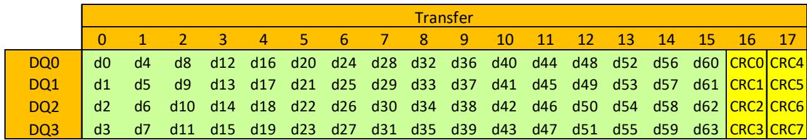  
Figure 130 — CRC Bit Mapping for x4 Device

# 4.37.3 CRC Data Bit Mapping for x8 Devices

Figure 131 shows detailed bit mapping for a x8 device. This bit mapping is common between write and read CRC operations. x8 devices have two DQ nibbles and each DQ nibble has its own eight CRC bits to protect 64 data bits. Therefore, a x8 device will have two identical CRC trees implemented.

<table><tr><td rowspan="2"></td><td colspan="19">Transfer</td></tr><tr><td>0</td><td>1</td><td>2</td><td>3</td><td>4</td><td>5</td><td>6</td><td>7</td><td>8</td><td>9</td><td>10</td><td>11</td><td>12</td><td>13</td><td>14</td><td>15</td><td>16</td><td>17</td><td></td></tr><tr><td>DQ0</td><td>d0</td><td>d4</td><td>d8</td><td>d12</td><td>d16</td><td>d20</td><td>d24</td><td>d28</td><td>d32</td><td>d36</td><td>d40</td><td>d44</td><td>d48</td><td>d52</td><td>d56</td><td>d60</td><td>CRC0</td><td>CRC4</td><td></td></tr><tr><td>DQ1</td><td>d1</td><td>d5</td><td>d9</td><td>d13</td><td>d17</td><td>d21</td><td>d25</td><td>d29</td><td>d33</td><td>d37</td><td>d41</td><td>d45</td><td>d49</td><td>d53</td><td>d57</td><td>d61</td><td>CRC1</td><td>CRC5</td><td></td></tr><tr><td>DQ2</td><td>d2</td><td>d6</td><td>d10</td><td>d14</td><td>d18</td><td>d22</td><td>d26</td><td>d30</td><td>d34</td><td>d38</td><td>d42</td><td>d46</td><td>d50</td><td>d54</td><td>d58</td><td>d62</td><td>CRC2</td><td>CRC6</td><td></td></tr><tr><td>DQ3</td><td>d3</td><td>d7</td><td>d11</td><td>d15</td><td>d19</td><td>d23</td><td>d27</td><td>d31</td><td>d35</td><td>d39</td><td>d43</td><td>d47</td><td>d51</td><td>d55</td><td>d59</td><td>d63</td><td>CRC3</td><td>CRC7</td><td></td></tr><tr><td>DQ4</td><td>d0</td><td>d4</td><td>d8</td><td>d12</td><td>d16</td><td>d20</td><td>d24</td><td>d28</td><td>d32</td><td>d36</td><td>d40</td><td>d44</td><td>d48</td><td>d52</td><td>d56</td><td>d60</td><td>CRC0</td><td>CRC4</td><td></td></tr><tr><td>DQ5</td><td>d1</td><td>d5</td><td>d9</td><td>d13</td><td>d17</td><td>d21</td><td>d25</td><td>d29</td><td>d33</td><td>d37</td><td>d41</td><td>d45</td><td>d49</td><td>d53</td><td>d57</td><td>d61</td><td>CRC1</td><td>CRC5</td><td></td></tr><tr><td>DQ6</td><td>d2</td><td>d6</td><td>d10</td><td>d14</td><td>d18</td><td>d22</td><td>d26</td><td>d30</td><td>d34</td><td>d38</td><td>d42</td><td>d46</td><td>d50</td><td>d54</td><td>d58</td><td>d62</td><td>CRC2</td><td>CRC6</td><td></td></tr><tr><td>DQ7</td><td>d3</td><td>d7</td><td>d11</td><td>d15</td><td>d19</td><td>d23</td><td>d27</td><td>d31</td><td>d35</td><td>d39</td><td>d43</td><td>d47</td><td>d51</td><td>d55</td><td>d59</td><td>d63</td><td>CRC3</td><td>CRC7</td><td></td></tr></table>

Figure 131 — CRC Bit Mapping for x8 Device

# 4.37.4 CRC Data Bit Mapping for x16 Devices

Figure 132 shows detailed bit mapping for a x16 device. This bit mapping is common between write and read CRC operations. x16 devices have four DQ nibbles and each DQ nibble has its own eight CRC bits to protect 64 data bits. Therefore, a x16 device will have four identical CRC trees implemented.

<table><tr><td rowspan="2"></td><td colspan="18">Transfer</td></tr><tr><td>0</td><td>1</td><td>2</td><td>3</td><td>4</td><td>5</td><td>6</td><td>7</td><td>8</td><td>9</td><td>10</td><td>11</td><td>12</td><td>13</td><td>14</td><td>15</td><td>16</td><td>17</td></tr><tr><td>DQ0</td><td>d0</td><td>d4</td><td>d8</td><td>d12</td><td>d16</td><td>d20</td><td>d24</td><td>d28</td><td>d32</td><td>d36</td><td>d40</td><td>d44</td><td>d48</td><td>d52</td><td>d56</td><td>d60</td><td>CRC0</td><td>CRC4</td></tr><tr><td>DQ1</td><td>d1</td><td>d5</td><td>d9</td><td>d13</td><td>d17</td><td>d21</td><td>d25</td><td>d29</td><td>d33</td><td>d37</td><td>d41</td><td>d45</td><td>d49</td><td>d53</td><td>d57</td><td>d61</td><td>CRC1</td><td>CRC5</td></tr><tr><td>DQ2</td><td>d2</td><td>d6</td><td>d10</td><td>d14</td><td>d18</td><td>d22</td><td>d26</td><td>d30</td><td>d34</td><td>d38</td><td>d42</td><td>d46</td><td>d50</td><td>d54</td><td>d58</td><td>d62</td><td>CRC2</td><td>CRC6</td></tr><tr><td>DQ3</td><td>d3</td><td>d7</td><td>d11</td><td>d15</td><td>d19</td><td>d23</td><td>d27</td><td>d31</td><td>d35</td><td>d39</td><td>d43</td><td>d47</td><td>d51</td><td>d55</td><td>d59</td><td>d63</td><td>CRC3</td><td>CRC7</td></tr><tr><td>DQ4</td><td>d0</td><td>d4</td><td>d8</td><td>d12</td><td>d16</td><td>d20</td><td>d24</td><td>d28</td><td>d32</td><td>d36</td><td>d40</td><td>d44</td><td>d48</td><td>d52</td><td>d56</td><td>d60</td><td>CRC0</td><td>CRC4</td></tr><tr><td>DQ5</td><td>d1</td><td>d5</td><td>d9</td><td>d13</td><td>d17</td><td>d21</td><td>d25</td><td>d29</td><td>d33</td><td>d37</td><td>d41</td><td>d45</td><td>d49</td><td>d53</td><td>d57</td><td>d61</td><td>CRC1</td><td>CRC5</td></tr><tr><td>DQ6</td><td>d2</td><td>d6</td><td>d10</td><td>d14</td><td>d18</td><td>d22</td><td>d26</td><td>d30</td><td>d34</td><td>d38</td><td>d42</td><td>d46</td><td>d50</td><td>d54</td><td>d58</td><td>d62</td><td>CRC2</td><td>CRC6</td></tr><tr><td>DQ7</td><td>d3</td><td>d7</td><td>d11</td><td>d15</td><td>d19</td><td>d23</td><td>d27</td><td>d31</td><td>d35</td><td>d39</td><td>d43</td><td>d47</td><td>d51</td><td>d55</td><td>d59</td><td>d63</td><td>CRC3</td><td>CRC7</td></tr><tr><td>DQ8</td><td>d0</td><td>d4</td><td>d8</td><td>d12</td><td>d16</td><td>d20</td><td>d24</td><td>d28</td><td>d32</td><td>d36</td><td>d40</td><td>d44</td><td>d48</td><td>d52</td><td>d56</td><td>d60</td><td>CRC0</td><td>CRC4</td></tr><tr><td>DQ9</td><td>d1</td><td>d5</td><td>d9</td><td>d13</td><td>d17</td><td>d21</td><td>d25</td><td>d29</td><td>d33</td><td>d37</td><td>d41</td><td>d45</td><td>d49</td><td>d53</td><td>d57</td><td>d61</td><td>CRC1</td><td>CRC5</td></tr><tr><td>DQ10</td><td>d2</td><td>d6</td><td>d10</td><td>d14</td><td>d18</td><td>d22</td><td>d26</td><td>d30</td><td>d34</td><td>d38</td><td>d42</td><td>d46</td><td>d50</td><td>d54</td><td>d58</td><td>d62</td><td>CRC2</td><td>CRC6</td></tr><tr><td>DQ11</td><td>d3</td><td>d7</td><td>d11</td><td>d15</td><td>d19</td><td>d23</td><td>d27</td><td>d31</td><td>d35</td><td>d39</td><td>d43</td><td>d47</td><td>d51</td><td>d55</td><td>d59</td><td>d63</td><td>CRC3</td><td>CRC7</td></tr><tr><td>DQ12</td><td>d0</td><td>d4</td><td>d8</td><td>d12</td><td>d16</td><td>d20</td><td>d24</td><td>d28</td><td>d32</td><td>d36</td><td>d40</td><td>d44</td><td>d48</td><td>d52</td><td>d56</td><td>d60</td><td>CRC0</td><td>CRC4</td></tr><tr><td>DQ13</td><td>d1</td><td>d5</td><td>d9</td><td>d13</td><td>d17</td><td>d21</td><td>d25</td><td>d29</td><td>d33</td><td>d37</td><td>d41</td><td>d45</td><td>d49</td><td>d53</td><td>d57</td><td>d61</td><td>CRC1</td><td>CRC5</td></tr><tr><td>DQ14</td><td>d2</td><td>d6</td><td>d10</td><td>d14</td><td>d18</td><td>d22</td><td>d26</td><td>d30</td><td>d34</td><td>d38</td><td>d42</td><td>d46</td><td>d50</td><td>d54</td><td>d58</td><td>d62</td><td>CRC2</td><td>CRC6</td></tr><tr><td>DQ15</td><td>d3</td><td>d7</td><td>d11</td><td>d15</td><td>d19</td><td>d23</td><td>d27</td><td>d31</td><td>d35</td><td>d39</td><td>d43</td><td>d47</td><td>d51</td><td>d55</td><td>d59</td><td>d63</td><td>CRC3</td><td>CRC7</td></tr></table>

Figure 132 — CRC Bit Mapping for x16 Device

# 4.37.5 Write CRC for x4, x8 and x16 Devices

The controller generates the CRC checksum and forms the write data frames as shown in Section 4.37.2 to Section 4.37.4.

Write CRC function can be enabled or disabled per each nibble independently in x8 device. There are two separate write CRC enable MR bits (for upper and lower nibbles) defined for x8. When at least one of two write CRC enable bits is set to '1' in x8, the timings of write CRC enable mode is applied to the entire device (i.e., both nibbles). When write CRC is enable in one nibble and disabled in the other nibble in x8, then the DRAM does not check CRC errors on the disabled nibble, and hence the ALERT_n signal and any internal status bit related to CRC error is not impacted by the disabled nibble.

In case of x4 or x16, only one of two write CRC enable bit is used as defined in the MR table (Figure TBD). The unused write CRC enable bit is don't care in x4 and x16, i.e., MR50 OP[2] is set to low for x4 and x16 devices.

The DRAM checks for an error in received code words per each write CRC enabled nibble by comparing the received checksum against the computed checksum and reports errors using the ALERT_n signal if there is a mismatch in any of nibbles.

DRAM can write data to the DRAM core without waiting for CRC check for full writes. If bad data is written to the DRAM core then controller will retry the transaction and overwrite the bad data. Controller is responsible for data coherency.

There is no write latency adder when write CRC is enabled.

# 4.37.6 Write CRC Auto-Disable

Write CRC auto-enable mode is enabled by programming the Write CRC auto-enable mode enable bit MR50:OP[4] to '1'. When this mode is enabled, the DDR5 SDRAM counts the number of Write CRC error occurrences per device, regardless of configuration (x4, x8 or x16). When the number of Write CRC errors exceeds the Write CRC Auto-Disable Threshold (between 0 and 127) as programmed in MR51:OP[6:0], the DDR5 SDRAM disables Write CRC error checking of all nibbles and sets the Write CRC auto-enable status bit MR50:OP[5] to '1'. To exceed the Write CRC Auto-Disable Threshold, the number of Write CRC errors must occur within the Write CRC Auto-Disable Window described herein.

Unless the Write CRC auto-enable status bit is set, the Write CRC error counter is reset after the predetermined number of writes between 0 and 127, where 0 means an infinite window, as programmed in MR52:OP[6:0], so that the Write CRC error count will accumulate during each Write CRC Auto-Disable Window. Once the Write CRC auto-enable status bit is set, the write CRC error checking is not re-enabled at the end of the Write CRC Auto-Disable Window, even though the Write CRC error counter is reset below the threshold value.

Write CRC error checking can be re-enabled by resetting the Write CRC auto-enable status bit MR50:OP[5] to '0'. This will reset the Write CRC error counter and restart the Write CRC Auto-Disable Window.

Prior to changing the Write CRC Auto-Disable Threshold as programmed in MR51:OP[6:0] or the Write CRC Auto-Disable Window as programmed in MR52:OP[6:0], the host shall disable the Write CRC Auto-Disable mode, MR50:OP[4]=0. Once the updated values have been programmed in MR51 and/or MR52, Write CRC Auto-Disable mode can be (re)enabled, MR50:OP[4]=1. Disabling the Write CRC Auto-Disable mode, if enabled, will reset the DRAM's Write CRC error counter and restart the Write CRC Auto-Disable Window. However, if the Write CRC auto-disabled status bit had previously been set to '1', MR50:OP[5]=1, the host is required to set MR50:OP[5]=0 to resume error counting.

Changes to the Write CRC auto-enable threshold (MR51) and window (MR52) settings are only allowed when the CRC Write auto-enable mode is disabled (MR50[4]=0).

If the CRC auto disable threshold is reached and the DDR5 SDRAM was already driving ALERT_n to low due to the current or a previous Write CRC error, then ALERT_n may be released upon satisfying CRC_ALERT_PW_min.

When Write CRC auto disable mode is disabled, MR50:OP[4] = 0, Write CRC error counters may remain at reset values even if Write CRC errors occur.

# 4.37.7 Read CRC for x4, x8 and x16 Devices

The DDR5 SDRAM generates the CRC checksum and forms the read data frames as shown in Section 4.37.2 to Section 4.37.4. The controller can check for an error in received code words per nibble by comparing the received checksum against the computed checksum and if there is a mismatch in any of nibbles then controller may retry the transaction.

Read latency adder when read CRC is enabled depends on data rate as shown in Table 365.

Table 365 - Read CRC Latency Adder  

<table><tr><td>Data Rate (MT/s)</td><td>Read CRC Latency Adder (nCK)</td></tr><tr><td>2000 ≤ Data Rate ≤ 2100</td><td>0</td></tr><tr><td>3200 MT/s ≤ Data Rate ≤ 6000 MT/s</td><td>0</td></tr><tr><td>6000 MT/s &lt; Data Rate ≤ 6400 MT/s</td><td>2</td></tr><tr><td>6800 MT/s &lt; Data Rate ≤ 8400 MT/s</td><td>4</td></tr></table>

# 4.37.8 CRC Burst Order

When Write CRC is enabled, the CRC bits are calculated based on the sequential burst address order of the write data for the Write command. This sequential order is '0,1,2,3,4,5,6,7,8,9,A,B,C,D,E,F' in BL16, and '0,1,2,3,4,5,6,7,T,T,T,T,T,T,T' or '8,9,A,B,C,D,E,F,T,T,T,T,T,T,T,T' in BC8 OTF.

When Read CRC is enabled, the DDR5 SDRAM's CRC generator overrides the CA burst order bits C3 and C2 to '00', and CRC bits are calculated based on the sequential burst address order of the read data for the Read command. This sequential order is '0,1,2,3,4,5,6,7,8,9,A,B,C,D,E,F' in BL16, and

'0,1,2,3,4,5,6,7,T,T,T,T,T,T,T' or 'T,T,T,T,T,T,T,T,8,9,A,B,C,D,E,F' in BC8 OTF. The override values do not modify the actual data burst ordering, and are only used for the CRC calculations. Actual data burst follows the burst order as indicated by C3 and C2 in the Read command.

# 4.37.9 Write CRC Error Handling

When DRAM detects CRC error on received code words in any of nibbles, then it drives ALERT_n signal to '0' for TBD clocks.

The latency to ALERT_n signal is defined as tCRC_ALERT in Figure 133.

DRAM will set Write CRC Error Status bit in A[3] of MR50 to '1' upon detecting a CRC error. The Write CRC Error Status bit remains Group At '1' until the host clears it explicitly using an MRW command.

The controller upon seeing an error as a pulse width will retry the write transactions. The controller understands the worst-case delay for ALERT_n (during init) and can back up the transactions accordingly or the controller can be made more intelligent and try to correlate the write CRC error to a specific rank or a transaction. The controller is also responsible for opening any pages and ensuring that retrying of writes is done in a coherent fashion.

The pulse width may be seen longer than TBD clocks at the controller if there are multiple CRC errors as the ALERT_n is a daisy chain bus.

# 4.37.9 Write CRC Error Handling (Cont'd)

Figure 133 — CRC Error Reporting Timing diagram  
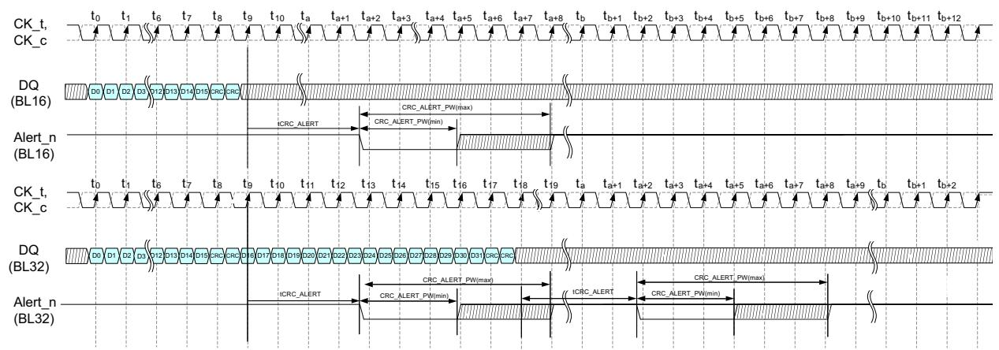  
NOTE 1 CRCAlertPW is specified from the point where the DRAM starts to drive the signal low to the point where the DRAM driver releases and the controller starts to pull the signal up.  
NOTE 2 Timing diagram applies to x4, x8 and x16 devices.

Table 366 — CRC Error Handling Timing Parameters  

<table><tr><td>Symbol</td><td>Description</td><td>min</td><td>max</td><td>unit</td></tr><tr><td>tCRC_ALERT</td><td>CRC Alert Delay Time</td><td>3</td><td>13</td><td>ns</td></tr><tr><td>CRC_ALERT_PW</td><td>CRC Alert Pulse Width</td><td>12</td><td>20</td><td>nCK</td></tr></table>

# 4.37.10 CRC Bit Mapping in BC8 Mode

CRC bits are always transferred on 17th and 18th UI, in BC8 mode. When read CRC is enabled during BC8 read, DQ bits are driven high and DQS is toggled by DRAM during the chopped data bursts. When write CRC is enabled during BC8 write, DQ bits must be driven high and DQS must be toggled by controller during the chopped data bursts. In BC8 mode, read CRC and write CRC bits are calculated with the inputs to the CRC engine for the chopped data bursts replaced by all '1's.

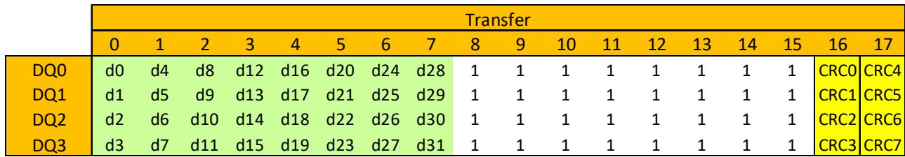  
Figure 134 — CRC Bit Mapping in BC8 Modes for x4 Device

<table><tr><td rowspan="2"></td><td colspan="18">Transfer</td></tr><tr><td>0</td><td>1</td><td>2</td><td>3</td><td>4</td><td>5</td><td>6</td><td>7</td><td>8</td><td>9</td><td>10</td><td>11</td><td>12</td><td>13</td><td>14</td><td>15</td><td>16</td><td>17</td></tr><tr><td>DQ0</td><td>d0</td><td>d4</td><td>d8</td><td>d12</td><td>d16</td><td>d20</td><td>d24</td><td>d28</td><td>1</td><td>1</td><td>1</td><td>1</td><td>1</td><td>1</td><td>1</td><td>1</td><td>CRC0</td><td>CRC4</td></tr><tr><td>DQ1</td><td>d1</td><td>d5</td><td>d9</td><td>d13</td><td>d17</td><td>d21</td><td>d25</td><td>d29</td><td>1</td><td>1</td><td>1</td><td>1</td><td>1</td><td>1</td><td>1</td><td>1</td><td>CRC1</td><td>CRC5</td></tr><tr><td>DQ2</td><td>d2</td><td>d6</td><td>d10</td><td>d14</td><td>d18</td><td>d22</td><td>d26</td><td>d30</td><td>1</td><td>1</td><td>1</td><td>1</td><td>1</td><td>1</td><td>1</td><td>1</td><td>CRC2</td><td>CRC6</td></tr><tr><td>DQ3</td><td>d3</td><td>d7</td><td>d11</td><td>d15</td><td>d19</td><td>d23</td><td>d27</td><td>d31</td><td>1</td><td>1</td><td>1</td><td>1</td><td>1</td><td>1</td><td>1</td><td>1</td><td>CRC3</td><td>CRC7</td></tr><tr><td>DQ4</td><td>d0</td><td>d4</td><td>d8</td><td>d12</td><td>d16</td><td>d20</td><td>d24</td><td>d28</td><td>1</td><td>1</td><td>1</td><td>1</td><td>1</td><td>1</td><td>1</td><td>1</td><td>CRC0</td><td>CRC4</td></tr><tr><td>DQ5</td><td>d1</td><td>d5</td><td>d9</td><td>d13</td><td>d17</td><td>d21</td><td>d25</td><td>d29</td><td>1</td><td>1</td><td>1</td><td>1</td><td>1</td><td>1</td><td>1</td><td>1</td><td>CRC1</td><td>CRC5</td></tr><tr><td>DQ6</td><td>d2</td><td>d6</td><td>d10</td><td>d14</td><td>d18</td><td>d22</td><td>d26</td><td>d30</td><td>1</td><td>1</td><td>1</td><td>1</td><td>1</td><td>1</td><td>1</td><td>1</td><td>CRC2</td><td>CRC6</td></tr><tr><td>DQ7</td><td>d3</td><td>d7</td><td>d11</td><td>d15</td><td>d19</td><td>d23</td><td>d27</td><td>d31</td><td>1</td><td>1</td><td>1</td><td>1</td><td>1</td><td>1</td><td>1</td><td>1</td><td>CRC3</td><td>CRC7</td></tr></table>

Figure 135 — CRC Bit Mapping in BC8 Modes for x8 Device  

<table><tr><td rowspan="2"></td><td colspan="17">Transfer</td><td></td></tr><tr><td>0</td><td>1</td><td>2</td><td>3</td><td>4</td><td>5</td><td>6</td><td>7</td><td>8</td><td>9</td><td>10</td><td>11</td><td>12</td><td>13</td><td>14</td><td>15</td><td>16</td><td>17</td></tr><tr><td>DQ0</td><td>d0</td><td>d4</td><td>d8</td><td>d12</td><td>d16</td><td>d20</td><td>d24</td><td>d28</td><td>1</td><td>1</td><td>1</td><td>1</td><td>1</td><td>1</td><td>1</td><td>1</td><td>CRC0</td><td>CRC4</td></tr><tr><td>DQ1</td><td>d1</td><td>d5</td><td>d9</td><td>d13</td><td>d17</td><td>d21</td><td>d25</td><td>d29</td><td>1</td><td>1</td><td>1</td><td>1</td><td>1</td><td>1</td><td>1</td><td>1</td><td>CRC1</td><td>CRC5</td></tr><tr><td>DQ2</td><td>d2</td><td>d6</td><td>d10</td><td>d14</td><td>d18</td><td>d22</td><td>d26</td><td>d30</td><td>1</td><td>1</td><td>1</td><td>1</td><td>1</td><td>1</td><td>1</td><td>1</td><td>CRC2</td><td>CRC6</td></tr><tr><td>DQ3</td><td>d3</td><td>d7</td><td>d11</td><td>d15</td><td>d19</td><td>d23</td><td>d27</td><td>d31</td><td>1</td><td>1</td><td>1</td><td>1</td><td>1</td><td>1</td><td>1</td><td>1</td><td>CRC3</td><td>CRC7</td></tr><tr><td>DQ4</td><td>d0</td><td>d4</td><td>d8</td><td>d12</td><td>d16</td><td>d20</td><td>d24</td><td>d28</td><td>1</td><td>1</td><td>1</td><td>1</td><td>1</td><td>1</td><td>1</td><td>1</td><td>CRC0</td><td>CRC4</td></tr><tr><td>DQ5</td><td>d1</td><td>d5</td><td>d9</td><td>d13</td><td>d17</td><td>d21</td><td>d25</td><td>d29</td><td>1</td><td>1</td><td>1</td><td>1</td><td>1</td><td>1</td><td>1</td><td>1</td><td>CRC1</td><td>CRC5</td></tr><tr><td>DQ6</td><td>d2</td><td>d6</td><td>d10</td><td>d14</td><td>d18</td><td>d22</td><td>d26</td><td>d30</td><td>1</td><td>1</td><td>1</td><td>1</td><td>1</td><td>1</td><td>1</td><td>1</td><td>CRC2</td><td>CRC6</td></tr><tr><td>DQ7</td><td>d3</td><td>d7</td><td>d11</td><td>d15</td><td>d19</td><td>d23</td><td>d27</td><td>d31</td><td>1</td><td>1</td><td>1</td><td>1</td><td>1</td><td>1</td><td>1</td><td>1</td><td>CRC3</td><td>CRC7</td></tr><tr><td>DQ8</td><td>d0</td><td>d4</td><td>d8</td><td>d12</td><td>d16</td><td>d20</td><td>d24</td><td>d28</td><td>1</td><td>1</td><td>1</td><td>1</td><td>1</td><td>1</td><td>1</td><td>1</td><td>CRC0</td><td>CRC4</td></tr><tr><td>DQ9</td><td>d1</td><td>d5</td><td>d9</td><td>d13</td><td>d17</td><td>d21</td><td>d25</td><td>d29</td><td>1</td><td>1</td><td>1</td><td>1</td><td>1</td><td>1</td><td>1</td><td>1</td><td>CRC1</td><td>CRC5</td></tr><tr><td>DQ10</td><td>d2</td><td>d6</td><td>d10</td><td>d14</td><td>d18</td><td>d22</td><td>d26</td><td>d30</td><td>1</td><td>1</td><td>1</td><td>1</td><td>1</td><td>1</td><td>1</td><td>1</td><td>CRC2</td><td>CRC6</td></tr><tr><td>DQ11</td><td>d3</td><td>d7</td><td>d11</td><td>d15</td><td>d19</td><td>d23</td><td>d27</td><td>d31</td><td>1</td><td>1</td><td>1</td><td>1</td><td>1</td><td>1</td><td>1</td><td>1</td><td>CRC3</td><td>CRC7</td></tr><tr><td>DQ12</td><td>d0</td><td>d4</td><td>d8</td><td>d12</td><td>d16</td><td>d20</td><td>d24</td><td>d28</td><td>1</td><td>1</td><td>1</td><td>1</td><td>1</td><td>1</td><td>1</td><td>1</td><td>CRC0</td><td>CRC4</td></tr><tr><td>DQ13</td><td>d1</td><td>d5</td><td>d9</td><td>d13</td><td>d17</td><td>d21</td><td>d25</td><td>d29</td><td>1</td><td>1</td><td>1</td><td>1</td><td>1</td><td>1</td><td>1</td><td>1</td><td>CRC1</td><td>CRC5</td></tr><tr><td>DQ14</td><td>d2</td><td>d6</td><td>d10</td><td>d14</td><td>d18</td><td>d22</td><td>d26</td><td>d30</td><td>1</td><td>1</td><td>1</td><td>1</td><td>1</td><td>1</td><td>1</td><td>1</td><td>CRC2</td><td>CRC6</td></tr><tr><td>DQ15</td><td>d3</td><td>d7</td><td>d11</td><td>d15</td><td>d19</td><td>d23</td><td>d27</td><td>d31</td><td>1</td><td>1</td><td>1</td><td>1</td><td>1</td><td>1</td><td>1</td><td>1</td><td>CRC3</td><td>CRC7</td></tr></table>

Figure 136 — CRC Bit Mapping in BC8 Modes for x16 Device

# 4.37.11 CRC Bit Mapping in BL32 Mode

In BL32 mode, CRC bits are separately calculated for the first half and the second half of the data. CRC bits for the first half of the data are transferred on 17th and 18th UI, and CRC bits for the second half of the data are transferred on 35th and 36th UI.

# 4.38 Loopback

With Loopback, DDR5 can feed a received signal or data back out to an external receiver for multiple purposes. Loopback allows the host (memory controller or test instrument) to monitor data that was just sent to the DRAM without having to store the data in the DRAM or use READ operations to retrieve data sent to the DRAM. Loopback in DDR5 DRAM requires that the data be sent to the Loopback path before sending it to the core so no READ/WRITE commands are required for Loopback to be operational. There are also inherent limitations when characterizing the receiver using statistical analysis methods such as Bit Error Rate (BER) analysis. At BER=1E $^{-16}$ , for example, (1) there is not enough memory depth in the DRAM to store all the 1E $^{+16}$  data; (2) the amount of time to perform multiple WRITE/READ commands to/from the memory is prohibitively long; (3) since the amount of time involved performing these operations is much longer than the DRAM refresh rate interval, the host or memory controller must also manage Refreshes during testing to ensure data retention; and (4) limited pattern depth means limited Inter Symbol Interference (ISI) and limited Random Jitter (Rj), and, therefore, limited errors at the receiver. Use of the Loopback feature is a necessity for characterizing the receiver without the limitations and complexities of other traditional validation methods. Loopback can also be used during "normal" operation, i.e., during training and when an operating system is loaded.

# 4.38.1 Loopback Output Definition

The Loopback requires two output pins (one single-ended Loopback strobe LBDQS and one single-ended Loopback data LBDQ). Pin assignment location for Loopback pins are defined as A9 for LBDQS and A1 for LBDQ.

The default RTT state for Loopback is RTT_OFF, designated by MR36:OP[2:0] = 000B. In this state, both the LBDQS and LBDQ outputs are disabled. If the Loopback pins of several DDR5 SDRAM devices are connected together and the "end" device needs termination, there is an RZQ/5 (48ohms) option available by setting MR36:OP[2:0] = 101B.

Selecting a Loopback Select Phase A(MR53:OP[6:5] = 00B) and Output value via MR53:OP[4:0] other than the default, Loopback Disabled(MR53:OP[4:0] = 00000B), will result in the LBDQS and LBDQ pins to transition from the RTT_OFF to a DRAM Drive State.

Before changing the Loopback Output Select from upper byte to lower byte or vice versa, host shall set Loopback Output Select to MR53:OP[4:0]=00000 $_\mathrm{B}$  to make Loopback mode be Disabled.

The LBDQS output will transition with the differential input crossing point of DQS_t/DQS_c for x4 and x8 device configurations, plus latency. LBDQS will transition with DQSL_t/DQSL_c for x16 devices if DML or a DQL is selected for output, or with DQSU_t/DQSU_c for x16 devices if DMU or a DQU is selected for output. If an RFU output is selected, or if DMU or a DQU is selected on a x4 or x8 device where DQSU_t/DQSU_c are not valid, LBDQS will remain in a DRAM Drive State.

The LBDQ output will transition with the receiver data state of the DM or DQ pin selected by MR53:OP[4:0]. If an RFU output is selected, or if an invalid output for device configuration is selected, the LBDQ output will remain in a DRAM Drive State.

Table 367 — Loopback Output Definition  

<table><tr><td>Condition</td><td>LBDQS</td><td>LBDQ</td><td>NOTE</td></tr><tr><td>Loopback Disabled</td><td>RTT_Loopback</td><td>RTT_Loopback</td><td></td></tr><tr><td>Loopback Enabled</td><td>Selected Phase</td><td>Selected Phase and Selected DQ</td><td>1</td></tr><tr><td colspan="4">NOTE 1 Selection of an unsupported DM/DQ for the device configuration will result in undefined LBDQS/LBDQ output.</td></tr></table>

# 4.38.2 Loopback Phase

Due to the high data rates of the DDR5 SDRAM, Loopback may be implemented with 2-way or 4-way interleaved outputs. With a 2-way implementation, the DQS and selected DM/DQ will be sampled and output every 1 CK or 2 UI. Similarly, with a 4-way implementation, the DQS and selected DM/DQ will be sampled and output every 2 CK or 4 UI.

To be able to sample all bits with a 2-way or 4-way interleave implementation, the Loopback Select Phase programmed in MR53:OP[6:5] allow selection of the DQS/DM/DQ phase to be output. In 2-way mode, Phase A and Phase B are valid options. In 4-way mode, Phase A, Phase B, Phase C and Phase D, are valid options.

Figure 137 shows an example of a Loopback implementation for 4-way interleave x4 DRAM. This example requires a divided clock to produce DQS_0, DQS_90, DQS_180 and DQS_270. Phase A through D refers to the 4-bit naturally aligned bits in a data stream. The output of the DQ slicer runs at 1/4 the speed as received data. In a 4-way interleave design, the data is received at full speed, but internally the data is latched only at quarter speed. For example, if the input bit stream consists of A, B, C, D, then the multiplexer input "A" receives data bit A and strobe DQS_0; multiplexer input "B" receives data bit B and strobe DQS_90; multiplexer input "C" receives data bit C and strobe DQS_180; and multiplexer input "D" receives data bit D and DQS_270.

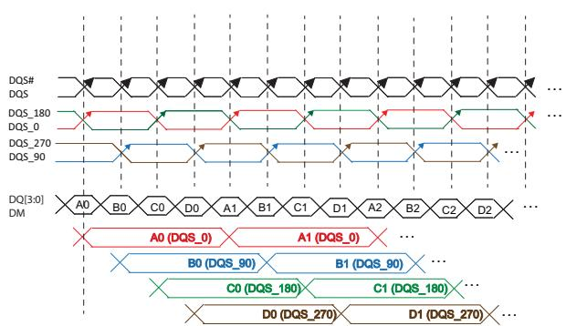  
Figure 137 — Example of 4-Way Interleave Loopback Circuit on a x4 SDRAM

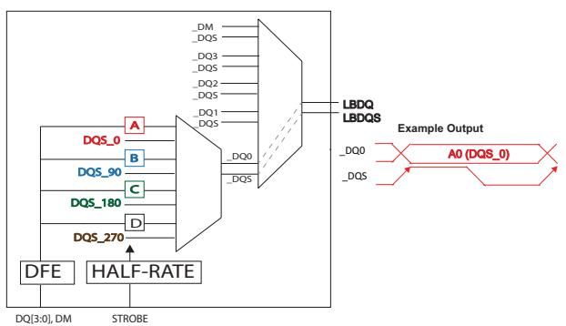

# 4.38.3 Loopback Output Mode

Loopback Output Mode selects whether to output LBDQS and LBDQ in Normal Output Mode or Write Burst Output Mode, based on MR53:OP[7]. In the default Normal Output Mode (MR53:OP[7] = 0B), the selected DM/DQ state is captured with every DQS_t/DQS_c toggle for the selected Loopback Phase. In Write Burst Output Mode (MR53:OP[7] = 1B), the selected DM/DQ state will be output on LBDQ when qualified by the write enable, which means data is only captured during the write burst and not during the preamble or postamble.

# 4.38.3.1 Loopback Normal Output Mode (Default)

In Normal Output Mode (MR53:OP[7] = 0B), the selected DM/DQ state is captured with every DQS_t/DQS_c toggle for the selected Loopback Phase and output on LBDQ. The LBDQS output will be delayed by  $t_{\mathrm{LBDLY}}$  from the selected DQS_t/DQS_c Loopback Phase. Phase C and D are inverted from Phase A and B, respectively. Since no Write commands are required in Normal Output Mode, MR settings pertaining to preamble, postamble, CWL are ignored by the Loopback function.

# 4.38.3.1 Loopback Normal Output Mode (Default) (Cont'd)

Additional requirements for Normal Output Mode:

- Loopback in Normal Output mode is not supported after completing Write Leveling training with Internal Write Timing mode set MR2:OP[7]=1.  
- DQS must be driven differentially low (DQS_t low, DQS_c high) prior to entry into Normal Output Mode.  
- DQS_t/DQS_c must be continuously driven during Loopback operation. (HiZ state not allowed.)  
- Only DSEL and MRW commands applied at command pins during Normal Output Mode.  
- RESET is required to exit Loopback Normal Output Mode.

No DFE Reset is assumed after first rising edge of DQS_t. DDR5 SDRAM array data is not guaranteed after entering Normal Output Mode.

# 4.38.3.2 Loopback Normal Output Mode Timing Diagrams

Loopback Normal Output Mode entry and output example timing diagrams are shown in Figures 138 through 142.

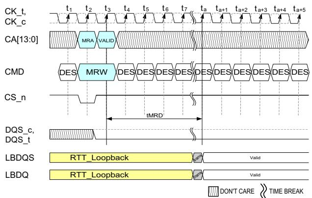  
Figure 138 — Loopback Normal Output Mode Entry

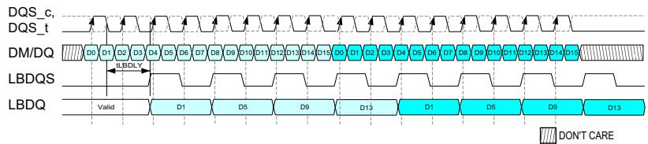  
Figure 139 — Loopback Normal Output 4-Way Mode PhaseB Example

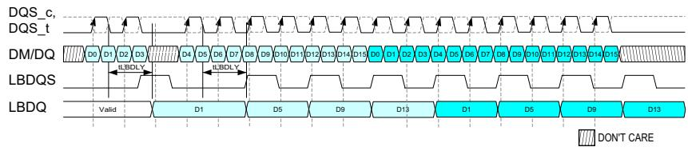  
Figure 140 — Loopback Normal Output Mode 4-Way PhaseB 1CK Mid Gap Example

# 4.38.3.2 Loopback Normal Output Mode Timing Diagrams (Cont'd)

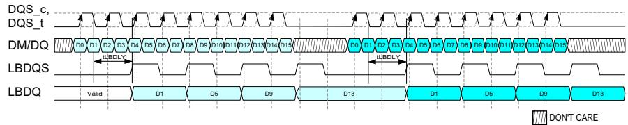  
Figure 141 — Loopback Normal Output Mode 4-Way PhaseB 2CK Gap Example

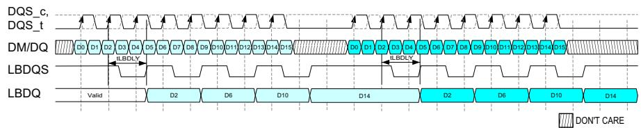  
Figure 142 — Loopback Normal Output Mode 4-Way PhaseC 2CK Gap Example

# 4.38.3.3 Loopback Write Burst Output Mode

In Write Burst Output Mode (MR53:OP[7] = 1B), Loopback data is only generated during the write burst, so it is effectively masked for the DQS toggles during the preamble or postamble. Normal Write operation for the Command, DQS and DM/DQ is assumed. MR settings pertaining to preamble, postamble, CWL apply, as they do for any Write command.

To prevent Loopback interference on the DRAM within the normal data path, the DRAM optionally may output the 2nd preamble pulse for the special case of WPRE=4CK and selection of Phase C or D for Data Burst Bit phase alignment or Phase A or B for Strobe phase alignment. With this behavior, all phases are inverted from normal behavior.

Implementation of 2-way or 4-way interleave Loopback introduces complexity in Write Burst Mode when the DQS toggle is not continuous. If the DQS toggle is continuously generated by Write commands spaced BL/2, Loopback will align the LBDQS/LBDQ output with the selected phase for all write bursts. If the DQS toggle is not continuous due to gaps in Write commands spaced greater than BL/2, LBDQS/LBDQ may not align with the selected phase after the first write burst unless the "gap" is at least 16 CK (Write, BL/2 + 16CK, Write).

Table 368 — Loopback Output Phase  

<table><tr><td>Write to Write Separation</td><td>Phase</td><td>NOTE</td></tr><tr><td>X = BL/2</td><td>Selected</td><td></td></tr><tr><td>BL/2 &lt; X &lt; BL/2 + 32</td><td>Determined via analysis of specific conditions</td><td>1</td></tr><tr><td>X &gt;= BL/2 + 32</td><td>Selected</td><td></td></tr><tr><td colspan="3">NOTE 1 Specific conditions include 2-way/4-way interleave implementation, selected phase, data rate, preamble, postamble and write burst gap duration.</td></tr></table>

In the case where continuous bursts are not issued in Loopback Write Burst Output Mode, selection of Phase C or D for Data Burst Bit phase alignment or Phase A or B for Strobe phase alignment may result in the last tLBQSH width of a burst that does not comply with spec.

Additional requirements for Write Burst Output Mode:

- Write Leveling training is required prior to Write Burst Loopback operation.  
- All Write timing and voltage requirements must be followed. Failure to meet this requirement results in unknown data written to DRAM, and the Loopback pins may not output the captured input data as expected.

# 4.38.3.4 Loopback Write Burst Output Mode Timing Diagrams

Loopback Write Burst Output Mode timing diagram examples are shown in Figures 143 through 146.

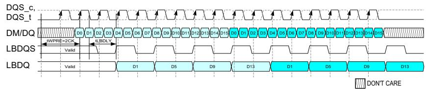  
Figure 143 — Loopback Write Burst Output Mode 4-Way PhaseB WPRE=2CK Example

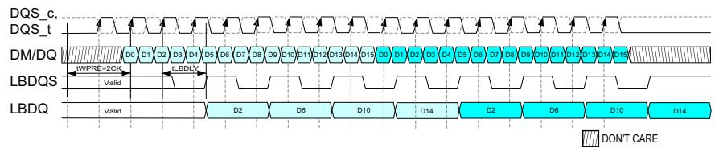  
Figure 144 — Loopback Write Burst Output Mode 4-Way PhaseC WPRE=2CK Example

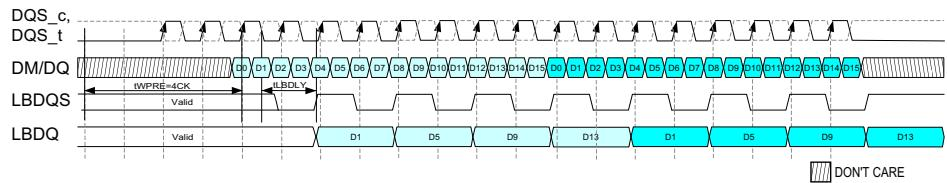  
Figure 145 — Loopback Write Burst Output Mode 4-Way PhaseB Data Burst Bit and PhaseD Strobe Alignment WPRE=4CK Optional Example

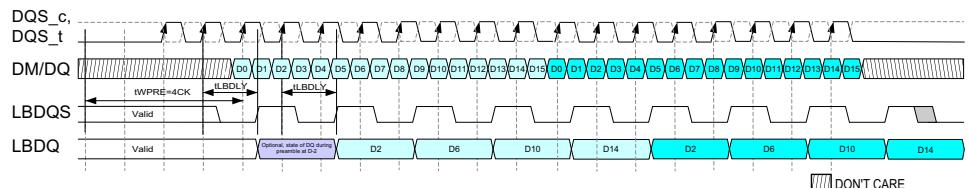  
Figure 146 — Loopback Write Burst Output Mode 4-Way PhaseC Data Burst Bit and PhaseA Strobe Alignment WPRE=4CK Optional Example

# 4.38.4 Loopback Timing and Levels

The LBDQS output will be delayed from the selected DQS_t/DQS_c Loopback Phase. The timing parameter, tLBDLY, is shown in Table 369.

Table 369 — Loopback LBDQS Output Timing  

<table><tr><td colspan="2">Speed</td><td colspan="2">DDR5-3200/3600/4000/4400</td><td colspan="2">DDR5-4800/5200</td><td colspan="2">DDR5-5600/6000/6400</td><td rowspan="2">Units</td><td rowspan="2">NOTE</td></tr><tr><td>Parameter</td><td>Symbol</td><td>MIN</td><td>MAX</td><td>MIN</td><td>MAX</td><td>MIN</td><td>MAX</td></tr><tr><td colspan="10">Loopback Timing</td></tr><tr><td>LBDQS Delay from Selected DQS Loopback Phase</td><td>tLBDLY</td><td>-</td><td>20</td><td>-</td><td>TBD</td><td>-</td><td>TBD</td><td>ns</td><td></td></tr></table>

The interaction between LBDQS and LBDQ is described in Section 9.3.  
ODT for Loopback is described in Section 5.5.  
Output driver electrical characteristics for Loopback is described in Section 9.2.

# 4.39 CA_ODT Strap Operation

With the introduction of on-die termination for CA/CS/CK on DDR5 DRAMs, the setting of the termination values per DRAM will be different depending on the configuration of DRAMs on the DIMM or system board. The CA_ODT pin enables the distinction of two "sets" of CA/CS/CK ODT settings. When the CA_ODT pin is strapped to a constant VSS setting on the DIMM or board, the CA/CS/CK ODT settings will be referred to as "Group A". When the CA_ODT pin is strapped to a constant VDD setting on the DIMM or system board, the CA/CS/CK ODT settings will be referred to as "Group B". Typical usage would be to apply a weak termination setting to Group A devices and a stronger termination setting to Group B devices, which would be at the end of the fly-by routing on the DIMM. To support these different settings, two sets of MPC opcodes will be used to target either Group A or Group B devices. In addition to these separate "Groups" of devices based on the CA_ODT pin, the PDA commands will also be supported. However, the correct combination of the PDA Select ID and MPC opcode must be used according to the CA_ODT pin value.

The CA_ODT pin is defined in the pinlist as shown in Table 370.

Table 370 — CA_ODT Pin Defined  

<table><tr><td>Pin Name</td><td>Input/Output</td><td>Description</td></tr><tr><td>CA_ODT</td><td>Input</td><td>ODT for Command and Address. Apply Group A settings if the pin is connected to VSS and apply Group B settings if the pin is connected to VDDQ</td></tr></table>

MR32 is defined as shown in Table 371 to reflect the need to be able to read the CA_ODT strap value:

Table 371 — MR32 Defined  

<table><tr><td>OP[7]</td><td>OP[6]</td><td>OP[5]</td><td>OP[4]</td><td>OP[3]</td><td>OP[2]</td><td>OP[1]</td><td>OP[0]</td></tr><tr><td>RFU</td><td>CA ODT
Strap Value</td><td colspan="3">CS ODT</td><td colspan="3">CK ODT</td></tr></table>

MR33 is defined as follows:  

<table><tr><td>OP[7]</td><td>OP[6]</td><td>OP[5]</td><td>OP[4]</td><td>OP[3]</td><td>OP[2]</td><td>OP[1]</td><td>OP[0]</td></tr><tr><td colspan="2">RFU</td><td colspan="3">DQS_RTT_PARK</td><td colspan="3">CA ODT</td></tr></table>

If the CA_ODT Strap Value for the DRAM is 0, the CK ODT, CS ODT, and CA ODT values will reflect the default settings for "Group A" ODT values, or will reflect what has been written to these mode registers via the MPC opcodes for Group A CK/CS/CA ODT settings.

If the CA_ODT Strap Value for the DRAM is 1, the CK ODT, CS ODT, and CA ODT values will reflect the default settings for "Group B" ODT values, or will reflect what has been written to these mode registers via the MPC opcodes for Group B CK/CS/CA ODT settings.

# 4.39.1 CA/CS/CK ODT Settings

The following MPC opcodes will be used to set the "Group A" and "Group B" RTT_CA, RTT_CS, and RTT_CK values.

Table 372 - MPC Opcodes  

<table><tr><td>Function</td><td>Operand</td><td>Data</td><td>Notes</td></tr><tr><td>Initialization and Training Modes</td><td>OP[7:0]</td><td>...0010 0xxxB: Group A RTT_CK = xxx (See Section 3.5.34 for MR32 encoding)0010 1xxxB: Group B RTT_CK = xxx (See Section 3.5.34 for MR32 encoding)0011 0xxxB: Group A RTT_CS = xxx (See Section 3.5.34 for MR32 encoding)0011 1xxxB: Group B RTT_CS = xxx (See Section 3.5.34 for MR32 encoding)0100 0xxxB: Group A RTT_CA = xxx (See Section 3.5.35 for MR33 encoding)0100 1xxxB: Group B RTT_CA = xxx (See Section 3.5.35 for MR33 encoding)...</td><td></td></tr></table>

# 4.40 Duty Cycle Adjuster (DCA)

DDR5 SDRAM supports a mode register adjustable DCA to allow the memory controller to adjust the DRAM internally generated DQS clock tree and DQ duty cycle to compensate for systemic duty cycle error of all DQS and DQs.

The DQS DCA is located before the DQS clock tree or equivalent place. The DCA requires a locked DLL state and will affect DQS and DQ duty cycle during the following operations.

- Read  
- Read Preamble Training  
- Read Training Pattern  
- Mode Register Read

The controller can adjust the duty cycle through all the DCA mode registers and can determine the optimal Mode Register setting for DCA in multiple different ways.

In case of 4-phase internal clocks, for example, since QCLK  $(90^{\circ}) / \mathrm{IBCLK}(180^{\circ}) / \mathrm{QBCLK}(270^{\circ})$  are adjusted based on  $\mathrm{ICLK}(0^{\circ})$ , the controller can first confirm that the first BL is synchronized with  $\mathrm{ICLK}(0^{\circ})$ , and then perform the full DCA training operation which needs to have an even number of MRR (or Read) - MRR (or Read) timing to avoid confusion whether the first BL is synchronized with  $\mathrm{ICLK}(0^{\circ})$  or  $\mathrm{IBCLK}(180^{\circ})$

# 4.40.1 Duty Cycle Adjuster Range

The global DCA step range is from -7 to +7, as defined in MR43 and MR44. The actual step size cannot be defined since the variation of duty cycle by changing DCA code is not linear.

Table 373 — DCA Range  

<table><tr><td>Parameter</td><td>Min/Avg./Max</td><td>Value</td><td>Unit</td><td>NOTE</td></tr><tr><td rowspan="2">Duty Cycle Adjuster Range</td><td>Min</td><td>28</td><td rowspan="2">ps</td><td rowspan="2">1</td></tr><tr><td>Max</td><td>56</td></tr><tr><td colspan="5">NOTE 1 These values are guaranteed by design.</td></tr></table>

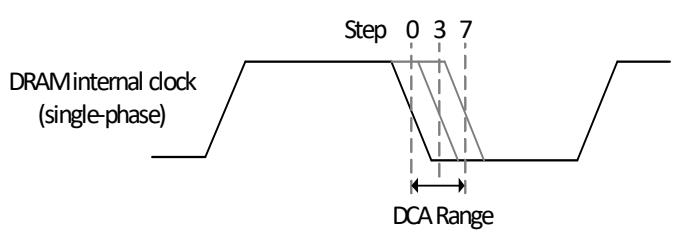

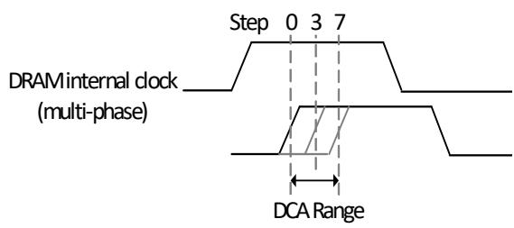  
Figure 147 — Duty Cycle Adjuster Range

# 4.40.2 The Relationship between DCA Code Change and Single/Two-Phase Internal Clock(s)/DQS Timing

In case of the DQS clock tree used single/two-phase clock(s) scheme, the duty-cycle ratio of all DQS per device can be adjusted directly according to the internal clock(s) controlled by the DCA code. Note that tDQSCK is not changed by DCA code change.

Using a 2-phase clock scheme, the rising edge of the  $0^{\circ}$  clock is the reference edge, while the  $180^{\circ}$  clock is adjusted based on  $0^{\circ}$  clock. The rising edge of  $0^{\circ}$  clock is for even burst bit data, and the rising edge of  $180^{\circ}$  clock is for odd burst bit data.

# 4.40.2 The Relationship Between DCA Code Change and Single/Two-Phase Internal Clock(s)/DQS Timing (Cont'd)

The global DCA adjustment uses the "DCA for single/two-phase clock(s)" mode register bits, MR43:OP[3:0]. A positive DCA adjustment results in a larger duty cycle ratio, while a negative DCA adjustment results in a smaller duty cycle ratio.

In addition to the global DCA adjustment, a per-pin DCA adjustment allows an additional step range of -3 to +3, per DQS/DQ. The 2-phase clock per-pin DCA adjustment uses the OP bits [3,1:0] of MR103 (DQSL_t), MR105 (DQSL_c), MR107 (DQSU_t), MR109 (DQSU_c), MR133 (DQL0), MR141 (DQL1), ..., MR253 (DQU7). The per-pin DCA adjustment is additive to the global DCA adjustment, as shown in Table 374:

Table 374 — DCA Range Examples (Not All Possible Combinations)  

<table><tr><td>Global DCA Adjustment</td><td>Per-Pin DCA Adjustment</td><td>Total DCA Adjustment at Pin</td></tr><tr><td>DCA Step -3</td><td>DCA Step -2</td><td>DCA Step -5</td></tr><tr><td>DCA Step -2</td><td>DCA Step +2</td><td>DCA Step 0</td></tr><tr><td>DCA Step 0</td><td>DCA Step +1</td><td>DCA Step +1</td></tr><tr><td>DCA Step +2</td><td>DCA Step -3</td><td>DCA Step -1</td></tr><tr><td>DCA Step +4</td><td>DCA Step +3</td><td>DCA Step +7</td></tr><tr><td>DCA Step +7</td><td>DCA Step +2</td><td>DCA Step +9</td></tr></table>

Like the global DCA adjustment, the actual step size for the per-pin DCA adjustment cannot be defined since the variation of duty cycle by changing DCA code is not linear, however the per-pin DCA adjustment will be approximately the same as the global DCA adjustment.

Mode register OP bits associated with the IBCLK and QBCLK may not be supported on the DRAM with a 2-phase clock scheme.

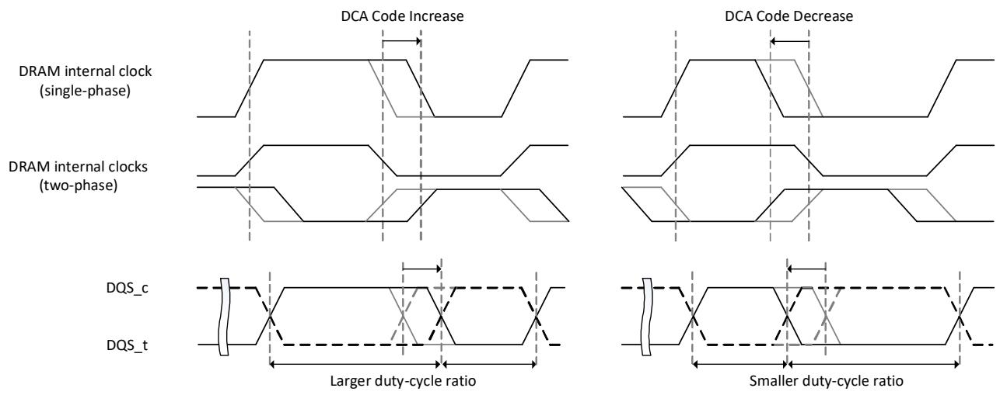  
Figure 148 — Relationship between DCA Code Change and the Single/Two-Phase Internal Clock(s)/DQS Waveform (Example)

# 4.40.3 The Relationship between DCA Code Change and 4-Phase Internal Clock(s)/DQS Timing

In case of the DQS clock tree used 4-phase clocks scheme, the even and odd duty-cycle ratio of all DQS per device can be respectively adjusted since the internal 4-phase clocks can be independently controlled by the DCA code.

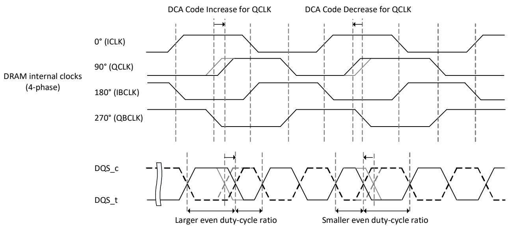  
Figure 149 — Relationship between DCA Code Change for QCLK and the 4-Phase Internal Clocks/DQS Waveform (Example)

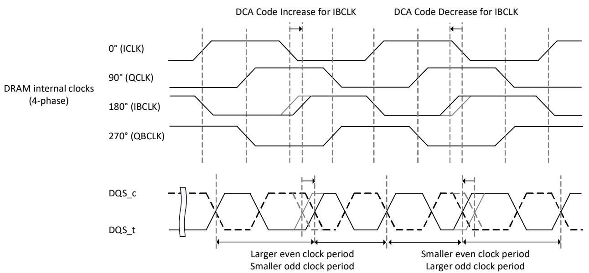  
Figure 150 — Relationship between DCA Code Change for IBCLK and the 4-Phase Internal Clocks/DQS Waveform (Example)

# 4.40.3 The Relationship between DCA Code Change and 4-Phase Internal Clock(s)/DQS Timing (Cont'd)

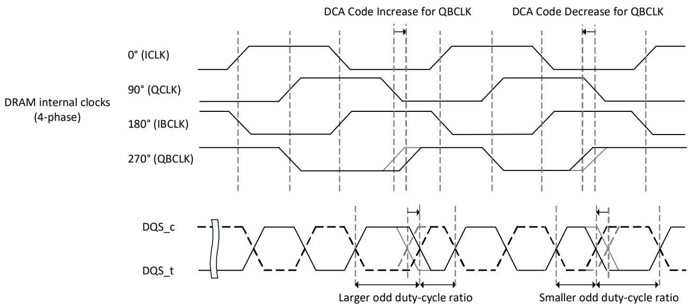  
Figure 151 — Relationship between DCA Code Change for QBCLK and the 4-Phase Internal Clocks/DQS Waveform (Example)

# 4.40.4 The Relationship between DCA Code Change and DQs Output/DQS Timing

The DQS DCA code change effect to DQ Output as follows. The rising edge of DQS_t affects the even data output. The falling edge of DQS_t affects to the falling edge of the odd data output.

# 4.41 Refresh Management (RFM)

Periods of high DDR5 DRAM activity may require additional refresh commands to protect the integrity of the DRAM data. The DRAM will indicate the requirement for additional Refresh Management (RFM) by setting read only MR58 opcode bit 0 (Table 375).  $\mathrm{OP}[0] = 0$  indicates no additional refresh is needed beyond the refresh required in the Refresh Operation section of the specification.  $\mathrm{OP}[0] = 1$  indicates additional DRAM refresh management is required.

Table 375 — Mode Register Definition for Refresh Management  

<table><tr><td>MR58 OP[0]</td><td>Refresh Management (RFM) Requirement</td></tr><tr><td>0</td><td>Refresh Management (RFM) not required</td></tr><tr><td>1</td><td>Refresh Management (RFM) required</td></tr></table>

A suggested implementation of Refresh Management by the controller monitors ACT commands issued per bank to the DRAM. This activity can be monitored as a Rolling Accumulated ACT (RAA) count. Each ACT command will increment the RAA count by 1 for the individual bank receiving the ACT command.

When the RAA counter reaches a DRAM vendor specified Initial Management Threshold (RAAIMT), which is set by the DRAM vendor in the read only MR58 opcode bits 4:1 (Table 376), additional DRAM refresh management is needed. Executing the Refresh Management (RFM) command allows additional time for the DRAM to manage refresh internally. The RFM operation can be initiated to all banks on the DRAM with the RFMab command, or to a single bank address (BA[1:0]) in all bank groups with the RFMsb command. A DRAM with MR58 OP[0]=0 set will ignore the RFM command.

Table 376 — Mode Register Definition for the RAA Initial Management Threshold (RAAIMT)  

<table><tr><td>MR58 OP[4:1]</td><td>RAAIMT Value
Normal Refresh Mode</td><td>RAAIMT Value
FGR Refresh Mode</td></tr><tr><td>0000B-0011B</td><td>RFU</td><td>RFU</td></tr><tr><td>0100B</td><td>32</td><td>16</td></tr><tr><td>0101B</td><td>40</td><td>20</td></tr><tr><td>...</td><td>...</td><td>...</td></tr><tr><td>1001B</td><td>72</td><td>36</td></tr><tr><td>1010B</td><td>80</td><td>40</td></tr><tr><td>1011B-1111B</td><td>RFU</td><td>RFU</td></tr></table>

The RFM command bits are the same as the REF command, except for CA9. If the Refresh Management Required bit is “0”, (MR58 OP[0]=0), CA9 is only required to be valid (“V”). If the Refresh Management Required bit is “1”, (MR58 OP[0]=1), CA9="H" executes the REF command and CA9="L" executes either an RFMab command if CA10="L" or an RFMsb command if CA10="H".

# 4.41 Refresh Management (RFM) (Cont'd)

Table 377 — RAA Initial Management Threshold (RAAIMT) Command Definition  

<table><tr><td rowspan="2">Function</td><td rowspan="2">Abbreviation</td><td rowspan="2">CS</td><td colspan="14">CA Pins</td><td rowspan="2">NOTES</td></tr><tr><td>CA0</td><td>CA1</td><td>CA2</td><td>CA3</td><td>CA4</td><td>CA5</td><td>CA6</td><td>CA7</td><td>CA8</td><td>CA9</td><td>CA10</td><td>CA11</td><td>CA12</td><td>CA13</td></tr><tr><td>Refresh All</td><td>REFab</td><td>L</td><td>H</td><td>H</td><td>L</td><td>L</td><td>H</td><td>CID3</td><td>V</td><td>V</td><td>V</td><td>H</td><td>L</td><td>CID0</td><td>CID1</td><td>CID2/DDPID</td><td>1,3</td></tr><tr><td>Refresh Management All</td><td>RFMab</td><td>L</td><td>H</td><td>H</td><td>L</td><td>L</td><td>H</td><td>CID3</td><td>V</td><td>V</td><td>V</td><td>L</td><td>L</td><td>CID0</td><td>CID1</td><td>CID2/DDPID</td><td>1</td></tr><tr><td>Refresh Same Bank</td><td>REFsb</td><td>L</td><td>H</td><td>H</td><td>L</td><td>L</td><td>H</td><td>CID3</td><td>BA0</td><td>BA1</td><td>V</td><td>H</td><td>H</td><td>CID0</td><td>CID1</td><td>CID2/DDPID</td><td>2,3</td></tr><tr><td>Refresh Management Same Bank</td><td>RFMsb</td><td>L</td><td>H</td><td>H</td><td>L</td><td>L</td><td>H</td><td>CID3</td><td>BA0</td><td>BA1</td><td>V</td><td>L</td><td>H</td><td>CID0</td><td>CID1</td><td>CID2/DDPID</td><td>2</td></tr><tr><td colspan="18">NOTE 1 The Refresh All and Refresh Management All commands is are applied to all banks in all bank groups. CA6 and CA7 are required to be valid (“V”).NOTE 2 The Refresh Same Bank and Refresh Management Same Bank commands refresh the same bank in all bank group bits. The bank bits, BA0 and BA1 on CA6 and CA7, respectively, specify the bank within each bank group.NOTE 3 If the Refresh Management Required bit is “0” (MR58 OP[0]=0), CA9 is only required to be valid (“V”).</td></tr></table>

The duration of the RFMab and RFMsb commands is dependent upon the DRAM being in Normal or FGR refresh mode.  $t_{\mathrm{RFM,min}}$  is equivalent to  $t_{\mathrm{RFC,min}}$ . See Table 378.

Table 378 -  $t_{\mathrm{RFM}}$  Parameters  

<table><tr><td>Refresh Operation</td><td>Symbol</td><td>Value</td><td>Notes</td></tr><tr><td>Normal Refresh Management (RFMab)</td><td>tRFM1,min</td><td>tRFC1,min</td><td></td></tr><tr><td>Fine Granularity Refresh Management (RFMab)</td><td>tRFM2,min</td><td>tRFC2,min</td><td></td></tr><tr><td>Same Bank Refresh Management (RFMsb)</td><td>tRFMsb,min</td><td>tRFCsb,min</td><td></td></tr></table>

When an RFM command is issued to the DRAM, the RAA counter in any bank receiving the command can be decremented by the RAAIMT value, down to a minimum RAA value of 0 (no negative or "pull-in" of RFM commands is allowed). Issuing an RFMab command allows the RAA count in all banks to be decremented by the RAAIMT value. Issuing an RFMsb command with BA[1:0] allows the RAA count only with that bank address across all bank groups to be decremented by the RAAIMT value

RFM commands are allowed to accumulate or "postpone", but the RAA counter shall never exceed a vendor specified RAA Maximum Management Threshold (RAAMMT), which is set by the DRAM vendor in the read only MR58 opcode bits 7:5 (Table 379). If the RAA counter reaches RAAMMT, no additional ACT commands are allowed to the DRAM bank until one or more REF or RFM commands have been issued to reduce the RAA counter below the maximum value.

Table 379 — Mode Register Definition for RAA Maximum Management Threshold (RAAMMT)  

<table><tr><td>MR58 OP[7:5]</td><td>RAAMMT Value
Normal Refresh Mode</td><td>RAAMMT Value
FGR Refresh Mode</td></tr><tr><td>000B-010B</td><td>RFU</td><td>RFU</td></tr><tr><td>011B</td><td>3x RAAIMT</td><td>6x RAAIMT</td></tr><tr><td>100B</td><td>4x RAAIMT</td><td>8x RAAIMT</td></tr><tr><td>101B</td><td>5x RAAIMT</td><td>10x RAAIMT</td></tr><tr><td>110B</td><td>6x RAAIMT</td><td>12x RAAIMT</td></tr><tr><td>111B</td><td>RFU</td><td>RFU</td></tr></table>

# 4.41 Refresh Management (RFM) (Cont'd)

RFM command scheduling shall meet the same minimum separation requirements as those for the REF command (see Table 280).

An RFM command does not replace the requirement for the controller to issue periodic REF commands to the DRAM, nor does a RFM command affect internal refresh counters. The RFM commands are bonus time for the DRAM to manage refresh internally. However, issuing a REF command also allows decrementing the RAA counter by the value set by MR59 OP[7:6], as shown in Table 380. Hence, any periodic REF command issued to the DRAM allows the RAA counter of the banks being refreshed to be decremented by the MR59 OP[7:6] setting. Issuing a REFab command allows the RAA count in all banks to be decremented. Issuing a REFsb command with BA[1:0] allows the RAA count only with that bank address in all bank groups to be decremented.

Table 380 - Mode Register Definition for RAA Counter Decrement per REF Command  

<table><tr><td>MR59
OP[7:6]</td><td>RAA Counter Decrement
per REF Command</td></tr><tr><td>00b</td><td>RAAIMT</td></tr><tr><td>01b</td><td>RAAIMT * 0.5</td></tr><tr><td>10b</td><td>RFU</td></tr><tr><td>11b</td><td>RFU</td></tr></table>

No decrement to the RAA count values is allowed for entering/exiting Self Refresh. The per bank count values before Self Refresh is entered remain unchanged upon Self Refresh exit.

# 4.42 Package Output Driver Test Mode (Optional)

This optional mode allows for characterization of the DRAM package by allowing the host to individually turn on the output driver of a single bit of the DRAM, while all other bits remain terminated. To use this test mode, the host sets MR61:OP[4:0] to select the target DM or DQ Output Driver. The host also sets the target driver to use the Pull-up Output Driver Impedance of 34 ohms (MR5:OP[2:1] = 00 $_\text{B}$ ), while the termination for all the other DMs and DQs in the DRAM are defined by MR34:[2:0] (RTT_PARK).

This is only a test mode, no normal functionality is assumed while in this mode or after enabling this mode without a reset to the DRAM device. Entering into this mode is done by programming any value in MR61 other than 0. Since this is an optional function, the discovery bit is located in MR5:OP[3]. A reset of the DDR5 SDRAM is required after exiting the package output driver test mode.

Even though only 5 bits of the MR are needed, the entire MR61 is blocked out to isolate it from normal operating modes.

Table 381 — MR5 Register – for Reference Only  
See Section 3.5.7 for details  

<table><tr><td>OP[7]</td><td>OP[6]</td><td>OP[5]</td><td>OP[4]</td><td>OP[3]</td><td>OP[2]</td><td>OP[1]</td><td>OP[0]</td></tr><tr><td colspan="2">Pull-Down
Output Driver Impedance</td><td>DM Enable</td><td>TDQS
Enable</td><td>PODTM
Support</td><td colspan="2">Pull-up
Output Driver Impedance</td><td>Data
Output
Disable</td></tr></table>

Table 382 — MR61 Register – for Reference Only  
See Section 3.5.62 for details  

<table><tr><td>OP[7]</td><td>OP[6]</td><td>OP[5]</td><td>OP[4]</td><td>OP[3]</td><td>OP[2]</td><td>OP[1]</td><td>OP[0]</td></tr><tr><td colspan="3">RSVD</td><td colspan="5">Package Output Driver Test Mode</td></tr></table>

# 4.43 IO Features and Modes

# 4.43.1 Data Output Disable

The device outputs may be disabled by the Data Output Disable mode register, MR5:OP[0], as shown in Table 36. For normal operation, set MR5:OP[0] = 0 (default). Setting MR5:OP[0] = 1 disables the device outputs.

# 4.43.2 TDQS/DM

The DDR5 SDRAM x8 configuration has a package ball that is shared between TDQS_t and DM_n. The Write Data Mask (DM) function is dependent upon Termination Data Strobe (TDQS). If TDQS is enabled, DM is disabled. If TDQS is disabled, then DM may be enabled or disabled via mode register setting, as noted in Table 383.

# 4.43.2.1 TDQS

One pair of Termination Data Strobe (TDQS) pins, TDQS_t/TDQS_c, is supported for the x8 configuration DDR5 SDRAM. The TDQS function is programmable via Mode Register bit, MR5:OP[4]. The x8 is the only configuration which supports the TDQS function. The x4 and x16 DDR5 SDRAMs do not support this function thus, for these configurations, the TDQS MR setting must be disabled, MR5:OP[4] = 0 (default).

When TDQS is enabled, MR5:OP[4] = 1, the same termination resistance function is applied to the TDQS_t/TDQS_c pins that is applied to DQS_t/DQS_c pins., except during Read commands where TDQS does not output any data and will remain at RTT_DQS_PARK.

# 4.43.2.2 DM

(Reference Section 4.8.1 for data mask functionality.)

# 4.43.2.3 TDQS/DM Disable

When the TDQS is disabled, MR5:OP[4] = 0, the MR5:OP[5] bit may be used to enable or disable the DM_n pin function.

When both TDQS and DM functions are disabled, termination will be turned off and the pins will drive Hi-Z. The DM_n pin input receiver will be turned-off and does not expect any valid logic level.

Table 383 - x8 TDQS Function Matrix  

<table><tr><td>TDQS (MR5:OP[4])</td><td>DM</td></tr><tr><td>0B: Disabled (default)</td><td>MR5:OP[5]</td></tr><tr><td>1B: Enabled</td><td>Disabled</td></tr></table>

# 5 On-Die Termination

# 5.1 On-Die Termination for DQ

ODT (On-Die Termination) is a feature of the DDR5 SDRAM that allows the DRAM to change termination resistance for each DQ, Unlike previous DDR technologies, DDR5 no longer has a physical ODT pin and all ODT based control is now command & mode register based. DQS_t, DQS_c and DM_n for x4 and x8 configuration (and TDQS_t, TDQS_c for X8 configuration), when enabled via Read (for NT ODT usage), Write Commands or Default Parking value with MR setting. For x16 configuration, ODT is applied to each DQU, DQL, DQSU_t, DQSU_c, DQSL_t, DQSL_c, DMU_n and DML_n signal. The ODT feature is designed to improve signal integrity of the memory channel by allowing the DRAM controller to independently change termination resistance for any or all DRAM devices. In addition to the control capability of the DQ ODT, the DQS ODT will now be independently programmed via MR33:OP[5:3] and held static. All ODT control will be targeted for the DQs. This addition allows for adjusting the delay common in an unmatched architecture. DQS RTT offset control mode is enabled via MR39:OP[2:0].

The ODT feature is turned off and not supported in Self-Refresh mode, but does have an optional mode with in Power Down. A simple functional representation of the DRAM ODT feature is shown in Figure 152.

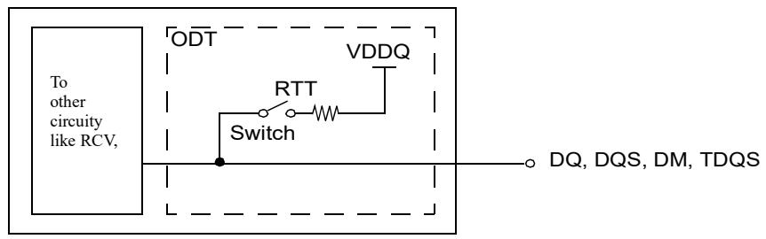  
Figure 152 — Functional Representation of ODT

The switch is enabled by the internal ODT control logic, which uses command decode, Mode Register Settings and other control information, as described in this section. The value of RTT is determined by the settings of Mode Register bits.

# 5.2 ODT Modes, Timing Diagrams and State Table

The ODT Mode of DDR5 SDRAM has 5 states, Data Termination Disable, RTT_WR, RTT_NOM_RD, RTT_NOM_WR and RTT_PARK. The ODT Mode is enabled based on Mode Registers for each RTT listed below. In this case, the value of RTT is determined by the settings of those bits.

After entering Self-Refresh mode, DRAM automatically disables ODT termination and set Hi-Z as termination state regardless of these setting.

Application: Controller can control each RTT condition with WR/RD command and use of ODT Offset Control Mode Registers.

- RTT_WR: The rank that is being written to provide termination and adjusts timing based on ODT Control Mode Register settings.  
- RTT_NOM_RD: DRAM turns ON RTT_NOM_RD if it sees CS asserted during the second pulse of the READ command (except when ODT is disabled by MR35:OP[5:3]).  
- RTT_NOM_WR: DRAM turns ON RTT_NOM_WR if it sees a CS asserted during the second pulse of the WRITE command (except when ODT is disabled by MR35:OP[2:0])  
- RTT PARK: Default parked value set via MR34:OP[2:0] and is to be enabled when a READ or WRITE is not active.  
- DQS_RTT_PARK: Default parked value set for DQS via MR33:OP[5:3] and is to be enabled when a READ is not active  
- Data Termination Disable: DRAM driving data upon receiving READ command disables the termination after RL-1 and stays off for a duration of BL/2.  
- Strobe Termination Disable: DRAM driving strobe upon receiving READ command disables the termination after RL-1-tRPRE and stays off for a duration of  $\mathrm{BL} / 2 + \mathrm{tRPST}$ .

Those RTT values have priority as follows:

1 Data Termination Disable & Strobe Termination Disable  
2 RTT WR  
3 RTN NOM RD  
4 RTT NOM WR  
5 RTT PARK

This means that if there is a WRITE command, then the DRAM turns on RTT_WR, not RTT_NOM_WR or RTT_NOM_RD, and also if there is a READ command, then the DRAM disables data termination and goes into Driving mode. If during the second pulse of a READ or WRITE command, a CS enable is sent, then Non-Target ODT is enabled and the appropriate RTT_NOM_RD or RTT_NOM_WR is enabled for the non-target rank. This provides additional and potentially different termination options for the other ranks on the channel.

# 5.2 ODT Modes, Timing Diagrams and State Table (Cont'd)

Table 384 — Termination State Table  

<table><tr><td rowspan="2">Command</td><td colspan="4">Mode Register Configuration Settings</td><td colspan="2">Results</td><td rowspan="2">Note</td></tr><tr><td>RTT_PA</td><td>RTT_W</td><td>RTT_NOM_</td><td>RTT_NOM_</td><td>Target DRAM Term</td><td>Non-Target DRAM</td></tr><tr><td>ANY</td><td colspan="4">Disabled</td><td colspan="2">HI-Z (ODT OFF)</td><td>3</td></tr><tr><td>Any Non-</td><td>Enabled</td><td colspan="3">Don&#x27;t Care</td><td>RTT PARK</td><td>RTT PARK</td><td>4</td></tr><tr><td rowspan="7">WR</td><td colspan="3">Disabled</td><td rowspan="7">Don&#x27;t Care</td><td>HI-Z (ODT OFF)</td><td>HI-Z (ODT OFF)</td><td></td></tr><tr><td colspan="2">Disabled</td><td>Enabled</td><td>HI-Z (ODT OFF)</td><td>RTT_NOM_WR</td><td></td></tr><tr><td>Disabled</td><td>Enabled</td><td>Disabled</td><td>RTT_WR</td><td>HI-Z (ODT OFF)</td><td></td></tr><tr><td>Don&#x27;t</td><td colspan="2">Enabled</td><td>RTT_WR</td><td>RTT_NOM_WR</td><td>2</td></tr><tr><td colspan="2">Enabled</td><td>Disabled</td><td>RTT_WR</td><td>HI-Z (ODT OFF)</td><td>2,5</td></tr><tr><td>Enabled</td><td>Dis-</td><td>Enabled</td><td>RTT PARK</td><td>RTT_NOM_WR</td><td></td></tr><tr><td>Enabled</td><td colspan="2">Disabled</td><td>RTT PARK</td><td>HI-Z (ODT OFF)</td><td>5</td></tr><tr><td rowspan="2">RD/MRR</td><td>Enabled</td><td colspan="2">Don&#x27;t Care</td><td>Disabled</td><td>HI-Z (ODT OFF)</td><td>HI-Z (ODT OFF)</td><td>1,5</td></tr><tr><td colspan="3">Don&#x27;t Care</td><td>Enabled</td><td>HI-Z (ODT OFF)</td><td>RTT_NOM_RD</td><td>1</td></tr><tr><td colspan="8">NOTE 1 When read command is executed, DRAM termination state of target rank will be Hi-Z for defined period independent of MR setting of RTT PARK/RTT_NOM_RD/RTT_NOM_WR.</td></tr><tr><td colspan="8">NOTE 2 If RTT_WR is enabled, RTT_WR will be activated by Write command for defined period time independent of MR setting of RTT PARK/RTT_NOM.</td></tr><tr><td colspan="8">NOTE 3 If all RTT config are disabled, ODT receiver power will be turned off to save power.</td></tr><tr><td colspan="8">NOTE 4 If RTT PARK is enabled, DRAM RTT PARK termination will be enabled while WR/RD/MRR are not being executed.</td></tr><tr><td colspan="8">NOTE 5 When a Non-Target ODT command is executed and the RTT_NOM_WR or RTT_NOM_RD is disabled, the DRAM termination state of the non-target rank will be Hi-Z for a defined period, independent of the MR setting of RTT PARK.</td></tr></table>

On-Die Termination effective resistance RTT is defined by MR bits.

ODT is applied to the DQ, DM, DQS_T/DQS_C and TDQS_T/TDQS_C (x8 devices only) pins.

A functional representation of the on-die termination is shown in Figure 153.

$$
R T T = \frac {V D D Q - V o u t}{| I o u t |}
$$

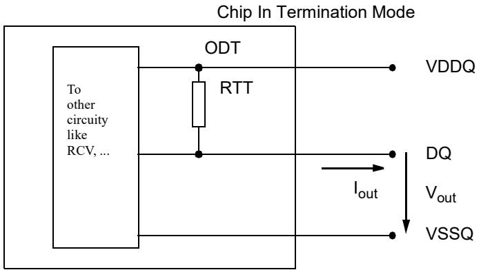  
Figure 153 - On Die Termination

On die termination effective Rtt values supported are 240,120, 80, 60, 48, 40, 34 ohms.

# 5.2 ODT Modes, Timing Diagrams and State Table (Cont'd)

Table 385 — ODT Electrical Characteristics RZQ=240Ω +/-1% Entire Temperature Operation Range; after Proper ZQ Calibration  

<table><tr><td>RTT</td><td>Vout</td><td>Min</td><td>Nom</td><td>Max</td><td>Unit</td><td>NOTE</td></tr><tr><td rowspan="3">240Ω</td><td>VOLdc= 0.5* VDDQ</td><td>0.9</td><td>1</td><td>1.25</td><td>RZQ</td><td>1,2,3</td></tr><tr><td>VOMdc= 0.8* VDDQ</td><td>0.9</td><td>1</td><td>1.1</td><td>RZQ</td><td>1,2,3</td></tr><tr><td>VOHdc= 0.95* VDDQ</td><td>0.8</td><td>1</td><td>1.1</td><td>RZQ</td><td>1,2,3</td></tr><tr><td rowspan="3">120Ω</td><td>VOLdc= 0.5* VDDQ</td><td>0.9</td><td>1</td><td>1.25</td><td>RZQ/2</td><td>1,2,3</td></tr><tr><td>VOMdc= 0.8* VDDQ</td><td>0.9</td><td>1</td><td>1.1</td><td>RZQ/2</td><td>1,2,3</td></tr><tr><td>VOHdc= 0.95* VDDQ</td><td>0.8</td><td>1</td><td>1.1</td><td>RZQ/2</td><td>1,2,3</td></tr><tr><td rowspan="3">80Ω</td><td>VOLdc= 0.5* VDDQ</td><td>0.9</td><td>1</td><td>1.25</td><td>RZQ/3</td><td>1,2,3</td></tr><tr><td>VOMdc= 0.8* VDDQ</td><td>0.9</td><td>1</td><td>1.1</td><td>RZQ/3</td><td>1,2,3</td></tr><tr><td>VOHdc= 0.95* VDDQ</td><td>0.8</td><td>1</td><td>1.1</td><td>RZQ/3</td><td>1,2,3</td></tr><tr><td rowspan="3">60Ω</td><td>VOLdc= 0.5* VDDQ</td><td>0.9</td><td>1</td><td>1.25</td><td>RZQ/4</td><td>1,2,3</td></tr><tr><td>VOMdc= 0.8* VDDQ</td><td>0.9</td><td>1</td><td>1.1</td><td>RZQ/4</td><td>1,2,3</td></tr><tr><td>VOHdc= 0.95* VDDQ</td><td>0.8</td><td>1</td><td>1.1</td><td>RZQ/4</td><td>1,2,3</td></tr><tr><td rowspan="3">48Ω</td><td>VOLdc= 0.5* VDDQ</td><td>0.9</td><td>1</td><td>1.25</td><td>RZQ/5</td><td>1,2,3</td></tr><tr><td>VOMdc= 0.8* VDDQ</td><td>0.9</td><td>1</td><td>1.1</td><td>RZQ/5</td><td>1,2,3</td></tr><tr><td>VOHdc= 0.95* VDDQ</td><td>0.8</td><td>1</td><td>1.1</td><td>RZQ/5</td><td>1,2,3</td></tr><tr><td rowspan="3">40Ω</td><td>VOLdc= 0.5* VDDQ</td><td>0.9</td><td>1</td><td>1.25</td><td>RZQ/6</td><td>1,2,3</td></tr><tr><td>VOMdc= 0.8* VDDQ</td><td>0.9</td><td>1</td><td>1.1</td><td>RZQ/6</td><td>1,2,3</td></tr><tr><td>VOHdc= 0.95* VDDQ</td><td>0.8</td><td>1</td><td>1.1</td><td>RZQ/6</td><td>1,2,3</td></tr><tr><td rowspan="3">34Ω</td><td>VOLdc= 0.5* VDDQ</td><td>0.9</td><td>1</td><td>1.25</td><td>RZQ/7</td><td>1,2,3</td></tr><tr><td>VOMdc= 0.8* VDDQ</td><td>0.9</td><td>1</td><td>1.1</td><td>RZQ/7</td><td>1,2,3</td></tr><tr><td>VOHdc= 0.95* VDDQ</td><td>0.8</td><td>1</td><td>1.1</td><td>RZQ/7</td><td>1,2,3</td></tr><tr><td>DQ-DQ Mismatch within byte</td><td>VOMdc= 0.8* VDDQ</td><td>0</td><td>-</td><td>8</td><td>%</td><td>1,2,4,5,6</td></tr><tr><td colspan="7">NOTE 1 The tolerance limits are specified after calibration with stable voltage and temperature. For the behavior of the tolerance limits if temperature or voltage changes after calibration, see Chapter 6.</td></tr><tr><td colspan="7">NOTE 2 Pull-up ODT resistors are recommended to be calibrated at 0.8*VDDQ. Other calibration schemes may be used to achieve the linearity spec shown in the table, e.g., calibration at 0.5*VDDQ and 0.95*VDDQ.</td></tr><tr><td colspan="7">NOTE 3 The tolerance limits are specified under the condition that VDDQ=VDD and VSSQ=VSS</td></tr><tr><td colspan="7">NOTE 4 DQ to DQ mismatch within byte variation for a given component including DQS_T and DQS_C (characterized)</td></tr><tr><td colspan="7">NOTE 5 RTT variance range ratio to RTT Nominal value in a given component, including DQS_t and DQS_c.</td></tr><tr><td colspan="7">DQ-DQ Mismatch in a Device = RTTMax -RTTMin / RTTNOM *100</td></tr><tr><td colspan="7">NOTE 6 This parameter of x16 device is specified for Upper byte and Lower byte.</td></tr></table>

# 5.3 Dynamic ODT

In certain application cases and to further enhance signal integrity on the data bus, it is desirable that the termination strength of the DDR5 SDRAM can be changed without issuing an MRW command. This requirement is supported by the "Dynamic ODT" feature as described as follows:

# 5.3.1 ODT Functional Description

The function is described as follows:

- Five RTT values are available: RTT_NOM_RD, RTT_NOM_WR, RTT_PARK, RTT_WR and DQS RTT PARK.

- The value for RTT_NOM_RD is preselected via MR35:OP[5:3]  
- The value for RTT_NOM_WR is preselected via MR35:OP[2:0]  
- The value for RTT_WR is preselected via MR34:OP[5:3]  
- The value for RTT PARK is preselected via MR34:OP[2:0] - Programmed via MPC command  
- The value for DQS_RTT_PARK is preselected via MR33:OP[5:3] - Programmed via MPC command

During operation without commands, the termination is controlled as follows;

- Nominal termination strength for all types (RTT_NOM_RD, RTT_NOM_WR, RTT_WR, RTT_PARK & DQS RTT PARK) are selected.  
- RTT_NOM_RD & RTT_NOM_WR on/off timings are controlled via the respective NT Read and Write command and latencies.  
- DQS_RTT_PARK is held static and is based on the value programmed in the MR33.

- When a write command (WR) is registered, the termination is controlled as follows:

- A latency ODTLon_WR after the write command, termination strength RTT_WR is selected.  
- A latency ODTLoff_WR after the write command, termination strength RTT_WR is de-selected.

- The termination, RTT_NOM_WR, for the non-target Write command is selected and de-selected by latencies ODTLon_WR_NT and ODTLoff_WR_NT, respectively.  
- When a Read command (RD) is registered, the termination is controlled as follows:

- A latency ODTLoff_RD after the Read command, data termination is disabled. Then, ODTLon_RD after the Read command, data termination is enabled.  
- A latency ODTLoff_RD_DQS after the Read command, strobe termination is disabled. ODTLon_RD_DQS after the Read command, strobe termination is enabled.

- The termination, RTT_NOM_RD, for the non-target Read command is selected and de-selected by latencies ODTLon_RD_NT and ODTLoff_RD_NT, respectively.

The duration of a Write or Read command is a full burst cycle, BL/2. The termination select ("ODTLon..." and de-select ("ODTLoff..." latency settings shall not result in an ODT pulse width which violates a burst cycle (BL/2) minimum duration. The equation "ODTLoff_X - ODTLon_X >= BL/2" must be met, where  $X$  is the termination latency setting associated with a particular command type (WR, WR_NT, RD_NT).

To achieve the minimum write burst duration, ODTLoff  $X$  and ODTLon  $X$  latencies contain independent programmable mode register offsets:

- The values for the Write command ODT control offsets are preselected via MR37.

MR37:OP[2:0] preselects ODTLon WR Offset

MR37:OP[5:3] preselects ODTLoff_WR Offset

- The values for the non-target Write command ODT control offsets are preselected via MR38.

MR38:OP[2:0] preselects ODTLon_WR_NT Offset

MR38:OP[5:3] preselects ODTOff_WR_NT Offset

- The values for the non-target Read command ODT control offsets are preselected via MR39.

MR39:OP[2:0] preselects ODTLon_RD_NT Offset

MR39:OP[5:3] preselects ODTLoff_RD_NT Offset

The combination of allowable ODT offsets are shown in Table :

# 5.3.1 ODT Functional Description (Cont'd)

Table 386 - Allowable ODTL Offset Combinations  

<table><tr><td></td><td></td><td colspan="7">ODTLon_WR Offset, ODTLon_WR_NT Offset, ODTLon_RD_NT Offset Setting</td></tr><tr><td></td><td></td><td>-4</td><td>-3</td><td>-2</td><td>-1</td><td>0</td><td>1</td><td>2</td></tr><tr><td rowspan="7">ODTLoff_WR Offset, ODTLon_WR_NT Offset, ODTLon_RD_NT Offset Setting</td><td>4</td><td>Valid</td><td>Valid</td><td>Valid</td><td>Valid</td><td>Valid</td><td>Valid</td><td>Valid</td></tr><tr><td>3</td><td>Valid</td><td>Valid</td><td>Valid</td><td>Valid</td><td>Valid</td><td>Valid</td><td>Valid</td></tr><tr><td>2</td><td>Valid</td><td>Valid</td><td>Valid</td><td>Valid</td><td>Valid</td><td>Valid</td><td>Valid</td></tr><tr><td>1</td><td>Valid</td><td>Valid</td><td>Valid</td><td>Valid</td><td>Valid</td><td>Valid</td><td>Invalid</td></tr><tr><td>0</td><td>Valid</td><td>Valid</td><td>Valid</td><td>Valid</td><td>Valid</td><td>Invalid</td><td>Invalid</td></tr><tr><td>-1</td><td>Valid</td><td>Valid</td><td>Valid</td><td>Valid</td><td>Invalid</td><td>Invalid</td><td>Invalid</td></tr><tr><td>-2</td><td>Valid</td><td>Valid</td><td>Valid</td><td>Invalid</td><td>Invalid</td><td>Invalid</td><td>Invalid</td></tr><tr><td colspan="9">NOTE 1 The offset combinations apply to the ODTLon and ODTOff independently for each command type (e.g., ODTLon_WR Offset and ODTOff_WR Offset are subject to these restrictions, but there are no restrictions on the setting of ODTLon_WR Offset with respect to ODTOff_WR_NT Offset and ODTOff_RD_NT Offset).NOTE 2 Although shown in the table, not all offset combinations may be valid for ODTL_WR, ODTL_WR_NT or ODTL_RD_NT. Reference MR37, MR38 or MR39, respectively, for valid offset settings.</td></tr></table>

See Table 387 for ODT latency and timing parameter details.

# 5.3.1 ODT Functional Description (Cont'd)

Table 387 — Latencies and Timing Parameters Relevant for Dynamic ODT and CRC Disabled  

<table><tr><td>Name and Description</td><td>Abbr.</td><td>Defined from</td><td>Define to</td><td>DDR5 speed bins 3200 to 6400</td><td>Unit</td><td>Note</td></tr><tr><td>ODT Latency On from WRITE command to RTT Enable</td><td>tODTLon_WR</td><td>Registering external write command</td><td>Change RTT strength from Previous State to RTT_WR</td><td>tODTLon_WR = WL+ODTLon_WR_offset</td><td>nCK</td><td>1</td></tr><tr><td>ODT Latency On from NT WRITE command to RTT Enable</td><td>tODTLon_WR_NT</td><td>Registering external write command</td><td>Change RTT strength from Previous State to RTT_NOM_WR</td><td>tODTLon_WR_NT = WL+ODTLon_WR_NT_offset</td><td></td><td>1</td></tr><tr><td>ODT Latency Off from WRITE command to RTT Disable</td><td>tODTLoff_WR</td><td>Registering external write command</td><td>Change RTT strength from RTT_WR to RTT_PARK/ RTT_NOM_RD/RTT_NOM_WR/ Hi-Z</td><td>tODTLoff_WR = WL+BL/2+ ODTLoff_WR_offset</td><td>nCK</td><td>1</td></tr><tr><td>ODT Latency Off from NT WRITE command to RTT Disable</td><td>tODTL-off_WR_NT</td><td>Registering external write command</td><td>Change RTT strength from RTT_NOM_WR to RTT_PARK/ RTT_NOM_RD/RTT_WR/ Hi-Z</td><td>tODTLoff_WR_NT = WL+BL/2+ ODTLoff_WR_NT_offset</td><td></td><td>1</td></tr><tr><td>Data Termination Disable</td><td>tODTLoff_RD</td><td>Registering external read command</td><td>Disables the termination upon driving data</td><td>Data Termination Disable = RL-1</td><td></td><td>2</td></tr><tr><td>Data Termination Enable</td><td>tODTLon_RD</td><td>Registering external read command</td><td>Re-enables the termination after driving data</td><td>Data Termination Enable = RL+BL/2</td><td></td><td>2</td></tr><tr><td>Strobe Termination Disable</td><td>tODTLoff_RD_DQS</td><td>Registering external read command</td><td>Disables the termination upon driving strobe</td><td>Strobe Termination Disable = RL-1-tRPRE-ReadDQSOffset</td><td></td><td>2</td></tr><tr><td>Strobe Termination Enable</td><td>tODTLon_RD_DQS</td><td>Registering external read command</td><td>Re-enables the termination after driving strobe</td><td>Strobe Termination Enable = RL+BL/2+tRPST-0.5-ReadDQSOffset</td><td></td><td>2</td></tr><tr><td>ODT Latency On from NT READ command to RTT Enable</td><td>tODTLon_RD_NT</td><td>Registering external read command</td><td>Change RTT strength from Previous State to RTT_NOM_RD</td><td>tODTLon_RD_NT = RL+ODTLon_RD_NT_offset</td><td>nCK</td><td>1</td></tr><tr><td>ODT Latency Off from NT READ command to RTT Disable</td><td>tODTL-off_RD_NT</td><td>Registering external read command</td><td>Change RTT strength from RTT_NOM_RD to RTT_PARK/ RTT_NOM_WR/RTT_WR/ Hi-Z</td><td>tODTLoff_RD_NT = RL+BL/2+ ODTLoff_RD_NT_offset</td><td></td><td>1</td></tr><tr><td>RTT change skew</td><td>tADC</td><td>Transitioning from one RTT State to the next RTT State</td><td>RTT valid</td><td>tADC(min) = 0.2 tADC(max) = 0.8</td><td>tCK(avg)</td><td>3</td></tr><tr><td colspan="7">NOTE 1 All “_offset” parameters refer to the ODT Configuration Mode Registers settings in MR37 to MR39. 
NOTE 2 For simplicity, Reads are assigned the same type of timing parameter; however, unlike others, it is a fixed timing and does not have an offset mode register to control it. To indicate this, it was named Data (or Strobe) Termination Disable and Enable. 
NOTE 3 When transitioning from a value of RTT equal to RA, to a value of RTT equal to RB, the RTT termination resistance during the transition must be constrained for the minimum of (RA,RB) to the maximum of (RA,RB).</td></tr></table>

# 5.3.2 ODT tADC Clarifications

tADC is defined as the time it takes for the DRAM to transition from one RTT state to the next RTT state, in case of the read, it's the time from the RTT state to the DRAM Drive state. Unless the RTT is specifically disabled, no High-Z state shall be allowed during tADC. During DRAM Drive state, the DRAM RON shall keep the DQ signal high prior to the first DQ transition. The DFE should assume that 4UI prior to D0 the signal is HIGH.

Figure 154 provides examples showing the tADC(min), tADC(avg) and tADC(max) with respect to the RTT status and effects on the DQ lines prior to the burst.

Figure 154 - tADC Clarification - Example 1 - DQ RTT Park to Read  
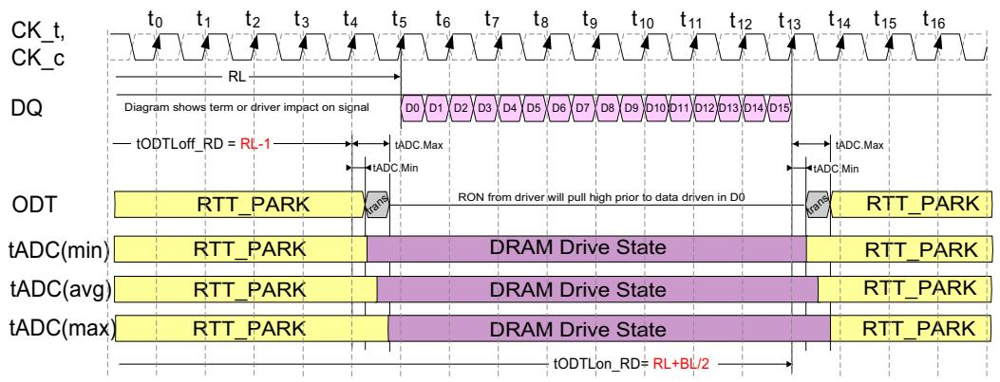  
NOTE 1 The diagram shows a transition from RTT PARK to Read DRAM Drive state. When tADC transitions from RTT to Read Drive state, the DRAM RON from the driver will keep the DQ signal high prior to the data driven in D0. No High-Z time during tADC is allowed in this example.  
NOTE 3 The DFE should assume that 4UI prior to D0 the signal is HIGH.

Figure 155 is an example showing the tADC(min), tADC(avg) and tADC(max) with respect to the RTT status and effects on the DQS lines prior to the burst.  
Figure 155 - tADC Clarification - Example 2 - DQS RTT Park to Read  
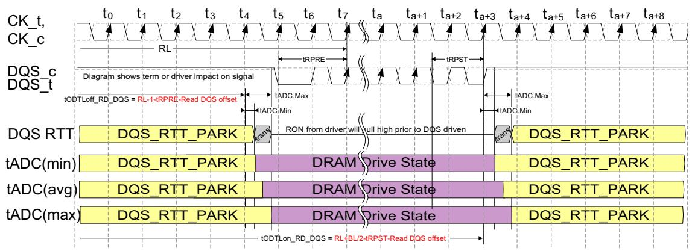  
NOTE 2 In the case of Term to Write, the host will keep the DQ signal HIGH 4UI prior to the data driven in D0.  
NOTE 1 The diagram shows a transition from DQS_RTT_PARK to Read DRAM Drive state. When tADC transitions from RTT to Read Drive state, the DRAM RON from the driver will keep the DQS signal high prior to the DQS driven at t5. No High-Z time during tADC is allowed in this example.

# 5.3.3 ODT Timing Diagrams

The following pages provide examples of ODT utilization timing diagrams. Examples of write to write, read to write and read to read are provided for clarification only. Implementations may vary, including termination on other DIMMS.

It is the controller's responsibility to manage command spacing and the programmable aspect of tODLon/ off times to ensure that preambles and postambles are included in the RTT ON time.

When there is a 1 tCK ODT control gap for any ODT operation (such as shown in Figure 156), the said gap's RTT value will be the same or smaller (stronger termination) than RTT PARK.

Note that all timings shown in Figures 156 through 167 are used as reference.

Figure 156 — Example 1 of Burst Write Operation ODT Latencies and Control Diagrams  
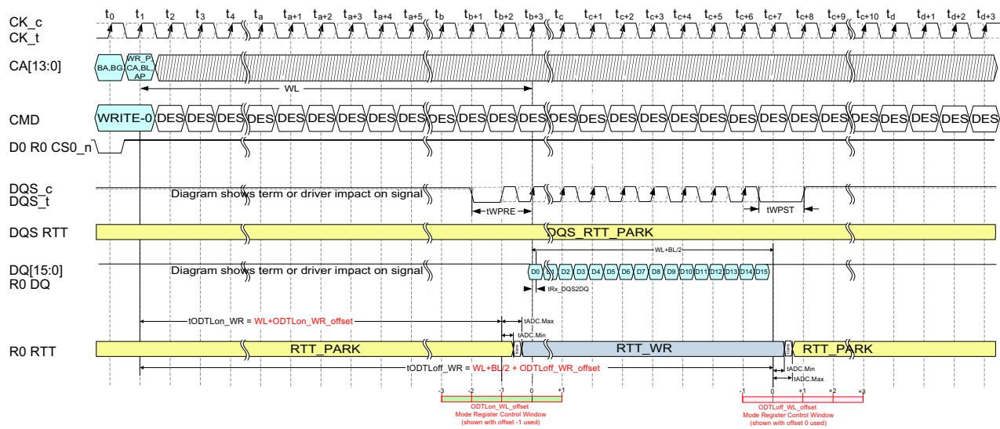  
NOTE 1 The entire range of ODTL control is not shown for simplicity.  
NOTE 2 Example details - 2tCK tWPRE, 1.5tCK tWPST, 0.5UI tRX_DQS2DQ, ODTLon_WL_offset configured for -1, ODTLoff_WL_offset configured for 0. Example shows how the host may aggressively adjust the offset of the tODTLon_WR timing to give tADC the min time to settle before data.  
NOTE 3 System designs & margins may vary requiring larger RTT_WR windows.

# 5.3.3 ODT Timing Diagrams (Cont'd)

Figure 157 — Example 2 of Burst Write Operation ODT Latencies and Control Diagrams  
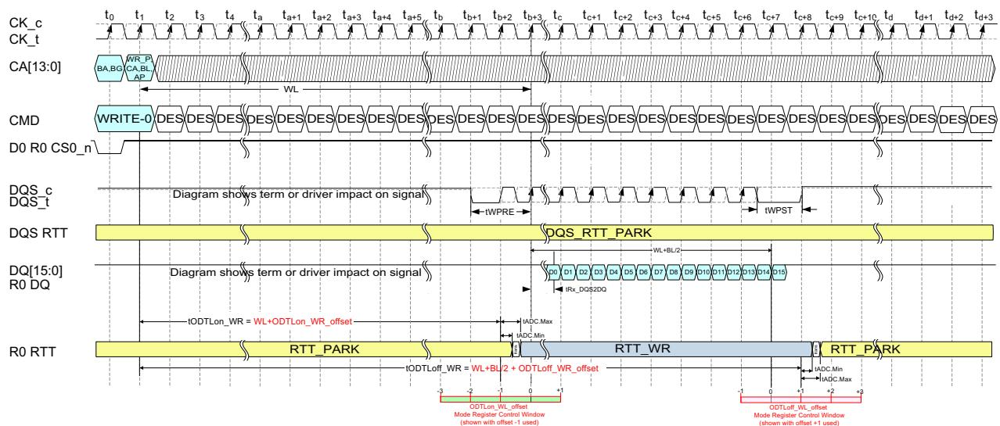  
NOTE 1 The entire range of ODTL control is not shown for simplicity.  
NOTE 2 Example details - 2tCK tWPRE, 1.5tCK tWPST, 1.5UI tRX_DQS2DQ, ODTLon_WL_offset configured for -1, ODTLoff_WL_offset configured for +1. Example shows how host may want to add an offset to the tODTLoff_WR time so that RTT_WR stays on for the actual burst.  
NOTE 3 System designs & margins may vary requiring larger RTT_WR windows.

Figure 158 — Example 3 of Burst Write Operation ODT Latencies and Control Diagrams  
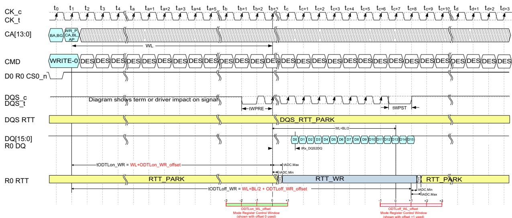  
NOTE 1 The entire range of ODTL control is not shown for simplicity.  
NOTE 2 Example details - 2tCK tWPRE, 1.5tCK tWPST, 3UI tRX_DQS2DQ, ODTLon_WL_offset configured for 0, ODTOff_WL_offset configured for +1. Example shows how host could leave the RTTRW on time to default values with no offset and may want to add an offset to the tODTLoff_WR time so that RTTRW stays on for the actual burst.  
NOTE 3 System designs & margins may vary requiring larger RTT_WR windows.

# 5.3.3 ODT Timing Diagrams (Cont'd)

Figure 159 — Example 4 of Burst Write Operation ODT Latencies and Control Diagrams  
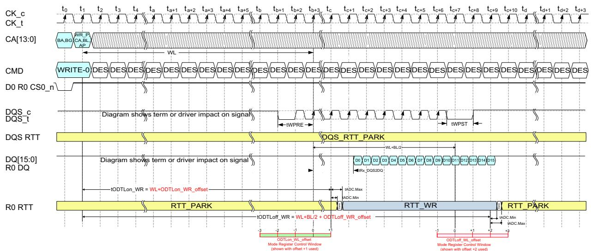  
NOTE 1 The entire range of ODTL control is not shown for simplicity.  
NOTE 2 Example details - 2tCK tWPRE, 1.5tCK tWPST, 5UI tRX_DQS2DQ, ODTLon_WL_offset configured for +1, ODTLoff_WL_offset configured for +2. Example shows an extreme case where data is significantly delayed from DQS and how the host may want to add an offset to the tODTLon_WR time so that RTT_WR doesn't turn on too early and how the host may want to delay the tODTLoff_WR time so that it says on for the burst.

Figure 160 — Example of Write to Write Turn Around, Different Ranks  
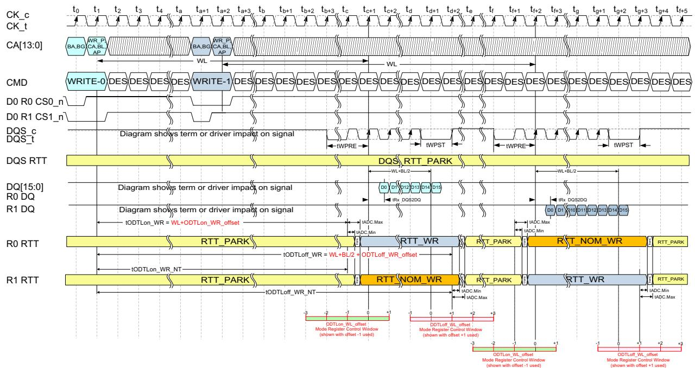  
NOTE 3 System designs & margins may vary requiring larger RTT_WR windows.  
NOTE 1 ODTLon_WR, ODTLon_WR_NT, ODTLoff_WR and ODTLoff_WR_NT are based on Mode Register settings that can push out or pull in the RTT enable and disable time.  
NOTE 2 The entire range of ODTL control is not shown for simplicity.

# 5.3.3 ODT Timing Diagrams (Cont'd)

Figure 161 — Write (BL16) to Write (BL16), Different Bank, Seamless Bursts  
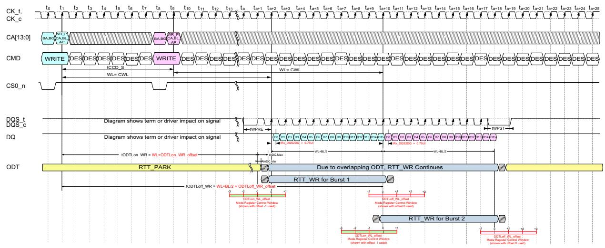  
NOTE 1 BL=16, Preamble=2tCK - 0010 pattern, Postamble=1.5tCK  
NOTE 2 DES commands are shown for ease of illustration; other commands may be valid at these times.  
NOTE 3 Figure shown with ODTLon_WR_offset=-1, ODTOff_WR_offset=0, tRX_DQS2DQ=0.75UI  
NOTE 4 In the case of Term to Write, the host will keep the DQ signal HIGH 4UI prior to the data driven in D0.

Figure 162 - Write (BL16) to Write (BL16), Different Bank, 1 tCK Gap  
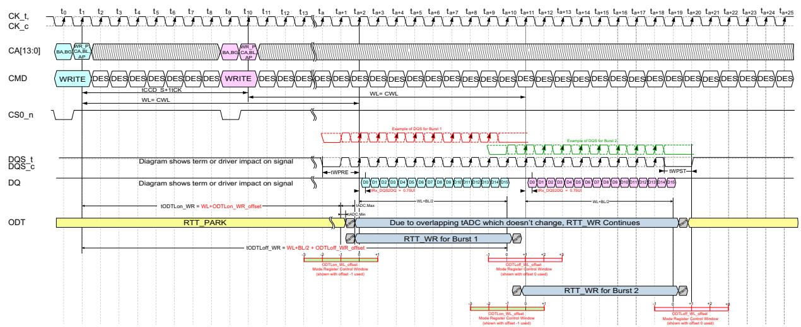  
NOTE 5 The DFE should assume that 4UI prior to D0 the signal is HIGH.  
NOTE 1 BL=16, Preamble=2tCK - 0010 pattern, Postamble=1.5tCK  
NOTE 2 DES commands are shown for ease of illustration; other commands may be valid at these times.  
NOTE 3 Figure shown with ODTLon_WR_offset  $= -1$  , ODTLoff_WR_offset  $= 0$  , tRX_DQS2DQ  $= 0.75$  UI  
NOTE 4 Read and Green DQS bursts are shown just for clarification purposes and are not part of an actual signal.  
NOTE 5 In the case of Term to Write, the host will keep the DQ signal HIGH 4UI prior to the data driven in D0.  
NOTE 6 The DFE should assume that 4UI prior to D0 the signal is HIGH.

# 5.3.3 ODT Timing Diagrams (Cont'd)

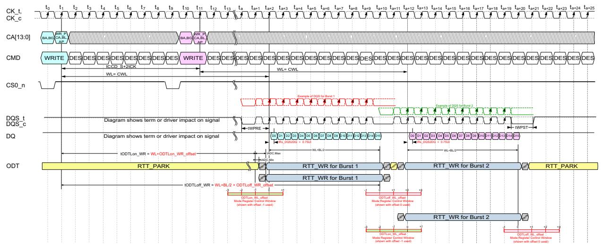  
NOTE 1 BL=16, Preamble=2tCK - 0010 pattern, Postamble=1.5tCK  
NOTE 2 DES commands are shown for ease of illustration; other commands may be valid at these times.  
NOTE 3 Figure shown with ODTLon_WR_offset=-1, ODTLoff_WR_offset=0, tRX_DQS2DQ=0.75UI  
NOTE 4 Read and Green DQS bursts are shown just for clarification purposes and are not part of an actual signal.  
NOTE 5 In the case of Term to Write, the host will keep the DQ signal HIGH 4UI prior to the data driven in D0.

Figure 163 - Write (BL16) to Write (BL16), Different Bank, 2 tCK Gap  
Figure 164 - Write (BL16) to Write (BL16), Different Bank, 3 tCK Gap  
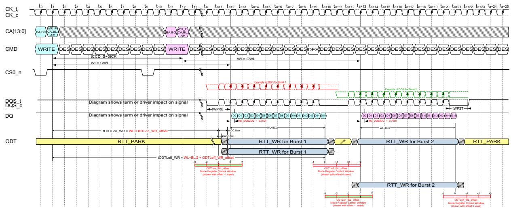  
NOTE 6 The DFE should assume that 4UI prior to D0 the signal is HIGH.  
NOTE 7 When there is a 1 tCK ODT control gap for any ODT operation (such as shown in Figure 156), the said gap's RTT value will be the same or smaller (stronger termination) than RTT PARK.  
NOTE 1 BL=16, Preamble=2tCK - 0010 pattern, Postamble=1.5tCK  
NOTE 2 DES commands are shown for ease of illustration; other commands may be valid at these times.  
NOTE 3 Figure shown with ODTLon_WR_offset=-1, ODTLoff_WR_offset=0, tRX_DQS2DQ=0.75UI  
NOTE 4 Read and Green DQS bursts are shown just for clarification purposes and are not part of an actual signal.  
NOTE 5 In the case of Term to Write, the host will keep the DQ signal HIGH 4UI prior to the data driven in D0.  
NOTE 6 The DFE should assume that 4UI prior to D0 the signal is HIGH.

# 5.3.3 ODT Timing Diagrams (Cont'd)

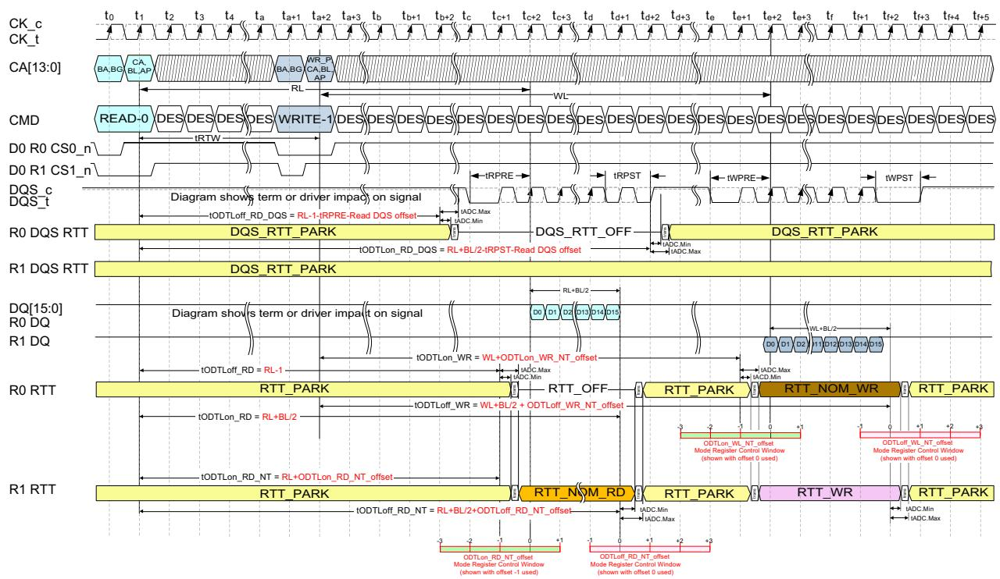  
NOTE 1 ODTLon_WR, ODTLon_WR_NT, ODTLoff_WR and ODTLoff_WR_NT are based on Mode Register settings that can push out or pull in the RTT enable and disable time.

Figure 165 — Example of Read to Write Turn Around, Different Ranks  
Figure 166 — Example of Burst Read Operation ODT Latencies and Control Diagrams  
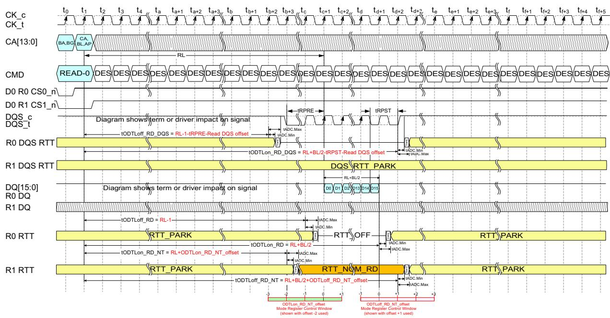  
NOTE 2 ODTLon_RD_NT and ODTLoff_RD_NT are based on Mode Register settings that can push out or pull in the RTT enable and disable time.  
NOTE 3 ODTLon_WR_offset and ODTLoff_WR_offset not shown for simplicity.  
NOTE 4 Example shown with near ideal timings for termination settings, exact offset configurations will vary based on system designs.  
NOTE 1 The entire range of ODTL control is not shown for simplicity.  
NOTE 2 Example shown with NT_ODT overlapping normal read disable by 1tCK on both sides (ODTLon_RD_NT_offset = -2 & ODTOff_RD_NT_offset = +1)

# 5.3.3 ODT Timing Diagrams (Cont'd)

Figure 167 — Example of Burst Read Operation with ODTLon_RD_NT_offset Set Incorrectly  
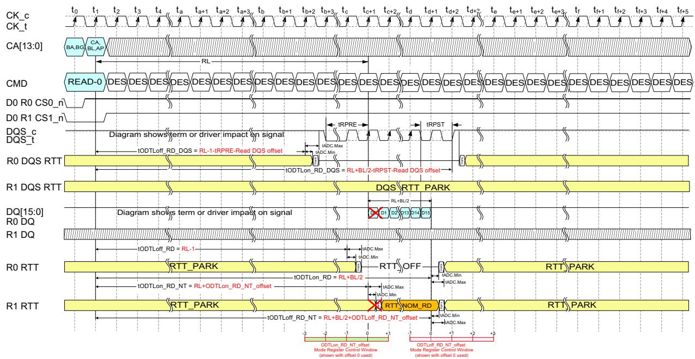  
NOTE 1 The entire range of ODTL control is not shown for simplicity.  
NOTE 2 Since the ODTLon_RD_NT Offset was left at zero offset and tADC still had to be considered, the NT RTT turned on too late for the non-target device. tADC is not instantaneous.  
NOTE 3 Since the tODTLoff_RD_NT is referenced from the RL, it is not affected by the offset used for the 'on' time and would turn off 1 clock earlier than the read disable RTT if programmed to zero offset. tODTLon_RD_NT and tODTLoff_RD_NT are independently set and calculated from RL.

# 5.4 On-Die Termination for CA, CS, CK_t, CK_c

The DDR5 DRAM includes ODT (On-Die Termination) termination resistance for CK_t, CK_c, CS and CA signals.

The ODT feature is designed to improve signal integrity of the memory channel by allowing the DRAM controller to turn on and off termination resistance for any target DRAM devices via MR setting.

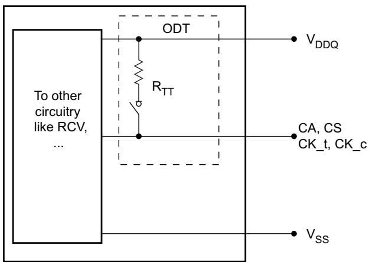  
Figure 168 — A Simple Functional Representation of the DRAM CA ODT Feature

The ODT termination resistance during power up will be set to the default values based on MR32 and MR33. The ODT resistance values can be configured by those same registers.

On-Die Termination effective resistance RTT is defined by MRS bits.

ODT is applied to CK_t, CK_c, CS and CA pins

$$
R T T = \frac {V D D Q - V o u t}{| I o u t |}
$$

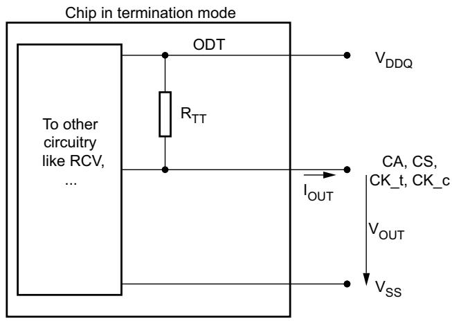  
Figure 169 — A Functional Representation of the On-Die Termination

# 5.4.1 Supported On-Die Termination Values

On-die termination effective Rtt values supported are 480, 240, 120, 80, 60, 40 ohms

Table 388 — ODT Electrical Characteristics RZQ=240Ω +/-1% Entire Temperature Operation Range; after Proper ZQ Calibration; VDD=VDDQ  

<table><tr><td>MR</td><td>RTT</td><td>Vout</td><td>Min</td><td>Nom</td><td>Max</td><td>Unit</td><td>Note</td></tr><tr><td rowspan="3">MR32 for CK &amp; CS
MR33 for CA</td><td rowspan="3">480Ω</td><td>VOLdc= 0.5* VDDQ</td><td>0.7</td><td>1</td><td>1.4</td><td>RZQ*2</td><td>1,2,3,5</td></tr><tr><td>VOMdc= 0.8* VDDQ</td><td>0.7</td><td>1</td><td>1.3</td><td>RZQ*2</td><td>1,2,3,5</td></tr><tr><td>VOHdc= 0.95* VDDQ</td><td>0.6</td><td>1</td><td>1.3</td><td>RZQ*2</td><td>1,2,3,5</td></tr><tr><td rowspan="3">MR32 for CK &amp; CS
MR33 for CA</td><td rowspan="3">240Ω</td><td>VOLdc= 0.5* VDDQ</td><td>0.9</td><td>1</td><td>1.25</td><td>RZQ</td><td>1,2,3,5</td></tr><tr><td>VOMdc= 0.8* VDDQ</td><td>0.9</td><td>1</td><td>1.1</td><td>RZQ</td><td>1,2,3,5</td></tr><tr><td>VOHdc= 0.95* VDDQ</td><td>0.8</td><td>1</td><td>1.1</td><td>RZQ</td><td>1,2,3,5</td></tr><tr><td rowspan="3">MR32 for CK &amp; CS
MR33 for CA</td><td rowspan="3">120Ω</td><td>VOLdc= 0.5* VDD</td><td>0.9</td><td>1</td><td>1.25</td><td>RZQ/2</td><td>1,2,3,5</td></tr><tr><td>VOMdc= 0.8* VDD</td><td>0.9</td><td>1</td><td>1.1</td><td>RZQ/2</td><td>1,2,3,5</td></tr><tr><td>VOHdc= 0.95* VDD</td><td>0.8</td><td>1</td><td>1.1</td><td>RZQ/2</td><td>1,2,3,5</td></tr><tr><td rowspan="3">MR32 for CK &amp; CS
MR33 for CA</td><td rowspan="3">80Ω</td><td>VOLdc= 0.5* VDDQ</td><td>0.9</td><td>1</td><td>1.25</td><td>RZQ/3</td><td>1,2,3,5</td></tr><tr><td>VOMdc= 0.8* VDDQ</td><td>0.9</td><td>1</td><td>1.1</td><td>RZQ/3</td><td>1,2,3,5</td></tr><tr><td>VOHdc= 0.95* VDDQ</td><td>0.8</td><td>1</td><td>1.1</td><td>RZQ/3</td><td>1,2,3,5</td></tr><tr><td rowspan="3">MR32 for CK &amp; CS
MR33 for CA</td><td rowspan="3">60Ω</td><td>VOLdc= 0.5* VDDQ</td><td>0.9</td><td>1</td><td>1.25</td><td>RZQ/4</td><td>1,2,3,5</td></tr><tr><td>VOMdc= 0.8* VDDQ</td><td>0.9</td><td>1</td><td>1.1</td><td>RZQ/4</td><td>1,2,3,5</td></tr><tr><td>VOHdc= 0.95* VDDQ</td><td>0.8</td><td>1</td><td>1.1</td><td>RZQ/4</td><td>1,2,3,5</td></tr><tr><td rowspan="3">MR32 for CK &amp; CS
MR33 for CA</td><td rowspan="3">40Ω</td><td>VOLdc= 0.5* VDDQ</td><td>0.9</td><td>1</td><td>1.25</td><td>RZQ/6</td><td>1,2,3,5</td></tr><tr><td>VOMdc= 0.8* VDDQ</td><td>0.9</td><td>1</td><td>1.1</td><td>RZQ/6</td><td>1,2,3,5</td></tr><tr><td>VOHdc= 0.95* VDDQ</td><td>0.8</td><td>1</td><td>1.1</td><td>RZQ/6</td><td>1,2,3,5</td></tr><tr><td colspan="2">Mismatch CA-CA within Device</td><td>0.8* VDDQ</td><td>0</td><td></td><td>10</td><td>%</td><td>1,2,4,5</td></tr></table>

NOTE 1 The tolerance limits are specified after calibration with stable voltage and temperature. For the behavior of the tolerance limits if temperature or voltage changes after calibration, see Chapter 6.  
NOTE 2 Pull-up ODT resistors are recommended to be calibrated at  $0.8^{*}\mathrm{VDDQ}$ . Other calibration schemes may be used to achieve the linearity spec shown in the table, e.g., calibration at  $0.5^{*}\mathrm{VDDQ}$  and  $0.95^{*}\mathrm{VDDQ}$ .  
NOTE 3 Measurement definition for RTT:bd  
NOTE 4 CA to CA mismatch within device variation for a given component including CS, CK_t and CK_c (characterized)

$$
\text {C A - C A M i s m a t c h i n a D e v i c e} = \left(\frac {R T T M a x - R T T M i n}{R T T N O M}\right) \times 1 0 0
$$

NOTE 5 Without ZQ calibration ODT effective RTT values have an increased tolerance of  $+/- 30\%$

# 5.5 On-Die Termination for Loopback Signals

The DDR5 DRAM includes ODT (On-Die Termination) termination resistance for the Loopback signals LBDQS and LBDQ.

The ODT feature is designed to improve signal integrity of the memory channel by allowing the DRAM controller to turn on and off termination resistance for any target DRAM devices via MR setting.

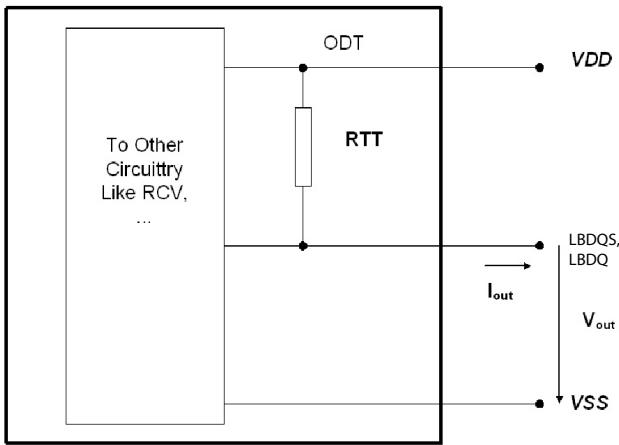  
Figure 170 — Functional Representation of Loopback ODT

The ODT termination resistance during power up will be set to the default values based on TBD. The ODT resistance values can be configured by MR TBD.

On-Die Termination effective resistance RTT is defined by MR bits TBD.

ODT is applied to Loopback signals LBDQS and LBDQ. On die termination effective Rtt values supported for the Loopback pins is 48 ohms.

$$
R T T = \frac {V D D Q - V o u t}{| l o u t |}
$$

Table 389 — ODT Electrical Characteristics RZQ=240Ω +/-1% Entire Temperature Operation Range; after Proper ZQ Calibration; VDD=VDDQ-  

<table><tr><td>RTT</td><td>Vout</td><td>Min</td><td>Nom</td><td>Max</td><td>Unit</td><td>NOTE</td></tr><tr><td rowspan="3">48 ohms</td><td>VOLdc= 0.5* VDDQ</td><td>0.9</td><td>1</td><td>1.25</td><td>RZQ/5</td><td>1,2,3</td></tr><tr><td>VOMdc= 0.8* VDDQ</td><td>0.9</td><td>1</td><td>1.1</td><td>RZQ/5</td><td>1,2,3</td></tr><tr><td>VOHdc= 0.95* VDDQ</td><td>0.8</td><td>1</td><td>1.1</td><td>RZQ/5</td><td>1,2,3</td></tr><tr><td>Mismatch LBDQS - LBDQ within device</td><td>VOMdc = 0.8* VDDQ</td><td>0</td><td></td><td>8</td><td>%</td><td>1,2,3,4</td></tr><tr><td colspan="7">NOTE 1 The tolerance limits are specified after calibration with stable voltage and temperature. For the behavior of the tolerance limits if temperature or voltage changes after calibration, see Chapter 6. 
NOTE 2 Pull-up ODT resistors are recommended to be calibrated at 0.8*VDDQ. Other calibration schemes may be used to achieve the linearity spec shown in the table, e.g., calibration at 0.5*VDDQ and 0.95*VDDQ. 
NOTE 3 Measurement definition for RTT:tbd 
NOTE 4 Loopback ODT mismatch within device variation for a given component including LBDQS and LBDQ 
LBDQS-LBDQ Mismatch in a Device = (RTTMax-RTTMin/RTTNOM) x 100</td></tr></table>

# 6 AC & DC Operating Conditions

# 6.1 Absolute Maximum Ratings

Table 390 — Absolute Maximum DC Ratings  

<table><tr><td>Symbol</td><td>Parameter</td><td>Rating</td><td>Units</td><td>NOTE</td></tr><tr><td>VDD</td><td>Voltage on VDD pin relative to Vss</td><td>-0.3 ~ 1.4</td><td>V</td><td>1,3</td></tr><tr><td>VDDQ</td><td>Voltage on VDDQ pin relative to Vss</td><td>-0.3 ~ 1.4</td><td>V</td><td>1,3</td></tr><tr><td>VPP</td><td>Voltage on VPP pin relative to Vss</td><td>-0.3 ~ 2.1</td><td>V</td><td>4</td></tr><tr><td>VIN, VOUT</td><td>Voltage on any pin relative to Vss</td><td>-0.3 ~ 1.4</td><td>V</td><td>1,3,5</td></tr><tr><td>TSTG</td><td>Storage Temperature</td><td>-55 to +100</td><td>°C</td><td>1,2</td></tr><tr><td>NOTE 1</td><td colspan="4">Stresses greater than those listed under “Absolute Maximum Ratings” may cause permanent damage to the device. This is a stress rating only and functional operation of the device at these or any other conditions exceeding those indicated in the operational sections of this specification is not implied. Exposure to absolute maximum rating conditions for extended periods may affect reliability</td></tr><tr><td>NOTE 2</td><td colspan="4">Storage Temperature is the case surface temperature on the center/top side of the DRAM. For the measurement conditions, please refer to JESD51-2 standard.</td></tr><tr><td>NOTE 3</td><td colspan="4">VDD and VDDQ must be within 300 mV of each other at all times. When VDD and VDDQ are less than 500 mV</td></tr><tr><td>NOTE 4</td><td colspan="4">VPP must be equal or greater than VDD/VDDQ at all times.</td></tr><tr><td>NOTE 5</td><td colspan="4">Overshoot area above 1.5 V is specified in Section 8.3.4, Section 8.3.5, and Section 8.3.6.</td></tr></table>

# 6.2 Recommended DC Operating Conditions

Table 391 — Recommended DC Operating Conditions  

<table><tr><td rowspan="2">Symbol</td><td rowspan="2">Parameter</td><td colspan="4">Low Freq Voltage Spec
Freq: DC to 2MHz</td><td colspan="2">Z(f) Spec
Freq: 2Mhz to
10Mhz</td><td colspan="2">Z(f) Spec
Freq: 20Mhz</td><td rowspan="2">Notes</td></tr><tr><td>Min.</td><td>Typ.</td><td>Max.</td><td>Unit</td><td>Zmax</td><td>Unit</td><td>Zmax</td><td>Unit</td></tr><tr><td>VDD</td><td>Device Supply Voltage</td><td>1.067
(-3%)</td><td>1.1</td><td>1.166
(+6%)</td><td>V</td><td>10</td><td>mOhm</td><td>20</td><td>mOhm</td><td>1,2,3</td></tr><tr><td>VDDQ</td><td>Supply Voltage for I/O</td><td>1.067
(-3%)</td><td>1.1</td><td>1.166
(+6%)</td><td>V</td><td>10</td><td>mOhm</td><td>20</td><td>mOhm</td><td>1,2,3</td></tr><tr><td>VPP</td><td>Core Power Voltage</td><td>1.746
(-3%)</td><td>1.8</td><td>1.908
(+6%)</td><td>V</td><td>10</td><td>mOhm</td><td>20</td><td>mOhm</td><td>3</td></tr><tr><td colspan="11">NOTE 1 VDD must be within 66mv of VDDQ
NOTE 2 AC parameters are measured with VDD and VDDQ tied together.
NOTE 3 This includes all voltage noise from DC to 2 MHz at the DRAM package ball.
NOTE 4 Z(f) is defined for all pins per voltage domain. Z(f) does not include the DRAM package and silicon die.</td></tr></table>

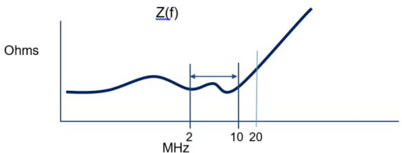  
Figure 171 — Zprofile/Z(f) of the System at the DRAM Package Solder Ball (without DRAM Component)

# 6.2 Recommended DC Operating Conditions (Cont'd)

A simplified electrical system load model for  $Z(\mathrm{F})$  with the general frequency response is shown in Figure 172. The resistance and inductance can be scaled to generalize the spec response to the DRAM pin.

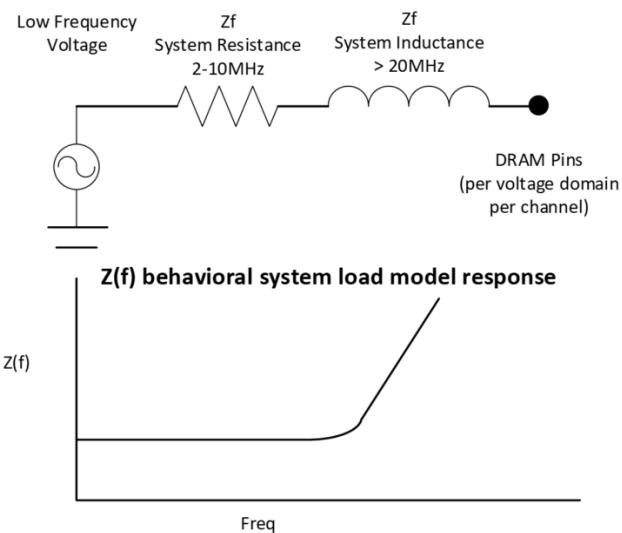  
Figure 172 — Simplified Z(f) Electrical Model And Frequency Response of PDN at the DRAM Pin without the DRAM Component

# 6.3 DRAM Component Operating Temperature Range

Table 392 — Recommended DC Operating Temperature Range  

<table><tr><td>Symbol</td><td>Parameter</td><td>Ratings</td><td>Units</td><td>Notes</td></tr><tr><td rowspan="2">TOPER</td><td>Normal Operating Temperature Range</td><td>0 to 85</td><td>°C</td><td>1,2,3</td></tr><tr><td>Extended Operating Temperature Range</td><td>85 to 95</td><td>°C</td><td>1,2,3,4</td></tr><tr><td>NOTE 1</td><td colspan="4">Operating Temperature is the case surface temperature on the center/top side of the DRAM. For the measurement conditions, please refer to JESD51-2 standard.</td></tr><tr><td>NOTE 2</td><td colspan="4">The Normal Temperature Range specifies the temperatures where all DRAM specifications will be supported. During operation, the DRAM case temperature must be maintained between 0 to 85°C under all operating conditions.</td></tr><tr><td>NOTE 3</td><td colspan="4">Operating Temperature for 3DS needs to be derated by the number of DRAM dies as: [TOPER - (2.5°C × log2N)], where N is the number of the stacked dies.</td></tr><tr><td>NOTE 4</td><td colspan="4">Some applications require operation of the DRAM in the Extended Temperature Range between 85°C and 95°C case temperature. Full specifications are supported in this range, but the following additional conditions apply: 
a. Refresh commands must be doubled in frequency, therefore reducing the Refresh interval tREFI to 3.9us. It is also possible to specify a component with 1X refresh (tREFI to 7.8us) in the Extended Temperature Range. Please refer to supplier&#x27;s datasheet and/or the DIMM SPD for option availability. 
b. If Self-Refresh operation is required in the Extended Temperature Range, then it is mandatory to either use the Manual Self-Refresh mode with Extended Temperature Range capability (MR2 A6=0b and MR2 A7=1b) or enable the optional Auto Self-Refresh mode (MR2 A6=1b and MR2 A7=0b). Please refer to the supplier&#x27;s datasheet and/or the DIMM SPD for Auto Self-Refresh option availability. Extended Temperature Range support and tREFI requirements in the Extended Temperature Range.</td></tr></table>

# 7 AC & DC Global Definitions

7.1 Transmitter (Tx), Receiver (Rx) and Channel Definitions TBD  
7.2 Bit Error Rate

7.2.1 Introduction

This section provides an overview of the Bit Error Rate (BER) and the desired Statistical Level of Confidence.

7.2.2 General Equation

$$
n = \left(\frac {1}{B E R}\right) \left[ - \ln (1 - S L C) + \ln \left(\sum_ {k = 0} ^ {N} \frac {(n \cdot B E R) ^ {k}}{k !}\right) \right]
$$

Where:

$\mathbf{n} =$  number of bits in a trial

SLC = statistical level of confidence

BER = Bit Error Rate

$\mathbf{k} =$  intermediate number of specific errors found in trial

$\mathrm{N} =$  number of errors recorded during trial

If no, errors are assumed in a given test period, the second term drops out and the equation becomes:

$$
n = \left(\frac {1}{B E R}\right) \left[ - \ln \left(1 - S L C\right) \right]
$$

JEDEC recommends testing to  $99.5\%$  confidence levels; however, one may choose a number that is viable for their own manufacturing levels. To determine how many bits of data should be sent (again, assuming zero errors, or  $\mathrm{N} = 0$ ), using  $\mathrm{BER} = \mathrm{E}^{-9}$  and confidence level  $\mathrm{SLC} = 99.5\%$ , the result is  $\mathrm{n} = (1 / \mathrm{BER})(-\ln (1 - 0.995) = 5.298 \times 10^{9}$ .

Results for commonly used confidence levels of  $99.5\%$  down to  $70\%$  are shown in Table 393.

# 7.2.2 General Equation (Cont'd)

Table 393 — Estimated Number of Transmitted Bits (n) for the Confidence Level of 70% to 99.5%  

<table><tr><td rowspan="2">Number Errors</td><td colspan="8">n = -ln(1-SLC)/BER</td></tr><tr><td>99.5%</td><td>99%</td><td>95%</td><td>90%</td><td>85%</td><td>80%</td><td>75%</td><td>70%</td></tr><tr><td>0</td><td>5.298/BER</td><td>4.61/BER</td><td>2.99/BER</td><td>2.3/BER</td><td>1.90/BER</td><td>1.61/BER</td><td>1.39/BER</td><td>1.20/BER</td></tr></table>

# 7.2.3 Minimum Bit Error Rate (BER) Requirements

Table 394 specifies the UIavg and Bit Error Rate requirements over which certain receiver and transmitter timing and voltage specifications need to be validated assuming a  $99.5\%$  confidence level at  $\mathrm{BER} = \mathrm{E}^{-9}$ .

Table 394 — Minimum BER Requirements for Rx/Tx Timing and Voltage Tests for DDR5-3200 to 6400  

<table><tr><td rowspan="2">Parameter</td><td rowspan="2">Symbol</td><td colspan="3">DDR5-3200-4800</td><td colspan="3">DDR55200-6400</td><td rowspan="2">Unit</td><td rowspan="2">Notes</td></tr><tr><td>Min</td><td>Nom</td><td>Max</td><td>Min</td><td>Nom</td><td>Max</td></tr><tr><td>Average UI</td><td>UIAVG</td><td>0.999* nominal</td><td>1000/f</td><td>1.001* nominal</td><td>0.999* nominal</td><td>1000/f</td><td>1.001* nominal</td><td>ps</td><td>1</td></tr><tr><td>Number of UI (min)</td><td>NMin_UL_Validation</td><td>5.3x109</td><td>-</td><td>-</td><td>5.3x109</td><td>-</td><td>-</td><td>UI</td><td>2</td></tr><tr><td>Bit Error Rate</td><td>BERLane</td><td>-</td><td>-</td><td>E-16</td><td>-</td><td>-</td><td>E-16</td><td>Events</td><td>3,4,5</td></tr><tr><td>NOTE 1</td><td colspan="9">Average UI size, “f” is data rate</td></tr><tr><td>NOTE 2</td><td colspan="9"># of UI over which certain Rx/Tx timing and voltage specifications need to be validated assuming a 99.5% confidence level at BER=E-9.</td></tr><tr><td>NOTE 3</td><td colspan="9">This is a system parameter. It is the raw bit error rate for every lane before any logical PHY or link layer based correction. It may not be possible to have a validation methodology for this parameter for a standalone transmitter or standalone receiver, therefore, this parameter has to be validated in selected systems using a suitable methodology as deemed by the platform.</td></tr><tr><td>NOTE 4</td><td colspan="9">Bit Error Rate per lane. This is a raw bit error rate before any correction. This parameter is primarily used to determine electrical margins during electrical analysis and measurements that are located between two interconnected devices.</td></tr><tr><td>NOTE 5</td><td colspan="9">This is the minimum BER requirements for testing timing and voltage parameters listed in Input Clock Jitter, Rx DQS &amp; DQ Voltage Sensitivity, Rx DQS Jitter Sensitivity, Rx DQ Stressed Eye, Tx DQS Jitter, Tx DQ Jitter, and Tx DQ Stressed EH/EW specifications.</td></tr></table>

# 7.3 Unit Interval and Jitter Definitions

This document describes the UI and NUI Jitter definitions associated with the Jitter parameters specified in Rx Stressed Eye, Tx DQS Jitter, Tx DQ Jitter and Input Clock Jitter specifications.

# 7.3.1 Unit Interval (UI)

The times at which the differential crossing points of the clock occur are defined at t1, t2, ..., tn-1, tn,..., tK. The UI at index "n" is defined as shown in <Bold>Figure 173 (with n=1,2,...) from an arbitrary time in steady state, where n=0 is chosen as the starting crossing point.

Mathematical definition of UI is shown in Figure 173 and Figure 174.

$$
U I _ {n} = t _ {n} - t _ {n - 1}
$$

For the Single-Ended data, the unit interval time starts when the signal crosses a pre-specified reference voltage. For the differential clock, the unit interval time starts when the CK_t and CK_c intersect (see Figure 174).

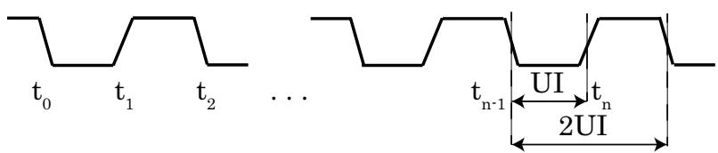  
Figure 173 — UI Definition in Terms of Adjacent Edge Timings  
Figure 174 — UI Definition Using Clock Waveforms  
Figure 175 — UI Jitter for “nth” UI Definition (in Terms of Ideal UI)

# 7.3.2 UI Jitter Definition

If a number of UI edges are computed or measured at times t1, t2, ..., tn-1, tn,..., tK, where K is the maximum number of samples, then the UI jitter at any instance "n" is defined in Figure 175, where T = the ideal UI size.

$$
U I (j i t) _ {n} = \left(t _ {n} - t _ {n - 1}\right) - T, \quad n = 1, 2, 3, \dots , K
$$

In a large sample with random Gaussian-like jitter (therefore very close to symmetric distribution), the average of all UI sizes usually turns out to be very close to the ideal UI size.

The equation described in Figure 175 assumes starting from an instant steady state, where  $n = 0$  is chosen as the starting point.

1 UI = one bit, which means 2 UI = one full cycle or time period of the forwarded strobe. Example: For 6.4 GT/s signaling, the forwarded strobe frequency is 3.2 GHz, or 1 UI = 156.25 ps.

Deterministic jitter is analyzed in terms of the peak-to-peak value and in terms of specific frequency components present in the jitter, isolating the causes for each frequency. Random jitter is unbounded and analyzed in terms of statistical distribution to convert to a bit error rate (BER) for the link.

# 7.3.3 UI-UI Jitter Definition

UI-UI (read as "UI to UI") jitter is defined to be the jitter between two consecutive UI as shown in Figure 176.

$$
\Delta U I _ {n} = U I _ {n} - U I _ {n - 1} \quad n = 2, 3, \dots , K
$$

Figure 176 — UI-UI Jitter Definitions

# 7.3.4 Accumulated Jitter (Over "N" UI)

Accumulated jitter is defined as the jitter accumulated over any consecutive "N" UI as shown in Figure 177.

$$
T _ {a c c} ^ {N} = \sum_ {p = m} ^ {m + N - 1} \left(U I _ {p} - \overline {{U I}}\right) \quad m = 1, 2, \dots , K - N
$$

Figure 177 — Definition of Accumulated Jitter (over “N” UI)

where  $\overline{\mathrm{UI}}$  is defined in the equation shown in Figure 178.

$$
\overline {{\mathrm {U I}}} = \frac {\sum_ {\mathrm {p} = 1} ^ {\mathrm {K}} \mathrm {U I} _ {\mathrm {p}}}{\mathrm {K}} \quad \mathrm {p = 1 , 2 , \ldots , N , \ldots , K}
$$

Figure 178 — Definition of UI

8

# AC & DC Input Measurement Levels

# 8.1 Overshoot and Undershoot Specifications for CAC TBD

# 8.2 CA Rx Voltage and Timings

Note that the following spec assumes internal CA VREF. If the VREF is external, the specs will be modified accordingly.

The command and address (CA) including CS input receiver compliance mask for voltage and timing is shown in Figure 179. All CA, CS signals apply the same compliance mask and operate in single data rate mode.

The CA input receiver mask for voltage and timing is shown in Figure 179 is applied across all CA pins. The receiver mask (Rx Mask) defines the area that the input signal must not encroach in order for the DRAM input receiver to be expected to be able to successfully capture a valid input signal; it is not the valid data-eye.

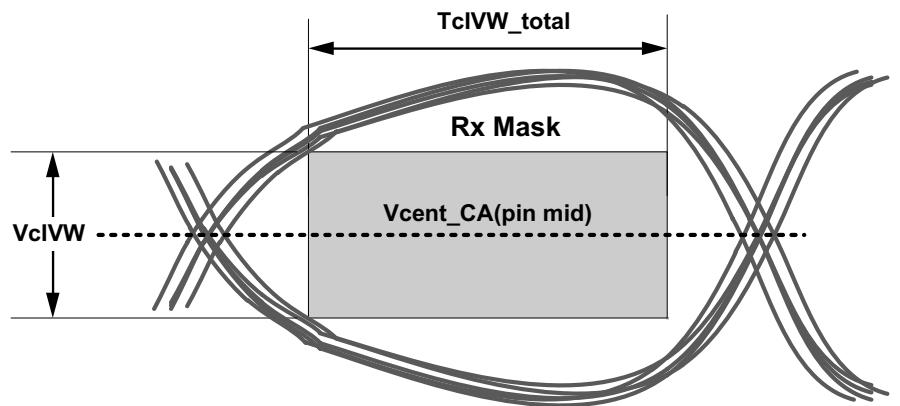  
Figure 179 — CA Receiver (Rx) Mask

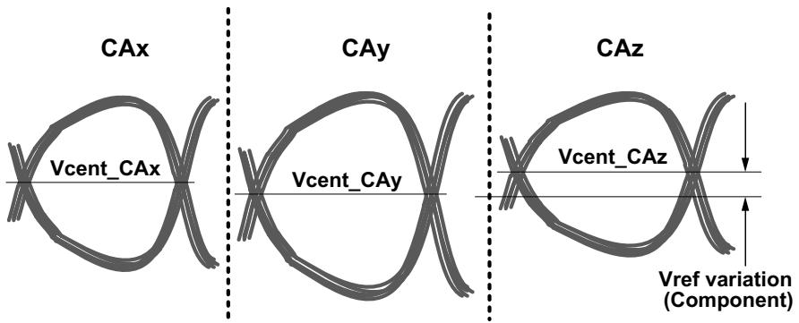  
Figure 180 — Across Pin  $\mathbf{V}_{\mathrm{REF}}$ CA Voltage Variation

Vcent_CA(pin mid) is defined as the midpoint between the largest Vcent_CA voltage level and the smallest Vcent_CA voltage level across all CA and CS pins for a given DRAM component. Each CA Vcent level is defined by the center, i.e., widest opening, of the cumulative data input eye as depicted in Figure 181. This clarifies that any DRAM component level variation must be accounted for within the DRAM CA Rx mask. The component level  $\mathrm{V}_{\mathrm{REF}}$  will be set by the system to account for Ron and ODT settings.

# 8.2 CA Rx Voltage and Timings (Cont'd)

CK_t, CK_c Data-in at DRAM Pin  
Minimum CA Eye center aligned  
Figure 181 — CA Timings at the DRAM Pins  
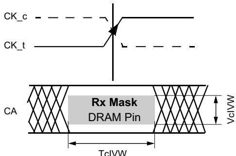  
TcIVW for all CA signals is defined as centered on  
the CK_t/CK_c crossing at the DRAM pin.

All of the timing terms in Figure 1 are measured from the CK_t/CK_c to the center (midpoint) of the TcIVW window taken at the VcIVW_total voltage levels centered around Vcent_CA (pin mid).

Figure 182 — CA TcIPW and SRIN_cIVW Definition (for Each Input Pulse)  
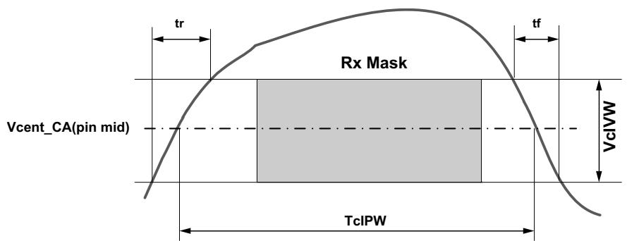  
NOTE 1 SRIN_cIVW=VcIVW_Total/(tr or tf), signal must be monotonic with tr and Tf range.

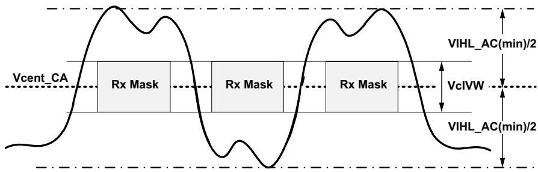  
Figure 183 — CA VIHL_AC Definition (for Each Input Pulse)

# 8.2 CA Rx Voltage and Timings (Cont'd)

Table 395 — DRAM CA, CS Parametric Values for DDR5-3200 to 4800  

<table><tr><td rowspan="2">Parameter</td><td rowspan="2">Symbol</td><td colspan="2">DDR5-3200</td><td colspan="2">DDR5-3600</td><td colspan="2">DDR5-4000</td><td colspan="2">DDR5-4400</td><td colspan="2">DDR5-4800</td><td rowspan="2">Unit</td><td rowspan="2">Notes</td></tr><tr><td>Min</td><td>Max</td><td>Min</td><td>Max</td><td>Min</td><td>Max</td><td>Min</td><td>Max</td><td>Min</td><td>Max</td></tr><tr><td>Rx Mask voltage - p-p</td><td>VciVW</td><td>-</td><td>140</td><td>-</td><td>140</td><td>-</td><td>140</td><td>-</td><td>130</td><td>-</td><td>130</td><td>mV</td><td>1,2,4</td></tr><tr><td>Rx Timing Window</td><td>TclVW</td><td>-</td><td>0.2</td><td>-</td><td>0.2</td><td>-</td><td>0.2</td><td>-</td><td>0.2</td><td>-</td><td>0.2</td><td>UI*</td><td>1,2,3,4,8</td></tr><tr><td>CA Input Pulse Amplitude</td><td>VIHL_AC</td><td>-</td><td>160</td><td>-</td><td>160</td><td>-</td><td>160</td><td>-</td><td>150</td><td>-</td><td>150</td><td>mV</td><td>7</td></tr><tr><td>CA Input Pulse Width</td><td>TclPW</td><td>0.58</td><td></td><td>0.58</td><td></td><td>0.58</td><td></td><td>0.58</td><td></td><td>0.58</td><td></td><td>UI*</td><td>5,8</td></tr><tr><td>Input Slew Rate over VcIVW</td><td>SRIN_clVW</td><td>1</td><td>7</td><td>1</td><td>7</td><td>1</td><td>7</td><td>1</td><td>7</td><td>1</td><td>7</td><td>V/ns</td><td>6</td></tr><tr><td colspan="14">NOTE 1 CA Rx mask voltage and timing parameters at the pin including voltage and temperature drift.</td></tr><tr><td colspan="14">NOTE 2 Rx mask voltage VcIVW total(max) must be centered around Vcent_CA(pin mid).</td></tr><tr><td colspan="14">NOTE 3 Rx differential CA to CK jitter total timing window at the VcIVW voltage levels.</td></tr><tr><td colspan="14">NOTE 4 Defined over the CA internal VREF range. The Rx mask at the pin must be within the internal VREF CA range irrespective of the input signal common mode.</td></tr><tr><td colspan="14">NOTE 5 CA only minimum input pulse width defined at the Vcent_CA(pin mid).</td></tr><tr><td colspan="14">NOTE 6 Input slew rate over VcIVW Mask centered at Vcent_CA(pin mid).</td></tr><tr><td colspan="14">NOTE 7 VIHL_AC does not have to be met when no transitions are occurring.</td></tr><tr><td colspan="14">NOTE 8 * UI=CK(avg)min</td></tr></table>

Table 396 — DRAM CA, CS Parametric Values for DDR5-5200 to 6400  

<table><tr><td rowspan="2">Parameter</td><td rowspan="2">Symbol</td><td colspan="2">DDR5-5200</td><td colspan="2">DDR5-5600</td><td colspan="2">DDR5-6000</td><td colspan="2">DDR5-6400</td><td rowspan="2">Unit</td><td rowspan="2">Notes</td></tr><tr><td>Min</td><td>Max</td><td>Min</td><td>Max</td><td>Min</td><td>Max</td><td>Min</td><td>Max</td></tr><tr><td>Rx Mask voltage - p-p</td><td>VciVW</td><td>-</td><td>TBD</td><td>-</td><td>TBD</td><td>-</td><td>TBD</td><td>-</td><td>TBD</td><td>mV</td><td>1,2,4</td></tr><tr><td>Rx Timing Window</td><td>TclVW</td><td>-</td><td>TBD</td><td>-</td><td>TBD</td><td>-</td><td>TBD</td><td>-</td><td>TBD</td><td>UI*</td><td>1,2,3,4,8</td></tr><tr><td>CA Input Pulse Amplitude</td><td>VIHL_AC</td><td>-</td><td>TBD</td><td>-</td><td>TBD</td><td>-</td><td>TBD</td><td>-</td><td>TBD</td><td>mV</td><td>7</td></tr><tr><td>CA Input Pulse Width</td><td>TclPW</td><td>TBD</td><td></td><td>TBD</td><td></td><td>TBD</td><td></td><td>TBD</td><td></td><td>UI*</td><td>5,8</td></tr><tr><td>Input Slew Rate over VcIVW</td><td>SRIN_clVW</td><td>1</td><td>7</td><td>1</td><td>7</td><td>1</td><td>7</td><td>1</td><td>7</td><td>V/ns</td><td>6</td></tr><tr><td colspan="12">NOTE 1 1. CA Rx mask voltage and timing parameters at the pin including voltage and temperature drift.</td></tr><tr><td colspan="12">NOTE 2 Rx mask voltage VcIVW total(max) must be centered around Vcent_CA(pin mid).</td></tr><tr><td colspan="12">NOTE 3 Rx differential CA to CK jitter total timing window at the VcIVW voltage levels.</td></tr><tr><td colspan="12">NOTE 4 Defined over the CA internal VREF range. The Rx mask at the pin must be within the internal VREF CA range irrespective of the input signal common mode.</td></tr><tr><td colspan="12">NOTE 5 CA only minimum input pulse width defined at the Vcent_CA(pin mid).</td></tr><tr><td colspan="12">NOTE 6 Input slew rate over VcIVW Mask centered at Vcent_CA(pin mid).</td></tr><tr><td colspan="12">NOTE 7 VIHL_AC does not have to be met when no transitions are occurring.</td></tr><tr><td colspan="12">* UI=tck(avg)min</td></tr></table>

# 8.3 Input Clock Jitter Specification

# 8.3.1 Overview

The clock is being driven to the DRAM either by the RCD for L/RDIMM modules, or by the host for U/SODIMM modules (Figure 184).

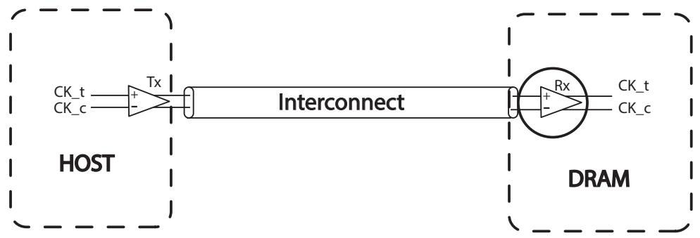  
Figure 184 — Host Driving Clock Signals to the DRAM

# 8.3.2 Specification for DRAM Input Clock Jitter

The Random Jitter (Rj) specified is a random jitter meeting a Gaussian distribution. The Deterministic Jitter (Dj) specified is bounded. Input clock violating the min/max jitter values may result in malfunction of the DDR5 SDRAM device.

Table 397 — DRAM Input Clock Jitter Specifications for DDR5-3200 to 4400  
BUJ=Bounded Uncorrelated Jitter; DCD=Duty Cycle Distortion; Dj=Deterministic Jitter; Rj=Random Jitter; Tj=Total jitter; pp=Peak-to-Peak  

<table><tr><td rowspan="2">Parameter</td><td rowspan="2">Symbol</td><td colspan="2">DDR5-3200</td><td colspan="2">DDR5-3600</td><td colspan="2">DDR5-4000</td><td colspan="2">DDR5-4400</td><td colspan="2">DDR5-4800</td><td rowspan="2">Unit</td><td rowspan="2">Notes</td></tr><tr><td>Min</td><td>Max</td><td>Min</td><td>Max</td><td>Min</td><td>Max</td><td>Min</td><td>Max</td><td>Min</td><td>Max</td></tr><tr><td>DRAM Reference clock frequency</td><td>tCK</td><td>0.9999* f0</td><td>1.0001* f0</td><td>0.9999* f0</td><td>1.0001* f0</td><td>0.9999* f0</td><td>1.0001* f0</td><td>0.9999* f0</td><td>1.0001* f0</td><td>0.9999* f0</td><td>1.0001* f0</td><td>MHz</td><td>1,11</td></tr><tr><td>Duty Cycle Error</td><td>tCK_Duty_UL_Error</td><td>-</td><td>0.05</td><td>-</td><td>0.05</td><td>-</td><td>0.05</td><td>-</td><td>0.05</td><td></td><td>0.05</td><td>UI</td><td>1,4,11</td></tr><tr><td>RJ RMS value of 1-UJ Jitter</td><td>tCK_1UI_R-NoBUJ</td><td>-</td><td>0.0037</td><td>-</td><td>0.0037</td><td>-</td><td>0.0037</td><td>-</td><td>0.0037</td><td>-</td><td>0.0037</td><td>UI (RMS)</td><td>3,5,11</td></tr><tr><td>Dj pp value of 1-UJ Jitter</td><td>tCK_1UI_D-NoBUJ</td><td>-</td><td>0.030</td><td>-</td><td>0.030</td><td>-</td><td>0.030</td><td>-</td><td>0.030</td><td>-</td><td>0.030</td><td>UI</td><td>3,6,11</td></tr><tr><td>Tj value of 1-UJ Jitter</td><td>tCK_1UI_T-NoBUJ</td><td>-</td><td>0.090</td><td>-</td><td>0.090</td><td>-</td><td>0.090</td><td>-</td><td>0.090</td><td>-</td><td>0.090</td><td>UI</td><td>3,6,11</td></tr><tr><td>Rj RMS value of N-UJ Jitter, where N=2,3</td><td>tCK_NUI_R-NoBUJ, where N=2,3</td><td>-</td><td>0.0040</td><td>-</td><td>0.0040</td><td>-</td><td>0.0040</td><td>-</td><td>0.0040</td><td>-</td><td>0.0040</td><td>UI (RMS)</td><td>3,7,11</td></tr><tr><td>Dj pp value of N-UJ Jitter, where N=2,3</td><td>tCK_NUI_D-NoBUJ, where N=2,3</td><td>-</td><td>0.074</td><td>-</td><td>0.074</td><td>-</td><td>0.074</td><td>-</td><td>0.074</td><td>-</td><td>0.074</td><td>UI</td><td>3,7,11</td></tr><tr><td>Tj value of N-UJ Jitter, where N=2,3</td><td>tCK_NUI_T-NoBUJ, where N=2,3</td><td>-</td><td>0.140</td><td>-</td><td>0.140</td><td>-</td><td>0.140</td><td>-</td><td>0.140</td><td>-</td><td>0.140</td><td>UI</td><td>3,8,11</td></tr><tr><td>Rj RMS value of N-UJ Jitter, where N=4,5,6,...,30</td><td>tCK_NUI_R-NoBUJ, where N=4,5,6,...,30</td><td>-</td><td>TBD</td><td>-</td><td>TBD</td><td>-</td><td>TBD</td><td>-</td><td>TBD</td><td>-</td><td>TBD</td><td>UI (RMS)</td><td>3,9,11,12</td></tr></table>

BUJ=Bounded Uncorrelated Jitter; DCD=Duty Cycle Distortion; Dj=Deterministic Jitter; Rj=Random Jitter; Tj=Total jitter; pp=Peak-to-Peak

Table 397 — DRAM Input Clock Jitter Specifications for DDR5-3200 to 4400 (Cont'd)  

<table><tr><td rowspan="2">Parameter</td><td rowspan="2">Symbol</td><td colspan="2">DDR5-3200</td><td colspan="2">DDR5-3600</td><td colspan="2">DDR5-4000</td><td colspan="2">DDR5-4400</td><td colspan="2">DDR5-4800</td><td rowspan="2">Unit</td><td rowspan="2">Notes</td></tr><tr><td>Min</td><td>Max</td><td>Min</td><td>Max</td><td>Min</td><td>Max</td><td>Min</td><td>Max</td><td>Min</td><td>Max</td></tr><tr><td>Dj pp value of N-UIJitter, N=4,5,6,...,30</td><td>tCK_NUI_D_J_NoBUJ, where N=4,5,6,...,30</td><td>-</td><td>TBD</td><td>-</td><td>TBD</td><td>-</td><td>TBD</td><td>-</td><td>TBD</td><td>-</td><td>TBD</td><td>UI</td><td>3,10,11,12</td></tr><tr><td>Tj value of N-UIJitter, N=4,5,6,...,30</td><td>tCK_NUI_T_J_NoBUJ, where N=4,5,6,...,30</td><td>-</td><td>TBD</td><td>-</td><td>TBD</td><td>-</td><td>TBD</td><td>-</td><td>TBD</td><td>-</td><td>TBD</td><td>UI</td><td>3,10,11,12</td></tr><tr><td>NOTE 1</td><td colspan="13">f0 = Data Rate/2, example: if data rate is 3200MT/s, then f0=1600</td></tr><tr><td>NOTE 2</td><td colspan="13">Rise and fall time slopes (V / msec) are measured between +100 mV and -100 mV of the differential output of reference clock</td></tr><tr><td>NOTE 3</td><td colspan="13">On-die noise similar to that occurring with all the transmitter and receiver lanes toggling need to be stimulated. When there is no socket in transmitter measurement setup, in many cases, the contribution of the cross-talk is not significant or can be estimated within tolerable error even with all the transmitter lanes sending patterns. When a socket is present, such as DUT being DRAM component, the contribution of the cross-talk could be significant. To minimize the impact of crosstalk on the measurement results, a small group of selected lanes in the vicinity of the lane under test may be turned off (sending DC), while the remaining Tx lanes send patterns to the corresponding Rx receivers so as to excite realistic on-die noise profile from device switching. Note that there may be cases when one of Dj and Rj specs is met and another violated in which case the signaling analysis should be run to determine link feasibility</td></tr><tr><td>NOTE 4</td><td colspan="13">Duty Cycle Error defined as absolute difference between average value of all UI with that of average of odd UI, which in magnitude would equal absolute difference between average of all UI and average of all even UI.</td></tr><tr><td>NOTE 5</td><td colspan="13">Rj RMS value of 1-UI jitter without BUJ, but on-die system-like noise present. This extraction is to be done after software correction of DCD</td></tr><tr><td>NOTE 6</td><td colspan="13">Dj pp value of 1-UI jitter (after software assisted DCC). Without BUJ, but on-die system like noise present. Dj indicates Djdd of dual-Dirac fitting, after software correction of DCD</td></tr><tr><td>NOTE 7</td><td colspan="13">Rj RMS value of N-UI jitter without BUJ, but on-die system like noise present. Evaluated for 1 &lt; N &lt; 4. This extraction is to be done after software correction of DCD</td></tr><tr><td>NOTE 8</td><td colspan="13">Dj pp value of N-UI jitter without BUJ, but on-die system like noise present. Evaluated for 1 &lt; N &lt; 4. Dj indicates Djdd of dual-Dirac fitting, after software correction of DCD</td></tr><tr><td>NOTE 9</td><td colspan="13">Rj RMS value of N-UI jitter without BUJ, but on-die system like noise present. Evaluated for 3 &lt; N &lt; 31. This extraction is to be done after software correction of DCD</td></tr><tr><td>NOTE 10</td><td colspan="13">Dj pp value of N-UI jitter without BUJ, but on-die system like noise present. Evaluated for 3 &lt; N &lt; 31. Dj indicates Djdd of dual-Dirac fitting, after software correction of DCD</td></tr><tr><td>NOTE 11</td><td colspan="13">The validation methodology for these parameters will be covered in future ballots</td></tr><tr><td>NOTE 12</td><td colspan="13">If the clock meets total jitter Tj at BER of 1E-16, then meeting the individual Rj and Dj components of the spec can be considered optional. Tj is defined as Dj + 16.2*Rj for BER of 1E-16</td></tr></table>

BUJ=Bounded Uncorrelated Jitter; DCD=Duty Cycle Distortion; Dj=Deterministic Jitter; Rj=Random Jitter; Tj=Total jitter; pp=Peak-to-Peak

Table 398 — DRAM Input Clock Jitter Specifications for DDR5-5200 to 6400  

<table><tr><td rowspan="2">Parameter</td><td rowspan="2">Symbol</td><td colspan="2">DDR5-5200</td><td colspan="2">DDR5-5600</td><td colspan="2">DDR5-6000</td><td colspan="2">DDR5-6400</td><td rowspan="2">Unit</td><td rowspan="2">Notes</td></tr><tr><td>Min</td><td>Max</td><td>Min</td><td>Max</td><td>Min</td><td>Max</td><td>Min</td><td>Max</td></tr><tr><td>DRAM Reference clock frequency</td><td>tCK</td><td>0.9999* f0</td><td>1.0001* f0</td><td>0.9999* f0</td><td>1.0001* f0</td><td>0.9999* f0</td><td>1.0001* f0</td><td>0.9999* f0</td><td>1.0001* f0</td><td>MHz</td><td>1,11</td></tr><tr><td>Duty Cycle Error</td><td>tCK_Duty_UL_Error</td><td>-</td><td>TBD</td><td>-</td><td>TBD</td><td>-</td><td>TBD</td><td>-</td><td>TBD</td><td>UI</td><td>1,4,11</td></tr><tr><td>Rj RMS value of 1-UI Jitter</td><td>tCK_1UI_Rj_NoBUJ</td><td>-</td><td>TBD</td><td>-</td><td>TBD</td><td>-</td><td>TBD</td><td>-</td><td>TBD</td><td>UI (RMS)</td><td>3,5,11</td></tr><tr><td>Dj pp value of 1-UI Jitter</td><td>tCK_1UI_Dj_NoBUJ</td><td>-</td><td>TBD</td><td>-</td><td>TBD</td><td>-</td><td>TBD</td><td>-</td><td>TBD</td><td>UI</td><td>3,6,11</td></tr><tr><td>Tj value of 1-UI Jitter</td><td>tCK_1UI_Tj_NoBUJ</td><td>-</td><td>TBD</td><td>-</td><td>TBD</td><td>-</td><td>TBD</td><td>-</td><td>TBD</td><td>UI</td><td>3,6,11</td></tr><tr><td>Rj RMS value of N-UI Jitter, where N=2,3</td><td>tCK_NUI_Rj_NoBUJ, where N=2,3</td><td>-</td><td>TBD</td><td>-</td><td>TBD</td><td>-</td><td>TBD</td><td>-</td><td>TBD</td><td>UI (RMS)</td><td>3,7,11</td></tr><tr><td>Dj pp value of N-UI Jitter, where N=2,3</td><td>tCK_NUI_Dj_NoBUJ, where N=2,3</td><td>-</td><td>TBD</td><td>-</td><td>TBD</td><td>-</td><td>TBD</td><td>-</td><td>TBD</td><td>UI</td><td>3,7,11</td></tr><tr><td>Tj value of N-UI Jitter, where N=2,3</td><td>tCK_NUI_Tj_NoBUJ, where N=2,3</td><td>-</td><td>TBD</td><td>-</td><td>TBD</td><td>-</td><td>TBD</td><td>-</td><td>TBD</td><td>UI</td><td>3,8,11</td></tr><tr><td>Rj RMS value of N-UI Jitter, where N=4,5,6,...,30</td><td>tCK_NUI_Rj_NoBUJ, where N=4,5,6,...,30</td><td>-</td><td>TBD</td><td>-</td><td>TBD</td><td>-</td><td>TBD</td><td>-</td><td>TBD</td><td>UI (RMS)</td><td>3,9,11,12</td></tr></table>

Table 398 — DRAM Input Clock Jitter Specifications for DDR5-5200 to 6400 (Cont'd)  
BUJ=Bounded Uncorrelated Jitter; DCD=Duty Cycle Distortion; Dj=Deterministic Jitter; Rj=Random Jitter; Tj=Total jitter; pp=Peak-to-Peak  

<table><tr><td rowspan="2">Parameter</td><td rowspan="2">Symbol</td><td colspan="2">DDR5-5200</td><td colspan="2">DDR5-5600</td><td colspan="2">DDR5-6000</td><td colspan="2">DDR5-6400</td><td rowspan="2">Unit</td><td rowspan="2">Notes</td></tr><tr><td>Min</td><td>Max</td><td>Min</td><td>Max</td><td>Min</td><td>Max</td><td>Min</td><td>Max</td></tr><tr><td>Dj pp value of N-UI Jitter, N=4,5,6,...,30</td><td>tCK_NUI_Dj_NoBUJ, where N=4,5,6,...,30</td><td>-</td><td>TBD</td><td>-</td><td>TBD</td><td>-</td><td>TBD</td><td>-</td><td>TBD</td><td>UI</td><td>3,10,11,12</td></tr><tr><td>Tj value of N-UI Jitter, N=4,5,6,...,30</td><td>tCK_NUI_Tj_NoBUJ, where N=4,5,6,...,30</td><td>-</td><td>TBD</td><td>-</td><td>TBD</td><td>-</td><td>TBD</td><td>-</td><td>TBD</td><td>UI</td><td>3,10,11,12</td></tr><tr><td>NOTE 1</td><td colspan="11">f0 = Data Rate/2, example: if data rate is 3200MT/s, then f0=1600</td></tr><tr><td>NOTE 2</td><td colspan="11">Rise and fall time slopes (V / nsec) are measured between +100 mV and -100 mV of the differential output of reference clock</td></tr><tr><td>NOTE 3</td><td colspan="11">On-die noise similar to that occurring with all the transmitter and receiver lanes toggling need to be stimulated. When there is no socket in transmitter measurement setup, in many cases, the contribution of the cross-talk is not significant or can be estimated within tolerable error even with all the transmitter lanes sending patterns. When a socket is present, such as DUT being DRAM component, the contribution of the cross-talk could be significant. To minimize the impact of crosstalk on the measurement results, a small group of selected lanes in the vicinity of the lane under test may be turned off (sending DC), while the remaining Tx lanes send patterns to the corresponding Rx receivers so as to excite realistic on-die noise profile from device switching. Note that there may be cases when one of Dj and Rj specs is met and another violated in which case the signaling analysis should be run to determine link feasibility</td></tr><tr><td>NOTE 4</td><td colspan="11">Duty Cycle Error defined as absolute difference between average value of all UI with that of average of odd UI, which in magnitude would equal absolute difference between average of all UI and average of all even UI.</td></tr><tr><td>NOTE 5</td><td colspan="11">Rj RMS value of 1-UI jitter without BUJ, but on-die system-like noise present. This extraction is to be done after software correction of DCD</td></tr><tr><td>NOTE 6</td><td colspan="11">Dj pp value of 1-UI jitter (after software assisted DCC). Without BUJ, but on-die system like noise present. Dj indicates Djdd of dual-Dirac fitting, after software correction of DCD</td></tr><tr><td>NOTE 7</td><td colspan="11">Rj RMS value of N-UI jitter without BUJ, but on-die system like noise present. Evaluated for 1 &lt; N &lt; 4. This extraction is to be done after software correction of DCD</td></tr><tr><td>NOTE 8</td><td colspan="11">Dj pp value of N-UI jitter without BUJ, but on-die system like noise present. Evaluated for 1 &lt; N &lt; 4. Dj indicates Djdd of dual-Dirac fitting, after software correction of DCD</td></tr><tr><td>NOTE 9</td><td colspan="11">Rj RMS value of N-UI jitter without BUJ, but on-die system like noise present. Evaluated for 3 &lt; N &lt; 31. This extraction is to be done after software correction of DCD</td></tr><tr><td>NOTE 10</td><td colspan="11">Dj pp value of N-UI jitter without BUJ, but on-die system like noise present. Evaluated for 3 &lt; N &lt; 31. Dj indicates Djdd of dual-Dirac fitting, after software correction of DCD</td></tr><tr><td>NOTE 11</td><td colspan="11">The validation methodology for these parameters will be covered in future ballots</td></tr><tr><td>NOTE 12</td><td colspan="11">If the clock meets total jitter TJ at BER of 1E-16, then meeting the individual Rj and Dj components of the spec can be considered optional. TJ is defined as Dj + 16.2*Rj for BER of 1E-16</td></tr></table>

# 8.3.2 Specification for DRAM Input Clock Jitter (Cont'd)

[BUJ=Bounded Uncorrelated Jitter; DCD=Duty Cycle Distortion; Dj=Deterministic Jitter; Rj=Random Jitter; Tj=Total jitter; pp=Peak-to-Peak]

Table 399 — DRAM Input Clock Jitter Specifications for DDR5-6800 to 8400  

<table><tr><td rowspan="2">Parameter</td><td rowspan="2">Symbol</td><td colspan="2">DORS-8800</td><td colspan="2">DORS-7200</td><td colspan="2">DORS-7800</td><td colspan="2">DORS-8000</td><td colspan="2">DORS-8400</td><td rowspan="2">Unit</td><td rowspan="2">Notes</td></tr><tr><td>Min</td><td>Max</td><td>Min</td><td>Max</td><td>Min</td><td>Max</td><td>Min</td><td>Max</td><td>Min</td><td>Max</td></tr><tr><td>DRAM Reference clock frequency</td><td>tCK</td><td>0.9999* f0</td><td>1.0001* f0</td><td>0.9999* f0</td><td>1.0001* f0</td><td>0.9999* f0</td><td>1.0001* f0</td><td>0.9999* f0</td><td>1.0001* f0</td><td>0.9999* f0</td><td>1.0001* f0</td><td>MHz</td><td>1,11</td></tr><tr><td>Duty Cycle Error</td><td>tCK_Duty_UL_Error</td><td>-</td><td>TBD</td><td>-</td><td>TBD</td><td>-</td><td>TBD</td><td>-</td><td>TBD</td><td>-</td><td>TBD</td><td>UI</td><td>1,4,11</td></tr><tr><td>RJ RMS value of 1-UI Jitter</td><td>tCK_1UI_Rj_NoBUJ</td><td>-</td><td>TBD</td><td>-</td><td>TBD</td><td>-</td><td>TBD</td><td>-</td><td>TBD</td><td>-</td><td>TBD</td><td>UI (RMS)</td><td>3,5,11</td></tr><tr><td>DJ pp value of 1-UI Jitter</td><td>tCK_1UI_Dj_NoBUJ</td><td>-</td><td>TBD</td><td>-</td><td>TBD</td><td>-</td><td>TBD</td><td>-</td><td>TBD</td><td>-</td><td>TBD</td><td>UI</td><td>3,6,11</td></tr><tr><td>TJ value of 1-UI Jitter</td><td>tCK_1UI_Tj_NoBUJ</td><td>-</td><td>TBD</td><td>-</td><td>TBD</td><td>-</td><td>TBD</td><td>-</td><td>TBD</td><td>-</td><td>TBD</td><td>UI</td><td>3,6,11</td></tr><tr><td>RJ RMS value of N-UI Jitter, where N=2,3</td><td>tCK_NUI_Rj_NoBUJ, where N=2,3</td><td>-</td><td>TBD</td><td>-</td><td>TBD</td><td>-</td><td>TBD</td><td>-</td><td>TBD</td><td>-</td><td>TBD</td><td>UI (RMS)</td><td>3,7,11</td></tr><tr><td>DJ pp value of N-UI Jitter, where N=2,3</td><td>tCK_NUI_Dj_NoBUJ, where N=2,3</td><td>-</td><td>TBD</td><td>-</td><td>TBD</td><td>-</td><td>TBD</td><td>-</td><td>TBD</td><td>-</td><td>TBD</td><td>UI</td><td>3,7,11</td></tr><tr><td>TJ value of N-UI Jitter, where N=2,3</td><td>tCK_NUI_Tj_NoBUJ, where N=2,3</td><td>-</td><td>TBD</td><td>-</td><td>TBD</td><td>-</td><td>TBD</td><td>-</td><td>TBD</td><td>-</td><td>TBD</td><td>UI</td><td>3,8,11</td></tr><tr><td>RJ RMS value of N-UI Jitter, where N=4,5,6,...,30</td><td>tCK_NUI_Rj_NoBUJ, where N=4,5,6,...,30</td><td>-</td><td>TBD</td><td>-</td><td>TBD</td><td>-</td><td>TBD</td><td>-</td><td>TBD</td><td>-</td><td>TBD</td><td>UI (RMS)</td><td>3,9,11,12</td></tr><tr><td>DJ pp value of N-UI Jitter, N=4,5,6,...,30</td><td>tCK_NUI_Dj_NoBUJ, where N=4,5,6,...,30</td><td>-</td><td>TBD</td><td>-</td><td>TBD</td><td>-</td><td>TBD</td><td>-</td><td>TBD</td><td>-</td><td>TBD</td><td>UI</td><td>3,10,11,12</td></tr><tr><td>TJ value of N-UI Jitter, N=4,5,6,...,30</td><td>tCK_NUI_Tj_NoBUJ, where N=4,5,6,...,30</td><td>-</td><td>TBD</td><td>-</td><td>TBD</td><td>-</td><td>TBD</td><td>-</td><td>TBD</td><td>-</td><td>TBD</td><td>UI</td><td>3,10,11,12</td></tr><tr><td colspan="14">NOTE 1 f0 = Data Rate/2, example: if data rate is 3200MT/s, then f0=1600</td></tr><tr><td colspan="14">NOTE 2 Rise and fall time slopes (V / msec) are measured between +100 mV and -100 mV of the differential output of reference clock</td></tr><tr><td colspan="14">NOTE 3 On-die noise similar to that occurring with all the transmitter and receiver lanes toggling need to be stimulated. When there is no socket in transmitter measurement setup, in many cases, the contribution of the cross-talk is not significant or can be estimated within tolerable error even with all the transmitter lanes sending patterns. When a socket is present, such as DUT being DRAM component, the contribution of the cross-talk could be significant. To minimize the impact of crosstalk on the measurement results, a small group of selected lanes in the vicinity of the lane under test may be turned off (sending DC), while the remaining Tx lanes send patterns to the corresponding Rx receivers so as to excite realistic on-die noise profile from device switching. Note that there may be cases when one of DJ and RJ specs is met and another violated in which case the signaling analysis should be run to determine link feasibility</td></tr><tr><td colspan="14">NOTE 4 Duty Cycle Error defined as absolute difference between average value of all UI with that of average of odd UI, which in magnitude would equal absolute difference between average of all UI and average of all even UI.</td></tr><tr><td colspan="14">NOTE 5 RJ RMS value of 1-UI jitter without BUJ, but on-die system-like noise present. This extraction is to be done after software correction of DCD</td></tr><tr><td colspan="14">NOTE 6 Dj pp value of 1-UI jitter (after software assisted DCC). Without BUJ, but on-die system like noise present. Dj indicates Djdd of dual-Dirac fitting, after software correction of DCD</td></tr><tr><td colspan="14">NOTE 7 RJ RMS value of N-UI jitter without BUJ, but on-die system like noise present. Evaluated for 1 &lt; N &lt; 4. This extraction is to be done after software correction of DCD</td></tr><tr><td colspan="14">NOTE 8 Dj pp value of N-UI jitter without BUJ, but on-die system like noise present. Evaluated for 1 &lt; N &lt; 4. Dj indicates Djdd of dual-Dirac fitting, after software correction of DCD</td></tr><tr><td colspan="14">NOTE 9 RJ RMS value of N-UI jitter without BUJ, but on-die system like noise present. Evaluated for 3 &lt; N &lt; 31. This extraction is to be done after software correction of DCD</td></tr><tr><td colspan="14">NOTE 10 Dj pp value of N-UI jitter without BUJ, but on-die system like noise present. Evaluated for 3 &lt; N &lt; 31. Dj indicates Djdd of dual-Dirac fitting, after software correction of DCD</td></tr><tr><td colspan="14">NOTE 11 The validation methodology for these parameters will be covered in future ballots</td></tr><tr><td colspan="14">NOTE 12 If the clock meets total jitter TJ at BER of 1E-16, then meeting the individual RJ and DJ components of the spec can be considered optional. TJ is defined as DJ + 16.2*Rj for BER of 1E-16</td></tr></table>

# 8.4 Differential Input Clock (CK_t, CK_c) Cross Point Voltage (VIX)

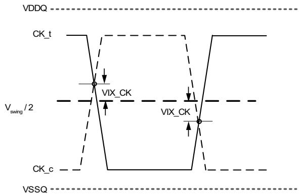  
Figure 185 — VIX Definition (CK)

Table 400 — Crosspoint Voltage (VIX) for Differential Input Clock  

<table><tr><td rowspan="2">Parameter</td><td rowspan="2">Symbol</td><td colspan="2">DDR5-3200 - 4800</td><td colspan="2">DDR5-5200 - 6400</td><td colspan="2">DDR5-6800 - 8400</td><td rowspan="2">Unit</td><td rowspan="2">Notes</td></tr><tr><td>Min</td><td>Max</td><td>Min</td><td>Max</td><td>Min</td><td>Max</td></tr><tr><td>Clock differential input crosspoint voltage ratio</td><td>VIX_CK_Ratio</td><td>-</td><td>TBD</td><td>-</td><td>TBD</td><td>-</td><td>TBD</td><td>%</td><td>1,2</td></tr><tr><td colspan="10">NOTE 1 The VIX_CK voltage is referenced to Vswing/2(mean) = (CK_t voltage + CK_c voltage) /2, where the mean is over TBD UI
NOTE 2 VIX_CK_Ratio = (VIX_CK / Vdiff)*100%, where Vdiff = |CK_t voltage - CK_c voltage|</td></tr></table>

Table 401 — Crosspoint Voltage (VIX) for Differential Input Clock for DDR5-5200 to 6400  

<table><tr><td rowspan="2">Parameter</td><td rowspan="2">Symbol</td><td colspan="2">DDR5-5200</td><td colspan="2">DDR5-5600</td><td colspan="2">DDR5-6000</td><td colspan="2">DDR5-6400</td><td rowspan="2">Unit</td><td rowspan="2">Notes</td></tr><tr><td>Min</td><td>Max</td><td>Min</td><td>Max</td><td>Min</td><td>Max</td><td>Min</td><td>Max</td></tr><tr><td>Clock differential input crosspoint voltage ratio</td><td>VIX_CK_Ratio</td><td>-</td><td>TBD</td><td>-</td><td>TBD</td><td>-</td><td>TBD</td><td>-</td><td>TBD</td><td>%</td><td>1,2</td></tr><tr><td colspan="12">NOTE 1 The VIX_CK voltage is referenced to Vswing/2(mean) = (CK_t voltage + CK_c voltage) /2, where the mean is over TBD UI
NOTE 2 VIX_CK_Ratio = (VIX_CK / Vdiffpk-pk)*100%, where Vdiffpk-pk = |CK_t voltage - CK_c voltage|*2</td></tr></table>

Table 402 — Crosspoint Voltage (VIX) for Differential Input Clock for DDR5-6800 to 8400  

<table><tr><td rowspan="2">Parameter</td><td rowspan="2">Symbol</td><td colspan="2">DDR5-6800</td><td colspan="2">DDR5-7200</td><td colspan="2">DDR5-7600</td><td colspan="2">DDR5-8000</td><td colspan="2">DDR5-8400</td><td rowspan="2">Unit</td><td rowspan="2">Notes</td></tr><tr><td>Min</td><td>Max</td><td>Min</td><td>Max</td><td>Min</td><td>Max</td><td>Min</td><td>Max</td><td>Min</td><td>Max</td></tr><tr><td>Clock differential input crosspoint voltage ratio</td><td>VIX_CK_Ratio</td><td>-</td><td>TBD</td><td>-</td><td>TBD</td><td>-</td><td>TBD</td><td>-</td><td>TBD</td><td>-</td><td>TBD</td><td>%</td><td>1,2</td></tr><tr><td colspan="14">NOTE 1 The VIX_CK voltage is referenced to Vswing/2(mean) = (CK_t voltage + CK_c voltage) /2, where the mean is over TBD UI
NOTE 2 VIX_CK_Ratio = (VIX_CK / Vdiffpk-pk)*100%, where Vdiffpk-pk = |CK_t voltage - CK_c voltage|*2</td></tr></table>

# 8.5 Differential Input Clock Voltage Sensitivity

The differential input clock voltage sensitivity test provides the methodology for testing the receiver's sensitivity to clock by varying input voltage in the absence of Inter-Symbol Interference (ISI), jitter (Rj, Dj, DCD) and crosstalk noise. This specifies the Rx voltage sensitivity requirement. The system input swing to the DRAM must be larger than the DRAM Rx at the specified BER

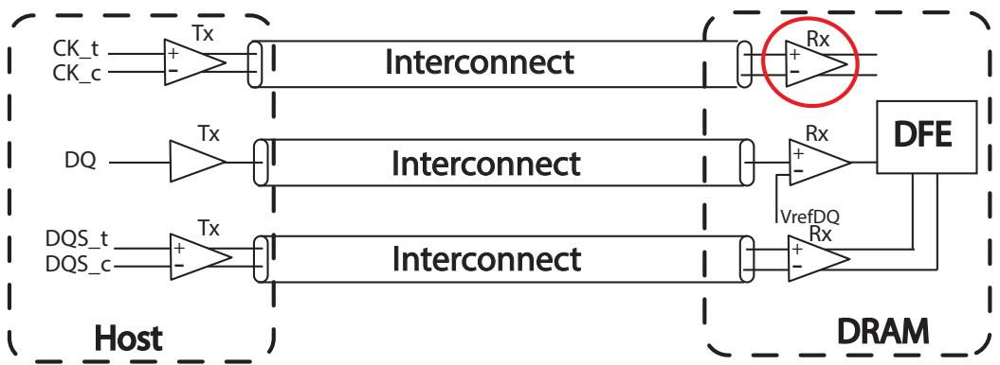  
Figure 186 — Example of DDR5 Memory Interconnect

# 8.5.1 Differential Input Clock Voltage Sensitivity Parameter

Differential input clock (CK_t, CK_c) VRx_CK is defined and measured as shown in Table 403. The clock receiver must pass the minimum BER requirements for DDR5.

Table 403 — Differential Input Clock Voltage Sensitivity Parameter for DDR5-3200 to 4800  

<table><tr><td rowspan="2">Parameter</td><td rowspan="2">Symbol</td><td colspan="2">DDR5-3200</td><td colspan="2">DDR5-3600</td><td colspan="2">DDR5-4000</td><td colspan="2">DDR5-4400</td><td colspan="2">DDR5-4800</td><td rowspan="2">Unit</td><td rowspan="2">Notes</td></tr><tr><td>Min</td><td>Max</td><td>Min</td><td>Max</td><td>Min</td><td>Max</td><td>Min</td><td>Max</td><td>Min</td><td>Max</td></tr><tr><td>Input Clock Voltage Sensitivity (differential pp)</td><td>VRx_CK</td><td>-</td><td>200</td><td>-</td><td>200</td><td>-</td><td>180</td><td>-</td><td>180</td><td>-</td><td>160</td><td>mV</td><td>1,2</td></tr><tr><td colspan="14">NOTE 1 Refer to Section 7.2.3 for the minimum BER requirements for DDR5NOTE 2 The validation methodology for this parameter will be covered in future ballot(s)</td></tr></table>

Table 404 — Differential Input Clock Voltage Sensitivity Parameter for DDR5-5200 to 6400  

<table><tr><td rowspan="2">Parameter</td><td rowspan="2">Symbol</td><td colspan="2">DDR5-5200</td><td colspan="2">DDR5-5600</td><td colspan="2">DDR5-6000</td><td colspan="2">DDR5-6400</td><td rowspan="2">Unit</td><td rowspan="2">Notes</td></tr><tr><td>Min</td><td>Max</td><td>Min</td><td>Max</td><td>Min</td><td>Max</td><td>Min</td><td>Max</td></tr><tr><td>Input Clock Voltage Sensitivity (differential pp)</td><td>VRx_CK</td><td>-</td><td>TBD</td><td>-</td><td>TBD</td><td>-</td><td>TBD</td><td>-</td><td>TBD</td><td>mV</td><td>1,2</td></tr><tr><td colspan="12">NOTE 1 Refer to Section 7.2.3 for the minimum BER requirements for DDR5NOTE 2 The validation methodology for this parameter will be covered in future ballot(s)</td></tr></table>

# 8.5.1 Differential Input Clock Voltage Sensitivity Parameter (Cont'd)

Table 405 — Differential Input Clock Voltage Sensitivity Parameter for DDR5-6800 to 8400  

<table><tr><td rowspan="2">Parameter</td><td rowspan="2">Symbol</td><td colspan="2">DDR5-6800</td><td colspan="2">DDR5-7200</td><td colspan="2">DDR5-7600</td><td colspan="2">DDR5-8000</td><td colspan="2">DDR5-8400</td><td rowspan="2">Unit</td><td rowspan="2">Notes</td></tr><tr><td>Min</td><td>Max</td><td>Min</td><td>Max</td><td>Min</td><td>Max</td><td>Min</td><td>Max</td><td>Min</td><td>Max</td></tr><tr><td>Input Clock Voltage Sensitivity (differential pp)</td><td>VRx_CK</td><td>-</td><td>TBD</td><td>-</td><td>TBD</td><td>-</td><td>TBD</td><td>-</td><td>TBD</td><td>-</td><td>TBD</td><td>mV</td><td>1,2</td></tr><tr><td colspan="14">NOTE 1 Refer to the minimum BER requirements for DDR5NOTE 2 The validation methodology for this parameter will be covered in future ballot(s)</td></tr></table>

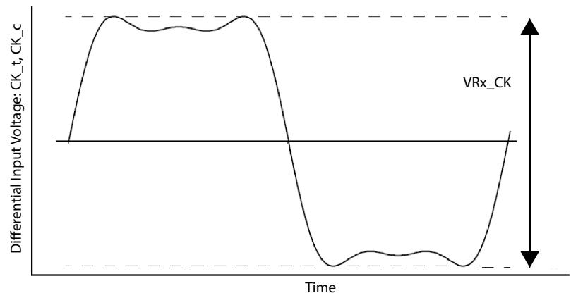  
Figure 187—VRx_CK

# 8.5.2 Differential Input Voltage Levels for Clock

Table 406 — Differential Clock (CK_t, CK_c) Input Levels for DDR5-3200 to DDR5-6400  

<table><tr><td>From</td><td>Parameter</td><td>DDR5
3200-6400</td><td>Note</td></tr><tr><td>VIHdiffCK</td><td>Differential input high measurement level (CK_t, CK_c)</td><td>0.75 x Vdiffpk-pk</td><td>1,2</td></tr><tr><td>VILdiffCK</td><td>Differential input low measurement level (CK_t, CK_c)</td><td>0.25 x Vdiffpk-pk</td><td>1,2</td></tr><tr><td colspan="4">NOTE 1 Vdiffpk-pk defined in Figure 188
NOTE 2 Vdiffpk-pk is the mean high voltage minus the mean low voltage over TBD samples
NOTE 3 All parameters are defined over the entire clock common mode range</td></tr></table>

Table 407 — Differential Clock (CK_t, CK_c) Input Levels for DDR5-6800 to DDR5-6800  

<table><tr><td>From</td><td>Parameter</td><td>DDR5
8800-8400</td><td>Note</td></tr><tr><td>VlHdiffCK</td><td>Differential input high measurement level (CK_t, CK_c)</td><td>0.75 x Vdiffpk-pk</td><td>1,2</td></tr><tr><td>VILdiffCK</td><td>Differential input low measurement level (CK_t, CK_c)</td><td>0.25 x Vdiffpk-pk</td><td>1,2</td></tr><tr><td colspan="4">NOTE 1 Vdiffpk-pk defined in Figure 188
NOTE 2 Vdiffpk-pk is the mean high voltage minus the mean low voltage over TBD samples
NOTE 3 All parameters are defined over the entire clock common mode range</td></tr></table>

# 8.5.3 Differential Input Slew Rate Definition for Clock (CK_t, CK_c)

Input slew rate for differential signals (CK_t, CK_c) are defined and measured as shown in Figure 188 and Tables 408 through 410.

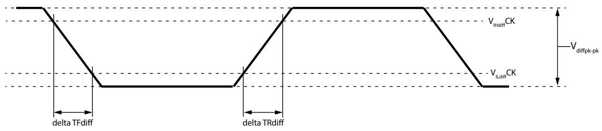  
Figure 188 — Differential Input Slew Rate Definition for CK_t, CK_c

Table 408 — Differential Input Slew Rate Definition for CK_t, CK_c  

<table><tr><td rowspan="2">Parameter</td><td colspan="2">Measured</td><td rowspan="2">Defined by</td><td rowspan="2">Notes</td></tr><tr><td>From</td><td>To</td></tr><tr><td>Differential Input slew rate for rising edge (CK_t - CK_c)</td><td>VIL_diffCK</td><td>VIL_diffCK</td><td>(VIH_diffCK - VIL_diffCK) /deltaTRdiff</td><td></td></tr><tr><td>Differential Input slew rate for falling edge (CK_t - CK_c)</td><td>VIH_diffCK</td><td>VIL_diffCK</td><td>(VIH_diffCK - VIL_diffCK) /deltaTFdiff</td><td></td></tr></table>

Table 409 — Differential Input Slew Rate for CK_t, CK_c for DDR5-3200 to DDR5-4800  

<table><tr><td rowspan="2">Parameter</td><td rowspan="2">Symbol</td><td colspan="2">DDR5-3200</td><td colspan="2">DDR5-3600</td><td colspan="2">DDR5-4000</td><td colspan="2">DDR5-4400</td><td colspan="2">DDR5-4800</td><td rowspan="2">Unit</td><td rowspan="2">Notes</td></tr><tr><td>Min</td><td>Max</td><td>Min</td><td>Max</td><td>Min</td><td>Max</td><td>Min</td><td>Max</td><td>Min</td><td>Max</td></tr><tr><td>Differential Input Slew Rate for CK_t, CK_c</td><td>SRIdif-f_CK</td><td>2</td><td>14</td><td>2</td><td>14</td><td>2</td><td>14</td><td>2</td><td>14</td><td>2</td><td>14</td><td>V/ns</td><td></td></tr></table>

Table 410 — Differential Input Slew Rate for CK_t, CK_c for DDR5-5200 to DDR5-6400  

<table><tr><td rowspan="2">Parameter</td><td rowspan="2">Symbol</td><td colspan="2">DDR5-5200</td><td colspan="2">DDR5-5600</td><td colspan="2">DDR5-6000</td><td colspan="2">DDR5-6400</td><td rowspan="2">Unit</td><td rowspan="2">Notes</td></tr><tr><td>Min</td><td>Max</td><td>Min</td><td>Max</td><td>Min</td><td>Max</td><td>Min</td><td>Max</td></tr><tr><td>Differential Input Slew Rate for CK_t, CK_c</td><td>SRIdiff_CK</td><td>TBD</td><td>TBD</td><td>TBD</td><td>TBD</td><td>TBD</td><td>TBD</td><td>TBD</td><td>TBD</td><td>V/ns</td><td></td></tr></table>

Table 411 — Differential Input Slew Rate for CK_t, CK_c for DDR5-6800 to DDR5-8400  

<table><tr><td rowspan="2">Parameter</td><td rowspan="2">Symbol</td><td colspan="2">DDR5-6800</td><td colspan="2">DDR5-7200</td><td colspan="2">DDR5-7600</td><td colspan="2">DDR5-8000</td><td colspan="2">DDR5-8400</td><td rowspan="2">Unit</td><td rowspan="2">Notes</td></tr><tr><td>Min</td><td>Max</td><td>Min</td><td>Max</td><td>Min</td><td>Max</td><td>Min</td><td>Max</td><td>Min</td><td>Max</td></tr><tr><td>Differential Input Slew Rate for CK_t, CK_c</td><td>SRIdiff_CK</td><td>TBD</td><td>TBD</td><td>TBD</td><td>TBD</td><td>TBD</td><td>TBD</td><td>TBD</td><td>TBD</td><td>TBD</td><td>TBD</td><td>V/ns</td><td></td></tr></table>

# 8.6 Rx DQS Jitter Sensitivity

The receiver DQS jitter sensitivity test provides the methodology for testing the receiver's strobe sensitivity to an applied duty cycle distortion (DCD) and/or random jitter (Rj) at the forwarded strobe input without adding jitter, noise and ISI to the data. The receiver must pass the appropriate BER rate when no cross-talk nor ISI is applied, and must pass through the combination of applied DCD and Rj.

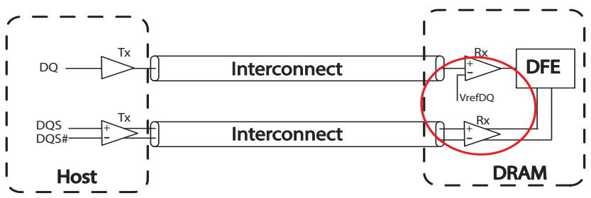  
Figure 189 — SDRAM's Rx Forwarded Strobes for Jitter Sensitivity Testing

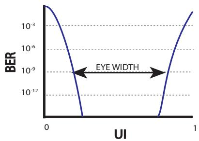

# 8.6.1 Rx DQS Jitter Sensitivity Specification

Table 412 provides Rx DQS Jitter Sensitivity Specification for the DDR5 DRAM receivers when operating at various possible transfer rates. These parameters are tested on the CTC2 card with neither additive gain nor Rx Equalization set.

Table 412 — Rx DQS Jitter Sensitivity Specification for DDR5-3200 to 4800  
BER = Bit Error Rate; DCD = Duty Cycle Distortion; Rj = Random Jitter  

<table><tr><td rowspan="2">Parameter</td><td rowspan="2">Symbol</td><td colspan="2">DDR5-3200</td><td colspan="2">DDR5-3600</td><td colspan="2">DDR5-4000</td><td colspan="2">DDR5-4400</td><td colspan="2">DDR5-4800</td><td rowspan="2">Unit</td><td rowspan="2">Notes</td></tr><tr><td>Min</td><td>Max</td><td>Min</td><td>Max</td><td>Min</td><td>Max</td><td>Min</td><td>Max</td><td>Min</td><td>Max</td></tr><tr><td>DQ Timing Width</td><td>tRx_DQ_tMargin</td><td>0.900</td><td>-</td><td>0.875</td><td>-</td><td>0.825</td><td>-</td><td>0.825</td><td>-</td><td>0.825</td><td>-</td><td>UI</td><td>1,2,3,8,9,10</td></tr><tr><td>Degradation of timing width compared to tRx_DQ_tMargin, with DCD injection in DQS</td><td>ΔtRx_DQ_tMar-gin_DQS_DCD</td><td>-</td><td>0.06</td><td>-</td><td>0.06</td><td>-</td><td>0.06</td><td>-</td><td>0.06</td><td>-</td><td>0.06</td><td>UI</td><td>1,4,8,9,10</td></tr><tr><td>Degradation of timing width compared to tRx_DQ_tMargin, with RJ injection in DQS</td><td>ΔtRx_DQ_tMar-gin_DQS_Rj</td><td>-</td><td>0.09</td><td>-</td><td>0.09</td><td>-</td><td>0.09</td><td>-</td><td>0.09</td><td>-</td><td>0.09</td><td>UI</td><td>1,5,8,9,10</td></tr></table>

Table 412 — Rx DQS Jitter Sensitivity Specification for DDR5-3200 to 4800 (Cont'd)  
BER = Bit Error Rate; DCD = Duty Cycle Distortion; Rj = Random Jitter  

<table><tr><td rowspan="2">Parameter</td><td rowspan="2">Symbol</td><td colspan="2">DDR5-3200</td><td colspan="2">DDR5-3600</td><td colspan="2">DDR5-4000</td><td colspan="2">DDR5-4400</td><td colspan="2">DDR5-4800</td><td rowspan="2">Unit</td><td rowspan="2">Notes</td></tr><tr><td>Min</td><td>Max</td><td>Min</td><td>Max</td><td>Min</td><td>Max</td><td>Min</td><td>Max</td><td>Min</td><td>Max</td></tr><tr><td>Degradation of timing width compared to tRx_DQ_tMargin, with both DCD and Rj injection in DQS</td><td>ΔtRx_DQ_tMargin_gin_DQS_DCD_Rj</td><td>-</td><td>0.15</td><td>-</td><td>0.15</td><td>-</td><td>0.15</td><td>-</td><td>0.15</td><td>-</td><td>0.15</td><td>UI</td><td>1,2,6,8,9,10</td></tr><tr><td>Delay of any data lane relative to the DQS_t/DQS_c crossing</td><td>tRx_DQS2DQ</td><td>1</td><td>3</td><td>1</td><td>3</td><td>1</td><td>3</td><td>1</td><td>3.25</td><td>1</td><td>3.5</td><td>UI</td><td>1,7,8,9,10</td></tr><tr><td colspan="14">NOTE 1 Validation methodology will be defined in future ballots. 2UI is defined as 1tCK for this parameter</td></tr><tr><td colspan="14">NOTE 2 Each of ΔtRx_DQ_tMargin_DQS_DCD, ΔtRx_DQ_tMargin_DQS_Rj, and ΔtRx_DQ_tMargin_DQS_DCD_Rj can be relaxed by up to 5% if tRx_DQ_tMargin exceeds the spec by 5% or more</td></tr><tr><td colspan="14">NOTE 3 DQ Timing Width - timing width for any data lane using repetitive patterns (check note 4 for the pattern) measured at BER=E-9</td></tr><tr><td colspan="14">NOTE 4 Magnitude of degradation of timing width for any data lane using repetitive no ISI patterns with DCD injection in forwarded strobe DQS compared to tRx_DQ_tMargin, measured at BER=E-9. The magnitude of DCD is specified under Test Conditions for Rx DQS Jitter Sensitivity Testing. Test using clock-like pattern of repeating 3 “1s” and 3 “0s”</td></tr><tr><td colspan="14">NOTE 5 Magnitude of degradation of timing width for any data lane using repetitive no ISI patterns with only Rj injection in forwarded strobe DQS measured at BER=E-9, compared to tRx_tMargin. The magnitude of Rj is specified under Test Conditions for Rx DQS Jitter Sensitivity Testing.</td></tr><tr><td colspan="14">NOTE 6 Magnitude of degradation of timing width for any data lane using repetitive no ISI patterns with DCD and Rj injection in forwarded strobe DQS measured at BER=E-9, compared to tRx_tMargin. The magnitudes of DCD and Rj are specified under Test Conditions for Rx DQS Jitter Sensitivity Testing.</td></tr><tr><td colspan="14">NOTE 7 Delay of any data lane relative to the strobe lane, as measured at the end of Tx+Channel. This parameter is a collective sum of effects of data clock mismatches in Tx and on the medium connecting Tx and Rx.</td></tr><tr><td colspan="14">NOTE 8 All measurements at BER=E-9</td></tr><tr><td colspan="14">NOTE 9 This test should be done after the DQS and DQ Voltage Sensitivity tests are completed and passing</td></tr><tr><td colspan="14">NOTE 10 The user has the freedom to set the voltage swing and slew rates for strobe and DQ signals as long as they meet the specification. The DQS and DQ input voltage swing and/or slew rate can be adjusted, without exceeding the specifications, for this test.</td></tr></table>

Table 413 — Rx DQS Jitter Sensitivity Specification for DDR5-5200 to 6400  
BER = Bit Error Rate; DCD = Duty Cycle Distortion; Rj = Random Jitter  

<table><tr><td rowspan="2">Parameter</td><td rowspan="2">Symbol</td><td colspan="2">DDR5-5200</td><td colspan="2">DDR5-5600</td><td colspan="2">DDR5-6000</td><td colspan="2">DDR5-6400</td><td rowspan="2">Unit</td><td rowspan="2">Notes</td></tr><tr><td>Min</td><td>Max</td><td>Min</td><td>Max</td><td>Min</td><td>Max</td><td>Min</td><td>Max</td></tr><tr><td>DQ Timing Width</td><td>tRx_DQ_tMargin</td><td>0.850</td><td>-</td><td>0.850</td><td>-</td><td>0.850</td><td>-</td><td>0.850</td><td>-</td><td>UI</td><td>1,2,3,8,9,10</td></tr><tr><td>Degradation of timing width compared to tRx_DQ_tMargin, with DCD injection in DQS</td><td>ΔtRx_DQ_tMargin_D-QS_DCD</td><td>-</td><td>0.05</td><td>-</td><td>0.05</td><td>-</td><td>0.05</td><td>-</td><td>0.05</td><td>UI</td><td>1,4,8,9,10</td></tr><tr><td>Degradation of timing width compared to tRx_DQ_tMargin, with Rj injection in DQS</td><td>ΔtRx_DQ_tMargin_D-QS_Rj</td><td>-</td><td>0.075</td><td>-</td><td>0.075</td><td>-</td><td>0.075</td><td>-</td><td>0.075</td><td>UI</td><td>1,5,8,9,10</td></tr></table>

Table 413 — Rx DQS Jitter Sensitivity Specification for DDR5-5200 to 6400 (Cont'd)  
BER = Bit Error Rate; DCD = Duty Cycle Distortion; Rj = Random Jitter  

<table><tr><td rowspan="2">Parameter</td><td rowspan="2">Symbol</td><td colspan="2">DDR5-5200</td><td colspan="2">DDR5-5600</td><td colspan="2">DDR5-6000</td><td colspan="2">DDR5-6400</td><td rowspan="2">Unit</td><td rowspan="2">Notes</td></tr><tr><td>Min</td><td>Max</td><td>Min</td><td>Max</td><td>Min</td><td>Max</td><td>Min</td><td>Max</td></tr><tr><td>Degradation of timing width compared to tRx_DQ_tMargin, with both DCD and Rj injection in DQS</td><td>ΔtRx_DQ_tMargin_D-QS_DCD_Rj</td><td>-</td><td>0.125</td><td>-</td><td>0.125</td><td>-</td><td>0.125</td><td>-</td><td>0.125</td><td>UI</td><td>1,2,6,8,9,10</td></tr><tr><td>Delay of any data lane relative to the DQS_t/DQS_c crossing</td><td>tRx_DQS2DQ</td><td>1</td><td>3</td><td>1</td><td>3</td><td>1</td><td>3</td><td>1</td><td>3</td><td>UI</td><td>1,7,8,9,10</td></tr><tr><td colspan="12">NOTE 1 Validation methodology will be defined in future ballots. 2UI is defined as 1tCK for this parameter</td></tr><tr><td colspan="12">NOTE 2 Each of ΔtRx_DQ_tMargin_DQS_DCD, ΔtRx_DQ_tMargin_DQS_Rj, and ΔtRx_DQ_tMargin_DQS_DCD_Rj can be relaxed by up to 5% if tRx_DQ_tMargin exceeds the spec by 5% or more</td></tr><tr><td colspan="12">NOTE 3 DQ Timing Width - timing width for any data lane using repetitive patterns (check note 4 for the pattern) measured at BER=E-9</td></tr><tr><td colspan="12">NOTE 4 Magnitude of degradation of timing width for any data lane using repetitive no ISI patterns with DCD injection in forwarded strobe DQS compared to tRx_DQ_tMargin, measured at BER=E-9. The magnitude of DCD is specified under Test Conditions for Rx DQS Jitter Sensitivity Testing. Test using clock-like pattern of repeating 3 “1s” and 3 “0s”</td></tr><tr><td colspan="12">NOTE 5 Magnitude of degradation of timing width for any data lane using repetitive no ISI patterns with only Rj injection in forwarded strobe DQS measured at BER=E-9, compared to tRx_tMargin. The magnitude of Rj is specified under Test Conditions for Rx DQS Jitter Sensitivity Testing.</td></tr><tr><td colspan="12">NOTE 6 Magnitude of degradation of timing width for any data lane using repetitive no ISI patterns with DCD and Rj injection in forwarded strobe DQS measured at BER=E-9, compared to tRx_tMargin. The magnitudes of DCD and Rj are specified under Test Conditions for Rx DQS Jitter Sensitivity Testing.</td></tr><tr><td colspan="12">NOTE 7 Delay of any data lane relative to the strobe lane, as measured at the end of Tx+Channel. This parameter is a collective sum of effects of data clock mismatches in Tx and on the medium connecting Tx and Rx.</td></tr><tr><td colspan="12">NOTE 8 All measurements at BER=E-9</td></tr><tr><td colspan="12">NOTE 9 This test should be done after the DQS and DQ Voltage Sensitivity tests are completed and passing</td></tr><tr><td colspan="12">NOTE 10 The user has the freedom to set the voltage swing and slew rates for strobe and DQ signals as long as they meet the specification. The DQS and DQ input voltage swing and/or slew rate can be adjusted, without exceeding the specifications, for this test.</td></tr></table>

# 8.6.1 Rx DQS Jitter Sensitivity Specification (Cont'd)

Table 414 — Rx DQS Jitter Sensitivity Specification for DDR5-6800 to 8400

[ \text{[BER = Bit Error Rate; DCD = Duty Cycle Distortion; Rj = Random Jitter]} ]

<table><tr><td rowspan="2">Parameter</td><td rowspan="2">Symbol</td><td colspan="2">DDR5-6800</td><td colspan="2">DDR5-7200</td><td colspan="2">DDR5-7600</td><td colspan="2">DDR5-8000</td><td colspan="2">DDR5-8400</td><td rowspan="2">Unit</td><td rowspan="2">Notes</td></tr><tr><td>Min</td><td>Max</td><td>Min</td><td>Max</td><td>Min</td><td>Max</td><td>Min</td><td>Max</td><td>Min</td><td>Max</td></tr><tr><td>DQ Timing Width</td><td>tRx_DQ_tMargin</td><td>0.850</td><td>-</td><td>0.850</td><td>-</td><td>0.850</td><td>-</td><td>0.850</td><td>-</td><td>0.850</td><td>-</td><td>UI</td><td>1,2,3,8,9,10</td></tr><tr><td>Degradation of timing width compared to tRx_DQ_tMargin, with DCD injection in DQS</td><td>ΔtRx_DQ_tMargin_DQS_DCD</td><td>-</td><td>0.05</td><td>-</td><td>0.05</td><td>-</td><td>0.05</td><td>-</td><td>0.05</td><td>-</td><td>0.05</td><td>UI</td><td>1,4,8,9,10</td></tr><tr><td>Degradation of timing width compared to tRx_DQ_tMargin, with Rj injection in DQS</td><td>ΔtRx_DQ_tMargin_DQS_Rj</td><td>-</td><td>0.075</td><td>-</td><td>0.075</td><td>-</td><td>0.075</td><td>-</td><td>0.075</td><td>-</td><td>0.075</td><td>UI</td><td>1,5,8,9,10</td></tr><tr><td>Degradation of timing width compared to tRx_DQ_tMargin, with both DCD and Rj injection in DQS</td><td>ΔtRx_DQ_tMargin_DQS_DCD_Rj</td><td>-</td><td>0.125</td><td>-</td><td>0.125</td><td>-</td><td>0.125</td><td>-</td><td>0.125</td><td>-</td><td>0.125</td><td>UI</td><td>1,2,6,8,9,10</td></tr><tr><td>Delay of any data lane relative to the DQS_t/DQS_c crossing</td><td>tRx_DQS2DQ_skeW</td><td>1</td><td>3</td><td>1</td><td>3</td><td>1</td><td>3</td><td>1</td><td>3</td><td>1</td><td>3</td><td>UI</td><td>1,7,8,9,10</td></tr><tr><td>NOTE 1</td><td colspan="13">1. Validation methodology will be defined in future ballots. 2UI is defined as 1tCK for this parameter</td></tr><tr><td>NOTE 1</td><td colspan="13">2. Each of ΔtRx_DQ_tMargin_DQS_DCD, ΔtRx_DQ_tMargin_DQS_Rj, and ΔtRx_DQ_tMargin_DQS_DCD_Rj can be relaxed by up to 5% if tRx_DQ_tMargin exceeds the spec by 5% or more</td></tr><tr><td>NOTE 1</td><td colspan="13">3. DQ Timing Width - timing width for any data lane using repetitive patterns (check note 4 for the pattern) measured at BER=E-9</td></tr><tr><td>NOTE 1</td><td colspan="13">4. Magnitude of degradation of timing width for any data lane using repetitive no ISI patterns with DCD injection in forwarded strobe DQS compared to tRx_DQ_tMargin, measured at BER=E-9. The magnitude of DCD is specified under Test Conditions for Rx DQS Jitter Sensitivity Testing. Test using clock-like pattern of repeating 3 &quot;1s&quot; and 3 &quot;0s&quot;</td></tr><tr><td>NOTE 1</td><td colspan="13">5. Magnitude of degradation of timing width for any data lane using repetitive no ISI patterns with only Rj injection in forwarded strobe DQS measured at BER=E-9, compared to tRx_tMargin. The magnitude of Rj is specified under Test Conditions for Rx DQS Jitter Sensitivity Testing.</td></tr><tr><td>NOTE 1</td><td colspan="13">6. Magnitude of degradation of timing width for any data lane using repetitive no ISI patterns with DCD and Rj injection in forwarded strobe DQS measured at BER=E-9, compared to tRx_tMargin. The magnitudes of DCD and Rj are specified under Test Conditions for Rx DQS Jitter Sensitivity Testing.</td></tr><tr><td>NOTE 1</td><td colspan="13">7. Delay of any data lane relative to the strobe lane, as measured at the end of Tx+Channel. This parameter is a collective sum of effects of data clock mismatches in Tx and on the medium connecting Tx and Rx.</td></tr><tr><td>NOTE 1</td><td colspan="13">8. All measurements at BER=E-9</td></tr><tr><td>NOTE 1</td><td colspan="13">9. This test should be done after the DQS and DQ Voltage Sensitivity tests are completed and passing</td></tr><tr><td>NOTE 2</td><td colspan="13">10. The user has the freedom to set the voltage swing and slew rates for strobe and DQ signals as long as they meet the specification. The DQS and DQ input voltage swing and/or slew rate can be adjusted, without exceeding the specifications, for this test.</td></tr></table>

# 8.6.2 Test Conditions for Rx DQS Jitter Sensitivity Tests

Table 415 lists the amount of Duty Cycle Distortion (DCD) and/or Random Jitter (Rj) that must be applied to the forwarded strobe when measuring the Rx DQS Jitter Sensitivity parameters specified in Table 412 and Table 413.

# 8.6.2 Test Conditions for Rx DQS Jitter Sensitivity Tests (Cont'd)

Table 415 — Test Conditions for Rx DQS Jitter Sensitivity Testing for DDR5-3200 to 4800  

<table><tr><td rowspan="2">Parameter</td><td rowspan="2">Symbol</td><td colspan="2">DDR5-3200</td><td colspan="2">DDR5-3600</td><td colspan="2">DDR5-4000</td><td colspan="2">DDR5-4400</td><td colspan="2">DDR5-4800</td><td rowspan="2">Unit</td><td rowspan="2">Notes</td></tr><tr><td>Min</td><td>Max</td><td>Min</td><td>Max</td><td>Min</td><td>Max</td><td>Min</td><td>Max</td><td>Min</td><td>Max</td></tr><tr><td>Applied DCD to the DQS</td><td>tRx_DQS_DCD</td><td>-</td><td>0.045</td><td>-</td><td>0.045</td><td>-</td><td>0.045</td><td>-</td><td>0.045</td><td>-</td><td>0.045</td><td>UI</td><td>1,2,3,6,7,10</td></tr><tr><td>Applied Rj RMS to the DQS</td><td>tRx_DQS_Rj</td><td>-</td><td>0.0075</td><td>-</td><td>0.0075</td><td>-</td><td>0.0075</td><td>-</td><td>0.0075</td><td>-</td><td>0.0075</td><td>UI (RMS)</td><td>1,2,,4,6,8,10</td></tr><tr><td>Applied DCD and Rj RMS to the DQS</td><td>tRx_DQS_DCD_Rj</td><td>-</td><td>0.045UI DCD + 0.0075UI Rj RMS</td><td>-</td><td>0.045UI DCD + 0.0075UI Rj RMS</td><td>-</td><td>0.045UI DCD + 0.0075UI Rj RMS</td><td>-</td><td>0.045UI DCD + 0.0075UI Rj RMS</td><td>-</td><td>0.045UI DCD + 0.0075UI Rj RMS</td><td>UI</td><td>1,2,5,6,7,9,10</td></tr><tr><td colspan="14">NOTE 1 While imposing this spec, the strobe lane is stressed, but the data input is kept large amplitude and no jitter or ISI injection. The specified voltages are at the Rx input pin. The DQS and DQ input voltage swing and/or slew rate can be adjusted, without exceeding the specifications, for this test.</td></tr><tr><td colspan="14">NOTE 2 The jitter response of the forwarded strobe channel will depend on the input voltage, primarily due to bandwidth limitations of the clock receiver. For this revision, no separate specification of jitter as a function of input amplitude is specified, instead the response characterization done at the specified clock amplitude only. The specified voltages are at the Rx input pin</td></tr><tr><td colspan="14">NOTE 3 Various DCD values should be tested, complying within the maximum limits</td></tr><tr><td colspan="14">NOTE 4 Various Rj values should be tested, complying within the maximum limits</td></tr><tr><td colspan="14">NOTE 5 Various combinations of DCD and Rj should be tested, complying within the maximum limits. The maximum timing margin degradation as a result of these injected jitter is specified in Tables 412 and 413.</td></tr><tr><td colspan="14">NOTE 6 Although DDR5 has bursty traffic, current available BERTs that can be used for this test do not support burst traffic patterns. A continuous strobe and continuous DQ are used for this parameter. The clock like pattern repeating 3 &quot;1s&quot; and 3 &quot;0s&quot; is used for this test.</td></tr><tr><td colspan="14">NOTE 7 Duty Cycle Distortion (in UI DCD) as applied to the input forwarded DQS from BERT (UI)</td></tr><tr><td colspan="14">NOTE 8 RMS value of Rj (specified as Edge jitter) applied to the input forwarded DQS from BERT (values of the edge jitter RMS values specified as % of UI)</td></tr><tr><td colspan="14">NOTE 9 Duty cycle distortion (specified as UI DCD) and rms values of Rj (specified as edge jitter) applied to the input forwarded DQS from BERT (values of the edge jitter RMS values specified as % of UI)</td></tr><tr><td colspan="14">NOTE 10 The user has the freedom to set the voltage swing and slew rates for strobe and DQ signals as long as they meet the specification. The DQS and DQ input voltage swing and/or slew rate can be adjusted, without exceeding the specifications, for this test.</td></tr></table>

# 8.6.2 Test Conditions for Rx DQS Jitter Sensitivity Tests (Cont'd)

Table 416 — Test Conditions for Rx DQS Jitter Sensitivity Testing for DDR5-5200 to 6400  

<table><tr><td rowspan="2">Parameter</td><td rowspan="2">Symbol</td><td colspan="2">DDR5-5200</td><td colspan="2">DDR5-5600</td><td colspan="2">DDR5-6000</td><td colspan="2">DDR5-6400</td><td rowspan="2">Unit</td><td rowspan="2">Notes</td></tr><tr><td>Min</td><td>Max</td><td>Min</td><td>Max</td><td>Min</td><td>Max</td><td>Min</td><td>Max</td></tr><tr><td>Applied DCD to the DQS</td><td>tRx_DQS_DCD</td><td>-</td><td>TBD</td><td>-</td><td>TBD</td><td>-</td><td>TBD</td><td>-</td><td>TBD</td><td>UI</td><td>1,2,3,6,7,10</td></tr><tr><td>Applied Rj RMS to the DQS</td><td>tRx_DQS_Rj</td><td>-</td><td>TBD</td><td>-</td><td>TBD</td><td>-</td><td>TBD</td><td>-</td><td>TBD</td><td>UI (RMS)</td><td>1,2,4,6,8,10</td></tr><tr><td>Applied DCD and Rj RMS to the DQS</td><td>tRx_DQS_DCD_Rj</td><td>-</td><td>TBD</td><td>-</td><td>TBD</td><td>-</td><td>TBD</td><td>-</td><td>TBD</td><td>UI</td><td>1,2,5,6,7,9,10</td></tr><tr><td colspan="12">NOTE 1 While imposing this spec, the strobe lane is stressed, but the data input is kept large amplitude and no jitter or ISI injection. The specified voltages are at the Rx input pin. The DQS and DQ input voltage swing and/or slew rate can be adjusted, without exceeding the specifications, for this test.</td></tr><tr><td colspan="12">NOTE 2 The jitter response of the forwarded strobe channel will depend on the input voltage, primarily due to bandwidth limitations of the clock receiver. For this revision, no separate specification of jitter as a function of input amplitude is specified, instead the response characterization done at the specified clock amplitude only. The specified voltages are at the Rx input pin</td></tr><tr><td colspan="12">NOTE 3 Various DCD values should be tested, complying within the maximum limits</td></tr><tr><td colspan="12">NOTE 4 Various Rj values should be tested, complying within the maximum limits</td></tr><tr><td colspan="12">NOTE 5 Various combinations of DCD and Rj should be tested, complying within the maximum limits. The maximum timing margin degradation as a result of these injected jitter is specified in a separate table</td></tr><tr><td colspan="12">NOTE 6 Although DDR5 has bursty traffic, current available BERTs that can be used for this test do not support burst traffic patterns. A continuous strobe and continuous DQ are used for this parameter. The clock like pattern repeating 3 “1s” and 3 “0s” is used for this test.</td></tr><tr><td colspan="12">NOTE 7 Duty Cycle Distortion (in UI DCD) as applied to the input forwarded DQS from BERT (UI)</td></tr><tr><td colspan="12">NOTE 8 RMS value of Rj (specified as Edge jitter) applied to the input forwarded DQS from BERT (values of the edge jitter RMS values specified as % of UI)</td></tr><tr><td colspan="12">NOTE 9 Duty cycle distortion (specified as UI DCD) and rms values of Rj (specified as edge jitter) applied to the input forwarded DQS from BERT (values of the edge jitter RMS values specified as % of UI)</td></tr><tr><td colspan="12">NOTE 10 The user has the freedom to set the voltage swing and slew rates for strobe and DQ signals as long as they meet the specification. The DQS and DQ input voltage swing and/or slew rate can be adjusted, without exceeding the specifications, for this test.</td></tr></table>

# 8.6.2 Test Conditions for Rx DQS Jitter Sensitivity Tests (Cont'd)

Table 417 — Test Conditions for Rx DQS Jitter Sensitivity Testing for DDR5-6800 to 8400  

<table><tr><td rowspan="2">Parameter</td><td rowspan="2">Symbol</td><td colspan="2">DDR5-6800</td><td colspan="2">DDR5-7200</td><td colspan="2">DDR5-7600</td><td colspan="2">DDR5-8000</td><td colspan="2">DDR5-8400</td><td rowspan="2">Unit</td><td rowspan="2">Notes</td></tr><tr><td>Min</td><td>Max</td><td>Min</td><td>Max</td><td>Min</td><td>Max</td><td>Min</td><td>Max</td><td>Min</td><td>Max</td></tr><tr><td>Applied DCD to the DQS</td><td>tRx_DQS_DCD</td><td>-</td><td>TBD</td><td>-</td><td>TBD</td><td>-</td><td>TBD</td><td>-</td><td>TBD</td><td>-</td><td>TBD</td><td>UI</td><td>3,6,7,10</td></tr><tr><td>Applied Rj RMS to the DQS</td><td>tRx_DQS_Rj</td><td>-</td><td>TBD</td><td>-</td><td>TBD</td><td>-</td><td>TBD</td><td>-</td><td>TBD</td><td>-</td><td>TBD</td><td>UI (RMS)</td><td>4,6,8,10</td></tr><tr><td>Applied DCD and Rj RMS to the DQS</td><td>tRx_DQS_DCD_Rj</td><td>-</td><td>TBD</td><td>-</td><td>TBD</td><td>-</td><td>TBD</td><td>-</td><td>TBD</td><td>-</td><td>TBD</td><td>UI</td><td>5,6,7,9,10</td></tr><tr><td colspan="14">NOTE 1 While imposing this spec, the strobe lane is stressed, but the data input is kept large amplitude and no jitter or ISI injection. The specified voltages are at the Rx input pin. The DQS and DQ input voltage swing and/or slew rate can be adjusted, without exceeding the specifications, for this test.</td></tr><tr><td colspan="14">NOTE 2 The jitter response of the forwarded strobe channel will depend on the input voltage, primarily due to bandwidth limitations of the clock receiver. For this revision, no separate specification of jitter as a function of input amplitude is specified, instead the response characterization done at the specified clock amplitude only. The specified voltages are at the Rx input pin</td></tr><tr><td colspan="14">NOTE 3 Various DCD values should be tested, complying within the maximum limits</td></tr><tr><td colspan="14">NOTE 4 Various Rj values should be tested, complying within the maximum limits</td></tr><tr><td colspan="14">NOTE 5 Various combinations of DCD and Rj should be tested, complying within the maximum limits. The maximum timing margin degradation as a result of these injected jitter is specified in a separate table</td></tr><tr><td colspan="14">NOTE 6 Although DDR5 has bursty traffic, current available BERTs that can be used for this test do not support burst traffic patterns. A continuous strobe and continuous DQ are used for this parameter. The clock like pattern repeating 3 “1s” and 3 “0s” is used for this test.</td></tr><tr><td colspan="14">NOTE 7 Duty Cycle Distortion (in UI DCD) as applied to the input forwarded DQS from BERT (UI)</td></tr><tr><td colspan="14">NOTE 8 RMS value of Rj (specified as Edge jitter) applied to the input forwarded DQS from BERT (values of the edge jitter RMS values specified as % of UI)</td></tr><tr><td colspan="14">NOTE 9 Duty cycle distortion (specified as UI DCD) and rms values of Rj (specified as edge jitter) applied to the input forwarded DQS from BERT (values of the edge jitter RMS values specified as % of UI)</td></tr><tr><td colspan="14">NOTE 10 The user has the freedom to set the voltage swing and slew rates for strobe and DQ signals as long as they meet the specification. The DQS and DQ input voltage swing and/or slew rate can be adjusted, without exceeding the specifications, for this test.</td></tr></table>

# 8.7 Rx DQS Voltage Sensitivity

# 8.7.1 Overview

The receiver DQS (strobe) input voltage sensitivity test provides the methodology for testing the receiver's sensitivity to varying input voltage in the absence of Inter-Symbol Interference (ISI), jitter (Rj, Dj, DCD) and crosstalk noise.

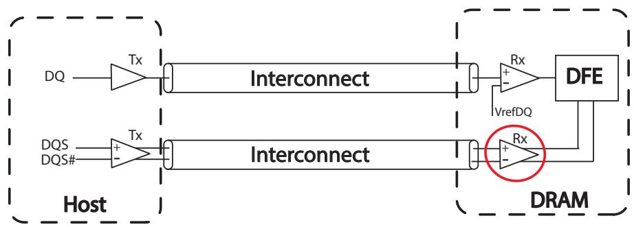  
Figure 190 — Example of DDR5 Memory Interconnect

# 8.7.2 Receiver DQS Voltage Sensitivity Parameter

Input differential (DQS_t, DQS_c) VRx_DQS is defined and measured as shown in Tables 418 and 419, and Figure 191. The receiver must pass the minimum BER requirements for DDR5 (see Section 7.2.3). These parameters are tested on the CTC2 card with neither additive gain nor Rx Equalization set.

Table 418 — Rx DQS Input Voltage Sensitivity Parameter for DDR5-3200 to 4800  

<table><tr><td rowspan="2">Parameter</td><td rowspan="2">Symbol</td><td colspan="2">DDR5-3200</td><td colspan="2">DDR5-3600</td><td colspan="2">DDR5-4000</td><td colspan="2">DDR5-4400</td><td colspan="2">DDR5-4800</td><td rowspan="2">Unit</td><td rowspan="2">Notes</td></tr><tr><td>Min</td><td>Max</td><td>Min</td><td>Max</td><td>Min</td><td>Max</td><td>Min</td><td>Max</td><td>Min</td><td>Max</td></tr><tr><td>DQS Rx Input Voltage Sensitivity (differential pp)</td><td>VRx_DQS</td><td>-</td><td>130</td><td>-</td><td>115</td><td>-</td><td>105</td><td>-</td><td>100</td><td>-</td><td>100</td><td>mV</td><td>1,2,3</td></tr><tr><td colspan="14">NOTE 1 Refer to Section 7.2.3 for the minimum BER requirements for DDR5NOTE 2 The validation methodology for this parameter will be covered in future ballot(s)NOTE 3 Test using clock like pattern of repeating 3 &quot;1s&quot; and 3 &quot;0s&quot;</td></tr></table>

Table 419 — Rx DQS Input Voltage Sensitivity Parameter for DDR5-5200 to 6400  

<table><tr><td rowspan="2">Parameter</td><td rowspan="2">Symbol</td><td colspan="2">DDR5-5200</td><td colspan="2">DDR5-5600</td><td colspan="2">DDR5-6000</td><td colspan="2">DDR5-6400</td><td rowspan="2">Unit</td><td rowspan="2">Notes</td></tr><tr><td>Min</td><td>Max</td><td>Min</td><td>Max</td><td>Min</td><td>Max</td><td>Min</td><td>Max</td></tr><tr><td>DQS Rx Input Voltage Sensitivity (differential pp)</td><td>VRx_DQS</td><td>-</td><td>TBD</td><td>-</td><td>TBD</td><td>-</td><td>TBD</td><td>-</td><td>TBD</td><td>mV</td><td>1,2,3</td></tr><tr><td colspan="12">NOTE 1 Refer to Section 7.2.3 for the minimum BER requirements for DDR5NOTE 2 The validation methodology for this parameter will be covered in future ballot(s)NOTE 3 Test using clock like pattern of repeating 3 “1s” and 3 “0s”</td></tr></table>

# 8.7.2 Receiver DQS Voltage Sensitivity Parameter (Cont'd)

Table 420 — Rx DQS Input Voltage Sensitivity Parameter for DDR5-6800 to 8400

<table><tr><td rowspan="2">Parameter</td><td rowspan="2">Symbol</td><td colspan="2">DDR5-680G</td><td colspan="2">DDR5-T200</td><td colspan="2">DDR5-7600</td><td colspan="2">DDR5-8000</td><td colspan="2">DDR5-8400</td><td rowspan="2">Unit</td><td rowspan="2">Notes</td></tr><tr><td>Min</td><td>Max</td><td>Min</td><td>Max</td><td>Min</td><td>Max</td><td>Min</td><td>Max</td><td>Min</td><td>Max</td></tr><tr><td>DQS Rx Input Voltage Sensitivity (differential pp)</td><td>VRx_DQS</td><td>-</td><td>TBD</td><td>-</td><td>TBD</td><td>-</td><td>TBD</td><td>-</td><td>TBD</td><td>-</td><td>TBD</td><td>mV</td><td>1,2,3</td></tr><tr><td colspan="14">NOTE 1 Refer to the minimum BER requirements for DDR5NOTE 2 The validation methodology for this parameter will be covered in future ballot(s)NOTE 3 Test using clock like pattern of repeating 3 “1s” and 3 “0s”</td></tr></table>

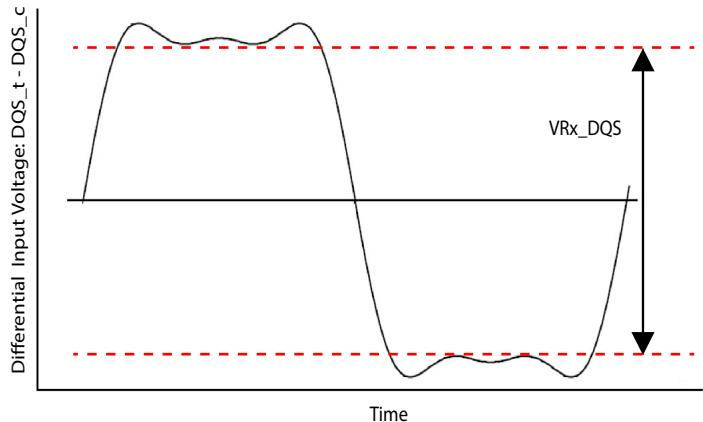  
Figure 191 - VRx_DQS

# 8.8 Differential Strobe (DQS_t, DQS_c) Input Cross Point Voltage (VIX)

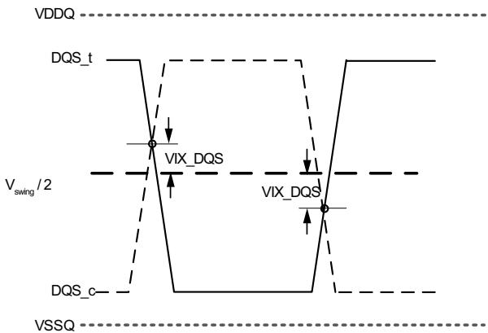  
Figure 192 — VIX Definition (DQS)

Table 421 — Crosspoint Voltage (VIX) for DQS Differential Input Signals  

<table><tr><td rowspan="2">Parameter</td><td rowspan="2">Symbol</td><td colspan="2">DDR5-3200 - 4800</td><td colspan="2">DDR5-5200 - 6400</td><td colspan="2">DDR5-6800 - 8400</td><td rowspan="2">Unit</td><td rowspan="2">Notes</td></tr><tr><td>Min</td><td>Max</td><td>Min</td><td>Max</td><td>Min</td><td>Max</td></tr><tr><td>DQS differential input crosspoint voltage ratio</td><td>VIX_DQS_Ratio</td><td>-</td><td>TBD</td><td>-</td><td>TBD</td><td>-</td><td>TBD</td><td>%</td><td>1,2</td></tr><tr><td colspan="10">NOTE 1 The VIX_DQS voltage is referenced to Vswing/2(mean) = (DQS_t voltage + DQS_c voltage) /2, where the mean is over TBD UI
NOTE 2 VIX_DQS_Ratio = (VIX_DQS / Vdiff)*100%, where Vdiff = |DQS_t voltage - DQS_c voltage|</td></tr></table>

LIGHT GREY - All Light Grey text is defined as something that should be considered TBD. The content may be accurate or the same as previous technologies but has not yet been reviewed or determined to be the working assumption.

# 8.8.1 Differential Input Levels for DQS

Table 422 — Differential Input Levels for DQS (DQS_t, DQS_c) for DDR5-3200 to DDR5-6400  

<table><tr><td>From</td><td>Parameter</td><td>DDR5
3200-6400</td><td>Note</td></tr><tr><td>VIHdiffDQS</td><td>Differential input high measurement level (DQS_t, DQS_c)</td><td>0.75 x Vdiffpk-pk</td><td>1,2,3</td></tr><tr><td>VILdiffDQS</td><td>Differential input low measurement level (DQS_t, DQS_c)</td><td>0.25 x Vdiffpk-pk</td><td>1,2,3</td></tr><tr><td colspan="4">NOTE 1 Vdiffpk-pk defined in Figure 193
NOTE 2 Vdiffpk-pk is the mean high voltage minus the mean low voltage over TBD samples
NOTE 3 All parameters are defined over the entire clock common mode range</td></tr></table>

Table 423 — Differential Input Levels for DQS (DQS_t, DQS_c) for DDR5-6800 to DDR5-8400  

<table><tr><td>From</td><td>Parameter</td><td>DDR5
8000-8400</td><td>Note</td></tr><tr><td>VIHdiffDQS</td><td>Differential input high measurement level (DQS_t, DQS_c)</td><td>0.75 x Vdiffpk-pk</td><td>1,2,3</td></tr><tr><td>VILdiffDQS</td><td>Differential input low measurement level (DQS_t, DQS_c)</td><td>0.25 x Vdiffpk-pk</td><td>1,2,3</td></tr><tr><td colspan="4">NOTE 1 Vdiffpk-pk defined in Figure 193
NOTE 2 Vdiffpk-pk is the mean high voltage minus the mean low voltage over TBD samples
NOTE 3 All parameters are defined over the entire clock common mode range</td></tr></table>

# 8.8.2 Differential Input Slew Rate for DQS_t, DQS_c

Input slew rate for differential signals are defined and measured as shown in Figure 193 and Tables 424 through 426.

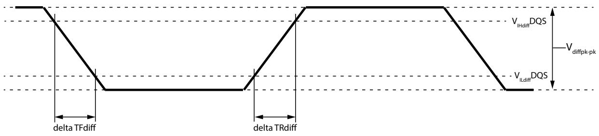  
Figure 193 — Differential Input Slew Rate Definition for DQS_t, DQS_c

Table 424 — Differential Input Slew Rate Definition for DQS_t, DQS_c  

<table><tr><td rowspan="2">Parameter</td><td colspan="2">Measured</td><td rowspan="2">Defined by</td><td rowspan="2">Notes</td></tr><tr><td>From</td><td>To</td></tr><tr><td>Differential Input slew rate for rising edge (DQS_t, DQS_c)</td><td>VILdiffDQS</td><td>VILdiffDQS</td><td>(VIHdiffDQS - VILdiffDQS) /deltaTRdiff</td><td>1,2,3</td></tr><tr><td>Differential Input slew rate for falling edge (DQS_t, DQS_c)</td><td>VILdiffDQS</td><td>VILdiffDQS</td><td>(VIHdiffDQS - VILdiffDQS) /deltaTFdiff</td><td>1,2,3</td></tr></table>

# 8.8.2 Differential Input Slew Rate for DQS_t, DQS_c (Cont'd)

Table 425 — Differential Input Slew Rate for DQS_t, DQS_c for DDR5-3200 to 4800  

<table><tr><td rowspan="2">Parameter</td><td rowspan="2">Symbol</td><td colspan="2">DDR5-3200</td><td colspan="2">DDR5-3600</td><td colspan="2">DDR5-4000</td><td colspan="2">DDR5-4400</td><td colspan="2">DDR5-4800</td><td rowspan="2">Unit</td><td rowspan="2">Notes</td></tr><tr><td>Min</td><td>Max</td><td>Min</td><td>Max</td><td>Min</td><td>Max</td><td>Min</td><td>Max</td><td>Min</td><td>Max</td></tr><tr><td>Differential Input Slew Rate for DQS_t, DQS_c</td><td>SRldif_f_DQS</td><td>TBD</td><td>TBD</td><td>TBD</td><td>TBD</td><td>TBD</td><td>TBD</td><td>TBD</td><td>TBD</td><td>TBD</td><td>TBD</td><td>V/ns</td><td>1</td></tr><tr><td colspan="14">NOTE 1 Only applies when both DQS_t and DQS_c are transitioning.</td></tr></table>

Table 426 — Differential Input Slew Rate for DQS_t, DQS_c for DDR5-5200 to 6400  

<table><tr><td rowspan="2">Parameter</td><td rowspan="2">Symbol</td><td colspan="2">DDR5-5200</td><td colspan="2">DDR5-5600</td><td colspan="2">DDR5-6000</td><td colspan="2">DDR5-6400</td><td rowspan="2">Unit</td><td rowspan="2">Notes</td></tr><tr><td>Min</td><td>Max</td><td>Min</td><td>Max</td><td>Min</td><td>Max</td><td>Min</td><td>Max</td></tr><tr><td>Differential Input Slew Rate for DQS_t, DQS_c</td><td>SRldiff_DQS</td><td>TBD</td><td>TBD</td><td>TBD</td><td>TBD</td><td>TBD</td><td>TBD</td><td>TBD</td><td>TBD</td><td>V/ns</td><td>1</td></tr><tr><td colspan="12">NOTE 1 Only applies when both DQS_t and DQS_c are transitioning.</td></tr></table>

Table 427 — Differential Input Slew Rate for DQS_t, DQS_c for DDR5-6800 to 8400  

<table><tr><td rowspan="2">Parameter</td><td rowspan="2">Symbol</td><td colspan="2">DDR5-6800</td><td colspan="2">DDR5-7200</td><td colspan="2">DDR5-7600</td><td colspan="2">DDR5-8000</td><td colspan="2">DDR5-8400</td><td rowspan="2">Unit</td><td rowspan="2">Notes</td></tr><tr><td>Min</td><td>Max</td><td>Min</td><td>Max</td><td>Min</td><td>Max</td><td>Min</td><td>Max</td><td>Min</td><td>Max</td></tr><tr><td>Differential Input Slew Rate for DQS_t, DQS_c</td><td>SRIdiff_DQS</td><td>TBD</td><td>TBD</td><td>TBD</td><td>TBD</td><td>TBD</td><td>TBD</td><td>TBD</td><td>TBD</td><td>TBD</td><td>TBD</td><td>V/ns</td><td>1</td></tr><tr><td colspan="14">NOTE 1 1. Only applies when both DQS_t and DQS_c are transitioning.</td></tr></table>

# 8.9 Rx DQ Voltage Sensitivity

# 8.9.1 Overview

The receiver data input voltage sensitivity test provides the methodology for testing the receiver's sensitivity to varying input voltage in the absence of Inter-Symbol Interference (ISI), jitter (Rj, Dj, DCD) and crosstalk noise.

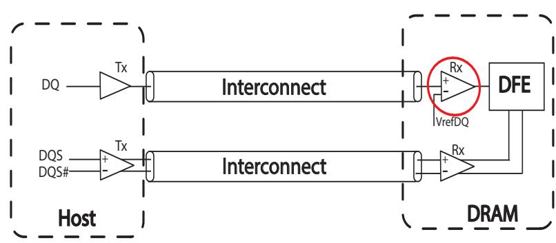  
Figure 194 — Example of DDR5 Memory Interconnect

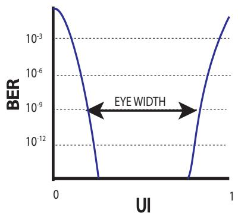

# 8.9.2 Receiver DQ Input Voltage Sensitivity Parameters

Input single-ended VRx_DQ is defined and measured as shown in Tables 428 and 429, and Figure 195. The receiver must pass the minimum BER requirements for DDR5 (see Section 7.2.3). These parameters are tested on the CTC2 card with neither additive gain nor Rx Equalization set.

Table 428 — Rx DQ Input Voltage Sensitivity Parameters for DDR5-3200 to 4800  

<table><tr><td rowspan="2">Parameter</td><td rowspan="2">Symbol</td><td colspan="2">DDR5-3200</td><td colspan="2">DDR5-3600</td><td colspan="2">DDR5-4000</td><td colspan="2">DDR5-4400</td><td colspan="2">DDR5-4800</td><td rowspan="2">Unit</td><td rowspan="2">Notes</td></tr><tr><td>Min</td><td>Max</td><td>Min</td><td>Max</td><td>Min</td><td>Max</td><td>Min</td><td>Max</td><td>Min</td><td>Max</td></tr><tr><td>Minimum DQ Rx input voltage sensitivity applied around Vref</td><td>VRx_DQ</td><td>-</td><td>85</td><td>-</td><td>75</td><td>-</td><td>70</td><td>-</td><td>65</td><td>-</td><td>65</td><td>mV</td><td>1,2,3</td></tr><tr><td colspan="14">NOTE 1 Refer to Section 7.2.3 for the minimum BER requirements for DDR5NOTE 2 The validation methodology for this parameter will be covered in future ballot(s)NOTE 3Recommend testing using clock like pattern such as repeating 3 “1s” and 3 “0s”</td></tr></table>

Table 429 — Rx DQ Input Voltage Sensitivity Parameters for DDR5-5200 to 6400  

<table><tr><td rowspan="2">Parameter</td><td rowspan="2">Symbol</td><td colspan="2">DDR5-5200</td><td colspan="2">DDR5-5600</td><td colspan="2">DDR5-6000</td><td colspan="2">DDR5-6400</td><td rowspan="2">Unit</td><td rowspan="2">Notes</td></tr><tr><td>Min</td><td>Max</td><td>Min</td><td>Max</td><td>Min</td><td>Max</td><td>Min</td><td>Max</td></tr><tr><td>Minimum DQ Rx input voltage sensitivity applied around Vref</td><td>VRx_DQ</td><td>-</td><td>TBD</td><td>-</td><td>TBD</td><td>-</td><td>TBD</td><td>-</td><td>TBD</td><td>mV</td><td>1,2,3</td></tr><tr><td colspan="12">NOTE 1 Refer to Section 7.2.3 for the minimum BER requirements for DDR5NOTE 2 The validation methodology for this parameter will be covered in future ballot(s)NOTE 3 Recommend testing using clock like pattern such as repeating 3 “1s” and 3 “0s”</td></tr></table>

# 8.9.2 Receiver DQ Input Voltage Sensitivity Parameters (Cont'd)

Table 430 — Rx DQ Input Voltage Sensitivity Parameters for DDR5-6800 to 8400  

<table><tr><td rowspan="2">Parameter</td><td rowspan="2">Symbol</td><td colspan="2">DBR5-5800</td><td colspan="2">DBR5-7200</td><td colspan="2">DBR5-7600</td><td colspan="2">DBR5-8000</td><td colspan="2">DBR5-8400</td><td rowspan="2">Unit</td><td rowspan="2">Notes</td></tr><tr><td>Min</td><td>Max</td><td>Min</td><td>Max</td><td>Min</td><td>Max</td><td>Min</td><td>Max</td><td>Min</td><td>Max</td></tr><tr><td>Minimum DQ Rx input voltage sensitivity applied around Vref</td><td>VRx_DQ</td><td>-</td><td>85</td><td>-</td><td>75</td><td>-</td><td>70</td><td>-</td><td>65</td><td>-</td><td>65</td><td>mV</td><td>1,2,3</td></tr><tr><td colspan="14">NOTE 1 1. Refer to the minimum BER requirements for DDR5NOTE 2 2. The validation methodology for this parameter will be covered in future ballot(s)NOTE 3 3. Recommend testing using clock like pattern such as repeating 3 &quot;1s&quot; and 3 &quot;0s&quot;</td></tr></table>

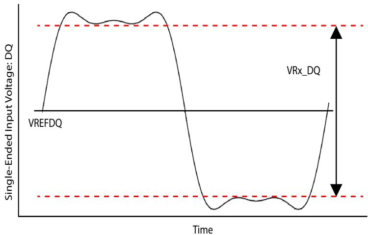  
Figure 195 - VRx_DQ

# 8.10 Rx Stressed Eye

The stressed eye tests provide the methodology for creating the appropriate stress for the DRAM's receiver with the combination of ISI (both loss and reflective), jitter (Rj, Dj, DCD), and crosstalk noise. The receiver must pass the appropriate BER rate when the equivalent stressed eye is applied through the combination of ISI, jitter and crosstalk.

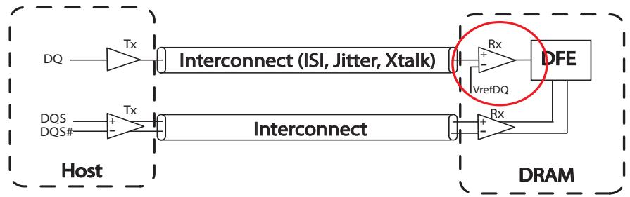  
Figure 196 — Example of Rx Stressed Test Setup in the Presence of ISI, Jitter and Crosstalk

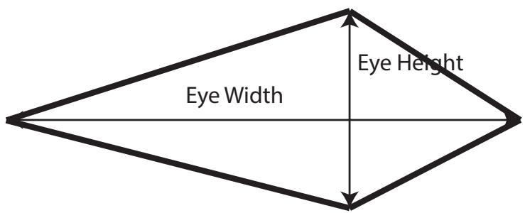  
Figure 197 — Example of Rx Stressed Eye Height and Eye Width

# 8.10.1 Parameters for DDR5 Rx Stressed Eye Tests

Table 431 — Test Conditions for Rx Stressed Eye Tests for DDR5-3200 to 4800  
BER=Bit Error Rate; DCD=Duty Cycle Distortion; Rj=Random Jitter; Sj=Sinusoidal Jitter; p-p=peak to peak  

<table><tr><td rowspan="2">Parameter</td><td rowspan="2">Symbol</td><td colspan="2">DDR5-3200</td><td colspan="2">DDR5-3600</td><td colspan="2">DDR5-4000</td><td colspan="2">DDR5-4400</td><td colspan="2">DDR5-4800</td><td rowspan="2">Unit</td><td rowspan="2">Notes</td></tr><tr><td>Min</td><td>Max</td><td>Min</td><td>Max</td><td>Min</td><td>Max</td><td>Min</td><td>Max</td><td>Min</td><td>Max</td></tr><tr><td>Eye height of stressed eye for Golden Reference Channel 1</td><td>RxEH_Stressed_Eye_Golden_Ref_Channel_1</td><td>-</td><td>95</td><td>-</td><td>85</td><td>-</td><td>80</td><td>-</td><td>75</td><td>-</td><td>70</td><td>mV</td><td>1,2,3,4,5,6,7,8</td></tr><tr><td>Eye width of stressed eye Golden Reference Channel 1</td><td>RxEW_Stressed_Eye_Golden_Ref_Channel_1</td><td>-</td><td>0.25</td><td>-</td><td>0.25</td><td>-</td><td>0.25</td><td>-</td><td>0.25</td><td>-</td><td>0.25</td><td>UI</td><td>1,2,3,4,5,6,7,8</td></tr><tr><td>Vswing stress to meet the data eye</td><td>Vswing_Stressed_Eye_Golden_Ref_Channel_1</td><td>-</td><td>600</td><td>-</td><td>600</td><td>-</td><td>600</td><td>-</td><td>600</td><td>-</td><td>600</td><td>mV</td><td>1.2</td></tr><tr><td>Injected sinusoidal jitter at 200 MHz to meet the data eye</td><td>Sj_Stressed_Eye_Golden_Ref_Channel_1</td><td>0</td><td>0.45</td><td>0</td><td>0.45</td><td>0</td><td>0.45</td><td>0</td><td>0.45</td><td>0</td><td>0.45</td><td>UI p-p</td><td>1,2</td></tr><tr><td>Injected Random wide band (10 MHz-1 GHz) Jitter to meet the data eye</td><td>Rj_Stressed_Eye_Golden_Ref_Channel_1</td><td>0</td><td>0.04</td><td>0</td><td>0.04</td><td>0</td><td>0.04</td><td>0</td><td>0.04</td><td>0</td><td>0.04</td><td>UI RMS</td><td>1,2</td></tr><tr><td>Injected voltage noise as PRBS23, or Injected voltage noise at 2.1 GHz</td><td>Vnoise_Stressed_Eye_Golden_Ref_Channel_1</td><td>0</td><td>125</td><td>0</td><td>125</td><td>0</td><td>125</td><td>0</td><td>125</td><td>0</td><td>125</td><td>mV p-p</td><td>1,2</td></tr><tr><td>Golden Reference Channel 1 Characteristics as measured at TBD</td><td>Golden_Ref_Channel_1_Chacteristics</td><td>TBD</td><td>TBD</td><td>TBD</td><td>TBD</td><td>TBD</td><td>TBD</td><td>TBD</td><td>TBD</td><td>TBD</td><td>TBD</td><td>dB</td><td>3</td></tr></table>

BER=Bit Error Rate; DCD=Duty Cycle Distortion; Rj=Random Jitter; Sj=Sinusoidal Jitter; p-p =peak to peak

Table 431 — Test Conditions for Rx Stressed Eye Tests for DDR5-3200 to 4800 (Cont'd)  

<table><tr><td rowspan="2">Parameter</td><td rowspan="2">Symbol</td><td colspan="2">DDR5-3200</td><td colspan="2">DDR5-3600</td><td colspan="2">DDR5-4000</td><td colspan="2">DDR5-4400</td><td colspan="2">DDR5-4800</td><td rowspan="2">Unit</td><td rowspan="2">Notes</td></tr><tr><td>Min</td><td>Max</td><td>Min</td><td>Max</td><td>Min</td><td>Max</td><td>Min</td><td>Max</td><td>Min</td><td>Max</td></tr><tr><td>NOTE 1</td><td colspan="13">Must meet minimum BER requirement with eye at receiver after equalization</td></tr><tr><td>NOTE 2</td><td colspan="13">These parameters are applied on the defined golden reference channel with parameters TBD.</td></tr><tr><td>NOTE 3</td><td colspan="13">DFE tap range limits apply: sum of absolute values of Tap-2, Tap-3, and Tap-4 shall be less than 60mV (|Tap-2| + |Tap-3| + |Tap-4| &lt; 60mV).</td></tr><tr><td>NOTE 4</td><td colspan="13">Evaluated with no DC supply voltage drift.</td></tr><tr><td>NOTE 5</td><td colspan="13">Evaluated with no temperature drift.</td></tr><tr><td>NOTE 6</td><td colspan="13">Supply voltage noise limited according to DC bandwidth spec, see Section 6.2</td></tr><tr><td>NOTE 7</td><td colspan="13">The stressed eye is to be assumed to have a diamond shape</td></tr><tr><td>NOTE 8</td><td colspan="13">The VREFDQ, DFE Gain Bias Step, and DFE Taps 1,2,3,4 Bias Step can be adjusted as needed, without exceeding the specifications, for this test, including the limits placed in Note 3</td></tr></table>

BER=Bit Error Rate; DCD=Duty Cycle Distortion; Rj=Random Jitter; Sj=Sinusoidal Jitter; p-p=peak to peak

Table 432 - Test Conditions for Rx Stressed Eye Tests for DDR5-5200 to 6400  

<table><tr><td rowspan="2">Parameter</td><td rowspan="2">Symbol</td><td colspan="2">DDR5-5200</td><td colspan="2">DDR5-5600</td><td colspan="2">DDR5-6000</td><td colspan="2">DDR5-6400</td><td rowspan="2">Unit</td><td rowspan="2">Notes</td></tr><tr><td>Min</td><td>Max</td><td>Min</td><td>Max</td><td>Min</td><td>Max</td><td>Min</td><td>Max</td></tr><tr><td>Eye height of stressed eye for Golden Reference Channel 1</td><td>RxEH_Stressed_Eye_Golden_Ref_Channel_1</td><td>-</td><td>TBD</td><td>-</td><td>TBD</td><td>-</td><td>TBD</td><td>-</td><td>TBD</td><td>mV</td><td>1,2,3,4,5,6,7,8</td></tr><tr><td>Eye width of stressed eye Golden Reference Channel 1</td><td>RxEW_Stressed_Eye_Golden_Ref_Channel_1</td><td>-</td><td>TBD</td><td>-</td><td>TBD</td><td>-</td><td>TBD</td><td>-</td><td>TBD</td><td>UI</td><td>1,2,3,4,5,6,7,8</td></tr><tr><td>Vswing stress to meet the data eye</td><td>Vswing_Stressed_Eye_Golden_Ref_Channel_1</td><td>-</td><td>TBD</td><td>-</td><td>TBD</td><td>-</td><td>TBD</td><td>-</td><td>TBD</td><td>mV</td><td>1.2</td></tr><tr><td>Injected sinusoidal jitter at 200 MHz to meet the data eye</td><td>Sj_Stressed_Eye_Golden_Ref_Channel_1</td><td>-</td><td>TBD</td><td>-</td><td>TBD</td><td>-</td><td>TBD</td><td>-</td><td>TBD</td><td>UI p-p</td><td>1,2</td></tr><tr><td>Injected Random wide band (10 MHz-1 GHz) Jitter to meet the data eye</td><td>Rj_Stressed_Eye_Golden_Ref_Channel_1</td><td>-</td><td>TBD</td><td>-</td><td>TBD</td><td>-</td><td>TBD</td><td>-</td><td>TBD</td><td>UI RMS</td><td>1,2</td></tr><tr><td>Injected voltage noise as PRBS23, or Injected voltage noise at 2.1 GHz</td><td>Vnoise_Stressed_Eye_Golden_Ref_Channel_1</td><td>-</td><td>TBD</td><td>-</td><td>TBD</td><td>-</td><td>TBD</td><td>-</td><td>TBD</td><td>mV p-p</td><td>1,2</td></tr><tr><td>Golden Reference Channel 1 Characteristics as measured at TBD</td><td>Golden_Ref_Channel_1_Characteristics</td><td>TBD</td><td>TBD</td><td>TBD</td><td>TBD</td><td>TBD</td><td>TBD</td><td>TBD</td><td>TBD</td><td>dB</td><td>3</td></tr><tr><td colspan="12">NOTE 1 Must meet minimum BER requirement with eye at receiver after equalizationNOTE 2 These parameters are applied on the defined golden reference channel with parameters TBD.NOTE 3 DFE tap range limits apply: sum of absolute values of Tap-2, Tap-3, and Tap-4 shall be less than 60mV (|Tap-2| + |Tap-3| + |Tap-4| &lt; 60mV).NOTE 4 Evaluated with no DC supply voltage drift.NOTE 5 Evaluated with no temperature drift.NOTE 6 Supply voltage noise limited according to DC bandwidth spec, see Section 6.2NOTE 7 The stressed eye is to be assumed to have a diamond shapeNOTE 8 The VREFDQ, DFE Gain Bias Step, and DFE Taps 1,2,3,4 Bias Step can be adjusted as needed, without exceeding the specifications, for this test, including the limits placed in Note 3</td></tr></table>

# 8.10.1 Parameters for DDR5 Rx Stressed Eye Tests (Cont'd)

BER=Bit Error Rate; DCD=Duty Cycle Distortion; Rj=Random Jitter; Sj=Sinusoidal Jitter; p-p =peak to peak

Table 433 — Test Conditions for Rx Stressed Eye Tests for DDR5-6800 to 8400  

<table><tr><td rowspan="2">Parameter</td><td rowspan="2">Symbol</td><td colspan="2">DDR5-6800</td><td colspan="2">DDR5-7200</td><td colspan="2">DDR5-7600</td><td colspan="2">DDR5-8000</td><td colspan="2">DDR5-8400</td><td rowspan="2">Unit</td><td rowspan="2">Notes</td></tr><tr><td>Min</td><td>Max</td><td>Min</td><td>Max</td><td>Min</td><td>Max</td><td>Min</td><td>Max</td><td>Min</td><td>Max</td></tr><tr><td>Eye height of stressed eye for Golden Reference Channel 1</td><td>RxEH_Stressed_Eye_Golden_Ref_Channel_1</td><td>-</td><td>TBD</td><td>-</td><td>TBD</td><td>-</td><td>TBD</td><td>-</td><td>TBD</td><td>-</td><td>TBD</td><td>mV</td><td>1,2,3,4,5,6,7,8</td></tr><tr><td>Eye width of stressed eye Golden Reference Channel 1</td><td>RxEW_Stressed_Eye_Golden_Ref_Channel_1</td><td>-</td><td>TBD</td><td>-</td><td>TBD</td><td>-</td><td>TBD</td><td>-</td><td>TBD</td><td>-</td><td>TBD</td><td>UI</td><td>1,2,3,4,5,6,7,8</td></tr><tr><td>Vswing stress to meet the data eye</td><td>Vswing_Stressed_Eye_Golden_Ref_Channel_1</td><td>-</td><td>TBD</td><td>-</td><td>TBD</td><td>-</td><td>TBD</td><td>-</td><td>TBD</td><td>-</td><td>TBD</td><td>mV</td><td>1,2</td></tr><tr><td>Injected sinusoidal jitter at 200 MHz to meet the data eye</td><td>Sj_Stressed_Eye_Golden_Ref_Channel_1</td><td>-</td><td>TBD</td><td>-</td><td>TBD</td><td>-</td><td>TBD</td><td>-</td><td>TBD</td><td>-</td><td>TBD</td><td>UI p-p</td><td>1,2</td></tr><tr><td>Injected Random wide band (10 MHz-1 GHz) Jitter to meet the data eye</td><td>Rj_Stressed_Eye_Golden_Ref_Channel_1</td><td>-</td><td>TBD</td><td>-</td><td>TBD</td><td>-</td><td>TBD</td><td>-</td><td>TBD</td><td>-</td><td>TBD</td><td>UI RMS</td><td>1,2</td></tr><tr><td>Injected voltage noise as PRBS23, or Injected voltage noise at 2.1 GHz</td><td>Vnoise_Stressed_Eye_Golden_Ref_Channel_1</td><td>-</td><td>TBD</td><td>-</td><td>TBD</td><td>-</td><td>TBD</td><td>-</td><td>TBD</td><td>-</td><td>TBD</td><td>mV p-p</td><td>1,2</td></tr><tr><td>Golden Reference Channel 1 Characteristics as measured at TBD</td><td>Golden_Ref_Channel_1_Chacteristics</td><td>TBD</td><td>TBD</td><td>TBD</td><td>TBD</td><td>TBD</td><td>TBD</td><td>TBD</td><td>TBD</td><td>TBD</td><td>TBD</td><td>dB</td><td>3</td></tr><tr><td colspan="14">NOTE 1 1. Must meet minimum BER requirement with eye at receiver after equalizationNOTE 2 These parameters are applied on the defined golden reference channel with parameters TBD.NOTE 3 DFE tap range limits apply: sum of absolute values of Tap-2, Tap-3, and Tap-4 shall be less than 60mV (|Tap-2| + |Tap-3| + |Tap-4| &lt; 60mV).NOTE 4 Evaluated with no DC supply voltage drift.NOTE 5 Evaluated with no temperature drift.NOTE 6 Supply voltage noise limited according to DC bandwidth spec, see Section 6.2.NOTE 7 The stressed eye is to be assumed to have a diamond shapeNOTE 8 The VREFDQ, DFE Gain Bias Step, and DFE Taps 1,2,3,4 Bias Step can be adjusted as needed, without exceeding the specifications, for this test, including the limits placed in Note 3</td></tr></table>

# 8.11 Connectivity Test Mode - Input level and Timing Requirement

During CT Mode, input levels are defined as follows.

TEN pin: CMOS rail-to-rail with AC high and low at  $80\%$  and  $20\%$  of VDDQ

CS n: CMOS rail-to-rail with AC high and low at  $80\%$  and  $20\%$  of VDDQ.

Test Input pins: CMOS rail-to-rail with AC high and low at  $80\%$  and  $20\%$  of VDDQ.

RESET n: CMOS rail-to-rail with AC high and low at  $80\%$  and  $20\%$  of VDDQ.

Prior to the assertion of the TEN pin, all voltage supplies must be valid and stable.

Upon the assertion of the TEN pin, the CK_t and CK_c signals will be ignored and the DDR5 memory device will enter into the CT mode after time tCT_Enable. In the CT mode, no refresh activities in the memory arrays, initiated either externally (i.e., autoRefresh) or internally (i.e., selfRefresh), will be maintained.

The TEN pin may be asserted after the DRAM has completed power-on, after RESET_n has de-asserted, the wait time after the RESET_n de-assertion has elapsed, and prior to starting clocks (CK_t, CK_c).

The TEN pin may be de-asserted at any time in the CT mode. Upon exiting the CT mode, the states of the DDR5 memory device are unknown and the integrity of the original content of the memory array is not guaranteed; therefore, the reset initialization sequence is required.

All output signals at the test output pins will be stable within tCT_valid after the test inputs have been applied to the test input pins with TEN input and CS_n input maintained High and Low respectively.

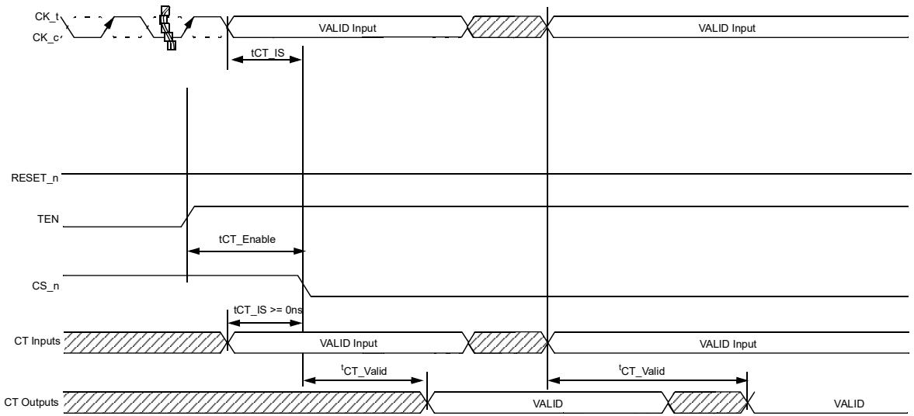  
Figure 198 — Timing Diagram for Connectivity Test (CT) Mode

Table 434 — AC Parameters for Connectivity Test (CT) Mode  

<table><tr><td>Symbol</td><td>Min</td><td>Max</td><td>Unit</td></tr><tr><td>tCT_IS</td><td>0</td><td>-</td><td>ns</td></tr><tr><td>tCT_Enable</td><td>200</td><td>-</td><td>ns</td></tr><tr><td>tCT_Valid</td><td>-</td><td>200</td><td>ns</td></tr></table>

# 8.11.1 Connectivity Test (CT) Mode Input Levels

The input parameters in Table 435 will be applied for DDR5 SDRAM Input Signals during Connectivity Test Mode.

Table 435 — CMOS Rail to Rail Input Levels for TEN, CS_n and Test Inputs  

<table><tr><td>Parameter</td><td>Symbol</td><td>Min</td><td>Max</td><td>Unit</td><td>Notes</td></tr><tr><td>TEN AC Input High Voltage</td><td>VIH(AC)_TEN</td><td>0.8 * VDDQ</td><td>VDDQ</td><td>V</td><td>1</td></tr><tr><td>TEN DC Input High Voltage</td><td>VIH(DC)_TEN</td><td>0.7 * VDDQ</td><td>VDDQ</td><td>V</td><td></td></tr><tr><td>TEN DC Input Low Voltage</td><td>VIL(DC)_TEN</td><td>VSS</td><td>0.3 * VDDQ</td><td>V</td><td></td></tr><tr><td>TEN AC Input Low Voltage</td><td>VIL(AC)_TEN</td><td>VSS</td><td>0.2 * VDDQ</td><td>V</td><td>2</td></tr><tr><td>TEN Input signal Falling time</td><td>TF_input_TEN</td><td>-</td><td>10</td><td>ns</td><td></td></tr><tr><td>TEN Input signal Rising time</td><td>TR_input_TEN</td><td>-</td><td>10</td><td>ns</td><td></td></tr><tr><td colspan="6">NOTE 1 Overshoot might occur. It should be limited by the Absolute Maximum DC Ratings (see Table 390). 
NOTE 2 Undershoot might occur. It should be limited by Absolute Maximum DC Ratings (see Table 390).</td></tr></table>

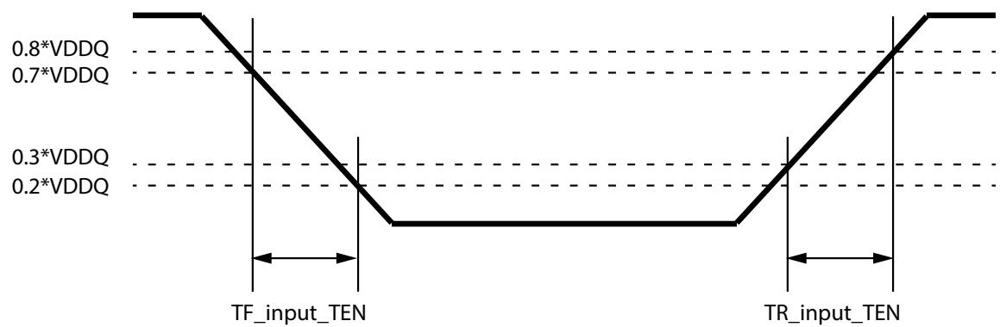  
Figure 199—TEN Input Slew Rate Definition

# 8.11.2 CMOS Rail to Rail Input Levels for RESET_n

Table 436 — CMOS Rail to Rail Input Levels for RESET_n  

<table><tr><td>Parameter</td><td>Symbol</td><td>Min</td><td>Max</td><td>Unit</td><td>NOTE</td></tr><tr><td>AC Input High Voltage</td><td>VIH(AC)_RESET</td><td>0.8*VDDQ</td><td>VDDQ</td><td>V</td><td>5</td></tr><tr><td>DC Input High Voltage</td><td>VIH(DC)_RESET</td><td>0.7*VDDQ</td><td>VDDQ</td><td>V</td><td>2</td></tr><tr><td>DC Input Low Voltage</td><td>VIL(DC)_RESET</td><td>VSS</td><td>0.3*VDDQ</td><td>V</td><td>1</td></tr><tr><td>AC Input Low Voltage</td><td>VIL(AC)_RESET</td><td>VSS</td><td>0.2*VDDQ</td><td>V</td><td>6</td></tr><tr><td>Rising time</td><td>TR_RESET</td><td>-</td><td>1.0</td><td>us</td><td></td></tr><tr><td>RESET pulse width</td><td>tPW_RESET</td><td>1.0</td><td>-</td><td>us</td><td>3,4</td></tr><tr><td colspan="6">NOTE 1 After RESET_n is registered LOW, RESET_n level shall be maintained below VIL(DC)_RESET during tPW_RESET, otherwise, SDRAM may not be reset.</td></tr><tr><td colspan="6">NOTE 2 Once RESET_n is registered HIGH, RESET_n level must be maintained above VIH(DC)_RESET, otherwise, SDRAM operation will not be guaranteed until it is reset asserting RESET_n signal LOW.</td></tr><tr><td colspan="6">NOTE 3 RESET is destructive to data contents.</td></tr><tr><td colspan="6">NOTE 4 This definition is applied only for “Reset Procedure at Power Stable”.</td></tr><tr><td colspan="6">NOTE 5 Overshoot might occur. It should be limited by the Absolute Maximum DC Ratings (see Table 390).</td></tr><tr><td colspan="6">NOTE 6 Undershoot might occur. It should be limited by Absolute Maximum DC Ratings (see Table 390).</td></tr></table>

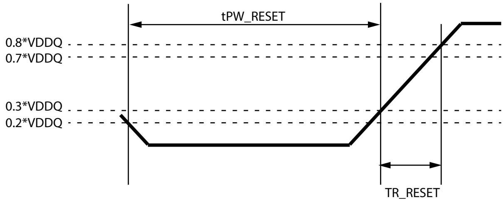  
Figure 200 — RESET_n Input Slew Rate Definition

9

# 9.1 Output Driver DC Electrical Characteristics for DQS and DQ

The DDR5 driver supports two different Ron values. These Ron values are referred as strong (low Ron) and weak mode (high Ron). A functional representation of the output buffer is shown in Figure 201.

Output driver impedance RON is defined as follows:

The individual pull-up and pull-down resistors  $(\mathrm{RON}_{\mathrm{Pu}}$  and  $\mathrm{RON}_{\mathrm{Pd}})$  are defined as follows:

$$
R O N _ {P u} = \frac {V D D Q - V o u t}{| | o u t |} \quad \text {u n d e r}
$$

$$
R O N _ {P d} = \frac {V o u t}{| | o u t |} \quad \text {u n d e r t h e c o n d i t i o n t h a t} R O N P u \text {i s o f f}
$$

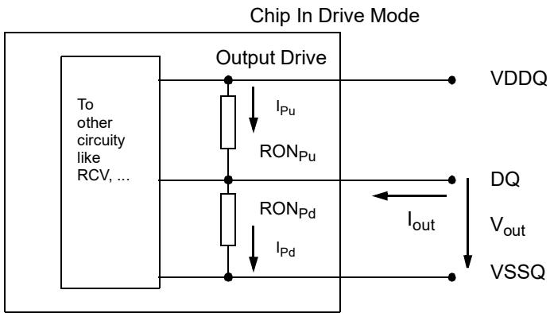  
Figure 201 — Output Drive, Chip In Drive Mode

Table 437 — Output Driver DC Electrical Characteristics, Assuming  $\mathrm{{RZQ}} = {240}\mathrm{{ohm}}$  ; Entire Operating Temperature Range; after Proper ZQ Calibration  

<table><tr><td>RONNOM</td><td>Resistor</td><td>Vout</td><td>Min</td><td>Nom</td><td>Max</td><td>Unit</td><td>NOTE</td></tr><tr><td rowspan="6">34Ω</td><td rowspan="3">RON34Pd</td><td>VOLdc= 0.5*VDDQ</td><td>0.8</td><td>1</td><td>1.1</td><td>RZQ/7</td><td>1,2</td></tr><tr><td>VOMdc= 0.8* VDDQ</td><td>0.9</td><td>1</td><td>1.1</td><td>RZQ/7</td><td>1,2</td></tr><tr><td>VOHdc= 0.95* VDDQ</td><td>0.9</td><td>1</td><td>1.25</td><td>RZQ/7</td><td>1,2</td></tr><tr><td rowspan="3">RON34Pu</td><td>VOLdc= 0.5* VDDQ</td><td>0.9</td><td>1</td><td>1.25</td><td>RZQ/7</td><td>1,2</td></tr><tr><td>VOMdc= 0.8* VDDQ</td><td>0.9</td><td>1</td><td>1.1</td><td>RZQ/7</td><td>1,2</td></tr><tr><td>VOHdc= 0.95* VDDQ</td><td>0.8</td><td>1</td><td>1.1</td><td>RZQ/7</td><td>1,2</td></tr><tr><td rowspan="6">48Ω</td><td rowspan="3">RON48Pd</td><td>VOLdc= 0.5*VDDQ</td><td>0.8</td><td>1</td><td>1.1</td><td>RZQ/5</td><td>1,2</td></tr><tr><td>VOMdc= 0.8* VDDQ</td><td>0.9</td><td>1</td><td>1.1</td><td>RZQ/5</td><td>1,2</td></tr><tr><td>VOHdc= 0.95* VDDQ</td><td>0.9</td><td>1</td><td>1.25</td><td>RZQ/5</td><td>1,2</td></tr><tr><td rowspan="3">RON48Pu</td><td>VOLdc= 0.5* VDDQ</td><td>0.9</td><td>1</td><td>1.25</td><td>RZQ/5</td><td>1,2</td></tr><tr><td>VOMdc= 0.8* VDDQ</td><td>0.9</td><td>1</td><td>1.1</td><td>RZQ/5</td><td>1,2</td></tr><tr><td>VOHdc= 0.95* VDDQ</td><td>0.8</td><td>1</td><td>1.1</td><td>RZQ/5</td><td>1,2</td></tr></table>

Table 437 — Output Driver DC Electrical Characteristics, Assuming  $\mathrm{{RZQ}} = {240}\mathrm{{ohm}}$  ; Entire Operating Temperature Range; after Proper ZQ Calibration (Cont'd)  

<table><tr><td>RONNOM</td><td>Resistor</td><td>Vout</td><td>Min</td><td>Nom</td><td>Max</td><td>Unit</td><td>NOTE</td></tr><tr><td colspan="2">Mismatch between pull-up and pull-down, MMPuPd</td><td>VOMdc= 0.8* VDDQ</td><td>-10</td><td></td><td>10</td><td>%</td><td>1,2,3,4</td></tr><tr><td colspan="2">Mismatch DQ-DQ within byte variation pull-up, MMPudd</td><td>VOMdc= 0.8* VDDQ</td><td></td><td></td><td>10</td><td>%</td><td>1,2,4</td></tr><tr><td colspan="2">Mismatch DQ-DQ within byte variation pull-dn, MMPddd</td><td>VOMdc= 0.8* VDDQ</td><td></td><td></td><td>10</td><td>%</td><td>1,2,4</td></tr><tr><td colspan="8">NOTE 1 The tolerance limits are specified after calibration with stable voltage and temperature. For the behavior of the tolerance limits if temperature or voltage changes after calibration, see following section on voltage and temperature sensitivity (TBD).</td></tr><tr><td colspan="8">NOTE 2 Pull-up and pull-dn output driver impedances are recommended to be calibrated at 0.8* VDDQ. Other calibration schemes may be used to achieve the linearity spec shown here, e.g., calibration at 0.5* VDDQ and 0.95* VDDQ.</td></tr><tr><td colspan="8">NOTE 3 Measurement definition for mismatch between pull-up and pull-down, MMPuPd : Measure RONPu and RONPD both at 0.8*VDD separately; Ronnom is the nominal Ron value</td></tr><tr><td colspan="8">MMPuPd = RONPu -RONPd / RONNOM *100</td></tr><tr><td colspan="8">NOTE 4 RON variance range ratio to RON Nominal value in a given component, including DQS_t and DQS_c.</td></tr><tr><td colspan="8">MMPudd = RONPuMax -RONPuMin / RONNOM *100</td></tr><tr><td colspan="8">MMPddd = RONPdMax -RONPdMin / RONNOM *100</td></tr><tr><td colspan="8">NOTE 5 This parameter of x16 device is specified for Upper byte and Lower byte.</td></tr></table>

9.2 Output Driver DC Electrical Characteristics for Loopback Signals LBDQS, LBDQ The DDR5 Loopback driver supports 34 ohms. A functional representation of the output buffer is shown in Figure 202.

$$
R O N _ {P u} = \begin{array}{l l} \frac {V D D Q - V o u t}{| | o u t |} & \text {u n d e r t h e c o n d i t i o n t h a t R O N P d i s o f f} \end{array}
$$

$$
R O N _ {P d} = \begin{array}{c} \text {V o u t} \\ \text {| | o u t |} \end{array} \quad \text {u n d e r t h e c o n d i t i o n t h a t R O N P u i s o f f}
$$

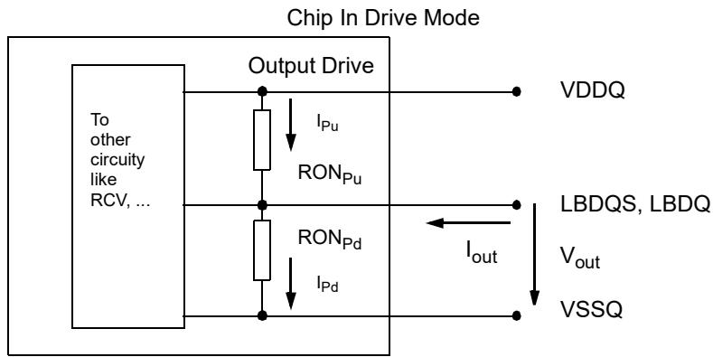  
Figure 202 — Output Driver for Loopback Signals

# 9.2 Output Driver DC Electrical Characteristics for Loopback Signals LBDQS, LBDQ (Cont'd)

Table 438 — Output Driver DC Electrical Characteristics, Assuming  $\mathrm{RZQ} = 240\mathrm{ohm}$  Entire Operating Temperature Range; after Proper ZQ Calibration  

<table><tr><td>RONNOM</td><td>Resistor</td><td>Vout</td><td>Min</td><td>Nom</td><td>Max</td><td>Unit</td><td>Notes</td></tr><tr><td rowspan="6">34Ω</td><td rowspan="3">RON34Pd</td><td>VOLdc= 0.5*VDDQ</td><td>0.8</td><td>1</td><td>1.1</td><td>RZQ/7</td><td>1,2</td></tr><tr><td>VOMdc= 0.8* VDDQ</td><td>0.9</td><td>1</td><td>1.1</td><td>RZQ/7</td><td>1,2</td></tr><tr><td>VOHdc= 0.95* VDDQ</td><td>0.9</td><td>1</td><td>1.25</td><td>RZQ/7</td><td>1,2</td></tr><tr><td rowspan="3">RON34Pu</td><td>VOLdc= 0.5* VDDQ</td><td>0.9</td><td>1</td><td>1.25</td><td>RZQ/7</td><td>1,2</td></tr><tr><td>VOMdc= 0.8* VDDQ</td><td>0.9</td><td>1</td><td>1.1</td><td>RZQ/7</td><td>1,2</td></tr><tr><td>VOHdc= 0.95* VDDQ</td><td>0.8</td><td>1</td><td>1.1</td><td>RZQ/7</td><td>1,2</td></tr><tr><td colspan="2">Mismatch between pull-up and pull-down, MMPuPd</td><td>VOMdc= 0.8* VDDQ</td><td>-10</td><td></td><td>10</td><td>%</td><td>1,2,3,4</td></tr><tr><td colspan="2">Mismatch LBDQS-LBDQ within device variation pull-up, MMPudd</td><td>VOMdc= 0.8* VDDQ</td><td></td><td></td><td>10</td><td>%</td><td>1,2,4</td></tr><tr><td colspan="2">Mismatch LBDQS-LBDQ within device variation pull-dn, MMPddd</td><td>VOMdc= 0.8* VDDQ</td><td></td><td></td><td>10</td><td>%</td><td>1,2,4</td></tr><tr><td colspan="8">NOTE 1 The tolerance limits are specified after calibration with stable voltage and temperature. For the behavior of the tolerance limits if temperature or voltage changes after calibration, see following section on voltage and temperature sensitivity (TBD).</td></tr><tr><td colspan="8">NOTE 2 Pull-up and pull-dn output driver impedances are recommended to be calibrated at 0.8* VDDQ. Other calibration schemes may be used to achieve the linearity spec shown, e.g., calibration at 0.5* VDDQ and 0.95* VDDQ.</td></tr><tr><td colspan="8">NOTE 3 Measurement definition for mismatch between pull-up and pull-down, MMPuPd: Measure RONPu and RONPD both at 0.8*VDD separately; Ronnom is the nominal Ron value</td></tr><tr><td colspan="8">NOTE 4 RON variance range ratio to RON Nominal value in a given component, including LBDQS and LBDQ.</td></tr><tr><td colspan="8">MMPudd = RONPuMax -RONPuMin / RONNOM *100</td></tr><tr><td colspan="8">MMPddd = RONPdMax -RONPdMin / RONNOM *100</td></tr></table>

# 9.3 Loopback Output Timing

Loopback strobe LBDQS to Loopback data LBDQ relationship is illustrated in Figure 203.

- tLBQSH describes the single-ended LBDQS strobe high pulse width  
- tLBQSL describes the single-ended LBDQS strobe low pulse width  
- tLBDQSQ describes the latest valid transition of LBDQ measured at both rising and falling edges of LBDQS  
- tLBQH describes the earliest invalid transition of LBDQ measured at both rising and falling edges of LBDQS  
- tLBDVW describes the data valid window per device per UI and is derived from (tLBQH-tLBDQSQ) of each UI on a given DRAM

Table 439 — Loopback Output Timing Parameters for DDR5-3200 to 4800  

<table><tr><td colspan="2">Speed</td><td colspan="2">DDR5-3200</td><td colspan="2">DDR5-3600</td><td colspan="2">DDR5-4000</td><td colspan="2">DDR5-4400</td><td colspan="2">DDR5-4800</td><td rowspan="2">Units</td><td rowspan="2">NOTE</td></tr><tr><td>Parameter</td><td>Symbol</td><td>MIN</td><td>MAX</td><td>MIN</td><td>MAX</td><td>MIN</td><td>MAX</td><td>MIN</td><td>MAX</td><td>MIN</td><td>MAX</td></tr><tr><td colspan="14">Loopback Timing</td></tr><tr><td>Loopback LBDQS Output Low Time</td><td>tLBQSL</td><td>0.7</td><td>-</td><td>0.7</td><td>-</td><td>0.7</td><td>-</td><td>0.7</td><td>-</td><td>0.7</td><td>-</td><td>tCK</td><td>1</td></tr><tr><td>Loopback LBDQS Output High Time</td><td>tLBQSH</td><td>0.7</td><td>-</td><td>0.7</td><td>-</td><td>0.7</td><td>-</td><td>0.7</td><td>-</td><td>0.7</td><td>-</td><td>tCK</td><td>1</td></tr><tr><td>Loopback LBDQS to LBDQ Skew</td><td>tLBDQSQ</td><td>0.2</td><td>-</td><td>0.2</td><td>-</td><td>0.2</td><td>-</td><td>0.2</td><td>-</td><td>0.2</td><td>-</td><td>tCK/2</td><td>1</td></tr><tr><td>Loopback LBDQ Output Time from LBDQS</td><td>tLBQH</td><td>3.6</td><td>-</td><td>3.6</td><td>-</td><td>3.6</td><td>-</td><td>3.6</td><td>-</td><td>3.6</td><td>-</td><td>tCK/2</td><td>1</td></tr><tr><td>Loopback Data valid window (tLBQH-tLBDQSQ) of each UI per DRAM</td><td>tLBDVW</td><td>3.4</td><td>-</td><td>3.4</td><td>-</td><td>3.4</td><td>-</td><td>3.4</td><td>-</td><td>3.4</td><td>-</td><td>tCK/2</td><td>1</td></tr><tr><td colspan="14">NOTE 1 Based on Loopback 4-way interleave setting (see Section 3.5.54)</td></tr></table>

Table 440 — Loopback Output Timing Parameters for DDR5-5200 to 6400  

<table><tr><td colspan="2">Speed</td><td colspan="2">DDR5-5200</td><td colspan="2">DDR5-5600</td><td colspan="2">DDR5-6000</td><td colspan="2">DDR5-6400</td><td rowspan="2">Units</td><td rowspan="2">NOTE</td></tr><tr><td>Parameter</td><td>Symbol</td><td>MIN</td><td>MAX</td><td>MIN</td><td>MAX</td><td>MIN</td><td>MAX</td><td>MIN</td><td>MAX</td></tr><tr><td colspan="12">Loopback Timing</td></tr><tr><td>Loopback LBDQS Output Low Time</td><td>tLBQSL</td><td>TBD</td><td>-</td><td>TBD</td><td>-</td><td>TBD</td><td>-</td><td>TBD</td><td>-</td><td>tCK</td><td>1</td></tr><tr><td>Loopback LBDQS Output High Time</td><td>tLBQSH</td><td>TBD</td><td>-</td><td>TBD</td><td>-</td><td>TBD</td><td>-</td><td>TBD</td><td>-</td><td>tCK</td><td>1</td></tr><tr><td>Loopback LBDQS to LBDQ Skew</td><td>tLBDQSQ</td><td>TBD</td><td>-</td><td>TBD</td><td>-</td><td>TBD</td><td>-</td><td>TBD</td><td>-</td><td>tCK/2</td><td>1</td></tr><tr><td>Loopback LBDQ Output Time from LBDQS</td><td>tLBQH</td><td>TBD</td><td>-</td><td>TBD</td><td>-</td><td>TBD</td><td>-</td><td>TBD</td><td>-</td><td>tCK/2</td><td>1</td></tr><tr><td>Loopback Data valid window (tLBQH-tLBD-QSQ) of each UI per DRAM</td><td>tLBDVW</td><td>TBD</td><td>-</td><td>TBD</td><td>-</td><td>TBD</td><td>-</td><td>TBD</td><td>-</td><td>tCK/2</td><td>1</td></tr><tr><td colspan="12">NOTE 1 Based on Loopback 4-way interleave setting (see Section 3.5.54)</td></tr></table>

# 9.3 Loopback Output Timing (Cont'd)

Table 441 — Loopback Output Timing Parameters for DDR5-6800 to 8400  

<table><tr><td colspan="2">Speed</td><td colspan="2">DDR5-8500</td><td colspan="2">DDR5-7200</td><td colspan="2">DDR5-7600</td><td colspan="2">DDR5-8000</td><td colspan="2">DDR5-8400</td><td rowspan="2">Units</td><td rowspan="2">NOT E</td></tr><tr><td>Parameter</td><td>Symbol</td><td>MIN</td><td>MAX</td><td>MIN</td><td>MAX</td><td>MIN</td><td>MAX</td><td>MIN</td><td>MAX</td><td>MIN</td><td>MAX</td></tr><tr><td colspan="14">Loopback Timing</td></tr><tr><td>Loopback LBDQS Output Low Time</td><td>tLBQSL</td><td>TBD</td><td>-</td><td>TBD</td><td>-</td><td>TBD</td><td>-</td><td>TBD</td><td>-</td><td>TBD</td><td>-</td><td>tCK</td><td>1</td></tr><tr><td>Loopback LBDQS Output High Time</td><td>tLBQSH</td><td>TBD</td><td>-</td><td>TBD</td><td>-</td><td>TBD</td><td>-</td><td>TBD</td><td>-</td><td>TBD</td><td>-</td><td>tCK</td><td>1</td></tr><tr><td>Loopback LBDQS to LBDQ Skew</td><td>tLBDQSQ</td><td>TBD</td><td>-</td><td>TBD</td><td>-</td><td>TBD</td><td>-</td><td>TBD</td><td>-</td><td>TBD</td><td>-</td><td>tCK/2</td><td>1</td></tr><tr><td>Loopback LBDQ Output Time from LB-DQS</td><td>tLBQH</td><td>TBD</td><td>-</td><td>TBD</td><td>-</td><td>TBD</td><td>-</td><td>TBD</td><td>-</td><td>TBD</td><td>-</td><td>tCK/2</td><td>1</td></tr><tr><td>Loopback Data valid window (tLBQH-tLBDQSQ) of each UI per DRAM</td><td>tLBDVW</td><td>TBD</td><td>-</td><td>TBD</td><td>-</td><td>TBD</td><td>-</td><td>TBD</td><td>-</td><td>TBD</td><td>-</td><td>tCK/2</td><td>1</td></tr></table>

Note(s):  
1: Based on Loopback 4-way interleave setting (see MR53)

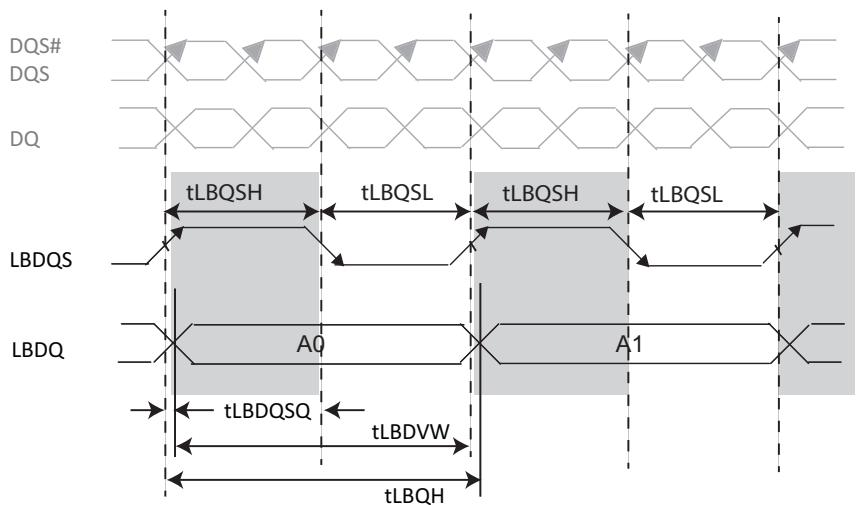  
Figure 203 — Loopback Strobe to Data Relationship

# 9.3.1 Alert_n Output Drive Characteristic

A functional representation of the output buffer is shown in Figure 204. Output driver impedance RON is defined as follows:

$$
R O N _ {P d} = \frac {V o u t}{| l o u t |} _ {u n d e r t h e c o n d i t i o n t h a t R O N _ {P u} i s o f f}
$$

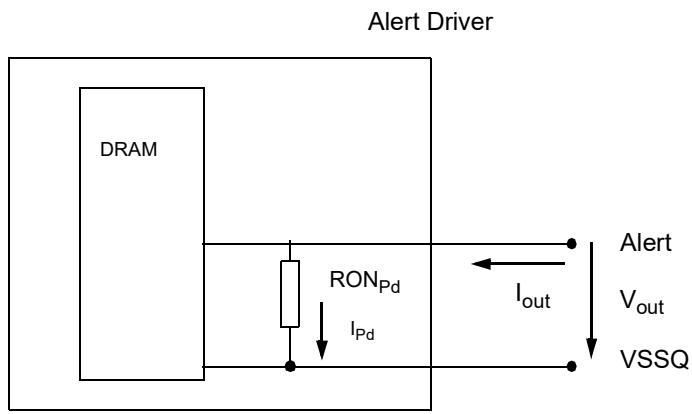  
Figure 204 — Output Buffer Function

Table 442 - RONp d Vout Values  

<table><tr><td>Resistor</td><td>Vout</td><td>Min</td><td>Max</td><td>Unit</td><td>NOTE</td></tr><tr><td rowspan="3">RONPd</td><td>VOLdc= 0.1* VDDQ</td><td>0.3</td><td>1.1</td><td>RZQ/7</td><td></td></tr><tr><td>VOMdc = 0.8* VDDQ</td><td>0.4</td><td>1.1</td><td>RZQ/7</td><td></td></tr><tr><td>VOHdc = 0.95* VDDQ</td><td>0.4</td><td>1.25</td><td>RZQ/7</td><td></td></tr></table>

# 9.3.2 Output Driver Characteristic of Connectivity Test (CT) Mode

Following Output driver impedance RON will be applied to the Test Output Pin during Connectivity Test (CT) Mode.

The individual pull-up and pull-down resistors (RONPu_CT and RONPd_CT) are defined as follows:

$$
\mathrm {R O N} _ {\mathrm {P u} _ {\mathrm {C T}}} = \frac {\mathrm {V} _ {\mathrm {D D Q}} - \mathrm {V} _ {\mathrm {O U T}}}{\mathrm {I} \text {l o u t} \mathrm {I}}
$$

$$
\mathrm {R O N} _ {\mathrm {P d} _ {\mathrm {C T}}} = \frac {\mathrm {V} _ {\mathrm {O U T}}}{\mathrm {I} \mathrm {l o u t} \mathrm {I}}
$$

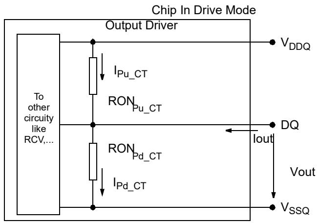  
Figure 205 — Output Driver

Table 443 — RONNOM_CT Vout Values  

<table><tr><td>RONNOM_CT</td><td>Resistor</td><td>Vout</td><td>Max</td><td>Units</td><td>NOTE</td></tr><tr><td rowspan="8">34Ω</td><td rowspan="4">RONPd_CT</td><td>VOBdc = 0.2 x VDDQ</td><td>1.9</td><td>RZQ/7</td><td>1,2</td></tr><tr><td>VOLdc = 0.5 x VDDQ</td><td>2.0</td><td>RZQ/7</td><td>1,2</td></tr><tr><td>VOMdc = 0.8 x VDDQ</td><td>2.2</td><td>RZQ/7</td><td>1,2</td></tr><tr><td>VOHdc = 0.95 x VDDQ</td><td>2.5</td><td>RZQ/7</td><td>1,2</td></tr><tr><td rowspan="4">RONPu_CT</td><td>VOBdc = 0.2 x VDDQ</td><td>1.9</td><td>RZQ/7</td><td>1,2</td></tr><tr><td>VOLdc = 0.5 x VDDQ</td><td>2.0</td><td>RZQ/7</td><td>1,2</td></tr><tr><td>VOMdc = 0.8 x VDDQ</td><td>2.2</td><td>RZQ/7</td><td>1,2</td></tr><tr><td>VOHdc =0.95 x VDDQ</td><td>2.5</td><td>RZQ/7</td><td>1,2</td></tr><tr><td colspan="6">NOTE 1 Connectivity test mode uses un-calibrated drivers, showing the full range over PVT. No mismatch between pull up and pull down is defined. 
NOTE 2 Uncalibrated drive strength tolerance is specified at +/- 30%</td></tr></table>

# 9.4 Single-Ended Output Levels - VOL/VOH

Table 444 — Single-Ended Output Levels for DDR5-3200 to DDR5-6400  

<table><tr><td>Symbol</td><td>Parameter</td><td>DDR5-3200-6400</td><td>Units</td><td>Notes</td></tr><tr><td>VOH</td><td>Output high measurement level (for output SR)</td><td>0.75 x Vpk-pk</td><td>V</td><td>1</td></tr><tr><td>VOL</td><td>Output low measurement level (for output SR)</td><td>0.25 x Vpk-pk</td><td>V</td><td>1</td></tr><tr><td colspan="5">NOTE 1 Vpk-pkis the mean high voltage minus the mean low voltage over TBD samples.</td></tr></table>

Table 445 — Single-Ended Output Levels for DDR5-6800 to DDR5-8400  

<table><tr><td>Symbol</td><td>Parameter</td><td>DDR5-6800-8400</td><td>Units</td><td>Notes</td></tr><tr><td>VOH</td><td>Output high measurement level (for output SR)</td><td>0.75 x Vpk-pk</td><td>V</td><td>1</td></tr><tr><td>VOL</td><td>Output low measurement level (for output SR)</td><td>0.25 x Vpk-pk</td><td>V</td><td>1</td></tr><tr><td colspan="5">NOTE 1 Vpk-pkis the mean high voltage minus the mean low voltage over TBD samples.</td></tr></table>

# 9.5 Single-Ended Output Levels - VOL/VOH for Loopback Signals

Table 446 — Single-Ended Output Levels for Loopback Signals DDR5-3200 to DDR5-6400  

<table><tr><td>Symbol</td><td>Parameter</td><td>DDR5-3200-6400</td><td>Units</td><td>Notes</td></tr><tr><td>VOH</td><td>Output high measurement level (for output SR)</td><td>0.75 x Vpk-pk</td><td>V</td><td>1</td></tr><tr><td>VOL</td><td>Output low measurement level (for output SR)</td><td>0.25 x Vpk-pk</td><td>V</td><td>1</td></tr><tr><td colspan="5">NOTE 1 Vpk-pkis the mean high voltage minus the mean low voltage over TBD samples.</td></tr></table>

Table 447 — Single-Ended Output Levels for Loopback Signals DDR5-6800 to DDR5-6800  

<table><tr><td>Symbol</td><td>Parameter</td><td>DDR5-3200-6400</td><td>Units</td><td>Notes</td></tr><tr><td>VOH</td><td>Output high measurement level (for output SR)</td><td>0.75 x Vpk-pk</td><td>V</td><td>1</td></tr><tr><td>VOL</td><td>Output low measurement level (for output SR)</td><td>0.25 x Vpk-pk</td><td>V</td><td>1</td></tr><tr><td colspan="5">NOTE 1 Vpk-pkis the mean high voltage minus the mean low voltage over TBD samples.</td></tr></table>

# 9.6 Single-Ended Output Slew Rate

With the reference load for timing measurements, output slew rate for falling and rising edges is defined and measured between  $\mathrm{V_{OL}}$  and  $\mathrm{V_{OH}}$  for single ended signals as shown in Table 448 and Figure 206.

Table 448 — Single-Ended Output Slew Rate Definition  

<table><tr><td rowspan="2">Description</td><td colspan="2">Measured</td><td rowspan="2">Defined by</td></tr><tr><td>From</td><td>To</td></tr><tr><td>Single ended output slew rate for rising edge</td><td>VOL</td><td>VOH</td><td>[VOH-VOL] / delta TRse</td></tr><tr><td>Single ended output slew rate for falling edge</td><td>VOH</td><td>VOL</td><td>[VOH-VOL] / delta TFse</td></tr><tr><td colspan="4">NOTE 1 Output slew rate is verified by design and characterization, and may not be subject to production test.</td></tr></table>

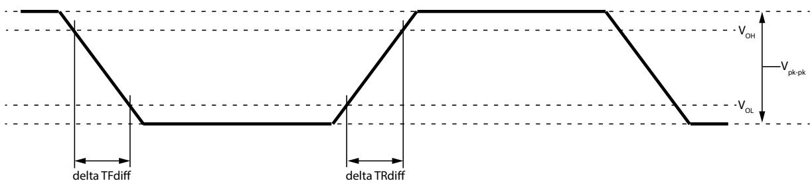  
Figure 206 — Single-Ended Output Slew Rate Definition

Table 449 — Single-Ended Output Slew Rate for DDR5-3200 to DDR5-4800  

<table><tr><td colspan="2">Speed</td><td colspan="2">DDR5-3200</td><td colspan="2">DDR5-3600</td><td colspan="2">DDR5-4000</td><td colspan="2">DDR5-4400</td><td colspan="2">DDR5-4800</td><td rowspan="2">Units</td><td rowspan="2">NOTE</td></tr><tr><td>Parameter</td><td>Symbol</td><td>MIN</td><td>MAX</td><td>MIN</td><td>MAX</td><td>MIN</td><td>MAX</td><td>MIN</td><td>MAX</td><td>MIN</td><td>MAX</td></tr><tr><td>Single ended output slew rate</td><td>SRQse</td><td>8</td><td>18</td><td>8</td><td>18</td><td>8</td><td>18</td><td>8</td><td>18</td><td>8</td><td>18</td><td>V/ns</td><td></td></tr></table>

Table 450 — Single-Ended Output Slew Rate for DDR5-5200 to DDR5-6400  

<table><tr><td colspan="2">Speed</td><td colspan="2">DDR5-5200</td><td colspan="2">DDR5-5600</td><td colspan="2">DDR5-6000</td><td colspan="2">DDR5-6400</td><td rowspan="2">Units</td><td rowspan="2">NOTE</td></tr><tr><td>Parameter</td><td>Symbol</td><td>MIN</td><td>MAX</td><td>MIN</td><td>MAX</td><td>MIN</td><td>MAX</td><td>MIN</td><td>MAX</td></tr><tr><td>Single ended output slew rate</td><td>SRQse</td><td>TBD</td><td>TBD</td><td>TBD</td><td>TBD</td><td>TBD</td><td>TBD</td><td>TBD</td><td>TBD</td><td>V/ns</td><td></td></tr></table>

Table 451 — Single-Ended Output Slew Rate for DDR5-6800 to DDR5-8400  

<table><tr><td colspan="2">Speed</td><td colspan="2">DDR5-6800</td><td colspan="2">DDR5-7200</td><td colspan="2">DDR5-7600</td><td colspan="2">DDR5-8000</td><td colspan="2">DDR5-8400</td><td rowspan="2">Units</td><td rowspan="2">NOTE</td></tr><tr><td>Parameter</td><td>Symbol</td><td>MIN</td><td>MAX</td><td>MIN</td><td>MAX</td><td>MIN</td><td>MAX</td><td>MIN</td><td>MAX</td><td>MIN</td><td>MAX</td></tr><tr><td>Single ended output slew rate</td><td>SRQse</td><td>TBD</td><td>TBD</td><td>TBD</td><td>TBD</td><td>TBD</td><td>TBD</td><td>TBD</td><td>TBD</td><td>TBD</td><td>TBD</td><td>V/ns</td><td></td></tr></table>

# 9.7 Differential Output Levels

Table 452 — Differential Output Levels for DDR5-3200 to DDR5-6400  

<table><tr><td>Symbol</td><td>Parameter</td><td>DDR5-3200-6400</td><td>Units</td><td>Notes</td></tr><tr><td>VOHdiff</td><td>Differential output high measurement level (for output SR)</td><td>0.75 x Vdiffpk-pk</td><td>V</td><td>1</td></tr><tr><td>VOLdiff</td><td>Differential output low measurement level (for output SR)</td><td>0.25 x Vdiffpk-pk</td><td>V</td><td>1</td></tr><tr><td colspan="5">NOTE 1 Vdiffpk-pkis the mean high voltage minus the mean low voltage over TBD samples.</td></tr></table>

Table 453 — Differential AC & DC Output Levels for DDR5-6800 to DDR5-8400  

<table><tr><td>Symbol</td><td>Parameter</td><td>DDR5-6800-8400</td><td>Units</td><td>Notes</td></tr><tr><td>VOHdiff</td><td>Differential output high measurement level (for output SR)</td><td>0.7 x Vpeak2peak</td><td>V</td><td>1</td></tr><tr><td>VOLdiff</td><td>Differential output low measurement level (for output SR)</td><td>0.3 x Vpeak2peak</td><td>V</td><td>1</td></tr><tr><td colspan="5">NOTE 1 Vdiffpk-pk is the mean high voltage minus the mean low voltage over TBD samples.</td></tr></table>

# 9.8 Differential Output Slew Rate

With the reference load for timing measurements, output slew rate for falling and rising edges is defined and measured between  $\mathrm{V_{OLdiff}}$  and  $\mathrm{V_{OHdiff}}$  for differential signals as shown in Table 454 and Figure 207

Table 454 — Differential Output Slew Rate Definition  

<table><tr><td rowspan="2">Description</td><td colspan="2">Measured</td><td rowspan="2">Defined by</td></tr><tr><td>From</td><td>To</td></tr><tr><td>Differential output slew rate for rising edge</td><td>VOLdiff</td><td>VOHdiff</td><td>[VOHdiff-VOLdiff] / delta TRdiff</td></tr><tr><td>Differential output slew rate for falling edge</td><td>VOHdiff</td><td>VOLdiff</td><td>[VOHdiff-VOLdiff] / delta TFdiff</td></tr><tr><td colspan="4">NOTE Output slew rate is verified by design and characterization, and may not be subject to production test.</td></tr></table>

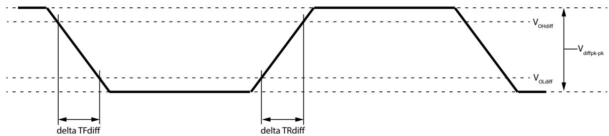  
Figure 207 — Differential Output Slew Rate Definition

# 9.8 Differential Output Slew Rate (Cont'd)

Table 455 — Differential Output Slew Rate for DDR5-3200 to DDR5-4800  

<table><tr><td colspan="2">Speed</td><td colspan="2">DDR5-3200</td><td colspan="2">DDR5-3600</td><td colspan="2">DDR5-4000</td><td colspan="2">DDR5-4400</td><td colspan="2">DDR5-4800</td><td rowspan="2">Units</td><td rowspan="2">NOTE</td></tr><tr><td>Parameter</td><td>Symbol</td><td>MIN</td><td>MAX</td><td>MIN</td><td>MAX</td><td>MIN</td><td>MAX</td><td>MIN</td><td>MAX</td><td>MIN</td><td>MAX</td></tr><tr><td>Differential output slew rate</td><td>SRQdiff</td><td>16</td><td>36</td><td>16</td><td>36</td><td>16</td><td>36</td><td>16</td><td>36</td><td>16</td><td>36</td><td>V/ns</td><td></td></tr></table>

Table 456 — Differential Output Slew Rate for DDR5-5200 to DDR5-6400  

<table><tr><td colspan="2">Speed</td><td colspan="2">DDR5-5200</td><td colspan="2">DDR5-5600</td><td colspan="2">DDR5-6000</td><td colspan="2">DDR5-6400</td><td rowspan="2">Units</td><td rowspan="2">NOTE</td></tr><tr><td>Parameter</td><td>Symbol</td><td>MIN</td><td>MAX</td><td>MIN</td><td>MAX</td><td>MIN</td><td>MAX</td><td>MIN</td><td>MAX</td></tr><tr><td>Differential output slew rate</td><td>SRQdiff</td><td>TBD</td><td>TBD</td><td>TBD</td><td>TBD</td><td>TBD</td><td>TBD</td><td>TBD</td><td>TBD</td><td>V/ns</td><td></td></tr></table>

Table 457 — Differential Output Slew Rate for DDR5-6800 to DDR5-8400  

<table><tr><td colspan="2">Speed</td><td colspan="2">DDR5-6800</td><td colspan="2">DDR5-7200</td><td colspan="2">DDR5-7600</td><td colspan="2">DDR5-8000</td><td colspan="2">DDR5-8400</td><td rowspan="2">Units</td><td rowspan="2">NOTE</td></tr><tr><td>Parameter</td><td>Symbol</td><td>MIN</td><td>MAX</td><td>MIN</td><td>MAX</td><td>MIN</td><td>MAX</td><td>MIN</td><td>MAX</td><td>MIN</td><td>MAX</td></tr><tr><td>Differential output slew rate</td><td>SRQdiff</td><td>TBD</td><td>TBD</td><td>TBD</td><td>TBD</td><td>TBD</td><td>TBD</td><td>TBD</td><td>TBD</td><td>TBD</td><td>TBD</td><td>V/ns</td><td></td></tr></table>

# 9.9 Tx DQS Jitter

The Random Jitter (Rj) specified is a random jitter meeting a Gaussian distribution. The Deterministic Jitter (Dj) specified is bounded. The DDR5 device output jitter must not exceed maximum values specified in Table 458.

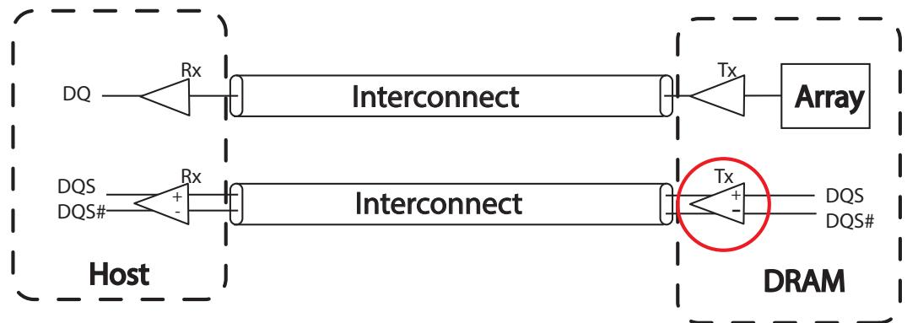  
Figure 208 — Example of DDR5 Memory Interconnect – Tx DQS Jitter

Table 458 — Tx DQS Jitter Parameters for DDR5-3200 to 4800  
Dj = Deterministic Jitter; Rj = Random Jitter; DCD = Duty Cycle Distortion; BUJ = Bounded Uncorrelated Jitter; pp = Peak to Peak  

<table><tr><td rowspan="2">Parameter</td><td rowspan="2">Symbol</td><td colspan="2">DDR5-3200</td><td colspan="2">DDR5-3600</td><td colspan="2">DDR5-4000</td><td colspan="2">DDR5-4400</td><td colspan="2">DDR5-4800</td><td rowspan="2">Unit</td><td rowspan="2">Notes</td></tr><tr><td>Min</td><td>Max</td><td>Min</td><td>Max</td><td>Min</td><td>Max</td><td>Min</td><td>Max</td><td>Min</td><td>Max</td></tr><tr><td>Rj RMS Value of 1-UI Jitter without BUJ</td><td>tTx_D-QS-1UI_R-j_NoBUJ</td><td>-</td><td>tCK1UI_RjNoBUJ+0.002</td><td>-</td><td>tCK1UI_RjNoBUJ+0.002</td><td>-</td><td>tCK1UI_RjNoBUJ+0.002</td><td>-</td><td>tCK1UI_RjNoBUJ+0.002</td><td>-</td><td>tCK1UI_RjNoBUJ+0.002</td><td>UI (RMS)</td><td>1,2,3,4,5,6,7,8,9,10,11,12</td></tr><tr><td>Dj pp Value of 1-UI Jitter without BUJ</td><td>tTx_D-QS-1UI_D-j_NoBUJ</td><td>-</td><td>0.150</td><td>-</td><td>0.150</td><td>-</td><td>0.150</td><td>-</td><td>0.150</td><td>-</td><td>0.150</td><td>UI</td><td>1,2,3,5,6,7,8,9,10,11</td></tr><tr><td>Rj RMS Value of N-UI Jitter without BUJ, where 1&lt;N&lt;4</td><td>tTx_D-QS_NUI_R-j_NoBUJ</td><td>-</td><td>tCKNUI_RjNoBUJ+0.002</td><td>-</td><td>tCKNUI_RjNoBUJ+0.002</td><td>-</td><td>tCKNUI_RjNoBUJ+0.002</td><td>-</td><td>tCKNUI_RjNoBUJ+0.002</td><td>-</td><td>tCKNUI_RjNoBUJ+0.002</td><td>UI (RMS)</td><td>1,2,3,5,6,7,8,9,10,11,12</td></tr><tr><td>Dj pp Value of N-UI Jitter without BUJ, where 1&lt;N&lt;4</td><td>tTx_D-QS_NUI_D-j_NoBUJ</td><td>-</td><td>0.150</td><td>-</td><td>0.150</td><td>-</td><td>0.150</td><td>-</td><td>0.150</td><td>-</td><td>0.150</td><td>UI</td><td>1,2,3,5,6,7,8,9,10,11</td></tr><tr><td colspan="14">NOTE 1 On-die noise similar to that occurring with all the transmitter and receiver lanes toggling need to be stimulated. When there is no socket in the transmitter measurement setup, in many cases, the contribution of the cross-talk is not significant or can be estimated within tolerable error even with all the transmitter lanes sending patterns. When a socket is present, such as DUT being DRAM component, the contribution of the cross-talk could be significant. To minimize the impact of crosstalk on the measurement results, a small group of selected lanes in the vicinity of the lane under test may be turned off (sending DC), while the remaining TX lanes send patterns to the corresponding RX receivers so as to excite realistic on-die noise profile from device switching. Note that there may be cases when one of Dj and Rj specs is met and another violated in which case the signaling analysis should be run to determine link feasibility</td></tr><tr><td colspan="14">NOTE 2 On-die noise similar to that occurring with all the transmitter and receiver lanes toggling need to be stimulated. When there is no socket in the transmitter measurement setup, in many cases the contribution of BUJ is not significant or can be estimated within tolerable error even with all the transmitter lanes sending patterns. When a socket is present, such as DUT being DRAM component, the contribution of the cross-talk could be significant. To minimize the impact of crosstalk on the measurement results, a small group of selected lanes in the vicinity of the lane under test may be turned off (sending DC), while the remaining TX lanes send patterns to the corresponding RX receivers, so as to excite realistic on-die noise profile from device switching. Note that there may be cases when one of Dj and Rj specs is met and another violated in which case the signaling analysis should be run to determine link feasibility</td></tr><tr><td colspan="14">NOTE 3 The validation methodology for these parameters will be covered in future ballots</td></tr><tr><td colspan="14">NOTE 4 Rj RMS value of 1-UI jitter. Without BUJ, but on-die system like noise present. This extraction is to be done after software correction of DCD</td></tr><tr><td colspan="14">NOTE 5 See Section 7.2 for details on the minimum BER requirements</td></tr><tr><td colspan="14">NOTE 6 See Section 7.3 for details on UI, NUI and Jitter definitions</td></tr><tr><td colspan="14">NOTE 7 Duty Cycle of the DQ pins must be adjusted as close to 50% as possible using the Global and Per Pin Duty Cycle Adjuster feature prior to running the Tx DQ Jitter test</td></tr><tr><td colspan="14">NOTE 8 The Mode Registers for the Duty Cycle Adjuster are MR43 and MR44, and the Mode Registers for the Per Pin DCA of DQS are MR103 - MR110.</td></tr><tr><td colspan="14">NOTE 9 Spread Spectrum Clocking (SSC) must be disabled while running the Tx DQ Jitter test</td></tr><tr><td colspan="14">NOTE 10 These parameters are tested using the continuous clock pattern which are sent out from the dram device without the need for sending out continuous MRR commands. The MR25 OP[3] is set to “1” to enable this feature.</td></tr><tr><td colspan="14">NOTE 11 Tested on the CTC2 card only</td></tr><tr><td colspan="14">NOTE 12 The max value of tTx_DQS_Rj_1UI_NoBUJ and tTx_DQS_Rj_NUI_NoBUJ can be 6mUI RMS</td></tr></table>

# 9.9 Tx DQS Jitter (Cont'd)

Table 459 — Tx DQS Jitter Parameters for DDR5-5200 to 6400  
Dj = Deterministic Jitter; Rj = Random Jitter; DCD = Duty Cycle Distortion; BUJ = Bounded Uncorrelated Jitter; pp = Peak to Peak  

<table><tr><td rowspan="2">Parameter</td><td rowspan="2">Symbol</td><td colspan="2">DDR5-5200</td><td colspan="2">DDR5-5600</td><td colspan="2">DDR5-6000</td><td colspan="2">DDR5-6400</td><td rowspan="2">Unit</td><td rowspan="2">Notes</td></tr><tr><td>Min</td><td>Max</td><td>Min</td><td>Max</td><td>Min</td><td>Max</td><td>Min</td><td>Max</td></tr><tr><td>Strobe Duty Cycle Error</td><td>tTx_DQS_Duty_UL</td><td>-</td><td>TBD</td><td>-</td><td>TBD</td><td>-</td><td>TBD</td><td>-</td><td>TBD</td><td>UI</td><td>1,2,3,4,5,6,7,8,9,10,11,12</td></tr><tr><td>Strobe Duty Cycle Error</td><td>tTx_DQS_Duty_UL</td><td>-</td><td>TBD</td><td>-</td><td>TBD</td><td>-</td><td>TBD</td><td>-</td><td>TBD</td><td>UI</td><td>1,2,3,5,6,7,8,9,10,11</td></tr><tr><td>Strobe Duty Cycle Error</td><td>tTx_DQS_Duty_UL</td><td>-</td><td>TBD</td><td>-</td><td>TBD</td><td>-</td><td>TBD</td><td>-</td><td>TBD</td><td>UI</td><td>1,2,3,5,6,7,8,9,10,11,12</td></tr><tr><td>Strobe Duty Cycle Error</td><td>tTx_DQS_Duty_UL</td><td>-</td><td>TBD</td><td>-</td><td>TBD</td><td>-</td><td>TBD</td><td>-</td><td>TBD</td><td>UI</td><td>1,2,3,5,6,7,8,9,10,11</td></tr><tr><td>NOTE 1</td><td colspan="11">On-die noise similar to that occurring with all the transmitter and receiver lanes toggling need to be stimulated. When there is no socket in the transmitter measurement setup, in many cases, the contribution of the cross-talk is not significant or can be estimated within tolerable error even with all the transmitter lanes sending patterns. When a socket is present, such as DUT being DRAM component, the contribution of the cross-talk could be significant. To minimize the impact of crosstalk on the measurement results, a small group of selected lanes in the vicinity of the lane under test may be turned off (sending DC), while the remaining TX lanes send patterns to the corresponding RX receivers so as to excite realistic on-die noise profile from device switching. Note that there may be cases when one of Dj and Rj specs is met and another violated in which case the signaling analysis should be run to determine link feasibility</td></tr><tr><td>NOTE 2</td><td colspan="11">On-die noise similar to that occurring with all the transmitter and receiver lanes toggling need to be stimulated. When there is no socket in the transmitter measurement setup, in many cases the contribution of BUJ is not significant or can be estimated within tolerable error even with all the transmitter lanes sending patterns. When a socket is present, such as DUT being DRAM component, the contribution of the cross-talk could be significant. To minimize the impact of crosstalk on the measurement results, a small group of selected lanes in the vicinity of the lane under test may be turned off (sending DC), while the remaining TX lanes send patterns to the corresponding RX receivers, so as to excite realistic on-die noise profile from device switching. Note that there may be cases when one of Dj and Rj specs is met and another violated in which case the signaling analysis should be run to determine link feasibility</td></tr><tr><td>NOTE 3</td><td colspan="11">The validation methodology for these parameters will be covered in future ballots</td></tr><tr><td>NOTE 4</td><td colspan="11">Rj RMS value of 1-UI jitter. Without BUJ, but on-die system like noise present. This extraction is to be done after software correction of DCD</td></tr><tr><td>NOTE 5</td><td colspan="11">See Section 7.2 for details on the minimum BER requirements</td></tr><tr><td>NOTE 6</td><td colspan="11">See Section 7.3 for details on UI, NUI and Jitter definitions</td></tr><tr><td>NOTE 7</td><td colspan="11">Duty Cycle of the DQ pins must be adjusted as close to 50% as possible using the Global and Per Pin Duty Cycle Adjuster feature prior to running the Tx DQ Jitter test</td></tr><tr><td>NOTE 8</td><td colspan="11">The Mode Registers for the Duty Cycle Adjuster are MR43 and MR44, the Mode Register for the Per Pin DCA of DQS are MR103 - MR110.</td></tr><tr><td>NOTE 9</td><td colspan="11">Spread Spectrum Clocking (SSC) must be disabled while running the Tx DQ Jitter test</td></tr><tr><td>NOTE 10</td><td colspan="11">These parameters are tested using the continuous clock pattern which are sent out from the dram device without the need for sending out continuous MRR commands. The MR25 OP[3] is set to “1” to enable this feature.</td></tr><tr><td>NOTE 11</td><td colspan="11">Tested on the CTC2 card only</td></tr><tr><td>NOTE 12</td><td colspan="11">The max value of tTx_DQS_Rj_1UI_NoBUJ and tTx_DQS_Rj_NUI_NoBUJ can be 6mUI RMS</td></tr></table>

# 9.9 Tx DQS Jitter (Cont'd)

[Dj=Deterministic Jitter; Rj=Random Jitter; DCD=Duty Cycle Distortion; BUJ=Bounded Uncorrelated Jitter; pp=Peak to Peak]

Table 460 — Tx DQS Jitter Parameters for DDR5-6800 to 8400  

<table><tr><td rowspan="2">Parameter</td><td rowspan="2">Symbol</td><td colspan="2">DDR5-8000</td><td colspan="2">DDR5-7200</td><td colspan="2">DDR5-7600</td><td colspan="2">DDR5-8000</td><td colspan="2">DDR5-8400</td><td rowspan="2">Unit</td><td rowspan="2">Notes</td></tr><tr><td>Min</td><td>Max</td><td>Min</td><td>Max</td><td>Min</td><td>Max</td><td>Min</td><td>Max</td><td>Min</td><td>Max</td></tr><tr><td>Rj RMS Value of 1-UIJitter without BUJ</td><td>tTx_DQS_1UI_Rj_NoBUJ</td><td>-</td><td>TBD</td><td>-</td><td>TBD</td><td>-</td><td>TBD</td><td>-</td><td>TBD</td><td>-</td><td>TBD</td><td>UI (RMS)</td><td>1,2,3,4,5,6,7,8,9,10,11,12</td></tr><tr><td>Dj pp Value of 1-UIJitter without BUJ</td><td>tTx_DQS_1UI_Dj_NoBUJ</td><td>-</td><td>TBD</td><td>-</td><td>TBD</td><td>-</td><td>TBD</td><td>-</td><td>TBD</td><td>-</td><td>TBD</td><td>UI</td><td>1,2,3,5,6,7,8,9,10,11</td></tr><tr><td>Rj RMS Value of N-UIjitter without BUJ, where 1&lt;N&lt;4</td><td>tTx_DQS_NUI_Rj_NoBUJ</td><td>-</td><td>TBD</td><td>-</td><td>TBD</td><td>-</td><td>TBD</td><td>-</td><td>TBD</td><td>-</td><td>TBD</td><td>UI (RMS)</td><td>1,2,3,5,6,7,8,9,10,11,12</td></tr><tr><td>Dj pp Value of N-UIJitter without BUJ, where 1&lt;N&lt;4</td><td>tTx_DQS_NUI_Dj_NoBUJ</td><td>-</td><td>TBD</td><td>-</td><td>TBD</td><td>-</td><td>TBD</td><td>-</td><td>TBD</td><td>-</td><td>TBD</td><td>UI</td><td>1,2,3,5,6,7,8,9,10,11</td></tr><tr><td colspan="14">NOTE 1 On-die noise similar to that occurring with all the transmitter and receiver lanes toggling need to be stimulated. When there is no socket in transmitter measurement setup, in many cases, the contribution of the cross-talk is not significant or can be estimated within tolerable error even with all the transmitter lanes sending patterns. When a socket is present, such as DUT being DRAM component, the contribution of the cross-talk could be significant. To minimize the impact of crosstalk on the measurement results, a small group of selected lanes in the vicinity of the lane under test may be turned off (sending DC), while the remaining TX lanes send patterns to the corresponding RX receivers so as to excite realistic on-die noise profile from device switching. Note that there may be cases when one of DJ and Rj specs is met and another violated in which case the signaling analysis should be run to determine link feasibility</td></tr><tr><td colspan="14">NOTE 2 On-die noise similar to that occurring with all the transmitter and receiver lanes toggling need to be stimulated. When there is no socket in transmitter measurement setup, in many cases the contribution of BUJ is not significant or can be estimated within tolerable error even with all the transmitter lanes sending patterns. When a socket is present, such as DUT being DRAM component, the contribution of the cross-talk could be significant. To minimize the impact of crosstalk on the measurement results, a small group of selected lanes in the vicinity of the lane under test may be turned off (sending DC), while the remaining TX lanes send patterns to the corresponding RX receivers, so as to excite realistic on-die noise profile from device switching. Note that there may be cases when one of DJ and Rj specs is met and another violated in which case the signaling analysis should be run to determine link feasibility</td></tr><tr><td colspan="14">NOTE 3 The validation methodology for these parameters will be covered in future ballots</td></tr><tr><td colspan="14">NOTE 4Rj RMS value of 1-UI jitter. Without BUJ, but on-die system like noise present. This extraction is to be done after software correction of DCD</td></tr><tr><td colspan="14">NOTE 5See Section 7.2 for details on the minimum BER requirements</td></tr><tr><td colspan="14">NOTE 6See Section 7.3 for details on UI, NUI and Jitter definitions</td></tr><tr><td colspan="14">NOTE 7Duty Cycle of the DQ pins must be adjusted as close to 50% as possible using the Duty Cycle Adjuster feature prior to running the Tx DQ Jitter test</td></tr><tr><td colspan="14">NOTE 8The Mode Registers for the Duty Cycle Adjuster are MR43 and MR44</td></tr><tr><td colspan="14">NOTE 9Spread Spectrum Clocking (SSC) must be disabled while running the Tx DQ Jitter test</td></tr><tr><td colspan="14">NOTE 10These parameters are tested using the continuous clock pattern which are sent out from the dram device without the need for sending out continuous MRR commands. The MR25 OP[3] is set to “1” to enable this feature.</td></tr><tr><td colspan="14">NOTE 11Tested on the CTC2 card only</td></tr><tr><td colspan="14">NOTE 12The max value of tTx_DQS_Rj_1UI_NoBUJ and tTx_DQS_Rj_NUI_NoBUJ can be 6mUI RMS</td></tr></table>

# 9.10 Tx DQ Jitter

# 9.10.1 Overview

The Random Jitter (Rj) specified is a random jitter meeting a Gaussian distribution. The Deterministic Jitter (Dj) specified is bounded. The DDR5 device output jitter must not exceed maximum values specified in Table 461.

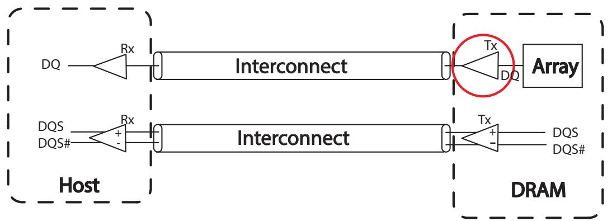  
Figure 209 — Example of DDR5 Memory Interconnect – Tx DQ Jitter

# 9.10.2 Tx DQ Jitter Parameters

Table 461 — Tx DQ Jitter Parameters for DDR5-3200 to 4800  
Dj=Deterministic Jitter; Rj=Random Jitter; DCD=Duty Cycle Distortion; BUJ=Bounded Uncorrelated Jitter; pp=Peak to Peak  

<table><tr><td rowspan="2">Parameter</td><td rowspan="2">Symbol</td><td colspan="2">DDR5-3200</td><td colspan="2">DDR5-3600</td><td colspan="2">DDR5-4000</td><td colspan="2">DDR5-4400</td><td colspan="2">DDR5-4800</td><td rowspan="2">Unit</td><td rowspan="2">Notes</td></tr><tr><td>Min</td><td>Max</td><td>Min</td><td>Max</td><td>Min</td><td>Max</td><td>Min</td><td>Max</td><td>Min</td><td>Max</td></tr><tr><td>Rj RMS of 1-UI jitter without BUJ</td><td>tTx_D_Q_1UI_R_j_NoBUJ</td><td>-</td><td>tCK1UI_RjNoBUJ+0.002</td><td>-</td><td>tCK1UI_RjNoBUJ+0.002</td><td>-</td><td>tCK1UI_RjNoBUJ+0.002</td><td>-</td><td>tCK1UI_RjNoBUJ+0.002</td><td>-</td><td>tCK1UI_RjNoBUJ+0.002</td><td>UI (RMS)</td><td>1,3,4,5,7,8,9,10,11,12,13,14</td></tr><tr><td>Dj pp 1-UI jitter without BUJ</td><td>tTx_D_Q_1UI_D_j_NoBUJ</td><td>-</td><td>0.150</td><td>-</td><td>0.150</td><td>-</td><td>0.150</td><td>-</td><td>0.150</td><td>-</td><td>0.150</td><td>UI</td><td>3,5,7,8,9,10,11,12,13</td></tr><tr><td>Rj RMS of N-UI jitter without BUJ, where 1&lt;N&lt;4</td><td>tTx_D_Q_NoBUJ</td><td>-</td><td>tCKNUI_RjNoBUJ+0.002</td><td>-</td><td>tCKNUI_RjNoBUJ+0.002</td><td>-</td><td>tCKNUI_RjNoBUJ+0.002</td><td>-</td><td>tCKNUI_RjNoBUJ+0.002</td><td>-</td><td>tCKNUI_RjNoBUJ+0.002</td><td>UI (RMS)</td><td>3,5,7,8,9,10,11,12,13,14</td></tr><tr><td>Dj pp N-UI jitter without BUJ, where 1&lt;N&lt;4</td><td>tTx_D_Q_NoBUJ</td><td>-</td><td>0.150</td><td>-</td><td>0.150</td><td>-</td><td>0.150</td><td>-</td><td>0.150</td><td>-</td><td>0.150</td><td>UI</td><td>3,6,7,8,9,10,11,12,13</td></tr><tr><td>Delay of any data lane relative to strobe lane</td><td>tTx_D_QS2DQ</td><td>-0.100</td><td>0.100</td><td>-0.100</td><td>0.100</td><td>-0.100</td><td>0.100</td><td>-0.100</td><td>0.100</td><td>-0.100</td><td>0.100</td><td>UI</td><td>3,5,6,7,9,10,11,12,13</td></tr><tr><td colspan="14">NOTE 1 On-die noise similar to that occurring with all the transmitter and receiver lanes toggling need to be stimulated. When there is no socket in the transmitter measurement setup, in many cases, the contribution of the cross-talk is not significant or can be estimated within tolerable error even with all the transmitter lanes sending patterns. When a socket is present, such as DUT being DRAM component, the contribution of the cross-talk could be significant. To minimize the impact of crosstalk on the measurement results, a small group of selected lanes in the vicinity of the lane under test may be turned off (sending DC), while the remaining TX lanes send patterns to the corresponding RX receivers so as to excite realistic on-die noise profile from device switching. Note that there may be cases when one of Dj and Rj specs is met and another violated in which case the signaling analysis should be run to determine link feasibility.</td></tr><tr><td colspan="14">NOTE 2 On-die noise similar to that occurring with all the transmitter and receiver lanes toggling need to be stimulated. When there is no socket in the transmitter measurement setup, in many cases, the contribution of BUJ is not significant or can be estimated within tolerable error even with all the transmitter lanes sending patterns. When a socket is present, such as DUT being DRAM component, the contribution of the cross-talk could be significant. To minimize the impact of crosstalk on the measurement results, a small group of selected lanes in the vicinity of the lane under test may be turned off (sending DC), while the remaining TX lanes send patterns to the corresponding RX receivers so as to excite realistic on-cie noise profile from device switching. Note that there may be cases when one of Dj and Rj specs is met and another violated in which case the signaling analysis should be run to determine link feasibility</td></tr><tr><td colspan="14">NOTE 3 The validation methodology for these parameters will be covered in future ballots</td></tr><tr><td colspan="14">NOTE 4 Rj RMS value of 1-UI jitter without BUJ, but on-die system like noise present. This extraction is to be done after software correction of DCD</td></tr><tr><td colspan="14">NOTE 5 Delay of any data lane relative to strobe lane, as measured at Tx output</td></tr><tr><td colspan="14">NOTE 6 Vref noise level to DQ jitter should be adjusted to minimize DCD</td></tr><tr><td colspan="14">NOTE 7 See Section 7.2 for details on the minimum BER requirements</td></tr><tr><td colspan="14">NOTE 8 See Section 7.3 for details on UI, NUI and Jitter definitions</td></tr><tr><td colspan="14">NOTE 9 Duty Cycle of the DQ pins must be adjusted as close to 50% as possible using the Global and Per Pin Duty Cycle Adjuster feature prior to running this test</td></tr><tr><td colspan="14">NOTE 10 The Mode Registers for the Duty Cycle Adjuster are MR43 and MR44. Also the Mode Registers for the Per Pin DCA of DQLx are MR(133+8x) and MR(134+8x), where 0≤x≤7, and the Mode Registers for the Per Pin DCA of DQUy are MR(197+8y) and MR(198+8y), where 0≤y≤7.</td></tr><tr><td colspan="14">NOTE 11 Spread Spectrum Clocking (SSC) must be disabled while running this test</td></tr><tr><td colspan="14">NOTE 12 These parameters are tested using the continuous clock pattern which are sent out from the dram device without the need for sending out continuous MRR commands. The MR25 OP[3] is set to “1” to enable this feature.</td></tr><tr><td colspan="14">NOTE 13 Tested on the CTC2 card only</td></tr><tr><td colspan="14">NOTE 14 The max value of tTx_DQ_Rj_1UI_NoBUJ and tTx_DQ_Rj_NUI_NoBUJ can be 6mUI RMS</td></tr></table>

Table 462 — Tx DQ Jitter Parameters for DDR5-5200 to 6400  
Dj=Deterministic Jitter; Rj=Random Jitter; DCD=Duty Cycle Distortion; BUJ=Bounded Uncorrelated Jitter; pp=Peak to Peak  

<table><tr><td rowspan="2">Parameter</td><td rowspan="2">Symbol</td><td colspan="2">DDR5-5200</td><td colspan="2">DDR5-5600</td><td colspan="2">DDR5-6000</td><td colspan="2">DDR5-6400</td><td rowspan="2">Unit</td><td rowspan="2">Notes</td></tr><tr><td>Min</td><td>Max</td><td>Min</td><td>Max</td><td>Min</td><td>Max</td><td>Min</td><td>Max</td></tr><tr><td>DQ Duty Cycle Error</td><td>tTx_DQ_Duty_UL</td><td>-</td><td>TBD</td><td>-</td><td>TBD</td><td>-</td><td>TBD</td><td>-</td><td>TBD</td><td>UI</td><td>3,4,10,11,12,13,14,15,16,17</td></tr><tr><td>RJ RMS of 1-UI jitter without BUJ</td><td>tTx_D-Q_TUI_R_J_NoBUJ</td><td>-</td><td>TBD</td><td>-</td><td>TBD</td><td>-</td><td>TBD</td><td>-</td><td>TBD</td><td>UI (RMS)</td><td>1,3,5,9,11,12,13,14,15,16,17,18</td></tr><tr><td>Dj pp 1-UI jitter without BUJ</td><td>tTx_D-Q_TUI_D_J_NoBUJ</td><td>-</td><td>TBD</td><td>-</td><td>TBD</td><td>-</td><td>TBD</td><td>-</td><td>TBD</td><td>UI</td><td>3,6,9,11,12,13,14,15,16,17</td></tr><tr><td>RJ RMS of N-UI jitter without BUJ, where 1&lt;N&lt;4</td><td>tTx_D-Q_NUI_R_J_NoBUJ</td><td>-</td><td>TBD</td><td>-</td><td>TBD</td><td>-</td><td>TBD</td><td>-</td><td>TBD</td><td>UI (RMS)</td><td>3,7,9,11,12,13,14,15,16,17,18</td></tr><tr><td>Dj pp N-UI jitter without BUJ, where 1&lt;N&lt;4</td><td>tTx_D-Q_NUI_D_J_NoBUJ</td><td>-</td><td>TBD</td><td>-</td><td>TBD</td><td>-</td><td>TBD</td><td>-</td><td>TBD</td><td>UI</td><td>3,8,10,11,12,13,14,15,16,17</td></tr><tr><td>Delay of any data lane relative to strobe lane</td><td>tTx_DQS2DQ</td><td>-TBD</td><td>TBD</td><td>-TBD</td><td>TBD</td><td>-TBD</td><td>TBD</td><td>-TBD</td><td>TBD</td><td>UI</td><td>3,9,10,11,13,14,15,16,17</td></tr><tr><td colspan="12">NOTE 1 On-die noise similar to that occurring with all the transmitter and receiver lanes toggling need to be stimulated. When there is no socket in the transmitter measurement setup, in many cases, the contribution of the cross-talk is not significant or can be estimated within tolerable error even with all the transmitter lanes sending patterns. When a socket is present, such as DUT being DRAM component, the contribution of the cross-talk could be significant. To minimize the impact of crosstalk on the measurement results, a small group of selected lanes in the vicinity of the lane under test may be turned off (sending DC), while the remaining TX lanes send patterns to the corresponding RX receivers so as to excite realistic on-die noise profile from device switching. Note that there may be cases when one of Dj and Rj specs is met and another violated in which case the signaling analysis should be run to determine link feasibility.</td></tr><tr><td colspan="12">NOTE 2 On-die noise similar to that occurring with all the transmitter and receiver lanes toggling need to be stimulated. When there is no socket in the transmitter measurement setup, in many cases, the contribution of BUJ is not significant or can be estimated within tolerable error even with all the transmitter lanes sending patterns. When a socket is present, such as DUT being DRAM component, the contribution of the cross-talk could be significant. To minimize the impact of crosstalk on the measurement results, a small group of selected lanes in the vicinity of the lane under test may be turned off (sending DC), while the remaining TX lanes send patterns to the corresponding RX receivers so as to excite realistic on-cie noise profile from device switching. Note that there may be cases when one of Dj and Rj specs is met and another violated in which case the signaling analysis should be run to determine link feasibility</td></tr><tr><td colspan="12">NOTE 3 The validation methodology for these parameters will be covered in future ballots</td></tr><tr><td colspan="12">NOTE 4 Rj RMS value of 1-UI jitter without BUJ, but on-die system like noise present. This extraction is to be done after software correction of DCD</td></tr><tr><td colspan="12">NOTE 5 Delay of any data lane relative to strobe lane, as measured at Tx output</td></tr><tr><td colspan="12">NOTE 6 Vref noise level to DQ jitter should be adjusted to minimize DCD</td></tr><tr><td colspan="12">NOTE 7 See Section 7.2 for details on the minimum BER requirements</td></tr><tr><td colspan="12">NOTE 8 See Section 7.3 for details on UI, NUI and Jitter definitions</td></tr><tr><td colspan="12">NOTE 9 Duty Cycle of the DQ pins must be adjusted as close to 50% as possible using the Global and Per Pin Duty Cycle Adjuster feature prior to running this test</td></tr><tr><td colspan="12">NOTE 10 The Mode Registers for the Duty Cycle Adjuster are MR43 and MR44. Also the Mode Registers for the Per Pin DCA of DQLx are MR(133+8x) and MR(134+8x), where 0≤x≤7, and the Mode Registers for the Per Pin DCA of DQUy are MR(197+8y) and MR(198+8y), where 0≤y≤7.</td></tr><tr><td colspan="12">NOTE 11 Spread Spectrum Clocking (SSC) must be disabled while running this test</td></tr><tr><td colspan="12">NOTE 12 These parameters are tested using the continuous clock pattern which are sent out from the dram device without the need for sending out continuous MRR commands. The MR25 OP[3] is set to “1” to enable this feature.</td></tr><tr><td colspan="12">NOTE 13 Tested on the CTC2 card only</td></tr><tr><td colspan="12">NOTE 14 The max value of tTx_DQ_Rj_1UI_NoBUJ and tTx_DQ_Rj_NUI_NoBUJ can be 6mUI RMS</td></tr></table>

# 9.10.2 Tx DQ Jitter Parameters (Cont'd)

[Dj=Deterministic Jitter; Rj=Random Jitter; DCD=Duty Cycle Distortion; BUJ=Bounded Uncorrelated Jitter; pp=Peak to Peak]

Table 463 — Tx DQ Jitter Parameters for DDR5-6800 to 8400  

<table><tr><td rowspan="2">Parameter</td><td rowspan="2">Symbol</td><td colspan="2">DOR5-6000</td><td colspan="2">DOR5-7200</td><td colspan="2">DOR5-76000</td><td colspan="2">DOR5-6000</td><td colspan="2">DOR5-6400</td><td rowspan="2">Unit</td><td rowspan="2">Notes</td></tr><tr><td>Min</td><td>Max</td><td>Min</td><td>Max</td><td>Min</td><td>Max</td><td>Min</td><td>Max</td><td>Min</td><td>Max</td></tr><tr><td>DQ Duty Cycle Error</td><td>tTx_DQ_Duty_ UI</td><td>-</td><td>TBD</td><td>-</td><td>TBD</td><td>-</td><td>TBD</td><td>-</td><td>TBD</td><td>-</td><td>TBD</td><td>UI</td><td>3,4,10,11,12,13,14,15,16,17</td></tr><tr><td>Rj RMS of 1-UI jitter without BUJ</td><td>tTx_DQ_1UI_Rj_NoBUJ</td><td>-</td><td>TBD</td><td>-</td><td>TBD</td><td>-</td><td>TBD</td><td>-</td><td>TBD</td><td>-</td><td>TBD</td><td>UI (RMS)</td><td>1,3,5,9,11,12,13,14,15,16,17,18</td></tr><tr><td>Dj pp 1-UI jitter without BUJ</td><td>tTx_DQ_1UI_Dj_NoBUJ</td><td>-</td><td>TBD</td><td>-</td><td>TBD</td><td>-</td><td>TBD</td><td>-</td><td>TBD</td><td>-</td><td>TBD</td><td>UI</td><td>3,6,9,11,12,13,14,15,16,17</td></tr><tr><td>Rj RMS of N-UI jitter without BUJ, where 1&lt;N&lt;4</td><td>tTx_DQ_NUI_Rj_NoBUJ</td><td>-</td><td>TBD</td><td>-</td><td>TBD</td><td>-</td><td>TBD</td><td>-</td><td>TBD</td><td>-</td><td>TBD</td><td>UI (RMS)</td><td>3,7,9,11,12,13,14,15,16,17,18</td></tr><tr><td>Dj pp N-UI jitter without BUJ, where 1&lt;N&lt;4</td><td>tTx_DQ_NUI_Dj_NoBUJ</td><td>-</td><td>TBD</td><td>-</td><td>TBD</td><td>-</td><td>TBD</td><td>-</td><td>TBD</td><td>-</td><td>TBD</td><td>UI</td><td>3,8,10,11,12,13,14,15,16,17</td></tr><tr><td>Delay of any data lane relative to strobe lane</td><td>tTx_DQS2D_Q</td><td>-TBD</td><td>TBD</td><td>-TBD</td><td>TBD</td><td>-TBD</td><td>TBD</td><td>-TBD</td><td>TBD</td><td>-TBD</td><td>TBD</td><td>UI</td><td>3,9,10,11,13,14,15,16,17</td></tr><tr><td colspan="14">NOTE 1 On-die noise similar to that occurring with all the transmitter and receiver lanes toggling need to be stimulated. When there is no socket in transmitter measurement setup, in many cases, the contribution of the cross-talk is not significant or can be estimated within tolerable error even with all the transmitter lanes sending patterns. When a socket is present, such as DUT being DRAM component, the contribution of the cross-talk could be significant. To minimize the impact of crosstalk on the measurement results, a small group of selected lanes in the vicinity of the lane under test may be turned off (sending DC), while the remaining TX lanes send patterns to the corresponding RX receivers so as to excite realistic on-die noise profile from device switching. Note that there may be cases when one of Dj and Rj specs is met and another violated in which case the signaling analysis should be run to determine link feasibility.</td></tr><tr><td colspan="14">NOTE 2 On-die noise similar to that occurring with all the transmitter and receiver lanes toggling need to be stimulated. When there is no socket in transmitter measurement setup, in many cases, the contribution of BUJ is not significant or can be estimated within tolerable error even with all the transmitter lanes sending patterns. When a socket is present, such as DUT being DRAM component, the contribution of the cross-talk could be significant. To minimize the impact of crosstalk on the measurement results, a small group of selected lanes in the vicinity of the lane under test may be turned off (sending DC), while the remaining TX lanes send patterns to the corresponding RX receivers so as to excite realistic on-cie noise profile from device switching. Note that there may be cases when one of Dj and Rj specs is met and another violated in which case the signaling analysis should be run to determine link feasibility</td></tr><tr><td colspan="14">NOTE 3 The validation methodology for these parameters will be covered in future ballots</td></tr><tr><td colspan="14">NOTE 4 Rj RMS value of 1-UI jitter without BUJ, but on-die system like noise present. This extraction is to be done after software correction of DCD</td></tr><tr><td colspan="14">NOTE 5 Delay of any data lane relative to strobe lane, as measured at Tx output</td></tr><tr><td colspan="14">NOTE 6 Vref noise level to DQ jitter should be adjusted to minimize DCD</td></tr><tr><td colspan="14">NOTE 7 See Chapter 7 for details on the minimum BER requirements</td></tr><tr><td colspan="14">NOTE 8 See Chapter 7 for details on UI, NUI and Jitter definitions</td></tr><tr><td colspan="14">NOTE 9 Duty Cycle of the DQ pins must be adjusted as close to 50% as possible using the Duty Cycle Adjuster feature prior to running this test</td></tr><tr><td colspan="14">NOTE 10 The Mode Registers for the Duty Cycle Adjuster are MR43 and MR44</td></tr><tr><td colspan="14">NOTE 11 Spread Spectrum Clocking (SSC) must be disabled while running this test</td></tr><tr><td colspan="14">NOTE 12 These parameters are tested using the continuous clock pattern which are sent out from the dram device without the need for sending out continuous MRR commands. The MR25 OP[3] is set to “1” to enable this feature.</td></tr><tr><td colspan="14">NOTE 13 Tested on the CTC2 card only</td></tr><tr><td colspan="14">NOTE 14 The max value of tTx_DQ_Rj_1UI_NoBUJ and tTx_DQ_Rj_NU_NoBUJ can be 6mUI RMS</td></tr></table>

# 9.11 Tx DQ Stressed Eye

Tx DQ stressed eye height and eye width must meet minimum specification values at  $\mathrm{BER} = \mathrm{E}^{-9}$  and confidence level  $99.5\%$ . Tx DQ Stressed Eye shows the DQS to DQ skew for both Eye Width and Eye Height. In order to support different Host Receiver (Rx) designs, it is the responsibility of the Host to ensure the advanced DQS edges are adjusted accordingly via the Read DQS Offset Timing mode register settings (MR40 OP[3:0]).

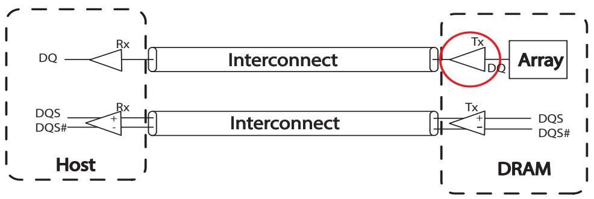  
Figure 210 — Example of DDR5 Memory Interconnect – Tx DQ Stressed Eye

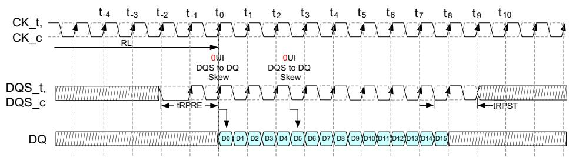  
Figure 211 — Read Burst Example for pin DQx Depicting Bit 0 and 5 Relative to the DQS Edge for 0 UI Skew

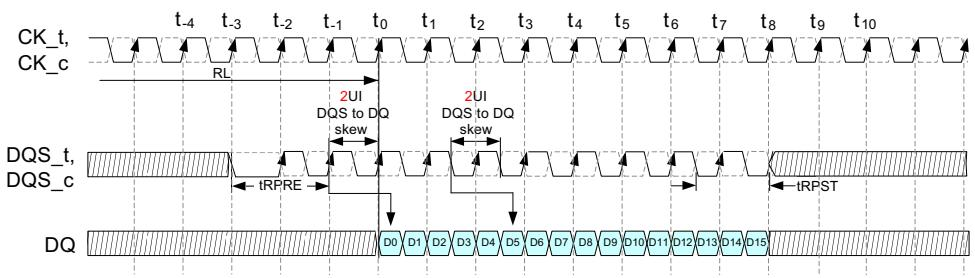  
Figure 212 — Read Burst Example for Pin DQx Depicting Bit 0 and 5 Relative to the DQS Edge for 2 UI Skew with Read DQS Offset Timing set to 1 Clock (2UI)

# 9.11.1 Tx DQ Stressed Eye Parameters

Table 464 — Tx DQ Stressed Eye Parameters for DDR5-3200 to 4800  
EH=Eye Height, EW=Eye Width; BER=Bit Error Rate, SES=Stressed Eye Skew  

<table><tr><td rowspan="2">Parameter</td><td rowspan="2">Symbol</td><td colspan="2">DDR5-3200</td><td colspan="2">DDR5-3600</td><td colspan="2">DDR5-4000</td><td colspan="2">DDR5-4400</td><td colspan="2">DDR5-4800</td><td rowspan="2">Unit</td><td rowspan="2">Notes</td></tr><tr><td>Min</td><td>Max</td><td>Min</td><td>Max</td><td>Min</td><td>Max</td><td>Min</td><td>Max</td><td>Min</td><td>Max</td></tr><tr><td>Eye Height specified at the transmitter with a skew between DQ and DQS of 1UI</td><td>TxEH_DQ_SES_1UI</td><td>TBD</td><td>-</td><td>TBD</td><td>-</td><td>TBD</td><td>-</td><td>TBD</td><td>-</td><td>TBD</td><td>-</td><td>mV</td><td>1,2,3,4,6,7,8,9,10</td></tr><tr><td>Eye Width specified at the transmitter with a skew between DQ and DQS of 1UI</td><td>TxEW_DQ_SES_1UI</td><td>0.72</td><td>-</td><td>0.72</td><td>-</td><td>0.72</td><td>-</td><td>0.72</td><td>-</td><td>0.72</td><td>-</td><td>UI</td><td>1,2,3,4,6,7,8,9,10</td></tr><tr><td>Eye Height specified at the transmitter with a skew between DQ and DQS of 2UI</td><td>TxEH_DQ_SES_2UI</td><td>TBD</td><td>-</td><td>TBD</td><td>-</td><td>TBD</td><td>-</td><td>TBD</td><td>-</td><td>TBD</td><td>-</td><td>mV</td><td>1,2,3,4,6,7,8,9,10</td></tr><tr><td>Eye Width specified at the transmitter with a skew between DQ and DQS of 2UI</td><td>TxEW_DQ_SES_2UI</td><td>0.72</td><td>-</td><td>0.72</td><td>-</td><td>0.72</td><td>-</td><td>0.72</td><td>-</td><td>0.72</td><td>-</td><td>UI</td><td>1,2,3,4,6,7,8,9,10</td></tr><tr><td>Eye Height specified at the transmitter with a skew between DQ and DQS of 3UI</td><td>TxEH_DQ_SES_3UI</td><td>TBD</td><td>-</td><td>TBD</td><td>-</td><td>TBD</td><td>-</td><td>TBD</td><td>-</td><td>TBD</td><td>-</td><td>mV</td><td>1,2,3,4,6,7,8,9,10</td></tr><tr><td>Eye Width specified at the transmitter with a skew between DQ and DQS of 3UI</td><td>TxEW_DQ_SES_3UI</td><td>0.72</td><td>-</td><td>0.72</td><td>-</td><td>0.72</td><td>-</td><td>0.72</td><td>-</td><td>0.72</td><td>-</td><td>UI</td><td>1,2,3,4,6,7,8,9,10</td></tr><tr><td>Eye Height specified at the transmitter with a skew between DQ and DQS of 4UI</td><td>TxEH_DQ_SES_4UI</td><td>TBD</td><td>-</td><td>TBD</td><td>-</td><td>TBD</td><td>-</td><td>TBD</td><td>-</td><td>TBD</td><td>-</td><td>mV</td><td>1,2,3,4,5,6,7,8,9,10</td></tr><tr><td>Eye Width specified at the transmitter with a skew between DQ and DQS of 4UI</td><td>TxEW_DQ_SES_4UI</td><td>TBD</td><td>-</td><td>TBD</td><td>-</td><td>TBD</td><td>-</td><td>TBD</td><td>-</td><td>TBD</td><td>-</td><td>UI</td><td>1,2,3,4,5,6,7,8,9,10</td></tr><tr><td>Eye Height specified at the transmitter with a skew between DQ and DQS of 5UI</td><td>TxEH_DQ_SES_5UI</td><td>TBD</td><td>-</td><td>TBD</td><td>-</td><td>TBD</td><td>-</td><td>TBD</td><td>-</td><td>TBD</td><td>-</td><td>mV</td><td>1,2,3,4,5,6,7,8,9,10</td></tr></table>

EH=Eye Height, EW=Eye Width; BER=Bit Error Rate, SES=Stressed Eye Skew

Table 464 — Tx DQ Stressed Eye Parameters for DDR5-3200 to 4800 (Cont'd)  

<table><tr><td rowspan="2">Parameter</td><td rowspan="2">Symbol</td><td colspan="2">DDR5-3200</td><td colspan="2">DDR5-3600</td><td colspan="2">DDR5-4000</td><td colspan="2">DDR5-4400</td><td colspan="2">DDR5-4800</td><td rowspan="2">Unit</td><td rowspan="2">Notes</td></tr><tr><td>Min</td><td>Max</td><td>Min</td><td>Max</td><td>Min</td><td>Max</td><td>Min</td><td>Max</td><td>Min</td><td>Max</td></tr><tr><td>Eye Width specified at the transmitter with a skew between DQ and DQS of 5UI</td><td>TxEW_DQ_SES_5UI</td><td>TBD</td><td>-</td><td>TBD</td><td>-</td><td>TBD</td><td>-</td><td>TBD</td><td>-</td><td>TBD</td><td>-</td><td>UI</td><td>1,2,3,4,5,6,7,8,9,10</td></tr><tr><td>NOTE 1</td><td colspan="13">Minimum BER E-9 and Confidence Level of 99.5% per pin</td></tr><tr><td>NOTE 2</td><td colspan="13">Refer to Section 7.2.3</td></tr><tr><td>NOTE 3</td><td colspan="13">The validation methodology for these parameters will be covered in future ballot(s)</td></tr><tr><td>NOTE 4</td><td colspan="13">Mismatch is defined as DQS to DQ mismatch, in UI increments</td></tr><tr><td>NOTE 5</td><td colspan="13">The number of UI&#x27;s accumulated will depend on the speed of the link. For higher speeds, higher UI accumulation may be specified. For lower speeds, N=4,5 UI may not be applicable</td></tr><tr><td>NOTE 6</td><td colspan="13">Duty Cycle of the DQ pins must be adjusted as close to 50% as possible using the Global and Per Pin Duty Cycle Adjuster feature prior to running this test</td></tr><tr><td>NOTE 7</td><td colspan="13">The Mode Registers for the Duty Cycle Adjuster are MR43 and MR44. Also the Mode Registers for the Per Pin DCA of DQS are MR103-MR110, the Mode Registers for the Per Pin DCA of DQLx are MR(133+8x) and MR(134+8x), where 0≤x≤7, and the Mode Registers for the Per Pin DCA of DQUy are MR(197+8y) and MR(198+8y), where 0≤y≤7.</td></tr><tr><td>NOTE 8</td><td colspan="13">Spread Spectrum Clocking (SSC) must be disabled while running this test</td></tr><tr><td>NOTE 9</td><td colspan="13">These parameters are tested using the continuous PRBS8 LFSR training pattern which are sent out on all DQ lanes off the dram device without the need for sending out continuous MRR commands. The MR25 OP[3] is set to “1” to enable this feature.</td></tr><tr><td>NOTE 10</td><td colspan="13">Tested on the CTC2 card only</td></tr><tr><td>NOTE 11</td><td colspan="13">Matched DQS to DQ would require the DQs to be adjusted by 0.5UI to place it in the center of the DQ eye. 1UI mismatch would require the DQS to be adjusted 1.5UI. Generally, for XUI mismatch the DQ must be adjusted XUI + 0.5UI to be placed in the center of the eye.</td></tr></table>

# 9.11.1 Tx DQ Stressed Eye Parameters (Cont'd)

Table 465 — Tx DQ Stressed Eye Parameters for DDR5-5200 to 6400  
EH=Eye Height, EW=Eye Width; BER=Bit Error Rate  

<table><tr><td rowspan="2">Parameter</td><td rowspan="2">Symbol</td><td colspan="2">DDR5-5200</td><td colspan="2">DDR5-5600</td><td colspan="2">DDR5-6000</td><td colspan="2">DDR5-6400</td><td rowspan="2">Unit</td><td rowspan="2">Notes</td></tr><tr><td>Min</td><td>Max</td><td>Min</td><td>Max</td><td>Min</td><td>Max</td><td>Min</td><td>Max</td></tr><tr><td>Eye Height specified at the transmitter with a skew between DQ and DQS of 1UI</td><td>TxEH_DQ_SES_1UI</td><td>-</td><td>TBD</td><td>-</td><td>TBD</td><td>-</td><td>TBD</td><td>-</td><td>TBD</td><td>mV</td><td>1,2,3,4,6,7,8,9,10</td></tr><tr><td>Eye Width specified at the transmitter with a skew between DQ and DQS of 1UI</td><td>TxEW_DQ_SES_1UI</td><td>-</td><td>TBD</td><td>-</td><td>TBD</td><td>-</td><td>TBD</td><td>-</td><td>TBD</td><td>UI</td><td>1,2,3,4,6,7,8,9,10</td></tr><tr><td>Eye Height specified at the transmitter with a skew between DQ and DQS of 2UI</td><td>TxEH_DQ_SES_2UI</td><td>-</td><td>TBD</td><td>-</td><td>TBD</td><td>-</td><td>TBD</td><td>-</td><td>TBD</td><td>mV</td><td>1,2,3,4,6,7,8,9,10</td></tr><tr><td>Eye Width specified at the transmitter with a skew between DQ and DQS of 2UI</td><td>TxEW_DQ_SES_2UI</td><td>-</td><td>TBD</td><td>-</td><td>TBD</td><td>-</td><td>TBD</td><td>-</td><td>TBD</td><td>UI</td><td>1,2,3,4,6,7,8,9,10</td></tr><tr><td>Eye Height specified at the transmitter with a skew between DQ and DQS of 3UI</td><td>TxEH_DQ_SES_3UI</td><td>-</td><td>TBD</td><td>-</td><td>TBD</td><td>-</td><td>TBD</td><td>-</td><td>TBD</td><td>mV</td><td>1,2,3,4,6,7,8,9,10</td></tr><tr><td>Eye Width specified at the transmitter with a skew between DQ and DQS of 3UI</td><td>TxEW_DQ_SES_3UI</td><td>-</td><td>TBD</td><td>-</td><td>TBD</td><td>-</td><td>TBD</td><td>-</td><td>TBD</td><td>UI</td><td>1,2,3,4,6,7,8,9,10</td></tr><tr><td>Eye Height specified at the transmitter with a skew between DQ and DQS of 4UI</td><td>TxEH_DQ_SES_4UI</td><td>-</td><td>TBD</td><td>-</td><td>TBD</td><td>-</td><td>TBD</td><td>-</td><td>TBD</td><td>mV</td><td>1,2,3,4,5,6,7,8,9,10</td></tr><tr><td>Eye Width specified at the transmitter with a skew between DQ and DQS of 4UI</td><td>TxEW_DQ_SES_4UI</td><td>-</td><td>TBD</td><td>-</td><td>TBD</td><td>-</td><td>TBD</td><td>-</td><td>TBD</td><td>UI</td><td>1,2,3,4,5,6,7,8,9,10</td></tr><tr><td>Eye Height specified at the transmitter with a skew between DQ and DQS of 5UI</td><td>TxEW_DQ_SES_5UI</td><td>-</td><td>TBD</td><td>-</td><td>TBD</td><td>-</td><td>TBD</td><td>-</td><td>TBD</td><td>mV</td><td>1,2,3,4,5,6,7,8,9,10</td></tr><tr><td>Eye Width specified at the transmitter with a skew between DQ and DQS of 5UI</td><td>TxEW_DQ_SES_5UI</td><td>-</td><td>TBD</td><td>-</td><td>TBD</td><td>-</td><td>TBD</td><td>-</td><td>TBD</td><td>UI</td><td>1,2,3,4,5,6,7,8,9,10</td></tr><tr><td colspan="12">NOTE 1 Minimum BER E-9 and Confidence Level of 99.5% per pinNOTE 2 Refer to Section 7.2.3NOTE 3 The validation methodology for these parameters will be covered in future ballot(s)NOTE 4 Mismatch is defined as DQS to DQ mismatch, in UI incrementsNOTE 5 The number of UI&#x27;s accumulated will depend on the speed of the link. For higher speeds, higher UI accumulation may be specified.For lower speeds, N=4,5 UI may not be applicableNOTE 6 Duty Cycle of the DQ pins must be adjusted as close to 50% as possible using the Global and Per Pin Duty Cycle Adjuster feature prior to running this testNOTE 7 The Mode Registers for the Duty Cycle Adjuster are MR43 and MR44. Also the Mode Registers for the Per Pin DCA of DQLx are MR(133+8x) and MR(134+8x), where 0≤x≤7, and the Mode Registers for the Per Pin DCA of DQUy are MR(197+8y) and MR(198+8y), where 0≤y≤7NOTE 8 Spread Spectrum Clocking (SSC) must be disabled while running this testNOTE 9 These parameters are tested using the continuous PRBS8 LFSR training pattern which are sent out on all DQ lanes off the dram device without the need for sending out continuous MRR commands. The MR25 OP[3] is set to “1” to enable this feature.NOTE 10 Tested on the CTC2 card only</td></tr></table>

# 9.11.1 Tx DQ Stressed Eye Parameters (Cont'd)

[ \text{[EH=Eye Height, EW=Eye Width; BER=Bit Error Rate]} ]

Table 466 — Tx DQ Stressed Eye Parameters for DDR5-6800 to 8400  

<table><tr><td rowspan="2">Parameter</td><td rowspan="2">Symbol</td><td colspan="2">DDR5-6800</td><td colspan="2">DDR5-7200</td><td colspan="2">DDR5-7600</td><td colspan="2">DDR5-8000</td><td colspan="2">DDR5-8400</td><td rowspan="2">Unit</td><td rowspan="2">Notes</td></tr><tr><td>Min</td><td>Max</td><td>Min</td><td>Max</td><td>Min</td><td>Max</td><td>Min</td><td>Max</td><td>Min</td><td>Max</td></tr><tr><td>Eye Height specified at the transmit-ter with a skew between DQ and DQS of 1UI</td><td>TxEH_DQ_SES_1UI</td><td>-</td><td>TBD</td><td>-</td><td>TBD</td><td>-</td><td>TBD</td><td>-</td><td>TBD</td><td>-</td><td>TBD</td><td>mV</td><td>1,2,3,4,6,7,8,9,10</td></tr><tr><td>Eye Width specified at the transmit-ter with a skew between DQ and DQS of 1UI</td><td>TxEW_DQ_SES_1UI</td><td>-</td><td>TBD</td><td>-</td><td>TBD</td><td>-</td><td>TBD</td><td>-</td><td>TBD</td><td>-</td><td>TBD</td><td>UI</td><td>1,2,3,4,6,7,8,9,10</td></tr><tr><td>Eye Height specified at the transmit-ter with a skew between DQ and DQS of 2UI</td><td>TxEH_DQ_SES_2UI</td><td>-</td><td>TBD</td><td>-</td><td>TBD</td><td>-</td><td>TBD</td><td>-</td><td>TBD</td><td>-</td><td>TBD</td><td>mV</td><td>1,2,3,4,6,7,8,9,10</td></tr><tr><td>Eye Width specified at the transmit-ter with a skew between DQ and DQS of 2UI</td><td>TxEW_DQ_SES_2UI</td><td>-</td><td>TBD</td><td>-</td><td>TBD</td><td>-</td><td>TBD</td><td>-</td><td>TBD</td><td>-</td><td>TBD</td><td>UI</td><td>1,2,3,4,6,7,8,9,10</td></tr><tr><td>Eye Height specified at the transmit-ter with a skew between DQ and DQS of 3UI</td><td>TxEH_DQ_SES_3UI</td><td>-</td><td>TBD</td><td>-</td><td>TBD</td><td>-</td><td>TBD</td><td>-</td><td>TBD</td><td>-</td><td>TBD</td><td>mV</td><td>1,2,3,4,6,7,8,9,10</td></tr><tr><td>Eye Width specified at the transmit-ter with a skew between DQ and DQS of 3UI</td><td>TxEW_DQ_SES_3UI</td><td>-</td><td>TBD</td><td>-</td><td>TBD</td><td>-</td><td>TBD</td><td>-</td><td>TBD</td><td>-</td><td>TBD</td><td>UI</td><td>1,2,3,4,6,7,8,9,10</td></tr><tr><td>Eye Height specified at the transmit-ter with a skew between DQ and DQS of 4UI</td><td>TxEH_DQ_SES_4UI</td><td>-</td><td>TBD</td><td>-</td><td>TBD</td><td>-</td><td>TBD</td><td>-</td><td>TBD</td><td>-</td><td>TBD</td><td>mV</td><td>1,2,3,4,5,6,7,8,9,10</td></tr><tr><td>Eye Width specified at the transmit-ter with a skew between DQ and DQS of 4UI</td><td>TxEW_DQ_SES_4UI</td><td>-</td><td>TBD</td><td>-</td><td>TBD</td><td>-</td><td>TBD</td><td>-</td><td>TBD</td><td>-</td><td>TBD</td><td>UI</td><td>1,2,3,4,5,6,7,8,9,10</td></tr><tr><td>Eye Height specified at the transmit-ter with a skew between DQ and DQS of 5UI</td><td>TxEH_DQ_SES_5UI</td><td>-</td><td>TBD</td><td>-</td><td>TBD</td><td>-</td><td>TBD</td><td>-</td><td>TBD</td><td>-</td><td>TBD</td><td>mV</td><td>1,2,3,4,5,6,7,8,9,10</td></tr><tr><td>Eye Width specified at the transmit-ter with a skew between DQ and DQS of 5UI</td><td>TxEW_DQ_SES_5UI</td><td>-</td><td>TBD</td><td>-</td><td>TBD</td><td>-</td><td>TBD</td><td>-</td><td>TBD</td><td>-</td><td>TBD</td><td>UI</td><td>1,2,3,4,5,6,7,8,9,10</td></tr><tr><td colspan="14">NOTE 1 Minimum BER E-9 and Confidence Level of 99.5% per pinNOTE 2 Refer to the minimum Bit Error Rate (BER) requirements for DDR5NOTE 3 The validation methodology for these parameters will be covered in future ballot(s)NOTE 4 Mismatch is defined as DQS to DQ mismatch, in UI incrementsNOTE 5 The number of UI&#x27;s accumulated will depend on the speed of the link. For higher speeds, higher UI accumulation may be specified. For lower speeds, N=4,5 UI may not be applicableNOTE 6 Duty Cycle of the DQ pins must be adjusted as close to 50% as possible using the Duty Cycle Adjuster feature prior to running this testNOTE 7 The Mode Registers for the Duty Cycle Adjuster are MR43 and MR44NOTE 8 Spread Spectrum Clocking (SSC) must be disabled while running this testNOTE 9 These parameters are tested using the continuous PRBS8 LFSR training pattern which are sent out on all DQ lanes off the dram device without the need for sending out continuous MRR commands. The MR25 OP[3] is set to “1” to enable this feature.NOTE 10 Tested on the CTC2 card only</td></tr></table>

# 10 Speed Bins

DDR5 Standard Speed Bins are defined as:

3200 / 3600 / 4000 / 4400 / 4800 / 5200 / 5600 / 6000 / 6400

Future Speed Bins, (which are just placeholders) are defined as:

6800/7200/7600/8000/8400

# 10.1 DDR5-3200 Speed Bins and Operations

Table 467 — DDR5-3200 Speed Bins and Operations  
Table Notes are in provided in Section 10.10.  

<table><tr><td colspan="3">Speed Bin</td><td colspan="2">DDR5-3200A</td><td colspan="2">DDR5-3200B</td><td colspan="2">DDR5-3200C</td><td rowspan="3">Unit</td><td rowspan="3">NOTE</td></tr><tr><td colspan="3">CL-nRCD-nRP</td><td colspan="2">22-22-22</td><td colspan="2">26-26-26</td><td colspan="2">28-28-28</td></tr><tr><td colspan="2">Parameter</td><td>Symbol</td><td>min</td><td>max</td><td>min</td><td>max</td><td>min</td><td>Max</td></tr><tr><td colspan="2">Internal read command to first data</td><td>tAA</td><td>13.750</td><td></td><td>16.250</td><td></td><td>17.500</td><td></td><td>ns</td><td>7</td></tr><tr><td colspan="2">ACT to internal read or write delay time</td><td>tRCD</td><td>13.750</td><td></td><td>16.250</td><td></td><td>17.500</td><td></td><td>ns</td><td>7</td></tr><tr><td colspan="2">Row Precharge Time</td><td>tRP</td><td>13.750</td><td></td><td>16.250</td><td></td><td>17.500</td><td></td><td>ns</td><td>7</td></tr><tr><td colspan="2">ACT to PRE command period</td><td>tRAS</td><td>32.00</td><td>5 x tREF11</td><td>32.00</td><td>5 x tREF11</td><td>32.00</td><td>5 x tREF11</td><td>ns</td><td>7</td></tr><tr><td colspan="2">ACT to ACT or REF command period</td><td>tRC</td><td>45.750</td><td></td><td>48.250</td><td></td><td>49.500</td><td></td><td>ns</td><td>7</td></tr><tr><td colspan="2">CAS Write Latency</td><td>CWL</td><td>CWL=CL-2(20)</td><td></td><td>CWL=CL-2(24)</td><td></td><td>CWL=CL-2(26)</td><td></td><td>ns</td><td></td></tr><tr><td>tAmin(ns)</td><td>Read CLWrite CWL</td><td colspan="9">Supported Frequency Down Bins</td></tr><tr><td>20.944</td><td>CL=22,CWL=20</td><td>tCK(AVG)</td><td>0.952 (2100)</td><td>&lt;= 1.010(1980)</td><td>0.952 (2100)</td><td>&lt;= 1.010(1980)</td><td>0.952 (2100)</td><td>&lt;= 1.010(1980)</td><td>ns</td><td>1,2,3,6,9</td></tr><tr><td>13.750</td><td>CL=22,CWL=20</td><td>tCK(AVG)</td><td>0.625 (3200)</td><td>&lt;0.681(2933)</td><td colspan="2">RESERVED</td><td colspan="2">RESERVED</td><td>ns</td><td>1,2,3,4</td></tr><tr><td>16.250</td><td>CL=26CWL=24</td><td>tCK(AVG)</td><td>0.625 (3200)</td><td>&lt;0.681(2933)</td><td>0.625 (3200)</td><td>&lt;0.681(2933)</td><td colspan="2">RESERVED</td><td>ns</td><td>1,2,3,4</td></tr><tr><td>17.500</td><td>CL=28CWL=26</td><td>tCK(AVG)</td><td>0.625 (3200)</td><td>&lt;0.681(2933)</td><td>0.625 (3200)</td><td>&lt;0.681(2933)</td><td>0.625 (3200)</td><td>&lt;0.681(2933)</td><td>ns</td><td>1,2,3</td></tr><tr><td colspan="3">Supported CL</td><td colspan="2">22,26,28</td><td colspan="2">22,26,28</td><td colspan="2">22,28</td><td>nCK</td><td>8</td></tr></table>

# 10.2 DDR5-3600 Speed Bins and Operations

Table 468 — DDR5-3600 Speed Bins and Operations  
Table Notes are in provided in Section 10.10.  

<table><tr><td colspan="3">Speed Bin</td><td colspan="2">DDR5-3600A</td><td colspan="2">DDR5-3600B</td><td colspan="2">DDR5-3600C</td><td rowspan="3">Unit</td><td rowspan="3">NOTE</td></tr><tr><td colspan="3">CL-nRCD-nRP</td><td colspan="2">26-26-26</td><td colspan="2">30-30-30</td><td colspan="2">32-32-32</td></tr><tr><td colspan="2">Parameter</td><td>Symbol</td><td>min</td><td>max</td><td>min</td><td>max</td><td>min</td><td>Max</td></tr><tr><td colspan="2">Internal read command to first data</td><td>tAA</td><td>14.430</td><td></td><td>16.650 (16.250)5,7</td><td></td><td>17.760 (17.500)5,7</td><td></td><td>ns</td><td>7</td></tr><tr><td colspan="2">ACT to internal read or write delay time</td><td>tRCD</td><td>14.430</td><td></td><td>16.650 (16.250)5,7</td><td></td><td>17.760 (17.500)5,7</td><td></td><td>ns</td><td>7</td></tr><tr><td colspan="2">Row Precharge Time</td><td>tRP</td><td>14.430</td><td></td><td>16.650 (16.250)5,7</td><td></td><td>17.760 (17.500)5,7</td><td></td><td>ns</td><td>7</td></tr><tr><td colspan="2">ACT to PRE command period</td><td>tRAS</td><td>32.00</td><td>5 x tREF11</td><td>32.00</td><td>5 x tREF11</td><td>32.00</td><td>5 x tREF11</td><td>ns</td><td>7</td></tr><tr><td colspan="2">ACT to ACT or REF com-mand period</td><td>tRC</td><td>46.430</td><td></td><td>48.650 (48.250)5,7</td><td></td><td>49.760 (49.500)5,7</td><td></td><td>ns</td><td>7</td></tr><tr><td colspan="2">CAS Write Latency</td><td>CWL</td><td>CWL=CL-2 (24)</td><td></td><td>CWL=CL-2 (28)</td><td></td><td>CWL=CL-2 (30)</td><td></td><td>ns</td><td></td></tr><tr><td>tAmin (ns)</td><td>Read CL Write CWL</td><td colspan="9">Supported Frequency Down Bins</td></tr><tr><td>20.944</td><td>CL=22, CWL=20</td><td>tCK(AVG)</td><td>0.952 (2100)</td><td>&lt;=1.010 (1980)</td><td>0.952 (2100)</td><td>&lt;=1.010 (1980)</td><td>0.952 (2100)</td><td>&lt;=1.010 (1980)</td><td>ns</td><td>1,2,3,6,9</td></tr><tr><td>13.750</td><td>CL=22, CWL=20</td><td>tCK(AVG)</td><td colspan="2">RESERVED</td><td colspan="2">RESERVED</td><td colspan="2">RESERVED</td><td>ns</td><td>4</td></tr><tr><td rowspan="2">16.250</td><td rowspan="2">CL=26 CWL=24</td><td rowspan="2">tCK(AVG)</td><td rowspan="2">0.625 (3200)</td><td rowspan="2">&lt;0.681 (2933)</td><td>0.625 (3200)</td><td>&lt;0.681 (2933)</td><td rowspan="2" colspan="2">RESERVED</td><td rowspan="2">ns</td><td rowspan="2">1,2,3,4</td></tr><tr><td colspan="2">(Optional)5,7</td></tr><tr><td rowspan="2">17.500</td><td rowspan="2">CL=28 CWL=26</td><td rowspan="2">tCK(AVG)</td><td rowspan="2">0.625 (3200)</td><td rowspan="2">&lt;0.681 (2933)</td><td rowspan="2">0.625 (3200)</td><td rowspan="2">&lt;0.681 (2933)</td><td>0.625 (3200)</td><td>&lt;0.681 (2933)</td><td rowspan="2">ns</td><td rowspan="2">1,2,3</td></tr><tr><td colspan="2">(Optional)5,7</td></tr><tr><td>20.000</td><td>CL=32, CWL=30</td><td>tCK(AVG)</td><td>0.625 (3200)</td><td>&lt;0.681 (2933)</td><td>0.625 (3200)</td><td>&lt;0.681 (2933)</td><td>0.625 (3200)</td><td>&lt;0.681 (2933)</td><td>ns</td><td>1,2,3</td></tr><tr><td>14.430</td><td>CL=26 CWL=24</td><td>tCK(AVG)</td><td>0.555 (3600)</td><td>&lt;0.625 (3200)</td><td colspan="2">RESERVED</td><td colspan="2">RESERVED</td><td>ns</td><td>1,2,3,4</td></tr><tr><td>16.650</td><td>CL=30, CWL=28</td><td>tCK(AVG)</td><td>0.555 (3600)</td><td>&lt;0.625 (3200)</td><td>0.555 (3600)</td><td>&lt;0.625 (3200)</td><td colspan="2">RESERVED</td><td>ns</td><td>1,2,3,4</td></tr><tr><td>17.760</td><td>CL=32, CWL=30</td><td>tCK(AVG)</td><td>0.555 (3600)</td><td>&lt;0.625 (3200)</td><td>0.555 (3600)</td><td>&lt;0.625 (3200)</td><td>0.555 (3600)</td><td>&lt;0.625 (3200)</td><td>ns</td><td>1,2,3</td></tr><tr><td colspan="3">Supported CL</td><td colspan="2">22,26,28,30,32</td><td colspan="2">22,(26),28,30,32</td><td colspan="2">22,(28),32</td><td>nCK</td><td>8</td></tr></table>

# 10.3 DDR5-4000 Speed Bins and Operations

Table 469 — DDR5-4000 Speed Bins and Operations  
Table Notes are in provided in Section 10.10.  

<table><tr><td colspan="3">Speed Bin</td><td colspan="2">DDR5-4000A</td><td colspan="2">DDR5-4000B</td><td colspan="2">DDR5-4000C</td><td rowspan="3">Unit</td><td rowspan="3">NOTE</td></tr><tr><td colspan="3">CL-nRCD-nRP</td><td colspan="2">28-28-28</td><td colspan="2">32-32-32</td><td colspan="2">36-36-36</td></tr><tr><td colspan="2">Parameter</td><td>Symbol</td><td>min</td><td>max</td><td>min</td><td>max</td><td>min</td><td>Max</td></tr><tr><td colspan="2">Internal read command to first data</td><td>tAA</td><td>14.000</td><td></td><td>16.000</td><td></td><td>18.000 (17.500)5,7</td><td></td><td>ns</td><td>7</td></tr><tr><td colspan="2">ACT to internal read or write delay time</td><td>tRCD</td><td>14.000</td><td></td><td>16.000</td><td></td><td>18.000 (17.500)5,7</td><td></td><td>ns</td><td>7</td></tr><tr><td colspan="2">Row Precharge Time</td><td>tRP</td><td>14.000</td><td></td><td>16.000</td><td></td><td>18.000 (17.500)5,7</td><td></td><td>ns</td><td>7</td></tr><tr><td colspan="2">ACT to PRE command period</td><td>tRAS</td><td>32.00</td><td>5 x tREF11</td><td>32.00</td><td>5 x tREF11</td><td>32.00</td><td>5 x tREF11</td><td>ns</td><td>7</td></tr><tr><td colspan="2">ACT to ACT or REF command period</td><td>tRC</td><td>46.000</td><td></td><td>48.000</td><td></td><td>50.000 (49.500)5,7</td><td></td><td>ns</td><td>7</td></tr><tr><td colspan="2">CAS Write Latency</td><td>CWL</td><td>CWL=CL-2 (26)</td><td></td><td>CWL=CL-2 (30)</td><td></td><td>CWL=CL-2 (34)</td><td></td><td>ns</td><td></td></tr><tr><td>tAmin (ns)</td><td>Read CL Write CWL</td><td colspan="9">Supported Frequency Down Bins</td></tr><tr><td>20.944</td><td>CL=22, CWL=20</td><td>tCK(AVG)</td><td>0.952 (2100)</td><td>&lt;=1.010 (980)</td><td>0.952 (2100)</td><td>&lt;=1.010 (1980)</td><td>0.952 (2100)</td><td>&lt;=1.010 (1980)</td><td>ns</td><td>1,2,3,6,9</td></tr><tr><td>13.750</td><td>CL=22, CWL=20</td><td>tCK(AVG)</td><td colspan="2">RESERVED</td><td colspan="2">RESERVED</td><td colspan="2">RESERVED</td><td>ns</td><td>4</td></tr><tr><td>16.250</td><td>CL=26 CWL=24</td><td>tCK(AVG)</td><td>0.625 (3200)</td><td>&lt;0.681 (2933)</td><td>0.625 (3200)</td><td>&lt;0.681 (2933)</td><td colspan="2">RESERVED</td><td>ns</td><td>1,2,3,4</td></tr><tr><td rowspan="2">17.500</td><td rowspan="2">CL=28 CWL=26</td><td rowspan="2">tCK(AVG)</td><td rowspan="2">0.625 (3200)</td><td rowspan="2">&lt;0.681 (2933)</td><td rowspan="2">0.625 (3200)</td><td rowspan="2">&lt;0.681 (2933)</td><td>0.625 (3200)</td><td>&lt;0.681 (2933)</td><td rowspan="2">ns</td><td>1,2,3</td></tr><tr><td colspan="2">(Optional)5,7</td><td></td></tr><tr><td>20.000</td><td>CL=32, CWL=30</td><td>tCK(AVG)</td><td>0.625 (3200)</td><td>&lt;0.681 (2933)</td><td>0.625 (3200)</td><td>&lt;0.681 (2933)</td><td>0.625 (3200)</td><td>&lt;0.681 (2933)</td><td>ns</td><td>1,2,3</td></tr><tr><td>14.430</td><td>CL=26 CWL=24</td><td>tCK(AVG)</td><td>0.555 (3600)</td><td>&lt;0.625 (3200)</td><td colspan="2">RESERVED</td><td colspan="2">RESERVED</td><td>ns</td><td>1,2,3,4</td></tr><tr><td>16.650</td><td>CL=30, CWL=28</td><td>tCK(AVG)</td><td>0.555 (3600)</td><td>&lt;0.625 (3200)</td><td>0.555 (3600)</td><td>&lt;0.625 (3200)</td><td colspan="2">RESERVED</td><td>ns</td><td>1,2,3,4</td></tr><tr><td rowspan="2">17.760</td><td rowspan="2">CL=32, CWL=30</td><td rowspan="2">tCK(AVG)</td><td rowspan="2">0.555 (3600)</td><td rowspan="2">&lt;0.625 (3200)</td><td rowspan="2">0.555 (3600)</td><td rowspan="2">&lt;0.625 (3200)</td><td>0.555 (3600)</td><td>&lt;0.625 (3200)</td><td rowspan="2">ns</td><td>1,2,3</td></tr><tr><td colspan="2">(Optional)5,7</td><td></td></tr><tr><td>19.980</td><td>CL=36, CWL=34</td><td>tCK(AVG)</td><td>0.555 (3600)</td><td>&lt;0.625 (3200)</td><td>0.555 (3600)</td><td>&lt;0.625 (3200)</td><td>0.555 (3600)</td><td>&lt;0.625 (3200)</td><td>ns</td><td>1,2,3</td></tr><tr><td>14.000</td><td>CL=28 CWL=26</td><td>tCK(AVG)</td><td>0.500 (4000)</td><td>&lt;0.555 (3600)</td><td colspan="2">RESERVED</td><td colspan="2">RESERVED</td><td>ns</td><td>1,2,3,4</td></tr><tr><td>16.000</td><td>CL=32, CWL=30</td><td>tCK(AVG)</td><td>0.500 (4000)</td><td>&lt;0.555 (3600)</td><td>0.500 (4000)</td><td>&lt;0.555 (3600)</td><td colspan="2">RESERVED</td><td>ns</td><td>1,2,3,4</td></tr><tr><td>18.000</td><td>CL=36, CWL=34</td><td>tCK(AVG)</td><td>0.500 (4000)</td><td>&lt;0.555 (3600)</td><td>0.500 (4000)</td><td>&lt;0.555 (3600)</td><td>0.500 (4000)</td><td>&lt;0.555 (3600)</td><td>ns</td><td>1,2,3</td></tr><tr><td colspan="3">Supported CL</td><td colspan="2">22,26,28,30,32,36</td><td colspan="2">22,26,28,30,32,36</td><td colspan="2">22,(28),(32),36</td><td>nCK</td><td>8</td></tr></table>

# 10.4 DDR5-4400 Speed Bins and Operations

Table 470 — DDR5-4400 Speed Bins and Operations  
Table Notes are in provided in Section 10.10.  

<table><tr><td colspan="3">Speed Bin</td><td colspan="2">DDR5-4400A</td><td colspan="2">DDR5-4400B</td><td colspan="2">DDR5-4400C</td><td rowspan="3">Unit</td><td rowspan="3">NOTE</td></tr><tr><td colspan="3">CL-nRCD-nRP</td><td colspan="2">32-32-32</td><td colspan="2">36-36-36</td><td colspan="2">40-40-40</td></tr><tr><td colspan="2">Parameter</td><td>Symbol</td><td>min</td><td>max</td><td>min</td><td>max</td><td>min</td><td>Max</td></tr><tr><td colspan="2">Internal read command to first data</td><td>tAA</td><td>14.528</td><td></td><td>16.344(16.000)5,7</td><td></td><td>18.160(17.500)5,7</td><td></td><td>ns</td><td>7</td></tr><tr><td colspan="2">ACT to internal read or write delay time</td><td>tRCD</td><td>14.528</td><td></td><td>16.344(16.000)5,7</td><td></td><td>18.160(17.500)5,7</td><td></td><td>ns</td><td>7</td></tr><tr><td colspan="2">Row Precharge Time</td><td>tRP</td><td>14.528</td><td></td><td>16.344(16.000)5,7</td><td></td><td>18.160(17.500)5,7</td><td></td><td>ns</td><td>7</td></tr><tr><td colspan="2">ACT to PRE command period</td><td>tRAS</td><td>32.00</td><td>5 x tREF11</td><td>32.00</td><td>5 x tREF11</td><td>32.00</td><td>5 x tREF11</td><td>ns</td><td>7</td></tr><tr><td colspan="2">ACT to ACT or REF command period</td><td>tRC</td><td>46.528</td><td></td><td>48.344(48.000)5,7</td><td></td><td>50.160(49.500)5,7</td><td></td><td>ns</td><td>7</td></tr><tr><td colspan="2">CAS Write Latency</td><td>CWL</td><td>CWL=CL-2(30)</td><td></td><td>CWL=CL-2(34)</td><td></td><td>CWL=CL-2(38)</td><td></td><td>ns</td><td></td></tr><tr><td>tAmin(ns)</td><td>Read CLWrite CWL</td><td colspan="9">Supported Frequency Down Bins</td></tr><tr><td>20.944</td><td>CL=22,CWL=20</td><td>tCK(AVG)</td><td>0.952 (2100)</td><td>&lt;=1.010(1980)</td><td>0.952 (2100)</td><td>&lt;=1.010(1980)</td><td>0.952 (2100)</td><td>&lt;=1.010(1980)</td><td>ns</td><td>1,2,3,6,9</td></tr><tr><td rowspan="2">13.750</td><td rowspan="2">CL=22,CWL=20</td><td rowspan="2">tCK(AVG)</td><td rowspan="2" colspan="2">RESERVED</td><td colspan="2">RESERVED</td><td rowspan="2" colspan="2">RESERVED</td><td rowspan="2">ns</td><td rowspan="2">4</td></tr><tr><td colspan="2">(Optional)5,7</td></tr><tr><td rowspan="2">16.250</td><td rowspan="2">CL=26CWL=24</td><td rowspan="2">tCK(AVG)</td><td rowspan="2">0.625 (3200)</td><td rowspan="2">&lt;0.681(2933)</td><td>0.625 (3200)</td><td>&lt;0.681(2933)</td><td rowspan="2" colspan="2">RESERVED</td><td rowspan="2">ns</td><td rowspan="2">1,2,3,4</td></tr><tr><td colspan="2">(Optional)5,7</td></tr><tr><td rowspan="2">17.500</td><td rowspan="2">CL=28CWL=26</td><td rowspan="2">tCK(AVG)</td><td rowspan="2">0.625 (3200)</td><td rowspan="2">&lt;0.681(2933)</td><td rowspan="2">0.625 (3200)</td><td rowspan="2">&lt;0.681(2933)</td><td>0.625 (3200)</td><td>&lt;0.681(2933)</td><td rowspan="2">ns</td><td rowspan="2">1,2,3</td></tr><tr><td colspan="2">(Optional)5,7</td></tr><tr><td>20.000</td><td>CL=32,CWL=30</td><td>tCK(AVG)</td><td>0.625 (3200)</td><td>&lt;0.681(2933)</td><td>0.625 (3200)</td><td>&lt;0.681(2933)</td><td>0.625 (3200)</td><td>&lt;0.681(2933)</td><td>ns</td><td>1,2,3</td></tr><tr><td>14.430</td><td>CL=26CWL=24</td><td>tCK(AVG)</td><td colspan="2">RESERVED</td><td colspan="2">RESERVED</td><td colspan="2">RESERVED</td><td>ns</td><td>4</td></tr><tr><td>16.650</td><td>CL=30,CWL=28</td><td>tCK(AVG)</td><td>0.555 (3600)</td><td>&lt;0.625(3200)</td><td>0.555 (3600)</td><td>&lt;0.625(3200)</td><td colspan="2">RESERVED</td><td>ns</td><td>1,2,3,4</td></tr><tr><td rowspan="2">17.760</td><td rowspan="2">CL=32,CWL=30</td><td rowspan="2">tCK(AVG)</td><td rowspan="2">0.555 (3600)</td><td rowspan="2">&lt;0.625(3200)</td><td rowspan="2">0.555 (3600)</td><td rowspan="2">&lt;0.625(3200)</td><td>0.555 (3600)</td><td>&lt;0.625(3200)</td><td rowspan="2">ns</td><td rowspan="2">1,2,3</td></tr><tr><td colspan="2">(Optional)5,7</td></tr><tr><td>19.980</td><td>CL=36,CWL=34</td><td>tCK(AVG)</td><td>0.555 (3600)</td><td>&lt;0.625(3200)</td><td>0.555 (3600)</td><td>&lt;0.625(3200)</td><td>0.555 (3600)</td><td>&lt;0.625(3200)</td><td>ns</td><td>1,2,3</td></tr><tr><td>14.000</td><td>CL=28CWL=26</td><td>tCK(AVG)</td><td colspan="2">RESERVED</td><td colspan="2">RESERVED</td><td colspan="2">RESERVED</td><td>ns</td><td>4</td></tr><tr><td rowspan="2">16.000</td><td rowspan="2">CL=32,CWL=30</td><td rowspan="2">tCK(AVG)</td><td rowspan="2">0.500 (4000)</td><td rowspan="2">&lt;0.555(3600)</td><td>0.500 (4000)</td><td>&lt;0.555(3600)</td><td rowspan="2" colspan="2">RESERVED</td><td rowspan="2">ns</td><td rowspan="2">1,2,3,4</td></tr><tr><td colspan="2">(Optional)5,7</td></tr><tr><td rowspan="2">18.000</td><td rowspan="2">CL=36,CWL=34</td><td rowspan="2">tCK(AVG)</td><td rowspan="2">0.500 (4000)</td><td rowspan="2">&lt;0.555(3600)</td><td rowspan="2">0.500 (4000)</td><td rowspan="2">&lt;0.555(3600)</td><td>0.500 (4000)</td><td>&lt;0.555(3600)</td><td rowspan="2">ns</td><td rowspan="2">1,2,3</td></tr><tr><td colspan="2">(Optional)5,7</td></tr><tr><td>20.000</td><td>CL=40,CWL=38</td><td>tCK(AVG)</td><td>0.500 (4000)</td><td>&lt;0.555(3600)</td><td>0.500 (4000)</td><td>&lt;0.555(3600)</td><td>0.500 (4000)</td><td>&lt;0.555(3600)</td><td>ns</td><td>1,2,3</td></tr><tr><td>14.528</td><td>CL=32,CWL=30</td><td>tCK(AVG)</td><td>0.454 (4400)</td><td>&lt;0.500(4000)</td><td colspan="2">RESERVED</td><td colspan="2">RESERVED</td><td>ns</td><td>1,2,3,4</td></tr><tr><td>16.344</td><td>CL=36,CWL=34</td><td>tCK(AVG)</td><td>0.454 (4400)</td><td>&lt;0.500(4000)</td><td>0.454 (4400)</td><td>&lt;0.500(4000)</td><td colspan="2">RESERVED</td><td>ns</td><td>1,2,3,4</td></tr><tr><td>18.160</td><td>CL=40,CWL=38</td><td>tCK(AVG)</td><td>0.454 (4400)</td><td>&lt;0.500(4000)</td><td>0.454 (4400)</td><td>&lt;0.500(4000)</td><td>0.454 (4400)</td><td>&lt;0.500(4000)</td><td>ns</td><td>1,2,3</td></tr><tr><td colspan="3">Supported CL</td><td colspan="2">22,26,28,30,32,36,40</td><td colspan="2">22,(26),28,30,(32),36,40</td><td colspan="2">22,(28),(32),(36),40</td><td>nCK</td><td>8</td></tr></table>

# 10.5 DDR5-4800 Speed Bins and Operations

Table Notes are in provided in Section 10.10.

Table 471 — DDR5-4800 Speed Bins and Operations  

<table><tr><td colspan="3">Speed Bin</td><td colspan="2">DDR5-4800A</td><td colspan="2">DDR5-4800B</td><td colspan="2">DDR5-4800C</td><td rowspan="3">Unit</td><td rowspan="3">NOTE</td></tr><tr><td colspan="3">CL-nRCD-nRP</td><td colspan="2">34-34-34</td><td colspan="2">40-40-40</td><td colspan="2">42-42-42</td></tr><tr><td colspan="2">Parameter</td><td>Symbol</td><td>min</td><td>max</td><td>min</td><td>max</td><td>min</td><td>Max</td></tr><tr><td colspan="2">Internal read command to first data</td><td>tAA</td><td>14.144</td><td></td><td>16.640 (16.000)5,7</td><td></td><td>17.472</td><td></td><td>ns</td><td>7</td></tr><tr><td colspan="2">ACT to internal read or write delay time</td><td>tRCD</td><td>14.144</td><td></td><td>16.640 (16.000)5,7</td><td></td><td>17.472</td><td></td><td>ns</td><td>7</td></tr><tr><td colspan="2">Row Precharge Time</td><td>tRP</td><td>14.144</td><td></td><td>16.640 (16.000)5,7</td><td></td><td>17.472</td><td></td><td>ns</td><td>7</td></tr><tr><td colspan="2">ACT to PRE command period</td><td>tRAS</td><td>32.00</td><td>5 x tREF11</td><td>32.00</td><td>5 x tREF11</td><td>32.00</td><td>5 x tREF11</td><td>ns</td><td>7</td></tr><tr><td colspan="2">ACT to ACT or REF command period</td><td>tRC</td><td>46.144</td><td></td><td>48.640 (48.000)5,7</td><td></td><td>49.472</td><td></td><td>ns</td><td>7</td></tr><tr><td colspan="2">CAS Write Latency,</td><td>CWL</td><td>CWL=CL-2 (32)</td><td></td><td>CWL=CL-2 (38)</td><td></td><td>CWL=CL-2 (40)</td><td></td><td>ns</td><td></td></tr><tr><td>tAmin (ns)</td><td>Read CL Write CWL</td><td colspan="9">Supported Frequency Down Bins</td></tr><tr><td>20.944</td><td>CL=22, CWL=20</td><td>tCK(AVG)</td><td>0.952 (2100)</td><td>&lt;=1.010 (1980)</td><td>0.952 (2100)</td><td>&lt;=1.010 (1980)</td><td>0.952 (2100)</td><td>&lt;=1.010 (1980)</td><td>ns</td><td>1,2,3,6,9</td></tr><tr><td>13.750</td><td>CL=22, CWL=20</td><td>tCK(AVG)</td><td colspan="2">RESERVED</td><td colspan="2">RESERVED</td><td colspan="2">RESERVED</td><td>ns</td><td>4</td></tr><tr><td rowspan="2">16.250</td><td rowspan="2">CL=26 CWL=24</td><td rowspan="2">tCK(AVG)</td><td rowspan="2">0.625 (3200)</td><td rowspan="2">&lt;0.681 (2933)</td><td>0.625 (3200)</td><td>&lt;0.681 (2933)</td><td rowspan="2" colspan="2">RESERVED</td><td rowspan="2">ns</td><td rowspan="2">1,2,3,4</td></tr><tr><td colspan="2">(Optional)5,7</td></tr><tr><td>17.500</td><td>CL=28 CWL=26</td><td>tCK(AVG)</td><td>0.625 (3200)</td><td>&lt;0.681 (2933)</td><td>0.625 (3200)</td><td>&lt;0.681 (2933)</td><td>0.625 (3200)</td><td>&lt;0.681 (2933)</td><td>ns</td><td>1,2,3</td></tr><tr><td>14.430</td><td>CL=26 CWL=24</td><td>tCK(AVG)</td><td>0.555 (3600)</td><td>&lt;0.625 (3200)</td><td colspan="2">RESERVED</td><td colspan="2">RESERVED</td><td>ns</td><td>1,2,3,4</td></tr><tr><td>16.650</td><td>CL=30, CWL=28</td><td>tCK(AVG)</td><td>0.555 (3600)</td><td>&lt;0.625 (3200)</td><td>0.555 (3600)</td><td>&lt;0.625 (3200)</td><td colspan="2">RESERVED</td><td>ns</td><td>1,2,3,4</td></tr><tr><td>17.760</td><td>CL=32, CWL=30</td><td>tCK(AVG)</td><td>0.555 (3600)</td><td>&lt;0.625 (3200)</td><td>0.555 (3600)</td><td>&lt;0.625 (3200)</td><td>0.555 (3600)</td><td>&lt;0.625 (3200)</td><td>ns</td><td>1,2,3</td></tr><tr><td>14.000</td><td>CL=28 CWL=26</td><td>tCK(AVG)</td><td colspan="2">RESERVED</td><td colspan="2">RESERVED</td><td colspan="2">RESERVED</td><td>ns</td><td>4</td></tr><tr><td rowspan="2">16.000</td><td rowspan="2">CL=32, CWL=30</td><td rowspan="2">tCK(AVG)</td><td rowspan="2">0.500 (4000)</td><td rowspan="2">&lt;0.555 (3600)</td><td>0.500 (4000)</td><td>&lt;0.555 (3600)</td><td rowspan="2" colspan="2">RESERVED</td><td rowspan="2">ns</td><td rowspan="2">1,2,3,4</td></tr><tr><td colspan="2">(Optional)5,7</td></tr><tr><td>18.000</td><td>CL=36, CWL=34</td><td>tCK(AVG)</td><td>0.500 (4000)</td><td>&lt;0.555 (3600)</td><td>0.500 (4000)</td><td>&lt;0.555 (3600)</td><td>0.500 (4000)</td><td>&lt;0.555 (3600)</td><td>ns</td><td>1,2,3</td></tr><tr><td>14.528</td><td>CL=32, CWL=30</td><td>tCK(AVG)</td><td>0.454 (4400)</td><td>&lt;0.500 (4000)</td><td colspan="2">RESERVED</td><td colspan="2">RESERVED</td><td>ns</td><td>1,2,3,4</td></tr><tr><td rowspan="2">16.344</td><td rowspan="2">CL=36, CWL=34</td><td rowspan="2">tCK(AVG)</td><td rowspan="2">0.454 (4400)</td><td rowspan="2">&lt;0.500 (4000)</td><td>0.454 (4400)</td><td>&lt;0.500 (4000)</td><td rowspan="2" colspan="2">RESERVED</td><td rowspan="2">ns</td><td rowspan="2">1,2,3,4</td></tr><tr><td colspan="2">(Optional)5,7</td></tr><tr><td>18.160</td><td>CL=40, CWL=38</td><td>tCK(AVG)</td><td>0.454 (4400)</td><td>&lt;0.500 (4000)</td><td>0.454 (4400)</td><td>&lt;0.500 (4000)</td><td>0.454 (4400)</td><td>&lt;0.500 (4000)</td><td>ns</td><td>1,2,3</td></tr><tr><td>14.144</td><td>CL=34, CWL=32</td><td>tCK(AVG)</td><td>0.416 (4800)</td><td>&lt;0.454 (4400)</td><td colspan="2">RESERVED</td><td colspan="2">RESERVED</td><td>ns</td><td>1,2,3,4</td></tr><tr><td>16.640</td><td>CL=40, CWL=38</td><td>tCK(AVG)</td><td>0.416 (4800)</td><td>&lt;0.454 (4400)</td><td>0.416 (4800)</td><td>&lt;0.454 (4400)</td><td colspan="2">RESERVED</td><td>ns</td><td>1,2,3,4</td></tr><tr><td>17.472</td><td>CL=42, CWL=40</td><td>tCK(AVG)</td><td>0.416 (4800)</td><td>&lt;0.454 (4400)</td><td>0.416 (4800)</td><td>&lt;0.454 (4400)</td><td>0.416 (4800)</td><td>&lt;0.454 (4400)</td><td>ns</td><td>1,2,3</td></tr><tr><td colspan="3">Supported CL</td><td colspan="2">22,26,28,30,32,34,36,40,42</td><td colspan="2">22,(26),28,30,(32),(36),40,42</td><td colspan="2">22,28,32,36,40,42</td><td>nCK</td><td>8</td></tr></table>

# 10.6 DDR5-5200 Speed Bins and Operations

Table Notes are in provided in Section 10.10.

Table 472 — DDR5-5200 Speed Bins and Operations  

<table><tr><td colspan="3">Speed Bin</td><td colspan="2">DDR5-5200A</td><td colspan="2">DDR5-5200B</td><td colspan="2">DDR5-5200C</td><td rowspan="3">Unit</td><td rowspan="3">NOTE</td></tr><tr><td colspan="3">CL-nRCD-nRP</td><td colspan="2">38-38-38</td><td colspan="2">42-42-42</td><td colspan="2">46-46-46</td></tr><tr><td colspan="2">Parameter</td><td>Symbol</td><td>min</td><td>max</td><td>min</td><td>max</td><td>min</td><td>Max</td></tr><tr><td colspan="2">Internal read command to first data</td><td>tAA</td><td>14.592</td><td></td><td>16.128(16.000)5,7</td><td></td><td>17.664(17.472)5,7</td><td></td><td>ns</td><td>7</td></tr><tr><td colspan="2">ACT to internal read or write delay time</td><td>tRCD</td><td>14.592</td><td></td><td>16.128(16.000)5,7</td><td></td><td>17.664(17.472)5,7</td><td></td><td>ns</td><td>7</td></tr><tr><td colspan="2">Row Precharge Time</td><td>tRP</td><td>14.592</td><td></td><td>16.128(16.000)5,7</td><td></td><td>17.664(17.472)5,7</td><td></td><td>ns</td><td>7</td></tr><tr><td colspan="2">ACT to PRE command period</td><td>tRAS</td><td>32.00</td><td>5xtREF11</td><td>32.00</td><td>5xtREF11</td><td>32.00</td><td>5xtREF11</td><td>ns</td><td>7</td></tr><tr><td colspan="2">ACT to ACT or REF command period</td><td>tRC</td><td>46.592</td><td></td><td>48.128(48.000)5,7</td><td></td><td>49.664(49.472)5,7</td><td></td><td>ns</td><td>7</td></tr><tr><td colspan="2">CAS Write Latency,</td><td>CWL</td><td>CWL=CL-2(36)</td><td></td><td>CWL=CL-2(40)</td><td></td><td>CWL=CL-2(44)</td><td></td><td>ns</td><td></td></tr><tr><td>tAmin(ns)</td><td>Read CLWrite CWL</td><td colspan="9">Supported Frequency Table</td></tr><tr><td>20.944</td><td>CL=22,CWL=20</td><td>tCK(AVG)</td><td>0.952 (2100)</td><td>&lt;=1.010(1980)</td><td>0.952 (2100)</td><td>&lt;=1.010(1980)</td><td>0.952 (2100)</td><td>&lt;=1.010(1980)</td><td>ns</td><td>1,2,3,6,9</td></tr><tr><td>13.750</td><td>CL=22,CWL=20</td><td>tCK(AVG)</td><td colspan="2">RESERVED</td><td colspan="2">RESERVED</td><td colspan="2">RESERVED</td><td>ns</td><td>4</td></tr><tr><td>16.250</td><td>CL=26CWL=24</td><td>tCK(AVG)</td><td>0.625 (3200)</td><td>&lt;0.681(2933)</td><td>0.625 (3200)</td><td>&lt;0.681(2933)</td><td colspan="2">RESERVED</td><td>ns</td><td>1,2,3,4</td></tr><tr><td rowspan="2">17.500</td><td rowspan="2">CL=28CWL=26</td><td rowspan="2">tCK(AVG)</td><td rowspan="2">0.625 (3200)</td><td rowspan="2">&lt;0.681(2933)</td><td rowspan="2">0.625 (3200)</td><td rowspan="2">&lt;0.681(2933)</td><td>0.625 (3200)</td><td>&lt;0.681(2933)</td><td rowspan="2">ns</td><td rowspan="2">1,2,3</td></tr><tr><td colspan="2">(Optional)5,7</td></tr><tr><td>20.000</td><td>CL=32,CWL=30</td><td>tCK(AVG)</td><td>0.625 (3200)</td><td>&lt;0.681(2933)</td><td>0.625 (3200)</td><td>&lt;0.681(2933)</td><td>0.625 (3200)</td><td>&lt;0.681(2933)</td><td>ns</td><td>1,2,3</td></tr><tr><td>14.430</td><td>CL=26CWL=24</td><td>tCK(AVG)</td><td colspan="2">RESERVED</td><td colspan="2">RESERVED</td><td colspan="2">RESERVED</td><td>ns</td><td>4</td></tr><tr><td>16.650</td><td>CL=30,CWL=28</td><td>tCK(AVG)</td><td>0.555 (3600)</td><td>&lt;0.625(3200)</td><td>0.555 (3600)</td><td>&lt;0.625(3200)</td><td colspan="2">RESERVED</td><td>ns</td><td>1,2,3,4</td></tr><tr><td>17.760</td><td>CL=32,CWL=30</td><td>tCK(AVG)</td><td>0.555 (3600)</td><td>&lt;0.625(3200)</td><td>0.555 (3600)</td><td>&lt;0.625(3200)</td><td>0.555 (3600)</td><td>&lt;0.625(3200)</td><td>ns</td><td>1,2,3</td></tr><tr><td>14.000</td><td>CL=28CWL=26</td><td>tCK(AVG)</td><td colspan="2">RESERVED</td><td colspan="2">RESERVED</td><td colspan="2">RESERVED</td><td>ns</td><td>4</td></tr><tr><td rowspan="2">16.000</td><td rowspan="2">CL=32,CWL=30</td><td rowspan="2">tCK(AVG)</td><td rowspan="2">0.500 (4000)</td><td rowspan="2">&lt;0.555(3600)</td><td>0.500 (4000)</td><td>&lt;0.555(3600)</td><td rowspan="2" colspan="2">RESERVED</td><td rowspan="2">ns</td><td rowspan="2">1,2,3,4</td></tr><tr><td colspan="2">(Optional)5,7</td></tr><tr><td>18.000</td><td>CL=36,CWL=34</td><td>tCK(AVG)</td><td>0.500 (4000)</td><td>&lt;0.555(3600)</td><td>0.500 (4000)</td><td>&lt;0.555(3600)</td><td>0.500 (4000)</td><td>&lt;0.555(3600)</td><td>ns</td><td>1,2,3</td></tr><tr><td>14.528</td><td>CL=32,CWL=30</td><td>tCK(AVG)</td><td colspan="2">RESERVED</td><td colspan="2">RESERVED</td><td colspan="2">RESERVED</td><td>ns</td><td>4</td></tr><tr><td>16.344</td><td>CL=36,CWL=34</td><td>tCK(AVG)</td><td>0.454 (4400)</td><td>&lt;0.500(4000)</td><td>0.454 (4400)</td><td>&lt;0.500(4000)</td><td colspan="2">RESERVED</td><td>ns</td><td>1,2,3,4</td></tr><tr><td>18.160</td><td>CL=40,CWL=38</td><td>tCK(AVG)</td><td>0.454 (4400)</td><td>&lt;0.500(4000)</td><td>0.454 (4400)</td><td>&lt;0.500(4000)</td><td>0.454 (4400)</td><td>&lt;0.500(4000)</td><td>ns</td><td>1,2,3</td></tr><tr><td>14.144</td><td>CL=34,CWL=32</td><td>tCK(AVG)</td><td colspan="2">RESERVED</td><td colspan="2">RESERVED</td><td colspan="2">RESERVED</td><td>ns</td><td>4</td></tr><tr><td>16.640</td><td>CL=40,CWL=38</td><td>tCK(AVG)</td><td>0.416 (4800)</td><td>&lt;0.454(4400)</td><td>0.416 (4800)</td><td>&lt;0.454(4400)</td><td colspan="2">RESERVED</td><td>ns</td><td>1,2,3,4</td></tr><tr><td rowspan="2">17.472</td><td rowspan="2">CL=42,CWL=40</td><td rowspan="2">tCK(AVG)</td><td rowspan="2">0.416 (4800)</td><td rowspan="2">&lt;0.454(4400)</td><td rowspan="2">0.416 (4800)</td><td rowspan="2">&lt;0.454(4400)</td><td>0.416 (4800)</td><td>&lt;0.454(4400)</td><td rowspan="2">ns</td><td rowspan="2">1,2,3</td></tr><tr><td colspan="2">(Optional)5,7</td></tr><tr><td>19.968</td><td>CL=48,CWL=46</td><td>tCK(AVG)</td><td>0.416 (4800)</td><td>&lt;0.454(4400)</td><td>0.416 (4800)</td><td>&lt;0.454(4400)</td><td>0.416 (4800)</td><td>&lt;0.454(4400)</td><td>ns</td><td>1,2,3</td></tr><tr><td>14.592</td><td>CL=38,CWL=36</td><td>tCK(AVG)</td><td>0.384 (5200)</td><td>&lt;0.416(4800)</td><td colspan="2">RESERVED</td><td colspan="2">RESERVED</td><td>ns</td><td>1,2,3,4</td></tr></table>

Table 472 — DDR5-5200 Speed Bins and Operations (Cont'd)  
Table Notes are in provided in Section 10.10.  

<table><tr><td colspan="3">Speed Bin</td><td colspan="2">DDR5-5200A</td><td colspan="2">DDR5-5200B</td><td colspan="2">DDR5-5200C</td><td rowspan="3">Unit</td><td rowspan="3">NOTE</td></tr><tr><td colspan="3">CL-nRCD-nRP</td><td colspan="2">38-38-38</td><td colspan="2">42-42-42</td><td colspan="2">46-46-46</td></tr><tr><td colspan="2">Parameter</td><td>Symbol</td><td>min</td><td>max</td><td>min</td><td>max</td><td>min</td><td>Max</td></tr><tr><td>16.128</td><td>CL=42, CWL=40</td><td>tCK(AVG)</td><td>0.384 (5200)</td><td>&lt;0.416 (4800)</td><td>0.384 (5200)</td><td>&lt;0.416 (4800)</td><td colspan="2">RESERVED</td><td>ns</td><td>1,2,3,4</td></tr><tr><td>17.664</td><td>CL=46, CWL=44</td><td>tCK(AVG)</td><td>0.384 (5200)</td><td>&lt;0.416 (4800)</td><td>0.384 (5200)</td><td>&lt;0.416 (4800)</td><td>0.384 (5200)</td><td>&lt;0.416 (4800)</td><td>ns</td><td>1,2,3</td></tr><tr><td colspan="3">Supported CL</td><td colspan="2">22,26,28,30,32,36,38,40, 42,46,48</td><td colspan="2">22,26,28,30,(32),36,40,42, 46,48</td><td colspan="2">22,(28),32,36,40,(42),46,48</td><td>nCK</td><td>8</td></tr></table>

# 10.7 DDR5-5600 Speed Bins and Operations

Table Notes are in provided in Section 10.10.

Table 473 — DDR5-5600 Speed Bins and Operations  

<table><tr><td colspan="3">Speed Bin</td><td colspan="2">DDR5-5600A</td><td colspan="2">DDR5-5600B</td><td colspan="2">DDR5-5600C</td><td rowspan="3">Unit</td><td rowspan="3">NOTE</td></tr><tr><td colspan="3">CL-nRCD-nRP</td><td colspan="2">40-40-40</td><td colspan="2">46-46-46</td><td colspan="2">50-50-50</td></tr><tr><td colspan="2">Parameter</td><td>Symbol</td><td>min</td><td>max</td><td>min</td><td>max</td><td>min</td><td>Max</td></tr><tr><td colspan="2">Internal read command to first data</td><td>tAA</td><td>14.280</td><td></td><td>16.422(16.000)5,7</td><td></td><td>17.850(17.472)5,7</td><td></td><td>ns</td><td>7</td></tr><tr><td colspan="2">ACT to internal read or write delay time</td><td>tRCD</td><td>14.280</td><td></td><td>16.422(16.000)5,7</td><td></td><td>17.850(17.472)5,7</td><td></td><td>ns</td><td>7</td></tr><tr><td colspan="2">Row Precharge Time</td><td>tRP</td><td>14.280</td><td></td><td>16.422(16.000)5,7</td><td></td><td>17.850(17.472)5,7</td><td></td><td>ns</td><td>7</td></tr><tr><td colspan="2">ACT to PRE command period</td><td>tRAS</td><td>32.00</td><td>5xtREF11</td><td>32.00</td><td>5xtREF11</td><td>32.00</td><td>5xtREF11</td><td>ns</td><td>7</td></tr><tr><td colspan="2">ACT to ACT or REF command period</td><td>tRC</td><td>46.280</td><td></td><td>48.422(48.000)5,7</td><td></td><td>49.850(49.472)5,7</td><td></td><td>ns</td><td>7</td></tr><tr><td colspan="2">CAS Write Latency,</td><td>CWL</td><td>CWL=CL-2(38)</td><td></td><td>CWL=CL-2(44)</td><td></td><td>CWL=CL-2(48)</td><td></td><td>ns</td><td></td></tr><tr><td>tAmin(ns)</td><td>Read CLWrite CWL</td><td colspan="9">Supported Frequency Table</td></tr><tr><td>20.944</td><td>CL=22,CWL=20</td><td>tCK(AVG)</td><td>0.952 (2100)</td><td>&lt;=1.010(1980)</td><td>0.952 (2100)</td><td>&lt;=1.010(1980)</td><td>0.952 (2100)</td><td>&lt;=1.010(1980)</td><td>ns</td><td>1,2,3,6,9</td></tr><tr><td>13.750</td><td>CL=22,CWL=20</td><td>tCK(AVG)</td><td colspan="2">RESERVED</td><td colspan="2">RESERVED</td><td colspan="2">RESERVED</td><td>ns</td><td>4</td></tr><tr><td rowspan="2">16.250</td><td rowspan="2">CL=26CWL=24</td><td rowspan="2">tCK(AVG)</td><td rowspan="2">0.625 (3200)</td><td rowspan="2">&lt;0.681(2933)</td><td>0.625 (3200)</td><td>&lt;0.681(2933)</td><td rowspan="2" colspan="2">RESERVED</td><td rowspan="2">ns</td><td rowspan="2">1,2,3,4</td></tr><tr><td colspan="2">(Optiona)5,7</td></tr><tr><td rowspan="2">17.500</td><td rowspan="2">CL=28CWL=26</td><td rowspan="2">tCK(AVG)</td><td rowspan="2">0.625 (3200)</td><td rowspan="2">&lt;0.681(2933)</td><td rowspan="2">0.625 (3200)</td><td rowspan="2">&lt;0.681(2933)</td><td>0.625 (3200)</td><td>&lt;0.681(2933)</td><td rowspan="2">ns</td><td rowspan="2">1,2,3</td></tr><tr><td colspan="2">(Optiona)5,7</td></tr><tr><td>20.000</td><td>CL=32,CWL=30</td><td>tCK(AVG)</td><td>0.625 (3200)</td><td>&lt;0.681(2933)</td><td>0.625 (3200)</td><td>&lt;0.681(2933)</td><td>0.625 (3200)</td><td>&lt;0.681(2933)</td><td>ns</td><td>1,2,3</td></tr><tr><td>14.430</td><td>CL=26CWL=24</td><td>tCK(AVG)</td><td>0.555 (3600)</td><td>&lt;0.625(3200)</td><td colspan="2">RESERVED</td><td colspan="2">RESERVED</td><td>ns</td><td>1,2,3,4</td></tr><tr><td>16.650</td><td>CL=30,CWL=28</td><td>tCK(AVG)</td><td>0.555 (3600)</td><td>&lt;0.625(3200)</td><td>0.555 (3600)</td><td>&lt;0.625(3200)</td><td colspan="2">RESERVED</td><td>ns</td><td>1,2,3,4</td></tr><tr><td rowspan="2">17.760</td><td rowspan="2">CL=32,CWL=30</td><td rowspan="2">tCK(AVG)</td><td rowspan="2">0.555 (3600)</td><td rowspan="2">&lt;0.625(3200)</td><td rowspan="2">0.555 (3600)</td><td rowspan="2">&lt;0.625(3200)</td><td>0.555 (3600)</td><td>&lt;0.625(3200)</td><td rowspan="2">ns</td><td rowspan="2">1,2,3</td></tr><tr><td colspan="2">(Optiona)5,7</td></tr><tr><td>19.980</td><td>CL=36,CWL=34</td><td>tCK(AVG)</td><td>0.555 (3600)</td><td>&lt;0.625(3200)</td><td>0.555 (3600)</td><td>&lt;0.625(3200)</td><td>0.555 (3600)</td><td>&lt;0.625(3200)</td><td>ns</td><td>1,2,3</td></tr><tr><td>14.000</td><td>CL=28CWL=26</td><td>tCK(AVG)</td><td colspan="2">RESERVED</td><td colspan="2">RESERVED</td><td colspan="2">RESERVED</td><td>ns</td><td>4</td></tr><tr><td rowspan="2">16.000</td><td rowspan="2">CL=32,CWL=30</td><td rowspan="2">tCK(AVG)</td><td rowspan="2">0.500 (4000)</td><td rowspan="2">&lt;0.555(3600)</td><td>0.500 (4000)</td><td>&lt;0.555(3600)</td><td rowspan="2" colspan="2">RESERVED</td><td rowspan="2">ns</td><td rowspan="2">1,2,3,4</td></tr><tr><td colspan="2">(Optiona)5,7</td></tr><tr><td>18.000</td><td>CL=36,CWL=34</td><td>tCK(AVG)</td><td>0.500 (4000)</td><td>&lt;0.555(3600)</td><td>0.500 (4000)</td><td>&lt;0.555(3600)</td><td>0.500 (4000)</td><td>&lt;0.555(3600)</td><td>ns</td><td>1,2,3</td></tr><tr><td>14.528</td><td>CL=32,CWL=30</td><td>tCK(AVG)</td><td>0.454 (4400)</td><td>&lt;0.500(4000)</td><td colspan="2">RESERVED</td><td colspan="2">RESERVED</td><td>ns</td><td>1,2,3,4</td></tr><tr><td rowspan="2">16.344</td><td rowspan="2">CL=36,CWL=34</td><td rowspan="2">tCK(AVG)</td><td rowspan="2">0.454 (4400)</td><td rowspan="2">&lt;0.500(4000)</td><td>0.454 (4400)</td><td>&lt;0.500(4000)</td><td rowspan="2" colspan="2">RESERVED</td><td rowspan="2">ns</td><td rowspan="2">1,2,3,4</td></tr><tr><td colspan="2">(Optiona)5,7</td></tr><tr><td>18.160</td><td>CL=40,CWL=38</td><td>tCK(AVG)</td><td>0.454 (4400)</td><td>&lt;0.500(4000)</td><td>0.454 (4400)</td><td>&lt;0.500(4000)</td><td>0.454 (4400)</td><td>&lt;0.500(4000)</td><td>ns</td><td>1,2,3</td></tr><tr><td>14.144</td><td>CL=34,CWL=32</td><td>tCK(AVG)</td><td colspan="2">RESERVED</td><td colspan="2">RESERVED</td><td colspan="2">RESERVED</td><td>ns</td><td>4</td></tr><tr><td>16.640</td><td>CL=40,CWL=38</td><td>tCK(AVG)</td><td>0.416 (4800)</td><td>&lt;0.454(4400)</td><td>0.416 (4800)</td><td>&lt;0.454(4400)</td><td colspan="2">RESERVED</td><td>ns</td><td>1,2,3,4</td></tr></table>

Table 473 — DDR5-5600 Speed Bins and Operations (Cont'd)  
Table Notes are in provided in Section 10.10.  

<table><tr><td colspan="3">Speed Bin</td><td colspan="2">DDR5-5600A</td><td colspan="2">DDR5-5600B</td><td colspan="2">DDR5-5600C</td><td rowspan="3">Unit</td><td rowspan="3">NOTE</td></tr><tr><td colspan="3">CL-nRCD-nRP</td><td colspan="2">40-40-40</td><td colspan="2">46-46-46</td><td colspan="2">50-50-50</td></tr><tr><td colspan="2">Parameter</td><td>Symbol</td><td>min</td><td>max</td><td>min</td><td>max</td><td>min</td><td>Max</td></tr><tr><td rowspan="2">17.472</td><td rowspan="2">CL=42, CWL=40</td><td rowspan="2">tCK(AVG)</td><td rowspan="2">0.416 (4800)</td><td rowspan="2">&lt;0.454 (4400)</td><td rowspan="2">0.416 (4800)</td><td rowspan="2">&lt;0.454 (4400)</td><td>0.416 (4800)</td><td>&lt;0.454 (4400)</td><td rowspan="2">ns</td><td rowspan="2">1,2,3</td></tr><tr><td colspan="2">(Optional)5,7</td></tr><tr><td>19.968</td><td>CL=48, CWL=46</td><td>tCK(AVG)</td><td>0.416 (4800)</td><td>&lt;0.454 (4400)</td><td>0.416 (4800)</td><td>&lt;0.454 (4400)</td><td>0.416 (4800)</td><td>&lt;0.454 (4400)</td><td>ns</td><td>1,2,3</td></tr><tr><td>14.592</td><td>CL=38, CWL=36</td><td>tCK(AVG)</td><td>0.384 (5200)</td><td>&lt;0.416 (4800)</td><td colspan="2">RESERVED</td><td colspan="2">RESERVED</td><td>ns</td><td>1,2,3,4</td></tr><tr><td rowspan="2">16.128</td><td rowspan="2">CL=42, CWL=40</td><td rowspan="2">tCK(AVG)</td><td rowspan="2">0.384 (5200)</td><td rowspan="2">&lt;0.416 (4800)</td><td>0.384 (5200)</td><td>&lt;0.416 (4800)</td><td rowspan="2" colspan="2">RESERVED</td><td rowspan="2">ns</td><td rowspan="2">1,2,3,4</td></tr><tr><td colspan="2">(Optional)5,7</td></tr><tr><td rowspan="2">17.664</td><td rowspan="2">CL=46, CWL=44</td><td rowspan="2">tCK(AVG)</td><td rowspan="2">0.384 (5200)</td><td rowspan="2">&lt;0.416 (4800)</td><td rowspan="2">0.384 (5200)</td><td rowspan="2">&lt;0.416 (4800)</td><td>0.384 (5200)</td><td>&lt;0.416 (4800)</td><td rowspan="2">ns</td><td rowspan="2">1,2,3</td></tr><tr><td colspan="2">(Optional)5,7</td></tr><tr><td>19.968</td><td>CL=52, CWL=50</td><td>tCK(AVG)</td><td>0.384 (5200)</td><td>&lt;0.416 (4800)</td><td>0.384 (5200)</td><td>&lt;0.416 (4800)</td><td>0.384 (5200)</td><td>&lt;0.416 (4800)</td><td>ns</td><td>1,2,3</td></tr><tr><td>14.280</td><td>CL=40, CWL=38</td><td>tCK(AVG)</td><td>0.357 (5600)</td><td>&lt;0.384 (5200)</td><td colspan="2">RESERVED</td><td colspan="2">RESERVED</td><td>ns</td><td>1,2,3,4</td></tr><tr><td>16.422</td><td>CL=46, CWL=44</td><td>tCK(AVG)</td><td>0.357 (5600)</td><td>&lt;0.384 (5200)</td><td>0.357 (5600)</td><td>&lt;0.384 (5200)</td><td colspan="2">RESERVED</td><td>ns</td><td>1,2,3,4</td></tr><tr><td>17.850</td><td>CL=50, CWL=48</td><td>tCK(AVG)</td><td>0.357 (5600)</td><td>&lt;0.384 (5200)</td><td>0.357 (5600)</td><td>&lt;0.384 (5200)</td><td>0.357 (5600)</td><td>&lt;0.384 (5200)</td><td>ns</td><td>1,2,3</td></tr><tr><td colspan="3">Supported CL</td><td colspan="2">22,26,28,30,32,36,38,40, 42,46,48,50,52</td><td colspan="2">22,(26),28,30,(32),(36),40,(42),46,48,50,52</td><td colspan="2">22,(28),(32),36,40,(42),(46), 48,50,52</td><td>nCK</td><td>8</td></tr></table>

# 10.8 DDR5-6000 Speed Bins and Operations

Table Notes are in provided in Section 10.10.

Table 474 — DDR5-6000 Speed Bins and Operations  

<table><tr><td colspan="3">Speed Bin</td><td colspan="2">DDR5-6000A</td><td colspan="2">DDR5-6000B</td><td colspan="2">DDR5-6000C</td><td rowspan="3">Unit</td><td rowspan="3">NOTE</td></tr><tr><td colspan="3">CL-nRCD-nRP</td><td colspan="2">42-42-42</td><td colspan="2">50-50-50</td><td colspan="2">54-54-54</td></tr><tr><td colspan="2">Parameter</td><td>Symbol</td><td>min</td><td>max</td><td>min</td><td>max</td><td>min</td><td>Max</td></tr><tr><td colspan="2">Internal read command to first data</td><td>tAA</td><td>13.986</td><td></td><td>16.650(16.000)5,7</td><td></td><td>17.982(17.472)5,7</td><td></td><td>ns</td><td>7</td></tr><tr><td colspan="2">ACT to internal read or write delay time</td><td>tRCD</td><td>13.986</td><td></td><td>16.650(16.000)5,7</td><td></td><td>17.982(17.472)5,7</td><td></td><td>ns</td><td>7</td></tr><tr><td colspan="2">Row Precharge Time</td><td>tRP</td><td>13.986</td><td></td><td>16.650(16.000)5,7</td><td></td><td>17.982(17.472)5,7</td><td></td><td>ns</td><td>7</td></tr><tr><td colspan="2">ACT to PRE command period</td><td>tRAS</td><td>32.00</td><td>5 x tREF11</td><td>32.00</td><td>5 x tREF11</td><td>32.00</td><td>5 x tREF11</td><td>ns</td><td>7</td></tr><tr><td colspan="2">ACT to ACT or REF command period</td><td>tRC</td><td>45.986</td><td></td><td>48.650(48.000)5,7</td><td></td><td>49.982(49.472)5,7</td><td></td><td>ns</td><td>7</td></tr><tr><td colspan="2">CAS Write Latency,</td><td>CWL</td><td>CWL=CL-2(40)</td><td></td><td>CWL=CL-2(48)</td><td></td><td>CWL=CL-2(52)</td><td></td><td>ns</td><td></td></tr><tr><td>tAAmin(ns)</td><td>ReadCLWrite CWL</td><td colspan="9">Supported Frequency Table</td></tr><tr><td>20.944</td><td>CL=22,CWL=20</td><td>tCK(AVG)</td><td>0.952 (2100)</td><td>&lt;= 1.010(1980)</td><td>0.952 (2100)</td><td>&lt;= 1.010(1980)</td><td>0.952 (2100)</td><td>&lt;=1.010(980)</td><td>ns</td><td>1,2,3,6,9</td></tr><tr><td>13.750</td><td>CL=22,CWL=20</td><td>tCK(AVG)</td><td colspan="2">RESERVED</td><td colspan="2">RESERVED</td><td colspan="2">RESERVED</td><td>ns</td><td>4</td></tr><tr><td rowspan="2">16.250</td><td rowspan="2">CL=26CWL=24</td><td rowspan="2">tCK(AVG)</td><td rowspan="2">0.625 (3200)</td><td rowspan="2">&lt;0.681(2933)</td><td>0.625 (3200)</td><td>&lt;0.681(2933)</td><td rowspan="2" colspan="2">RESERVED</td><td rowspan="2">ns</td><td rowspan="2">1,2,3,4</td></tr><tr><td colspan="2">(Option)5,7</td></tr><tr><td rowspan="2">17.500</td><td rowspan="2">CL=28CWL=26</td><td rowspan="2">tCK(AVG)</td><td rowspan="2">0.625 (3200)</td><td rowspan="2">&lt;0.681(2933)</td><td rowspan="2">0.625 (3200)</td><td rowspan="2">&lt;0.681(2933)</td><td>0.625 (3200)</td><td>&lt;0.681(2933)</td><td rowspan="2">ns</td><td rowspan="2">1,2,3</td></tr><tr><td colspan="2">(Option)5,7</td></tr><tr><td>20.000</td><td>CL=32,CWL=30</td><td>tCK(AVG)</td><td>0.625 (3200)</td><td>&lt;0.681(2933)</td><td>0.625 (3200)</td><td>&lt;0.681(2933)</td><td>0.625 (3200)</td><td>&lt;0.681(2933)</td><td>ns</td><td>1,2,3</td></tr><tr><td>14.430</td><td>CL=26CWL=24</td><td>tCK(AVG)</td><td>0.555 (3600)</td><td>&lt;0.625(3200)</td><td colspan="2">RESERVED</td><td colspan="2">RESERVED</td><td>ns</td><td>1,2,3,4</td></tr><tr><td>16.650</td><td>CL=30,CWL=28</td><td>tCK(AVG)</td><td>0.555 (3600)</td><td>&lt;0.625(3200)</td><td>0.555 (3600)</td><td>&lt;0.625(3200)</td><td colspan="2">RESERVED</td><td>ns</td><td>1,2,3,4</td></tr><tr><td rowspan="2">17.760</td><td rowspan="2">CL=32,CWL=30</td><td rowspan="2">tCK(AVG)</td><td rowspan="2">0.555 (3600)</td><td rowspan="2">&lt;0.625(3200)</td><td rowspan="2">0.555 (3600)</td><td rowspan="2">&lt;0.625(3200)</td><td>0.555 (3600)</td><td>&lt;0.625(3200)</td><td rowspan="2">ns</td><td rowspan="2">1,2,3</td></tr><tr><td colspan="2">(Option)5,7</td></tr><tr><td>19.980</td><td>CL=36,CWL=34</td><td>tCK(AVG)</td><td>0.555 (3600)</td><td>&lt;0.625(3200)</td><td>0.555 (3600)</td><td>&lt;0.625(3200)</td><td>0.555 (3600)</td><td>&lt;0.625(3200)</td><td>ns</td><td>1,2,3</td></tr><tr><td>14.000</td><td>CL=28CWL=26</td><td>tCK(AVG)</td><td>0.500 (4000)</td><td>&lt;0.555(3600)</td><td colspan="2">RESERVED</td><td colspan="2">RESERVED</td><td>ns</td><td>1,2,3,4</td></tr><tr><td rowspan="2">16.000</td><td rowspan="2">CL=32,CWL=30</td><td rowspan="2">tCK(AVG)</td><td rowspan="2">0.500 (4000)</td><td rowspan="2">&lt;0.555(3600)</td><td>0.500 (4000)</td><td>&lt;0.555(3600)</td><td rowspan="2" colspan="2">RESERVED</td><td rowspan="2">ns</td><td rowspan="2">1,2,3,4</td></tr><tr><td colspan="2">(Option)5,7</td></tr><tr><td>18.000</td><td>CL=36,CWL=34</td><td>tCK(AVG)</td><td>0.500 (4000)</td><td>&lt;0.555(3600)</td><td>0.500 (4000)</td><td>&lt;0.555(3600)</td><td>0.500 (4000)</td><td>&lt;0.555(3600)</td><td>ns</td><td>1,2,3</td></tr><tr><td>14.528</td><td>CL=32,CWL=30</td><td>tCK(AVG)</td><td>0.454 (4400)</td><td>&lt;0.500(4000)</td><td colspan="2">RESERVED</td><td colspan="2">RESERVED</td><td>ns</td><td>1,2,3,4</td></tr><tr><td rowspan="2">16.344</td><td rowspan="2">CL=36,CWL=34</td><td rowspan="2">tCK(AVG)</td><td rowspan="2">0.454 (4400)</td><td rowspan="2">&lt;0.500(4000)</td><td>0.454 (4400)</td><td>&lt;0.500(4000)</td><td rowspan="2" colspan="2">RESERVED</td><td rowspan="2">ns</td><td rowspan="2">1,2,3,4</td></tr><tr><td colspan="2">(Option)5,7</td></tr><tr><td>18.160</td><td>CL=40,CWL=38</td><td>tCK(AVG)</td><td>0.454 (4400)</td><td>&lt;0.500(4000)</td><td>0.454 (4400)</td><td>&lt;0.500(4000)</td><td>0.454 (4400)</td><td>&lt;0.500(4000)</td><td>ns</td><td>1,2,3</td></tr><tr><td>14.144</td><td>CL=34,CWL=32</td><td>tCK(AVG)</td><td>0.416 (4800)</td><td>&lt;0.454(4400)</td><td colspan="2">RESERVED</td><td colspan="2">RESERVED</td><td>ns</td><td>1,2,3,4</td></tr><tr><td rowspan="2">16.640</td><td rowspan="2">CL=40,CWL=38</td><td rowspan="2">tCK(AVG)</td><td rowspan="2">0.416 (4800)</td><td rowspan="2">&lt;0.454(4400)</td><td>0.416 (4800)</td><td>&lt;0.454(4400)</td><td rowspan="2" colspan="2">RESERVED</td><td rowspan="2">ns</td><td rowspan="2">1,2,3,4</td></tr><tr><td colspan="2">(Option)5,7</td></tr></table>

Table 474 — DDR5-6000 Speed Bins and Operations (Cont'd)  
Table Notes are in provided in Section 10.10.  

<table><tr><td colspan="3">Speed Bin</td><td colspan="2">DDR5-6000A</td><td colspan="2">DDR5-6000B</td><td colspan="2">DDR5-6000C</td><td rowspan="3">Unit</td><td rowspan="3">NOTE</td></tr><tr><td colspan="3">CL-nRCD-nRP</td><td colspan="2">42-42-42</td><td colspan="2">50-50-50</td><td colspan="2">54-54-54</td></tr><tr><td colspan="2">Parameter</td><td>Symbol</td><td>min</td><td>max</td><td>min</td><td>max</td><td>min</td><td>Max</td></tr><tr><td rowspan="2">17.472</td><td rowspan="2">CL=42, CWL=40</td><td rowspan="2">tCK(AVG)</td><td rowspan="2">0.416 (4800)</td><td rowspan="2">&lt;0.454 (4400)</td><td rowspan="2">0.416 (4800)</td><td rowspan="2">&lt;0.454 (4400)</td><td>0.416 (4800)</td><td>&lt;0.454 (4400)</td><td rowspan="2">ns</td><td rowspan="2">1,2,3</td></tr><tr><td colspan="2">(Optional)5,7</td></tr><tr><td>19.968</td><td>CL=48, CWL=46</td><td>tCK(AVG)</td><td>0.416 (4800)</td><td>&lt;0.454 (4400)</td><td>0.416 (4800)</td><td>&lt;0.454 (4400)</td><td>0.416 (4800)</td><td>&lt;0.454 (4400)</td><td>ns</td><td>1,2,3</td></tr><tr><td>14.592</td><td>CL=38, CWL=36</td><td>tCK(AVG)</td><td>0.384 (5200)</td><td>&lt;0.416 (4800)</td><td colspan="2">RESERVED</td><td colspan="2">RESERVED</td><td>ns</td><td>1,2,3,4</td></tr><tr><td rowspan="2">16.128</td><td rowspan="2">CL=42, CWL=40</td><td rowspan="2">tCK(AVG)</td><td rowspan="2">0.384 (5200)</td><td rowspan="2">&lt;0.416 (4800)</td><td>0.384 (5200)</td><td>&lt;0.416 (4800)</td><td rowspan="2" colspan="2">RESERVED</td><td rowspan="2">ns</td><td rowspan="2">1,2,3,4</td></tr><tr><td colspan="2">(Optional)5,7</td></tr><tr><td rowspan="2">17.664</td><td rowspan="2">CL=46, CWL=44</td><td rowspan="2">tCK(AVG)</td><td rowspan="2">0.384 (5200)</td><td rowspan="2">&lt;0.416 (4800)</td><td rowspan="2">0.384 (5200)</td><td rowspan="2">&lt;0.416 (4800)</td><td>0.384 (5200)</td><td>&lt;0.416 (4800)</td><td rowspan="2">ns</td><td rowspan="2">1,2,3</td></tr><tr><td colspan="2">(Optional)5,7</td></tr><tr><td>19.968</td><td>CL=52, CWL=50</td><td>tCK(AVG)</td><td>0.384 (5200)</td><td>&lt;0.416 (4800)</td><td>0.384 (5200)</td><td>&lt;0.416 (4800)</td><td>0.384 (5200)</td><td>&lt;0.416 (4800)</td><td>ns</td><td>1,2,3</td></tr><tr><td>14.280</td><td>CL=40, CWL=38</td><td>tCK(AVG)</td><td>0.357 (5600)</td><td>&lt;0.384 (5200)</td><td colspan="2">RESERVED</td><td colspan="2">RESERVED</td><td>ns</td><td>1,2,3,4</td></tr><tr><td rowspan="2">16.422</td><td rowspan="2">CL=46, CWL=44</td><td rowspan="2">tCK(AVG)</td><td rowspan="2">0.357 (5600)</td><td rowspan="2">&lt;0.384 (5200)</td><td>0.357 (5600)</td><td>&lt;0.384 (5200)</td><td rowspan="2" colspan="2">RESERVED</td><td rowspan="2">ns</td><td rowspan="2">1,2,3,4</td></tr><tr><td colspan="2">(Optional)5,7</td></tr><tr><td rowspan="2">17.850</td><td rowspan="2">CL=50, CWL=48</td><td rowspan="2">tCK(AVG)</td><td rowspan="2">0.357 (5600)</td><td rowspan="2">&lt;0.384 (5200)</td><td rowspan="2">0.357 (5600)</td><td rowspan="2">&lt;0.384 (5200)</td><td>0.357 (5600)</td><td>&lt;0.384 (5200)</td><td rowspan="2">ns</td><td rowspan="2">1,2,3</td></tr><tr><td colspan="2">(Optional)5,7</td></tr><tr><td>19.992</td><td>CL=56, CWL=54</td><td>tCK(AVG)</td><td>0.357 (5600)</td><td>&lt;0.384 (5200)</td><td>0.357 (5600)</td><td>&lt;0.384 (5200)</td><td>0.357 (5600)</td><td>&lt;0.384 (5200)</td><td>ns</td><td>1,2,3</td></tr><tr><td>13.986</td><td>CL=42, CWL=40</td><td>tCK(AVG)</td><td>0.333 (6000)</td><td>&lt;0.357 (5600)</td><td colspan="2">RESERVED</td><td colspan="2">RESERVED</td><td>ns</td><td>1,2,3,4</td></tr><tr><td>16.650</td><td>CL=50, CWL=48</td><td>tCK(AVG)</td><td>0.333 (6000)</td><td>&lt;0.357 (5600)</td><td>0.333 (6000)</td><td>&lt;0.357 (5600)</td><td colspan="2">RESERVED</td><td>ns</td><td>1,2,3,4</td></tr><tr><td>17.982</td><td>CL=54, CWL=52</td><td>tCK(AVG)</td><td>0.333 (6000)</td><td>&lt;0.357 (5600)</td><td>0.333 (6000)</td><td>&lt;0.357 (5600)</td><td>0.333 (6000)</td><td>&lt;0.357 (5600)</td><td>ns</td><td>1,2,3</td></tr><tr><td colspan="3">Supported CL</td><td colspan="2">22,26,28,30,32,34,36,38,40,42,46,48,50,52,54,56</td><td colspan="2">22,(26),(28,30,(32),(36),(40),(42),(46),48,50,52,54,56</td><td colspan="2">22,(28),(32),36,40,(42),(46),48,(50),52,54,56</td><td>nCK</td><td>8</td></tr></table>

# 10.9 DDR5-6400 Speed Bins and Operations

Table Notes are in provided in Section 10.10.

Table 475 — DDR5-6400 Speed Bins and Operations  

<table><tr><td colspan="2">Speed Bin</td><td colspan="2">DDR5-6400A</td><td colspan="2">DDR5-6400B</td><td colspan="2">DDR5-6400C</td><td rowspan="3">Unit</td><td rowspan="3">NOTE</td><td></td></tr><tr><td colspan="2">CL-nRCD-nRP</td><td colspan="2">46-46-46</td><td colspan="2">52-52-52</td><td colspan="2">56-56-56</td><td></td></tr><tr><td>Parameter</td><td>Symbol</td><td>min</td><td>max</td><td>min</td><td>max</td><td>min</td><td>Max</td><td></td></tr><tr><td>Internal read command to first data</td><td>tAA</td><td>14.352</td><td></td><td>16.224 (16.000)5,7</td><td></td><td>17.472</td><td></td><td>ns</td><td>7</td><td></td></tr><tr><td>ACT to internal read or write delay time</td><td>tRCD</td><td>14.352</td><td></td><td>16.224 (16.000)5,7</td><td></td><td>17.472</td><td></td><td>ns</td><td>7</td><td></td></tr><tr><td>Row Precharge Time</td><td>tRP</td><td>14.352</td><td></td><td>16.224 (16.000)5,7</td><td></td><td>17.472</td><td></td><td>ns</td><td>7</td><td></td></tr><tr><td>ACT to PRE command period</td><td>tRAS</td><td>32.00</td><td>5 x tREF11</td><td>32.00</td><td>5 x tREF11</td><td>32.00</td><td>5 x tREF11</td><td>ns</td><td>7</td><td></td></tr><tr><td>ACT to ACT or REF command period</td><td>tRC</td><td>46.352</td><td></td><td>48.224 (48.000)5,7</td><td></td><td>49.472</td><td></td><td>ns</td><td>7</td><td></td></tr><tr><td>CAS Write Latency,</td><td>CWL</td><td>CWL=CL-2 (44)</td><td></td><td>CWL=CL-2 (50)</td><td></td><td>CWL=CL-2 (54)</td><td></td><td>ns</td><td></td><td></td></tr><tr><td>tAAmin (ns)</td><td>Read CL Write CWL</td><td colspan="8">Supported Frequency Table</td><td></td></tr><tr><td>20.944</td><td>CL=22, CWL=20</td><td>tCK(AVG)</td><td>0.952 (2100)</td><td>&lt;=1.010 (1980)</td><td>0.952 (2100)</td><td>&lt;=1.010 (1980)</td><td>0.952 (2100)</td><td>&lt;=1.010 (1980)</td><td>ns</td><td>1,2,3,6,9</td></tr><tr><td>13.750</td><td>CL=22, CWL=20</td><td>tCK(AVG)</td><td colspan="2">RESERVED</td><td colspan="2">RESERVED</td><td colspan="2">RESERVED</td><td>ns</td><td>4</td></tr><tr><td>16.250</td><td>CL=26 CWL=24</td><td>tCK(AVG)</td><td>0.625 (3200)</td><td>&lt;0.681 (2933)</td><td>0.625 (3200)</td><td>&lt;0.681 (2933)</td><td colspan="2">RESERVED</td><td>ns</td><td>1,2,3,4</td></tr><tr><td>17.500</td><td>CL=28 CWL=26</td><td>tCK(AVG)</td><td>0.625 (3200)</td><td>&lt;0.681 (2933)</td><td>0.625 (3200)</td><td>&lt;0.681 (2933)</td><td>0.625 (3200)</td><td>&lt;0.681 (2933)</td><td>ns</td><td>1,2,3</td></tr><tr><td>14.430</td><td>CL=26 CWL=24</td><td>tCK(AVG)</td><td>0.555 (4400)</td><td>&lt;0.625 (4000)</td><td colspan="2">RESERVED</td><td colspan="2">RESERVED</td><td>ns</td><td>1,2,3,4</td></tr><tr><td>16.650</td><td>CL=30, CWL=28</td><td>tCK(AVG)</td><td>0.555 (3600)</td><td>&lt;0.625 (3200)</td><td>0.555 (3600)</td><td>&lt;0.625 (3200)</td><td colspan="2">RESERVED</td><td>ns</td><td>1,2,3,4</td></tr><tr><td>17.760</td><td>CL=32, CWL=30</td><td>tCK(AVG)</td><td>0.555 (3600)</td><td>&lt;0.625 (3200)</td><td>0.555 (3600)</td><td>&lt;0.625 (3200)</td><td>0.555 (3600)</td><td>&lt;0.625 (3200)</td><td>ns</td><td>1,2,3</td></tr><tr><td>14.000</td><td>CL=28 CWL=26</td><td>tCK(AVG)</td><td colspan="2">RESERVED</td><td colspan="2">RESERVED</td><td colspan="2">RESERVED</td><td>ns</td><td>4</td></tr><tr><td rowspan="2">16.000</td><td rowspan="2">CL=32, CWL=30</td><td rowspan="2">tCK(AVG)</td><td rowspan="2">0.500 (4000)</td><td rowspan="2">&lt;0.555 (3600)</td><td>0.500 (4000)</td><td>&lt;0.555 (3600)</td><td rowspan="2" colspan="2">RESERVED</td><td rowspan="2">ns</td><td rowspan="2">1,2,3,4</td></tr><tr><td colspan="2">(Optional)5,7</td></tr><tr><td>18.000</td><td>CL=36, CWL=34</td><td>tCK(AVG)</td><td>0.500 (4000)</td><td>&lt;0.555 (3600)</td><td>0.500 (4000)</td><td>&lt;0.555 (3600)</td><td>0.500 (4000)</td><td>&lt;0.555 (3600)</td><td>ns</td><td>1,2,3</td></tr><tr><td>14.528</td><td>CL=32, CWL=30</td><td>tCK(AVG)</td><td>0.454 (4400)</td><td>&lt;0.500 (4000)</td><td colspan="2">RESERVED</td><td colspan="2">RESERVED</td><td>ns</td><td>1,2,3,4</td></tr><tr><td>16.344</td><td>CL=36, CWL=34</td><td>tCK(AVG)</td><td>0.454 (4400)</td><td>&lt;0.500 (4000)</td><td>0.454 (4400)</td><td>&lt;0.500 (4000)</td><td colspan="2">RESERVED</td><td>ns</td><td>1,2,3,4</td></tr><tr><td>18.160</td><td>CL=40, CWL=38</td><td>tCK(AVG)</td><td>0.454 (4400)</td><td>&lt;0.500 (4000)</td><td>0.454 (4400)</td><td>&lt;0.500 (4000)</td><td>0.454 (4400)</td><td>&lt;0.500 (4000)</td><td>ns</td><td>1,2,3</td></tr><tr><td>14.144</td><td>CL=34, CWL=32</td><td>tCK(AVG)</td><td colspan="2">RESERVED</td><td colspan="2">RESERVED</td><td colspan="2">RESERVED</td><td>ns</td><td>4</td></tr><tr><td>16.640</td><td>CL=40, CWL=38</td><td>tCK(AVG)</td><td>0.416 (4800)</td><td>&lt;0.454 (4400)</td><td>0.416 (4800)</td><td>&lt;0.454 (4400)</td><td colspan="2">RESERVED</td><td>ns</td><td>1,2,3,4</td></tr><tr><td>17.472</td><td>CL=42, CWL=40</td><td>tCK(AVG)</td><td>0.416 (4800)</td><td>&lt;0.454 (4400)</td><td>0.416 (4800)</td><td>&lt;0.454 (4400)</td><td>0.416 (4800)</td><td>&lt;0.454 (4400)</td><td>ns</td><td>1,2,3</td></tr><tr><td>14.592</td><td>CL=38, CWL=36</td><td>tCK(AVG)</td><td>0.384 (5200)</td><td>&lt;0.416 (4800)</td><td colspan="2">RESERVED</td><td colspan="2">RESERVED</td><td>ns</td><td>1,2,3,4</td></tr><tr><td rowspan="2">16.128</td><td rowspan="2">CL=42, CWL=40</td><td rowspan="2">tCK(AVG)</td><td rowspan="2">0.384 (5200)</td><td rowspan="2">&lt;0.416 (4800)</td><td>0.384 (5200)</td><td>&lt;0.416 (4800)</td><td rowspan="2" colspan="2">RESERVED</td><td rowspan="2">ns</td><td rowspan="2">1,2,3,4</td></tr><tr><td colspan="2">(Optional)5,7</td></tr><tr><td>17.664</td><td>CL=46, CWL=44</td><td>tCK(AVG)</td><td>0.384 (5200)</td><td>&lt;0.416 (4800)</td><td>0.384 (5200)</td><td>&lt;0.416 (4800)</td><td>0.384 (5200)</td><td>&lt;0.416 (4800)</td><td>ns</td><td>1,2,3</td></tr><tr><td>14.280</td><td>CL=40, CWL=38</td><td>tCK(AVG)</td><td colspan="2">RESERVED</td><td colspan="2">RESERVED</td><td colspan="2">RESERVED</td><td>ns</td><td>4</td></tr><tr><td>16.422</td><td>CL=46, CWL=44</td><td>tCK(AVG)</td><td>0.357 (5600)</td><td>&lt;0.384 (5200)</td><td>0.357 (5600)</td><td>&lt;0.384 (5200)</td><td colspan="2">RESERVED</td><td>ns</td><td>1,2,3,4</td></tr></table>

Table 475 — DDR5-6400 Speed Bins and Operations (Cont'd)  
Table Notes are in provided in Section 10.10.  

<table><tr><td colspan="3">Speed Bin</td><td colspan="2">DDR5-6400A</td><td colspan="2">DDR5-6400B</td><td colspan="2">DDR5-6400C</td><td rowspan="3">Unit</td><td rowspan="3">NOTE</td></tr><tr><td colspan="3">CL-nRCD-nRP</td><td colspan="2">46-46-46</td><td colspan="2">52-52-52</td><td colspan="2">56-56-56</td></tr><tr><td colspan="2">Parameter</td><td>Symbol</td><td>min</td><td>max</td><td>min</td><td>max</td><td>min</td><td>Max</td></tr><tr><td>17.850</td><td>CL=50, CWL=48</td><td>tCK(AVG)</td><td>0.357 (5600)</td><td>&lt;0.384 (5200)</td><td>0.357 (5600)</td><td>&lt;0.384 (5200)</td><td>0.357 (5600)</td><td>&lt;0.384 (5200)</td><td>ns</td><td>1,2,3</td></tr><tr><td>13.986</td><td>CL=42, CWL=40</td><td>tCK(AVG)</td><td colspan="2">RESERVED</td><td colspan="2">RESERVED</td><td colspan="2">RESERVED</td><td>ns</td><td>4</td></tr><tr><td>16.650</td><td>CL=50, CWL=48</td><td>tCK(AVG)</td><td>0.333 (6000)</td><td>&lt;0.357 (5600)</td><td>0.333 (6000)</td><td>&lt;0.357 (5600)</td><td colspan="2">RESERVED</td><td>ns</td><td>1,2,3,4</td></tr><tr><td>17.982</td><td>CL=54, CWL=52</td><td>tCK(AVG)</td><td>0.333 (6000)</td><td>&lt;0.357 (5600)</td><td>0.333 (6000)</td><td>&lt;0.357 (5600)</td><td>0.333 (6000)</td><td>&lt;0.357 (5600)</td><td>ns</td><td>1,2,3</td></tr><tr><td>14.352</td><td>CL=46, CWL=44</td><td>tCK(AVG)</td><td>0.312 (6400)</td><td>&lt;0.333 (6000)</td><td colspan="2">RESERVED</td><td colspan="2">RESERVED</td><td>ns</td><td>1,2,3,4</td></tr><tr><td>16.224</td><td>CL=52, CWL=50</td><td>tCK(AVG)</td><td>0.312 (6400)</td><td>&lt;0.333 (6000)</td><td>0.312 (6400)</td><td>&lt;0.333 (6000)</td><td colspan="2">RESERVED</td><td>ns</td><td>1,2,3,4</td></tr><tr><td>17.472</td><td>CL=56, CWL=54</td><td>tCK(AVG)</td><td>0.312 (6400)</td><td>&lt;0.333 (6000)</td><td>0.312 (6400)</td><td>&lt;0.333 (6000)</td><td>0.312 (6400)</td><td>&lt;0.333 (6000)</td><td>ns</td><td>1,2,3</td></tr><tr><td colspan="3">Supported CL</td><td colspan="2">22,26,28,30,32,36,40,42, 46,48,50,52,54,56</td><td colspan="2">22,26,28,30,(32),36,40,(42),46,50,52,54,56</td><td colspan="2">22,28,32,36,40,42,46,50,54, 56</td><td>nCK</td><td>8</td></tr></table>

# 10.10 DDR5 Speed Bin Table Notes for Tables 467 through 475

NOTE 1 tCK(AVG) parameters are defined by rounding down or truncating to the nearest 1ps of accuracy.  
NOTE 2 The CL setting and CWL setting result in tCK(avg).MIN and tCK(avg).MAX requirements. When making a selection of tCK(avg), both need to be fulfilled: Requirements from CL setting as well as requirements from CWL setting.  
NOTE 3 tCK(avg).MIN limits: Since CAS Latency is not purely analog - data and strobe output are synchronized by the DLL - all possible intermediate frequencies may not be guaranteed. CL in clock cycle is calculated from tAA following rounding algorithm defined in Section 13.2.  
NOTE 4 'Reserved' settings are not allowed. User must program a different value.  
NOTE 5 'Optional' settings allow certain devices in the industry to support this setting, however, it is not a mandatory feature. Any combination of the 'optional' CL's is supported. The associated 'optional' tAA, tRCD, tRP, and tRC values must be adjusted based upon the CL combination supported. Refer to supplier's data sheet and/or the DIMM SPD information if and how this setting is supported.  
NOTE 6 DDR5-3200 AC timing apply if DRAM operates at lower than 3200 MT/s data rate.  
NOTE 7 Parameters apply from tCK(avg)min to tCK(avg)max at all standard JEDEC clock period values as stated in the Speed Bin Tables.  
NOTE 8 CL number in parentheses, it means that these numbers are optional.  
NOTE 9 fCK(min) of 1980Mbps defined to allow for  $1\%$  SSC down-spreading at a fCK(avg) of 2000Mbps.  
NOTE 10 Each speed bin lists the timing requirements that need to be supported in order for a given DRAM to be JEDEC compliant. JEDEC compliance does not require support for all speed bins within a given speed. JEDEC compliance requires meeting the parameters for a least one of the listed speed bins.  
NOTE 11 Any DDR5-3600 speed bin also supports functional operation at lower frequencies as shown in the table which are not subject to Production Tests but verified by Design/Characterization.  
NOTE 12 Any DDR5-4000 speed bin also supports functional operation at lower frequencies as shown in the table which are not subject to Production Tests but verified by Design/Characterization.  
NOTE 13 Any DDR5-4400 speed bin also supports functional operation at lower frequencies as shown in the table which are not subject to Production Tests but verified by Design/Characterization.  
NOTE 14 Any DDR5-4800 speed bin also supports functional operation at lower frequencies as shown in the table which are not subject to Production Tests but verified by Design/Characterization.  
NOTE 15 Any DDR5-5200 speed bin also supports functional operation at lower frequencies as shown in the table which are not subject to Production Tests but verified by Design/Characterization.  
NOTE 16 Any DDR5-5600 speed bin also supports functional operation at lower frequencies as shown in the table which are not subject to Production Tests but verified by Design/Characterization.  
NOTE 17 Any DDR5-6000 speed bin also supports functional operation at lower frequencies as shown in the table which are not subject to Production Tests but verified by Design/Characterization.  
NOTE 18 Any DDR5-6400 speed bin also supports functional operation at lower frequencies as shown in the table which are not subject to Production Tests but verified by Design/Characterization.

# 10.11 DDR5-6800 Speed Bins and Operations - (Future Bin Placeholder)

Table 476 — DDR5-6800 Speed Bins and Operations  

<table><tr><td colspan="2">Speed Bin</td><td colspan="2">DDR5-6800A</td><td colspan="2">DDR5-6800B</td><td colspan="2">DDR5-6800C</td><td rowspan="3">Unit</td><td rowspan="3">NOTE</td></tr><tr><td colspan="2">CL-nRCD-nRP</td><td colspan="2"></td><td colspan="2"></td><td colspan="2"></td></tr><tr><td>Parameter</td><td>Symbol</td><td>min</td><td>max</td><td>min</td><td>max</td><td>min</td><td>Max</td></tr><tr><td>Internal read com-mand to first data</td><td>tAA</td><td>15.00</td><td></td><td>16.50</td><td></td><td>18.00</td><td></td><td>ns</td><td></td></tr><tr><td>ACT to internal read or write delay time</td><td>tRCD</td><td>15.00</td><td></td><td>16.50</td><td></td><td>18.00</td><td></td><td>ns</td><td></td></tr><tr><td>Row Precharge Time</td><td>tRP</td><td>15.00</td><td></td><td>16.50</td><td></td><td>18.00</td><td></td><td>ns</td><td></td></tr><tr><td>ACT to PRE command period</td><td>tRAS</td><td></td><td>9 x tREFI</td><td></td><td>9 x tREFI</td><td></td><td>9 x tREFI</td><td>ns</td><td></td></tr><tr><td>ACT to ACT or REF command period</td><td>tRC</td><td>47.00</td><td></td><td></td><td></td><td></td><td></td><td>ns</td><td></td></tr><tr><td>CAS Write Latency,</td><td>CWL</td><td>CWL=CL</td><td></td><td>CWL=CL</td><td></td><td>CWL=CL</td><td></td><td>ns</td><td></td></tr><tr><td>CWL=CL=TBD</td><td>tCK(AVG)</td><td></td><td></td><td></td><td></td><td></td><td></td><td>ns</td><td></td></tr><tr><td>CWL=CL=TBD</td><td>tCK(AVG)</td><td></td><td></td><td></td><td></td><td></td><td></td><td>ns</td><td></td></tr><tr><td>CWL=CL=TBD</td><td>tCK(AVG)</td><td></td><td></td><td></td><td></td><td></td><td></td><td>ns</td><td></td></tr><tr><td colspan="2">Supported CL, CWL Settings</td><td colspan="2"></td><td colspan="2"></td><td colspan="2"></td><td>nCK</td><td></td></tr></table>

# 10.12 DDR5-7200 Speed Bins and Operations - (Future Bin Controller)

Table 477 — DDR5-7200 Speed Bins and Operations  

<table><tr><td colspan="2">Speed Bin</td><td colspan="2">DDR5-7200A</td><td colspan="2">DDR5-7200B</td><td colspan="2">DDR5-7200C</td><td rowspan="3">Unit</td><td rowspan="3">NOTE</td></tr><tr><td colspan="2">CL-nRCD-nRP</td><td colspan="2"></td><td colspan="2"></td><td colspan="2"></td></tr><tr><td>Parameter</td><td>Symbol</td><td>min</td><td>max</td><td>min</td><td>max</td><td>min</td><td>Max</td></tr><tr><td>Internal read com-mand to first data</td><td>tAA</td><td>15.00</td><td></td><td>16.50</td><td></td><td>18.00</td><td></td><td>ns</td><td></td></tr><tr><td>ACT to internal read or write delay time</td><td>tRCD</td><td>15.00</td><td></td><td>16.50</td><td></td><td>18.00</td><td></td><td>ns</td><td></td></tr><tr><td>Row Precharge Time</td><td>tRP</td><td>15.00</td><td></td><td>16.50</td><td></td><td>18.00</td><td></td><td>ns</td><td></td></tr><tr><td>ACT to PRE command period</td><td>tRAS</td><td></td><td>9 x tREFI</td><td></td><td>9 x tREFI</td><td></td><td>9 x tREFI</td><td>ns</td><td></td></tr><tr><td>ACT to ACT or REF command period</td><td>tRC</td><td>47.00</td><td></td><td></td><td></td><td></td><td></td><td>ns</td><td></td></tr><tr><td>CAS Write Latency,</td><td>CWL</td><td>CWL=CL</td><td></td><td>CWL=CL</td><td></td><td>CWL=CL</td><td></td><td>ns</td><td></td></tr><tr><td>CWL=CL=TBD</td><td>tCK(AVG)</td><td></td><td></td><td></td><td></td><td></td><td></td><td>ns</td><td></td></tr><tr><td>CWL=CL=TBD</td><td>tCK(AVG)</td><td></td><td></td><td></td><td></td><td></td><td></td><td>ns</td><td></td></tr><tr><td>CWL=CL=TBD</td><td>tCK(AVG)</td><td></td><td></td><td></td><td></td><td></td><td></td><td>ns</td><td></td></tr><tr><td colspan="2">Supported CL, CWL Settings</td><td colspan="2"></td><td colspan="2"></td><td colspan="2"></td><td>nCK</td><td></td></tr></table>

# 10.13 DDR5-7600 Speed Bins and Operations - (Future Bin Controller)

Table 478 — DDR5-7600 Speed Bins and Operations  

<table><tr><td colspan="2">Speed Bin</td><td colspan="2">DDR5-7600A</td><td colspan="2">DDR5-7600B</td><td colspan="2">DDR5-7600C</td><td rowspan="3">Unit</td><td rowspan="3">NOTE</td></tr><tr><td colspan="2">CL-nRCD-nRP</td><td colspan="2"></td><td colspan="2"></td><td colspan="2"></td></tr><tr><td>Parameter</td><td>Symbol</td><td>min</td><td>max</td><td>min</td><td>max</td><td>min</td><td>Max</td></tr><tr><td>Internal read com-mand to first data</td><td>tAA</td><td>15.00</td><td></td><td>16.50</td><td></td><td>18.00</td><td></td><td>ns</td><td></td></tr><tr><td>ACT to internal read or write delay time</td><td>tRCD</td><td>15.00</td><td></td><td>16.50</td><td></td><td>18.00</td><td></td><td>ns</td><td></td></tr><tr><td>Row Precharge Time</td><td>tRP</td><td>15.00</td><td></td><td>16.50</td><td></td><td>18.00</td><td></td><td>ns</td><td></td></tr><tr><td>ACT to PRE command period</td><td>tRAS</td><td></td><td>9 x tREFI</td><td></td><td>9 x tREFI</td><td></td><td>9 x tREFI</td><td>ns</td><td></td></tr><tr><td>ACT to ACT or REF command period</td><td>tRC</td><td>47.00</td><td></td><td></td><td></td><td></td><td></td><td>ns</td><td></td></tr><tr><td>CAS Write Latency,</td><td>CWL</td><td>CWL=CL</td><td></td><td>CWL=CL</td><td></td><td>CWL=CL</td><td></td><td>ns</td><td></td></tr><tr><td>CWL=CL=TBD</td><td>tCK(AVG)</td><td></td><td></td><td></td><td></td><td></td><td></td><td>ns</td><td></td></tr><tr><td>CWL=CL=TBD</td><td>tCK(AVG)</td><td></td><td></td><td></td><td></td><td></td><td></td><td>ns</td><td></td></tr><tr><td>CWL=CL=TBD</td><td>tCK(AVG)</td><td></td><td></td><td></td><td></td><td></td><td></td><td>ns</td><td></td></tr><tr><td colspan="2">Supported CL, CWL Settings</td><td colspan="2"></td><td colspan="2"></td><td colspan="2"></td><td>nCK</td><td></td></tr></table>

# 10.14 DDR5-8000 Speed Bins and Operations - (Future Bin Placeholder)

Table 479 — DDR5-8000 Speed Bins and Operations  

<table><tr><td colspan="2">Speed Bin</td><td colspan="2">DDR5-8000A</td><td colspan="2">DDR5-8000B</td><td colspan="2">DDR5-8000C</td><td rowspan="3">Unit</td><td rowspan="3">NOTE</td></tr><tr><td colspan="2">CL-nRCD-nRP</td><td colspan="2"></td><td colspan="2"></td><td colspan="2"></td></tr><tr><td>Parameter</td><td>Symbol</td><td>min</td><td>max</td><td>min</td><td>max</td><td>min</td><td>Max</td></tr><tr><td>Internal read com-mand to first data</td><td>tAA</td><td>15.00</td><td></td><td>16.50</td><td></td><td>18.00</td><td></td><td>ns</td><td></td></tr><tr><td>ACT to internal read or write delay time</td><td>tRCD</td><td>15.00</td><td></td><td>16.50</td><td></td><td>18.00</td><td></td><td>ns</td><td></td></tr><tr><td>Row Precharge Time</td><td>tRP</td><td>15.00</td><td></td><td>16.50</td><td></td><td>18.00</td><td></td><td>ns</td><td></td></tr><tr><td>ACT to PRE command period</td><td>tRAS</td><td></td><td>9 x tREFI</td><td></td><td>9 x tREFI</td><td></td><td>9 x tREFI</td><td>ns</td><td></td></tr><tr><td>ACT to ACT or REF command period</td><td>tRC</td><td>47.00</td><td></td><td></td><td></td><td></td><td></td><td>ns</td><td></td></tr><tr><td>CAS Write Latency,</td><td>CWL</td><td>CWL=CL</td><td></td><td>CWL=CL</td><td></td><td>CWL=CL</td><td></td><td>ns</td><td></td></tr><tr><td>CWL=CL=TBD</td><td>tCK(AVG)</td><td></td><td></td><td></td><td></td><td></td><td></td><td>ns</td><td></td></tr><tr><td>CWL=CL=TBD</td><td>tCK(AVG)</td><td></td><td></td><td></td><td></td><td></td><td></td><td>ns</td><td></td></tr><tr><td>CWL=CL=TBD</td><td>tCK(AVG)</td><td></td><td></td><td></td><td></td><td></td><td></td><td>ns</td><td></td></tr><tr><td colspan="2">Supported CL, CWL Settings</td><td colspan="2"></td><td colspan="2"></td><td colspan="2"></td><td>nCK</td><td></td></tr></table>

# 10.15 DDR5-8400 Speed Bins and Operations - (Future Bin Placeholder)

Table 480 — DDR5-8400 Speed Bins and Operations  

<table><tr><td colspan="2">Speed Bin</td><td colspan="2">DDR5-8400A</td><td colspan="2">DDR5-8400B</td><td colspan="2">DDR5-8400C</td><td rowspan="3">Unit</td><td rowspan="3">NOTE</td></tr><tr><td colspan="2">CL-nRCD-nRP</td><td colspan="2"></td><td colspan="2"></td><td colspan="2"></td></tr><tr><td>Parameter</td><td>Symbol</td><td>min</td><td>max</td><td>min</td><td>max</td><td>min</td><td>Max</td></tr><tr><td>Internal read com-mand to first data</td><td>tAA</td><td>15.00</td><td></td><td>16.50</td><td></td><td>18.00</td><td></td><td>ns</td><td></td></tr><tr><td>ACT to internal read or write delay time</td><td>tRCD</td><td>15.00</td><td></td><td>16.50</td><td></td><td>18.00</td><td></td><td>ns</td><td></td></tr><tr><td>Row Precharge Time</td><td>tRP</td><td>15.00</td><td></td><td>16.50</td><td></td><td>18.00</td><td></td><td>ns</td><td></td></tr><tr><td>ACT to PRE command period</td><td>tRAS</td><td></td><td>9 x tREFI</td><td></td><td>9 x tREFI</td><td></td><td>9 x tREFI</td><td>ns</td><td></td></tr><tr><td>ACT to ACT or REF command period</td><td>tRC</td><td>47.00</td><td></td><td></td><td></td><td></td><td></td><td>ns</td><td></td></tr><tr><td>CAS Write Latency,</td><td>CWL</td><td>CWL=CL</td><td></td><td>CWL=CL</td><td></td><td>CWL=CL</td><td></td><td>ns</td><td></td></tr><tr><td>CWL=CL=TBD</td><td>tCK(AVG)</td><td></td><td></td><td></td><td></td><td></td><td></td><td>ns</td><td></td></tr><tr><td>CWL=CL=TBD</td><td>tCK(AVG)</td><td></td><td></td><td></td><td></td><td></td><td></td><td>ns</td><td></td></tr><tr><td>CWL=CL=TBD</td><td>tCK(AVG)</td><td></td><td></td><td></td><td></td><td></td><td></td><td>ns</td><td></td></tr><tr><td colspan="2">Supported CL, CWL Settings</td><td colspan="2"></td><td colspan="2"></td><td colspan="2"></td><td>nCK</td><td></td></tr></table>

Table Notes are in provided in Section 10.25.

# 10.16 3DS DDR5-3200 Speed Bins and Operations

Table 481 — 3DS DDR5-3200 Speed Bins and Operations  

<table><tr><td colspan="3">Speed Bin</td><td colspan="2">DDR5-3200A3DS</td><td colspan="2">DDR5-3200B3DS</td><td colspan="2">DDR5-3200C3DS</td><td rowspan="3">Unit</td><td rowspan="3">NOTE</td></tr><tr><td colspan="3">CL-nRCD-nRP</td><td colspan="2">26-22-22</td><td colspan="2">30-26-26</td><td colspan="2">32-28-28</td></tr><tr><td colspan="2">Parameter</td><td>Symbol</td><td>min</td><td>max</td><td>min</td><td>max</td><td>min</td><td>Max</td></tr><tr><td colspan="2">Internal read command to first data</td><td>tAA</td><td>16.250</td><td></td><td>18.750</td><td></td><td>20.000</td><td></td><td>ns</td><td>7</td></tr><tr><td colspan="2">ACT to internal read or write delay time</td><td>tRCD</td><td>13.750</td><td></td><td>16.250</td><td></td><td>17.500</td><td></td><td>ns</td><td>7</td></tr><tr><td colspan="2">Row Precharge Time</td><td>tRP</td><td>13.750</td><td></td><td>16.250</td><td></td><td>17.500</td><td></td><td>ns</td><td>7</td></tr><tr><td colspan="2">ACT to PRE command period</td><td>tRAS</td><td>32.00</td><td>5xtREFI1</td><td>32.00</td><td>5xtREFI1</td><td>32.00</td><td>5xtREFI1</td><td>ns</td><td>7</td></tr><tr><td colspan="2">ACT to ACT or REF command period</td><td>tRC</td><td>45.750</td><td></td><td>48.250</td><td></td><td>49.500</td><td></td><td>ns</td><td>7</td></tr><tr><td colspan="2">CAS Write Latency</td><td>CWL</td><td>CWL=CL-2(24)</td><td></td><td>CWL=CL-2(28)</td><td></td><td>CWL=CL-2(30)</td><td></td><td>ns</td><td></td></tr><tr><td>tAAmin (ns)</td><td>Read CL WriteCWL</td><td colspan="9">Supported Frequency Down Bins</td></tr><tr><td>20.944</td><td>CL=22,CWL=20</td><td>tCK(AVG)</td><td>0.952(2100)</td><td>&lt;=1.010(1980)</td><td>0.952(2100)</td><td>&lt;=1.010(1980)</td><td>0.952(2100)</td><td>&lt;=1.010(1980)</td><td>ns</td><td>1,2,3,6,9</td></tr><tr><td>16.250</td><td>CL=26,CWL=24</td><td>tCK(AVG)</td><td>0.625(3200)</td><td>&lt;0.681(2933)</td><td colspan="2">RESERVED</td><td colspan="2">RESERVED</td><td>ns</td><td>1,2,3,4</td></tr><tr><td>18.750</td><td>CL=30,CWL=28</td><td>tCK(AVG)</td><td>0.625(3200)</td><td>&lt;0.681(2933)</td><td>0.625(3200)</td><td>&lt;0.681(2933)</td><td colspan="2">RESERVED</td><td>ns</td><td>1,2,3,4</td></tr><tr><td>20.000</td><td>CL=32,CWL=30</td><td>tCK(AVG)</td><td>0.625(3200)</td><td>&lt;0.681(2933)</td><td>0.625(3200)</td><td>&lt;0.681(2933)</td><td>0.625(3200)</td><td>&lt;0.681(2933)</td><td>ns</td><td>1,2,3</td></tr><tr><td colspan="3">Supported CL</td><td colspan="2">22,26,30,32</td><td colspan="2">22,30,32</td><td colspan="2">22,32</td><td>nCK</td><td>8</td></tr></table>

# 10.17 3DS DDR5-3600 Speed Bins and Operations

Table Notes are in provided in Section 10.25.

Table 482 — 3DS DDR5-3600 Speed Bins and Operations  

<table><tr><td colspan="3">Speed Bin</td><td colspan="2">DDR5-3600A3DS</td><td colspan="2">DDR5-3600B3DS</td><td colspan="2">DDR5-3600C3DS</td><td rowspan="3">Unit</td><td rowspan="3">NOTE</td></tr><tr><td colspan="3">CL-nRCD-nRP</td><td colspan="2">30-26-26</td><td colspan="2">34-30-30</td><td colspan="2">36-32-32</td></tr><tr><td colspan="2">Parameter</td><td>Symbol</td><td>min</td><td>max</td><td>min</td><td>max</td><td>min</td><td>Max</td></tr><tr><td colspan="2">Internal read command to first data</td><td>tAA</td><td>16.650</td><td></td><td>18.870(18.750)5,7</td><td></td><td>19.980</td><td></td><td>ns</td><td>7</td></tr><tr><td colspan="2">ACT to internal read or write delay time</td><td>tRCD</td><td>14.430</td><td></td><td>16.650(16.250)5,7</td><td></td><td>17.760(17.500)5,7</td><td></td><td>ns</td><td>7</td></tr><tr><td colspan="2">Row Precharge Time</td><td>tRP</td><td>14.430</td><td></td><td>16.650(16.250)5,7</td><td></td><td>17.760(17.500)5,7</td><td></td><td>ns</td><td>7</td></tr><tr><td colspan="2">ACT to PRE command period</td><td>tRAS</td><td>32.00</td><td>5xtREF11</td><td>32.00</td><td>5xtREF11</td><td>32.00</td><td>5xtREF11</td><td>ns</td><td>7</td></tr><tr><td colspan="2">ACT to ACT or REF command period</td><td>tRC</td><td>46.430</td><td></td><td>48.650(48.250)5,7</td><td></td><td>49.760(49.500)5,7</td><td></td><td>ns</td><td>7</td></tr><tr><td colspan="2">CAS Write Latency</td><td>CWL</td><td>CWL=CL-2(28)</td><td></td><td>CWL=CL-2(32)</td><td></td><td>CWL=CL-2(34)</td><td></td><td>ns</td><td></td></tr><tr><td>tAAmin (ns)</td><td>Read CL Write CWL</td><td colspan="9">Supported Frequency Down Bins</td></tr><tr><td>20.944</td><td>CL=22,CWL=20</td><td>tCK(AVG)</td><td>0.952(2100)</td><td>&lt;=1.010(1980)</td><td>0.952(2100)</td><td>&lt;=1.010(1980)</td><td>0.952(2100)</td><td>&lt;=1.010(21980)</td><td>ns</td><td>1,2,3,6,9</td></tr><tr><td>16.250</td><td>CL=26,CWL=24</td><td>tCK(AVG)</td><td colspan="2">RESERVED</td><td colspan="2">RESERVED</td><td colspan="2">RESERVED</td><td>ns</td><td>4</td></tr><tr><td rowspan="2">18.750</td><td rowspan="2">CL=30,CWL=28</td><td rowspan="2">tCK(AVG)</td><td rowspan="2">0.625(3200)</td><td rowspan="2">&lt;0.681(2933)</td><td>0.625(3200)</td><td>&lt;0.681(2933)</td><td rowspan="2" colspan="2">RESERVED</td><td rowspan="2">ns</td><td rowspan="2">1,2,3,4</td></tr><tr><td colspan="2">(Optional)5,7</td></tr><tr><td rowspan="2">20.000</td><td rowspan="2">CL=32,CWL=30</td><td rowspan="2">tCK(AVG)</td><td rowspan="2">0.625(3200)</td><td rowspan="2">&lt;0.681(2933)</td><td rowspan="2">0.625(3200)</td><td rowspan="2">&lt;0.681(2933)</td><td>0.625(3200)</td><td>&lt;0.681(2933)</td><td rowspan="2">ns</td><td rowspan="2">1,2,3</td></tr><tr><td colspan="2">(Optional)5,7</td></tr><tr><td>21.250</td><td>CL=34,CWL=32</td><td>tCK(AVG)</td><td>0.625(3200)</td><td>&lt;0.681(2933)</td><td>0.625(3200)</td><td>&lt;0.681(2933)</td><td>0.625(3200)</td><td>&lt;0.681(2933)</td><td>ns</td><td>1,2,3</td></tr><tr><td>16.650</td><td>CL=30CWL=28</td><td>tCK(AVG)</td><td>0.555(3600)</td><td>&lt;0.625(3200)</td><td colspan="2">RESERVED</td><td colspan="2">RESERVED</td><td>ns</td><td>1,2,3,4</td></tr><tr><td>18.870</td><td>CL=34,CWL=32</td><td>tCK(AVG)</td><td>0.555(3600)</td><td>&lt;0.625(3200)</td><td>0.555(3600)</td><td>&lt;0.625(3200)</td><td colspan="2">RESERVED</td><td>ns</td><td>1,2,3,4</td></tr><tr><td>19.980</td><td>CL=36,CWL=34</td><td>tCK(AVG)</td><td>0.555(3600)</td><td>&lt;0.625(3200)</td><td>0.555(3600)</td><td>&lt;0.625(3200)</td><td>0.555(3600)</td><td>&lt;0.625(3200)</td><td>ns</td><td>1,2,3</td></tr><tr><td colspan="3">Supported CL</td><td colspan="2">22,30,32,34,36</td><td colspan="2">22,(30),32,34,36</td><td colspan="2">22,(32),34,36</td><td>nCK</td><td>8</td></tr></table>

# 10.18 3DS DDR5-4000 Speed Bins and Operations

Table Notes are in provided in Section 10.25.

Table 483 — 3DS DDR5-4000 Speed Bins and Operations  

<table><tr><td colspan="3">Speed Bin</td><td colspan="2">DDR5-4000A3DS</td><td colspan="2">DDR5-4000B3DS</td><td colspan="2">DDR5-4000C3DS</td><td rowspan="3">Unit</td><td rowspan="3">NOTE</td></tr><tr><td colspan="3">CL-nRCD-nRP</td><td colspan="2">32-28-28</td><td colspan="2">38-32-32</td><td colspan="2">40-36-36</td></tr><tr><td colspan="2">Parameter</td><td>Symbol</td><td>min</td><td>max</td><td>min</td><td>max</td><td>min</td><td>Max</td></tr><tr><td colspan="2">Internal read command to first data</td><td>tAA</td><td>16.000</td><td></td><td>19.000(18.750)5,7</td><td></td><td>20.000(19.980)5,7</td><td></td><td>ns</td><td>7</td></tr><tr><td colspan="2">ACT to internal read or write delay time</td><td>tRCD</td><td>14.000</td><td></td><td>16.000</td><td></td><td>18.000(17.500)5,7</td><td></td><td>ns</td><td>7</td></tr><tr><td colspan="2">Row Precharge Time</td><td>tRP</td><td>14.000</td><td></td><td>16.000</td><td></td><td>18.000(17.500)5,7</td><td></td><td>ns</td><td>7</td></tr><tr><td colspan="2">ACT to PRE command period</td><td>tRAS</td><td>32.00</td><td>5xtREF11</td><td>32.00</td><td>5xtREF11</td><td>32.00</td><td>5xtREF11</td><td>ns</td><td>7</td></tr><tr><td colspan="2">ACT to ACT or REF command period</td><td>tRC</td><td>46.000</td><td></td><td>48.000</td><td></td><td>50.000(49.500)5,7</td><td></td><td>ns</td><td>7</td></tr><tr><td colspan="2">CAS Write Latency</td><td>CWL</td><td>CWL=CL-2(30)</td><td></td><td>CWL=CL-2(36)</td><td></td><td>CWL=CL-2(38)</td><td></td><td>ns</td><td></td></tr><tr><td>tAmin (ns)</td><td colspan="2">Read CL Write CWL</td><td colspan="8">Supported Frequency Down Bins</td></tr><tr><td>20.944</td><td>CL=22,CWL=20</td><td>tCK(AVG)</td><td>0.952(2100)</td><td>&lt;=1.010(1980)</td><td>0.952(2100)</td><td>&lt;=1.010(1980)</td><td>0.952(2100)</td><td>&lt;=1.010(1980)</td><td>ns</td><td>1,2,3,6,9</td></tr><tr><td>16.250</td><td>CL=26,CWL=24</td><td>tCK(AVG)</td><td colspan="2">RESERVED</td><td colspan="2">RESERVED</td><td colspan="2">RESERVED</td><td>ns</td><td>4</td></tr><tr><td rowspan="2">18.750</td><td rowspan="2">CL=30,CWL=28</td><td rowspan="2">tCK(AVG)</td><td rowspan="2">0.625(3200)</td><td rowspan="2">&lt;0.681(2933)</td><td>0.625(3200)</td><td>&lt;0.681(2933)</td><td rowspan="2" colspan="2">RESERVED</td><td rowspan="2">ns</td><td rowspan="2">1,2,3,4</td></tr><tr><td colspan="2">(Optional)5,7</td></tr><tr><td rowspan="2">20.000</td><td rowspan="2">CL=32,CWL=30</td><td rowspan="2">tCK(AVG)</td><td rowspan="2">0.625(3200)</td><td rowspan="2">&lt;0.681(2933)</td><td rowspan="2">0.625(3200)</td><td rowspan="2">&lt;0.681(2933)</td><td>0.625(3200)</td><td>&lt;0.681(2933)</td><td rowspan="2">ns</td><td rowspan="2">1,2,3</td></tr><tr><td colspan="2">(Optional)5,7</td></tr><tr><td>21.250</td><td>CL=34,CWL=32</td><td>tCK(AVG)</td><td>0.625(3200)</td><td>&lt;0.681(2933)</td><td>0.625(3200)</td><td>&lt;0.681(2933)</td><td>0.625(3200)</td><td>&lt;0.681(2933)</td><td>ns</td><td>1,2,3</td></tr><tr><td>16.650</td><td>CL=30,CWL=28</td><td>tCK(AVG)</td><td>0.555(3600)</td><td>&lt;0.625(3200)</td><td colspan="2">RESERVED</td><td colspan="2">RESERVED</td><td>ns</td><td>1,2,3,4</td></tr><tr><td rowspan="2">18.870</td><td rowspan="2">CL=34,CWL=32</td><td rowspan="2">tCK(AVG)</td><td rowspan="2">0.555(3600)</td><td rowspan="2">&lt;0.625(3200)</td><td>0.555(3600)</td><td>&lt;0.625(3200)</td><td rowspan="2" colspan="2">RESERVED</td><td rowspan="2">ns</td><td rowspan="2">1,2,3,4</td></tr><tr><td colspan="2">(Optional)5,7</td></tr><tr><td rowspan="2">19.980</td><td rowspan="2">CL=36,CWL=34</td><td rowspan="2">tCK(AVG)</td><td rowspan="2">0.555(3600)</td><td rowspan="2">&lt;0.625(3200)</td><td rowspan="2">0.555(3600)</td><td rowspan="2">&lt;0.625(3200)</td><td>0.555(3600)</td><td>&lt;0.625(3200)</td><td rowspan="2">ns</td><td rowspan="2">1,2,3</td></tr><tr><td colspan="2">(Optional)5,7</td></tr><tr><td>21.090</td><td>CL=38,CWL=36</td><td>tCK(AVG)</td><td>0.555(3600)</td><td>&lt;0.625(3200)</td><td>0.555(3600)</td><td>&lt;0.625(3200)</td><td>0.555(3600)</td><td>&lt;0.625(3200)</td><td>ns</td><td>1,2,3</td></tr><tr><td>16.000</td><td>CL=32,CWL=30</td><td>tCK(AVG)</td><td>0.500(4000)</td><td>&lt;0.555(3600)</td><td colspan="2">RESERVED</td><td colspan="2">RESERVED</td><td>ns</td><td>1,2,3,4</td></tr><tr><td>19.000</td><td>CL=38,CWL=36</td><td>tCK(AVG)</td><td>0.500(4000)</td><td>&lt;0.555(3600)</td><td>0.500(4000)</td><td>&lt;0.555(3600)</td><td colspan="2">RESERVED</td><td>ns</td><td>1,2,3,4</td></tr><tr><td>20.000</td><td>CL=40,CWL=38</td><td>tCK(AVG)</td><td>0.500(4000)</td><td>&lt;0.555(3600)</td><td>0.500(4000)</td><td>&lt;0.555(3600)</td><td>0.500(4000)</td><td>&lt;0.555(3600)</td><td>ns</td><td>1,2,3</td></tr><tr><td colspan="3">Supported CL</td><td colspan="2">22,30,32,34,36,38,40</td><td colspan="2">22,(30),32,(34),36,38,40</td><td colspan="2">22,(32),34,(36),38,40</td><td>nCK</td><td>8</td></tr></table>

# 10.19 3DS DDR5-4400 Speed Bins and Operations

Table Notes are in provided in Section 10.25.

Table 484 — 3DS DDR5-4400 Speed Bins and Operations  

<table><tr><td colspan="3">Speed Bin</td><td colspan="2">DDR5-4400A3DS</td><td colspan="2">DDR5-4400B3DS</td><td colspan="2">DDR5-4400C3DS</td><td rowspan="3">Unit</td><td rowspan="3">NOTE</td></tr><tr><td colspan="3">CL-nRCD-nRP</td><td colspan="2">36-32-32</td><td colspan="2">42-36-36</td><td colspan="2">44-40-40</td></tr><tr><td colspan="2">Parameter</td><td>Symbol</td><td>min</td><td>max</td><td>min</td><td>max</td><td>min</td><td>Max</td></tr><tr><td colspan="2">Internal read command to first data</td><td>tAA</td><td>16.344</td><td></td><td>19.068(18.750)5,7</td><td></td><td>19.976</td><td></td><td>ns</td><td>7</td></tr><tr><td colspan="2">ACT to internal read or write delay time</td><td>tRCD</td><td>14.528</td><td></td><td>16.344(16.000)5,7</td><td></td><td>18.160(17.500)5,7</td><td></td><td>ns</td><td>7</td></tr><tr><td colspan="2">Row Precharge Time</td><td>tRP</td><td>14.528</td><td></td><td>16.344(16.000)5,7</td><td></td><td>18.160(17.500)5,7</td><td></td><td>ns</td><td>7</td></tr><tr><td colspan="2">ACT to PRE command period</td><td>tRAS</td><td>32.00</td><td>5xtREF11</td><td>32.00</td><td>5xtREF11</td><td>32.00</td><td>5xtREF11</td><td>ns</td><td>7</td></tr><tr><td colspan="2">ACT to ACT or REF command period</td><td>tRC</td><td>46.528</td><td></td><td>48.344(48.000)5,7</td><td></td><td>50.160(49.500)5,7</td><td></td><td>ns</td><td>7</td></tr><tr><td colspan="2">CAS Write Latency</td><td>CWL</td><td>CWL=CL-2(34)</td><td></td><td>CWL=CL-2(40)</td><td></td><td>CWL=CL-2(42)</td><td></td><td>ns</td><td></td></tr><tr><td>tAmin (ns)</td><td>Read CL Write CWL</td><td colspan="9">Supported Frequency Down Bins</td></tr><tr><td>20.944</td><td>CL=22,CWL=20</td><td>tCK(AVG)</td><td>0.952(2100)</td><td>&lt;=1.010(1980)</td><td>0.952(2100)</td><td>&lt;=1.010(1980)</td><td>0.952(2100)</td><td>&lt;=1.010(1980)</td><td>ns</td><td>1,2,3,6,9</td></tr><tr><td>16.250</td><td>CL=26,CWL=24</td><td>tCK(AVG)</td><td colspan="2">RESERVED</td><td colspan="2">RESERVED</td><td colspan="2">RESERVED</td><td>ns</td><td>4</td></tr><tr><td rowspan="2">18.750</td><td rowspan="2">CL=30,CWL=28</td><td rowspan="2">tCK(AVG)</td><td rowspan="2">0.625(3200)</td><td rowspan="2">&lt;0.681(2933)</td><td>0.625(3200)</td><td>&lt;0.681(2933)</td><td rowspan="2" colspan="2">RESERVED</td><td rowspan="2">ns</td><td rowspan="2">1,2,3,4</td></tr><tr><td colspan="2">(Optional)5,7</td></tr><tr><td rowspan="2">20.000</td><td rowspan="2">CL=32,CWL=30</td><td rowspan="2">tCK(AVG)</td><td rowspan="2">0.625(3200)</td><td rowspan="2">&lt;0.681(2933)</td><td rowspan="2">0.625(3200)</td><td rowspan="2">&lt;0.681(2933)</td><td>0.625(3200)</td><td>&lt;0.681(2933)</td><td rowspan="2">ns</td><td rowspan="2">1,2,3</td></tr><tr><td colspan="2">(Optional)5,7</td></tr><tr><td>21.250</td><td>CL=34,CWL=32</td><td>tCK(AVG)</td><td>0.625(3200)</td><td>&lt;0.681(2933)</td><td>0.625(3200)</td><td>&lt;0.681(2933)</td><td>0.625(3200)</td><td>&lt;0.681(2933)</td><td>ns</td><td>1,2,3</td></tr><tr><td>16.650</td><td>CL=30CWL=28</td><td>tCK(AVG)</td><td colspan="2">RESERVED</td><td colspan="2">RESERVED</td><td colspan="2">RESERVED</td><td>ns</td><td>4</td></tr><tr><td rowspan="2">18.870</td><td rowspan="2">CL=34,CWL=32</td><td rowspan="2">tCK(AVG)</td><td rowspan="2">0.555(3600)</td><td rowspan="2">&lt;0.625(3200)</td><td>0.555(3600)</td><td>&lt;0.625(3200)</td><td rowspan="2" colspan="2">RESERVED</td><td rowspan="2">ns</td><td rowspan="2">1,2,3,4</td></tr><tr><td colspan="2">(Optional)5,7</td></tr><tr><td rowspan="2">19.980</td><td rowspan="2">CL=36,CWL=34</td><td rowspan="2">tCK(AVG)</td><td rowspan="2">0.555(3600)</td><td rowspan="2">&lt;0.625(3200)</td><td rowspan="2">0.555(3600)</td><td rowspan="2">&lt;0.625(3200)</td><td>0.555(3600)</td><td>&lt;0.625(3200)</td><td rowspan="2">ns</td><td rowspan="2">1,2,3</td></tr><tr><td colspan="2">(Optional)5,7</td></tr><tr><td>21.090</td><td>CL=38,CWL=36</td><td>tCK(AVG)</td><td>0.555(3600)</td><td>&lt;0.625(3200)</td><td>0.555(3600)</td><td>&lt;0.625(3200)</td><td>0.555(3600)</td><td>&lt;0.625(3200)</td><td>ns</td><td>1,2,3</td></tr><tr><td>16.000</td><td>CL=32,CWL=30</td><td>tCK(AVG)</td><td colspan="2">RESERVED</td><td colspan="2">RESERVED</td><td colspan="2">RESERVED</td><td>ns</td><td>4</td></tr><tr><td rowspan="2">19.000</td><td rowspan="2">CL=38,CWL=36</td><td rowspan="2">tCK(AVG)</td><td rowspan="2">0.500(4000)</td><td rowspan="2">&lt;0.555(3600)</td><td>0.500(4000)</td><td>&lt;0.555(3600)</td><td rowspan="2" colspan="2">RESERVED</td><td rowspan="2">ns</td><td rowspan="2">1,2,3,4</td></tr><tr><td colspan="2">(Optional)5,7</td></tr><tr><td rowspan="2">20.000</td><td rowspan="2">CL=40,CWL=38</td><td rowspan="2">tCK(AVG)</td><td rowspan="2">0.500(4000)</td><td rowspan="2">&lt;0.555(3600)</td><td rowspan="2">0.500(4000)</td><td rowspan="2">&lt;0.555(3600)</td><td>0.500(4000)</td><td>&lt;0.555(3600)</td><td rowspan="2">ns</td><td rowspan="2">1,2,3</td></tr><tr><td colspan="2">(Optional)5,7</td></tr><tr><td>21.000</td><td>CL=42,CWL=40</td><td>tCK(AVG)</td><td>0.500(4000)</td><td>&lt;0.555(3600)</td><td>0.500(4000)</td><td>&lt;0.555(3600)</td><td>0.500(4000)</td><td>&lt;0.555(3600)</td><td>ns</td><td>1,2,3</td></tr><tr><td>16.344</td><td>CL=36,CWL=34</td><td>tCK(AVG)</td><td>0.454(4400)</td><td>&lt;0.500(4000)</td><td colspan="2">RESERVED</td><td colspan="2">RESERVED</td><td>ns</td><td>1,2,3,4</td></tr><tr><td>19.068</td><td>CL=42,CWL=40</td><td>tCK(AVG)</td><td>0.454(4400)</td><td>&lt;0.500(4000)</td><td>0.454(4400)</td><td>&lt;0.500(4000)</td><td colspan="2">RESERVED</td><td>ns</td><td>1,2,3,4</td></tr><tr><td>19.976</td><td>CL=44,CWL=42</td><td>tCK(AVG)</td><td>0.454(4400)</td><td>&lt;0.500(4000)</td><td>0.454(4400)</td><td>&lt;0.500(4000)</td><td>0.454(4400)</td><td>&lt;0.500(4000)</td><td>ns</td><td>1,2,3</td></tr><tr><td colspan="3">Supported CL</td><td colspan="2">22,30,32,34,36,38,40,42</td><td colspan="2">22,(30),32,(34),36,(38),40,42,44</td><td colspan="2">22,(32),34,(36),38,(40),42,44</td><td>nCK</td><td>8</td></tr></table>

# 10.20 3DS DDR5-4800 Speed Bins and Operations

Table Notes are in provided in Section 10.25.

Table 485 — 3DS DDR5-4800 Speed Bins and Operations  

<table><tr><td colspan="3">Speed Bin</td><td colspan="2">DDR5-4800A3DS</td><td colspan="2">DDR5-4800B3DS</td><td colspan="2">DDR5-4800C3DS</td><td rowspan="3">Unit</td><td rowspan="3">NOTE</td></tr><tr><td colspan="3">CL-nRCD-nRP</td><td colspan="2">40-34-34</td><td colspan="2">46-40-40</td><td colspan="2">48-42-42</td></tr><tr><td colspan="2">Parameter</td><td>Symbol</td><td>min</td><td>max</td><td>min</td><td>max</td><td>min</td><td>Max</td></tr><tr><td colspan="2">Internal read command to first data</td><td>tAA</td><td>16.640</td><td></td><td>19.136(18.750)5,7</td><td></td><td>19.968</td><td></td><td>ns</td><td>7</td></tr><tr><td colspan="2">ACT to internal read or write delay time</td><td>tRCD</td><td>14.144</td><td></td><td>16.640(16.000)5,7</td><td></td><td>17.472</td><td></td><td>ns</td><td>7</td></tr><tr><td colspan="2">Row Precharge Time</td><td>tRP</td><td>14.144</td><td></td><td>16.640(16.000)5,7</td><td></td><td>17.472</td><td></td><td>ns</td><td>7</td></tr><tr><td colspan="2">ACT to PRE command period</td><td>tRAS</td><td>32.00</td><td>5 x tREF11</td><td>32.00</td><td>5 x tREF11</td><td>32.00</td><td>5 x tREF11</td><td>ns</td><td>7</td></tr><tr><td colspan="2">ACT to ACT or REF command period</td><td>tRC</td><td>46.144</td><td></td><td>48.640(48.000)5,7</td><td></td><td>49.472</td><td></td><td>ns</td><td>7</td></tr><tr><td colspan="2">CAS Write Latency</td><td>CWL</td><td>CWL=CL-2(38)</td><td></td><td>CWL=CL-2(44)</td><td></td><td>CWL=CL-2(46)</td><td></td><td>ns</td><td></td></tr><tr><td>tAmin (ns)</td><td>Read CL Write CWL</td><td colspan="9">Supported Frequency Down Bins</td></tr><tr><td>20.944</td><td>CL=22,CWL=20</td><td>tCK(AVG)</td><td>0.952(2100)</td><td>&lt;=1.010(1980)</td><td>0.952(2100)</td><td>&lt;=1.010(1980)</td><td>0.952(2100)</td><td>&lt;=1.010(1980)</td><td>ns</td><td>1,2,3,6,9</td></tr><tr><td>16.250</td><td>CL=26,CWL=24</td><td>tCK(AVG)</td><td colspan="2">RESERVED</td><td colspan="2">RESERVED</td><td colspan="2">RESERVED</td><td>ns</td><td>4</td></tr><tr><td rowspan="2">18.750</td><td rowspan="2">CL=30,CWL=28</td><td rowspan="2">tCK(AVG)</td><td rowspan="2">0.625(3200)</td><td rowspan="2">&lt;0.681(2933)</td><td>0.625(3200)</td><td>&lt;0.681(2933)</td><td rowspan="2" colspan="2">RESERVED</td><td rowspan="2">ns</td><td rowspan="2">1,2,3,4</td></tr><tr><td colspan="2">(Optional)5,7</td></tr><tr><td>20.000</td><td>CL=32,CWL=30</td><td>tCK(AVG)</td><td>0.625(3200)</td><td>&lt;0.681(2933)</td><td>0.625(3200)</td><td>&lt;0.681(2933)</td><td>0.625(3200)</td><td>&lt;0.681(2933)</td><td>ns</td><td>1,2,3</td></tr><tr><td>16.650</td><td>CL=30CWL=28</td><td>tCK(AVG)</td><td>0.555(3600)</td><td>&lt;0.625(3200)</td><td colspan="2">RESERVED</td><td colspan="2">RESERVED</td><td>ns</td><td>1,2,3,4</td></tr><tr><td rowspan="2">18.870</td><td rowspan="2">CL=34,CWL=32</td><td rowspan="2">tCK(AVG)</td><td rowspan="2">0.555(3600)</td><td rowspan="2">&lt;0.625(3200)</td><td>0.555(3600)</td><td>&lt;0.625(3200)</td><td rowspan="2" colspan="2">RESERVED</td><td rowspan="2">ns</td><td rowspan="2">1,2,3,4</td></tr><tr><td colspan="2">(Optional)5,7</td></tr><tr><td>19.980</td><td>CL=36,CWL=34</td><td>tCK(AVG)</td><td>0.555(3600)</td><td>&lt;0.625(3200)</td><td>0.555(3600)</td><td>&lt;0.625(3200)</td><td>0.555(3600)</td><td>&lt;0.625(3200)</td><td>ns</td><td>1,2,3</td></tr><tr><td>16.000</td><td>CL=32,CWL=30</td><td>tCK(AVG)</td><td colspan="2">RESERVED</td><td colspan="2">RESERVED</td><td colspan="2">RESERVED</td><td>ns</td><td>4</td></tr><tr><td rowspan="2">19.000</td><td rowspan="2">CL=38,CWL=36</td><td rowspan="2">tCK(AVG)</td><td rowspan="2">0.500(4000)</td><td rowspan="2">&lt;0.555(3600)</td><td>0.500(4000)</td><td>&lt;0.555(3600)</td><td rowspan="2" colspan="2">RESERVED</td><td rowspan="2">ns</td><td rowspan="2">1,2,3,4</td></tr><tr><td colspan="2">(Optional)5,7</td></tr><tr><td>20.000</td><td>CL=40,CWL=38</td><td>tCK(AVG)</td><td>0.500(4000)</td><td>&lt;0.555(3600)</td><td>0.500(4000)</td><td>&lt;0.555(3600)</td><td>0.500(4000)</td><td>&lt;0.555(3600)</td><td>ns</td><td>1,2,3</td></tr><tr><td>16.344</td><td>CL=36,CWL=34</td><td>tCK(AVG)</td><td colspan="2">RESERVED</td><td colspan="2">RESERVED</td><td colspan="2">RESERVED</td><td>ns</td><td>4</td></tr><tr><td rowspan="2">19.068</td><td rowspan="2">CL=42,CWL=40</td><td rowspan="2">tCK(AVG)</td><td rowspan="2">0.454(4400)</td><td rowspan="2">&lt;0.500(4000)</td><td>0.454(4400)</td><td>&lt;0.500(4000)</td><td rowspan="2" colspan="2">RESERVED</td><td rowspan="2">ns</td><td rowspan="2">1,2,3,4</td></tr><tr><td colspan="2">(Optional)5,7</td></tr><tr><td>19.976</td><td>CL=44,CWL=42</td><td>tCK(AVG)</td><td>0.454(4400)</td><td>&lt;0.500(4000)</td><td>0.454(4400)</td><td>&lt;0.500(4000)</td><td>0.454(4400)</td><td>&lt;0.500(4000)</td><td>ns</td><td>1,2,3</td></tr><tr><td>16.640</td><td>CL=40,CWL=38</td><td>tCK(AVG)</td><td>0.416(4800)</td><td>&lt;0.454(4400)</td><td colspan="2">RESERVED</td><td colspan="2">RESERVED</td><td>ns</td><td>1,2,3,4</td></tr><tr><td>19.136</td><td>CL=46,CWL=44</td><td>tCK(AVG)</td><td>0.416(4800)</td><td>&lt;0.454(4400)</td><td>0.416(4800)</td><td>&lt;0.454(4400)</td><td colspan="2">RESERVED</td><td>ns</td><td>1,2,3,4</td></tr><tr><td>19.968</td><td>CL=48,CWL=46</td><td>tCK(AVG)</td><td>0.416(4800)</td><td>&lt;0.454(4400)</td><td>0.416(4800)</td><td>&lt;0.454(4400)</td><td>0.416(4800)</td><td>&lt;0.454(4400)</td><td>ns</td><td>1,2,3</td></tr><tr><td colspan="3">Supported CL</td><td colspan="2">22,30,32,34,36,38,40,42,44,46,48</td><td colspan="2">22,(30),32,(34),36,(38),40,(42),44,46,48</td><td colspan="2">22,32,36,40,44,48</td><td>nCK</td><td>8</td></tr></table>

# 10.21 3DS DDR5-5200 Speed Bins and Operations

Table 486 — 3DS DDR5-5200 Speed Bins and Operations  
Table Notes are in provided in Section 10.25.  

<table><tr><td colspan="3">Speed Bin</td><td colspan="2">DDR5-5200A3DS</td><td colspan="2">DDR5-5200B3DS</td><td colspan="2">DDR5-5200C3DS</td><td rowspan="3">Unit</td><td rowspan="3">NOTE</td></tr><tr><td colspan="3">CL-nRCD-nRP</td><td colspan="2">44-38-38</td><td colspan="2">48-42-42</td><td colspan="2">52-46-46</td></tr><tr><td colspan="2">Parameter</td><td>Symbol</td><td>min</td><td>max</td><td>min</td><td>max</td><td>min</td><td>Max</td></tr><tr><td colspan="2">Internal read command to first data</td><td>tAA</td><td>16.896</td><td></td><td>18.432</td><td></td><td>19.968</td><td></td><td>ns</td><td>7</td></tr><tr><td colspan="2">ACT to internal read or write delay time</td><td>tRCD</td><td>14.592</td><td></td><td>16.128(16.000)5,7</td><td></td><td>17.664(17.472)5,7</td><td></td><td>ns</td><td>7</td></tr><tr><td colspan="2">Row Precharge Time</td><td>tRP</td><td>14.592</td><td></td><td>16.128(16.000)5,7</td><td></td><td>17.664(17.472)5,7</td><td></td><td>ns</td><td>7</td></tr><tr><td colspan="2">ACT to PRE command period</td><td>tRAS</td><td>32.00</td><td>5xtREF11</td><td>32.00</td><td>5xtREF11</td><td>32.00</td><td>5xtREF11</td><td>ns</td><td>7</td></tr><tr><td colspan="2">ACT to ACT or REF command period</td><td>tRC</td><td>46.592</td><td></td><td>48.128(48.000)5,7</td><td></td><td>49.664(49.472)5,7</td><td></td><td>ns</td><td>7</td></tr><tr><td colspan="2">CAS Write Latency</td><td>CWL</td><td>CWL=CL-2(42)</td><td></td><td>CWL=CL-2(46)</td><td></td><td>CWL=CL-2(50)</td><td></td><td>ns</td><td></td></tr><tr><td>tAAmin (ns)</td><td>Read CL Write CWL</td><td colspan="9">Supported Frequency Down Bins</td></tr><tr><td>20.944</td><td>CL=22,CWL=20</td><td>tCK(AVG)</td><td>0.952(2100)</td><td>&lt;=1,010(1980)</td><td>0.952(2100)</td><td>&lt;=1,010(1980)</td><td>0.952(2100)</td><td>&lt;=1,010(1980)</td><td>ns</td><td>1,2,3,6,9</td></tr><tr><td>16.250</td><td>CL=26,CWL=24</td><td>tCK(AVG)</td><td colspan="2">RESERVED</td><td colspan="2">RESERVED</td><td colspan="2">RESERVED</td><td>ns</td><td>4</td></tr><tr><td>18.750</td><td>CL=30,CWL=28</td><td>tCK(AVG)</td><td>0.625(3200)</td><td>&lt;0.681(2933)</td><td>0.625(3200)</td><td>&lt;0.681(2933)</td><td colspan="2">RESERVED</td><td>ns</td><td>1,2,3,4</td></tr><tr><td rowspan="2">20.000</td><td rowspan="2">CL=32,CWL=30</td><td rowspan="2">tCK(AVG)</td><td rowspan="2">0.625(3200)</td><td rowspan="2">&lt;0.681(2933)</td><td rowspan="2">0.625(3200)</td><td rowspan="2">&lt;0.681(2933)</td><td>0.625(3200)</td><td>&lt;0.681(2933)</td><td rowspan="2">ns</td><td rowspan="2">1,2,3</td></tr><tr><td colspan="2">(Option)5,7</td></tr><tr><td>21.250</td><td>CL=34,CWL=32</td><td>tCK(AVG)</td><td>0.625(3200)</td><td>&lt;0.681(2933)</td><td>0.625(3200)</td><td>&lt;0.681(2933)</td><td>0.625(3200)</td><td>&lt;0.681(2933)</td><td>ns</td><td>1,2,3</td></tr><tr><td>16.650</td><td>CL=30CWL=28</td><td>tCK(AVG)</td><td>0.555(3600)</td><td>&lt;0.625(3200)</td><td colspan="2">RESERVED</td><td colspan="2">RESERVED</td><td>ns</td><td>1,2,3,4</td></tr><tr><td>18.870</td><td>CL=34,CWL=32</td><td>tCK(AVG)</td><td>0.555(3600)</td><td>&lt;0.625(3200)</td><td>0.555(3600)</td><td>&lt;0.625(3200)</td><td colspan="2">RESERVED</td><td>ns</td><td>1,2,3,4</td></tr><tr><td>19.980</td><td>CL=36,CWL=34</td><td>tCK(AVG)</td><td>0.555(3600)</td><td>&lt;0.625(3200)</td><td>0.555(3600)</td><td>&lt;0.625(3200)</td><td>0.555(3600)</td><td>&lt;0.625(3200)</td><td>ns</td><td>1,2,3</td></tr><tr><td>16.000</td><td>CL=32,CWL=30</td><td>tCK(AVG)</td><td colspan="2">RESERVED</td><td colspan="2">RESERVED</td><td colspan="2">RESERVED</td><td>ns</td><td>4</td></tr><tr><td rowspan="2">19.000</td><td rowspan="2">CL=38,CWL=36</td><td rowspan="2">tCK(AVG)</td><td rowspan="2">0.500(4000)</td><td rowspan="2">&lt;0.555(3600)</td><td>0.500(4000)</td><td>&lt;0.555(3600)</td><td rowspan="2" colspan="2">RESERVED</td><td rowspan="2">ns</td><td rowspan="2">1,2,3,4</td></tr><tr><td colspan="2">(Option)5,7</td></tr><tr><td>20.000</td><td>CL=40,CWL=38</td><td>tCK(AVG)</td><td>0.500(4000)</td><td>&lt;0.555(3600)</td><td>0.500(4000)</td><td>&lt;0.555(3600)</td><td>0.500(4000)</td><td>&lt;0.555(3600)</td><td>ns</td><td>1,2,3</td></tr><tr><td>16.344</td><td>CL=36,CWL=34</td><td>tCK(AVG)</td><td colspan="2">RESERVED</td><td colspan="2">RESERVED</td><td colspan="2">RESERVED</td><td>ns</td><td>4</td></tr><tr><td>19.068</td><td>CL=42,CWL=40</td><td>tCK(AVG)</td><td>0.454(4400)</td><td>&lt;0.500(4000)</td><td>0.454(4400)</td><td>&lt;0.500(4000)</td><td colspan="2">RESERVED</td><td>ns</td><td>1,2,3,4</td></tr><tr><td>19.976</td><td>CL=44,CWL=42</td><td>tCK(AVG)</td><td>0.454(4400)</td><td>&lt;0.500(4000)</td><td>0.454(4400)</td><td>&lt;0.500(4000)</td><td>0.454(4400)</td><td>&lt;0.500(4000)</td><td>ns</td><td>1,2,3</td></tr><tr><td>16.640</td><td>CL=40,CWL=38</td><td>tCK(AVG)</td><td colspan="2">RESERVED</td><td colspan="2">RESERVED</td><td colspan="2">RESERVED</td><td>ns</td><td>4</td></tr><tr><td>19.136</td><td>CL=46,CWL=44</td><td>tCK(AVG)</td><td>0.416(4800)</td><td>&lt;0.454(4400)</td><td>0.416(4800)</td><td>&lt;0.454(4400)</td><td colspan="2">RESERVED</td><td>ns</td><td>1,2,3,4</td></tr><tr><td rowspan="2">19.968</td><td rowspan="2">CL=48,CWL=46</td><td rowspan="2">tCK(AVG)</td><td rowspan="2">0.416(4800)</td><td rowspan="2">&lt;0.454(4400)</td><td rowspan="2">0.416(4800)</td><td rowspan="2">&lt;0.454(4400)</td><td>0.416(4800)</td><td>&lt;0.454(4400)</td><td rowspan="2">ns</td><td rowspan="2">1,2,3</td></tr><tr><td colspan="2">(Option)5,7</td></tr><tr><td>21.632</td><td>CL=52,CWL=50</td><td>tCK(AVG)</td><td>0.416(4800)</td><td>&lt;0.454(4400)</td><td>0.416(4800)</td><td>&lt;0.454(4400)</td><td>0.416(4800)</td><td>&lt;0.454(4400)</td><td></td><td>1,2,3</td></tr><tr><td>16.896</td><td>CL=44,CWL=42</td><td>tCK(AVG)</td><td>0.384(5200)</td><td>&lt;0.416(4800)</td><td colspan="2">RESERVED</td><td colspan="2">RESERVED</td><td>ns</td><td>1,2,3,4</td></tr></table>

Table Notes are in provided in Section 10.25.

Table 486 — 3DS DDR5-5200 Speed Bins and Operations (Cont'd)  

<table><tr><td colspan="3">Speed Bin</td><td colspan="2">DDR5-5200A3DS</td><td colspan="2">DDR5-5200B3DS</td><td colspan="2">DDR5-5200C3DS</td><td rowspan="3">Unit</td><td rowspan="3">NOTE</td></tr><tr><td colspan="3">CL-nRCD-nRP</td><td colspan="2">44-38-38</td><td colspan="2">48-42-42</td><td colspan="2">52-46-46</td></tr><tr><td colspan="2">Parameter</td><td>Symbol</td><td>min</td><td>max</td><td>min</td><td>max</td><td>min</td><td>Max</td></tr><tr><td>18.432</td><td>CL=48,CWL=46</td><td>tCK(AVG)</td><td>0.384(5200)</td><td>&lt;0.416(4800)</td><td>0.384 (5200)</td><td>&lt;0.416(4800)</td><td colspan="2">RESERVED</td><td>ns</td><td>1,2,3,4</td></tr><tr><td>19.968</td><td>CL=52,CWL=50</td><td>tCK(AVG)</td><td>0.384(5200)</td><td>&lt;0.416(4800)</td><td>0.384 (5200)</td><td>&lt;0.416(4800)</td><td>0.384 (5200)</td><td>&lt;0.416(4800)</td><td>ns</td><td>1,2,3</td></tr><tr><td colspan="3">Supported CL</td><td colspan="2">22,30,32,34,36,38,40,42,44,46,48,52</td><td colspan="2">22,30,32,34,36,(38),40,42,44,46,48,52</td><td colspan="2">22,(32),34,36,40,44,(48),52</td><td>nCK</td><td>8</td></tr></table>

# 10.22 3DS DDR5-5600 Speed Bins and Operations

Table Notes are in provided in Section 10.25.

Table 487 — 3DS DDR5-5600 Speed Bins and Operations  

<table><tr><td colspan="3">Speed Bin</td><td colspan="2">DDR5-5600A3DS</td><td colspan="2">DDR5-5600B3DS</td><td colspan="2">DDR5-5600C3DS</td><td rowspan="3">Unit</td><td rowspan="3">NOTE</td></tr><tr><td colspan="3">CL-nRCD-nRP</td><td colspan="2">46-40-40</td><td colspan="2">52-46-46</td><td colspan="2">56-50-50</td></tr><tr><td colspan="2">Parameter</td><td>Symbol</td><td>min</td><td>max</td><td>min</td><td>max</td><td>min</td><td>Max</td></tr><tr><td colspan="2">Internal read command to first data</td><td>tAA</td><td>16.422</td><td></td><td>18.564(18.432)5,7</td><td></td><td>19.992(19.968)5,7</td><td></td><td>ns</td><td>7</td></tr><tr><td colspan="2">ACT to internal read or write delay time</td><td>tRCD</td><td>14.280</td><td></td><td>16.650(16.000)5,7</td><td></td><td>17.850(17.472)5,7</td><td></td><td>ns</td><td>7</td></tr><tr><td colspan="2">Row Precharge Time</td><td>tRP</td><td>14.280</td><td></td><td>16.422(16.000)5,7</td><td></td><td>17.850(17.472)5,7</td><td></td><td>ns</td><td>7</td></tr><tr><td colspan="2">ACT to PRE command period</td><td>tRAS</td><td>32.00</td><td>5xtREF11</td><td>32.00</td><td>5xtREF11</td><td>32.00</td><td>5xtREF11</td><td>ns</td><td>7</td></tr><tr><td colspan="2">ACT to ACT or REF command period</td><td>tRC</td><td>46.280</td><td></td><td>48.422(48.000)5,7</td><td></td><td>49.850(49.472)5,7</td><td></td><td>ns</td><td>7</td></tr><tr><td colspan="2">CAS Write Latency</td><td>CWL</td><td>CWL=CL-2(44)</td><td></td><td>CWL=CL-2(50)</td><td></td><td>CWL=CL-2(54)</td><td></td><td>ns</td><td></td></tr><tr><td>tAmin (ns)</td><td>Read CLWrite CWL</td><td colspan="9">Supported Frequency Down Bins</td></tr><tr><td>20.944</td><td>CL=22,CWL=20</td><td>tCK(AVG)</td><td>0.952(2100)</td><td>&lt;=1.010(1980)</td><td>0.952 (2100)</td><td>&lt;=1.010(1980)</td><td>0.952 (2100)</td><td>&lt;=1.010(1980)</td><td>ns</td><td>1,2,3,6,9</td></tr><tr><td rowspan="3">16.250</td><td rowspan="3">CL=26,CWL=24</td><td rowspan="3">tCK(AVG)</td><td colspan="2">RESERVED</td><td colspan="2">RESERVED</td><td colspan="2">RESERVED</td><td>ns</td><td>4</td></tr><tr><td rowspan="2">0.625(3200)</td><td rowspan="2">&lt;0.681(2933)</td><td>0.625 (3200)</td><td>&lt;0.681(2933)</td><td rowspan="2" colspan="2">RESERVED</td><td rowspan="2">ns</td><td rowspan="2">1,2,3,4</td></tr><tr><td colspan="2">(Optimal)5,7</td></tr><tr><td rowspan="2">20.000</td><td rowspan="2">CL=32,CWL=30</td><td rowspan="2">tCK(AVG)</td><td rowspan="2">0.625(3200)</td><td rowspan="2">&lt;0.681(2933)</td><td rowspan="2">0.625 (3200)</td><td rowspan="2">&lt;0.681(2933)</td><td>0.625 (3200)</td><td>&lt;0.681(2933)</td><td rowspan="2">ns</td><td rowspan="2">1,2,3</td></tr><tr><td colspan="2">(Optimal)5,7</td></tr><tr><td>21.250</td><td>CL=34,CWL=32</td><td>tCK(AVG)</td><td>0.625(3200)</td><td>&lt;0.681(2933)</td><td>0.625 (3200)</td><td>&lt;0.681(2933)</td><td>0.625 (3200)</td><td>&lt;0.681(2933)</td><td>ns</td><td>1,2,3</td></tr><tr><td>16.650</td><td>CL=30CWL=28</td><td>tCK(AVG)</td><td>0.555(3600)</td><td>&lt;0.625(3200)</td><td colspan="2">RESERVED</td><td colspan="2">RESERVED</td><td>ns</td><td>1,2,3,4</td></tr><tr><td>18.870</td><td>CL=34,CWL=32</td><td>tCK(AVG)</td><td>0.555(3600)</td><td>&lt;0.625(3200)</td><td>0.555 (3600)</td><td>&lt;0.625(3200)</td><td colspan="2">RESERVED</td><td>ns</td><td>1,2,3,4</td></tr><tr><td rowspan="2">19.980</td><td rowspan="2">CL=36,CWL=34</td><td rowspan="2">tCK(AVG)</td><td rowspan="2">0.555(3600)</td><td rowspan="2">&lt;0.625(3200)</td><td rowspan="2">0.555 (3600)</td><td rowspan="2">&lt;0.625(3200)</td><td>0.555 (3600)</td><td>&lt;0.625(3200)</td><td rowspan="2">ns</td><td rowspan="2">1,2,3</td></tr><tr><td colspan="2">(Optimal)5,7</td></tr><tr><td>21.090</td><td>CL=38,CWL=36</td><td>tCK(AVG)</td><td>0.555(3600)</td><td>&lt;0.625(3200)</td><td>0.555 (3600)</td><td>&lt;0.625(3200)</td><td>0.555 (3600)</td><td>&lt;0.625(3200)</td><td>ns</td><td>1,2,3</td></tr><tr><td>16.000</td><td>CL=32,CWL=30</td><td>tCK(AVG)</td><td colspan="2">RESERVED</td><td colspan="2">RESERVED</td><td colspan="2">RESERVED</td><td>ns</td><td>4</td></tr><tr><td rowspan="2">19.000</td><td rowspan="2">CL=38,CWL=36</td><td rowspan="2">tCK(AVG)</td><td rowspan="2">0.500(4000)</td><td rowspan="2">&lt;0.555(3600)</td><td>0.500 (4000)</td><td>&lt;0.555(3600)</td><td rowspan="2" colspan="2">RESERVED</td><td rowspan="2">ns</td><td rowspan="2">1,2,3,4</td></tr><tr><td colspan="2">(Optimal)5,7</td></tr><tr><td>20.000</td><td>CL=40,CWL=38</td><td>tCK(AVG)</td><td>0.500(4000)</td><td>&lt;0.555(3600)</td><td>0.500 (4000)</td><td>&lt;0.555(3600)</td><td>0.500 (4000)</td><td>&lt;0.555(3600)</td><td>ns</td><td>1,2,3</td></tr><tr><td>16.344</td><td>CL=36,CWL=34</td><td>tCK(AVG)</td><td colspan="2">RESERVED</td><td colspan="2">RESERVED</td><td colspan="2">RESERVED</td><td>ns</td><td>4</td></tr><tr><td rowspan="2">19.068</td><td rowspan="2">CL=42,CWL=40</td><td rowspan="2">tCK(AVG)</td><td rowspan="2">0.454(4400)</td><td rowspan="2">&lt;0.500(4000)</td><td>0.454 (4400)</td><td>&lt;0.500(4000)</td><td rowspan="2" colspan="2">RESERVED</td><td rowspan="2">ns</td><td rowspan="2">1,2,3,4</td></tr><tr><td colspan="2">(Optimal)5,7</td></tr><tr><td>19.976</td><td>CL=44,CWL=42</td><td>tCK(AVG)</td><td>0.454(4400)</td><td>&lt;0.500(4000)</td><td>0.454 (4400)</td><td>&lt;0.500(4000)</td><td>0.454 (4400)</td><td>&lt;0.500(4000)</td><td>ns</td><td>1,2,3</td></tr><tr><td>16.640</td><td>CL=40,CWL=38</td><td>tCK(AVG)</td><td colspan="2">RESERVED</td><td colspan="2">RESERVED</td><td colspan="2">RESERVED</td><td>ns</td><td>4</td></tr><tr><td>19.136</td><td>CL=46,CWL=44</td><td>tCK(AVG)</td><td>0.416(4800)</td><td>&lt;0.454(4400)</td><td>0.416 (4800)</td><td>&lt;0.454(4400)</td><td colspan="2">RESERVED</td><td>ns</td><td>1,2,3,4</td></tr></table>

Table Notes are in provided in Section 10.25.

Table 487 — 3DS DDR5-5600 Speed Bins and Operations (Cont'd)  

<table><tr><td colspan="3">Speed Bin</td><td colspan="2">DDR5-5600A3DS</td><td colspan="2">DDR5-5600B3DS</td><td colspan="2">DDR5-5600C3DS</td><td rowspan="3">Unit</td><td rowspan="3">NOTE</td></tr><tr><td colspan="3">CL-nRCD-nRP</td><td colspan="2">46-40-40</td><td colspan="2">52-46-46</td><td colspan="2">56-50-50</td></tr><tr><td colspan="2">Parameter</td><td>Symbol</td><td>min</td><td>max</td><td>min</td><td>max</td><td>min</td><td>Max</td></tr><tr><td rowspan="2">19.968</td><td rowspan="2">CL=48,CWL=46</td><td rowspan="2">tCK(AVG)</td><td rowspan="2">0.416(4800)</td><td rowspan="2">&lt;0.454(4400)</td><td rowspan="2">0.416 (4800)</td><td rowspan="2">&lt;0.454(4400)</td><td>0.416 (4800)</td><td>&lt;0.454(4400)</td><td rowspan="2">ns</td><td rowspan="2">1,2,3</td></tr><tr><td colspan="2">(Optional)5,7</td></tr><tr><td>21.632</td><td>CL=52,CWL=50</td><td>tCK(AVG)</td><td>0.416(4800)</td><td>&lt;0.454(4400)</td><td>0.416 (4800)</td><td>&lt;0.454(4400)</td><td>0.416 (4800)</td><td>&lt;0.454(4400)</td><td></td><td>1,2,3</td></tr><tr><td>16.896</td><td>CL=44,CWL=42</td><td>tCK(AVG)</td><td>0.384(5200)</td><td>&lt;0.416(4800)</td><td colspan="2">RESERVED</td><td colspan="2">RESERVED</td><td>ns</td><td>1,2,3,4</td></tr><tr><td rowspan="2">18.432</td><td rowspan="2">CL=48,CWL=46</td><td rowspan="2">tCK(AVG)</td><td rowspan="2">0.384(5200)</td><td rowspan="2">&lt;0.416(4800)</td><td>0.384 (5200)</td><td>&lt;0.416(4800)</td><td rowspan="2" colspan="2">RESERVED</td><td rowspan="2">ns</td><td rowspan="2">1,2,3,4</td></tr><tr><td colspan="2">(Optional)5,7</td></tr><tr><td rowspan="2">19.968</td><td rowspan="2">CL=52,CWL=50</td><td rowspan="2">tCK(AVG)</td><td rowspan="2">0.384(5200)</td><td rowspan="2">&lt;0.416(4800)</td><td rowspan="2">0.384 (5200)</td><td rowspan="2">&lt;0.416(4800)</td><td>0.384 (5200)</td><td>&lt;0.416(4800)</td><td rowspan="2">ns</td><td rowspan="2">1,2,3</td></tr><tr><td colspan="2">(Optional)5,7</td></tr><tr><td>21.504</td><td>CL=56,CWL=54</td><td>tCK(AVG)</td><td>0.384(5200)</td><td>&lt;0.416(4800)</td><td>0.384 (5200)</td><td>&lt;0.416(4800)</td><td>0.384 (5200)</td><td>&lt;0.416(4800)</td><td>ns</td><td>1,2,3</td></tr><tr><td>16.422</td><td>CL=46,CWL=44</td><td>tCK(AVG)</td><td>0.357(5600)</td><td>&lt;0.384(5200)</td><td colspan="2">RESERVED</td><td colspan="2">RESERVED</td><td>ns</td><td>1,2,3,4</td></tr><tr><td>18.564</td><td>CL=52,CWL=50</td><td>tCK(AVG)</td><td>0.357(5600)</td><td>&lt;0.384(5200)</td><td>0.357 (5600)</td><td>&lt;0.384(5200)</td><td colspan="2">RESERVED</td><td>ns</td><td>1,2,3,4</td></tr><tr><td>19.992</td><td>CL=56,CWL=54</td><td>tCK(AVG)</td><td>0.357(5600)</td><td>&lt;0.384(5200)</td><td>0.357 (5600)</td><td>&lt;0.384(5200)</td><td>0.357 (5600)</td><td>&lt;0.384(5200)</td><td>ns</td><td>1,2,3</td></tr><tr><td colspan="3">Supported CL</td><td colspan="2">22,30,32,34,36,38,40,42,44,46,48,52,56</td><td colspan="2">22,(30),32,34,36,(38),40,(42),44,46,(48),52,56</td><td colspan="2">22,(32),34,(36),38,40,44,(48),(52),56</td><td>nCK</td><td>8</td></tr></table>

# 10.23 3DS DDR5-6000 Speed Bins and Operations

Table Notes are in provided in Section 10.25.

Table 488 — 3DS DDR5-6000 Speed Bins and Operations  

<table><tr><td colspan="3">Speed Bin</td><td colspan="2">DDR5-6000A3DS</td><td colspan="2">DDR5-6000B3DS</td><td colspan="2">DDR5-6000C3DS</td><td rowspan="3">Unit</td><td rowspan="3">NOTE</td></tr><tr><td colspan="3">CL-nRCD-nRP</td><td colspan="2">50-42-42</td><td colspan="2">58-50-50</td><td colspan="2">60-54-54</td></tr><tr><td colspan="2">Parameter</td><td>Symbol</td><td>min</td><td>max</td><td>min</td><td>max</td><td>min</td><td>Max</td></tr><tr><td colspan="2">Internal read command to first data</td><td>tAA</td><td>16.650</td><td></td><td>19.314(18.432)5,7</td><td></td><td>19.980(19.968)5,7</td><td></td><td>ns</td><td>7</td></tr><tr><td colspan="2">ACT to internal read or write delay time</td><td>tRCD</td><td>13.986</td><td></td><td>16.650(16.000)5,7</td><td></td><td>17.982(17.472)5,7</td><td></td><td>ns</td><td>7</td></tr><tr><td colspan="2">Row Precharge Time</td><td>tRP</td><td>13.986</td><td></td><td>16.650(16.000)5,7</td><td></td><td>17.982(17.472)5,7</td><td></td><td>ns</td><td>7</td></tr><tr><td colspan="2">ACT to PRE command period</td><td>tRAS</td><td>32.00</td><td>5 x tREF11</td><td>32.00</td><td>5 x tREF11</td><td>32.00</td><td>5 x tREF11</td><td>ns</td><td>7</td></tr><tr><td colspan="2">ACT to ACT or REF command period</td><td>tRC</td><td>45.986</td><td></td><td>48.650(48.000)5,7</td><td></td><td>49.982(49.472)5,7</td><td></td><td>ns</td><td>7</td></tr><tr><td colspan="2">CAS Write Latency</td><td>CWL</td><td>CWL=CL-2(48)</td><td></td><td>CWL=CL-2(56)</td><td></td><td>CWL=CL-2(58)</td><td></td><td>ns</td><td></td></tr><tr><td>tAAmin (ns)</td><td>Read CL Write CWL</td><td colspan="9">Supported Frequency Down Bins</td></tr><tr><td>20.944</td><td>CL=22, CWL=20</td><td>tCK(AVG)</td><td>0.952(2100)</td><td>&lt;=1.010(1980)</td><td>0.952 (2100)</td><td>&lt;=1.010(1980)</td><td>0.952 (2100)</td><td>&lt;=1.010(1980)</td><td>ns</td><td>1,2,3,6,9</td></tr><tr><td rowspan="2">16.250</td><td rowspan="2">CL=26, CWL=24</td><td rowspan="2">tCK(AVG)</td><td rowspan="2" colspan="2">RESERVED</td><td colspan="2">RESERVED</td><td rowspan="2" colspan="2">RESERVED</td><td rowspan="2">ns</td><td rowspan="2">4</td></tr><tr><td colspan="2">(Optional)5,7</td></tr><tr><td rowspan="2">18.750</td><td rowspan="2">CL=30, CWL=28</td><td rowspan="2">tCK(AVG)</td><td rowspan="2">0.625(3200)</td><td rowspan="2">&lt;0.681(2933)</td><td>0.625 (3200)</td><td>&lt;0.681(2933)</td><td rowspan="2" colspan="2">RESERVED</td><td rowspan="2">ns</td><td rowspan="2">1,2,3,4</td></tr><tr><td colspan="2">(Optional)5,7</td></tr><tr><td rowspan="2">20.000</td><td rowspan="2">CL=32, CWL=30</td><td rowspan="2">tCK(AVG)</td><td rowspan="2">0.625(3200)</td><td rowspan="2">&lt;0.681(2933)</td><td rowspan="2">0.625 (3200)</td><td rowspan="2">&lt;0.681(2933)</td><td>0.625 (3200)</td><td>&lt;0.681(2933)</td><td rowspan="2">ns</td><td rowspan="2">1,2,3</td></tr><tr><td colspan="2">(Optional)5,7</td></tr><tr><td>21.250</td><td>CL=34, CWL=32</td><td>tCK(AVG)</td><td>0.625(3200)</td><td>&lt;0.681(2933)</td><td>0.625 (3200)</td><td>&lt;0.681(2933)</td><td>0.625 (3200)</td><td>&lt;0.681(2933)</td><td>ns</td><td>1,2,3</td></tr><tr><td>16.650</td><td>CL=30 CWL=28</td><td>tCK(AVG)</td><td>0.555(3600)</td><td>&lt;0.625(3200)</td><td colspan="2">RESERVED</td><td colspan="2">RESERVED</td><td>ns</td><td>1,2,3,4</td></tr><tr><td>18.870</td><td>CL=34, CWL=32</td><td>tCK(AVG)</td><td>0.555(3600)</td><td>&lt;0.625(3200)</td><td>0.555 (3600)</td><td>&lt;0.625(3200)</td><td colspan="2">RESERVED</td><td>ns</td><td>1,2,3,4</td></tr><tr><td rowspan="2">19.980</td><td rowspan="2">CL=36, CWL=34</td><td rowspan="2">tCK(AVG)</td><td rowspan="2">0.555(3600)</td><td rowspan="2">&lt;0.625(3200)</td><td rowspan="2">0.555 (3600)</td><td rowspan="2">&lt;0.625(3200)</td><td>0.555 (3600)</td><td>&lt;0.625(3200)</td><td rowspan="2">ns</td><td rowspan="2">1,2,3</td></tr><tr><td colspan="2">(Optional)5,7</td></tr><tr><td>21.090</td><td>CL=38, CWL=36</td><td>tCK(AVG)</td><td>0.555(3600)</td><td>&lt;0.625(3200)</td><td>0.555 (3600)</td><td>&lt;0.625(3200)</td><td>0.555 (3600)</td><td>&lt;0.625(3200)</td><td>ns</td><td>1,2,3</td></tr><tr><td>16.000</td><td>CL=32, CWL=30</td><td>tCK(AVG)</td><td colspan="2">RESERVED</td><td colspan="2">RESERVED</td><td colspan="2">RESERVED</td><td>ns</td><td>4</td></tr><tr><td rowspan="2">19.000</td><td rowspan="2">CL=38, CWL=36</td><td rowspan="2">tCK(AVG)</td><td rowspan="2">0.500(4000)</td><td rowspan="2">&lt;0.555(3600)</td><td>0.500 (4000)</td><td>&lt;0.555(3600)</td><td rowspan="2" colspan="2">RESERVED</td><td rowspan="2">ns</td><td rowspan="2">1,2,3,4</td></tr><tr><td colspan="2">(Optional)5,7</td></tr><tr><td>20.000</td><td>CL=40, CWL=38</td><td>tCK(AVG)</td><td>0.500(4000)</td><td>&lt;0.555(3600)</td><td>0.500 (4000)</td><td>&lt;0.555(3600)</td><td>0.500 (4000)</td><td>&lt;0.555(3600)</td><td>ns</td><td>1,2,3</td></tr><tr><td>16.344</td><td>CL=36, CWL=34</td><td>tCK(AVG)</td><td colspan="2">RESERVED</td><td colspan="2">RESERVED</td><td colspan="2">RESERVED</td><td>ns</td><td>4</td></tr><tr><td rowspan="2">19.068</td><td rowspan="2">CL=42, CWL=40</td><td rowspan="2">tCK(AVG)</td><td rowspan="2">0.454(4400)</td><td rowspan="2">&lt;0.500(4000)</td><td>0.454 (4400)</td><td>&lt;0.500(4000)</td><td rowspan="2" colspan="2">RESERVED</td><td rowspan="2">ns</td><td rowspan="2">1,2,3,4</td></tr><tr><td colspan="2">(Optional)5,7</td></tr><tr><td>19.976</td><td>CL=44, CWL=42</td><td>tCK(AVG)</td><td>0.454(4400)</td><td>&lt;0.500(4000)</td><td>0.454 (4400)</td><td>&lt;0.500(4000)</td><td>0.454 (4400)</td><td>&lt;0.500(4000)</td><td>ns</td><td>1,2,3</td></tr><tr><td>16.640</td><td>CL=40, CWL=38</td><td>tCK(AVG)</td><td>0.416(4800)</td><td>&lt;0.454(4400)</td><td colspan="2">RESERVED</td><td colspan="2">RESERVED</td><td>ns</td><td>1,2,3,4</td></tr><tr><td rowspan="2">19.136</td><td rowspan="2">CL=46, CWL=44</td><td rowspan="2">tCK(AVG)</td><td rowspan="2">0.416(4800)</td><td rowspan="2">&lt;0.454(4400)</td><td>0.416 (4800)</td><td>&lt;0.454(4400)</td><td rowspan="2" colspan="2">RESERVED</td><td rowspan="2">ns</td><td rowspan="2">1,2,3,4</td></tr><tr><td colspan="2">(Optional)5,7</td></tr></table>

Table Notes are in provided in Section 10.25.

Table 488 — 3DS DDR5-6000 Speed Bins and Operations (Cont'd)  

<table><tr><td colspan="3">Speed Bin</td><td colspan="2">DDR5-6000A3DS</td><td colspan="2">DDR5-6000B3DS</td><td colspan="2">DDR5-6000C3DS</td><td rowspan="3">Unit</td><td rowspan="3">NOTE</td></tr><tr><td colspan="3">CL-nRCD-nRP</td><td colspan="2">50-42-42</td><td colspan="2">58-50-50</td><td colspan="2">60-54-54</td></tr><tr><td colspan="2">Parameter</td><td>Symbol</td><td>min</td><td>max</td><td>min</td><td>max</td><td>min</td><td>Max</td></tr><tr><td rowspan="2">19.968</td><td rowspan="2">CL=48,CWL=46</td><td rowspan="2">tCK(AVG)</td><td rowspan="2">0.416(4800)</td><td rowspan="2">&lt;0.454(4400)</td><td rowspan="2">0.416 (4800)</td><td rowspan="2">&lt;0.454(4400)</td><td>0.416 (4800)</td><td>&lt;0.454(4400)</td><td rowspan="2">ns</td><td rowspan="2">1,2,3</td></tr><tr><td colspan="2">(Optional)5,7</td></tr><tr><td>21.632</td><td>CL=52,CWL=50</td><td>tCK(AVG)</td><td>0.416(4800)</td><td>&lt;0.454(4400)</td><td>0.416 (4800)</td><td>&lt;0.454(4400)</td><td>0.416 (4800)</td><td>&lt;0.454(4400)</td><td></td><td>1,2,3</td></tr><tr><td>16.896</td><td>CL=44,CWL=42</td><td>tCK(AVG)</td><td>0.384(5200)</td><td>&lt;0.416(4800)</td><td colspan="2">RESERVED</td><td colspan="2">RESERVED</td><td>ns</td><td>1,2,3,4</td></tr><tr><td rowspan="2">18.432</td><td rowspan="2">CL=48,CWL=46</td><td rowspan="2">tCK(AVG)</td><td rowspan="2">0.384(5200)</td><td rowspan="2">&lt;0.416(4800)</td><td>0.384 (5200)</td><td>&lt;0.416(4800)</td><td rowspan="2" colspan="2">RESERVED</td><td rowspan="2">ns</td><td rowspan="2">1,2,3,4</td></tr><tr><td colspan="2">(Optional)5,7</td></tr><tr><td>19.968</td><td>CL=52,CWL=50</td><td>tCK(AVG)</td><td>0.384(5200)</td><td>&lt;0.416(4800)</td><td>0.384 (5200)</td><td>&lt;0.416(4800)</td><td>0.384 (5200)</td><td>&lt;0.416(4800)</td><td>ns</td><td>1,2,3</td></tr><tr><td>16.422</td><td>CL=46,CWL=44</td><td>tCK(AVG)</td><td colspan="2">RESERVED</td><td colspan="2">RESERVED</td><td colspan="2">RESERVED</td><td>ns</td><td>4</td></tr><tr><td rowspan="2">18.564</td><td rowspan="2">CL=52,CWL=50</td><td rowspan="2">tCK(AVG)</td><td rowspan="2">0.357(5600)</td><td rowspan="2">&lt;0.384(5200)</td><td>0.357 (5600)</td><td>&lt;0.384(5200)</td><td rowspan="2" colspan="2">RESERVED</td><td rowspan="2">ns</td><td rowspan="2">1,2,3,4</td></tr><tr><td colspan="2">(Optional)5,7</td></tr><tr><td rowspan="2">19.992</td><td rowspan="2">CL=56,CWL=54</td><td rowspan="2">tCK(AVG)</td><td rowspan="2">0.357(5600)</td><td rowspan="2">&lt;0.384(5200)</td><td rowspan="2">0.357 (5600)</td><td rowspan="2">&lt;0.384(5200)</td><td>0.357 (5600)</td><td>&lt;0.384(5200)</td><td rowspan="2">ns</td><td rowspan="2">1,2,3</td></tr><tr><td colspan="2">(Optional)5,7</td></tr><tr><td>21.420</td><td>CL=60,CWL=58</td><td>tCK(AVG)</td><td>0.357(5600)</td><td>&lt;0.384(5200)</td><td>0.357 (5600)</td><td>&lt;0.384(5200)</td><td>0.357 (5600)</td><td>&lt;0.384(5200)</td><td>ns</td><td>1,2,3</td></tr><tr><td>16.650</td><td>CL=50,CWL=48</td><td>tCK(AVG)</td><td>0.333(6000)</td><td>&lt;0.357(5600)</td><td colspan="2">RESERVED</td><td colspan="2">RESERVED</td><td>ns</td><td>1,2,3,4</td></tr><tr><td>19.314</td><td>CL=58,CWL=56</td><td>tCK(AVG)</td><td>0.333(6000)</td><td>&lt;0.357(5600)</td><td>0.333 (6000)</td><td>&lt;0.357(5600)</td><td colspan="2">RESERVED</td><td>ns</td><td>1,2,3,4</td></tr><tr><td>19.980</td><td>CL=60,CWL=58</td><td>tCK(AVG)</td><td>0.333(6000)</td><td>&lt;0.357(5600)</td><td>0.333 (6000)</td><td>&lt;0.357(5600)</td><td>0.333 (6000)</td><td>&lt;0.357(5600)</td><td>ns</td><td>1,2,3</td></tr><tr><td colspan="3">Supported CL</td><td colspan="2">22,30,32,34,36,38,40,42,44,46,48,50,52,56,60</td><td colspan="2">22,30,32,34,36,(38),40,(42),44,(46),(48),50,(52),56,58,60</td><td colspan="2">22,(32).34,(36),38,40,44,(48),52,(56),60</td><td>nCK</td><td>8</td></tr></table>

# 10.24 3DS DDR5-6400 Speed Bins and Operations

Table 489 — 3DS DDR5-6400 Speed Bins and Operations  
Table Notes are in provided in Section 10.25.  

<table><tr><td colspan="3">Speed Bin</td><td colspan="2">DDR5-6400A3DS</td><td colspan="2">DDR5-6400B3DS</td><td colspan="2">DDR5-6400C3DS</td><td rowspan="3">Unit</td><td rowspan="3">NOTE</td></tr><tr><td colspan="3">CL-nRCD-nRP</td><td colspan="2">52-46-46</td><td colspan="2">60-52-52</td><td colspan="2">64-56-56</td></tr><tr><td colspan="2">Parameter</td><td>Symbol</td><td>min</td><td>max</td><td>min</td><td>max</td><td>min</td><td>Max</td></tr><tr><td colspan="2">Internal read command to first data</td><td>tAA</td><td>16.224</td><td></td><td>18.720(18.432)5,7</td><td></td><td>19.968</td><td></td><td>ns</td><td>7</td></tr><tr><td colspan="2">ACT to internal read or write delay time</td><td>tRCD</td><td>14.352</td><td></td><td>16.224(16.000)5,7</td><td></td><td>17.472</td><td></td><td>ns</td><td>7</td></tr><tr><td colspan="2">Row Precharge Time</td><td>tRP</td><td>14.352</td><td></td><td>16.224(16.000)5,7</td><td></td><td>17.472</td><td></td><td>ns</td><td>7</td></tr><tr><td colspan="2">ACT to PRE command period</td><td>tRAS</td><td>32.00</td><td>5xtREF11</td><td>32.00</td><td>5xtREF11</td><td>32.00</td><td>5xtREF11</td><td>ns</td><td>7</td></tr><tr><td colspan="2">ACT to ACT or REF command period</td><td>tRC</td><td>46.352</td><td></td><td>48.244(48.000)5,7</td><td></td><td>49.472</td><td></td><td>ns</td><td>7</td></tr><tr><td colspan="2">CAS Write Latency</td><td>CWL</td><td>CWL=CL-2(50)</td><td></td><td>CWL=CL-2(58)</td><td></td><td>CWL=CL-2(62)</td><td></td><td>ns</td><td></td></tr><tr><td>tAmin (ns)</td><td>Read CL Write CWL</td><td colspan="9">Supported Frequency Down Bins</td></tr><tr><td>20.944</td><td>CL=22,CWL=20</td><td>tCK(AVG)</td><td>0.952(2100)</td><td>&lt;=1.010(1980)</td><td>0.952(2100)</td><td>&lt;=1.010(1980)</td><td>0.952(2100)</td><td>&lt;=1.010(1980)</td><td>ns</td><td>1,2,3,6,9</td></tr><tr><td>16.250</td><td>CL=26,CWL=24</td><td>tCK(AVG)</td><td colspan="2">RESERVED</td><td colspan="2">RESERVED</td><td colspan="2">RESERVED</td><td>ns</td><td>4</td></tr><tr><td>18.750</td><td>CL=30CWL=28</td><td>tCK(AVG)</td><td>0.625(3200)</td><td>&lt;0.681(2933)</td><td>0.625(3200)</td><td>&lt;0.681(2933)</td><td colspan="2">RESERVED</td><td>ns</td><td>1,2,3,4</td></tr><tr><td>20.000</td><td>CL=32CWL=30</td><td>tCK(AVG)</td><td>0.625(3200)</td><td>&lt;0.681(2933)</td><td>0.625(3200)</td><td>&lt;0.681(2933)</td><td>0.625(3200)</td><td>&lt;0.681(2933)</td><td>ns</td><td>1,2,3</td></tr><tr><td>16.650</td><td>CL=30CWL=28</td><td>tCK(AVG)</td><td>0.555(3600)</td><td>&lt;0.625(3200)</td><td colspan="2">RESERVED</td><td colspan="2">RESERVED</td><td>ns</td><td>1,2,3,4</td></tr><tr><td>18.870</td><td>CL=34,CWL=32</td><td>tCK(AVG)</td><td>0.555(3600)</td><td>&lt;0.625(3200)</td><td>0.555(3600)</td><td>&lt;0.625(3200)</td><td colspan="2">RESERVED</td><td>ns</td><td>1,2,3,4</td></tr><tr><td>19.980</td><td>CL=36,CWL=34</td><td>tCK(AVG)</td><td>0.555(3600)</td><td>&lt;0.625(3200)</td><td>0.555(3600)</td><td>&lt;0.625(3200)</td><td>0.555(3600)</td><td>&lt;0.625(3200)</td><td>ns</td><td>1,2,3</td></tr><tr><td>16.000</td><td>CL=32,CWL=30</td><td>tCK(AVG)</td><td colspan="2">RESERVED</td><td colspan="2">RESERVED</td><td colspan="2">RESERVED</td><td>ns</td><td>4</td></tr><tr><td rowspan="2">19.000</td><td rowspan="2">CL=38,CWL=36</td><td rowspan="2">tCK(AVG)</td><td rowspan="2">0.500(4000)</td><td rowspan="2">&lt;0.555(3600)</td><td>0.500(4000)</td><td>&lt;0.555(3600)</td><td rowspan="2" colspan="2">RESERVED</td><td rowspan="2">ns</td><td rowspan="2">1,2,3,4</td></tr><tr><td colspan="2">(Optional)5,7</td></tr><tr><td>20.000</td><td>CL=40,CWL=38</td><td>tCK(AVG)</td><td>0.500(4000)</td><td>&lt;0.555(3600)</td><td>0.500(4000)</td><td>&lt;0.555(3600)</td><td>0.500(4000)</td><td>&lt;0.555(3600)</td><td>ns</td><td>1,2,3</td></tr><tr><td>16.344</td><td>CL=36,CWL=34</td><td>tCK(AVG)</td><td>0.454(4400)</td><td>&lt;0.500(4000)</td><td colspan="2">RESERVED</td><td colspan="2">RESERVED</td><td>ns</td><td>1,2,3,4</td></tr><tr><td>19.068</td><td>CL=42,CWL=40</td><td>tCK(AVG)</td><td>0.454(4400)</td><td>&lt;0.500(4000)</td><td>0.454(4400)</td><td>&lt;0.500(4000)</td><td colspan="2">RESERVED</td><td>ns</td><td>1,2,3,4</td></tr><tr><td>19.976</td><td>CL=44,CWL=42</td><td>tCK(AVG)</td><td>0.454(4400)</td><td>&lt;0.500(4000)</td><td>0.454(4400)</td><td>&lt;0.500(4000)</td><td>0.454(4400)</td><td>&lt;0.500(4000)</td><td>ns</td><td>1,2,3</td></tr><tr><td>16.640</td><td>CL=40,CWL=38</td><td>tCK(AVG)</td><td colspan="2">RESERVED</td><td colspan="2">RESERVED</td><td colspan="2">RESERVED</td><td>ns</td><td>4</td></tr><tr><td>19.136</td><td>CL=46,CWL=44</td><td>tCK(AVG)</td><td>0.416(4800)</td><td>&lt;0.454(4400)</td><td>0.416(4800)</td><td>&lt;0.454(4400)</td><td colspan="2">RESERVED</td><td>ns</td><td>1,2,3,4</td></tr><tr><td>19.968</td><td>CL=48,CWL=46</td><td>tCK(AVG)</td><td>0.416(4800)</td><td>&lt;0.454(4400)</td><td>0.416(4800)</td><td>&lt;0.454(4400)</td><td>0.416(4800)</td><td>&lt;0.454(4400)</td><td>ns</td><td>1,2,3</td></tr><tr><td>16.896</td><td>CL=44,CWL=42</td><td>tCK(AVG)</td><td>0.384(5200)</td><td>&lt;0.416(4800)</td><td colspan="2">RESERVED</td><td colspan="2">RESERVED</td><td>ns</td><td>1,2,3,4</td></tr><tr><td rowspan="2">18.432</td><td rowspan="2">CL=48,CWL=46</td><td rowspan="2">tCK(AVG)</td><td rowspan="2">0.384(5200)</td><td rowspan="2">&lt;0.416(4800)</td><td>0.384(5200)</td><td>&lt;0.416(4800)</td><td rowspan="2" colspan="2">RESERVED</td><td rowspan="2">ns</td><td rowspan="2">1,2,3,4</td></tr><tr><td colspan="2">(Optional)5,7</td></tr><tr><td>19.968</td><td>CL=52,CWL=50</td><td>tCK(AVG)</td><td>0.384(5200)</td><td>&lt;0.416(4800)</td><td>0.384(5200)</td><td>&lt;0.416(4800)</td><td>0.384(5200)</td><td>&lt;0.416(4800)</td><td>ns</td><td>1,2,3</td></tr><tr><td>16.422</td><td>CL=46,CWL=44</td><td>tCK(AVG)</td><td colspan="2">RESERVED</td><td colspan="2">RESERVED</td><td colspan="2">RESERVED</td><td>ns</td><td>4</td></tr></table>

Table Notes are in provided in Section 10.25.

Table 489 — 3DS DDR5-6400 Speed Bins and Operations (Cont'd)  

<table><tr><td colspan="3">Speed Bin</td><td colspan="2">DDR5-6400A3DS</td><td colspan="2">DDR5-6400B3DS</td><td colspan="2">DDR5-6400C3DS</td><td rowspan="3">Unit</td><td rowspan="3">NOTE</td></tr><tr><td colspan="3">CL-nRCD-nRP</td><td colspan="2">52-46-46</td><td colspan="2">60-52-52</td><td colspan="2">64-56-56</td></tr><tr><td colspan="2">Parameter</td><td>Symbol</td><td>min</td><td>max</td><td>min</td><td>max</td><td>min</td><td>Max</td></tr><tr><td rowspan="2">18.564</td><td rowspan="2">CL=52,CWL=50</td><td rowspan="2">tCK(AVG)</td><td rowspan="2">0.357(5600)</td><td rowspan="2">&lt;0.384(5200)</td><td>0.357 (5600)</td><td>&lt;0.384(5200)</td><td rowspan="2" colspan="2">RESERVED</td><td rowspan="2">ns</td><td rowspan="2">1,2,3,4</td></tr><tr><td colspan="2">(Optional)5,7</td></tr><tr><td>19.992</td><td>CL=56,CWL=54</td><td>tCK(AVG)</td><td>0.357(5600)</td><td>&lt;0.384(5200)</td><td>0.357 (5600)</td><td>&lt;0.384(5200)</td><td>0.357(5600)</td><td>&lt;0.384(5200)</td><td>ns</td><td>1,2,3</td></tr><tr><td>16.650</td><td>CL=50,CWL=48</td><td>tCK(AVG)</td><td colspan="2">RESERVED</td><td colspan="2">RESERVED</td><td colspan="2">RESERVED</td><td>ns</td><td>4</td></tr><tr><td>19.314</td><td>CL=58,CWL=56</td><td>tCK(AVG)</td><td>0.333(6000)</td><td>&lt;0.357(5600)</td><td>0.333 (6000)</td><td>&lt;0.357(5600)</td><td colspan="2">RESERVED</td><td>ns</td><td>1,2,3,4</td></tr><tr><td>19.980</td><td>CL=60,CWL=58</td><td>tCK(AVG)</td><td>0.333(6000)</td><td>&lt;0.357(5600)</td><td>0.333 (6000)</td><td>&lt;0.357(5600)</td><td>0.333(6000)</td><td>&lt;0.357(5600)</td><td>ns</td><td>1,2,3</td></tr><tr><td>16.224</td><td>CL=52,CWL=50</td><td>tCK(AVG)</td><td>0.312(6400)</td><td>&lt;0.333(6000)</td><td colspan="2">RESERVED</td><td colspan="2">RESERVED</td><td>ns</td><td>1,2,3,4</td></tr><tr><td>18.720</td><td>CL=60,CWL=58</td><td>tCK(AVG)</td><td>0.312(6400)</td><td>&lt;0.333(6000)</td><td>0.312 (6400)</td><td>&lt;0.333(6000)</td><td colspan="2">RESERVED</td><td>ns</td><td>1,2,3,4</td></tr><tr><td>19.968</td><td>CL=64,CWL=62</td><td>tCK(AVG)</td><td>0.312(6400)</td><td>&lt;0.333(6000)</td><td>0.312 (6400)</td><td>&lt;0.333(6000)</td><td>0.312(6400)</td><td>&lt;0.333(6000)</td><td>ns</td><td>1,2,3</td></tr><tr><td colspan="3">Supported CL</td><td colspan="2">22,30,32,34,36,38,40,42,44,46,48,52,56,60,64</td><td colspan="2">22,30,32,34,36,(38),40,42,44,46,(48),(52),56,58,60,64</td><td colspan="2">22,32,36,40,44,48,52,56,60,64</td><td>nCK</td><td>8</td></tr></table>

# 10.25 DDR5 Speed Bin Table Notes for Tables 481 through 489

NOTE 1 tCK(AVG) parameters are defined by rounding down or truncating to the nearest 1ps of accuracy.  
NOTE 2 The CL setting and CWL setting result in tCK(avg).MIN and tCK(avg).MAX requirements. When making a selection of tCK(avg), both need to be fulfilled: Requirements from CL setting as well as requirements from CWL setting.  
NOTE 3 tCK(avg).MIN limits: Since CAS Latency is not purely analog - data and strobe output are synchronized by the DLL - all possible intermediate frequencies may not be guaranteed. CL in clock cycle is calculated from tAA following rounding algorithm defined in Section 13.2  
NOTE 4 'Reserved' settings are not allowed. User must program a different value.  
NOTE 5 'Optional' settings allow certain devices in the industry to support this setting, however, it is not a mandatory feature. Any combination of the 'optional' CL's is supported. The associated 'optional' tAA, tRCD, tRP, and tRC values must be adjusted based upon the CL combination supported. Refer to supplier's data sheet and/or the DIMM SPD information if and how this setting is supported.  
NOTE 6 DDR5-3200 AC timing apply if DRAM operates at lower than 3200 MT/s data rate.  
NOTE 7 Parameters apply from tCK(avg)min to tCK(avg)max at all standard JEDEC clock period values as stated in the Speed Bin Tables.  
NOTE 8 CL number in parentheses, it means that these numbers are optional.  
NOTE 9 fCK(min) of 1980Mbps defined to allow for  $1\%$  SSC down-spreading at a fCK(avg) of 2000Mbps  
NOTE 10 Each speed bin lists the timing requirements that need to be supported in order for a given DRAM to be JEDEC compliant. JEDEC compliance does not require support for all speed bins within a given speed. JEDEC compliance requires meeting the parameters for a least one of the listed speed bins.  
NOTE 11 Any DDR5-3DS-3600 speed bin also supports functional operation at lower frequencies as shown in the table which are not subject to Production Tests but verified by Design/Characterization.  
NOTE 12 Any DDR5-3DS-4000 speed bin also supports functional operation at lower frequencies as shown in the table which are not subject to Production Tests but verified by Design/Characterization.  
NOTE 13 Any DDR5-3DS-4400 speed bin also supports functional operation at lower frequencies as shown in the table which are not subject to Production Tests but verified by Design/Characterization.  
NOTE 14 Any DDR5-3DS-4800 speed bin also supports functional operation at lower frequencies as shown in the table which are not subject to Production Tests but verified by Design/Characterization.  
NOTE 15 Any DDR5-3DS-5200 speed bin also supports functional operation at lower frequencies as shown in the table which are not subject to Production Tests but verified by Design/Characterization.  
NOTE 16 Any DDR5-3DS-5600 speed bin also supports functional operation at lower frequencies as shown in the table which are not subject to Production Tests but verified by Design/Characterization.  
NOTE 17 Any DDR5-3DS-6000 speed bin also supports functional operation at lower frequencies as shown in the table which are not subject to Production Tests but verified by Design/Characterization.  
NOTE 18 Any DDR5-3DS-6400 speed bin also supports functional operation at lower frequencies as shown in the table which are not subject to Production Tests but verified by Design/Characterization.

# 11 IDD, IDDQ, IPP Specification Parameters and Test conditions

# 11.1 IDD, IPP and IDDQ Measurement Conditions

In this chapter, IDD, IPP and IDDQ measurement conditions such as test load and patterns are defined.

Figure 213 shows the setup and test load for IDD, IPP and IDDQ measurements.

- IDD currents (such as IDD0, IDDQ0, IPP0, IDD0F, IDDQ0F, IPP0F, IDD2N, IDDQ2N, IPP2N, IDD2NT, IDDQ2NT, IPP2NT, IDD2P, IDDQ2P, IPP2P, IDD3N, IDDQ3N, IPP3N, IDD3P, IDDQ3P, IPP3P, IDD4R, IDDQ4R, IPP4R, IDD4RC, IDD4W, IDDQ4W, IPP4W, IDD4WC, IDD5F, IDDQ5F, IPP5F, IDD5B, IDDQ5B, IPP5B, IDD5C, IDDQ5C, IPP5C, IDD6N, IDDQ6N, IPP6N, IDD6E, IDDQ6E, IPP6E, IDD7, IDDQ7, IPP7, and IDD8, IDDQ8, IPP8) are measured as time-averaged currents with all VDD balls of the DDR5 SDRAM under test tied together. Any IDDQ or IPP current is not included in IDD currents.  
- IDDQ currents are measured as time-averaged currents with all VDDQ balls of the DDR5 SDRAM under test tied together. Any IDD or IPP current is not included in IDDQ currents.  
- IPP currents are measured as time-averaged currents with all VPP balls of the DDR5 SDRAM under test tied together. Any IDD or IDDQ current is not included in IPP currents.

Attention: IDDQ values cannot be directly used to calculate IO power of the DDR5 SDRAM. They can be used to support correlation of simulated IO power to actual IO power as outlined in Figure 214.

For IDD, IPP and IDDQ measurements, the following definitions apply:

- "0" and "LOW" is defined as VIN <= VILAC(max).  
- "1" and "HIGH" is defined as VIN >= VIHAC(min).  
- "MID-LEVEL" is defined as inputs are VREF = 0.75 * VDDQ.  
Timings used for IDD, IPP and IDDQ Measurement-Loop Patterns are provided in Table TBD.  
- Basic IDD, IPP and IDDQ Measurement Conditions are described in Table 491.  
Detailed IDD, IPP and IDDQ Measurement-Loop Patterns are described in Tables 492 through 502.  
- IDD Measurements are done after properly initializing and training the DDR5 SDRAM. This includes but is not limited to setting:

-  $\mathrm{RON} = \mathrm{RZQ} / 7$  (34 Ohm in MR5);  
- RTT NOM = RZQ/6 (40 Ohm in MR35);  
- RTT_WR = RZQ/2 (120 Ohm in MR34), only during IDD4 & IDD7 measurements, RTT_OFF for all other IDD measurements  
- RTT PARK = Disable in MR33 and MR34;  
-  $Qoff = 0_{\mathrm{B}}$  (Output Buffer enabled) in MR5;  
TDQS_t disabled in MR5;  
CRC disabled in MR50;  
- DM disabled in MR5;

- 1N mode enabled in MR2, unless otherwise specified in the IDD, IDDQ and IPP patterns' conditions definitions;  
- Attention: The IDD, IPP and IDDQ Measurement-Loop Patterns need to be executed at least one time before actual IDD, IDDQ or IPP measurement is started.  
-  $\mathrm{T}_{\mathrm{CASE}}$  defined as  $0 - 95^{\circ}\mathrm{C}$ , unless stated in Table 491.  
- For all IDD, IDDQ and IPP measurement loop timing parameters, refer to the timing parameters defined in the spec to calculate the nCK required.

# 11.1 IDD, IPP and IDDQ Measurement Conditions (Cont'd)

Figure 213 — Measurement Setup and Test Load for IDD, IPP and IDDQ Measurements  
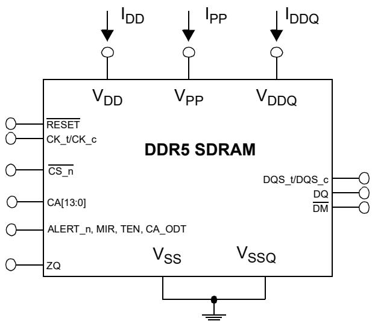  
NOTE 1 DIMM level Output test load condition may be different from that shown in the figure.

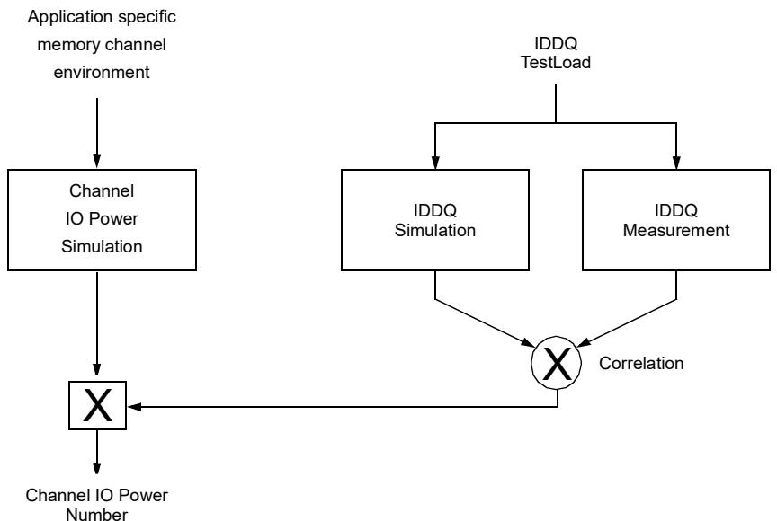  
Figure 214 — Correlation from Simulated Channel IO Power to Actual Channel IO Power Supported by IDDQ Measurement.

Table 491 — Basic IDD, IDDQ and IPP Measurement Conditions  

<table><tr><td>Symbol</td><td>Description</td></tr><tr><td>IDD0</td><td>Operating One Bank Active-Precharge Current
External clock: On; tCK, nRC, nRAS, nRP, nRRD: see Table TBD; BL: 161; CS_n: High between ACT and PRE; CA Inputs: partially toggling according to Table 502; Data IO: VDDQ; DM_n: stable at 1; Bank Activity: Cycling with one bank active at a time: 0,0,1,1,2,2,... (see Table 502); Output Buffer and RTT: Enabled in Mode Registers2; Pattern Details: see Table 502</td></tr><tr><td>IDDQ0</td><td>Operating One Bank Active-Precharge IDDQ Current
Same condition with IDD0, however measuring IDDQ current instead of IDD current</td></tr><tr><td>IPP0</td><td>Operating One Bank Active-Precharge IPP Current
Same condition with IDD0, however measuring IPP current instead of IDD current</td></tr></table>

Table 491 — Basic IDD, IDDQ and IPP Measurement Conditions (Cont'd)  

<table><tr><td>Symbol</td><td>Description</td></tr><tr><td>IDD0F</td><td>Operating Four Bank Active-Precharge IPP CurrentSame condition with IDD0F, however measuring IPP current instead of IDD current</td></tr><tr><td>IDDQ0F</td><td>Operating Four Bank Active-Precharge IDDQ CurrentSame condition with IDD0F, however measuring IDDQ current instead of IDD current</td></tr><tr><td>IPP0F</td><td>Operating Four Bank Active-Precharge IPP CurrentSame condition with IDD0F, however measuring IPP current instead of IDD current</td></tr><tr><td>IDD2N</td><td>Precharge Standby CurrentExternal clock: On; tCK: see Table TBD; CS_n: stable at 1; CA Inputs: partially toggling according to Table 504; Data IO: VDDQ; DM_n: stable at 1; Bank Activity: all banks closed; Output Buffer and RTT: Enabled in Mode Registers2; Pattern Details: see Table 504</td></tr><tr><td>IDDQ2N</td><td>Precharge Standby IDDQ CurrentSame condition with IDD2N, however measuring IDDQ current instead of IDD current</td></tr><tr><td>IPP2N</td><td>Precharge Standby IPP CurrentSame condition with IDD2N, however measuring IPP current instead of IDD current</td></tr><tr><td>IDD2NT</td><td>Precharge Standby Non-Target Command CurrentExternal clock: On; tCK: see Table TBD; BL: 161; CS_n: High between WRITE commands; CS_n, CA Inputs: partially toggling according to Table 505; Data IO: VDDQ; DM_n: stable at 1; Bank Activity: all banks closed; Output Buffer and RTT: Enabled in Mode Registers2; Pattern Details: see Table 505</td></tr><tr><td>IDDQ2NT(Optional)</td><td>Precharge Standby Non-Target Command IDDQ CurrentSame condition with IDD2NT, however measuring IDDQ current instead of IDD current</td></tr><tr><td>IPP2NT(Optional)</td><td>Precharge Standby Non-Target Command IPP CurrentSame condition with IDD2NT, however measuring IPP current instead of IDD current</td></tr><tr><td>IDD2P</td><td>Precharge Power-DownDevice in Precharge Power-Down, External clock: On; tCK: see Table TBD; CS_n: stable at 1 after Power Down Entry command; CA Inputs: stable at 1; Data IO: VDDQ; DM_n: stable at 1; Bank Activity: all banks closed; Output Buffer and RTT: Enabled in Mode Registers2;</td></tr><tr><td>IDDQ2P</td><td>Precharge Power-DownSame condition with IDD2P, however measuring IDDQ current instead of IDD current</td></tr><tr><td>IPP2P</td><td>Precharge Power-DownSame condition with IDD2P, however measuring IPP current instead of IDD current</td></tr><tr><td>IDD3N</td><td>Active Standby CurrentExternal clock: On; tCK: see Table TBD; CS_n: stable at 1; CA Inputs: partially toggling according to Table 504; Data IO: VDDQ; DM_n: stable at 1; Bank Activity: all banks open; Output Buffer and RTT: Enabled in Mode Registers2; Pattern Details: see Table 504</td></tr><tr><td>IDDQ3N</td><td>Active Standby IDDQ CurrentSame condition with IDD3N, however measuring IDDQ current instead of IDD current</td></tr><tr><td>IPP3N</td><td>Active Standby IPP CurrentSame condition with IDD3N, however measuring IPP current instead of IDD current</td></tr><tr><td>IDD3P</td><td>Active Power-Down CurrentDevice in Active Power-Down, External clock: On; tCK: see Table TBD; CS_n: stable at 1 after Power Down Entry command; CA Inputs: stable at 1; Data IO: VDDQ; DM_n: stable at 1; Bank Activity: all banks open; Output Buffer and RTT: Enabled in Mode Registers2;</td></tr><tr><td>IDDQ3P</td><td>Active Power-Down IDDQ CurrentSame condition with IDD3P, however measuring IDDQ current instead of IDD current</td></tr><tr><td>IPP3P</td><td>Active Power-Down IPP CurrentSame condition with IDD3P, however measuring IPP current instead of IDD current</td></tr><tr><td>IDD4R</td><td>Operating Burst Read CurrentExternal clock: On; tCK, nCCD, CL: see Table TBD; BL: 161; CS_n: High between RD; CA Inputs: partially toggling according to Table 506; Data IO: seamless read data burst with different data between one burst and the next one according to Table 506; DM_n: stable at 1; Bank Activity: all banks open, RD commands cycling through banks: 0,0,1,1,2,2,... (see Table 506); Output Buffer and RTT: Enabled in Mode Registers2; Pattern Details: see Table 506</td></tr><tr><td>IDD4RC</td><td>Operating Burst Read Current with Read CRCRead CRC enabled4. Other conditions: see IDD4R</td></tr><tr><td>IDDQ4R</td><td>Operating Burst Read IDDQ CurrentSame definition like for IDD4R, however measuring IDDQ current instead of IDD current</td></tr><tr><td>IPP4R</td><td>Operating Burst Read IPP CurrentSame condition with IDD4R, however measuring IPP current instead of IDD current</td></tr></table>

Table 491 — Basic IDD, IDDQ and IPP Measurement Conditions (Cont'd)  

<table><tr><td>Symbol</td><td>Description</td></tr><tr><td>IDD4W</td><td>Operating Burst Write Current
External clock: On; tCK, nCCD, CL: see Table TBD; BL: 161; CS_n: High between WR; CA Inputs: partially toggling according to Table 507; Data IO: seamless write data burst with different data between one burst and the next one according to Table 507; DM_n: stable at 1; Bank Activity: all banks open, WR commands cycling through banks: 0,0,1,1,2,2,... (see Table 507); Output Buffer and RTT: Enabled in Mode Registers2; Pattern Details: see Table 507</td></tr><tr><td>IDD4WC</td><td>Operating Burst Write Current with Write CRC
Write CRC enabled3, Other conditions: see IDD4W</td></tr><tr><td>IDDQ4W</td><td>Operating Burst Write IDDQ Current
Same condition with IDD4W, however measuring IDDQ current instead of IDD current</td></tr><tr><td>IPP4W</td><td>Operating Burst Write IPP Current
Same condition with IDD4W, however measuring IPP current instead of IDD current</td></tr><tr><td>IDD5B</td><td>Burst Refresh Current (Normal Refresh Mode)
External clock: On; tCK, nRFC1: see Table TBD; BL: 161; CS_n: High between REF; CA Inputs: partially toggling according to Table 509; Data IO: VDDQ; DM_n: stable at 1; Bank Activity: REF command every nRFC1 (see Table 509); Output Buffer and RTT: Enabled in Mode Registers2; Pattern Details: see Table 509</td></tr><tr><td>IDDQ5B</td><td>Burst Refresh IDDQ Current (Normal Refresh Mode)
Same condition with IDD5B, however measuring IDDQ current instead of IDD current</td></tr><tr><td>IPP5B</td><td>Burst Refresh IPP Current (Normal Refresh Mode)
Same condition with IDD5B, however measuring IPP current instead of IDD current</td></tr><tr><td>IDD5F</td><td>Burst Refresh Current (Fine Granularity Refresh Mode)
tRFC=tRFC2, Other conditions: see IDD5B</td></tr><tr><td>IDDQ5F</td><td>Burst Refresh IDDQPP Current (Fine Granularity Refresh Mode)
Same condition with IDD5F, however measuring IDDQ current instead of IDD current</td></tr><tr><td>IPP5F</td><td>Burst Refresh IPP Current (Fine Granularity Refresh Mode)
Same condition with IDD5F, however measuring IPP current instead of IDD current</td></tr><tr><td>IDD5C</td><td>Burst Refresh Current (Same Bank Refresh Mode)
External clock: On; tCK, nRFCsb: see Table TBD; BL: 161; CS_n: High between REF; CA Inputs: partially toggling according to Table 510; Data IO: VDDQ; DM_n: stable at 1; Bank Activity: REF command every nRFCsb (see Table 510); Output Buffer and RTT: Enabled in Mode Registers2; Pattern Details: see Table 510</td></tr><tr><td>IDDQ5C</td><td>Burst Refresh IDDQPP Current (Same Bank Refresh Mode)
Same condition with IDD5C, however measuring IDDQ current instead of IDD current</td></tr><tr><td>IPP5C</td><td>Burst Refresh IPP Current (Same Bank Refresh Mode)
Same condition with IDD5C, however measuring IPP current instead of IDD current</td></tr><tr><td>IDD6N</td><td>Self Refresh Current: Normal Temperature Range
TCASE: 0 - 85°C; External clock: Off; CK_t and CK_c#: HIGH; tCK, nCPDED: see Table TBD; BL: 161; CS_n#: low; CA, Data IO: High; DM_n: stable at 1; Bank Activity: Self-Refresh operation; Output Buffer and RTT: Enabled in Mode Registers2;</td></tr><tr><td>IDDQ6N</td><td>Self Refresh IDDQ Current: Normal Temperature Range
Same condition with IDD6N, however measuring IDDQ current instead of IDD current</td></tr><tr><td>IPP6N</td><td>Self Refresh IPP Current: Normal Temperature Range
Same condition with IDD6N, however measuring IPP current instead of IDD current</td></tr><tr><td>IDD6E</td><td>Self Refresh Current: Extended Temperature Range
TCASE: 85 - 95°C; Extended Clock: Off; CK_t and CK_c: HIGH; tCK, nCPDED: see Table TBD; BL: 161; CS_n: low; CA, Data IO: High; DM_n: stable at 1; Bank Activity: Self-Refresh operation; Output Buffer and RTT: Enabled in Mode Registers2</td></tr><tr><td>IDDQ6E</td><td>Self Refresh IDDQ Current: Extended Temperature Range
Same condition with IDD6E, however measuring IDDQ current instead of IDD current</td></tr><tr><td>IPP6E</td><td>Self Refresh IPP Current: Extended Temperature Range
Same condition with IDD6E, however measuring IPP current instead of IDD current</td></tr><tr><td>IDD7</td><td>Operating Bank Interleave Read Current
External clock: On; tCK, nRC, nRAS, nRCD, nRRD_S, nFAW, tCCD_S CL: see Table TBD; BL: 161; CS_n: High between ACT and RDA; CA Inputs: partially toggling according to Table 512; Data IO: read data bursts with different data between one burst and the next one according to Table 512; DM_n: stable at 1; Bank Activity: two times interleaved cycling through banks (0, 1, ...7) with different addressing, see Table 512; Output Buffer and RTT: Enabled in Mode Registers2; Pattern Details: see Table 512</td></tr></table>

Table 491 — Basic IDD, IDDQ and IPP Measurement Conditions (Cont'd)  

<table><tr><td>Symbol</td><td>Description</td></tr><tr><td>IDDQ7</td><td>Operating Bank Interleave Read IDDQ Current
Same condition with IDD7, however measuring IDDQ current instead of IDD current</td></tr><tr><td>IPP7</td><td>Operating Bank Interleave Read IPP Current
Same condition with IDD7, however measuring IPP current instead of IDD current</td></tr><tr><td>IDD8</td><td>Maximum Power Saving Deep Power Down Current
External clock: Off; CK_t and CK_c#: HIGH; tCK, nCPDED: see Table TBD; BL: 16^1; CS_n#: low;
CA:High, DM_n: stable at 1; Bank Activity: All banks closed and device in MPSM deep power down mode5; Output Buffer and RTT: Enabled in Mode Registers^2; Patterns Details: same as IDD6N but MPSM is enabled in mode register.</td></tr><tr><td>IDDQ8</td><td>Maximum Power Saving Deep Power Down IDDQ Current
Same condition with IDD8, however measuring IDDQ current instead of IDD current</td></tr><tr><td>IPP8</td><td>Maximum Power Saving Deep Power Down IPP Current
Same condition with IDD8, however measuring IPP current instead of IDD current</td></tr><tr><td colspan="2">NOTE 1 Burst Length: BL16 fixed by MR0 OP[1:0]=00.</td></tr><tr><td colspan="2">NOTE 2 Output Buffer Enable
- set MR5 OP[0] = 0: Qoff = Output buffer enabled
- set MR5 OP[2:1] = 00: Pull-Up Output Driver Impedance Control = RZQ/7
- set MR5 OP[7:6] = 00: Pull-Down Output Driver Impedance Control = RZQ/7
RTT_Nom enable
- set MR35 OP[5:0] = 110110: RTT_NOM_WR = RTT_NOM_RD = RZQ/6
RTT_WR enable
- set MR34 OP[5:3] = 010 RTT_WR = RZQ/2
RTT_PARK disable
- set MR34 OP[2:0] = 000</td></tr><tr><td colspan="2">NOTE 3 WRITE CRC enabled
- set MR50 OP[2:1] = 11</td></tr><tr><td colspan="2">NOTE 4 Read CRC enabled
- set MR50:OP[0]=1</td></tr><tr><td colspan="2">NOTE 5 MPSM Deep Power Down Mode
- set MR2:OP[3]=1 if PDA Enumerate ID not equal to 15
- set MR2:OP[5]=1 if PDA Enumerate ID equal to 15</td></tr></table>

# 11.1 IDD, IPP and IDDQ Measurement Conditions (Cont'd)

Executes Active and PreCharge commands with tightest timing possible while exercising all Bank and Bank Group addresses. All notes apply to entire table.

Table 492 — IDD0, IDD0Q, and IPP0  

<table><tr><td>Sequence</td><td>Command</td><td>CS</td><td>C/A [13:0]</td><td>Row Address [17:0]</td><td>BA [1:0]</td><td>BG [2:0]</td><td>CID [2:0]</td><td>Special Instructions</td></tr><tr><td rowspan="2">0</td><td rowspan="2">ACTIVE</td><td>L</td><td>0x0000</td><td rowspan="2">0x00000</td><td rowspan="2">0x0</td><td rowspan="2">0x00</td><td rowspan="2">0x0</td><td rowspan="2"></td></tr><tr><td>H</td><td>0x0000</td></tr></table>

Table 493 — Four Bank Active-Precharge IDD0F, IDDQ0F and IPP0F  

<table><tr><td>Sequence</td><td>Command</td><td>CS</td><td>C/A [13:0]</td><td>Row Address [17:0]</td><td>BA [1:0]</td><td>BG [2:0]</td><td>CID [2:0]</td><td>Special Instructions</td></tr><tr><td></td><td></td><td></td><td></td><td></td><td></td><td></td><td></td><td></td></tr></table>

Executes DESELECT commands while exercising all command/address pins in a predefined pattern. All notes apply to entire table.

Table 494 — IDD2N, IDD3N, IDD2P, IDD3P, IDDQ2N, IDDQ3N, IDDQ2P, IDDQ3P, IPP2N, IPP3N, IPP2P, IPP3P  

<table><tr><td>Sequence</td><td>Command</td><td>CS</td><td>C/A[13:0]</td></tr><tr><td>0</td><td>DES</td><td>H</td><td>0x0000</td></tr></table>

Executes Non-Target WRITE commands simulating Rank to Rank timing while exercising all C/A bits. All notes apply to entire table.

Table 495 — IDD2NT, IDDQ2NT, IPP2NT, IDD3NT, IDDQ3NT, IPP3NT  

<table><tr><td>Sequence</td><td>Command</td><td>CS</td><td>C/A [13:0]</td><td>Row Address [17:0]</td><td>BA [1:0]</td><td>BG [2:0]</td><td>CID [2:0]</td><td>Special Instructions</td></tr><tr><td rowspan="2">0</td><td rowspan="2">ACTIVE</td><td>L</td><td>0x0000</td><td rowspan="2">0x00000</td><td rowspan="2">0x0</td><td rowspan="2">0x00</td><td rowspan="2">0x0</td><td rowspan="2"></td></tr><tr><td>H</td><td>0x0000</td></tr></table>

Executes READ commands with tightest timing possible while exercising all Bank and Bank Group addresses. All notes apply to entire table

Table 496 — IDD4R, IDDQ4R, and IPP4R  

<table><tr><td>Sequence</td><td>Command</td><td>CS</td><td>C/A [13:0]</td><td>Row Address [17:0]</td><td>BA [1:0]</td><td>BG [2:0]</td><td>CID [2:0]</td><td>Special Instructions</td></tr><tr><td rowspan="2">0</td><td rowspan="2">ACTIVE</td><td>L</td><td>0x0000</td><td rowspan="2">0x00000</td><td rowspan="2">0x0</td><td rowspan="2">0x00</td><td rowspan="2">0x0</td><td rowspan="2"></td></tr><tr><td>H</td><td>0x0000</td></tr></table>

# 11.1 IDD, IPP and IDDQ Measurement Conditions (Cont'd)

Executes WRITE commands with tightest timing possible while exercising all Bank and Bank Group addresses. All notes apply to entire table

Table 497 — IDD4W, IDDQ4W, and IPP4W  

<table><tr><td>Sequence</td><td>Command</td><td>CS</td><td>C/A [13:0]</td><td>Row Address [17:0]</td><td>BA [1:0]</td><td>BG [2:0]</td><td>CID [2:0]</td><td>Special Instructions</td></tr><tr><td rowspan="2">0</td><td rowspan="2">ACTIVE</td><td>L</td><td>0x0000</td><td rowspan="2">0x00000</td><td rowspan="2">0x0</td><td rowspan="2">0x00</td><td rowspan="2">0x0</td><td rowspan="2"></td></tr><tr><td>H</td><td>0x0000</td></tr></table>

Executes Refresh (all banks) commands at minimum tREFI1. All notes apply to entire table.

Table 498 — IDD5, IDDQ5, and IPP5  

<table><tr><td>Sequence</td><td>Command</td><td>CS</td><td>C/A [13:0]</td><td>Row Address [17:0]</td><td>BA [1:0]</td><td>Special Instructions</td></tr><tr><td>0</td><td>REF</td><td>L</td><td>0x0003</td><td>L</td><td>0x0</td><td></td></tr></table>

Executes Refresh (all banks) commands at minimum tREF11. All notes apply to entire table.

Table 499 — IDD5B, IDDQ5B, and IPP5B  

<table><tr><td>Sequence</td><td>Command</td><td>CS</td><td>C/A [13:0]</td><td>Row Address [17:0]</td><td>BA [1:0]</td><td>Special Instructions</td></tr><tr><td>0</td><td>REF</td><td>L</td><td>0x0003</td><td>L</td><td>0x0</td><td></td></tr></table>

(same bank) commands at minimum tREF11. All notes apply to entire table.

Table 500 — IDD5SB, IDDQSB and IPPSB  

<table><tr><td>Sequence</td><td>Command</td><td>CS</td><td>C/A [13:0]</td><td>Row Address [17:0]</td><td>BA [1:0]</td><td>Special Instruction s</td></tr><tr><td>0</td><td>REF</td><td>L</td><td>0x0003</td><td>L</td><td>0x0</td><td></td></tr></table>

Executes ACTVATE, READ/A commands with tightest timing possible while exercising all Bank and Bank Group addresses. All notes apply to entire table

Table 501 — IDD7, IDDQ7, and IPP7  

<table><tr><td>Sequences</td><td>Command</td><td>CS</td><td>C/A [13:0]</td><td>Row Address [17:0]</td><td>BA [1:0]</td><td>BG [2:0]</td><td>CID [2:0]</td><td>Special Instructions</td></tr><tr><td>0</td><td>ACTIVE</td><td>L</td><td>0x0000</td><td>0x00000</td><td>0x0</td><td>0x00</td><td>0x0</td><td></td></tr></table>

# 11.2 IDD0, IDDQ0, IPP0 Pattern

Executes Active and PreCharge commands with tightest timing possible while exercising all Bank, Bank Group and CID addresses.

Table 502 — IDD0, IDDQ0, IPP0  
All notes apply to entire table.  

<table><tr><td>Sequence</td><td>Command</td><td>CS</td><td>C/A [13:0]</td><td>Row Address [17:0]</td><td>BA [1:0]</td><td>BG [2:0]</td><td>CID [2:0]</td><td>Special Instructions</td></tr><tr><td rowspan="2">0</td><td>ACTIVATE</td><td>L</td><td>0x0000</td><td rowspan="2">0x00000</td><td rowspan="2">0x0</td><td rowspan="2">0x00</td><td rowspan="2">0x0</td><td rowspan="2"></td></tr><tr><td></td><td>H</td><td>0x0000</td></tr><tr><td>1</td><td>DES</td><td>H</td><td>0x2AAA</td><td rowspan="8" colspan="4"></td><td rowspan="8">Repeat sequence 1-8 to satisfy tRAS(min), truncate if required</td></tr><tr><td>2</td><td>DES</td><td>H</td><td>0x0CCC</td></tr><tr><td>3</td><td>DES</td><td>H</td><td>0x1555</td></tr><tr><td>4</td><td>DES</td><td>H</td><td>0x3333</td></tr><tr><td>5</td><td>DES</td><td>H</td><td>0x2AAA</td></tr><tr><td>6</td><td>DES</td><td>H</td><td>0x0CCC</td></tr><tr><td>7</td><td>DES</td><td>H</td><td>0x1555</td></tr><tr><td>8</td><td>DES</td><td>H</td><td>0x3333</td></tr><tr><td>9</td><td>PRE(pb)</td><td>L</td><td>0x001B</td><td></td><td>0x0</td><td>0x00</td><td>0x0</td><td></td></tr><tr><td>10</td><td>DES</td><td>H</td><td>0x2AAA</td><td rowspan="8" colspan="4"></td><td rowspan="8">Repeat sequence 10-17 to satisfy tRP(min), truncate if required</td></tr><tr><td>11</td><td>DES</td><td>H</td><td>0x0CCC</td></tr><tr><td>12</td><td>DES</td><td>H</td><td>0x1555</td></tr><tr><td>13</td><td>DES</td><td>H</td><td>0x3333</td></tr><tr><td>14</td><td>DES</td><td>H</td><td>0x2AAA</td></tr><tr><td>15</td><td>DES</td><td>H</td><td>0x0CCC</td></tr><tr><td>16</td><td>DES</td><td>H</td><td>0x1555</td></tr><tr><td>17</td><td>DES</td><td>H</td><td>0x3333</td></tr><tr><td rowspan="2">18</td><td>ACTIVATE</td><td>L</td><td>0x003C</td><td rowspan="2">0x00FFF</td><td rowspan="2">0x0</td><td rowspan="2">0x00</td><td rowspan="2">0x0</td><td rowspan="2"></td></tr><tr><td></td><td>H</td><td>0x00FF</td></tr><tr><td>19</td><td>DES</td><td>H</td><td>0x2AAA</td><td rowspan="8" colspan="4"></td><td rowspan="8">Repeat sequence 19-26 to satisfy tRAS(min), truncate if required</td></tr><tr><td>20</td><td>DES</td><td>H</td><td>0x0CCC</td></tr><tr><td>21</td><td>DES</td><td>H</td><td>0x1555</td></tr><tr><td>22</td><td>DES</td><td>H</td><td>0x3333</td></tr><tr><td>23</td><td>DES</td><td>H</td><td>0x2AAA</td></tr><tr><td>24</td><td>DES</td><td>H</td><td>0x0CCC</td></tr><tr><td>25</td><td>DES</td><td>H</td><td>0x1555</td></tr><tr><td>26</td><td>DES</td><td>H</td><td>0x3333</td></tr><tr><td>27</td><td>PRE(pb)</td><td>L</td><td>0x001B</td><td></td><td>0x0</td><td>0x00</td><td>0x0</td><td></td></tr></table>

Table 502 — IDD0, IDDQ0, IPP0 (Cont'd)  
All notes apply to entire table.  

<table><tr><td>Sequence</td><td>Command</td><td>CS</td><td>C/A [13:0]</td><td>Row Address [17:0]</td><td>BA [1:0]</td><td>BG [2:0]</td><td>CID [2:0]</td><td>Special Instructions</td></tr><tr><td>28</td><td>DES</td><td>H</td><td>0x2AAA</td><td rowspan="8" colspan="4"></td><td rowspan="8">Repeat sequence 28-35 to satisfy tRP(min), truncate if required</td></tr><tr><td>29</td><td>DES</td><td>H</td><td>0x0CCC</td></tr><tr><td>30</td><td>DES</td><td>H</td><td>0x1555</td></tr><tr><td>31</td><td>DES</td><td>H</td><td>0x3333</td></tr><tr><td>32</td><td>DES</td><td>H</td><td>0x2AAA</td></tr><tr><td>33</td><td>DES</td><td>H</td><td>0x0CCC</td></tr><tr><td>34</td><td>DES</td><td>H</td><td>0x1555</td></tr><tr><td>35</td><td>DES</td><td>H</td><td>0x3333</td></tr><tr><td rowspan="2">36</td><td>ACTIVATE</td><td>L</td><td>0x0100</td><td rowspan="2">0x00000</td><td rowspan="2">0x0</td><td rowspan="2">0x01</td><td rowspan="2">0x0</td><td rowspan="2"></td></tr><tr><td></td><td>H</td><td>0x0000</td></tr><tr><td>37</td><td>DES</td><td>H</td><td>0x2AAA</td><td rowspan="8" colspan="4"></td><td rowspan="8">Repeat sequence 37 - 44 to satisfy tRAS(min), truncate if required</td></tr><tr><td>38</td><td>DES</td><td>H</td><td>0x0CCC</td></tr><tr><td>39</td><td>DES</td><td>H</td><td>0x1555</td></tr><tr><td>40</td><td>DES</td><td>H</td><td>0x3333</td></tr><tr><td>41</td><td>DES</td><td>H</td><td>0x2AAA</td></tr><tr><td>42</td><td>DES</td><td>H</td><td>0x0CCC</td></tr><tr><td>43</td><td>DES</td><td>H</td><td>0x1555</td></tr><tr><td>44</td><td>DES</td><td>H</td><td>0x3333</td></tr><tr><td>45</td><td>PRE(pb)</td><td>L</td><td>0x011B</td><td></td><td>0x0</td><td>0x01</td><td>0x0</td><td></td></tr><tr><td>46</td><td>DES</td><td>H</td><td>0x2AAA</td><td rowspan="8" colspan="4"></td><td rowspan="8">Repeat sequence 46 - 53 to satisfy tRP(min), truncate if required</td></tr><tr><td>47</td><td>DES</td><td>H</td><td>0x0CCC</td></tr><tr><td>48</td><td>DES</td><td>H</td><td>0x1555</td></tr><tr><td>49</td><td>DES</td><td>H</td><td>0x3333</td></tr><tr><td>50</td><td>DES</td><td>H</td><td>0x2AAA</td></tr><tr><td>51</td><td>DES</td><td>H</td><td>0x0CCC</td></tr><tr><td>52</td><td>DES</td><td>H</td><td>0x1555</td></tr><tr><td>53</td><td>DES</td><td>H</td><td>0x3333</td></tr><tr><td rowspan="2">54</td><td>ACTIVATE</td><td>L</td><td>0x013C</td><td rowspan="2">0x03FFF</td><td rowspan="2">0x0</td><td rowspan="2">0x01</td><td rowspan="2">0x0</td><td rowspan="2">na</td></tr><tr><td></td><td>H</td><td>0x03FF</td></tr></table>

All notes apply to entire table.

Table 502 — IDD0, IDDQ0, IPP0 (Cont'd)  

<table><tr><td>Sequence</td><td>Command</td><td>CS</td><td>C/A [13:0]</td><td>Row Address [17:0]</td><td>BA [1:0]</td><td>BG [2:0]</td><td>CID [2:0]</td><td>Special Instructions</td></tr><tr><td>55</td><td>DES</td><td>H</td><td>0x2AAA</td><td rowspan="8" colspan="4"></td><td rowspan="8">Repeat sequence 55 - 62 to satisfy tRAS(min), truncate if required</td></tr><tr><td>56</td><td>DES</td><td>H</td><td>0x0CCC</td></tr><tr><td>57</td><td>DES</td><td>H</td><td>0x1555</td></tr><tr><td>58</td><td>DES</td><td>H</td><td>0x3333</td></tr><tr><td>59</td><td>DES</td><td>H</td><td>0x2AAA</td></tr><tr><td>60</td><td>DES</td><td>H</td><td>0x0CCC</td></tr><tr><td>61</td><td>DES</td><td>H</td><td>0x1555</td></tr><tr><td>62</td><td>DES</td><td>H</td><td>0x3333</td></tr><tr><td>63</td><td>PRE(pb)</td><td>L</td><td>0x011B</td><td></td><td>0x0</td><td>0x01</td><td>0x0</td><td></td></tr><tr><td>64</td><td>DES</td><td>H</td><td>0x2AAA</td><td rowspan="8" colspan="4"></td><td rowspan="8">Repeat sequence 64 - 71 to satisfy tRP(min), truncate if required</td></tr><tr><td>65</td><td>DES</td><td>H</td><td>0x0CCC</td></tr><tr><td>66</td><td>DES</td><td>H</td><td>0x1555</td></tr><tr><td>67</td><td>DES</td><td>H</td><td>0x3333</td></tr><tr><td>68</td><td>DES</td><td>H</td><td>0x2AAA</td></tr><tr><td>69</td><td>DES</td><td>H</td><td>0x0CCC</td></tr><tr><td>70</td><td>DES</td><td>H</td><td>0x1555</td></tr><tr><td>71</td><td>DES</td><td>H</td><td>0x3333</td></tr><tr><td rowspan="2">72</td><td>ACTIVATE</td><td>L</td><td>0x0200</td><td rowspan="2">0x00000</td><td rowspan="2">0x0</td><td rowspan="2">0x02</td><td rowspan="2">0x0</td><td rowspan="2"></td></tr><tr><td></td><td>H</td><td>0x0000</td></tr><tr><td>73</td><td>DES</td><td>H</td><td>0x2AAA</td><td rowspan="8" colspan="4"></td><td rowspan="8">Repeat sequence 73 - 80 to satisfy tRAS(min), truncate if required</td></tr><tr><td>74</td><td>DES</td><td>H</td><td>0x0CCC</td></tr><tr><td>75</td><td>DES</td><td>H</td><td>0x1555</td></tr><tr><td>76</td><td>DES</td><td>H</td><td>0x3333</td></tr><tr><td>77</td><td>DES</td><td>H</td><td>0x2AAA</td></tr><tr><td>78</td><td>DES</td><td>H</td><td>0x0CCC</td></tr><tr><td>79</td><td>DES</td><td>H</td><td>0x1555</td></tr><tr><td>80</td><td>DES</td><td>H</td><td>0x3333</td></tr><tr><td>81</td><td>PRE(pb)</td><td>L</td><td>0x021B</td><td></td><td>0x0</td><td>0x02</td><td>0x0</td><td></td></tr></table>

Table 502 — IDD0, IDDQ0, IPP0 (Cont'd)  
All notes apply to entire table.  

<table><tr><td>Sequence</td><td>Command</td><td>CS</td><td>C/A [13:0]</td><td>Row Address [17:0]</td><td>BA [1:0]</td><td>BG [2:0]</td><td>CID [2:0]</td><td>Special Instructions</td></tr><tr><td>82</td><td>DES</td><td>H</td><td>0x2AAA</td><td rowspan="8" colspan="4"></td><td rowspan="8">Repeat sequence 82 - 89 to satisfy tRP(min), truncate if required</td></tr><tr><td>83</td><td>DES</td><td>H</td><td>0x0CCC</td></tr><tr><td>84</td><td>DES</td><td>H</td><td>0x1555</td></tr><tr><td>85</td><td>DES</td><td>H</td><td>0x3333</td></tr><tr><td>86</td><td>DES</td><td>H</td><td>0x2AAA</td></tr><tr><td>87</td><td>DES</td><td>H</td><td>0x0CCC</td></tr><tr><td>88</td><td>DES</td><td>H</td><td>0x1555</td></tr><tr><td>89</td><td>DES</td><td>H</td><td>0x3333</td></tr><tr><td rowspan="2">90</td><td>ACTIVATE</td><td>L</td><td>0x023C</td><td rowspan="2">0x00FFF</td><td rowspan="2">0x0</td><td rowspan="2">0x02</td><td rowspan="2">0x0</td><td rowspan="2"></td></tr><tr><td></td><td>H</td><td>0x00FF</td></tr><tr><td>91</td><td>DES</td><td>H</td><td>0x2AAA</td><td rowspan="8" colspan="4"></td><td rowspan="8">Repeat sequence 91 - 98 to satisfy tRAS(min), truncate if required</td></tr><tr><td>92</td><td>DES</td><td>H</td><td>0x0CCC</td></tr><tr><td>93</td><td>DES</td><td>H</td><td>0x1555</td></tr><tr><td>94</td><td>DES</td><td>H</td><td>0x3333</td></tr><tr><td>95</td><td>DES</td><td>H</td><td>0x2AAA</td></tr><tr><td>96</td><td>DES</td><td>H</td><td>0x0CCC</td></tr><tr><td>97</td><td>DES</td><td>H</td><td>0x1555</td></tr><tr><td>98</td><td>DES</td><td>H</td><td>0x3333</td></tr><tr><td>99</td><td>PRE(pb)</td><td>L</td><td>0x021B</td><td></td><td>0x0</td><td>0x02</td><td>0x0</td><td></td></tr><tr><td>100</td><td>DES</td><td>H</td><td>0x2AAA</td><td rowspan="8" colspan="4"></td><td rowspan="8">Repeat sequence 100 - 107 to satisfy tRP(min), truncate if required</td></tr><tr><td>101</td><td>DES</td><td>H</td><td>0x0CCC</td></tr><tr><td>102</td><td>DES</td><td>H</td><td>0x1555</td></tr><tr><td>103</td><td>DES</td><td>H</td><td>0x3333</td></tr><tr><td>104</td><td>DES</td><td>H</td><td>0x2AAA</td></tr><tr><td>105</td><td>DES</td><td>H</td><td>0x0CCC</td></tr><tr><td>106</td><td>DES</td><td>H</td><td>0x1555</td></tr><tr><td>107</td><td>DES</td><td>H</td><td>0x3333</td></tr><tr><td rowspan="2">108</td><td>ACTIVATE</td><td>L</td><td>0x0300</td><td rowspan="2">0x00000</td><td rowspan="2">0x0</td><td rowspan="2">0x03</td><td rowspan="2">0x0</td><td rowspan="2"></td></tr><tr><td></td><td>H</td><td>0x0000</td></tr></table>

All notes apply to entire table.

Table 502 — IDD0, IDDQ0, IPP0 (Cont'd)  

<table><tr><td>Sequence</td><td>Command</td><td>CS</td><td>C/A [13:0]</td><td>Row Address [17:0]</td><td>BA [1:0]</td><td>BG [2:0]</td><td>CID [2:0]</td><td>Special Instructions</td></tr><tr><td>109</td><td>DES</td><td>H</td><td>0x2AAA</td><td rowspan="8" colspan="4"></td><td rowspan="8">Repeat sequence 109 - 116 to satisfy tRAS(min), truncate if required</td></tr><tr><td>110</td><td>DES</td><td>H</td><td>0x0CCC</td></tr><tr><td>111</td><td>DES</td><td>H</td><td>0x1555</td></tr><tr><td>112</td><td>DES</td><td>H</td><td>0x3333</td></tr><tr><td>113</td><td>DES</td><td>H</td><td>0x2AAA</td></tr><tr><td>114</td><td>DES</td><td>H</td><td>0x0CCC</td></tr><tr><td>115</td><td>DES</td><td>H</td><td>0x1555</td></tr><tr><td>116</td><td>DES</td><td>H</td><td>0x3333</td></tr><tr><td>117</td><td>PRE(pb)</td><td>L</td><td>0x031B</td><td></td><td>0x0</td><td>0x03</td><td>0x0</td><td></td></tr><tr><td>118</td><td>DES</td><td>H</td><td>0x2AAA</td><td rowspan="8" colspan="4"></td><td rowspan="8">Repeat sequence 118 - 125 to satisfy tRP(min), truncate if required</td></tr><tr><td>119</td><td>DES</td><td>H</td><td>0x0CCC</td></tr><tr><td>120</td><td>DES</td><td>H</td><td>0x1555</td></tr><tr><td>121</td><td>DES</td><td>H</td><td>0x3333</td></tr><tr><td>122</td><td>DES</td><td>H</td><td>0x2AAA</td></tr><tr><td>123</td><td>DES</td><td>H</td><td>0x0CCC</td></tr><tr><td>124</td><td>DES</td><td>H</td><td>0x1555</td></tr><tr><td>125</td><td>DES</td><td>H</td><td>0x3333</td></tr><tr><td rowspan="2">126</td><td>ACTIVATE</td><td>L</td><td>0x033C</td><td rowspan="2">0x03FFF</td><td rowspan="2">0x0</td><td rowspan="2">0x03</td><td rowspan="2">0x0</td><td rowspan="2"></td></tr><tr><td></td><td>H</td><td>0x03FF</td></tr><tr><td>127</td><td>DES</td><td>H</td><td>0x2AAA</td><td rowspan="8" colspan="4"></td><td rowspan="8">Repeat sequence 127 - 134 to satisfy tRAS(min), truncate if required</td></tr><tr><td>128</td><td>DES</td><td>H</td><td>0x0CCC</td></tr><tr><td>129</td><td>DES</td><td>H</td><td>0x1555</td></tr><tr><td>130</td><td>DES</td><td>H</td><td>0x3333</td></tr><tr><td>131</td><td>DES</td><td>H</td><td>0x2AAA</td></tr><tr><td>132</td><td>DES</td><td>H</td><td>0x0CCC</td></tr><tr><td>133</td><td>DES</td><td>H</td><td>0x1555</td></tr><tr><td>134</td><td>DES</td><td>H</td><td>0x3333</td></tr><tr><td>135</td><td>PRE(pb)</td><td>L</td><td>0x031B</td><td></td><td>0x0</td><td>0x03</td><td>0x0</td><td></td></tr></table>

Table 502 — IDD0, IDDQ0, IPP0 (Cont'd)  
All notes apply to entire table.  

<table><tr><td>Sequence</td><td>Command</td><td>CS</td><td>C/A [13:0]</td><td>Row Address [17:0]</td><td>BA [1:0]</td><td>BG [2:0]</td><td>CID [2:0]</td><td>Special Instructions</td></tr><tr><td>136</td><td>DES</td><td>H</td><td>0x2AAA</td><td rowspan="8" colspan="4"></td><td rowspan="8">Repeat sequence 136 - 143 to satisfy tRP(min), truncate if required</td></tr><tr><td>137</td><td>DES</td><td>H</td><td>0x0CCC</td></tr><tr><td>138</td><td>DES</td><td>H</td><td>0x1555</td></tr><tr><td>139</td><td>DES</td><td>H</td><td>0x3333</td></tr><tr><td>140</td><td>DES</td><td>H</td><td>0x2AAA</td></tr><tr><td>141</td><td>DES</td><td>H</td><td>0x0CCC</td></tr><tr><td>142</td><td>DES</td><td>H</td><td>0x1555</td></tr><tr><td>143</td><td>DES</td><td>H</td><td>0x3333</td></tr><tr><td rowspan="2">144</td><td>ACTIVATE</td><td>L</td><td>0x0400</td><td rowspan="2">0x00000</td><td rowspan="2">0x0</td><td rowspan="2">0x04</td><td rowspan="2">0x0</td><td rowspan="2"></td></tr><tr><td></td><td>H</td><td>0x0000</td></tr><tr><td>145</td><td>DES</td><td>H</td><td>0x2AAA</td><td rowspan="8" colspan="4"></td><td rowspan="8">Repeat sequence 145 - 152 to satisfy tRAS(min), truncate if required</td></tr><tr><td>146</td><td>DES</td><td>H</td><td>0x0CCC</td></tr><tr><td>147</td><td>DES</td><td>H</td><td>0x1555</td></tr><tr><td>148</td><td>DES</td><td>H</td><td>0x3333</td></tr><tr><td>149</td><td>DES</td><td>H</td><td>0x2AAA</td></tr><tr><td>150</td><td>DES</td><td>H</td><td>0x0CCC</td></tr><tr><td>151</td><td>DES</td><td>H</td><td>0x1555</td></tr><tr><td>152</td><td>DES</td><td>H</td><td>0x3333</td></tr><tr><td>153</td><td>PRE(pb)</td><td>L</td><td>0x041B</td><td></td><td>0x0</td><td>0x04</td><td>0x0</td><td></td></tr><tr><td>154</td><td>DES</td><td>H</td><td>0x2AAA</td><td rowspan="8" colspan="4"></td><td rowspan="8">Repeat sequence 154 - 161 to satisfy tRP(min), truncate if required</td></tr><tr><td>155</td><td>DES</td><td>H</td><td>0x0CCC</td></tr><tr><td>156</td><td>DES</td><td>H</td><td>0x1555</td></tr><tr><td>157</td><td>DES</td><td>H</td><td>0x3333</td></tr><tr><td>158</td><td>DES</td><td>H</td><td>0x2AAA</td></tr><tr><td>159</td><td>DES</td><td>H</td><td>0x0CCC</td></tr><tr><td>160</td><td>DES</td><td>H</td><td>0x1555</td></tr><tr><td>161</td><td>DES</td><td>H</td><td>0x3333</td></tr><tr><td rowspan="2">162</td><td>ACTIVATE</td><td>L</td><td>0x043C</td><td rowspan="2">0x00FFF</td><td rowspan="2">0x0</td><td rowspan="2">0x04</td><td rowspan="2">0x0</td><td rowspan="2"></td></tr><tr><td></td><td>H</td><td>0x00FF</td></tr></table>

All notes apply to entire table.

Table 502 — IDD0, IDDQ0, IPP0 (Cont'd)  

<table><tr><td>Sequence</td><td>Command</td><td>CS</td><td>C/A [13:0]</td><td>Row Address [17:0]</td><td>BA [1:0]</td><td>BG [2:0]</td><td>CID [2:0]</td><td>Special Instructions</td></tr><tr><td>163</td><td>DES</td><td>H</td><td>0x2AAA</td><td rowspan="8" colspan="4"></td><td rowspan="8">Repeat sequence 163 - 170 to satisfy tRAS(min), truncate if required</td></tr><tr><td>164</td><td>DES</td><td>H</td><td>0x0CCC</td></tr><tr><td>165</td><td>DES</td><td>H</td><td>0x1555</td></tr><tr><td>166</td><td>DES</td><td>H</td><td>0x3333</td></tr><tr><td>167</td><td>DES</td><td>H</td><td>0x2AAA</td></tr><tr><td>168</td><td>DES</td><td>H</td><td>0x0CCC</td></tr><tr><td>169</td><td>DES</td><td>H</td><td>0x1555</td></tr><tr><td>170</td><td>DES</td><td>H</td><td>0x3333</td></tr><tr><td>171</td><td>PRE(pb)</td><td>L</td><td>0x041B</td><td></td><td>0x0</td><td>0x04</td><td>0x0</td><td></td></tr><tr><td>172</td><td>DES</td><td>H</td><td>0x2AAA</td><td rowspan="8" colspan="4"></td><td rowspan="8">Repeat sequence 172 - 179 to satisfy tRP(min), truncate if required</td></tr><tr><td>173</td><td>DES</td><td>H</td><td>0x0CCC</td></tr><tr><td>174</td><td>DES</td><td>H</td><td>0x1555</td></tr><tr><td>175</td><td>DES</td><td>H</td><td>0x3333</td></tr><tr><td>176</td><td>DES</td><td>H</td><td>0x2AAA</td></tr><tr><td>177</td><td>DES</td><td>H</td><td>0x0CCC</td></tr><tr><td>178</td><td>DES</td><td>H</td><td>0x1555</td></tr><tr><td>179</td><td>DES</td><td>H</td><td>0x3333</td></tr><tr><td rowspan="2">180</td><td>ACTIVATE</td><td>L</td><td>0x0500</td><td rowspan="2">0x00000</td><td rowspan="2">0x0</td><td rowspan="2">0x05</td><td rowspan="2">0x0</td><td rowspan="2"></td></tr><tr><td></td><td>H</td><td>0x0000</td></tr><tr><td>181</td><td>DES</td><td>H</td><td>0x2AAA</td><td rowspan="8" colspan="4"></td><td rowspan="8">Repeat sequence 181 - 188 to satisfy tRAS(min), truncate if required</td></tr><tr><td>182</td><td>DES</td><td>H</td><td>0x0CCC</td></tr><tr><td>183</td><td>DES</td><td>H</td><td>0x1555</td></tr><tr><td>184</td><td>DES</td><td>H</td><td>0x3333</td></tr><tr><td>185</td><td>DES</td><td>H</td><td>0x2AAA</td></tr><tr><td>186</td><td>DES</td><td>H</td><td>0x0CCC</td></tr><tr><td>187</td><td>DES</td><td>H</td><td>0x1555</td></tr><tr><td>188</td><td>DES</td><td>H</td><td>0x3333</td></tr><tr><td>189</td><td>PRE(pb)</td><td>L</td><td>0x051B</td><td></td><td>0x0</td><td>0x05</td><td>0x0</td><td></td></tr></table>

Table 502 — IDD0, IDDQ0, IPP0 (Cont'd)  
All notes apply to entire table.  

<table><tr><td>Sequence</td><td>Command</td><td>CS</td><td>C/A [13:0]</td><td>Row Address [17:0]</td><td>BA [1:0]</td><td>BG [2:0]</td><td>CID [2:0]</td><td>Special Instructions</td></tr><tr><td>190</td><td>DES</td><td>H</td><td>0x2AAA</td><td rowspan="8" colspan="4"></td><td rowspan="8">Repeat sequence 190 - 197 to satisfy tRP(min), truncate if required</td></tr><tr><td>191</td><td>DES</td><td>H</td><td>0x0CCC</td></tr><tr><td>192</td><td>DES</td><td>H</td><td>0x1555</td></tr><tr><td>193</td><td>DES</td><td>H</td><td>0x3333</td></tr><tr><td>194</td><td>DES</td><td>H</td><td>0x2AAA</td></tr><tr><td>195</td><td>DES</td><td>H</td><td>0x0CCC</td></tr><tr><td>196</td><td>DES</td><td>H</td><td>0x1555</td></tr><tr><td>197</td><td>DES</td><td>H</td><td>0x3333</td></tr><tr><td rowspan="2">198</td><td>ACTIVATE</td><td>L</td><td>0x053C</td><td rowspan="2">0x03FFF</td><td rowspan="2">0x0</td><td rowspan="2">0x05</td><td rowspan="2">0x0</td><td rowspan="2"></td></tr><tr><td></td><td>H</td><td>0x03FF</td></tr><tr><td>199</td><td>DES</td><td>H</td><td>0x2AAA</td><td rowspan="8" colspan="4"></td><td rowspan="8">Repeat sequence 199 - 206 to satisfy tRAS(min), truncate if required</td></tr><tr><td>200</td><td>DES</td><td>H</td><td>0x0CCC</td></tr><tr><td>201</td><td>DES</td><td>H</td><td>0x1555</td></tr><tr><td>202</td><td>DES</td><td>H</td><td>0x3333</td></tr><tr><td>203</td><td>DES</td><td>H</td><td>0x2AAA</td></tr><tr><td>204</td><td>DES</td><td>H</td><td>0x0CCC</td></tr><tr><td>205</td><td>DES</td><td>H</td><td>0x1555</td></tr><tr><td>206</td><td>DES</td><td>H</td><td>0x3333</td></tr><tr><td>207</td><td>PRE(pb)</td><td>L</td><td>0x051B</td><td></td><td>0x0</td><td>0x05</td><td>0x0</td><td></td></tr><tr><td>208</td><td>DES</td><td>H</td><td>0x2AAA</td><td rowspan="8" colspan="4"></td><td rowspan="8">Repeat sequence 208 - 215 to satisfy tRP(min), truncate if required</td></tr><tr><td>209</td><td>DES</td><td>H</td><td>0x0CCC</td></tr><tr><td>210</td><td>DES</td><td>H</td><td>0x1555</td></tr><tr><td>211</td><td>DES</td><td>H</td><td>0x3333</td></tr><tr><td>212</td><td>DES</td><td>H</td><td>0x2AAA</td></tr><tr><td>213</td><td>DES</td><td>H</td><td>0x0CCC</td></tr><tr><td>214</td><td>DES</td><td>H</td><td>0x1555</td></tr><tr><td>215</td><td>DES</td><td>H</td><td>0x3333</td></tr><tr><td rowspan="2">216</td><td>ACTIVATE</td><td>L</td><td>0x0600</td><td rowspan="2">0x00000</td><td rowspan="2">0x0</td><td rowspan="2">0x06</td><td rowspan="2">0x0</td><td rowspan="2"></td></tr><tr><td></td><td>H</td><td>0x0000</td></tr></table>

All notes apply to entire table.

Table 502 — IDD0, IDDQ0, IPP0 (Cont'd)  

<table><tr><td>Sequence</td><td>Command</td><td>CS</td><td>C/A [13:0]</td><td>Row Address [17:0]</td><td>BA [1:0]</td><td>BG [2:0]</td><td>CID [2:0]</td><td>Special Instructions</td></tr><tr><td>217</td><td>DES</td><td>H</td><td>0x2AAA</td><td rowspan="8" colspan="4"></td><td rowspan="8">Repeat sequence 217 - 224 to satisfy tRAS(min), truncate if required</td></tr><tr><td>218</td><td>DES</td><td>H</td><td>0x0CCC</td></tr><tr><td>219</td><td>DES</td><td>H</td><td>0x1555</td></tr><tr><td>220</td><td>DES</td><td>H</td><td>0x3333</td></tr><tr><td>221</td><td>DES</td><td>H</td><td>0x2AAA</td></tr><tr><td>222</td><td>DES</td><td>H</td><td>0x0CCC</td></tr><tr><td>223</td><td>DES</td><td>H</td><td>0x1555</td></tr><tr><td>224</td><td>DES</td><td>H</td><td>0x3333</td></tr><tr><td>225</td><td>PRE(pb)</td><td>L</td><td>0x061B</td><td></td><td>0x0</td><td>0x06</td><td>0x0</td><td></td></tr><tr><td>226</td><td>DES</td><td>H</td><td>0x2AAA</td><td rowspan="8" colspan="4"></td><td rowspan="8">Repeat sequence 226 - 233 to satisfy tRP(min), truncate if required</td></tr><tr><td>227</td><td>DES</td><td>H</td><td>0x0CCC</td></tr><tr><td>228</td><td>DES</td><td>H</td><td>0x1555</td></tr><tr><td>229</td><td>DES</td><td>H</td><td>0x3333</td></tr><tr><td>230</td><td>DES</td><td>H</td><td>0x2AAA</td></tr><tr><td>231</td><td>DES</td><td>H</td><td>0x0CCC</td></tr><tr><td>232</td><td>DES</td><td>H</td><td>0x1555</td></tr><tr><td>233</td><td>DES</td><td>H</td><td>0x3333</td></tr><tr><td rowspan="2">234</td><td>ACTIVATE</td><td>L</td><td>0x063C</td><td rowspan="2">0x00FFF</td><td rowspan="2">0x0</td><td rowspan="2">0x06</td><td rowspan="2">0x0</td><td rowspan="2"></td></tr><tr><td></td><td>H</td><td>0x00FF</td></tr><tr><td>235</td><td>DES</td><td>H</td><td>0x2AAA</td><td rowspan="8" colspan="4"></td><td rowspan="8">Repeat sequence 235 - 242 to satisfy tRAS(min), truncate if required</td></tr><tr><td>236</td><td>DES</td><td>H</td><td>0x0CCC</td></tr><tr><td>237</td><td>DES</td><td>H</td><td>0x1555</td></tr><tr><td>238</td><td>DES</td><td>H</td><td>0x3333</td></tr><tr><td>239</td><td>DES</td><td>H</td><td>0x2AAA</td></tr><tr><td>240</td><td>DES</td><td>H</td><td>0x0CCC</td></tr><tr><td>241</td><td>DES</td><td>H</td><td>0x1555</td></tr><tr><td>242</td><td>DES</td><td>H</td><td>0x3333</td></tr><tr><td>243</td><td>PRE(pb)</td><td>L</td><td>0x061B</td><td></td><td>0x0</td><td>0x06</td><td>0x0</td><td></td></tr></table>

Table 502 — IDD0, IDDQ0, IPP0 (Cont'd)  
All notes apply to entire table.  

<table><tr><td>Sequence</td><td>Command</td><td>CS</td><td>C/A [13:0]</td><td>Row Address [17:0]</td><td>BA [1:0]</td><td>BG [2:0]</td><td>CID [2:0]</td><td>Special Instructions</td></tr><tr><td>244</td><td>DES</td><td>H</td><td>0x2AAA</td><td rowspan="8" colspan="4"></td><td rowspan="8">Repeat sequence 244 - 251 to satisfy tRP(min), truncate if required</td></tr><tr><td>245</td><td>DES</td><td>H</td><td>0x0CCC</td></tr><tr><td>246</td><td>DES</td><td>H</td><td>0x1555</td></tr><tr><td>247</td><td>DES</td><td>H</td><td>0x3333</td></tr><tr><td>248</td><td>DES</td><td>H</td><td>0x2AAA</td></tr><tr><td>249</td><td>DES</td><td>H</td><td>0x0CCC</td></tr><tr><td>250</td><td>DES</td><td>H</td><td>0x1555</td></tr><tr><td>251</td><td>DES</td><td>H</td><td>0x3333</td></tr><tr><td rowspan="2">252</td><td>ACTIVATE</td><td>L</td><td>0x0700</td><td rowspan="2">0x00000</td><td rowspan="2">0x0</td><td rowspan="2">0x07</td><td rowspan="2">0x0</td><td rowspan="2"></td></tr><tr><td></td><td>H</td><td>0x0000</td></tr><tr><td>253</td><td>DES</td><td>H</td><td>0x2AAA</td><td rowspan="8" colspan="4"></td><td rowspan="8">Repeat sequence 253 - 260 to satisfy tRAS(min), truncate if required</td></tr><tr><td>254</td><td>DES</td><td>H</td><td>0x0CCC</td></tr><tr><td>255</td><td>DES</td><td>H</td><td>0x1555</td></tr><tr><td>256</td><td>DES</td><td>H</td><td>0x3333</td></tr><tr><td>257</td><td>DES</td><td>H</td><td>0x2AAA</td></tr><tr><td>258</td><td>DES</td><td>H</td><td>0x0CCC</td></tr><tr><td>259</td><td>DES</td><td>H</td><td>0x1555</td></tr><tr><td>260</td><td>DES</td><td>H</td><td>0x3333</td></tr><tr><td>261</td><td>PRE(pb)</td><td>L</td><td>0x071B</td><td></td><td>0x0</td><td>0x07</td><td>0x0</td><td></td></tr><tr><td>262</td><td>DES</td><td>H</td><td>0x2AAA</td><td rowspan="8" colspan="4"></td><td rowspan="8">Repeat sequence 262 - 269 to satisfy tRP(min), truncate if required</td></tr><tr><td>263</td><td>DES</td><td>H</td><td>0x0CCC</td></tr><tr><td>264</td><td>DES</td><td>H</td><td>0x1555</td></tr><tr><td>265</td><td>DES</td><td>H</td><td>0x3333</td></tr><tr><td>266</td><td>DES</td><td>H</td><td>0x2AAA</td></tr><tr><td>267</td><td>DES</td><td>H</td><td>0x0CCC</td></tr><tr><td>268</td><td>DES</td><td>H</td><td>0x1555</td></tr><tr><td>269</td><td>DES</td><td>H</td><td>0x3333</td></tr><tr><td rowspan="2">270</td><td>ACTIVATE</td><td>L</td><td>0x073C</td><td rowspan="2">0x03FFF</td><td rowspan="2">0x0</td><td rowspan="2">0x07</td><td rowspan="2">0x0</td><td rowspan="2">na</td></tr><tr><td></td><td>H</td><td>0x03FF</td></tr></table>

All notes apply to entire table.

Table 502 — IDD0, IDDQ0, IPP0 (Cont'd)  

<table><tr><td>Sequence</td><td>Command</td><td>CS</td><td>C/A [13:0]</td><td>Row Address [17:0]</td><td>BA [1:0]</td><td>BG [2:0]</td><td>CID [2:0]</td><td>Special Instructions</td></tr><tr><td>271</td><td>DES</td><td>H</td><td>0x2AAA</td><td rowspan="8" colspan="4"></td><td rowspan="8">Repeat sequence 271 - 279 to satisfy tRAS(min), truncate if required</td></tr><tr><td>272</td><td>DES</td><td>H</td><td>0x0CCC</td></tr><tr><td>273</td><td>DES</td><td>H</td><td>0x1555</td></tr><tr><td>274</td><td>DES</td><td>H</td><td>0x3333</td></tr><tr><td>275</td><td>DES</td><td>H</td><td>0x2AAA</td></tr><tr><td>276</td><td>DES</td><td>H</td><td>0x0CCC</td></tr><tr><td>278</td><td>DES</td><td>H</td><td>0x1555</td></tr><tr><td>279</td><td>DES</td><td>H</td><td>0x3333</td></tr><tr><td>280</td><td>PRE(pb)</td><td>L</td><td>0x071B</td><td></td><td>0x0</td><td>0x07</td><td>0x0</td><td></td></tr><tr><td>281</td><td>DES</td><td>H</td><td>0x2AAA</td><td rowspan="8" colspan="4"></td><td rowspan="8">Repeat sequence 281 - 288 to satisfy tRP(min), truncate if required</td></tr><tr><td>282</td><td>DES</td><td>H</td><td>0x0CCC</td></tr><tr><td>283</td><td>DES</td><td>H</td><td>0x1555</td></tr><tr><td>284</td><td>DES</td><td>H</td><td>0x3333</td></tr><tr><td>285</td><td>DES</td><td>H</td><td>0x2AAA</td></tr><tr><td>286</td><td>DES</td><td>H</td><td>0x0CCC</td></tr><tr><td>287</td><td>DES</td><td>H</td><td>0x1555</td></tr><tr><td>288</td><td>DES</td><td>H</td><td>0x3333</td></tr><tr><td>289 - 576</td><td colspan="4"></td><td>0x1</td><td colspan="2"></td><td>Repeat sequence 0-288 using BA = 0x1</td></tr><tr><td>577 - 865</td><td colspan="4"></td><td>0x2</td><td colspan="2"></td><td>Repeat sequence 0-288 using BA = 0x2</td></tr><tr><td>866 - 1154</td><td colspan="4"></td><td>0x3</td><td colspan="2"></td><td>Repeat sequence 0-288 using BA = 0x3</td></tr><tr><td colspan="9">NOTE 1 Utilize DESELECTs between commands while toggling all C/A bits as defined. 
NOTE 2 Time between Activates reflect tRAS (min). 
NOTE 3 Time between PreCharge reflect tRP (min). 
NOTE 4 x8 or x16 may have different Bank or Bank Group Address. 
NOTE 5 For sequence 289 - 1,154 due to changing the Bank Address the C/A value for Activate and PreCharge commands will be different than listed here 
NOTE 6 For 3DS, all banks of all “non-target” logical ranks are Idd2N condition 
NOTE 7 Repeat pattern for each logical rank, but changing CID[2:0] from 0x0 to the correct active logical rank</td></tr></table>

# 11.3 IDD0F, IDDQ0F, IPP0F Pattern

Executes four Active and PreCharge commands per tRC time while exercising all Bank, Bank, Group and CID addresses.

Table 503 — IDD0F, IDDQ0F, IPP0F  
All notes apply to entire table.  

<table><tr><td>Sequence</td><td>Command</td><td>CS</td><td>C/A [13:0]</td><td>Row Address [17:0]</td><td>BA [1:0]</td><td>BG [2:0]</td><td>CID [2:0]</td><td>Special Instructions</td></tr><tr><td rowspan="2">0</td><td rowspan="2">ACTIVATE</td><td>L</td><td>0x0000</td><td rowspan="2">0x00000</td><td rowspan="2">0x0</td><td rowspan="2">0x00</td><td rowspan="2">0x0</td><td rowspan="2"></td></tr><tr><td>H</td><td>0x0000</td></tr><tr><td>1</td><td>DES</td><td>H</td><td>0x2AAA</td><td rowspan="4" colspan="4"></td><td rowspan="4">Repeat sequence 1-4 to satisfy tRRD(min), truncate if required</td></tr><tr><td>2</td><td>DES</td><td>H</td><td>0x0CCC</td></tr><tr><td>3</td><td>DES</td><td>H</td><td>0x1555</td></tr><tr><td>4</td><td>DES</td><td>H</td><td>0x3333</td></tr><tr><td rowspan="2">5</td><td rowspan="2">ACTIVATE</td><td>L</td><td>0x013C</td><td rowspan="2">0x03FFF</td><td rowspan="2">0x0</td><td rowspan="2">0x01</td><td rowspan="2">0x0</td><td rowspan="2"></td></tr><tr><td>H</td><td>0x03FF</td></tr><tr><td>6</td><td>DES</td><td>H</td><td>0x2AAA</td><td rowspan="4" colspan="4"></td><td rowspan="4">Repeat sequence 6-9 to satisfy tRRD(min), truncate if required</td></tr><tr><td>7</td><td>DES</td><td>H</td><td>0x0CCC</td></tr><tr><td>8</td><td>DES</td><td>H</td><td>0x1555</td></tr><tr><td>9</td><td>DES</td><td>H</td><td>0x3333</td></tr><tr><td rowspan="2">10</td><td rowspan="2">ACTIVATE</td><td>L</td><td>0x0200</td><td rowspan="2">0x00000</td><td rowspan="2">0x0</td><td rowspan="2">0x02</td><td rowspan="2">0x0</td><td rowspan="2"></td></tr><tr><td>H</td><td>0x0000</td></tr><tr><td>11</td><td>DES</td><td>H</td><td>0x2AAA</td><td rowspan="4" colspan="4"></td><td rowspan="4">Repeat sequence 11-14 to satisfy tRAS(min), truncate if required</td></tr><tr><td>12</td><td>DES</td><td>H</td><td>0x0CCC</td></tr><tr><td>13</td><td>DES</td><td>H</td><td>0x1555</td></tr><tr><td>14</td><td>DES</td><td>H</td><td>0x3333</td></tr><tr><td>15</td><td>PRE(pb)</td><td>L</td><td>0x001B</td><td></td><td>0x0</td><td>0x00</td><td>0x0</td><td></td></tr><tr><td>16</td><td>DES</td><td>H</td><td>0x2AAA</td><td rowspan="4" colspan="4"></td><td rowspan="4">Repeat sequence 15-19 to satisfy tRC(min)/4, truncate if required</td></tr><tr><td>17</td><td>DES</td><td>H</td><td>0x0CCC</td></tr><tr><td>18</td><td>DES</td><td>H</td><td>0x1555</td></tr><tr><td>19</td><td>DES</td><td>H</td><td></td></tr><tr><td rowspan="2">20</td><td rowspan="2">ACTIVATE</td><td>L</td><td>0x033C</td><td rowspan="2">0x03FFF</td><td rowspan="2">0x0</td><td rowspan="2">0x03</td><td rowspan="2">0x0</td><td rowspan="2"></td></tr><tr><td>H</td><td>0x03FF</td></tr><tr><td>21</td><td>DES</td><td>H</td><td>0x2AAA</td><td rowspan="4" colspan="4"></td><td rowspan="4">Repeat sequence 21-24 to satisfy tRAS(min), truncate if required</td></tr><tr><td>22</td><td>DES</td><td>H</td><td>0x0CCC</td></tr><tr><td>23</td><td>DES</td><td>H</td><td>0x1555</td></tr><tr><td>24</td><td>DES</td><td>H</td><td>0x3333</td></tr><tr><td>25</td><td>PRE(pb)</td><td>L</td><td>0x011B</td><td></td><td>0x0</td><td>0x01</td><td>0x0</td><td></td></tr></table>

All notes apply to entire table.

Table 503 — IDD0F, IDDQ0F, IPP0F (Cont'd)  

<table><tr><td>Sequence</td><td>Command</td><td>CS</td><td>C/A [13:0]</td><td>Row Address [17:0]</td><td>BA [1:0]</td><td>BG [2:0]</td><td>CID [2:0]</td><td>Special Instructions</td></tr><tr><td>25</td><td>DES</td><td>H</td><td>0x2AAA</td><td rowspan="4" colspan="4"></td><td rowspan="4">Repeat sequence 25-28 to satisfy tRC(min)/4, truncate if required</td></tr><tr><td>26</td><td>DES</td><td>H</td><td>0x0CCC</td></tr><tr><td>27</td><td>DES</td><td>H</td><td>0x1555</td></tr><tr><td>28</td><td>DES</td><td>H</td><td>0x3333</td></tr><tr><td rowspan="2">29</td><td rowspan="2">ACTIVATE</td><td>L</td><td>0x0400</td><td rowspan="2">0x00000</td><td rowspan="2">0x0</td><td rowspan="2">0x04</td><td rowspan="2">0x0</td><td rowspan="2"></td></tr><tr><td>H</td><td>0x0000</td></tr><tr><td>30</td><td>DES</td><td>H</td><td>0x2AAA</td><td rowspan="4" colspan="4"></td><td rowspan="4">Repeat sequence 30-33 to satisfy tRAS(min), truncate if required</td></tr><tr><td>31</td><td>DES</td><td>H</td><td>0x0CCC</td></tr><tr><td>32</td><td>DES</td><td>H</td><td>0x1555</td></tr><tr><td>33</td><td>DES</td><td>H</td><td>0x3333</td></tr><tr><td>34</td><td>PRE(pb)</td><td>L</td><td>0x021B</td><td></td><td>0x0</td><td>0x02</td><td>0x0</td><td></td></tr><tr><td>35</td><td>DES</td><td>H</td><td>0x2AAA</td><td rowspan="4" colspan="4"></td><td rowspan="4">Repeat sequence 35-38 to satisfy tRC(min)/4, truncate if required</td></tr><tr><td>36</td><td>DES</td><td>H</td><td>0x0CCC</td></tr><tr><td>37</td><td>DES</td><td>H</td><td>0x1555</td></tr><tr><td>38</td><td>DES</td><td>H</td><td>0x3333</td></tr><tr><td rowspan="2">39</td><td rowspan="2">ACTIVATE</td><td>L</td><td>0x053C</td><td rowspan="2">0x03FFF</td><td rowspan="2">0x0</td><td rowspan="2">0x05</td><td rowspan="2">0x0</td><td rowspan="2"></td></tr><tr><td>H</td><td>0x03FF</td></tr><tr><td>40</td><td>DES</td><td>H</td><td>0x2AAA</td><td rowspan="4" colspan="4"></td><td rowspan="4">Repeat sequence 40-43 to satisfy tRAS(min), truncate if required</td></tr><tr><td>41</td><td>DES</td><td>H</td><td>0x0CCC</td></tr><tr><td>42</td><td>DES</td><td>H</td><td>0x1555</td></tr><tr><td>43</td><td>DES</td><td>H</td><td>0x3333</td></tr><tr><td>44</td><td>PRE(pb)</td><td>L</td><td>0x031B</td><td></td><td>0x0</td><td>0x03</td><td>0x0</td><td></td></tr><tr><td>45</td><td>DES</td><td>H</td><td>0x2AAA</td><td rowspan="4" colspan="4"></td><td rowspan="4">Repeat sequence 45-48 to satisfy tRC(min)/4, truncate if required</td></tr><tr><td>46</td><td>DES</td><td>H</td><td>0x0CCC</td></tr><tr><td>47</td><td>DES</td><td>H</td><td>0x1555</td></tr><tr><td>48</td><td>DES</td><td>H</td><td>0x3333</td></tr><tr><td rowspan="2">49</td><td rowspan="2">ACTIVATE</td><td>L</td><td>0x0600</td><td rowspan="2">0x00000</td><td rowspan="2">0x0</td><td rowspan="2">0x06</td><td rowspan="2">0x0</td><td rowspan="2"></td></tr><tr><td>H</td><td>0x0000</td></tr><tr><td>50</td><td>DES</td><td>H</td><td>0x2AAA</td><td rowspan="4" colspan="4"></td><td rowspan="4">Repeat sequence 50-53 to satisfy tRAS(min), truncate if required</td></tr><tr><td>51</td><td>DES</td><td>H</td><td>0x0CCC</td></tr><tr><td>52</td><td>DES</td><td>H</td><td>0x1555</td></tr><tr><td>53</td><td>DES</td><td>H</td><td>0x3333</td></tr><tr><td>54</td><td>PRE(pb)</td><td>L</td><td>0x041B</td><td></td><td>0x0</td><td>0x04</td><td>0x0</td><td></td></tr></table>

Table 503 — IDD0F, IDDQ0F, IPP0F (Cont'd)  
All notes apply to entire table.  

<table><tr><td>Sequence</td><td>Command</td><td>CS</td><td>C/A [13:0]</td><td>Row Address [17:0]</td><td>BA [1:0]</td><td>BG [2:0]</td><td>CID [2:0]</td><td>Special Instructions</td></tr><tr><td>55</td><td>DES</td><td>H</td><td>0x2AAA</td><td rowspan="4" colspan="4"></td><td rowspan="4">Repeat sequence 55-58 to satisfy tRC(min)/4, truncate if required</td></tr><tr><td>56</td><td>DES</td><td>H</td><td>0x0CCC</td></tr><tr><td>57</td><td>DES</td><td>H</td><td>0x1555</td></tr><tr><td>58</td><td>DES</td><td>H</td><td>0x3333</td></tr><tr><td rowspan="2">59</td><td rowspan="2">ACTIVATE</td><td>L</td><td>0x0700</td><td rowspan="2">0x03FFF</td><td rowspan="2">0x0</td><td rowspan="2">0x07</td><td rowspan="2">0x0</td><td rowspan="2"></td></tr><tr><td>H</td><td>0x03FF</td></tr><tr><td>60</td><td>DES</td><td>H</td><td>0x2AAA</td><td rowspan="4" colspan="4"></td><td rowspan="4">Repeat sequence 60-63 to satisfy tRAS(min), truncate if required</td></tr><tr><td>61</td><td>DES</td><td>H</td><td>0x0CCC</td></tr><tr><td>62</td><td>DES</td><td>H</td><td>0x1555</td></tr><tr><td>63</td><td>DES</td><td>H</td><td>0x3333</td></tr><tr><td>64</td><td>PRE(pb)</td><td>L</td><td>0x051B</td><td></td><td>0x0</td><td>0x05</td><td>0x0</td><td></td></tr><tr><td>65</td><td>DES</td><td>H</td><td>0x2AAA</td><td rowspan="4" colspan="4"></td><td rowspan="4">Repeat sequence 65-68 to satisfy tRC(min)/4, truncate if required</td></tr><tr><td>66</td><td>DES</td><td>H</td><td>0x0CCC</td></tr><tr><td>67</td><td>DES</td><td>H</td><td>0x1555</td></tr><tr><td>68</td><td>DES</td><td>H</td><td>0x3333</td></tr><tr><td rowspan="2">69</td><td rowspan="2">ACTIVATE</td><td>L</td><td>0x007C</td><td rowspan="2">0x00000</td><td rowspan="2">0x1</td><td rowspan="2">0x00</td><td rowspan="2">0x0</td><td rowspan="2"></td></tr><tr><td>H</td><td>0x0000</td></tr><tr><td>70</td><td>DES</td><td>H</td><td>0x2AAA</td><td rowspan="4" colspan="4"></td><td rowspan="4">Repeat sequence 70-73 to satisfy tRAS(min), truncate if required</td></tr><tr><td>71</td><td>DES</td><td>H</td><td>0x0CCC</td></tr><tr><td>72</td><td>DES</td><td>H</td><td>0x1555</td></tr><tr><td>73</td><td>DES</td><td>H</td><td>0x3333</td></tr><tr><td>74</td><td>PRE(pb)</td><td>L</td><td>0x061B</td><td></td><td>0x0</td><td>0x06</td><td>0x0</td><td></td></tr><tr><td>75</td><td>DES</td><td>H</td><td>0x2AAA</td><td rowspan="4" colspan="4"></td><td rowspan="4">Repeat sequence 75-78 to satisfy tRC(min)/4, truncate if required</td></tr><tr><td>76</td><td>DES</td><td>H</td><td>0x0CCC</td></tr><tr><td>77</td><td>DES</td><td>H</td><td>0x1555</td></tr><tr><td>78</td><td>DES</td><td>H</td><td>0x3333</td></tr><tr><td rowspan="2">79</td><td rowspan="2">ACTIVATE</td><td>L</td><td>0x0140</td><td rowspan="2">0x03FFF</td><td rowspan="2">0x1</td><td rowspan="2">0x01</td><td rowspan="2">0x0</td><td rowspan="2"></td></tr><tr><td>H</td><td>0x03FF</td></tr><tr><td>78</td><td>DES</td><td>H</td><td>0x2AAA</td><td rowspan="4" colspan="4"></td><td rowspan="4">Repeat sequence 78-81 to satisfy tRAS(min), truncate if required</td></tr><tr><td>79</td><td>DES</td><td>H</td><td>0x0CCC</td></tr><tr><td>80</td><td>DES</td><td>H</td><td>0x1555</td></tr><tr><td>81</td><td>DES</td><td>H</td><td>0x3333</td></tr><tr><td>82</td><td>PRE(pb)</td><td>L</td><td>0x071B</td><td></td><td>0x0</td><td>0x07</td><td>0x0</td><td></td></tr></table>

All notes apply to entire table.

Table 503 — IDD0F, IDDQ0F, IPP0F (Cont'd)  

<table><tr><td>Sequence</td><td>Command</td><td>CS</td><td>C/A [13:0]</td><td>Row Address [17:0]</td><td>BA [1:0]</td><td>BG [2:0]</td><td>CID [2:0]</td><td>Special Instructions</td></tr><tr><td>83</td><td>DES</td><td>H</td><td>0x2AAA</td><td rowspan="4" colspan="4"></td><td rowspan="4">Repeat sequence 83-86 to satisfy tRC(min)/4, truncate if required</td></tr><tr><td>84</td><td>DES</td><td>H</td><td>0x0CCC</td></tr><tr><td>85</td><td>DES</td><td>H</td><td>0x1555</td></tr><tr><td>86</td><td>DES</td><td>H</td><td>0x3333</td></tr><tr><td rowspan="2">87</td><td>ACTIVATE</td><td>L</td><td>0x027C</td><td rowspan="2">0x00000</td><td rowspan="2">0x1</td><td rowspan="2">0x02</td><td rowspan="2">0x0</td><td rowspan="2"></td></tr><tr><td></td><td>H</td><td>0x0000</td></tr><tr><td>88</td><td>DES</td><td>H</td><td>0x2AAA</td><td rowspan="4" colspan="4"></td><td rowspan="4">Repeat sequence 88-91 to satisfy tRAS(min), truncate if required</td></tr><tr><td>89</td><td>DES</td><td>H</td><td>0x0CCC</td></tr><tr><td>90</td><td>DES</td><td>H</td><td>0x1555</td></tr><tr><td>91</td><td>DES</td><td>H</td><td>0x3333</td></tr><tr><td>92</td><td>PRE(pb)</td><td>L</td><td>0x005B</td><td></td><td>0x1</td><td>0x00</td><td>0x0</td><td></td></tr><tr><td>93</td><td>DES</td><td>H</td><td>0x2AAA</td><td rowspan="4" colspan="4"></td><td rowspan="4">Repeat sequence 93-96 to satisfy tRC(min)/4, truncate if required</td></tr><tr><td>94</td><td>DES</td><td>H</td><td>0x0CCC</td></tr><tr><td>95</td><td>DES</td><td>H</td><td>0x1555</td></tr><tr><td>96</td><td>DES</td><td>H</td><td>0x3333</td></tr><tr><td rowspan="2">97</td><td rowspan="2">ACTIVATE</td><td>L</td><td>0x0340</td><td>0x03FFF</td><td>0x1</td><td>0x03</td><td>0x0</td><td rowspan="2"></td></tr><tr><td>H</td><td>0x03FF</td><td></td><td></td><td></td><td></td></tr><tr><td>98</td><td>DES</td><td>H</td><td>0x2AAA</td><td rowspan="4" colspan="4"></td><td rowspan="4">Repeat sequence 98-101 to satisfy tRAS(min), truncate if required</td></tr><tr><td>99</td><td>DES</td><td>H</td><td>0x0CCC</td></tr><tr><td>100</td><td>DES</td><td>H</td><td>0x1555</td></tr><tr><td>101</td><td>DES</td><td>H</td><td>0x3333</td></tr><tr><td>102</td><td>PRE(pb)</td><td>L</td><td>0x015B</td><td></td><td>0x1</td><td>0x01</td><td>0x0</td><td></td></tr><tr><td>103</td><td>DES</td><td>H</td><td>0x2AAA</td><td rowspan="4" colspan="4"></td><td rowspan="4">Repeat sequence 103-106 to satisfy tRC(min)/4, truncate if required</td></tr><tr><td>104</td><td>DES</td><td>H</td><td>0x0CCC</td></tr><tr><td>105</td><td>DES</td><td>H</td><td>0x1555</td></tr><tr><td>106</td><td>DES</td><td>H</td><td></td></tr><tr><td rowspan="2">107</td><td rowspan="2">ACTIVATE</td><td>L</td><td>0x0440</td><td>0x00000</td><td>0x1</td><td>0x04</td><td>0x0</td><td rowspan="2"></td></tr><tr><td>H</td><td>0x0000</td><td></td><td></td><td></td><td></td></tr><tr><td>108</td><td>DES</td><td>H</td><td>0x2AAA</td><td rowspan="4" colspan="4"></td><td rowspan="4">Repeat sequence 108-111 to satisfy tRAS(min), truncate if required</td></tr><tr><td>109</td><td>DES</td><td>H</td><td>0x0CCC</td></tr><tr><td>110</td><td>DES</td><td>H</td><td>0x1555</td></tr><tr><td>111</td><td>DES</td><td>H</td><td>0x3333</td></tr><tr><td>112</td><td>PRE(pb)</td><td>L</td><td>0x025B</td><td></td><td>0x1</td><td>0x02</td><td>0x0</td><td></td></tr></table>

Table 503 — IDD0F, IDDQ0F, IPP0F (Cont'd)  
All notes apply to entire table.  

<table><tr><td>Sequence</td><td>Command</td><td>CS</td><td>C/A [13:0]</td><td>Row Address [17:0]</td><td>BA [1:0]</td><td>BG [2:0]</td><td>CID [2:0]</td><td>Special Instructions</td></tr><tr><td>113</td><td>DES</td><td>H</td><td>0x2AAA</td><td rowspan="4" colspan="4"></td><td rowspan="4">Repeat sequence 113-115 to satisfy tRC(min)/4, truncate if required</td></tr><tr><td>113</td><td>DES</td><td>H</td><td>0x0CCC</td></tr><tr><td>114</td><td>DES</td><td>H</td><td>0x1555</td></tr><tr><td>115</td><td>DES</td><td>H</td><td>0x3333</td></tr><tr><td rowspan="2">116</td><td rowspan="2">ACTIVATE</td><td>L</td><td>0x0540</td><td>0x03FFF</td><td>0x1</td><td>0x05</td><td>0x0</td><td rowspan="2"></td></tr><tr><td>H</td><td>0x03FF</td><td></td><td></td><td></td><td></td></tr><tr><td>117</td><td>DES</td><td>H</td><td>0x2AAA</td><td rowspan="4" colspan="4"></td><td rowspan="4">Repeat sequence 117-120 to satisfy tRAS(min), truncate if required</td></tr><tr><td>118</td><td>DES</td><td>H</td><td>0x0CCC</td></tr><tr><td>119</td><td>DES</td><td>H</td><td>0x1555</td></tr><tr><td>120</td><td>DES</td><td>H</td><td>0x3333</td></tr><tr><td>121</td><td>PRE(pb)</td><td>L</td><td>0x035B</td><td></td><td>0x1</td><td>0x03</td><td>0x0</td><td></td></tr><tr><td>122</td><td>DES</td><td>H</td><td>0x2AAA</td><td rowspan="4" colspan="4"></td><td rowspan="4">Repeat sequence 122-124 to satisfy tRC(min)/4, truncate if required</td></tr><tr><td>123</td><td>DES</td><td>H</td><td>0x0CCC</td></tr><tr><td>124</td><td>DES</td><td>H</td><td>0x1555</td></tr><tr><td>125</td><td>DES</td><td>H</td><td>0x3333</td></tr><tr><td rowspan="2">126</td><td rowspan="2">ACTIVATE</td><td>L</td><td>0x067C</td><td>0x00000</td><td>0x1</td><td>0x06</td><td>0x0</td><td></td></tr><tr><td>H</td><td>0x0000</td><td></td><td></td><td></td><td></td><td></td></tr><tr><td>127</td><td>DES</td><td>H</td><td>0x2AAA</td><td rowspan="4" colspan="4"></td><td rowspan="4">Repeat sequence 127-130 to satisfy tRAS(min), truncate if required</td></tr><tr><td>128</td><td>DES</td><td>H</td><td>0x0CCC</td></tr><tr><td>129</td><td>DES</td><td>H</td><td>0x1555</td></tr><tr><td>130</td><td>DES</td><td>H</td><td>0x3333</td></tr><tr><td>131</td><td>PRE(pb)</td><td>L</td><td>0x045B</td><td></td><td>0x1</td><td>0x04</td><td>0x0</td><td></td></tr><tr><td>132</td><td>DES</td><td>H</td><td>0x2AAA</td><td rowspan="4" colspan="4"></td><td rowspan="4">Repeat sequence 132-135 to satisfy tRC(min)/4, truncate if required</td></tr><tr><td>133</td><td>DES</td><td>H</td><td>0x0CCC</td></tr><tr><td>134</td><td>DES</td><td>H</td><td>0x1555</td></tr><tr><td>135</td><td>DES</td><td>H</td><td>0x3333</td></tr><tr><td rowspan="2">136</td><td rowspan="2">ACTIVATE</td><td>L</td><td>0x0740</td><td rowspan="2">0x03FFF</td><td rowspan="2">0x1</td><td rowspan="2">x07</td><td rowspan="2">0x0</td><td rowspan="2"></td></tr><tr><td>H</td><td>0x03FF</td></tr><tr><td>137</td><td>DES</td><td>H</td><td>0x2AAA</td><td rowspan="4" colspan="4"></td><td rowspan="4">Repeat sequence 137-140 to satisfy tRAS(min), truncate if required</td></tr><tr><td>138</td><td>DES</td><td>H</td><td>0x0CCC</td></tr><tr><td>139</td><td>DES</td><td>H</td><td>0x1555</td></tr><tr><td>140</td><td>DES</td><td>H</td><td>0x3333</td></tr><tr><td>141</td><td>PRE(pb)</td><td>L</td><td>0x055B</td><td></td><td>0x1</td><td>0x05</td><td>0x0</td><td></td></tr></table>

All notes apply to entire table.

Table 503 — IDD0F, IDDQ0F, IPP0F (Cont'd)  

<table><tr><td>Sequence</td><td>Command</td><td>CS</td><td>C/A [13:0]</td><td>Row Address [17:0]</td><td>BA [1:0]</td><td>BG [2:0]</td><td>CID [2:0]</td><td>Special Instructions</td></tr><tr><td>142</td><td>DES</td><td>H</td><td>0x2AAA</td><td rowspan="4" colspan="4"></td><td rowspan="4">Repeat sequence 142-145 to satisfy tRC(min)/4, truncate if required</td></tr><tr><td>143</td><td>DES</td><td>H</td><td>0x0CCC</td></tr><tr><td>144</td><td>DES</td><td>H</td><td>0x1555</td></tr><tr><td>145</td><td>DES</td><td>H</td><td>0x3333</td></tr><tr><td rowspan="2">146</td><td rowspan="2">ACTIVATE</td><td>L</td><td>0x00BC</td><td rowspan="2">0x00000</td><td rowspan="2">0x2</td><td rowspan="2">0x00</td><td rowspan="2">0x0</td><td rowspan="2"></td></tr><tr><td>H</td><td>0x0000</td></tr><tr><td>147</td><td>DES</td><td>H</td><td>0x2AAA</td><td rowspan="4" colspan="4"></td><td rowspan="4">Repeat sequence 147-150 to satisfy tRAS(min), truncate if required</td></tr><tr><td>148</td><td>DES</td><td>H</td><td>0x0CCC</td></tr><tr><td>149</td><td>DES</td><td>H</td><td>0x1555</td></tr><tr><td>150</td><td>DES</td><td>H</td><td>0x3333</td></tr><tr><td>151</td><td>PRE(pb)</td><td>L</td><td>0x065B</td><td></td><td>0x1</td><td>0x06</td><td>0x0</td><td></td></tr><tr><td>152</td><td>DES</td><td>H</td><td>0x2AAA</td><td rowspan="4" colspan="4"></td><td rowspan="4">Repeat sequence152-155 to satisfy tRC(min)/4, truncate if required</td></tr><tr><td>153</td><td>DES</td><td>H</td><td>0x0CCC</td></tr><tr><td>154</td><td>DES</td><td>H</td><td>0x1555</td></tr><tr><td>155</td><td>DES</td><td>H</td><td>0x3333</td></tr><tr><td rowspan="2">156</td><td rowspan="2">ACTIVATE</td><td>L</td><td>0x0180</td><td rowspan="2">0x03FFF</td><td rowspan="2">0x2</td><td rowspan="2">0x01</td><td rowspan="2">0x0</td><td rowspan="2"></td></tr><tr><td>H</td><td>0x03FF</td></tr><tr><td>157</td><td>DES</td><td>H</td><td>0x2AAA</td><td rowspan="4" colspan="4"></td><td rowspan="4">Repeat sequence 157-160 to satisfy tRAS(min), truncate if required</td></tr><tr><td>158</td><td>DES</td><td>H</td><td>0x0CCC</td></tr><tr><td>159</td><td>DES</td><td>H</td><td>0x1555</td></tr><tr><td>160</td><td>DES</td><td>H</td><td>0x3333</td></tr><tr><td>161</td><td>PRE(pb)</td><td>L</td><td>0x075B</td><td></td><td>0x1</td><td>0x07</td><td>0x0</td><td></td></tr><tr><td>162</td><td>DES</td><td>H</td><td>0x2AAA</td><td rowspan="4" colspan="4"></td><td rowspan="4">Repeat sequence 162-165 to satisfy tRC(min)/4, truncate if required</td></tr><tr><td>163</td><td>DES</td><td>H</td><td>0x0CCC</td></tr><tr><td>164</td><td>DES</td><td>H</td><td>0x1555</td></tr><tr><td>165</td><td>DES</td><td>H</td><td>0x3333</td></tr><tr><td rowspan="2">166</td><td rowspan="2">ACTIVATE</td><td>L</td><td>0x0280</td><td rowspan="2">0x00000</td><td rowspan="2">0x2</td><td rowspan="2">0x02</td><td rowspan="2">0x0</td><td rowspan="2"></td></tr><tr><td>H</td><td>0x0000</td></tr><tr><td>167</td><td>DES</td><td>H</td><td>0x2AAA</td><td rowspan="4" colspan="4"></td><td rowspan="4">Repeat sequence 167-170 to satisfy tRAS(min), truncate if required</td></tr><tr><td>168</td><td>DES</td><td>H</td><td>0x0CCC</td></tr><tr><td>169</td><td>DES</td><td>H</td><td>0x1555</td></tr><tr><td>170</td><td>DES</td><td>H</td><td>0x3333</td></tr><tr><td>171</td><td>PRE(pb)</td><td>L</td><td>0x009B</td><td></td><td>0x2</td><td>0x00</td><td>0x0</td><td></td></tr></table>

Table 503 — IDD0F, IDDQ0F, IPP0F (Cont'd)  
All notes apply to entire table.  

<table><tr><td>Sequence</td><td>Command</td><td>CS</td><td>C/A [13:0]</td><td>Row Address [17:0]</td><td>BA [1:0]</td><td>BG [2:0]</td><td>CID [2:0]</td><td>Special Instructions</td></tr><tr><td>172</td><td>DES</td><td>H</td><td>0x2AAA</td><td rowspan="4" colspan="4"></td><td rowspan="4">Repeat sequence 172-175 to satisfy tRC(min)/4, truncate if required</td></tr><tr><td>173</td><td>DES</td><td>H</td><td>0x0CCC</td></tr><tr><td>174</td><td>DES</td><td>H</td><td>0x1555</td></tr><tr><td>175</td><td>DES</td><td>H</td><td>0x3333</td></tr><tr><td rowspan="2">176</td><td rowspan="2">ACTIVATE</td><td>L</td><td>0x03BC</td><td>0x03FFF</td><td>0x2</td><td>0x03</td><td>0x0</td><td rowspan="2"></td></tr><tr><td>H</td><td>0x03FF</td><td></td><td></td><td></td><td></td></tr><tr><td>177</td><td>DES</td><td>H</td><td>0x2AAA</td><td rowspan="4" colspan="4"></td><td rowspan="4">Repeat sequence 177-180 to satisfy tRAS(min), truncate if required</td></tr><tr><td>178</td><td>DES</td><td>H</td><td>0x0CCC</td></tr><tr><td>179</td><td>DES</td><td>H</td><td>0x1555</td></tr><tr><td>180</td><td>DES</td><td>H</td><td>0x3333</td></tr><tr><td>181</td><td>PRE(pb)</td><td>L</td><td>0x019B</td><td></td><td>0x2</td><td>0x01</td><td>0x0</td><td></td></tr><tr><td>182</td><td>DES</td><td>H</td><td>0x2AAA</td><td rowspan="4" colspan="4"></td><td rowspan="4">Repeat sequence 182-185 to satisfy tRC(min)/4, truncate if required</td></tr><tr><td>183</td><td>DES</td><td>H</td><td>0x0CCC</td></tr><tr><td>184</td><td>DES</td><td>H</td><td>0x1555</td></tr><tr><td>185</td><td>DES</td><td>H</td><td></td></tr><tr><td rowspan="2">186</td><td rowspan="2">ACTIVATE</td><td>L</td><td>0x0480</td><td>0x00000</td><td>0x2</td><td>0x04</td><td>0x0</td><td rowspan="2"></td></tr><tr><td>H</td><td>0x0080</td><td></td><td></td><td></td><td></td></tr><tr><td>187</td><td>DES</td><td>H</td><td>0x2AAA</td><td rowspan="4" colspan="4"></td><td rowspan="4">Repeat sequence 187-191 to satisfy tRAS(min), truncate if required</td></tr><tr><td>189</td><td>DES</td><td>H</td><td>0x0CCC</td></tr><tr><td>190</td><td>DES</td><td>H</td><td>0x1555</td></tr><tr><td>191</td><td>DES</td><td>H</td><td>0x3333</td></tr><tr><td>192</td><td>PRE(pb)</td><td>L</td><td>0x029B</td><td></td><td>0x2</td><td>0x02</td><td>0x0</td><td></td></tr><tr><td>193</td><td>DES</td><td>H</td><td>0x2AAA</td><td rowspan="4" colspan="4"></td><td rowspan="4">Repeat sequence 193-195 to satisfy tRC(min)/4, truncate if required</td></tr><tr><td>193</td><td>DES</td><td>H</td><td>0x0CCC</td></tr><tr><td>194</td><td>DES</td><td>H</td><td>0x1555</td></tr><tr><td>195</td><td>DES</td><td>H</td><td>0x3333</td></tr><tr><td rowspan="2">196</td><td rowspan="2">ACTIVATE</td><td>L</td><td>0x05BC</td><td>0x03FFF</td><td>0x2</td><td>0x05</td><td>0x0</td><td rowspan="2"></td></tr><tr><td>H</td><td>0x03FF</td><td></td><td></td><td></td><td></td></tr><tr><td>197</td><td>DES</td><td>H</td><td>0x2AAA</td><td rowspan="4" colspan="4"></td><td rowspan="4">Repeat sequence 197-200 to satisfy tRAS(min), truncate if required</td></tr><tr><td>198</td><td>DES</td><td>H</td><td>0x0CCC</td></tr><tr><td>199</td><td>DES</td><td>H</td><td>0x1555</td></tr><tr><td>200</td><td>DES</td><td>H</td><td>0x3333</td></tr><tr><td>201</td><td>PRE(pb)</td><td>L</td><td>0x039B</td><td></td><td>0x2</td><td>0x03</td><td>0x0</td><td></td></tr></table>

All notes apply to entire table.

Table 503 — IDD0F, IDDQ0F, IPP0F (Cont'd)  

<table><tr><td>Sequence</td><td>Command</td><td>CS</td><td>C/A [13:0]</td><td>Row Address [17:0]</td><td>BA [1:0]</td><td>BG [2:0]</td><td>CID [2:0]</td><td>Special Instructions</td></tr><tr><td>202</td><td>DES</td><td>H</td><td>0x2AAA</td><td rowspan="4" colspan="4"></td><td rowspan="4">Repeat sequence 202-205 to satisfy tRC(min)/4, truncate if required</td></tr><tr><td>203</td><td>DES</td><td>H</td><td>0x0CCC</td></tr><tr><td>204</td><td>DES</td><td>H</td><td>0x1555</td></tr><tr><td>205</td><td>DES</td><td>H</td><td>0x3333</td></tr><tr><td rowspan="2">206</td><td rowspan="2">ACTIVATE</td><td>L</td><td>0x0680</td><td>0x00000</td><td>0x2</td><td>0x06</td><td>0x0</td><td rowspan="2"></td></tr><tr><td>H</td><td>0x0000</td><td></td><td></td><td></td><td></td></tr><tr><td>207</td><td>DES</td><td>H</td><td>0x2AAA</td><td rowspan="4" colspan="4"></td><td rowspan="4">Repeat sequence 207-210 to satisfy tRAS(min), truncate if required</td></tr><tr><td>208</td><td>DES</td><td>H</td><td>0x0CCC</td></tr><tr><td>209</td><td>DES</td><td>H</td><td>0x1555</td></tr><tr><td>210</td><td>DES</td><td>H</td><td>0x3333</td></tr><tr><td>211</td><td>PRE(pb)</td><td>L</td><td>0x049B</td><td></td><td>0x2</td><td>0x04</td><td>0x0</td><td></td></tr><tr><td>212</td><td>DES</td><td>H</td><td>0x2AAA</td><td rowspan="4" colspan="4"></td><td rowspan="4">Repeat sequence 212-215 to satisfy tRC(min)/4, truncate if required</td></tr><tr><td>213</td><td>DES</td><td>H</td><td>0x0CCC</td></tr><tr><td>214</td><td>DES</td><td>H</td><td>0x1555</td></tr><tr><td>215</td><td>DES</td><td>H</td><td>0x3333</td></tr><tr><td rowspan="2">216</td><td rowspan="2">ACTIVATE</td><td>L</td><td>0x0780</td><td>0x03FFF</td><td>0x2</td><td>0x07</td><td>0x0</td><td rowspan="2"></td></tr><tr><td>H</td><td>0x03FF</td><td></td><td></td><td></td><td></td></tr><tr><td>217</td><td>DES</td><td>H</td><td>0x2AAA</td><td rowspan="4" colspan="4"></td><td rowspan="4">Repeat sequence 217-220 to satisfy tRAS(min), truncate if required</td></tr><tr><td>218</td><td>DES</td><td>H</td><td>0x0CCC</td></tr><tr><td>219</td><td>DES</td><td>H</td><td>0x1555</td></tr><tr><td>220</td><td>DES</td><td>H</td><td>0x3333</td></tr><tr><td>221</td><td>PRE(pb)</td><td>L</td><td>0x059B</td><td></td><td>0x2</td><td>0x05</td><td>0x0</td><td></td></tr><tr><td>222</td><td>DES</td><td>H</td><td>0x2AAA</td><td rowspan="4" colspan="4"></td><td rowspan="4">Repeat sequence 222-225 to satisfy tRC(min)/4, truncate if required</td></tr><tr><td>223</td><td>DES</td><td>H</td><td>0x0CCC</td></tr><tr><td>224</td><td>DES</td><td>H</td><td>0x1555</td></tr><tr><td>225</td><td>DES</td><td>H</td><td>0x3333</td></tr><tr><td rowspan="2">226</td><td>ACTIVATE</td><td>L</td><td>0x00C0</td><td rowspan="2">0x00000</td><td rowspan="2">0x3</td><td rowspan="2">0x00</td><td rowspan="2">0x0</td><td rowspan="2"></td></tr><tr><td></td><td>H</td><td>0x0000</td></tr><tr><td>227</td><td>DES</td><td>H</td><td>0x2AAA</td><td rowspan="4" colspan="4"></td><td rowspan="4">Repeat sequence 227-230 to satisfy tRAS(min), truncate if required</td></tr><tr><td>228</td><td>DES</td><td>H</td><td>0x0CCC</td></tr><tr><td>229</td><td>DES</td><td>H</td><td>0x1555</td></tr><tr><td>230</td><td>DES</td><td>H</td><td>0x3333</td></tr><tr><td>231</td><td>PRE(pb)</td><td>L</td><td>0x069B</td><td></td><td>0x2</td><td>0x06</td><td>0x0</td><td></td></tr></table>

Table 503 — IDD0F, IDDQ0F, IPP0F (Cont'd)  
All notes apply to entire table.  

<table><tr><td>Sequence</td><td>Command</td><td>CS</td><td>C/A [13:0]</td><td>Row Address [17:0]</td><td>BA [1:0]</td><td>BG [2:0]</td><td>CID [2:0]</td><td>Special Instructions</td></tr><tr><td>232</td><td>DES</td><td>H</td><td>0x2AAA</td><td rowspan="4" colspan="4"></td><td rowspan="4">Repeat sequence 232-235 to satisfy tRC(min)/4, truncate if required</td></tr><tr><td>233</td><td>DES</td><td>H</td><td>0x0CCC</td></tr><tr><td>234</td><td>DES</td><td>H</td><td>0x1555</td></tr><tr><td>235</td><td>DES</td><td>H</td><td></td></tr><tr><td rowspan="2">236</td><td rowspan="2">ACTIVATE</td><td>L</td><td>0x01FC</td><td>0x03FFF</td><td>0x3</td><td>0x01</td><td>0x0</td><td rowspan="2"></td></tr><tr><td>H</td><td>0x03FF</td><td></td><td></td><td></td><td></td></tr><tr><td>237</td><td>DES</td><td>H</td><td>0x2AAA</td><td rowspan="4" colspan="4"></td><td rowspan="4">Repeat sequence 237-240 to satisfy tRAS(min), truncate if required</td></tr><tr><td>238</td><td>DES</td><td>H</td><td>0x0CCC</td></tr><tr><td>239</td><td>DES</td><td>H</td><td>0x1555</td></tr><tr><td>240</td><td>DES</td><td>H</td><td>0x3333</td></tr><tr><td>241</td><td>PRE(pb)</td><td>L</td><td>0x079B</td><td></td><td>0x2</td><td>0x07</td><td>0x0</td><td></td></tr><tr><td>242</td><td>DES</td><td>H</td><td>0x2AAA</td><td rowspan="4" colspan="4"></td><td rowspan="4">Repeat sequence 242-245 to satisfy tRC(min)/4, truncate if required</td></tr><tr><td>243</td><td>DES</td><td>H</td><td>0x0CCC</td></tr><tr><td>244</td><td>DES</td><td>H</td><td>0x1555</td></tr><tr><td>245</td><td>DES</td><td>H</td><td>0x3333</td></tr><tr><td rowspan="2">246</td><td rowspan="2">ACTIVATE</td><td>L</td><td>0x02C0</td><td>0x00000</td><td>0x3</td><td>0x02</td><td>0x0</td><td rowspan="2"></td></tr><tr><td>H</td><td>0x0000</td><td></td><td></td><td></td><td></td></tr><tr><td>247</td><td>DES</td><td>H</td><td>0x2AAA</td><td rowspan="4" colspan="4"></td><td rowspan="4">Repeat sequence 247-300 to satisfy tRAS(min), truncate if required</td></tr><tr><td>248</td><td>DES</td><td>H</td><td>0x0CCC</td></tr><tr><td>249</td><td>DES</td><td>H</td><td>0x1555</td></tr><tr><td>300</td><td>DES</td><td>H</td><td>0x3333</td></tr><tr><td>301</td><td>PRE(pb)</td><td>L</td><td>0x00DB</td><td></td><td>0x3</td><td>0x00</td><td>0x0</td><td></td></tr><tr><td>302</td><td>DES</td><td>H</td><td>0x2AAA</td><td rowspan="4" colspan="4"></td><td rowspan="4">Repeat sequence 302-305 to satisfy tRC(min)/4, truncate if required</td></tr><tr><td>303</td><td>DES</td><td>H</td><td>0x0CCC</td></tr><tr><td>304</td><td>DES</td><td>H</td><td>0x1555</td></tr><tr><td>305</td><td>DES</td><td>H</td><td>0x3333</td></tr><tr><td rowspan="2">306</td><td rowspan="2">ACTIVATE</td><td>L</td><td>0x03FC</td><td>0x03FFF</td><td>0x3</td><td>0x03</td><td>0x0</td><td rowspan="2"></td></tr><tr><td>H</td><td>0x03FF</td><td></td><td></td><td></td><td></td></tr><tr><td>307</td><td>DES</td><td>H</td><td>0x2AAA</td><td rowspan="4" colspan="4"></td><td rowspan="4">Repeat sequence 307-310 to satisfy tRAS(min), truncate if required</td></tr><tr><td>308</td><td>DES</td><td>H</td><td>0x0CCC</td></tr><tr><td>309</td><td>DES</td><td>H</td><td>0x1555</td></tr><tr><td>310</td><td>DES</td><td>H</td><td>0x3333</td></tr><tr><td>311</td><td>PRE(pb)</td><td>L</td><td>0x01DB</td><td></td><td>0x3</td><td>0x01</td><td>0x0</td><td></td></tr></table>

All notes apply to entire table.

Table 503 — IDD0F, IDDQ0F, IPP0F (Cont'd)  

<table><tr><td>Sequence</td><td>Command</td><td>CS</td><td>C/A [13:0]</td><td>Row Address [17:0]</td><td>BA [1:0]</td><td>BG [2:0]</td><td>CID [2:0]</td><td>Special Instructions</td></tr><tr><td>312</td><td>DES</td><td>H</td><td>0x2AAA</td><td rowspan="4" colspan="4"></td><td rowspan="4">Repeat sequence 312-315 to satisfy tRC(min)/4, truncate if required</td></tr><tr><td>313</td><td>DES</td><td>H</td><td>0x0CCC</td></tr><tr><td>314</td><td>DES</td><td>H</td><td>0x1555</td></tr><tr><td>315</td><td>DES</td><td>H</td><td>0x3333</td></tr><tr><td rowspan="2">316</td><td rowspan="2">ACTIVATE</td><td>L</td><td>0x04C0</td><td>0x00000</td><td>0x3</td><td>0x04</td><td>0x0</td><td rowspan="2"></td></tr><tr><td>H</td><td>0x0000</td><td></td><td></td><td></td><td></td></tr><tr><td>317</td><td>DES</td><td>H</td><td>0x2AAA</td><td rowspan="4" colspan="4"></td><td rowspan="4">Repeat sequence 317-320 to satisfy tRAS(min), truncate if required</td></tr><tr><td>318</td><td>DES</td><td>H</td><td>0x0CCC</td></tr><tr><td>319</td><td>DES</td><td>H</td><td>0x1555</td></tr><tr><td>320</td><td>DES</td><td>H</td><td>0x3333</td></tr><tr><td>321</td><td>PRE(pb)</td><td>L</td><td>0x02DB</td><td></td><td>0x3</td><td>0x02</td><td>0x0</td><td></td></tr><tr><td>322</td><td>DES</td><td>H</td><td>0x2AAA</td><td rowspan="4" colspan="4"></td><td rowspan="4">Repeat sequence 322-325 to satisfy tRC(min)/4, truncate if required</td></tr><tr><td>323</td><td>DES</td><td>H</td><td>0x0CCC</td></tr><tr><td>324</td><td>DES</td><td>H</td><td>0x1555</td></tr><tr><td>325</td><td>DES</td><td>H</td><td>0x3333</td></tr><tr><td rowspan="2">326</td><td rowspan="2">ACTIVATE</td><td>L</td><td>0x05C0</td><td>0x03FFF</td><td>0x3</td><td>0x05</td><td>0x0</td><td rowspan="2"></td></tr><tr><td>H</td><td>0x03FF</td><td></td><td></td><td></td><td></td></tr><tr><td>327</td><td>DES</td><td>H</td><td>0x2AAA</td><td rowspan="4" colspan="4"></td><td rowspan="4">Repeat sequence 327-330 to satisfy tRAS(min), truncate if required</td></tr><tr><td>328</td><td>DES</td><td>H</td><td>0x0CCC</td></tr><tr><td>329</td><td>DES</td><td>H</td><td>0x1555</td></tr><tr><td>330</td><td>DES</td><td>H</td><td>0x3333</td></tr><tr><td>331</td><td>PRE(pb)</td><td>L</td><td>0x03DB</td><td></td><td>0x3</td><td>0x03</td><td>0x0</td><td></td></tr><tr><td>332</td><td>DES</td><td>H</td><td>0x2AAA</td><td rowspan="4" colspan="4"></td><td rowspan="4">Repeat sequence 332-335 to satisfy tRC(min)/4, truncate if required</td></tr><tr><td>333</td><td>DES</td><td>H</td><td>0x0CCC</td></tr><tr><td>334</td><td>DES</td><td>H</td><td>0x1555</td></tr><tr><td>335</td><td>DES</td><td>H</td><td>0x3333</td></tr><tr><td rowspan="2">336</td><td rowspan="2">ACTIVATE</td><td>L</td><td>0x06C0</td><td>0x00000</td><td>0x3</td><td>0x06</td><td>0x0</td><td rowspan="2"></td></tr><tr><td>H</td><td>0x0000</td><td></td><td></td><td></td><td></td></tr><tr><td>337</td><td>DES</td><td>H</td><td>0x2AAA</td><td rowspan="4" colspan="4"></td><td rowspan="4">Repeat sequence 337-340 to satisfy tRAS(min), truncate if required</td></tr><tr><td>338</td><td>DES</td><td>H</td><td>0x0CCC</td></tr><tr><td>339</td><td>DES</td><td>H</td><td>0x1555</td></tr><tr><td>340</td><td>DES</td><td>H</td><td>0x3333</td></tr><tr><td>341</td><td>PRE(pb)</td><td>L</td><td>0x04DB</td><td></td><td>0x3</td><td>0x04</td><td>0x0</td><td></td></tr></table>

Table 503 — IDD0F, IDDQ0F, IPP0F (Cont'd)  
All notes apply to entire table.  

<table><tr><td>Sequence</td><td>Command</td><td>CS</td><td>C/A [13:0]</td><td>Row Address [17:0]</td><td>BA [1:0]</td><td>BG [2:0]</td><td>CID [2:0]</td><td>Special Instructions</td></tr><tr><td>342</td><td>DES</td><td>H</td><td>0x2AAA</td><td rowspan="4" colspan="4"></td><td rowspan="4">Repeat sequence342-345 to satisfy tRC(min)/4, truncate if required</td></tr><tr><td>343</td><td>DES</td><td>H</td><td>0x0CCC</td></tr><tr><td>344</td><td>DES</td><td>H</td><td>0x1555</td></tr><tr><td>345</td><td>DES</td><td>H</td><td>0x3333</td></tr><tr><td rowspan="2">346</td><td rowspan="2">ACTIVATE</td><td>L</td><td>0x07C0</td><td>0x03FFF</td><td>0x3</td><td>0x07</td><td>0x0</td><td rowspan="2"></td></tr><tr><td>H</td><td>0x03FF</td><td></td><td></td><td></td><td></td></tr><tr><td>347</td><td>DES</td><td>H</td><td>0x2AAA</td><td rowspan="4" colspan="4"></td><td rowspan="4">Repeat sequence 347-350 to satisfy tRAS(min), truncate if required</td></tr><tr><td>348</td><td>DES</td><td>H</td><td>0x0CCC</td></tr><tr><td>349</td><td>DES</td><td>H</td><td>0x1555</td></tr><tr><td>350</td><td>DES</td><td>H</td><td>0x3333</td></tr><tr><td>351</td><td>PRE(pb)</td><td>L</td><td>0x05DB</td><td></td><td>0x3</td><td>0x05</td><td>0x0</td><td></td></tr><tr><td>352</td><td>DES</td><td>H</td><td>0x2AAA</td><td rowspan="4" colspan="4"></td><td rowspan="4">Repeat sequence 352-355 to satisfy tRC(min)/4, truncate if required</td></tr><tr><td>353</td><td>DES</td><td>H</td><td>0x0CCC</td></tr><tr><td>354</td><td>DES</td><td>H</td><td>0x1555</td></tr><tr><td>355</td><td>DES</td><td>H</td><td>0x3333</td></tr><tr><td rowspan="2">356</td><td rowspan="2">ACTIVATE</td><td>L</td><td>0x00000</td><td>0x00000</td><td>0x0</td><td>0x00</td><td>0x0</td><td rowspan="2"></td></tr><tr><td>H</td><td>0x0000</td><td></td><td></td><td></td><td></td></tr><tr><td>357</td><td>DES</td><td>H</td><td>0x2AAA</td><td rowspan="4" colspan="4"></td><td rowspan="4">Repeat sequence 357-360 to satisfy tRAS(min), truncate if required</td></tr><tr><td>358</td><td>DES</td><td>H</td><td>0x0CCC</td></tr><tr><td>359</td><td>DES</td><td>H</td><td>0x1555</td></tr><tr><td>360</td><td>DES</td><td>H</td><td>0x3333</td></tr><tr><td>361</td><td>PRE(pb)</td><td>L</td><td>0x06DB</td><td></td><td>0x3</td><td>0x06</td><td>0x0</td><td></td></tr><tr><td>367</td><td>DES</td><td>H</td><td>0x2AAA</td><td rowspan="4" colspan="4"></td><td rowspan="4">Repeat sequence 367-370 to satisfy tRC(min)/4, truncate if required</td></tr><tr><td>368</td><td>DES</td><td>H</td><td>0x0CCC</td></tr><tr><td>369</td><td>DES</td><td>H</td><td>0x1555</td></tr><tr><td>370</td><td>DES</td><td>H</td><td>0x3333</td></tr><tr><td rowspan="2">376</td><td rowspan="2">ACTIVATE</td><td>L</td><td>0x013C</td><td>0x03FFF</td><td>0x0</td><td>0x01</td><td>0x0</td><td rowspan="2"></td></tr><tr><td>H</td><td>0x03FF</td><td></td><td></td><td></td><td></td></tr><tr><td>377</td><td>DES</td><td>H</td><td>0x2AAA</td><td rowspan="4" colspan="4"></td><td rowspan="4">Repeat sequence 377-371 to satisfy tRAS(min), truncate if required</td></tr><tr><td>379</td><td>DES</td><td>H</td><td>0x0CCC</td></tr><tr><td>370</td><td>DES</td><td>H</td><td>0x1555</td></tr><tr><td>371</td><td>DES</td><td>H</td><td>0x3333</td></tr><tr><td>372</td><td>PRE(pb)</td><td>L</td><td>0x07DB</td><td></td><td>0x3</td><td>0x07</td><td>0x0</td><td></td></tr></table>

All notes apply to entire table.

Table 503 — IDD0F, IDDQ0F, IPP0F (Cont'd)  

<table><tr><td>Sequence</td><td>Command</td><td>CS</td><td>C/A [13:0]</td><td>Row Address [17:0]</td><td>BA [1:0]</td><td>BG [2:0]</td><td>CID [2:0]</td><td>Special Instructions</td></tr><tr><td>373</td><td>DES</td><td>H</td><td>0x2AAA</td><td rowspan="4" colspan="4"></td><td rowspan="4">Repeat sequence 373-375 to satisfy IRC(min)/4, truncate if required</td></tr><tr><td>373</td><td>DES</td><td>H</td><td>0x0CCC</td></tr><tr><td>374</td><td>DES</td><td>H</td><td>0x1555</td></tr><tr><td>375</td><td>DES</td><td>H</td><td>0x3333</td></tr><tr><td>NOTE 1</td><td colspan="8">Utilize DESELECTs between commands while toggling all C/A bits as defined.</td></tr><tr><td>NOTE 2</td><td colspan="8">x8 or x16 may have different Bank or Bank Group Address.</td></tr><tr><td>NOTE 3</td><td colspan="8">Repeat sequence 10 through 375</td></tr><tr><td>NOTE 4</td><td colspan="8">For 3DS, all banks of all “non-target” logical ranks are Idd2N condition</td></tr><tr><td>NOTE 5</td><td colspan="8">For 3DS,repeat pattern for each logical rank, but changing CID[2:0] from 0x0 to the correct active logical rank</td></tr></table>

# 11.4 IDD2N, IDD2P, IDD3N, IDD3P Pattern

Executes DESELECT commands while exercising all command/address pins in a predefined pattern.

All notes apply to entire table.

Table 504 — IDD2N, IDD2P, IDDQ2N, IDDQ2P, IPP2N, IPP2P, IDD3N, IDD3P, IDDQ3N, IDDQ3P, IPP3N, IPP3P  

<table><tr><td>Sequence</td><td>Command</td><td>CS</td><td>C/A [13:0]</td></tr><tr><td>0</td><td>DES</td><td>H</td><td>0x0000</td></tr><tr><td>1</td><td>DES</td><td>H</td><td>0x3FFF</td></tr><tr><td>2</td><td>DES</td><td>H</td><td>0x3FFF</td></tr><tr><td>3</td><td>DES</td><td>H</td><td>0x3FFF</td></tr><tr><td>NOTE 1</td><td colspan="3">Data is pulled to VDDQ</td></tr><tr><td>NOTE 2</td><td colspan="3">DQS_t and DQS_c are pulled to VDDQ</td></tr><tr><td>NOTE 3</td><td colspan="3">Command / Address ODT is disabled</td></tr><tr><td>NOTE 4</td><td colspan="3">Repeat sequence 0 through 3...</td></tr><tr><td>NOTE 5</td><td colspan="3">All banks of all logical ranks mimic the same test condition.</td></tr></table>

# 11.5 IDD2NT, IDDQ2NT, IPP2NT, IDD3NT, IDDQ3NT, IPP3NT Pattern

Executes Non-Target WRITE commands simulating Rank to Rank timing while exercising all C/A bits.

Table 505 — IDD2NT, IDDQ2NT, IPP2NT, IDD3NT, IDDQ3NT, IPP3NT  
All notes apply to entire table.  

<table><tr><td>Sequence</td><td>Command</td><td>CS</td><td>C/A [13:0]</td><td>Special Instructions</td></tr><tr><td rowspan="2">0</td><td rowspan="2">WRITE NT</td><td>L</td><td>0x002D</td><td rowspan="2">All valid C/A inputs to VSS</td></tr><tr><td>L</td><td>0x0000</td></tr><tr><td>1</td><td>DES</td><td>H</td><td>0x3FFF</td><td rowspan="6">Repeat sequence 1 - 6 for 16 cycles to satisfy two ranks of tCCD(min)</td></tr><tr><td>2</td><td>DES</td><td>H</td><td>0x3FFF</td></tr><tr><td>3</td><td>DES</td><td>H</td><td>0x3FFF</td></tr><tr><td>4</td><td>DES</td><td>H</td><td>0x3FFF</td></tr><tr><td>5</td><td>DES</td><td>H</td><td>0x3FFF</td></tr><tr><td>6</td><td>DES</td><td>H</td><td>0x0000</td></tr><tr><td rowspan="2">7</td><td rowspan="2">WRITE NT</td><td>L</td><td>0x3FED</td><td rowspan="2">All valid C/A inputs to VDDQ</td></tr><tr><td>L</td><td>0x3FFF</td></tr><tr><td>8</td><td>DES</td><td>H</td><td>0x3FFF</td><td></td></tr><tr><td>9</td><td>DES</td><td>H</td><td>0x3FFF</td><td rowspan="5">Repeat sequence 8 - 12 for 16 cycles to satisfy two ranks of tCCD(min)</td></tr><tr><td>9</td><td>DES</td><td>H</td><td>0x3FFF</td></tr><tr><td>10</td><td>DES</td><td>H</td><td>0x3FFF</td></tr><tr><td>11</td><td>DES</td><td>H</td><td>0x3FFF</td></tr><tr><td>12</td><td>DES</td><td>H</td><td>0x0000</td></tr><tr><td colspan="5">NOTE 1 Utilize DESELECTs between commands as specified. 
NOTE 2 Time between Non-Target WRITEs reflect tCCD_S (min) for two ranks 
NOTE 3 Burst Chop = High 
NOTE 4 DQ signals are VDDQ 
NOTE 5 DQS_t, DQS_c are VSSQ 
NOTE 6 Repeat 0 through 12.</td></tr></table>

# 11.6 IDD4R, IDDQ4R, IPP4R Pattern

Executes READ commands with tightest timing possible while exercising all Bank, Bank Group and CID addresses.

Table 506 — IDD4R, IDDQ4R, IPP4R  
All notes apply to entire table.  

<table><tr><td>Sequence</td><td>Command</td><td>CS</td><td>C/A [13:0]</td><td>Column Address [10:0]</td><td>BA [1:0]</td><td>BG [2:0]</td><td>CID [3:0]</td><td>Data Burst (BL=16)</td><td>Special Instructions</td></tr><tr><td rowspan="2">0</td><td rowspan="2">READ</td><td>L</td><td>0x003D</td><td rowspan="2">0x000</td><td rowspan="2">0x00</td><td rowspan="2">0x0</td><td rowspan="2">0x0</td><td rowspan="2">Pattern A</td><td rowspan="2">na</td></tr><tr><td>H</td><td>0x1E00</td></tr><tr><td>1</td><td>DES</td><td>H</td><td>0x3FFF</td><td></td><td></td><td></td><td></td><td></td><td rowspan="2">Repeat sequence 1-2 to sat- isfy tCCD_S(min)</td></tr><tr><td>2</td><td>DES</td><td>H</td><td>0x0000</td><td></td><td></td><td></td><td></td><td></td></tr><tr><td rowspan="2">3</td><td rowspan="2">READ</td><td>L</td><td>0x017D</td><td rowspan="2">0x3F0</td><td rowspan="2">0x01</td><td rowspan="2">0x1</td><td rowspan="2">0x0</td><td rowspan="2">Pattern B</td><td rowspan="2">na</td></tr><tr><td>H</td><td>0x1FFC</td></tr><tr><td>4</td><td>DES</td><td>H</td><td>0x3FFF</td><td></td><td></td><td></td><td></td><td></td><td rowspan="2">Repeat sequence 4-5 to sat- isfy tCCD_S(min)</td></tr><tr><td>5</td><td>DES</td><td>H</td><td>0x0000</td><td></td><td></td><td></td><td></td><td></td></tr><tr><td rowspan="2">6</td><td rowspan="2">READ</td><td>L</td><td>0x02BD</td><td rowspan="2">0x000</td><td rowspan="2">0x02</td><td rowspan="2">0x2</td><td rowspan="2">0x0</td><td rowspan="2">Pattern A</td><td rowspan="2">na</td></tr><tr><td>H</td><td>0x1E00</td></tr><tr><td>7</td><td>DES</td><td>H</td><td>0x3FFF</td><td></td><td></td><td></td><td></td><td></td><td rowspan="2">Repeat sequence 7-8 to sat- isfy tCCD_S(min)</td></tr><tr><td>8</td><td>DES</td><td>H</td><td>0x0000</td><td></td><td></td><td></td><td></td><td></td></tr><tr><td rowspan="2">9</td><td rowspan="2">READ</td><td>L</td><td>0x03FD</td><td rowspan="2">0x3F0</td><td rowspan="2">0x03</td><td rowspan="2">0x3</td><td rowspan="2">0x0</td><td rowspan="2">Pattern B</td><td rowspan="2">na</td></tr><tr><td>H</td><td>0x1FFC</td></tr><tr><td>10</td><td>DES</td><td>H</td><td>0x3FFF</td><td></td><td></td><td></td><td></td><td></td><td rowspan="2">Repeat sequence 10-11 to satisfy tCCD_S(min)</td></tr><tr><td>11</td><td>DES</td><td>H</td><td>0x0000</td><td></td><td></td><td></td><td></td><td></td></tr><tr><td rowspan="2">12</td><td rowspan="2">READ</td><td>L</td><td>0x043D</td><td rowspan="2">0x000</td><td rowspan="2">0x04</td><td rowspan="2">0x0</td><td rowspan="2">0x0</td><td rowspan="2">Pattern A</td><td rowspan="2">na</td></tr><tr><td>H</td><td>0x1E00</td></tr><tr><td>13</td><td>DES</td><td>H</td><td>0x3FFF</td><td></td><td></td><td></td><td></td><td></td><td rowspan="2">Repeat sequence 13-14 to satisfy tCCD_S(min)</td></tr><tr><td>14</td><td>DES</td><td>H</td><td>0x0000</td><td></td><td></td><td></td><td></td><td></td></tr><tr><td rowspan="2">15</td><td rowspan="2">READ</td><td>L</td><td>0x057D</td><td rowspan="2">0x3F0</td><td rowspan="2">0x05</td><td rowspan="2">0x1</td><td rowspan="2">0x0</td><td rowspan="2">Pattern B</td><td rowspan="2">na</td></tr><tr><td>H</td><td>0x1FFC</td></tr><tr><td>16</td><td>DES</td><td>H</td><td>0x3FFF</td><td></td><td></td><td></td><td></td><td></td><td rowspan="2">Repeat sequence 16-17 to satisfy tCCD_S(min)</td></tr><tr><td>17</td><td>DES</td><td>H</td><td>0x0000</td><td></td><td></td><td></td><td></td><td></td></tr><tr><td rowspan="2">18</td><td rowspan="2">READ</td><td>L</td><td>0x06BD</td><td rowspan="2">0x000</td><td rowspan="2">0x06</td><td rowspan="2">0x2</td><td rowspan="2">0x0</td><td rowspan="2">Pattern A</td><td rowspan="2">na</td></tr><tr><td>H</td><td>0x1E00</td></tr><tr><td>19</td><td>DES</td><td>H</td><td>0x3FFF</td><td></td><td></td><td></td><td></td><td></td><td rowspan="2">Repeat sequence 19-20 to satisfy tCCD_S(min)</td></tr><tr><td>20</td><td>DES</td><td>H</td><td>0x0000</td><td></td><td></td><td></td><td></td><td></td></tr><tr><td rowspan="2">21</td><td rowspan="2">READ</td><td>L</td><td>0x07FD</td><td rowspan="2">0x3F0</td><td rowspan="2">0x07</td><td rowspan="2">0x3</td><td rowspan="2">0x0</td><td rowspan="2">Pattern B</td><td rowspan="2">na</td></tr><tr><td>H</td><td>0x1FFC</td></tr></table>

All notes apply to entire table.

Table 506 — IDD4R, IDDQ4R, IPP4R (Cont'd)  

<table><tr><td>Sequence</td><td>Command</td><td>CS</td><td>C/A [13:0]</td><td>Column Address [10:0]</td><td>BA [1:0]</td><td>BG [2:0]</td><td>CID [3:0]</td><td>Data Burst (BL=16)</td><td>Special Instructions</td></tr><tr><td>22</td><td>DES</td><td>H</td><td>0x3FFF</td><td></td><td></td><td></td><td></td><td></td><td rowspan="2">Repeat sequence 22-23 to satisfy tCCD_S(min)</td></tr><tr><td>23</td><td>DES</td><td>H</td><td>0x0000</td><td></td><td></td><td></td><td></td><td></td></tr><tr><td rowspan="2">24</td><td rowspan="2">READ</td><td>L</td><td>0x003D</td><td rowspan="2">0x3F0</td><td rowspan="2">0x00</td><td rowspan="2">0x0</td><td rowspan="2">0x0</td><td rowspan="2">Pattern B</td><td rowspan="2">na</td></tr><tr><td>H</td><td>0x1FFC</td></tr><tr><td>25</td><td>DES</td><td>H</td><td>0x3FFF</td><td></td><td></td><td></td><td></td><td></td><td rowspan="2">Repeat sequence 25-26 to satisfy tCCD_S(min)</td></tr><tr><td>26</td><td>DES</td><td>H</td><td>0x0000</td><td></td><td></td><td></td><td></td><td></td></tr><tr><td rowspan="2">27</td><td rowspan="2">READ</td><td>L</td><td>0x017D</td><td rowspan="2">0x000</td><td rowspan="2">0x01</td><td rowspan="2">0x1</td><td rowspan="2">0x0</td><td rowspan="2">Pattern A</td><td rowspan="2">na</td></tr><tr><td>H</td><td>0x1E00</td></tr><tr><td>28</td><td>DES</td><td>H</td><td>0x3FFF</td><td></td><td></td><td></td><td></td><td></td><td rowspan="2">Repeat sequence 28-29 to satisfy tCCD_S(min)</td></tr><tr><td>29</td><td>DES</td><td>H</td><td>0x0000</td><td></td><td></td><td></td><td></td><td></td></tr><tr><td rowspan="2">30</td><td rowspan="2">READ</td><td>L</td><td>0x02BD</td><td rowspan="2">0x3F0</td><td rowspan="2">0x02</td><td rowspan="2">0x2</td><td rowspan="2">0x0</td><td rowspan="2">Pattern B</td><td rowspan="2">na</td></tr><tr><td>H</td><td>0x1FFC</td></tr><tr><td>31</td><td>DES</td><td>H</td><td>0x3FFF</td><td></td><td></td><td></td><td></td><td></td><td rowspan="2">Repeat sequence 31-32 to satisfy tCCD_S(min)</td></tr><tr><td>32</td><td>DES</td><td>H</td><td>0x0000</td><td></td><td></td><td></td><td></td><td></td></tr><tr><td rowspan="2">33</td><td rowspan="2">READ</td><td>L</td><td>0x03FD</td><td rowspan="2">0x000</td><td rowspan="2">0x03</td><td rowspan="2">0x3</td><td rowspan="2">0x0</td><td rowspan="2">Pattern A</td><td rowspan="2">na</td></tr><tr><td>H</td><td>0x1E00</td></tr><tr><td>34</td><td>DES</td><td>H</td><td>0x3FFF</td><td></td><td></td><td></td><td></td><td></td><td rowspan="2">Repeat sequence 34-35 to satisfy tCCD_S(min)</td></tr><tr><td>35</td><td>DES</td><td>H</td><td>0x0000</td><td></td><td></td><td></td><td></td><td></td></tr><tr><td rowspan="2">36</td><td rowspan="2">READ</td><td>L</td><td>0x043D</td><td rowspan="2">0x3F0</td><td rowspan="2">0x04</td><td rowspan="2">0x0</td><td rowspan="2">0x0</td><td rowspan="2">Pattern B</td><td rowspan="2">na</td></tr><tr><td>H</td><td>0x1FFC</td></tr><tr><td>37</td><td>DES</td><td>H</td><td>0x3FFF</td><td></td><td></td><td></td><td></td><td></td><td rowspan="2">Repeat sequence 37-38 to satisfy tCCD_S(min)</td></tr><tr><td>38</td><td>DES</td><td>H</td><td>0x0000</td><td></td><td></td><td></td><td></td><td></td></tr><tr><td rowspan="2">39</td><td rowspan="2">READ</td><td>L</td><td>0x057D</td><td rowspan="2">0x000</td><td rowspan="2">0x05</td><td rowspan="2">0x1</td><td rowspan="2">0x0</td><td rowspan="2">Pattern A</td><td rowspan="2">na</td></tr><tr><td>H</td><td>0x1E00</td></tr><tr><td>40</td><td>DES</td><td>H</td><td>0x3FFF</td><td></td><td></td><td></td><td></td><td></td><td rowspan="2">Repeat sequence 40-41 to satisfy tCCD_S(min)</td></tr><tr><td>41</td><td>DES</td><td>H</td><td>0x0000</td><td></td><td></td><td></td><td></td><td></td></tr><tr><td rowspan="2">42</td><td rowspan="2">READ</td><td>L</td><td>0x06BD</td><td rowspan="2">0x3F0</td><td rowspan="2">0x06</td><td rowspan="2">0x2</td><td rowspan="2">0x0</td><td rowspan="2">Pattern B</td><td rowspan="2">na</td></tr><tr><td>H</td><td>0x1FFC</td></tr><tr><td>43</td><td>DES</td><td>H</td><td>0x3FFF</td><td></td><td></td><td></td><td></td><td></td><td rowspan="2">Repeat sequence 43-44 to satisfy tCCD_S(min)</td></tr><tr><td>44</td><td>DES</td><td>H</td><td>0x0000</td><td></td><td></td><td></td><td></td><td></td></tr><tr><td rowspan="2">45</td><td rowspan="2">READ</td><td>L</td><td>0x07FD</td><td rowspan="2">0x000</td><td rowspan="2">0x07</td><td rowspan="2">0x3</td><td rowspan="2">0x0</td><td rowspan="2">Pattern A</td><td rowspan="2">na</td></tr><tr><td>H</td><td>0x1E00</td></tr><tr><td>46</td><td>DES</td><td>H</td><td>0x3FFF</td><td></td><td></td><td></td><td></td><td></td><td rowspan="2">Repeat sequence 46-47 to satisfy tCCD_S(min)</td></tr><tr><td>47</td><td>DES</td><td>H</td><td>0x0000</td><td></td><td></td><td></td><td></td><td></td></tr></table>

All notes apply to entire table.

Table 506 — IDD4R, IDDQ4R, IPP4R (Cont'd)  

<table><tr><td>Sequence</td><td>Command</td><td>CS</td><td>C/A [13:0]</td><td>Column Address [10:0]</td><td>BA [1:0]</td><td>BG [2:0]</td><td>CID [3:0]</td><td>Data Burst (BL=16)</td><td>Special Instructions</td></tr><tr><td rowspan="2">48</td><td rowspan="2">READ</td><td>L</td><td>0x007D</td><td rowspan="2">0x000</td><td rowspan="2">0x00</td><td rowspan="2">0x1</td><td rowspan="2">0x0</td><td rowspan="2">Pattern A</td><td rowspan="2">na</td></tr><tr><td>H</td><td>0x1E00</td></tr><tr><td>49</td><td>DES</td><td>H</td><td>0x3FFF</td><td></td><td></td><td></td><td></td><td></td><td rowspan="2">Repeat sequence 49-50 to satisfy tCCD_S(min)</td></tr><tr><td>50</td><td>DES</td><td>H</td><td>0x0000</td><td></td><td></td><td></td><td></td><td></td></tr><tr><td rowspan="2">51</td><td rowspan="2">READ</td><td>L</td><td>0x01BD</td><td rowspan="2">0x3F0</td><td rowspan="2">0x01</td><td rowspan="2">0x2</td><td rowspan="2">0x0</td><td rowspan="2">Pattern B</td><td rowspan="2">na</td></tr><tr><td>H</td><td>0x1FFC</td></tr><tr><td>52</td><td>DES</td><td>H</td><td>0x3FFF</td><td></td><td></td><td></td><td></td><td></td><td rowspan="2">Repeat sequence 52-53 to satisfy tCCD_S(min)</td></tr><tr><td>53</td><td>DES</td><td>H</td><td>0x0000</td><td></td><td></td><td></td><td></td><td></td></tr><tr><td rowspan="2">54</td><td rowspan="2">READ</td><td>L</td><td>0x02FD</td><td rowspan="2">0x000</td><td rowspan="2">0x02</td><td rowspan="2">0x3</td><td rowspan="2">0x0</td><td rowspan="2">Pattern A</td><td rowspan="2">na</td></tr><tr><td>H</td><td>0x1E00</td></tr><tr><td>55</td><td>DES</td><td>H</td><td>0x3FFF</td><td></td><td></td><td></td><td></td><td></td><td rowspan="2">Repeat sequence 55-56 to satisfy tCCD_S(min)</td></tr><tr><td>56</td><td>DES</td><td>H</td><td>0x0000</td><td></td><td></td><td></td><td></td><td></td></tr><tr><td rowspan="2">57</td><td rowspan="2">READ</td><td>L</td><td>0x033D</td><td rowspan="2">0x3F0</td><td rowspan="2">0x03</td><td rowspan="2">0x0</td><td rowspan="2">0x0</td><td rowspan="2">Pattern B</td><td rowspan="2">na</td></tr><tr><td>H</td><td>0x1FFC</td></tr><tr><td>58</td><td>DES</td><td>H</td><td>0x3FFF</td><td></td><td></td><td></td><td></td><td></td><td rowspan="2">Repeat sequence 58-59 to satisfy tCCD_S(min)</td></tr><tr><td>59</td><td>DES</td><td>H</td><td>0x0000</td><td></td><td></td><td></td><td></td><td></td></tr><tr><td rowspan="2">60</td><td rowspan="2">READ</td><td>L</td><td>0x047D</td><td rowspan="2">0x000</td><td rowspan="2">0x04</td><td rowspan="2">0x1</td><td rowspan="2">0x0</td><td rowspan="2">Pattern A</td><td rowspan="2">na</td></tr><tr><td>H</td><td>0x1E00</td></tr><tr><td>61</td><td>DES</td><td>H</td><td>0x3FFF</td><td></td><td></td><td></td><td></td><td></td><td rowspan="2">Repeat sequence 61-62 to satisfy tCCD_S(min)</td></tr><tr><td>62</td><td>DES</td><td>H</td><td>0x0000</td><td></td><td></td><td></td><td></td><td></td></tr><tr><td rowspan="2">63</td><td rowspan="2">READ</td><td>L</td><td>0x05BD</td><td rowspan="2">0x3F0</td><td rowspan="2">0x05</td><td rowspan="2">0x2</td><td rowspan="2">0x0</td><td rowspan="2">Pattern B</td><td rowspan="2">na</td></tr><tr><td>H</td><td>0x1FFC</td></tr><tr><td>64</td><td>DES</td><td>H</td><td>0x3FFF</td><td></td><td></td><td></td><td></td><td></td><td rowspan="2">Repeat sequence 64-65 to satisfy tCCD_S(min)</td></tr><tr><td>65</td><td>DES</td><td>H</td><td>0x0000</td><td></td><td></td><td></td><td></td><td></td></tr><tr><td rowspan="2">66</td><td rowspan="2">READ</td><td>L</td><td>0x06FD</td><td rowspan="2">0x000</td><td rowspan="2">0x06</td><td rowspan="2">0x3</td><td rowspan="2">0x0</td><td rowspan="2">Pattern A</td><td rowspan="2">na</td></tr><tr><td>H</td><td>0x1E00</td></tr><tr><td>67</td><td>DES</td><td>H</td><td>0x3FFF</td><td></td><td></td><td></td><td></td><td></td><td rowspan="2">Repeat sequence 67-68 to satisfy tCCD_S(min)</td></tr><tr><td>68</td><td>DES</td><td>H</td><td>0x0000</td><td></td><td></td><td></td><td></td><td></td></tr><tr><td rowspan="2">69</td><td rowspan="2">READ</td><td>L</td><td>0x073D</td><td rowspan="2">0x3F0</td><td rowspan="2">0x07</td><td rowspan="2">0x0</td><td rowspan="2">0x0</td><td rowspan="2">Pattern B</td><td rowspan="2">na</td></tr><tr><td>H</td><td>0x1FFC</td></tr><tr><td>70</td><td>DES</td><td>H</td><td>0x3FFF</td><td></td><td></td><td></td><td></td><td></td><td rowspan="2">Repeat sequence 70-71 to satisfy tCCD_S(min)</td></tr><tr><td>71</td><td>DES</td><td>H</td><td>0x0000</td><td></td><td></td><td></td><td></td><td></td></tr><tr><td rowspan="2">72</td><td rowspan="2">READ</td><td>L</td><td>0x007D</td><td rowspan="2">0x3F0</td><td rowspan="2">0x00</td><td rowspan="2">0x1</td><td rowspan="2">0x0</td><td rowspan="2">Pattern B</td><td rowspan="2">na</td></tr><tr><td>H</td><td>0x1FFC</td></tr></table>

All notes apply to entire table.

Table 506 — IDD4R, IDDQ4R, IPP4R (Cont'd)  

<table><tr><td>Sequence</td><td>Command</td><td>CS</td><td>C/A [13:0]</td><td>Column Address [10:0]</td><td>BA [1:0]</td><td>BG [2:0]</td><td>CID [3:0]</td><td>Data Burst (BL=16)</td><td>Special Instructions</td></tr><tr><td>73</td><td>DES</td><td>H</td><td>0x3FFF</td><td></td><td></td><td></td><td></td><td></td><td rowspan="2">Repeat sequence 73-74 to satisfy tCCD_S(min)</td></tr><tr><td>74</td><td>DES</td><td>H</td><td>0x0000</td><td></td><td></td><td></td><td></td><td></td></tr><tr><td rowspan="2">75</td><td rowspan="2">READ</td><td>L</td><td>0x01BD</td><td rowspan="2">0x000</td><td rowspan="2">0x01</td><td rowspan="2">0x2</td><td rowspan="2">0x0</td><td rowspan="2">Pattern A</td><td rowspan="2">na</td></tr><tr><td>H</td><td>0x1E00</td></tr><tr><td>76</td><td>DES</td><td>H</td><td>0x3FFF</td><td></td><td></td><td></td><td></td><td></td><td rowspan="2">Repeat sequence 76-77 to satisfy tCCD_S(min)</td></tr><tr><td>77</td><td>DES</td><td>H</td><td>0x0000</td><td></td><td></td><td></td><td></td><td></td></tr><tr><td rowspan="2">78</td><td rowspan="2">READ</td><td>L</td><td>0x02FD</td><td rowspan="2">0x3F0</td><td rowspan="2">0x02</td><td rowspan="2">0x3</td><td rowspan="2">0x0</td><td rowspan="2">Pattern B</td><td rowspan="2">na</td></tr><tr><td>H</td><td>0x1FFC</td></tr><tr><td>79</td><td>DES</td><td>H</td><td>0x3FFF</td><td></td><td></td><td></td><td></td><td></td><td rowspan="2">Repeat sequence 79-80 to satisfy tCCD_S(min)</td></tr><tr><td>80</td><td>DES</td><td>H</td><td>0x0000</td><td></td><td></td><td></td><td></td><td></td></tr><tr><td rowspan="2">81</td><td rowspan="2">READ</td><td>L</td><td>0x033D</td><td rowspan="2">0x000</td><td rowspan="2">0x03</td><td rowspan="2">0x0</td><td rowspan="2">0x0</td><td rowspan="2">Pattern A</td><td rowspan="2">na</td></tr><tr><td>H</td><td>0x1E00</td></tr><tr><td>82</td><td>DES</td><td>H</td><td>0x3FFF</td><td></td><td></td><td></td><td></td><td></td><td rowspan="2">Repeat sequence 82-83 to satisfy tCCD_S(min)</td></tr><tr><td>83</td><td>DES</td><td>H</td><td>0x0000</td><td></td><td></td><td></td><td></td><td></td></tr><tr><td rowspan="2">84</td><td rowspan="2">READ</td><td>L</td><td>0x047D</td><td rowspan="2">0x3F0</td><td rowspan="2">0x04</td><td rowspan="2">0x1</td><td rowspan="2">0x0</td><td rowspan="2">Pattern B</td><td rowspan="2">na</td></tr><tr><td>H</td><td>0x1FFC</td></tr><tr><td>85</td><td>DES</td><td>H</td><td>0x3FFF</td><td></td><td></td><td></td><td></td><td></td><td rowspan="2">Repeat sequence 85-86 to satisfy tCCD_S(min)</td></tr><tr><td>86</td><td>DES</td><td>H</td><td>0x0000</td><td></td><td></td><td></td><td></td><td></td></tr><tr><td rowspan="2">87</td><td rowspan="2">READ</td><td>L</td><td>0x05BD</td><td rowspan="2">0x000</td><td rowspan="2">0x05</td><td rowspan="2">0x2</td><td rowspan="2">0x0</td><td rowspan="2">Pattern A</td><td rowspan="2">na</td></tr><tr><td>H</td><td>0x1E00</td></tr><tr><td>88</td><td>DES</td><td>H</td><td>0x3FFF</td><td></td><td></td><td></td><td></td><td></td><td rowspan="2">Repeat sequence 88-89 to satisfy tCCD_S(min)</td></tr><tr><td>89</td><td>DES</td><td>H</td><td>0x0000</td><td></td><td></td><td></td><td></td><td></td></tr><tr><td rowspan="2">90</td><td rowspan="2">READ</td><td>L</td><td>0x06FD</td><td rowspan="2">0x3F0</td><td rowspan="2">0x06</td><td rowspan="2">0x3</td><td rowspan="2">0x0</td><td rowspan="2">Pattern B</td><td rowspan="2">na</td></tr><tr><td>H</td><td>0x1FFC</td></tr><tr><td>91</td><td>DES</td><td>H</td><td>0x3FFF</td><td></td><td></td><td></td><td></td><td></td><td rowspan="2">Repeat sequence 91-92 to satisfy tCCD_S(min)</td></tr><tr><td>92</td><td>DES</td><td>H</td><td>0x0000</td><td></td><td></td><td></td><td></td><td></td></tr><tr><td rowspan="2">93</td><td rowspan="2">READ</td><td>L</td><td>0x073D</td><td rowspan="2">0x000</td><td rowspan="2">0x07</td><td rowspan="2">0x0</td><td rowspan="2">0x0</td><td rowspan="2">Pattern A</td><td rowspan="2">na</td></tr><tr><td>H</td><td>0x1E00</td></tr><tr><td>94</td><td>DES</td><td>H</td><td>0x3FFF</td><td></td><td></td><td></td><td></td><td></td><td rowspan="2">Repeat sequence 94-95 to satisfy tCCD_S(min)</td></tr><tr><td>95</td><td>DES</td><td>H</td><td>0x0000</td><td></td><td></td><td></td><td></td><td></td></tr><tr><td rowspan="2">96</td><td rowspan="2">READ</td><td>L</td><td>0x00BD</td><td rowspan="2">0x000</td><td rowspan="2">0x00</td><td rowspan="2">0x2</td><td rowspan="2">0x0</td><td rowspan="2">Pattern A</td><td rowspan="2">na</td></tr><tr><td>H</td><td>0x1E00</td></tr><tr><td>97</td><td>DES</td><td>H</td><td>0x3FFF</td><td></td><td></td><td></td><td></td><td></td><td rowspan="2">Repeat sequence 97-98 to satisfy tCCD_S(min)</td></tr><tr><td>98</td><td>DES</td><td>H</td><td>0x0000</td><td></td><td></td><td></td><td></td><td></td></tr></table>

All notes apply to entire table.

Table 506 — IDD4R, IDDQ4R, IPP4R (Cont'd)  

<table><tr><td>Sequence</td><td>Command</td><td>CS</td><td>C/A [13:0]</td><td>Column Address [10:0]</td><td>BA [1:0]</td><td>BG [2:0]</td><td>CID [3:0]</td><td>Data Burst (BL=16)</td><td>Special Instructions</td></tr><tr><td rowspan="2">99</td><td rowspan="2">READ</td><td>L</td><td>0x01FD</td><td rowspan="2">0x3F0</td><td rowspan="2">0x01</td><td rowspan="2">0x3</td><td rowspan="2">0x0</td><td rowspan="2">Pattern B</td><td rowspan="2">na</td></tr><tr><td>H</td><td>0x1FFC</td></tr><tr><td>100</td><td>DES</td><td>H</td><td>0x3FFF</td><td></td><td></td><td></td><td></td><td></td><td rowspan="2">Repeat sequence 100-101 to satisfy tCCD_S(min)</td></tr><tr><td>101</td><td>DES</td><td>H</td><td>0x0000</td><td></td><td></td><td></td><td></td><td></td></tr><tr><td rowspan="2">102</td><td rowspan="2">READ</td><td>L</td><td>0x023D</td><td rowspan="2">0x000</td><td rowspan="2">0x02</td><td rowspan="2">0x0</td><td rowspan="2">0x0</td><td rowspan="2">Pattern A</td><td rowspan="2">na</td></tr><tr><td>H</td><td>0x1E00</td></tr><tr><td>103</td><td>DES</td><td>H</td><td>0x3FFF</td><td></td><td></td><td></td><td></td><td></td><td rowspan="3">Repeat sequence 103-104 to satisfy tCCD_S(min)</td></tr><tr><td rowspan="2">104</td><td rowspan="2">DES</td><td>H</td><td>0x0000</td><td rowspan="2"></td><td rowspan="2"></td><td rowspan="2"></td><td rowspan="2"></td><td rowspan="2"></td></tr><tr><td>H</td><td>0x1FFC</td></tr><tr><td rowspan="2">105</td><td rowspan="2">READ</td><td>L</td><td>0x037D</td><td rowspan="2">0x3F0</td><td rowspan="2">0x03</td><td rowspan="2">0x1</td><td rowspan="2">0x0</td><td rowspan="2">Pattern B</td><td rowspan="2">na</td></tr><tr><td>H</td><td>0x1FFC</td></tr><tr><td>106</td><td>DES</td><td>H</td><td>0x3FFF</td><td></td><td></td><td></td><td></td><td></td><td rowspan="2">Repeat sequence 106-107 to satisfy tCCD_S(min)</td></tr><tr><td>107</td><td>DES</td><td>H</td><td>0x0000</td><td></td><td></td><td></td><td></td><td></td></tr><tr><td rowspan="2">108</td><td rowspan="2">READ</td><td>L</td><td>0x04BD</td><td rowspan="2">0x000</td><td rowspan="2">0x04</td><td rowspan="2">0x2</td><td rowspan="2">0x0</td><td rowspan="2">Pattern A</td><td rowspan="2">na</td></tr><tr><td>H</td><td>0x1E00</td></tr><tr><td>109</td><td>DES</td><td>H</td><td>0x3FFF</td><td></td><td></td><td></td><td></td><td></td><td rowspan="2">Repeat sequence 109-110 to satisfy tCCD_S(min)</td></tr><tr><td>110</td><td>DES</td><td>H</td><td>0x0000</td><td></td><td></td><td></td><td></td><td></td></tr><tr><td rowspan="2">111</td><td rowspan="2">READ</td><td>L</td><td>0x05FD</td><td rowspan="2">0x3F0</td><td rowspan="2">0x05</td><td rowspan="2">0x3</td><td rowspan="2">0x0</td><td rowspan="2">Pattern B</td><td rowspan="2">na</td></tr><tr><td>H</td><td>0x1FFC</td></tr><tr><td>112</td><td>DES</td><td>H</td><td>0x3FFF</td><td></td><td></td><td></td><td></td><td></td><td rowspan="2">Repeat sequence 112-113 to satisfy tCCD_S(min)</td></tr><tr><td>113</td><td>DES</td><td>H</td><td>0x0000</td><td></td><td></td><td></td><td></td><td></td></tr><tr><td rowspan="2">114</td><td rowspan="2">READ</td><td>L</td><td>0x063D</td><td rowspan="2">0x000</td><td rowspan="2">0x06</td><td rowspan="2">0x0</td><td rowspan="2">0x0</td><td rowspan="2">Pattern A</td><td rowspan="2">na</td></tr><tr><td>H</td><td>0x1E00</td></tr><tr><td>115</td><td>DES</td><td>H</td><td>0x3FFF</td><td></td><td></td><td></td><td></td><td></td><td rowspan="2">Repeat sequence 115-116 to satisfy tCCD_S(min)</td></tr><tr><td>116</td><td>DES</td><td>H</td><td>0x0000</td><td></td><td></td><td></td><td></td><td></td></tr><tr><td rowspan="2">117</td><td rowspan="2">READ</td><td>L</td><td>0x077D</td><td rowspan="2">0x3F0</td><td rowspan="2">0x07</td><td rowspan="2">0x1</td><td rowspan="2">0x0</td><td rowspan="2">Pattern B</td><td rowspan="2">na</td></tr><tr><td>H</td><td>0x1FFC</td></tr><tr><td>118</td><td>DES</td><td>H</td><td>0x3FFF</td><td></td><td></td><td></td><td></td><td></td><td rowspan="2">Repeat sequence118-119 to satisfy tCCD_S(min)</td></tr><tr><td>119</td><td>DES</td><td>H</td><td>0x0000</td><td></td><td></td><td></td><td></td><td></td></tr><tr><td rowspan="2">120</td><td rowspan="2">READ</td><td>L</td><td>0x00BD</td><td rowspan="2">0x3F0</td><td rowspan="2">0x00</td><td rowspan="2">0x2</td><td rowspan="2">0x0</td><td rowspan="2">Pattern B</td><td rowspan="2">na</td></tr><tr><td>H</td><td>0x1FFC</td></tr><tr><td>121</td><td>DES</td><td>H</td><td>0x3FFF</td><td></td><td></td><td></td><td></td><td></td><td rowspan="2">Repeat sequence 121-122 to satisfy tCCD_S(min)</td></tr><tr><td>122</td><td>DES</td><td>H</td><td>0x0000</td><td></td><td></td><td></td><td></td><td></td></tr><tr><td rowspan="2">123</td><td rowspan="2">READ</td><td>L</td><td>0x033D</td><td rowspan="2">0x000</td><td rowspan="2">0x01</td><td rowspan="2">0x3</td><td rowspan="2">0x0</td><td rowspan="2">Pattern A</td><td rowspan="2">na</td></tr><tr><td>H</td><td>0x1E00</td></tr></table>

All notes apply to entire table.

Table 506 — IDD4R, IDDQ4R, IPP4R (Cont'd)  

<table><tr><td>Sequence</td><td>Command</td><td>CS</td><td>C/A [13:0]</td><td>Column Address [10:0]</td><td>BA [1:0]</td><td>BG [2:0]</td><td>CID [3:0]</td><td>Data Burst (BL=16)</td><td>Special Instructions</td></tr><tr><td>124</td><td>DES</td><td>H</td><td>0x3FFF</td><td></td><td></td><td></td><td></td><td></td><td rowspan="2">Repeat sequence 124-125 to satisfy tCCD_S(min)</td></tr><tr><td>125</td><td>DES</td><td>H</td><td>0x0000</td><td></td><td></td><td></td><td></td><td></td></tr><tr><td rowspan="2">126</td><td rowspan="2">READ</td><td>L</td><td>0x033D</td><td rowspan="2">0x3F0</td><td rowspan="2">0x02</td><td rowspan="2">0x0</td><td rowspan="2">0x0</td><td rowspan="2">Pattern B</td><td rowspan="2">na</td></tr><tr><td>H</td><td>0x1FFC</td></tr><tr><td>127</td><td>DES</td><td>H</td><td>0x3FFF</td><td></td><td></td><td></td><td></td><td></td><td rowspan="2">Repeat sequence 127-128 to satisfy tCCD_S(min)</td></tr><tr><td>128</td><td>DES</td><td>H</td><td>0x0000</td><td></td><td></td><td></td><td></td><td></td></tr><tr><td rowspan="2">129</td><td rowspan="2">READ</td><td>L</td><td>0x037D</td><td rowspan="2">0x000</td><td rowspan="2">0x03</td><td rowspan="2">0x1</td><td rowspan="2">0x0</td><td rowspan="2">Pattern A</td><td rowspan="2">na</td></tr><tr><td>H</td><td>0x1E00</td></tr><tr><td>130</td><td>DES</td><td>H</td><td>0x3FFF</td><td></td><td></td><td></td><td></td><td></td><td rowspan="2">Repeat sequence 130-131 to satisfy tCCD_S(min)</td></tr><tr><td>131</td><td>DES</td><td>H</td><td>0x0000</td><td></td><td></td><td></td><td></td><td></td></tr><tr><td rowspan="2">132</td><td rowspan="2">READ</td><td>L</td><td>0x04BD</td><td rowspan="2">0x3F0</td><td rowspan="2">0x04</td><td rowspan="2">0x2</td><td rowspan="2">0x0</td><td rowspan="2">Pattern B</td><td rowspan="2">na</td></tr><tr><td>H</td><td>0x1FFC</td></tr><tr><td>133</td><td>DES</td><td>H</td><td>0x3FFF</td><td></td><td></td><td></td><td></td><td></td><td rowspan="2">Repeat sequence 133-134 to satisfy tCCD_S(min)</td></tr><tr><td>134</td><td>DES</td><td>H</td><td>0x0000</td><td></td><td></td><td></td><td></td><td></td></tr><tr><td rowspan="2">135</td><td rowspan="2">READ</td><td>L</td><td>0x05FD</td><td rowspan="2">0x000</td><td rowspan="2">0x05</td><td rowspan="2">0x3</td><td rowspan="2">0x0</td><td rowspan="2">Pattern A</td><td rowspan="2">na</td></tr><tr><td>H</td><td>0x1E00</td></tr><tr><td>136</td><td>DES</td><td>H</td><td>0x3FFF</td><td></td><td></td><td></td><td></td><td></td><td rowspan="2">Repeat sequence 136-137 to satisfy tCCD_S(min)</td></tr><tr><td>137</td><td>DES</td><td>H</td><td>0x0000</td><td></td><td></td><td></td><td></td><td></td></tr><tr><td rowspan="2">138</td><td rowspan="2">READ</td><td>L</td><td>0x063D</td><td rowspan="2">0x3F0</td><td rowspan="2">0x06</td><td rowspan="2">0x0</td><td rowspan="2">0x0</td><td rowspan="2">Pattern B</td><td rowspan="2">na</td></tr><tr><td>H</td><td>0x1FFC</td></tr><tr><td>139</td><td>DES</td><td>H</td><td>0x3FFF</td><td></td><td></td><td></td><td></td><td></td><td rowspan="2">Repeat sequence 139-140 to satisfy tCCD_S(min)</td></tr><tr><td>140</td><td>DES</td><td>H</td><td>0x0000</td><td></td><td></td><td></td><td></td><td></td></tr><tr><td rowspan="2">141</td><td rowspan="2">READ</td><td>L</td><td>0x077D</td><td rowspan="2">0x000</td><td rowspan="2">0x07</td><td rowspan="2">0x1</td><td rowspan="2">0x0</td><td rowspan="2">Pattern A</td><td rowspan="2">na</td></tr><tr><td>H</td><td>0x1E00</td></tr><tr><td>142</td><td>DES</td><td>H</td><td>0x3FFF</td><td></td><td></td><td></td><td></td><td></td><td rowspan="2">Repeat sequence 142-143 to satisfy tCCD_S(min)</td></tr><tr><td>143</td><td>DES</td><td>H</td><td>0x0000</td><td></td><td></td><td></td><td></td><td></td></tr><tr><td rowspan="2">144</td><td rowspan="2">READ</td><td>L</td><td>0x00FD</td><td rowspan="2">0x000</td><td rowspan="2">0x00</td><td rowspan="2">0x3</td><td rowspan="2">0x0</td><td rowspan="2">Pattern A</td><td rowspan="2">na</td></tr><tr><td>H</td><td>0x1E00</td></tr><tr><td>145</td><td>DES</td><td>H</td><td>0x3FFF</td><td></td><td></td><td></td><td></td><td></td><td rowspan="2">Repeat sequence145-146 to satisfy tCCD_S(min)</td></tr><tr><td>146</td><td>DES</td><td>H</td><td>0x0000</td><td></td><td></td><td></td><td></td><td></td></tr><tr><td rowspan="2">147</td><td rowspan="2">READ</td><td>L</td><td>0x013D</td><td rowspan="2">0x3F0</td><td rowspan="2">0x01</td><td rowspan="2">0x0</td><td rowspan="2">0x0</td><td rowspan="2">Pattern B</td><td rowspan="2">na</td></tr><tr><td>H</td><td>0x1FFC</td></tr><tr><td>148</td><td>DES</td><td>H</td><td>0x3FFF</td><td></td><td></td><td></td><td></td><td></td><td rowspan="2">Repeat sequence 148-149 to satisfy tCCD_S(min)</td></tr><tr><td>149</td><td>DES</td><td>H</td><td>0x0000</td><td></td><td></td><td></td><td></td><td></td></tr></table>

All notes apply to entire table.

Table 506 — IDD4R, IDDQ4R, IPP4R (Cont'd)  

<table><tr><td>Sequence</td><td>Command</td><td>CS</td><td>C/A [13:0]</td><td>Column Address [10:0]</td><td>BA [1:0]</td><td>BG [2:0]</td><td>CID [3:0]</td><td>Data Burst (BL=16)</td><td>Special Instructions</td></tr><tr><td rowspan="2">150</td><td rowspan="2">READ</td><td>L</td><td>0x027D</td><td rowspan="2">0x000</td><td rowspan="2">0x02</td><td rowspan="2">0x1</td><td rowspan="2">0x0</td><td rowspan="2">Pattern A</td><td rowspan="2">na</td></tr><tr><td>H</td><td>0x1E00</td></tr><tr><td>151</td><td>DES</td><td>H</td><td>0x3FFF</td><td></td><td></td><td></td><td></td><td></td><td rowspan="2">Repeat sequence 151-152 to satisfy tCCD_S(min)</td></tr><tr><td>152</td><td>DES</td><td>H</td><td>0x0000</td><td></td><td></td><td></td><td></td><td></td></tr><tr><td rowspan="2">153</td><td rowspan="2">READ</td><td>L</td><td>0x03BD</td><td rowspan="2">0x3F0</td><td rowspan="2">0x03</td><td rowspan="2">0x2</td><td rowspan="2">0x0</td><td rowspan="2">Pattern B</td><td rowspan="2">na</td></tr><tr><td>H</td><td>0x1FFC</td></tr><tr><td>154</td><td>DES</td><td>H</td><td>0x3FFF</td><td></td><td></td><td></td><td></td><td></td><td rowspan="2">Repeat sequence 154-155 to satisfy tCCD_S(min)</td></tr><tr><td>155</td><td>DES</td><td>H</td><td>0x0000</td><td></td><td></td><td></td><td></td><td></td></tr><tr><td rowspan="2">156</td><td rowspan="2">READ</td><td>L</td><td>0x04FD</td><td rowspan="2">0x000</td><td rowspan="2">0x04</td><td rowspan="2">0x3</td><td rowspan="2">0x0</td><td rowspan="2">Pattern A</td><td rowspan="2">na</td></tr><tr><td>H</td><td>0x1E00</td></tr><tr><td>157</td><td>DES</td><td>H</td><td>0x3FFF</td><td></td><td></td><td></td><td></td><td></td><td rowspan="2">Repeat sequence 157-158 to satisfy tCCD_S(min)</td></tr><tr><td>158</td><td>DES</td><td>H</td><td>0x0000</td><td></td><td></td><td></td><td></td><td></td></tr><tr><td rowspan="2">159</td><td rowspan="2">READ</td><td>L</td><td>0x053D</td><td rowspan="2">0x3F0</td><td rowspan="2">0x05</td><td rowspan="2">0x0</td><td rowspan="2">0x0</td><td rowspan="2">Pattern B</td><td rowspan="2">na</td></tr><tr><td>H</td><td>0x1FFC</td></tr><tr><td>160</td><td>DES</td><td>H</td><td>0x3FFF</td><td></td><td></td><td></td><td></td><td></td><td rowspan="2">Repeat sequence 160-161 to satisfy tCCD_S(min)</td></tr><tr><td>161</td><td>DES</td><td>H</td><td>0x0000</td><td></td><td></td><td></td><td></td><td></td></tr><tr><td rowspan="2">162</td><td rowspan="2">READ</td><td>L</td><td>0x067D</td><td rowspan="2">0x000</td><td rowspan="2">0x06</td><td rowspan="2">0x1</td><td rowspan="2">0x0</td><td rowspan="2">Pattern A</td><td rowspan="2">na</td></tr><tr><td>H</td><td>0x1E00</td></tr><tr><td>163</td><td>DES</td><td>H</td><td>0x3FFF</td><td></td><td></td><td></td><td></td><td></td><td rowspan="2">Repeat sequence 163-164 to satisfy tCCD_S(min)</td></tr><tr><td>164</td><td>DES</td><td>H</td><td>0x0000</td><td></td><td></td><td></td><td></td><td></td></tr><tr><td rowspan="2">165</td><td rowspan="2">READ</td><td>L</td><td>0x07BD</td><td rowspan="2">0x3F0</td><td rowspan="2">0x07</td><td rowspan="2">0x2</td><td rowspan="2">0x0</td><td rowspan="2">Pattern B</td><td rowspan="2">na</td></tr><tr><td>H</td><td>0x1FFC</td></tr><tr><td>166</td><td>DES</td><td>H</td><td>0x3FFF</td><td></td><td></td><td></td><td></td><td></td><td rowspan="2">Repeat sequence 166-167 to satisfy tCCD_S(min)</td></tr><tr><td>167</td><td>DES</td><td>H</td><td>0x0000</td><td></td><td></td><td></td><td></td><td></td></tr><tr><td rowspan="2">168</td><td rowspan="2">READ</td><td>L</td><td>0x00FD</td><td rowspan="2">0x3F0</td><td rowspan="2">0x00</td><td rowspan="2">0x3</td><td rowspan="2">0x0</td><td rowspan="2">Pattern B</td><td rowspan="2">na</td></tr><tr><td>H</td><td>0x1FFC</td></tr><tr><td>169</td><td>DES</td><td>H</td><td>0x3FFF</td><td></td><td></td><td></td><td></td><td></td><td rowspan="2">Repeat sequence 169-170 to satisfy tCCD_S(min)</td></tr><tr><td>170</td><td>DES</td><td>H</td><td>0x0000</td><td></td><td></td><td></td><td></td><td></td></tr><tr><td rowspan="2">171</td><td rowspan="2">READ</td><td>L</td><td>0x013D</td><td rowspan="2">0x000</td><td rowspan="2">0x01</td><td rowspan="2">0x0</td><td rowspan="2">0x0</td><td rowspan="2">Pattern A</td><td rowspan="2">na</td></tr><tr><td>H</td><td>0x1E00</td></tr><tr><td>172</td><td>DES</td><td>H</td><td>0x3FFF</td><td></td><td></td><td></td><td></td><td></td><td rowspan="2">Repeat sequence 172-173 to satisfy tCCD_S(min)</td></tr><tr><td>173</td><td>DES</td><td>H</td><td>0x0000</td><td></td><td></td><td></td><td></td><td></td></tr><tr><td rowspan="2">174</td><td rowspan="2">READ</td><td>L</td><td>0x027D</td><td rowspan="2">0x3F0</td><td rowspan="2">0x02</td><td rowspan="2">0x3</td><td rowspan="2">0x0</td><td rowspan="2">Pattern B</td><td rowspan="2">na</td></tr><tr><td>H</td><td>0x1FFC</td></tr></table>

Table 506 — IDD4R, IDDQ4R, IPP4R (Cont'd)  
All notes apply to entire table.  

<table><tr><td>Sequence</td><td>Command</td><td>CS</td><td>C/A [13:0]</td><td>Column Address [10:0]</td><td>BA [1:0]</td><td>BG [2:0]</td><td>CID [3:0]</td><td>Data Burst (BL=16)</td><td>Special Instructions</td></tr><tr><td>175</td><td>DES</td><td>H</td><td>0x3FFF</td><td></td><td></td><td></td><td></td><td></td><td rowspan="2">Repeat sequence175-176 to satisfy tCCD_S(min)</td></tr><tr><td>176</td><td>DES</td><td>H</td><td>0x0000</td><td></td><td></td><td></td><td></td><td></td></tr><tr><td rowspan="2">177</td><td rowspan="2">READ</td><td>L</td><td>0x03BD</td><td rowspan="2">0x000</td><td rowspan="2">0x03</td><td rowspan="2">0x0</td><td rowspan="2">0x0</td><td rowspan="2">Pattern A</td><td rowspan="2">na</td></tr><tr><td>H</td><td>0x1E00</td></tr><tr><td>178</td><td>DES</td><td>H</td><td>0x3FFF</td><td></td><td></td><td></td><td></td><td></td><td rowspan="2">Repeat sequence 178-179 to satisfy tCCD_S(min)</td></tr><tr><td>179</td><td>DES</td><td>H</td><td>0x0000</td><td></td><td></td><td></td><td></td><td></td></tr><tr><td rowspan="2">180</td><td rowspan="2">READ</td><td>L</td><td>0x04FD</td><td rowspan="2">0x3F0</td><td rowspan="2">0x04</td><td rowspan="2">0x1</td><td rowspan="2">0x0</td><td rowspan="2">Pattern B</td><td rowspan="2">na</td></tr><tr><td>H</td><td>0x1FFC</td></tr><tr><td>181</td><td>DES</td><td>H</td><td>0x3FFF</td><td></td><td></td><td></td><td></td><td></td><td rowspan="2">Repeat sequence 181-182 to satisfy tCCD_S(min)</td></tr><tr><td>182</td><td>DES</td><td>H</td><td>0x0000</td><td></td><td></td><td></td><td></td><td></td></tr><tr><td rowspan="2">183</td><td rowspan="2">READ</td><td>L</td><td>0x053D</td><td rowspan="2">0x000</td><td rowspan="2">0x05</td><td rowspan="2">0x2</td><td rowspan="2">0x0</td><td rowspan="2">Pattern A</td><td rowspan="2">na</td></tr><tr><td>H</td><td>0x1E00</td></tr><tr><td>184</td><td>DES</td><td>H</td><td>0x3FFF</td><td></td><td></td><td></td><td></td><td></td><td rowspan="2">Repeat sequence 184-185 to satisfy tCCD_S(min)</td></tr><tr><td>185</td><td>DES</td><td>H</td><td>0x0000</td><td></td><td></td><td></td><td></td><td></td></tr><tr><td rowspan="2">186</td><td rowspan="2">READ</td><td>L</td><td>0x067D</td><td rowspan="2">0x3F0</td><td rowspan="2">0x06</td><td rowspan="2">0x3</td><td rowspan="2">0x0</td><td rowspan="2">Pattern B</td><td rowspan="2">na</td></tr><tr><td>H</td><td>0x1FFC</td></tr><tr><td>187</td><td>DES</td><td>H</td><td>0x3FFF</td><td></td><td></td><td></td><td></td><td></td><td rowspan="2">Repeat sequence 187-188 to satisfy tCCD_S(min)</td></tr><tr><td>188</td><td>DES</td><td>H</td><td>0x0000</td><td></td><td></td><td></td><td></td><td></td></tr><tr><td rowspan="2">189</td><td rowspan="2">READ</td><td>L</td><td>0x07BD</td><td rowspan="2">0x000</td><td rowspan="2">0x07</td><td rowspan="2">0x0</td><td rowspan="2">0x0</td><td rowspan="2">Pattern A</td><td rowspan="2">na</td></tr><tr><td>H</td><td>0x1E00</td></tr><tr><td>190</td><td>DES</td><td>H</td><td>0x3FFF</td><td></td><td></td><td></td><td></td><td></td><td rowspan="2">Repeat sequence 190-191 to satisfy tCCD_S(min)</td></tr><tr><td>191</td><td>DES</td><td>H</td><td>0x0000</td><td></td><td></td><td></td><td></td><td></td></tr><tr><td colspan="10">NOTE 1 Utilize DESELECTs between commands while toggling all C/A bits 100% each cycle (0x3FFF, 0x0000, 0x3FFF, 0x0000...).NOTE 2 Time between READs reflect tCCD_S (min).NOTE 3 READs performed with Auto Precharge = H, Burst Chop = HNOTE 4 x8 or x16 may have different Bank or Bank Group Address.NOTE 5 Data reflects burst length of 16.NOTE 6 Data Pattern A for x4: 0x0, 0xF, 0xF, 0x0, 0xF, 0xF, 0xF, 0xF, 0xF, 0xF, 0xF, 0xF, 0xF, 0xF, 0xF, 0xF, 0xF, 0xF, 0xF, 0xF, 0xF, 0xF, 0xF, 0xF, 0xF, 0xF, 0xF, 0xF, 0xF, 0x0, 0xF, 0xFF...NOTE 7 Data Pattern B for x4: 0xF, 0xF, 0xF, 0xF, 0xF, 0xF, 0xF, 0xF, 0xF, 0xF, 0xF, 0xF, 0xF, 0xF, 0xF, 0xF, 0xF, 0xF, 0xF, 0xF, 0xF, 0xF, 0xF, 0xF, 0xF...NOTE 8 Data Pattern for x8 each beat will reflect two like nibbles (Data Pattern A = 0x00, 0xFF, 0xFF...).NOTE 9 Data Pattern for x16 each beat will reflect two like bytes (Data Pattern A = 0x0000, 0xFFFF, 0xFFFF...).NOTE 10 Repeat sequences 0 through 191 while cycling through all logical ranks</td></tr></table>

# 11.7 IDD4W, IDDQ4W, IPP4W Pattern

Executes WRITE commands with tightest timing possible while exercising all Bank, Bank Group and CDI addresses.

Table 507 — IDD4W, IDDQ4W, IPP4W  
All notes apply to entire table.  

<table><tr><td>Sequence</td><td>Command</td><td>CS</td><td>C/A [13:0]</td><td>Column Address [10:0]</td><td>BA [1:0]</td><td>BG [2:0]</td><td>CID [2:0]</td><td>Data Burst (BL=16)</td><td>Special Instructions</td></tr><tr><td rowspan="2">0</td><td rowspan="2">WRITE</td><td>L</td><td>0x002D</td><td rowspan="2">0x000</td><td rowspan="2">0x00</td><td rowspan="2">0x0</td><td rowspan="2">0x0</td><td rowspan="2">Pattern A</td><td rowspan="2">na</td></tr><tr><td>H</td><td>0x1E00</td></tr><tr><td>1</td><td>DES</td><td>H</td><td>0x0000</td><td rowspan="4" colspan="5"></td><td rowspan="4">Repeat sequence 1-4 to satisfy tCCD(min)</td></tr><tr><td>2</td><td>DES</td><td>H</td><td>0x3FFF</td></tr><tr><td>3</td><td>DES</td><td>H</td><td>0x3FFF</td></tr><tr><td>4</td><td>DES</td><td>H</td><td>0x3FFF</td></tr><tr><td rowspan="2">5</td><td rowspan="2">WRITE</td><td>L</td><td>0x016D</td><td rowspan="2">0x3F0</td><td rowspan="2">0x01</td><td rowspan="2">0x1</td><td rowspan="2">0x0</td><td rowspan="2">Pattern B</td><td rowspan="2">na</td></tr><tr><td>H</td><td>0x1FFC</td></tr><tr><td>6</td><td>DES</td><td>H</td><td>0x0000</td><td rowspan="4" colspan="5"></td><td rowspan="4">Repeat sequence 6 - 9 to satisfy tCCD(min)</td></tr><tr><td>7</td><td>DES</td><td>H</td><td>0x3FFF</td></tr><tr><td>8</td><td>DES</td><td>H</td><td>0x3FFF</td></tr><tr><td>9</td><td>DES</td><td>H</td><td>0x3FFF</td></tr><tr><td rowspan="2">10</td><td rowspan="2">WRITE</td><td>L</td><td>0x02AD</td><td rowspan="2">0x000</td><td rowspan="2">0x02</td><td rowspan="2">0x2</td><td rowspan="2">0x0</td><td rowspan="2">Pattern A</td><td rowspan="2">na</td></tr><tr><td>H</td><td>0x1E00</td></tr><tr><td>11</td><td>DES</td><td>H</td><td>0x0000</td><td rowspan="4" colspan="5"></td><td rowspan="4">Repeat sequence 11 - 14 to satisfy tCCD(min)</td></tr><tr><td>12</td><td>DES</td><td>H</td><td>0x3FFF</td></tr><tr><td>13</td><td>DES</td><td>H</td><td>0x3FFF</td></tr><tr><td>14</td><td>DES</td><td>H</td><td>0x3FFF</td></tr><tr><td rowspan="2">15</td><td rowspan="2">WRITE</td><td>L</td><td>0x03ED</td><td rowspan="2">0x3F0</td><td rowspan="2">0x03</td><td rowspan="2">0x3</td><td rowspan="2">0x0</td><td rowspan="2">Pattern B</td><td rowspan="2">na</td></tr><tr><td>H</td><td>0x1FFC</td></tr><tr><td>16</td><td>DES</td><td>H</td><td>0x0000</td><td rowspan="4" colspan="5"></td><td rowspan="4">Repeat sequence 16 - 19 to satisfy tCCD(min)</td></tr><tr><td>17</td><td>DES</td><td>H</td><td>0x3FFF</td></tr><tr><td>18</td><td>DES</td><td>H</td><td>0x3FFF</td></tr><tr><td>19</td><td>DES</td><td>H</td><td>0x3FFF</td></tr><tr><td rowspan="2">20</td><td rowspan="2">WRITE</td><td>L</td><td>0x042D</td><td rowspan="2">0x000</td><td rowspan="2">0x04</td><td rowspan="2">0x0</td><td rowspan="2">0x0</td><td rowspan="2">Pattern A</td><td rowspan="2">na</td></tr><tr><td>H</td><td>0x1E00</td></tr><tr><td>21</td><td>DES</td><td>H</td><td>0x0000</td><td rowspan="4" colspan="5"></td><td rowspan="4">Repeat sequence 21 - 24 to satisfy tCCD(min)</td></tr><tr><td>22</td><td>DES</td><td>H</td><td>0x3FFF</td></tr><tr><td>23</td><td>DES</td><td>H</td><td>0x3FFF</td></tr><tr><td>24</td><td>DES</td><td>H</td><td>0x3FFF</td></tr></table>

Table 507 — IDD4W, IDDQ4W, IPP4W (Cont'd)  
All notes apply to entire table.  

<table><tr><td>Sequence</td><td>Command</td><td>CS</td><td>C/A [13:0]</td><td>Column Address [10:0]</td><td>BA [1:0]</td><td>BG [2:0]</td><td>CID [2:0]</td><td>Data Burst (BL=16)</td><td>Special Instructions</td></tr><tr><td rowspan="2">25</td><td rowspan="2">WRITE</td><td>L</td><td>0x056D</td><td rowspan="2">0x3F0</td><td rowspan="2">0x05</td><td rowspan="2">0x1</td><td rowspan="2">0x0</td><td rowspan="2">Pattern B</td><td rowspan="2">na</td></tr><tr><td>H</td><td>0x1FFC</td></tr><tr><td>26</td><td>DES</td><td>H</td><td>0x0000</td><td rowspan="4" colspan="5"></td><td rowspan="4">Repeat sequence 26 - 29 to satisfy tCCD(min)</td></tr><tr><td>27</td><td>DES</td><td>H</td><td>0x3FFF</td></tr><tr><td>28</td><td>DES</td><td>H</td><td>0x3FFF</td></tr><tr><td>29</td><td>DES</td><td>H</td><td>0x3FFF</td></tr><tr><td rowspan="2">30</td><td rowspan="2">WRITE</td><td>L</td><td>0x06AD</td><td rowspan="2">0x000</td><td rowspan="2">0x06</td><td rowspan="2">0x2</td><td rowspan="2">0x0</td><td rowspan="2">Pattern A</td><td rowspan="2">na</td></tr><tr><td>H</td><td>0x1E00</td></tr><tr><td>31</td><td>DES</td><td>H</td><td>0x0000</td><td rowspan="4" colspan="5"></td><td rowspan="4">Repeat sequence 31 - 34 to satisfy tCCD(min)</td></tr><tr><td>32</td><td>DES</td><td>H</td><td>0x3FFF</td></tr><tr><td>33</td><td>DES</td><td>H</td><td>0x3FFF</td></tr><tr><td>34</td><td>DES</td><td>H</td><td>0x3FFF</td></tr><tr><td rowspan="2">35</td><td rowspan="2">WRITE</td><td>L</td><td>0x07ED</td><td rowspan="2">0x3F0</td><td rowspan="2">0x07</td><td rowspan="2">0x3</td><td rowspan="2">0x0</td><td rowspan="2">Pattern B</td><td rowspan="2">na</td></tr><tr><td>H</td><td>0x1FFC</td></tr><tr><td>36</td><td>DES</td><td>H</td><td>0x0000</td><td rowspan="4" colspan="5"></td><td rowspan="4">Repeat sequence 36 - 39 to satisfy tCCD(min)</td></tr><tr><td>37</td><td>DES</td><td>H</td><td>0x3FFF</td></tr><tr><td>38</td><td>DES</td><td>H</td><td>0x3FFF</td></tr><tr><td>39</td><td>DES</td><td>H</td><td>0x3FFF</td></tr><tr><td rowspan="2">40</td><td rowspan="2">WRITE</td><td>L</td><td>0x002D</td><td rowspan="2">0x3F0</td><td rowspan="2">0x00</td><td rowspan="2">0x0</td><td rowspan="2">0x0</td><td rowspan="2">Pattern B</td><td rowspan="2">na</td></tr><tr><td>H</td><td>0x1FFC</td></tr><tr><td>41</td><td>DES</td><td>H</td><td>0x0000</td><td rowspan="4" colspan="5"></td><td rowspan="4">Repeat sequence 41 - 44 to satisfy tCCD(min)</td></tr><tr><td>42</td><td>DES</td><td>H</td><td>0x3FFF</td></tr><tr><td>43</td><td>DES</td><td>H</td><td>0x3FFF</td></tr><tr><td>44</td><td>DES</td><td>H</td><td>0x3FFF</td></tr><tr><td rowspan="2">45</td><td rowspan="2">WRITE</td><td>L</td><td>0x016D</td><td rowspan="2">0x000</td><td rowspan="2">0x01</td><td rowspan="2">0x1</td><td rowspan="2">0x0</td><td rowspan="2">Pattern A</td><td rowspan="2">na</td></tr><tr><td>H</td><td>0x1E00</td></tr><tr><td>46</td><td>DES</td><td>H</td><td>0x0000</td><td rowspan="4" colspan="5"></td><td rowspan="4">Repeat sequence 46 - 49 to satisfy tCCD(min)</td></tr><tr><td>47</td><td>DES</td><td>H</td><td>0x3FFF</td></tr><tr><td>48</td><td>DES</td><td>H</td><td>0x3FFF</td></tr><tr><td>49</td><td>DES</td><td>H</td><td>0x3FFF</td></tr><tr><td rowspan="2">50</td><td rowspan="2">WRITE</td><td>L</td><td>0x02AD</td><td rowspan="2">0x3F0</td><td rowspan="2">0x02</td><td rowspan="2">0x2</td><td rowspan="2">0x0</td><td rowspan="2">Pattern B</td><td rowspan="2">na</td></tr><tr><td>H</td><td>0x1FFC</td></tr></table>

Table 507 — IDD4W, IDDQ4W, IPP4W (Cont'd)  
All notes apply to entire table.  

<table><tr><td>Sequence</td><td>Command</td><td>CS</td><td>C/A [13:0]</td><td>Column Address [10:0]</td><td>BA [1:0]</td><td>BG [2:0]</td><td>CID [2:0]</td><td>Data Burst (BL=16)</td><td>Special Instructions</td></tr><tr><td>51</td><td>DES</td><td>H</td><td>0x0000</td><td rowspan="4" colspan="5"></td><td rowspan="4">Repeat sequence 51 - 54 to satisfy tCCD(min)</td></tr><tr><td>52</td><td>DES</td><td>H</td><td>0x3FFF</td></tr><tr><td>53</td><td>DES</td><td>H</td><td>0x3FFF</td></tr><tr><td>54</td><td>DES</td><td>H</td><td>0x3FFF</td></tr><tr><td rowspan="2">55</td><td rowspan="2">WRITE</td><td>L</td><td>0x03FD</td><td rowspan="2">0x000</td><td rowspan="2">0x03</td><td rowspan="2">0x3</td><td rowspan="2">0x0</td><td rowspan="2">Pattern A</td><td rowspan="2">na</td></tr><tr><td>H</td><td>0x1E00</td></tr><tr><td>56</td><td>DES</td><td>H</td><td>0x0000</td><td rowspan="4" colspan="5"></td><td rowspan="4">Repeat sequence 56 - 59 to satisfy tCCD(min)</td></tr><tr><td>57</td><td>DES</td><td>H</td><td>0x3FFF</td></tr><tr><td>58</td><td>DES</td><td>H</td><td>0x3FFF</td></tr><tr><td>59</td><td>DES</td><td>H</td><td>0x3FFF</td></tr><tr><td rowspan="2">60</td><td rowspan="2">WRITE</td><td>L</td><td>0x042D</td><td rowspan="2">0x3F0</td><td rowspan="2">0x04</td><td rowspan="2">0x0</td><td rowspan="2">0x0</td><td rowspan="2">Pattern B</td><td rowspan="2">na</td></tr><tr><td>H</td><td>0x1FFC</td></tr><tr><td>61</td><td>DES</td><td>H</td><td>0x0000</td><td rowspan="4" colspan="5"></td><td rowspan="4">Repeat sequence 61 - 64 to satisfy tCCD(min)</td></tr><tr><td>62</td><td>DES</td><td>H</td><td>0x3FFF</td></tr><tr><td>63</td><td>DES</td><td>H</td><td>0x3FFF</td></tr><tr><td>64</td><td>DES</td><td>H</td><td>0x3FFF</td></tr><tr><td rowspan="2">65</td><td rowspan="2">WRITE</td><td>L</td><td>0x056D</td><td rowspan="2">0x000</td><td rowspan="2">0x05</td><td rowspan="2">0x1</td><td rowspan="2">0x0</td><td rowspan="2">Pattern A</td><td rowspan="2">na</td></tr><tr><td>H</td><td>0x1E00</td></tr><tr><td>66</td><td>DES</td><td>H</td><td>0x0000</td><td rowspan="4" colspan="5"></td><td rowspan="4">Repeat sequence 66 - 69 to satisfy tCCD(min)</td></tr><tr><td>67</td><td>DES</td><td>H</td><td>0x3FFF</td></tr><tr><td>68</td><td>DES</td><td>H</td><td>0x3FFF</td></tr><tr><td>69</td><td>DES</td><td>H</td><td>0x3FFF</td></tr><tr><td rowspan="2">70</td><td rowspan="2">WRITE</td><td>L</td><td>0x06AD</td><td rowspan="2">0x3F0</td><td rowspan="2">0x06</td><td rowspan="2">0x2</td><td rowspan="2">0x0</td><td rowspan="2">Pattern B</td><td rowspan="2">na</td></tr><tr><td>H</td><td>0x1FFC</td></tr><tr><td>71</td><td>DES</td><td>H</td><td>0x0000</td><td rowspan="4" colspan="5"></td><td rowspan="4">Repeat sequence 71 - 74 to satisfy tCCD(min)</td></tr><tr><td>72</td><td>DES</td><td>H</td><td>0x3FFF</td></tr><tr><td>73</td><td>DES</td><td>H</td><td>0x3FFF</td></tr><tr><td>74</td><td>DES</td><td>H</td><td>0x3FFF</td></tr><tr><td rowspan="2">75</td><td rowspan="2">WRITE</td><td>L</td><td>0x07ED</td><td rowspan="2">0x000</td><td rowspan="2">0x07</td><td rowspan="2">0x3</td><td rowspan="2">0x0</td><td rowspan="2">Pattern A</td><td rowspan="2">na</td></tr><tr><td>H</td><td>0x1E00</td></tr><tr><td>76</td><td>DES</td><td>H</td><td>0x0000</td><td rowspan="4" colspan="5"></td><td rowspan="4">Repeat sequence 76 - 79 to satisfy tCCD(min)</td></tr><tr><td>77</td><td>DES</td><td>H</td><td>0x3FFF</td></tr><tr><td>78</td><td>DES</td><td>H</td><td>0x3FFF</td></tr><tr><td>79</td><td>DES</td><td>H</td><td>0x3FFF</td></tr></table>

Table 507 — IDD4W, IDDQ4W, IPP4W (Cont'd)  
All notes apply to entire table.  

<table><tr><td>Sequence</td><td>Command</td><td>CS</td><td>C/A [13:0]</td><td>Column Address [10:0]</td><td>BA [1:0]</td><td>BG [2:0]</td><td>CID [2:0]</td><td>Data Burst (BL=16)</td><td>Special Instructions</td></tr><tr><td rowspan="2">80</td><td rowspan="2">WRITE</td><td>L</td><td>0x006D</td><td rowspan="2">0x000</td><td rowspan="2">0x00</td><td rowspan="2">0x1</td><td rowspan="2">0x0</td><td rowspan="2">Pattern A</td><td rowspan="2">na</td></tr><tr><td>H</td><td>0x1E00</td></tr><tr><td>81</td><td>DES</td><td>H</td><td>0x0000</td><td rowspan="4" colspan="5"></td><td rowspan="4">Repeat sequence 81 - 84 to satisfy tCCD(min)</td></tr><tr><td>82</td><td>DES</td><td>H</td><td>0x3FFF</td></tr><tr><td>83</td><td>DES</td><td>H</td><td>0x3FFF</td></tr><tr><td>84</td><td>DES</td><td>H</td><td>0x3FFF</td></tr><tr><td rowspan="2">85</td><td rowspan="2">WRITE</td><td>L</td><td>0x01AD</td><td rowspan="2">0x3F0</td><td rowspan="2">0x01</td><td rowspan="2">0x2</td><td rowspan="2">0x0</td><td rowspan="2">Pattern B</td><td rowspan="2">na</td></tr><tr><td>H</td><td>0x1FFC</td></tr><tr><td>86</td><td>DES</td><td>H</td><td>0x0000</td><td rowspan="4" colspan="5"></td><td rowspan="4">Repeat sequence 86 - 89 to satisfy tCCD(min)</td></tr><tr><td>87</td><td>DES</td><td>H</td><td>0x3FFF</td></tr><tr><td>88</td><td>DES</td><td>H</td><td>0x3FFF</td></tr><tr><td>89</td><td>DES</td><td>H</td><td>0x3FFF</td></tr><tr><td rowspan="2">90</td><td rowspan="2">WRITE</td><td>L</td><td>0x02ED</td><td rowspan="2">0x000</td><td rowspan="2">0x02</td><td rowspan="2">0x3</td><td rowspan="2">0x0</td><td rowspan="2">Pattern A</td><td rowspan="2">na</td></tr><tr><td>H</td><td>0x1E00</td></tr><tr><td>91</td><td>DES</td><td>H</td><td>0x0000</td><td rowspan="4" colspan="5"></td><td rowspan="4">Repeat sequence 91 - 94 to satisfy tCCD(min)</td></tr><tr><td>92</td><td>DES</td><td>H</td><td>0x3FFF</td></tr><tr><td>93</td><td>DES</td><td>H</td><td>0x3FFF</td></tr><tr><td>94</td><td>DES</td><td>H</td><td>0x3FFF</td></tr><tr><td rowspan="2">95</td><td rowspan="2">WRITE</td><td>L</td><td>0x032D</td><td rowspan="2">0x3F0</td><td rowspan="2">0x03</td><td rowspan="2">0x0</td><td rowspan="2">0x0</td><td rowspan="2">Pattern B</td><td rowspan="2">na</td></tr><tr><td>H</td><td>0x1FFC</td></tr><tr><td>96</td><td>DES</td><td>H</td><td>0x0000</td><td rowspan="4" colspan="5"></td><td rowspan="4">Repeat sequence 96 - 99 to satisfy tCCD(min)</td></tr><tr><td>97</td><td>DES</td><td>H</td><td>0x3FFF</td></tr><tr><td>98</td><td>DES</td><td>H</td><td>0x3FFF</td></tr><tr><td>99</td><td>DES</td><td>H</td><td>0x3FFF</td></tr><tr><td rowspan="2">100</td><td rowspan="2">WRITE</td><td>L</td><td>0x046D</td><td rowspan="2">0x000</td><td rowspan="2">0x04</td><td rowspan="2">0x1</td><td rowspan="2">0x0</td><td rowspan="2">Pattern A</td><td rowspan="2">na</td></tr><tr><td>H</td><td>0x1E00</td></tr><tr><td>101</td><td>DES</td><td>H</td><td>0x0000</td><td rowspan="4" colspan="5"></td><td rowspan="4">Repeat sequence 101 - 104 to satisfy tCCD(min)</td></tr><tr><td>102</td><td>DES</td><td>H</td><td>0x3FFF</td></tr><tr><td>103</td><td>DES</td><td>H</td><td>0x3FFF</td></tr><tr><td>104</td><td>DES</td><td>H</td><td>0x3FFF</td></tr><tr><td rowspan="2">105</td><td rowspan="2">WRITE</td><td>L</td><td>0x05AD</td><td rowspan="2">0x3F0</td><td rowspan="2">0x05</td><td rowspan="2">0x2</td><td rowspan="2">0x0</td><td rowspan="2">Pattern B</td><td rowspan="2">na</td></tr><tr><td>H</td><td>0x1FFC</td></tr></table>

Table 507 — IDD4W, IDDQ4W, IPP4W (Cont'd)  
All notes apply to entire table.  

<table><tr><td>Sequence</td><td>Command</td><td>CS</td><td>C/A [13:0]</td><td>Column Address [10:0]</td><td>BA [1:0]</td><td>BG [2:0]</td><td>CID [2:0]</td><td>Data Burst (BL=16)</td><td>Special Instructions</td></tr><tr><td>106</td><td>DES</td><td>H</td><td>0x0000</td><td rowspan="4" colspan="5"></td><td rowspan="4">Repeat sequence 106 - 109 to satisfy tCCD(min)</td></tr><tr><td>107</td><td>DES</td><td>H</td><td>0x3FFF</td></tr><tr><td>108</td><td>DES</td><td>H</td><td>0x3FFF</td></tr><tr><td>109</td><td>DES</td><td>H</td><td>0x3FFF</td></tr><tr><td rowspan="2">110</td><td rowspan="2">WRITE</td><td>L</td><td>0x06ED</td><td rowspan="2">0x000</td><td rowspan="2">0x06</td><td rowspan="2">0x3</td><td rowspan="2">0x0</td><td rowspan="2">Pattern A</td><td rowspan="2">na</td></tr><tr><td>H</td><td>0x1E00</td></tr><tr><td>111</td><td>DES</td><td>H</td><td>0x0000</td><td rowspan="4" colspan="5"></td><td rowspan="4">Repeat sequence111 - 114 to satisfy tCCD(min)</td></tr><tr><td>112</td><td>DES</td><td>H</td><td>0x3FFF</td></tr><tr><td>113</td><td>DES</td><td>H</td><td>0x3FFF</td></tr><tr><td>114</td><td>DES</td><td>H</td><td>0x3FFF</td></tr><tr><td rowspan="2">115</td><td rowspan="2">WRITE</td><td>L</td><td>0x072D</td><td rowspan="2">0x3F0</td><td rowspan="2">0x07</td><td rowspan="2">0x0</td><td rowspan="2">0x0</td><td rowspan="2">Pattern B</td><td rowspan="2">na</td></tr><tr><td>H</td><td>0x1FFC</td></tr><tr><td>116</td><td>DES</td><td>H</td><td>0x0000</td><td rowspan="4" colspan="5"></td><td rowspan="4">Repeat sequence 116 - 119 to satisfy tCCD(min)</td></tr><tr><td>117</td><td>DES</td><td>H</td><td>0x3FFF</td></tr><tr><td>118</td><td>DES</td><td>H</td><td>0x3FFF</td></tr><tr><td>119</td><td>DES</td><td>H</td><td>0x3FFF</td></tr><tr><td rowspan="2">120</td><td rowspan="2">WRITE</td><td>L</td><td>0x006D</td><td rowspan="2">0x3F0</td><td rowspan="2">0x00</td><td rowspan="2">0x1</td><td rowspan="2">0x0</td><td rowspan="2">Pattern B</td><td rowspan="2">na</td></tr><tr><td>H</td><td>0x1FFC</td></tr><tr><td>121</td><td>DES</td><td>H</td><td>0x0000</td><td rowspan="4" colspan="5"></td><td rowspan="4">Repeat sequence 121 -124 to satisfy tCCD(min))</td></tr><tr><td>122</td><td>DES</td><td>H</td><td>0x3FFF</td></tr><tr><td>123</td><td>DES</td><td>H</td><td>0x3FFF</td></tr><tr><td>124</td><td>DES</td><td>H</td><td>0x3FFF</td></tr><tr><td rowspan="2">125</td><td rowspan="2">WRITE</td><td>L</td><td>0x01AD</td><td rowspan="2">0x000</td><td rowspan="2">0x01</td><td rowspan="2">0x2</td><td rowspan="2">0x0</td><td rowspan="2">Pattern A</td><td rowspan="2">na</td></tr><tr><td>H</td><td>0x1E00</td></tr><tr><td>126</td><td>DES</td><td>H</td><td>0x0000</td><td rowspan="4" colspan="5"></td><td rowspan="4">Repeat sequence 126 - 129 to satisfy tCCD(min)</td></tr><tr><td>127</td><td>DES</td><td>H</td><td>0x3FFF</td></tr><tr><td>128</td><td>DES</td><td>H</td><td>0x3FFF</td></tr><tr><td>129</td><td>DES</td><td>H</td><td>0x3FFF</td></tr><tr><td rowspan="2">130</td><td rowspan="2">WRITE</td><td>L</td><td>0x02ED</td><td rowspan="2">0x3F0</td><td rowspan="2">0x02</td><td rowspan="2">0x3</td><td rowspan="2">0x0</td><td rowspan="2">Pattern B</td><td rowspan="2">na</td></tr><tr><td>H</td><td>0x1FFC</td></tr><tr><td>131</td><td>DES</td><td>H</td><td>0x0000</td><td rowspan="4" colspan="5"></td><td rowspan="4">Repeat sequence 131 - 134 to satisfy tCCD(min)</td></tr><tr><td>132</td><td>DES</td><td>H</td><td>0x3FFF</td></tr><tr><td>133</td><td>DES</td><td>H</td><td>0x3FFF</td></tr><tr><td>134</td><td>DES</td><td>H</td><td>0x3FFF</td></tr></table>

Table 507 — IDD4W, IDDQ4W, IPP4W (Cont'd)  
All notes apply to entire table.  

<table><tr><td>Sequence</td><td>Command</td><td>CS</td><td>C/A [13:0]</td><td>Column Address [10:0]</td><td>BA [1:0]</td><td>BG [2:0]</td><td>CID [2:0]</td><td>Data Burst (BL=16)</td><td>Special Instructions</td></tr><tr><td rowspan="2">135</td><td rowspan="2">WRITE</td><td>L</td><td>0x032D</td><td rowspan="2">0x000</td><td rowspan="2">0x03</td><td rowspan="2">0x0</td><td rowspan="2">0x0</td><td rowspan="2">Pattern A</td><td rowspan="2">na</td></tr><tr><td>H</td><td>0x1E00</td></tr><tr><td>136</td><td>DES</td><td>H</td><td>0x0000</td><td rowspan="3" colspan="5"></td><td rowspan="3">Repeat sequence 136 - 139 to satisfy tCCD(min)</td></tr><tr><td>137</td><td>DES</td><td>H</td><td>0x3FFF</td></tr><tr><td>138</td><td>DES</td><td>H</td><td>0x3FFF</td></tr><tr><td>139</td><td>DES</td><td>H</td><td>0x3FFF</td><td></td><td></td><td></td><td></td><td></td><td></td></tr><tr><td rowspan="2">140</td><td rowspan="2">WRITE</td><td>L</td><td>0x046D</td><td rowspan="2">0x3F0</td><td rowspan="2">0x04</td><td rowspan="2">0x1</td><td rowspan="2">0x0</td><td rowspan="2">Pattern B</td><td rowspan="2">na</td></tr><tr><td>H</td><td>0x1FFC</td></tr><tr><td>141</td><td>DES</td><td>H</td><td>0x0000</td><td rowspan="4" colspan="5"></td><td rowspan="4">Repeat sequence 141 - 144 to satisfy tCCD(min)</td></tr><tr><td>142</td><td>DES</td><td>H</td><td>0x3FFF</td></tr><tr><td>143</td><td>DES</td><td>H</td><td>0x3FFF</td></tr><tr><td>144</td><td>DES</td><td>H</td><td>0x3FFF</td></tr><tr><td rowspan="2">145</td><td rowspan="2">WRITE</td><td>L</td><td>0x05AD</td><td rowspan="2">0x000</td><td rowspan="2">0x05</td><td rowspan="2">0x2</td><td rowspan="2">0x0</td><td rowspan="2">Pattern A</td><td rowspan="2">na</td></tr><tr><td>H</td><td>0x1E00</td></tr><tr><td>146</td><td>DES</td><td>H</td><td>0x0000</td><td rowspan="4" colspan="5"></td><td rowspan="4">Repeat sequence 146 - 149 to satisfy tCCD(min)</td></tr><tr><td>147</td><td>DES</td><td>H</td><td>0x3FFF</td></tr><tr><td>148</td><td>DES</td><td>H</td><td>0x3FFF</td></tr><tr><td>149</td><td>DES</td><td>H</td><td>0x3FFF</td></tr><tr><td rowspan="2">150</td><td rowspan="2">WRITE</td><td>L</td><td>0x06ED</td><td rowspan="2">0x3F0</td><td rowspan="2">0x06</td><td rowspan="2">0x3</td><td rowspan="2">0x0</td><td rowspan="2">Pattern B</td><td rowspan="2">na</td></tr><tr><td>H</td><td>0x1FFC</td></tr><tr><td>151</td><td>DES</td><td>H</td><td>0x0000</td><td rowspan="4" colspan="5"></td><td rowspan="4">Repeat sequence 151 - 154 to satisfy tCCD(min)</td></tr><tr><td>152</td><td>DES</td><td>H</td><td>0x3FFF</td></tr><tr><td>153</td><td>DES</td><td>H</td><td>0x3FFF</td></tr><tr><td>154</td><td>DES</td><td>H</td><td>0x3FFF</td></tr><tr><td rowspan="2">155</td><td rowspan="2">WRITE</td><td>L</td><td>0x072D</td><td rowspan="2">0x000</td><td rowspan="2">0x07</td><td rowspan="2">0x0</td><td rowspan="2">0x0</td><td rowspan="2">Pattern A</td><td rowspan="2">na</td></tr><tr><td>H</td><td>0x1E00</td></tr><tr><td>156</td><td>DES</td><td>H</td><td>0x0000</td><td rowspan="4" colspan="5"></td><td rowspan="4">Repeat sequence 156 - 159 to satisfy tCCD(min)</td></tr><tr><td>157</td><td>DES</td><td>H</td><td>0x3FFF</td></tr><tr><td>158</td><td>DES</td><td>H</td><td>0x3FFF</td></tr><tr><td>159</td><td>DES</td><td>H</td><td>0x3FFF</td></tr><tr><td rowspan="2">160</td><td rowspan="2">WRITE</td><td>L</td><td>0x00AD</td><td rowspan="2">0x000</td><td rowspan="2">0x00</td><td rowspan="2">0x2</td><td rowspan="2">0x0</td><td rowspan="2">Pattern A</td><td rowspan="2">na</td></tr><tr><td>H</td><td>0x1E00</td></tr></table>

All notes apply to entire table.

Table 507 — IDD4W, IDDQ4W, IPP4W (Cont'd)  

<table><tr><td>Sequence</td><td>Command</td><td>CS</td><td>C/A [13:0]</td><td>Column Address [10:0]</td><td>BA [1:0]</td><td>BG [2:0]</td><td>CID [2:0]</td><td>Data Burst (BL=16)</td><td>Special Instructions</td></tr><tr><td>161</td><td>DES</td><td>H</td><td>0x0000</td><td rowspan="4" colspan="5"></td><td rowspan="4">Repeat sequence 161 - 164 to satisfy tCCD(min)</td></tr><tr><td>162</td><td>DES</td><td>H</td><td>0x3FFF</td></tr><tr><td>163</td><td>DES</td><td>H</td><td>0x3FFF</td></tr><tr><td>164</td><td>DES</td><td>H</td><td>0x3FFF</td></tr><tr><td rowspan="2">165</td><td rowspan="2">WRITE</td><td>L</td><td>0x01ED</td><td rowspan="2">0x3F0</td><td rowspan="2">0x01</td><td rowspan="2">0x3</td><td rowspan="2">0x0</td><td rowspan="2">Pattern B</td><td rowspan="2">na</td></tr><tr><td>H</td><td>0x1FFC</td></tr><tr><td>166</td><td>DES</td><td>H</td><td>0x0000</td><td rowspan="4" colspan="5"></td><td rowspan="4">Repeat sequence 166 - 169 to satisfy tCCD(min)</td></tr><tr><td>167</td><td>DES</td><td>H</td><td>0x3FFF</td></tr><tr><td>168</td><td>DES</td><td>H</td><td>0x3FFF</td></tr><tr><td>169</td><td>DES</td><td>H</td><td>0x3FFF</td></tr><tr><td rowspan="2">170</td><td rowspan="2">WRITE</td><td>L</td><td>0x022D</td><td rowspan="2">0x000</td><td rowspan="2">0x02</td><td rowspan="2">0x0</td><td rowspan="2">0x0</td><td rowspan="2">Pattern A</td><td rowspan="2">na</td></tr><tr><td>H</td><td>0x1E00</td></tr><tr><td>171</td><td>DES</td><td>H</td><td>0x0000</td><td rowspan="4" colspan="5"></td><td rowspan="4">Repeat sequence 171 - 174 to satisfy tCCD(min)</td></tr><tr><td>172</td><td>DES</td><td>H</td><td>0x3FFF</td></tr><tr><td>173</td><td>DES</td><td>H</td><td>0x3FFF</td></tr><tr><td>174</td><td>DES</td><td>H</td><td>0x3FFF</td></tr><tr><td rowspan="2">175</td><td rowspan="2">WRITE</td><td>L</td><td>0x036D</td><td rowspan="2">0x3F0</td><td rowspan="2">0x03</td><td rowspan="2">0x1</td><td rowspan="2">0x0</td><td rowspan="2">Pattern B</td><td rowspan="2">na</td></tr><tr><td>H</td><td>0x1FFC</td></tr><tr><td>176</td><td>DES</td><td>H</td><td>0x0000</td><td rowspan="4" colspan="5"></td><td rowspan="4">Repeat sequence 176 - 179 to satisfy tCCD(min)</td></tr><tr><td>177</td><td>DES</td><td>H</td><td>0x3FFF</td></tr><tr><td>178</td><td>DES</td><td>H</td><td>0x3FFF</td></tr><tr><td>179</td><td>DES</td><td>H</td><td>0x3FFF</td></tr><tr><td rowspan="2">180</td><td rowspan="2">WRITE</td><td>L</td><td>0x04AD</td><td rowspan="2">0x000</td><td rowspan="2">0x04</td><td rowspan="2">0x2</td><td rowspan="2">0x0</td><td rowspan="2">Pattern A</td><td rowspan="2">na</td></tr><tr><td>H</td><td>0x1E00</td></tr><tr><td>181</td><td>DES</td><td>H</td><td>0x0000</td><td rowspan="4" colspan="5"></td><td rowspan="4">Repeat sequence 181 - 184 to satisfy tCCD(min)</td></tr><tr><td>182</td><td>DES</td><td>H</td><td>0x3FFF</td></tr><tr><td>183</td><td>DES</td><td>H</td><td>0x3FFF</td></tr><tr><td>184</td><td>DES</td><td>H</td><td>0x3FFF</td></tr><tr><td rowspan="2">185</td><td rowspan="2">WRITE</td><td>L</td><td>0x05ED</td><td rowspan="2">0x3F0</td><td rowspan="2">0x05</td><td rowspan="2">0x3</td><td rowspan="2">0x0</td><td rowspan="2">Pattern B</td><td rowspan="2">na</td></tr><tr><td>H</td><td>0x1FFC</td></tr><tr><td>186</td><td>DES</td><td>H</td><td>0x0000</td><td rowspan="4" colspan="5"></td><td rowspan="4">Repeat sequence 186 - 189 to satisfy tCCD(min)</td></tr><tr><td>187</td><td>DES</td><td>H</td><td>0x3FFF</td></tr><tr><td>188</td><td>DES</td><td>H</td><td>0x3FFF</td></tr><tr><td>189</td><td>DES</td><td>H</td><td>0x3FFF</td></tr></table>

Table 507 — IDD4W, IDDQ4W, IPP4W (Cont'd)  
All notes apply to entire table.  

<table><tr><td>Sequence</td><td>Command</td><td>CS</td><td>C/A [13:0]</td><td>Column Address [10:0]</td><td>BA [1:0]</td><td>BG [2:0]</td><td>CID [2:0]</td><td>Data Burst (BL=16)</td><td>Special Instructions</td></tr><tr><td rowspan="2">190</td><td rowspan="2">WRITE</td><td>L</td><td>0x062D</td><td rowspan="2">0x000</td><td rowspan="2">0x06</td><td rowspan="2">0x0</td><td rowspan="2">0x0</td><td rowspan="2">Pattern A</td><td rowspan="2">na</td></tr><tr><td>H</td><td>0x1E00</td></tr><tr><td>191</td><td>DES</td><td>H</td><td>0x0000</td><td rowspan="4" colspan="5"></td><td rowspan="4">Repeat sequence 191 - 194 to satisfy tCCD(min)</td></tr><tr><td>192</td><td>DES</td><td>H</td><td>0x3FFF</td></tr><tr><td>193</td><td>DES</td><td>H</td><td>0x3FFF</td></tr><tr><td>194</td><td>DES</td><td>H</td><td>0x3FFF</td></tr><tr><td rowspan="2">195</td><td rowspan="2">WRITE</td><td>L</td><td>0x076D</td><td rowspan="2">0x3F0</td><td rowspan="2">0x07</td><td rowspan="2">0x1</td><td rowspan="2">0x0</td><td rowspan="2">Pattern B</td><td rowspan="2">na</td></tr><tr><td>H</td><td>0x1FFC</td></tr><tr><td>196</td><td>DES</td><td>H</td><td>0x0000</td><td rowspan="4" colspan="5"></td><td rowspan="4">Repeat sequence 196 -199 to satisfy tCCD(min)</td></tr><tr><td>197</td><td>DES</td><td>H</td><td>0x3FFF</td></tr><tr><td>198</td><td>DES</td><td>H</td><td>0x3FFF</td></tr><tr><td>199</td><td>DES</td><td>H</td><td>0x3FFF</td></tr><tr><td rowspan="2">200</td><td rowspan="2">WRITE</td><td>L</td><td>0x00AD</td><td rowspan="2">0x3F0</td><td rowspan="2">0x00</td><td rowspan="2">0x2</td><td rowspan="2">0x0</td><td rowspan="2">Pattern B</td><td rowspan="2">na</td></tr><tr><td>H</td><td>0x1FFC</td></tr><tr><td>201</td><td>DES</td><td>H</td><td>0x0000</td><td rowspan="4" colspan="5"></td><td rowspan="4">Repeat sequence 201 - 204 to satisfy tCCD(min)</td></tr><tr><td>202</td><td>DES</td><td>H</td><td>0x3FFF</td></tr><tr><td>203</td><td>DES</td><td>H</td><td>0x3FFF</td></tr><tr><td>204</td><td>DES</td><td>H</td><td>0x3FFF</td></tr><tr><td rowspan="2">205</td><td rowspan="2">WRITE</td><td>L</td><td>0x03ED</td><td rowspan="2">0x000</td><td rowspan="2">0x01</td><td rowspan="2">0x3</td><td rowspan="2">0x0</td><td rowspan="2">Pattern A</td><td rowspan="2">na</td></tr><tr><td>H</td><td>0x1E00</td></tr><tr><td>206</td><td>DES</td><td>H</td><td>0x0000</td><td rowspan="4" colspan="5"></td><td rowspan="4">Repeat sequence 206 - 209 to satisfy tCCD(min)</td></tr><tr><td>207</td><td>DES</td><td>H</td><td>0x3FFF</td></tr><tr><td>208</td><td>DES</td><td>H</td><td>0x3FFF</td></tr><tr><td>209</td><td>DES</td><td>H</td><td>0x3FFF</td></tr><tr><td rowspan="2">210</td><td rowspan="2">WRITE</td><td>L</td><td>0x032D</td><td rowspan="2">0x3F0</td><td rowspan="2">0x02</td><td rowspan="2">0x0</td><td rowspan="2">0x0</td><td rowspan="2">Pattern B</td><td rowspan="2">na</td></tr><tr><td>H</td><td>0x1FFC</td></tr><tr><td>211</td><td>DES</td><td>H</td><td>0x0000</td><td rowspan="4" colspan="5"></td><td rowspan="4">Repeat sequence 211 - 214 to satisfy tCCD(min)</td></tr><tr><td>212</td><td>DES</td><td>H</td><td>0x3FFF</td></tr><tr><td>213</td><td>DES</td><td>H</td><td>0x3FFF</td></tr><tr><td>214</td><td>DES</td><td>H</td><td>0x3FFF</td></tr><tr><td rowspan="2">215</td><td rowspan="2">WRITE</td><td>L</td><td>0x036D</td><td rowspan="2">0x000</td><td rowspan="2">0x03</td><td rowspan="2">0x1</td><td rowspan="2">0x0</td><td rowspan="2">Pattern A</td><td rowspan="2">na</td></tr><tr><td>H</td><td>0x1E00</td></tr></table>

Table 507 — IDD4W, IDDQ4W, IPP4W (Cont'd)  
All notes apply to entire table.  

<table><tr><td>Sequence</td><td>Command</td><td>CS</td><td>C/A [13:0]</td><td>Column Address [10:0]</td><td>BA [1:0]</td><td>BG [2:0]</td><td>CID [2:0]</td><td>Data Burst (BL=16)</td><td>Special Instructions</td></tr><tr><td>216</td><td>DES</td><td>H</td><td>0x0000</td><td rowspan="4" colspan="5"></td><td rowspan="4">Repeat sequence 216 - 219 to satisfy tCCD(min)</td></tr><tr><td>217</td><td>DES</td><td>H</td><td>0x3FFF</td></tr><tr><td>218</td><td>DES</td><td>H</td><td>0x3FFF</td></tr><tr><td>219</td><td>DES</td><td>H</td><td>0x3FFF</td></tr><tr><td rowspan="2">220</td><td rowspan="2">WRITE</td><td>L</td><td>0x04AD</td><td rowspan="2">0x3F0</td><td rowspan="2">0x04</td><td rowspan="2">0x2</td><td rowspan="2">0x0</td><td rowspan="2">Pattern B</td><td rowspan="2">na</td></tr><tr><td>H</td><td>0x1FFC</td></tr><tr><td>221</td><td>DES</td><td>H</td><td>0x0000</td><td rowspan="4" colspan="5"></td><td rowspan="4">Repeat sequence 221 - 224 to satisfy tCCD(min)</td></tr><tr><td>223</td><td>DES</td><td>H</td><td>0x3FFF</td></tr><tr><td>223</td><td>DES</td><td>H</td><td>0x3FFF</td></tr><tr><td>224</td><td>DES</td><td>H</td><td>0x3FFF</td></tr><tr><td rowspan="2">225</td><td rowspan="2">WRITE</td><td>L</td><td>0x05ED</td><td rowspan="2">0x000</td><td rowspan="2">0x05</td><td rowspan="2">0x3</td><td rowspan="2">0x0</td><td rowspan="2">Pattern A</td><td rowspan="2">na</td></tr><tr><td>H</td><td>0x1E00</td></tr><tr><td>226</td><td>DES</td><td>H</td><td>0x0000</td><td rowspan="4" colspan="5"></td><td rowspan="4">Repeat sequence 226 - 229 to satisfy tCCD(min)</td></tr><tr><td>227</td><td>DES</td><td>H</td><td>0x3FFF</td></tr><tr><td>228</td><td>DES</td><td>H</td><td>0x3FFF</td></tr><tr><td>229</td><td>DES</td><td>H</td><td>0x3FFF</td></tr><tr><td rowspan="2">230</td><td rowspan="2">WRITE</td><td>L</td><td>0x062D</td><td rowspan="2">0x3F0</td><td rowspan="2">0x06</td><td rowspan="2">0x0</td><td rowspan="2">0x0</td><td rowspan="2">Pattern B</td><td rowspan="2">na</td></tr><tr><td>H</td><td>0x1FFC</td></tr><tr><td>231</td><td>DES</td><td>H</td><td>0x0000</td><td rowspan="4" colspan="5"></td><td rowspan="4">Repeat sequence 231 - 234 to satisfy tCCD(min)</td></tr><tr><td>232</td><td>DES</td><td>H</td><td>0x3FFF</td></tr><tr><td>233</td><td>DES</td><td>H</td><td>0x3FFF</td></tr><tr><td>234</td><td>DES</td><td>H</td><td>0x3FFF</td></tr><tr><td rowspan="2">235</td><td rowspan="2">WRITE</td><td>L</td><td>0x076D</td><td rowspan="2">0x000</td><td rowspan="2">0x07</td><td rowspan="2">0x1</td><td rowspan="2">0x0</td><td rowspan="2">Pattern A</td><td rowspan="2">na</td></tr><tr><td>H</td><td>0x1E00</td></tr><tr><td>236</td><td>DES</td><td>H</td><td>0x0000</td><td rowspan="4" colspan="5"></td><td rowspan="4">Repeat sequence 236 - 239 to satisfy tCCD(min)</td></tr><tr><td>237</td><td>DES</td><td>H</td><td>0x3FFF</td></tr><tr><td>238</td><td>DES</td><td>H</td><td>0x3FFF</td></tr><tr><td>239</td><td>DES</td><td>H</td><td>0x3FFF</td></tr><tr><td rowspan="2">240</td><td rowspan="2">WRITE</td><td>L</td><td>0x00ED</td><td rowspan="2">0x000</td><td rowspan="2">0x00</td><td rowspan="2">0x3</td><td rowspan="2">0x0</td><td rowspan="2">Pattern A</td><td rowspan="2">na</td></tr><tr><td>H</td><td>0x1E00</td></tr><tr><td>241</td><td>DES</td><td>H</td><td>0x0000</td><td rowspan="4" colspan="5"></td><td rowspan="4">Repeat sequence 241 - 244 to satisfy tCCD(min)</td></tr><tr><td>242</td><td>DES</td><td>H</td><td>0x3FFF</td></tr><tr><td>243</td><td>DES</td><td>H</td><td>0x3FFF</td></tr><tr><td>244</td><td>DES</td><td>H</td><td>0x3FFF</td></tr></table>

Table 507 — IDD4W, IDDQ4W, IPP4W (Cont'd)  
All notes apply to entire table.  

<table><tr><td>Sequence</td><td>Command</td><td>CS</td><td>C/A [13:0]</td><td>Column Address [10:0]</td><td>BA [1:0]</td><td>BG [2:0]</td><td>CID [2:0]</td><td>Data Burst (BL=16)</td><td>Special Instructions</td></tr><tr><td rowspan="2">245</td><td rowspan="2">WRITE</td><td>L</td><td>0x012D</td><td rowspan="2">0x3F0</td><td rowspan="2">0x01</td><td rowspan="2">0x0</td><td rowspan="2">0x0</td><td rowspan="2">Pattern B</td><td rowspan="2">na</td></tr><tr><td>H</td><td>0x1FFC</td></tr><tr><td>246</td><td>DES</td><td>H</td><td>0x0000</td><td rowspan="4" colspan="5"></td><td rowspan="4">Repeat sequence 246 - 249 to satisfy tCCD(min)</td></tr><tr><td>247</td><td>DES</td><td>H</td><td>0x3FFF</td></tr><tr><td>248</td><td>DES</td><td>H</td><td>0x3FFF</td></tr><tr><td>249</td><td>DES</td><td>H</td><td>0x3FFF</td></tr><tr><td rowspan="2">250</td><td rowspan="2">WRITE</td><td>L</td><td>0x026D</td><td rowspan="2">0x000</td><td rowspan="2">0x02</td><td rowspan="2">0x1</td><td rowspan="2">0x0</td><td rowspan="2">Pattern A</td><td rowspan="2">na</td></tr><tr><td>H</td><td>0x1E00</td></tr><tr><td>251</td><td>DES</td><td>H</td><td>0x0000</td><td rowspan="4" colspan="5"></td><td rowspan="4">Repeat sequence 251 - 254 to satisfy tCCD(min)</td></tr><tr><td>252</td><td>DES</td><td>H</td><td>0x3FFF</td></tr><tr><td>253</td><td>DES</td><td>H</td><td>0x3FFF</td></tr><tr><td>254</td><td>DES</td><td>H</td><td>0x3FFF</td></tr><tr><td rowspan="2">255</td><td rowspan="2">WRITE</td><td>L</td><td>0x03AD</td><td rowspan="2">0x3F0</td><td rowspan="2">0x03</td><td rowspan="2">0x2</td><td rowspan="2">0x0</td><td rowspan="2">Pattern B</td><td rowspan="2">na</td></tr><tr><td>H</td><td>0x1FFC</td></tr><tr><td>256</td><td>DES</td><td>H</td><td>0x0000</td><td rowspan="4" colspan="5"></td><td rowspan="4">Repeat sequence 256 - 259 to satisfy tCCD(min)</td></tr><tr><td>257</td><td>DES</td><td>H</td><td>0x3FFF</td></tr><tr><td>258</td><td>DES</td><td>H</td><td>0x3FFF</td></tr><tr><td>259</td><td>DES</td><td>H</td><td>0x3FFF</td></tr><tr><td rowspan="2">260</td><td rowspan="2">WRITE</td><td>L</td><td>0x04ED</td><td rowspan="2">0x000</td><td rowspan="2">0x04</td><td rowspan="2">0x3</td><td rowspan="2">0x0</td><td rowspan="2">Pattern A</td><td rowspan="2">na</td></tr><tr><td>H</td><td>0x1E00</td></tr><tr><td>261</td><td>DES</td><td>H</td><td>0x0000</td><td rowspan="4" colspan="5"></td><td rowspan="4">Repeat sequence 261 - 264 to satisfy tCCD(min)</td></tr><tr><td>262</td><td>DES</td><td>H</td><td>0x3FFF</td></tr><tr><td>263</td><td>DES</td><td>H</td><td>0x3FFF</td></tr><tr><td>264</td><td>DES</td><td>H</td><td>0x3FFF</td></tr><tr><td rowspan="2">265</td><td rowspan="2">WRITE</td><td>L</td><td>0x052D</td><td rowspan="2">0x3F0</td><td rowspan="2">0x05</td><td rowspan="2">0x0</td><td rowspan="2">0x0</td><td rowspan="2">Pattern B</td><td rowspan="2">na</td></tr><tr><td>H</td><td>0x1FFC</td></tr><tr><td>266</td><td>DES</td><td>H</td><td>0x0000</td><td rowspan="4" colspan="5"></td><td rowspan="4">Repeat sequence 266 - 269 to satisfy tCCD(min)</td></tr><tr><td>267</td><td>DES</td><td>H</td><td>0x3FFF</td></tr><tr><td>268</td><td>DES</td><td>H</td><td>0x3FFF</td></tr><tr><td>269</td><td>DES</td><td>H</td><td>0x3FFF</td></tr><tr><td rowspan="2">270</td><td rowspan="2">WRITE</td><td>L</td><td>0x066D</td><td rowspan="2">0x000</td><td rowspan="2">0x06</td><td rowspan="2">0x1</td><td rowspan="2">0x0</td><td rowspan="2">Pattern A</td><td rowspan="2">na</td></tr><tr><td>H</td><td>0x1E00</td></tr></table>

Table 507 — IDD4W, IDDQ4W, IPP4W (Cont'd)  
All notes apply to entire table.  

<table><tr><td>Sequence</td><td>Command</td><td>CS</td><td>C/A [13:0]</td><td>Column Address [10:0]</td><td>BA [1:0]</td><td>BG [2:0]</td><td>CID [2:0]</td><td>Data Burst (BL=16)</td><td>Special Instructions</td></tr><tr><td>271</td><td>DES</td><td>H</td><td>0x0000</td><td rowspan="4" colspan="5"></td><td rowspan="4">Repeat sequence 271 - 274 to satisfy tCCD(min)</td></tr><tr><td>272</td><td>DES</td><td>H</td><td>0x3FFF</td></tr><tr><td>273</td><td>DES</td><td>H</td><td>0x3FFF</td></tr><tr><td>274</td><td>DES</td><td>H</td><td>0x3FFF</td></tr><tr><td rowspan="2">275</td><td rowspan="2">WRITE</td><td>L</td><td>0x07AD</td><td rowspan="2">0x3F0</td><td rowspan="2">0x07</td><td rowspan="2">0x2</td><td rowspan="2">0x0</td><td rowspan="2">Pattern B</td><td rowspan="2">na</td></tr><tr><td>H</td><td>0x1FFC</td></tr><tr><td>276</td><td>DES</td><td>H</td><td>0x0000</td><td rowspan="4" colspan="5"></td><td rowspan="4">Repeat sequence 276 - 279 to satisfy tCCD(min)</td></tr><tr><td>277</td><td>DES</td><td>H</td><td>0x3FFF</td></tr><tr><td>278</td><td>DES</td><td>H</td><td>0x3FFF</td></tr><tr><td>279</td><td>DES</td><td>H</td><td>0x3FFF</td></tr><tr><td rowspan="2">280</td><td rowspan="2">WRITE</td><td>L</td><td>0x00ED</td><td rowspan="2">0x3F0</td><td rowspan="2">0x00</td><td rowspan="2">0x3</td><td rowspan="2">0x0</td><td rowspan="2">Pattern B</td><td rowspan="2">na</td></tr><tr><td>H</td><td>0x1FFC</td></tr><tr><td>281</td><td>DES</td><td>H</td><td>0x0000</td><td rowspan="4" colspan="5"></td><td rowspan="4">Repeat sequence 281 - 284 to satisfy tCCD(min)</td></tr><tr><td>282</td><td>DES</td><td>H</td><td>0x3FFF</td></tr><tr><td>283</td><td>DES</td><td>H</td><td>0x3FFF</td></tr><tr><td>284</td><td>DES</td><td>H</td><td>0x3FFF</td></tr><tr><td rowspan="2">285</td><td rowspan="2">WRITE</td><td>L</td><td>0x012D</td><td rowspan="2">0x000</td><td rowspan="2">0x01</td><td rowspan="2">0x0</td><td rowspan="2">0x0</td><td rowspan="2">Pattern A</td><td rowspan="2">na</td></tr><tr><td>H</td><td>0x1E00</td></tr><tr><td>286</td><td>DES</td><td>H</td><td>0x0000</td><td rowspan="4" colspan="5"></td><td rowspan="4">Repeat sequence 286 - 289 to satisfy tCCD(min)</td></tr><tr><td>287</td><td>DES</td><td>H</td><td>0x3FFF</td></tr><tr><td>288</td><td>DES</td><td>H</td><td>0x3FFF</td></tr><tr><td>289</td><td>DES</td><td>H</td><td>0x3FFF</td></tr><tr><td rowspan="2">290</td><td rowspan="2">WRITE</td><td>L</td><td>0x026D</td><td rowspan="2">0x3F0</td><td rowspan="2">0x02</td><td rowspan="2">0x1</td><td rowspan="2">0x0</td><td rowspan="2">Pattern B</td><td rowspan="2">na</td></tr><tr><td>H</td><td>0x1FFC</td></tr><tr><td>291</td><td>DES</td><td>H</td><td>0x0000</td><td rowspan="4" colspan="5"></td><td rowspan="4">Repeat sequence 291 - 294 to satisfy tCCD(min)</td></tr><tr><td>292</td><td>DES</td><td>H</td><td>0x3FFF</td></tr><tr><td>293</td><td>DES</td><td>H</td><td>0x3FFF</td></tr><tr><td>294</td><td>DES</td><td>H</td><td>0x3FFF</td></tr><tr><td rowspan="2">295</td><td rowspan="2">WRITE</td><td>L</td><td>0x03AD</td><td rowspan="2">0x000</td><td rowspan="2">0x03</td><td rowspan="2">0x2</td><td rowspan="2">0x0</td><td rowspan="2">Pattern A</td><td rowspan="2">na</td></tr><tr><td>H</td><td>0x1E00</td></tr><tr><td>296</td><td>DES</td><td>H</td><td>0x0000</td><td rowspan="4" colspan="5"></td><td rowspan="4">Repeat sequence 296 - 299 to satisfy tCCD(min)</td></tr><tr><td>297</td><td>DES</td><td>H</td><td>0x3FFF</td></tr><tr><td>298</td><td>DES</td><td>H</td><td>0x3FFF</td></tr><tr><td>299</td><td>DES</td><td>H</td><td>0x3FFF</td></tr></table>

Table 507 — IDD4W, IDDQ4W, IPP4W (Cont'd)  
All notes apply to entire table.  

<table><tr><td>Sequence</td><td>Command</td><td>CS</td><td>C/A [13:0]</td><td>Column Address [10:0]</td><td>BA [1:0]</td><td>BG [2:0]</td><td>CID [2:0]</td><td>Data Burst (BL=16)</td><td>Special Instructions</td></tr><tr><td rowspan="2">300</td><td rowspan="2">WRITE</td><td>L</td><td>0x04ED</td><td rowspan="2">0x3F0</td><td rowspan="2">0x04</td><td rowspan="2">0x3</td><td rowspan="2">0x0</td><td rowspan="2">Pattern B</td><td rowspan="2">na</td></tr><tr><td>H</td><td>0x1FFC</td></tr><tr><td>301</td><td>DES</td><td>H</td><td>0x0000</td><td rowspan="4" colspan="5"></td><td rowspan="4">Repeat sequence 301 - 304 to satisfy tCCD(min)</td></tr><tr><td>302</td><td>DES</td><td>H</td><td>0x3FFF</td></tr><tr><td>303</td><td>DES</td><td>H</td><td>0x3FFF</td></tr><tr><td>304</td><td>DES</td><td>H</td><td>0x3FFF</td></tr><tr><td rowspan="2">305</td><td rowspan="2">WRITE</td><td>L</td><td>0x052D</td><td rowspan="2">0x000</td><td rowspan="2">0x05</td><td rowspan="2">0x0</td><td rowspan="2">0x0</td><td rowspan="2">Pattern A</td><td rowspan="2">na</td></tr><tr><td>H</td><td>0x1E00</td></tr><tr><td>306</td><td>DES</td><td>H</td><td>0x0000</td><td rowspan="4" colspan="5"></td><td rowspan="4">Repeat sequence 306 - 309 to satisfy tCCD(min)</td></tr><tr><td>307</td><td>DES</td><td>H</td><td>0x3FFF</td></tr><tr><td>308</td><td>DES</td><td>H</td><td>0x3FFF</td></tr><tr><td>309</td><td>DES</td><td>H</td><td>0x3FFF</td></tr><tr><td rowspan="2">310</td><td rowspan="2">WRITE</td><td>L</td><td>0x066D</td><td rowspan="2">0x3F0</td><td rowspan="2">0x06</td><td rowspan="2">0x1</td><td rowspan="2">0x0</td><td rowspan="2">Pattern B</td><td rowspan="2">na</td></tr><tr><td>H</td><td>0x1FFC</td></tr><tr><td>311</td><td>DES</td><td>H</td><td>0x0000</td><td rowspan="4" colspan="5"></td><td rowspan="4">Repeat sequence 311 -314 to satisfy tCCD(min)</td></tr><tr><td>312</td><td>DES</td><td>H</td><td>0x3FFF</td></tr><tr><td>313</td><td>DES</td><td>H</td><td>0x3FFF</td></tr><tr><td>314</td><td>DES</td><td>H</td><td>0x3FFF</td></tr><tr><td rowspan="2">315</td><td rowspan="2">WRITE</td><td>L</td><td>0x07AD</td><td rowspan="2">0x000</td><td rowspan="2">0x07</td><td rowspan="2">0x2</td><td rowspan="2">0x0</td><td rowspan="2">Pattern A</td><td rowspan="2">na</td></tr><tr><td>H</td><td>0x1E00</td></tr><tr><td>316</td><td>DES</td><td>H</td><td>0x0000</td><td rowspan="4" colspan="5"></td><td rowspan="4">Repeat sequence 316 -319 to satisfy tCCD(min)</td></tr><tr><td>317</td><td>DES</td><td>H</td><td>0x3FFF</td></tr><tr><td>318</td><td>DES</td><td>H</td><td>0x3FFF</td></tr><tr><td>319</td><td>DES</td><td>H</td><td>0x3FFF</td></tr><tr><td colspan="10">NOTE 1 Utilize DESELECTs between commands as specified. 
NOTE 2 Time between WRITEs reflect tCCD (min). 
NOTE 3 WRITEs performed with Auto Precharge = H, Burst Chop = H 
NOTE 4 x8 or x16 may have different Bank or Bank Group Address. 
NOTE 5 Row address is set to 0x0000 
NOTE 6 Data reflects burst length of 16. 
NOTE 7 For x4: Pattern A = 0x0, 0xF, 0xF, 0x0... Pattern B = 0xF, 0x0, 0xF, ... 
NOTE 8 For x8: Pattern A = 0x00, 0xFF, 0xFF, 0x00... Pattern B = 0xFF, 0x00, 0xFF, ... 
NOTE 9 For x16: Pattern A = 0x0000, 0xFFFF, 0xFFFF, 0x0000... Pattern B = 0xFFFF, 0x0000, 0x0000, 0xFFFF... 
NOTE 10 Repeat sequences 0 through 319 with the order of column and data patterns swapped (Replace 0x000/Pattern A with 0x3F0/Pattern B) and (Replace 0x3F0/Pattern B with 0x000/Pattern A) 
NOTE 11 Repeat pattern for each logical rank.</td></tr></table>

# 11.8 IDD5 Pattern

Executes Refresh (all Banks) command at minimum tREFI1.

Table 508 — IDD5  
All notes apply to entire table.  

<table><tr><td>Sequence</td><td>Command</td><td>CS</td><td>C/A [13:0]</td><td>CA[10]</td><td>CID [2:0]</td><td>Special Instructions</td></tr><tr><td>0</td><td>REF</td><td>L</td><td>0x0213</td><td>L</td><td>0x0</td><td></td></tr><tr><td>1</td><td>DES</td><td>H</td><td>0x0000</td><td rowspan="4" colspan="2"></td><td rowspan="4">Repeat sequence 1 - 4 to satisfy tREF11(min), truncate if required</td></tr><tr><td>2</td><td>DES</td><td>H</td><td>0x3FFF</td></tr><tr><td>3</td><td>DES</td><td>H</td><td>0x3FFF</td></tr><tr><td>4</td><td>DES</td><td>H</td><td>0x3FFF</td></tr><tr><td>5</td><td>REF</td><td>L</td><td>0x03D3</td><td>L</td><td>0x0</td><td></td></tr><tr><td>6</td><td>DES</td><td>H</td><td>0x0000</td><td rowspan="4" colspan="2"></td><td rowspan="4">Repeat sequence 6 - 9 to satisfy tREF11(min), truncate if required</td></tr><tr><td>7</td><td>DES</td><td>H</td><td>0x3FFF</td></tr><tr><td>8</td><td>DES</td><td>H</td><td>0x3FFF</td></tr><tr><td>9</td><td>DES</td><td>H</td><td>0x3FFF</td></tr><tr><td colspan="7">NOTE 1 Utilize DESELECTs between commands as specified. 
NOTE 2 DQ signals are VDDQ. 
NOTE 3 Repeat sequences 0 through 9 for each logical rank, but changing CID[2:0] from 0x0 to the correct active logical rank 
NOTE 4 All banks of all “non-target” logical ranks are Idd2N condition</td></tr></table>

# 11.9 IDD5B, IDDQ5B and IPP5B Patterns

Executes Refresh (All Banks) commands at minimum tRFC1.

Table 509 — IDD5B, IDDQ5B, IPP5B  
All notes apply to entire table.  

<table><tr><td>Sequence</td><td>Command</td><td>CS</td><td>C/A [13:0]</td><td>CA[10]</td><td>CID [2:0]</td><td>Special Instructions</td></tr><tr><td>0</td><td>REF</td><td>L</td><td>0x0213</td><td>L</td><td>0x0</td><td></td></tr><tr><td>1</td><td>DES</td><td>H</td><td>0x0000</td><td rowspan="4" colspan="2"></td><td rowspan="4">Repeat sequence 1 - 4 to satisfy tRFC1(min), truncate if required</td></tr><tr><td>2</td><td>DES</td><td>H</td><td>0x3FFF</td></tr><tr><td>3</td><td>DES</td><td>H</td><td>0x3FFF</td></tr><tr><td>4</td><td>DES</td><td>H</td><td>0x3FFF</td></tr><tr><td>5</td><td>REF</td><td>L</td><td>0x03D3</td><td>L</td><td>0x0</td><td></td></tr><tr><td>6</td><td>DES</td><td>H</td><td>0x0000</td><td rowspan="4" colspan="2"></td><td rowspan="4">Repeat sequence 6 - 9 to satisfy tRFC1(min), truncate if required</td></tr><tr><td>7</td><td>DES</td><td>H</td><td>0x3FFF</td></tr><tr><td>8</td><td>DES</td><td>H</td><td>0x3FFF</td></tr><tr><td>9</td><td>DES</td><td>H</td><td>0x3FFF</td></tr><tr><td colspan="7">NOTE 1 Utilize DESELECTs between commands as specified. 
NOTE 2 DQ signals are VDDQ. 
NOTE 3 Repeat sequences 0 through 9 for each logical rank, but changing CID[2:0] from 0x0 to the correct active logical rank 
NOTE 4 All banks of all “non-target” logical ranks are Idd2N condition</td></tr></table>

# 11.10 IDD5C, IDDQ5C and IPP5C Patterns

Executes Refresh (Same Bank) command at minimum tRFCsb.

All notes apply to entire table.

Table 510 — IDD5C, IDDQ5C, IPP5C  

<table><tr><td>Sequence</td><td>Command</td><td>CS</td><td>C/A [13:0]</td><td>BA [1:0]</td><td>CA[10]</td><td>CID [2:0]</td><td>Special Instructions</td></tr><tr><td>0</td><td>REFsb</td><td>L</td><td>0x0613</td><td>0x0</td><td>H</td><td>0x0</td><td></td></tr><tr><td>1</td><td>DES</td><td>H</td><td>0x0000</td><td rowspan="4" colspan="3"></td><td rowspan="4">Repeat sequence 1 - 4 to satisfy tRFCsb(min), truncate if required</td></tr><tr><td>2</td><td>DES</td><td>H</td><td>0x3FFF</td></tr><tr><td>3</td><td>DES</td><td>H</td><td>0x3FFF</td></tr><tr><td>4</td><td>DES</td><td>H</td><td>0x3FFF</td></tr><tr><td>5</td><td>REFsb</td><td>L</td><td>0x0653</td><td>0x1</td><td>H</td><td>0x0</td><td></td></tr><tr><td>6</td><td>DES</td><td>H</td><td>0x0000</td><td rowspan="4" colspan="3"></td><td rowspan="4">Repeat sequence 6 - 9 to satisfy tRFCsb(min), truncate if required</td></tr><tr><td>7</td><td>DES</td><td>H</td><td>0x3FFF</td></tr><tr><td>8</td><td>DES</td><td>H</td><td>0x3FFF</td></tr><tr><td>9</td><td>DES</td><td>H</td><td>0x3FFF</td></tr><tr><td>10</td><td>REFsb</td><td>L</td><td>0x0693</td><td>0x2</td><td>H</td><td>0x0</td><td></td></tr><tr><td>11</td><td>DES</td><td>H</td><td>0x0000</td><td rowspan="4" colspan="3"></td><td rowspan="4">Repeat sequence 11 - 14 to satisfy tRFCsb(min), truncate if required</td></tr><tr><td>12</td><td>DES</td><td>H</td><td>0x3FFF</td></tr><tr><td>13</td><td>DES</td><td>H</td><td>0x3FFF</td></tr><tr><td>14</td><td>DES</td><td>H</td><td>0x3FFF</td></tr><tr><td>15</td><td>REFsb</td><td>L</td><td>0x06D3</td><td>0x3</td><td>H</td><td>0x0</td><td></td></tr><tr><td>16</td><td>DES</td><td>H</td><td>0x0000</td><td rowspan="4" colspan="3"></td><td rowspan="4">Repeat sequence 16 - 19 to satisfy tRFCsb(min), truncate if required</td></tr><tr><td>17</td><td>DES</td><td>H</td><td>0x3FFF</td></tr><tr><td>18</td><td>DES</td><td>H</td><td>0x3FFF</td></tr><tr><td>19</td><td>DES</td><td>H</td><td>0x3FFF</td></tr><tr><td>20</td><td>REFsb</td><td>L</td><td>0x0713</td><td>0x0</td><td>H</td><td>0x0</td><td></td></tr><tr><td>21</td><td>DES</td><td>H</td><td>0x0000</td><td rowspan="4" colspan="3"></td><td rowspan="4">Repeat sequence 21 - 24 to satisfy tRFCsb(min), truncate if required</td></tr><tr><td>22</td><td>DES</td><td>H</td><td>0x3FFF</td></tr><tr><td>23</td><td>DES</td><td>H</td><td>0x3FFF</td></tr><tr><td>24</td><td>DES</td><td>H</td><td>0x3FFF</td></tr><tr><td>25</td><td>REFsb</td><td>L</td><td>0x0753</td><td>0x1</td><td>H</td><td>0x0</td><td></td></tr><tr><td>26</td><td>DES</td><td>H</td><td>0x0000</td><td rowspan="4" colspan="3"></td><td rowspan="4">Repeat sequence 26 - 29 to satisfy tRFCsb(min), truncate if required</td></tr><tr><td>27</td><td>DES</td><td>H</td><td>0x3FFF</td></tr><tr><td>28</td><td>DES</td><td>H</td><td>0x3FFF</td></tr><tr><td>29</td><td>DES</td><td>H</td><td>0x3FFF</td></tr><tr><td>30</td><td>REFsb</td><td>L</td><td>0x0793</td><td>0x2</td><td>H</td><td>0x0</td><td></td></tr></table>

All notes apply to entire table.

Table 510 — IDD5C, IDDQ5C, IPP5C (Cont'd)  

<table><tr><td>Sequence</td><td>Command</td><td>CS</td><td>C/A [13:0]</td><td>BA [1:0]</td><td>CA[10]</td><td>CID [2:0]</td><td>Special Instructions</td></tr><tr><td>31</td><td>DES</td><td>H</td><td>0x0000</td><td rowspan="4" colspan="3"></td><td rowspan="4">Repeat sequence 31 - 34 to satisfy tRFCsb(min), truncate if required</td></tr><tr><td>32</td><td>DES</td><td>H</td><td>0x3FFF</td></tr><tr><td>33</td><td>DES</td><td>H</td><td>0x3FFF</td></tr><tr><td>34</td><td>DES</td><td>H</td><td>0x3FFF</td></tr><tr><td>35</td><td>REFsb</td><td>L</td><td>0x07D3</td><td>0x3</td><td>H</td><td>0x0</td><td></td></tr><tr><td>36</td><td>DES</td><td>H</td><td>0x0000</td><td rowspan="4" colspan="3"></td><td rowspan="4">Repeat sequence 36 - 39 to satisfy tRFCsb(min), truncate if required</td></tr><tr><td>37</td><td>DES</td><td>H</td><td>0x3FFF</td></tr><tr><td>38</td><td>DES</td><td>H</td><td>0x3FFF</td></tr><tr><td>39</td><td>DES</td><td>H</td><td>0x3FFF</td></tr><tr><td colspan="8">NOTE 1 Utilize DESELECTs between commands as specified. 
NOTE 2 DQ signals are VDDQ. 
NOTE 3 Repeat sequences 0 through 9 for each logical rank, but changing CID[2:0] from 0x0 to the correct active logical rank 
NOTE 4 All banks of all “non-target” logical ranks are Idd2N condition</td></tr></table>

# 11.11 IDD6 Pattern

All notes apply to entire table.

Table 511 — IDD6, IDDQ6, IPP6, IDD6E, IDDQ6E, IPP6E, IDD6R, IDDQ6R, IPP6R  

<table><tr><td>Sequence</td><td>Command</td><td>Clock</td><td>CS</td><td>C/A [13:0]</td><td>Special Instructions</td></tr><tr><td>0</td><td>SRE</td><td>Valid</td><td>L</td><td>0x3BF7</td><td>Clocks must be valid tCKLCS(min) time</td></tr><tr><td>1</td><td>DES</td><td>Valid</td><td>H</td><td>0x3FFF</td><td rowspan="3">Repeat sequence 1-3 to satisfy tCPDED(min), truncate if required</td></tr><tr><td>2</td><td>DES</td><td>Valid</td><td>H</td><td>0x3FFF</td></tr><tr><td>3</td><td>DES</td><td>Valid</td><td>H</td><td>0x3FFF</td></tr><tr><td>4</td><td>All C/A = H</td><td>CK_t = CK_c = H</td><td>L</td><td>0x3FFF</td><td>Repeat sequence 4 indefinitely</td></tr><tr><td colspan="6">NOTE 1 Data is pulled to VDDQ
NOTE 2 DQS_t and DQS_c are pulled to VDDQ
NOTE 3 ODT disabled in Mode Registers.
NOTE 4 For 3DS, all banks of all logical ranks mimic the same test condition.</td></tr></table>

# 11.12 IDD7, IDDQ7 and IPP7 Patterns

Executes ACTVATE, READ/A commands with tightest timing possible while exercising all Bank, Bank Group and CID addresses.

Table 512 — IDD7, IDD7Q, IPP7  
All notes apply to entire table.  

<table><tr><td>Sequence</td><td>Command</td><td>CS</td><td>C/A[13:0]</td><td>RowAddress[17:0]</td><td>ColumnAddress[10:0]</td><td>BA[1:0]</td><td>BG[2:0]</td><td>CID[2:0]</td><td>Data Burst(BL=16)</td><td>Special Instructions</td></tr><tr><td rowspan="2">0</td><td rowspan="2">ACT</td><td>L</td><td>0x0000</td><td rowspan="2">0x00000</td><td rowspan="2">na</td><td rowspan="2">0x0</td><td rowspan="2">0x0</td><td rowspan="2">0x0</td><td rowspan="2">na</td><td rowspan="2">na</td></tr><tr><td>H</td><td>0x0000</td></tr><tr><td>1</td><td>DES</td><td>H</td><td>0x0000</td><td rowspan="4" colspan="6"></td><td rowspan="4">Repeat sequence 1-4 to satisfy tRRD_S(min)</td></tr><tr><td>2</td><td>DES</td><td>H</td><td>0x3FFF</td></tr><tr><td>3</td><td>DES</td><td>H</td><td>0x3FFF</td></tr><tr><td>4</td><td>DES</td><td>H</td><td>0x3FFF</td></tr><tr><td rowspan="2">5</td><td rowspan="2">ACT</td><td>L</td><td>0x013C</td><td rowspan="2">0x03FFF</td><td rowspan="2">na</td><td rowspan="2">0x0</td><td rowspan="2">0x1</td><td rowspan="2">0x0</td><td rowspan="2">na</td><td rowspan="2">na</td></tr><tr><td>H</td><td>0x03FF</td></tr><tr><td>6</td><td>DES</td><td>H</td><td>0x0000</td><td rowspan="4" colspan="6"></td><td rowspan="4">Repeat sequence 6-9 to satisfy tRRD_S(min)</td></tr><tr><td>7</td><td>DES</td><td>H</td><td>0x3FFF</td></tr><tr><td>8</td><td>DES</td><td>H</td><td>0x3FFF</td></tr><tr><td>9</td><td>DES</td><td>H</td><td>0x3FFF</td></tr><tr><td rowspan="2">10</td><td rowspan="2">ACT</td><td>L</td><td>0x0200</td><td rowspan="2">0x00000</td><td rowspan="2">na</td><td rowspan="2">0x0</td><td rowspan="2">0x2</td><td rowspan="2">0x0</td><td rowspan="2">na</td><td rowspan="2">na</td></tr><tr><td>H</td><td>0x0000</td></tr><tr><td>11</td><td>DES</td><td>H</td><td>0x0000</td><td rowspan="4" colspan="6"></td><td rowspan="4">Repeat sequence 11-14 to satisfy tRRD_S(min)</td></tr><tr><td>12</td><td>DES</td><td>H</td><td>0x3FFF</td></tr><tr><td>13</td><td>DES</td><td>H</td><td>0x3FFF</td></tr><tr><td>14</td><td>DES</td><td>H</td><td>0x3FFF</td></tr><tr><td rowspan="2">15</td><td rowspan="2">ACT</td><td>L</td><td>0x033C</td><td rowspan="2">0x03FFF</td><td rowspan="2">na</td><td rowspan="2">0x0</td><td rowspan="2">0x3</td><td rowspan="2">0x0</td><td rowspan="2">na</td><td rowspan="2">na</td></tr><tr><td>H</td><td>0x03FF</td></tr><tr><td>16</td><td>DES</td><td>H</td><td>0x0000</td><td rowspan="4" colspan="6"></td><td rowspan="4">Repeat sequence 16-19 to satisfy tRRD_S(min)</td></tr><tr><td>17</td><td>DES</td><td>H</td><td>0x3FFF</td></tr><tr><td>18</td><td>DES</td><td>H</td><td>0x3FFF</td></tr><tr><td>19</td><td>DES</td><td>H</td><td>0x3FFF</td></tr><tr><td rowspan="2">20</td><td rowspan="2">ACT</td><td>L</td><td>0x0400</td><td rowspan="2">0x00000</td><td rowspan="2">na</td><td rowspan="2">0x0</td><td rowspan="2">0x4</td><td rowspan="2">0x0</td><td rowspan="2">na</td><td rowspan="2">na</td></tr><tr><td>H</td><td>0x0000</td></tr><tr><td>21</td><td>DES</td><td>H</td><td>0x0000</td><td rowspan="4" colspan="6"></td><td rowspan="4">Repeat sequence 21-24 to satisfy tRRD_S(min)</td></tr><tr><td>22</td><td>DES</td><td>H</td><td>0x3FFF</td></tr><tr><td>23</td><td>DES</td><td>H</td><td>0x3FFF</td></tr><tr><td>24</td><td>DES</td><td>H</td><td>0x3FFF</td></tr></table>

Table 512 — IDD7, IDD7Q, IPP7 (Cont'd)  
All notes apply to entire table.  

<table><tr><td>Sequence</td><td>Command</td><td>CS</td><td>C/A[13:0]</td><td>RowAddress[17:0]</td><td>ColumnAddress[10:0]</td><td>BA[1:0]</td><td>BG[2:0]</td><td>CID[2:0]</td><td>Data Burst(BL=16)</td><td>Special Instructions</td></tr><tr><td rowspan="2">25</td><td rowspan="2">ACT</td><td>L</td><td>0x053C</td><td rowspan="2">0x03FFF</td><td rowspan="2">na</td><td rowspan="2">0x0</td><td rowspan="2">0x5</td><td rowspan="2">0x0</td><td rowspan="2">na</td><td rowspan="2">na</td></tr><tr><td>H</td><td>0x03FF</td></tr><tr><td>26</td><td>DES</td><td>H</td><td>0x0000</td><td rowspan="4" colspan="6"></td><td rowspan="4">Repeat sequence26 - 29 to satisfytRRD_S(min)</td></tr><tr><td>27</td><td>DES</td><td>H</td><td>0x3FFF</td></tr><tr><td>28</td><td>DES</td><td>H</td><td>0x3FFF</td></tr><tr><td>29</td><td>DES</td><td>H</td><td>0x3FFF</td></tr><tr><td rowspan="2">30</td><td rowspan="2">ACT</td><td>L</td><td>0x0600</td><td rowspan="2">0x00000</td><td rowspan="2">na</td><td rowspan="2">0x0</td><td rowspan="2">0x6</td><td rowspan="2">0x0</td><td rowspan="2">na</td><td rowspan="2">na</td></tr><tr><td>H</td><td>0x0000</td></tr><tr><td>31</td><td>DES</td><td>H</td><td>0x0000</td><td rowspan="4" colspan="6"></td><td rowspan="4">Repeat sequence31 - 34 to satisfytRRD_S(min)</td></tr><tr><td>32</td><td>DES</td><td>H</td><td>0x3FFF</td></tr><tr><td>33</td><td>DES</td><td>H</td><td>0x3FFF</td></tr><tr><td>34</td><td>DES</td><td>H</td><td>0x3FFF</td></tr><tr><td rowspan="2">35</td><td rowspan="2">ACT</td><td>L</td><td>0x073C</td><td rowspan="2">0x03FFF</td><td rowspan="2">na</td><td rowspan="2">0x0</td><td rowspan="2">0x7</td><td rowspan="2">0x0</td><td rowspan="2">na</td><td rowspan="2">na</td></tr><tr><td>H</td><td>0x03FF</td></tr><tr><td>36</td><td>DES</td><td>H</td><td>0x0000</td><td rowspan="4" colspan="6"></td><td rowspan="4">Repeat sequence36 - 39 to satisfytRCD(min)</td></tr><tr><td>37</td><td>DES</td><td>H</td><td>0x3FFF</td></tr><tr><td>38</td><td>DES</td><td>H</td><td>0x3FFF</td></tr><tr><td>39</td><td>DES</td><td>H</td><td>0x3FFF</td></tr><tr><td rowspan="2">40</td><td rowspan="2">READ/A</td><td>L</td><td>0x003D</td><td rowspan="2">na</td><td rowspan="2">0x3F0</td><td rowspan="2">0x0</td><td rowspan="2">0x0</td><td rowspan="2">0x0</td><td rowspan="2">Pattern A</td><td rowspan="2">na</td></tr><tr><td>H</td><td>0x1EFC</td></tr><tr><td rowspan="2">41</td><td rowspan="2">ACT</td><td>L</td><td>0x0040</td><td rowspan="2">0x00000</td><td rowspan="2">na</td><td rowspan="2">0x1</td><td rowspan="2">0x0</td><td rowspan="2">0x0</td><td rowspan="2">na</td><td rowspan="2">na</td></tr><tr><td>H</td><td>0x0000</td></tr><tr><td>42</td><td>DES</td><td>H</td><td>0x0000</td><td rowspan="4" colspan="6"></td><td rowspan="4">Repeat sequence42 - 45 to satisfytCCD(min)</td></tr><tr><td>43</td><td>DES</td><td>H</td><td>0x3FFF</td></tr><tr><td>44</td><td>DES</td><td>H</td><td>0x3FFF</td></tr><tr><td>45</td><td>DES</td><td>H</td><td>0x3FFF</td></tr><tr><td rowspan="2">46</td><td rowspan="2">READ/A</td><td>L</td><td>0x013D</td><td rowspan="2">na</td><td rowspan="2">0x000</td><td rowspan="2">0x0</td><td rowspan="2">0x1</td><td rowspan="2">0x0</td><td rowspan="2">Pattern B</td><td rowspan="2">na</td></tr><tr><td>H</td><td>0x1A00</td></tr><tr><td rowspan="2">47</td><td rowspan="2">ACT</td><td>L</td><td>0x017C</td><td rowspan="2">0x03FFF</td><td rowspan="2">na</td><td rowspan="2">0x1</td><td rowspan="2">0x1</td><td rowspan="2">0x0</td><td rowspan="2">na</td><td rowspan="2">na</td></tr><tr><td>H</td><td>0x03FF</td></tr><tr><td>48</td><td>DES</td><td>H</td><td>0x0000</td><td rowspan="4" colspan="6"></td><td rowspan="4">Repeat sequence48 - 51 to satisfytCCD(min)</td></tr><tr><td>49</td><td>DES</td><td>H</td><td>0x3FFF</td></tr><tr><td>50</td><td>DES</td><td>H</td><td>0x3FFF</td></tr><tr><td>51</td><td>DES</td><td>H</td><td>0x3FFF</td></tr></table>

All notes apply to entire table.

Table 512 — IDD7, IDD7Q, IPP7 (Cont'd)  

<table><tr><td>Sequence</td><td>Command</td><td>CS</td><td>C/A[13:0]</td><td>RowAddress[17:0]</td><td>ColumnAddress[10:0]</td><td>BA[1:0]</td><td>BG[2:0]</td><td>CID[2:0]</td><td>Data Burst(BL=16)</td><td>Special Instructions</td></tr><tr><td rowspan="2">52</td><td rowspan="2">READ/A</td><td>L</td><td>0x023D</td><td rowspan="2">na</td><td rowspan="2">0x3F0</td><td rowspan="2">0x0</td><td rowspan="2">0x2</td><td rowspan="2">0x0</td><td rowspan="2">Pattern A</td><td rowspan="2">na</td></tr><tr><td>H</td><td>0x1EFC</td></tr><tr><td rowspan="2">53</td><td rowspan="2">ACT</td><td>L</td><td>0x0240</td><td rowspan="2">0x00000</td><td rowspan="2">na</td><td rowspan="2">0x1</td><td rowspan="2">0x2</td><td rowspan="2">0x0</td><td rowspan="2">na</td><td rowspan="2">na</td></tr><tr><td>H</td><td>0x0000</td></tr><tr><td>54</td><td>DES</td><td>H</td><td>0x0000</td><td rowspan="4" colspan="6"></td><td rowspan="4">Repeat sequence54 - 57 to satisfytCCD(min)</td></tr><tr><td>55</td><td>DES</td><td>H</td><td>0x3FFF</td></tr><tr><td>56</td><td>DES</td><td>H</td><td>0x3FFF</td></tr><tr><td>57</td><td>DES</td><td>H</td><td>0x3FFF</td></tr><tr><td rowspan="2">58</td><td rowspan="2">READ/A</td><td>L</td><td>0x033D</td><td rowspan="2">na</td><td rowspan="2">0x000</td><td rowspan="2">0x0</td><td rowspan="2">0x3</td><td rowspan="2">0x0</td><td rowspan="2">Pattern B</td><td rowspan="2">na</td></tr><tr><td>H</td><td>0x1A00</td></tr><tr><td rowspan="2">59</td><td rowspan="2">ACT</td><td>L</td><td>0x037C</td><td rowspan="2">0x03FFF</td><td rowspan="2">na</td><td rowspan="2">0x1</td><td rowspan="2">0x3</td><td rowspan="2">0x0</td><td rowspan="2">na</td><td rowspan="2">na</td></tr><tr><td>H</td><td>0x03FF</td></tr><tr><td>60</td><td>DES</td><td>H</td><td>0x0000</td><td rowspan="4" colspan="6"></td><td rowspan="4">Repeat sequence60 - 63 to satisfytCCD(min)</td></tr><tr><td>61</td><td>DES</td><td>H</td><td>0x3FFF</td></tr><tr><td>62</td><td>DES</td><td>H</td><td>0x3FFF</td></tr><tr><td>63</td><td>DES</td><td>H</td><td>0x3FFF</td></tr><tr><td rowspan="2">64</td><td rowspan="2">READ/A</td><td>L</td><td>0x043D</td><td>na</td><td>0x3F0</td><td>0x0</td><td>0x4</td><td>0x0</td><td>Pattern A</td><td rowspan="2">na</td></tr><tr><td>H</td><td>0x1EFC</td><td></td><td></td><td></td><td></td><td></td><td></td></tr><tr><td rowspan="2">65</td><td rowspan="2">ACT</td><td>L</td><td>0x0440</td><td rowspan="2">0x00000</td><td rowspan="2">na</td><td rowspan="2">0x1</td><td rowspan="2">0x4</td><td rowspan="2">0x0</td><td rowspan="2">na</td><td rowspan="2">na</td></tr><tr><td>H</td><td>0x0000</td></tr><tr><td>66</td><td>DES</td><td>H</td><td>0x0000</td><td rowspan="4" colspan="6"></td><td rowspan="4">Repeat sequence66 - 69 to satisfytCCD(min)</td></tr><tr><td>67</td><td>DES</td><td>H</td><td>0x3FFF</td></tr><tr><td>68</td><td>DES</td><td>H</td><td>0x3FFF</td></tr><tr><td>69</td><td>DES</td><td>H</td><td>0x3FFF</td></tr><tr><td rowspan="2">70</td><td rowspan="2">READ/A</td><td>L</td><td>0x053D</td><td rowspan="2">na</td><td rowspan="2">0x000</td><td rowspan="2">0x0</td><td rowspan="2">0x5</td><td rowspan="2">0x0</td><td rowspan="2">Pattern B</td><td rowspan="2">na</td></tr><tr><td>H</td><td>0x1A00</td></tr><tr><td rowspan="2">71</td><td rowspan="2">ACT</td><td>L</td><td>0x057C</td><td rowspan="2">0x03FFF</td><td rowspan="2">na</td><td rowspan="2">0x1</td><td rowspan="2">0x5</td><td rowspan="2">0x0</td><td rowspan="2">na</td><td rowspan="2">na</td></tr><tr><td>H</td><td>0x03FF</td></tr><tr><td>72</td><td>DES</td><td>H</td><td>0x0000</td><td rowspan="4" colspan="6"></td><td rowspan="4">Repeat sequence72 - 75 to satisfytCCD(min)</td></tr><tr><td>73</td><td>DES</td><td>H</td><td>0x3FFF</td></tr><tr><td>74</td><td>DES</td><td>H</td><td>0x3FFF</td></tr><tr><td>75</td><td>DES</td><td>H</td><td>0x3FFF</td></tr><tr><td rowspan="2">76</td><td rowspan="2">READ/A</td><td>L</td><td>0x063D</td><td rowspan="2">na</td><td rowspan="2">0x3F0</td><td rowspan="2">0x0</td><td rowspan="2">0x6</td><td rowspan="2">0x0</td><td rowspan="2">Pattern A</td><td rowspan="2">na</td></tr><tr><td>H</td><td>0x1EFC</td></tr></table>

Table 512 — IDD7, IDD7Q, IPP7 (Cont'd)  
All notes apply to entire table.  

<table><tr><td>Sequence</td><td>Command</td><td>CS</td><td>C/A[13:0]</td><td>RowAddress[17:0]</td><td>ColumnAddress[10:0]</td><td>BA[1:0]</td><td>BG[2:0]</td><td>CID[2:0]</td><td>Data Burst(BL=16)</td><td>Special Instructions</td></tr><tr><td rowspan="2">77</td><td rowspan="2">ACT</td><td>L</td><td>0x0640</td><td rowspan="2">0x00000</td><td rowspan="2">na</td><td rowspan="2">0x1</td><td rowspan="2">0x6</td><td rowspan="2">0x0</td><td rowspan="2">na</td><td rowspan="2">na</td></tr><tr><td>H</td><td>0x0000</td></tr><tr><td>78</td><td>DES</td><td>H</td><td>0x0000</td><td rowspan="4" colspan="6"></td><td rowspan="4">Repeat sequence78-81 to satisfytCCD(min)</td></tr><tr><td>79</td><td>DES</td><td>H</td><td>0x3FFF</td></tr><tr><td>80</td><td>DES</td><td>H</td><td>0x3FFF</td></tr><tr><td>81</td><td>DES</td><td>H</td><td>0x3FFF</td></tr><tr><td rowspan="2">82</td><td rowspan="2">READ/A</td><td>L</td><td>0x073D</td><td rowspan="2">na</td><td rowspan="2">0x000</td><td rowspan="2">0x0</td><td rowspan="2">0x7</td><td rowspan="2">0x0</td><td rowspan="2">Pattern B</td><td rowspan="2">na</td></tr><tr><td>H</td><td>0x1A00</td></tr><tr><td rowspan="2">83</td><td rowspan="2">ACT</td><td>L</td><td>0x077C</td><td rowspan="2">0x03FFF</td><td rowspan="2">na</td><td rowspan="2">0x1</td><td rowspan="2">0x7</td><td rowspan="2">0x0</td><td rowspan="2">na</td><td rowspan="2">na</td></tr><tr><td>H</td><td>0x03FF</td></tr><tr><td>84</td><td>DES</td><td>H</td><td>0x0000</td><td rowspan="4" colspan="6"></td><td rowspan="4">Repeat sequence84-87 to satisfytCCD(min)</td></tr><tr><td>85</td><td>DES</td><td>H</td><td>0x3FFF</td></tr><tr><td>86</td><td>DES</td><td>H</td><td>0x3FFF</td></tr><tr><td>87</td><td>DES</td><td>H</td><td>0x3FFF</td></tr><tr><td rowspan="2">88</td><td rowspan="2">READ/A</td><td>L</td><td>0x007D</td><td rowspan="2">na</td><td rowspan="2">0x3F0</td><td rowspan="2">0x1</td><td rowspan="2">0x0</td><td rowspan="2">0x0</td><td rowspan="2">Pattern A</td><td rowspan="2">na</td></tr><tr><td>H</td><td>0x1EFC</td></tr><tr><td rowspan="2">89</td><td rowspan="2">ACT</td><td>L</td><td>0x0080</td><td rowspan="2">0x00000</td><td rowspan="2">na</td><td rowspan="2">0x2</td><td rowspan="2">0x0</td><td rowspan="2">0x0</td><td rowspan="2">na</td><td rowspan="2">na</td></tr><tr><td>H</td><td>0x0000</td></tr><tr><td>90</td><td>DES</td><td>H</td><td>0x0000</td><td rowspan="4" colspan="6"></td><td rowspan="4">Repeat sequence90-93 to satisfytCCD(min)</td></tr><tr><td>91</td><td>DES</td><td>H</td><td>0x3FFF</td></tr><tr><td>92</td><td>DES</td><td>H</td><td>0x3FFF</td></tr><tr><td>93</td><td>DES</td><td>H</td><td>0x3FFF</td></tr><tr><td rowspan="2">94</td><td rowspan="2">READ/A</td><td>L</td><td>0x017D</td><td rowspan="2">na</td><td rowspan="2">0x000</td><td rowspan="2">0x1</td><td rowspan="2">0x1</td><td rowspan="2">0x0</td><td rowspan="2">Pattern B</td><td rowspan="2">na</td></tr><tr><td>H</td><td>0x1A00</td></tr><tr><td rowspan="2">95</td><td rowspan="2">ACT</td><td>L</td><td>0x01BC</td><td rowspan="2">0x03FFF</td><td rowspan="2">na</td><td rowspan="2">0x2</td><td rowspan="2">0x1</td><td rowspan="2">0x0</td><td rowspan="2">na</td><td rowspan="2">na</td></tr><tr><td>H</td><td>0x03FF</td></tr><tr><td>96</td><td>DES</td><td>H</td><td>0x0000</td><td rowspan="4" colspan="6"></td><td rowspan="4">Repeat sequence96-99 to satisfytCCD(min)</td></tr><tr><td>97</td><td>DES</td><td>H</td><td>0x3FFF</td></tr><tr><td>98</td><td>DES</td><td>H</td><td>0x3FFF</td></tr><tr><td>99</td><td>DES</td><td>H</td><td>0x3FFF</td></tr><tr><td rowspan="2">100</td><td rowspan="2">READ/A</td><td>L</td><td>0x027D</td><td rowspan="2">na</td><td rowspan="2">0x3F0</td><td rowspan="2">0x1</td><td rowspan="2">0x02</td><td rowspan="2">0x0</td><td rowspan="2">Pattern A</td><td rowspan="2">na</td></tr><tr><td>H</td><td>0x1EFC</td></tr><tr><td rowspan="2">101</td><td rowspan="2">ACT</td><td>L</td><td>0x0280</td><td rowspan="2">0x00000</td><td rowspan="2">na</td><td rowspan="2">0x2</td><td rowspan="2">0x2</td><td rowspan="2">0x0</td><td rowspan="2">na</td><td rowspan="2">na</td></tr><tr><td>H</td><td>0x0000</td></tr></table>

All notes apply to entire table.

Table 512 — IDD7, IDD7Q, IPP7 (Cont'd)  

<table><tr><td>Sequence</td><td>Command</td><td>CS</td><td>C/A[13:0]</td><td>RowAddress[17:0]</td><td>ColumnAddress[s 10:0]</td><td>BA[1:0]</td><td>BG[2:0]</td><td>CID[2:0]</td><td>Data Burst(BL=16)</td><td>Special Instructions</td></tr><tr><td>102</td><td>DES</td><td>H</td><td>0x0000</td><td rowspan="4" colspan="6"></td><td rowspan="4">Repeat sequence102 - 105 to satisfytCCD(min)</td></tr><tr><td>103</td><td>DES</td><td>H</td><td>0x3FFF</td></tr><tr><td>104</td><td>DES</td><td>H</td><td>0x3FFF</td></tr><tr><td>105</td><td>DES</td><td>H</td><td>0x3FFF</td></tr><tr><td rowspan="2">106</td><td rowspan="2">READ/A</td><td>L</td><td>0x037D</td><td rowspan="2">na</td><td rowspan="2">0x000</td><td rowspan="2">0x1</td><td rowspan="2">0x3</td><td rowspan="2">0x0</td><td rowspan="2">Pattern B</td><td rowspan="2">na</td></tr><tr><td>H</td><td>0x1A00</td></tr><tr><td rowspan="2">107</td><td rowspan="2">ACT</td><td>L</td><td>0x03BC</td><td rowspan="2">0x03FFF</td><td rowspan="2">na</td><td rowspan="2">0x2</td><td rowspan="2">0x3</td><td rowspan="2">0x0</td><td rowspan="2">na</td><td rowspan="2">na</td></tr><tr><td>H</td><td>0x03FF</td></tr><tr><td>108</td><td>DES</td><td>H</td><td>0x0000</td><td rowspan="4" colspan="6"></td><td rowspan="4">Repeat sequence108 - 111 to satisfytCCD(min)</td></tr><tr><td>109</td><td>DES</td><td>H</td><td>0x3FFF</td></tr><tr><td>110</td><td>DES</td><td>H</td><td>0x3FFF</td></tr><tr><td>111</td><td>DES</td><td>H</td><td>0x3FFF</td></tr><tr><td rowspan="2">112</td><td rowspan="2">READ/A</td><td>L</td><td>0x047D</td><td rowspan="2">na</td><td rowspan="2">0x3F0</td><td rowspan="2">0x1</td><td rowspan="2">0x4</td><td rowspan="2">0x0</td><td rowspan="2">Pattern A</td><td rowspan="2">na</td></tr><tr><td>H</td><td>0x1EFC</td></tr><tr><td rowspan="2">113</td><td rowspan="2">ACT</td><td>L</td><td>0x0480</td><td rowspan="2">0x00000</td><td rowspan="2">na</td><td rowspan="2">0x2</td><td rowspan="2">0x4</td><td rowspan="2">0x0</td><td rowspan="2">na</td><td rowspan="2">na</td></tr><tr><td>H</td><td>0x0000</td></tr><tr><td>114</td><td>DES</td><td>H</td><td>0x0000</td><td rowspan="4" colspan="6"></td><td rowspan="4">Repeat sequence114 - 117 to satisfytCCD(min)</td></tr><tr><td>115</td><td>DES</td><td>H</td><td>0x3FFF</td></tr><tr><td>116</td><td>DES</td><td>H</td><td>0x3FFF</td></tr><tr><td>117</td><td>DES</td><td>H</td><td>0x3FFF</td></tr><tr><td rowspan="2">118</td><td rowspan="2">READ/A</td><td>L</td><td>0x057D</td><td rowspan="2">na</td><td rowspan="2">0x000</td><td rowspan="2">0x1</td><td rowspan="2">0x5</td><td rowspan="2">0x0</td><td rowspan="2">Pattern B</td><td rowspan="2">na</td></tr><tr><td>H</td><td>0x1A00</td></tr><tr><td rowspan="2">119</td><td rowspan="2">ACT</td><td>L</td><td>0x05BC</td><td rowspan="2">0x03FFF</td><td rowspan="2">na</td><td rowspan="2">0x2</td><td rowspan="2">0x5</td><td rowspan="2">0x0</td><td rowspan="2">na</td><td rowspan="2">na</td></tr><tr><td>H</td><td>0x03FF</td></tr><tr><td>120</td><td>DES</td><td>H</td><td>0x0000</td><td rowspan="4" colspan="6"></td><td rowspan="4">Repeat sequence120 - 123 to satisfytCCD(min)</td></tr><tr><td>121</td><td>DES</td><td>H</td><td>0x3FFF</td></tr><tr><td>122</td><td>DES</td><td>H</td><td>0x3FFF</td></tr><tr><td>123</td><td>DES</td><td>H</td><td>0x3FFF</td></tr><tr><td rowspan="2">124</td><td rowspan="2">READ/A</td><td>L</td><td>0x04BD</td><td rowspan="2">na</td><td rowspan="2">0x3F0</td><td rowspan="2">0x1</td><td rowspan="2">0x6</td><td rowspan="2">0x0</td><td rowspan="2">Pattern A</td><td rowspan="2">na</td></tr><tr><td>H</td><td>0x1EFC</td></tr><tr><td rowspan="2">125</td><td rowspan="2">ACT</td><td>L</td><td>0x0680</td><td rowspan="2">0x00000</td><td rowspan="2">na</td><td rowspan="2">0x2</td><td rowspan="2">0x6</td><td rowspan="2">0x0</td><td rowspan="2">na</td><td rowspan="2">na</td></tr><tr><td>H</td><td>0x0000</td></tr></table>

Table 512 — IDD7, IDD7Q, IPP7 (Cont'd)  
All notes apply to entire table.  

<table><tr><td>Sequence</td><td>Command</td><td>CS</td><td>C/A[13:0]</td><td>RowAddress[17:0]</td><td>ColumnAddress[s 10:0]</td><td>BA[1:0]</td><td>BG[2:0]</td><td>CID[2:0]</td><td>Data Burst(BL=16)</td><td>Special Instructions</td></tr><tr><td>126</td><td>DES</td><td>H</td><td>0x0000</td><td rowspan="4" colspan="6"></td><td rowspan="4">Repeat sequence126 - 129 to satisfytCCD(min)</td></tr><tr><td>127</td><td>DES</td><td>H</td><td>0x3FFF</td></tr><tr><td>128</td><td>DES</td><td>H</td><td>0x3FFF</td></tr><tr><td>129</td><td>DES</td><td>H</td><td>0x3FFF</td></tr><tr><td rowspan="2">130</td><td rowspan="2">READ/A</td><td>L</td><td>0x077D</td><td rowspan="2">na</td><td rowspan="2">0x000</td><td rowspan="2">0x1</td><td rowspan="2">0x7</td><td rowspan="2">0x0</td><td rowspan="2">Pattern B</td><td rowspan="2">na</td></tr><tr><td>H</td><td>0x1A00</td></tr><tr><td rowspan="2">131</td><td rowspan="2">ACT</td><td>L</td><td>0x07BC</td><td rowspan="2">0x03FFF</td><td rowspan="2">na</td><td rowspan="2">0x2</td><td rowspan="2">0x7</td><td rowspan="2">0x0</td><td rowspan="2">na</td><td rowspan="2">na</td></tr><tr><td>H</td><td>0x03FF</td></tr><tr><td>132</td><td>DES</td><td>H</td><td>0x0000</td><td rowspan="4" colspan="6"></td><td rowspan="4">Repeat sequence132 - 135 to satisfytCCD(min)</td></tr><tr><td>133</td><td>DES</td><td>H</td><td>0x3FFF</td></tr><tr><td>134</td><td>DES</td><td>H</td><td>0x3FFF</td></tr><tr><td>135</td><td>DES</td><td>H</td><td>0x3FFF</td></tr><tr><td rowspan="2">136</td><td rowspan="2">READ/A</td><td>L</td><td>0x00BD</td><td rowspan="2">na</td><td rowspan="2">0x3F0</td><td rowspan="2">0x2</td><td rowspan="2">0x0</td><td rowspan="2">0x0</td><td rowspan="2">Pattern A</td><td rowspan="2">na</td></tr><tr><td>H</td><td>0x1EFC</td></tr><tr><td rowspan="2">137</td><td rowspan="2">ACT</td><td>L</td><td>0x00C0</td><td rowspan="2">0x00000</td><td rowspan="2">na</td><td rowspan="2">0x3</td><td rowspan="2">0x0</td><td rowspan="2">0x0</td><td rowspan="2">na</td><td rowspan="2">na</td></tr><tr><td>H</td><td>0x0000</td></tr><tr><td>138</td><td>DES</td><td>H</td><td>0x0000</td><td rowspan="4" colspan="6"></td><td rowspan="4">Repeat sequence138 - 141 to satisfytCCD(min)</td></tr><tr><td>139</td><td>DES</td><td>H</td><td>0x3FFF</td></tr><tr><td>140</td><td>DES</td><td>H</td><td>0x3FFF</td></tr><tr><td>141</td><td>DES</td><td>H</td><td>0x3FFF</td></tr><tr><td rowspan="2">142</td><td rowspan="2">READ/A</td><td>L</td><td>0x01BD</td><td rowspan="2">na</td><td rowspan="2">0x000</td><td rowspan="2">0x2</td><td rowspan="2">0x1</td><td rowspan="2">0x0</td><td rowspan="2">Pattern B</td><td rowspan="2">na</td></tr><tr><td>H</td><td>0x1A00</td></tr><tr><td rowspan="2">143</td><td rowspan="2">ACT</td><td>L</td><td>0x01FC</td><td rowspan="2">0x03FFF</td><td rowspan="2">na</td><td rowspan="2">0x3</td><td rowspan="2">0x1</td><td rowspan="2">0x0</td><td rowspan="2">na</td><td rowspan="2">na</td></tr><tr><td>H</td><td>0x03FF</td></tr><tr><td>144</td><td>DES</td><td>H</td><td>0x0000</td><td rowspan="4" colspan="6"></td><td rowspan="4">Repeat sequence144 - 147 to satisfytCCD(min)</td></tr><tr><td>145</td><td>DES</td><td>H</td><td>0x3FFF</td></tr><tr><td>146</td><td>DES</td><td>H</td><td>0x3FFF</td></tr><tr><td>147</td><td>DES</td><td>H</td><td>0x3FFF</td></tr><tr><td rowspan="2">148</td><td rowspan="2">READ/A</td><td>L</td><td>0x02BD</td><td rowspan="2">na</td><td rowspan="2">0x3F0</td><td rowspan="2">0x2</td><td rowspan="2">0x2</td><td rowspan="2">0x0</td><td rowspan="2">Pattern A</td><td rowspan="2">na</td></tr><tr><td>H</td><td>0x1EFC</td></tr><tr><td rowspan="2">149</td><td rowspan="2">ACT</td><td>L</td><td>0x02C0</td><td rowspan="2">0x00000</td><td rowspan="2">na</td><td rowspan="2">0x3</td><td rowspan="2">0x2</td><td rowspan="2">0x0</td><td rowspan="2">na</td><td rowspan="2">na</td></tr><tr><td>H</td><td>0x0000</td></tr></table>

All notes apply to entire table.

Table 512 — IDD7, IDD7Q, IPP7 (Cont'd)  

<table><tr><td>Sequence</td><td>Command</td><td>CS</td><td>C/A[13:0]</td><td>RowAddress[17:0]</td><td>ColumnAddress[s 10:0]</td><td>BA[1:0]</td><td>BG[2:0]</td><td>CID[2:0]</td><td>Data Burst(BL=16)</td><td>Special Instructions</td></tr><tr><td>150</td><td>DES</td><td>H</td><td>0x0000</td><td rowspan="4" colspan="6"></td><td rowspan="4">Repeat sequence150 - 153 to satisfytCCD(min)</td></tr><tr><td>151</td><td>DES</td><td>H</td><td>0x3FFF</td></tr><tr><td>152</td><td>DES</td><td>H</td><td>0x3FFF</td></tr><tr><td>153</td><td>DES</td><td>H</td><td>0x3FFF</td></tr><tr><td rowspan="2">154</td><td rowspan="2">READ/A</td><td>L</td><td>0x03BD</td><td rowspan="2">na</td><td rowspan="2">0x000</td><td rowspan="2">0x2</td><td rowspan="2">0x3</td><td rowspan="2">0x0</td><td rowspan="2">Pattern B</td><td rowspan="2">na</td></tr><tr><td>H</td><td>0x1A00</td></tr><tr><td rowspan="2">155</td><td rowspan="2">ACT</td><td>L</td><td>0x03FC</td><td rowspan="2">0x03FFF</td><td rowspan="2">na</td><td rowspan="2">0x3</td><td rowspan="2">0x3</td><td rowspan="2">0x0</td><td rowspan="2">na</td><td rowspan="2">na</td></tr><tr><td>H</td><td>0x03FF</td></tr><tr><td>156</td><td>DES</td><td>H</td><td>0x0000</td><td rowspan="4" colspan="6"></td><td rowspan="4">Repeat sequence156 - 159 to satisfytCCD(min)</td></tr><tr><td>157</td><td>DES</td><td>H</td><td>0x3FFF</td></tr><tr><td>158</td><td>DES</td><td>H</td><td>0x3FFF</td></tr><tr><td>159</td><td>DES</td><td>H</td><td>0x3FFF</td></tr><tr><td rowspan="2">160</td><td rowspan="2">READ/A</td><td>L</td><td>0x04BD</td><td rowspan="2">na</td><td rowspan="2">0x3F0</td><td rowspan="2">0x2</td><td rowspan="2">0x4</td><td rowspan="2">0x0</td><td rowspan="2">Pattern A</td><td rowspan="2">na</td></tr><tr><td>H</td><td>0x1EFC</td></tr><tr><td rowspan="2">161</td><td rowspan="2">ACT</td><td>L</td><td>0x04C0</td><td rowspan="2">0x00000</td><td rowspan="2">na</td><td rowspan="2">0x3</td><td rowspan="2">0x4</td><td rowspan="2">0x0</td><td rowspan="2">na</td><td rowspan="2">na</td></tr><tr><td>H</td><td>0x0000</td></tr><tr><td>162</td><td>DES</td><td>H</td><td>0x0000</td><td rowspan="4" colspan="6"></td><td rowspan="4">Repeat sequence162 - 165 to satisfytCCD(min)</td></tr><tr><td>163</td><td>DES</td><td>H</td><td>0x3FFF</td></tr><tr><td>164</td><td>DES</td><td>H</td><td>0x3FFF</td></tr><tr><td>165</td><td>DES</td><td>H</td><td>0x3FFF</td></tr><tr><td rowspan="2">166</td><td rowspan="2">READ/A</td><td>L</td><td>0x05BD</td><td rowspan="2">na</td><td rowspan="2">0x000</td><td rowspan="2">0x2</td><td rowspan="2">0x5</td><td rowspan="2">0x0</td><td rowspan="2">Pattern B</td><td rowspan="2">na</td></tr><tr><td>H</td><td>0x1A00</td></tr><tr><td rowspan="2">167</td><td rowspan="2">ACT</td><td>L</td><td>0x05FC</td><td rowspan="2">0x03FFF</td><td rowspan="2">na</td><td rowspan="2">0x3</td><td rowspan="2">0x5</td><td rowspan="2">0x0</td><td rowspan="2">na</td><td rowspan="2">na</td></tr><tr><td>H</td><td>0x03FF</td></tr><tr><td>168</td><td>DES</td><td>H</td><td>0x0000</td><td rowspan="4" colspan="6"></td><td rowspan="4">Repeat sequence168 - 171 to satisfytCCD(min)</td></tr><tr><td>169</td><td>DES</td><td>H</td><td>0x3FFF</td></tr><tr><td>170</td><td>DES</td><td>H</td><td>0x3FFF</td></tr><tr><td>171</td><td>DES</td><td>H</td><td>0x3FFF</td></tr><tr><td rowspan="2">172</td><td rowspan="2">READ/A</td><td>L</td><td>0x06BD</td><td rowspan="2">na</td><td rowspan="2">0x3F0</td><td rowspan="2">0x2</td><td rowspan="2">0x6</td><td rowspan="2">0x0</td><td rowspan="2">Pattern A</td><td rowspan="2">na</td></tr><tr><td>H</td><td>0x1EFC</td></tr><tr><td rowspan="2">173</td><td rowspan="2">ACT</td><td>L</td><td>0x06C0</td><td rowspan="2">0x00000</td><td rowspan="2">na</td><td rowspan="2">0x3</td><td rowspan="2">0x6</td><td rowspan="2">0x0</td><td rowspan="2">na</td><td rowspan="2">na</td></tr><tr><td>H</td><td>0x0000</td></tr></table>

Table 512 — IDD7, IDD7Q, IPP7 (Cont'd)  
All notes apply to entire table.  

<table><tr><td>Sequence</td><td>Command</td><td>CS</td><td>C/A[13:0]</td><td>RowAddress[17:0]</td><td>ColumnAddress[s 10:0]</td><td>BA[1:0]</td><td>BG[2:0]</td><td>CID[2:0]</td><td>Data Burst(BL=16)</td><td>Special Instructions</td></tr><tr><td>174</td><td>DES</td><td>H</td><td>0x0000</td><td rowspan="4" colspan="6"></td><td rowspan="4">Repeat sequence174 - 177 to satisfytCCD(min)</td></tr><tr><td>175</td><td>DES</td><td>H</td><td>0x3FFF</td></tr><tr><td>176</td><td>DES</td><td>H</td><td>0x3FFF</td></tr><tr><td>177</td><td>DES</td><td>H</td><td>0x3FFF</td></tr><tr><td rowspan="2">178</td><td rowspan="2">READ/A</td><td>L</td><td>0x07BD</td><td rowspan="2">na</td><td rowspan="2">0x000</td><td rowspan="2">0x2</td><td rowspan="2">0x7</td><td rowspan="2">0x0</td><td rowspan="2">Pattern B</td><td rowspan="2">na</td></tr><tr><td>H</td><td>0x1A00</td></tr><tr><td rowspan="2">179</td><td rowspan="2">ACT</td><td>L</td><td>0x07FC</td><td rowspan="2">0x03FFF</td><td rowspan="2">na</td><td rowspan="2">0x3</td><td rowspan="2">0x7</td><td rowspan="2">0x0</td><td rowspan="2">na</td><td rowspan="2">na</td></tr><tr><td>H</td><td>0x03FF</td></tr><tr><td>180</td><td>DES</td><td>H</td><td>0x0000</td><td rowspan="4" colspan="6"></td><td rowspan="4">Repeat sequence180 - 183 to satisfytCCD(min)</td></tr><tr><td>181</td><td>DES</td><td>H</td><td>0x3FFF</td></tr><tr><td>182</td><td>DES</td><td>H</td><td>0x3FFF</td></tr><tr><td>183</td><td>DES</td><td>H</td><td>0x3FFF</td></tr><tr><td rowspan="2">184</td><td rowspan="2">READ/A</td><td>L</td><td>0x00FD</td><td rowspan="2">na</td><td rowspan="2">0x3F0</td><td rowspan="2">0x3</td><td rowspan="2">0x0</td><td rowspan="2">0x0</td><td rowspan="2">Pattern A</td><td rowspan="2">na</td></tr><tr><td>H</td><td>0x1EFC</td></tr><tr><td rowspan="2">185</td><td rowspan="2">ACT</td><td>L</td><td>0x0000</td><td rowspan="2">0x00000</td><td rowspan="2">na</td><td rowspan="2">0x0</td><td rowspan="2">0x0</td><td rowspan="2">0x0</td><td rowspan="2">na</td><td rowspan="2">na</td></tr><tr><td>H</td><td>0x0000</td></tr><tr><td>186</td><td>DES</td><td>H</td><td>0x0000</td><td rowspan="4" colspan="6"></td><td rowspan="4">Repeat sequence186 - 189 to satisfytCCD(min)</td></tr><tr><td>187</td><td>DES</td><td>H</td><td>0x3FFF</td></tr><tr><td>188</td><td>DES</td><td>H</td><td>0x3FFF</td></tr><tr><td>189</td><td>DES</td><td>H</td><td>0x3FFF</td></tr><tr><td rowspan="2">190</td><td rowspan="2">READ/A</td><td>L</td><td>0x01FD</td><td rowspan="2">na</td><td rowspan="2">0x000</td><td rowspan="2">0x3</td><td rowspan="2">0x1</td><td rowspan="2">0x0</td><td rowspan="2">Pattern B</td><td rowspan="2">na</td></tr><tr><td>H</td><td>0x1A00</td></tr><tr><td rowspan="2">191</td><td rowspan="2">ACT</td><td>L</td><td>0x013C</td><td rowspan="2">0x03FFF</td><td rowspan="2">na</td><td rowspan="2">0x0</td><td rowspan="2">0x1</td><td rowspan="2">0x0</td><td rowspan="2">na</td><td rowspan="2">na</td></tr><tr><td>H</td><td>0x03FF</td></tr><tr><td>192</td><td>DES</td><td>H</td><td>0x0000</td><td rowspan="4" colspan="6"></td><td rowspan="4">Repeat sequence192 - 195 to satisfytCCD(min)</td></tr><tr><td>193</td><td>DES</td><td>H</td><td>0x3FFF</td></tr><tr><td>194</td><td>DES</td><td>H</td><td>0x3FFF</td></tr><tr><td>195</td><td>DES</td><td>H</td><td>0x3FFF</td></tr><tr><td rowspan="2">196</td><td rowspan="2">READ/A</td><td>L</td><td>0x02FD</td><td rowspan="2">na</td><td rowspan="2">0x3F0</td><td rowspan="2">0x3</td><td rowspan="2">0x2</td><td rowspan="2">0x0</td><td rowspan="2">Pattern A</td><td rowspan="2">na</td></tr><tr><td>H</td><td>0x1EFC</td></tr><tr><td rowspan="2">197</td><td rowspan="2">ACT</td><td>L</td><td>0x0200</td><td rowspan="2">0x00000</td><td rowspan="2">na</td><td rowspan="2">0x0</td><td rowspan="2">0x2</td><td rowspan="2">0x0</td><td rowspan="2">na</td><td rowspan="2">na</td></tr><tr><td>H</td><td>0x0000</td></tr></table>

All notes apply to entire table.

Table 512 — IDD7, IDD7Q, IPP7 (Cont'd)  

<table><tr><td>Sequence</td><td>Command</td><td>CS</td><td>C/A[13:0]</td><td>RowAddress[17:0]</td><td>ColumnAddress[10:0]</td><td>BA[1:0]</td><td>BG[2:0]</td><td>CID[2:0]</td><td>Data Burst(BL=16)</td><td>Special Instructions</td></tr><tr><td>198</td><td>DES</td><td>H</td><td>0x0000</td><td rowspan="4" colspan="6"></td><td rowspan="4">Repeat sequence198 - 201 to satisfytCCD(min)</td></tr><tr><td>199</td><td>DES</td><td>H</td><td>0x3FFF</td></tr><tr><td>200</td><td>DES</td><td>H</td><td>0x3FFF</td></tr><tr><td>201</td><td>DES</td><td>H</td><td>0x3FFF</td></tr><tr><td rowspan="2">202</td><td rowspan="2">READ/A</td><td>L</td><td>0x03FD</td><td rowspan="2">na</td><td rowspan="2">0x000</td><td rowspan="2">0x3</td><td rowspan="2">0x3</td><td rowspan="2">0x0</td><td rowspan="2">Pattern B</td><td rowspan="2">na</td></tr><tr><td>H</td><td>0x1A00</td></tr><tr><td rowspan="2">203</td><td rowspan="2">ACT</td><td>L</td><td>0x033C</td><td rowspan="2">0x03FFF</td><td rowspan="2">na</td><td rowspan="2">0x0</td><td rowspan="2">0x3</td><td rowspan="2">0x0</td><td rowspan="2">na</td><td rowspan="2">na</td></tr><tr><td>H</td><td>0x1EFC</td></tr><tr><td>204</td><td>DES</td><td>H</td><td>0x0000</td><td rowspan="4" colspan="6"></td><td rowspan="4">Repeat sequence204 - 207 to satisfytCCD(min)</td></tr><tr><td>205</td><td>DES</td><td>H</td><td>0x3FFF</td></tr><tr><td>206</td><td>DES</td><td>H</td><td>0x3FFF</td></tr><tr><td>207</td><td>DES</td><td>H</td><td>0x3FFF</td></tr><tr><td rowspan="2">208</td><td rowspan="2">READ/A</td><td>L</td><td>0x04FD</td><td rowspan="2">na</td><td rowspan="2">0x3F0</td><td rowspan="2">0x3</td><td rowspan="2">0x4</td><td rowspan="2">0x0</td><td rowspan="2">Pattern A</td><td rowspan="2">na</td></tr><tr><td>H</td><td>0x1FFC</td></tr><tr><td rowspan="2">209</td><td rowspan="2">ACT</td><td>L</td><td>0x0400</td><td rowspan="2">0x00000</td><td rowspan="2">na</td><td rowspan="2">0x0</td><td rowspan="2">0x4</td><td rowspan="2">0x0</td><td rowspan="2">na</td><td rowspan="2">na</td></tr><tr><td>H</td><td>0x0000</td></tr><tr><td>210</td><td>DES</td><td>H</td><td>0x0000</td><td rowspan="4" colspan="6"></td><td rowspan="4">Repeat sequence210 - 213 to satisfytCCD(min)</td></tr><tr><td>211</td><td>DES</td><td>H</td><td>0x3FFF</td></tr><tr><td>212</td><td>DES</td><td>H</td><td>0x3FFF</td></tr><tr><td>213</td><td>DES</td><td>H</td><td>0x3FFF</td></tr><tr><td rowspan="2">214</td><td rowspan="2">READ/A</td><td>L</td><td>0x05FD</td><td rowspan="2">na</td><td rowspan="2">0x000</td><td rowspan="2">0x3</td><td rowspan="2">0x5</td><td rowspan="2">0x0</td><td rowspan="2">Pattern B</td><td rowspan="2">na</td></tr><tr><td>H</td><td>0x1A00</td></tr><tr><td rowspan="2">215</td><td rowspan="2">ACT</td><td>L</td><td>0x053C</td><td rowspan="2">0x03FFF</td><td rowspan="2">na</td><td rowspan="2">0x0</td><td rowspan="2">0x5</td><td rowspan="2">0x0</td><td rowspan="2">na</td><td rowspan="2">na</td></tr><tr><td>H</td><td>0x03FF</td></tr><tr><td>216</td><td>DES</td><td>H</td><td>0x0000</td><td rowspan="4" colspan="6"></td><td rowspan="4">Repeat sequence216 - 219 to satisfytCCD(min)</td></tr><tr><td>217</td><td>DES</td><td>H</td><td>0x3FFF</td></tr><tr><td>218</td><td>DES</td><td>H</td><td>0x3FFF</td></tr><tr><td>219</td><td>DES</td><td>H</td><td>0x3FFF</td></tr><tr><td rowspan="2">220</td><td rowspan="2">READ/A</td><td>L</td><td>0x06FD</td><td rowspan="2">na</td><td rowspan="2">0x3F0</td><td rowspan="2">0x3</td><td rowspan="2">0x6</td><td rowspan="2">0x0</td><td rowspan="2">Pattern A</td><td rowspan="2">na</td></tr><tr><td>H</td><td>0x1EFC</td></tr><tr><td rowspan="2">221</td><td rowspan="2">ACT</td><td>L</td><td>0x0600</td><td rowspan="2">0x00000</td><td rowspan="2">na</td><td rowspan="2">0x0</td><td rowspan="2">0x6</td><td rowspan="2">0x0</td><td rowspan="2">na</td><td rowspan="2">na</td></tr><tr><td>H</td><td>0x0000</td></tr></table>

Table 512 — IDD7, IDD7Q, IPP7 (Cont'd)  
All notes apply to entire table.  

<table><tr><td>Sequence</td><td>Command</td><td>CS</td><td>C/A[13:0]</td><td>RowAddress[17:0]</td><td>ColumnAddress[s 10:0]</td><td>BA[1:0]</td><td>BG[2:0]</td><td>CID[2:0]</td><td>Data Burst(BL=16)</td><td>Special Instructions</td></tr><tr><td>222</td><td>DES</td><td>H</td><td>0x0000</td><td rowspan="4" colspan="6"></td><td rowspan="4">Repeat sequence222 - 225 to satisfytCCD(min)</td></tr><tr><td>223</td><td>DES</td><td>H</td><td>0x3FFF</td></tr><tr><td>224</td><td>DES</td><td>H</td><td>0x3FFF</td></tr><tr><td>225</td><td>DES</td><td>H</td><td>0x3FFF</td></tr><tr><td rowspan="2">226</td><td rowspan="2">READ/A</td><td>L</td><td>0x07FD</td><td rowspan="2">na</td><td rowspan="2">0x000</td><td rowspan="2">0x3</td><td rowspan="2">0x7</td><td rowspan="2">0x0</td><td rowspan="2">Pattern B</td><td rowspan="2">na</td></tr><tr><td>H</td><td>0x1A00</td></tr><tr><td rowspan="2">227</td><td rowspan="2">ACT</td><td>L</td><td>0x073C</td><td rowspan="2">0x03FFF</td><td rowspan="2">na</td><td rowspan="2">0x0</td><td rowspan="2">0x7</td><td rowspan="2">0x0</td><td rowspan="2">na</td><td rowspan="2">na</td></tr><tr><td>H</td><td>0x03FF</td></tr><tr><td>228</td><td>DES</td><td>H</td><td>0x0000</td><td rowspan="4" colspan="6"></td><td rowspan="4">Repeat sequence228 - 231 to satisfytCCD(min)</td></tr><tr><td>229</td><td>DES</td><td>H</td><td>0x3FFF</td></tr><tr><td>230</td><td>DES</td><td>H</td><td>0x3FFF</td></tr><tr><td>231</td><td>DES</td><td>H</td><td>0x3FFF</td></tr><tr><td colspan="11">NOTE 1Utilize DESELECTs between commands as specified.NOTE 2READs performed with Auto Precharge = H, Burst Chop = HNOTE 3x8 or x16 may have different Bank or Bank Group Address.NOTE 4Data reflects burst length of 16.NOTE 5For x4: Pattern A = 0x0, 0xF, 0xF, 0x0... Pattern B = 0xF, 0x0, 0xF,...NOTE 6For x8: Pattern A = 0x00, 0xFF, 0xFF, 0x00... Pattern B = 0xFF, 0x00, 0xFF,...NOTE 7For x16: Pattern A = 0x0000, 0xFFFF, 0xFFFF, 0x0000... Pattern B = 0xFFFF, 0x0000, 0x0000, 0xFFFF...NOTE 8Repeat sequences 40 through 231 with column and data patterns swapped (Replace 0x000 with 0x3F0 and Pattern A with Pattern B),(Replace 0x3F0 with 0x000 and Pattern B with Pattern A)NOTE 9For 3DS, all banks of all “non-target” logical ranks are Idd2N conditionNOTE 10Repeat pattern for each logical rank, but changing CID[2:0] from 0x0 to the correct active logical rank.</td></tr></table>

# 12 Input/Output Capacitance

The input/output capacitance characteristics are provided in Table 513 and Table 514.

The DRAM package electrical specifications are provided in Table 515 and Table 516.

Table 513 — Silicon Pad I/O Capacitance DDR5-3200 to DDR5-6400  

<table><tr><td rowspan="2">Symbol</td><td rowspan="2">Parameter</td><td colspan="2">DDR5-3200/3600/4000</td><td colspan="2">DDR5-4400/4800</td><td colspan="2">DDR5-5200/5600/6000/6400</td><td rowspan="2">Unit</td><td rowspan="2">NOTE</td></tr><tr><td>min</td><td>max</td><td>min</td><td>max</td><td>min</td><td>max</td></tr><tr><td>CIO</td><td>Input/output capacitance</td><td>0.45</td><td>0.9</td><td>0.45</td><td>0.9</td><td>TBD</td><td>TBD</td><td>pF</td><td>1,2,3</td></tr><tr><td>CDIO</td><td>Input/output capacitance delta</td><td>-0.1</td><td>0.1</td><td>-0.1</td><td>0.1</td><td>TBD</td><td>TBD</td><td>pF</td><td>1,2,3,11</td></tr><tr><td>CDDQS</td><td>Input/output capacitance delta DQS_t and DQS_c</td><td></td><td>0.04</td><td></td><td>0.04</td><td>TBD</td><td>TBD</td><td>pF</td><td>1,2,3,5</td></tr><tr><td>CK</td><td>Input capacitance, CK_t and CK_c</td><td>0.2</td><td>0.7</td><td>0.2</td><td>0.6</td><td>TBD</td><td>TBD</td><td>pF</td><td>1,3</td></tr><tr><td>CDCK</td><td>Input capacitance delta CK_t and CK_c</td><td></td><td>0.05</td><td></td><td>0.05</td><td>TBD</td><td>TBD</td><td>pF</td><td>1,3,4</td></tr><tr><td>CI</td><td>Input capacitance(CTRL &amp; ADD pins only)</td><td>0.2</td><td>0.7</td><td>0.2</td><td>0.6</td><td>TBD</td><td>TBD</td><td>pF</td><td>1,3,6</td></tr><tr><td>CDI_CTRL</td><td>Input capacitance delta(All CTRL pins only)</td><td>-0.1</td><td>0.1</td><td>-0.1</td><td>0.1</td><td>TBD</td><td>TBD</td><td>pF</td><td>1,3,7,8</td></tr><tr><td>CDI_ADD</td><td>Input capacitance delta(All ADD pins only)</td><td>-0.1</td><td>0.1</td><td>-0.1</td><td>0.1</td><td>TBD</td><td>TBD</td><td>pF</td><td>1,2,9,10</td></tr><tr><td>CALERT</td><td>Input/output capacitance of ALERT</td><td>0.4</td><td>1.5</td><td>0.4</td><td>1.5</td><td>TBD</td><td>TBD</td><td>pF</td><td>1,3</td></tr><tr><td>CLoopback</td><td>Input/output capacitance of Loop-back</td><td>0.3</td><td>1.0</td><td>0.3</td><td>1.0</td><td>TBD</td><td>TBD</td><td>pF</td><td></td></tr><tr><td>CTEN</td><td>Input capacitance of TEN</td><td>0.2</td><td>2.3</td><td>0.2</td><td>2.3</td><td>TBD</td><td>TBD</td><td>pF</td><td>1,3,12</td></tr><tr><td colspan="10">NOTE 1 This parameter is not subject to production test. It is verified by design and characterization. The silicon only capacitance is validated by de-embedding the package L &amp; C parasitic. The capacitance is measured with VDD, VDDQ, VSS, VPP applied with all other signal pins floating. Measurement procedure TBD.</td></tr><tr><td colspan="10">NOTE 2 DQ, DM_n, DQS_T, DQS_C, TDQS_T, TDQS_C, LBDQ and LBDQS. Although the DM, TDQS_T, TDQS_C, LBDQ and LBDQS pins have different functions, the loading matches DQ and DQS</td></tr><tr><td colspan="10">NOTE 3 This parameter applies to monolithic devices only; stacked/dual-die devices are not covered here</td></tr><tr><td colspan="10">NOTE 4 Absolute value CK_T-CK_C</td></tr><tr><td colspan="10">NOTE 5 Absolute value of CIO(DQS_T)-CIO(DQS_C)</td></tr><tr><td colspan="10">NOTE 6 CI applies to CS_n and CA[13:0]</td></tr><tr><td colspan="10">NOTE 7 CDI CTRL applies to CS_n</td></tr><tr><td colspan="10">NOTE 8 CDI_CTRL = CI(CTRL)-0.5*(CI(CK_T)+CI(CK_C))</td></tr><tr><td colspan="10">NOTE 9 CDI_ADD_CMD applies to CA[13:0]</td></tr><tr><td colspan="10">NOTE 10 CDI_ADD_CMD = CI(ADD_CMD)-0.5*(CI(CK_T)+CI(CK_C))</td></tr><tr><td colspan="10">NOTE 11 CDIO = CIO(DQ,DM)-Avg(CIO(DQ,DM))</td></tr><tr><td colspan="10">NOTE 12 TEN pin may be DRAM internally pulled low through a weak pull-down resistor to VSS. In this case CTEN might not be valid and system shall verify TEN signal with Vendor specific information.</td></tr></table>

Table 514 — Silicon Pad I/O Capacitance DDR5-6800 to DDR5-8400  

<table><tr><td rowspan="2">Symbol</td><td rowspan="2">Parameter</td><td colspan="2">DDR5-6800/7200/7600</td><td colspan="2">DDR5-8000/8400</td><td rowspan="2">Unit</td><td rowspan="2">NOTE</td></tr><tr><td>min</td><td>max</td><td>min</td><td>max</td></tr><tr><td>CIO</td><td>Input/output capacitance</td><td>TBD</td><td>TBD</td><td>TBD</td><td>TBD</td><td>pF</td><td>1,2,3</td></tr><tr><td>CDIO</td><td>Input/output capacitance delta</td><td>TBD</td><td>TBD</td><td>TBD</td><td>TBD</td><td>pF</td><td>1,2,3,11</td></tr><tr><td>CDDQS</td><td>Input/output capacitance delta DQS_t and DQS_c</td><td>TBD</td><td>TBD</td><td>TBD</td><td>TBD</td><td>pF</td><td>1,2,3,5</td></tr><tr><td>CK</td><td>Input capacitance, CK_t and CK_c</td><td>TBD</td><td>TBD</td><td>TBD</td><td>TBD</td><td>pF</td><td>1,3</td></tr><tr><td>CDCK</td><td>Input capacitance delta CK_t and CK_c</td><td>TBD</td><td>TBD</td><td>TBD</td><td>TBD</td><td>pF</td><td>1,3,4</td></tr><tr><td>CI</td><td>Input capacitance(CTRL &amp; ADD pins only)</td><td>TBD</td><td>TBD</td><td>TBD</td><td>TBD</td><td>pF</td><td>1,3,6</td></tr><tr><td>CDI_CTRL</td><td>Input capacitance delta(All CTRL pins only)</td><td>TBD</td><td>TBD</td><td>TBD</td><td>TBD</td><td>pF</td><td>1,3,7,8</td></tr><tr><td>CDI_ADD</td><td>Input capacitance delta(All ADD pins only)</td><td>TBD</td><td>TBD</td><td>TBD</td><td>TBD</td><td>pF</td><td>1,2,9,10</td></tr><tr><td>CALERT</td><td>Input/output capacitance of ALERT</td><td>TBD</td><td>TBD</td><td>TBD</td><td>TBD</td><td>pF</td><td>1,3</td></tr><tr><td>CLoopback</td><td>Input/output capacitance of Loopback</td><td>TBD</td><td>TBD</td><td>TBD</td><td>TBD</td><td>pF</td><td></td></tr><tr><td>CTEN</td><td>Input capacitance of TEN</td><td>TBD</td><td>TBD</td><td>TBD</td><td>TBD</td><td>pF</td><td>1,3,12</td></tr><tr><td colspan="8">NOTE 1 This parameter is not subject to production test. It is verified by design and characterization. The silicon only capacitance is validated by de-embedding the package L &amp; C parasitic. The capacitance is measured with VDD, VDDQ, VSS, VSSQ applied with all other signal pins floating. Measurement procedure TBD.</td></tr><tr><td colspan="8">NOTE 2 DQ, DM_n, DQS_T, DQS_C, TDQS_T, TDQS_C, LBDQ and LBDQS. Although the DM, TDQS_T, TDQS_C, LBDQ and LBDQS pins have different functions, the loading matches DQ and DQS</td></tr><tr><td colspan="8">NOTE 3 This parameter applies to monolithic devices only; stacked/dual-die devices are not covered here</td></tr><tr><td colspan="8">NOTE 4 Absolute value CK_T-CK_C</td></tr><tr><td colspan="8">NOTE 5 Absolute value of CIO(DQS_T)-CIO(DQS_C)</td></tr><tr><td colspan="8">NOTE 6 CI applies to CS_n and CA[13:0]</td></tr><tr><td colspan="8">NOTE 7 CDI CTRL applies to ODT and CS_n</td></tr><tr><td colspan="8">NOTE 8 CDI_CTRL = CI(CTRL)-0.5*(CI(CK_T)+CI(CK_C))</td></tr><tr><td colspan="8">NOTE 9 CDI_ADD_CMD applies to CA[13:0]</td></tr><tr><td colspan="8">NOTE 10 CDI_ADD_CMD = CI(ADD_CMD)-0.5*(CI(CK_T)+CI(CK_C))</td></tr><tr><td colspan="8">NOTE 11 CDIO = CIO(DQ,DM)-0.5*(CIO(DQS_T)+CIO(DQS_C))</td></tr><tr><td colspan="8">NOTE 12 TEN pin may be DRAM internally pulled low through a weak pull-down resistor to VSS. In this case CTEN might not be valid and system shall verify TEN signal with Vendor specific information.</td></tr></table>

Table 515 — DRAM Package Electrical Specifications (X4/X8)  

<table><tr><td rowspan="2">Parameter</td><td rowspan="2">Symbol</td><td colspan="2">DDR5-3200 to DDR5-4800</td><td colspan="2">DDR5-5200 to DDR5-6400</td><td rowspan="2">Unit</td><td rowspan="2">NOTE</td></tr><tr><td>min</td><td>max</td><td>min</td><td>max</td></tr><tr><td>Input/output Zpkg</td><td>Zpkg_DQ</td><td>45</td><td>75</td><td>TBD</td><td>TBD</td><td>W</td><td>1,2,4,5,10,11</td></tr><tr><td>Input/output Pkg Delay</td><td>Tpkg_delay_DQ</td><td>10</td><td>35</td><td>TBD</td><td>TBD</td><td>ps</td><td>1,3,4,5,11</td></tr><tr><td>DQS_t, DQS_c Zpkg</td><td>Zpkg_DQS</td><td>45</td><td>75</td><td>TBD</td><td>TBD</td><td>W</td><td>1,2,5,10,11,13</td></tr><tr><td>DQS_t, DQS_c Pkg Delay</td><td>Tpkg_delay_DQS</td><td>10</td><td>35</td><td>TBD</td><td>TBD</td><td>ps</td><td>1,3,5,10,11,13</td></tr><tr><td>Delta Zpkg DQS_t, DQS_c</td><td>DZpkg_DQS</td><td>-</td><td>5</td><td>TBD</td><td>TBD</td><td>W</td><td>1,2,5,7,10</td></tr><tr><td>Delta Delay DQS_t, DQS_c</td><td>DTpkg_delay_DQS</td><td>-</td><td>2</td><td>TBD</td><td>TBD</td><td>ps</td><td>1,3,5,7,10</td></tr><tr><td>Input-CTRL pins Zpkg</td><td>Zpkg_CTRL</td><td>45</td><td>75</td><td>TBD</td><td>TBD</td><td>W</td><td>1,2,5,9,10,11</td></tr><tr><td>Input-CTRL pins Pkg Delay</td><td>Tpkg_delay_CTRL</td><td>10</td><td>35</td><td>TBD</td><td>TBD</td><td>ps</td><td>1,3,5,9,10,11</td></tr><tr><td>Input- CMD ADD pins Zpkg</td><td>Zpkg_CA</td><td>45</td><td>75</td><td>TBD</td><td>TBD</td><td>W</td><td>1,2,5,8,10,11</td></tr><tr><td>Input- CMD ADD pins Pkg Delay</td><td>Tpkg_delay_CA</td><td>10</td><td>35</td><td>TBD</td><td>TBD</td><td>ps</td><td>1,3,5,8,10,11</td></tr><tr><td>CK_t &amp; CK_c Zpkg</td><td>Zpkg_CK</td><td>45</td><td>75</td><td>TBD</td><td>TBD</td><td>W</td><td>1,2,5,10,11</td></tr><tr><td>CK_t &amp; CK_c Pkg Delay</td><td>Tpkg_delay_CK</td><td>10</td><td>30</td><td>TBD</td><td>TBD</td><td>ps</td><td>1,3,5,10,11</td></tr><tr><td>Delta Zpkg CK_t &amp; CK_c</td><td>DZpkg_delay_CK</td><td>-</td><td>5</td><td>TBD</td><td>TBD</td><td>W</td><td>1,2,5,6,10</td></tr><tr><td>Delta Delay CK_t &amp; CK_c</td><td>DTpkg_delay_CK</td><td>-</td><td>2</td><td>TBD</td><td>TBD</td><td>ps</td><td>1,3,5,6,10</td></tr><tr><td>ALERT Zpkg</td><td>Zpkg_ALERT</td><td>45</td><td>75</td><td>TBD</td><td>TBD</td><td>W</td><td>1,2,5,10,11</td></tr><tr><td>ALERT Delay</td><td>Tpkg_delay_ALERT</td><td>10</td><td>60</td><td>TBD</td><td>TBD</td><td>ps</td><td>1,3,5,10,11</td></tr><tr><td>Loopback Zpkg</td><td>Zpkg_Loopback</td><td>45</td><td>75</td><td>TBD</td><td>TBD</td><td>W</td><td>1,2,5,10,11</td></tr><tr><td>Loopback Delay</td><td>Tpkg_delay_Loopback</td><td>10</td><td>60</td><td>TBD</td><td>TBD</td><td>ps</td><td>1,3,5,10,11</td></tr><tr><td colspan="8">NOTE 1 This parameter is not subject to production test.</td></tr><tr><td colspan="8">NOTE 2 This parameter is validated by using TDR (Time Domain Reflectometry) data to calculate the average Zpkg_xx over the interval Tpkg_delay_xx</td></tr><tr><td colspan="8">NOTE 3 This parameter is validated by using TDR data. Measurement methodology is TBD.</td></tr><tr><td colspan="8">NOTE 4 Zpkg_DQ &amp; Tpkg_delay_DQ applies to DQ, DM</td></tr><tr><td colspan="8">NOTE 5 This parameter applies to monolithic devices only; stacked/dual-die devices are not covered here</td></tr><tr><td colspan="8">NOTE 6 Absolute value of Zpkg_CK_t - Zpkg_CK_c for impedance(Z) or absolute value of Tpkg_delay_CK_t - Tpkg_delay_CK_c for delay (Tpkg_delay).</td></tr><tr><td colspan="8">NOTE 7 Absolute value of Zpkg(DQS_t)-Zpkg(DQS_c) for impedance(Z) or absolute value of Tpkg_delay_DQS_t - Tpkg_delay_DQS_c for delay (Tpkg_delay)</td></tr><tr><td colspan="8">NOTE 8 Zpkg_CA &amp; Tpkg_delay_CA applies to CA[13:0]</td></tr><tr><td colspan="8">NOTE 9 Zpkg_CA &amp; Tpkg_delay_CTRL applies to CS_n</td></tr><tr><td colspan="8">NOTE 10 This table applies to monolithic X4 and X8 devices.</td></tr><tr><td colspan="8">NOTE 11 Package implementations shall meet spec if the Zpkg and Tpkg_delay fall within the ranges shown.</td></tr><tr><td colspan="8">NOTE 12 Zpkg_Loopback &amp; Tpkg_delay_Loopback applies to LBDQ and LBDQS.</td></tr><tr><td colspan="8">NOTE 13 Zpkg_DQS &amp; Tpkg_delay_DQS applies to TDQS_T &amp; TDQS_C</td></tr></table>

Table 516 — DRAM Package Electrical Specifications (X16)  

<table><tr><td rowspan="2">Parameter</td><td rowspan="2">Symbol</td><td colspan="2">DDR5-3200 to DDR5-4800</td><td colspan="2">DDR5-5200 to DDR5-6400</td><td rowspan="2">Unit</td><td rowspan="2">NOTE</td></tr><tr><td>min</td><td>max</td><td>min</td><td>max</td></tr><tr><td>Input/output Zpkg</td><td>Zpkg_DQ</td><td>45</td><td>75</td><td>TBD</td><td>TBD</td><td>W</td><td>1,2,4,5,10,11</td></tr><tr><td>Input/output Pkg Delay</td><td>Tpkg_delay_DQ</td><td>10</td><td>40</td><td>TBD</td><td>TBD</td><td>ps</td><td>1,3,4,5,11</td></tr><tr><td>DQS_t, DQS_c Zpkg</td><td>Zpkg_DQS</td><td>45</td><td>75</td><td>TBD</td><td>TBD</td><td>W</td><td>1,2,5,10,11</td></tr><tr><td>DQS_t, DQS_c Pkg Delay</td><td>Tpkg_delay_DQS</td><td>10</td><td>40</td><td>TBD</td><td>TBD</td><td>ps</td><td>1,3,5,10,11</td></tr><tr><td>Delta Zpkg DQS_t, DQS_c</td><td>DZpkg_DQS</td><td>-</td><td>5</td><td>TBD</td><td>TBD</td><td>W</td><td>1,2,5,7,10</td></tr><tr><td>Delta Delay DQS_t, DQS_c</td><td>DTpkg_delay_DQS</td><td>-</td><td>2</td><td>TBD</td><td>TBD</td><td>ps</td><td>1,3,5,7,10</td></tr><tr><td>Input- CTRL pins Zpkg</td><td>Zpkg_CTRL</td><td>45</td><td>75</td><td>TBD</td><td>TBD</td><td>W</td><td>1,2,5,9,10,11</td></tr><tr><td>Input- CTRL pins Pkg Delay</td><td>Tpkg_delay_CTRL</td><td>10</td><td>40</td><td>TBD</td><td>TBD</td><td>ps</td><td>1,3,5,9,10,11</td></tr><tr><td>Input- CMD ADD pins Zpkg</td><td>Zpkg_CA</td><td>45</td><td>75</td><td>TBD</td><td>TBD</td><td>W</td><td>1,2,5,8,10,11</td></tr><tr><td>Input- CMD ADD pins Pkg Delay</td><td>Tpkg_delay_CA</td><td>10</td><td>45</td><td>TBD</td><td>TBD</td><td>ps</td><td>1,3,5,8,10,11</td></tr><tr><td>CK_t &amp; CK_c Zpkg</td><td>Zpkg_CK</td><td>45</td><td>75</td><td>TBD</td><td>TBD</td><td>W</td><td>1,2,5,10,11</td></tr><tr><td>CK_t &amp; CK_c Pkg Delay</td><td>Tpkg_delay_CK</td><td>10</td><td>45</td><td>TBD</td><td>TBD</td><td>ps</td><td>1,3,5,10,11</td></tr><tr><td>Delta Zpkg CK_t &amp; CK_c</td><td>DZpkg_delay_CK</td><td>-</td><td>5</td><td>TBD</td><td>TBD</td><td>W</td><td>1,2,5,6,10</td></tr><tr><td>Delta Delay CK_t &amp; CK_c</td><td>DTpkg_delay_CK</td><td>-</td><td>2</td><td>TBD</td><td>TBD</td><td>ps</td><td>1,3,5,6,10</td></tr><tr><td>ALERT Zpkg</td><td>Zpkg_ALERT</td><td>45</td><td>75</td><td>TBD</td><td>TBD</td><td>W</td><td>1,2,5,10,11</td></tr><tr><td>ALERT Delay</td><td>Tpkg_delay_ALERT</td><td>10</td><td>60</td><td>TBD</td><td>TBD</td><td>ps</td><td>1,3,5,10,11</td></tr><tr><td>Loopback Zpkg</td><td>Zpkg_Loopback</td><td>45</td><td>75</td><td>TBD</td><td>TBD</td><td>W</td><td>1,2,5,10,11</td></tr><tr><td>Loopback Delay</td><td>Tpkg_delay_Loopback</td><td>10</td><td>60</td><td>TBD</td><td>TBD</td><td>ps</td><td>1,3,5,10,11</td></tr><tr><td colspan="8">NOTE 1 This parameter is not subject to production test.</td></tr><tr><td colspan="8">NOTE 2 This parameter is validated by using TDR (Time Domain Reflectometry) data to calculate the average Zpkg_xx over the interval Tpkg_delay_xx</td></tr><tr><td colspan="8">NOTE 3 This parameter is validated by using TDR data. Measurement methodology is TBD.</td></tr><tr><td colspan="8">NOTE 4 Zpkg_DQ &amp; Tpkg_delay_DQ applies to DQ, DM, TDQS_T, TDQS_C</td></tr><tr><td colspan="8">NOTE 5 This parameter applies to monolithic devices only; stacked/dual-die devices are not covered here</td></tr><tr><td colspan="8">NOTE 6 Absolute value of Zpkg_CK_t -Zpkg_CK_c for impedance(Z) or absolute value of Tpkg_delay_CK_t -Tpkg_delay_CK_c for delay (Tpkg_delay).</td></tr><tr><td colspan="8">NOTE 7 Absolute value of Zpkg(DQS_t)-Zpkg(DQS_c) for impedance(Z) or absolute value of Tpkg_delay_DQS_t -Tpkg_delay_DQS_c for delay (Tpkg_delay)</td></tr><tr><td colspan="8">NOTE 8 Zpkg_CA &amp; Tpkg_delay_CA applies to CA[13:0]</td></tr><tr><td colspan="8">NOTE 9 Zpkg_CA &amp; Tpkg_delay_CTRL applies to CS_n</td></tr><tr><td colspan="8">NOTE 10 This table applies to monolithic X16 devices.</td></tr><tr><td colspan="8">NOTE 11 Package implementations shall meet spec if the Zpkg and Tpkg_delay fall within the ranges shown.</td></tr><tr><td colspan="8">NOTE 12 Zpkg_Loopback &amp; Tpkg_delay_Loopback applies to LBDQ and LBDQS.</td></tr></table>

# 12.1 Electrostatic Discharge Sensitivity Characteristics

The Electrostatic Discharge Sensitivity Characteristics are provided in Table 517

Table 517 — Electrostatic Discharge Sensitivity Characteristics  

<table><tr><td>PARAMETER1</td><td>SYMBOL</td><td>MIN</td><td>MAX</td><td>UNIT</td><td>NOTES</td></tr><tr><td>Human body model (HBM)</td><td>ESDHBM</td><td>1000</td><td>-</td><td>V</td><td>2</td></tr><tr><td>Charged-device model (CDM)</td><td>ESDCDM</td><td>250</td><td>-</td><td>V</td><td>3</td></tr><tr><td colspan="6">NOTE 1 State-of-the-art basic ESD control measures have to be in place when handling devices
NOTE 2 Refer to ESDA / JEDEC Joint Standard JS-001 for measurement procedures.
NOTE 3 Refer to ESDA / JEDEC Joint Standard JS-002 f for measurement procedures</td></tr></table>

13

# Electrical Characteristics & AC Timing

# 13.1 Reference Load for AC Timing and Output Slew Rate

Figure 215 represents the effective reference load of 50 ohms used in defining the relevant AC timing parameters of the device as well as output slew rate measurements.

Ron nominal of DQ, DQS_t and DQS_c drivers uses 34 ohms to specify the relevant AC timing parameter values of the device.

The maximum DC High level of Output signal  $= 1.0^{*}$  VDDQ,

The minimum DC Low level of Output signal  $= \{34 / (34 + 50)\}^{*}VDDQ = 0.4^{*}VDDQ$

The nominal reference level of an Output signal can be approximated by the following:

The center of maximum DC High and minimum DC Low  $= \{(1 + 0.4) / 2\}^{*}$  VDDQ  $= 0.7^{*}$  VDDQ

The actual reference level of Output signal might vary with driver Ron and reference load tolerances. Thus, the actual reference level or midpoint of an output signal is at the widest part of the output signal's eye. Prior to measuring AC parameters, the reference level of the verification tool should be set to an appropriate level.

It is not intended as a precise representation of any particular system environment or a depiction of the actual load presented by a production tester. System designers should use IBIS or other simulation tools to correlate the timing reference load to a system environment. Manufacturers correlate to their production test conditions, generally one or more coaxial transmission lines terminated at the tester electronics.

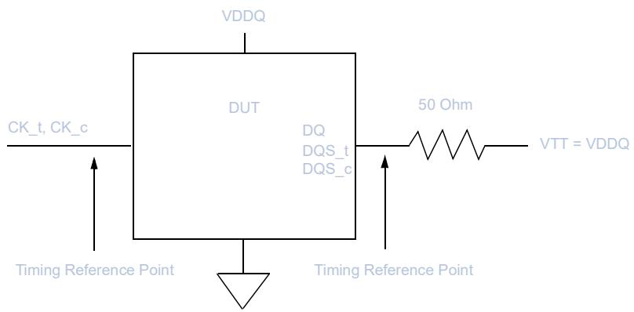  
Figure 215 — Reference Load for AC Timing and Output Slew Rate

# 13.2 Rounding Definitions and Algorithms

Software algorithms for calculation of timing parameters are subject to rounding errors from many sources. For example, a system may use a memory clock with a nominal frequency of  $2200\mathrm{MHz}$ , or a clock period of 0.454545... ns. Similarly, a system with a memory clock frequency of  $2800\mathrm{MHz}$  yields mathematically a clock period of 0.357142... ns. In most cases, it is impossible to express all digits after the decimal point exactly, and rounding must be done because the DDR5 SDRAM specification establishes a minimum granularity for timing parameters of 1 ps.

Rules for rounding must be defined to allow optimization of device performance without violating device parameters. These algorithms rely on results that are within correction factors on device testing and specification to avoid losing performance due to rounding errors. All timing parameters should be defined to align with the rules defined.

# These rules are:

Parameter values are to be defined to 1 ps of accuracy.  
- Clock periods such as tCKAVG(min) are rounded down (RD) to 1 ps of accuracy; for example, 0.454545... ns is defined as 454 ps and 0.357142... ns is defined as 357 ps.  
- Using real number math, parameters like tWRmin, tRCDmin, etc. which are programmed in systems in numbers of clocks (nCK) but expressed in units of time (in ns) are divided by the application clock period (in ns) (rounded down (RD) to the nearest ps) yielding a ratio of clock units (nCK), a correction factor of  $1\%$  or (0.01) is subtracted, then the result (is rounded up) and set to the next higher integer number of clocks:

$$
n C K = c e i l i n g \Big [ \Big (\frac {\mathrm {p a r a m e t e r \_ i n \_ n s}}{\mathrm {a p p l i c a t i o n \_ t C K \_ i n \_ n s \_ (R D)}} \Big) - 0. 0 1 \Big ]
$$

- Integer math is used in the industry to calculate nCK values by expressing timing values in ps based integers, scaling the specified parameter value up by 1000, dividing by the application clock period (rounded down (RD) to 1ps range), adding an inverse correction factor of  $99.0\%$  or (990), dividing the result by 1000, then truncating (same as integer math) down to the next lower integer value:

$$
n C K = t r u n c a t e \left[ \frac {\left(\frac {\mathrm {p a r a m e t e r \_ i n \_ p s \times 1 0 0 0}}{\mathrm {a p p l i c a t i o n \_ t C K \_ i n \_ p s \_ (R D)}}\right) + 9 9 0}{1 0 0 0} \right]
$$

- Either algorithm yields identical results. In case of conflict between results, the preferred algorithm is the integer math algorithm.  
- This algorithm applies to all timing parameters specified in ns when converting to nCK units.

# 13.2.1 Example 1, Using Integer Math to Convert  $t_{AA(\min)}$  from ns to nCK

This algorithm subtracts a  $1.0\%$  correction factor from nCK and rounds up to the next integer value. int MTB, FTB, TaaMin, ClockPeriod, TempNck, TaalnNck;

TaaMin = 16.250; (datarate = 3200)

Correction = 0.01

ClockPeriod = ApplicationTcklnNs (RD);

TempNck = TaaMin / ClockPeriod;

TempNck = TempNck - Correction;

TaalnNck = (int) ceiling(TempNck);

// tAAmin in ns

//  $1.0\%$ , per rounding algorithm

// Clock period is application specific

// Initial nCK calculation

// Subtract correction factor from nCK

//Ceiling to next higher integer value

Table 518 — Example 1, Using Integer Math  

<table><tr><td colspan="7">DDR5 Device Operating at Standard Application Frequencies Timing Parameter: tAA(min) = 16.250ns (3200)</td></tr><tr><td>Application Speed Grade</td><td>Device tAA</td><td>Application tCK (RD)</td><td>(Device tAA / Application tCK (RD))</td><td>0.1% Correction</td><td>(tAA / tCK (RD)) - Correction</td><td>Ceiling Result</td></tr><tr><td></td><td>ns</td><td>ns</td><td>ratio (real)</td><td>(real)</td><td>ratio (real)</td><td>nCK (Integer)</td></tr><tr><td>3200</td><td>16.250</td><td>0.625</td><td>26.000</td><td>0.01</td><td>25.990</td><td>26</td></tr><tr><td>3600</td><td>16.650</td><td>0.555</td><td>30.000</td><td>0.01</td><td>29.990</td><td>30</td></tr><tr><td>4000</td><td>16.000</td><td>0.500</td><td>32.000</td><td>0.01</td><td>31.990</td><td>32</td></tr><tr><td>4400</td><td>16.344</td><td>0.454</td><td>36.000</td><td>0.01</td><td>35.990</td><td>36</td></tr><tr><td>4800</td><td>16.640</td><td>0.416</td><td>40.000</td><td>0.01</td><td>39.990</td><td>40</td></tr></table>

# 13.2.2 Example 2, Using Integer Math to Convert  $t_{\text{WR(min)}}$  from ns to nCK

This algorithm adds  $99.0\%$  of an nCK and truncates down to the next lower integer value.

int MTB, FTB, TwrMin, ClockPeriod, TempNck, TwrlnNck;

TwrMin = 30000; (Data rate=3200)

ClockPeriod = ApplicationTcklnPs (RD);

TempNck = (TwrMin * 1000) / ApplicationTcklnPs;

TempNck = TempNck + 990;

TaalnNck = (int)(TempNck / 1000);

// tWRmin in ps

// Clock period is application specific

// Preliminary nCK calculation, scaled by 1000

// Apply  $99.0\%$  inverse correction factor

// Truncate to next lower integer

Table 519 — Example 2, Using Integer Math  

<table><tr><td colspan="6">DDR5 Device Operating at Standard Application Frequencies Timing Parameter: tWR(min) = 30ns = 30000ps</td></tr><tr><td>Application Speed Grade</td><td>Device tWR</td><td>Application tCK (RD)</td><td>(Device tWR * 1000) Application tCK</td><td>Add Inverse Correction</td><td>Truncate Corrected nCK / 1000</td></tr><tr><td></td><td>ps</td><td>ps</td><td>Scaled nCK</td><td>Scaled nCK</td><td>nCK (Integer)</td></tr><tr><td>3200</td><td>30000</td><td>625</td><td>48000</td><td>48990</td><td>48</td></tr><tr><td>3600</td><td>29970</td><td>555</td><td>54000</td><td>54990</td><td>54</td></tr><tr><td>4000</td><td>30000</td><td>500</td><td>60000</td><td>60990</td><td>60</td></tr><tr><td>4400</td><td>29964</td><td>454</td><td>66000</td><td>66990</td><td>66</td></tr><tr><td>4800</td><td>29952</td><td>416</td><td>72000</td><td>72990</td><td>72</td></tr><tr><td>5600</td><td>29988</td><td>357</td><td>84000</td><td>84990</td><td>84</td></tr></table>

# 13.3 Timing Parameters by Speed Grade

Analog timing parameters defined in this section are to be rounded to 1 ps of accuracy. Parameter min values which scale with tCKmin are to be defined using the tCKmin in the associated data rate.

# 13.3.1 Timing Parameters for DDR5-3200 to DDR5-4000

Table 520 — Timing Parameters for DDR5-3200 to DDR5-4000  

<table><tr><td colspan="2">Speed</td><td colspan="2">DDR5-3200</td><td colspan="2">DDR5-3600</td><td colspan="2">DDR5-4000</td><td rowspan="2">Units</td><td rowspan="2">NOTE</td></tr><tr><td>Parameter</td><td>Symbol</td><td>MIN</td><td>MAX</td><td>MIN</td><td>MAX</td><td>MIN</td><td>MAX</td></tr><tr><td colspan="10">Clock Timing</td></tr><tr><td>Average Clock Period</td><td>tCK(avg)</td><td>0.625</td><td>&lt;0.681</td><td>0.555</td><td>&lt;0.625</td><td>0.500</td><td>&lt;0.555</td><td></td><td>1</td></tr><tr><td colspan="10">Command and Address Timing</td></tr><tr><td>CAS_n to CAS_n command delay for same bank group</td><td>tCCD_L</td><td>Max(8nCK, 5ns)</td><td>-</td><td>Max(8nCK, 5ns)</td><td>-</td><td>Max(8nCK, 5ns)</td><td>-</td><td>nCK</td><td></td></tr><tr><td>WRITE CAS_n to WRITE CAS_n command delay for same bank group</td><td>tCCD_L_WR</td><td>Max(32nCK, 20ns)</td><td>-</td><td>Max(32nCK, 20ns)</td><td>-</td><td>Max(32nCK, 20ns)</td><td>-</td><td>nCK</td><td></td></tr><tr><td>WRITE CAS_n to WRITE CAS_n command delay for same bank group, second write not RMW</td><td>tCCD_L_WR2</td><td>Max(16nCK, 10ns)</td><td>-</td><td>Max(16nCK, 10ns)</td><td>-</td><td>Max(16nCK, 10ns)</td><td>-</td><td>nCK</td><td></td></tr><tr><td>CAS_n to CAS_n command delay for different bank group for BL16, BC8(fixed) and BC8(on-the-fly)</td><td>tCCD_S</td><td>8</td><td>-</td><td>8</td><td>-</td><td>8</td><td>-</td><td>nCK</td><td></td></tr><tr><td>ACTIVATE to ACTIVATE Command delay to different bank group for 2KB page size</td><td>tRRD_S(2K)</td><td>8</td><td>-</td><td>8</td><td>-</td><td>8</td><td>-</td><td>nCK</td><td></td></tr><tr><td>ACTIVATE to ACTIVATE Command delay to different bank group for 1KB page size</td><td>tRRD_S(1K)</td><td>8</td><td>-</td><td>8</td><td>-</td><td>8</td><td>-</td><td>nCK</td><td></td></tr><tr><td>ACTIVATE to ACTIVATE Command delay to same bank group for 2KB page size</td><td>tRRD_L(2K)</td><td>Max(8nCK, 5ns)</td><td>-</td><td>Max(8nCK, 5ns)</td><td>-</td><td>Max(8nCK, 5ns)</td><td>-</td><td>nCK</td><td></td></tr><tr><td>ACTIVATE to ACTIVATE Command delay to same bank group for 1KB page size</td><td>tRRD_L(1K)</td><td>Max(8nCK, 5ns)</td><td>-</td><td>Max(8nCK, 5ns)</td><td>-</td><td>Max(8nCK, 5ns)</td><td>-</td><td>nCK</td><td></td></tr><tr><td>Four activate window for 2KB page size</td><td>tFAW_2K</td><td>Max(40nCK, 25ns)</td><td>-</td><td>Max(40nCK, 22.200ns)</td><td>-</td><td>Max(40nCK, 20ns)</td><td>-</td><td>nCK</td><td>1</td></tr><tr><td>Four activate window for 1KB page size</td><td>tFAW_1K</td><td>Max(32nCK, 20ns)</td><td>-</td><td>Max(32nCK, 17.760ns)</td><td>-</td><td>Max(32nCK, 16ns)</td><td>-</td><td>nCK</td><td>1</td></tr><tr><td>Delay from start of internal write transaction to internal read command for different bank group</td><td>tWTR_S</td><td>Max(4nCK, 2.5ns)</td><td>-</td><td>Max(4nCK, 2.5ns)</td><td>-</td><td>Max(4nCK, 2.5ns)</td><td>-</td><td>ns</td><td></td></tr><tr><td>Delay from start of internal write transaction to internal read command for same bank group</td><td>tWTR_L</td><td>Max(16nCK, 10ns)</td><td>-</td><td>Max(16nCK, 10ns)</td><td>-</td><td>Max(16nCK, 10ns)</td><td>-</td><td>ns</td><td></td></tr><tr><td>Delay from start of internal write transaction to internal read with auto pre-charge command for same bank</td><td>tWTRA</td><td>=tWR-tRTP</td><td></td><td>=tWR-tRTP</td><td></td><td>=tWR-tRTP</td><td></td><td></td><td></td></tr><tr><td>Internal READ Command to PRE-CHARGE Command delay</td><td>tRTP</td><td>Max(12nCK, 7.5ns)</td><td>-</td><td>Max(12nCK, 7.5ns)</td><td>-</td><td>Max(12nCK, 7.5ns)</td><td>-</td><td>ns</td><td></td></tr><tr><td>PRECHARGE (PRE) to PRECHARGE (PRE) delay</td><td>tPPD</td><td>2</td><td></td><td>2</td><td></td><td>2</td><td></td><td>nCK(avg)</td><td></td></tr><tr><td>WRITE recovery time</td><td>tWR</td><td>30.000</td><td>-</td><td>29.970</td><td>-</td><td>30.000</td><td>-</td><td>ns</td><td></td></tr><tr><td colspan="10">NOTE 1 Timing Parameters that scale are rounded down to 1ps of accuracy.</td></tr></table>

# 13.3.2 Timing Parameters for DDR-4400 to DDR5-5200

Analog timing parameters defined in this section are to be rounded to 1 ps of accuracy. Parameter min values which scale with tCKmin are to be defined using the tCKmin in the associated data rate.

Table 521 — Timing Parameters for DDR5-4400 to DDR5-5200  

<table><tr><td colspan="2">Speed</td><td colspan="2">DDR5-4400</td><td colspan="2">DDR5-4800</td><td colspan="2">DDR5-5200</td><td rowspan="2">Units</td><td rowspan="2">NOTE</td></tr><tr><td>Parameter</td><td>Symbol</td><td>MIN</td><td>MAX</td><td>MIN</td><td>MAX</td><td>MIN</td><td>MAX</td></tr><tr><td colspan="10">Clock Timing</td></tr><tr><td>Average Clock Period</td><td>tCK(avg)</td><td>0.454</td><td>&lt;0.500</td><td>0.416</td><td>&lt;0.454</td><td>0.384</td><td>&lt;0.416</td><td></td><td>1</td></tr><tr><td colspan="10">Command and Address Timing</td></tr><tr><td>CAS_n to CAS_n command delay for same bank group</td><td>tCCD_L</td><td>max(8nCK, 5ns)</td><td>-</td><td>max(8nCK, 5ns)</td><td>-</td><td>max(8nCK, 5ns)</td><td>-</td><td>nCK</td><td></td></tr><tr><td>WRITE CAS_n to WRITE CAS_n command delay for same bank group</td><td>tCCD_L_WR</td><td>max(32nCK, 20ns)</td><td></td><td>max(32nCK, 20ns)</td><td></td><td>max(32nCK, 20ns)</td><td></td><td>ns</td><td></td></tr><tr><td>WRITE CAS_n to WRITE CAS_n command delay for same bank group, second write not RMW</td><td>tCCD_L_WR2</td><td>Max(16nCK, 10ns)</td><td>-</td><td>Max(16nCK, 10ns)</td><td>-</td><td>Max(16nCK, 10ns)</td><td>-</td><td>nCK</td><td></td></tr><tr><td>CAS_n to CAS_n command delay for different bank group</td><td>tCCD_S</td><td>8</td><td>-</td><td>8</td><td>-</td><td>8</td><td>-</td><td>nCK</td><td></td></tr><tr><td>ACTIVATE to ACTIVATE Command delay to different bank group for 2KB page size</td><td>tRRD_S(2K)</td><td>8</td><td>-</td><td>8</td><td>-</td><td>8</td><td>-</td><td>nCK</td><td></td></tr><tr><td>ACTIVATE to ACTIVATE Command delay to different bank group for 2KB page size</td><td>tRRD_S(1K)</td><td>8</td><td>-</td><td>8</td><td>-</td><td>8</td><td>-</td><td>nCK</td><td></td></tr><tr><td>ACTIVATE to ACTIVATE Command delay to same bank group for 2KB page size</td><td>tRRD_L(2K)</td><td>max(8nCK, 5ns)</td><td>-</td><td>max(8nCK, 5ns)</td><td>-</td><td>max(8nCK, 5ns)</td><td>-</td><td>nCK</td><td></td></tr><tr><td>ACTIVATE to ACTIVATE Command delay to same bank group for 1KB page size</td><td>tRRD_L(1K)</td><td>max(8nCK, 5ns)</td><td>-</td><td>max(8nCK, 5ns)</td><td>-</td><td>max(8nCK, 5ns)</td><td>-</td><td>nCK</td><td></td></tr><tr><td>Four activate window for 2KB page size</td><td>tFAW_2K</td><td>Max(40nCK, 18.160ns)</td><td></td><td>Max(40nCK, 16.640ns)</td><td></td><td>Max(40nCK, 15.360ns)</td><td>-</td><td>ns</td><td>1</td></tr><tr><td>Four activate window for 1KB page size</td><td>tFAW_1K</td><td>Max(32nCK, 14.528ns)</td><td></td><td>Max(32nCK, 13.312ns)</td><td></td><td>Max(32nCK, 12.288ns)</td><td>-</td><td>ns</td><td>1</td></tr><tr><td>Delay from start of internal write transaction to internal read command for different bank group</td><td>tWTR_S</td><td>Max(4nCK, 2.5ns)</td><td>-</td><td>Max(4nCK, 2.5ns)</td><td></td><td>2.5</td><td>-</td><td>ns</td><td></td></tr><tr><td>Delay from start of internal write transaction to internal read command for same bank group</td><td>tWTR_L</td><td>Max(16nCK, 10ns)</td><td>-</td><td>Max(16nCK, 10ns)</td><td></td><td>10</td><td>-</td><td>ns</td><td></td></tr><tr><td>Delay from start of internal write transaction to internal read command for same bank</td><td>tWTRA</td><td>=tWR-tRTP</td><td></td><td>=tWR-tRTP</td><td></td><td>=tWR-tRTP</td><td></td><td>ns</td><td></td></tr><tr><td>Internal READ Command to PRE-CHARGE Command delay</td><td>tRTP</td><td>Max(12nCK, 7.5ns)</td><td>-</td><td>Max(12nCK, 7.5ns)</td><td></td><td>7.5</td><td>-</td><td>ns</td><td></td></tr><tr><td>PRECHARGE (PRE) to PRECHARGE (PRE) delay</td><td>tPPD</td><td>2</td><td></td><td>2</td><td></td><td>2</td><td></td><td>nCK(avg)</td><td></td></tr><tr><td>WRITE recovery time</td><td>tWR</td><td>29.964</td><td>-</td><td>29.952</td><td>-</td><td>TBD</td><td>-</td><td>ns</td><td>1</td></tr><tr><td colspan="10">NOTE 1 Timing Parameters that scale are rounded down to 1ps of accuracy.</td></tr></table>

# 13.3.3 Timing Parameters for DDR-5600 to DDR5-6400

Analog timing parameters defined in this section are to be rounded to 1 ps of accuracy. Parameter min values which scale with tCKmin are to be defined using the tCKmin in the associated data rate.

Table 522 — Timing Parameters for DDR5-5600 to DDR5-6400  

<table><tr><td colspan="2">Speed</td><td colspan="2">DDR5-5600</td><td colspan="2">DDR5-6000</td><td colspan="2">DDR5-6400</td><td rowspan="2">Units</td><td rowspan="2">NOTE</td></tr><tr><td>Parameter</td><td>Symbol</td><td>MIN</td><td>MAX</td><td>MIN</td><td>MAX</td><td>MIN</td><td>MAX</td></tr><tr><td colspan="10">Clock Timing</td></tr><tr><td>Average Clock Period</td><td>tCK(avg)</td><td>0.357</td><td>&lt;0.384</td><td>0.333</td><td>&lt;0.357</td><td>0.312</td><td>&lt;0.333</td><td></td><td>1</td></tr><tr><td colspan="10">Command and Address Timing</td></tr><tr><td>CAS_n to CAS_n command delay for same bank group</td><td>tCCD_L</td><td>max(8nCK, 5ns)</td><td>-</td><td>max(8nCK, 5ns)</td><td>-</td><td>max(8nCK, 5ns)</td><td>-</td><td>nCK</td><td></td></tr><tr><td>WRITE CAS_n to WRITE CAS_n command delay for same bank group</td><td>tCCD_L_WR</td><td>max(32nCK, 20ns)</td><td></td><td>max(32nCK, 20ns)</td><td></td><td>max(32nCK, 20ns)</td><td></td><td>ns</td><td></td></tr><tr><td>WRITE CAS_n to WRITE CAS_n command delay for same bank group, second write not RMW</td><td>tCCD_L_WR2</td><td>Max(16nCK, 10ns)</td><td>-</td><td>Max(16nCK, 10ns)</td><td>-</td><td>Max(16nCK, 10ns)</td><td>-</td><td>nCK</td><td></td></tr><tr><td>CAS_n to CAS_n command delay for different bank group</td><td>tCCD_S</td><td>8</td><td>-</td><td>8</td><td>-</td><td>8</td><td>-</td><td>nCK</td><td></td></tr><tr><td>ACTIVATE to ACTIVATE Command delay to different bank group for 2KB page size</td><td>tRRD_S(2K)</td><td>8</td><td>-</td><td>8</td><td>-</td><td>8</td><td>-</td><td>nCK</td><td></td></tr><tr><td>ACTIVATE to ACTIVATE Command delay to different bank group for 2KB page size</td><td>tRRD_S(1K)</td><td>8</td><td>-</td><td>8</td><td>-</td><td>8</td><td>-</td><td>nCK</td><td></td></tr><tr><td>ACTIVATE to ACTIVATE Command delay to same bank group for 2KB page size</td><td>tRRD_L(2K)</td><td>max(8nCK, 5ns)</td><td>-</td><td>max(8nCK, 5ns)</td><td>-</td><td>max(8nCK, 5ns)</td><td>-</td><td>nCK</td><td></td></tr><tr><td>ACTIVATE to ACTIVATE Command delay to same bank group for 1KB page size</td><td>tRRD_L(1K)</td><td>max(8nCK, 5ns)</td><td>-</td><td>max(8nCK, 5ns)</td><td>-</td><td>max(8nCK, 5ns)</td><td>-</td><td>nCK</td><td></td></tr><tr><td>Four activate window for 2KB page size</td><td>tFAW_2K</td><td>Max(40nCK, 14.280ns)</td><td></td><td>Max(40nCK, 13.320ns)</td><td></td><td>Max(40nCK, 12.480ns)</td><td>-</td><td>ns</td><td>1</td></tr><tr><td>Four activate window for 1KB page size</td><td>tFAW_1K</td><td>Max(32nCK, 11.424ns)</td><td></td><td>Max(32nCK, 10.656ns)</td><td></td><td>Max(32nCK, 10.240ns)</td><td>-</td><td>ns</td><td>1</td></tr><tr><td>Delay from start of internal write transaction to internal read command for different bank group</td><td>tWTR_S</td><td>2.5</td><td></td><td>2.5</td><td></td><td>2.5</td><td>-</td><td>ns</td><td></td></tr><tr><td>Delay from start of internal write transaction to internal read command for same bank group</td><td>tWTR_L</td><td>10</td><td></td><td>10</td><td></td><td>10</td><td>-</td><td>ns</td><td></td></tr><tr><td>Delay from start of internal write transaction to internal read with auto pre-charge command for same bank</td><td>tWTRA</td><td>=tWR-tRTP</td><td></td><td>=tWR-tRTP</td><td></td><td>=tWR-tRTP</td><td></td><td>ns</td><td></td></tr><tr><td>Internal READ Command to PRE-CHARGE Command delay</td><td>tRTP</td><td>7.5</td><td></td><td>7.5</td><td></td><td>7.5</td><td>-</td><td>ns</td><td></td></tr><tr><td>PRECHARGE (PRE) to PRECHARGE (PRE) delay</td><td>tPPD</td><td>2</td><td></td><td>2</td><td></td><td>2</td><td></td><td>nCK(avg)</td><td></td></tr><tr><td>WRITE recovery time</td><td>tWR</td><td>TBD</td><td>-</td><td>TBD</td><td>-</td><td>TBD</td><td>-</td><td>ns</td><td></td></tr><tr><td colspan="10">NOTE 1 Timing Parameters that scale are rounded down to 1ps of accuracy.</td></tr></table>

# 13.3.4 Timing Parameters for DDR-6800 to DDR5-7600

Table 523 — Timing Parameters for DDR5-6800 to DDR5-7600  

<table><tr><td colspan="2">Speed</td><td colspan="2">DDR5-6800</td><td colspan="2">DDR5-7200</td><td colspan="2">DDR5-7600</td><td rowspan="2">Units</td><td rowspan="2">NOTE</td></tr><tr><td>Parameter</td><td>Symbol</td><td>MIN</td><td>MAX</td><td>MIN</td><td>MAX</td><td>MIN</td><td>MAX</td></tr><tr><td colspan="10">Command and Address Timing</td></tr><tr><td>CAS_n to CAS_n command delay for same bank group</td><td>tCCD_L</td><td>max(8nCK, 5ns)</td><td>-</td><td>max(8nCK, 5ns)</td><td>-</td><td>max(8nCK, 5ns)</td><td>-</td><td>nCK</td><td>34</td></tr><tr><td>WRITE CAS_n to WRITE CAS_n command delay for same bank group</td><td>tCCD_L_WR</td><td>max(32nCK, 20ns)</td><td></td><td>max(32nCK, 20ns)</td><td></td><td>max(32nCK, 20ns)</td><td></td><td>ns</td><td></td></tr><tr><td>CAS_n to CAS_n command delay for different bank group</td><td>tCCD_S</td><td>8</td><td>-</td><td>8</td><td>-</td><td>8</td><td>-</td><td>nCK</td><td>34</td></tr><tr><td>ACTIVATE to ACTIVATE Command delay to different bank group for 2KB page size</td><td>tRRD_S(2K)</td><td>8</td><td>-</td><td>8</td><td>-</td><td>8</td><td>-</td><td>nCK</td><td>34</td></tr><tr><td>ACTIVATE to ACTIVATE Command delay to different bank group for 2KB page size</td><td>tRRD_S(1K)</td><td>8</td><td>-</td><td>8</td><td>-</td><td>8</td><td>-</td><td>nCK</td><td>34</td></tr><tr><td>ACTIVATE to ACTIVATE Command delay to same bank group for 2KB page size</td><td>tRRD_L(2K)</td><td>max(8nCK, 5ns)</td><td>-</td><td>max(8nCK, 5ns)</td><td>-</td><td>max(8nCK, 5ns)</td><td>-</td><td>nCK</td><td>34</td></tr><tr><td>ACTIVATE to ACTIVATE Command delay to same bank group for 1KB page size</td><td>tRRD_L(1K)</td><td>max(8nCK, 5ns)</td><td>-</td><td>max(8nCK, 5ns)</td><td>-</td><td>max(8nCK, 5ns)</td><td>-</td><td>nCK</td><td>34</td></tr><tr><td>Four activate window for 2KB page size</td><td>tFAW_2K</td><td>Max(40nCK, xxns)</td><td></td><td>Max(40nCK, xxns)</td><td></td><td>Max(40nCK, xxns)</td><td>-</td><td>ns</td><td>34</td></tr><tr><td>Four activate window for 1KB page size</td><td>tFAW_1K</td><td>Max(32nCK, xxns)</td><td></td><td>Max(32nCK, xxns)</td><td></td><td>Max(32nCK, xxns)</td><td>-</td><td>ns</td><td>34</td></tr><tr><td>Delay from start of internal write trans-action to internal read command for different bank group</td><td>tWTR_S</td><td>2.5</td><td></td><td>2.5</td><td></td><td>2.5</td><td>-</td><td>ns</td><td>1,2,e,34</td></tr><tr><td>Delay from start of internal write trans-action to internal read command for same bank group</td><td>tWTR_L</td><td>10</td><td></td><td>10</td><td></td><td>10</td><td>-</td><td>ns</td><td>1,34</td></tr><tr><td>Internal READ Command to PRE-CHARGE Command delay</td><td>tRTP</td><td>7.5</td><td></td><td>7.5</td><td></td><td>7.5</td><td>-</td><td>ns</td><td></td></tr><tr><td>PRECHARGE (PRE) to PRECHARGE (PRE) delay</td><td>tPPD</td><td>2</td><td></td><td>2</td><td></td><td>2</td><td></td><td>nCK(avg)</td><td></td></tr><tr><td>WRITE recovery time</td><td>tWR</td><td>TBD</td><td>-</td><td>TBD</td><td>-</td><td>TBD</td><td>-</td><td>ns</td><td>1</td></tr></table>

# 13.3.5 Timing Parameters for DDR-8000 to DDR5-8400

Table 524 — Timing Parameters for DDR5-8000 to DDR5-8400  

<table><tr><td colspan="2">Speed</td><td colspan="2">DDR5-8000</td><td colspan="2">DDR5-8400</td><td rowspan="2">Units</td><td rowspan="2">NOTE</td></tr><tr><td>Parameter</td><td>Symbol</td><td>MIN</td><td>MAX</td><td>MIN</td><td>MAX</td></tr><tr><td colspan="8">Command and Address Timing</td></tr><tr><td>CAS_n to CAS_n command delay for same bank group</td><td>tCCD_L</td><td>max(8nCK, 5ns)</td><td>-</td><td>max(8nCK, 5ns)</td><td>-</td><td>nCK</td><td>34</td></tr><tr><td>WRITE CAS_n to WRITE CAS_n command delay for same bank group</td><td>tCCD_L_WR</td><td>max(32nCK, 20ns)</td><td></td><td>max(32nCK, 20ns)</td><td></td><td>ns</td><td></td></tr><tr><td>CAS_n to CAS_n command delay for different bank group</td><td>tCCD_S</td><td>8</td><td>-</td><td>8</td><td>-</td><td>nCK</td><td>34</td></tr><tr><td>ACTIVATE to ACTIVATE Command delay to different bank group for 2KB page size</td><td>tRRD_S(2K)</td><td>8</td><td>-</td><td>8</td><td>-</td><td>nCK</td><td>34</td></tr><tr><td>ACTIVATE to ACTIVATE Command delay to different bank group for 2KB page size</td><td>tRRD_S(1K)</td><td>8</td><td>-</td><td>8</td><td>-</td><td>nCK</td><td>34</td></tr><tr><td>ACTIVATE to ACTIVATE Command delay to same bank group for 2KB page size</td><td>tRRD_L(2K)</td><td>max(8nCK, 5ns)</td><td>-</td><td>max(8nCK, 5ns)</td><td>-</td><td>nCK</td><td>34</td></tr><tr><td>ACTIVATE to ACTIVATE Command delay to same bank group for 1KB page size</td><td>tRRD_L(1K)</td><td>max(8nCK, 5ns)</td><td>-</td><td>max(8nCK, 5ns)</td><td>-</td><td>nCK</td><td>34</td></tr><tr><td>Four activate window for 2KB page size</td><td>tFAW_2K</td><td>Max(40nCK, xxns)</td><td></td><td>Max(40nCK, xxns)</td><td></td><td>ns</td><td>34</td></tr><tr><td>Four activate window for 1KB page size</td><td>tFAW_1K</td><td>Max(32nCK, xxns)</td><td></td><td>Max(32nCK, xxns)</td><td></td><td>ns</td><td>34</td></tr><tr><td>Delay from start of internal write transaction to internal read command for different bank group</td><td>tWTR_S</td><td>2.5</td><td></td><td>2.5</td><td></td><td>ns</td><td>1,2,e,34</td></tr><tr><td>Delay from start of internal write transaction to internal read command for same bank group</td><td>tWTR_L</td><td>10</td><td></td><td>10</td><td></td><td>ns</td><td>1,34</td></tr><tr><td>Internal READ Command to PRECHARGE Command delay</td><td>tRTP</td><td>7.5</td><td></td><td>7.5</td><td></td><td>ns</td><td></td></tr><tr><td>PRECHARGE (PRE) to PRECHARGE (PRE) delay</td><td>tPPD</td><td>2</td><td></td><td>2</td><td></td><td>nCK(avg)</td><td></td></tr><tr><td>WRITE recovery time</td><td>tWR</td><td>TBD</td><td>-</td><td>TBD</td><td>-</td><td>ns</td><td>1</td></tr></table>

# 13.3.6 Timing Parameters for 3DS-DDR5-3200 to 3DS-DDR5-4000 x4 2H & 4H

Analog timing parameters defined in this section are to be rounded to 1 ps of accuracy. Parameter min values which scale with tCKmin are to be defined using the tCKmin in the associated data rate.

Table 525 — Timing Parameters for x4 2H & 4H 3DS-DDR5-3200 to 3DS-DDR5-4000  

<table><tr><td colspan="2">Speed</td><td colspan="2">DDR5-3200</td><td colspan="2">DDR5-3600</td><td colspan="2">DDR5-4000</td><td rowspan="2">Unit s</td><td rowspan="2">Notes</td></tr><tr><td>Parameter</td><td>Symbol</td><td>MIN</td><td>MAX</td><td>MIN</td><td>MAX</td><td>MIN</td><td>MAX</td></tr><tr><td colspan="10">Command and Address Timing for 3DS</td></tr><tr><td>Minimum Read to Read command delay for same bank group in same logical rank</td><td>tCCD_L_slr</td><td>Max(8nCK, 5ns)</td><td>-</td><td>Max(8nCK, 5ns)</td><td>-</td><td>Max(8nCK, 5ns)</td><td>-</td><td>nCK</td><td>4</td></tr><tr><td>Minimum Write to Write command delay for same bank group in same logical rank</td><td>tCCD_L_WR_slr</td><td>Max(32nCK, 20ns)</td><td>-</td><td>Max(32nCK, 20ns)</td><td>-</td><td>Max(32nCK, 20ns)</td><td>-</td><td>nCK</td><td>4</td></tr><tr><td>Minimum Read to Write command delay for same bank group in same logical rank</td><td>tCCD_L_RTW_slr</td><td colspan="6">CL - CWL + RBL/2 + 2tCK - (Read DQS offset) + (tRPST - 0.5tCK) + tWPRE</td><td></td><td>4,5,7,8</td></tr><tr><td>Minimum Write to Read command delay for same bank group in same logical rank</td><td>tCCD_L_WTR_slr</td><td colspan="6">CWL + WBL/2 + tWTR_L</td><td>nCK</td><td>4,6,8</td></tr><tr><td>Minimum Read to Read command delay for different bank group in same logical rank</td><td>tCCD_S_slr</td><td>8</td><td>-</td><td>8</td><td>-</td><td>8</td><td>-</td><td>nCK</td><td>4</td></tr><tr><td>Minimum Write to Write command delay for different bank group in same logical rank</td><td>tCCD_S_WR_slr</td><td>8</td><td>-</td><td>8</td><td>-</td><td>8</td><td>-</td><td>nCK</td><td>4</td></tr><tr><td>Minimum Read to Write command delay for different bank group in same logical rank</td><td>tCCD_S_RTW_slr</td><td colspan="6">CL - CWL + RBL/2 + 2tCK - (Read DQS offset) + (tRPST - 0.5tCK) + tWPRE</td><td></td><td>4,5,7,8</td></tr><tr><td>Minimum Write to Read command delay for different bank group in same logical rank</td><td>tCCD_S_WTR_slr</td><td colspan="6">CWL + WBL/2 + tWTR_S</td><td>nCK</td><td>4,6,8</td></tr><tr><td>Minimum Read to Read command delay in different logical ranks</td><td>tCCD_dlr</td><td>8</td><td>-</td><td>8</td><td>-</td><td>8</td><td>-</td><td>nCK</td><td>4</td></tr><tr><td>Minimum Write to Write command delay in different logical ranks</td><td>tCCD_WR_dlr</td><td>8</td><td>-</td><td>8</td><td>-</td><td>8</td><td>-</td><td>nCK</td><td>4,12</td></tr><tr><td>Minimum Write to Write command delay in different physical ranks</td><td>tCCD_WR_dpr</td><td>8</td><td>-</td><td>8</td><td>-</td><td>8</td><td>-</td><td>nCK</td><td>4,12,13</td></tr><tr><td>Minimum Read to Write command delay in different logical ranks</td><td>tCCD_RTW_dlr</td><td colspan="6">CL - CWL + RBL/2 + 2tCK - (Read DQS offset) + (tRPST - 0.5tCK) + tWPRE</td><td></td><td>4,5,7,8</td></tr><tr><td>Minimum Write to Read command delay in different logical ranks</td><td>tCCD_WTR_dlr</td><td colspan="6">CWL + WBL/2 + tWTR_S</td><td>nCK</td><td>4,6,8</td></tr><tr><td>ACTIVATE to ACTIVATE Command delay to different bank group in the same logical rank</td><td>tRRD_S_slr</td><td>8</td><td>-</td><td>8</td><td>-</td><td>8</td><td>-</td><td>nCK</td><td>4</td></tr><tr><td>ACTIVATE to ACTIVATE Command delay to same bank group in the same logical rank</td><td>tRRD_L_slr</td><td>Max(8nCK, 5ns)</td><td>-</td><td>Max(9nCK, 5ns)</td><td>-</td><td>Max(10nCK, 5ns)</td><td>-</td><td>nCK</td><td>4</td></tr><tr><td>ACTIVATE to ACTIVATE Command delay to different logical ranks</td><td>tRRD_dlr</td><td>4</td><td>-</td><td>4</td><td>-</td><td>4</td><td>-</td><td>nCK</td><td>4</td></tr><tr><td>Four activate window to the same logical rank</td><td>tFAW_slr</td><td>max(32nCK,20ns)</td><td>-</td><td>max(32nCK,17.760ns)</td><td>-</td><td>max(32nCK,16ns)</td><td>-</td><td>nCK</td><td>1,4,9</td></tr><tr><td>Four activate window to different logical ranks</td><td>tFAW_dlr</td><td>16</td><td>-</td><td>16</td><td>-</td><td>16</td><td>-</td><td>nCK</td><td>4</td></tr><tr><td>Activate window by DIMM channel</td><td>tDCAW</td><td>128</td><td>-</td><td>128</td><td>-</td><td>128</td><td>-</td><td>nCK</td><td>4,10,11,13</td></tr><tr><td>DIMM Channel Activate Command Count in tDCAW</td><td>nDCAC</td><td>-</td><td>32</td><td>-</td><td>32</td><td>-</td><td>32</td><td>ACT</td><td>4,10,11,13</td></tr></table>

Table 525 — Timing Parameters for x4 2H & 4H 3DS-DDR5-3200 to 3DS-DDR5-4000 (Cont'd)  

<table><tr><td colspan="2">Speed</td><td colspan="2">DDR5-3200</td><td colspan="2">DDR5-3600</td><td colspan="2">DDR5-4000</td><td rowspan="2">Unit S</td><td rowspan="2">Notes</td></tr><tr><td>Parameter</td><td>Symbol</td><td>MIN</td><td>MAX</td><td>MIN</td><td>MAX</td><td>MIN</td><td>MAX</td></tr><tr><td colspan="10">Reset/Self Refresh Timing</td></tr><tr><td>Exit Self Refresh to commands not requiring a locked DLL</td><td>tXS_3DS</td><td>max(5nCK, tRFC slr1(min) +10ns)</td><td>-</td><td>max(5nCK, tRFC slr1(min) +10ns)</td><td>-</td><td>max(5nCK, tRFC slr1(min) +10ns)</td><td>-</td><td></td><td>2,3,4</td></tr><tr><td colspan="10">NOTE 1 For x4 devices only. x8 device timings are TBD.</td></tr><tr><td colspan="10">NOTE 2 Upon exit from Self-Refresh, the 3D Stacked DDR5 SDRAM requires a minimum of one extra refresh command to all logical ranks before it is put back into Self-Refresh Mode.</td></tr><tr><td colspan="10">NOTE 3 This parameter utilizes a component that varies based on density. Refer to Section 4.13.5 for more information 3DS Refresh.</td></tr><tr><td colspan="10">NOTE 4 These timings are for x4 2H and 4H 3Ds devices</td></tr><tr><td colspan="10">NOTE 5 RBL: Read burst length associated with Read command RBL = 32 for fixed BL32 and BL32 in BL32 OTF mode RBL = 16 for fixed BL16 and BL16 in BL32 OTF mode RBL = 16 for BL16 in BC8 OTF mode and BC8 in BC8 OTF mode</td></tr><tr><td colspan="10">NOTE 6 WBL: Write burst length associated with Write command WBL = 32 for fixed BL32 and BL32 in BL32 OTF mode WBL = 16 for fixed BL16 and BL16 in BL32 OTF mode WBL = 16 for BL16 in BC8 OTF mode and BC8 in BC8 OTF mode</td></tr><tr><td colspan="10">NOTE 7 The following is considered for tRTW equation 1tCK needs to be added due to tDQS2CK Read DQS offset timing can pull in the tRTW timing 1tCK needs to be added when 1.5tCK postamble</td></tr><tr><td colspan="10">NOTE 8 CWL=CL-2</td></tr><tr><td colspan="10">NOTE 9 Timing Parameters that scale are rounded down to 1ps of accuracy.</td></tr><tr><td colspan="10">NOTE 10 Activate commands to different channels on the same DIMM may be issued on the same cycle, not requiring any stagger.</td></tr><tr><td colspan="10">NOTE 11 Activate commands to the same channel on a DIMM are subject to tDCAW. No more than nDCAC activate commands may be issued to the same channel on a DIMM within tDCAW.</td></tr><tr><td colspan="10">NOTE 12 tCCD_WR_dlr and tCCD_WR_dpr also apply to the WRITE PATTERN command.</td></tr><tr><td colspan="10">NOTE 13 Parameter applies to dual-physical-rank (36 and 40 placement) 3DS-based DIMMs built with JEDEC PMICXXXX, but may not apply to DIMMs built with higher current capacity PMICs</td></tr></table>

# 13.3.7 Timing Parameters for 3DS-DDR5-4400 to 3DS-DDR5-5200 x4 2H & 4H

Analog timing parameters defined in this section are to be rounded to 1 ps of accuracy. Parameter min values which scale with tCKmin are to be defined using the tCKmin in the associated data rate

Table 526 — Timing Parameters for x4 2H & 4H 3DS-DDR5-4400 to 3DS-DDR5-5200  

<table><tr><td colspan="2">Speed</td><td colspan="2">DDR5-4400</td><td colspan="2">DDR5-4800</td><td colspan="2">DDR5-5200</td><td rowspan="2">Units</td><td rowspan="2">Notes</td></tr><tr><td>Parameter</td><td>Symbol</td><td>MIN</td><td>MAX</td><td>MIN</td><td>MAX</td><td>MIN</td><td>MAX</td></tr><tr><td colspan="10">Command and Address Timing for 3DS</td></tr><tr><td>Minimum Read to Read command delay for same bank group in same logical rank</td><td>tCCD_L_slr</td><td>Max(8nCK, 5ns)</td><td>-</td><td>Max(8nCK, 5ns)</td><td>-</td><td>TBD</td><td>-</td><td>nCK</td><td>4</td></tr><tr><td>Minimum Write to Write command delay for same bank group in same logical rank</td><td>tCCD_L_WR_slr</td><td>Max(32nCK, 20ns)</td><td>-</td><td>Max(32nCK, 20ns)</td><td>-</td><td>TBD</td><td>-</td><td>nCK</td><td>4</td></tr><tr><td>Minimum Read to Write command delay for same bank group in same logical rank</td><td>tCCD_L_RTW_slr</td><td colspan="6">CL - CWL + RBL/2 + 2tCK - (Read DQS offset) + (tRPST - 0.5tCK) + tWPRE</td><td></td><td>4,5,7,8</td></tr><tr><td>Minimum Write to Read command delay for same bank group in same logical rank</td><td>tCCD_L_WTR_slr</td><td colspan="6">CWL + WBL/2 + tWTR_L</td><td>nCK</td><td>4,6,8</td></tr><tr><td>Minimum Read to Read command delay for different bank group in same logical rank</td><td>tCCD_S_slr</td><td>8</td><td>-</td><td>8</td><td>-</td><td>TBD</td><td>-</td><td>nCK</td><td>4</td></tr><tr><td>Minimum Write to Write command delay for different bank group in same logical rank</td><td>tCCD_S_WR_slr</td><td>8</td><td>-</td><td>8</td><td>-</td><td>TBD</td><td>-</td><td>nCK</td><td>4</td></tr><tr><td>Minimum Read to Write command delay for different bank group in same logical rank</td><td>tCCD_S_RTW_slr</td><td colspan="6">CL - CWL + RBL/2 + 2tCK - (Read DQS offset) + (tRPST - 0.5tCK) + tWPRE</td><td></td><td>4,5,7,8</td></tr><tr><td>Minimum Write to Read command delay for different bank group in same logical rank</td><td>tCCD_S_WTR_slr</td><td colspan="6">CWL + WBL/2 + tWTR_S</td><td>nCK</td><td>4,6,8</td></tr><tr><td>Minimum Read to Read command delay in different logical ranks</td><td>tCCD_dlr</td><td>8</td><td>-</td><td>8</td><td>-</td><td>TBD</td><td>-</td><td>nCK</td><td>4</td></tr><tr><td>Minimum Write to Write command delay in different logical ranks</td><td>tCCD_WR_dlr</td><td>8</td><td>-</td><td>8</td><td>-</td><td>TBD</td><td>-</td><td>nCK</td><td>4,12</td></tr><tr><td>Minimum Write to Write command delay in different physical ranks</td><td>tCCD_WR_dpr</td><td>8</td><td>-</td><td>8</td><td>-</td><td>8</td><td>-</td><td>nCK</td><td>4,12,13</td></tr><tr><td>Minimum Read to Write command delay in different logical ranks</td><td>tCCD_RTW_dlr</td><td colspan="6">CL - CWL + RBL/2 + 2tCK - (Read DQS offset) + (tRPST - 0.5tCK) + tWPRE</td><td></td><td>4,5,7,8</td></tr><tr><td>Minimum Write to Read command delay in different logical ranks</td><td>tCCD_WTR_dlr</td><td colspan="6">CWL + WBL/2 + tWTR_S</td><td>nCK</td><td>4,6,8</td></tr><tr><td>ACTIVATE to ACTIVATE Command delay to different bank group in the same logical rank</td><td>tRRD_S_slr</td><td>8</td><td>-</td><td>8</td><td>-</td><td>TBD</td><td>-</td><td>nCK</td><td>4</td></tr><tr><td>ACTIVATE to ACTIVATE Command delay to same bank group in the same logical rank</td><td>tRRD_L_slr</td><td>Max(11nCK, 5ns)</td><td>-</td><td>Max(12nCK, 5ns)</td><td>-</td><td>Max(13nCK, 5ns)</td><td>-</td><td>nCK</td><td>4</td></tr><tr><td>ACTIVATE to ACTIVATE Command delay to different logical ranks</td><td>tRRD_dlr</td><td>4</td><td>-</td><td>4</td><td>-</td><td>4</td><td>-</td><td>nCK</td><td>4</td></tr><tr><td>Four activate window to the same logical rank</td><td>tFAW_slr</td><td>max(32nCK,14.528ns)</td><td>-</td><td>max(32nCK,13.312ns)</td><td>-</td><td>max(32nCK,12.288ns)</td><td>-</td><td>nCK</td><td>1,4,9</td></tr><tr><td>Four activate window to different logical ranks</td><td>tFAW_dlr</td><td>16</td><td>-</td><td>16</td><td>-</td><td>16</td><td>-</td><td>nCK</td><td>4</td></tr><tr><td>Activate window by DIMM channel</td><td>tDCAW</td><td>128</td><td>-</td><td>128</td><td>-</td><td>128</td><td>-</td><td>nCK</td><td>4,10,11,13</td></tr><tr><td>DIMM Channel Activate Command Count in tDCAW</td><td>nDCAC</td><td>-</td><td>32</td><td>-</td><td>32</td><td>-</td><td>32</td><td>ACT</td><td>4,10,11,13</td></tr></table>

Table 526 — Timing Parameters for x4 2H & 4H 3DS-DDR5-4400 to 3DS-DDR5-5200 (Cont'd)  

<table><tr><td colspan="2">Speed</td><td colspan="2">DDR5-4400</td><td colspan="2">DDR5-4800</td><td colspan="2">DDR5-5200</td><td rowspan="2">Units</td><td rowspan="2">Notes</td></tr><tr><td>Parameter</td><td>Symbol</td><td>MIN</td><td>MAX</td><td>MIN</td><td>MAX</td><td>MIN</td><td>MAX</td></tr><tr><td colspan="10">Reset/Self Refresh Timing</td></tr><tr><td>Exit Self Refresh to commands not requiring a locked DLL</td><td>tXS_3DS</td><td>max(5nCK, tRFC slr1(min) +10ns)</td><td>-</td><td>max(5nCK, tRFC slr1(min) +10ns)</td><td>-</td><td>max(5nCK, tRFC slr1(min) +10ns)</td><td>-</td><td></td><td>2,3,4</td></tr><tr><td colspan="10">NOTE 1 For x4 devices only. x8 device timings are TBD.</td></tr><tr><td colspan="10">NOTE 2 Upon exit from Self-Refresh, the 3D Stacked DDR5 SDRAM requires a minimum of one extra refresh command to all logical ranks before it is put back into Self-Refresh Mode.</td></tr><tr><td colspan="10">NOTE 3 This parameter utilizes a component that varies based on density. Refer to Section 4.13.5 for more information 3DS Refresh.</td></tr><tr><td colspan="10">NOTE 4 These timings are for x4 2H and 4H 3Ds devices</td></tr><tr><td colspan="10">NOTE 5 RBL: Read burst length associated with Read command RBL = 32 for fixed BL32 and BL32 in BL32 OTF mode RBL = 16 for fixed BL16 and BL16 in BL32 OTF mode RBL = 16 for BL16 in BC8 OTF mode and BC8 in BC8 OTF mode</td></tr><tr><td colspan="10">NOTE 6 WBL: Write burst length associated with Write command WBL = 32 for fixed BL32 and BL32 in BL32 OTF mode WBL = 16 for fixed BL16 and BL16 in BL32 OTF mode WBL = 16 for BL16 in BC8 OTF mode and BC8 in BC8 OTF mode</td></tr><tr><td colspan="10">NOTE 7 The following is considered for tRTW equation 1tCK needs to be added due to tDQS2CK Read DQS offset timing can pull in the tRTW timing 1tCK needs to be added when 1.5tCK postamble</td></tr><tr><td colspan="10">NOTE 8 CWL=CL-2</td></tr><tr><td colspan="10">NOTE 9 Timing Parameters that scale are rounded down to 1ps of accuracy.</td></tr><tr><td colspan="10">NOTE 10 Activate commands to different channels on the same DIMM may be issued on the same cycle, not requiring any stagger.</td></tr><tr><td colspan="10">NOTE 11 Activate commands to the same channel on a DIMM are subject to tDCAW. No more than nDCAC activate commands may be issued to the same channel on a DIMM within tDCAW.</td></tr><tr><td colspan="10">NOTE 12 tCCD_WR_dlr and tCCD_WR_dpr also apply to the WRITE PATTERN command.</td></tr><tr><td colspan="10">NOTE 13 Parameter applies to dual-physical-rank (36 and 40 placement) 3DS-based DIMMs built with JEDEC PMICXXXX, but may not apply to DIMMs built with higher current capacity PMICs</td></tr></table>

# 13.3.8 Timing Parameters for 3DS-DDR5-5600 to 3DS-DDR5-6400 x4 2H & 4H

Analog timing parameters defined in this section are to be rounded to 1 ps of accuracy. Parameter min values which scale with tCKmin are to be defined using the tCKmin in the associated data rate

Table 527 — Timing Parameters for x4 2H & 4H 3DS-DDR5-5600 to 3DS-DDR5-6400  

<table><tr><td colspan="2">Speed</td><td colspan="2">DDR5-5600</td><td colspan="2">DDR5-6000</td><td colspan="2">DDR5-6400</td><td rowspan="2">Units</td><td rowspan="2">Notes</td></tr><tr><td>Parameter</td><td>Symbol</td><td>MIN</td><td>MAX</td><td>MIN</td><td>MAX</td><td>MIN</td><td>MAX</td></tr><tr><td colspan="10">Command and Address Timing for 3DS</td></tr><tr><td>Minimum Read to Read command delay for same bank group in same logical rank</td><td>tCCD_L_slr</td><td>Max(8nCK, 5ns)</td><td>-</td><td>Max(8nCK, 5ns)</td><td>-</td><td>TBD</td><td>-</td><td>nCK</td><td>4</td></tr><tr><td>Minimum Write to Write command delay for same bank group in same logical rank</td><td>tCCD_L_WR_slr</td><td>Max(32nCK, 20ns)</td><td>-</td><td>Max(32nCK, 20ns)</td><td>-</td><td>TBD</td><td>-</td><td>nCK</td><td>4</td></tr><tr><td>Minimum Read to Write command delay for same bank group in same logical rank</td><td>tCCD_L_RTW_slr</td><td colspan="6">CL - CWL + RBL/2 + 2tCK - (Read DQS offset) + (tRPST - 0.5tCK) + tWPRE</td><td></td><td>4,5,7,8</td></tr><tr><td>Minimum Write to Read command delay for same bank group in same logical rank</td><td>tCCD_L_WTR_slr</td><td colspan="6">CWL + WBL/2 + tWTR_L</td><td>nCK</td><td>4,6,8</td></tr><tr><td>Minimum Read to Read command delay for different bank group in same logical rank</td><td>tCCD_S_slr</td><td>8</td><td>-</td><td>8</td><td>-</td><td>8</td><td>-</td><td>nCK</td><td>4</td></tr><tr><td>Minimum Write to Write command delay for different bank group in same logical rank</td><td>tCCD_S_WR_slr</td><td>8</td><td>-</td><td>8</td><td>-</td><td>8</td><td>-</td><td>nCK</td><td>4</td></tr><tr><td>Minimum Read to Write command delay for different bank group in same logical rank</td><td>tCCD_S_RTW_slr</td><td colspan="6">CL - CWL + RBL/2 + 2tCK - (Read DQS offset) + (tRPST - 0.5tCK) + tWPRE</td><td></td><td>4,5,7,8</td></tr><tr><td>Minimum Write to Read command delay for different bank group in same logical rank</td><td>tCCD_S_WTR_slr</td><td colspan="6">CWL + WBL/2 + tWTR_S</td><td>nCK</td><td>4,6,8</td></tr><tr><td>Minimum Read to Read command delay in different logical ranks</td><td>tCCD_dlr</td><td>8</td><td>-</td><td>8</td><td>-</td><td>8</td><td>-</td><td>nCK</td><td>4</td></tr><tr><td>Minimum Write to Write command delay in different logical ranks</td><td>tCCD_S_WR_dlr</td><td>8</td><td>-</td><td>8</td><td>-</td><td>8</td><td>-</td><td>nCK</td><td>4</td></tr><tr><td>Minimum Read to Write command delay in different logical ranks</td><td>tCCD_RTW_dlr</td><td colspan="6">CL - CWL + RBL/2 + 2tCK - (Read DQS offset) + (tRPST - 0.5tCK) + tWPRE</td><td></td><td>4,5,7,8</td></tr><tr><td>Minimum Write to Read command delay in different logical ranks</td><td>tCCD_WTR_dlr</td><td colspan="6">CWL + WBL/2 + tWTR_S</td><td>nCK</td><td>4,6,8</td></tr><tr><td>ACTIVATE to ACTIVATE Command delay to different bank group in the same logical rank</td><td>tRRD_S_slr</td><td>TBD</td><td>-</td><td>TBD</td><td>-</td><td>TBD</td><td>-</td><td>nCK</td><td>4</td></tr><tr><td>ACTIVATE to ACTIVATE Command delay to same bank group in the same logical rank</td><td>tRRD_L_slr</td><td>TBD</td><td>-</td><td>TBD</td><td>-</td><td>TBD</td><td>-</td><td>nCK</td><td>4</td></tr><tr><td>ACTIVATE to ACTIVATE Command delay to different logical ranks</td><td>tRRD_dlr</td><td>4</td><td>-</td><td>4</td><td>-</td><td>4</td><td>-</td><td>nCK</td><td>4</td></tr><tr><td>Four activate window to the same logical rank</td><td>tFAW_slr</td><td>max(32nCK,xxns)</td><td>-</td><td>max(32nCK,xxns)</td><td>-</td><td>max(32nCK,xxns)</td><td>-</td><td>nCK</td><td>1,4,9</td></tr><tr><td>Four activate window to different logical ranks</td><td>tFAW_dlr</td><td>16</td><td>-</td><td>16</td><td>-</td><td>16</td><td>-</td><td>nCK</td><td>4</td></tr></table>

Table 527 — Timing Parameters for x4 2H & 4H 3DS-DDR5-5600 to 3DS-DDR5-6400 (Cont'd)  

<table><tr><td colspan="2">Speed</td><td colspan="2">DDR5-5600</td><td colspan="2">DDR5-6000</td><td colspan="2">DDR5-6400</td><td rowspan="2">Units</td><td rowspan="2">Notes</td></tr><tr><td>Parameter</td><td>Symbol</td><td>MIN</td><td>MAX</td><td>MIN</td><td>MAX</td><td>MIN</td><td>MAX</td></tr><tr><td colspan="10">Reset/Self Refresh Timing</td></tr><tr><td>Exit Self Refresh to commands not requiring a locked DLL</td><td>tXS_3DS</td><td>max(5nCK, tRFC_sir1(min) +10ns)</td><td>-</td><td>max(5nCK, tRFC_sir1(min) +10ns)</td><td>-</td><td>max(5nCK, tRFC_sir1(min) +10ns)</td><td>-</td><td></td><td>2,3,4</td></tr><tr><td colspan="10">NOTE 1 For x4 devices only. x8 device timings are TBD.</td></tr><tr><td colspan="10">NOTE 2 Upon exit from Self-Refresh, the 3D Stacked DDR5 SDRAM requires a minimum of one extra refresh command to all logical ranks before it is put back into Self-Refresh Mode.</td></tr><tr><td colspan="10">NOTE 3 This parameter utilizes a component that varies based on density. Refer to the 3DS Refresh section for more information.</td></tr><tr><td colspan="10">NOTE 4 These timings are for x4 2H and 4H 3Ds devices</td></tr><tr><td colspan="10">NOTE 5 RBL: Read burst length associated with Read command</td></tr><tr><td colspan="10">RBL = 32 for fixed BL32 and BL32 in BL32 OTF mode</td></tr><tr><td colspan="10">RBL = 16 for fixed BL16 and BL16 in BL32 OTF mode</td></tr><tr><td colspan="10">RBL = 16 for BL16 in BC8 OTF mode and BC8 in BC8 OTF mode</td></tr><tr><td colspan="10">NOTE 6 WBL: Write burst length associated with Write command</td></tr><tr><td colspan="10">WBL = 32 for fixed BL32 and BL32 in BL32 OTF mode</td></tr><tr><td colspan="10">WBL = 16 for fixed BL16 and BL16 in BL32 OTF mode</td></tr><tr><td colspan="10">WBL = 16 for BL16 in BC8 OTF mode and BC8 in BC8 OTF mode</td></tr><tr><td colspan="10">NOTE 7 The following is considered for tRTW equation</td></tr><tr><td colspan="10">1tCK needs to be added due to tDQS2CK</td></tr><tr><td colspan="10">Read DQS offset timing can pull in the tRTW timing</td></tr><tr><td colspan="10">1tCK needs to be added when 1.5tCK postamble</td></tr><tr><td colspan="10">NOTE 8 CWL=CL-2</td></tr><tr><td colspan="10">NOTE 9 Timing Parameters that scale are rounded down to 1ps of accuracy.</td></tr></table>

# 14.1 Module Rank and Channel Limitations for DDR5 DIMMs

To achieve efficient module power supply design for JEDEC-standard DDR5 DIMMs, minimum timings as well as limitations in the number of DRAMs are provided for Refresh, and Write operations occurring on a single module. As well, since these modules are organized as two independent 36-bit or 40-bit channels (32 bits for non-ECC DIMMs), additional restrictions apply in order to limit localized power delivery noise on the module. To provide best performance, the different channels may initiate commands on the same cycle provided the rank to rank timings are met, the maximum number of DRAMs in a given activity is not exceeded, and the applicable component timings shown elsewhere in this specification are met. The timing and operational relationships for DDR5 DIMMs are shown in Table 528.

Table 528 — DDR5 Module Rank and Channel Timings for DDR5 DIMMs  

<table><tr><td rowspan="3">DIMM Configuration</td><td colspan="4">Maximum number of DRAM die in simultaneous or overlapping activity</td></tr><tr><td colspan="2">Refresh (All-Bank Refresh)</td><td colspan="2">Write, Write-Pattern</td></tr><tr><td>Die per Physical Rank</td><td>Die per DIMM</td><td>Die per Channel</td><td>Die per DIMM</td></tr><tr><td>SR x16</td><td colspan="4">No restriction</td></tr><tr><td>DR x16</td><td colspan="2">No restriction</td><td>2</td><td>4</td></tr><tr><td>SR x8</td><td colspan="4">No restriction</td></tr><tr><td>DR x8</td><td colspan="2">No restriction</td><td>5</td><td>10</td></tr><tr><td>SR x4</td><td colspan="4">No restriction</td></tr><tr><td>DR x4</td><td colspan="2">No restriction</td><td>10</td><td>20</td></tr><tr><td>DR x4 (2H 3DS)</td><td>No restriction</td><td>40</td><td>10</td><td>20</td></tr><tr><td>DR x4 (4H 3DS)</td><td>30</td><td>40</td><td>10</td><td>20</td></tr><tr><td>DR x4 (8H 3DS)</td><td>30</td><td>40</td><td>10</td><td>20</td></tr><tr><td>Notes</td><td colspan="2">1, 2, 3, 4, 7, 8, 9</td><td colspan="2">1, 5, 6, 7, 9</td></tr><tr><td colspan="5">NOTE 1 Any combination of commands with up to the maximum of die per channel and per DIMM, per condition is allowed.</td></tr><tr><td colspan="5">NOTE 2 Refresh commands to different channels do not require stagger.</td></tr><tr><td colspan="5">NOTE 3 tRFC_dlr must be met for refresh commands to different logical ranks within a package rank on the same channel.</td></tr><tr><td colspan="5">NOTE 4 Any DRAM is considered to be in Refresh mode until tRFC time has been met.</td></tr><tr><td colspan="5">NOTE 5 tCCD parameters must be met for Write and Write-Pattern commands to different logical ranks or physical ranks within the same channel; no overlapping write data bus activity is allowed on two physical or logical ranks within the same channel.</td></tr><tr><td colspan="5">NOTE 6 Write and Write-Pattern commands to different channels do not require stagger.</td></tr><tr><td colspan="5">NOTE 7 Each rank consists of one group of DRAMs making up a 36 or 40 bit channel (32 bits for non-ECC DIMMs).</td></tr><tr><td colspan="5">NOTE 8 These restrictions only apply to explicit all-banks refresh commands (REFab) and not to self-refresh entry or exit</td></tr><tr><td colspan="5">NOTE 9 Restrictions apply to DIMMs built with JEDEC PMICXXXX, but may not apply to DIMMs built with higher current capacity PMICs</td></tr></table>

# Annex A Clock, DQS and DQ Validation Methodology

*THIS AREA IS SUBJECT TO CHANGE BASED ON SUPPLIER FEEDBACK*

# A.1 Overview

This Annex describes the methodologies for validating specifications described in this document. Note that some of the methodologies in this document may reference qualitative means (for example, "slowly", "a lot"). In such cases this document attempts to give some guidance as to what quantitative term should be assigned to those qualitative statements. However, it must be noted that the numbers assigned are not absolute.

# A.2 Validation Equipment

Most of the voltage and timing measurements are performed using real time scopes and/or Bit Error Rate (BER) testers.

A.2.1 Oscilloscope  
A.2.2 Bit Error Rate Tester (BERT)  
A.3 DDR5 DRAM Input Clock Jitter Validation  
A.3.1 Validation of DRAM Input Clock Jitter Specifications

# Standard Improvement Form

# JEDEC

The purpose of this form is to provide the Technical Committees of JEDEC with input from the industry regarding usage of the subject standard. Individuals or companies are invited to submit comments to JEDEC. All comments will be collected and dispersed to the appropriate committee(s).

If you can provide input, please complete this form and return to:

JEDEC

Fax: 703.907.7583

Attn: Publications Department

3103 North  $10^{\text{th}}$  Street

Suite 240 South

Arlington, VA 22201-2107

1. I recommend changes to the following:


Requirement, clause number

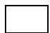

Test method number Clause number

The referenced clause number has proven to be:

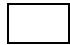

Unclear Too Rigid


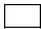

Other

2. Recommendations for correction:

3. Other suggestions for document improvement:

Submitted by

Name:

Phone:

Company:

E-mail:

Address:

City/State/Zip:

Date:

# JEDEC®